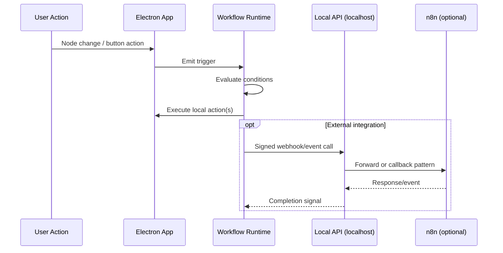
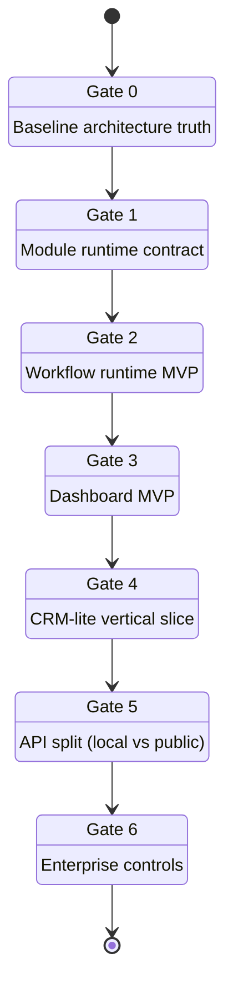
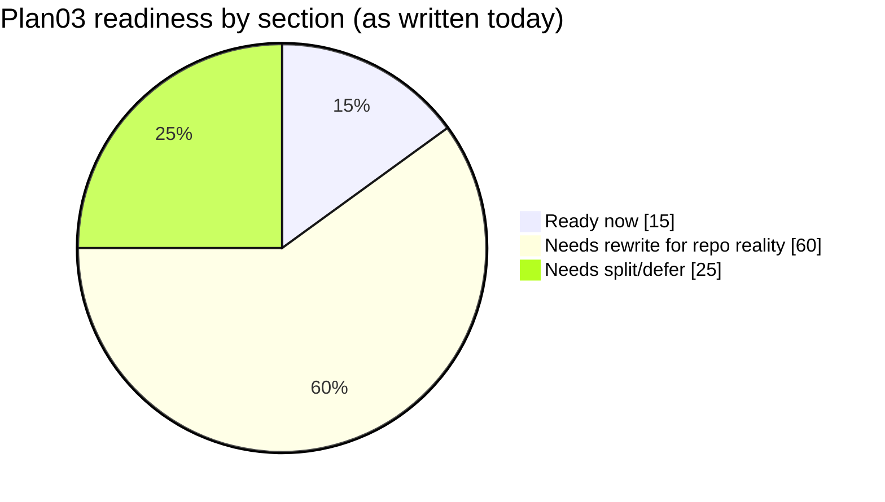
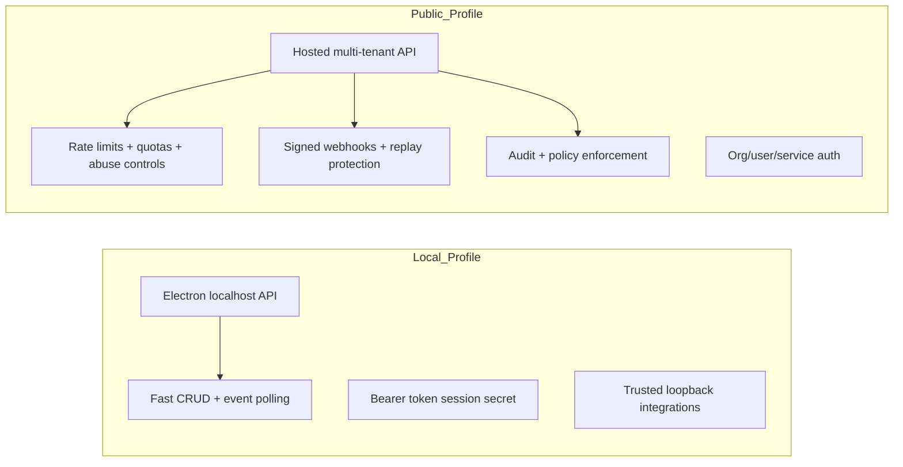

# 0096 [ _ ] Plan03 ERP Reality Check and Execution Reset

Date: 2026-03-01
Author: OpenCode
Status: Draft exploration

## Executive Take

`docs/plans/plan03ERP/` is directionally strong, but now functions more like a target-state architecture than an implementation-ready sequence for the current repository state.

The highest-value move is **not** to execute plan03 literally. Instead:

1. re-baseline on what already exists in `packages/*` and Electron,
2. close a small set of platform gaps first (module contract, workflow engine, dashboard package boundary),
3. ship one thin vertical slice (CRM-lite) on top of existing primitives,
4. defer enterprise-scale surfaces (SSO/SCIM/OAuth bridge/marketplace) behind explicit readiness gates.

This preserves velocity while avoiding a large speculative package explosion.

---

## Scope and Method

This exploration audited all files in `docs/plans/plan03ERP/` and mapped them to current codebase reality.

### Plan inputs reviewed

- `docs/plans/plan03ERP/README.md`
- `docs/plans/plan03ERP/00-overview.md`
- `docs/plans/plan03ERP/01-module-system.md`
- `docs/plans/plan03ERP/02-workflow-engine.md`
- `docs/plans/plan03ERP/03-dashboard-builder.md`
- `docs/plans/plan03ERP/04-plugin-system.md`
- `docs/plans/plan03ERP/05-crm-module.md`
- `docs/plans/plan03ERP/06-hrm-module.md`
- `docs/plans/plan03ERP/07-inventory-module.md`
- `docs/plans/plan03ERP/08-finance-module.md`
- `docs/plans/plan03ERP/09-api-gateway.md`
- `docs/plans/plan03ERP/10-enterprise-features.md`
- `docs/plans/plan03ERP/11-timeline.md`

### Current-code evidence sampled

- Package inventory: `packages/*/package.json`
- Views/type primitives: `packages/views/src/types.ts`
- Plugin runtime/lifecycle: `packages/plugins/src/manifest.ts`, `packages/plugins/src/registry.ts`
- Plugin script sandbox: `packages/plugins/src/sandbox/sandbox.ts`
- Local integration API: `packages/plugins/src/services/local-api.ts`, `apps/electron/src/main/local-api.ts`
- Hub server and platform services: `packages/hub/src/server.ts`
- ERP-adjacent data templates: `packages/data/src/database/templates/builtin.ts`
- Vector/canvas prerequisites: `packages/vectors/README.md`, `packages/canvas/README.md`
- Existing plugin UI surface: `apps/electron/src/renderer/components/PluginManager.tsx`

### External references consulted

- OWASP API Security Top 10 (2023): `https://owasp.org/API-Security/editions/2023/en/0x00-toc/`
- RFC 9421 (HTTP Message Signatures): `https://www.rfc-editor.org/rfc/rfc9421`
- NIST SP 800-207 (Zero Trust Architecture): `https://csrc.nist.gov/publications/detail/sp/800-207/final`
- RFC 7644 (SCIM Protocol): `https://www.rfc-editor.org/rfc/rfc7644`
- PostgreSQL partitioning guidance: `https://www.postgresql.org/docs/current/ddl-partitioning.html`
- Serverless Workflow spec landscape: `https://github.com/serverlessworkflow/specification`

---

## Reality Snapshot

### Planned vs actual package surface

```mermaid
flowchart LR
  subgraph Plan03_Target
    pmod[@xnetjs/modules]
    pwf[@xnetjs/workflows]
    pdash[@xnetjs/dashboard]
    papi[@xnetjs/api]
    pent[@xnetjs/enterprise]
    pmods[modules/* business packages]
  end

  subgraph Current_Repo
    data[@xnetjs/data]
    react[@xnetjs/react]
    views[@xnetjs/views]
    plugins[@xnetjs/plugins]
    hub[@xnetjs/hub]
    canvas[@xnetjs/canvas]
    vectors[@xnetjs/vectors]
    electron[apps/electron]
  end

  data --> react
  data --> views
  plugins --> electron
  plugins --> data
  plugins --> react
  hub --> data
  canvas --> data
  vectors --> data

  pmod -.missing as package.- data
  pwf -.missing as package.- plugins
  pdash -.missing as package.- views
  papi -.missing as package.- hub
  pent -.missing as package.- hub
  pmods -.missing directory.- electron
```

### Document readiness map

| Plan doc               | Intent                                 | Current status                                                              | Assessment                                                   |
| ---------------------- | -------------------------------------- | --------------------------------------------------------------------------- | ------------------------------------------------------------ |
| 00-overview            | ERP architecture framing               | Useful but stale package/module topology                                    | Keep as vision, rewrite implementation section               |
| 01-module-system       | Module lifecycle and registry          | Partial analog via plugin registry                                          | Build minimal module contract before business modules        |
| 02-workflow-engine     | Trigger/condition/action orchestration | Local API + plugin sandbox exist; no dedicated workflow engine package      | Build core workflow runtime first, defer large builder UX    |
| 03-dashboard-builder   | Widget framework + cross-filtering     | View system exists; no dashboard package boundary                           | Start with dashboard-as-schema over existing views           |
| 04-plugin-system       | Secure plugins + marketplace           | Core plugin lifecycle and sandbox already implemented                       | Focus on permission hardening + distribution model           |
| 05-08 business modules | CRM/HRM/Inventory/Finance              | Template-level seeds exist; no module packages                              | Ship CRM-lite first as schema/workflow/view bundle           |
| 09-api-gateway         | Public REST + OAuth + webhooks         | Local API exists in Electron; hub has HTTP/WS infra                         | Split local integration API vs public multi-tenant API track |
| 10-enterprise-features | SSO/RBAC/audit/tenant isolation        | Foundational identity/hub primitives exist; no dedicated enterprise package | Treat as separate program, not phase tail work               |
| 11-timeline            | Week-by-week rollout                   | No longer realistic with current repo topology                              | Replace with gate-based roadmap                              |

---

## What Is Already Strong (and should be reused)

1. **Node/Schema foundation is real and production-relevant**
   - `@xnetjs/data` plus NodeStore-centric patterns are already reflected throughout plan text and repo.
2. **All 6 view types already exist as first-class type surface**
   - `packages/views/src/types.ts:17` defines `table | board | gallery | timeline | calendar | list`.
3. **Plugin lifecycle and extension contribution registry are implemented**
   - Manifest validation and lifecycle: `packages/plugins/src/manifest.ts`, `packages/plugins/src/registry.ts`.
4. **Script sandbox has meaningful safety controls**
   - AST validation + timeout + output sanitization: `packages/plugins/src/sandbox/sandbox.ts`.
5. **Local integration API exists and is securable**
   - Token-based localhost API server: `packages/plugins/src/services/local-api.ts` and Electron wiring in `apps/electron/src/main/local-api.ts`.
6. **ERP-adjacent starter templates already exist**
   - CRM/inventory/finance template categories in `packages/data/src/database/templates/builtin.ts`.

---

## Primary Gaps To Close Before "ERP"

1. **No explicit module runtime package boundary**
   - There is no `@xnetjs/modules` package and no `modules/` directory in current workspace.
2. **No dedicated workflow execution engine package**
   - Plan assumes rich orchestration, retries, schedules, and builders; codebase currently has pieces but no unified engine.
3. **No dashboard package contract**
   - Views exist; dashboard orchestration and widget catalog are not yet a standalone platform capability.
4. **Plugin system and plan assumptions diverge**
   - Plan leans toward iframe marketplace model; current runtime centers on in-process contributions + script sandbox.
5. **API gateway conflates two distinct concerns**
   - Local desktop integration API != externally hosted enterprise API surface.
6. **Enterprise scope is too broad for tail-end phase work**
   - SSO + SCIM + audit + tenant isolation should be treated as a parallel/security-governed program.

---

## Architecture Delta and Recommended Target

### Recommended near-term architecture (incremental)

```mermaid
flowchart TD
  subgraph Existing_Core
    DATA[@xnetjs/data]
    VIEWS[@xnetjs/views]
    PLUG[@xnetjs/plugins]
    HUB[@xnetjs/hub]
    REACT[@xnetjs/react]
  end

  subgraph Add_Now
    MODR[ModuleRuntime in @xnetjs/plugins or new thin @xnetjs/modules]
    WFR[WorkflowRuntime thin package]
    DASHR[Dashboard schema + runtime adapters]
  end

  subgraph Add_Later
    BIZ[Business module bundles]
    PUBAPI[Public API gateway]
    ENT[Enterprise pack: SSO/RBAC/Audit/Tenant]
  end

  DATA --> MODR
  PLUG --> MODR
  MODR --> WFR
  VIEWS --> DASHR
  WFR --> DASHR
  MODR --> BIZ
  HUB --> PUBAPI
  PUBAPI --> ENT
```

### Workflow posture: practical split



### Gate-based roadmap (replacing rigid week ranges)



---

## Recommendations by Plan Section

### 00-01 (Overview + Module System)

- Keep conceptual model, but redefine module as a **bundle contract** first (schemas, views, workflows, settings, nav contributions).
- Implement a thin module registry on top of existing plugin registry patterns, not a net-new heavy framework.
- Remove hard dependency on a `modules/` directory until packaging format is finalized.

### 02 (Workflow Engine)

- Start with deterministic, auditable trigger-condition-action runtime.
- Treat n8n as optional external executor, not the primary orchestration substrate.
- Persist workflow definitions/executions as Nodes and add idempotency + retries.

### 03 (Dashboard Builder)

- Build dashboard configs as schemas + reusable widget adapters over existing view/query primitives.
- Delay advanced freeform layout and broad custom widgets until data contracts stabilize.

### 04 (Plugin System)

- Reconcile doc with reality: plugin runtime exists; marketplace/distribution trust model is the missing part.
- Align permission vocabulary with current Node-centric model and validate against OWASP API misuse patterns.

### 05-08 (Business Modules)

- Do not implement four full modules in parallel.
- Ship CRM-lite first, then promote shared primitives (pipeline states, assignment, activity streams, approvals) into reusable module SDK pieces.

### 09 (API Gateway)

- Split into two tracks:
  - local integration API (desktop/edge),
  - public hosted API (tenant, policy, quotas, key rotation, signed webhooks).
- Adopt message-signing profile guidance from RFC 9421 for webhook/API integrity where relevant.

### 10 (Enterprise Features)

- Define enterprise minimum: audit trail + policy enforcement + tenant boundary checks before SAML breadth.
- Stage SCIM provisioning (RFC 7644) after RBAC model and actor/tenant domain model are stable.

### 11 (Timeline)

- Replace week estimates with capability gates and explicit exit criteria.
- Tie each gate to measurable latency/reliability/security metrics.

---

## Risk Register (Top)

| Risk                                             | Impact | Likelihood | Mitigation                                                     |
| ------------------------------------------------ | ------ | ---------- | -------------------------------------------------------------- |
| Building too many net-new packages early         | High   | High       | Start with thin runtime layers over existing packages          |
| Workflow complexity before core contracts settle | High   | Medium     | MVP runtime first, visual builder later                        |
| Plugin security model drift                      | High   | Medium     | Enforce explicit permission model + signed extension manifests |
| Local API treated as public API                  | High   | Medium     | Separate operational profiles, auth, and threat models         |
| Enterprise scope creep                           | High   | High       | Enterprise gated as separate program with security sign-off    |

---

## Readiness Scoring

This score is intentionally conservative and reflects "ready for implementation as written" rather than "good direction".



### Gate entry/exit criteria (operational)

| Gate                   | Entry criteria                                                   | Exit criteria                                                                      | Primary artifacts                        |
| ---------------------- | ---------------------------------------------------------------- | ---------------------------------------------------------------------------------- | ---------------------------------------- |
| G0 Baseline            | Plan03 docs reviewed; package inventory confirmed                | Rebaseline doc published; stale package refs removed                               | `docs/plans/plan03ERP/12-rebaseline.md`  |
| G1 Module runtime      | Bundle contract drafted; plugin registry extension points mapped | Install/upgrade/uninstall semantics tested; module manifest schema frozen v1       | module manifest schema, runtime registry |
| G2 Workflow runtime    | Trigger and action abstractions defined                          | 3 trigger types, retry/idempotency, persisted executions, failure semantics tested | workflow schemas + runtime package       |
| G3 Dashboard MVP       | Widget data contract defined                                     | Dashboard schema persisted as Nodes; 3 core widgets + refresh + filter wiring      | dashboard schema + renderer adapters     |
| G4 CRM-lite            | G1-G3 green; schema naming convention frozen                     | Contacts/companies/deals/activities workflow slice passes acceptance               | CRM-lite module bundle                   |
| G5 API split           | Local API and hosted API threat models documented                | Distinct authn/authz, quotas, and signature policies implemented                   | local/public API profiles                |
| G6 Enterprise controls | Audit and RBAC grammar stable                                    | Audit coverage >= agreed threshold; tenant-boundary tests pass; SSO pilot complete | enterprise controls package/docs         |

---

## API Track Split (Detailed)



### Security baselines for each API profile

| Area              | Local profile (desktop)                     | Public profile (hosted)                            |
| ----------------- | ------------------------------------------- | -------------------------------------------------- |
| Network boundary  | `127.0.0.1` bind only                       | Internet-facing ingress                            |
| Authn             | Session-scoped bearer token acceptable      | Strong identity binding; short-lived tokens        |
| Authz             | Minimal scope + user-controlled local trust | Tenant/resource scoped policy with deny-by-default |
| Rate limiting     | Optional/light                              | Mandatory per key/user/IP and per route class      |
| Request integrity | Optional internal signing                   | Strongly recommended RFC 9421-style profile        |
| Replay mitigation | Best effort                                 | Required timestamp/nonce window checks             |
| Audit             | Useful                                      | Mandatory for sensitive operations                 |

---

## Plan Rewrite Backlog (File-by-file)

| File                                             | Required rewrite level | Specific changes                                                            |
| ------------------------------------------------ | ---------------------- | --------------------------------------------------------------------------- |
| `docs/plans/plan03ERP/README.md`                 | High                   | Replace package quick reference with current + target split; add gate model |
| `docs/plans/plan03ERP/00-overview.md`            | Medium                 | Keep vision, update architecture diagram to incremental reality             |
| `docs/plans/plan03ERP/01-module-system.md`       | High                   | Recast around bundle contract and runtime over current plugin primitives    |
| `docs/plans/plan03ERP/02-workflow-engine.md`     | High                   | Introduce MVP runtime first; move n8n to optional integration chapter       |
| `docs/plans/plan03ERP/03-dashboard-builder.md`   | Medium                 | Shift from package-first to schema-first dashboard definitions              |
| `docs/plans/plan03ERP/04-plugin-system.md`       | High                   | Align permission taxonomy and runtime model with current implementation     |
| `docs/plans/plan03ERP/05-crm-module.md`          | Medium                 | Trim to CRM-lite first release and shared primitive extraction              |
| `docs/plans/plan03ERP/06-hrm-module.md`          | Medium                 | Move behind CRM-lite; identify dependencies on shared primitives            |
| `docs/plans/plan03ERP/07-inventory-module.md`    | Medium                 | Sequence after shared workflow + dashboard maturity                         |
| `docs/plans/plan03ERP/08-finance-module.md`      | Medium                 | Gate by audit/RBAC readiness and document/reporting reliability             |
| `docs/plans/plan03ERP/09-api-gateway.md`         | High                   | Split local/public profiles and attach security control matrix              |
| `docs/plans/plan03ERP/10-enterprise-features.md` | High                   | Convert to enterprise program charter with acceptance controls              |
| `docs/plans/plan03ERP/11-timeline.md`            | High                   | Replace calendar timeline with gate + dependency + acceptance model         |

---

## Suggested Acceptance Tests Per Gate

### G1/G2 (module + workflow runtime)

- [ ] Install/upgrade/uninstall lifecycle integration test with persisted nodes.
- [ ] Retry semantics test proves idempotency under duplicate trigger delivery.
- [ ] Execution log contains actor, trigger source, action outcome.

### G3/G4 (dashboard + CRM-lite)

- [ ] Dashboard widgets reflect Node changes within SLO target window.
- [ ] Cross-filter behavior tested across at least two widget types.
- [ ] CRM pipeline transition triggers workflow side effect exactly once.

### G5/G6 (API/public + enterprise controls)

- [ ] Local API cannot be reached from non-loopback interfaces.
- [ ] Public API enforces tenant isolation in positive and negative tests.
- [ ] Webhook signature verification and replay rejection tests are green.
- [ ] Audit completeness test ensures sensitive routes emit audit entries.

---

## Implementation Checklist

### Phase A - Re-baseline (must complete first)

- [ ] Publish an updated plan03 index with "target-state" vs "implemented" markers.
- [ ] Add canonical package map and remove stale imports/examples (`@xnetjs/database`, etc.).
- [ ] Define module bundle contract (manifest + schemas + views + workflows + settings).

### Phase B - Core runtime closure

- [ ] Add module registry/runtime abstraction (thin, testable, no marketplace dependency).
- [ ] Implement workflow runtime MVP (manual trigger, node-change trigger, schedule trigger).
- [ ] Persist workflow executions with status, retries, and error payload.
- [ ] Add dashboard definition schema and baseline widgets (metric, table/list, chart).

### Phase C - Vertical slice

- [ ] Ship CRM-lite using reusable contracts (contacts, companies, deals, activities).
- [ ] Ensure workflows operate across CRM entities.
- [ ] Provide at least one dashboard template driven by live CRM nodes.

### Phase D - Integration and enterprise prep

- [ ] Split local integration API profile from public API profile.
- [ ] Add webhook signing/replay protection profile.
- [ ] Introduce audit event schema and mandatory writes for sensitive actions.
- [ ] Define RBAC permission grammar for Node operations and workflow execution.

---

## Validation Checklist

### Functional

- [ ] Module install/upgrade/uninstall keeps data integrity.
- [ ] Workflow triggers execute deterministically and are cancelable.
- [ ] Dashboard widgets refresh from Node changes without manual reload.
- [ ] CRM-lite supports contact/company/deal lifecycle end-to-end.

### Security

- [ ] Plugin permissions are enforced per action/resource.
- [ ] Local API token auth is required in non-test mode.
- [ ] Webhook verification includes signature + replay-window checks.
- [ ] Audit logs capture actor, action, resource, outcome.

### Performance and reliability

- [ ] Trigger-to-action p95 latency under agreed SLO.
- [ ] Dashboard load p95 under agreed SLO with representative dataset.
- [ ] Retry/backoff prevents duplicate side effects (idempotency checks).
- [ ] Failure-path tests verify partial-failure recovery.

### Suggested command set

- [ ] `pnpm typecheck`
- [ ] `pnpm lint`
- [ ] `pnpm test`
- [ ] Targeted package tests for changed areas (for example `pnpm --filter @xnetjs/plugins test`)

---

## Concrete Next Actions

1. Create `plan03ERP/12-rebaseline.md` that supersedes timeline assumptions with gate-based execution.
2. Draft `@xnetjs/modules` as a thin contract package (or formally embed this in `@xnetjs/plugins` and document why).
3. Implement workflow runtime MVP with three trigger types and execution persistence.
4. Deliver CRM-lite as first proof that module + workflow + dashboard contracts are viable.
5. Defer SSO/SCIM/public API gateway breadth until Gate 4 passes.

---

## Appendix: Notable Reality Anchors

- Planned six view types prerequisite is already represented in type surface: `packages/views/src/types.ts:17`.
- Plugin lifecycle management is implemented today: `packages/plugins/src/registry.ts`.
- Script sandbox already has AST checks and timeout protections: `packages/plugins/src/sandbox/sandbox.ts`.
- Local API exists with token authentication and localhost binding defaults: `packages/plugins/src/services/local-api.ts`, `apps/electron/src/main/local-api.ts`.
- ERP-adjacent templates already exist (CRM, inventory, finance categories): `packages/data/src/database/templates/builtin.ts`.
