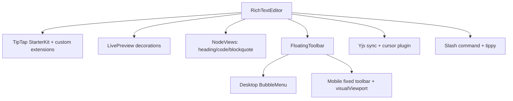
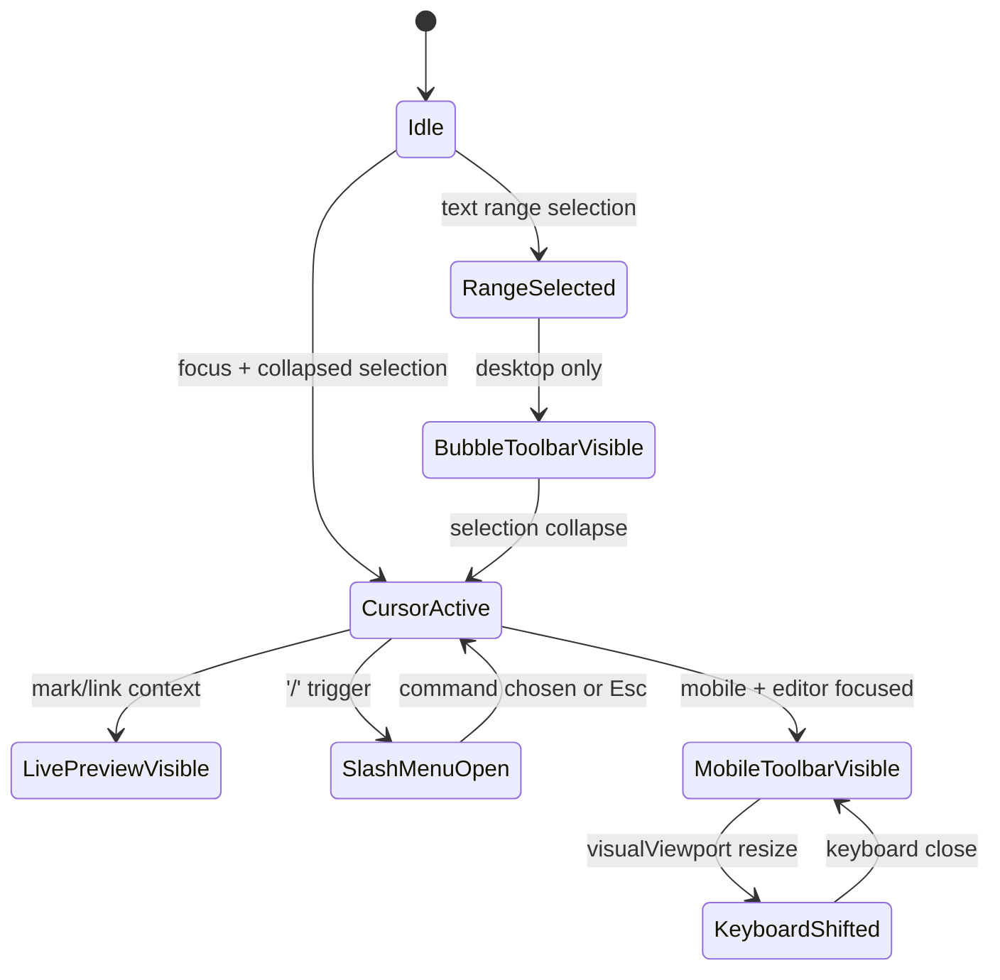
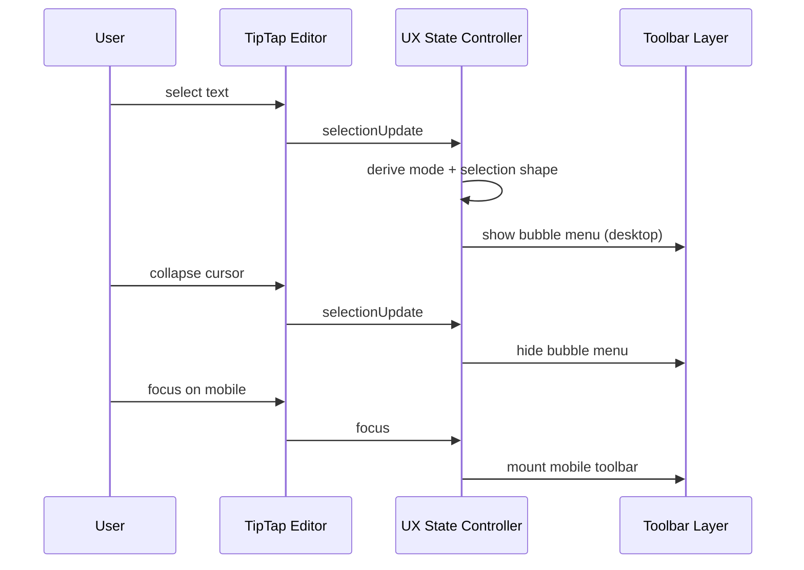
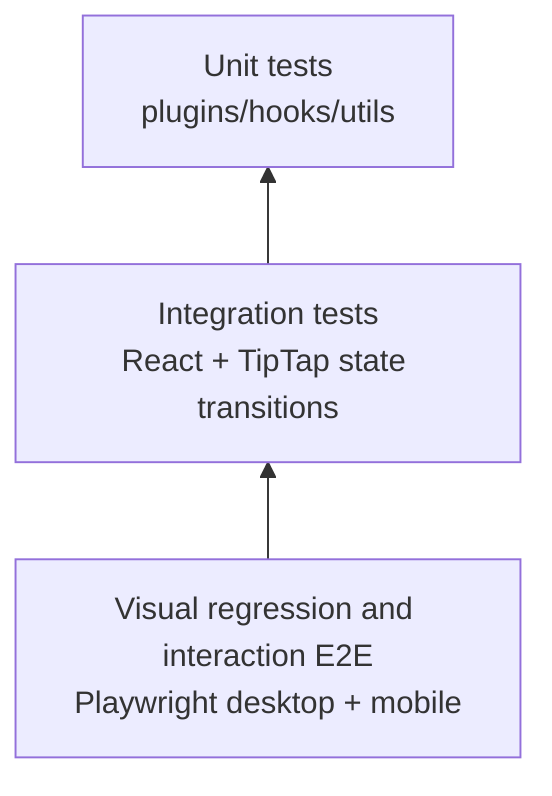

# 0097 [ _ ] TipTap Editor Style and UX Hardening (Web Desktop + Mobile)

Date: 2026-03-02
Author: OpenCode
Status: Draft exploration

## Executive Take

`@xnet/editor` already has strong fundamentals (custom nodeviews, slash menu, drag handle, Yjs collaboration), but the “glitchy” feel is likely coming from **interaction timing gaps** and **state/viewport transitions**, not missing feature breadth.

The highest-leverage strategy is:

1. harden interaction state machines (selection/focus/toolbar/keyboard),
2. reduce layout volatility in live preview + nodeviews,
3. add deterministic desktop/mobile Playwright coverage with visual and behavioral assertions,
4. enforce a UX quality gate (no regressions on latency, stability, and keyboard flows).

---

## Scope and Method

This exploration combines codebase analysis + web references and focuses on practical, testable UX parity with Obsidian/Notion patterns.

### Codebase evidence reviewed

- Editor core: `packages/editor/src/components/RichTextEditor.tsx`
- Toolbar behavior: `packages/editor/src/components/FloatingToolbar.tsx`
- Base styles: `packages/editor/src/styles/editor.css`
- Live preview plugins: `packages/editor/src/extensions/live-preview/index.ts`, `packages/editor/src/extensions/live-preview/inline-marks.ts`, `packages/editor/src/extensions/live-preview/link-preview.ts`
- Node focus logic: `packages/editor/src/nodeviews/hooks/useNodeFocus.ts`
- NodeViews: `packages/editor/src/nodeviews/HeadingView.tsx`, `packages/editor/src/nodeviews/CodeBlockView.tsx`, `packages/editor/src/nodeviews/BlockquoteView.tsx`
- Slash UI: `packages/editor/src/components/SlashMenu/index.tsx`, `packages/editor/src/extensions/slash-command/index.ts`
- Current editor tests: `packages/editor/src/components/RichTextEditor.test.tsx`
- E2E baseline: `tests/e2e/playwright.config.ts`, `tests/e2e/helpers/test-auth.ts`, `tests/e2e/src/pages-crud.spec.ts`

### External references consulted

- TipTap BubbleMenu docs: `https://tiptap.dev/docs/editor/extensions/functionality/bubble-menu`
- TipTap events docs: `https://tiptap.dev/docs/editor/api/events`
- ProseMirror reference (selection/plugin/decorations): `https://prosemirror.net/docs/ref/`
- Notion keyboard shortcuts: `https://www.notion.com/help/keyboard-shortcuts`
- Notion writing/editing behavior: `https://www.notion.com/help/writing-and-editing-basics`
- MDN VisualViewport: `https://developer.mozilla.org/en-US/docs/Web/API/VisualViewport`
- Obsidian help entry points (formatting/properties pages):
  - `https://help.obsidian.md/Editing+and+formatting/Basic+formatting+syntax`
  - `https://help.obsidian.md/Editing+and+formatting/Properties`

---

## Current State Snapshot

### What is already good

- Rich extension surface is mature (slash, callouts, toggle, embeds, files/images, comments, collaboration).
- Obsidian-like syntax reveal is already implemented for inline marks + links.
- Mobile toolbar concept exists and uses `visualViewport`.
- Collaboration cursor registration already guards keyed plugin duplication.

### Where the “glitchy” feel likely comes from

1. **Focus boundary fragility in nodeviews**
   - `useNodeFocus` uses strict bounds (`from > pos && to < nodeEnd`), which can flicker on edge cursor positions and during rapid selection transitions.
2. **Layout jank in code-block syntax reveal**
   - Code fences animate `max-h`/padding/border, which can shift vertical layout and perceived cursor stability.
3. **Mobile keyboard anchoring assumptions**
   - Keyboard open heuristic (`viewport.height < window.innerHeight * 0.75`) can fail across browsers/devices and cause toolbar jumps.
4. **Limited behavioral tests for toolbar state transitions**
   - Existing `RichTextEditor.test.tsx` validates render basics, but not complex desktop/mobile interaction transitions.
5. **No mobile projects in e2e config**
   - `tests/e2e/playwright.config.ts` only has desktop Chromium/WebKit; no iPhone/Android emulation quality gate.

---

## UX Parity Targets (Obsidian + Notion)

### Interaction principles to lock in

- **No layout surprise while typing**: syntax hints can fade, but block geometry should remain stable.
- **Selection-driven affordance timing**: bubble menu appears quickly and predictably, never “chasing” selection.
- **Mobile-first keyboard anchoring**: toolbar remains reachable, never overlaps text caret target area.
- **Slash command confidence**: deterministic keyboard nav, no accidental dismissal on quick typing.
- **Block controls consistency**: drag handles and block actions appear with clear focus/hover rules.

### UX state model

---

## Recommended Architecture Adjustments

### 1) Stabilize interaction state in one place

Introduce an editor UX state controller (lightweight extension or hook) that normalizes:

- selection shape (`collapsed` vs `range` vs `node`),
- focus state,
- platform mode (`desktop` vs `mobile`),
- keyboard viewport state.

This avoids ad-hoc conditions spread across toolbar/nodeviews/plugins.

### 2) Shift from geometry animations to opacity/transform-only where possible

- For syntax affordances: prefer reserved-space or absolute-position overlays.
- Avoid animating properties that relayout main document flow (`max-height`, padding toggles) during typing.

### 3) Harden node focus boundaries

- Adjust `useNodeFocus` from strict interior checks to inclusive behavior aligned with ProseMirror selection edge cases.
- Add explicit tests for cursor at start/end of heading/code/blockquote nodes.

### 4) Make mobile keyboard handling capability-based

- Keep `visualViewport`, but fallback with robust guards.
- Track `offsetTop`, `height`, and optional `scrollend` to reduce oscillation.
- Add platform-specific thresholds via config instead of hard-coded 0.75.

### 5) Add deterministic command + toolbar lifecycle events

Leverage TipTap events (`selectionUpdate`, `focus`, `blur`, `transaction`) to unify UI updates and telemetry points.

---

## Test Strategy: “Works Really Well” on Web Desktop + Mobile

### Best-practice guardrails

- Treat this as an **interaction reliability** project, not a feature-expansion project.
- Keep changes incremental and observable; avoid large refactors without instrumentation.
- For browser automation in this repo, always enable auth bypass before assertions (`setupTestAuth(page)`).
- Add/keep deterministic `data-testid` hooks for unstable selectors in toolbar/slash/mobile states.
- Prefer behavior assertions first, then visual snapshots as regression backstops.

### Test pyramid for editor UX

### A) Unit and integration (in `packages/editor`)

Add targeted tests for:

- `useNodeFocus` edge boundaries (start/end cursor positions).
- `FloatingToolbar` mode transitions (`auto`, `desktop`, `mobile`) with mocked viewport/touch.
- keyboard visibility heuristics (`visualViewport` resize/scroll scenarios).
- slash menu keyboard behavior with empty and non-empty item lists.
- live preview stability around nested marks and rapid cursor movement.

### B) E2E desktop + mobile in `tests/e2e`

Update Playwright projects to include:

- Desktop Chrome
- Desktop Safari (already present)
- Mobile Chrome emulation (Pixel 7)
- Mobile Safari emulation (iPhone 14/15)

#### Suggested project config direction

- Keep existing desktop projects.
- Add mobile projects with `isMobile`, touch, and viewport presets from Playwright `devices`.

### C) UX acceptance scenarios (must-pass)

1. **Desktop selection toolbar**
   - select text -> bubble menu appears within target latency
   - collapse selection -> bubble menu hides cleanly
2. **Slash command behavior**
   - `/` opens menu
   - arrow keys navigate
   - Enter applies command
   - Esc closes without side effects
3. **Live preview stability**
   - entering/exiting bold/italic/code/link does not shift line baseline unexpectedly
4. **Mobile keyboard + toolbar**
   - focusing editor shows toolbar
   - opening keyboard does not overlap active editing area
   - toolbar remains tappable and does not jump excessively
5. **Block editing transitions**
   - heading/code/blockquote focus affordances are smooth at node boundaries

### D) Quality thresholds (definition of done)

- Bubble menu visibility transition p95 under 120ms after selection settle.
- Mobile toolbar reposition event-to-stable-frame under 150ms on emulated devices.
- Editor UX suites pass with <=1% flake rate over 50 CI runs.
- No new uncaught console errors in editor UX specs.

### E) Visual regression snapshots

Capture stable screenshots for:

- idle editor,
- selected-text bubble menu,
- slash menu open,
- mobile keyboard-open toolbar anchored state,
- focused code block fence state.

Store artifacts in `tmp/playwright/` and assert snapshots in CI only after baseline approval.

---

## Implementation Plan (phased)

```mermaid
gantt
  title Editor UX Hardening Phases
  dateFormat  X
  axisFormat %s

  section Phase 1 - State Stabilization
  UX state controller + focus boundary fixes :a1, 0, 3
  Toolbar mode normalization                :a2, 2, 3

  section Phase 2 - Motion/Layout Polish
  Reduce layout-shifting animations         :b1, 4, 3
  NodeView transition tuning                :b2, 5, 2

  section Phase 3 - Test Expansion
  Unit/integration additions                :c1, 6, 3
  Playwright mobile projects + specs        :c2, 7, 4

  section Phase 4 - Quality Gate
  Visual baseline + CI thresholds           :d1, 10, 2
```

---

## Implementation Checklist

### Phase 1 - Interaction State Hardening

- [x] Add a centralized UX state derivation layer (selection/focus/platform/keyboard).
- [x] Refine `useNodeFocus` boundary logic for cursor edge positions.
- [x] Normalize toolbar visibility rules around `NodeSelection` vs text range.
- [x] Replace hard-coded mobile heuristic constants with configurable thresholds.

### Phase 2 - Style and Motion Polish

- [x] Minimize layout-affecting transitions in code fence/blockquote/heading affordances.
- [x] Ensure syntax reveal uses stable geometry (overlay/reserved-space strategy).
- [x] Align spacing/typography/toolbar rhythm with a single tokenized editor theme contract.
- [x] Validate reduced-motion behavior for all editor animation paths.

### Phase 3 - Automated Test Coverage

- [x] Add unit tests for node focus boundaries and keyboard visibility logic.
- [x] Add integration tests for toolbar mode transitions and slash interactions.
- [x] Extend Playwright config with mobile Chrome + mobile Safari projects.
- [x] Add editor-specific e2e scenarios for desktop and mobile.
- [x] Add visual snapshot tests for critical interaction states.

### Phase 4 - CI Quality Gates

- [x] Run editor package tests in CI with stricter pass criteria for interaction suites.
- [x] Run e2e editor smoke tests on desktop and mobile projects.
- [x] Fail CI on visual diff regressions after baseline is accepted.
- [x] Track flaky tests and enforce stabilization before merge.

---

## Validation Checklist

### Functional UX

- [x] Bubble toolbar appears/disappears deterministically on desktop selection changes.
- [x] Slash menu keyboard navigation is fully deterministic.
- [x] Live preview does not produce disruptive line jumps while typing.
- [x] NodeView focus affordances are stable at start/end cursor boundaries.

### Mobile UX

- [x] Toolbar stays visible and reachable with keyboard open.
- [x] Keyboard transitions do not cause toolbar overlap/jitter.
- [x] Touch interactions (tap/long-press/select) preserve editor focus correctly.
- [x] iOS and Android emulations both pass core scenarios.

### Accessibility and Input Safety

- [x] Keyboard-only flows work for toolbar/slash interactions.
- [x] `prefers-reduced-motion` mode is respected in all editor interactions.
- [x] Focus visibility and ARIA expectations remain intact after hardening.

### Reliability and Performance

- [x] No flaky failures across repeated desktop/mobile e2e runs.
- [x] Interaction latency remains within acceptable thresholds.
- [x] No console errors during core editing scenarios.
- [x] CI flake-rate budget stays below agreed threshold (target: <=1%).

---

## Recommended Next Actions

1. Implement Phase 1 first (state and boundary stability), because it removes most “glitch” perception at source.
2. Expand Playwright projects to mobile emulation immediately after Phase 1 so regressions are caught early.
3. Add an editor-focused e2e spec file for UX flows (`selection`, `slash`, `mobile keyboard`, `nodeview boundaries`).
4. Gate style polish changes behind screenshot baselines to prevent accidental regressions.

---

## Appendix: Concrete Test Additions (proposed file map)

- `packages/editor/src/nodeviews/hooks/useNodeFocus.test.ts`
- `packages/editor/src/components/FloatingToolbar.test.tsx`
- `packages/editor/src/extensions/live-preview/inline-marks.integration.test.ts`
- `tests/e2e/src/editor-ux.spec.ts`
- `tests/e2e/src/editor-ux-mobile.spec.ts`

Potential commands for validation:

- `pnpm --filter @xnet/editor test`
- `pnpm --filter @xnet/e2e-tests test`
- `pnpm typecheck`
- `pnpm test`
