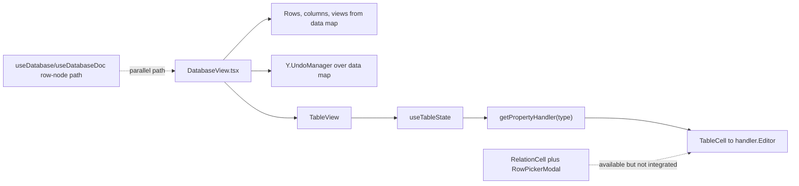
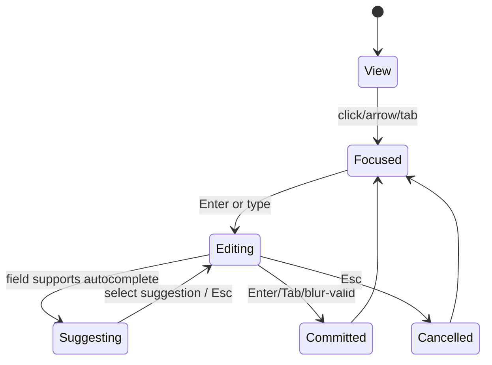
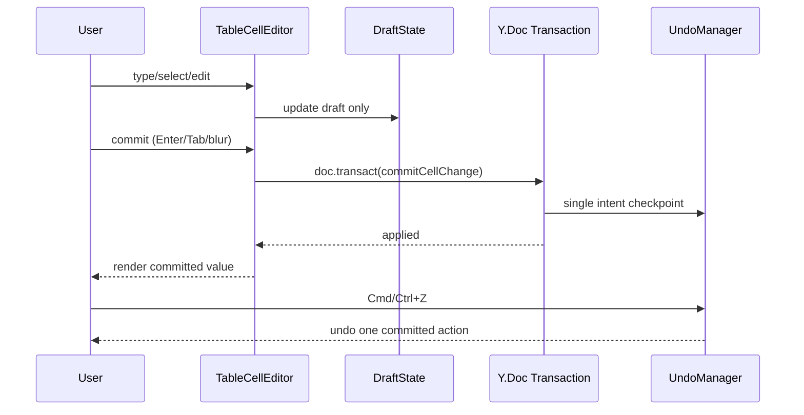
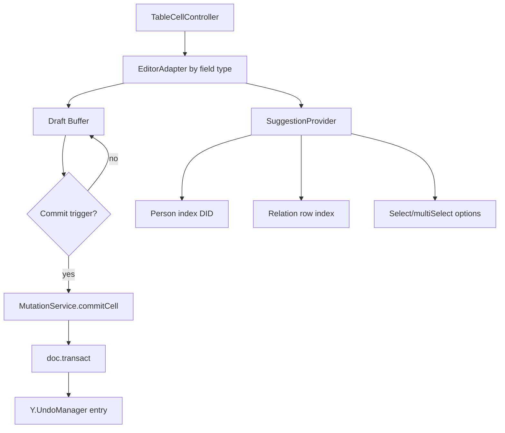

# Database Editing UX and Undo/Redo Remediation Plan

> Deep dive into why database cell editing feels rough today and why undo/redo is unreliable in real workflows, plus a concrete implementation plan to reach a Notion-like seamless editing experience.

**Date**: March 2026  
**Status**: Research + Execution Plan  
**Scope**: Electron database UI first, then shared `@xnet/views` improvements  
**Related**: `0088_[_]_DATABASE_UI_COMPETITIVE_ARCHITECTURE.md`, `0067_[-]_DATABASE_DATA_MODEL_V2.md`

---

## Executive Summary

The current database editing UX has a structural mismatch:

1. The active Electron `DatabaseView` uses a **single Y.Map with whole-array rewrites** for rows and columns (`data.set('rows', updatedRows)`), which causes coarse undo granularity and high update churn.
2. `@xnet/views` has **incomplete property editors** for key field types:
   - `dateRange` is explicitly read-only/TBD.
   - `relation` in active table cells is a placeholder with a non-functional `Link` button.
   - `person` is mapped to plain `text` (no DID autocomplete/validation UX).
   - `multiSelect` supports checking existing options but not fast typeahead create/remove workflows.
3. A more capable relation picker flow exists (`RelationCell` + `RowPickerModal`) but is not wired into the active table cell editing path.
4. Keyboard behavior is not yet "spreadsheet-grade" (limited commit/navigation model, weak edit-mode transitions).

Bottom line: the data model + editor architecture currently prevent the fluid Notion/Airtable-like experience users expect. We should fix this in two tracks:

- **Track A (fast UX wins):** deliver high-impact editors and keyboard behavior with current architecture.
- **Track B (model hardening):** migrate row/cell updates to granular CRDT operations and explicit undo transaction boundaries.

---

## Research Method

### Codebase Deep Dive

Primary files reviewed:

- Active Electron integration: `apps/electron/src/renderer/components/DatabaseView.tsx`
- Table runtime: `packages/views/src/table/TableView.tsx`, `packages/views/src/table/TableCell.tsx`, `packages/views/src/table/useTableState.ts`
- Property editors: `packages/views/src/properties/*.tsx`
- Column creation UI: `packages/views/src/columns/AddColumnModal.tsx`
- Relation tooling (currently underused): `packages/views/src/relations/RelationCell.tsx`, `packages/views/src/relations/RowPickerModal.tsx`
- Tests: `apps/electron/src/renderer/lib/database-yjs-undo.test.ts`, `tests/e2e/src/database-undo.spec.ts`, `tests/e2e/harness/database.tsx`
- Parallel architecture path: `packages/react/src/hooks/useDatabase.ts`, `packages/react/src/hooks/useDatabaseDoc.ts`

### Web Research

Reviewed external patterns and guidance:

- Notion database property behavior and edit flows: https://www.notion.com/help/database-properties
- Notion multi-view database behavior: https://www.notion.com/help/views-filters-and-sorts
- Airtable multi-select field behavior: https://support.airtable.com/docs/multiple-select-field
- AG Grid editing and edit lifecycle patterns: https://www.ag-grid.com/react-data-grid/cell-editing/
- MUI Data Grid editing model (cell/row modes, commit/escape semantics): https://mui.com/x/react-data-grid/editing/
- WAI-ARIA APG combobox and grid keyboard patterns:
  - https://www.w3.org/WAI/ARIA/apg/patterns/combobox/
  - https://www.w3.org/WAI/ARIA/apg/patterns/grid/

---

## Current System Map

### Key Architectural Finding

There are two overlapping database patterns in the repo:

- **Pattern 1 (active in Electron DatabaseView):** single Y.Doc map (`data.columns`, `data.rows`, `data.tableView`, `data.boardView`) with array rewrites.
- **Pattern 2 (hook-based path):** row-as-node model (`useDatabase`) + Y.Doc schema/view management (`useDatabaseDoc`).

This split is a major source of feature drift and UI inconsistency.

---

## Root Cause Analysis

### 1) Undo/Redo Feels Inconsistent

Evidence:

- Undo manager wraps `dataMap` globally with timed capture: `new Y.UndoManager([dataMap], { captureTimeout: 300 })` in `DatabaseView.tsx:200`.
- Many mutations use repeated `dataMap.set(...)` writes in separate operations.
- Cell updates rewrite full rows array (`DatabaseView.tsx:1056-1069`).
- Complex operations (e.g., delete column) perform multiple state updates (`DatabaseView.tsx:970-1017`) without explicit transaction boundaries.

Impact:

- Undo groups are timing-dependent instead of intention-dependent.
- Single cell edits can produce noisy history and poor replay behavior.
- Compound operations may undo partially or in unintuitive chunks.

### 2) Cell Editing Lifecycle Is Too Primitive

Evidence:

- `TableCell` enters edit mode on click and exits on blur/Enter/Escape with minimal navigation semantics (`TableCell.tsx:73-104`, `323-333`).
- `onChange` immediately writes through to source data (`TableCell.tsx:82-89`).

Impact:

- No robust separation of "draft" vs "committed" value.
- Hard to support intuitive keyboard workflows (Tab/Arrow progression, batch edits).
- Increased write volume while typing.

### 3) Critical Field Editors Are Incomplete

Evidence:

- Date range editor is read-only placeholder (`dateRange.tsx:15-37`).
- Relation editor has non-functional `Link` button and no picker wiring (`relation.tsx:115-121`).
- Person type uses `textHandler` (`properties/index.ts:42`) rather than DID-aware UX.
- Multi-select editor has checkbox dropdown but no true typeahead/create inline flow (`multiSelect.tsx:16-91`).

Impact:

- "Cell-level editing" fails exactly in advanced fields where users need speed.
- Users cannot rely on relation/person/dateRange fields for production workflows.

### 4) Existing Better Relation UX Is Not Connected

Evidence:

- `RelationCell` + `RowPickerModal` already implement searchable relation linking and create-and-link behavior.
- The active property `relationHandler` explicitly calls itself simplified and references external relation tooling (`relation.tsx:84-87`).
- `RelationCell` is exported but not used in the table path.

Impact:

- Users get fallback chips instead of structured relation linking.
- Significant code exists but value is not delivered.

### 5) Relation Column Setup Cannot Resolve Targets Reliably in Electron

Evidence:

- `AddColumnModal` supports relation target database config (`AddColumnModal.tsx:351-387`).
- Active `DatabaseView` mounts `AddColumnModal` without `availableDatabases` prop (`DatabaseView.tsx:1601-1605`).

Impact:

- Relation setup UX can present "No other databases available" even when databases exist.

---

## UX Target: "Notion-like Seamless" Editing

### Editing Principles

1. **One interaction model across field types**: click/focus/edit/commit/cancel should feel identical.
2. **Type-to-edit first**: users should not have to open heavy modals for common edits.
3. **Inline autocomplete everywhere references exist**: multi-select, person, relation.
4. **Undo by intent**: each meaningful user action should be one history step.
5. **Keyboard parity with power tools**: Enter, Tab, arrows, Escape must be predictable.

### Desired Field Behaviors

- `multiSelect`: tag input with autocomplete, create-on-enter (config gated), backspace-to-remove-last-chip.
- `dateRange`: start + end picker with quick presets and keyboard edits.
- `person`: DID-aware typeahead (label + DID), single/multi based on config.
- `relation`: searchable linked-row picker inline (popover/list), with create-and-link where valid.

---

## Proposed UX and Data Flow Model

---

## Detailed Implementation Plan

## Phase 0: Define Editor Contracts (Foundation)

Create a unified editor contract in `@xnet/views`:

- Add draft-aware editor API:
  - `onDraftChange(value)`
  - `onCommit(value, reason)`
  - `onCancel()`
- Add commit reasons enum (`enter`, `tab`, `blur`, `picker-select`, `programmatic`).
- Keep backward compatibility adapter for existing handlers during transition.

Why first: this unblocks consistent behavior across all field types.

## Phase 1: Undo/Redo Determinism

In `DatabaseView.tsx`:

- Wrap compound operations in explicit `doc.transact` blocks:
  - delete column
  - add/rename/reorder board columns
  - reorder cards
  - row delete/add
- Move from immediate per-keystroke writes to commit-based writes from TableCell/editor layer.
- Add clear stop-capture boundaries for edit sessions.

Expected result: undo stack follows user intent instead of timing heuristics.

## Phase 2: Field Editor Completion

### 2.1 Multi-select editor rewrite (`properties/multiSelect.tsx`)

- Convert to chip input + combobox list.
- Behavior:
  - typing filters existing options
  - Enter selects highlighted option or creates new option (if `allowCreate`)
  - Backspace removes last chip when input empty
  - Escape closes list without losing edit mode unexpectedly

### 2.2 Date range editor implementation (`properties/dateRange.tsx`)

- Replace read-only input with actual start/end controls.
- Support:
  - date-only and date-time modes via config
  - end >= start validation
  - quick clear and same-day toggle

### 2.3 Person editor (`properties/person.tsx` new)

- Introduce dedicated handler and map `person` to it in `properties/index.ts`.
- Provide DID-aware autocomplete:
  - source from presence, known collaborators, and recent DIDs
  - inline DID validation (pattern + friendly label)
  - support single or multi depending on column config

### 2.4 Relation editor integration

- Promote `RowPickerModal` interaction into active relation editor path.
- Replace placeholder relation `Link` button with functional autocomplete picker.
- Ensure relation config (`targetDatabase`, `allowMultiple`) is honored end-to-end.

## Phase 3: Table Keyboard and Focus Model

In `TableCell` + table-level state:

- Add spreadsheet navigation semantics:
  - Arrow keys move focus in view mode
  - Enter/F2 opens edit mode
  - Tab/Shift+Tab commits and moves horizontally
  - Enter commits and moves vertically (optional by setting)
- Maintain ARIA-aligned mode switching based on grid guidance.
- Prevent blur-collapse race conditions for popovers/editors.

## Phase 4: Relation Setup and Source Alignment

- Pass `availableDatabases` into `AddColumnModal` from `DatabaseView`.
- Align relation/person editor data sources with a single query provider abstraction.
- Remove dead split between simplified relation property editor and richer relation modal path.

## Phase 5: Data Model Convergence (Strategic)

- Plan migration from whole-row array rewrites toward granular cell-level operations.
- Decide convergence path between current `DatabaseView` map model and `useDatabase` row-node architecture.
- If full migration is phased, add an adapter so UI/editor layer targets one canonical row mutation API.

---

## Reference UI Architecture (Target)

---

## Validation Strategy

## A) Unit Tests

Add/expand tests in `packages/views` and Electron lib tests:

- `TableCell` mode transitions (view/edit/suggest/commit/cancel).
- `multiSelect` keyboard behaviors and create-on-enter.
- `dateRange` validity and commit/cancel semantics.
- `person` DID parsing/selection behavior.
- `relation` add/remove/search/create-link behavior.
- Undo grouping invariants around transaction boundaries.

## B) Integration/E2E

Extend `tests/e2e/src/database-undo.spec.ts` and add new specs:

- Undo/redo for all key field types (not only text + tags).
- Keyboard navigation matrix (Enter/Tab/Arrows/Escape).
- Relation linking and unlinking from inline editor.
- Person autocomplete with DID insertion/removal.
- Date range create/edit/clear and undo chain.

## C) Manual UX QA (Electron)

- Validate speed/feel for 50, 500, and 5k rows.
- Verify no focus traps and no accidental editor closes.
- Validate accessibility with screen reader spot checks.

---

## Risk Register and Mitigations

| Risk                                 | Why It Matters                                     | Mitigation                                                                     |
| ------------------------------------ | -------------------------------------------------- | ------------------------------------------------------------------------------ |
| Undo regressions                     | User trust is destroyed quickly by bad undo        | Add deterministic transaction boundaries + dedicated undo matrix tests         |
| Focus race conditions                | Popovers and blur handlers can fight each other    | Centralize focus ownership in TableCellController and use outside-click guards |
| Architecture drift persists          | Two data models continue diverging                 | Define one mutation API and move both paths behind it                          |
| Relation/person source inconsistency | Autocomplete quality degrades if data sources vary | Build shared suggestion provider interfaces                                    |
| Performance regressions              | Autocomplete/search can become expensive           | Debounced search, memoized option indices, virtualization for long lists       |

---

## Implementation Checklist

- [x] **Contract Layer**
  - [x] Add draft/commit/cancel editor contract and backward adapter
  - [x] Document editor behavior expectations in `packages/views` docs
- [ ] **Undo/Redo Reliability**
  - [x] Wrap compound mutations in `doc.transact`
  - [x] Add edit-session commit boundaries for text-like fields
  - [x] Add regression tests for grouped undo behavior
- [x] **Field Editors**
  - [x] Rewrite `multiSelect` as chip+combobox editor
  - [x] Implement functional `dateRange` editor
  - [x] Add `person` handler with DID autocomplete
  - [x] Integrate relation picker/autocomplete into active table path
- [x] **Keyboard and Navigation**
  - [x] Add grid navigation and mode transitions in `TableCell`
  - [x] Implement Tab/Shift+Tab/Enter movement with commit
  - [x] Ensure Escape cancel semantics are consistent
- [x] **Relation Setup Wiring**
  - [x] Pass real `availableDatabases` to `AddColumnModal`
  - [x] Verify relation config persists and is used by editor
- [x] **Architecture Convergence**
  - [x] Define canonical row mutation API
  - [x] Plan migration steps from row-array rewrites to granular mutations

---

## Validation Checklist

- [ ] **Correctness**
  - [x] Each field type supports create/edit/clear
  - [x] Undo/redo works for each field type and row/column ops
  - [x] Relation and person values serialize/deserialize correctly
- [x] **UX Quality**
  - [x] Multi-select supports typeahead + create + remove by keyboard
  - [x] Person and relation autocomplete return relevant results quickly
  - [x] Date range selection is fully interactive and intuitive
- [ ] **Keyboard Accessibility**
  - [x] Grid navigation follows expected arrow/tab conventions
  - [x] Combobox interactions follow ARIA APG patterns
  - [x] No broken focus loops or trapped focus states
- [x] **Performance**
  - [x] Typing latency remains smooth at 500+ rows
  - [x] Autocomplete remains responsive with large option sets
  - [x] Undo stack memory growth is bounded in long sessions
- [x] **Regression Safety**
  - [x] Existing database tests remain green
  - [x] New tests cover previously broken cases

---

## Recommended Next Actions (Priority Order)

1. Implement Phase 0 + Phase 1 first (editor contract + undo determinism) so all later UX work sits on stable behavior.
2. Deliver `multiSelect` and `dateRange` in one sprint as fastest visible quality win.
3. Integrate relation picker + person autocomplete next, since these are the largest functional gaps.
4. Add keyboard/focus model improvements immediately after field editors to achieve seamless editing feel.
5. Start data model convergence plan in parallel design track to avoid reintroducing churn.

If executed in this sequence, xNet can quickly move from "editable but brittle" to a dependable, high-velocity database editing experience that feels much closer to best-in-class tools.
