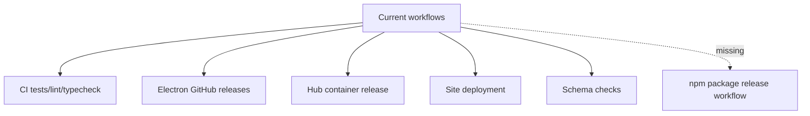
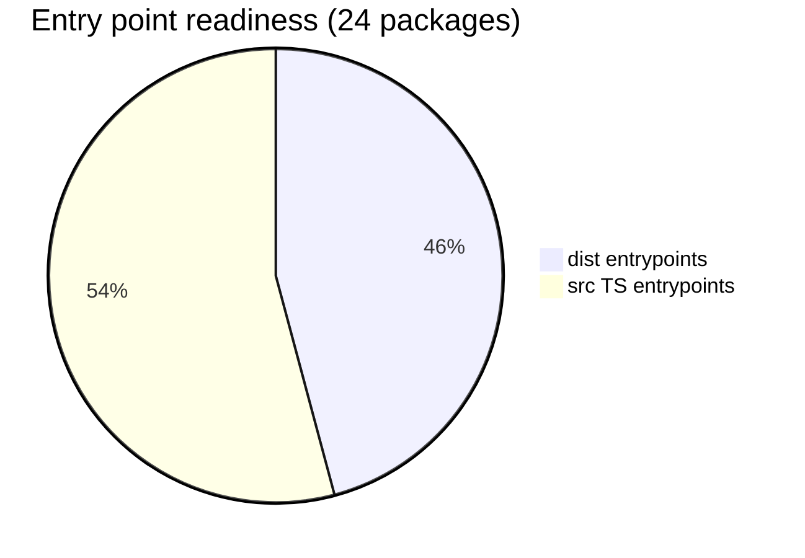
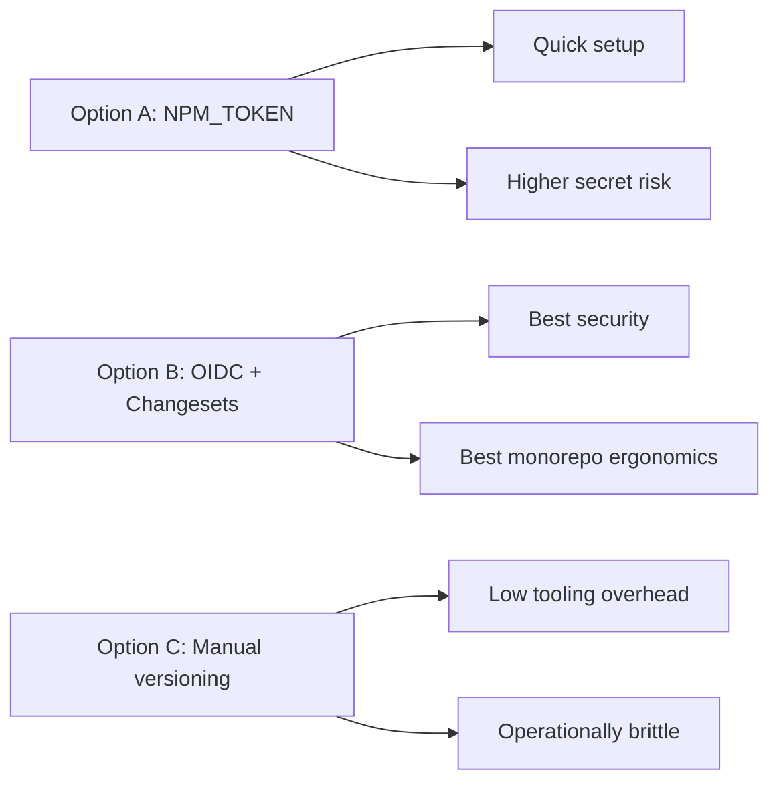
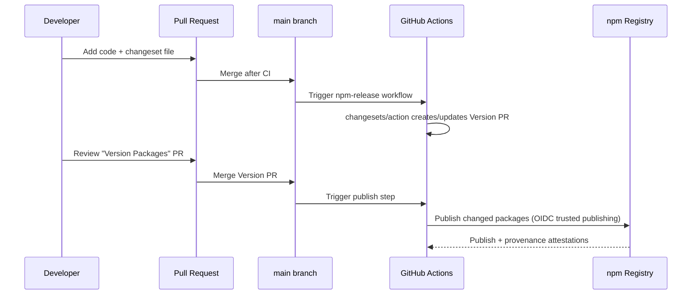
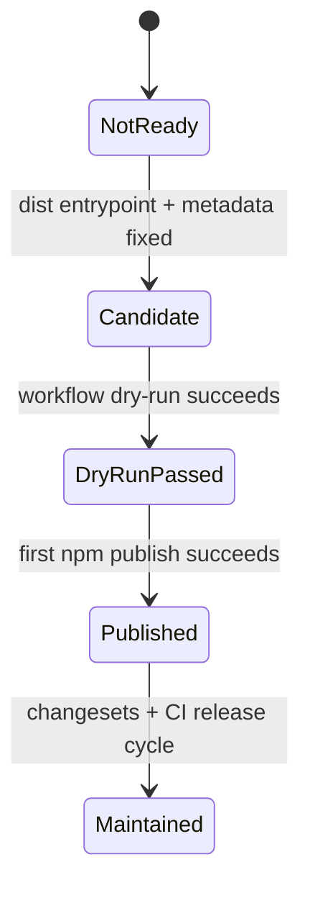
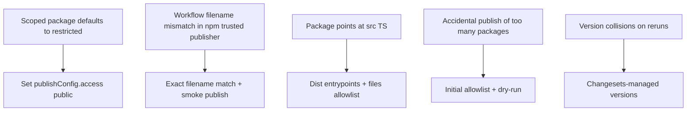
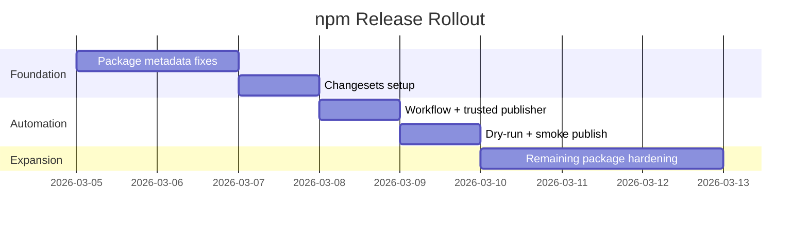

# 0100 - npm Publish Workflow for @xnetjs

> **Status:** Exploration
> **Tags:** npm, github-actions, oidc, trusted-publishing, changesets, monorepo, release-engineering
> **Created:** 2026-03-04
> **Context:** xNet has a GitHub org/repo and npm org scope (`@xnetjs`). Goal is to add a safe, repeatable GitHub workflow that publishes packages to npm.

## Executive Summary

You can absolutely automate npm publishing from GitHub Actions now. The fastest path is:

1. Use a dedicated release workflow (`.github/workflows/npm-release.yml`) on `main`.
2. Start with a **small publish set** of packages that are currently dist-ready.
3. Use **Changesets** for versioning/changelog automation.
4. Use **npm trusted publishing (OIDC)** instead of long-lived `NPM_TOKEN`.
5. Add `publishConfig.access: "public"` to all scoped public packages you publish.

The biggest hidden blockers in the current repo are package metadata and packaging readiness, not GitHub Actions itself.

---

## What I Found in This Repo

### Current CI/CD shape

- Existing workflows: CI, schema checks, docs deploy, Electron release, Hub image release.
- No npm release workflow exists yet.
- Shared setup action exists at `.github/actions/setup/action.yml` and already installs Node 23 + pnpm 10.30.3.
- Existing release automation exploration exists: `docs/explorations/0064_[_]_MONOREPO_RELEASE_AUTOMATION.md`.



### Package publishing readiness snapshot

From `packages/*/package.json`:

- 24 scoped packages exist under `@xnetjs/*`.
- `publishConfig.access` is currently missing from all packages.
- `license` field is missing in package manifests.
- 11 packages point `main` to `dist/*`.
- 13 packages still point `main` to `src/*.ts` (not ideal for external npm consumers).

Potentially safe initial publish set (dist entrypoints + transitive workspace deps also dist-based):

- `@xnetjs/core`
- `@xnetjs/crypto`
- `@xnetjs/identity`
- `@xnetjs/sync`
- `@xnetjs/sqlite`
- `@xnetjs/storage`
- `@xnetjs/data`
- `@xnetjs/data-bridge`
- `@xnetjs/plugins`
- `@xnetjs/cli`

Not launch-ready yet for npm-first consumers (examples):

- `@xnetjs/sdk`, `@xnetjs/react`, `@xnetjs/query`, `@xnetjs/network`, `@xnetjs/ui`, etc. currently point at `src/*.ts` entrypoints.



---

## External Guidance (Web Research)

### npm trusted publishing (recommended)

Key points from npm docs:

- Trusted publishing uses OIDC and avoids persistent npm tokens.
- Requires workflow permission: `id-token: write`.
- Trusted publisher config is per package (or configured in package settings) and validates repo + workflow filename.
- Scoped public packages still need public access semantics (`--access public` or `publishConfig.access: public`).
- Provenance is automatically generated with trusted publishing for public packages from public repos.

### GitHub Actions package publishing guidance

Key points from GitHub docs:

- Use `actions/setup-node` with `registry-url: https://registry.npmjs.org`.
- Use release trigger or main-branch trigger after tests.
- Include `id-token: write` for provenance/trusted publishing paths.
- For scoped public packages, publish with public access.

### pnpm publish behavior

Key points from pnpm docs:

- `pnpm -r publish` publishes workspace packages not yet published at that version.
- Supports `--access public`, `--provenance`, `--dry-run`, `--report-summary`.
- Has branch checks unless disabled.

---

## Architecture Options

## Option A: Token-based publish (legacy)

Use `NPM_TOKEN` secret + `pnpm -r publish`.

Pros:

- Fastest initial setup.

Cons:

- Long-lived secret risk.
- Harder security posture over time.

## Option B: Trusted publishing + Changesets (recommended)

Use Changesets for version PRs and trusted publishing for actual release.

Pros:

- Strongest supply-chain posture.
- Human-reviewable version PRs.
- Clear changelogs.

Cons:

- Slightly more setup (Changesets + npm trusted publisher config).

## Option C: Manual tags + recursive publish

No Changesets; manually bump package versions and run publish workflow on tag.

Pros:

- Minimal tooling additions.

Cons:

- High human error risk in monorepo.
- Hard to scale as package count grows.



Recommendation: **Option B**.

---

## Proposed End-State Release Flow





---

## Implementation Plan (Concrete)

## Phase 1: Package hygiene

For packages you plan to publish now:

- Add `publishConfig.access: "public"`.
- Add `license` field (matching repo `LICENSE`).
- Ensure `main/types/exports` point to `dist/*` (or intentionally ship source with explicit strategy).
- Add `files` allowlist (at minimum `dist`, `README.md`, `LICENSE`).
- Confirm `README.md` per package is consumer-ready.

Suggested `publishConfig` baseline:

```json
{
  "publishConfig": {
    "access": "public",
    "provenance": true
  }
}
```

## Phase 2: Introduce Changesets

- Add dev dependency: `@changesets/cli`.
- Initialize `.changeset/config.json`.
- Add scripts:
  - `changeset`
  - `version-packages` (runs `changeset version`)
  - `release` (build + `changeset publish`)

## Phase 3: Add GitHub workflow for npm release

Create `.github/workflows/npm-release.yml` with:

- Trigger: push to `main`.
- Permissions: `contents: write`, `pull-requests: write`, `id-token: write`.
- Setup: checkout + Node + pnpm install.
- Use `changesets/action@v1`.
- `publish` command should run build then publish.

Example shape:

```yaml
name: npm Release

on:
  push:
    branches: [main]

concurrency:
  group: npm-release-${{ github.ref }}
  cancel-in-progress: false

permissions:
  contents: write
  pull-requests: write
  id-token: write

jobs:
  release:
    runs-on: ubuntu-latest
    steps:
      - uses: actions/checkout@v4
      - uses: ./.github/actions/setup

      - name: Setup npm registry auth context
        # Needed for registry URL and npm CLI behavior
        uses: actions/setup-node@v4
        with:
          node-version: '24'
          registry-url: 'https://registry.npmjs.org'

      - name: Create Release PR or Publish
        id: changesets
        uses: changesets/action@v1
        with:
          version: pnpm changeset version
          publish: pnpm -r --filter "@xnetjs/*" publish --access public --report-summary
        env:
          GITHUB_TOKEN: ${{ secrets.GITHUB_TOKEN }}
```

Notes:

- For OIDC trusted publishing, do not rely on `NPM_TOKEN` if using trusted publishers.
- If trusted publishing is not enabled yet, temporarily use `NODE_AUTH_TOKEN` from `NPM_TOKEN`.

## Phase 4: npm trusted publisher configuration

In npm package settings:

- Configure trusted publisher with:
  - GitHub org/user
  - repository
  - workflow filename (`npm-release.yml`)
  - optional environment name (if using protected env)

Then harden:

- Set publishing access policy to disallow token-based publish once OIDC confirmed.
- Revoke old automation tokens.

---

## Risk Register (What Can Break)



High-priority risks in this repo right now:

1. Source entrypoints in many packages.
2. Missing `publishConfig.access` for scoped public publishing.
3. Missing per-package license metadata.

---

## Checklists

## Implementation checklist

- [ ] Decide initial publish set (recommend 10-package dist-ready set first).
- [ ] Add `license` field to each publish-target package.
- [ ] Add `publishConfig.access: "public"` to each publish-target package.
- [ ] Add `publishConfig.provenance: true` to each publish-target package.
- [ ] Ensure publish-target package entrypoints resolve to built `dist/*` artifacts.
- [ ] Add `files` allowlist for each publish-target package.
- [ ] Add Changesets (`@changesets/cli`) and initialize config.
- [ ] Add root scripts for changeset/version/release.
- [ ] Add `.github/workflows/npm-release.yml`.
- [ ] Configure npm trusted publisher against `npm-release.yml`.
- [ ] Enable environment protection for publish job (recommended).
- [ ] Remove/revoke legacy npm automation token after OIDC validation.

## Validation checklist

- [ ] `pnpm build` succeeds from clean checkout.
- [ ] `pnpm test` succeeds for publish-target packages.
- [ ] `pnpm -r --filter "<target>" publish --dry-run` succeeds locally.
- [ ] Packed tarball inspection shows expected contents only (`dist`, README, LICENSE).
- [ ] Workflow runs on `main` and creates Version PR when changesets exist.
- [ ] Merging Version PR publishes only changed packages.
- [ ] npm shows package visibility as public.
- [ ] npm package page shows provenance attestation.
- [ ] install smoke tests succeed (`npm i @xnetjs/<pkg>` in clean project).
- [ ] rerun protection works (no duplicate version publish failures in normal flow).

---

## Suggested Rollout Strategy

## Wave 1 (1-2 days)

- Publish only foundational dist-ready libs (`core`, `crypto`, `identity`, `sync`, `storage`, `sqlite`, `data`).
- Keep UI/react/sdk/network/query packages out until dist contract is finalized.

## Wave 2 (2-4 days)

- Standardize entrypoints to dist and add `files` allowlists for remaining packages.
- Expand publish set and update docs.

## Wave 3 (ongoing)

- Add release notes automation and changelog surfacing.
- Add publish observability (summary artifact + Slack/Discord optional notification).



---

## References

- npm trusted publishing docs: https://docs.npmjs.com/trusted-publishers
- GitHub Actions Node package publishing docs: https://docs.github.com/en/actions/tutorials/publish-packages/publish-nodejs-packages
- Changesets GitHub Action docs: https://github.com/changesets/action
- pnpm publish docs: https://pnpm.io/cli/publish

---

## Next Actions (Recommended)

1. Create `npm-release.yml` + Changesets scaffolding in one PR (no publish yet, dry-run only).
2. In parallel, patch package metadata for the initial 10-package publish set.
3. Configure trusted publisher in npm UI and run one controlled publish from `main`.
4. After first successful publish, lock down token-based publishing and document the runbook in `docs/`.

If you want, I can do the follow-up implementation PR next (workflow + Changesets + package metadata) in a staged, low-risk order.
