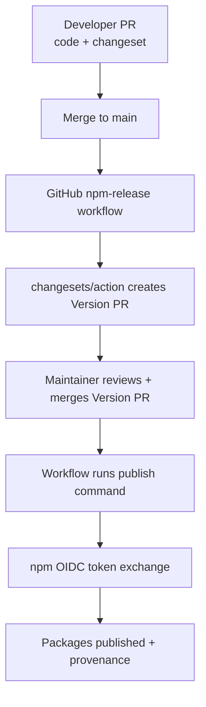
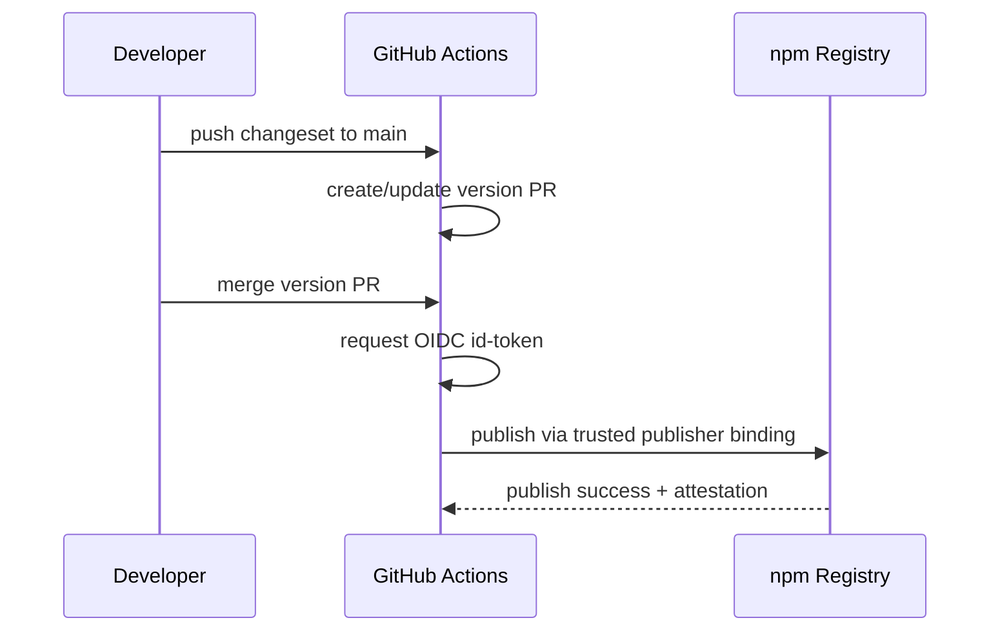
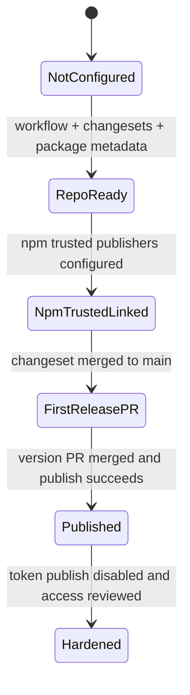
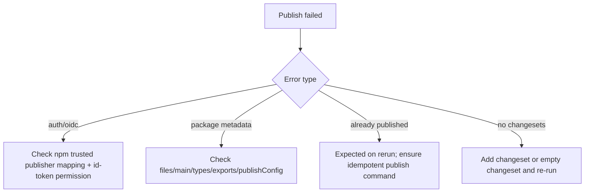

# 0101 - End-to-End npm Trusted Publishing Playbook

> **Status:** Exploration  
> **Tags:** npm, trusted-publishing, oidc, github-actions, changesets, monorepo, release-ops  
> **Created:** 2026-03-05  
> **Context:** You want a single step-by-step guide covering local CLI setup, npm UI setup (XNetJS org/team), and GitHub Actions wiring so `@xnetjs/*` packages publish automatically with versions driven by Changesets/conventional-commit workflow.

---

## Executive summary

You are close. The repository now has the core automation files in place:

- `.github/workflows/npm-release.yml`
- `.changeset/config.json`
- package metadata updates for the initial release set + `@xnetjs/react` chain lockstep

The remaining blocker is npm-side trusted publisher configuration (UI step per package). After that:

1. Add a changeset in a PR.
2. Merge to `main`.
3. GitHub Action opens/updates the release PR.
4. Merge release PR.
5. Packages publish automatically to npm via OIDC.

---

## Research highlights (current guidance)

### npm Trusted Publishing

- OIDC trusted publishing is recommended over long-lived `NPM_TOKEN`.
- Workflow must grant `id-token: write`.
- Trusted publisher config is sensitive to org/repo/workflow filename (exact match).
- Each package currently has one trusted publisher connection.
- npm now documents minimum environment requirements for OIDC path: npm CLI `>=11.5.1` and Node `>=22.14.0`.
- Trusted publishing auto-generates provenance for public package + public repo + supported CI.

### GitHub Actions guidance

- Use `actions/setup-node` with `registry-url: https://registry.npmjs.org`.
- Keep explicit permissions (`contents`, `pull-requests`, `id-token`) minimal and scoped.
- `GITHUB_TOKEN` is enough for release PR automation.

### Changesets + pnpm

- `changesets/action` creates/updates a version PR, and can publish post-merge.
- `pnpm -r publish` publishes only versions not already on the registry.
- Useful local flags: `--dry-run`, `--report-summary`, `--access public`, and `--no-git-checks` (local dry-run only).

---

## Current xNet baseline (repo state)

- Release workflow exists: `.github/workflows/npm-release.yml`.
- Changesets exists: `.changeset/config.json`.
- `fixed` lockstep group exists for the React-facing chain:
  - `@xnetjs/react`, `@xnetjs/history`, `@xnetjs/plugins`, `@xnetjs/data-bridge`, `@xnetjs/data`, `@xnetjs/storage`, `@xnetjs/sqlite`, `@xnetjs/sync`, `@xnetjs/identity`, `@xnetjs/crypto`, `@xnetjs/core`.
- `ignore` list still excludes non-release packages/apps.

---

## End-to-end flow







---

## Step-by-step guide

## Your exact values (xNet)

Use these exact identifiers when following this playbook:

- **GitHub username/org:** `crs48`
- **GitHub repository:** `xNet`
- **Workflow filename:** `npm-release.yml`
- **npm personal username:** `csmothers`
- **npm organization/scope owner:** `xnetjs` (`@xnetjs/*` packages)

If any trusted publishing form asks for repo/workflow identifiers, use the exact casing above.

## Phase 0 - Confirm local prerequisites

### 0.1 Verify toolchain

Run from repo root:

```bash
node -v
pnpm -v
git --version
```

Recommended for trusted-publishing parity with current docs:

- Node `>=22.14.0`
- npm CLI `>=11.5.1` (workflow uses Node runtime npm)

### 0.2 Install workspace dependencies

```bash
pnpm install
```

---

## Phase 1 - Verify repository wiring (local + GitHub)

### 1.1 Ensure release scripts exist in root `package.json`

Expected scripts:

- `changeset`
- `version-packages`
- `release`

Quick check:

```bash
pnpm changeset --help
pnpm version-packages --help
```

### 1.2 Ensure release workflow exists and has required permissions

File: `.github/workflows/npm-release.yml`

Must include:

- trigger on `main`
- `permissions.id-token: write`
- `changesets/action@v1`
- `actions/setup-node` with npm registry URL

### 1.3 Ensure changeset config matches desired release scope

File: `.changeset/config.json`

Check:

- `baseBranch: "main"`
- `access: "public"`
- `fixed` group includes React chain
- `ignore` excludes packages you are not ready to publish

---

## Phase 2 - npm UI setup (XNetJS org/team)

This is the critical manual step.

## 2.1 Team and permission checks

In npm org (`@xnetjs`):

1. Confirm you are Owner/Admin or have package publish permissions.
2. Confirm maintainers who need release visibility are in the correct npm team.
3. Confirm package ownership policy (org-owned vs user-owned).

## 2.2 Configure trusted publisher per release package

For each package in the release-managed set (or at least the first wave):

1. Open package settings on npmjs.com.
2. Go to **Trusted publishing** / **Trusted Publisher** section.
3. Select **GitHub Actions**.
4. Enter:
   - **Organization/user:** `crs48`
   - **Repository:** `xNet`
   - **Workflow filename:** `npm-release.yml`
   - **Environment name:** (blank unless you enforce GitHub environments)
5. Save.

Important:

- Use filename only (`npm-release.yml`), not full path.
- Matching is case-sensitive and exact.

## 2.3 First-publish package creation behavior

- You do not need to pre-create package records manually.
- First successful publish will create package entries.
- If package does not yet exist, ensure org scope and permissions are correct before publish.

## 2.4 Security hardening after successful smoke publish

After OIDC publish is verified:

1. In package settings, set publishing access to disallow token-based publishing (recommended by npm docs).
2. Revoke old automation tokens if any exist.

---

## Phase 3 - GitHub settings and Actions hardening

## 3.1 Repository Actions permissions

In GitHub repo settings:

- Ensure Actions can create PRs/commits with `GITHUB_TOKEN` (for version PR updates).
- Ensure workflow can run on push to `main`.

## 3.2 Optional: protected release environment

If you want manual approvals before publish:

1. Create a GitHub Environment (e.g. `npm-publish`).
2. Add required reviewers.
3. Attach environment to `release` job in `.github/workflows/npm-release.yml`.
4. If using environment in npm trusted publisher config, set same environment name there.

## 3.3 Branch protection

Recommended:

- Require PR checks for `main`.
- Keep direct pushes restricted.
- Ensure release PR still has permission to merge under your policy.

---

## Phase 4 - First release dry-run locally

Use this before first live publish.

```bash
pnpm build
pnpm changeset status
pnpm --filter @xnetjs/react build
pnpm --filter @xnetjs/history build
pnpm -r --filter "@xnetjs/*" publish --dry-run --access public --report-summary --no-git-checks
```

Notes:

- `pnpm publish` enforces clean git tree; local dry-runs can use `--no-git-checks`.
- Do not use `--no-git-checks` for real release automation.

---

## Phase 5 - First live automated release

## 5.1 Create release-intent PR

```bash
pnpm changeset
git add .
git commit -m "chore(release): add changeset for initial publish"
git push
```

Then open/merge PR as usual.

## 5.2 Merge to `main`

On merge:

- `npm-release` workflow runs.
- It creates/updates the Version PR.

## 5.3 Merge Version PR

When version PR is merged:

- workflow runs `pnpm release`
- Changesets publishes changed packages
- npm trusted publishing should authenticate via OIDC automatically

---

## Phase 6 - Validation checklist after first publish

## 6.1 GitHub validation

- [ ] `npm-release` workflow run succeeded.
- [ ] Version PR was created and merged cleanly.
- [ ] Publish step logs show successful publishes.

## 6.2 npm validation

- [ ] Packages are visible under `@xnetjs` scope.
- [ ] Correct versions were published.
- [ ] Visibility is public.
- [ ] Provenance/attestation appears on package pages.

## 6.3 consumer validation

- [ ] `npm i @xnetjs/react@latest` works in a clean project.
- [ ] Import smoke test compiles.
- [ ] Companion packages in fixed group resolve to expected matching versions.

---

## Implementation checklist (operator)

- [ ] Run local prerequisite checks (`node`, `pnpm`, install).
- [ ] Confirm `.github/workflows/npm-release.yml` on default branch.
- [ ] Confirm `.changeset/config.json` fixed/ignore scope.
- [ ] Confirm package manifests have `publishConfig.access: public` and dist entrypoints.
- [ ] Configure npm trusted publisher for each release package.
- [ ] (Optional) configure GitHub Environment protection.
- [ ] Perform local dry-run publish.
- [ ] Merge first changeset PR.
- [ ] Merge generated Version PR.
- [ ] Validate npm output and provenance.
- [ ] Disable token-based publishing and revoke old tokens.

---

## Operational checklist (every release)

- [ ] Every release-impacting PR includes a `.changeset/*.md`.
- [ ] CI/build/test checks pass before merge.
- [ ] Merge to `main`.
- [ ] Review generated version PR.
- [ ] Merge version PR.
- [ ] Confirm publish run succeeded.
- [ ] Spot-check package install in clean sample app.

---

## Failure modes and fast fixes



Common cases:

1. **OIDC auth failure**
   - Verify exact workflow filename (`npm-release.yml`) in npm UI.
   - Verify publish originates from `main`.
   - Verify `id-token: write` still present.

2. **`Some packages changed but no changesets found`**
   - Run `pnpm changeset`.
   - For non-release infra updates, use `pnpm changeset --empty`.

3. **Unexpected package included/excluded**
   - Re-check `.changeset/config.json` `fixed` and `ignore` arrays.

4. **Tarball missing files**
   - Check each package `files` field and dist build output.

---

## Recommended rollout for xNet from here

1. **Release now:** current managed set with React lockstep family.
2. **After first success:** enable token lock-down at npm package settings.
3. **Wave expansion:** migrate `@xnetjs/query`, `@xnetjs/network`, `@xnetjs/sdk`, `@xnetjs/telemetry` to dist entrypoints and remove from `ignore`.
4. **Observability:** add post-publish summary and notification step from `changesets/action` outputs.

---

## Concrete command cheat sheet

### Add a release changeset

```bash
pnpm changeset
git add .
git commit -m "chore(release): add changeset"
git push
```

### Local release readiness check

```bash
pnpm build
pnpm changeset status
pnpm -r --filter "@xnetjs/*" publish --dry-run --access public --report-summary --no-git-checks
```

### Inspect release workflow in repo

```bash
gh workflow view "npm Release"
gh run list --workflow "npm Release"
```

---

## References

- npm trusted publishing docs: https://docs.npmjs.com/trusted-publishers
- GitHub node package publishing docs: https://docs.github.com/en/actions/tutorials/publish-packages/publish-nodejs-packages
- Changesets action: https://github.com/changesets/action
- Changesets config options (`fixed`, `ignore`, etc.): https://github.com/changesets/changesets/blob/main/docs/config-file-options.md
- pnpm publish docs: https://pnpm.io/cli/publish
- pnpm + changesets recipe: https://pnpm.io/using-changesets
