# 0102 - AFFiNE/BlockSuite Integration Feasibility Analysis

> **Status:** Exploration  
> **Tags:** architecture, integration, blocksuite, affine, canvas, editor, database, ux  
> **Created:** 2026-03-05  
> **Context:** Evaluating whether AFFiNE/BlockSuite can power xNet's docs, canvas, and database features while preserving core xNet APIs and architecture.

## Executive Summary

AFFiNE provides a polished, feature-rich UX for docs, canvas, and database editing that could accelerate xNet's UI development. However, **full integration would require significant architectural compromises** that conflict with xNet's core design principles:

**Key Findings:**

- ✅ **UX is exceptional** - Best-in-class editing experience with rich features
- ⚠️ **CRDT conflict** - Both use Yjs but with incompatible data models (BlockSuite blocks vs xNet nodes)
- ❌ **Storage mismatch** - BlockSuite uses IndexedDB/y-indexeddb; xNet uses SQLite with event-sourced changes
- ⚠️ **Authorization gap** - BlockSuite has minimal auth; xNet has comprehensive node-level auth with UCAN
- ✅ **Component reuse viable** - UI components (toolbar, panels, widgets) can be cherry-picked
- ⚠️ **React API preservation** - Possible but requires heavy adapter layer

**Recommendation:** **Selective UX borrowing over full integration**. Instead of dropping in BlockSuite wholesale, systematically copy UI patterns, interaction models, and visual polish while maintaining xNet's underlying architecture.

---

## Problem Statement

xNet needs polished editors for:

1. **Documents** - Rich text with blocks (currently TipTap-based)
2. **Canvas** - Infinite whiteboard with spatial indexing (custom implementation)
3. **Database** - Table/Kanban views with real-time collaboration (custom views)

AFFiNE solves all three with a mature, unified UX. The question: Can we integrate BlockSuite without breaking xNet's foundational architecture?

---

## Architecture Comparison

### High-Level Stack Comparison

```mermaid
graph TB
    subgraph AFFiNE["AFFiNE Stack"]
        A1[React App]
        A2["BlockSuite Presets
        (PageEditor, EdgelessEditor)"]
        A3["BlockSuite Blocks
        (@blocksuite/blocks)"]
        A4["BlockSuite Framework
        (@blocksuite/block-std)"]
        A5["Yjs Document
        (Y.Doc with blocks)"]
        A6["IndexedDB
        (y-indexeddb)"]

        A1 --> A2
        A2 --> A3
        A3 --> A4
        A4 --> A5
        A5 --> A6
    end

    subgraph xNet["xNet Stack"]
        X1[React App]
        X2["@xnetjs/react
        (useQuery, useMutate, useNode)"]
        X3["@xnetjs/editor
        (TipTap + Yjs)"]
        X4["@xnetjs/canvas
        (Custom + Spatial Index)"]
        X5["@xnetjs/views
        (Table, Kanban)"]
        X6["@xnetjs/data
        (NodeStore + Schema)"]
        X7["@xnetjs/sync
        (Lamport + signed changes)"]
        X8["@xnetjs/storage
        (SQLite + event sourcing)"]

        X1 --> X2
        X2 --> X3
        X2 --> X4
        X2 --> X5
        X3 --> X6
        X4 --> X6
        X5 --> X6
        X6 --> X7
        X7 --> X8
    end

    style A5 fill:#ffeb3b
    style X6 fill:#ffeb3b
    style X7 fill:#ff9800
```

### Data Model Clash

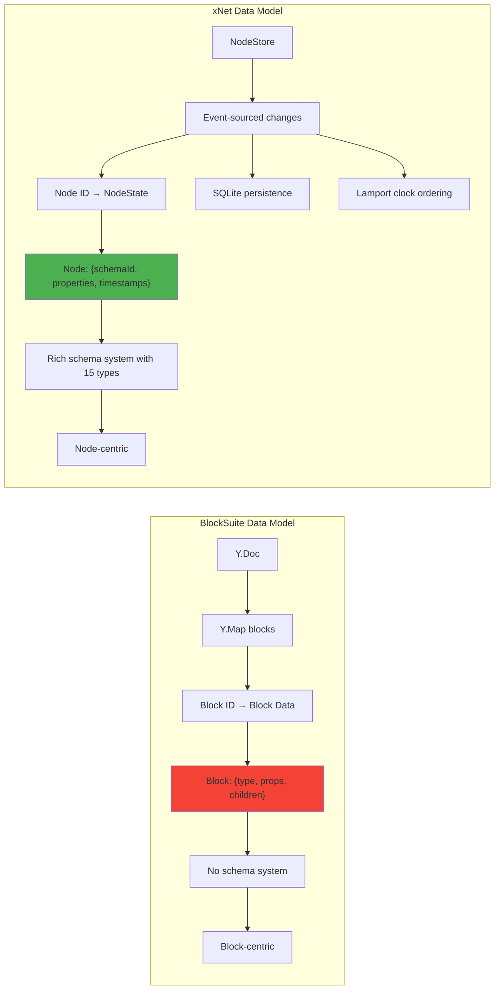

**Critical Incompatibility:** BlockSuite stores blocks as Yjs maps with no schema system, while xNet stores schema-validated nodes with event-sourced changes and Lamport timestamps. These cannot be directly bridged without losing key xNet features.

---

## Feature Overlap Analysis

### 1. Document Editing

| Feature        | BlockSuite       | xNet (TipTap)     | Notes                                 |
| -------------- | ---------------- | ----------------- | ------------------------------------- |
| Rich text      | ✅ Excellent     | ✅ Good           | BlockSuite has more polish            |
| Block types    | ✅ 20+ blocks    | ⚠️ Basic          | xNet uses schema system instead       |
| Collaboration  | ✅ Yjs native    | ✅ Yjs native     | Both use Yjs but different structures |
| Undo/redo      | ✅ Yjs history   | ✅ Custom history | xNet has time-travel via changes      |
| Markdown       | ✅ Import/export | ✅ Import/export  | Similar capabilities                  |
| AI integration | ✅ Built-in      | ❌ Planned        | AFFiNE AI is a major feature          |
| Block nesting  | ✅ Deep nesting  | ⚠️ Schema-based   | Different mental models               |

**Overlap Score: 70%** - Both solve rich text editing but with different block/node models.

### 2. Canvas/Whiteboard

| Feature          | BlockSuite Edgeless | xNet Canvas       | Notes                          |
| ---------------- | ------------------- | ----------------- | ------------------------------ |
| Infinite canvas  | ✅ Yes              | ✅ Yes            | Core feature for both          |
| Spatial indexing | ✅ Built-in         | ✅ R-tree custom  | xNet's is optimized for chunks |
| Shapes & drawing | ✅ Rich toolkit     | ⚠️ Basic          | BlockSuite far ahead           |
| Canvas blocks    | ✅ Embed docs       | ✅ Link nodes     | Different approaches           |
| Performance      | ✅ Canvas rendering | ✅ SVG + chunking | Different rendering strategies |
| Collaboration    | ✅ Yjs              | ✅ Yjs + spatial  | xNet adds spatial index sync   |
| Comments         | ✅ Yes              | ✅ Yes            | Similar capabilities           |

**Overlap Score: 85%** - Very similar problem space but different implementations.

### 3. Database Views

| Feature        | AFFiNE Database  | xNet Views         | Notes                        |
| -------------- | ---------------- | ------------------ | ---------------------------- |
| Table view     | ✅ Full-featured | ✅ Custom          | Both have rich tables        |
| Kanban         | ✅ Yes           | ✅ Yes             | Similar capabilities         |
| Property types | ✅ 10+ types     | ✅ 15 types        | xNet has more type variety   |
| Relations      | ✅ Basic         | ✅ First-class     | xNet's relations are core    |
| Formulas       | ✅ Built-in      | ✅ @xnetjs/formula | Both support computed values |
| Filtering      | ✅ UI-driven     | ✅ Query API       | Different approaches         |
| Grouping       | ✅ Yes           | ✅ Yes             | Similar                      |
| Authorization  | ❌ Minimal       | ✅ Node-level      | **Major gap**                |

**Overlap Score: 75%** - Similar features but xNet's schema system is more powerful.

---

## Critical Architectural Conflicts

### Conflict 1: CRDT Mismatch

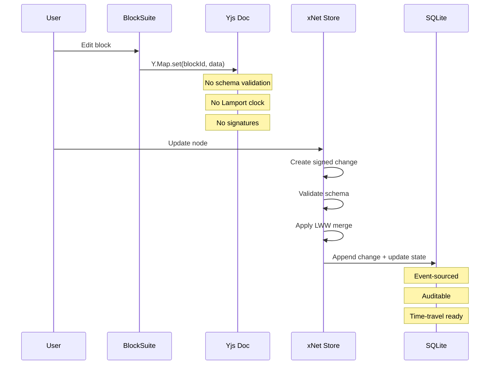

**Problem:** BlockSuite's Yjs documents are ephemeral and lack the durability, auditability, and schema guarantees that xNet requires. Bridging this would require intercepting every Yjs update and converting it to xNet changes - a massive performance and complexity burden.

### Conflict 2: Storage Paradigm

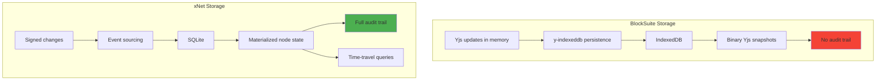

**Problem:** xNet's event-sourced architecture is foundational for features like time-travel, audit logs, and conflict-free sync. BlockSuite's approach optimizes for edit performance but sacrifices these capabilities.

### Conflict 3: Authorization Model

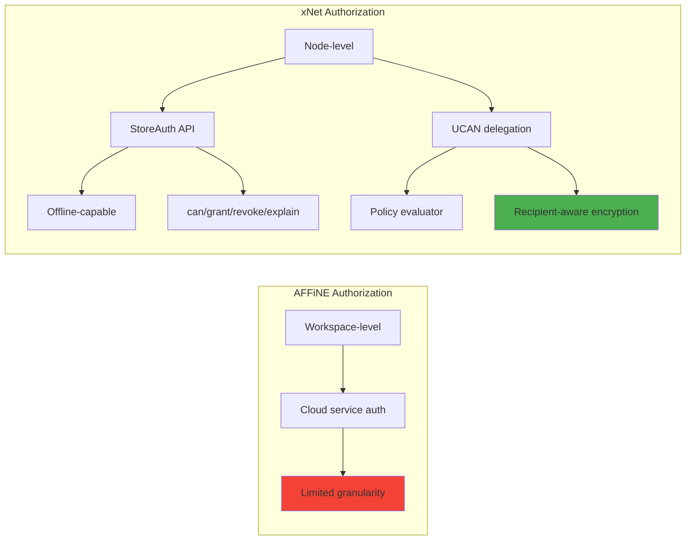

**Problem:** xNet's fine-grained, offline-capable authorization is core to its security model. BlockSuite assumes workspace-level permissions managed by a cloud service, which is incompatible with xNet's peer-to-peer, local-first design.

---

## Integration Strategies

### Strategy A: Full BlockSuite Adoption (❌ Not Recommended)

Replace xNet's editor, canvas, and views with BlockSuite components entirely.

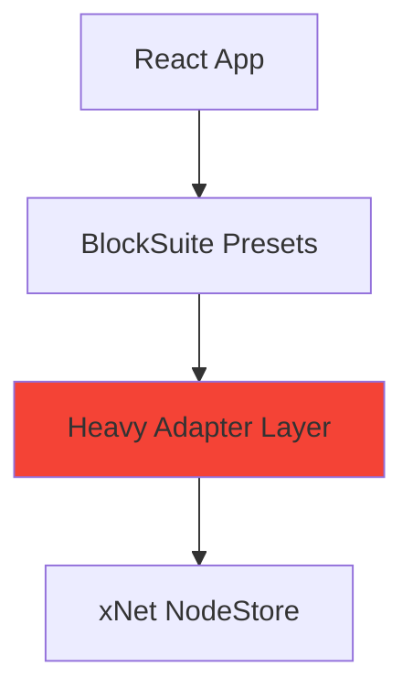

**Pros:**

- ✅ Instant access to polished UX
- ✅ Mature feature set (AI, shapes, etc.)
- ✅ Active development

**Cons:**

- ❌ Lose event sourcing and audit trail
- ❌ Break schema system
- ❌ Destroy authorization model
- ❌ Massive adapter complexity (every Yjs update → xNet change)
- ❌ Performance overhead from dual sync systems
- ❌ React API breaks entirely

**Verdict:** **Not viable** - Core xNet features would be gutted.

---

### Strategy B: BlockSuite UI Components Only (✅ Feasible)

Cherry-pick BlockSuite UI components (toolbars, popovers, panels) and wire them to xNet's data layer.

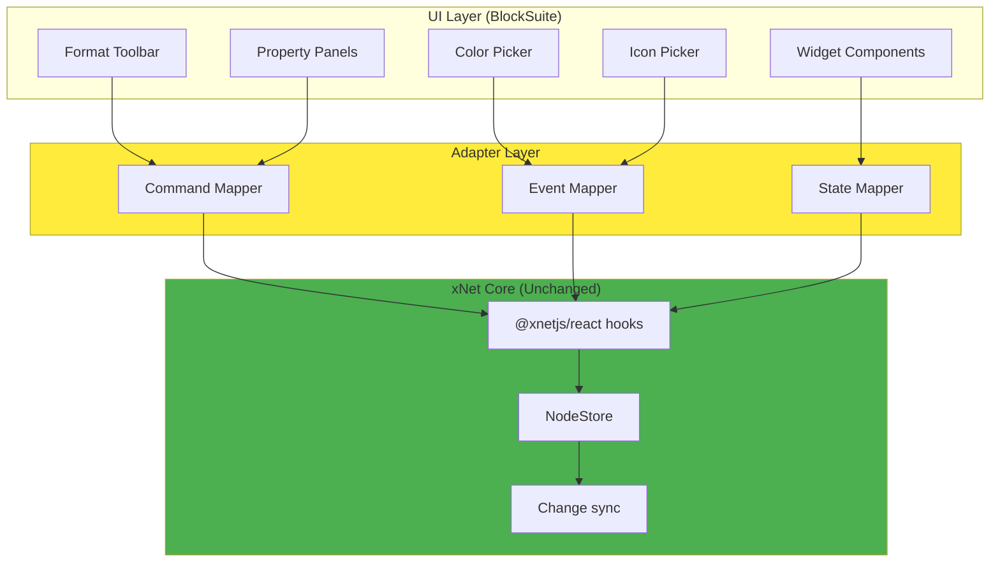

**Pros:**

- ✅ Preserve all xNet architecture
- ✅ Get BlockSuite's polished UI
- ✅ React APIs unchanged
- ✅ Authorization model intact
- ✅ Event sourcing preserved
- ✅ Incremental adoption

**Cons:**

- ⚠️ Manual adapter development
- ⚠️ Need to understand BlockSuite internals
- ⚠️ Potential version lock-in
- ⚠️ Some components may be tightly coupled to BlockSuite data model

**Verdict:** **Recommended approach** - Best balance of UX improvement and architectural integrity.

---

### Strategy C: Reference Implementation (✅ Highly Recommended)

Study AFFiNE/BlockSuite deeply and rebuild UI patterns natively in xNet with Tailwind/Base UI.

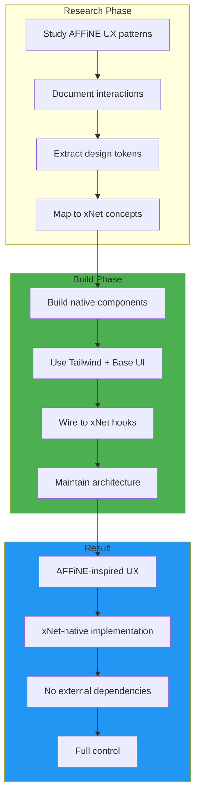

**Pros:**

- ✅ Zero architectural compromise
- ✅ Full control over implementation
- ✅ No external dependency risk
- ✅ Learn from best practices
- ✅ Tailored to xNet's needs
- ✅ React APIs stay clean

**Cons:**

- ⚠️ Slower initial development
- ⚠️ Must maintain custom code
- ⚠️ Risk of missing subtle UX details

**Verdict:** **Best long-term strategy** - More work upfront but cleaner result.

---

## React API Preservation Analysis

xNet's React APIs are foundational for the developer experience:

```typescript
// Current xNet React APIs
const { node, loading } = useNode(nodeId)
const { data: nodes } = useQuery({ schemaId: 'xnet://xnet.fyi/Task' })
const mutate = useMutate()
const { canEdit } = useCanEdit(nodeId)
const { grants } = useGrants(nodeId)
```

### If Using Full BlockSuite

```typescript
// Would need heavy adapters
const editor = useEditor() // BlockSuite editor
const yDoc = editor.doc // Yjs doc

// Convert Yjs → xNet changes (expensive!)
yDoc.on('update', (update) => {
  // For EVERY keystroke:
  // 1. Parse Yjs update
  // 2. Extract changed blocks
  // 3. Map blocks → nodes
  // 4. Create signed changes
  // 5. Write to SQLite
  // 6. Recompute indexes
  // This is a performance nightmare
})

// Convert xNet → Yjs (complex!)
useEffect(() => {
  const unsub = store.onChange((event) => {
    // For EVERY remote change:
    // 1. Read NodeState
    // 2. Map nodes → blocks
    // 3. Apply to Y.Doc
    // 4. Hope nothing breaks
  })
  return unsub
}, [])
```

**Complexity:** 🔴🔴🔴 **Very High** - Requires bidirectional sync between incompatible systems.

### If Using Strategy B/C (Component-only or Reference)

```typescript
// React APIs stay the same!
const { node, loading } = useNode(nodeId)
const mutate = useMutate()

// UI components just provide visual layer
<FormatToolbar
  onBold={() => mutate.update(nodeId, { bold: true })}
  onItalic={() => mutate.update(nodeId, { italic: true })}
/>
```

**Complexity:** 🟢 **Low** - Components are thin UI layer over existing hooks.

---

## Detailed Component Reuse Assessment

### High-Value Components to Extract

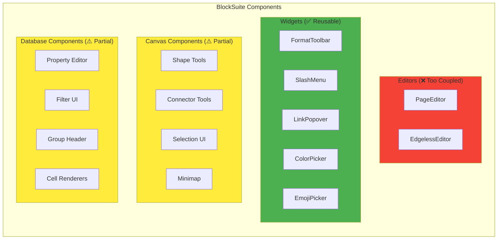

### Extraction Checklist

#### High Priority (Quick Wins)

- [ ] **Format Toolbar**
  - [ ] Extract toolbar component structure
  - [ ] Map format commands to xNet TipTap commands
  - [ ] Add to `@xnetjs/ui` package
  - [ ] Wire up keyboard shortcuts

- [ ] **Slash Menu**
  - [ ] Extract command palette UI
  - [ ] Map to xNet schema types (blocks → node schemas)
  - [ ] Integrate fuzzy search
  - [ ] Add extension mechanism

- [ ] **Color Picker**
  - [ ] Extract component (likely standalone)
  - [ ] Style with Tailwind to match xNet theme
  - [ ] Add to shared UI library

- [ ] **Link Popover**
  - [ ] Extract popover component
  - [ ] Wire to xNet relation properties
  - [ ] Add search/autocomplete for nodes

#### Medium Priority (Valuable but Complex)

- [ ] **Canvas Shape Tools**
  - [ ] Study shape rendering approach
  - [ ] Evaluate: SVG vs Canvas rendering
  - [ ] Implement shape primitives in xNet canvas
  - [ ] Add shape node schema types

- [ ] **Database Property Editor**
  - [ ] Extract property type UI components
  - [ ] Map to xNet's 15 property types
  - [ ] Add validation UI
  - [ ] Wire to schema definition UI

- [ ] **Selection/Multi-select UI**
  - [ ] Study selection state management
  - [ ] Extract visual selection feedback
  - [ ] Adapt to xNet node selection

#### Low Priority (Nice to Have)

- [ ] **Minimap** (canvas navigation)
- [ ] **Breadcrumb** (navigation UI)
- [ ] **AI Integration** (requires AFFiNE AI service)
- [ ] **Template Gallery** (requires template system)

---

## UX Patterns to Copy

Beyond components, these interaction patterns are worth replicating:

### 1. Block Drag-and-Drop

AFFiNE has excellent drag handles and reordering feedback. Study:

- Drag handle positioning
- Insertion line animation
- Multi-block selection
- Keyboard shortcuts for moving blocks

### 2. Inline Embeds

BlockSuite's approach to embedding content (pages, images, code) is elegant:

- Smooth expand/collapse animations
- Inline editing of embedded content
- Caption handling
- Responsive sizing

### 3. Canvas Connector Drawing

EdgelessEditor has beautiful connector drawing:

- Magnetic anchor points
- Auto-routing around shapes
- Connection point highlighting
- Path editing

### 4. Database Filters

AFFiNE's filter UI is intuitive:

- Natural language-style filter builder
- Live preview of filtered results
- Saved filter templates
- Combination logic (AND/OR)

### 5. Keyboard Shortcuts

Study AFFiNE's keyboard shortcut system:

- Consistent modifier key usage
- Shortcut discoverability (tooltip hints)
- Customization interface
- Conflict detection

---

## Implementation Roadmap

### Phase 1: Research & Planning (2 weeks)

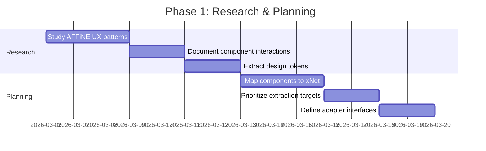

**Deliverables:**

- [ ] UX pattern documentation
- [ ] Component extraction priority list
- [ ] Design token library (colors, spacing, typography)
- [ ] Technical feasibility report

### Phase 2: Foundation (3 weeks)

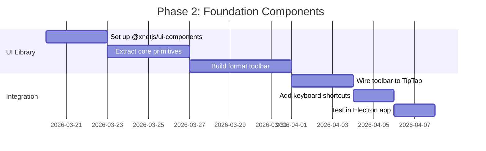

**Deliverables:**

- [ ] `@xnetjs/ui-components` package scaffolded
- [ ] Format toolbar component extracted and working
- [ ] Integration tests passing
- [ ] Electron app uses new toolbar

### Phase 3: Rich Features (4 weeks)

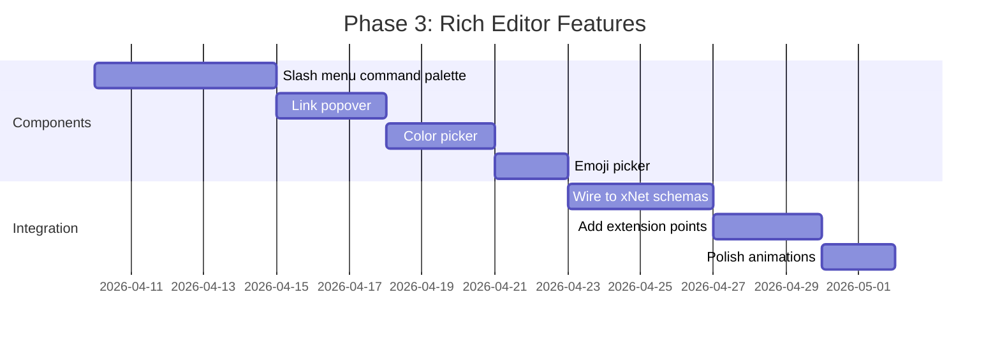

**Deliverables:**

- [ ] Slash menu with schema-based commands
- [ ] Link editing with node search
- [ ] Color and emoji pickers integrated
- [ ] Smooth animations throughout

### Phase 4: Canvas Enhancement (5 weeks)

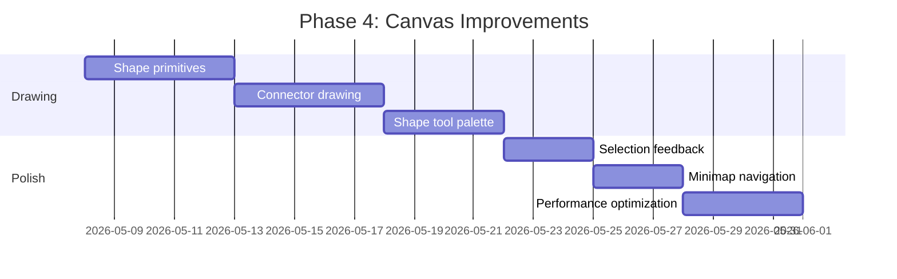

**Deliverables:**

- [ ] Shape drawing tools operational
- [ ] Connector/edge drawing with auto-routing
- [ ] Canvas minimap
- [ ] 60fps rendering maintained

### Phase 5: Database Views (4 weeks)

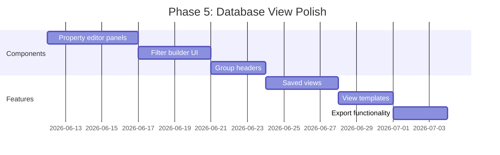

**Deliverables:**

- [ ] Rich property editors for all 15 types
- [ ] Intuitive filter builder
- [ ] Saved view system
- [ ] Export to CSV/JSON

---

## Risk Assessment

### Technical Risks

| Risk                                                                   | Severity  | Mitigation                                                         |
| ---------------------------------------------------------------------- | --------- | ------------------------------------------------------------------ |
| **Tight coupling** - Components too coupled to BlockSuite internals    | 🔴 High   | Start with most standalone components (color picker, emoji picker) |
| **Version drift** - BlockSuite updates break extracted code            | 🟡 Medium | Fork and vendor components; don't track upstream                   |
| **Performance** - Heavy adapters cause lag                             | 🟡 Medium | Use Strategy C (rebuild) instead of Strategy A (full integration)  |
| **Missing APIs** - xNet lacks BlockSuite equivalents                   | 🟡 Medium | Extend xNet APIs as needed (e.g., block nesting)                   |
| **Design inconsistency** - Extracted components don't match xNet theme | 🟢 Low    | Thoroughly restyle with Tailwind; treat as reference only          |

### Product Risks

| Risk                                                                   | Severity  | Mitigation                                                       |
| ---------------------------------------------------------------------- | --------- | ---------------------------------------------------------------- |
| **User confusion** - Partial AFFiNE UX creates inconsistent experience | 🟡 Medium | Ensure consistent interactions; don't half-copy                  |
| **Feature gap** - Users expect full AFFiNE features                    | 🟡 Medium | Set clear expectations; focus on core workflows                  |
| **Legal issues** - License or trademark concerns                       | 🟢 Low    | BlockSuite is MPL 2.0 (permissive); attribute properly           |
| **Legal issues** - License or trademark concerns                       | 🟡 Medium | BlockSuite is MPL 2.0 (weak copyleft, file-level); do not copy source files — copy only visual patterns and interactions |

---

## Recommendations

### Immediate Actions (This Week)

1. **Run AFFiNE locally** - Clone and explore the full experience
2. **Create UX audit document** - Screenshot and annotate key interactions
3. **Extract design tokens** - Colors, spacing, typography, shadows
4. **Identify 5 quick wins** - Standalone components to extract first

### Short Term (Next Month)

5. **Implement Strategy B for 3 components:**
   - Format toolbar (editor)
   - Color picker (shared)
   - Link popover (editor)
6. **Gather user feedback** - Does the UX improvement justify the effort?
7. **Refine extraction process** - Document patterns for future components

### Long Term (Next Quarter)

8. **Expand to canvas** - Shape tools, connector drawing
9. **Polish database views** - Property editors, filter UI
10. **Consider AI integration** - Study AFFiNE AI patterns; plan xNet AI

### Anti-Recommendations (DO NOT DO)

- ❌ **Don't attempt full BlockSuite integration** - Architectural mismatch is too severe
- ❌ **Don't fork AFFiNE** - Massive codebase with tight coupling
- ❌ **Don't abandon xNet's data model** - Event sourcing and auth are differentiators
- ❌ **Don't track BlockSuite updates** - Vendor extracted components and own the code

---

## Validation Checklist

### Before Committing to Integration

- [ ] Run AFFiNE locally and use it for real work for 1 week
- [ ] Document 10 specific UX improvements to replicate
- [ ] Verify BlockSuite components can be extracted without core runtime
- [ ] Prototype one extracted component (e.g., color picker) in xNet
- [ ] Measure performance impact of any adapter layer
- [ ] Confirm license compatibility (MPL 2.0 → MIT is compatible)
- [ ] Get user feedback on whether AFFiNE UX is worth the effort

### During Implementation

- [ ] Each extracted component has <100ms latency
- [ ] No BlockSuite core dependencies sneak in (only UI packages)
- [ ] xNet React APIs remain unchanged
- [ ] Event sourcing and audit trail still work
- [ ] Authorization checks still function
- [ ] Tests cover all adapted interactions
- [ ] Playwright tests verify UX matches intent
- [ ] Accessibility is maintained (keyboard nav, ARIA labels)

### Post-Implementation

- [ ] User testing shows UX improvement
- [ ] Performance benchmarks show no regression
- [ ] Code is maintainable by xNet team
- [ ] Documentation covers component usage
- [ ] Design system is coherent (no jarring inconsistencies)

---

## Technical Deep Dive: Adapter Layer

### Example: Format Toolbar Extraction

```typescript
// packages/ui-components/src/format-toolbar.tsx

import { useEditor } from '@xnetjs/editor'
import { useMutate } from '@xnetjs/react'

/**
 * Format toolbar adapted from BlockSuite's toolbar component
 * Visuals and interactions copied; data layer is pure xNet
 */
export function FormatToolbar({ nodeId }: { nodeId: string }) {
  const editor = useEditor() // xNet TipTap editor
  const mutate = useMutate()

  // BlockSuite-inspired UI but xNet commands
  return (
    <div className="format-toolbar">
      <Button
        active={editor.isActive('bold')}
        onClick={() => editor.chain().focus().toggleBold().run()}
        icon={<BoldIcon />}
        tooltip="Bold (⌘B)"
      />
      <Button
        active={editor.isActive('italic')}
        onClick={() => editor.chain().focus().toggleItalic().run()}
        icon={<ItalicIcon />}
        tooltip="Italic (⌘I)"
      />
      {/* ... more format buttons */}

      {/* Custom xNet feature: mention nodes */}
      <Button
        onClick={() => openNodeMentionMenu()}
        icon={<AtIcon />}
        tooltip="Mention node (@)"
      />
    </div>
  )
}
```

### Example: Canvas Shape Tool

```typescript
// packages/canvas/src/tools/shape-tool.tsx

import { useCanvasStore } from '@xnetjs/canvas'
import { createNodeId } from '@xnetjs/data'

/**
 * Shape drawing tool inspired by EdgelessEditor
 * Interaction pattern from BlockSuite; storage is xNet nodes
 */
export function ShapeTool({ type }: { type: 'rect' | 'circle' | 'triangle' }) {
  const canvas = useCanvasStore()

  const handleDraw = (position: { x: number, y: number, width: number, height: number }) => {
    // Create xNet node for shape (not BlockSuite block)
    const nodeId = createNodeId()
    canvas.addNode({
      id: nodeId,
      type: 'shape',
      position,
      properties: {
        shapeType: type,
        fill: '#ffffff',
        stroke: '#000000',
        strokeWidth: 2
      }
    })
  }

  // BlockSuite-inspired drawing interaction
  return <ShapeDrawingOverlay onDraw={handleDraw} />
}
```

---

## Alternative: Build Custom UI from Scratch

If extraction proves too complex, **building custom UI** may be faster:

### Pros of Custom Build

- ✅ Zero external dependencies
- ✅ Perfect fit for xNet architecture
- ✅ Full control over every detail
- ✅ No license/legal concerns
- ✅ No version drift risk

### Cons of Custom Build

- ⚠️ Slower to reach AFFiNE's polish level
- ⚠️ May miss subtle UX insights
- ⚠️ Requires strong design skills
- ⚠️ Need to "discover" solutions AFFiNE already has

### When to Choose Custom Build

Choose custom build if:

- You have a strong design/UX resource
- You value long-term maintainability over speed
- You want to differentiate from AFFiNE visually
- Component extraction proves too coupled to BlockSuite

---

## Conclusion

**AFFiNE's UX is world-class, but full integration would compromise xNet's architectural integrity.** The right approach is **selective UX borrowing**:

1. **Study deeply** - Run AFFiNE, document interactions, extract design patterns
2. **Start small** - Extract 3-5 high-value standalone components
3. **Rebuild strategically** - For complex features, use AFFiNE as reference, not source
4. **Preserve xNet core** - Never compromise event sourcing, schema system, or authorization
5. **Iterate** - Test with users; refine based on feedback

This approach gets the best of both worlds: **AFFiNE's polish with xNet's power**.

---

## Appendix: BlockSuite Package Breakdown

### Core Framework (❌ Not Usable)

- `@blocksuite/store` - Document store (incompatible with xNet)
- `@blocksuite/inline` - Rich text inline editing (tied to BlockSuite)
- `@blocksuite/block-std` - Block framework (fundamentally different from nodes)

### Editor Presets (❌ Not Usable)

- `@blocksuite/presets` - PageEditor, EdgelessEditor (too coupled)

### Block Implementations (⚠️ Reference Only)

- `@blocksuite/blocks` - 20+ block types (study for inspiration)

### Potentially Extractable UI

Look for standalone components in:

- Toolbar implementations
- Widget components
- Color pickers
- Icon pickers
- Property editors

**Extraction strategy:** Copy visual design and interaction patterns, not code.

---

## Appendix: xNet Architecture Strengths to Preserve

| Feature             | Why It Matters                              | Impact of Losing It           |
| ------------------- | ------------------------------------------- | ----------------------------- |
| **Event sourcing**  | Audit trail, time-travel, debugging         | Can't trace how data changed  |
| **Lamport clocks**  | Deterministic ordering, conflict resolution | Sync becomes unreliable       |
| **Signed changes**  | Security, non-repudiation, trust            | Can't verify who changed what |
| **Schema system**   | Type safety, validation, migrations         | Data corruption risks         |
| **Node-level auth** | Fine-grained permissions, UCAN delegation   | Can't share securely          |
| **SQLite storage**  | Performance, reliability, queries           | Lose fast queries and indexes |
| **React hooks API** | Developer experience, composability         | Harder to build features      |

**None of these should be sacrificed for UX polish.** UX can be improved without changing the foundation.

---

## References

- [AFFiNE GitHub](https://github.com/toeverything/AFFiNE)
- [BlockSuite GitHub](https://github.com/toeverything/blocksuite)
- [BlockSuite Documentation](https://blocksuite.io)
- [Yjs Documentation](https://docs.yjs.dev)
- xNet Exploration 0093: Node-Native Global Schema Federation Model
- xNet Exploration 0087: Telemetry Instrumentation Strategy

---

**Next Steps:** Review with team, prioritize extraction targets, begin Phase 1 research.
