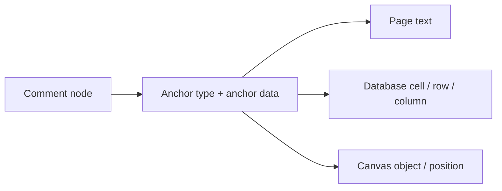
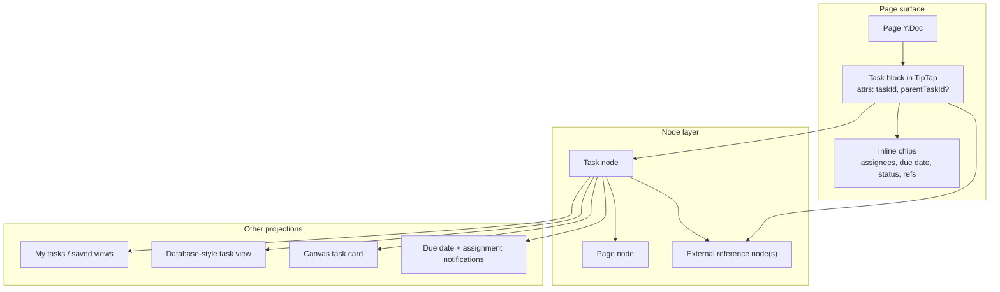
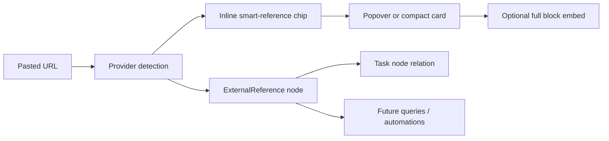
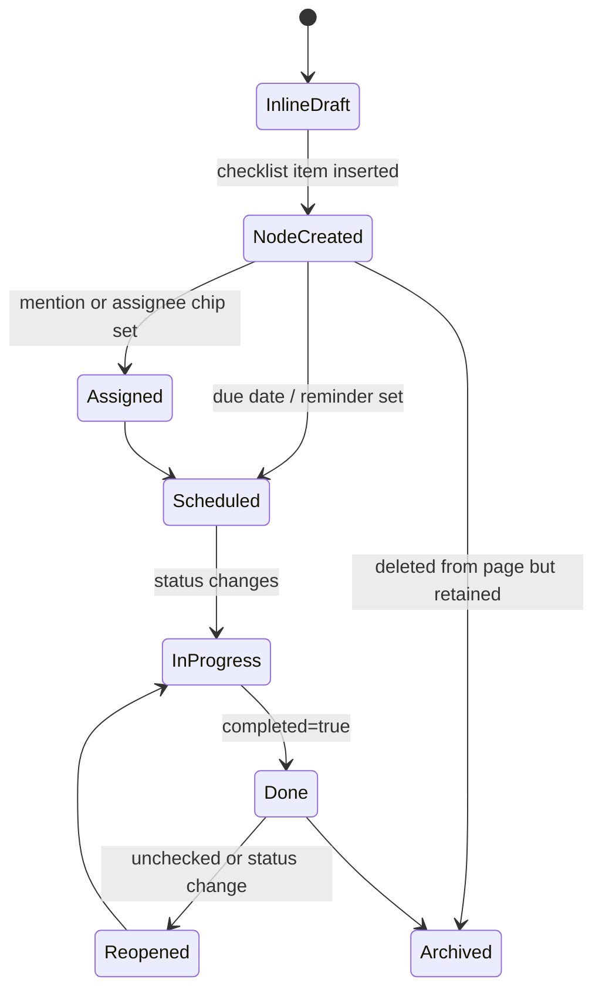
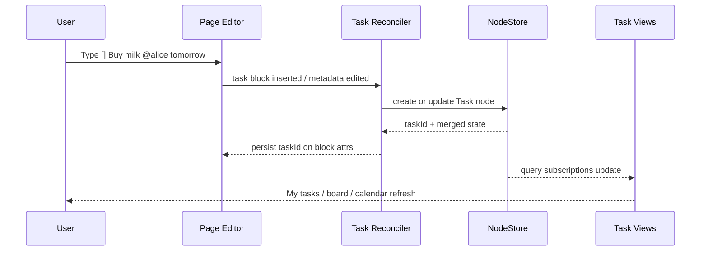

# Tasks As A Universal Primitive Across Pages, Databases, And Canvas

> Problem statement: xNet already has `Page`, `Task`, `Database`, `DatabaseRow`, `Canvas`, and `Comment` primitives, but checklist items inside rich text pages are still plain TipTap task blocks. The goal is to make page-native tasks feel excellent while ensuring each task is a first-class node that can later participate in assignment, due dates, notifications, databases, canvas, comments, and cross-workspace queries.

## ✨ Executive Summary

- xNet should **not** treat page checklist items as page-only text or as database rows.
- The strongest path is a **node-backed task projection** model:
  - `Task` nodes remain the canonical cross-surface object.
  - pages, databases, and canvas each render a surface-specific projection of that same task.
  - the page editor is simply the first place where task nodes are created and edited inline.
- This mirrors the repo's strongest existing pattern: **comments are universal nodes with surface-specific anchors**.
- The current codebase already contains most of the ingredients:
  - a built-in `TaskSchema`,
  - universal comments with typed anchors,
  - first-class `DatabaseRow` nodes,
  - Yjs-backed pages and canvas,
  - person/date/select property types,
  - query hooks and database views.
- The key missing pieces are:
  - a richer `TaskSchema`,
  - a TipTap task extension that stores `taskId`,
  - mention support in rich text,
  - a reconciliation layer between Yjs task blocks and `Task` nodes,
  - structured external references inside tasks,
  - query-backed task views outside databases.
- Recommendation:
  - Phase 1: implement node-backed tasks inside pages.
  - Phase 2: add smart references plus saved task views and database-style projections over `Task` nodes.
  - Phase 3: add task cards on canvas, notifications, recurring tasks, and workflow automations.

## 🧭 Current State In The Repository

### What exists today

- `packages/data/src/schema/schemas/task.ts`
  - Built-in `TaskSchema` already exists with `title`, `completed`, `status`, `priority`, `dueDate`, `assignee`, and `parent`.
  - It already declares `document: 'yjs'`, which is a strong foundation for richer task bodies later.
- `packages/editor/src/components/RichTextEditor.tsx`
  - The editor currently mounts plain TipTap `TaskList` and `TaskItem` extensions.
  - Task nesting is enabled via `TaskItem.configure({ nested: true })`.
  - There is no task/node bridge, no `taskId`, and no mention extension.
- `packages/editor/src/components/FloatingToolbar.tsx`
  - There is already an explicit mention placeholder: `TODO: Open mention picker`.
- `packages/editor/src/extensions/embed/EmbedExtension.ts`
  - xNet already has a block embed extension with auto-embed-on-paste behavior.
- `packages/editor/src/extensions/embed/providers.ts`
  - Existing embed providers already cover YouTube, Vimeo, Spotify, Twitter/X, Figma, CodeSandbox, and Loom.
- `packages/editor/src/extensions/live-preview/link-preview.ts`
  - The editor already has a link-aware preview plugin, which is a good substrate for inline smart-reference UX.
- `apps/electron/src/renderer/components/PageView.tsx`
  - Pages already combine `useNode(PageSchema, ...)`, Yjs collaboration, comments, and presence.
  - This is the right first integration point for node-backed tasks.
- `packages/data/src/schema/schemas/comment.ts`
  - Comments already use a universal-node model with a schema-agnostic `target` relation and typed anchors.
  - This is the cleanest conceptual precedent for universal tasks.
- `packages/data/src/schema/schemas/database-row.ts`
  - Database rows are already first-class nodes with per-property merge semantics.
  - This proves xNet can support "inline UI backed by real nodes".
- `packages/canvas/src/nodes/checklist-node.tsx`
  - Canvas has a checklist node today, but it stores raw `items[]` in canvas-local data, not `Task` nodes.
- `apps/electron/src/renderer/components/DatabaseView.tsx`
  - Databases already know how to surface `person` and `date` fields, and build live suggestions from active collaborators.
- `packages/views`
  - Board, timeline, calendar, and list-style task views already exist at the rendering layer.

### Current mismatch

| Area             | Current behavior                                | Limitation                                                                  |
| ---------------- | ----------------------------------------------- | --------------------------------------------------------------------------- |
| Page checklist   | TipTap-only task items                          | no node identity, no queryability, no notifications, no cross-surface reuse |
| Task schema      | first-class node exists                         | single assignee, no page anchor, no ordering key, no origin metadata        |
| Mentions         | comment parsing and DB person suggestions exist | no rich-text mention entity in page editor                                  |
| External links   | block embeds and link previews exist            | no inline smart-reference chip model for tasks                              |
| Database views   | powerful projections exist                      | only database-backed today, not query-backed task collections               |
| Canvas checklist | local checklist data                            | cannot share identity with page/database tasks                              |

### Important architectural precedent

Comments already show the pattern xNet should reuse:



Tasks should follow the same philosophy:

- one canonical task node,
- multiple placements and projections,
- surface-specific anchors or bindings,
- shared query and notification semantics.

## 🌍 External Research

## Notion

### Observed facts

- Notion task databases require a `Status`, `Assignee`, and `Due date` property, and can be converted from regular databases. Source: [Task databases & sprints](https://www.notion.com/help/sprints)
- Notion's `My tasks` aggregates assigned tasks across multiple task databases into one place and supports filtering, sorting, and layout customization. Source: [Home & My tasks](https://www.notion.com/en-gb/help/home-and-my-tasks)
- Notion sub-items are visible in all database views and can be shown as nested toggles or flattened lists depending on the view. Source: [Sub-items & dependencies](https://www.notion.com/help/tasks-and-dependencies)
- Notion dependencies can shift downstream task dates automatically. Source: [Sub-items & dependencies](https://www.notion.com/help/tasks-and-dependencies)
- Notion `@` mentions notify people, and people added to a `Person` property also show up in inbox/notifications. Sources: [Reminders & @mentions](https://www.notion.com/help/guides/reminders-and-mentions), [Inbox & notifications](https://www.notion.com/help/updates-and-notifications)
- Notion supports `@remind` in page content and reminders on database date properties. Source: [Reminders](https://www.notion.com/help/reminders)
- Notion supports pasting supported links as either a full preview or a compact mention, including GitHub, Linear, Figma, and other work tools. Source: [Link previews](https://www.notion.com/help/link-previews)

### What Notion gets right

- It treats tasks as **database records first**, not as formatting.
- It has a **global assigned-work surface** (`My tasks`) that cuts across local document placement.
- It lets subtask structure survive across multiple views.
- It attaches notifications to both **assignment** and **due-date/reminder** workflows.
- It distinguishes between **compact inline mention** and **larger preview**, which is exactly the right model for task references.

### Weakness relevant to xNet

- Notion's task magic is heavily coupled to database semantics. Inline page tasks feel good, but the strongest behaviors come from task databases rather than from a universal object model.

## Linear

### Observed facts

- Linear's canonical object is the issue; title and status are required, other properties and relations are optional. Source: [Create issues](https://linear.app/docs/creating-issues)
- Due dates surface directly on list and board views with strong visual urgency states and near/overdue notifications. Source: [Issue properties: Due dates](https://linear.app/docs/issue-properties)
- Referencing issues in a description or comment automatically creates a related-issue relationship. Source: [Issue relations](https://linear.app/docs/issue-relations/)
- Linear supports parent and sub-issues, status automation between them, and conversion from selected checklist/bulleted text into sub-issues. Source: [Parent and sub-issues](https://linear.app/docs/parent-and-sub-issues)
- Linear filters include assignee, due date, parent, sub-issue, blocking, blocked, duplicate, and content. Source: [Filters](https://linear.app/docs/filters)
- Linear also supports recurring issues and issue templates that can carry sub-issues. Source: [Create issues](https://linear.app/docs/creating-issues)
- Linear's GitHub integration links PRs and commits bidirectionally with issues and can drive status automation from Git state. Source: [GitHub integration](https://linear.app/integrations/github)
- Linear also has an attachment model for external resources, keyed by unique URL and rendered similarly to GitHub PRs. Source: [Attachments API](https://linear.app/docs/api/attachments)
- Linear embeds Figma designs directly into issue descriptions, comments, and documents. Source: [Figma integration](https://linear.app/docs/figma)

### What Linear gets right

- It treats tasks as **operational entities**, not documents.
- Cross-reference in text creates **real graph relationships**, not just links.
- It turns inline selection into structured issues, which is directly relevant to "turn checklist into task nodes".
- It prioritizes **fast filters, keyboard flows, and urgency signals** over visual ornament.
- It treats external artifacts like PRs, commits, and designs as **structured attachments**, not raw pasted URLs.

### Weakness relevant to xNet

- Linear is not multimodal. It is excellent at execution workflows, but not at blending page, database, and canvas representations of the same object.

## AFFiNE / BlockSuite

### Observed facts

- BlockSuite is built on Yjs and explicitly supports both `PageEditor` and `EdgelessEditor`, with shared real-time collaboration and state scheduling across multiple documents. Source: [BlockSuite README](https://github.com/toeverything/blocksuite)
- AFFiNE positions itself as a merged docs + whiteboards + databases workspace. Source: [AFFiNE homepage](https://affine.pro/)
- AFFiNE has been improving linked-doc/database integration, including syncing database properties into a linked document's doc info and surfacing backlinks there. Source: [What's new in AFFiNE - November 2024 Update](https://affine.pro/blog/whats-new-affine-nov-update)
- AFFiNE added database member properties and continued expanding database property types. Source: [What's New: April Update](https://affine.pro/blog/whats-new-april-update)
- AFFiNE improved linked docs in both page and edgeless modes, reinforcing one object rendered in multiple surfaces. Source: [What's new in AFFiNE - December 2024 Update](https://affine.pro/blog/whats-new-affine-dec-update)

### Inference

AFFiNE appears to lean toward a **doc-centric block graph** where databases and edgeless surfaces are alternate ways to organize shared block/doc entities, rather than maintaining a separate "task-only" system. This is partly inferred from public release notes and BlockSuite architecture, not from a formal AFFiNE data model document.

### What AFFiNE gets right

- Shared page/edgeless foundations reduce impedance between text and canvas.
- Linked docs plus synced properties are strong evidence for **surface projection over shared identity**.
- BlockSuite's multi-editor/Yjs foundation is unusually aligned with xNet's current architecture.

### Weakness relevant to xNet

- AFFiNE's public story is stronger around docs/whiteboards/databases than around a polished end-to-end task operating model on the level of Linear.

## Obsidian

### Observed facts

- Obsidian core tasks are Markdown checkboxes plus search operators like `task:`, `task-todo:`, and `task-done:`. Source: [Search](https://help.obsidian.md/plugins/search)
- Obsidian Bases gives database-like views over files and properties, but the source of truth stays in Markdown files and properties. Source: [Introduction to Bases](https://help.obsidian.md/bases)
- Obsidian Canvas stores data in open `.canvas` files using the JSON Canvas format. Source: [Canvas](https://help.obsidian.md/plugins/canvas)
- Dataview indexes tasks, list items, page properties, and inline metadata. It exposes task-level fields like `children`, `parent`, `blockId`, `due`, `completion`, and `path`. Sources: [Dataview Overview](https://blacksmithgu.github.io/obsidian-dataview/), [Metadata on Tasks and Lists](https://blacksmithgu.github.io/obsidian-dataview/annotation/metadata-tasks/)
- The Tasks plugin adds richer task semantics like due dates, recurrence, and cross-vault task queries while still editing the source Markdown task line. Source: [Tasks plugin introduction](https://publish.obsidian.md/tasks/Introduction)
- Obsidian also supports direct web-page and media embeds, including in canvas cards, but they remain mostly raw embed syntax rather than normalized external-object references. Source: [Embed web pages](https://help.obsidian.md/embed-web-pages)

### What Obsidian gets right

- It keeps tasks **user-legible and file-native**.
- It makes tasks broadly queryable by indexing text and metadata instead of forcing a heavy app-level object model.
- It has a strong ecosystem pattern of **derive views from source text**.

### Weakness relevant to xNet

- The model is fragmented across core features and plugins.
- Task metadata and task behavior are not strongly normalized at the platform level.
- Cross-surface identity is weaker than in Notion, Linear, or AFFiNE.

## 🔍 Key Findings

## 1. The best products separate **identity** from **surface**

- Linear: issue identity is primary; editor, relations, and views sit on top.
- Notion: task database row identity is primary; page bodies and views sit on top.
- AFFiNE: linked docs suggest shared identity rendered in multiple contexts.
- Obsidian: weaker identity, stronger textual openness.

For xNet, this points to:

- `Task` node identity should be canonical.
- page checklist rendering should be a projection, not the source of truth by itself.

## 2. Inline editing matters, but inline storage is not enough

Users want to:

- type `[] `,
- indent with `Tab`,
- `@mention` assignees inline,
- set due dates without leaving the editor,
- drag or re-indent tasks fluidly.

That does **not** imply the task should live only as a TipTap node.

## 3. Global task views are mandatory if task metadata exists

Once xNet supports:

- assignees,
- due dates,
- overdue states,
- subtasks,
- comments,
- notifications,

it must also support:

- "my tasks",
- "tasks due soon",
- "tasks on this page",
- "tasks assigned to Alice",
- "blocked tasks",
- "tasks on this canvas",
- saved filtered views.

Otherwise metadata becomes dead weight.

## 4. Assignment-by-mention is useful but should not be overly magical

The user's proposed behavior is directionally right, but raw mention parsing is risky:

- people mention others for discussion, not always assignment,
- a task line can contain historical mentions,
- task descriptions may reference people who are not owners.

Recommendation:

- make inline mentions first-class,
- auto-suggest "convert mentioned people to assignees",
- support a default heuristic for page task title lines,
- but keep assignee chips as an explicit editable property.

## 5. Databases should become **task projections**, not task containers

xNet already has a database-specific row model. That should remain useful.

But for tasks specifically:

- a task created in a page should not need to become a `DatabaseRow` to participate in a database-like view,
- a database-like surface should be able to query `Task` nodes directly,
- otherwise the system creates duplication, sync burden, and identity confusion.

## 6. Canvas should render tasks as cards, not invent a second checklist system

The current canvas checklist node is a useful interaction prototype, but it should not remain a separate task substrate if xNet wants universal tasks.

## 7. Tasks need typed external references, not just pasted URLs

If a task can point to:

- a GitHub issue or PR,
- a Figma frame,
- a YouTube video,
- a CodeSandbox,
- a Loom walkthrough,

then xNet should not treat that as only a link string inside rich text.

Instead, task references should support three display modes:

1. plain link,
2. compact smart-reference chip,
3. expanded preview or full embed.

This is the combined lesson from Notion and Linear:

- Notion is strong at **mention vs preview**,
- Linear is strong at **attachment vs workflow state**.

## ⚖️ Options And Tradeoffs

## Option A: Keep page tasks as TipTap/Yjs only

### Shape

- Extend `taskItem` attrs with assignee/due date metadata.
- Persist everything only in page Yjs.
- Derive task lists by scanning page documents.

### Pros

- Smallest editor-only implementation.
- Minimal schema churn.
- Easy to preserve current page UX.

### Cons

- No first-class node identity.
- Hard to comment on, notify, permission, or link to tasks.
- Expensive global indexing across many Yjs docs.
- Poor fit with xNet's existing `TaskSchema`.
- Canvas/database integration becomes projection-from-text instead of projection-from-object.

### Verdict

Reject. This is an Obsidian-like path without Obsidian's file simplicity.

## Option B: Node-backed tasks embedded in pages

### Shape

- Each page task item gets a durable `taskId`.
- Task metadata lives on a `Task` node.
- The page Yjs doc stores structure, inline content, ordering, and parent/child nesting presentation.
- A reconciler keeps block content and task node properties in sync.

### Pros

- Preserves inline authoring.
- Gives each task identity, relations, and queryability.
- Aligns with comment and database-row precedents.
- Cleanest path to database views, notifications, canvas cards, and structured external references.

### Cons

- Requires reconciliation logic.
- Introduces dual storage for some fields like title and completion.
- Needs careful undo/redo and conflict design.

### Verdict

Recommended.

## Option C: Convert page tasks into database rows

### Shape

- Creating a checklist item implicitly creates a row in a hidden database.
- The page block becomes a view onto that row.

### Pros

- Reuses database view machinery more directly.
- Rows already have ordering and query semantics.

### Cons

- Rows are semantically children of a database, which is the wrong ontology for a page-native task.
- Hidden databases are confusing.
- Harder to represent tasks that should exist outside a database.
- Couples task UX to the database package too early.

### Verdict

Avoid as the canonical model.

## ✅ Recommendation

Adopt **Option B: node-backed tasks embedded in pages**, and define tasks as a universal primitive similar to comments.

### Recommended model



### Recommended schema direction

Evolve `TaskSchema` so it can represent both page-native and cross-surface tasks:

- keep:
  - `title`
  - `completed`
  - `status`
  - `priority`
  - `dueDate`
  - `parent`
- change:
  - `assignee` -> `assignees: person({ multiple: true })`
- add:
  - `page: relation({ target: Page })`
  - `source: select(page | database | canvas | automation | api)`
  - `anchorBlockId: text()` for the current canonical block on a page
  - `sortKey: text()` for sibling ordering
  - `startDate` or `scheduledDate`
  - `remindAt`
  - `blockedBy: relation({ target: Task, multiple: true })`
  - `blocks: relation({ target: Task, multiple: true })`
  - `references: relation({ multiple: true })` if xNet introduces normalized external-reference nodes
  - `archived` or `deletedFromSurface` flags if needed

### Recommended page binding model

- Treat the page's Yjs task block as the **authoring projection**.
- Treat the `Task` node as the **canonical query object**.
- Mirror these fields from the page block into the node:
  - title text,
  - checked/completed,
  - page relation,
  - parent relation,
  - sibling order,
  - assignees/due date if edited inline.
- Keep richer task body/details either:
  - in task node properties for scalar metadata, and
  - optionally in the task node's own Yjs document for expanded task notes.

### Recommended mention semantics

- Introduce a real TipTap mention entity that stores DIDs, not display-only strings.
- Resolve mentions against:
  - current presence users,
  - known collaborators,
  - future people directory / identity index.
- For page tasks:
  - mentions in the title line should offer "Assign mentioned people".
  - explicit assignee chips should remain the ground truth.
- Do not make every mention in a long task description silently rewrite assignees.

### Recommended external reference strategy

- Keep task lines compact by default.
- When a supported URL is pasted into a task, convert it to an inline smart-reference chip.
- On hover or expand:
  - show a richer card preview,
  - or convert it into a full block embed when the user explicitly chooses that mode.

Recommended modeling:

- use a dedicated `ExternalReference` or `Attachment` node for normalized metadata,
- let the inline task chip store `referenceId`,
- let the task node hold relations to those reference nodes,
- let the existing block `EmbedExtension` remain the full-preview path.

This is cleaner than shoving provider JSON into task attrs, because it enables:

- provider-specific sync,
- reference reuse across tasks or pages,
- comments on external artifacts later,
- better indexing and deduplication by URL.

### Display model for task references



Suggested defaults:

- GitHub issue / PR: inline chip with status, repo, number
- Figma file / frame: inline chip with file title and design icon
- YouTube / Loom: inline chip with title and duration if available
- Rich media that matters for execution context: expandable preview
- Everything else: stay as a normal link until a provider can normalize it

### Recommended database strategy

Do **not** require tasks to live in a database.

Instead, add a new concept:

- saved task views or query-backed collections over `Task` nodes.

This can later converge with databases in one of two ways:

1. Database views learn how to target arbitrary schemas plus filters, not only `DatabaseRow`.
2. A lighter `CollectionView`/`SavedView` node becomes the shared abstraction for "table/board/calendar over any schema".

The second path is cleaner and avoids overloading the current `Database` meaning.

### Recommended canvas strategy

- Replace or supplement the current checklist node with task cards that bind to `Task` nodes.
- Let canvas store layout and visual grouping only.
- Let task data stay in the task node.

This mirrors the page recommendation:

- surface owns layout and interaction,
- task node owns identity and metadata.

## 🧩 Detailed Design Notes

## Task lifecycle



## Reconciliation flow



## Data ownership rules

| Field                                 | Canonical owner                  | Why                                    |
| ------------------------------------- | -------------------------------- | -------------------------------------- |
| task identity                         | `Task` node                      | global referenceability                |
| status / due date / assignees         | `Task` node                      | query + notifications                  |
| external provider metadata            | `ExternalReference` node         | sync, dedupe, provider-aware rendering |
| page placement                        | page Yjs + task `page` relation  | both surface and global query need it  |
| parent/subtask relation               | `Task` node                      | cross-view hierarchy                   |
| sibling visual order in page          | `sortKey` on `Task` node         | stable across projections              |
| inline rich title text                | page Yjs, mirrored to node title | preserves rich editing ergonomics      |
| inline smart-reference chip placement | page Yjs task block              | preserves authoring ergonomics         |
| expanded notes                        | task Yjs doc later               | avoids overloading page block          |

## Risks And Open Questions

## 1. Dual-write complexity

Risk:

- title/completion may exist in both page Yjs and node state.

Mitigation:

- designate page block edits as the source for inline task content,
- designate node state as the source for scalar metadata outside the page,
- use transaction origins to avoid feedback loops.

## 2. Undo/redo across Yjs and NodeStore

Risk:

- user hits undo and page text changes but task metadata does not, or vice versa.

Mitigation:

- batch page-task mutations into one editor command abstraction,
- consider a page-task transaction origin recognized by both Yjs and node mutations,
- validate against the database undo strategy already used in `DatabaseView`.

## 3. Mention identity resolution

Risk:

- `@alice` is ambiguous across peers and workspaces.

Mitigation:

- store DIDs canonically,
- render display names as presentation only,
- allow unresolved mention placeholders until identity selection is confirmed.

## 4. Deleting a task block

Risk:

- should deleting a checklist item hard-delete the task node, archive it, or detach it from the page?

Recommendation:

- near-term: soft archive or "removed from page" state,
- later: offer explicit delete vs keep-in-task-list behavior.

## 5. Moving tasks between pages

Risk:

- drag-and-drop across pages changes parentage, anchors, backlinks, and sort order.

Recommendation:

- support intra-page moves first,
- treat cross-page move as "rebind canonical page + anchorBlockId".

## 6. Infinite nesting vs operational clarity

The user wants arbitrarily deep subtasks. That is reasonable for storage, but most tools become hard to use past 3-4 levels.

Recommendation:

- support arbitrary depth in the model,
- optimize UI for 3-4 levels,
- add collapse/expand and breadcrumbs before emphasizing deeper trees.

## 7. Notifications and permissions

Task notifications will eventually need:

- per-assignee routing,
- due reminders,
- permission-aware visibility,
- mute/follow settings.

This is feasible, but only once task identity is canonical and assignees are normalized.

## 8. Provider integrations and auth

Structured external references introduce a new class of complexity:

- some providers are public and parseable from URL alone,
- some providers need OAuth or app tokens,
- some previews can be embedded as iframes,
- some should be metadata-only chips for privacy and performance.

Recommendation:

- start with URL-parsed public metadata and existing embed providers,
- add authenticated provider resolvers later for GitHub, Linear, Figma, and similar apps,
- design the model so the task still works even if metadata fetch fails.

## 🛠️ Implementation Checklist

## Phase 1: Page-native node-backed tasks

- [ ] Design `TaskSchema` v2 and migration path from the current built-in schema.
- [x] Add `assignees` multi-person support.
- [x] Add `page`, `anchorBlockId`, `sortKey`, and task relation fields.
- [x] Build a custom TipTap task extension that stores `taskId`.
- [x] Add rich-text mention support that resolves to DIDs.
- [x] Add inline due-date and assignee chips to task rows.
- [x] Add inline smart-reference chips for supported URLs inside task lines.
- [x] Reuse the existing embed provider registry for first-pass provider detection.
- [x] Define normalized `ExternalReference` metadata shape and relation strategy.
- [x] Create a page task reconciler that maps editor operations to node mutations.
- [x] Persist parent/subtask relations from indentation.
- [x] Decide delete semantics: archive vs detach vs hard delete.
- [x] Add task-specific tests for page editing, indentation, reassignment, due-date edits, and URL-to-chip conversion.

## Phase 2: Cross-surface views

- [x] Add `useTasks` / schema-query helpers for `TaskSchema`.
- [x] Build "My tasks" and "Tasks on this page" views.
- [ ] Add saved filters for assignee, due date, status, and hierarchy state.
- [ ] Allow embedded task views inside pages.
- [ ] Prototype board/calendar/timeline projections over direct `Task` queries.
- [ ] Decide whether this is a new `SavedView` node or an extension of `Database`.

## Phase 3: Canvas + automations

- [ ] Replace canvas-local checklist data with task-backed cards.
- [ ] Add dependency visualization (`blockedBy`, `blocks`) on canvas.
- [ ] Add due-date reminders and assignment notifications.
- [ ] Add provider resolvers for GitHub issue/PR state, Figma file metadata, and media titles.
- [ ] Add recurring task support.
- [ ] Add automation hooks for assignee changes, overdue states, and reminder delivery.

## 🧪 Validation Checklist

- [x] Creating a checklist item in a page creates exactly one `Task` node.
- [x] Toggling a checkbox updates `Task.completed` and all subscribed task views.
- [ ] Indenting/outdenting updates parent/subtask relations deterministically.
- [ ] Reordering sibling tasks preserves stable order across peers.
- [x] `@mention` insertion stores canonical DIDs, not only display strings.
- [x] Multiple mentions can populate multiple assignees without duplicate entries.
- [x] Editing due dates inline updates all task projections immediately.
- [ ] Pasting a GitHub, Figma, Loom, or YouTube URL into a task produces the expected inline chip or fallback link.
- [ ] Structured references degrade gracefully when provider metadata is unavailable.
- [ ] Full block embeds remain opt-in so task rows stay compact.
- [ ] Page comments, task comments, and database/canvas task views can all target the same task node.
- [ ] Undo/redo behaves coherently for page text plus task metadata.
- [x] Removing a task from a page follows the chosen archive/detach semantics consistently.
- [ ] Query-backed task views remain performant with thousands of tasks.
- [ ] No orphaned task nodes are created during rapid collaborative edits.

## 💡 Example Code

### Proposed schema evolution

```typescript
/**
 * Illustrative only: likely Task v2 direction.
 */
import type { InferNode } from '../types'
import { defineSchema } from '../define'
import { checkbox, date, person, relation, select, text } from '../properties'

export const TaskSchemaV2 = defineSchema({
  name: 'Task',
  namespace: 'xnet://xnet.fyi/',
  version: '2.0.0',
  properties: {
    title: text({ required: true, maxLength: 500 }),
    completed: checkbox({ default: false }),
    status: select({
      options: [
        { id: 'todo', name: 'To Do', color: 'gray' },
        { id: 'in-progress', name: 'In Progress', color: 'blue' },
        { id: 'done', name: 'Done', color: 'green' },
        { id: 'cancelled', name: 'Cancelled', color: 'red' }
      ] as const,
      default: 'todo'
    }),
    priority: select({
      options: [
        { id: 'low', name: 'Low', color: 'gray' },
        { id: 'medium', name: 'Medium', color: 'yellow' },
        { id: 'high', name: 'High', color: 'orange' },
        { id: 'urgent', name: 'Urgent', color: 'red' }
      ] as const,
      default: 'medium'
    }),
    assignees: person({ multiple: true }),
    dueDate: date({}),
    remindAt: date({}),
    page: relation({ target: 'xnet://xnet.fyi/Page@1.0.0' as const }),
    parent: relation({ target: 'xnet://xnet.fyi/Task@2.0.0' as const }),
    blockedBy: relation({ target: 'xnet://xnet.fyi/Task@2.0.0' as const, multiple: true }),
    blocks: relation({ target: 'xnet://xnet.fyi/Task@2.0.0' as const, multiple: true }),
    anchorBlockId: text({}),
    sortKey: text({}),
    source: select({
      options: [
        { id: 'page', name: 'Page' },
        { id: 'database', name: 'Database' },
        { id: 'canvas', name: 'Canvas' },
        { id: 'automation', name: 'Automation' },
        { id: 'api', name: 'API' }
      ] as const,
      default: 'page'
    })
  },
  document: 'yjs'
})

export type TaskV2 = InferNode<(typeof TaskSchemaV2)['_properties']>
```

### Proposed page-task reconciliation shape

```typescript
type TaskBlockSnapshot = {
  taskId?: string
  parentTaskId?: string
  text: string
  completed: boolean
  mentions: string[] // DIDs
  dueDate?: number
  sortKey: string
}

export async function upsertPageTask(
  pageId: string,
  snapshot: TaskBlockSnapshot,
  createTask: (input: Record<string, unknown>) => Promise<{ id: string }>,
  updateTask: (id: string, input: Record<string, unknown>) => Promise<void>
): Promise<string> {
  const properties = {
    title: snapshot.text,
    completed: snapshot.completed,
    assignees: snapshot.mentions,
    dueDate: snapshot.dueDate,
    page: pageId,
    parent: snapshot.parentTaskId,
    sortKey: snapshot.sortKey,
    source: 'page'
  }

  if (!snapshot.taskId) {
    const task = await createTask(properties)
    return task.id
  }

  await updateTask(snapshot.taskId, properties)
  return snapshot.taskId
}
```

### Proposed structured reference shape

```typescript
type ExternalReferenceKind =
  | 'issue'
  | 'pull-request'
  | 'design'
  | 'video'
  | 'sandbox'
  | 'document'
  | 'link'

type ExternalReference = {
  id: string
  url: string
  provider: 'github' | 'figma' | 'youtube' | 'loom' | 'codesandbox' | 'generic'
  kind: ExternalReferenceKind
  externalId?: string
  title?: string
  subtitle?: string
  icon?: string
  state?: string
  previewMode: 'chip' | 'card' | 'embed'
  lastSyncedAt?: number
  metadata?: Record<string, unknown>
}

type TaskInlineReference = {
  referenceId: string
  displayText: string
}
```

## 📌 Next Actions

1. Finalize whether tasks should use a dedicated `TaskSchema` v2 or a new `PageTaskSchema` that later converges back into `Task`.
2. Prototype a custom TipTap task extension with `taskId`, inline assignee chips, and due-date pills.
3. Build the page-task reconciler before attempting databases or canvas integration.
4. Design the first query-backed task view (`My tasks`) immediately after Phase 1 so metadata has a payoff.
5. Decide whether query-backed cross-schema views should extend `Database` or become a new `SavedView` primitive.

## 🔗 References

### xNet codebase

- `packages/data/src/schema/schemas/task.ts`
- `packages/data/src/schema/schemas/page.ts`
- `packages/data/src/schema/schemas/comment.ts`
- `packages/data/src/schema/schemas/database-row.ts`
- `packages/editor/src/components/RichTextEditor.tsx`
- `packages/editor/src/components/FloatingToolbar.tsx`
- `packages/editor/src/extensions/embed/EmbedExtension.ts`
- `packages/editor/src/extensions/embed/providers.ts`
- `packages/editor/src/extensions/live-preview/link-preview.ts`
- `apps/electron/src/renderer/components/PageView.tsx`
- `apps/electron/src/renderer/components/DatabaseView.tsx`
- `packages/canvas/src/nodes/checklist-node.tsx`
- `docs/explorations/0014_[x]_COMMENTING_SYSTEM.md`
- `docs/explorations/0041_[x]_DATABASE_DATA_MODEL.md`
- `docs/explorations/0088_[_]_DATABASE_UI_COMPETITIVE_ARCHITECTURE.md`

### External sources

- Notion: [Sub-items & dependencies](https://www.notion.com/help/tasks-and-dependencies)
- Notion: [Task databases & sprints](https://www.notion.com/help/sprints)
- Notion: [Home & My tasks](https://www.notion.com/en-gb/help/home-and-my-tasks)
- Notion: [Reminders](https://www.notion.com/help/reminders)
- Notion: [Reminders & @mentions](https://www.notion.com/help/guides/reminders-and-mentions)
- Notion: [Inbox & notifications](https://www.notion.com/help/updates-and-notifications)
- Notion: [Link previews](https://www.notion.com/help/link-previews)
- Linear: [Create issues](https://linear.app/docs/creating-issues)
- Linear: [Issue properties: Due dates](https://linear.app/docs/issue-properties)
- Linear: [Issue relations](https://linear.app/docs/issue-relations/)
- Linear: [Parent and sub-issues](https://linear.app/docs/parent-and-sub-issues)
- Linear: [Filters](https://linear.app/docs/filters)
- Linear: [GitHub integration](https://linear.app/integrations/github)
- Linear: [Attachments API](https://linear.app/docs/api/attachments)
- Linear: [Figma integration](https://linear.app/docs/figma)
- AFFiNE: [AFFiNE homepage](https://affine.pro/)
- AFFiNE: [What's new in AFFiNE - November 2024 Update](https://affine.pro/blog/whats-new-affine-nov-update)
- AFFiNE: [What's new in AFFiNE - December 2024 Update](https://affine.pro/blog/whats-new-affine-dec-update)
- AFFiNE: [What's New: April Update](https://affine.pro/blog/whats-new-april-update)
- BlockSuite: [GitHub README](https://github.com/toeverything/blocksuite)
- Obsidian: [Introduction to Bases](https://help.obsidian.md/bases)
- Obsidian: [Canvas](https://help.obsidian.md/plugins/canvas)
- Obsidian: [Search](https://help.obsidian.md/plugins/search)
- Obsidian: [Properties view](https://help.obsidian.md/plugins/properties)
- Obsidian: [Embed web pages](https://help.obsidian.md/embed-web-pages)
- Dataview: [Overview](https://blacksmithgu.github.io/obsidian-dataview/)
- Dataview: [Metadata on Tasks and Lists](https://blacksmithgu.github.io/obsidian-dataview/annotation/metadata-tasks/)
- Tasks plugin: [Introduction](https://publish.obsidian.md/tasks/Introduction)
