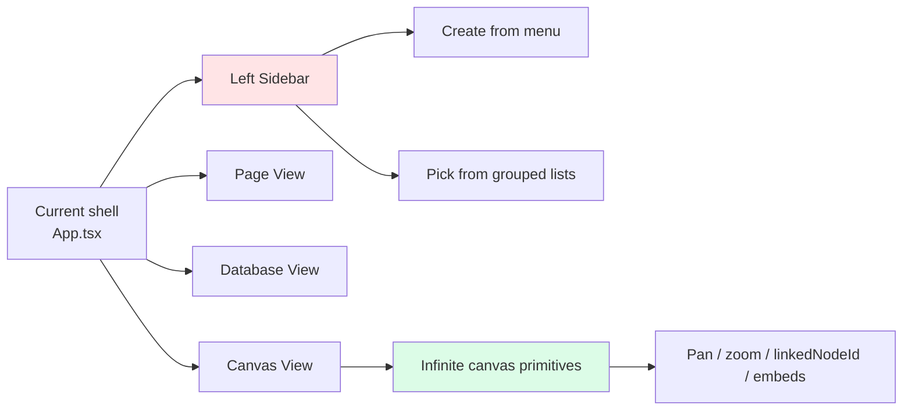
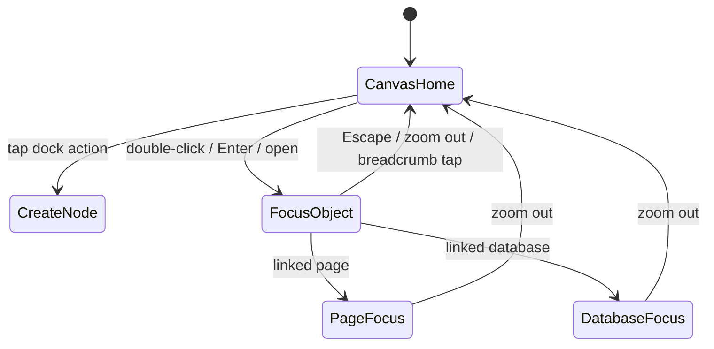
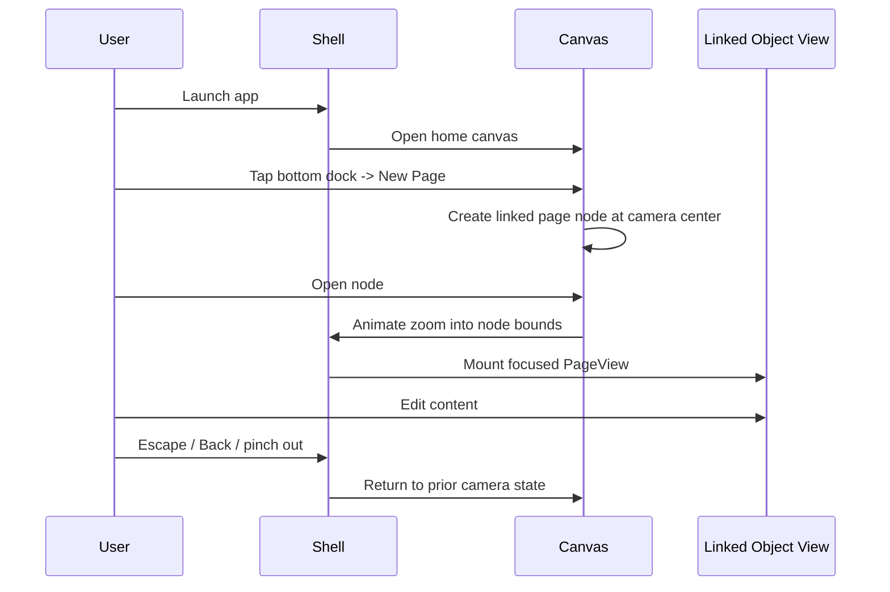
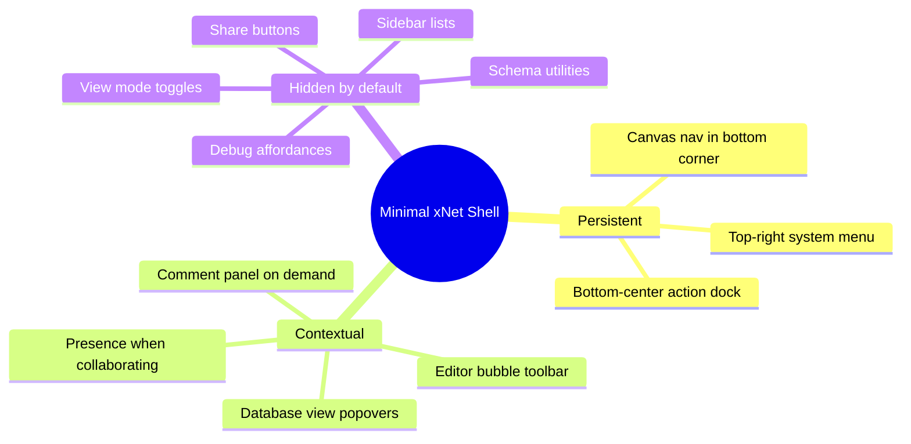

# 0104 - Canvas-First Minimal UX for the Primary App

> **Status:** Exploration  
> **Date:** 2026-03-05  
> **Author:** Codex  
> **Tags:** ux, canvas, affine, shell, navigation, electron, editor, database

## Problem Statement ✳️

xNet's primary Electron app currently behaves like a conventional document app:

- a permanent left sidebar for navigation and creation
- a top titlebar plus per-view top toolbars
- separate page, database, and canvas surfaces

That is functional, but it fights the product direction the user described:

- canvas should feel like the default home
- documents and databases should emerge from the canvas, not from a file browser
- most controls should disappear until they are needed
- creating and editing should feel spatial, direct, and calm

The goal of this exploration is to define a **dramatically simpler, AFFiNE-inspired, canvas-first shell** that preserves xNet's architecture and implementation momentum.

## Executive Summary 🎯

The most pragmatic path is **not** a full AFFiNE-style engine rewrite. It is a shell simplification project built on top of the current xNet packages:

- Make a single canvas the default landing surface in [`apps/electron/src/renderer/App.tsx`](../../apps/electron/src/renderer/App.tsx).
- Replace the permanent left sidebar with:
  - one **top-right system/profile menu**
  - one **bottom-center creation/action dock**
  - contextual controls that appear only when editing or selecting
- Treat page and database nodes as **canvas-linked objects** that can be opened with a zoom transition into focused full-screen mode.
- Keep advanced actions in the command palette, native menu bar, or contextual popovers instead of persistent toolbars.
- Reuse the existing canvas package's spatial model and linked/embed node direction instead of inventing a new document model.

Recommendation:

1. Ship a **hybrid canvas-first shell** first.
2. Defer full embedded live doc/database editing on the canvas until shell simplification is working.
3. Keep exactly two persistent UI anchors:
   - top-right profile/system menu
   - bottom-center action dock

This is the cleanest route to a much calmer UX without discarding the current xNet stack.

## Current State in the Repository 🔎

### Observed app shell

Today the Electron renderer composes a classic sidebar-driven application in [`apps/electron/src/renderer/App.tsx`](../../apps/electron/src/renderer/App.tsx):

- top titlebar with app name and theme toggle
- left [`Sidebar`](../../apps/electron/src/renderer/components/Sidebar.tsx)
- content area that switches between `PageView`, `DatabaseView`, `CanvasView`, and `SettingsView`
- empty state when nothing is selected

That means the current primary interaction is:

`pick from list -> open object -> use object-specific toolbar`

instead of:

`enter canvas -> place object -> zoom into object -> zoom back out`

### Observed persistent chrome

Current persistent chrome is spread across multiple layers:

- [`Sidebar`](../../apps/electron/src/renderer/components/Sidebar.tsx)
  - creation dropdown
  - grouped document lists
  - delete buttons per item
  - settings entry
- [`apps/electron/src/renderer/components/PageView.tsx`](../../apps/electron/src/renderer/components/PageView.tsx)
  - large document header
  - presence, sync, share, comment count
  - editor layout with optional comments sidebar
- [`apps/electron/src/renderer/components/DatabaseView.tsx`](../../apps/electron/src/renderer/components/DatabaseView.tsx)
  - title input
  - schema badge
  - clone action
  - comments action
  - view switcher
  - add row button
  - share button
- [`apps/electron/src/renderer/components/CanvasView.tsx`](../../apps/electron/src/renderer/components/CanvasView.tsx)
  - title input
  - add node
  - center button
  - presence
  - instructional hint text
  - share button

### Important architectural assets already present

The repo already contains the right foundations for a simplified shell:

- `@xnetjs/canvas` supports an infinite canvas with pan, zoom, selection, fit-to-content, and linked node metadata.
- [`packages/canvas/src/types.ts`](../../packages/canvas/src/types.ts) includes `linkedNodeId` on canvas nodes.
- [`packages/canvas/src/nodes/embed-node.tsx`](../../packages/canvas/src/nodes/embed-node.tsx) already points toward page/database embedding.
- [`packages/canvas/src/components/NavigationTools.tsx`](../../packages/canvas/src/components/NavigationTools.tsx) already models compact bottom-corner navigation controls.
- The rich text editor already prefers a contextual floating toolbar over always-visible formatting chrome.

### Current mismatch

The shell is still list-first, while the primitives are already moving toward space-first interaction.



## External Research 🌍

### AFFiNE patterns worth borrowing

From AFFiNE's official materials:

- AFFiNE explicitly positions **edgeless** as a primary product surface, not an auxiliary whiteboard.  
  Source: [AFFiNE July 2024 update](https://affine.pro/blog/whats-new-affine-2024-07)
- AFFiNE added **Center Peek** so linked documents can be previewed and edited without a full context switch.  
  Source: [AFFiNE July 2024 update](https://affine.pro/blog/whats-new-affine-2024-07)
- AFFiNE added **synced docs** so multiple pages can live on one whiteboard and stay live-linked.  
  Source: [AFFiNE July 2024 update](https://affine.pro/blog/whats-new-affine-2024-07)
- AFFiNE later improved **linked doc and database integration**, including creating docs from databases and syncing properties into document info.  
  Source: [AFFiNE November 2024 update](https://affine.pro/blog/whats-new-affine-nov-update)
- AFFiNE also shipped a **floating sidebar** and separated doc mode from current view mode.  
  Source: [AFFiNE November 2024 update](https://affine.pro/blog/whats-new-affine-nov-update)

### BlockSuite signals

BlockSuite's official site describes itself as:

- a **headless editor framework**
- shipping **interoperable components**
- being **collaborative at core**

That matters because the best AFFiNE lesson for xNet is not "copy every screen." It is "make the shell more headless and let different editing surfaces share a calmer interaction model."  
Source: [BlockSuite](https://blocksuite.io/)

### Platform guidance relevant to "fewer buttons"

Apple's HIG materials still align with the user's request:

- not every menu item needs an icon
- long menus should be shortened or grouped
- toolbars should hold edge-placed controls, not become the entire product

That supports moving secondary actions out of persistent view toolbars and into menus/command surfaces.  
Sources:

- [Menus | Apple Developer Documentation](https://developer.apple.com/design/human-interface-guidelines/menus)
- [UIToolbar | Apple Developer Documentation](https://developer.apple.com/documentation/uikit/uitoolbar)

### Inference from the research

Observed fact:

- AFFiNE succeeds by keeping the primary surface spatial and using linked content, peeking, and mode shifts instead of a dense persistent control layer.

Inference:

- xNet does **not** need AFFiNE's full block architecture to capture most of the perceived UX gain. It mainly needs a calmer app shell, spatial entry point, and better transitions between overview and focus.

## Key Findings 🧠

### 1. The sidebar is the biggest source of "old app" feeling

The permanent sidebar in [`Sidebar.tsx`](../../apps/electron/src/renderer/components/Sidebar.tsx) does too much:

- create
- browse
- manage
- delete
- settings

That makes the app feel like a file manager wrapped around canvases, rather than a canvas-native workspace.

### 2. xNet already has the right primitive for minimal navigation: zoom

The canvas stack already knows how to:

- pan
- zoom
- fit to content
- treat objects spatially

So the most coherent navigation system is:

- **zoom out for workspace context**
- **zoom in for object focus**

not:

- sidebar hierarchy
- nested panes
- repeated top bars

### 3. Page UX is already halfway minimal

`PageView` is closer to the target than the other surfaces:

- the rich text editor uses contextual formatting
- comments already use popovers and an optional sidebar

The remaining issue is the large header + surrounding app chrome.

### 4. Database UX needs heavier compression, not elimination

Database editing has more operational controls than documents:

- view type
- add row
- schema/version
- comments
- share

A zero-button database UI is unrealistic. The right move is to **compress controls into a single dock plus contextual popovers**, not pretend they do not exist.

### 5. Canvas-linked objects are already technically plausible

Because canvas nodes already have `linkedNodeId`, xNet can represent:

- page cards on canvas
- database cards on canvas
- future live previews and embeds

without changing the underlying Page/Database/Canvas schemas.

### 6. The app should stop treating "nothing selected" as a blank state

The current welcome state in `App.tsx` is an explicit empty screen. The user wants the opposite:

- the app should open to a living spatial surface
- creation should happen directly there

## Options and Tradeoffs ⚖️

### Option 1. Keep current shell, just reduce visual weight

What it means:

- slimmer sidebar
- smaller headers
- icon-only controls

Pros:

- lowest implementation cost
- minimal routing/state churn

Cons:

- does not fundamentally change the interaction model
- still feels list-first
- fails the user's canvas-first intent

### Option 2. Hybrid canvas-first shell

What it means:

- canvas is the default landing surface
- sidebar is removed from the persistent shell
- page/database objects live as nodes/cards on canvas
- opening an object triggers a zoom/focus transition into full-screen editing
- top-right menu and bottom action dock remain persistent

Pros:

- delivers most of the desired feel
- fits current architecture
- preserves separate page/database/canvas implementations
- creates a clean path to richer embedding later

Cons:

- requires a new shell state model
- needs strong transition design to avoid feeling like hard route swaps

### Option 3. Full unified AFFiNE-style multimodal document model

What it means:

- pages, databases, and whiteboard become variants of one deeper mode system
- full live editing of docs/databases inside canvas becomes first-class

Pros:

- highest long-term elegance
- closest to AFFiNE behavior

Cons:

- conflicts with the prior 0102 finding against heavy BlockSuite/AFFiNE-style integration
- substantially higher migration risk
- too much architecture churn for a shell simplification project

## Recommendation ✅

Choose **Option 2: Hybrid canvas-first shell**.

### The target shell

Keep only two permanent anchors:

1. **Top-right profile/system menu**
   - profile
   - settings
   - workspace/share/session controls
   - theme
   - help/debug
2. **Bottom-center action dock**
   - create page
   - create database
   - create canvas item/frame
   - search / command palette
   - recent items

Everything else becomes contextual:

- text formatting only when text is selected
- database controls only when database is focused
- canvas navigation in a bottom corner
- comments hidden until requested
- share hidden in the system menu or a focused object menu

### Interaction model



### Recommended spatial behavior



### Why this is the right boundary

It captures the UX win the user wants:

- calm first impression
- spatial organization
- almost no permanent buttons
- documents and databases feel like things in space

while respecting the codebase reality:

- `PageView` can stay a focused full-screen editor
- `DatabaseView` can stay a focused full-screen data surface
- `CanvasView` becomes the app home and navigation map

## Proposed UX Architecture 🏗️

### Shell decomposition



### Concrete UI rules

#### 1. Global shell rules

- No permanent left sidebar.
- No permanent titlebar text besides platform drag affordance if needed.
- Theme toggle moves into the profile/system menu.
- Native desktop menu bar handles standard file/edit/view actions.

#### 2. Canvas home rules

- App opens to the user's home canvas by default.
- Empty state becomes a canvas with a subtle onboarding prompt near the bottom dock.
- Creating a page/database immediately places a node near the current viewport center.
- The canvas title is de-emphasized or hidden unless explicitly renamed.

#### 3. Focused page rules

- Remove the large persistent document header.
- Show title inline, near the top edge, only on focus/hover or while editing.
- Keep the editor's contextual toolbar and slash menu as the primary affordances.
- Move share/comments/sync into a compact corner menu or inspector chip.

#### 4. Focused database rules

- Replace the wide database header with one compact focus bar.
- Put view switching, add row, filters, and schema actions into a single bottom dock or compact top chip group.
- Keep advanced schema/version actions in a secondary popover.

#### 5. Comments and collaboration rules

- Presence avatars should collapse into a small stack unless hovered.
- Comments should open from badges or inline indicators, not a permanently visible rail.
- Share should not occupy top-level space unless the object is explicitly in collaboration mode.

## Migration Strategy 🚚

### Phase 1. Shell simplification without live embed editing

Change only the shell:

- replace sidebar-first app state with canvas-home state
- open page/database views from canvas-linked nodes
- add zoom transitions

This yields the big UX win early.

### Phase 2. Canvas-linked object intelligence

Improve canvas nodes:

- page cards show title + excerpt
- database cards show title + mini view metadata
- cards support peek, rename, duplicate, and open

### Phase 3. Selective inline preview

Add lightweight previews:

- page preview card
- database preview card
- possibly read-only embed preview before full live editing

### Phase 4. True multimodal cross-surface editing

Only after the shell works:

- richer inline editing
- deeper doc/database embedding
- possible shared transition model with peeking and split view

## Risks and Unknowns 🚨

- **Discoverability risk:** removing too much chrome can make first-run behavior feel opaque.
- **Database density risk:** structured workflows still need fast access to row/view/schema commands.
- **Electron window chrome risk:** removing visible title structure must still preserve drag regions and native-feeling window controls.
- **Navigation risk:** route changes disguised as zooms can feel fake if camera restoration is not solid.
- **Collaboration risk:** comments, presence, and share need a predictable secondary home once the toolbar clutter is removed.

## Implementation Checklist 🛠️

- [x] Add a shell state model that distinguishes `canvas-home`, `page-focus`, `database-focus`, and `settings`.
- [x] Make a default home canvas and open it on app launch instead of rendering the current empty state.
- [x] Remove the persistent left sidebar from the main renderer shell.
- [x] Introduce a bottom-center action dock with create/search/recent actions.
- [ ] Introduce a top-right profile/system menu containing settings, theme, share/session, and debug actions.
- [x] Represent pages and databases as linked canvas nodes using existing `linkedNodeId` direction.
- [x] Replace hard view switching with zoom-in/zoom-out shell transitions.
- [x] Compress `PageView` header chrome into lightweight contextual controls.
- [ ] Compress `DatabaseView` controls into a compact dock plus popovers.
- [ ] Reuse or adapt `NavigationTools` for persistent bottom-corner canvas navigation.
- [x] Move advanced/rare actions into command palette or secondary menus.
- [x] Add onboarding copy that teaches exactly three interactions: create, open, zoom out.

## Validation Checklist 🧪

- [ ] Verify the app always lands on a canvas, including first-run and empty-workspace flows.
- [ ] Verify a new page/database appears at the current viewport center.
- [ ] Verify opening a linked object preserves spatial context and restores it on exit.
- [ ] Verify keyboard-only flows still work: command palette, open, rename, zoom out, undo/redo.
- [ ] Verify comment, share, and presence affordances remain discoverable without persistent sidebars.
- [ ] Verify database-focused workflows still expose row/view/schema operations in two interactions or fewer.
- [ ] Verify the shell remains usable on small laptop widths without bringing back a sidebar.
- [ ] Verify reduced-motion mode falls back from zoom animation to clean state swaps.
- [ ] Verify Playwright/Electron manual checks cover canvas home, page focus, database focus, and collaboration affordances.

## Example Code 💡

The shell can be simplified without rewriting the underlying views by introducing a focused state machine like this:

```ts
/**
 * Minimal shell state for a canvas-first workspace.
 */
export type ShellMode =
  | { kind: 'canvas-home'; canvasId: string }
  | { kind: 'page-focus'; canvasId: string; pageId: string; returnViewport: ViewportSnapshot }
  | {
      kind: 'database-focus'
      canvasId: string
      databaseId: string
      returnViewport: ViewportSnapshot
    }
  | { kind: 'settings'; canvasId: string }

export type ViewportSnapshot = {
  x: number
  y: number
  zoom: number
}

export type CreateIntent = 'page' | 'database' | 'canvas-card'

export function createLinkedNodeAtViewport(
  intent: CreateIntent,
  viewport: ViewportSnapshot
): {
  type: 'card' | 'embed'
  linkedSchema: 'page' | 'database' | 'canvas'
  position: { x: number; y: number; width: number; height: number }
} {
  const basePosition = {
    x: viewport.x - 180,
    y: viewport.y - 120,
    width: 360,
    height: intent === 'database' ? 240 : 180
  }

  return {
    type: 'embed',
    linkedSchema: intent === 'canvas-card' ? 'canvas' : intent,
    position: basePosition
  }
}

export function reduceShellAction(
  state: ShellMode,
  action:
    | { type: 'open-page'; pageId: string; returnViewport: ViewportSnapshot }
    | { type: 'open-database'; databaseId: string; returnViewport: ViewportSnapshot }
    | { type: 'zoom-out' }
    | { type: 'open-settings' }
    | { type: 'close-settings' }
): ShellMode {
  switch (action.type) {
    case 'open-page':
      if (state.kind !== 'canvas-home') return state
      return {
        kind: 'page-focus',
        canvasId: state.canvasId,
        pageId: action.pageId,
        returnViewport: action.returnViewport
      }

    case 'open-database':
      if (state.kind !== 'canvas-home') return state
      return {
        kind: 'database-focus',
        canvasId: state.canvasId,
        databaseId: action.databaseId,
        returnViewport: action.returnViewport
      }

    case 'zoom-out':
      if (state.kind === 'canvas-home') return state
      return { kind: 'canvas-home', canvasId: state.canvasId }

    case 'open-settings':
      return { kind: 'settings', canvasId: state.canvasId }

    case 'close-settings':
      return { kind: 'canvas-home', canvasId: state.canvasId }
  }
}
```

This keeps the implementation aligned with the existing architecture:

- focused views still mount `PageView` and `DatabaseView`
- canvas remains the spatial source of truth for navigation context
- the shell owns transitions and visibility of global chrome

## Next Actions 📌

1. Prototype the hybrid shell in Electron only.
2. Do not start with live embedded editing inside the canvas.
3. Remove the sidebar before polishing the focused views, because that is the largest UX shift.
4. Use motion sparingly: the zoom transition must preserve orientation, not become decoration.
5. Once the shell lands, run a second pass on database control compression.

## References 🔗

### Repo references

- [Prior AFFiNE exploration](../../docs/explorations/0102_[_]_AFFINE_BLOCKSUITE_INTEGRATION_FEASIBILITY.md)
- [Electron app shell](../../apps/electron/src/renderer/App.tsx)
- [Sidebar](../../apps/electron/src/renderer/components/Sidebar.tsx)
- [Canvas view](../../apps/electron/src/renderer/components/CanvasView.tsx)
- [Page view](../../apps/electron/src/renderer/components/PageView.tsx)
- [Database view](../../apps/electron/src/renderer/components/DatabaseView.tsx)
- [Canvas types](../../packages/canvas/src/types.ts)
- [Canvas embed node](../../packages/canvas/src/nodes/embed-node.tsx)
- [Canvas navigation tools](../../packages/canvas/src/components/NavigationTools.tsx)

### Web references

- [AFFiNE Docs: Get Started](https://docs.affine.pro/)
- [AFFiNE July 2024 update](https://affine.pro/blog/whats-new-affine-2024-07)
- [AFFiNE November 2024 update](https://affine.pro/blog/whats-new-affine-nov-update)
- [AFFiNE June 2025 update](https://affine.pro/blog/whats-new-june-update)
- [BlockSuite](https://blocksuite.io/)
- [Apple HIG: Menus](https://developer.apple.com/design/human-interface-guidelines/menus)
- [Apple Developer: UIToolbar](https://developer.apple.com/documentation/uikit/uitoolbar)
