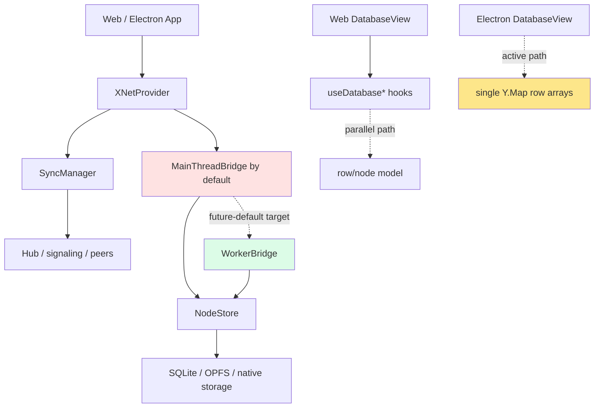
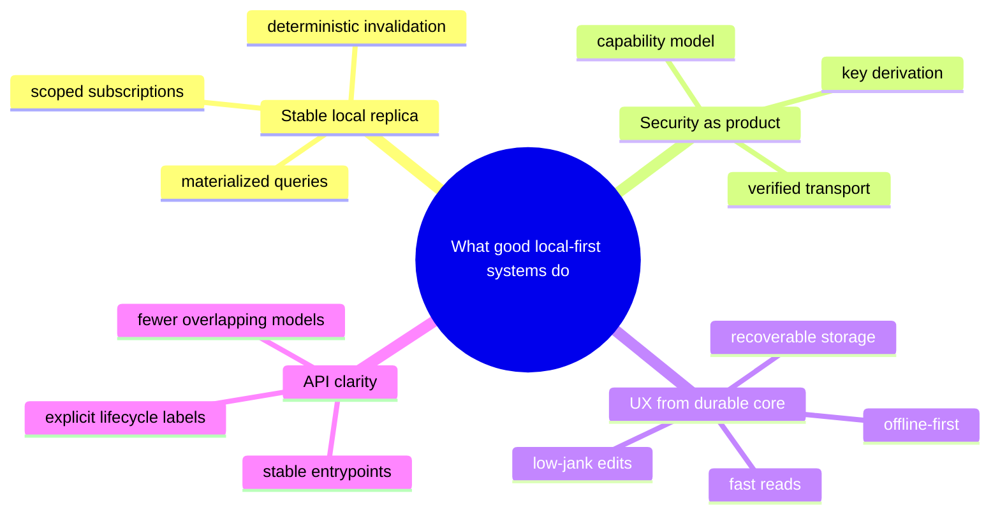
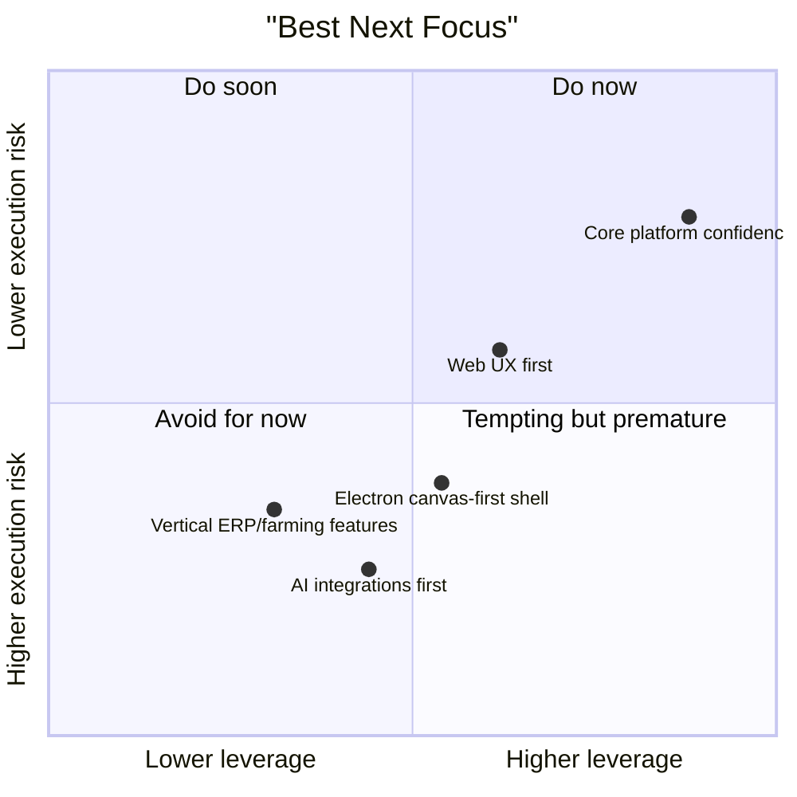
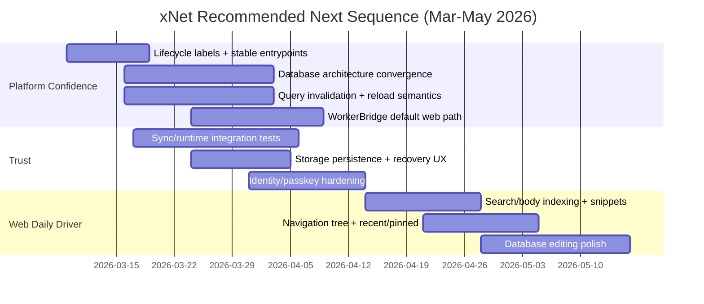

# 0105 - What To Work On Next After Open Source Launch

> **Status:** Exploration  
> **Date:** 2026-03-06  
> **Author:** Codex  
> **Scope:** product strategy, API design, sync reliability, web UX, platform sequencing

## Problem Statement ✳️

xNet is through an important transition:

- the monorepo is public,
- npm packages are live,
- the web demo is real,
- the Electron app is usable,
- the hub exists,
- and the core architecture is no longer hypothetical.

The question is no longer "can xNet be built?" It is:

> **What should xNet work on next so the API becomes genuinely excellent, the sync/security model becomes trustworthy at scale, and the product experience can expand from a strong foundation instead of from momentum alone?**

This exploration reviews the repository as it exists on **March 6, 2026**, cross-checks it with prior internal reviews and current external guidance, and recommends a concrete next focus area.

---

## Executive Summary 🎯

**Recommendation:** the next major body of work should be a **Core Platform Confidence release**, not a broad feature expansion.

If I reduce the answer to one sentence:

> **Make `@xnetjs/react` + `@xnetjs/data` + background sync feel like one stable, well-tested, performance-aware platform before spending major cycles on new product surfaces.**

### Why this is the right next move

The repo already has unusually strong primitives:

- `@xnetjs/sync` is mature and well tested.
- `@xnetjs/data` has real schema and authorization machinery.
- `@xnetjs/canvas` is farther along than most early local-first canvas efforts.
- the web app, Electron app, and hub all exist now.

But the highest-leverage gaps are still at the **developer-facing boundary**:

- the public API surface is broad and not yet clearly tiered,
- the default React path is still main-thread centric,
- query invalidation is coarser than it should be,
- databases still have parallel editing models,
- the most important hook/sync infrastructure is still under-tested relative to its importance,
- and the web app still exposes the limits of the underlying query/navigation model.

### Recommended priority order

1. **API and package-surface convergence**
2. **Reactive query and background-sync hardening**
3. **Web durability and performance guarantees**
4. **Web daily-driver UX**
5. **Electron canvas-first shell**
6. **AI integrations and vertical apps**

### Implementation progress

- [x] API and package-surface convergence: publish the lifecycle matrix, relabel package maturity, and add explicit subpath entrypoints for `@xnetjs/react`, `@xnetjs/data`, `@xnetjs/identity`, and `@xnetjs/data-bridge`
- [x] Reactive runtime convergence: add explicit `XNetProvider` runtime modes, visible fallback state, and platform-specific runtime intent for web and Electron
- [x] Reactive query and background-sync hardening
- [x] Web durability and performance guarantees
- [ ] Web daily-driver UX
- [ ] Electron canvas-first shell
- [ ] AI integrations and vertical apps

### What not to prioritize yet

Do **not** make farming ERP, social, voice chat, or broad AI automation the next top-level focus. Those are good future directions, but they will benefit far more from a stable kernel than from being built on partially converged APIs.

---

## Current State In The Repository 🔎

## What is already strong

### 1. The sync/data foundations are real

- `@xnetjs/sync` has a broad test surface and meaningful security primitives in [`packages/sync`](../../packages/sync).
- `NodeStore.applyRemoteChange()` now verifies hash and signature before applying remote changes in [`packages/data/src/store/store.ts`](../../packages/data/src/store/store.ts).
- the network sync protocol now verifies signed envelopes when present in [`packages/network/src/protocols/sync.ts`](../../packages/network/src/protocols/sync.ts).

### 2. Canvas is no longer just an idea

`@xnetjs/canvas` already has:

- viewport culling,
- LOD support,
- routing,
- edge bundling,
- worker layout,
- chunking,
- comments,
- presence.

That package is materially ahead of the database editing stack in terms of architectural momentum.

### 3. The codebase already contains the "next architecture"

The repo contains serious work toward:

- a `DataBridge` abstraction in [`packages/data-bridge`](../../packages/data-bridge),
- background sync orchestration in [`packages/react/src/sync`](../../packages/react/src/sync),
- database hooks in [`packages/react/src/hooks/useDatabase.ts`](../../packages/react/src/hooks/useDatabase.ts),
- web + Electron app shells,
- hub auth, relay, and indexing.

The next step is not invention. It is **convergence**.

## What is still structurally rough

### 1. The default React path is still not the final architecture

Observed facts:

- `XNetProvider` now exposes explicit runtime mode selection, fallback policy, and visible runtime status in [`packages/react/src/context.ts`](../../packages/react/src/context.ts).
- the web app now requests worker mode with explicit main-thread fallback in [`apps/web/src/App.tsx`](../../apps/web/src/App.tsx).
- the `WorkerBridge` path exists and is active in the web runtime, but it still needs deeper proving around benchmarks, search flows, and larger workspaces in [`packages/data-bridge/src/worker-bridge.ts`](../../packages/data-bridge/src/worker-bridge.ts).

Inference:

- xNet now has an explicit runtime story instead of an implicit one, but the worker-first path still needs more durability and performance proof before it can be treated as fully settled.

### 2. Query invalidation is still too coarse for the experience you want

Observed facts:

- `MainThreadBridge`, `NativeBridge`, and `WorkerBridge` now converge on a shared `QueryDescriptor`, descriptor matching, and bounded reload fallback in [`packages/data-bridge/src/main-thread-bridge.ts`](../../packages/data-bridge/src/main-thread-bridge.ts), [`packages/data-bridge/src/native-bridge.ts`](../../packages/data-bridge/src/native-bridge.ts), and [`packages/data-bridge/src/worker-bridge.ts`](../../packages/data-bridge/src/worker-bridge.ts).
- `useQuery()` now derives canonical descriptor keys and delegates `reload()` to the active bridge in [`packages/react/src/hooks/useQuery.ts`](../../packages/react/src/hooks/useQuery.ts).
- the standalone local query engine still full-scans documents in [`packages/query/src/local/engine.ts`](../../packages/query/src/local/engine.ts).
- global search now indexes body text and snippets through the shared page-document search path in [`apps/web/src/components/GlobalSearch.tsx`](../../apps/web/src/components/GlobalSearch.tsx) and [`packages/query/src/search/document.ts`](../../packages/query/src/search/document.ts).
- backlinks now use the same live page/runtime surface as search in [`apps/web/src/components/BacklinksPanel.tsx`](../../apps/web/src/components/BacklinksPanel.tsx) and [`apps/web/src/hooks/usePageSearchSurface.ts`](../../apps/web/src/hooks/usePageSearchSurface.ts).

Inference:

- the live-query kernel is materially stronger now, and the main remaining work is benchmark/release-gate proof plus deeper background-sync hardening rather than basic search/backlink correctness.

### 3. The database stack still has parallel models

Observed facts:

- `@xnetjs/react` exposes `useDatabase`, `useDatabaseDoc`, `useDatabaseRow`, and cell-level hooks in [`packages/react/src/index.ts`](../../packages/react/src/index.ts).
- the web database view now composes over those hooks, with legacy compatibility centralized in [`packages/data/src/database/legacy-model.ts`](../../packages/data/src/database/legacy-model.ts) and consumed from [`apps/web/src/components/DatabaseView.tsx`](../../apps/web/src/components/DatabaseView.tsx).
- explicit legacy-to-canonical materialization now exists in [`packages/data/src/database/legacy-migration.ts`](../../packages/data/src/database/legacy-migration.ts), and [`useDatabaseDoc()`](../../packages/react/src/hooks/useDatabaseDoc.ts) now surfaces migration status plus a deliberate migration action.
- the Electron database view now also composes over [`useDatabaseDoc()`](../../packages/react/src/hooks/useDatabaseDoc.ts) and [`useDatabase()`](../../packages/react/src/hooks/useDatabase.ts) in [`apps/electron/src/renderer/components/DatabaseView.tsx`](../../apps/electron/src/renderer/components/DatabaseView.tsx), with row-backed edits routed through structured undo scope while schema/rich-text document undo remains Yjs-scoped.
- canonical row reordering now accepts row ids at the hook boundary in [`packages/react/src/hooks/useDatabase.ts`](../../packages/react/src/hooks/useDatabase.ts), backed by corrected fractional-index positioning in [`packages/data/src/database/row-operations.ts`](../../packages/data/src/database/row-operations.ts).
- package-level proof now exists for cross-device row ordering, row-count convergence, and idempotent legacy materialization after canonical rows sync in [`packages/data/src/database/row-operations.test.ts`](../../packages/data/src/database/row-operations.test.ts) and [`packages/data/src/database/legacy-migration.test.ts`](../../packages/data/src/database/legacy-migration.test.ts).
- history and hook coverage now proves intention-based structured undo for row edits and row-create batches in [`packages/history/src/history.test.ts`](../../packages/history/src/history.test.ts), [`packages/react/src/hooks/useUndoScope.test.tsx`](../../packages/react/src/hooks/useUndoScope.test.tsx), and [`packages/react/src/hooks/useUndo.test.tsx`](../../packages/react/src/hooks/useUndo.test.tsx).

Inference:

- xNet is now partway through the convergence:
  - the web surface is on the hook-driven path,
  - the explicit one-way migration/materialization path now exists,
  - Electron now uses the same row/column/view hook model,
  - and structured undo now matches the converged row model.

The remaining database question is narrower now: whether schema metadata stays Yjs-backed behind the hook layer or eventually becomes fully node-native as well.

### 4. The public API surface is too large to honestly call fully stable

Observed facts:

- `packages/react/src/index.ts` is **592 lines** of exports.
- `packages/data/src/index.ts` is **463 lines**.
- `packages/canvas/src/index.ts` is **333 lines**.
- `packages/identity/src/index.ts` still mixes legacy and new key-bundle/passkey surfaces in one entrypoint.
- `packages/README.md` marks essentially the entire portfolio as `Stable` in [`packages/README.md`](../../packages/README.md).
- `docs/ROADMAP.md` still lists lifecycle labeling and stable-vs-experimental entrypoints as unfinished work in [`docs/ROADMAP.md`](../../docs/ROADMAP.md).

Inference:

- the repo is exporting too much from top-level entrypoints relative to how settled those contracts actually are.

### 5. The weakest test depth is concentrated exactly where your API promise lives

Measured locally in this repo:

| Area                       | Test files | Source files | Signal                       |
| -------------------------- | ---------: | -----------: | ---------------------------- |
| `packages/react/src/hooks` |          9 |           44 | thin for the main public API |
| `packages/sync/src`        |         22 |           50 | strong                       |
| `packages/data/src`        |         44 |          150 | solid but broad surface      |
| `packages/canvas/src`      |         22 |           92 | respectable                  |
| `packages/identity/src`    |         12 |           39 | decent but security-critical |

This matches the qualitative picture from [`docs/reviews/2026-02-06/10-test-coverage.md`](../../docs/reviews/2026-02-06/10-test-coverage.md): the kernel is tested best at the primitive layer, less at the hook/runtime boundary.

### 6. The web app has real product surface, but it still exposes kernel limitations

Observed facts:

- the root shell is already usable in [`apps/web/src/routes/__root.tsx`](../../apps/web/src/routes/__root.tsx).
- global search now uses shared body/snippet indexing in [`apps/web/src/components/GlobalSearch.tsx`](../../apps/web/src/components/GlobalSearch.tsx).
- the sidebar no longer applies fixed-size query caps in [`apps/web/src/components/Sidebar.tsx`](../../apps/web/src/components/Sidebar.tsx).
- backlinks now resolve through the same runtime-backed page surface in [`apps/web/src/components/BacklinksPanel.tsx`](../../apps/web/src/components/BacklinksPanel.tsx).
- the web app uses OPFS-backed SQLite in [`apps/web/src/App.tsx`](../../apps/web/src/App.tsx), but I did not find a `navigator.storage.persist()` request in the web app.

Inference:

- the next major gains in web feel will come from **query/navigation/storage hardening**, not just visual polish.

## Current Dependency Reality



---

## External Research 🌍

The external research mostly reinforced the repo review instead of contradicting it.

### 1. React’s official guidance favors exactly the kind of store boundary xNet is building

- React documents `useSyncExternalStore` as the correct primitive for reading external stores safely in concurrent rendering.
- React also documents `useEffectEvent` as a way to keep effect callbacks current without turning them into resubscription triggers.

Implication for xNet:

- the direction of `useQuery` + `DataBridge` is right,
- but the surrounding invalidation, subscription scoping, and bridge default path need to be tightened until the external-store story is genuinely first-class.

### 2. Local-first systems consistently separate "materialized local view" from transport

- The Ink & Switch local-first paper emphasizes fast local response, offline operation, multi-device sync, collaboration, ownership, security, and durability as one coherent product promise.
- ElectricSQL’s client guidance similarly treats local materialization/subscription as a first-class boundary rather than leaking transport concerns into the UI.

Implication for xNet:

- React hooks should feel like they are reading from a **stable local replica**, not from a thin async wrapper around store scans and room subscriptions.

### 3. Yjs gives xNet strong document primitives, but xNet still has to productize the policy layer

- Yjs official docs reinforce that document updates, awareness, and merge/update flows are intentionally transport-agnostic.

Implication for xNet:

- xNet’s competitive advantage is not "we use Yjs."
- It is:
  - the quality of the public API around Yjs,
  - the signature/authz/encryption story around Yjs,
  - and the way structured data, docs, and background sync fit together.

### 4. Browser durability still requires explicit product handling

- MDN and web.dev both make it clear that persistent browser storage is something apps should explicitly request or reason about; durability is not automatic.

Implication for xNet:

- if the web app is going to be the first thing many users touch, storage persistence and recoverability need to be part of the product flow, not just part of the implementation.

### 5. WebAuthn-derived secrets are a real platform lever

- MDN documents WebAuthn extensions including PRF-based derivation support.

Implication for xNet:

- passkey-backed key derivation should keep moving toward a stronger "derive secret material from the authenticator" story rather than lingering around insecure or legacy fallback paths.

## External Pattern Summary



---

## Key Findings 🧠

### 1. xNet is no longer blocked by missing primitives; it is blocked by convergence

The main risk is not "we do not have a sync engine" or "we do not have a canvas." The risk is that too many **valid partial systems** coexist:

- main-thread bridge vs worker bridge,
- row-node database hooks vs Y.Doc database arrays,
- legacy vs new identity surfaces,
- stable-package marketing vs experimental-package reality.

That is the signature of a project that should consolidate before expanding.

### 2. `@xnetjs/react` is the strategic center of gravity

If xNet wants "the API to be really good," the core product is not just NodeStore or Yjs. It is the **React-facing contract**:

- how data is read,
- how data is written,
- how sync behaves when components mount/unmount,
- how presence/background sync behaves,
- how much main-thread work every mutation causes.

That means the next most important work is **not** just adding more views. It is making the React contract boringly trustworthy.

### 3. Query/reactivity work is upstream of almost every UX goal you mentioned

You want:

- fast UI,
- synchronized background tasks,
- cross-device correctness,
- solid database UX,
- excellent web experience.

All of those depend on:

- better query materialization,
- better invalidation,
- better off-main-thread execution,
- and clearer database state ownership.

### 4. Canvas is important, but it is not the first bottleneck

The canvas package looks ambitious and real. The largest remaining product risks are elsewhere:

- query scalability,
- database editing model convergence,
- storage durability,
- hook API clarity,
- background sync test coverage.

So the right move is not "pause everything and build the infinite canvas dream first." It is "make the kernel sturdy enough that the canvas can later become the shell without dragging unresolved data-model problems behind it."

### 5. Web should be the first experience expansion, but only after kernel work starts landing

This fits your stated priority order and the codebase reality:

- the web app is the first impression,
- it is already real,
- and its rough edges today mostly trace back to kernel/query/navigation limits.

### 6. AI integration should come after permissions + API shape, not before

xNet already has meaningful integration surfaces:

- plugins,
- local APIs,
- MCP,
- webhooks,
- Electron long-running process potential.

That is good news. It means AI integration does **not** need brand-new infrastructure first. It needs:

- stable APIs,
- explicit capability boundaries,
- and a clean permissioned automation model.

---

## Options And Tradeoffs ⚖️

## Option A: Push web UX first

### What this means

- improve nav/search,
- polish create/open flows,
- add more onboarding refinement,
- focus on visible product quality immediately.

### Pros

- faster user-facing progress,
- better demo story,
- easier to show weekly momentum.

### Cons

- bakes more UX onto a still-shifting query/database core,
- increases refactor cost later,
- risks optimizing around current architectural compromises.

## Option B: Core Platform Confidence release first

### What this means

- API tiering,
- hook/runtime hardening,
- query/invalidation overhaul,
- database model convergence,
- sync/security/durability test gauntlet,
- then web UX on top.

### Pros

- directly matches your stated priorities,
- improves every downstream surface,
- de-risks scale,
- gives future AI/plugin/ERP work a stable contract.

### Cons

- less flashy for a few weeks,
- requires restraint against shiny feature work.

## Option C: Electron canvas-first shell first

### What this means

- make the spatial shell the product center,
- reduce chrome,
- lean into the AFFiNE-style canvas-first direction now.

### Pros

- strong differentiation,
- emotionally exciting,
- aligns with your long-term UX vision.

### Cons

- puts shell innovation ahead of database/query convergence,
- risks building a beautiful top layer over unresolved core behavior.

## Option D: AI integration first

### What this means

- lean into MCP, agents, plugins, automation, OpenClaw-style workflows.

### Pros

- timely,
- differentiating,
- compelling story for ownership + AI.

### Cons

- amplifies every current permission/API ambiguity,
- higher risk of shipping footguns,
- wrong dependency order for a security-first product.

## Option Comparison



---

## Recommendation ✅

## The next thing to work on

Work on a **Core Platform Confidence release** with this explicit thesis:

> **By the end of this phase, xNet’s app-facing API should feel stable, the default web path should move closer to off-main-thread/local-materialized behavior, sync durability/security should be testable end-to-end, and the web app should be ready for focused daily-driver UX work.**

## Recommended sequence

### Phase 1: API Clarity And Convergence

Focus:

- publish lifecycle labels (`stable`, `experimental`, `internal`, `deprecated`) honestly,
- split curated entrypoints from kitchen-sink entrypoints,
- decide the canonical database architecture,
- reduce overlapping public surfaces in `react`, `identity`, and related packages.

Concrete targets:

- add a lifecycle matrix to [`packages/README.md`](../../packages/README.md),
- add curated subpaths like:
  - `@xnetjs/react/core`
  - `@xnetjs/react/experimental`
  - `@xnetjs/identity/passkey`
  - `@xnetjs/identity/legacy`
- define which database path is canonical:
  - row/node hooks,
  - Y.Doc-only model,
  - or a formal hybrid with clear ownership boundaries.

### Phase 2: Query And Runtime Hardening

Focus:

- make React subscriptions more selective,
- move the default web path toward worker-backed execution,
- remove obviously surprising hook behavior,
- establish performance budgets for query/update hot paths.

Concrete targets:

- stop schema-wide query reloads as the default invalidation strategy,
- fix `useQuery.reload()` semantics,
- prefer scoped subscriptions/delta updates,
- make the web app use `WorkerBridge` automatically when supported,
- define budgets such as:
  - list/sidebar open < 50ms warm,
  - doc open < 100ms warm,
  - query update fanout bounded by affected scopes, not whole-schema scans.

### Phase 3: Sync, Security, And Durability Gauntlet

Focus:

- harden the places where local-first products lose trust:
  - reconnect,
  - queue replay,
  - partial failures,
  - storage eviction,
  - permission boundary drift.

Concrete targets:

- add missing tests around:
  - `sync-manager`,
  - `connection-manager`,
  - `offline-queue`,
  - `useUndo`,
  - `useHistory`,
  - `useComments`,
  - two-device document/database flows,
  - revoke/reconnect/eject scenarios,
  - storage persistence and recovery in the web app.
- request persistent storage in the web onboarding/authenticated flow,
- keep moving identity toward passkey-derived secrets and away from insecure fallback assumptions,
- define production policy around legacy unsigned compatibility.

### Phase 4: Web Daily-Driver UX

Once Phases 1-3 are underway or partially landed:

- body/snippet search,
- nested navigation,
- breadcrumb + recent/pinned,
- better create/open flows,
- database UX polish,
- "find my data fast" reliability.

This is the right time to make the web app feel dramatically better, because the substrate beneath it will be clearer.

### Phase 5: Electron Canvas-First Shell

After the kernel and web experience stabilize:

- make canvas the spatial shell,
- integrate zoom-in/out transitions across page/database/canvas,
- shrink chrome,
- use Electron’s background/runtime advantages.

### Phase 6: AI + Vertical Products

Only after the above:

- permissioned MCP/local-api agent workflows,
- AI-assisted editing/search/automation,
- vertical packages like farming/ERP/community tooling.

## Suggested 12-Week Shape



---

## Implementation Checklist 🛠️

## Phase 1: API Clarity

- [x] Add package lifecycle labels to [`packages/README.md`](../../packages/README.md)
- [x] Document a stable/experimental/internal export policy for major packages
- [x] Add curated entrypoints for `@xnetjs/react`
- [x] Split legacy and modern identity surfaces into explicit subpaths
- [x] Decide and document the canonical database architecture

## Phase 2: Runtime And Query

- [x] Fix `useQuery.reload()` to actually refresh the subscription/snapshot
- [x] Replace schema-wide invalidation with narrower query matching where feasible
- [x] Define one worker-backed default bridge path for the web app
- [x] Upgrade global search to body/snippet search
- [x] Remove arbitrary list limits from primary navigation flows
- [x] Finish backlinks and related-content discovery
- [x] Benchmark `useQuery`, sidebar loading, and global search on 1k/10k-node datasets
- [x] Decide whether `@xnetjs/query` is the long-term local query engine or a secondary surface

## Phase 3: Sync, Security, Durability

- [x] Add missing tests for `sync-manager`, `connection-manager`, and `offline-queue`
- [x] Add end-to-end two-peer tests for page, database, and reconnect flows
- [x] Add explicit storage persistence request + status handling for the web app
- [x] Tighten production policy for unsigned/legacy sync compatibility
- [ ] Continue deprecating insecure passkey fallback assumptions

## Phase 4: Web UX

- [x] Upgrade global search to body/snippet search
- [ ] Add hierarchy/breadcrumb/recent/pinned navigation
- [x] Remove arbitrary list limits from primary navigation flows
- [x] Finish backlinks and related-content discovery
- [x] Converge database editing on the chosen canonical model

---

## Validation Checklist 🧪

- [x] A new app developer can identify the stable React API in under 5 minutes
- [x] `@xnetjs/react` public docs no longer mix stable and partial behaviors without labeling
- [x] Web app queries do not require whole-schema reloads for routine updates
- [x] Large workspaces remain responsive in sidebar/search flows
- [x] Offline edits survive refresh, reconnect, and multi-device replay in repeatable tests
- [x] Browser storage durability state is surfaced to users, not left implicit
- [x] Database undo/redo behavior is intention-based rather than array-rewrite dependent
- [ ] Share/revoke/reconnect scenarios behave predictably under automated tests
- [ ] Web app can serve as a daily driver before major Electron shell expansion

---

## Example Code 💡

This is a **proposed API sketch**, not a description of the exact current implementation.

The point is to show the shape I think xNet should optimize toward:

- one obvious stable entrypoint,
- one obvious client/bootstrap path,
- one obvious query contract,
- and explicit live-query semantics.

```tsx
import { XNetProvider, useLiveQuery, useNode } from '@xnetjs/react/core'
import { createWebXNet } from '@xnetjs/sdk/web'
import { PageSchema } from '@xnetjs/data'

const xnet = await createWebXNet({
  identity: { mode: 'passkey' },
  storage: { durability: 'required' },
  sync: {
    hubUrl: 'wss://hub.xnet.fyi',
    background: true
  },
  performance: {
    bridge: 'worker'
  }
})

function App() {
  return (
    <XNetProvider client={xnet}>
      <Workspace />
    </XNetProvider>
  )
}

function Workspace() {
  const pages = useLiveQuery(PageSchema, {
    where: { parentId: 'root' },
    orderBy: { updatedAt: 'desc' },
    fields: ['title', 'updatedAt'],
    live: 'scoped'
  })

  const current = useNode(PageSchema, 'page-123')

  return (
    <div>
      <aside>
        {pages.data.map((page) => (
          <div key={page.id}>{page.title}</div>
        ))}
      </aside>
      <main>{current.data?.title}</main>
    </div>
  )
}
```

Why this sketch matters:

- it reduces setup ambiguity,
- it makes durability/performance policy explicit,
- and it treats live query behavior as part of the product contract rather than as hidden implementation detail.

---

## References 📚

## Repository sources

- [`README.md`](../../README.md)
- [`docs/ROADMAP.md`](../../docs/ROADMAP.md)
- [`docs/VISION.md`](../../docs/VISION.md)
- [`docs/reviews/2026-02-06/README.md`](../../docs/reviews/2026-02-06/README.md)
- [`docs/reviews/2026-02-06/07-react-hooks.md`](../../docs/reviews/2026-02-06/07-react-hooks.md)
- [`docs/reviews/2026-02-06/10-test-coverage.md`](../../docs/reviews/2026-02-06/10-test-coverage.md)
- [`docs/explorations/0095_[_]_PACKAGE_PORTFOLIO_CLEANUP_AND_API_SIMPLIFICATION.md`](../../docs/explorations/0095_%5B_%5D_PACKAGE_PORTFOLIO_CLEANUP_AND_API_SIMPLIFICATION.md)
- [`docs/explorations/0099_[_]_DATABASE_EDITING_UX_AND_UNDO_REDO_REMEDIATION_PLAN.md`](../../docs/explorations/0099_%5B_%5D_DATABASE_EDITING_UX_AND_UNDO_REDO_REMEDIATION_PLAN.md)
- [`packages/react/src/context.ts`](../../packages/react/src/context.ts)
- [`packages/react/src/hooks/useQuery.ts`](../../packages/react/src/hooks/useQuery.ts)
- [`packages/data-bridge/src/main-thread-bridge.ts`](../../packages/data-bridge/src/main-thread-bridge.ts)
- [`packages/query/src/local/engine.ts`](../../packages/query/src/local/engine.ts)
- [`apps/electron/src/renderer/components/DatabaseView.tsx`](../../apps/electron/src/renderer/components/DatabaseView.tsx)
- [`apps/web/src/components/GlobalSearch.tsx`](../../apps/web/src/components/GlobalSearch.tsx)
- [`apps/web/src/components/Sidebar.tsx`](../../apps/web/src/components/Sidebar.tsx)

## External research

- [React `useSyncExternalStore`](https://react.dev/reference/react/useSyncExternalStore)
- [React `useEffectEvent`](https://react.dev/reference/react/useEffectEvent)
- [React 18 and concurrent rendering overview](https://react.dev/blog/2022/03/29/react-v18)
- [Yjs Document Updates](https://docs.yjs.dev/api/document-updates)
- [Yjs Awareness](https://docs.yjs.dev/getting-started/adding-awareness)
- [Ink & Switch: Local-first software](https://www.inkandswitch.com/local-first/)
- [ElectricSQL client-development guide](https://electric-sql.com/docs/guides/writing-your-own-client)
- [web.dev: Persistent storage](https://web.dev/persistent-storage/)
- [MDN: Web Authentication API](https://developer.mozilla.org/en-US/docs/Web/API/Web_Authentication_API)

---

## Final Recommendation In Plain Language

If I were choosing the next major project for xNet, I would choose this:

> **Spend the next serious cycle making the platform boringly solid at the React/data/sync boundary, then use that foundation to make the web app feel excellent, and only after that push hard on Electron shell innovation, AI workflows, and vertical domains.**

That sequencing best matches:

- your stated priorities,
- the actual state of the repository,
- and the pattern used by the strongest local-first systems.
