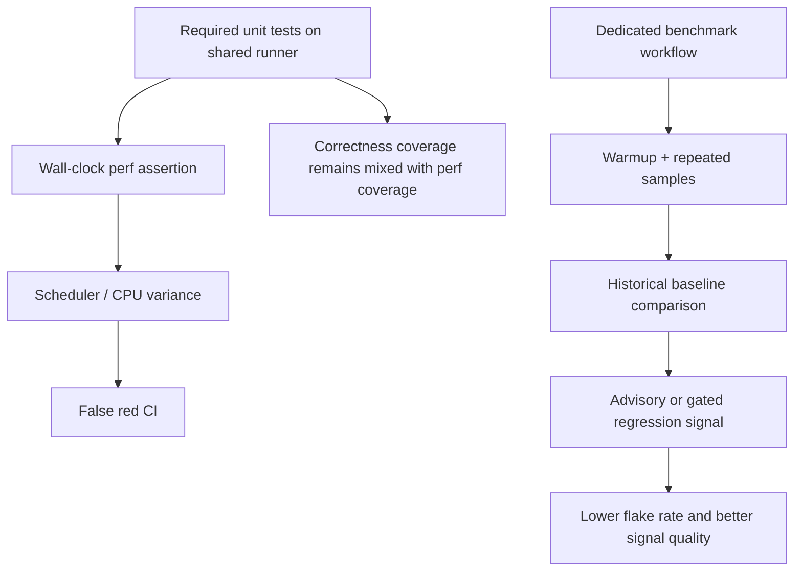
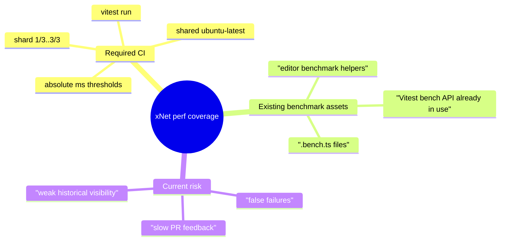
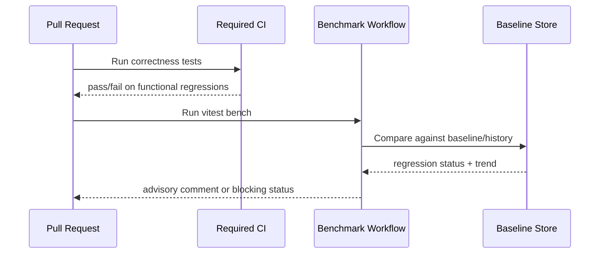
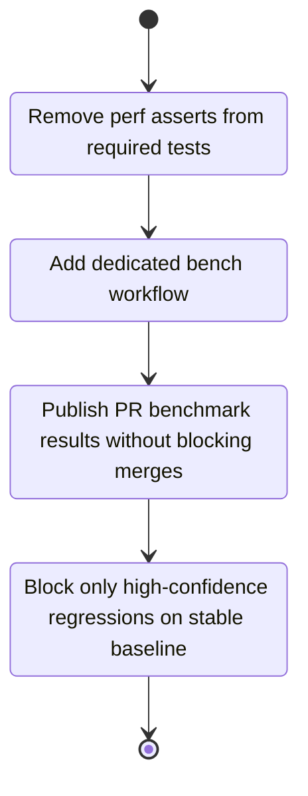

# 🔬 CI Perf Testing Options

## Problem Statement

xNet currently runs many wall-clock performance assertions inside required Vitest `.test.ts` suites on shared GitHub-hosted runners. The latest CI failure on March 6, 2026 came from [`packages/core/src/hashing.test.ts`](/Users/crs/.codex/worktrees/a1ea/xNet/packages/core/src/hashing.test.ts), where a `< 200ms` hashing assertion measured about `202.79ms` in GitHub Actions. The core question is which CI performance-testing approach is best-in-class for this monorepo, and which options avoid flaky gates while still catching real regressions.

## Executive Summary

- ✅ Best managed option for xNet: create a dedicated benchmark workflow using `vitest bench` and integrate it with [CodSpeed’s Vitest plugin](https://codspeed.io/docs/benchmarks/nodejs/vitest). This matches the repo’s current Vitest stack and is explicitly the recommended JS/TS path in CodSpeed’s docs.
- ✅ Best self-hosted / OSS-heavy option: run the benchmark suite on a self-hosted or larger GitHub runner and feed results into [Bencher](https://bencher.dev/docs/how-to/github-actions/) with statistical thresholds such as percentage, IQR, z-score, or t-test.
- ✅ Best immediate fix: remove hard wall-clock assertions from required `.test.ts` suites in `CI` and keep them as either `.bench.ts` benchmarks or opt-in local perf checks.
- ❌ Worst option: keep absolute millisecond budgets in blocking unit tests on `ubuntu-latest`. Shared-runner jitter makes this fail for noise, not regressions.



## Current State In The Repository

### Observed facts

- [`/.github/workflows/ci.yml`](/Users/crs/.codex/worktrees/a1ea/xNet/.github/workflows/ci.yml) runs `pnpm vitest run --shard=... --coverage` on `ubuntu-latest` for required `push` CI.
- The repo already has dedicated benchmark-style coverage:
  - [`packages/data/src/auth/evaluator.bench.ts`](/Users/crs/.codex/worktrees/a1ea/xNet/packages/data/src/auth/evaluator.bench.ts)
  - [`packages/data-bridge/benchmarks/query-performance.bench.ts`](/Users/crs/.codex/worktrees/a1ea/xNet/packages/data-bridge/benchmarks/query-performance.bench.ts)
- The repo also has custom benchmark helpers in [`packages/editor/src/testing/benchmarks.ts`](/Users/crs/.codex/worktrees/a1ea/xNet/packages/editor/src/testing/benchmarks.ts).
- There are still many wall-clock assertions in required tests, especially under:
  - [`packages/sqlite/src/adapters/electron.test.ts`](/Users/crs/.codex/worktrees/a1ea/xNet/packages/sqlite/src/adapters/electron.test.ts)
  - [`packages/crypto/src/benchmark.test.ts`](/Users/crs/.codex/worktrees/a1ea/xNet/packages/crypto/src/benchmark.test.ts)
  - [`packages/data/src/auth/performance.test.ts`](/Users/crs/.codex/worktrees/a1ea/xNet/packages/data/src/auth/performance.test.ts)
  - [`packages/data-bridge/src/__tests__/binary-state.test.ts`](/Users/crs/.codex/worktrees/a1ea/xNet/packages/data-bridge/src/__tests__/binary-state.test.ts)

### Inference

The repo is already halfway to a better model: xNet has both benchmark-specific files and performance assertions embedded in correctness tests. The instability is coming from mixing those two concerns inside the required CI path.



## External Research

### 1. GitHub-hosted runners are not ideal for strict perf gating

- GitHub’s larger-runners docs say GitHub offers runners with more RAM, CPU, and disk, and that they can speed up workflows. That is useful, but it still does not make `ubuntu-latest` a stable benchmark machine by itself.
  - Source: [GitHub Docs: Using larger runners](https://docs.github.com/en/actions/how-tos/manage-runners/larger-runners)
- GitHub’s self-hosted-runner docs state that self-hosted runners give more control over hardware, OS, and software, and can be physical, virtual, in containers, on-prem, or in cloud.
  - Source: [GitHub Docs: Self-hosted runners](https://docs.github.com/en/actions/concepts/runners/self-hosted-runners)

### 2. Vitest already has a dedicated benchmark mode

- Vitest documents benchmarking support via `bench` backed by Tinybench, and exposes `vitest bench` for benchmark suites.
  - Source: [Vitest Features: Benchmarking](https://vitest.dev/guide/features.html#benchmarking)

### 3. CodSpeed is designed specifically for noisy CI benchmarking

- CodSpeed’s GitHub Actions docs explicitly say CI benchmarking is hard because shared cloud infrastructure is noisy and GitHub-hosted runners can show significant variance.
  - Source: [CodSpeed: Running Benchmarks in GitHub Actions](https://codspeed.io/docs/integrations/ci/github-actions)
- CodSpeed’s JS/TS docs recommend the Vitest plugin as the preferred integration for Node.js benchmarks.
  - Source: [CodSpeed: Writing Benchmarks in JavaScript and TypeScript](https://codspeed.io/docs/benchmarks/nodejs/overview)
- CodSpeed’s Vitest docs show direct support for `vitest bench`, local fallback behavior, benchmark sharding, and GitHub Actions usage via `CodSpeedHQ/action`.
  - Source: [CodSpeed: Writing benchmarks with vitest-bench](https://codspeed.io/docs/benchmarks/nodejs/vitest)

### 4. Bencher provides explicit statistical thresholding

- Bencher supports statistical thresholds including percentage, z-score, t-test, IQR, delta-IQR, and static thresholds.
  - Source: [Bencher: Thresholds & Alerts](https://bencher.dev/docs/explanation/thresholds/)
- Bencher also supports a GitHub Actions integration path and has guidance for handling fork PRs safely using split workflows.
  - Source: [Bencher: How to use Bencher in GitHub Actions](https://bencher.dev/docs/how-to/github-actions/)
- Bencher supports ingesting custom JSON metrics, which matters if xNet wants to reuse its own benchmark helpers instead of fully standardizing on a single harness.
  - Source: [Bencher: Benchmark Harness Adapters](https://bencher.dev/docs/explanation/adapters/)

## Key Findings

1. Hard-coded absolute millisecond assertions in required unit tests are the least stable option.
2. Best-in-class CI perf setups separate correctness tests from benchmark runs.
3. Stable perf gates need one or both of:
   - more controlled hardware
   - baseline-aware statistical comparison
4. xNet already uses Vitest and already has `.bench.ts` files, so a benchmark-first design fits the repo naturally.
5. If xNet wants blocking perf regression checks on every PR, a managed benchmark service or dedicated runner is materially better than shared `ubuntu-latest`.

## Options And Tradeoffs

| Option | What it looks like | Pros | Cons | Fit for xNet |
| --- | --- | --- | --- | --- |
| A. Keep perf asserts in `.test.ts`, just loosen thresholds | Current model, softer budgets | Minimal change | Still flaky, poor signal, no history | Poor |
| B. Keep perf asserts but skip in CI / precommit | Correctness stays blocking, perf becomes local-only | Fastest stabilization | No CI regression tracking | Good short-term |
| C. Dedicated `vitest bench` workflow on GitHub-hosted runners | Benchmarks isolated from unit tests | Cleaner architecture, low migration cost | Shared-runner noise still exists | Good intermediate |
| D. `vitest bench` + CodSpeed | Dedicated suite plus noise-aware reporting and PR regressions | Best managed DX for current stack | External service dependency | Best overall |
| E. `vitest bench` or custom JSON + Bencher + self-hosted/larger runner | Stable hardware plus explicit statistical thresholds | Strong control, self-hostable path, flexible metrics | More setup and maintenance | Best control-heavy option |
| F. Self-hosted-only with raw local thresholds | Fixed hardware, no SaaS | Better than shared runners | Still easy to design bad gates without baselines | Viable but incomplete |



## Recommendation

### 🥇 Recommended target architecture

Use a two-lane model:

1. **Required CI lane**
   - No hard wall-clock thresholds in `.test.ts`.
   - Keep correctness, output shape, determinism, algorithmic invariants, and maybe coarse relative assertions only when they are not runner-sensitive.

2. **Benchmark lane**
   - Move important perf checks into `.bench.ts`.
   - Run them in a separate workflow.
   - Compare against history instead of a single static threshold.

### Recommended product choice for xNet

For this monorepo, the best-in-class path is:

- **Primary recommendation:** `vitest bench` + CodSpeed
- **Fallback / self-hosted alternative:** `vitest bench` + Bencher + self-hosted or larger GitHub runner

Why this is the right fit:

- xNet already uses Vitest broadly.
- xNet already has benchmark files and custom benchmark helpers.
- CodSpeed explicitly recommends Vitest for JS/TS and is built around noisy CI environments.
- Bencher is stronger if xNet wants self-hosting or custom metric ingestion across benchmark types.

### What not to do

- Do not gate required CI on raw `< N ms` assertions on `ubuntu-latest`.
- Do not mix benchmark failures with correctness failures in the same required shard.
- Do not treat a single measurement as a reliable regression detector.

## Suggested Rollout



## Implementation Checklist

- [ ] Audit all `.test.ts` files for absolute wall-clock assertions.
- [ ] Reclassify each perf assertion as one of:
  - [ ] correctness-critical invariant
  - [ ] local-only perf smoke check
  - [ ] benchmark candidate for `.bench.ts`
- [ ] Create a dedicated `.github/workflows/perf.yml`.
- [ ] Run `pnpm vitest bench --run` only against benchmark files.
- [ ] Start with advisory reporting, not blocking merges.
- [ ] Choose one reporting path:
  - [ ] CodSpeed with `@codspeed/vitest-plugin`
  - [ ] Bencher with statistical thresholds
- [ ] If blocking is required, move benchmarks onto a self-hosted or larger runner before enforcing budgets.
- [ ] Add a benchmark ownership rule for each package so regressions are triaged by the right maintainer.

## Validation Checklist

- [ ] A correctness-only CI run stays green when benchmarks are noisy.
- [ ] Benchmark workflow produces historical comparisons on PRs.
- [ ] A synthetic slowdown in one benchmark produces a visible regression signal.
- [ ] An unrelated PR does not fail because of transient runner noise.
- [ ] Benchmark names remain stable across refactors so history is preserved.
- [ ] Fork PR behavior is verified if the chosen service requires secrets.

## Example Code

### Option 1: Dedicated Vitest benchmark workflow

```yaml
name: Perf

on:
  pull_request:
  push:
    branches: [main]
  workflow_dispatch:

permissions:
  contents: read
  id-token: write

jobs:
  benchmarks:
    runs-on: ubuntu-latest
    steps:
      - uses: actions/checkout@v4
      - uses: pnpm/action-setup@v4
        with:
          version: 10
      - uses: actions/setup-node@v4
        with:
          node-version: 22
          cache: pnpm
      - run: pnpm install --frozen-lockfile
      - run: pnpm turbo run build --filter='./packages/*'
      - run: pnpm vitest bench --run
```

If xNet adopts CodSpeed, wrap the benchmark command with the current official [CodSpeed GitHub Actions integration](https://codspeed.io/docs/integrations/ci/github-actions). If xNet adopts Bencher, publish the benchmark output to Bencher from this same workflow.

### Option 2: Reframe a flaky unit test into correctness + benchmark

```typescript
import { bench, describe, expect, it } from 'vitest'
import { hashContent } from './hashing'

describe('hashing correctness', () => {
  it('hashes 1MB deterministically', () => {
    const data = new Uint8Array(1024 * 1024)
    expect(hashContent(data)).toBe(hashContent(data))
  })
})

describe('hashing benchmarks', () => {
  bench('hash 1MB payload', () => {
    const data = new Uint8Array(1024 * 1024)
    hashContent(data)
  })
})
```

### Option 3: Bencher-friendly JSON emission from a custom harness

```typescript
type BencherMetric = {
  benchmark: string
  measure: 'latency'
  value: number
  lower_value?: number
  upper_value?: number
}

const metrics: BencherMetric[] = [
  {
    benchmark: 'editor.large-document.render',
    measure: 'latency',
    value: 12.4
  }
]

console.log(JSON.stringify(metrics))
```

## References

- [GitHub Docs: Using larger runners](https://docs.github.com/en/actions/how-tos/manage-runners/larger-runners)
- [GitHub Docs: Self-hosted runners](https://docs.github.com/en/actions/concepts/runners/self-hosted-runners)
- [Vitest: Benchmarking](https://vitest.dev/guide/features.html#benchmarking)
- [CodSpeed: Running Benchmarks in GitHub Actions](https://codspeed.io/docs/integrations/ci/github-actions)
- [CodSpeed: Writing Benchmarks in JavaScript and TypeScript](https://codspeed.io/docs/benchmarks/nodejs/overview)
- [CodSpeed: Writing benchmarks with vitest-bench](https://codspeed.io/docs/benchmarks/nodejs/vitest)
- [Bencher: Thresholds & Alerts](https://bencher.dev/docs/explanation/thresholds/)
- [Bencher: How to use Bencher in GitHub Actions](https://bencher.dev/docs/how-to/github-actions/)
- [Bencher: Benchmark Harness Adapters](https://bencher.dev/docs/explanation/adapters/)

## Next Actions

1. Convert the remaining required `.test.ts` time-budget checks into correctness tests or `.bench.ts` benchmarks.
2. Add a non-blocking `perf.yml` workflow first.
3. Choose between CodSpeed and Bencher based on whether xNet prefers managed accuracy or self-hosted control.
