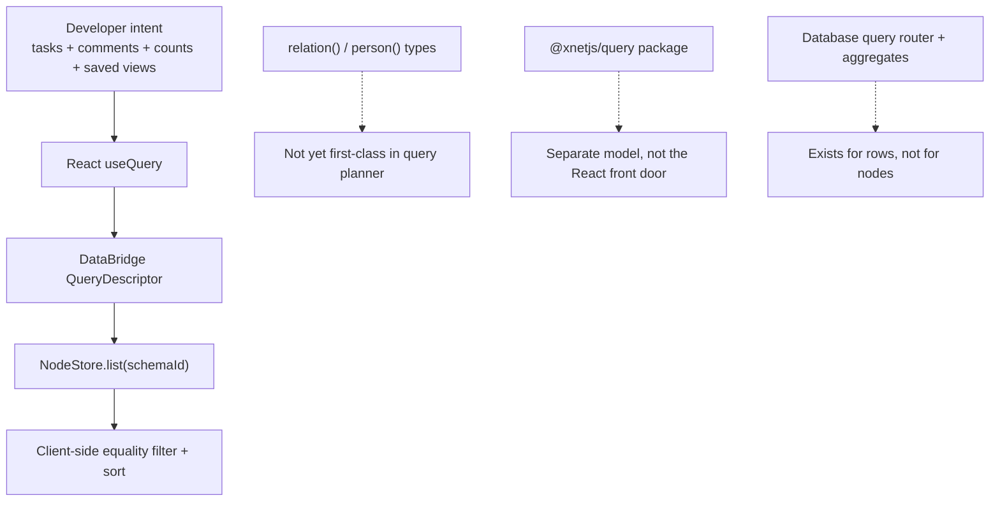
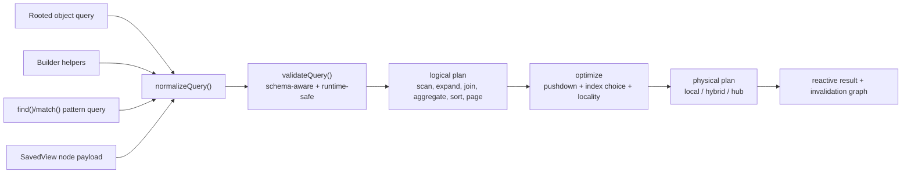
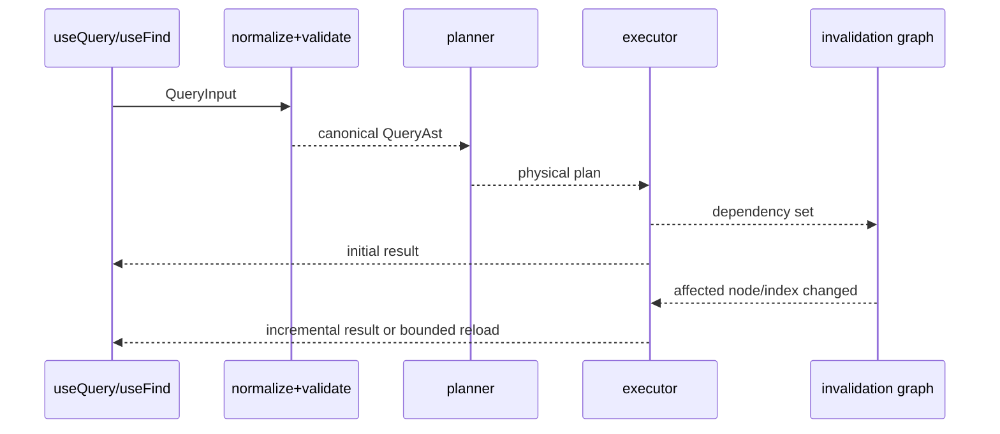

# 0106 - Join Queries, Multi-Type Aggregates, And A Typed Query Planning API

> Problem statement: `useQuery` currently takes a single schema and a very small filter object. That works for "give me Tasks" but not for "give me Tasks with their comments", "group Tasks by assignee with comment counts", or "return a dashboard aggregate across Tasks, Pages, and Comments". xNet already has explicit `relation()` types, so the right question is not "how do we bolt SQL joins onto `useQuery`?" but "how do we turn explicit relations into a Datomic-inspired, TypeScript-safe, validator-backed query system that still feels natural in React?"

## ✨ Executive Summary

- xNet should lean **harder** into explicit `relation()` and `person()` properties. Join semantics should come from declared edges, not from arbitrary field-equality joins.
- The current `useQuery(Schema, filter)` contract should remain the **simple 80% entry point**, but it needs to grow into a rooted query API with `include`, reverse joins, grouping, and aggregates.
- Multi-type and truly cross-root queries should exist, but as a **second authoring mode**, not as the default mental model for every developer.
- The cleanest design is:
  - one **canonical query AST**
  - multiple **authoring surfaces** on top of it
  - one **validation + planning pipeline** underneath it
- Prior explorations already contain most of the architecture:
  - [0037](./0037_[_]_USEQUERY_PAGINATION.md) covers pagination and hub/federation paging
  - [0040](./0040_[_]_FIRST_CLASS_RELATIONS.md) covers reverse relation indexing and graph traversal
  - [0042](./0042_[_]_UNIFIED_QUERY_API.md) covers the query API shape and Datalog escape hatch
  - [0067](./0067_[-]_DATABASE_DATA_MODEL_V2.md) covers query routing and aggregate-oriented row operations
  - [0103](./0103_[-]_TASKS_EMBEDDED_IN_PAGES_BACKED_BY_NODES_MENTIONS_DUE_DATES_NESTED_SUBTASKS_DATABASES_CANVASES_AND_CROSS_SURFACE_TASK_MODEL.md) covers query-backed saved views over canonical nodes
- New recommendation: adopt a **layered Datomic-inspired model**:
  - rooted pull queries for most app code
  - pattern queries for complex graph joins
  - optional query sets / unions for independent multi-type dashboards
  - strict TypeScript typing plus runtime query validation plus planner normalization

## 🧱 Current State In The Repository

### Observed code reality

- `packages/react/src/hooks/useQuery.ts`
  - `useQuery` overloads only support:
    - `useQuery(Schema)`
    - `useQuery(Schema, id)`
    - `useQuery(Schema, { where, orderBy, limit, offset })`
  - query identity is based on a single schema plus a normalized filter object.
- `packages/data-bridge/src/types.ts`
  - `QueryDescriptor` is explicitly **single-schema**: `schemaId`, `nodeId`, `where`, `orderBy`, `limit`, `offset`.
- `packages/data-bridge/src/query-descriptor.ts`
  - matching is schema equality plus property equality.
  - no joins, no reverse traversal, no aggregates, no search composition.
- `packages/data-bridge/src/main-thread-bridge.ts`
  - list queries call `store.list({ schemaId, includeDeleted })` and then filter/sort client-side.
- `packages/data/src/store/types.ts`
  - `ListNodesOptions` supports only `schemaId`, `includeDeleted`, `limit`, `offset`.
- `packages/data/src/store/sqlite-adapter.ts`
  - `listNodes()` compiles to SQL filtering by `schema_id` and `deleted_at`, then orders by `updated_at`.
- `packages/react/src/hooks/useTasks.ts`
  - higher-level task views are currently implemented by querying one schema and doing additional filtering/sorting in React.
- `packages/query/src/types.ts`
  - `@xnetjs/query` already has a different query model (`type`, `filters`, `sort`, `limit`, `offset`) plus a federation router.
  - this is evidence that the repo already feels pressure for a richer query layer, but that pressure is currently split across APIs.

### Architectural mismatch



### Relevant prior explorations and how they fit

| Exploration | What it already solved | Why it matters here |
| --- | --- | --- |
| [0037](./0037_[_]_USEQUERY_PAGINATION.md) | `totalCount`, `hasMore`, cursor/hub/federation paging | query planning must own pagination, not bolt it on later |
| [0040](./0040_[_]_FIRST_CLASS_RELATIONS.md) | reverse relation index, graph traversal, rollups from relations | joins become cheap only if relation edges are indexed |
| [0042](./0042_[_]_UNIFIED_QUERY_API.md) | object-query recommendation plus Datalog escape hatch | strongest existing API direction; should be updated, not discarded |
| [0067](./0067_[-]_DATABASE_DATA_MODEL_V2.md) | query router, group/aggregate pipeline for database rows | planner concepts already exist elsewhere in the repo |
| [0103](./0103_[-]_TASKS_EMBEDDED_IN_PAGES_BACKED_BY_NODES_MENTIONS_DUE_DATES_NESTED_SUBTASKS_DATABASES_CANVASES_AND_CROSS_SURFACE_TASK_MODEL.md) | query-backed saved task views / `SavedView` concept | persisted queries should be first-class nodes |
| [0091](./0091_[_]_GLOBAL_SCHEMA_FEDERATION_MODEL.md) + [0093](./0093_[_]_NODE_NATIVE_GLOBAL_SCHEMA_FEDERATION_MODEL.md) | schema presence, multi-hub placement, node-native control plane | advanced queries will eventually need local/hub/federated planning |

### The key implication

The current codebase is not missing "join syntax". It is missing a **query model** that treats relations, validation, and execution planning as first-class concerns.

## 🌍 External Research

### Datomic

#### Observed facts

- Datomic schema has an explicit reference value type, `:db.type/ref`, alongside cardinality metadata. Source: [Schema Data Reference](https://docs.datomic.com/schema/schema-reference.html)
- Datomic's `VAET` index only contains datoms whose attribute has `:db/valueType :db.type/ref`, and Datomic describes it as the reverse index for efficient reverse navigation. Source: [Index Model](https://docs.datomic.com/indexes/index-model.html)
- Datomic queries use **implicit joins**: shared variables across `:where` clauses unify automatically. Source: [Query Reference](https://docs.datomic.com/query/query-data-reference.html)
- Datomic distinguishes **finding entities** from **pulling result shape**. The docs explicitly describe pull as specifying what information to return without specifying how to find it. Source: [Query Reference](https://docs.datomic.com/query/query-data-reference.html)
- Datomic recommends putting the most selective clause first because query clauses execute in order. Source: [Best Practices](https://docs.datomic.com/reference/best.html)

#### Inference

Datomic is the closest conceptual fit for xNet because xNet already has schema-declared relation types. The missing xNet primitives are not mysterious:

- explicit reverse relation indexing
- a logical query language that treats relations as first-class
- a pull/result-shaping layer separate from pattern matching

### Prisma

#### Observed facts

- Prisma Client exposes type-safe `where`, `include`, `select`, and aggregate operations, and Prisma documents that query result types are known ahead of running the query. Sources: [Type safety](https://www.prisma.io/docs/v6/orm/prisma-client/type-safety), [Is Prisma an ORM?](https://www.prisma.io/docs/concepts/overview/prisma-in-your-stack/is-prisma-an-orm)
- Prisma's `groupBy()` explicitly separates `where` from `having`, and recommends pushing filtering into `where` before grouping to reduce work and make use of indexes. Source: [Aggregation, grouping, and summarizing](https://www.prisma.io/docs/orm/prisma-client/queries/aggregation-grouping-summarizing)
- Prisma's performance guidance discusses three relation-loading strategies for n+1 style problems:
  - nested reads with `include`
  - an `in` filter with batched IDs
  - `relationLoadStrategy: "join"` for one-query execution
  Source: [Query optimization and performance](https://www.prisma.io/docs/v6/orm/prisma-client/queries/query-optimization-performance)

#### Inference

Prisma is strong evidence that developers love a familiar object-shaped query API, but it also shows that one API can map to multiple physical strategies underneath. xNet should copy that part, not the SQL-table-first worldview.

### Convex

#### Observed facts

- Convex's React docs describe `useQuery` as automatically reactive: the first hook usage creates a subscription keyed by query + args, and components rerender when underlying data changes. Source: [Convex React](https://docs.convex.dev/client/react)
- Convex documents that some filters effectively loop through the table for small datasets, and recommends indexes for larger query workloads. Source: [Reading Data](https://docs.convex.dev/database/reading-data/)

#### Inference

xNet should be comfortable with a staged execution model:

- simple queries may scan
- larger or more relational queries should use indexes
- reactivity belongs to the query engine, not to app-specific glue code

### ElectricSQL

#### Observed facts

- Electric's HTTP API defines a sync "shape" using a root `table` plus `where`, then lets clients request live updates against that shape. Source: [Electric HTTP API](https://electric-sql.com/openapi)
- Electric also supports subset snapshots with separate `subset__where`, `subset__limit`, `subset__offset`, and `subset__order_by`, distinct from the ongoing sync definition. Source: [Electric HTTP API](https://electric-sql.com/openapi)

#### Inference

Electric highlights an important distinction xNet should copy: **sync scope** and **view query** are related, but not identical. That matters for xNet because local-first apps will often sync a broad subgraph but render narrow paginated subsets.

## 🔍 Key Findings

### 1. Explicit relation types are xNet's superpower

The right join story is not:

- "let people join any two schemas on arbitrary property equality"

The right join story is:

- "let people traverse explicit `relation()` and `person()` edges, forward and reverse, with strong types and indexed execution"

That is much closer to Datomic than to SQL, and it matches the repo's existing data model.

### 2. `useQuery` should stay rooted, but not stay shallow

Most application code still has a dominant root:

- "Tasks with comments"
- "Project with subtasks"
- "Page with embedded tasks"
- "Task counts by assignee"

That means the default API should still be rooted in a schema:

```ts
useQuery(TaskSchema, { ... })
```

But rooted queries need to support:

- forward relation traversal
- reverse relation traversal
- nested includes
- grouping
- aggregation
- search
- pagination metadata

### 3. Cross-schema aggregates need a second mode

Not every useful query has a single obvious root. Examples:

- a dashboard card with `taskCount`, `pageCount`, and `commentCount`
- "find all people who commented on tasks in projects I own"
- "return Tasks and Comments in one mixed feed"

Those cases justify a second mode:

- pattern query / Datalog-style `find`
- union / query-set composition

This should be an **escape hatch**, not the default shape every developer must learn on day one.

### 4. Type safety has to exist at three distinct layers

This is the most important design constraint from a DX and safety perspective.

| Layer | Primary job | What it catches |
| --- | --- | --- |
| TypeScript authoring types | make invalid query construction hard | unknown fields, wrong operator/value types, invalid include targets, invalid aggregate fields |
| Runtime query validation | protect persisted/shared/deserialized queries | schema drift, unknown schema versions, invalid aliases, depth limits, unsupported operators, invalid cross-schema references |
| Planner normalization | make execution deterministic and cacheable | canonical AST form, pushed-down filters, stable ordering, aggregate legality, routing decisions |

If xNet does only the first layer, saved views and shared queries will eventually become unsafe.

### 5. Planner quality matters more than syntax cleverness

API ergonomics matter, but performance will come from planner decisions such as:

- choosing the most selective root first
- using reverse relation indexes for `from()`
- pushing `where` before `groupBy`
- choosing nested reads vs relation-index joins vs hub pushdown
- distinguishing sync shape from view subset

Prisma, Datomic, Convex, and Electric all reinforce this from different angles.

## 🧠 Idealized API Model

### One engine, multiple authoring styles

```mermaid
mindmap
  root((xNet Query Input))
    Simple root
      useQuery(TaskSchema)
      useQuery(TaskSchema, { where, orderBy })
    Rooted pull
      include
      from()
      follow()
      groupBy
      aggregate
    Pattern query
      find()
      match()
      shared variables
      recursion later
    Query set
      union()
      combine()
      dashboard aggregates
    Persisted query
      SavedView node
      shared filters
      query-backed collections
```

### One canonical AST underneath



### The API surface I would recommend

#### 1. Keep the short form

```ts
const tasks = useQuery(TaskSchema)
const task = useQuery(TaskSchema, taskId)
```

#### 2. Expand rooted queries aggressively

```ts
const tasks = useQuery(TaskSchema, {
  where: {
    status: eq('todo'),
    dueDate: lt(Date.now())
  },
  include: {
    page: follow('page'),
    comments: from(CommentSchema, 'target', {
      orderBy: { createdAt: 'desc' },
      limit: 5
    })
  },
  orderBy: { dueDate: 'asc' },
  page: { first: 20 }
})
```

#### 3. Add a pattern-query escape hatch

```ts
const collaborators = useFind(
  find({
    person: $person,
    commentCount: countDistinct($comment)
  }),
  where(
    match(ProjectSchema, $project, { owner: me.did }),
    match(TaskSchema, $task, { project: $project }),
    match(CommentSchema, $comment, { target: $task, createdBy: $person })
  ),
  {
    orderBy: { commentCount: 'desc' },
    page: { first: 20 }
  }
)
```

#### 4. Add a query-set / union layer for independent multi-type dashboards

```ts
const dashboard = useQuery(
  combine({
    tasks: query(TaskSchema, { where: { completed: false } }),
    pages: query(PageSchema, { where: { archived: false } }),
    comments: query(CommentSchema, { where: { resolved: false } })
  }).aggregate({
    openTaskCount: count('tasks'),
    activePageCount: count('pages'),
    unresolvedCommentCount: count('comments')
  })
)
```

This third mode is optional, but it is the cleanest answer to "what happens if I want an aggregate of multiple types and there is no natural root?"

## ⚖️ Options And Tradeoffs

### Option A: Keep `useQuery(Schema, filter)` and only add `include`

**Pros**

- minimal surface-area change
- easy migration
- fits current hook shape

**Cons**

- still awkward for true multi-root queries
- still lacks a principled AST/validation layer
- risks endless overload growth

### Option B: Replace everything with one generic cross-schema query object

**Pros**

- conceptually pure
- one universal format
- easier to persist/share

**Cons**

- overkill for common app code
- pushes every developer into the advanced model
- weakens the simple ergonomic story that `useQuery(TaskSchema)` currently has

### Option C: Layered model with rooted queries first, pattern queries second, one shared AST underneath

**Pros**

- preserves the current happy path
- maps cleanly to Datomic's pull/query split
- supports advanced graph queries without infecting simple code
- gives one planner/validator/runtime no matter how a query is authored

**Cons**

- more implementation work than Option A
- requires discipline to keep the modes coherent
- needs careful docs so `useQuery` and `useFind` do not feel redundant

### Recommendation

Choose **Option C**.

It is the only option that simultaneously respects:

- xNet's existing schema-first React API
- Datomic-style relation semantics
- strong TypeScript typing
- persisted/shared query validation
- future local/hub/federated planning

## ✅ Recommendation

### 1. Treat joins as relation traversals, not arbitrary field comparisons

Support these first:

- `follow('relationName')`
- `from(OtherSchema, 'relationName')`
- `relatedTo(nodeId)` / `ref(nodeId)` style filters
- `person()` edges where identity joins are explicit

Do **not** support arbitrary `Task.foo == Project.bar` joins in v1 unless xNet also gains declared foreign-key/index metadata for those fields. Explicit edges are what keep typing and planning sane.

### 2. Formalize a canonical query AST

Suggested high-level shape:

```ts
type QueryAst =
  | RootQueryAst
  | FindQueryAst
  | UnionQueryAst

type RootQueryAst = {
  kind: 'root'
  rootSchema: SchemaIRI
  nodeId?: NodeId
  where?: PredicateAst
  include?: Record<string, IncludeAst>
  groupBy?: string[]
  aggregate?: Record<string, AggregateAst>
  having?: PredicateAst
  orderBy?: OrderAst[]
  page?: PageAst
  search?: SearchAst
  at?: TimeTravelAst
}
```

The exact types can evolve, but the important part is: **every authoring mode compiles into this**, and caches/plans are based on the canonical normalized form.

### 3. Make validation a first-class API

This matters for saved views, shared queries, plugins, and future AI-generated queries.

```ts
type QueryValidationResult = {
  valid: boolean
  errors: Array<{
    code:
      | 'UNKNOWN_SCHEMA'
      | 'UNKNOWN_FIELD'
      | 'INVALID_OPERATOR'
      | 'INVALID_INCLUDE'
      | 'INVALID_GROUP_BY'
      | 'INVALID_HAVING'
      | 'UNBOUNDED_RECURSION'
      | 'UNSUPPORTED_CROSS_SCHEMA_JOIN'
    path: string
    message: string
  }>
  warnings: Array<{
    code: 'LOSSY_SCHEMA_COMPAT' | 'UNINDEXED_SCAN' | 'HUB_REQUIRED'
    path: string
    message: string
  }>
  normalized?: QueryAst
}

function validateQuery(input: QueryInput, registry: SchemaRegistry): QueryValidationResult
```

Important: this should follow the repo's existing validation style and return structured `{ valid, errors }`, not throw.

### 4. Separate "query authoring" from "query planning"

Planner stages should be explicit:

1. **Normalize**
   - convert shorthand equality to `eq()`
   - desugar `useQuery(Schema, id)` into a root AST
   - assign aliases and canonical ordering
2. **Validate**
   - ensure fields/operators/aggregates are legal
   - enforce schema version compatibility
3. **Create logical plan**
   - `SchemaScan`
   - `PropertyFilter`
   - `RelationExpand`
   - `ReverseRelationLookup`
   - `GroupAggregate`
   - `Sort`
   - `Paginate`
   - `Search`
4. **Optimize**
   - choose the most selective root
   - push `where` below `aggregate`
   - choose `nested-read` vs `relation-join` vs `hub-pushdown`
5. **Execute**
   - local `NodeStore`
   - hybrid local + hub
   - federated multi-hub later

### 5. Reuse repo work that already exists

- Use [0040](./0040_[_]_FIRST_CLASS_RELATIONS.md) as the basis for reverse relation indexes.
- Use [0037](./0037_[_]_USEQUERY_PAGINATION.md) for `page`, `cursor`, and `totalCount`.
- Reuse [0067](./0067_[-]_DATABASE_DATA_MODEL_V2.md) thinking for routing and aggregates.
- Persist named query ASTs as the `SavedView` / `CollectionView` concept described in [0103](./0103_[-]_TASKS_EMBEDDED_IN_PAGES_BACKED_BY_NODES_MENTIONS_DUE_DATES_NESTED_SUBTASKS_DATABASES_CANVASES_AND_CROSS_SURFACE_TASK_MODEL.md).

### 6. Make the planner reactive, not just the result cache



For simple queries, coarse invalidation by schema may be fine initially. For joins and aggregates, the planner should eventually track:

- root schema dependencies
- relation-index dependencies
- search-index dependencies
- group/aggregate dependencies

## 🛠️ Implementation Checklist

- [ ] Define `QueryInput` and canonical `QueryAst` in a shared package used by React hooks, bridges, and future hub execution.
- [ ] Implement `normalizeQuery()` so all authoring modes become the same canonical AST.
- [ ] Implement `validateQuery()` with structured `{ valid, errors, warnings }` output.
- [ ] Add relation-index primitives from [0040](./0040_[_]_FIRST_CLASS_RELATIONS.md) if they do not already exist in production code.
- [ ] Extend `useQuery` to support rooted descriptors with typed operators and `include`.
- [ ] Add `follow()` and `from()` helpers backed by relation metadata, not stringly-typed conventions.
- [ ] Add aggregate support (`count`, `sum`, `avg`, `min`, `max`, `countDistinct`) with `groupBy` and `having`.
- [ ] Add `useFind()` or `useQuery(find(...))` for advanced cross-schema pattern queries.
- [ ] Add `combine()` / `union()` only after rooted + pattern queries are stable.
- [ ] Persist validated query ASTs in a `SavedView`-style node for query-backed collections.
- [ ] Add planner routing decisions for `local`, `hybrid`, and `hub`, building on [0067](./0067_[-]_DATABASE_DATA_MODEL_V2.md).
- [ ] Add devtools support for inspecting normalized ASTs, logical plans, and physical plans.

## 🧪 Validation Checklist

- [ ] TypeScript rejects invalid field names in `where`, `include`, `groupBy`, and aggregates.
- [ ] TypeScript rejects invalid operator/value combinations, such as `contains()` on numeric fields.
- [ ] Runtime validation rejects persisted/shared queries referencing unknown schemas or invalid relation hops.
- [ ] Runtime validation warns on legal but expensive plans, such as unindexed wide scans.
- [ ] Rooted include queries update reactively when related nodes change.
- [ ] Reverse joins update reactively through relation-index changes.
- [ ] Aggregate queries update correctly for inserts, updates, deletes, and soft deletes.
- [ ] Pagination metadata (`totalCount`, `hasMore`, cursor/page info) remains correct for grouped queries.
- [ ] Saved views survive schema version changes with either compatibility rewrites or clear validation errors.
- [ ] Hub-routed queries preserve the same logical semantics as local execution.
- [ ] Query keys remain stable across equivalent authoring styles after normalization.

## 💡 Example Code

### Example 1: The simple case stays simple

```ts
const { data: tasks } = useQuery(TaskSchema, {
  where: { status: eq('todo') },
  orderBy: { updatedAt: 'desc' },
  page: { first: 20 }
})
```

### Example 2: Rooted join query

```ts
const { data: task } = useQuery(TaskSchema, taskId, {
  include: {
    page: follow('page'),
    comments: from(CommentSchema, 'target', {
      orderBy: { createdAt: 'desc' }
    }),
    parent: follow('parent')
  }
})
```

### Example 3: Rooted aggregate over multiple schemas

```ts
const { data: byAssignee } = useQuery(TaskSchema, {
  where: { page: eq(pageId) },
  include: {
    comments: from(CommentSchema, 'target')
  },
  groupBy: ['assignee'],
  aggregate: {
    taskCount: count(),
    commentCount: count('comments'),
    overdueCount: countWhere({ dueDate: lt(Date.now()) })
  },
  having: {
    taskCount: gt(0)
  },
  orderBy: [{ field: 'taskCount', direction: 'desc' }]
})
```

This is still a **rooted Task query**, even though it aggregates Task + Comment data. That is the right default for many "multi-type" asks.

### Example 4: Truly cross-root pattern query

```ts
const { data: summary } = useFind(
  find({
    taskCount: countDistinct($task),
    commentCount: countDistinct($comment),
    collaboratorCount: countDistinct($person)
  }),
  where(
    match(PageSchema, $page, { id: pageId }),
    match(TaskSchema, $task, { page: $page }),
    match(CommentSchema, $comment, { target: $task, createdBy: $person })
  )
)
```

### Example 5: Compile-time typing plus runtime validation

```ts
const candidate = query(TaskSchema, {
  where: {
    status: eq('todo'),
    // priority: contains('high') // TypeScript error: wrong operator for number
  },
  include: {
    comments: from(CommentSchema, 'target')
  }
})

const validation = validateQuery(candidate, schemaRegistry)

if (!validation.valid) {
  console.error(validation.errors)
} else {
  const result = await store.query(validation.normalized)
  console.log(result)
}
```

## 📌 Recommendation In One Sentence

xNet should evolve from "schema-scoped list query" to "typed relation-aware query system" by keeping `useQuery(Schema, ...)` as the main ergonomic entry point, adding Datomic-inspired relation semantics and reverse indexes under it, and introducing a validated pattern-query escape hatch for the genuinely cross-schema cases.

## 🔗 References

### Internal

- [0037 - useQuery Pagination](./0037_[_]_USEQUERY_PAGINATION.md)
- [0040 - First-Class Relations](./0040_[_]_FIRST_CLASS_RELATIONS.md)
- [0042 - Unified Query API](./0042_[_]_UNIFIED_QUERY_API.md)
- [0067 - Database Data Model V2](./0067_[-]_DATABASE_DATA_MODEL_V2.md)
- [0091 - Global Schema Federation Model](./0091_[_]_GLOBAL_SCHEMA_FEDERATION_MODEL.md)
- [0093 - Node-Native Global Schema Federation Model](./0093_[_]_NODE_NATIVE_GLOBAL_SCHEMA_FEDERATION_MODEL.md)
- [0103 - Tasks As A Universal Primitive Across Pages, Databases, And Canvas](./0103_[-]_TASKS_EMBEDDED_IN_PAGES_BACKED_BY_NODES_MENTIONS_DUE_DATES_NESTED_SUBTASKS_DATABASES_CANVASES_AND_CROSS_SURFACE_TASK_MODEL.md)

### External

- Datomic: [Schema Data Reference](https://docs.datomic.com/schema/schema-reference.html)
- Datomic: [Query Reference](https://docs.datomic.com/query/query-data-reference.html)
- Datomic: [Best Practices](https://docs.datomic.com/reference/best.html)
- Datomic: [Index Model](https://docs.datomic.com/indexes/index-model.html)
- Prisma: [Type safety](https://www.prisma.io/docs/v6/orm/prisma-client/type-safety)
- Prisma: [Aggregation, grouping, and summarizing](https://www.prisma.io/docs/orm/prisma-client/queries/aggregation-grouping-summarizing)
- Prisma: [Query optimization and performance](https://www.prisma.io/docs/v6/orm/prisma-client/queries/query-optimization-performance)
- Prisma: [Is Prisma an ORM?](https://www.prisma.io/docs/concepts/overview/prisma-in-your-stack/is-prisma-an-orm)
- Convex: [Convex React](https://docs.convex.dev/client/react)
- Convex: [Reading Data](https://docs.convex.dev/database/reading-data/)
- ElectricSQL: [Electric HTTP API](https://electric-sql.com/openapi)
