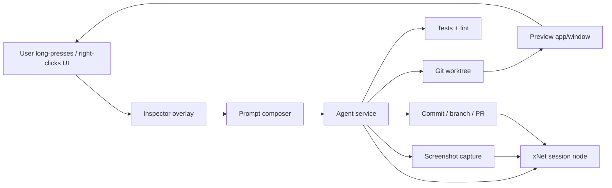
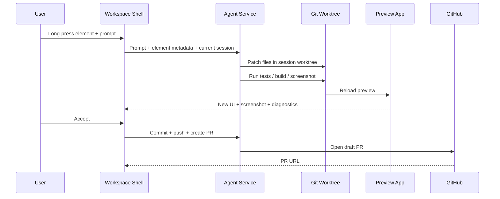
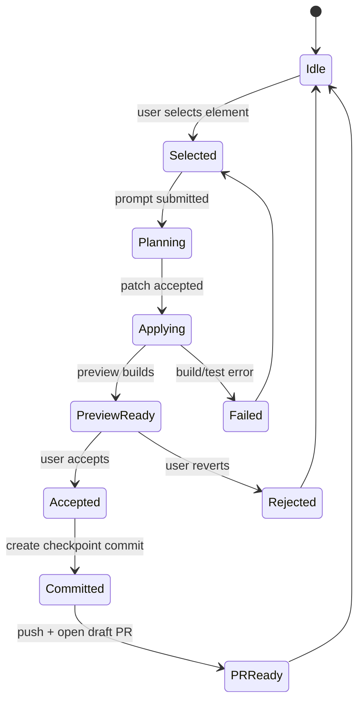
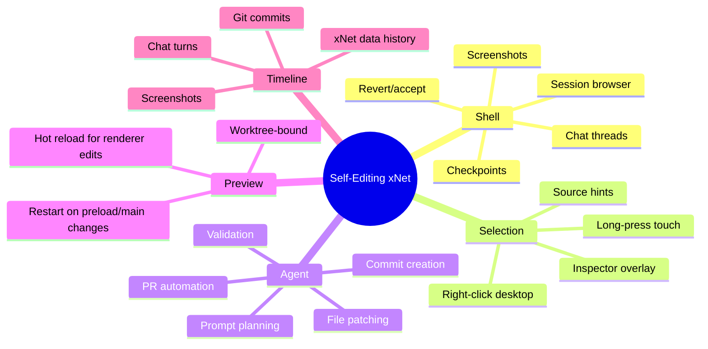

# 🧠 Self-Editing xNet: In-App Development, Git Worktrees, and PR Automation

> Problem statement: can xNet become a tool for developing xNet itself, where a user long-presses or right-clicks UI, prompts for changes, watches the UI shift in place, scrubs through UI/data/code history, and optionally turns accepted changes into a branch, commit series, screenshot, and PR?

## Executive Summary

This is viable, but not as one single feature. It is really three concentric products:

1. **Prompted UI/data editing inside the app**: viable now, medium complexity.
2. **Repository-aware code editing with live preview**: viable on **Electron first**, high complexity.
3. **Branch/worktree/chat/version management for any user across web, desktop, and mobile**: viable only with a **remote workspace** model, very high complexity.

### Bottom line

| Surface | Local self-editing viability | Why |
| --- | --- | --- |
| **Electron** | 🟢 Strong | Real filesystem, child processes, git, preview windows, Playwright screenshots, GitHub CLI/API are all realistic fits. |
| **Web** | 🟡 Conditional | Good for chat, history, and remote preview. Weak for direct local repo editing because browser file access is permissioned and sandboxed. |
| **Mobile / Expo** | 🔴 Local, 🟡 Remote | Best as a remote control/review client. Poor fit for local repo worktrees, dev servers, and PR automation. |

### Recommendation

Build this as an **Electron-first workspace shell** with a **separate editable preview worktree**. Use xNet Data for chat history, selection context, screenshots, and session metadata. Use git for code history. Use the existing xNet history tooling for data/state scrubbing. Treat web and mobile as clients for a **remote dev session**, not as primary local authoring runtimes.



## 🚩 Title and Problem Statement

The desired UX is not just “AI edits some files.” It is closer to a **local-first IDE/product-builder embedded inside the app itself**:

- long-press or right-click a visible element
- prompt against the selected surface
- see the preview update in place
- scrub through **data history** and **code history**
- accept, revert, branch, or create a PR
- keep a chat/worktree/session browser, similar to Codex desktop

The core question is not whether an LLM can write code. It can. The real question is whether xNet can safely host:

- a repo-aware editing agent
- a live preview loop
- git/worktree orchestration
- versioned UI/data timelines
- PR automation

without collapsing the running app or bypassing normal code review.

## 🧱 Current State in the Repository

### Observed facts

1. **Electron already has the right privilege boundary shape.**
   - The renderer is sandboxed, `contextIsolation` is enabled, and `nodeIntegration` is disabled in [`apps/electron/src/main/index.ts`](../../../apps/electron/src/main/index.ts#L128-L145).
   - Electron already exposes narrow privileged bridges through preload in [`apps/electron/src/preload/index.ts`](../../../apps/electron/src/preload/index.ts#L240-L340).

2. **Electron already has process-management plumbing.**
   - A `ProcessManager` exists and Electron main wires IPC for service start/stop/restart/list/call in [`apps/electron/src/main/service-ipc.ts`](../../../apps/electron/src/main/service-ipc.ts#L49-L120).

3. **The current Local API is data-focused, not repo/code-focused.**
   - The Local API exposes node CRUD, query, events, and schemas, but no repo/git/code-edit endpoints in [`packages/plugins/src/services/local-api.ts`](../../../packages/plugins/src/services/local-api.ts#L282-L324).

4. **A basic MCP server already exists.**
   - It currently covers node CRUD/search/schema access, not code editing or rich repo operations, in [`packages/plugins/src/services/mcp-server.ts`](../../../packages/plugins/src/services/mcp-server.ts#L80-L115).

5. **The platform capability model already says Electron is special.**
   - Only Electron gets `services`, `processes`, `localAPI`, and `filesystem` in [`packages/plugins/src/types.ts`](../../../packages/plugins/src/types.ts#L42-L70).

6. **Web and Electron already share plugin + devtools infrastructure.**
   - Web boots `XNetProvider` with `platform: 'web'` and `XNetDevToolsProvider` in [`apps/web/src/App.tsx`](../../../apps/web/src/App.tsx#L421-L448).
   - Electron boots `XNetProvider` with `platform: 'electron'` and devtools in [`apps/electron/src/renderer/main.tsx`](../../../apps/electron/src/renderer/main.tsx#L246-L269).
   - `@xnetjs/react` already creates a `PluginRegistry` when the store is ready in [`packages/react/src/context.ts`](../../../packages/react/src/context.ts#L893-L923).

7. **A data/history scrubber already exists.**
   - DevTools has a timeline slider that materializes past state in [`packages/devtools/src/panels/HistoryPanel/HistoryPanel.tsx`](../../../packages/devtools/src/panels/HistoryPanel/HistoryPanel.tsx#L128-L190).

8. **Yjs document history infrastructure already exists.**
   - `DocumentHistoryEngine` captures snapshots and merges document timeline entries with property history in [`packages/history/src/document-history.ts`](../../../packages/history/src/document-history.ts#L1-L170).
   - DevTools creates that engine when the store supports snapshot persistence in [`packages/devtools/src/provider/DevToolsProvider.tsx`](../../../packages/devtools/src/provider/DevToolsProvider.tsx#L296-L321).

9. **There is already at least one context-menu interaction pattern.**
   - Table cells use `onContextMenu` in [`packages/views/src/table/TableCell.tsx`](../../../packages/views/src/table/TableCell.tsx#L439-L480), which is a reasonable starting point for direct-manipulation edit affordances.

10. **Mobile is currently much thinner.**
    - Expo uses a separate provider with `NativeBridge`/SQLite and no plugin/devtools wiring in [`apps/expo/src/context/XNetProvider.tsx`](../../../apps/expo/src/context/XNetProvider.tsx#L1-L120).
    - The current document screen is a simple title input + `WebViewEditor` in [`apps/expo/src/screens/DocumentScreen.tsx`](../../../apps/expo/src/screens/DocumentScreen.tsx#L27-L105).

11. **Screenshot artifacts are already normal in the repo.**
    - Existing Playwright tests write screenshots under `tmp/playwright/`, e.g. [`tests/e2e/src/pages-crud.spec.ts`](../../../tests/e2e/src/pages-crud.spec.ts#L40-L47).

### Important gaps

- No repo abstraction (`RepoSession`, `WorktreeService`, `BranchService`, `PullRequestService`) exists yet.
- No source-aware element inspector exists yet.
- No normal editing flow appears to call `DocumentHistoryEngine.captureSnapshot()`; repo search on 2026-03-07 found non-test usage only in seed flows.
- No unified “chat history + worktree + preview” shell exists.
- The current Electron service bridge is close but not complete:
  - preload allows only `start`, `stop`, `status`, and `list` in [`apps/electron/src/preload/index.ts`](../../../apps/electron/src/preload/index.ts#L240-L267)
  - but the service client/main process also expect `restart`, `list-all`, `call`, `status-update`, and `output` in [`packages/plugins/src/services/client.ts`](../../../packages/plugins/src/services/client.ts#L12-L20) and [`apps/electron/src/main/service-ipc.ts`](../../../apps/electron/src/main/service-ipc.ts#L67-L120)
  - this should be fixed early if the agent runs as a managed service.

## 🌐 External Research

| Source | Observed fact | Relevance |
| --- | --- | --- |
| [git-worktree](https://git-scm.com/docs/git-worktree) | Git officially supports multiple working trees attached to one repository. | This is the right primitive for “one chat/session = one preview workspace”. |
| [GitHub CLI `gh pr create`](https://cli.github.com/manual/gh_pr_create) | GitHub CLI can open PRs non-interactively with title/body/head/base flags. | Good fit for a local Electron agent flow. |
| [GitHub REST: create a pull request](https://docs.github.com/en/rest/pulls/pulls?apiVersion=2022-11-28#create-a-pull-request) | PR creation is available via API with `title`, `body`, `head`, `base`, and `draft`. | Lets xNet support PR creation without shelling out to `gh` if needed. |
| [MDN File System API](https://developer.mozilla.org/en-US/docs/Web/API/File_System_API) | Browser file access is permissioned and user-mediated. | Limits local “edit my actual repo” workflows on web. |
| [MDN OPFS](https://developer.mozilla.org/en-US/docs/Web/API/File_System_API/Origin_private_file_system) | OPFS is origin-private and not user-visible. | Great for app storage, weak for interoperating with an existing developer checkout. |
| [Electron security tutorial](https://www.electronjs.org/docs/latest/tutorial/security) | Electron recommends sandboxing, disabling Node integration, and enabling context isolation. | Confirms the repo’s current architecture and implies git/fs/process access must stay out of the renderer. |
| [Expo FileSystem](https://docs.expo.dev/versions/latest/sdk/filesystem/) | Expo supports app-managed file reads/writes, not full desktop-style process orchestration. | Mobile can store artifacts, but local repo workflows remain poor. |
| [isomorphic-git docs](https://isomorphic-git.org/docs/en/quickstart) | Browser git is possible with emulated filesystems such as LightningFS. | Useful for imported repos or remote mirrors, but not a strong replacement for native worktrees. |

### Interpretation

- **Observed fact:** Electron is the only current runtime whose repo capabilities naturally line up with real git/worktree/dev-server/PR flows.
- **Inference:** Web/mobile can still participate, but mainly by talking to a remote workspace or Electron host rather than owning the local dev loop.

## 🔍 Key Findings

### 1. This is viable if you split the product into a stable shell and a mutable preview

Trying to let the running shell edit the exact code that is currently rendering the shell is asking for self-inflicted corruption. The better model is:

- **Workspace shell**: stable app surface for chat, history, worktrees, screenshots, revert/accept
- **Preview surface**: renderer or window driven by a selected worktree/branch

That gives you “the page shifts around” without betting the whole editing environment on hot-swapping itself.



### 2. Electron is the correct first target

Electron already has:

- a secure renderer/main split
- service/process infrastructure
- a local API
- filesystem and process capability in the platform model
- devtools/history plumbing

So an Electron-first version can use **real git**, **real worktrees**, **real `pnpm`/test/build commands**, and **real screenshots**.

### 3. Web is good for review/control, weak for authoritative local repo editing

Web xNet is already strong for:

- chat UI
- history visualization
- screenshot galleries
- remote preview surfaces
- plugin-based editing affordances

But a browser is a bad place to promise “edit my actual repo with worktrees like Codex desktop” because:

- file access is permissioned and not ambient
- OPFS is origin-private, not your normal checkout
- browser git exists, but it is an emulation story, not a native developer workflow
- running app builds, Playwright, Electron preview, and native git auth are all awkward

### 4. Mobile should be a companion, not the primary local build host

The current Expo app is structurally much lighter than web/electron. Direct local git/worktree/build/test/PR loops on-device would force you to recreate desktop development inside an app sandbox. That is possible in theory, but it is the wrong optimization.

Better mobile jobs:

- browse sessions, branches, screenshots, and chats
- inspect diffs
- request a change against a remote workspace
- accept/reject/revert
- scrub through UI/data history

### 5. “Commit code back to the repo as a PR with a screenshot” is realistic on Electron

On Electron, the flow is straightforward:

1. create or reuse a worktree
2. apply edits
3. run targeted validation
4. capture a screenshot
5. commit with conventional messages
6. push branch
7. create a draft PR

This can use `gh pr create` or GitHub’s PR API.

The screenshot is the one awkward part:

- easiest initial version: store screenshot under `tmp/playwright/` and optionally commit it or upload it via a companion service
- better product version: upload screenshot to a PR comment/artifact store and link it from the PR body or session metadata

### 6. The timeline scrubber should not rebuild the app on every drag tick

For code history, the scrubber should primarily show:

- commit/checkpoint metadata
- screenshot thumbnails
- diffs
- chat turns

Then only hydrate a real preview when the user clicks a checkpoint. Rebuilding the preview for every slider movement will feel slow and expensive.



## ⚖️ Options and Tradeoffs

### Option A: Prompted layout/data editing only

The model edits:

- page props
- schema/view settings
- design tokens
- component config nodes

without touching repository code.

**Pros**

- Lowest risk
- Works across all platforms
- Fits xNet’s current data model well
- Immediate “the UI shifts around” feedback

**Cons**

- Not true self-hosted app development
- Cannot change arbitrary React structure or platform plumbing
- PR/worktree/code scrubber story remains missing

**Verdict:** Good precursor, not the end state you described.

### Option B: Electron local repo agent with preview worktree

The app owns:

- a repo root
- one or more worktrees
- an agent session per worktree
- preview process/window
- commit/PR automation

**Pros**

- Most faithful to the desired UX
- Reuses real git and existing repo tooling
- Keeps normal code review intact
- Can generate real screenshots from the actual changed app

**Cons**

- High complexity
- Strong security considerations
- Must isolate host shell from edited preview
- Electron main/preload changes require preview restarts, not just hot module reload

**Verdict:** **Recommended first implementation.**

### Option C: Remote workspace service shared by Electron, web, and mobile

The actual repo, git, tests, and previews run in a remote dev workspace. xNet surfaces chat, history, and preview control.

**Pros**

- Works for “anyone” across platforms
- Easier auth centralization and PR automation
- Good collaboration story

**Cons**

- Much more infrastructure
- Higher ops/security cost
- Loses the charm of “edit the app that is on this machine” unless paired with Electron local mode

**Verdict:** Best phase 2 / productization direction after Electron proves the UX.

### Option D: Pure local web/mobile git editing

Use browser/mobile storage plus JS git libraries to emulate a repo locally.

**Pros**

- No desktop dependency

**Cons**

- Weak fit for existing developer expectations
- Worktrees are not a first-class story
- Build/test/screenshot flows are poor
- Repo interop is awkward

**Verdict:** Not recommended as a primary strategy.

## 🧭 Recommendation

### Recommended product shape

Build **two tightly related modes**:

1. **Electron local authoring mode**
   - local repo root
   - local git worktrees
   - local preview app/window
   - local tests + screenshots + PR creation

2. **Remote companion mode**
   - used by web and mobile
   - talks to a remote workspace running the same agent/session model
   - shows chat, checkpoints, diffs, screenshots, preview URLs, PRs

### Recommended architectural boundaries



### Recommended implementation phases

#### Phase 1: Electron-only developer spike

- stable shell + separate preview worktree
- prompt composer
- repo patch/apply loop
- preview reload
- manual checkpoint commits

#### Phase 2: Session model + history fusion

- `DevSession` nodes stored in xNet Data
- chat history, prompt turns, screenshots, and git refs stored as first-class records
- checkpoint gallery + code scrubber

#### Phase 3: PR automation

- push branch
- create draft PR
- attach screenshot metadata
- record PR URL in session

#### Phase 4: Direct-manipulation UX

- element inspector overlay
- right-click / long-press menus
- source-map-backed file hints

#### Phase 5: Remote workspace support

- remote session executor
- web/mobile session browser and reviewer

## 🧪 Complexity Assessment

### Narrow Electron prototype

**Viability:** high  
**Complexity:** medium-high  
**Inference:** likely a few focused weeks for a proof of concept if scope is limited to renderer edits, one preview worktree, basic screenshots, and draft PR creation.

### Electron productized for daily use

**Viability:** high  
**Complexity:** high  
Main cost centers:

- inspector/source mapping
- preview isolation
- git/worktree lifecycle cleanup
- secure repo permissions
- failure recovery

### Cross-platform “anyone can use this” product

**Viability:** medium  
**Complexity:** very high  
The hard part is not LLM editing. It is:

- workspace hosting
- auth
- repo bootstrapping
- PR credential delegation
- artifact storage
- cost controls

## ✅ Implementation Checklist

- [ ] Add a `DevSession` schema in xNet Data for repo/chat/checkpoint metadata.
- [ ] Implement an Electron-only `RepoSessionService` in the main process or managed background service.
- [ ] Add git worktree lifecycle commands: create, list, cleanup, switch, archive.
- [ ] Add preview lifecycle commands: boot, reload, restart, stop.
- [ ] Fix the current Electron service IPC/preload channel mismatch before relying on managed services.
- [ ] Extend the Local API or add a dedicated repo API for session status, checkpoints, and screenshots.
- [ ] Build a prompt composer panel bound to the active preview/session.
- [ ] Add a checkpoint model: prompt, file diff summary, screenshot path, commit SHA, validation result.
- [ ] Add screenshot capture for accepted checkpoints.
- [ ] Add conventional commit generation with editable review before commit.
- [ ] Add push + draft PR creation using `gh` or GitHub REST.
- [ ] Build a code-history scrubber backed by git checkpoints and screenshot thumbnails.
- [ ] Merge code checkpoints with xNet data history in a unified session timeline.
- [ ] Add a selection overlay for desktop right-click and touch long-press.
- [ ] Add source hints using route/component metadata first; layer source maps later.
- [ ] Add remote workspace support for web/mobile only after the Electron loop is solid.

## 🧷 Validation Checklist

- [ ] Prompting against a selected element produces a patch against the correct worktree.
- [ ] Renderer-only changes update the preview without breaking the shell.
- [ ] Electron main/preload changes trigger a controlled preview restart.
- [ ] Revert returns the preview to the previous accepted checkpoint.
- [ ] Checkpoint slider restores screenshot/diff/chat context without expensive rebuilds on drag.
- [ ] Clicking a checkpoint can hydrate a real preview from that commit on demand.
- [ ] Draft PR creation includes the intended head/base/title/body.
- [ ] Screenshot capture works reliably on the changed preview.
- [ ] Failing tests/builds block commit/PR by default.
- [ ] Concurrent sessions map cleanly to distinct worktrees.
- [ ] Deleting/archiving a session cleans up orphaned branches/worktrees safely.
- [ ] Web/mobile can browse and control remote sessions without needing local repo access.
- [ ] Security review confirms repo access is explicit, narrow, and auditable.

## 💡 Example Code

The key is to model the system declaratively: session state in xNet, side effects in a repo service, and a preview loop that is replaceable.

```typescript
/**
 * Minimal session model for Electron-first self-editing.
 */
export type PreviewStatus = 'idle' | 'starting' | 'ready' | 'failed'

export type Checkpoint = {
  readonly id: string
  readonly prompt: string
  readonly commitSha: string | null
  readonly screenshotPath: string | null
  readonly createdAt: number
  readonly validation:
    | { readonly kind: 'pending' }
    | { readonly kind: 'passed' }
    | { readonly kind: 'failed'; readonly summary: string }
}

export type DevSession = {
  readonly id: string
  readonly repoRoot: string
  readonly baseRef: string
  readonly branch: string
  readonly worktreePath: string
  readonly previewUrl: string | null
  readonly previewStatus: PreviewStatus
  readonly checkpoints: ReadonlyArray<Checkpoint>
}

export type SelectionTarget = {
  readonly routeId: string
  readonly elementLabel: string
  readonly fileHints: ReadonlyArray<string>
  readonly nodeId: string | null
}

export type PromptRequest = {
  readonly sessionId: string
  readonly selection: SelectionTarget | null
  readonly prompt: string
  readonly createScreenshot: boolean
}

export type PlanStep =
  | { readonly kind: 'patch-files' }
  | { readonly kind: 'run-validation' }
  | { readonly kind: 'restart-preview' }
  | { readonly kind: 'capture-screenshot'; readonly path: string }
  | { readonly kind: 'create-commit'; readonly message: string }

const isPresent = <T>(value: T | null): value is T => value !== null

export const canRunLocalRepoFlow = (features: {
  readonly processes: boolean
  readonly filesystem: boolean
  readonly localAPI: boolean
}): boolean => features.processes && features.filesystem && features.localAPI

export const planPromptApplication = (request: PromptRequest): ReadonlyArray<PlanStep> =>
  [
    { kind: 'patch-files' },
    { kind: 'run-validation' },
    { kind: 'restart-preview' },
    request.createScreenshot
      ? { kind: 'capture-screenshot', path: 'tmp/playwright/self-edit-preview.png' }
      : null,
    { kind: 'create-commit', message: 'feat(self-edit): apply accepted in-app UI change' }
  ].filter(isPresent)
```

## 📌 Recommended UX Shape

- **Right-click / long-press menu**
  - `Edit this`
  - `Explain this`
  - `Tidy layout`
  - `Compare to previous`
  - `Open related chat`

- **Chat panel**
  - bound to current session/worktree
  - shows prompts, screenshots, test results, and checkpoints

- **Version tab**
  - git checkpoints
  - screenshot strip
  - diff summary
  - restore from checkpoint

- **Data tab**
  - existing xNet data/history scrubber

- **Session switcher**
  - branch/worktree/chat triad
  - one tab per dev session, like Codex desktop

## 📚 References

### Repo references

- [`apps/electron/src/main/index.ts`](../../../apps/electron/src/main/index.ts#L128-L145)
- [`apps/electron/src/preload/index.ts`](../../../apps/electron/src/preload/index.ts#L240-L340)
- [`apps/electron/src/main/service-ipc.ts`](../../../apps/electron/src/main/service-ipc.ts#L49-L120)
- [`apps/electron/src/renderer/main.tsx`](../../../apps/electron/src/renderer/main.tsx#L246-L269)
- [`apps/web/src/App.tsx`](../../../apps/web/src/App.tsx#L421-L448)
- [`apps/expo/src/context/XNetProvider.tsx`](../../../apps/expo/src/context/XNetProvider.tsx#L1-L120)
- [`apps/expo/src/screens/DocumentScreen.tsx`](../../../apps/expo/src/screens/DocumentScreen.tsx#L27-L105)
- [`packages/plugins/src/types.ts`](../../../packages/plugins/src/types.ts#L42-L70)
- [`packages/react/src/context.ts`](../../../packages/react/src/context.ts#L893-L923)
- [`packages/plugins/src/services/local-api.ts`](../../../packages/plugins/src/services/local-api.ts#L282-L324)
- [`packages/plugins/src/services/mcp-server.ts`](../../../packages/plugins/src/services/mcp-server.ts#L80-L115)
- [`packages/devtools/src/provider/DevToolsProvider.tsx`](../../../packages/devtools/src/provider/DevToolsProvider.tsx#L296-L321)
- [`packages/devtools/src/panels/HistoryPanel/HistoryPanel.tsx`](../../../packages/devtools/src/panels/HistoryPanel/HistoryPanel.tsx#L128-L190)
- [`packages/history/src/document-history.ts`](../../../packages/history/src/document-history.ts#L1-L170)
- [`packages/views/src/table/TableCell.tsx`](../../../packages/views/src/table/TableCell.tsx#L439-L480)
- [`tests/e2e/src/pages-crud.spec.ts`](../../../tests/e2e/src/pages-crud.spec.ts#L40-L47)

### Web research

- [Git worktree documentation](https://git-scm.com/docs/git-worktree)
- [GitHub CLI `gh pr create`](https://cli.github.com/manual/gh_pr_create)
- [GitHub REST: create a pull request](https://docs.github.com/en/rest/pulls/pulls?apiVersion=2022-11-28#create-a-pull-request)
- [Electron security tutorial](https://www.electronjs.org/docs/latest/tutorial/security)
- [MDN File System API](https://developer.mozilla.org/en-US/docs/Web/API/File_System_API)
- [MDN Origin Private File System](https://developer.mozilla.org/en-US/docs/Web/API/File_System_API/Origin_private_file_system)
- [Expo FileSystem](https://docs.expo.dev/versions/latest/sdk/filesystem/)
- [isomorphic-git quickstart](https://isomorphic-git.org/docs/en/quickstart)

## Next Actions

1. Build a **single-user Electron spike** with one repo, one worktree, one preview, one chat, and one checkpoint strip.
2. Prove the full loop: prompt → patch → preview → screenshot → commit → draft PR.
3. Only after that, add source-aware selection overlays and remote workspace support.
