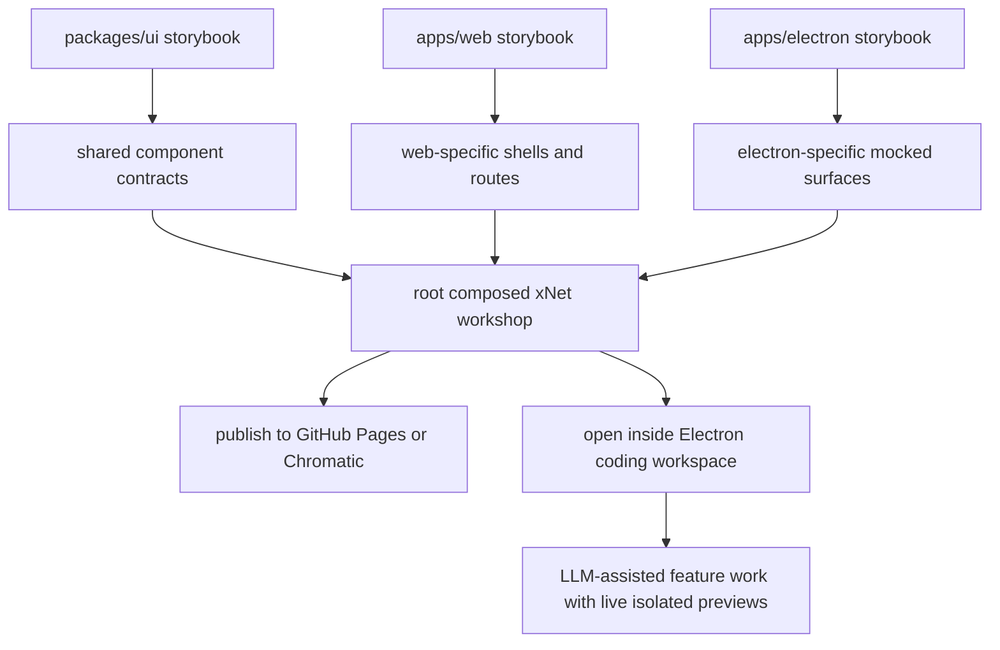
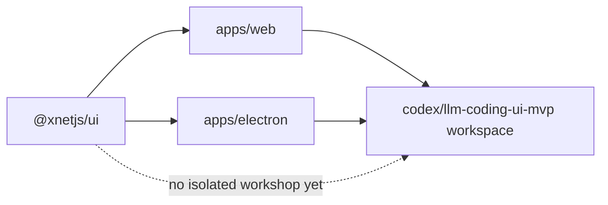
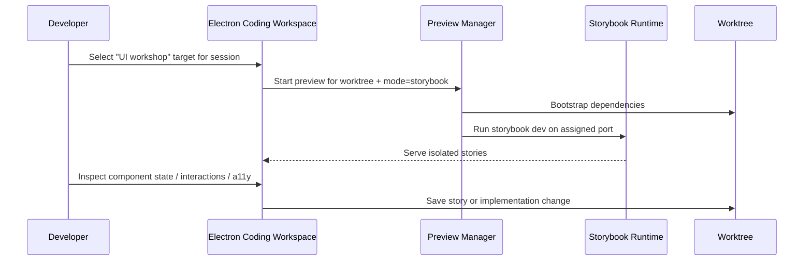
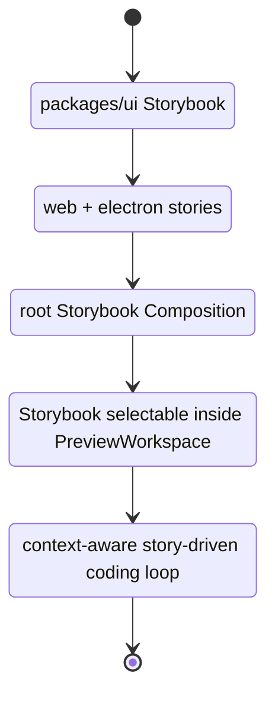

# 🧪 Storybook For xNet’s Shared UI And Electron IDE Direction

**Date**: March 8, 2026  
**Status**: Exploration  
**Scope**: `@xnetjs/ui`, `apps/web`, `apps/electron`, and the `codex/llm-coding-ui-mvp` branch direction  
**Problem**: xNet has a meaningful shared React UI surface, duplicated app-level components, and an emerging Electron coding-workspace shell, but no isolation environment for component development, documentation, layout debugging, or story-driven testing.

---

## Executive Summary

- ✅ xNet is a strong fit for Storybook now, not later. The repo already has a real shared design system in [`packages/ui/src/index.ts`](/Users/crs/.codex/worktrees/724b/xNet/packages/ui/src/index.ts) and the UI audit already lists Storybook docs, visual regression, and performance benchmarking as next steps in [`packages/ui/COMPONENT_AUDIT.md:100`](/Users/crs/.codex/worktrees/724b/xNet/packages/ui/COMPONENT_AUDIT.md#L100).
- ✅ The right baseline is **Storybook 10.2 with `@storybook/react-vite`**, because both `apps/web` and the Electron renderer are Vite-based today.
- ✅ The right architecture is **package-first plus composition**, not one giant app-only Storybook:
  - `packages/ui` becomes the canonical component workshop.
  - `apps/web` and `apps/electron` each get thin, app-specific stories for route shells and integration surfaces.
  - A top-level Storybook composes them for one “xNet Workshop”.
- ✅ The `codex/llm-coding-ui-mvp` branch already contains the substrate needed to make Storybook a first-class Electron IDE surface:
  - a three-panel coding workspace shell
  - a preview runtime manager that launches per-worktree web previews
  - a preview context bridge for passing DOM/file context back into the workspace
- ⚠️ The “performance panel” should be treated as a **local diagnostics tool**, not a merge gate. It is useful for interactive profiling, but Storybook’s own docs and the performance addon both imply that stable CI perf comparisons need stricter controls.
- 🥇 Recommendation: ship this in three stages:
  1. `packages/ui` Storybook with core addons and portable-story testing
  2. composed root workshop plus app stories
  3. Electron coding workspace integration so each worktree can boot Storybook directly inside the right-hand preview panel



---

## 🎯 Problem Statement

xNet needs a component-driven development surface that does four jobs well:

1. Let developers build and debug components in isolation.
2. Make the shared UI package more discoverable and testable.
3. Reduce drift between Electron and Web surfaces.
4. Turn the emerging Electron coding workspace into a true product-development shell instead of only a chat-plus-preview shell.

Today, the repo has the ingredients for this but not the workflow.

---

## 🧭 Current State In The Repository

### Observed facts

- `@xnetjs/ui` is already a meaningful shared design system with primitives, composed components, comments UI, responsive shells, and theming exported from [`packages/ui/src/index.ts:1`](/Users/crs/.codex/worktrees/724b/xNet/packages/ui/src/index.ts#L1).
- `packages/ui` has no existing story files. A repo-wide search for `*.stories.*` returned nothing.
- The UI audit explicitly calls out the next steps:
  - “Add Storybook documentation”
  - “Add visual regression tests”
  - “Performance benchmarking”
  - Source: [`packages/ui/COMPONENT_AUDIT.md:100`](/Users/crs/.codex/worktrees/724b/xNet/packages/ui/COMPONENT_AUDIT.md#L100)
- Both app surfaces already align with a React + Vite Storybook stack:
  - Electron uses `electron-vite`, React 18, and Vite 5 in [`apps/electron/package.json:12`](/Users/crs/.codex/worktrees/724b/xNet/apps/electron/package.json#L12) and [`apps/electron/electron.vite.config.ts:44`](/Users/crs/.codex/worktrees/724b/xNet/apps/electron/electron.vite.config.ts#L44).
  - Web uses Vite 5 and React 18 in [`apps/web/package.json:6`](/Users/crs/.codex/worktrees/724b/xNet/apps/web/package.json#L6) and [`apps/web/vite.config.ts:11`](/Users/crs/.codex/worktrees/724b/xNet/apps/web/vite.config.ts#L11).
- The shared theme already exists and is consumed by both apps:
  - Electron imports `@xnetjs/ui` theme assets from [`apps/electron/src/renderer/styles.css:1`](/Users/crs/.codex/worktrees/724b/xNet/apps/electron/src/renderer/styles.css#L1)
  - Web imports them from [`apps/web/src/styles/globals.css:1`](/Users/crs/.codex/worktrees/724b/xNet/apps/web/src/styles/globals.css#L1)
- There is measurable duplication between Electron and Web app components. Matching file names exist for:
  - `AddSharedDialog`
  - `BundledPluginInstaller`
  - `CanvasView`
  - `DatabaseView`
  - `PageTasksPanel`
  - `PluginManager`
  - `PresenceAvatars`
  - `ShareButton`
  - `Sidebar`
- The `codex/llm-coding-ui-mvp` branch already points toward an IDE-shaped Electron app:
  - `DevWorkspaceShell` is a three-panel shell with session rail, OpenCode panel, and preview workspace.
  - `PreviewWorkspace` renders a live `iframe` preview plus diff/files/markdown/PR tabs.
  - `preview-manager.ts` boots per-worktree previews by spawning `pnpm exec vite` under `apps/web`.
  - `PreviewContextBridge.tsx` posts route/DOM/file-hint context from the preview back to the parent shell.

### Inference

The repo is already past the “should we use Storybook?” stage. The real question is how to fit Storybook into xNet’s monorepo and the emerging Electron IDE without creating a second-class demo environment that diverges from the real product.



### Repository Fit Notes

- `packages/ui` is the natural home for canonical stories because it has no `@xnetjs/*` dependencies in [`packages/ui/README.md`](/Users/crs/.codex/worktrees/724b/xNet/packages/ui/README.md).
- Electron renderer and Web app both use Vite-based toolchains, so `@storybook/react-vite` avoids builder fragmentation.
- The branch preview manager currently hardcodes `apps/web` as the preview app target, which is a strong opportunity: generalize it and Storybook becomes just another preview runtime.

---

## 🌐 External Research

### 1. Storybook is currently on 10.x, and 10.2 is the current release family

- Storybook’s docs pages for React + Vite are marked **Version 10.2**.
  - Source: [Storybook for React with Vite](https://storybook.js.org/docs/get-started/frameworks/react-vite)
- Storybook’s release page shows **Storybook 10.2 - January 2026**.
  - Source: [Storybook 10.2 release](https://storybook.js.org/releases/10.2)

### 2. Storybook 9 introduced exactly the IDE-adjacent features xNet cares about

- Storybook 9 positions itself as a component-testing foundation built around Storybook + Vitest + Playwright.
  - Source: [Storybook 9](https://storybook.js.org/blog/storybook-9/)
- It also introduced:
  - story generation from the UI
  - tag-based organization
  - story globals
  - a testing widget
  - Source: [Storybook 9](https://storybook.js.org/blog/storybook-9/)

### 3. React + Vite is the correct Storybook framework for xNet

- Official docs say Storybook for React + Vite is intended for React apps built with Vite and installs via `npm create storybook@latest`.
  - Source: [Storybook for React with Vite](https://storybook.js.org/docs/get-started/frameworks/react-vite)

### 4. Storybook’s Vitest addon is a strong match for xNet’s existing test stack

- Official docs say the Vitest addon transforms stories into Vitest tests using portable stories and runs them in browser mode with Playwright’s Chromium browser.
  - Source: [Vitest addon](https://storybook.js.org/docs/writing-tests/integrations/vitest-addon)
- The same docs show results surfacing in the Storybook UI sidebar and note that the testing widget can coordinate with other test types.
  - Source: [Vitest addon](https://storybook.js.org/docs/writing-tests/integrations/vitest-addon)

### 5. Accessibility testing is first-class and progressive

- Storybook’s accessibility docs surface violations directly in the UI and support CI automation when paired with the Vitest addon.
  - Source: [Accessibility tests](https://storybook.js.org/docs/writing-tests/accessibility-testing)
- The docs also support a progressive workflow with `a11y.test: 'todo'` before moving to hard failures.
  - Source: [Accessibility tests](https://storybook.js.org/docs/writing-tests/accessibility-testing)

### 6. Composition is the key feature for a monorepo workshop

- Official docs say Storybook Composition can browse components from any Storybook accessible by URL, whether published or running locally, regardless of view layer or dependencies.
  - Source: [Storybook Composition](https://storybook.js.org/docs/sharing/storybook-composition)
- Official docs also explicitly support composing multiple local Storybooks on different ports.
  - Source: [Storybook Composition](https://storybook.js.org/docs/sharing/storybook-composition)

### 7. Publishing paths are flexible, but hosted Storybook gives better workflow ergonomics

- Storybook docs recommend Chromatic for publishing/versioning/review workflows.
  - Source: [Publish Storybook](https://storybook.js.org/docs/sharing/publish-storybook)
- The same docs also include a GitHub Pages workflow example and note Storybook can be published to GitHub Pages, Netlify, S3, and other static hosts.
  - Source: [Publish Storybook](https://storybook.js.org/docs/sharing/publish-storybook)

### 8. Useful built-in Storybook tools already cover a lot of xNet’s needs

- `Controls` supports generated prop controls, documentation expansion, and saving story changes from the UI.
  - Source: [Controls](https://storybook.js.org/docs/essentials/controls)
- `Viewport` supports responsive viewport testing and custom device sets.
  - Source: [Viewport](https://storybook.js.org/docs/essentials/viewport)
- `Measure & outline` helps visually debug spacing, bounds, and layout alignment.
  - Source: [Measure & outline](https://storybook.js.org/docs/essentials/measure-and-outline/)

### 9. The performance addon is useful, but it is not the same as robust CI performance engineering

- The official Storybook integrations catalog exposes `storybook-addon-performance` and documents story-level interaction tasks plus save/load benchmark artifacts.
  - Source: [storybook-addon-performance](https://storybook.js.org/addons/storybook-addon-performance)
- That same page warns performance results vary by CPU and memory utilization and recommends production builds for best accuracy.
  - Source: [storybook-addon-performance](https://storybook.js.org/addons/storybook-addon-performance)

### 10. Electron embedding guidance favors iframes or modern web contents over legacy embedded views

- Electron’s web-embeds docs warn that `<webview>` is not explicitly supported and may not remain available in future versions.
  - Source: [Electron Web Embeds](https://www.electronjs.org/docs/latest/tutorial/web-embeds)
- Electron marks `BrowserView` as deprecated as of Electron 29+.
  - Source: [BrowserView](https://www.electronjs.org/docs/latest/api/browser-view)
- Electron’s modern replacement is `WebContentsView`.
  - Source: [WebContentsView](https://www.electronjs.org/docs/latest/api/web-contents-view)

---

## 🔍 Key Findings

1. **Storybook should be aligned to xNet’s package boundaries, not app routes alone.**  
   `@xnetjs/ui` is mature enough to justify canonical stories, while Electron/Web should carry only stories that need app-specific context.

2. **Composition is the unlock for this monorepo.**  
   A composed workshop avoids forcing every story into one process and maps cleanly onto `packages/ui`, `apps/web`, and `apps/electron`.

3. **The `codex/llm-coding-ui-mvp` branch makes Storybook-in-Electron realistic.**  
   xNet already has a preview-runtime concept, session management, and a UI shell for multiple dev surfaces.

4. **The right addon stack is not “all addons”; it is a focused quality stack.**  
   Start with `essentials`, `a11y`, `vitest`, and performance only where it answers a real question.

5. **Performance needs two layers.**  
   Storybook’s performance panel is useful for local component profiling. CI-grade regression detection still belongs in dedicated benchmarks or visual/test workflows, not in ad hoc local timings alone.

6. **Storybook can help reduce Electron/Web duplication pressure.**  
   The duplicated app components are a signal that some shared surfaces may want promotion into `@xnetjs/ui` or shared app packages once their stories expose the overlap clearly.

---

## 🛠 Options And Tradeoffs

| Option | Shape | Pros | Cons | Verdict |
| --- | --- | --- | --- | --- |
| A. `packages/ui` only | One Storybook for shared primitives/composed components | Fastest path, highest leverage, low risk | App shells and Electron-specific flows remain undocumented | Good first increment |
| B. One monolithic root Storybook | One config, one process, all stories | Simple to explain | Heavy config, harder mocking, more drift risk, slower startup | Not ideal |
| C. Per-surface Storybooks + composition | `packages/ui`, `apps/web`, `apps/electron`, plus a composed root | Best fit for monorepo boundaries, scales with IDE integration, supports partial ownership | Slightly more setup | Best overall |
| D. Internal preview routes instead of Storybook | Build custom “dev routes” in Web/Electron | Full control, no external tool semantics | Reinvents controls/docs/testing/composition, higher maintenance | Poor use of time |
| E. Electron-only Storybook shell | Develop components directly only inside desktop app | Matches long-term IDE vision | Blocks web contributors and CI hosting flows; ties everything to Electron | Good later, bad starting point |



---

## 🥇 Recommendation

### Recommended Architecture

Implement **Option C: per-surface Storybooks plus a composed root workshop**, rolled out in phases.

#### Phase 1: `packages/ui` canonical workshop

- Add Storybook under `packages/ui` using `@storybook/react-vite`.
- Treat this as the source of truth for:
  - primitives
  - composed components
  - theme variations
  - responsive states
  - accessibility states
- Add only minimal mocks here. Keep it pure.

#### Phase 2: app-surface Storybooks

- Add `apps/web/.storybook` for:
  - route-shell stories
  - app-level components
  - data/identity/plugin mocked states
- Add `apps/electron/.storybook` for:
  - renderer-only stories
  - preload-mocked components
  - titlebar/system-shell surfaces
- Keep Electron main-process behavior out of story execution. Mock preload contracts instead.

#### Phase 3: root-composed workshop

- Create a top-level Storybook whose main job is composition:
  - `packages/ui` local Storybook
  - `apps/web` local Storybook
  - `apps/electron` local Storybook
- This becomes the single URL for humans and CI artifacts.

#### Phase 4: Electron IDE integration

- Generalize the preview manager from “launch `apps/web` Vite” to “launch a preview target”.
- Supported preview targets should become:
  - `web`
  - `storybook-ui`
  - `storybook-web`
  - `storybook-electron`
- Add a toggle in `PreviewWorkspace` for “App”, “Stories”, and later “Tests”.
- Reuse the branch’s preview context bridge pattern so story selections can feed richer file/component context back into the coding panel.

### Recommended Addon Stack

#### Start with these

- `@storybook/addon-essentials`
  - Controls
  - Docs/Autodocs
  - Viewport
  - Measure & outline
- `@storybook/addon-a11y`
- Vitest addon

#### Add carefully

- `storybook-addon-performance`
  - Use for local diagnostics and story-level interactions
  - Do not make it a blocking perf gate initially

#### Consider after baseline is healthy

- Chromatic publishing / visual review
- design-token or design-reference addons if the team wants tighter design handoff

### Why this is the right fit

- It matches xNet’s monorepo boundaries.
- It uses the toolchain xNet already has.
- It supports both browser-based review and the long-term Electron IDE.
- It gives a migration path from isolated component work to live worktree-based feature development.

---

## 🧱 Proposed Rollout



### Target UX

- A designer/dev can open xNet Workshop in a browser or in Electron.
- A component author can switch theme, viewport, controls, and a11y results instantly.
- A coding-session preview can choose between the real app and isolated stories for the same worktree.
- An LLM-assisted workflow can target a specific story, not only a page route.

---

## ✅ Implementation Checklist

- [ ] Add `@storybook/react-vite` to `packages/ui`.
- [ ] Create `packages/ui/.storybook/main.ts` and `preview.ts`.
- [ ] Create baseline stories for:
  - [ ] primitives
  - [ ] comments UI
  - [ ] command palette
  - [ ] settings surfaces
  - [ ] responsive shell components
- [ ] Configure shared theme imports and globals for light/dark/system.
- [ ] Enable `@storybook/addon-essentials`.
- [ ] Enable `@storybook/addon-a11y`.
- [ ] Enable the Vitest addon and align it with existing Vitest usage.
- [ ] Add a small set of story tags for:
  - [ ] `stable`
  - [ ] `wip`
  - [ ] `perf`
  - [ ] `electron`
  - [ ] `web`
- [ ] Add `apps/web` Storybook with mocked app context.
- [ ] Add `apps/electron` Storybook with mocked preload contracts.
- [ ] Add a root-composed Storybook that references the package/app Storybooks.
- [ ] Add a GitHub Actions workflow to build the composed Storybook.
- [ ] Publish to:
  - [ ] GitHub Pages first, or
  - [ ] Chromatic if visual review should be part of PR checks
- [ ] Generalize the coding-workspace preview manager to accept preview targets beyond `apps/web`.
- [ ] Add a “Stories” tab or target selector in the Electron `PreviewWorkspace`.
- [ ] Add story-aware preview context messages so the coding panel can reason about `storyId`, component path, and nearby DOM context.

---

## 🧪 Validation Checklist

- [ ] `packages/ui` stories boot locally with theme assets identical to app usage.
- [ ] Core stories render in both light and dark themes without token regressions.
- [ ] Responsive shell components work across mobile/tablet/desktop viewports.
- [ ] a11y results appear in the UI and in CI for designated stories.
- [ ] Story-driven Vitest runs execute successfully in browser mode.
- [ ] Duplicated Electron/Web components reveal clear extraction opportunities.
- [ ] Root composition can aggregate multiple local Storybooks without broken navigation.
- [ ] Built Storybook publishes successfully to the chosen host.
- [ ] Electron workspace can switch a session preview between app runtime and Storybook runtime.
- [ ] Storybook preview startup/restore is fast enough to feel native inside the coding workspace.
- [ ] No background dev servers are left running after verification workflows.

---

## 💡 Example Code

### 1. `packages/ui` Storybook baseline

```ts
// packages/ui/.storybook/main.ts
import type { StorybookConfig } from '@storybook/react-vite'
import path from 'node:path'

const config: StorybookConfig = {
  framework: {
    name: '@storybook/react-vite',
    options: {}
  },
  stories: ['../src/**/*.stories.@(ts|tsx|mdx)'],
  addons: [
    '@storybook/addon-essentials',
    '@storybook/addon-a11y',
    '@storybook/addon-vitest',
    'storybook-addon-performance'
  ],
  viteFinal: async (viteConfig) => ({
    ...viteConfig,
    resolve: {
      ...viteConfig.resolve,
      alias: {
        ...viteConfig.resolve?.alias,
        '@xnetjs/ui': path.resolve(__dirname, '../src')
      }
    }
  })
}

export default config
```

```tsx
// packages/ui/.storybook/preview.ts
import type { Preview } from '@storybook/react-vite'
import '../src/theme/tokens.css'
import '../src/theme/motion.css'
import '../src/theme/accessibility.css'
import '../src/theme/responsive.css'
import '../src/theme/base-ui-animations.css'

import { ThemeProvider } from '../src/theme/ThemeProvider'

const preview: Preview = {
  parameters: {
    controls: { expanded: true },
    a11y: { test: 'todo' }
  },
  decorators: [
    (Story) => (
      <ThemeProvider defaultTheme="system" storageKey="xnet-storybook-theme">
        <div className="min-h-screen bg-background p-6 text-foreground">
          <Story />
        </div>
      </ThemeProvider>
    )
  ]
}

export default preview
```

### 2. Root composition config

```ts
// .storybook/main.ts
import type { StorybookConfig } from '@storybook/react-vite'

const config: StorybookConfig = {
  framework: '@storybook/react-vite',
  stories: [],
  refs: {
    ui: {
      title: 'UI',
      url: 'http://127.0.0.1:6101'
    },
    web: {
      title: 'Web',
      url: 'http://127.0.0.1:6102'
    },
    electron: {
      title: 'Electron',
      url: 'http://127.0.0.1:6103'
    }
  }
}

export default config
```

### 3. Preview-manager direction for the Electron IDE

```ts
type PreviewTarget = 'web' | 'storybook-ui' | 'storybook-web' | 'storybook-electron'

function resolvePreviewCommand(sessionPath: string, target: PreviewTarget): {
  cwd: string
  args: string[]
} {
  switch (target) {
    case 'storybook-ui':
      return {
        cwd: `${sessionPath}/packages/ui`,
        args: ['exec', 'storybook', 'dev', '--ci', '--port', '0']
      }
    case 'storybook-web':
      return {
        cwd: `${sessionPath}/apps/web`,
        args: ['exec', 'storybook', 'dev', '--ci', '--port', '0']
      }
    case 'storybook-electron':
      return {
        cwd: `${sessionPath}/apps/electron`,
        args: ['exec', 'storybook', 'dev', '--ci', '--port', '0']
      }
    case 'web':
    default:
      return {
        cwd: `${sessionPath}/apps/web`,
        args: ['exec', 'vite', '--host', '127.0.0.1', '--port', '0']
      }
  }
}
```

---

## ⚠️ Risks And Unknowns

- **Electron mocking boundary**: some renderer components depend on preload APIs or process-specific behavior. Those need disciplined mocks, not leaky real Electron state.
- **Package ownership drift**: if app-level stories proliferate without extraction discipline, Storybook may document duplication instead of reducing it.
- **Performance signal quality**: addon-based timings will vary across machines and should stay advisory until xNet has a stronger perf strategy.
- **Monorepo process load**: multiple local Storybooks plus Vite previews can get heavy. Composition should be opt-in during dev, not always-on.
- **Publishing choice**: GitHub Pages is simple and cheap; Chromatic provides better PR review ergonomics but adds external service coupling.

---

## 🚀 Next Actions

1. Start with `packages/ui` only and prove the value quickly.
2. Pick 8-12 representative stories, not every component at once.
3. Wire in a11y + Vitest before adding fancy addons.
4. Use the resulting stories to decide which duplicated Electron/Web components deserve extraction.
5. After the workshop is stable, generalize the `codex/llm-coding-ui-mvp` preview runtime so Storybook is a selectable target inside the Electron IDE.

---

## 🔗 References

### Repository references

- [`packages/ui/src/index.ts`](/Users/crs/.codex/worktrees/724b/xNet/packages/ui/src/index.ts)
- [`packages/ui/COMPONENT_AUDIT.md`](/Users/crs/.codex/worktrees/724b/xNet/packages/ui/COMPONENT_AUDIT.md)
- [`packages/ui/README.md`](/Users/crs/.codex/worktrees/724b/xNet/packages/ui/README.md)
- [`packages/ui/DESIGN_SYSTEM.md`](/Users/crs/.codex/worktrees/724b/xNet/packages/ui/DESIGN_SYSTEM.md)
- [`apps/electron/package.json`](/Users/crs/.codex/worktrees/724b/xNet/apps/electron/package.json)
- [`apps/electron/electron.vite.config.ts`](/Users/crs/.codex/worktrees/724b/xNet/apps/electron/electron.vite.config.ts)
- [`apps/web/package.json`](/Users/crs/.codex/worktrees/724b/xNet/apps/web/package.json)
- [`apps/web/vite.config.ts`](/Users/crs/.codex/worktrees/724b/xNet/apps/web/vite.config.ts)
- `codex/llm-coding-ui-mvp:apps/electron/src/renderer/workspace/DevWorkspaceShell.tsx`
- `codex/llm-coding-ui-mvp:apps/electron/src/renderer/workspace/PreviewWorkspace.tsx`
- `codex/llm-coding-ui-mvp:apps/electron/src/main/preview-manager.ts`
- `codex/llm-coding-ui-mvp:apps/electron/src/main/opencode-host-controller.ts`
- `codex/llm-coding-ui-mvp:apps/web/src/components/PreviewContextBridge.tsx`

### Web references

- [Storybook for React with Vite](https://storybook.js.org/docs/get-started/frameworks/react-vite)
- [Storybook 10.2 release](https://storybook.js.org/releases/10.2)
- [Storybook 9](https://storybook.js.org/blog/storybook-9/)
- [Vitest addon](https://storybook.js.org/docs/writing-tests/integrations/vitest-addon)
- [Accessibility tests](https://storybook.js.org/docs/writing-tests/accessibility-testing)
- [Storybook Composition](https://storybook.js.org/docs/sharing/storybook-composition)
- [Publish Storybook](https://storybook.js.org/docs/sharing/publish-storybook)
- [Controls](https://storybook.js.org/docs/essentials/controls)
- [Viewport](https://storybook.js.org/docs/essentials/viewport)
- [Measure & outline](https://storybook.js.org/docs/essentials/measure-and-outline/)
- [storybook-addon-performance](https://storybook.js.org/addons/storybook-addon-performance)
- [Electron Web Embeds](https://www.electronjs.org/docs/latest/tutorial/web-embeds)
- [BrowserView](https://www.electronjs.org/docs/latest/api/browser-view)
- [WebContentsView](https://www.electronjs.org/docs/latest/api/web-contents-view)
