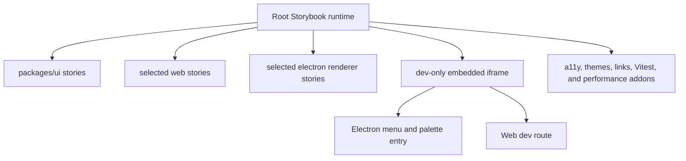
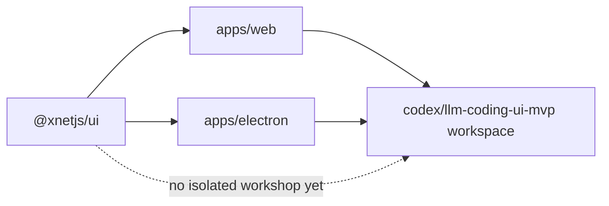
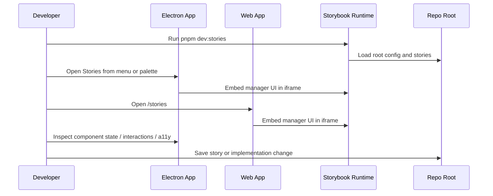
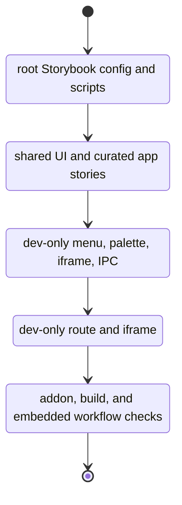

# 🧪 Storybook For xNet’s Shared UI And Electron IDE Direction

**Date**: March 9, 2026  
**Status**: Exploration  
**Scope**: `@xnetjs/ui`, `apps/web`, `apps/electron`, and the `codex/llm-coding-ui-mvp` branch direction  
**Problem**: xNet has a meaningful shared React UI surface, duplicated app-level components, and an emerging Electron coding-workspace shell, but no isolation environment for component development, documentation, layout debugging, or story-driven testing.

---

## Executive Summary

- ✅ xNet is a strong fit for Storybook now, not later. The repo already has a real shared design system in [`packages/ui/src/index.ts`](/Users/crs/.codex/worktrees/724b/xNet/packages/ui/src/index.ts) and the UI audit already lists Storybook docs, visual regression, and performance benchmarking as next steps in [`packages/ui/COMPONENT_AUDIT.md:100`](/Users/crs/.codex/worktrees/724b/xNet/packages/ui/COMPONENT_AUDIT.md#L100).
- ✅ The right baseline is **Storybook 10.2 with `@storybook/react-vite`**, because both `apps/web` and the Electron renderer are Vite-based today.
- ✅ The chosen direction is now **one root Storybook plus dev-only embedded access inside xNet**, not a production workshop surface and not a composition-first rollout.
- ✅ Storybook now loads the shared token CSS **and Tailwind utilities** in preview, so utility-class-based components render with the same styling contract used by the Web and Electron apps.
- ✅ Storybook now includes **core product workbenches** for the editor, database views, and canvas renderer, so the main interaction surfaces can be exercised in isolation.
  - the editor workbench now seeds media embeds, smart references, files, inline databases, task views, and linked collaborator panes to exercise live cursor and selection overlays
- ✅ Electron and Web should both expose Storybook from inside the app shell, but only in development:
  - Electron gets menu + command-palette entry points and an embedded Storybook view
  - Web gets a dev-only route such as `/stories`
  - the real Storybook UI is embedded, rather than building a custom workshop shell in v1
- ✅ The first pass now includes **shared package stories plus selected app stories**:
  - `@xnetjs/ui` catalogs
  - `@xnetjs/editor` playground
  - `@xnetjs/views` database workbench
  - `@xnetjs/canvas` workbench
  - renderer-safe app surfaces where light mocks are enough
- ✅ The shared UI catalog now covers the exported `@xnetjs/ui` component surface: primitives, composed devtools surfaces, comments UI, responsive shells, accessibility helpers, and a deliberate heavy story for local performance analysis.
- ✅ The active addon stack now includes `@github-ui/storybook-addon-performance-panel` alongside `@storybook/addon-a11y`, `@storybook/addon-vitest`, `@storybook/addon-themes`, and `@storybook/addon-links`.
- ✅ `withPerformanceMonitor` is now wired explicitly in `.storybook/preview.tsx`, while a local preset shim registers the manager panel without hiding the instrumentation path.
- ⚠️ The performance panel should stay a **local diagnostics tool**, not a merge gate. xNet can use it interactively for component profiling, but CI-grade performance enforcement still needs a stricter benchmark path.
- ⚠️ The GitHub addon currently declares a `react@^19` peer dependency, but it built and ran successfully against xNet’s React 18 Storybook setup during validation.
- 🥇 Recommendation: ship this in four implementation chunks:
  1. root Storybook config and shared decorators
  2. initial shared UI + app stories
  3. Electron dev-only embedded Storybook surface
  4. Web dev-only embedded Storybook route



---

## 🎯 Problem Statement

xNet needs a component-driven development surface that does four jobs well:

1. Let developers build and debug components in isolation.
2. Make the shared UI package more discoverable and testable.
3. Reduce drift between Electron and Web surfaces.
4. Turn the emerging Electron coding workspace into a true product-development shell instead of only a chat-plus-preview shell.

Today, the repo has the ingredients for this but not the workflow.

## ✅ Direction Lock (March 9, 2026)

The implementation direction for this exploration is now fixed:

- **Use Storybook**
- **Use one root Storybook runtime**
- **Embed the real Storybook UI**
- **Expose it only in development**
- **Integrate it into both Electron and Web**
- **Include shared UI stories plus curated app stories**
- **Do not build a custom native workshop shell in v1**

---

## 🧭 Current State In The Repository

### Observed facts

- `@xnetjs/ui` is already a meaningful shared design system with primitives, composed components, comments UI, responsive shells, and theming exported from [`packages/ui/src/index.ts:1`](/Users/crs/.codex/worktrees/724b/xNet/packages/ui/src/index.ts#L1).
- Root Storybook coverage now spans:
  - `packages/ui` catalogs for primitives, components, comments, settings, and devtools
  - `packages/editor` workbench stories for the rich text editor
  - `packages/views` workbench stories for database table and board surfaces
  - `packages/canvas` workbench stories for the spatial renderer
- The UI audit explicitly calls out the next steps:
  - “Add Storybook documentation”
  - “Add visual regression tests”
  - “Performance benchmarking”
  - Source: [`packages/ui/COMPONENT_AUDIT.md:100`](/Users/crs/.codex/worktrees/724b/xNet/packages/ui/COMPONENT_AUDIT.md#L100)
- Both app surfaces already align with a React + Vite Storybook stack:
  - Electron uses `electron-vite`, React 18, and Vite 5 in [`apps/electron/package.json:12`](/Users/crs/.codex/worktrees/724b/xNet/apps/electron/package.json#L12) and [`apps/electron/electron.vite.config.ts:44`](/Users/crs/.codex/worktrees/724b/xNet/apps/electron/electron.vite.config.ts#L44).
  - Web uses Vite 5 and React 18 in [`apps/web/package.json:6`](/Users/crs/.codex/worktrees/724b/xNet/apps/web/package.json#L6) and [`apps/web/vite.config.ts:11`](/Users/crs/.codex/worktrees/724b/xNet/apps/web/vite.config.ts#L11).
- The shared theme already exists and is consumed by both apps:
  - Electron imports `@xnetjs/ui` theme assets from [`apps/electron/src/renderer/styles.css:1`](/Users/crs/.codex/worktrees/724b/xNet/apps/electron/src/renderer/styles.css#L1)
  - Web imports them from [`apps/web/src/styles/globals.css:1`](/Users/crs/.codex/worktrees/724b/xNet/apps/web/src/styles/globals.css#L1)
- There is measurable duplication between Electron and Web app components. Matching file names exist for:
  - `AddSharedDialog`
  - `BundledPluginInstaller`
  - `CanvasView`
  - `DatabaseView`
  - `PageTasksPanel`
  - `PluginManager`
  - `PresenceAvatars`
  - `ShareButton`
  - `Sidebar`
- The `codex/llm-coding-ui-mvp` branch already points toward an IDE-shaped Electron app:
  - `DevWorkspaceShell` is a three-panel shell with session rail, OpenCode panel, and preview workspace.
  - `PreviewWorkspace` renders a live `iframe` preview plus diff/files/markdown/PR tabs.
  - `preview-manager.ts` boots per-worktree previews by spawning `pnpm exec vite` under `apps/web`.
  - `PreviewContextBridge.tsx` posts route/DOM/file-hint context from the preview back to the parent shell.

### Inference

The repo is already past the “should we use Storybook?” stage. The real question is how to fit Storybook into xNet’s monorepo and the emerging Electron IDE without creating a second-class demo environment that diverges from the real product.



### Repository Fit Notes

- `packages/ui` is the natural home for canonical stories because it has no `@xnetjs/*` dependencies in [`packages/ui/README.md`](/Users/crs/.codex/worktrees/724b/xNet/packages/ui/README.md).
- Electron renderer and Web app both use Vite-based toolchains, so `@storybook/react-vite` avoids builder fragmentation.
- The branch preview manager currently hardcodes `apps/web` as the preview app target, which is a strong opportunity: generalize it and Storybook becomes just another preview runtime.

---

## 🌐 External Research

### 1. Storybook is currently on 10.x, and 10.2 is the current release family

- Storybook’s docs pages for React + Vite are marked **Version 10.2**.
  - Source: [Storybook for React with Vite](https://storybook.js.org/docs/get-started/frameworks/react-vite)
- Storybook’s release page shows **Storybook 10.2 - January 2026**.
  - Source: [Storybook 10.2 release](https://storybook.js.org/releases/10.2)

### 2. Storybook 9 introduced exactly the IDE-adjacent features xNet cares about

- Storybook 9 positions itself as a component-testing foundation built around Storybook + Vitest + Playwright.
  - Source: [Storybook 9](https://storybook.js.org/blog/storybook-9/)
- It also introduced:
  - story generation from the UI
  - tag-based organization
  - story globals
  - a testing widget
  - Source: [Storybook 9](https://storybook.js.org/blog/storybook-9/)

### 3. React + Vite is the correct Storybook framework for xNet

- Official docs say Storybook for React + Vite is intended for React apps built with Vite and installs via `npm create storybook@latest`.
  - Source: [Storybook for React with Vite](https://storybook.js.org/docs/get-started/frameworks/react-vite)

### 4. Storybook’s Vitest addon is a strong match for xNet’s existing test stack

- Official docs say the Vitest addon transforms stories into Vitest tests using portable stories and runs them in browser mode with Playwright’s Chromium browser.
  - Source: [Vitest addon](https://storybook.js.org/docs/writing-tests/integrations/vitest-addon)
- The same docs show results surfacing in the Storybook UI sidebar and note that the testing widget can coordinate with other test types.
  - Source: [Vitest addon](https://storybook.js.org/docs/writing-tests/integrations/vitest-addon)

### 5. Accessibility testing is first-class and progressive

- Storybook’s accessibility docs surface violations directly in the UI and support CI automation when paired with the Vitest addon.
  - Source: [Accessibility tests](https://storybook.js.org/docs/writing-tests/accessibility-testing)
- The docs also support a progressive workflow with `a11y.test: 'todo'` before moving to hard failures.
  - Source: [Accessibility tests](https://storybook.js.org/docs/writing-tests/accessibility-testing)

### 6. Composition is the key feature for a monorepo workshop

- Official docs say Storybook Composition can browse components from any Storybook accessible by URL, whether published or running locally, regardless of view layer or dependencies.
  - Source: [Storybook Composition](https://storybook.js.org/docs/sharing/storybook-composition)
- Official docs also explicitly support composing multiple local Storybooks on different ports.
  - Source: [Storybook Composition](https://storybook.js.org/docs/sharing/storybook-composition)

### 7. Publishing paths are flexible, but hosted Storybook gives better workflow ergonomics

- Storybook docs recommend Chromatic for publishing/versioning/review workflows.
  - Source: [Publish Storybook](https://storybook.js.org/docs/sharing/publish-storybook)
- The same docs also include a GitHub Pages workflow example and note Storybook can be published to GitHub Pages, Netlify, S3, and other static hosts.
  - Source: [Publish Storybook](https://storybook.js.org/docs/sharing/publish-storybook)

### 8. Useful built-in Storybook tools already cover a lot of xNet’s needs

- `Controls` supports generated prop controls, documentation expansion, and saving story changes from the UI.
  - Source: [Controls](https://storybook.js.org/docs/essentials/controls)
- `Viewport` supports responsive viewport testing and custom device sets.
  - Source: [Viewport](https://storybook.js.org/docs/essentials/viewport)
- `Measure & outline` helps visually debug spacing, bounds, and layout alignment.
  - Source: [Measure & outline](https://storybook.js.org/docs/essentials/measure-and-outline/)

### 9. The performance addon is useful, but it is not the same as robust CI performance engineering

- The official Storybook integrations catalog exposes `storybook-addon-performance` and documents story-level interaction tasks plus save/load benchmark artifacts.
  - Source: [storybook-addon-performance](https://storybook.js.org/addons/storybook-addon-performance)
- That same page warns performance results vary by CPU and memory utilization and recommends production builds for best accuracy.
  - Source: [storybook-addon-performance](https://storybook.js.org/addons/storybook-addon-performance)

### 10. Electron embedding guidance favors iframes or modern web contents over legacy embedded views

- Electron’s web-embeds docs warn that `<webview>` is not explicitly supported and may not remain available in future versions.
  - Source: [Electron Web Embeds](https://www.electronjs.org/docs/latest/tutorial/web-embeds)
- Electron marks `BrowserView` as deprecated as of Electron 29+.
  - Source: [BrowserView](https://www.electronjs.org/docs/latest/api/browser-view)
- Electron’s modern replacement is `WebContentsView`.
  - Source: [WebContentsView](https://www.electronjs.org/docs/latest/api/web-contents-view)

---

## 🔍 Key Findings

1. **Storybook should be aligned to xNet’s package boundaries, not app routes alone.**  
   `@xnetjs/ui` is mature enough to justify canonical stories, while Electron/Web should carry only stories that need app-specific context.

2. **A single root Storybook is the best v1 tradeoff.**  
   It keeps the setup understandable, gives xNet one canonical dev server, and still lets both Electron and Web embed the same story surface.

3. **The `codex/llm-coding-ui-mvp` branch makes Storybook-in-Electron realistic.**  
   xNet already has a preview-runtime concept, session management, and a UI shell for multiple dev surfaces.

4. **The right addon stack is not “all addons”; it is a focused quality stack.**  
   Start with `a11y`, `themes`, `links`, `vitest`, and performance instrumentation only where it answers a real question.

5. **Performance needs two layers.**  
   Storybook’s performance panel is useful for local component profiling. CI-grade regression detection still belongs in dedicated benchmarks or visual/test workflows, not in ad hoc local timings alone.

6. **Storybook can help reduce Electron/Web duplication pressure.**  
   The duplicated app components are a signal that some shared surfaces may want promotion into `@xnetjs/ui` or shared app packages once their stories expose the overlap clearly.

---

## 🛠 Options And Tradeoffs

| Option                                          | Shape                                                            | Pros                                                                     | Cons                                                                      | Verdict              |
| ----------------------------------------------- | ---------------------------------------------------------------- | ------------------------------------------------------------------------ | ------------------------------------------------------------------------- | -------------------- |
| A. `packages/ui` only                           | One Storybook for shared primitives/composed components          | Fastest path, highest leverage, low risk                                 | App shells and Electron-specific flows remain undocumented                | Good first increment |
| B. One root Storybook embedded in dev           | One config, one process, all stories, embedded in Electron/Web   | Simple, consistent, easy to open from inside xNet, matches the chosen UX | Requires good mocks and careful story curation                            | Chosen v1            |
| C. Per-surface Storybooks + composition         | `packages/ui`, `apps/web`, `apps/electron`, plus a composed root | Strong ownership boundaries and long-term scale                          | More setup and more moving parts than needed for v1                       | Good later           |
| D. Internal preview routes instead of Storybook | Build custom “dev routes” in Web/Electron                        | Full control, no external tool semantics                                 | Reinvents controls/docs/testing/composition, higher maintenance           | Poor use of time     |
| E. Electron-only Storybook shell                | Develop components directly only inside desktop app              | Matches long-term IDE vision                                             | Blocks web contributors and CI hosting flows; ties everything to Electron | Too narrow for v1    |



---

## 🥇 Recommendation

### Chosen Architecture

Implement a **single root Storybook runtime** and make it feel native by **embedding the actual Storybook UI inside Electron and Web in development only**.

This is a deliberate shift away from the earlier composition-heavy direction.

#### Why this is the right fit

- It is the simplest path that still gives xNet the full Storybook ecosystem.
- It avoids shipping Storybook as a normal product surface.
- It keeps the UX integrated into the existing app shell.
- It avoids inventing a custom workshop framework before proving that the workflow is useful.
- It works in both Electron and Web with a shared story source and shared dev tooling.

### Runtime Model

#### Root Storybook

- Add Storybook once at the repo root under `.storybook/`.
- Use root-level scripts:
  - `pnpm dev:stories`
  - `pnpm build:stories`
  - `pnpm test:stories`
- Include story globs for:
  - `packages/ui`
  - curated `apps/web` stories
  - curated `apps/electron/src/renderer` stories

#### Electron

- Add a dev-only shell state for Stories in the renderer app.
- Add entry points in:
  - `SystemMenu`
  - command palette
- Embed Storybook with an `iframe`.
- Start Storybook from the Electron main process on demand and expose status via preload IPC.

#### Web

- Add a dev-only route such as `/stories`.
- Embed Storybook with an `iframe`.
- Read the target URL from `VITE_STORYBOOK_URL`.
- Do not auto-start Storybook from the browser app.

#### Production behavior

- No visible Stories entry in production.
- No Storybook runtime dependency in production navigation.
- No custom user-facing workshop mode in v1.

### Recommended Addon Stack

- `@storybook/addon-a11y`
- `@storybook/addon-links`
- `@storybook/addon-themes`
- `@github-ui/storybook-addon-performance-panel`
- `@storybook/addon-vitest`
- The GitHub performance panel is now the active local profiling addon in this repo.
- It currently reports a React 19 peer range, so xNet should keep validating it when Storybook or React is upgraded.
- Storybook 10.2 no longer publishes a matching `@storybook/addon-essentials` package for this setup, so v1 should rely on the default manager/docs surface plus targeted addons instead of forcing an outdated install.

### Story Scope

- Start with `@xnetjs/ui` stories.
- Add selected app stories immediately after:
  - dialogs
  - sidebars
  - settings surfaces
  - renderer-safe app components
- Exclude stories that require real Electron main-process, real sync, or live storage until they have stable mocks.

---

## 🧱 Proposed Rollout



### Target UX

- In development, a developer can open Stories from inside Electron without leaving the app.
- In development, a developer can jump to `/stories` inside the Web shell.
- The embedded surface is the real Storybook manager UI, including docs, controls, a11y, and addons.
- Production users never see the Stories surface.

---

## ✅ Implementation Checklist

- [x] Decide that Storybook is worth pursuing for xNet.
- [x] Choose a dev-only surface instead of a production workshop mode.
- [x] Choose one root Storybook runtime instead of a composition-first rollout.
- [x] Choose embedded real Storybook UI instead of a custom native workshop shell.
- [x] Choose Electron and Web as the first host surfaces.
- [x] Choose shared UI plus selected app stories as the initial scope.
- [x] Add root Storybook dependencies and scripts at the repo root.
- [x] Create `.storybook/main.ts`, `preview.ts`, and supporting shared decorators.
- [x] Load shared Tailwind utilities and theme CSS in Storybook preview.
- [x] Add initial story files for:
  - [x] `packages/ui` primitives
  - [x] `packages/ui` composed components
  - [x] `packages/editor` rich text editor playground
  - [x] `packages/views` database workbench
  - [x] `packages/canvas` workbench
  - [x] selected Web components
  - [x] selected Electron renderer components
- [ ] Add shared story mocks for:
  - [x] theme providers
  - [ ] router state
  - [x] preload-backed Electron APIs
  - [ ] renderer-safe app context
- [x] Enable Storybook 10’s default manager/docs surface without forcing `@storybook/addon-essentials`.
- [x] Enable `@storybook/addon-a11y`.
- [x] Enable `@storybook/addon-links`.
- [x] Enable `@storybook/addon-themes`.
- [x] Enable `@github-ui/storybook-addon-performance-panel`.
- [x] Register `withPerformanceMonitor` explicitly in preview so the instrumentation path is visible in-repo.
- [x] Enable `@storybook/addon-vitest`.
- [x] Add story-level performance scenarios and profiling guidance for high-value components.
- [x] Add Electron Storybook lifecycle management in main/preload.
- [x] Add a Stories shell state/view in the Electron renderer.
- [x] Add a dev-only `Open Stories` item to `SystemMenu`.
- [x] Add a dev-only `Open Stories` command to the command palette.
- [x] Add a dev-only Web route for embedded Storybook.
- [x] Add a dev-only Web navigation entry for Stories.
- [x] Update this exploration as implementation progresses and check off completed items.

---

## 🧪 Validation Checklist

- [x] Root Storybook boots with the shared xNet theme assets.
- [x] Tailwind utility classes render correctly inside Storybook preview.
- [x] Shared UI stories render in both light and dark themes.
- [x] Core editor, database, and canvas package stories render in isolation.
- [ ] Selected app stories render with mocks and no renderer crashes.
- [x] a11y results appear in the Storybook UI.
- [ ] Vitest addon runs portable-story tests.
- [x] Performance panel renders in the Storybook addon tray.
- [x] Performance readings are documented for at least one intentionally heavy story.
- [ ] Electron dev build can start Storybook on demand and display it in-app.
- [ ] Electron loading and failure states are clear when Storybook is unavailable.
- [x] Web dev route can embed Storybook from `VITE_STORYBOOK_URL`.
- [x] Web missing-server state is clear and non-fatal.
- [ ] Production builds do not expose Stories UI.
- [ ] No background dev servers are left running after verification workflows.

---

## 💡 Example Code

### 1. Root Storybook baseline

```ts
// .storybook/main.ts
import type { StorybookConfig } from '@storybook/react-vite'
import path from 'node:path'

const config: StorybookConfig = {
  framework: {
    name: '@storybook/react-vite',
    options: {}
  },
  stories: [
    '../packages/ui/src/**/*.stories.@(ts|tsx|mdx)',
    '../apps/web/src/**/*.stories.@(ts|tsx|mdx)',
    '../apps/electron/src/renderer/**/*.stories.@(ts|tsx|mdx)'
  ],
  addons: [
    '@storybook/addon-a11y',
    '@storybook/addon-links',
    '@storybook/addon-themes',
    './performance-panel-preset.ts',
    '@storybook/addon-vitest'
  ],
  viteFinal: async (viteConfig) => ({
    ...viteConfig,
    resolve: {
      ...viteConfig.resolve,
      alias: {
        ...viteConfig.resolve?.alias,
        '@xnetjs/ui': path.resolve(__dirname, '../packages/ui/src')
      }
    }
  })
}

export default config
```

```tsx
// .storybook/preview.ts
import { withPerformanceMonitor } from '@github-ui/storybook-addon-performance-panel'
import type { Preview } from '@storybook/react-vite'
import { withThemeByClassName } from '@storybook/addon-themes'
import '../packages/ui/src/theme/tokens.css'
import '../packages/ui/src/theme/motion.css'
import '../packages/ui/src/theme/accessibility.css'
import '../packages/ui/src/theme/responsive.css'
import '../packages/ui/src/theme/base-ui-animations.css'

import { ThemeProvider } from '../packages/ui/src/theme/ThemeProvider'

const preview: Preview = {
  tags: ['autodocs'],
  parameters: {
    controls: { expanded: true },
    a11y: { test: 'todo' }
  },
  decorators: [
    withPerformanceMonitor,
    withThemeByClassName({
      defaultTheme: 'system',
      themes: {
        system: '',
        light: 'light',
        dark: 'dark'
      }
    }),
    (Story, context) => (
      <ThemeProvider
        key={String(context.globals.theme ?? 'system')}
        defaultTheme={(context.globals.theme as 'light' | 'dark' | 'system') ?? 'system'}
        storageKey={`xnet-storybook-theme:${String(context.globals.theme ?? 'system')}`}
      >
        <div className="min-h-screen bg-background p-6 text-foreground">
          <Story />
        </div>
      </ThemeProvider>
    )
  ]
}

export default preview
```

### 2. Electron preload contract

```ts
type StorybookStatus = {
  state: 'stopped' | 'starting' | 'ready' | 'error'
  url?: string
  error?: string
}

interface XNetStorybookAPI {
  status(): Promise<StorybookStatus>
  ensure(): Promise<StorybookStatus>
  stop(): Promise<StorybookStatus>
}
```

### 3. Electron renderer shell state

```ts
type ShellState =
  | { kind: 'canvas-home' }
  | { kind: 'page-focus'; docId: string; returnViewport: ViewportSnapshot | null }
  | { kind: 'database-focus'; docId: string; returnViewport: ViewportSnapshot | null }
  | { kind: 'settings' }
  | { kind: 'stories' }
```

### 4. Web route idea

```tsx
// apps/web/src/routes/stories.tsx
export function StoriesRoute(): React.ReactElement {
  const storybookUrl = import.meta.env.VITE_STORYBOOK_URL

  if (!import.meta.env.DEV) {
    return <Navigate to="/" />
  }

  if (!storybookUrl) {
    return <div>Set VITE_STORYBOOK_URL and run pnpm dev:stories.</div>
  }

  return <iframe title="Storybook" src={storybookUrl} className="h-full w-full border-0" />
}
```

---

## ⚠️ Risks And Unknowns

- **Electron mocking boundary**: some renderer components depend on preload APIs or process-specific behavior. Those need disciplined mocks, not leaky real Electron state.
- **Package ownership drift**: if app-level stories proliferate without extraction discipline, Storybook may document duplication instead of reducing it.
- **Performance signal quality**: addon-based timings will vary across machines and should stay advisory until xNet has a stronger perf strategy.
- **Monorepo process load**: multiple local Storybooks plus Vite previews can get heavy. Composition should be opt-in during dev, not always-on.
- **Publishing choice**: GitHub Pages is simple and cheap; Chromatic provides better PR review ergonomics but adds external service coupling.

---

## 🚀 Next Actions

1. Add the root Storybook runtime and scripts.
2. Land the first story set for shared UI plus a small set of app stories.
3. Wire Electron embedded Storybook access.
4. Wire the Web dev-only Stories route (`/stories` in practice because TanStack file routes reserve the `__*` filename pattern).
5. Revisit deeper Electron workspace integration only after this simpler path proves useful.

---

## 🔗 References

### Repository references

- [`packages/ui/src/index.ts`](/Users/crs/.codex/worktrees/724b/xNet/packages/ui/src/index.ts)
- [`packages/ui/COMPONENT_AUDIT.md`](/Users/crs/.codex/worktrees/724b/xNet/packages/ui/COMPONENT_AUDIT.md)
- [`packages/ui/README.md`](/Users/crs/.codex/worktrees/724b/xNet/packages/ui/README.md)
- [`packages/ui/DESIGN_SYSTEM.md`](/Users/crs/.codex/worktrees/724b/xNet/packages/ui/DESIGN_SYSTEM.md)
- [`apps/electron/package.json`](/Users/crs/.codex/worktrees/724b/xNet/apps/electron/package.json)
- [`apps/electron/electron.vite.config.ts`](/Users/crs/.codex/worktrees/724b/xNet/apps/electron/electron.vite.config.ts)
- [`apps/web/package.json`](/Users/crs/.codex/worktrees/724b/xNet/apps/web/package.json)
- [`apps/web/vite.config.ts`](/Users/crs/.codex/worktrees/724b/xNet/apps/web/vite.config.ts)
- `codex/llm-coding-ui-mvp:apps/electron/src/renderer/workspace/DevWorkspaceShell.tsx`
- `codex/llm-coding-ui-mvp:apps/electron/src/renderer/workspace/PreviewWorkspace.tsx`
- `codex/llm-coding-ui-mvp:apps/electron/src/main/preview-manager.ts`
- `codex/llm-coding-ui-mvp:apps/electron/src/main/opencode-host-controller.ts`
- `codex/llm-coding-ui-mvp:apps/web/src/components/PreviewContextBridge.tsx`

### Web references

- [Storybook for React with Vite](https://storybook.js.org/docs/get-started/frameworks/react-vite)
- [Storybook 10.2 release](https://storybook.js.org/releases/10.2)
- [Storybook 9](https://storybook.js.org/blog/storybook-9/)
- [Vitest addon](https://storybook.js.org/docs/writing-tests/integrations/vitest-addon)
- [Accessibility tests](https://storybook.js.org/docs/writing-tests/accessibility-testing)
- [Storybook Composition](https://storybook.js.org/docs/sharing/storybook-composition)
- [Publish Storybook](https://storybook.js.org/docs/sharing/publish-storybook)
- [Controls](https://storybook.js.org/docs/essentials/controls)
- [Viewport](https://storybook.js.org/docs/essentials/viewport)
- [Measure & outline](https://storybook.js.org/docs/essentials/measure-and-outline/)
- [storybook-addon-performance](https://storybook.js.org/addons/storybook-addon-performance)
- [Electron Web Embeds](https://www.electronjs.org/docs/latest/tutorial/web-embeds)
- [BrowserView](https://www.electronjs.org/docs/latest/api/browser-view)
- [WebContentsView](https://www.electronjs.org/docs/latest/api/web-contents-view)
