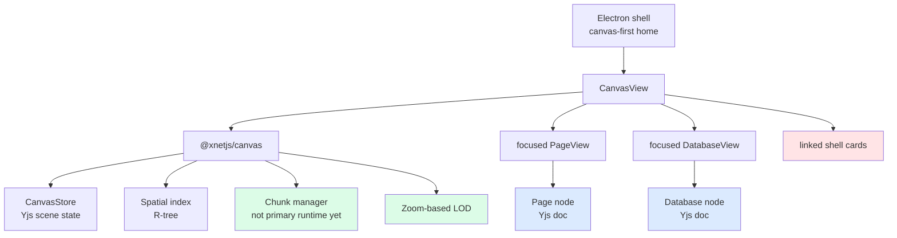
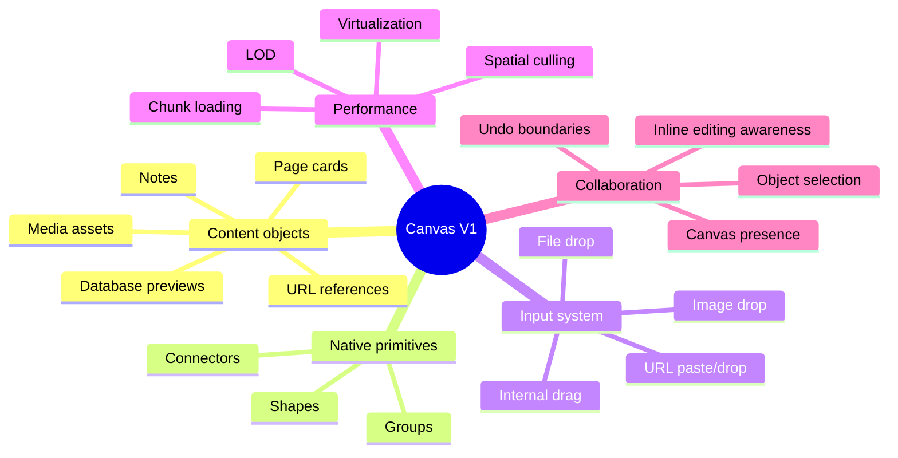
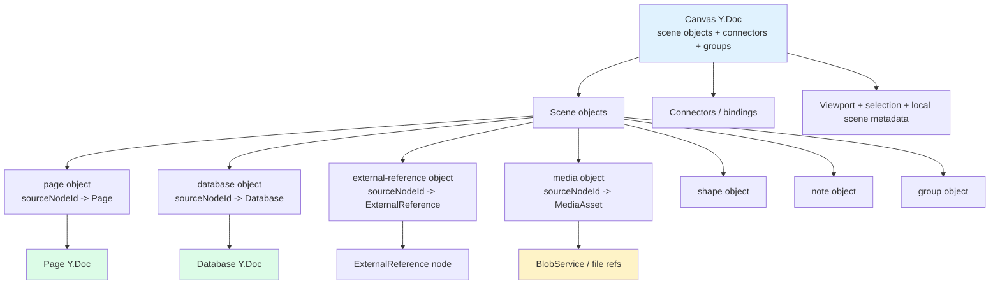
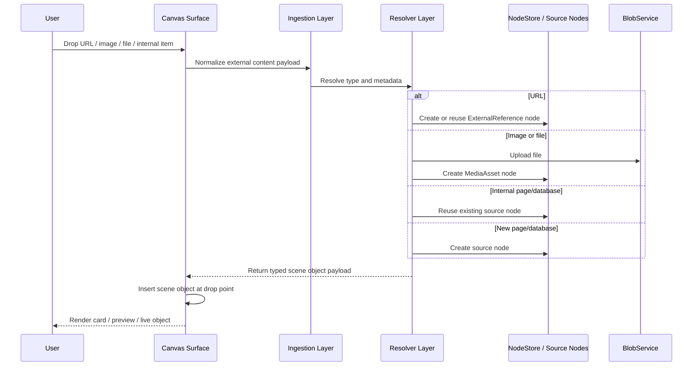

# 0108 - Canvas V1 Pages, Databases, Drops, and Infinite Canvas Deep Dive

> **Status:** Exploration  
> **Date:** 2026-03-09  
> **Author:** Codex  
> **Tags:** canvas, infinite-canvas, affine, blocksuite, tldraw, editor, database, performance, collaboration

## Problem Statement ✳️

xNet already has the beginnings of a strong infinite canvas, but today it still feels like a generic graph sandbox instead of the primary application surface:

- canvas nodes are mostly placeholders
- linked pages and databases open well, but do not yet feel native on the canvas
- the drop model is narrow instead of universal
- the renderer exposes chunking and level-of-detail primitives, but the active shell still renders a much simpler scene than the architecture can support

The goal of this exploration is to define a **broad whiteboard v1** for xNet:

- live editable page cards on canvas
- database cards with live preview and focus/open behavior
- dropped URLs with rich preview fallback
- dropped images/files as first-class canvas objects
- shapes and connectors as native spatial primitives
- a scene model that scales to large, collaborative, virtualized infinite canvases

## Exploration Status ✅

- [x] Audit the current repo state
- [x] Research external canvas systems and standards
- [x] Define the recommended architecture
- [x] Propose a phased implementation roadmap
- [x] Capture performance, collaboration, and testing requirements

## Executive Summary 🎯

The right move is **not** to keep extending the current generic `card/embed/shape` canvas model with more ad hoc props, and **not** to replace xNet with AFFiNE, BlockSuite, or tldraw wholesale.

The pragmatic direction is:

1. Turn the canvas into a **scene graph of references and primitives**.
2. Keep rich content in the systems that already own it:
   - `Page` nodes for rich text
   - `Database` nodes for structured collections
   - `ExternalReference` nodes for URLs
   - a new reusable asset node for dropped images/files
3. Treat canvas objects as spatial views over those records, with zoom-aware rendering:
   - far zoom: metadata cards
   - mid zoom: previews
   - near zoom: live editors where appropriate
4. Use the existing chunking, spatial indexing, and LOD work in `@xnetjs/canvas` as the base for a genuinely infinite surface.

### Recommended product cut

- **Pages:** fully editable inline on canvas in v1
- **Databases:** live preview + focus/open in v1
- **URLs:** dropped as node-backed preview cards with `oEmbed -> Open Graph -> generic link` fallback
- **Images/files:** dropped as node-backed media assets rendered directly on canvas
- **Shapes/connectors:** preserved and expanded, but treated as supporting primitives around node-backed content

This gives xNet a canvas that is useful immediately, while keeping the data model aligned with the rest of the system.

## Current State In The Repository 🔎

### Observed fact: the canvas package is stronger than the active canvas UX

The core package already contains substantial infrastructure:

- [`packages/canvas/src/spatial/index.ts`](../../packages/canvas/src/spatial/index.ts)
  - R-tree spatial indexing
  - viewport transforms
  - point and range queries
- [`packages/canvas/src/nodes/CanvasNodeComponent.tsx`](../../packages/canvas/src/nodes/CanvasNodeComponent.tsx)
  - zoom-based LOD (`placeholder`, `minimal`, `compact`, `full`)
- [`packages/canvas/src/chunks/chunked-canvas-store.ts`](../../packages/canvas/src/chunks/chunked-canvas-store.ts)
  - chunked scene storage
- [`packages/canvas/src/chunks/chunk-manager.ts`](../../packages/canvas/src/chunks/chunk-manager.ts)
  - viewport-driven chunk load/evict lifecycle
- [`packages/canvas/src/store.ts`](../../packages/canvas/src/store.ts)
  - collaborative Yjs-backed node/edge scene storage

But the public node model is still generic in [`packages/canvas/src/types.ts`](../../packages/canvas/src/types.ts):

- `card`
- `frame`
- `shape`
- `image`
- `embed`
- `group`

That is too generic for a canvas-first application.

### Observed fact: the active Electron canvas shell still renders linked cards, not live content

The current app shell has already shifted toward canvas-first in:

- [`apps/electron/src/renderer/App.tsx`](../../apps/electron/src/renderer/App.tsx)
- [`apps/electron/src/renderer/components/CanvasView.tsx`](../../apps/electron/src/renderer/components/CanvasView.tsx)

That shell already:

- boots into a home canvas
- creates linked page/database nodes on the canvas
- uses zoom transitions into focused page/database views
- treats the canvas as the home surface

However, the actual node rendering still relies on lightweight shell cards:

- linked page/database cards
- canvas notes
- double-click to open focused page/database surfaces

This is directionally right, but still one step removed from “the canvas is the app.”

### Observed fact: pages and databases are already separate node-backed Yjs documents

The data model already supports the split we want:

- [`packages/data/src/schema/schemas/page.ts`](../../packages/data/src/schema/schemas/page.ts)
  - `PageSchema`
  - `document: 'yjs'`
- [`packages/data/src/schema/schemas/database.ts`](../../packages/data/src/schema/schemas/database.ts)
  - `DatabaseSchema`
  - `document: 'yjs'`
- [`packages/data/src/schema/schemas/canvas.ts`](../../packages/data/src/schema/schemas/canvas.ts)
  - `CanvasSchema`
  - `document: 'yjs'`

That means xNet already has the correct separation of concerns:

- the canvas owns spatial placement
- page/database docs own their content state

This is a strong foundation for inline canvas rendering without duplicating content into the canvas doc.

### Observed fact: upload and external reference primitives already exist

There are already reusable building blocks for dropped content:

- [`packages/data/src/blob/blob-service.ts`](../../packages/data/src/blob/blob-service.ts)
  - blob-backed file upload and retrieval
- [`packages/editor/src/hooks/useImageUpload.ts`](../../packages/editor/src/hooks/useImageUpload.ts)
  - image upload plumbing
- [`packages/editor/src/hooks/useFileUpload.ts`](../../packages/editor/src/hooks/useFileUpload.ts)
  - file upload plumbing
- [`packages/data/src/schema/schemas/external-reference.ts`](../../packages/data/src/schema/schemas/external-reference.ts)
  - a reusable, queryable URL/reference node shape

The missing piece is not raw infrastructure. It is the canvas ingestion and scene model.

### Current state map



## External Research 🌍

### AFFiNE: the best precedent for “canvas as the main workspace”

AFFiNE’s official July 2024 update is especially relevant:

- **Center Peek** allows previewing and editing linked content without a full context switch.
- **Synced Docs** support multiple live pages on one edgeless whiteboard.
- Edgeless text was reworked from simple canvas text toward richer note-like editing.

Sources:

- [AFFiNE July 2024 Update](https://affine.pro/blog/whats-new-affine-2024-07)

Their November 2024 update is also directly relevant:

- linked doc and database interactions became tighter
- docs can be linked or created from databases
- database properties sync into document metadata
- a floating sidebar reinforced the “show less chrome by default” direction

Sources:

- [AFFiNE November 2024 Update](https://affine.pro/blog/whats-new-affine-nov-update)

### BlockSuite: useful as a headless UX reference, not as a replacement

BlockSuite’s official positioning is consistent with the product direction here:

- headless editor framework
- interoperable editor components
- collaboration as a first-class concern

That validates xNet’s decision to preserve its own architecture while borrowing interaction patterns.

Source:

- [BlockSuite](https://blocksuite.io/)

### tldraw: best-in-class reference for scene objects, bindings, and external content ingestion

tldraw’s docs are valuable because they break the whiteboard problem into concrete systems:

- shapes are records with type-specific props and behavior
- bindings persist relationships so arrows stay attached as objects move
- external content handling unifies pasted text, dropped files, and dropped URLs
- embed shapes distinguish embeddable URLs from bookmark-style fallbacks

Sources:

- [tldraw Shapes](https://tldraw.dev/docs/shapes)
- [tldraw Bindings](https://tldraw.dev/sdk-features/bindings)
- [tldraw External Content Handling](https://tldraw.dev/sdk-features/external-content)
- [tldraw Embed Shape](https://tldraw.dev/sdk-features/embed-shape)

### Yjs subdocuments: useful future optimization, not the primary v1 strategy

Yjs subdocuments support lazy-loaded nested documents within a root doc. That is interesting for canvas scenes that want document-like containment, but Yjs’s own docs also note that providers handle subdocuments differently and that they are typically treated as separate sync units.

That makes subdocs a future optimization or composition mechanism, not the main v1 strategy for xNet, because xNet already has working per-node Yjs document ownership.

Source:

- [Yjs Subdocuments](https://docs.yjs.dev/api/subdocuments)

### TanStack Virtual: the right philosophy for heavy embedded surfaces

TanStack Virtual’s docs reinforce the correct posture for database and embedded surface rendering:

- headless virtualization
- dynamic measurement support
- retain full control over markup and layout

This matters because canvas-embedded surfaces will need bespoke markup and zoom-aware measurement, not a monolithic virtualization widget.

Sources:

- [TanStack Virtual](https://tanstack.com/virtual)
- [TanStack Virtualizer API](https://tanstack.com/virtual/latest/docs/api/virtualizer)

### URL preview standards: use standards-first fallback, not scraper-first special cases

For dropped URLs, the right resolution chain is standards-first:

- use `oEmbed` when a provider exposes an endpoint
- otherwise use Open Graph metadata
- otherwise render a generic link card

Why:

- `oEmbed` explicitly exists to turn a URL into structured preview or embed data
- Open Graph provides a widely adopted metadata baseline (`og:title`, `og:image`, `og:url`, etc.)

Sources:

- [oEmbed](https://oembed.com/)
- [The Open Graph protocol](https://ogp.me/)

## Key Findings 🧠

### 1. The canvas should become a scene graph, not a generic bag of node props

Today’s `CanvasNodeType` is too weakly typed for the product ambition.

The canvas should instead model a small number of intentional object kinds:

- `page`
- `database`
- `external-reference`
- `media`
- `shape`
- `note`
- `group`

Observed fact:

- xNet already has strong node-backed primitives outside the canvas.

Inference:

- the canvas should spatially compose those primitives instead of pretending they are all just variations of a generic card.

### 2. Inline page editing is the highest-leverage v1 capability

Pages are already:

- collaborative Yjs docs
- rendered via `RichTextEditor`
- familiar as the main writing primitive

That makes “click to create a page on canvas and edit it there” the cleanest first major upgrade.

This is the direct path from “canvas shell card” to “canvas-native useful object.”

### 3. Databases should be live preview objects first, not full inline databases on day one

Databases are heavier:

- view-specific
- schema-driven
- more DOM-intensive
- more interaction-dense than pages

The right default is:

- render a live preview node on canvas
- let users open/focus the full database surface for deep editing

That keeps the canvas useful without blowing up complexity immediately.

### 4. Universal drop ingestion is a product requirement, not a stretch goal

Your additional requirement changes the canvas definition materially:

- the canvas must be the main drop target
- users should be able to drop internal nodes, external URLs, images, and files

That means xNet needs a single ingestion pipeline for:

- internal app drags
- OS file drops
- pasted URLs / dropped text
- embeddable URLs

This should be treated as a core architecture layer, not scattered event handling.

### 5. External links should become node-backed references

The repo already has `ExternalReferenceSchema`. That is the correct reuse point.

The missing work is:

- URL normalization
- preview resolution
- canvas rendering for the reference

This is much better than storing raw URLs only inside canvas-local props.

### 6. Media needs a reusable asset node, not only blob refs inside the scene

Blob storage already exists, but there is no reusable top-level “media asset” node schema in the built-in data model.

If dropped images/files matter across surfaces, they should become first-class node-backed objects.

That would let the same asset be:

- shown on canvas
- referenced in pages
- queried later
- shared and permissioned consistently

### 7. Connectors should behave like bindings, not just dumb lines

The current edge model already binds source and target node IDs, which is directionally correct. The next step is to formalize richer anchor semantics and persistence rules so connectors remain stable as the scene grows more heterogeneous.

This is where tldraw’s bindings model is useful as a conceptual reference.

### 8. The performance work already exists; it just is not driving the primary canvas runtime yet

The repo already contains:

- spatial indexing
- LOD rendering
- chunked canvas storage
- chunk load/evict orchestration

The exploration should therefore recommend **activating and integrating** this work, not inventing a brand new performance architecture.

## Capability Breakdown 🧭



## Options And Tradeoffs ⚖️

### Option A. Keep the current generic canvas types and add more props

What it means:

- keep `card/embed/shape/image/group`
- add `linkedType`, `previewKind`, `assetRef`, and more ad hoc props

Pros:

- smallest initial refactor
- low migration effort

Cons:

- scene semantics stay blurry
- harder to optimize per object kind
- every new capability becomes another convention instead of a contract

Verdict:

- good for prototypes
- wrong for a canvas-first product

### Option B. Refactor to explicit scene object kinds backed by existing xNet nodes

What it means:

- give the canvas an intentional object model
- keep rich content in Page/Database/ExternalReference/new MediaAsset nodes
- keep canvas docs focused on placement, sizing, grouping, connectors, and view state

Pros:

- clear contracts
- easier rendering and performance policies
- easier long-term extensibility
- matches xNet’s node-centric architecture

Cons:

- requires a more aggressive refactor now
- needs a migration or rewrite of existing canvas sample data and helpers

Verdict:

- **recommended**

### Option C. Replace the current canvas runtime with tldraw or BlockSuite

What it means:

- delegate scene model and canvas UX to an external editor stack

Pros:

- strong off-the-shelf UX references
- proven patterns for shapes, embeds, and bindings

Cons:

- deep architectural mismatch with xNet data ownership
- large adapter surface
- weaker fit for current Page/Database node model

Verdict:

- useful for inspiration
- not the right implementation path

## Recommendation ✅

### Recommended architecture

Use a **node-backed scene graph**:

- the `Canvas` doc stores scene objects, connectors, grouping, transforms, z-order, and canvas-local view state
- page/database/reference/media content remains in its own source node
- canvas objects point to source nodes through stable references

Recommended object kinds:

| Kind | Backed by | Default canvas behavior |
| --- | --- | --- |
| `page` | `Page` node | Card at distance, live editor when near/selected |
| `database` | `Database` node | Live preview card, open/focus for deep edit |
| `external-reference` | `ExternalReference` node | Bookmark/embed preview card |
| `media` | New `MediaAsset` node | Direct render with blob-backed preview |
| `shape` | Canvas-local primitive | Native canvas primitive |
| `note` | Either lightweight page or canvas-native note | Fast local note object |
| `group` | Canvas-local primitive | Selection/layout container |

### Recommended product behavior

#### Pages

- create page directly from the canvas
- mount `RichTextEditor` inline when the object is near enough or explicitly entered
- preserve page identity outside the canvas as a regular xNet page

#### Databases

- create and place database from the canvas
- render title, schema/view metadata, and a live preview slice
- open/focus the full database surface for dense editing

#### URLs

- on drop/paste, normalize URL and create or reuse an `ExternalReference`
- attempt `oEmbed`
- fall back to Open Graph
- fall back again to a generic link card

#### Images/files

- on drop, upload with `BlobService`
- create a first-class asset node
- place a media object on the canvas immediately

#### Shapes/connectors

- keep them native to the canvas
- make connectors attach to object anchors robustly
- allow shapes to frame or annotate node-backed content

## Proposed Runtime Shape 🏗️



## Implementation Roadmap 🛠️

### Phase 1. Replace placeholder canvas semantics

- introduce an explicit scene object type system
- replace generic linked shell cards with typed page/database/reference/media objects
- remove or de-emphasize mock embed flows and generic placeholder assumptions

### Phase 2. Ship page cards and universal drop ingestion

- create page on canvas
- inline page editing with zoom/selection gating
- add drop ingestion pipeline for:
  - internal node drags
  - URLs
  - files/images

### Phase 3. Ship database preview objects and robust connectors

- add database preview cards
- wire focus/open flows
- upgrade connector anchoring and persistence

### Phase 4. Activate true infinite runtime paths

- route the main canvas runtime through chunked scene loading
- combine chunk visibility with per-object LOD
- mount heavy objects only when visible and close enough

### Phase 5. Collaboration and polish

- separate canvas awareness from inline content awareness
- refine undo/redo scope boundaries
- add accessibility and regression hardening

## Drop And Edit Lifecycle



## Performance And Collaboration Guidance 🚀

### Performance

The performance strategy should be two-stage:

1. **scene-level culling**
   - use chunked loading and spatial queries to decide which objects are even in memory/render scope
2. **object-level LOD**
   - only mount expensive content when the object is visible and close enough

Practical policy:

- far zoom: metadata rectangles only
- mid zoom: preview DOM
- near zoom: live editor/media/embed DOM

For databases specifically:

- preview cards should render a bounded slice
- full table/board editing stays in focused mode in v1
- use headless virtualization for any embedded table preview that can grow

### Collaboration

Split collaboration into scopes:

- **canvas scope**
  - selection
  - movement
  - viewport presence
  - object insertion/removal
- **content scope**
  - page editing awareness
  - database editing awareness
  - comments and rich editing interactions

This avoids conflating “I am moving the page object” with “I am editing the page document.”

### Subdocuments

Yjs subdocuments are worth tracking as a future path for:

- nested scene composition
- explicit lazy loading inside a root doc

But v1 should not depend on them. xNet already has a simpler, working architecture with separate per-node Yjs docs.

## Example Code 💡

### 1. Recommended scene object union

```ts
type CanvasObjectKind =
  | 'page'
  | 'database'
  | 'external-reference'
  | 'media'
  | 'shape'
  | 'note'
  | 'group'

type CanvasObjectFrame = {
  x: number
  y: number
  width: number
  height: number
  rotation?: number
  zIndex?: number
}

type CanvasSceneObject =
  | {
      id: string
      kind: 'page'
      frame: CanvasObjectFrame
      sourceNodeId: string
      sourceSchemaId: 'xnet://xnet.fyi/Page@1.0.0'
      display: { mode: 'card' | 'preview' | 'live' }
    }
  | {
      id: string
      kind: 'database'
      frame: CanvasObjectFrame
      sourceNodeId: string
      sourceSchemaId: 'xnet://xnet.fyi/Database@1.0.0'
      display: { mode: 'card' | 'preview' }
    }
  | {
      id: string
      kind: 'external-reference'
      frame: CanvasObjectFrame
      sourceNodeId: string
      sourceSchemaId: 'xnet://xnet.fyi/ExternalReference@1.0.0'
      display: { mode: 'bookmark' | 'embed' }
    }
  | {
      id: string
      kind: 'media'
      frame: CanvasObjectFrame
      sourceNodeId: string
      sourceSchemaId: 'xnet://xnet.fyi/MediaAsset@1.0.0'
      assetRef: { cid: string; mimeType: string; name: string; size: number }
    }
  | {
      id: string
      kind: 'shape'
      frame: CanvasObjectFrame
      shape: 'rectangle' | 'ellipse' | 'diamond' | 'triangle'
      style: { fill?: string; stroke?: string }
    }
```

### 2. Recommended drop-ingestion boundary

```ts
type ExternalCanvasDrop =
  | { type: 'internal-node'; nodeId: string; schemaId: string }
  | { type: 'url'; url: string }
  | { type: 'files'; files: File[] }
  | { type: 'text'; text: string }

type CanvasDropResult =
  | { kind: 'page'; sourceNodeId: string }
  | { kind: 'database'; sourceNodeId: string }
  | { kind: 'external-reference'; sourceNodeId: string }
  | { kind: 'media'; sourceNodeId: string }
  | { kind: 'note'; sourceNodeId: string | null }

async function ingestCanvasDrop(
  input: ExternalCanvasDrop,
  deps: {
    createPage: () => Promise<string>
    createExternalReference: (url: string) => Promise<string>
    createMediaAsset: (file: File) => Promise<string>
  }
): Promise<CanvasDropResult[]> {
  switch (input.type) {
    case 'internal-node':
      return input.schemaId.includes('/Page')
        ? [{ kind: 'page', sourceNodeId: input.nodeId }]
        : [{ kind: 'database', sourceNodeId: input.nodeId }]

    case 'url':
      return [
        {
          kind: 'external-reference',
          sourceNodeId: await deps.createExternalReference(input.url)
        }
      ]

    case 'files':
      return Promise.all(
        input.files.map(async (file) => ({
          kind: 'media' as const,
          sourceNodeId: await deps.createMediaAsset(file)
        }))
      )

    case 'text':
      return input.text.startsWith('http')
        ? [
            {
              kind: 'external-reference',
              sourceNodeId: await deps.createExternalReference(input.text)
            }
          ]
        : [{ kind: 'note', sourceNodeId: await deps.createPage() }]
  }
}
```

### 3. Zoom-aware render policy

```ts
function resolveObjectRenderMode(
  kind: CanvasObjectKind,
  zoom: number,
  selected: boolean
): 'placeholder' | 'card' | 'preview' | 'live' {
  if (zoom < 0.15) return 'placeholder'
  if (kind === 'page') {
    if (selected && zoom >= 0.75) return 'live'
    if (zoom >= 0.4) return 'preview'
    return 'card'
  }
  if (kind === 'database') {
    if (zoom >= 0.5) return 'preview'
    return 'card'
  }
  if (kind === 'external-reference' || kind === 'media') {
    return zoom >= 0.35 ? 'preview' : 'card'
  }
  return 'card'
}
```

## Implementation Checklist 📋

- [ ] Replace the generic canvas object contract with explicit scene object kinds.
- [ ] Add a new reusable media/asset node schema for dropped images/files.
- [ ] Route page creation on canvas to real `Page` nodes.
- [ ] Render inline live page editors behind zoom/selection gating.
- [ ] Render database preview cards backed by real `Database` nodes.
- [ ] Add connector anchor/binding metadata that survives move/resize.
- [ ] Implement a unified canvas ingestion pipeline for internal drags, URLs, text, and files.
- [ ] Reuse `ExternalReferenceSchema` for dropped URLs.
- [ ] Implement `oEmbed -> Open Graph -> generic card` URL resolution.
- [ ] Reuse `BlobService` for dropped image/file persistence.
- [ ] Promote chunked canvas storage and chunk manager into the primary renderer path.
- [ ] Gate expensive DOM mounts behind visibility and LOD.
- [ ] Split canvas collaboration state from inline content collaboration state.
- [ ] Update Storybook workbenches to reflect the new typed scene model.

## Validation Checklist 🧪

- [ ] Create a page directly on canvas and edit it inline with another collaborator connected.
- [ ] Create a database directly on canvas and verify preview freshness after row/schema changes.
- [ ] Drag an existing page onto the canvas and preserve identity rather than duplicating content.
- [ ] Drag an existing database onto the canvas and verify preview/open behavior.
- [ ] Drop a URL that supports `oEmbed` and verify embed-capable preview behavior.
- [ ] Drop a URL without `oEmbed` but with Open Graph metadata and verify bookmark rendering.
- [ ] Drop a URL without preview metadata and verify generic link fallback.
- [ ] Drop an image and verify upload, preview sizing, and persistence after reload.
- [ ] Drop a non-image file and verify media/file object rendering and retrieval.
- [ ] Draw shapes and connectors around page/database/media objects.
- [ ] Move or resize connected objects and confirm connectors stay attached correctly.
- [ ] Pan across a large scene and confirm bounded DOM count and stable frame times.
- [ ] Verify chunk load/evict behavior under large-scene navigation.
- [ ] Verify far-away objects do not mount inline editors.
- [ ] Verify undo/redo boundaries between scene changes and content edits.
- [ ] Verify keyboard selection, focus management, and accessible labels for canvas objects.

## References 🔗

### Repository references

- [`packages/canvas/src/types.ts`](../../packages/canvas/src/types.ts)
- [`packages/canvas/src/renderer/Canvas.tsx`](../../packages/canvas/src/renderer/Canvas.tsx)
- [`packages/canvas/src/nodes/CanvasNodeComponent.tsx`](../../packages/canvas/src/nodes/CanvasNodeComponent.tsx)
- [`packages/canvas/src/chunks/chunked-canvas-store.ts`](../../packages/canvas/src/chunks/chunked-canvas-store.ts)
- [`packages/canvas/src/chunks/chunk-manager.ts`](../../packages/canvas/src/chunks/chunk-manager.ts)
- [`packages/canvas/src/store.ts`](../../packages/canvas/src/store.ts)
- [`apps/electron/src/renderer/App.tsx`](../../apps/electron/src/renderer/App.tsx)
- [`apps/electron/src/renderer/components/CanvasView.tsx`](../../apps/electron/src/renderer/components/CanvasView.tsx)
- [`apps/electron/src/renderer/lib/canvas-shell.ts`](../../apps/electron/src/renderer/lib/canvas-shell.ts)
- [`packages/data/src/schema/schemas/page.ts`](../../packages/data/src/schema/schemas/page.ts)
- [`packages/data/src/schema/schemas/database.ts`](../../packages/data/src/schema/schemas/database.ts)
- [`packages/data/src/schema/schemas/canvas.ts`](../../packages/data/src/schema/schemas/canvas.ts)
- [`packages/data/src/schema/schemas/external-reference.ts`](../../packages/data/src/schema/schemas/external-reference.ts)
- [`packages/data/src/blob/blob-service.ts`](../../packages/data/src/blob/blob-service.ts)
- [`packages/editor/src/hooks/useImageUpload.ts`](../../packages/editor/src/hooks/useImageUpload.ts)
- [`packages/editor/src/hooks/useFileUpload.ts`](../../packages/editor/src/hooks/useFileUpload.ts)

### Web research

- [AFFiNE July 2024 Update](https://affine.pro/blog/whats-new-affine-2024-07)
- [AFFiNE November 2024 Update](https://affine.pro/blog/whats-new-affine-nov-update)
- [AFFiNE home](https://affine.pro/)
- [BlockSuite](https://blocksuite.io/)
- [tldraw Shapes](https://tldraw.dev/docs/shapes)
- [tldraw Bindings](https://tldraw.dev/sdk-features/bindings)
- [tldraw External Content Handling](https://tldraw.dev/sdk-features/external-content)
- [tldraw Embed Shape](https://tldraw.dev/sdk-features/embed-shape)
- [Yjs Subdocuments](https://docs.yjs.dev/api/subdocuments)
- [TanStack Virtual](https://tanstack.com/virtual)
- [TanStack Virtualizer API](https://tanstack.com/virtual/latest/docs/api/virtualizer)
- [oEmbed](https://oembed.com/)
- [The Open Graph protocol](https://ogp.me/)

## Recommendation In One Sentence

xNet should evolve the canvas into a **typed, node-backed, drop-first infinite scene graph** where pages are live editable on-canvas, databases default to preview/open behavior, URLs and media become first-class objects, and chunked + zoom-aware rendering make the surface truly scalable.
