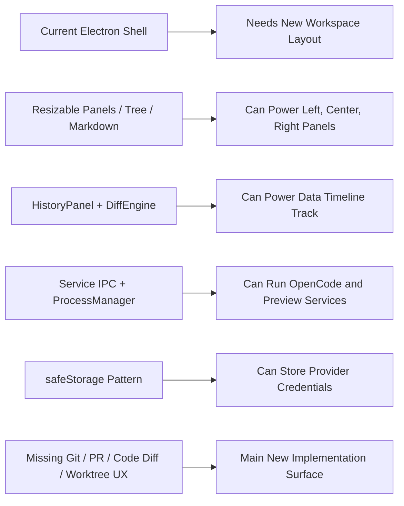
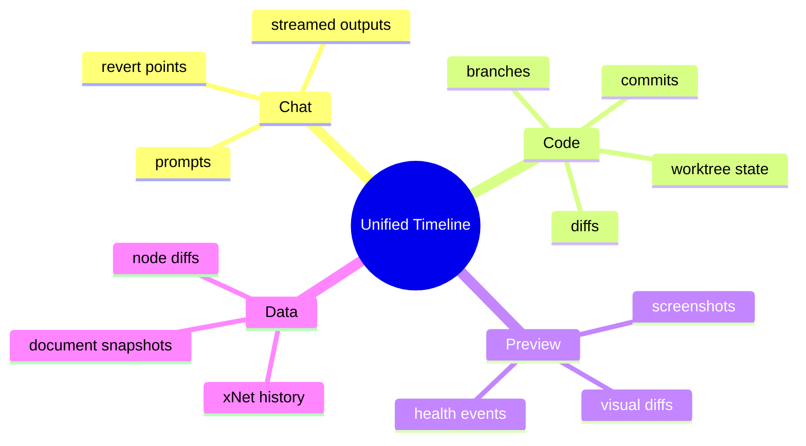
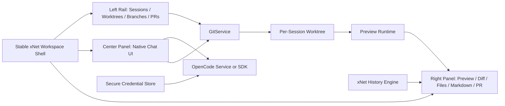
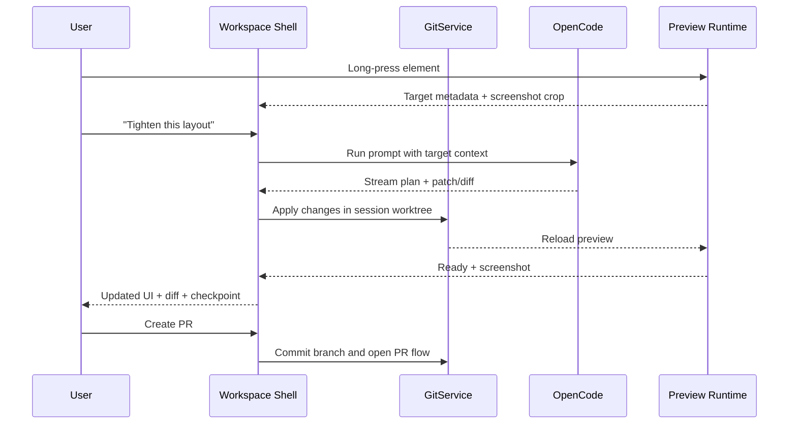
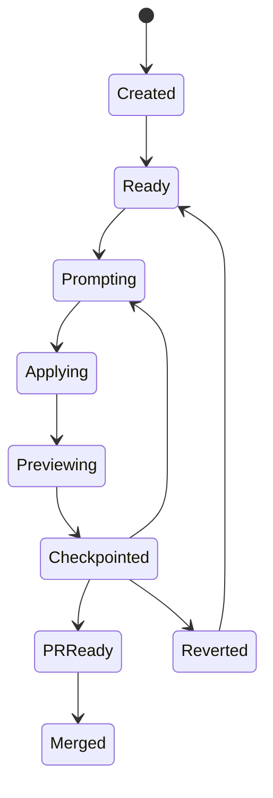

# Electron-First Self-Editing Workspace Shell for xNet

## 1. 🧭 Title and Problem Statement

This exploration narrows the earlier self-editing app idea to a single target: an Electron-first xNet workspace shell that feels close to Codex/OpenCode.

The desired product shape is:

- left panel: chats, worktrees, branches, PRs, session activity
- center panel: streaming chat UI with strong model/provider ergonomics
- right panel: live app preview plus diffs, file previews, markdown previews, screenshots, and PR state
- optional focus mode: hide shell chrome and let the preview take over
- timeline rail: scrub code checkpoints, screenshots, and xNet data history in one place

The key design constraint is that "the app edits itself" should not literally mean "the currently running shell mutates its own files in place." The higher-quality Electron design is a **stable workspace shell** that edits **isolated worktrees** and renders each worktree in a **separate preview runtime**.

## 2. ⚡ Executive Summary

This is viable in Electron, and Electron is the right place to start.

Observed facts:

- The repo already has Electron process management, secure storage helpers, reusable resizable panels, markdown rendering, tree views, and data-history scrubbing.
- The repo does **not** currently have git/worktree orchestration, PR creation flows, OpenCode integration, code diff UI, or a dedicated preview-runtime manager.
- The current Electron shell is canvas-first, not a Codex-like three-panel workspace shell.

Recommendation:

1. Build a **native xNet workspace shell** in Electron.
2. Model each editable conversation as `DevSession = worktree + branch + OpenCode session + preview runtime + checkpoints`.
3. Use **OpenCode as the engine**, not as the final product shell.
4. Bootstrap fast with embedded OpenCode web if needed, but target a **native chat panel backed by the OpenCode server or SDK**.
5. Keep the shell running from a stable workspace and edit the app in **sibling worktrees**, never in the same files that power the host window.
6. Treat **speed as a first-class requirement**: session switching must come from local state and warm previews, not from fresh network or git work on every click.

Estimated complexity:

| Slice | Complexity | Notes |
| --- | --- | --- |
| 3-panel Electron shell | Low-Medium | Existing UI primitives cover much of this. |
| Git worktree/branch/session orchestration | Medium | Mostly main-process plumbing and guardrails. |
| OpenCode embedded web bootstrap | Medium | Fastest path, weaker integration. |
| Native chat UI backed by OpenCode server/SDK | Medium-High | More UI work, much better product quality. |
| Unified code/data/chat timeline | High | The strongest differentiator, but also new architecture. |
| Long-press element targeting | Medium-High | Requires preview instrumentation and stable targeting metadata. |
| True embedded Electron preview inside the shell | High | Harder than web preview because it needs isolated WebContents lifecycles. |
| One-click PR with screenshot | Medium | Straightforward once git/session/screenshot primitives exist. |

Inference:

- A rough prototype is a few weeks.
- A genuinely high-quality internal version is more like 6-10 weeks.
- A "works for other people safely" version is closer to a quarter than a weekend.

## 3. 🧱 Current State in the Repository

### Shell and Layout

The current Electron renderer shell is centered on the canvas experience, not on development workflows. `apps/electron/src/renderer/App.tsx:432-498` renders:

- a top titlebar area with `SystemMenu`
- the main `CanvasView`
- overlay content
- a bottom `ActionDock`
- a `CommandPalette`

That means the repo is not starting from a Codex-like shell, but it is also not far from one.

### Reusable UI Primitives Already Present

The repo already has good building blocks for the workspace shell:

- `packages/ui/src/primitives/ResizablePanel.tsx:12-46` exposes `ResizablePanelGroup`, `ResizablePanel`, and `ResizableHandle`
- `packages/ui/src/composed/TreeView.tsx:22-99` provides a hierarchical tree control that fits the left rail
- `packages/ui/src/components/MarkdownContent.tsx:109-121` renders GFM markdown and is a good base for chat markdown and PR body previews
- `packages/ui/src/composed/CodeBlock.tsx:11-18` is enough for raw file preview while a better code diff viewer is added

### History and Scrubbing

The repo already has real data-history affordances:

- `packages/devtools/src/panels/HistoryPanel/HistoryPanel.tsx:128-212` includes a timeline slider scrubber and detail pane
- `packages/history/src/diff.ts:11-87` contains a `DiffEngine` for property-level diffs across time

This is important because the "data scrubber" half of the vision already exists. The missing half is a **code checkpoint rail** with git-aware diffs and preview snapshots.

### Electron Main-Process Capabilities

Electron already owns several capabilities that this feature needs:

- `apps/electron/src/main/index.ts:31-40` supports per-profile user data isolation via `XNET_PROFILE`
- `apps/electron/src/main/index.ts:20-25` enables remote debugging in dev, which fits Playwright/Electron verification
- `apps/electron/electron.vite.config.ts:22-24` already supports multiple renderer ports for multi-instance development
- `apps/electron/src/main/service-ipc.ts:49-129` exposes managed background services via IPC
- `apps/electron/src/main/secure-seed.ts:34-76` already uses Electron secure storage patterns that can be reused for provider credentials

### Important Gaps

Observed gaps in the current repo:

- no git worktree or branch orchestration surfaced in the app
- no PR creation flow
- no OpenCode dependency or integration
- no dedicated code diff viewer
- no terminal or session log UI package such as `xterm`
- no preview runtime manager for per-worktree dev servers or detached preview windows

### Preload / Service Boundary Mismatch

There is also a concrete prerequisite bug to fix before leaning on managed services heavily.

Observed mismatch:

- `apps/electron/src/main/service-ipc.ts:53-128` registers `start`, `stop`, `restart`, `status`, `list-all`, `call`, and emits `status-update` and `output`
- `packages/plugins/src/services/client.ts:12-20` expects exactly those channels
- but `apps/electron/src/preload/index.ts:240-267` allowlists only `start`, `stop`, `status`, and `list`

Implication:

- a renderer-driven OpenCode service client will be artificially blocked until the preload allowlist is corrected

### Repo Readiness Summary



## 4. 🌐 External Research

### OpenCode

Official OpenCode surfaces line up well with the requested UX:

- The [OpenCode web docs](https://opencode.ai/docs/web) document browser-based usage via `opencode web`, which makes a fast bootstrap path plausible.
- The [OpenCode server docs](https://opencode.ai/docs/server) describe an OpenAPI-compatible local server with an events stream plus session, message, diff, and revert endpoints.
- The [OpenCode JavaScript SDK docs](https://opencode.ai/docs/sdk/javascript) describe session-oriented APIs, streamed events, permission handling, and access to providers/models config.
- The [OpenCode providers docs](https://opencode.ai/docs/providers) document provider setup for OpenAI, Anthropic, and others; the docs explicitly call out OAuth as the recommended flow for some providers.
- The official [OpenCode site](https://dev.opencode.ai/) positions OpenCode as supporting multiple sessions, a desktop app, and connections to multiple providers.
- The official [OpenCode Go SDK repo](https://github.com/sst/opencode-sdk-go) shows there is at least one non-JS client generated from the server API.

Observed implication:

- OpenCode already solves much of the hard chat/session/model/provider work.
- I did **not** find a documented embeddable React component for "drop this exact chat UI into your app."
- The documented surfaces are **web mode**, **server mode**, and **SDK usage**.
- The official SDK docs are JS/TS-focused, and I did **not** find an official Rust SDK.

That makes the best long-term integration path:

- short-term: embed OpenCode web if you want speed
- long-term: run OpenCode as a local service or SDK-backed engine and own the shell UX natively

### Electron Embedding Guidance

The Electron docs matter here because the preview pane is the hardest part.

- The [WebContentsView docs](https://www.electronjs.org/docs/latest/api/web-contents-view) position it as the replacement for older embedded content patterns.
- The [webview tag docs](https://www.electronjs.org/docs/latest/api/webview-tag) explicitly warn about architectural instability and recommend alternatives.

Observed implication:

- avoid building the right panel around `<webview>`
- if you need a real embedded Electron-like preview, `WebContentsView` is the right native primitive to investigate
- if you need the fastest shippable preview, a browser surface backed by a local dev server is much simpler

### Git, PRs, and Screenshots

The rest of the workflow also has mature primitives:

- [git worktree](https://git-scm.com/docs/git-worktree) gives the exact mental model needed for "chat = isolated branch/worktree"
- [gh pr create](https://cli.github.com/manual/gh_pr_create) gives a clean CLI for one-click PR creation
- [Playwright screenshots](https://playwright.dev/docs/screenshots) document a straightforward way to capture preview artifacts

Observed implication:

- yes, the app can absolutely generate a branch, commit code, capture a screenshot, and open a PR
- that is not the risky part of the project
- the real complexity is maintaining a stable host shell while many editable preview sessions are running

## 5. 🔍 Key Findings

### 5.1 Electron Is the Correct First Platform

Electron is where this idea gets dramatically easier because the platform already owns:

- local git access
- child-process management
- secure token storage
- preview lifecycle control
- screenshot capture
- PR orchestration

A web-first version would push too much of that into a remote backend. A mobile-first version would be mostly a remote companion, not a true local development host.

### 5.2 "Self-Editing" Should Really Mean "Shell Controls Mutable Previews"

The best mental model is not:

- one Electron app edits the exact files currently powering itself

The best mental model is:

- one stable Electron shell manages many editable preview sessions

Each preview session points at its own worktree and can be safely restarted, reverted, diffed, screenshotted, or destroyed without killing the host shell.

### 5.3 The OpenCode Approach Is the Right Accelerator

Your updated instinct is directionally right.

OpenCode already has the hard parts that are expensive to rebuild:

- provider integrations
- session model
- streaming responses
- diffs and revert concepts
- web mode
- SDK/server mode

But the final xNet product should still own:

- the left rail information architecture
- worktree/branch/PR linkage
- preview lifecycle
- code/data timeline model
- long-press targeting
- file/markdown/diff presentation

### 5.4 Showing Every Streamed Chat at Once Is Probably the Wrong Default

The requested middle column could "show streaming in all of the different chats," but that is likely noisier than useful once there are more than a few active sessions.

Higher-quality default:

- left rail shows all sessions with unread, running, diff, and error badges
- center panel shows the active session in full
- optional activity drawer or compact ticker shows background streams

That keeps the interaction closer to Codex without turning the app into a wall of moving text.

### 5.5 The Timeline Should Be Multi-Track, Not Just Git History

The strongest version of this product is a unified timeline with multiple tracks:

- chat checkpoints
- git commits and diffs
- preview screenshots
- xNet data history

That is much better than a plain commit list because it lets the user ask:

- "show me the version before that layout prompt"
- "show me the screenshot from the checkpoint where the table changed"
- "show me the data snapshot that went with this UI experiment"



### 5.6 Long-Press Direct Editing Is Feasible, but It Needs Explicit Instrumentation

A polished "long press a thing and ask for changes" interaction is feasible in Electron, but it needs more than raw DOM inspection.

Recommended targeting payload:

- route or screen id
- component or feature id
- source file hint
- selected node/document id when relevant
- screenshot crop
- element bounds
- optional user-written design note

Without deliberate edit-target metadata, the model will fall back to brittle DOM descriptions.

### 5.7 Speed Has To Be an Architectural Requirement

If the goal is "Codex-like, but much snappier," then the main design principle is:

- **switching sessions must be local**

That means:

- the left rail should render entirely from cached local state
- chat history should restore from local storage before any network round-trip
- preview switching should show a warm runtime or the last screenshot instantly
- git refresh, model status, and remote streaming should reconcile in the background

The slow-feeling version of this product would:

- embed multiple heavy remote surfaces
- re-fetch chat state on every tab switch
- rebuild file trees and diffs on demand
- boot a fresh preview process every time the user clicks

The fast-feeling version of this product would:

- store session metadata and recent transcript state locally in xNet-backed storage
- keep the most recent preview runtimes warm
- snapshot previews at every checkpoint
- use background refresh for git and model state
- render only the active chat stream in full

Performance implication:

- Rust is not the first answer to perceived slowness here
- the biggest wins are caching, prewarming, process isolation, and avoiding renderer churn
- if a lower-level service is eventually needed, OpenCode already exposes a server API and has an official Go SDK, but I did not find an official Rust binding

Suggested product budgets:

| Interaction | Target |
| --- | --- |
| Switch active session in shell | under 50 ms for visible shell state |
| Restore warm preview | under 250 ms |
| Open diff/file/markdown tab | under 100 ms from cached data |
| Show "assistant is working" after prompt submit | under 50 ms |
| Preserve smooth scrolling with many sessions | no jank at 60 fps on the rail and active chat |

## 6. ⚖️ Options and Tradeoffs

### 6.1 OpenCode Integration Options

| Option | What It Means | Strengths | Weaknesses | Fit |
| --- | --- | --- | --- | --- |
| A. Embed OpenCode web | Run OpenCode web and render it inside the center panel | Fastest path to a polished chat UI | Feels like a separate product, weaker worktree/preview integration, less likely to be the snappiest final UX | Good bootstrap, not best final state |
| B. Native xNet chat UI backed by OpenCode server/SDK | xNet owns the shell UI, OpenCode provides session/model engine | Best product quality, clean session-to-worktree mapping, easiest to blend with preview/diff/PR UX, best path to an instant-feeling shell | More implementation effort | Best long-term option |
| C. Fork or directly import OpenCode frontend internals | Reuse more of OpenCode's frontend | Potentially fast if internals are stable | High drift risk, undocumented integration surface, maintenance burden | Not recommended unless OpenCode publishes an embedding package |

Recommendation:

- use **A** only to bootstrap quickly
- build toward **B** as the real product
- avoid betting the architecture on **C**

### 6.2 Preview Surface Options

| Option | What It Means | Fidelity | Complexity | Recommendation |
| --- | --- | --- | --- | --- |
| A. Browser preview in the right panel | Run a per-worktree web/dev preview and display it in a standard browser surface | Medium | Medium | Best v1 tradeoff |
| B. Detached preview window | Launch a separate BrowserWindow or Electron instance for the target worktree | High | Medium-High | Good fallback for parity-critical flows |
| C. Embedded `WebContentsView` preview | Native embedded preview with isolated WebContents inside the shell window | Highest | High | Best eventual integrated experience |

Important nuance:

- If "the main actual app" must be literal Electron behavior, **C** or **B** will eventually matter.
- If the goal is fast UI iteration first, **A** is the better start.

### 6.3 Git Integration Options

| Option | What It Means | Strengths | Weaknesses |
| --- | --- | --- | --- |
| System git via child process | Call `git worktree`, `git status`, `git commit`, `git diff` from main process | Best feature coverage, matches real developer workflows | Requires git to be installed |
| Pure JS git library | Reimplement git flows in JS | Avoids shelling out | Worktree support and edge cases are weaker |

Recommendation:

- use the system `git` CLI behind a narrow `GitService`

### 6.4 PR Creation Options

| Option | What It Means | Recommendation |
| --- | --- | --- |
| GitHub CLI | Use `gh pr create` from main process | Best default if `gh` is available |
| GitHub REST fallback | Use the GitHub API if `gh` is not installed | Good secondary path |

### 6.5 Provider Auth Options

| Option | Meaning | Recommendation |
| --- | --- | --- |
| Reuse OpenCode provider/auth flows | Let OpenCode manage provider auth and session config | Best default |
| Homegrown direct OAuth/token hacks against consumer apps | Try to reuse ChatGPT/Claude consumer sessions directly | Avoid as a core architecture |
| Internal API aggregator | Route all model traffic through your own backend | Good for teams later, unnecessary for the first Electron version |

Observed fact:

- OpenCode documents provider configuration directly and the official site advertises broad provider support.

Inference:

- leaning on OpenCode's provider/auth model is safer than inventing your own token plumbing on day one

## 7. ✅ Recommendation

### 7.1 Product Shape

Build an Electron-native **Developer Workspace Shell** with three primary panels:

- left rail: sessions, worktrees, branches, files, PRs, model badges, health badges
- center panel: active chat session, streaming output, message-level diffs, revert/apply controls
- right panel: preview tabs for `App`, `Diff`, `Files`, `Markdown`, `PR`, and `History`

Add a bottom or top-level **timeline rail** shared across the right side so the user can scrub:

- prompt checkpoints
- git commits
- data snapshots
- screenshots

### 7.2 Core Domain Model

Use this as the central unit:

```ts
export type DevSession = {
  id: string
  title: string
  repoRoot: string
  worktreePath: string
  branch: string
  baseRef: string
  openCodeSessionId: string | null
  providerId: string | null
  modelId: string | null
  preview: {
    kind: 'browser' | 'window' | 'webcontents'
    url: string | null
    port: number | null
    state: 'starting' | 'ready' | 'error' | 'stopped'
  }
  checkpoints: Array<{
    id: string
    kind: 'prompt' | 'git-commit' | 'data-snapshot' | 'screenshot'
    label: string
    createdAt: number
  }>
}
```

This gives the shell one stable object to bind all UX around.

Use xNet storage for:

- session metadata
- left-rail summaries
- checkpoint records
- preview artifacts and status
- cached transcript slices or summaries

Do not force every token chunk through heavyweight persistence before it can render. Stream first, persist incrementally.

### 7.3 Stable Shell + Mutable Preview Architecture



Key rule:

- the shell never runs from the same worktree that the active session is rewriting

That one rule protects the product from a large class of self-editing failure modes.

### 7.4 Runtime Interaction Flow



### 7.5 Recommended Phases

#### Phase 0: prerequisites

- fix the preload/service IPC mismatch
- introduce `GitService` and `DevSessionStore`
- create a new Electron shell route or mode for the developer workspace

#### Phase 1: usable internal tool

- left rail for sessions/worktrees/branches
- center panel using either embedded OpenCode web or a simple native chat panel
- right panel browser-based preview from per-worktree dev servers
- code diffs from git
- markdown/file preview using existing UI components

#### Phase 2: high-quality version

- native xNet chat UI backed by OpenCode server/SDK
- unified checkpoint rail
- screenshot capture and PR creation
- long-press targeting
- provider/model switching and session metadata

#### Phase 3: parity and polish

- detached real Electron preview for parity-sensitive flows
- optional embedded `WebContentsView` preview
- multi-session recovery, crash recovery, cleanup, and quotas

### 7.6 Recommended UX Details

Use the requested structure, but refine a few defaults:

- left rail should group by repo first, then by branch/worktree/session
- center panel should default to one active chat at a time, with activity badges for the rest
- right panel should have tabs, not a single overloaded surface
- focus mode should collapse left and center panels without destroying session state
- diffs should live next to the preview, not in a totally separate page
- markdown previews should reuse existing markdown rendering for PR body drafts and docs diffs

### 7.7 Performance-First Architecture Decisions

To make this feel materially faster than Codex, optimize the following paths:

- load the left rail from local xNet-backed state only
- denormalize session summaries so the rail never needs to assemble huge transcript objects
- keep the active session and the most recent 1-2 sessions warm
- show the last preview snapshot immediately while the live preview reconnects
- never block tab switches on git status, provider health, or preview boot
- keep OpenCode orchestration off the renderer hot path
- virtualize long rails and long transcripts
- avoid remounting the entire center and right panels on every session change

If deeper optimization is needed later:

- use a lower-level sidecar only for clearly CPU-bound tasks such as indexing, diff preparation, or screenshot hashing
- do **not** introduce Rust just to proxy remote LLM calls unless profiling proves the JS path is the bottleneck

### 7.8 Model / Provider UX

Recommended approach:

- ask OpenCode for available providers and models
- expose a per-session selector in the center panel header
- persist model/provider choice on `DevSession`
- show costs or usage only when the underlying provider/session returns reliable numbers

Do not make consumer-app OAuth token reuse the architectural center of the product. If OpenCode supports a provider/auth path, use that path.

### 7.9 PR With Screenshot

This part is very doable.

Recommended flow:

1. capture a checkpoint screenshot to `tmp/playwright/` or a session artifact directory
2. generate a PR body markdown file with summary, diff highlights, and screenshot link
3. commit code to the session branch
4. call `gh pr create --title ... --body-file ...`

If `gh` is unavailable, fall back to the GitHub API.

### 7.10 State Model



## 8. 🛠️ Implementation Checklist

- [ ] Fix `xnetServices` preload allowlist to match the service client contract
- [ ] Add a `GitService` in Electron main for status, diff, worktree, branch, commit, revert, and PR operations
- [ ] Add a `DevSessionStore` with persistent session metadata
- [ ] Create a new Electron workspace shell layout using `ResizablePanelGroup`
- [ ] Build the left rail using `TreeView` plus branch/worktree/session badges
- [ ] Add session creation flow: base ref -> branch -> worktree -> preview runtime
- [ ] Start OpenCode through a managed service or SDK-backed bridge
- [ ] Decide bootstrap path: embedded OpenCode web vs thin native chat panel
- [ ] Add a preview runtime manager with port allocation, health checks, restart, and cleanup
- [ ] Add local caches and denormalized session summaries so tab switching does not require network or full transcript hydration
- [ ] Keep the active and most recent sessions warm
- [ ] Add right-panel tabs for preview, code diff, file preview, markdown preview, and PR preview
- [ ] Add a code checkpoint timeline track backed by git commits and session checkpoints
- [ ] Integrate the existing xNet data-history timeline as a parallel track
- [ ] Add long-press edit targeting and preview instrumentation metadata
- [ ] Add screenshot capture and storage conventions for checkpoints
- [ ] Add one-click PR creation with `gh` and a REST fallback
- [ ] Store provider credentials using a secure Electron pattern
- [ ] Add performance budgets and telemetry for session switching, preview resume, and diff rendering
- [ ] Add guardrails for dirty trees, merge-base drift, and worktree cleanup
- [ ] Add recovery flows for crashed preview runtimes and failed OpenCode sessions

## 9. 🧪 Validation Checklist

- [ ] Create two sessions against the same repo and confirm they get distinct worktrees and preview ports
- [ ] Switch between sessions without losing chat history or preview state
- [ ] Apply a patch from chat and confirm the preview reloads correctly
- [ ] Revert a patch and confirm the preview and git diff both return to the expected state
- [ ] Scrub through data history and verify the data timeline still behaves correctly
- [ ] Scrub through code checkpoints and verify diffs line up with the visible preview
- [ ] Verify session switching feels instant from local cache even with network disabled
- [ ] Verify warm preview restoration stays within the performance budget
- [ ] Capture a screenshot and include it in a generated PR draft
- [ ] Confirm provider/model switching updates the active session only
- [ ] Confirm no provider secrets are exposed directly to the renderer beyond the intended bridge
- [ ] Confirm the host shell survives when the target worktree contains broken code
- [ ] Confirm worktrees and background processes are cleaned up when sessions are deleted
- [ ] Run a manual Electron verification flow with Playwright against the workspace shell

## 10. 💻 Example Code

### Example A: Shell Layout

This is the shape the new shell should take using existing UI primitives.

```tsx
import {
  ResizableHandle,
  ResizablePanel,
  ResizablePanelGroup
} from '@xnetjs/ui'

export function DevWorkspaceShell(): JSX.Element {
  return (
    <ResizablePanelGroup direction="horizontal" className="h-screen">
      <ResizablePanel defaultSize={18} minSize={14}>
        <SessionRail />
      </ResizablePanel>

      <ResizableHandle withHandle />

      <ResizablePanel defaultSize={30} minSize={24}>
        <ChatSessionPanel />
      </ResizablePanel>

      <ResizableHandle withHandle />

      <ResizablePanel defaultSize={52} minSize={32}>
        <PreviewWorkspace />
      </ResizablePanel>
    </ResizablePanelGroup>
  )
}
```

### Example B: Dev Session Actions

Use pure, explicit actions so the UI stays deterministic.

```ts
export type DevSessionAction =
  | { type: 'session/create'; repoRoot: string; baseRef: string; title: string }
  | { type: 'session/select'; sessionId: string }
  | { type: 'chat/run'; sessionId: string; prompt: string; targetId?: string }
  | { type: 'preview/restart'; sessionId: string }
  | { type: 'checkpoint/create'; sessionId: string; label: string }
  | { type: 'checkpoint/revert'; sessionId: string; checkpointId: string }
  | { type: 'pr/create'; sessionId: string }
```

### Example C: Session-Scoped Service Bootstrapping

This is intentionally conceptual, but it shows the right process boundary.

```ts
export async function ensureSessionServices(session: DevSession): Promise<void> {
  await gitService.ensureWorktree({
    repoRoot: session.repoRoot,
    branch: session.branch,
    worktreePath: session.worktreePath,
    baseRef: session.baseRef
  })

  await previewRuntimeManager.start({
    sessionId: session.id,
    cwd: session.worktreePath
  })

  await openCodeManager.ensureSession({
    sessionId: session.id,
    cwd: session.worktreePath,
    providerId: session.providerId,
    modelId: session.modelId
  })
}
```

### Example D: PR Draft Flow

```ts
export async function createPullRequest(session: DevSession): Promise<void> {
  const screenshotPath = `tmp/playwright/${session.id}.png`
  await screenshotManager.capture(session.id, screenshotPath)

  const body = await prBodyBuilder.build({
    session,
    screenshotPath
  })

  await gitService.commitAll({
    cwd: session.worktreePath,
    message: `feat(electron): update ${session.title}`
  })

  await gitHubPrService.create({
    cwd: session.worktreePath,
    title: session.title,
    body
  })
}
```

### Example E: Instant Session Switching

This is the kind of interaction pattern the shell should prefer.

```tsx
import { startTransition } from 'react'

export function selectSession(sessionId: string): void {
  // Swap visible UI from local state immediately.
  startTransition(() => {
    sessionStore.setActive(sessionId)
  })

  // Show the last known preview frame while the live runtime reconnects.
  previewCache.showSnapshot(sessionId)

  // Refresh slow or remote things in the background.
  void sessionHydrator.reconcile(sessionId)
  void previewRuntimeManager.ensureWarm(sessionId)
  void gitStatusCache.refresh(sessionId)
}
```

## 11. 📚 References

### Repository References

- `apps/electron/src/renderer/App.tsx`
- `apps/electron/src/main/index.ts`
- `apps/electron/src/main/service-ipc.ts`
- `apps/electron/src/main/secure-seed.ts`
- `apps/electron/src/preload/index.ts`
- `apps/electron/electron.vite.config.ts`
- `packages/ui/src/primitives/ResizablePanel.tsx`
- `packages/ui/src/composed/TreeView.tsx`
- `packages/ui/src/components/MarkdownContent.tsx`
- `packages/ui/src/composed/CodeBlock.tsx`
- `packages/devtools/src/panels/HistoryPanel/HistoryPanel.tsx`
- `packages/history/src/diff.ts`
- `packages/plugins/src/services/client.ts`

### Web References

- [OpenCode Web Docs](https://opencode.ai/docs/web)
- [OpenCode Server Docs](https://opencode.ai/docs/server)
- [OpenCode JavaScript SDK Docs](https://opencode.ai/docs/sdk/javascript)
- [OpenCode Go SDK](https://github.com/sst/opencode-sdk-go)
- [OpenCode Providers Docs](https://opencode.ai/docs/providers)
- [OpenCode Official Site](https://dev.opencode.ai/)
- [Electron WebContentsView Docs](https://www.electronjs.org/docs/latest/api/web-contents-view)
- [Electron webview Tag Docs](https://www.electronjs.org/docs/latest/api/webview-tag)
- [git worktree Docs](https://git-scm.com/docs/git-worktree)
- [GitHub CLI `gh pr create` Manual](https://cli.github.com/manual/gh_pr_create)
- [Playwright Screenshots Docs](https://playwright.dev/docs/screenshots)

## 12. 🚀 Next Actions

If this direction is accepted, the next implementation artifact should be a concrete Electron execution plan with these first slices:

1. fix the Electron service boundary
2. add `GitService` plus `DevSessionStore`
3. replace the current shell layout with a three-panel developer workspace mode
4. wire a single-session preview runtime
5. bootstrap the center panel with OpenCode web or a thin OpenCode-backed native chat

That sequence gets to a real, testable vertical slice without committing too early to the hardest part of the system.
