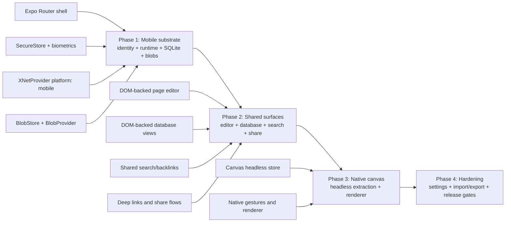
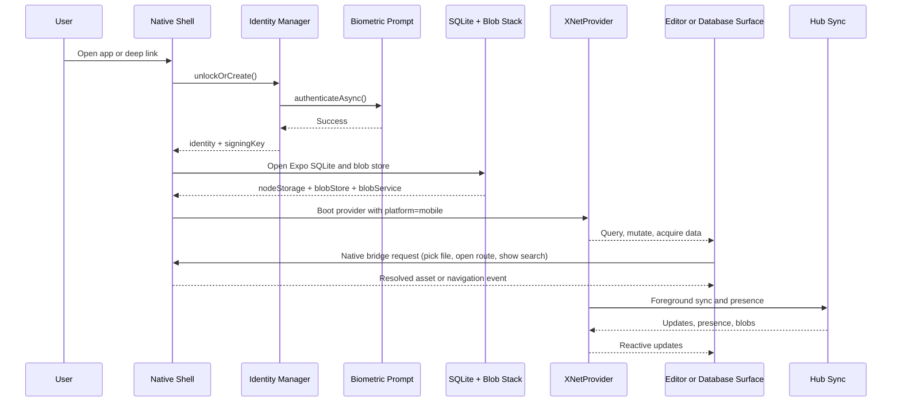

# 0108 - Expo App Parity With Electron and Web

> **Status:** Exploration
> **Tags:** expo, mobile, parity, react-native, electron, web, sync, editor, canvas
> **Created:** 2026-03-10
> **Context:** Feasibility study for bringing the Expo app close to future parity with xNet's web app while explicitly excluding Electron-only desktop services unless they gain a clear mobile-safe equivalent.

## 🔎 Problem Statement

xNet already has two meaningful product surfaces:

- the web app, which now carries real onboarding, storage, pages, databases, canvas, settings, and share flows
- the Electron app, which adds IPC runtime, background sync orchestration, plugins, devtools, and desktop-only integrations

The Expo app exists, but it is still a prototype shell. The question is not "how do we polish mobile?" It is "what would it actually take to make Expo a credible peer to the other app surfaces without pretending mobile can or should reproduce every Electron-only capability?"

This exploration uses two explicit defaults:

- **Target:** web-plus parity
- **Delivery model:** hybrid reuse

That means:

- match the web app closely for user-facing workflows
- intentionally exclude Electron-only OS/process/service features from the parity target
- reuse existing web-heavy editor and database surfaces where that meaningfully reduces risk and schedule

## Executive Summary

- **Observed:** the Expo app currently boots a handwritten SecureStore-backed DID, opens SQLite, and renders a three-screen React Navigation shell. It does not configure `XNetProvider` as `platform: 'mobile'`, does not wire blobs, does not ship onboarding parity, and does not persist rich text content yet.
- **Observed:** the web app already has the substrate Expo would need for serious parity: identity bootstrap, onboarding, SQLite storage, blob stack, worker-capable runtime defaults, sharing, and a broader route surface.
- **Observed:** the Electron app extends that substrate with IPC runtime, Local API wiring, richer plugin/service capability, and devtools that do not have a meaningful mobile equivalent.
- **Inference:** "close parity" is a platform program, not a UI cleanup pass. The main work is mobile runtime/auth/storage/surface convergence, not just styling.
- **Inference:** the fastest credible route is a **native Expo shell + shared `@xnetjs/react` substrate + DOM-backed editor/database surfaces + native canvas renderer**.
- **Inference:** with one strong engineer and normal review churn, **web-plus parity via hybrid reuse is roughly 10-14 weeks**. Native-first parity or near-Electron scope is materially larger.



## Current State in the Repository

### Snapshot

| Capability | Expo today | Web today | Electron today |
| --- | --- | --- | --- |
| Identity bootstrap | Handwritten SecureStore DID | Shared identity manager + onboarding | Deterministic/test identity bootstrap |
| Runtime mode | Implicit defaults | Explicit worker-first | Explicit IPC |
| Blob stack | Missing | Present | Present |
| Pages | Minimal title + WebView editor | Full page surface | Full page surface |
| Databases | Missing | Route and view surface | Full view surface |
| Canvas | Missing | Route and view surface | Canvas-first shell |
| Search/backlinks | Missing | Present | Present via shell/tools |
| Sharing/deep links | Missing | Present | Present |
| Plugins/services | Not configured | Limited web-safe | Full desktop-biased |
| Devtools/local API | Missing | Limited devtools | Rich devtools + Local API |

### What Expo actually is today

The current Expo app is a thin prototype rather than a parity-ready product surface.

- [`../../apps/expo/App.tsx`](../../apps/expo/App.tsx) generates a signing key locally, derives a simplified DID, opens SQLite, and passes only `nodeStorage`, `authorDID`, and `signingKey` into `XNetProvider`.
- [`../../packages/react/src/context.ts`](../../packages/react/src/context.ts) defaults `platform` to `'web'` when `config.platform` is omitted, which means Expo is not even identifying itself as mobile yet.
- [`../../apps/expo/src/navigation/AppNavigator.tsx`](../../apps/expo/src/navigation/AppNavigator.tsx) exposes only `Home`, `Document`, and `Settings`.
- [`../../apps/expo/src/screens/DocumentScreen.tsx`](../../apps/expo/src/screens/DocumentScreen.tsx) resets `initialContent` to `''` and leaves `handleContentChange` as a no-op, so rich text content is not persisted today.
- [`../../apps/expo/src/components/WebViewEditor.tsx`](../../apps/expo/src/components/WebViewEditor.tsx) loads TipTap from `unpkg` inside a WebView, which is acceptable for a prototype but not as a final parity foundation.
- [`../../apps/expo/package.json`](../../apps/expo/package.json) points `main` at `expo-router/entry`, but `expo-router` is not currently declared as a dependency.
- **Observed conclusion:** Expo has SQLite and a basic navigation shell, but not the product/runtime stack needed for parity.

### What web already has

The web app is the closest practical parity target because it already sits on the shared xNet substrate without pulling in desktop-only process features.

- [`../../apps/web/src/App.tsx`](../../apps/web/src/App.tsx) wires identity bootstrap, onboarding, durable storage checks, SQLite, `BlobStore`, `ChunkManager`, `BlobService`, and `BlobProvider`.
- [`../../apps/web/src/App.tsx`](../../apps/web/src/App.tsx) also configures `XNetProvider` with `hubUrl`, `blobStore`, `runtime: { mode: 'worker', fallback: 'main-thread' }`, and `platform: 'web'`.
- [`../../apps/web/src/routes/doc.$docId.tsx`](../../apps/web/src/routes/doc.$docId.tsx), [`../../apps/web/src/routes/db.$dbId.tsx`](../../apps/web/src/routes/db.$dbId.tsx), [`../../apps/web/src/routes/canvas.$canvasId.tsx`](../../apps/web/src/routes/canvas.$canvasId.tsx), [`../../apps/web/src/routes/settings.tsx`](../../apps/web/src/routes/settings.tsx), and [`../../apps/web/src/routes/share.tsx`](../../apps/web/src/routes/share.tsx) show that pages, databases, canvas, settings, and share flows already exist on web.
- [`../../apps/web/src/hooks/usePageSearchSurface.ts`](../../apps/web/src/hooks/usePageSearchSurface.ts) contains page search and backlink logic, but it currently lives in the app rather than a shared package.

### What Electron adds beyond web

Electron is not just "web in a window"; it has a meaningfully different runtime contract.

- [`../../apps/electron/src/renderer/main.tsx`](../../apps/electron/src/renderer/main.tsx) configures `XNetProvider` with `runtime: { mode: 'ipc', fallback: 'error' }`, an IPC-backed sync manager, and an IPC-backed blob store.
- [`../../apps/electron/src/preload/index.ts`](../../apps/electron/src/preload/index.ts) exposes Local API, sync control, blob IPC, storybook control, and service/process hooks that do not map directly to Expo.
- [`../../packages/plugins/src/types.ts`](../../packages/plugins/src/types.ts) already models mobile as a narrower plugin platform than web/Electron.

### Shared-package constraints that matter for mobile parity

- [`../../packages/data-bridge/src/native-bridge.ts`](../../packages/data-bridge/src/native-bridge.ts) explicitly throws for `acquireDoc()` because Y.Doc editing is not yet supported in `NativeBridge`.
- [`../../packages/plugins/src/types.ts`](../../packages/plugins/src/types.ts) disables `editorExtensions` and `slashCommands` on `mobile`.
- [`../../packages/canvas/src/index.ts`](../../packages/canvas/src/index.ts) exports a React/web renderer-oriented canvas package today.  
  **Inference:** parity will require extracting a renderer-agnostic headless layer before a serious native canvas can exist.
- [`../../docs/ROADMAP.md`](../../docs/ROADMAP.md) explicitly defers "Full mobile push" in the current 6-month horizon.

## External Research

All external claims below come from official Expo documentation as of **March 10, 2026**.

| Official source | Relevant guidance | Implication for xNet |
| --- | --- | --- |
| [Expo DOM Components](https://docs.expo.dev/guides/dom-components/) | DOM components are available in Expo but currently marked alpha; props/events cross an async bridge and there are known routing/OTA constraints. | Good fit for reusing complex web editor/database surfaces inside a native shell, but they should be isolated behind clear bridge contracts rather than used as the whole app architecture. |
| [Expo BackgroundTask](https://docs.expo.dev/versions/latest/sdk/background-task/) | Background work is system-scheduled, minimum interval is coarse, and tasks stop when the app is terminated. | Mobile background sync can be useful for opportunistic maintenance, not for Electron-style always-on sync semantics. |
| [Expo SecureStore](https://docs.expo.dev/versions/latest/sdk/securestore/) | SecureStore is appropriate for secrets, but values are not preserved across uninstall and `requireAuthentication` data can become inaccessible after biometric changes. | Use SecureStore for key references and encrypted material, but do not treat it as the sole recovery mechanism. |
| [Expo LocalAuthentication](https://docs.expo.dev/versions/latest/sdk/local-authentication/) | Expo exposes biometric prompts and device capability checks via `authenticateAsync()` and related helpers. | A native identity manager can gate local key unlock with biometrics even though web-style WebAuthn passkeys do not map directly. |
| [Expo SQLite](https://docs.expo.dev/versions/latest/sdk/sqlite/) | Expo provides a local SQLite database API on native platforms. | Storage parity is tractable because xNet already has an Expo SQLite adapter. |
| [Expo DocumentPicker](https://docs.expo.dev/versions/latest/sdk/document-picker/) | Native document picking is supported, with platform-specific configuration such as iCloud entitlements when needed. | Attachment parity should be built through native pickers and blob ingestion, not through browser-style file inputs. |
| [Expo Linking](https://docs.expo.dev/versions/latest/sdk/linking/) | Expo provides deep-link utilities such as `Linking.createURL()` and URL listeners. | Shared-link and route-open flows are viable on mobile with explicit deep-link handling. |
| [Expo Router](https://docs.expo.dev/router/introduction/) | Expo Router provides a file-based route model for Expo apps. | Route parity with web becomes easier if Expo moves from ad hoc stack configuration to route files. |

## Key Findings

### 1. Parity is a platform program, not polish

- **Observed:** Expo is missing core product substrate pieces: onboarding, proper mobile platform config, blob storage, database/canvas/search/share routes, and a real content persistence path.
- **Inference:** the project is closer to "build the missing mobile app architecture" than "polish an existing mobile app."

### 2. Storage and sync parity are easier than UI parity

- **Observed:** xNet already has [`../../packages/sqlite/src/adapters/expo.ts`](../../packages/sqlite/src/adapters/expo.ts), shared SQLite schema DDL, `SQLiteNodeStorageAdapter`, `SQLiteStorageAdapter`, `BlobStore`, `ChunkManager`, and `BlobService`.
- **Inference:** the storage/runtime side can converge relatively quickly once Expo starts using the same provider shape as web. The harder problem is delivering editor/database/canvas surfaces with acceptable UX and maintainability.

### 3. Hybrid reuse is the fastest credible route

- **Observed:** the web app already has working editor, database, search, share, and settings flows.
- **Observed:** Expo DOM components exist specifically to host DOM-backed UI inside a native app.
- **Inference:** reusing web-heavy editor/database surfaces inside a native shell is a better near-term trade than re-implementing all complex surfaces in React Native immediately.

### 4. Mobile background sync cannot match Electron semantics

- **Observed:** Expo BackgroundTask is system-scheduled and does not survive app termination like a desktop utility process.
- **Inference:** background sync on mobile should be treated as opportunistic reliability work, not as a parity promise with Electron's IPC-driven runtime and process control.

### 5. `NativeBridge` is not a parity foundation yet

- **Observed:** `NativeBridge.acquireDoc()` throws for Y.Doc editing today.
- **Inference:** Expo parity must either:
  - continue using WebView/DOM-backed document surfaces for Y.Doc editing in the near term, or
  - fund a separate native Y.Doc runtime/JSI program before serious parity can land

### 6. Full Electron parity is the wrong short-term target

- **Observed:** Electron exposes Local API, process/service plugins, utility-process IPC, devtools, and desktop-specific service integration.
- **Inference:** trying to make Expo match the union of web and Electron would slow delivery and produce a misleading target. "Close parity" should mean **web-plus**, not "desktop without a keyboard."

### Effort estimates

These estimates are inference, not measured delivery history.

| Scope | Delivery model | Inferred effort | Notes |
| --- | --- | --- | --- |
| Web-plus parity | Hybrid reuse | **10-14 weeks** | Strongest near-term option |
| Web-plus parity | Native-first | 16-24+ weeks | Requires more headless extraction and new UI work |
| Near-Electron parity | Hybrid + native substitutes | 6-9+ months | Desktop-only capabilities dominate the schedule |

## Options and Tradeoffs

| Option | What gets shared | Main new work | Strengths | Risks | Verdict |
| --- | --- | --- | --- | --- | --- |
| **Web-plus + hybrid reuse** | Shared `@xnetjs/react` substrate, SQLite/blob stack, DOM-backed editor/database, shared search/share logic | Native identity manager, Expo Router shell, DOM bridges, headless canvas extraction, native canvas renderer | Fastest credible route; keeps product behavior close to web; minimizes rewrite churn | DOM bridge complexity; canvas still needs real native work | **Recommended** |
| **Native-first parity** | Shared storage/sync/domain logic only | Native editor, native database views, native canvas, native search UI, native comments/presence affordances | Cleanest long-term native story | Large schedule; more product risk; duplicates mature web UI | Viable only if mobile becomes the primary surface |
| **Full web + Electron union parity** | Everything possible | All of the above plus service/process/plugin/devtools substitutes and deeper background behavior | Maximum ambition | Expensive, blurry target, and misaligned with platform constraints | Not recommended |

## Recommendation

### Recommended target

Target **web-plus parity**, not full Electron parity.

That means Expo should aim to support:

- onboarding and unlock
- local-first storage
- pages
- database views
- canvas
- search/backlinks
- sharing/deep links
- attachments
- settings, export/import, and recovery

It should **not** claim parity for:

- Local API
- Storybook surface
- full devtools suite
- process/service plugins
- filesystem/process access
- Electron utility-process semantics
- always-on background sync

### Recommended architecture

1. **Native shell with Expo Router**
   - Move Expo to route files that mirror web routes: home, document, database, canvas, settings, share.
   - Use native navigation, sheets, search entry points, and deep-link handling at the shell level.

2. **Shared `@xnetjs/react` provider configured as mobile**
   - Pass `platform: 'mobile'`.
   - Make `runtime: { mode: 'main-thread', fallback: 'main-thread' }` explicit rather than inheriting web defaults.
   - Wire `hubUrl`, `blobStore`, and `BlobProvider` like web does today.

3. **Native identity manager backed by SecureStore plus biometrics**
   - Build a mobile-native identity entrypoint that returns the same `identity + signingKey` shape the provider expects.
   - Use SecureStore for persisted encrypted material and LocalAuthentication for unlock prompts.
   - Do not try to force browser WebAuthn/passkey flows into native Expo as the parity baseline.

4. **Shared SQLite and blob stack**
   - Reuse `ExpoSQLiteAdapter`, `SQLiteNodeStorageAdapter`, `SQLiteStorageAdapter`, `BlobStore`, `ChunkManager`, and `BlobService`.
   - This brings attachment semantics closer to web/Electron and gives mobile a real local-first substrate.

5. **DOM-backed editor and database surfaces**
   - Reuse the existing web editor and database surfaces inside Expo DOM components for v1 parity.
   - Add a narrow bridge for native-picked assets, route navigation, theme, and safe-area metadata.
   - Treat this as a deliberate reuse layer, not as a hidden second app shell.

6. **Native canvas renderer built on extracted headless logic**
   - Split `@xnetjs/canvas` into headless state/layout/controllers plus rendering adapters.
   - Keep the data model and interaction logic shared, but render the mobile canvas natively.

### Recommended runtime interaction



## Implementation Checklist

### Phase 1 - Mobile substrate

- [ ] Add `expo-router` properly and replace the current hand-built stack shell.
- [ ] Introduce a native identity manager backed by SecureStore plus LocalAuthentication.
- [ ] Make Expo provider bootstrap explicit: `platform: 'mobile'`, `runtime: { mode: 'main-thread', fallback: 'main-thread' }`, `hubUrl`, `blobStore`.
- [ ] Add the shared blob stack to Expo: `SQLiteStorageAdapter`, `BlobStore`, `ChunkManager`, `BlobService`, `BlobProvider`.
- [ ] Replace the handwritten DID bootstrap with the shared identity bootstrap contract.

### Phase 2 - Shared product surfaces

- [ ] Reuse the page editor in a DOM-backed surface with a narrow native bridge.
- [ ] Reuse database views in a DOM-backed surface with mobile-safe navigation and asset hooks.
- [ ] Extract page search and backlink logic from `apps/web` into a shared package.
- [ ] Add shared-link and deep-link handling for page, database, and canvas routes.
- [ ] Add mobile settings, sync status, and recovery/export surfaces.

### Phase 3 - Native canvas

- [ ] Extract a headless canvas state/layout layer from `@xnetjs/canvas`.
- [ ] Design a native renderer and gesture layer for mobile canvas interactions.
- [ ] Reconnect shared document-opening/navigation behavior from canvas to page/database routes.

### Phase 4 - Hardening and release gates

- [ ] Define explicit mobile non-goals in docs and product copy.
- [ ] Add iOS and Android manual verification scripts/checklists.
- [ ] Add targeted package tests for the extracted headless search/canvas/mobile bridge logic.
- [ ] Add import/export and attachment recovery checks.

## Validation Checklist

- [ ] Cold start succeeds on iOS and Android with no existing identity.
- [ ] Unlock succeeds on iOS and Android with an existing identity.
- [ ] Offline create/edit/reopen works for pages.
- [ ] Database editing works across the supported mobile view types.
- [ ] Canvas opens, edits, and returns to linked documents correctly.
- [ ] Share/deep-link flows open the correct route from app launch and warm-start states.
- [ ] Sync reconnect restores fresh content and presence after temporary offline periods.
- [ ] Comments and presence render correctly in the reused editor/database surfaces.
- [ ] File and image attachments flow through native pickers into the blob stack.
- [ ] Export/import and recovery paths are documented and work on both platforms.
- [ ] Background behavior is described honestly and does not over-promise Electron-like sync guarantees.

## Example Code

### Proposed Expo bootstrap

This is a design sketch, not a drop-in implementation. It shows the target provider shape for web-plus parity.

```tsx
/**
 * Proposed Expo bootstrap sketch.
 */
import { Slot } from 'expo-router'
import { SQLiteNodeStorageAdapter, BlobService } from '@xnetjs/data'
import { BlobProvider } from '@xnetjs/editor/react'
import { XNetProvider } from '@xnetjs/react'
import { ExpoSQLiteAdapter, SCHEMA_DDL, SCHEMA_VERSION } from '@xnetjs/sqlite'
import { BlobStore, ChunkManager, SQLiteStorageAdapter } from '@xnetjs/storage'

async function createMobileAppContext(hubUrl: string) {
  const identity = await createNativeIdentityManager().unlockOrCreate()

  const sqlite = new ExpoSQLiteAdapter()
  await sqlite.open({ path: 'xnet.db' })
  await sqlite.applySchema(SCHEMA_VERSION, SCHEMA_DDL)

  const nodeStorage = new SQLiteNodeStorageAdapter(sqlite)
  const storageAdapter = new SQLiteStorageAdapter(sqlite)
  const blobStore = new BlobStore(storageAdapter)
  const blobService = new BlobService(new ChunkManager(blobStore))

  return {
    providerConfig: {
      nodeStorage,
      authorDID: identity.did,
      signingKey: identity.signingKey,
      blobStore,
      hubUrl,
      runtime: {
        mode: 'main-thread',
        fallback: 'main-thread'
      },
      platform: 'mobile' as const
    },
    blobService
  }
}

export function RootLayout({
  providerConfig,
  blobService
}: {
  providerConfig: React.ComponentProps<typeof XNetProvider>['config']
  blobService: BlobService
}) {
  return (
    <XNetProvider config={providerConfig}>
      <BlobProvider blobService={blobService}>
        <Slot />
      </BlobProvider>
    </XNetProvider>
  )
}
```

### Proposed mobile surface bridge

```ts
export type MobileRouteTarget =
  | { type: 'page'; id: string }
  | { type: 'database'; id: string }
  | { type: 'canvas'; id: string }

export type PickedMobileAsset = {
  uri: string
  name: string
  mimeType: string
  size: number
}

/**
 * Bridge contract between the native Expo shell and DOM-backed surfaces.
 */
export interface MobileSurfaceBridge {
  openNode(target: MobileRouteTarget): void
  openShare(url: string): void
  presentSearch(initialQuery?: string): void
  pickAsset(kind: 'image' | 'file'): Promise<PickedMobileAsset | null>
  getTheme(): 'light' | 'dark'
  getSafeAreaInsets(): { top: number; right: number; bottom: number; left: number }
}
```

## References

### Local references

- [`../../apps/expo/App.tsx`](../../apps/expo/App.tsx)
- [`../../apps/expo/package.json`](../../apps/expo/package.json)
- [`../../apps/expo/src/navigation/AppNavigator.tsx`](../../apps/expo/src/navigation/AppNavigator.tsx)
- [`../../apps/expo/src/screens/DocumentScreen.tsx`](../../apps/expo/src/screens/DocumentScreen.tsx)
- [`../../apps/expo/src/components/WebViewEditor.tsx`](../../apps/expo/src/components/WebViewEditor.tsx)
- [`../../apps/web/src/App.tsx`](../../apps/web/src/App.tsx)
- [`../../apps/web/src/routes/doc.$docId.tsx`](../../apps/web/src/routes/doc.$docId.tsx)
- [`../../apps/web/src/routes/db.$dbId.tsx`](../../apps/web/src/routes/db.$dbId.tsx)
- [`../../apps/web/src/routes/canvas.$canvasId.tsx`](../../apps/web/src/routes/canvas.$canvasId.tsx)
- [`../../apps/web/src/routes/settings.tsx`](../../apps/web/src/routes/settings.tsx)
- [`../../apps/web/src/routes/share.tsx`](../../apps/web/src/routes/share.tsx)
- [`../../apps/web/src/hooks/usePageSearchSurface.ts`](../../apps/web/src/hooks/usePageSearchSurface.ts)
- [`../../apps/electron/src/renderer/main.tsx`](../../apps/electron/src/renderer/main.tsx)
- [`../../apps/electron/src/preload/index.ts`](../../apps/electron/src/preload/index.ts)
- [`../../packages/react/src/context.ts`](../../packages/react/src/context.ts)
- [`../../packages/data-bridge/src/native-bridge.ts`](../../packages/data-bridge/src/native-bridge.ts)
- [`../../packages/plugins/src/types.ts`](../../packages/plugins/src/types.ts)
- [`../../packages/sqlite/src/adapters/expo.ts`](../../packages/sqlite/src/adapters/expo.ts)
- [`../../packages/canvas/src/index.ts`](../../packages/canvas/src/index.ts)
- [`../../docs/ROADMAP.md`](../../docs/ROADMAP.md)

### External references

- [Expo DOM Components](https://docs.expo.dev/guides/dom-components/)
- [Expo BackgroundTask](https://docs.expo.dev/versions/latest/sdk/background-task/)
- [Expo SecureStore](https://docs.expo.dev/versions/latest/sdk/securestore/)
- [Expo LocalAuthentication](https://docs.expo.dev/versions/latest/sdk/local-authentication/)
- [Expo SQLite](https://docs.expo.dev/versions/latest/sdk/sqlite/)
- [Expo DocumentPicker](https://docs.expo.dev/versions/latest/sdk/document-picker/)
- [Expo Linking](https://docs.expo.dev/versions/latest/sdk/linking/)
- [Expo Router](https://docs.expo.dev/router/introduction/)
