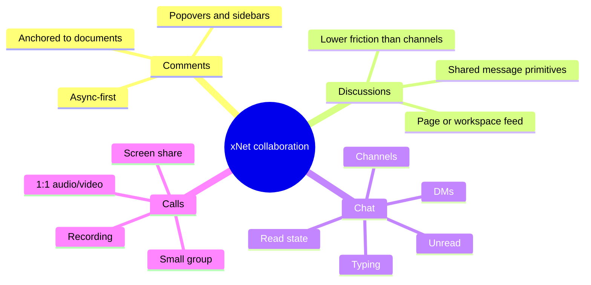
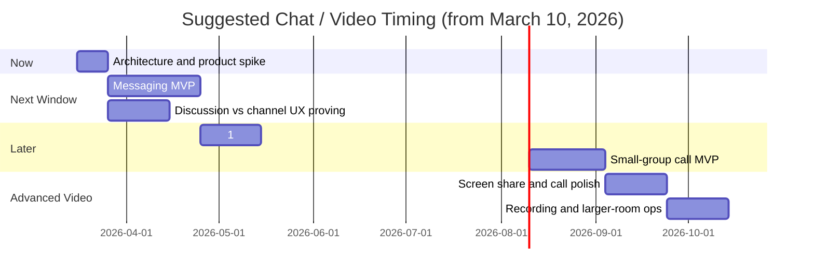
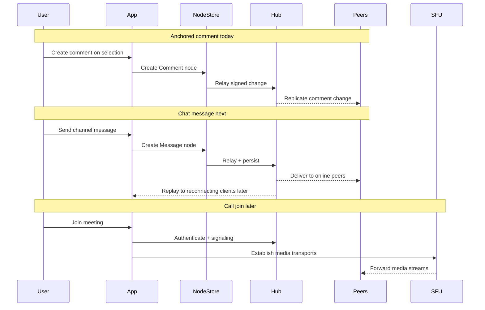

# 0108 - Timing For Integrating Chat And Video Into xNet Now Vs Later

> **Status:** Exploration  
> **Date:** 2026-03-10  
> **Author:** Codex  
> **Scope:** product strategy, collaboration UX, messaging architecture, realtime media sequencing

## Problem Statement ✳️

xNet already has meaningful collaboration primitives:

- shared documents,
- presence and awareness,
- anchored comments,
- hub-backed relay and replay,
- and optional WebRTC document transport.

It also already has prior design work for chat and video in [Exploration 0028](./0028_[_]_CHAT_AND_VIDEO.md).

The question on **March 10, 2026** is not a binary "should xNet ever have chat and video?" The question is:

> **Should xNet start integrating chat and video now, or should it wait until the current collaboration reliability and trust work is more complete?**

This exploration evaluates that as a **timing and sequencing** decision:

- what is already real in the repo,
- what is still aspirational,
- how much "we already have WebRTC" actually reduces the remaining work,
- and what order produces the best product leverage with the least avoidable detour.

---

## Executive Summary 🎯

> **xNet should begin integrating messaging-oriented collaboration soon, but it should wait to make full chat-and-video a primary product initiative until the current collaboration reliability and trust work is finished.**  
> **Build chat before video, and treat comments as the conceptual bridge rather than the final runtime.**  
> **For video, favor an open-source hub-integrated SFU path over strict mesh-first assumptions.**

### Bottom line

- Start a **1-2 week architecture and product spike now**.
- If that spike confirms the model, build a **4-6 week chat MVP next**.
- Defer **calls and group video** until after the current collaboration-trust work in [the roadmap](../ROADMAP.md) is in better shape.

### Why this is the right timing

- xNet is already structurally close to **messaging**.
- xNet is not yet structurally close to a **video product**.
- The strongest reuse path is in **schemas, hub relay, auth, awareness, and offline replay**.
- The current roadmap is still centered on **reliability, invite/share UX, and collaboration trust**, not on launching a full communications suite.

### Recommendation in one sentence

Move on **chat foundations soon**, but do **not** pull a full integrated chat + video initiative into the current critical-path roadmap.

---

## Current State In The Repository 🔎

### Readiness Snapshot

| Capability | Evidence | Status | What it means |
| --- | --- | --- | --- |
| Anchored comments | [Comment schema](../../packages/data/src/schema/schemas/comment.ts), [page comment integration](../../apps/web/src/routes/doc.$docId.tsx), [comment UI components](../../packages/ui/src/composed/comments/CommentPopover.tsx) | Real | xNet already has a credible async discussion primitive |
| Presence and awareness | [useNode](../../packages/react/src/hooks/useNode.ts), [hub awareness service](../../packages/hub/src/services/awareness.ts) | Real | real-time collaborator state already exists |
| Signed relay and offline replay | [hub node relay](../../packages/hub/src/services/node-relay.ts), [Exploration 0028](./0028_[_]_CHAT_AND_VIDEO.md) | Real | append-only message-like replication is feasible |
| P2P document transport | [y-webrtc provider](../../packages/network/src/providers/ywebrtc.ts) | Partial | useful for document sync; not the same thing as a call stack |
| Chat plan | [plan05 TODO](../plans/plan05ChatAndVideo/TODO.md) | Placeholder | not execution-ready |
| Media capture, call controls, TURN/SFU ops | no shipped call/media package found in `packages/` or app routes | Missing | this is the major gap |

## 1. The collaboration substrate is already real

### Observed facts

- [`useNode`](../../packages/react/src/hooks/useNode.ts) already exposes:
  - a Yjs document,
  - sync status,
  - peer count,
  - presence,
  - and an `Awareness` instance.
- [`packages/hub/src/services/awareness.ts`](../../packages/hub/src/services/awareness.ts) persists and replays awareness snapshots with TTL-based cleanup.
- [`packages/hub/src/services/node-relay.ts`](../../packages/hub/src/services/node-relay.ts) already verifies signed node changes, rejects invalid hashes/signatures, and serves delta sync by Lamport watermark.
- [Exploration 0028](./0028_[_]_CHAT_AND_VIDEO.md) already recommends message storage on `NodeStore (Change<T>)` rather than Yjs arrays.

### Inference

xNet already has the right **durability and replication shape** for chat-like data:

- append-only event logs,
- offline replay,
- signed authorship,
- and ephemeral presence separate from persisted content.

That is enough to make messaging feel like a natural next surface rather than a greenfield invention.

## 2. Comments are a strong bridge, but not the final runtime

### Observed facts

- [`CommentSchema`](../../packages/data/src/schema/schemas/comment.ts) is already universal and schema-agnostic: comments can target any node and carry anchor metadata.
- [`apps/web/src/routes/doc.$docId.tsx`](../../apps/web/src/routes/doc.$docId.tsx) wires comments into a real page experience with:
  - inline popovers,
  - sidebar views,
  - orphan handling,
  - and presence-aware editor collaboration.
- [Exploration 0028](./0028_[_]_CHAT_AND_VIDEO.md) explicitly frames chat messages as structurally similar to comments.
- [`useComments`](../../packages/react/src/hooks/useComments.ts) currently:
  - lists all comment nodes for the schema,
  - filters in memory by target,
  - subscribes to store changes,
  - and rebuilds threads client-side.

### Inference

Comments are the **right conceptual bridge** because they prove:

- message-like authored content,
- threads,
- contextual attachment,
- and reusable UI primitives.

But comments are **not** the right final runtime for chat volume and chat UX:

- anchored comments and free-standing channels are different product surfaces,
- the current `useComments()` shape is optimized for comments, not message throughput,
- and the current comment UX is inline and document-centric, not inbox- or channel-centric.

## 3. The repo already treats chat/video as later-phase work

### Observed facts

- [The roadmap](../ROADMAP.md) is a March-September 2026 execution plan focused on:
  - daily-driver reliability,
  - invite and membership workflows,
  - share and permission UX,
  - reconnect and stale presence consistency,
  - package/API clarity,
  - and multi-hub federation.
- [The roadmap](../ROADMAP.md) explicitly says collaboration should become dependable and understandable before more ambitious expansion.
- [`docs/plans/plan05ChatAndVideo/TODO.md`](../plans/plan05ChatAndVideo/TODO.md) currently contains only `replace with a plan`.

### Inference

The repo's planning artifacts already answer part of the timing question:

- chat and video are interesting and expected,
- but they are **not yet positioned as the next major execution track**,
- and there is still no implementation-ready plan comparable to the stronger roadmap areas.

## 4. "We already have WebRTC" is true, but only in a limited sense

### Observed facts

- [`packages/network/src/providers/ywebrtc.ts`](../../packages/network/src/providers/ywebrtc.ts) is explicitly a **Yjs integration for real-time document sync**.
- It exposes:
  - signaling server configuration,
  - optional ICE server configuration,
  - and connection counting for peers.
- I did **not** find shipped repo code for:
  - `getUserMedia()` / `getDisplayMedia()` flows,
  - `RTCPeerConnection` call lifecycle management for media,
  - audio/video device handling,
  - call controls,
  - or SFU/TURN orchestration for meetings.

### Inference

xNet already has WebRTC-related experience at the **document transport** layer.

That reduces some risk:

- signaling familiarity,
- ICE configuration familiarity,
- and room identity familiarity.

It does **not** remove the hardest parts of integrated calls:

- media device UX,
- bandwidth adaptation,
- layout and join/leave behavior,
- TURN/SFU infrastructure,
- recording/screen share,
- and call-quality debugging.

## 5. The real missing piece is media productization

### Observed facts

- [Exploration 0028](./0028_[_]_CHAT_AND_VIDEO.md) treats voice/video as later phases after core messaging.
- That same exploration recommends:
  - `mediasoup` for SFU,
  - a `Meeting` model,
  - signaling protocol work,
  - and later recording/screen share.
- The current apps and packages already demonstrate collaboration surfaces for:
  - pages,
  - databases,
  - canvas,
  - comments,
  - and awareness.
- They do not yet demonstrate call-oriented surfaces such as:
  - meeting roster,
  - mute/video controls,
  - speaker state,
  - device selection,
  - reconnect banners,
  - or degraded-network behavior.

### Inference

xNet is close to **messaging-oriented collaboration** and far from **full call UX**.

That is the central reason to sequence **chat before video**.

---

## Collaboration Maturity Map 🧭



---

## External Research 🌐

### What the official sources say

| Source | Relevant point | Implication for xNet |
| --- | --- | --- |
| [WebRTC peer connections](https://webrtc.org/getting-started/peer-connections) | signaling is required but outside the WebRTC spec | xNet still needs its own call signaling design |
| [WebRTC TURN server guide](https://webrtc.org/getting-started/turn-server) | TURN is a normal requirement for many networks and topologies | strict P2P assumptions are not enough for a reliable product |
| [y-webrtc README](https://github.com/yjs/y-webrtc) | the library is designed for Yjs document sync, peer meshes, and signaling rooms | useful for document collaboration, not a full media product strategy |
| [mediasoup overview](https://mediasoup.org/documentation/overview/) and [design docs](https://mediasoup.org/documentation/v3/mediasoup/design/) | mediasoup is an SFU-oriented, signaling-agnostic, Node.js-friendly media server | best fit for a hub-integrated, open-source xNet media path |
| [LiveKit SFU internals](https://docs.livekit.io/reference/internals/livekit-sfu) and [self-hosting docs](https://docs.livekit.io/transport/self-hosting/) | LiveKit is self-hostable and batteries-included for scalable RTC | strong alternative, but more opinionated and subsystem-like than a tight hub embed |

### Key external takeaways

### 1. TURN is not an edge case

Official WebRTC guidance treats TURN as a practical part of real deployments, not as an exotic fallback.

**Implication:** if xNet wants calls to feel dependable outside ideal networks, "peer-to-peer when possible" is a better mental model than "peer-to-peer only."

### 2. Mesh is a poor default for group calls

`y-webrtc` is excellent evidence that peer meshes can work for collaborative document sync. It is not evidence that xNet should default to pure mesh for multi-person video.

**Implication:** "we already use WebRTC" supports document sync and some 1:1 experimentation, but it does not eliminate the need for an SFU once calls become a real feature.

### 3. mediasoup matches the user's integration preference best

Observed facts from the docs:

- mediasoup is open source,
- Node.js-friendly,
- and intentionally signaling agnostic.

Inference:

- that makes it easier to integrate into the existing hub model,
- preserve xNet's own auth and room semantics,
- and avoid giving up the collaboration stack to an external media product abstraction.

### 4. LiveKit is the strongest ready-made alternative

Observed facts from the docs:

- LiveKit is open source,
- self-hostable,
- and purpose-built for scalable realtime media.

Inference:

- LiveKit is the better choice if xNet decides it wants a more batteries-included media subsystem,
- but it is not the best default if the goal is **maximum vertical integration into the existing hub**.

---

## Architecture Comparison 🏗️

```mermaid
flowchart LR
    subgraph NOW["Today: shipped collaboration core"]
        N1["Nodes + Change<T>"]
        N2["Hub node relay"]
        N3["Awareness + presence"]
        N4["Anchored comments"]
        N5["Optional y-webrtc doc sync"]
    end

    subgraph CHAT["Next: chat additions"]
        C1["Message + Channel primitives"]
        C2["useMessages hook"]
        C3["Unread / typing / read state"]
        C4["Discussion or DM/channel UI"]
    end

    subgraph VIDEO["Later: video additions"]
        V1["Meeting / call state"]
        V2["Media capture + device UX"]
        V3["TURN policy + ICE ops"]
        V4["Hub-integrated mediasoup SFU"]
        V5["Screen share / recording / layouts"]
    end

    NOW --> CHAT --> VIDEO
```



---

## Key Findings ✅

### 1. xNet is structurally close to messaging, not to video productization

The repo already contains most of the hard primitives for a chat MVP:

- identity,
- signed append-only changes,
- hub relay,
- awareness,
- offline replay,
- comment-thread UI patterns.

The repo does **not** yet contain most of the hard primitives for calls:

- media-device UX,
- meeting state,
- bandwidth adaptation,
- TURN/SFU operations,
- screen sharing,
- recording,
- multi-user call layout.

### 2. The strongest reuse path is schema/store/relay/auth, not direct reuse of comment hooks

The likely reuse hierarchy is:

1. **NodeStore + hub relay + auth**
2. **awareness/presence patterns**
3. **message rendering/composer UI primitives**
4. **comment concepts as product inspiration**
5. **not** `useComments()` itself as the long-term chat data path

### 3. The roadmap is still telling xNet to earn trust before broadening surface area

That matters because chat and video are not isolated features. They compete directly with current roadmap work on:

- membership,
- sharing,
- permissions,
- reconnect behavior,
- and presence correctness.

If those surfaces are still maturing, adding chat + video immediately increases user expectations faster than it increases product trust.

### 4. Existing WebRTC usage lowers transport risk, but not product risk

This is the easiest mistake to make.

The sentence "we already have WebRTC" is true in repo terms, but incomplete in product terms.

What it really means is:

- xNet already knows how to think about rooms, signaling, peers, and ICE config.

What it does **not** mean is:

- xNet already has reliable call UX,
- or xNet already knows how to run meetings.

---

## Options And Tradeoffs ⚖️

| Option | Description | Pros | Cons |
| --- | --- | --- | --- |
| **A. Full chat + video now** | Pull messaging and calls into the near-term roadmap immediately | bold product move; strong collaboration story; faster learning | biggest detour; highest infrastructure load; likely weakens current reliability/trust work |
| **B. Chat now, video later** | Start messaging-oriented collaboration soon, then add calls after trust work hardens | highest reuse of existing architecture; strongest product sequencing; preserves roadmap discipline | less dramatic than a full suite; calls arrive later |
| **C. Comments-plus-discussions only for now** | Keep collaboration async and document-centric | minimal detour; strongest focus on quality | misses near-term chat opportunity; could leave collaboration feeling narrower than intended |

## Recommendation

Recommend **Option B: chat now, video later**.

Why it wins:

- It aligns with the actual repo readiness.
- It gives xNet a collaboration expansion path without collapsing the current roadmap.
- It treats comments as a genuine bridge instead of pretending they are already a channel system.
- It keeps the media decision open long enough to make it with more trust and more user evidence.

---

## Timing Window ⏱️



## Suggested sequencing

### Now: 1-2 week spike

- Define the boundaries between:
  - anchored comments,
  - page/workspace discussions,
  - DMs/channels,
  - and meetings.
- Prove the core message model on top of NodeStore + hub relay.
- Decide whether the first conversational surface is:
  - page discussions,
  - workspace discussions,
  - or DMs/channels.
- Confirm the preferred media path:
  - `mediasoup` by default,
  - `LiveKit` as the main fallback option if xNet wants more packaged media infrastructure.

### Next window: 4-6 week messaging MVP

- Ship a real conversational surface.
- Keep scope narrow:
  - page/workspace discussion feed, or
  - DMs/channels with unread and typing.
- Do not combine this MVP with full call UX.

### Later: calls after collaboration-trust work

- Start with 1:1.
- Then small-group.
- Then screen share, recording, and larger-room features.

This makes the schedule realistic instead of optimistic.

---

## Runtime Shape Example 🧪



---

## Example Architecture Code 💡

Illustrative only. This is not a final implementation contract.

```ts
import { defineSchema } from '@xnetjs/data'
import { created, createdBy, person, relation, select, text } from '@xnetjs/data'

export const ChannelSchema = defineSchema({
  name: 'Channel',
  namespace: 'xnet://xnet.fyi/',
  properties: {
    title: text({ maxLength: 200 }),
    kind: select({
      options: [
        { id: 'discussion', name: 'Discussion', color: 'blue' },
        { id: 'dm', name: 'Direct Message', color: 'green' },
        { id: 'channel', name: 'Channel', color: 'purple' }
      ] as const,
      required: true
    }),
    members: person({ multiple: true })
  }
})

export const MessageSchema = defineSchema({
  name: 'Message',
  namespace: 'xnet://xnet.fyi/',
  properties: {
    channel: relation({ required: true }),
    threadRoot: relation({}),
    sourceCommentId: relation({}), // optional bridge from anchored comment thread
    body: text({ required: true, maxLength: 10000 }),
    createdAt: created(),
    createdBy: createdBy()
  }
})

export type UseMessagesOptions = {
  contextId: string
  context: 'channel' | 'discussion' | 'comment-thread'
}

export function useMessages(_options: UseMessagesOptions) {
  // Directional API shape:
  // - persisted message log from NodeStore + hub relay
  // - ephemeral typing/read state from awareness or dedicated ephemeral channel
  // - chat-specific query model instead of reusing useComments() directly
  return {
    messages: [],
    unreadCount: 0,
    typing: [],
    sendMessage: async (_body: string) => {}
  }
}
```

---

## Recommendation 📌

If xNet wants the most leverage with the least avoidable churn, the next move is:

1. **Start a short chat/video spike now.**
2. **Ship messaging before calls.**
3. **Treat group video as a later layer built on an open-source hub-integrated SFU path.**

That means:

- yes, begin moving toward chat soon,
- no, do not make full chat + video the primary product push yet,
- and no, strict P2P-only assumptions should not drive the group-call architecture.

### Preferred default architecture

- **Chat:** native xNet primitives on NodeStore + hub relay
- **Presence:** awareness / ephemeral state
- **Video:** `mediasoup` integrated into the hub when group calls become a real roadmap item

### Why not wait completely?

Because the repo is already close enough to messaging that a short spike now will reduce future ambiguity.

### Why not do the full suite now?

Because the current roadmap still needs to make collaboration **dependable** before it makes collaboration **bigger**.

---

## Implementation Checklist 🛠️

- [ ] Define `Message` / `Channel` / `Meeting` primitives and their relationship to comments.
- [ ] Decide whether page discussions ship before DMs/channels.
- [ ] Design `useMessages` and unread/typing/read-state boundaries.
- [ ] Prove hub relay/query model for message volume.
- [ ] Pick media stack direction and TURN/SFU hosting model.

## Validation Checklist ✅

- [ ] Confirm all repo claims against code as of March 10, 2026.
- [ ] Distinguish clearly between shipped behavior and exploratory design.
- [ ] Include at least two official external sources for media-stack claims.
- [ ] Verify the recommendation matches the current roadmap rather than contradicting it.
- [ ] Keep the conclusion decision-oriented: now, later, and why.

---

## References 🔗

### Repository

- [Exploration 0028 - Chat & Video](./0028_[_]_CHAT_AND_VIDEO.md)
- [ROADMAP](../ROADMAP.md)
- [plan05ChatAndVideo TODO](../plans/plan05ChatAndVideo/TODO.md)
- [Comment schema](../../packages/data/src/schema/schemas/comment.ts)
- [useComments](../../packages/react/src/hooks/useComments.ts)
- [useNode](../../packages/react/src/hooks/useNode.ts)
- [y-webrtc provider](../../packages/network/src/providers/ywebrtc.ts)
- [Hub awareness service](../../packages/hub/src/services/awareness.ts)
- [Hub node relay](../../packages/hub/src/services/node-relay.ts)
- [Document route comment integration](../../apps/web/src/routes/doc.$docId.tsx)
- [CommentPopover](../../packages/ui/src/composed/comments/CommentPopover.tsx)

### External

- [WebRTC peer connections](https://webrtc.org/getting-started/peer-connections)
- [WebRTC TURN server guide](https://webrtc.org/getting-started/turn-server)
- [y-webrtc README](https://github.com/yjs/y-webrtc)
- [mediasoup overview](https://mediasoup.org/documentation/overview/)
- [mediasoup design](https://mediasoup.org/documentation/v3/mediasoup/design/)
- [LiveKit SFU internals](https://docs.livekit.io/reference/internals/livekit-sfu)
- [LiveKit self-hosting overview](https://docs.livekit.io/transport/self-hosting/)
