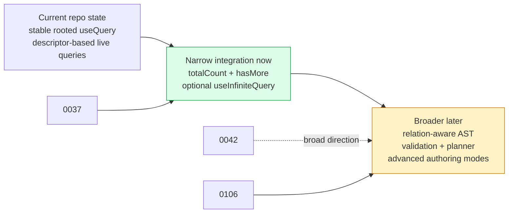
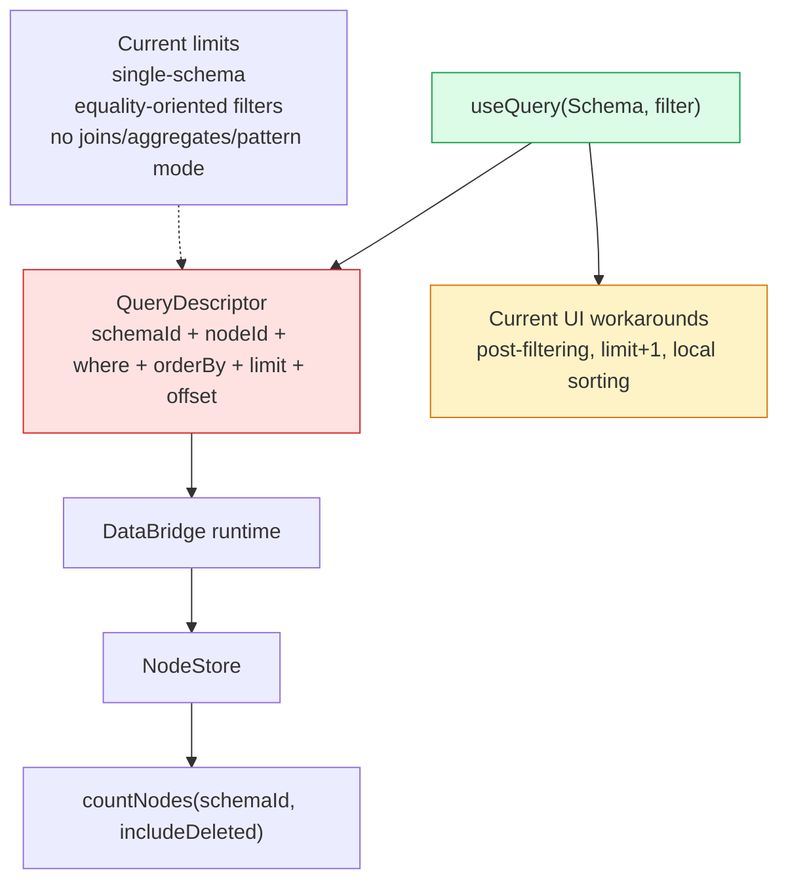

# 🔭 useQuery Upgrade Timing And Integration Sequencing

**Date**: March 10, 2026  
**Status**: Exploration  
**Scope**: `@xnetjs/react`, `@xnetjs/data-bridge`, `@xnetjs/data`, `@xnetjs/query`, and current Web/Electron query consumers  
**Problem**: xNet already has two substantial explorations about `useQuery` evolution, but the runtime and package boundaries have changed since those documents were written. The question is no longer "what could the ideal query API look like?" It is "which parts of that work should xNet integrate now, and which parts should wait until the planner/runtime boundary is ready?"

---

## Executive Summary

- ✅ xNet should start a **narrow `useQuery` upgrade now**, not a broad query-language rollout.
- ✅ The safe work to begin now is the small, backward-compatible part of [0037 - useQuery Pagination](./0037_[_]_USEQUERY_PAGINATION.md):
  - `QueryListResult<P>` gains `totalCount: number | null`
  - `QueryListResult<P>` gains `hasMore: boolean`
  - optionally, a separate experimental `useInfiniteQuery` if a real consumer needs accumulation semantics
- ✅ xNet should **not** begin landing the broader public surface implied by [0042 - Unified Query API](./0042_[_]_UNIFIED_QUERY_API.md) yet.
- ✅ The correct updated framing for that later work is the layered model in [0106 - Join Queries, Multi-Type Aggregates, And A Typed Query Planning API](./0106_[_]_JOIN_QUERIES_MULTI_TYPE_AGGREGATES_QUERY_PLANNING_API.md):
  - keep `useQuery(Schema, ...)` as the rooted ergonomic front door
  - add advanced graph/pattern authoring only after there is one canonical AST, one validation layer, and one planner/runtime story
- ✅ [Core Platform Convergence Release Notes](../reference/core-platform-convergence-release-notes.md) materially changed the starting point:
  - `useQuery()` already uses canonical descriptors and a real reload path
  - descriptor-targeted invalidation already landed
  - the question is now "incremental expansion vs reopening drift," not "foundation first"
- ⚠️ [0037](./0037_[_]_USEQUERY_PAGINATION.md) is still useful, but partially stale:
  - the store layer already has `countNodes()`
  - the live-query descriptor/runtime foundation already exists
  - its proposed storage prerequisites are no longer all prerequisites
- ⚠️ [0042](./0042_[_]_UNIFIED_QUERY_API.md) is directionally strong, but too broad to become the stable React front door right now.
- ⚠️ `@xnetjs/query` should stay a **stable secondary surface**, not the public `useQuery` model. Its own README now explicitly says app-facing query/runtime work should go through `@xnetjs/react`.
- 🥇 Recommendation: treat this as a **staged product decision**, not as an implementation plan:
  1. land small `useQuery` pagination metadata now
  2. optionally add a separate experimental infinite hook if a concrete consumer justifies it
  3. defer relations, aggregates, multi-root queries, and pattern/Datalog authoring until 0042 is effectively consolidated with 0106



---

## 🎯 Problem Statement

The core decision is not "which query API is most elegant in the abstract?" The core decision is:

> **Should xNet integrate the `useQuery` upgrade work now, or wait until the broader query planner/runtime story is ready?**

That timing decision matters because xNet has already declared `@xnetjs/react` as a stable app-facing contract in the [API lifecycle matrix](../reference/api-lifecycle-matrix.md), while the deeper data/runtime layers remain intentionally more conservative.

If xNet integrates too much too early, it risks reopening public contract drift right after the convergence checkpoint. If it waits on everything, current application code keeps paying the cost of missing pagination metadata and weak query ergonomics.

This document answers that timing question by reconciling the existing explorations with the current repository state as of **March 10, 2026**.

---

## 🧭 Current State In The Repository

### Observed facts

- [`packages/react/src/hooks/useQuery.ts`](../../packages/react/src/hooks/useQuery.ts) already does four important things:
  - exposes the stable rooted `useQuery(Schema)`, `useQuery(Schema, id)`, and `useQuery(Schema, filter)` overloads
  - builds canonical descriptors through `createQueryDescriptor()`
  - keys subscriptions off serialized descriptors
  - delegates `reload()` to the active bridge
- [`packages/data-bridge/src/query-descriptor.ts`](../../packages/data-bridge/src/query-descriptor.ts) is still intentionally narrow:
  - one `schemaId`
  - optional `nodeId`
  - equality-style `where`
  - `orderBy`
  - `limit` / `offset`
  - delta updates only when the descriptor shape allows it
- [`packages/data/src/store/types.ts`](../../packages/data/src/store/types.ts) already includes `countNodes(options?: CountNodesOptions)`, which means one of 0037's core storage prerequisites is partly landed today.
- That same store contract still keeps `CountNodesOptions` narrow:
  - `schemaId?`
  - `includeDeleted?`
  - no arbitrary `where`
- [`packages/react/src/hooks/useTasks.ts`](../../packages/react/src/hooks/useTasks.ts) shows real API pressure:
  - the base query is only `{ where: { page: pageId } }`
  - assignee filtering, status filtering, parent filtering, due-date filtering, and sorting all happen after the query in React
- [`apps/web/src/components/Sidebar.tsx`](../../apps/web/src/components/Sidebar.tsx) shows more concrete pressure:
  - each section queries `limit + 1`
  - `hasMore` is inferred in the UI instead of returned by the hook
  - "show more" is implemented by increasing the request limit rather than using hook-level pagination metadata
- [`packages/react/src/hooks/useDatabase.ts`](../../packages/react/src/hooks/useDatabase.ts) is also a useful precedent:
  - xNet already accepts richer pagination state on an app-facing hook
  - that hook returns `total`, `hasMore`, and `loadMore`
  - it suggests that pagination metadata in hook results is already an accepted pattern in the repo, even though `@xnetjs/react/database` is still an experimental surface
- [`packages/query/README.md`](../../packages/query/README.md) now explicitly calls `@xnetjs/query` a **stable secondary surface** and says app-facing query/runtime work should go through `@xnetjs/react` and the bridge/runtime contract.
- [`docs/reference/api-lifecycle-matrix.md`](../reference/api-lifecycle-matrix.md) marks:
  - `@xnetjs/react` root as stable
  - `@xnetjs/data-bridge` as experimental
- [`docs/reference/core-platform-convergence-release-notes.md`](../reference/core-platform-convergence-release-notes.md) says the convergence checkpoint already landed:
  - canonical descriptors
  - real `reload()`
  - descriptor-targeted invalidation
  - converged search/backlink/runtime usage

### Snapshot table

| Question | Current repo answer |
| --- | --- |
| Is rooted `useQuery` a stable public contract? | Yes |
| Does `useQuery` already use canonical descriptors? | Yes |
| Does the bridge/runtime support targeted invalidation? | Yes, within the current descriptor model |
| Does the store have any count primitive already? | Yes, `countNodes()` |
| Does the store support arbitrary filtered counts? | No |
| Does the current descriptor/runtime support joins/aggregates/cross-schema planning? | No |
| Does the app code already show pressure for pagination/filter ergonomics? | Yes |
| Is `@xnetjs/query` the intended public React front door? | No |



### Key implication

The repository is no longer at "query runtime is too primitive to touch." It is at:

- **strong enough for small hook enrichments now**
- **not yet coherent enough for a public unified query language rollout**

That distinction is the center of this decision.

---

## 🌐 External Research

### 1. React: external-store contracts should stay simple and explicit

- React's official docs position [`useSyncExternalStore`](https://react.dev/reference/react/useSyncExternalStore) as the supported way to read external stores safely in concurrent rendering.
- `useQuery` already uses `useSyncExternalStore`, which argues for preserving a clear "stable rooted query -> external store subscription" mental model.

**Why it matters here:**  
This is a reason to prefer a narrow, backward-compatible enrichment over turning `useQuery` into a multi-mode, stateful query-language surface too quickly.

### 2. Convex: reactive query hooks work best when the default story stays narrow

- Convex's React docs describe [`useQuery`](https://docs.convex.dev/client/react) as the reactive read surface for function-backed queries and separate it cleanly from mutations.
- The docs emphasize the subscription/re-render behavior, not a sprawling client-side query-language surface.

**Why it matters here:**  
Convex reinforces the value of one simple app-facing reactive query contract, even when more advanced capabilities exist underneath.

### 3. Prisma: object-shaped query ergonomics are powerful, but they rely on planner depth

- Prisma's [type-safety docs](https://www.prisma.io/docs/orm/prisma-client/type-safety) show the appeal of strongly typed object-shaped queries.
- Prisma's [aggregation and groupBy docs](https://www.prisma.io/docs/orm/prisma-client/queries/aggregation-grouping-summarizing) separate `where`, `groupBy`, and `having`, which is exactly the kind of planner-aware structure 0042 and 0106 are reaching toward.

**Why it matters here:**  
Prisma supports the direction of 0042, but it also highlights why xNet should not expose those advanced shapes until the underlying planner and validation model are ready.

### 4. Datomic: finding and pulling are distinct concerns

- Datomic's [query reference](https://docs.datomic.com/query/query-data-reference.html) documents pattern-oriented querying and implicit joins through shared variables.
- Datomic's [pull docs](https://docs.datomic.com/query/query-pull.html) separate "find the entities" from "shape the result."

**Why it matters here:**  
This strongly supports 0106's layered model:

- rooted pull-style queries for the main app surface
- pattern queries only as a later advanced mode

### 5. Electric: sync shape and paginated subset are related, but not the same

- Electric's [HTTP API](https://electric-sql.com/openapi.html) distinguishes between the broader synced shape and narrower subset options like `limit`, `offset`, and ordering.

**Why it matters here:**  
This is a good external analogue for why xNet should not force the whole future unified query model into the current stable hook just to solve today's pagination ergonomics.

---

## 🔍 Reconciling 0037, 0042, And 0106

### 0037 - useQuery Pagination

What still holds:

- the staged recommendation is still good
- `totalCount` and `hasMore` are still the highest-value first additions
- a separate infinite-query hook is still cleaner than overloading the base hook with every pagination mode

What changed since 0037:

- `countNodes()` already exists in the store contract
- canonical query descriptors already exist
- real `reload()` semantics already exist
- targeted descriptor invalidation already exists

What that means:

- 0037 is still useful as a **product/API exploration**
- it is no longer accurate as a full list of prerequisites

### 0042 - Unified Query API

What still holds:

- xNet likely wants object-shaped query authoring as the main ergonomic mode
- relation traversal, aggregation, and search composition still matter
- backward-compatible expansion from today's `useQuery` is still the right migration posture

What is too broad to land now:

- filter operators beyond equality as part of the stable contract
- relation includes
- reverse joins
- `groupBy`, `aggregate`, `having`
- cross-schema query authoring
- Datalog/pattern-query public APIs

What that means:

- 0042 should be treated as the **broad direction**
- not as an immediate public API rollout plan

### 0106 - Join Queries, Multi-Type Aggregates, And A Typed Query Planning API

0106 is the critical update because it clarifies the right layering:

- rooted queries first
- advanced pattern queries second
- one canonical AST underneath

That is a better fit for the current repo than trying to make the stable `useQuery` hook absorb the full breadth of 0042 right now.

### Comparison matrix

| Exploration | Still valid | Now stale / incomplete | Best use today |
| --- | --- | --- | --- |
| 0037 | Pagination UX, staged rollout, separate infinite hook | It predates `countNodes()` and descriptor convergence | Near-term hook enrichment |
| 0042 | Long-term direction for richer typed queries | Too broad for immediate stable API rollout | Future AST/planner design input |
| 0106 | Layered model, rooted first, pattern second | Still exploratory, not yet implemented | Best framing for deferred advanced work |

---

## ⚖️ Options And Tradeoffs

### Option A: Integrate 0037 + 0042 broadly right now

**Pros**

- fastest path to a visibly richer query surface
- resolves multiple future API goals at once
- gives one big feature story

**Cons**

- reopens public contract drift immediately after convergence
- mixes product wins with still-unsettled planner/runtime work
- risks exposing advanced shapes before the engine can honor them consistently
- conflicts with the explicit lifecycle positioning of `@xnetjs/react` stable vs `@xnetjs/data-bridge` experimental

### Option B: Wait on all query work until the full planner is ready

**Pros**

- lowest public API risk
- avoids premature surface area
- keeps focus on deeper runtime work

**Cons**

- preserves current UI workarounds
- delays clearly useful pagination metadata
- leaves obvious `useQuery` pain unaddressed despite now having enough runtime foundation

### Option C: Integrate the narrow part now, defer the broader part

**Pros**

- solves current product pain without reopening the whole contract
- respects the stable rooted `useQuery` mental model
- keeps the advanced query-language work behind a later consolidation step
- aligns with 0037's staged rollout and 0106's layered model

**Cons**

- does not immediately solve joins/aggregates/multi-root queries
- requires discipline to keep the narrow phase narrow
- creates a temporary gap between "small upgrade now" and "larger unified query design later"

### Recommendation

Choose **Option C**.

It is the only option that:

- improves a stable public API in a way the current runtime can honestly support,
- addresses real consumer pain already visible in repo code,
- and avoids pretending that the current descriptor/runtime layer is already a relation-aware planner.

---

## ✅ Recommendation

### Safe to integrate now

Recommend these additions to the exploration's near-term path:

- `QueryListResult<P>` gains `totalCount: number | null`
- `QueryListResult<P>` gains `hasMore: boolean`
- `useQuery(Schema, { where, orderBy, limit, offset })` remains the stable rooted input
- an optional separate experimental `useInfiniteQuery` may follow if a concrete consumer justifies it

### Keep unchanged for now

- rooted `useQuery` overloads
- current single-schema descriptor contract
- descriptor-based cache identity
- bounded reload fallback for paginated windows

### Defer for later

- `include`
- reverse joins and relation traversal authoring
- `groupBy`, `aggregate`, `having`
- cursor as part of the stable core hook contract
- `useFind` / pattern-query authoring
- any public cross-schema query AST

### Positioning

This should be written and socialized as a **recommendation document**, not as an implementation plan.

The intended decision is:

1. make the stable hook a little better now
2. keep advanced query semantics behind a later explicit design-and-runtime consolidation step

---

## 🧪 Example Code

### Near-term recommended hook shape

```typescript
const { data: pages, totalCount, hasMore, loading } = useQuery(PageSchema, {
  orderBy: { updatedAt: 'desc' },
  limit: 20
})

if (loading) return <Spinner />

return (
  <>
    <PageList items={pages} />
    <Footer>
      <span>{totalCount ?? pages.length} total pages</span>
      {hasMore ? <button>Show more</button> : null}
    </Footer>
  </>
)
```

### Optional experimental follow-on

```typescript
const {
  data: tasks,
  hasMore,
  loadMore,
  loadingMore
} = useInfiniteQuery(TaskSchema, {
  orderBy: { updatedAt: 'desc' },
  pageSize: 20
})
```

### Explicitly deferred shape

```typescript
// Not for the near-term stable hook upgrade.
const tasks = useQuery(TaskSchema, {
  include: {
    comments: from(CommentSchema, 'target')
  },
  aggregate: {
    commentCount: count()
  }
})
```

The exploration should make clear that the third example is useful as a future direction, but not recommended for the immediate stable hook pass.

---

## Implementation Checklist

- [ ] Add `totalCount` and `hasMore` to the near-term `useQuery` recommendation.
- [ ] Keep the stable rooted `useQuery` input shape unchanged in the recommended near-term path.
- [ ] Treat a separate `useInfiniteQuery` as optional and experimental, not mandatory for the first pass.
- [ ] Do not recommend `include`, relation traversal, `groupBy`, `aggregate`, `having`, cursor-first core hook semantics, or `useFind` for the immediate phase.
- [ ] Reference the convergence work as already-landed foundation rather than as pending prerequisite work.
- [ ] Position `@xnetjs/query` as a secondary toolkit below the app-facing React contract.
- [ ] Call out the need to consolidate 0042 with 0106 before broader public query-surface work begins.

## Validation Checklist

- [ ] Verify the document explains why `limit + 1` UI workarounds in the current Sidebar would disappear with hook-level pagination metadata.
- [ ] Verify the document explains why `useTasks` still needs client-side post-filtering today and why the narrow near-term pass does not pretend to solve all of that.
- [ ] Verify the document states that `@xnetjs/react` root is stable while `@xnetjs/data-bridge` remains experimental.
- [ ] Verify the document states that `countNodes()` already exists, but arbitrary filtered counts do not.
- [ ] Verify the document distinguishes "foundation already landed" from "advanced planner/runtime still missing."
- [ ] Verify the document frames 0042 as valuable direction, not immediate rollout.
- [ ] Verify the document frames 0106 as the updated model for future advanced work.
- [ ] Verify the document remains a recommendation artifact rather than drifting into a step-by-step implementation plan.

---

## References

### Internal

- [0037 - useQuery Pagination](./0037_[_]_USEQUERY_PAGINATION.md)
- [0042 - Unified Query API](./0042_[_]_UNIFIED_QUERY_API.md)
- [0106 - Join Queries, Multi-Type Aggregates, And A Typed Query Planning API](./0106_[_]_JOIN_QUERIES_MULTI_TYPE_AGGREGATES_QUERY_PLANNING_API.md)
- [API Lifecycle Matrix](../reference/api-lifecycle-matrix.md)
- [Core Platform Convergence Release Notes](../reference/core-platform-convergence-release-notes.md)
- [`packages/react/src/hooks/useQuery.ts`](../../packages/react/src/hooks/useQuery.ts)
- [`packages/data-bridge/src/query-descriptor.ts`](../../packages/data-bridge/src/query-descriptor.ts)
- [`packages/data/src/store/types.ts`](../../packages/data/src/store/types.ts)
- [`packages/react/src/hooks/useTasks.ts`](../../packages/react/src/hooks/useTasks.ts)
- [`apps/web/src/components/Sidebar.tsx`](../../apps/web/src/components/Sidebar.tsx)
- [`packages/react/src/hooks/useDatabase.ts`](../../packages/react/src/hooks/useDatabase.ts)
- [`packages/query/README.md`](../../packages/query/README.md)

### External

- React: [`useSyncExternalStore`](https://react.dev/reference/react/useSyncExternalStore)
- Convex: [React client docs](https://docs.convex.dev/client/react)
- Prisma: [Type safety](https://www.prisma.io/docs/orm/prisma-client/type-safety)
- Prisma: [Aggregation, grouping, and summarizing](https://www.prisma.io/docs/orm/prisma-client/queries/aggregation-grouping-summarizing)
- Datomic: [Query reference](https://docs.datomic.com/query/query-data-reference.html)
- Datomic: [Pull](https://docs.datomic.com/query/query-pull.html)
- Electric: [HTTP API / OpenAPI docs](https://electric-sql.com/openapi.html)
