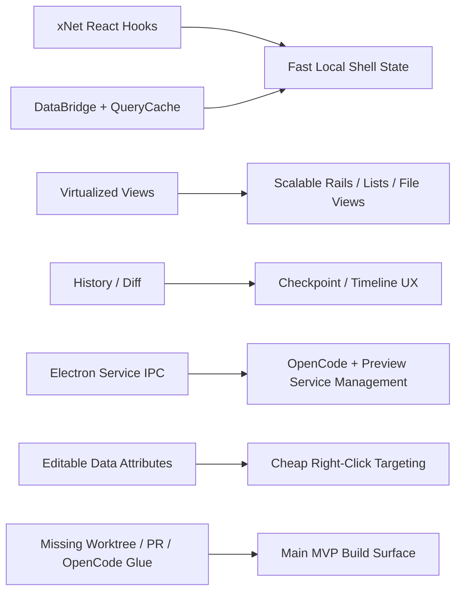
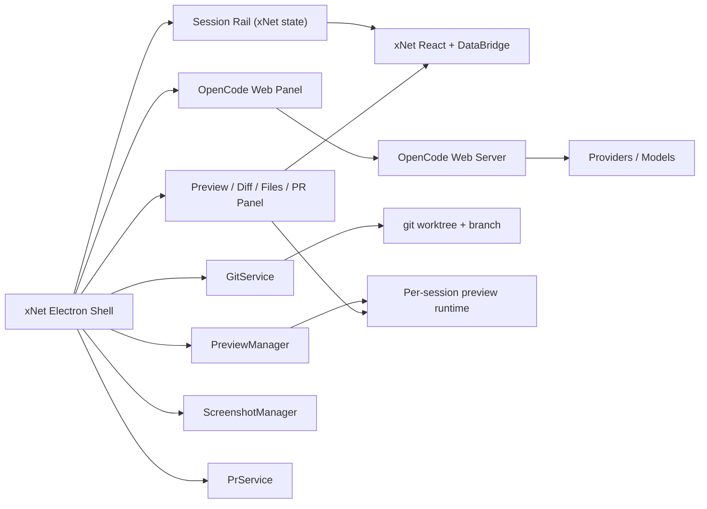
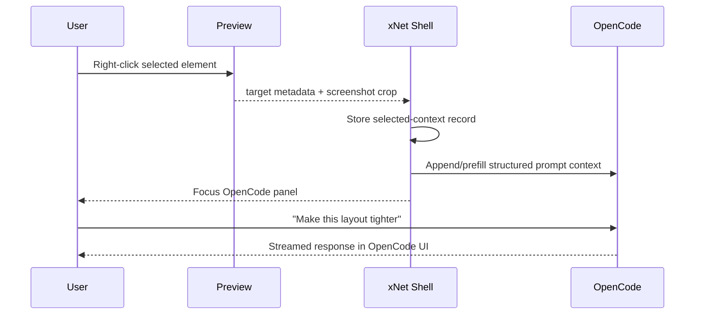

# Electron MVP Self-Editing Workspace with Cheap Performance Wins

## 1. 🧭 Title and Problem Statement

This exploration narrows the self-editing xNet idea down to the simplest MVP that is still genuinely usable:

- keep the Electron shell native and fast
- avoid building a custom chat UI if possible
- avoid building a custom LLM provider layer
- avoid Rust unless profiling proves TypeScript is the bottleneck
- get worktrees, right-click UI context, preview switching, and PR creation working quickly

The core question is:

> What is the simplest Electron MVP that feels good, stays fast, and leverages existing tools instead of rebuilding them?

The specific sub-questions are:

- Can OpenCode be reused for most of the LLM/chat/interface complexity?
- Can xNet primitives own the fast local state and timeline UX?
- Can right-clicking the live UI pass useful context into OpenCode with minimal glue code?
- Are there better tools than OpenCode for this repo and this UX?

## 2. ⚡ Executive Summary

As of **March 7, 2026**, the best MVP path is:

1. build a small **native xNet Electron shell**
2. run **OpenCode Web** as a managed local service
3. use the **OpenCode web UI directly** for the main chat panel
4. use **system `git worktree`** from Electron main for isolated session branches
5. use **xNet React/data primitives** for fast local shell state, cached summaries, checkpoints, and preview metadata
6. inject selected UI context into OpenCode using either:
   - prompt prefill / prompt append
   - or a tiny OpenCode custom tool that reads the current selected-element payload

### MVP Recommendation in One Sentence

Use **OpenCode as the coding/chat engine and UI**, use **xNet as the fast local shell/state layer**, and use **Electron main** only for worktrees, preview process management, screenshots, and PR creation.

### What Not To Do for the MVP

- do **not** build a custom provider aggregator
- do **not** build a full custom chat UI
- do **not** introduce Rust up front
- do **not** build a complex git abstraction beyond thin wrappers around `git` and `gh`
- do **not** force raw token streaming through xNet persistence before rendering

### Why This Is the Best Tradeoff

OpenCode already provides:

- multi-provider model access
- a working chat UI in web/desktop/TUI form
- session APIs
- plugins
- custom tools
- IDE-style context awareness patterns
- session diff/revert primitives

xNet already provides:

- local-first React hooks
- cached query subscriptions
- optimistic writes
- virtualization patterns
- history/timeline primitives
- Electron process infrastructure

So the cheapest usable MVP is not "build another agent app." It is "wrap OpenCode with an xNet-native fast shell."

## 3. 🧱 Current State in the Repository

### xNet Already Has a Strong Local Performance Substrate

The repo already contains the primitives needed for a fast shell:

- `packages/react/src/hooks/useQuery.ts:11-13` says the DataBridge handles caching and `useSyncExternalStore` subscriptions
- `packages/react/src/hooks/useQuery.ts:195-219` wires queries through a concurrent-safe subscription model
- `packages/react/src/hooks/useMutate.ts:12-17` and `packages/react/src/hooks/useMutate.ts:246-247` emphasize immediate local updates
- `packages/react/src/hooks/useNode.ts` already manages local document state, persistence debounce, and sync lifecycles
- `packages/data-bridge/src/query-cache.ts:1-10` provides in-memory query caching, deduplication, subscriber notification, LRU eviction, and weak-ref cleanup
- `packages/data-bridge/src/main-thread-bridge.ts:89-173` already does query caching plus incremental cache updates from store changes

Observed implication:

- the fast left rail, session summaries, cached preview metadata, and local timeline state should sit on xNet primitives, not bespoke React state sprinkled throughout the shell

### xNet Already Has UI Performance Patterns

The repo also already contains performance-oriented UI components:

- `packages/views/src/table/VirtualizedTableView.tsx:1-6` and `:137-152` implement dual-axis virtualization
- `packages/views/src/__tests__/virtualized-table.test.tsx:509-527` includes explicit performance tests for large datasets
- `packages/data/src/database/query-router.ts:67-120` routes small datasets local, medium hybrid, and large hub

Observed implication:

- the shell can reuse xNet’s performance philosophy directly: local first, virtualize aggressively, degrade only when scale requires it

### The Repo Already Exposes Some Targetable UI Metadata

There is already precedent for metadata-based editable target detection:

- `packages/views/src/table/TableView.tsx:121-125` marks editable surfaces with `data-xnet-db-editable="true"`
- `packages/views/src/board/BoardView.tsx:316-320` does the same
- `apps/electron/src/renderer/components/DatabaseView.tsx:513-516` already detects editable targets via `closest('[data-xnet-db-editable="true"]')`

Observed implication:

- the MVP can add a lightweight `data-xnet-target-*` convention rather than inventing a deep DOM/React inspection system immediately

### Electron Main Already Has Most of the Service Plumbing

Useful existing pieces:

- `apps/electron/src/main/service-ipc.ts:49-129` manages background services
- `apps/electron/src/main/index.ts:31-40` already supports isolated profiles
- `apps/electron/src/main/index.ts:20-25` already exposes dev CDP ports in development
- `apps/electron/src/main/secure-seed.ts:34-76` already shows the secure storage pattern to reuse for provider credentials

### The Most Relevant Gap Is Still the Service Boundary

The preload mismatch still matters:

- `apps/electron/src/main/service-ipc.ts` supports more channels than
- `apps/electron/src/preload/index.ts:240-267` currently allowlists

If OpenCode is launched and managed as a local service from the renderer, that mismatch needs to be corrected first.

### Current Repository Summary



## 4. 🌐 External Research

### 4.1 OpenCode Is the Strongest Reuse Candidate

Official OpenCode docs show several things that fit this MVP extremely well:

- The [Web docs](https://opencode.ai/docs/web) document `opencode web`, a local server-backed web UI.
- Those same docs explicitly mention:
  - fixed port configuration
  - password protection
  - CORS for custom frontends
  - attaching a TUI to the running web server while sharing the same sessions and state
- The [Server docs](https://opencode.ai/docs/server) describe a local API with session, diff, revert, and TUI-oriented endpoints.
- The [SDK docs](https://opencode.ai/docs/sdk/) expose session and TUI operations, including prompt/session flows and event subscriptions.
- The [IDE docs](https://opencode.ai/docs/ide/) explicitly call out **context awareness** and automatically sharing the current selection or tab.
- The [Custom Tools docs](https://opencode.ai/docs/custom-tools/) show that tools can be written in TypeScript/JavaScript, can invoke other languages when needed, and receive `directory` and `worktree` in context.
- The [Plugins docs](https://opencode.ai/docs/plugins/) show plugin hooks for:
  - `tool.execute.before`
  - `tool.execute.after`
  - `session.diff`
  - `session.idle`
  - `tui.prompt.append`
  - `tui.command.execute`

The [OpenCode homepage](https://dev.opencode.ai/) also claims:

- multi-session support
- desktop app availability
- broad provider support
- ability to connect many providers and models

Observed implication:

- OpenCode is not just "an LLM wrapper." It already covers most of the hard surface area this MVP would otherwise have to build.

### 4.2 OpenCode Also Reduces Integration Work

OpenCode’s official docs show:

- config-driven providers
- plugin support
- custom tools
- MCP server support
- ACP support for IDE/editor integration

That means the MVP does **not** need to build:

- a new provider abstraction layer
- a new tool/plugin protocol
- a new chat message/event model

### 4.3 T3 Code Is a Useful Signal, but Not the Right Core Stack

As of **March 7, 2026**, I could verify an official [T3 Code site](https://t3.codes/) and the public [pingdotgg/t3code](https://github.com/pingdotgg/t3code) repo.

Observed facts from the official repo README:

- T3 Code describes itself as a **minimal web GUI for coding agents**
- it is **currently Codex-first**
- Claude Code support is listed as coming soon
- it has a desktop app and is still described as very early

This is useful directional evidence:

- there is real product demand for a lightweight coding-agent GUI
- the product shape is converging on "thin shell around an existing coding agent"

But it is **not** the best backend fit for this repo because:

- it is Codex-first rather than provider-flexible
- it does not obviously solve the worktree/preview problem for xNet
- it does not reduce the need for custom glue nearly as much as OpenCode

### 4.4 T3 Chat Is More a Product Signal Than a Stack Reuse Opportunity

I did **not** verify a public Theo "T3 code app" beyond T3 Code itself.

The closest adjacent public T3 signal I found was the [T3 Chat Cloneathon](https://cloneathon.t3.chat/), which focused on building fast, flexible AI chat apps. That is useful as a product signal, but it does not directly provide a coding-agent/worktree stack.

Inference:

- T3’s work points toward UX expectations
- OpenCode is still the better technical substrate for this repo’s MVP

### 4.5 Vercel’s Coding Agent Template Shows a Different, Heavier Path

The official [vercel-labs/coding-agent-template](https://github.com/vercel-labs/coding-agent-template) is relevant as an adjacent architecture:

- it is centered on agent execution and git operations
- it assumes more remote/sandbox/backend orchestration than this xNet MVP wants

Observed implication:

- useful inspiration for task/session modeling
- too infrastructure-heavy for a simple local-first Electron MVP

### 4.6 Git and PR Tooling Are Already Good Enough

Official docs already cover the git/PR workflow the MVP needs:

- [git worktree](https://git-scm.com/docs/git-worktree)
- [gh pr create](https://cli.github.com/manual/gh_pr_create)

Observed implication:

- no new git library is required for the MVP
- a thin `GitService` around system CLI commands is the correct move

### 4.7 Electron Guidance Still Favors Simpler Embedding

The Electron docs still steer away from `<webview>` and toward alternatives like `WebContentsView`.

Observed implication:

- for the MVP, prefer an `iframe` or a separate BrowserWindow for OpenCode Web and preview content
- avoid making `<webview>` the foundation

## 5. 🔍 Key Findings

### 5.1 The Simplest Good MVP Uses OpenCode Web as the Main Chat UI

This is the single most important simplification.

If the center panel is just OpenCode Web:

- no custom message renderer
- no custom token stream transport
- no custom provider selector from scratch
- no custom slash command / permissions / tool runtime UI

That removes a huge amount of work.

### 5.2 xNet Should Own the Fast Paths, Not the LLM UI

xNet already has the right primitives for:

- session summary storage
- local subscriptions
- optimistic shell updates
- checkpoint metadata
- preview artifact storage
- diff/timeline composition

So the shell should rely on xNet for:

- left rail
- right-side metadata tabs
- checkpoint rail
- cached file/preview summaries

But **not** for every streamed token in the main chat hot path.

### 5.3 The Cheapest Performance Wins Are Mostly Architectural, Not Language-Level

The cheapest big wins are:

- keep OpenCode Web running as one long-lived local service
- keep the active preview and one recent preview warm
- restore session rails from local xNet-backed state
- store denormalized session summaries
- show last preview snapshots immediately
- background-refresh git/model/preview state
- virtualize any long lists

Rust is not necessary to achieve any of those.

### 5.4 Right-Click Context Is Easier Than It Looks If the Scope Is Narrow

For the MVP, right-click context can be:

- route id
- selected document/database id
- target label
- source file hint
- element bounds
- screenshot crop
- optional nearby text

That payload can either:

- be appended directly into the active OpenCode prompt
- or be exposed through a tiny OpenCode custom tool like `xnet_selected_context`

No React-fiber introspection is required for v1.

### 5.5 OpenCode’s Plugin and Tool Model Makes the Glue Small

OpenCode custom tools and plugins are the biggest leverage points for MVP simplicity.

Because custom tools get `directory` and `worktree`, a project-level tool can read:

- the current selection context
- preview metadata
- the active screenshot path
- the current route or document id

That means you do **not** need to deeply fork OpenCode to get contextual editing.

### 5.6 T3 Code Validates the Thin-Shell Direction

T3 Code is useful mainly because it confirms that a minimal GUI around a coding agent is already a viable product direction.

But OpenCode is still the better fit here because it already covers:

- multiple providers
- web UI
- plugins/tools
- sessions
- context awareness patterns

### 5.7 No Better Candidate Emerged for This MVP

For this repo and this product shape, I did **not** find a clearly better alternative than OpenCode.

Reasons:

- T3 Code is too provider/opinionated
- Vercel’s template is too cloud-heavy
- building directly on raw provider SDKs would recreate too much surface area

## 6. ⚖️ Options and Tradeoffs

### 6.1 Chat / Agent Stack Options

| Option | Reuse Level | Complexity | Performance Risk | Recommendation |
| --- | --- | --- | --- | --- |
| A. OpenCode Web embedded in the shell | Very high | Low | Medium-low | **Best MVP option** |
| B. OpenCode server/SDK with native xNet chat UI | Medium | Medium-high | Lowest eventual ceiling risk | Best later evolution |
| C. T3 Code as the core agent shell | Low-Medium | Medium | Medium | Interesting reference, not the best fit |
| D. Raw OpenAI/Anthropic/etc. integrations | Low | High | High | Avoid |

### 6.2 Context Injection Options

| Option | What It Does | Cost | Recommendation |
| --- | --- | --- | --- |
| A. Prefill prompt with selected context | Writes structured text into the active prompt | Lowest | **Best first step** |
| B. OpenCode custom tool for `xnet_selected_context` | Lets the model fetch current selection context on demand | Low-Medium | Best second step |
| C. Deep React component inspection | Extract component tree/source automatically | High | Avoid in MVP |

### 6.3 Preview Options

| Option | What It Means | Cost | Fidelity | Recommendation |
| --- | --- | --- | --- | --- |
| A. Browser preview in right panel | Load renderer/dev preview as a browser surface | Low | Medium | **Best MVP option** |
| B. Pop-out parity window | Launch a separate BrowserWindow for Electron-specific checks | Medium | High | Good escape hatch |
| C. Embedded `WebContentsView` parity preview | Native embedded preview inside shell | High | Highest | Later only |

### 6.4 Worktree Options

| Option | Cost | Reliability | Recommendation |
| --- | --- | --- | --- |
| System `git worktree` CLI | Low | High | **Use this** |
| JS git abstraction | Medium | Medium | Unnecessary |
| Cloud sandbox branches | High | Medium | Too much for MVP |

### 6.5 Cheap Performance Wins by Impact

| Win | Cost | Impact | Keep for MVP |
| --- | --- | --- | --- |
| Long-lived OpenCode web service on fixed port | Low | High | Yes |
| xNet-backed denormalized `SessionSummary` records | Low | High | Yes |
| Warm preview runtime for active + recent sessions | Low-Medium | High | Yes |
| Last-screenshot instant restore | Low | High | Yes |
| Virtualized session/file rails | Low | Medium | Yes |
| Background git status refresh | Low | Medium | Yes |
| Native chat UI rewrite | High | Medium | No |
| Rust sidecar | High | Unknown | No |
| Embedded `WebContentsView` preview | High | Medium | No |

## 7. ✅ Recommendation

### MVP Architecture

### 7.1 Product Shape

Build a three-panel Electron MVP with:

- left panel: native xNet session rail
- center panel: **OpenCode Web UI**
- right panel: native xNet preview/diff/files/checkpoints panel

The xNet shell owns:

- sessions
- worktrees
- preview processes
- screenshots
- checkpoint metadata
- PR generation

OpenCode owns:

- chat UI
- provider/model management
- coding agent runtime
- tool/plugin execution

### 7.2 Recommended MVP Stack



### 7.3 Session Model

Use one session record per worktree:

```ts
export type SessionSummary = {
  id: string
  title: string
  branch: string
  worktreePath: string
  openCodeUrl: string
  previewUrl: string | null
  lastMessagePreview: string
  lastScreenshotPath: string | null
  changedFilesCount: number
  state: 'idle' | 'running' | 'previewing' | 'error'
  updatedAt: number
}
```

This should live in xNet storage and be what powers instant left-rail switching.

### 7.4 Right-Click Context Flow

For MVP, use a simple context payload and inject it into OpenCode.



Recommended payload:

- `routeId`
- `targetId`
- `documentId`
- `fileHint`
- `bounds`
- `nearbyText`
- `screenshotPath`

### 7.5 Two Good Ways to Bridge xNet Context into OpenCode

#### Option A: prompt prefill

Cheapest first implementation:

- right-click builds a structured text block
- shell appends it into the OpenCode prompt
- user can edit or immediately send

Why this is good:

- no plugin required
- easy to debug
- very fast to ship

#### Option B: custom tool

Cleaner second implementation:

- add `.opencode/tools/xnet-selected-context.ts`
- tool reads the latest selected context from a file or local endpoint
- instruct agent/rules to call it when prompt references "this UI", "selected element", or "the thing I clicked"

Why this is good:

- lower prompt noise
- more structured
- easier to evolve later

### 7.6 How xNet Should Be Used for Performance

Use xNet for the parts where it already has leverage:

- `SessionSummary` query + subscription
- checkpoint records
- preview artifact metadata
- changed file summaries
- recent chat summaries, not raw token streams
- diff/timeline composition

Do **not** use xNet as the first destination of every streaming token.

Best pattern:

- stream into OpenCode UI directly
- persist chunks or completed message parts asynchronously
- store summary records in xNet for instant shell restore

### 7.7 What the MVP Should Explicitly Skip

- no custom provider layer
- no native chat UI rewrite
- no Rust sidecar
- no deep component tree introspection
- no embedded `WebContentsView` work unless browser preview proves inadequate
- no ambitious unified cross-session streaming wall in the center panel

### 7.8 Why This Should Feel Fast

If implemented this way, the expensive things are mostly off the click path:

- OpenCode service is already running
- preview runtime is warm or recently snapshotted
- left rail is local xNet state
- right panel metadata is local xNet state
- git status updates reconcile in the background

This makes tab/session switches mostly UI state swaps, not process boot sequences.

## 8. 🛠️ Implementation Checklist

- [ ] Fix the Electron preload/service IPC mismatch
- [ ] Add a `GitService` wrapper around `git worktree`, `git status`, `git diff`, `git commit`, and `gh pr create`
- [ ] Add an `OpenCodeService` wrapper that starts `opencode web` on a fixed localhost port with auth
- [ ] Add a `SessionSummary` schema in xNet to persist worktree/session metadata
- [ ] Build the left rail from `useQuery(SessionSummarySchema)` rather than bespoke state
- [ ] Add a right-panel preview manager for browser-based preview URLs plus last screenshot
- [ ] Add a right-panel file/diff/markdown view using existing xNet UI components
- [ ] Add basic session switching with local cached summaries and screenshot fallback
- [ ] Add right-click capture using `data-xnet-target-*` attributes on targetable UI surfaces
- [ ] Add prompt prefill into the active OpenCode session
- [ ] Add a second-step OpenCode custom tool for selected context
- [ ] Add one-click session creation: branch + worktree + preview + OpenCode session
- [ ] Add one-click PR creation with screenshot attachment flow
- [ ] Add performance telemetry for session switch, preview restore, and rail render time
- [ ] Add cleanup for stale worktrees and background services

## 9. 🧪 Validation Checklist

- [ ] Start the shell and confirm OpenCode Web loads without writing a custom chat UI
- [ ] Create two worktree sessions and confirm left-rail switching is instant from local state
- [ ] Verify OpenCode remains connected while switching sessions
- [ ] Verify preview snapshots show immediately before live preview is ready
- [ ] Right-click a tagged UI element and confirm structured context reaches OpenCode
- [ ] Apply an OpenCode-generated change in a worktree and confirm preview reloads
- [ ] Confirm shell responsiveness remains high while OpenCode is streaming
- [ ] Confirm file and diff views stay responsive with many changed files
- [ ] Confirm worktrees can be removed and recreated cleanly
- [ ] Confirm PR creation works through `gh` when available
- [ ] Confirm no custom provider aggregator is needed for a full MVP loop
- [ ] Confirm no Rust is needed to meet the MVP performance budget

## 10. 💻 Example Code

These examples are intentionally **conceptual glue-code sketches**. They show the recommended boundaries and data flow, but they do not assume unpublished OpenCode package names or exact local wrapper implementations.

### Example A: Start OpenCode Web as a Managed Service

```ts
export async function ensureOpenCodeWeb(): Promise<{
  baseUrl: string
}> {
  const port = 4096

  await serviceClient.start({
    id: 'opencode-web',
    name: 'OpenCode Web',
    process: {
      command: 'opencode',
      args: ['web', '--port', String(port)],
      env: {
        OPENCODE_SERVER_PASSWORD: process.env.OPENCODE_SERVER_PASSWORD ?? 'dev-password'
      }
    },
    lifecycle: { restart: 'on-failure' },
    communication: { protocol: 'http', port }
  })

  return { baseUrl: `http://127.0.0.1:${port}` }
}
```

### Example B: Create a Worktree Session

```ts
export async function createSession(input: {
  repoRoot: string
  baseRef: string
  branch: string
  worktreePath: string
}): Promise<void> {
  await git.run(input.repoRoot, [
    'worktree',
    'add',
    '-b',
    input.branch,
    input.worktreePath,
    input.baseRef
  ])

  await sessionMutate.create(SessionSummarySchema, {
    title: input.branch,
    branch: input.branch,
    worktreePath: input.worktreePath,
    openCodeUrl: 'http://127.0.0.1:4096',
    previewUrl: null,
    lastMessagePreview: '',
    lastScreenshotPath: null,
    changedFilesCount: 0,
    state: 'idle',
    updatedAt: Date.now()
  })
}
```

### Example C: Capture and Prefill Selected UI Context

```ts
export function buildSelectedContext(target: HTMLElement): string {
  const targetId = target.dataset.xnetTargetId ?? 'unknown'
  const routeId = document.body.dataset.xnetRouteId ?? 'unknown'
  const fileHint = target.dataset.xnetFileHint ?? 'unknown'

  return [
    'Selected UI context:',
    `- route: ${routeId}`,
    `- target: ${targetId}`,
    `- fileHint: ${fileHint}`
  ].join('\n')
}

export async function handleEditThis(target: HTMLElement): Promise<void> {
  const prompt = `${buildSelectedContext(target)}\n\nPlease improve this UI.`
  await openCodeBridge.appendPrompt(prompt)
  shellState.focusCenterPanel()
}
```

### Example D: OpenCode Custom Tool for Selected Context

```ts
import { readFile } from 'node:fs/promises'
import { join } from 'node:path'

export default {
  description: 'Read the current xNet selected UI context',
  args: {},
  async execute(_args, context) {
    const filePath = join(context.worktree, '.opencode', 'tmp', 'selected-context.json')
    return readFile(filePath, 'utf8')
  }
}
```

### Example E: Instant Session Switching

```tsx
import { startTransition } from 'react'

export function selectSession(sessionId: string): void {
  startTransition(() => {
    sessionStore.setActive(sessionId)
  })

  previewSnapshotStore.showLastSnapshot(sessionId)

  void previewManager.ensureWarm(sessionId)
  void gitStatusStore.refresh(sessionId)
}
```

## 11. 📚 References

### Repository References

- `apps/electron/src/main/index.ts`
- `apps/electron/src/main/service-ipc.ts`
- `apps/electron/src/preload/index.ts`
- `apps/electron/src/main/secure-seed.ts`
- `apps/electron/src/renderer/components/DatabaseView.tsx`
- `packages/react/src/hooks/useQuery.ts`
- `packages/react/src/hooks/useMutate.ts`
- `packages/react/src/hooks/useNode.ts`
- `packages/react/src/instrumentation.ts`
- `packages/data-bridge/src/main-thread-bridge.ts`
- `packages/data-bridge/src/query-cache.ts`
- `packages/views/src/table/TableView.tsx`
- `packages/views/src/board/BoardView.tsx`
- `packages/views/src/table/VirtualizedTableView.tsx`
- `packages/views/src/__tests__/virtualized-table.test.tsx`
- `packages/data/src/database/query-router.ts`

### Web References

- [OpenCode Web Docs](https://opencode.ai/docs/web)
- [OpenCode Server Docs](https://opencode.ai/docs/server)
- [OpenCode SDK Docs](https://opencode.ai/docs/sdk/)
- [OpenCode IDE Docs](https://opencode.ai/docs/ide/)
- [OpenCode Plugins Docs](https://opencode.ai/docs/plugins/)
- [OpenCode Custom Tools Docs](https://opencode.ai/docs/custom-tools/)
- [OpenCode ACP Support Docs](https://opencode.ai/docs/acp/)
- [OpenCode Config Docs](https://opencode.ai/docs/config)
- [OpenCode Homepage](https://dev.opencode.ai/)
- [T3 Code](https://t3.codes/)
- [pingdotgg/t3code](https://github.com/pingdotgg/t3code)
- [T3 Chat Cloneathon](https://cloneathon.t3.chat/)
- [vercel-labs/coding-agent-template](https://github.com/vercel-labs/coding-agent-template)
- [git worktree Docs](https://git-scm.com/docs/git-worktree)
- [GitHub CLI `gh pr create`](https://cli.github.com/manual/gh_pr_create)
- [Electron WebContentsView Docs](https://www.electronjs.org/docs/latest/api/web-contents-view)
- [Electron webview Tag Docs](https://www.electronjs.org/docs/latest/api/webview-tag)

## 12. 🚀 Next Actions

The next implementation artifact should be a concrete MVP plan with these steps:

1. fix the Electron service boundary
2. start OpenCode Web from Electron main
3. add `SessionSummary` to xNet and build the fast left rail on it
4. add `git worktree` session creation
5. add browser preview plus snapshot fallback
6. add right-click target metadata plus OpenCode prompt prefill

That gets to a usable MVP with the fewest moving parts and the cheapest performance wins.
