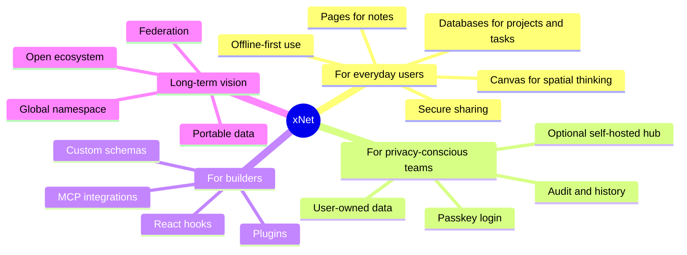
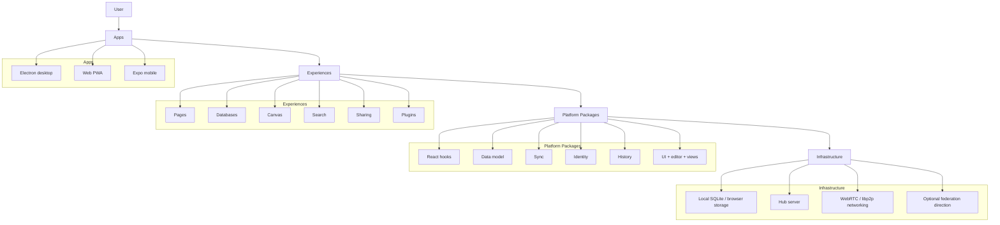
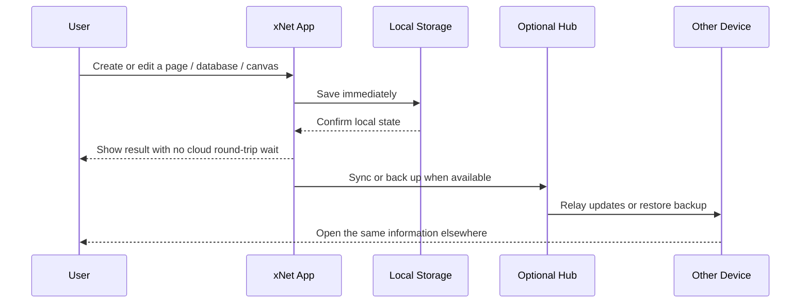
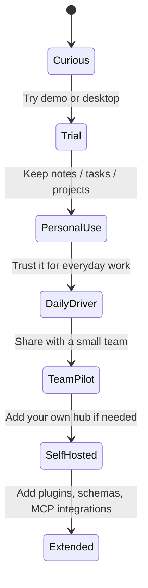

# xNet Repository and Project Summary for Non-Technical Users

> Audience: someone discovering xNet for the first time
>
> Date: March 10, 2026
>
> Method: direct repo inspection plus official external sources

## Title and Problem Statement

If you land on xNet cold, it is easy to misread it.

Is it a note-taking app?
Is it a database builder?
Is it a sync engine?
Is it a developer SDK?

After inspecting the repository, the answer is: **it is all of those at once, by design**.

xNet is trying to be a **local-first workspace for documents, databases, and canvases** while also being the **platform underneath that workspace**: storage, sync, identity, permissions, plugins, search, and optional hub infrastructure.

The practical question for a non-technical person is simpler:

**"If I start using this, does it make my digital life faster, safer, more private, and less fragmented?"**

This document answers that question with clear separation between:

- `Observed`: what is directly present in the repository today
- `Inference`: what those capabilities likely mean for real users

> 🔎 `Observed:` xNet contains 24 package directories under [`packages/`](../../packages), 3 user-facing apps under [`apps/`](../../apps), a large docs set under [`docs/`](../../docs), and 317 `test/spec` files as of March 10, 2026.
>
> 💡 `Inference:` this is not a toy prototype. It is a serious monorepo building both an end-user product and the technical foundation beneath it.

## Executive Summary

| Question | Plain-English Answer |
| --- | --- |
| What is xNet? | A workspace for pages, databases, and canvases that stores your data locally first and syncs it across devices or hubs when needed. |
| Why does it matter? | It aims to give you the convenience of modern cloud apps without making a company the owner of your data. |
| What feels different? | Instant local saves, offline-first behavior, passkey login, optional self-hosting, and a strong emphasis on user ownership and extensibility. |
| What is in the repo today? | Desktop, web, and mobile apps; packages for data, sync, identity, search, history, plugins, UI, and a standalone hub server. |
| What is the big vision? | Start as a personal and team workspace, then grow into a broader user-owned data platform with federation, plugins, and interoperable namespaces. |
| Should a non-technical user adopt it now? | Yes for a personal pilot or a small exploratory team pilot. Not yet as a universal replacement for every business-critical workflow. |



### The shortest useful description

xNet looks like a **private, extensible alternative to "all your work lives in someone else's SaaS."**

The closest mental model is:

- part Notion or AFFiNE in user experience
- part sync and data platform under the hood
- part future-facing app platform for plugins, custom schemas, and AI integrations

## Current State in the Repository

### Repo Snapshot

| Signal | Observed in Repo | Why It Matters |
| --- | --- | --- |
| App count | 3 app directories in [`apps/`](../../apps) | xNet is not just a library; it ships products. |
| Package count | 24 package directories in [`packages/`](../../packages) | The platform layer is substantial and modular. |
| Documentation depth | Extensive strategy, roadmap, tradeoff, plan, and exploration docs in [`docs/`](../../docs) | The project has an articulated vision, not just code. |
| Test surface | 317 `test/spec` files found across the repo | There is real emphasis on verification and stability. |
| Desktop priority | [`apps/electron/README.md`](../../apps/electron/README.md) calls Electron the "primary development target" | The best near-term experience is likely desktop-first. |
| Web breadth | Web routes exist for [pages](../../apps/web/src/routes/doc.$docId.tsx), [databases](../../apps/web/src/routes/db.$dbId.tsx), [canvas](../../apps/web/src/routes/canvas.$canvasId.tsx), [sharing](../../apps/web/src/routes/share.tsx), and [settings](../../apps/web/src/routes/settings.tsx) | This is already more than a static demo or landing page. |

### What a User Can Already Do

| User Need | Evidence in Repo | Likely User Value |
| --- | --- | --- |
| Write and organize documents | [`@xnetjs/editor`](../../packages/editor/README.md), [`PageView.tsx`](../../apps/electron/src/renderer/components/PageView.tsx) | A note/wiki experience with rich text, links, embeds, comments, and diagrams. |
| Track structured information | [`@xnetjs/data`](../../packages/data/README.md), [`DatabaseView.tsx`](../../apps/electron/src/renderer/components/DatabaseView.tsx), [`@xnetjs/views`](../../packages/views/README.md) | A flexible database for tasks, projects, CRM-like records, or custom workflows. |
| Think visually | [`@xnetjs/canvas`](../../packages/canvas/README.md), [`CanvasView.tsx`](../../apps/electron/src/renderer/components/CanvasView.tsx) | A spatial surface for mapping ideas, linking documents, and planning visually. |
| Search and browse | [`GlobalSearch.tsx`](../../apps/web/src/components/GlobalSearch.tsx), [`@xnetjs/query`](../../packages/query/README.md) | Faster retrieval across pages and data. |
| Share securely | [`share.tsx`](../../apps/web/src/routes/share.tsx), [`AddSharedDialog.tsx`](../../apps/electron/src/renderer/components/AddSharedDialog.tsx) | Practical collaboration without needing to expose raw database internals. |
| Keep history and undo | [`@xnetjs/history`](../../packages/history/README.md) | Confidence that changes are traceable and recoverable. |
| Extend the system | [`@xnetjs/plugins`](../../packages/plugins/README.md) | The app can evolve toward custom workflows instead of forcing one rigid model. |

### How the Repository Fits Together



### What the Product Seems to Be, in Plain Language

| Layer | Plain-English Meaning |
| --- | --- |
| Pages | Your notes, docs, reference material, personal wiki |
| Databases | Your task tracker, project board, CRM, inventory, or other structured lists |
| Canvas | Your whiteboard, planning surface, or map of connected ideas |
| Search | Your "find anything quickly" layer |
| History | Your "what changed and can I get it back?" layer |
| Sharing | Your "let someone else in without losing control" layer |
| Plugins and MCP | Your "make this fit my workflow or connect it to AI/tools" layer |

### A Day-in-the-Life View



> 🔎 `Observed:` the repo explicitly uses local storage adapters, SQLite-backed storage, Yjs sync, and an optional hub package for relay, backup, and search. See [`@xnetjs/storage`](../../packages/storage/README.md), [`@xnetjs/data`](../../packages/data/README.md), [`@xnetjs/sync`](../../packages/sync/README.md), and [`@xnetjs/hub`](../../packages/hub/README.md).
>
> 💡 `Inference:` the intended feeling is "my work is already here on my device, and the network helps me rather than owning me."

### What Is Real Today vs. What Is Still Vision

| Horizon | What It Includes | Evidence |
| --- | --- | --- |
| Now | Desktop app, web app, mobile shell, pages, databases, canvas, history, search, sharing, plugins, hub relay/backup | [`README.md`](../../README.md), [`apps/README.md`](../../apps/README.md), [`packages/README.md`](../../packages/README.md) |
| Next 6 months | Navigation polish, invite/member UX, permission UX completion, multi-hub clarity | [`docs/ROADMAP.md`](../../docs/ROADMAP.md) |
| Longer vision | Global namespace, broader federation, public indexes, internet-scale user-owned data model | [`docs/VISION.md`](../../docs/VISION.md) |

This distinction matters. xNet already has meaningful product substance, but the repository itself says the current focus is **hardening and adoption**, not declaring the full long-term vision complete.

## External Research

### Why the Architecture Choices Matter

| Concept | Official Source | Why It Matters for Non-Technical Users |
| --- | --- | --- |
| Local-first software | [Ink & Switch: Local-first software](https://www.inkandswitch.com/essay/local-first/) | The local device is treated as the primary home of your data, which supports speed, offline use, and a stronger sense of ownership. |
| Collaborative offline sync | [Yjs docs](https://docs.yjs.dev/) and [Yjs homepage](https://yjs.dev/) | Yjs is designed for collaborative data that can sync automatically, work offline, and stay network-agnostic. |
| Passwordless sign-in | [FIDO Alliance: Passkeys](https://fidoalliance.org/passkeys/) | Passkeys can reduce password fatigue and phishing risk while making sign-in easier on supported devices. |
| Peer-to-peer networking | [libp2p docs](https://docs.libp2p.io/) and [libp2p WebRTC guide](https://libp2p.io/guides/webrtc/) | xNet's networking direction is aligned with direct peer connectivity rather than forcing every action through a central cloud server. |
| Delegated permissions | [UCAN specification](https://github.com/ucan-wg/spec) | Capability-based authorization is a way to grant precise access without making one central account system the universal gatekeeper. |
| AI interoperability | [Model Context Protocol](https://modelcontextprotocol.io/) | MCP matters because it creates a standard way for AI tools to access data sources and actions, which lines up with xNet's plugin and integration story. |

### Market Context

| Product | Official Framing | What It Suggests About xNet |
| --- | --- | --- |
| [Notion](https://www.notion.com/product/wikis) | Connected workspace for docs, wikis, and projects | xNet is playing in a similar "organize all your work" category, but with more emphasis on local-first control and platform openness. |
| [AFFiNE](https://affine.pro/) | Docs, whiteboards, and databases on a local-first platform | AFFiNE is the closest mainstream comparison on surface design; xNet appears more explicitly platform-first and infrastructure-minded. |
| [Model Context Protocol](https://modelcontextprotocol.io/) | Open standard connecting AI applications to external systems | xNet's MCP server work suggests it wants to be an addressable system for AI-assisted workflows, not just a closed note app. |

### Why This Matters Strategically

The external landscape reinforces that xNet is trying to occupy a strong position:

- more private and user-controlled than typical cloud workspaces
- more app-like and immediately usable than a pure backend SDK
- more extensible than a fixed productivity tool

That is a compelling position if it can deliver polish and trust.

## Key Findings

### 1. xNet is a product and a platform at the same time

This is the single most important thing to understand.

The repository is not only building a user-facing app. It is also building the underlying data model, sync model, identity model, history system, plugin system, and hub/server story.

That gives xNet unusual upside:

- users can adopt an app
- teams can adopt a self-hostable workspace
- developers can build on the same primitives

It also creates a complexity burden:

- the product has more moving parts than a conventional single-purpose app
- the project has to communicate very clearly what is ready now versus what is aspirational

### 2. The immediate user value is stronger than the long-term ideology

xNet's grand vision is ambitious, but the **near-term value** is easier to explain:

- your notes, databases, and canvases can live together
- your device stays central instead of being a thin terminal to a cloud
- you can work offline and still sync later
- you can avoid deep lock-in to a single vendor's data model

For most users, that matters more than decentralized internet theory.

### 3. The desktop app is the best place to start

> 🔎 `Observed:` the Electron app is explicitly the primary development target in [`apps/electron/README.md`](../../apps/electron/README.md).

That implies the most sensible adoption path for a non-technical person is:

1. try the desktop experience first
2. use the web app as a lighter companion or demo surface
3. think about self-hosting or team sync later

### 4. xNet is already broader than a notes app

The repository clearly supports:

- rich documents
- structured databases
- visual canvases
- comments
- search
- sharing
- plugins
- history
- telemetry with consent controls

That package mix points to a **workspace operating system** more than a single feature app.

### 5. The main adoption risk is maturity, not lack of ambition

The roadmap in [`docs/ROADMAP.md`](../../docs/ROADMAP.md) explicitly calls out remaining gaps such as:

- deeper navigation
- invite and membership UX
- productized role lifecycle
- more complete federation/operator stories

This is healthy honesty.

It also means a non-technical user should approach xNet as:

- very promising for personal use or exploratory adoption
- plausible for a small trusted team pilot
- not yet an obvious drop-in replacement for every polished enterprise SaaS workflow

## Options and Tradeoffs

### Adoption Options

| Option | Best For | Upside | Tradeoff |
| --- | --- | --- | --- |
| Try the demo or web app | Curious users who want to understand the idea quickly | Lowest friction, fast preview | Not the strongest long-term durability story compared with desktop |
| Use the desktop app for personal work | Privacy-conscious individuals, founders, researchers, writers, operators | Best expression of local-first value and likely the strongest experience | Still an evolving product |
| Pilot with a small team | A tight-knit group that values control and experimentation | Tests real collaboration and shared workflows | Requires tolerance for rough edges and evolving admin UX |
| Self-host a hub | Teams that care about backup, control, and optional infrastructure ownership | Stronger sovereignty story and future flexibility | More operational responsibility |
| Replace all incumbent tools immediately | Organizations seeking an instant complete migration | Maximum theoretical upside | Highest risk; maturity gaps make this the wrong first move today |

### Product Tradeoffs

| xNet Choice | User Benefit | User Cost |
| --- | --- | --- |
| Local-first storage | Fast, offline-capable, more private | Requires thinking about device durability and backup |
| User-owned / self-hostable direction | Less lock-in, more control | Slightly more setup complexity than pure SaaS |
| Broad platform scope | One system can cover notes, data, canvas, and extensions | Harder product story; more moving parts |
| Advanced identity and permission model | Better long-term security and delegation potential | Harder to explain than "email + password + admin panel" |
| Plugin and MCP extensibility | More future-proof and adaptable | Governance and UX need to stay understandable |

## Recommendation

For a non-technical person, the best description is:

**xNet is an attempt to give you a modern workspace without making your work hostage to someone else's cloud.**

For practical adoption, the best recommendation is:

### Recommended path

1. Start with **one real personal workflow**.
2. Use xNet for something concrete: project notes, task tracking, research pages, or a planning canvas.
3. Judge it by lived experience:
   - does it feel fast?
   - does it stay understandable?
   - do pages, databases, and canvases genuinely reduce tool switching?
4. Only then consider collaboration or self-hosting.



### Why this is the right recommendation

Because the repo suggests xNet is already good enough to test its core thesis:

- local-first work should feel better than waiting on the cloud
- one environment can unify writing, structured data, and visual planning
- ownership and extensibility can be real product benefits, not just ideology

### What I would tell a friend in one paragraph

If you like the idea of Notion or AFFiNE, but you want your machine to stay in charge, your data to feel more portable, and your future workflows to be more customizable, xNet is worth serious attention. Start small, use the desktop app first, and treat it as a high-upside pilot rather than an all-at-once migration.

## Implementation Checklist

This checklist assumes a non-technical user or small team wants to evaluate xNet seriously.

- [ ] Try the public demo or the desktop app
- [ ] Create one page, one database, and one canvas
- [ ] Move one real workflow into xNet for at least a week
- [ ] Test offline behavior deliberately
- [ ] Test cross-device or shared-workspace behavior if that matters
- [ ] Decide whether the web app is enough or the desktop app should be primary
- [ ] Decide whether you need a self-hosted hub or are comfortable with a hosted/demo setup
- [ ] Keep your incumbent tool as a fallback until the pilot proves daily reliability

## Validation Checklist

Use this checklist to decide whether xNet is actually improving your life.

- [ ] Writing in pages feels as fast as or faster than your current tool
- [ ] Database views are sufficient for your current project or task workflow
- [ ] Canvas adds real clarity instead of becoming visual clutter
- [ ] Search can reliably find what you need
- [ ] Sharing is understandable to the people you collaborate with
- [ ] Local-first behavior gives confidence rather than confusion
- [ ] Passkey login works smoothly on your devices
- [ ] You feel less locked in, not more

## Example Code

This matters because xNet is not only an app. It is also a platform your team can shape.

Here is a small example showing how a team could define its own first-class data type instead of waiting for the vendor to add a feature:

```typescript
import { defineSchema, text, select, date } from '@xnetjs/data'

export const ProjectSchema = defineSchema({
  name: 'Project',
  namespace: 'acme://',
  document: 'yjs',
  properties: {
    title: text({ required: true }),
    status: select({
      options: [
        { id: 'planning', name: 'Planning' },
        { id: 'active', name: 'Active' },
        { id: 'done', name: 'Done' }
      ] as const
    }),
    dueDate: date()
  }
})
```

In plain English: xNet is designed so your workflow does not have to wait for the core product team to invent the exact object you need.

## References

### Internal Repository Sources

- [Root README](../../README.md)
- [Apps overview](../../apps/README.md)
- [Packages overview](../../packages/README.md)
- [Desktop app README](../../apps/electron/README.md)
- [Web app README](../../apps/web/README.md)
- [Expo app README](../../apps/expo/README.md)
- [Vision](../../docs/VISION.md)
- [Roadmap](../../docs/ROADMAP.md)
- [Architecture tradeoffs](../../docs/TRADEOFFS.md)
- [Integration tests README](../../tests/README.md)
- [Data package README](../../packages/data/README.md)
- [Sync package README](../../packages/sync/README.md)
- [Identity package README](../../packages/identity/README.md)
- [Network package README](../../packages/network/README.md)
- [Query package README](../../packages/query/README.md)
- [Hub package README](../../packages/hub/README.md)
- [Editor package README](../../packages/editor/README.md)
- [Canvas package README](../../packages/canvas/README.md)
- [History package README](../../packages/history/README.md)
- [React package README](../../packages/react/README.md)
- [Plugins package README](../../packages/plugins/README.md)
- [Telemetry package README](../../packages/telemetry/README.md)

### External Sources

- [Ink & Switch: Local-first software](https://www.inkandswitch.com/essay/local-first/)
- [Yjs documentation](https://docs.yjs.dev/)
- [Yjs homepage](https://yjs.dev/)
- [FIDO Alliance: Passkeys](https://fidoalliance.org/passkeys/)
- [libp2p documentation](https://docs.libp2p.io/)
- [libp2p WebRTC guide](https://libp2p.io/guides/webrtc/)
- [UCAN specification](https://github.com/ucan-wg/spec)
- [Model Context Protocol](https://modelcontextprotocol.io/)
- [Notion product page](https://www.notion.com/product/wikis)
- [AFFiNE homepage](https://affine.pro/)
