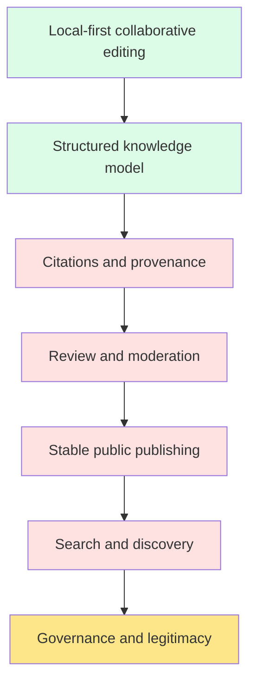
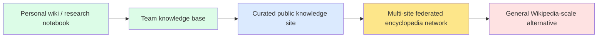
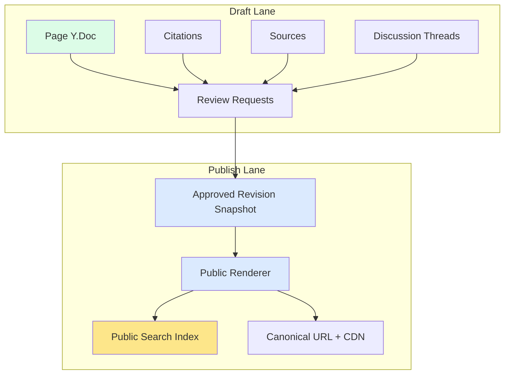
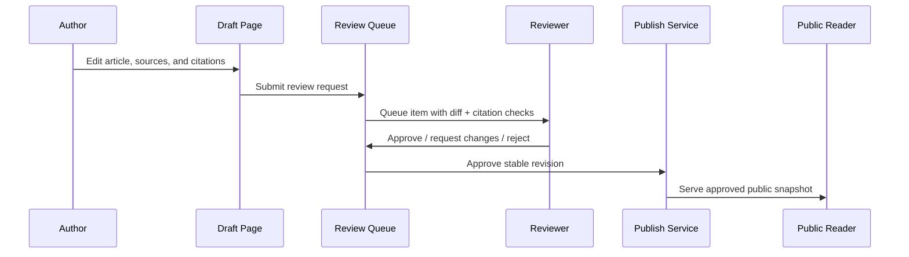
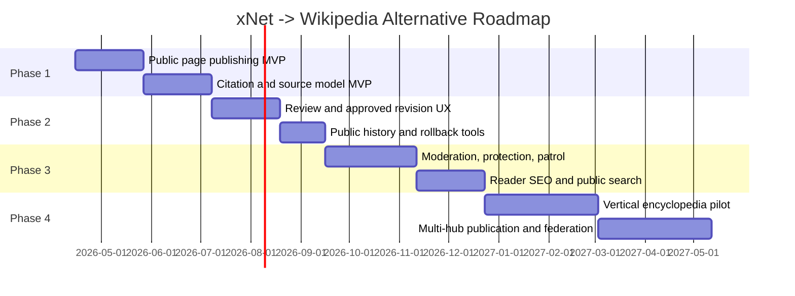

# 0110 - xNet as a Viable Wikipedia Alternative

> **Status:** Exploration  
> **Date:** 2026-04-05  
> **Author:** OpenCode  
> **Tags:** wiki, wikipedia, local-first, publishing, moderation, citations, federation, search

## Problem Statement

What would it actually take to make xNet a **viable Wikipedia alternative**, not just a personal wiki or collaborative note app?

That question is bigger than editor quality.

Wikipedia works because it combines:

- collaborative editing
- public publishing
- citations and verifiability
- revision history and attribution
- moderation and anti-vandalism
- governance and policy
- discoverability at massive scale
- long-term cultural legitimacy

xNet already has meaningful primitives for some of this, especially around **local-first collaboration, structured data, sync, identity, and extensibility**. But a viable Wikipedia alternative would require xNet to grow from a strong workspace platform into a **knowledge publication system with trust, review, and operator workflows**.

## Exploration Status

- [x] Inspect existing repo state and exploration numbering
- [x] Review xNet codebase capabilities relevant to wiki/encyclopedia workflows
- [x] Review xNet strategy docs and related explorations
- [x] Research Wikimedia / MediaWiki requirements and operational patterns
- [x] Define the main product and architecture gaps
- [x] Propose a realistic strategic path and phased roadmap
- [x] Include implementation and validation checklists

## Executive Summary

The short answer is:

**xNet could become a viable Wikipedia alternative, but not by simply polishing pages, search, and sharing.**

The main conclusion from repo inspection plus external research is that xNet already has enough substrate to become a strong **local-first wiki platform**, but a Wikipedia-class alternative requires six additional layers that are either missing or only partially present today:

1. **Citation-native content modeling**
2. **Stable public revision publishing**
3. **Editorial review and moderation workflows**
4. **Reader-first public web delivery and SEO**
5. **Governance, policy, and licensing primitives**
6. **Public-scale search, discovery, and federation operations**

The most important strategic recommendation is:

**Do not aim first at "replace English Wikipedia." Aim first at "be the best platform for expert-run, federated, public knowledge wikis."**

That means xNet should initially target:

- curated topic encyclopedias
- research and knowledge commons
- community-run domain wikis
- public documentation or reference ecosystems

This is the realistic path because xNet's strongest advantages are:

- local-first authoring
- collaborative structured knowledge
- signed identity and grants
- flexible schemas
- future federation

Those are real differentiators, but they matter more for **contributors and operators** than for anonymous readers. Readers mostly care about:

- trust
- speed
- clarity
- searchability
- stable URLs
- cited claims

So xNet needs a **two-lane architecture**:

- **draft lane**: live local-first collaborative editing
- **publish lane**: approved, stable, cached public revisions

Without that split, xNet will remain a compelling workspace, but not a credible encyclopedia alternative.

## What "Viable" Actually Means

There are at least four different targets hiding inside the phrase "Wikipedia alternative":

| Target                               | Description                                                  | Viability Horizon for xNet |
| ------------------------------------ | ------------------------------------------------------------ | -------------------------- |
| Personal wiki                        | Great personal or small-team knowledge base                  | Near-term                  |
| Public wiki software                 | A good engine for publishing public knowledge sites          | Near-term to medium        |
| Curated encyclopedia platform        | Multi-contributor, reviewed, citation-heavy public knowledge | Medium                     |
| General open encyclopedia competitor | Broad, public, cross-topic Wikipedia-scale replacement       | Long-term                  |

The first two are already plausible directions. The third is achievable with focused product work. The fourth is not primarily a technology problem; it is an institution, trust, governance, and scale problem.

### Viability Stack

Observed in xNet today:

- `A` is substantially present
- `B` is substantially present
- `C` through `F` are partial or missing
- `G` is mostly outside the codebase and would need product + community design

## What xNet Already Has

### 1. Rich collaborative pages

xNet already has a strong page foundation:

- pages are first-class nodes in [`../../packages/data/src/schema/schemas/page.ts`](../../packages/data/src/schema/schemas/page.ts)
- page documents are Yjs-backed (`document: 'yjs'`)
- the editor already supports rich text, headings, code blocks, embeds, uploads, and custom extensions via [`../../packages/editor/src/extensions.ts`](../../packages/editor/src/extensions.ts)

This matters because a Wikipedia alternative needs more than markdown notes. It needs a rich document surface with collaboration, formatting, and long-lived content structure.

### 2. Wikilinks, backlinks, and search primitives

xNet already has real wiki-like link behavior:

- wikilinks are supported in the editor via the `Wikilink` extension in [`../../packages/editor/src/extensions.ts`](../../packages/editor/src/extensions.ts)
- shared document extraction walks Yjs content and extracts search text and backlinks in [`../../packages/query/src/search/document.ts`](../../packages/query/src/search/document.ts)
- the web app already exposes a live search/backlink surface in [`../../apps/web/src/hooks/usePageSearchSurface.ts`](../../apps/web/src/hooks/usePageSearchSurface.ts)

This is not enough for encyclopedia-grade discovery, but it is a strong substrate for article linking and contextual navigation.

### 3. History, audit, blame, and time travel primitives

xNet's history layer is materially stronger than most note apps:

- [`../../packages/history/README.md`](../../packages/history/README.md) documents undo/redo, audit trails, blame, verification, schema timelines, and document history
- related exploration [`./0038_[_]_YJS_HISTORY_INTEGRATION.md`](./0038_[_]_YJS_HISTORY_INTEGRATION.md) already analyzes how to unify Yjs document history with structured node history

This is important because public knowledge needs:

- attribution
- revertability
- moderation auditability
- visible trust in how content changed over time

### 4. Structured data and schema-native modeling

xNet has a meaningful advantage over traditional wiki engines here.

Instead of treating everything as one giant text blob with templates glued on top, xNet already has:

- schemas
- typed properties
- relations
- databases
- plugin/extensibility surfaces

This suggests a better long-term model for:

- infoboxes
- reference metadata
- topic taxonomies
- knowledge graph edges
- structured claim provenance

### 5. Identity, authorization, and sharing primitives

From the repo and related docs, xNet already has:

- DID-based identity
- passkey flows
- UCAN capability delegation
- grants and permissions
- secure share flows

That is a serious advantage for future editorial roles such as:

- editor
- reviewer
- patroller
- admin
- oversighter
- publisher

### 6. Local-first and federation direction

xNet's roadmap and vision explicitly target:

- local-first primary editing in [`../ROADMAP.md`](../ROADMAP.md)
- public/global namespace and broader federation in [`../VISION.md`](../VISION.md)
- node-native federation ideas in [`./0093_[_]_NODE_NATIVE_GLOBAL_SCHEMA_FEDERATION_MODEL.md`](./0093_[_]_NODE_NATIVE_GLOBAL_SCHEMA_FEDERATION_MODEL.md)
- decentralized search research in [`./0023_[_]_DECENTRALIZED_SEARCH.md`](./0023_[_]_DECENTRALIZED_SEARCH.md)

That direction is highly relevant because a genuine Wikipedia alternative benefits from:

- avoiding a single central owner
- operator diversity
- public knowledge portability
- durable public archives

## What Wikipedia-Class Systems Actually Need

The external research makes one thing very clear:

**Wikipedia is not just editing software. It is a policy-enforced, moderation-heavy publishing institution.**

### Scale Signals

According to English Wikipedia's live statistics page ([Special:Statistics](https://en.wikipedia.org/wiki/Special:Statistics)) on 2026-04-05, English Wikipedia reports roughly:

- 7,164,497 content pages
- 1,342,492,396 edits
- 279,831 active registered users in the last 30 days
- 810 administrators
- 8,210 pending changes reviewers

That matters because it shows that even a single language edition of Wikipedia depends on a very large operational layer.

### Policy Signals

Wikipedia's core content policies are not optional decoration. They are the product:

- **Verifiability**: material must be attributable to reliable, published sources, with inline citations for challenged or contentious claims ([Wikipedia:Verifiability](https://en.wikipedia.org/wiki/Wikipedia:Verifiability))
- **Neutral point of view**: articles must represent significant published viewpoints fairly and proportionately ([Wikipedia:Neutral point of view](https://en.wikipedia.org/wiki/Wikipedia:Neutral_point_of_view))
- **No original research**: unpublished synthesis and personal interpretation are disallowed
- **Five pillars**: encyclopedia scope, neutral writing, free content, civility, and editable history ([Wikipedia:Five pillars](https://en.wikipedia.org/wiki/Wikipedia:Five_pillars))

This means xNet cannot become a viable Wikipedia alternative by adding only better collaboration features. It needs a policy-aware content and moderation model.

### Operational Signals From MediaWiki

MediaWiki and related extensions expose several important operational patterns:

- **Patrolling** for reviewing recent changes ([Manual:Patrolling](https://www.mediawiki.org/wiki/Manual:Patrolling))
- **Page protection** for restricting edits or creation ([Manual:Protection](https://www.mediawiki.org/wiki/Manual:Protection))
- **Revision deletion / oversight** for hiding harmful content or user identities while preserving audit trails ([Manual:RevisionDelete](https://www.mediawiki.org/wiki/Manual:RevisionDelete))
- **Talk pages** for article discussion and consensus building ([Help:Talk pages](https://www.mediawiki.org/wiki/Help:Talk_pages))
- **Approved or stable revisions** via extensions like Approved Revs and Flagged Revs ([Extension:Approved Revs](https://www.mediawiki.org/wiki/Extension:Approved_Revs), [Extension:FlaggedRevs](https://www.mediawiki.org/wiki/Extension:FlaggedRevs))

One especially important external signal:

- MediaWiki's own FlaggedRevs page warns that the extension is complex, clunky, and not recommended for new production use.

That is useful because it suggests xNet should **not** copy old wiki workflows mechanically. It should build a simpler review/publish model around its own strengths.

## Gap Analysis

| Dimension                   | Current xNet State                      | Why It Is Not Enough Yet                                                      | Recommended Direction                                          |
| --------------------------- | --------------------------------------- | ----------------------------------------------------------------------------- | -------------------------------------------------------------- |
| Rich article editing        | Strong                                  | Editing alone does not create public trust                                    | Keep Yjs pages, add encyclopedia-specific authoring helpers    |
| Wikilinks/backlinks/search  | Solid local foundation                  | Not yet public-scale discovery or ranking                                     | Keep current substrate, add public index + SEO layer           |
| Revision history            | Strong primitives, weak product surface | Wikipedia-class trust needs visible compare/revert/attribution UX             | Build public history, diff, blame, and rollback surfaces       |
| Citations and references    | External reference schema exists        | No first-class inline citations, bibliography, or source reliability workflow | Add `Source`, `Citation`, and citation-anchor models           |
| Moderation                  | Permissions exist                       | No patrolling, protection, rollback, review queues, or redaction UX           | Build editorial ops toolbox                                    |
| Public publishing           | Sharing exists                          | Secure sharing is not public article publishing                               | Add stable published revisions and public renderer             |
| Discussion and consensus    | Comments exist                          | No talk-page-like article discussion flow                                     | Add article discussion / review threads                        |
| Templates / infoboxes       | Structured data exists                  | No encyclopedia-oriented page composition model                               | Use schema-backed infobox blocks instead of wikitext templates |
| Search and discovery        | Good local/workspace path               | Public search, ranking, and SEO are much harder                               | Separate editor search from public search                      |
| Federation                  | Direction exists                        | Public multi-hub trust and discovery are incomplete                           | Publish signed stable snapshots, federate those first          |
| Licensing and import/export | Not productized for public knowledge    | Wikipedia alternative needs explicit content licenses and compatibility       | Add licensing at node and workspace level                      |

## The Key Insight

The right goal is **not** "turn xNet into another MediaWiki clone."

The right goal is:

**use xNet's local-first, typed, collaborative substrate to build a better public knowledge workflow than wikitext + templates + fragile moderation extensions.**

That implies several important design choices.

### 1. Keep xNet's local-first draft workflow

This is xNet's biggest product advantage.

Contributors should be able to:

- draft offline
- collaborate live
- move between structured and unstructured knowledge
- work with documents, databases, and canvases in one system

### 2. Do not expose live drafts directly as the canonical public page

Wikipedia readers do not want a CRDT. They want a stable article.

So xNet should separate:

- **draft revision**: live Yjs collaborative state
- **published revision**: approved public snapshot at a stable URL

### 3. Use structured nodes instead of re-creating template sprawl

Traditional wikis often force structured facts into template syntax.

xNet already has schemas and databases. That should be used for:

- infoboxes
- references
- source metadata
- contributor roles
- page states
- taxonomy

### 4. Treat trust as a product feature

The core missing value is not "more editing tools." It is **reader trust**.

That trust should be legible in the UI:

- approved revision badge
- last reviewed date
- reviewer or editorial group
- citation count
- unresolved dispute marker
- source quality summary

## Recommended Strategy

### Position xNet as a Federated Knowledge Commons Platform

The most promising strategic position is:

**xNet becomes the best platform for local-first authoring and public publishing of curated, federated knowledge sites.**

That is much more achievable than directly trying to replace English Wikipedia on day one.

### Strategic Ladder

The recommendation is to deliberately stop at `C` and `D` first, prove value, and only then decide whether `E` is even desirable.

### Why This Strategy Fits xNet

It aligns with xNet's strongest characteristics:

- local-first editing
- structured knowledge
- plugin system
- authorization and signed identity
- future federation

It also avoids the worst early mistakes:

- opening anonymous editing before moderation exists
- exposing unstable draft content as public truth
- chasing planet-scale public search before public publishing is trustworthy

## Recommended Product Architecture

### Two-Lane Model: Draft and Publish

This is the smallest credible architecture that preserves xNet's authoring strengths while adding encyclopedia-grade reader trust.

### Suggested Wiki-Specific Node Types

The following models fit xNet's existing schema-native direction:

| Node / System Type  | Purpose                                                                                          |
| ------------------- | ------------------------------------------------------------------------------------------------ |
| `Page`              | The article draft and editorial workspace                                                        |
| `Source`            | Canonical source metadata: publisher, author, date, archived URL, source type, reliability notes |
| `Citation`          | Inline citation anchored to article ranges or blocks                                             |
| `PublishedRevision` | Stable public snapshot with hash, approver, timestamp, visibility state                          |
| `Review`            | Review request, state transition, reviewer notes, approval / rejection                           |
| `ProtectionRule`    | Edit restrictions, approval requirements, topic sensitivity                                      |
| `ModerationAction`  | Rollback, revert, hide, suppress, lock, ban                                                      |
| `DiscussionThread`  | Article-level discussion separate from article body                                              |
| `LicensePolicy`     | Content licensing and attribution/export rules                                                   |
| `TopicTaxonomy`     | Categories, portals, navigation structures, disambiguation links                                 |

### Editorial Workflow

This is much simpler than trying to make every live edit instantly public by default.

## The Major Workstreams

### 1. Citation-Native Authoring

This is the single biggest missing piece.

The current `ExternalReference` schema in [`../../packages/data/src/schema/schemas/external-reference.ts`](../../packages/data/src/schema/schemas/external-reference.ts) is useful, but it is not enough for encyclopedia-grade citation workflows.

What is needed:

- inline citation anchors tied to text or block ranges
- bibliography / references section generation
- source metadata model
- archived URL support
- page-number / section pinpointing
- repeated citation reuse
- source challenge workflows
- citation coverage diagnostics

Recommended xNet-native approach:

- keep `Source` as a reusable structured node
- treat `Citation` as an anchored reference to a `Source`
- render human-readable footnotes in page output
- keep provenance queryable as data, not just styled text

### 2. Stable Public Revisions

This is the second biggest missing piece.

Today xNet has strong history primitives, but a Wikipedia alternative needs a public concept of:

- current public revision
- draft newer than public revision
- approved revision history
- revert to previous public revision
- hidden / redacted revisions

The correct model is closer to "approved public snapshot" than "serve the live draft."

### 3. Review, Patrol, and Moderation

Today xNet has permissions and grants, but not a Wikipedia-grade editorial operations surface.

Needed product concepts:

- recent changes queue
- patrol queue
- pending review queue
- rollback
- revert with reason
- page lock / protection levels
- draft requires approval
- abusive revision hiding / suppression
- contributor sanctions and rate limits

This layer should probably be built on top of:

- `@xnetjs/history`
- grants / permissions
- telemetry and audit events
- hub-side moderation actions for public namespaces

### 4. Discussion and Consensus Surfaces

Wikipedia depends heavily on discussion around the article, not only in the article.

xNet already has comments and thread UI primitives, but a viable Wikipedia alternative would need a dedicated article-discussion model:

- article talk page or discussion panel
- review comments separated from inline article comments
- dispute markers
- merge/split/move proposals
- source reliability debates

The simplest pragmatic route is:

- start with page-linked discussion threads
- later promote them into true `Talk:`-style page surfaces

### 5. Reader-First Public Delivery

This is easy to underestimate.

Public encyclopedia traffic comes from:

- search engines
- direct links
- social links
- internal navigation

So public pages need:

- stable canonical URLs
- redirects and title moves
- metadata and structured data for search engines
- fast server-rendered or statically rendered output
- accessible page layouts
- CDN-friendly cache strategy
- printable / shareable public views

This is not the same problem as secure share links or authenticated app routes.

### 6. Structured Encyclopedia Features

xNet should not recreate wikitext template complexity if it can avoid it.

Instead it should lean into its schema strengths:

- infoboxes backed by database rows or typed related nodes
- category and taxonomy nodes
- disambiguation nodes
- topic portals / collections
- cross-page structured facts

This is one place xNet could actually be better than classic wiki engines.

### 7. Public Search and Discovery

The current local/workspace search direction is strong, but a public alternative needs more:

- public title/body/snippet indexing
- redirects and aliases
- synonym handling
- ranking for encyclopedia intent
- language and namespace awareness
- anti-poisoning controls for federated index ingest

The related exploration [`./0023_[_]_DECENTRALIZED_SEARCH.md`](./0023_[_]_DECENTRALIZED_SEARCH.md) is relevant here, but public knowledge search should likely evolve in stages:

1. local/workspace search
2. single-hub public search
3. multi-hub public search
4. broader federated public discovery

### 8. Licensing, Import/Export, and Preservation

A viable Wikipedia alternative must make explicit decisions about:

- default content license
- media license handling
- attribution requirements
- import compatibility with CC BY-SA content
- public export formats
- long-term archival snapshots

This is especially important if xNet ever wants:

- community mirrorability
- public archives
- federation across operators
- reuse in other knowledge systems

### 9. Governance and Community Design

This is mostly outside the codebase, but it is still product-relevant.

Wikipedia works because its policies are operationalized through software and community norms.

xNet would need a coherent answer to:

- who can publish?
- who can review?
- what counts as a reliable source?
- how are disputes resolved?
- what is the default license?
- how are harmful revisions hidden?
- what happens when federated hubs disagree?

This likely suggests **policy bundles** or workspace-level governance presets for public knowledge sites.

## What xNet Should Not Do

### 1. Do not copy MediaWiki literally

MediaWiki's historical workflows exist for historical reasons. xNet has better primitives for structured data, identity, and local-first collaboration.

### 2. Do not launch open anonymous editing first

That would expose xNet to vandalism, spam, and trust collapse before the moderation layer exists.

### 3. Do not serve live collaborative drafts as the public article by default

Readers need stable truth surfaces, not in-flight editorial work.

### 4. Do not build global public federation before proving single-site public publishing

Federating low-trust public drafts would multiply moderation and search-poisoning problems.

### 5. Do not re-create template spaghetti if typed schemas can do better

This is one of xNet's best chances to surpass old wiki ergonomics.

## Recommended Phased Roadmap

### Phase 1: Public Publishing Foundation

Goal: make xNet capable of publishing stable public knowledge pages.

Deliverables:

- public page route with canonical URLs
- stable published revision concept
- page title, redirects, and moved-page semantics
- basic metadata for SEO and unfurling
- first-class article layout distinct from editor view

### Phase 2: Trust Layer

Goal: make claims and approvals legible.

Deliverables:

- citations and sources
- approved revision workflow
- visible review status
- public revision history and diffs

### Phase 3: Editorial Operations

Goal: make public collaboration survivable.

Deliverables:

- recent changes / patrol
- rollback / revert
- page protection
- revision hiding / suppression
- contributor role lifecycle

### Phase 4: Knowledge Network

Goal: make xNet a true alternative, not just a single-site wiki.

Deliverables:

- vertical encyclopedia pilot
- federation for published snapshots
- public search across trusted hubs
- policy bundles and operator guidance

## Implementation Checklists

### Core Modeling Checklist

- [ ] Define `Source` schema
- [ ] Define `Citation` schema
- [ ] Define `PublishedRevision` schema
- [ ] Define `Review` schema
- [ ] Define `ModerationAction` schema
- [ ] Define `ProtectionRule` schema
- [ ] Define `LicensePolicy` schema
- [ ] Define article taxonomy / category model
- [ ] Define redirect / alias model for title moves and disambiguation

### Editor and Article UX Checklist

- [ ] Add citation insertion UI
- [ ] Add source picker / creation UI
- [ ] Add bibliography / references rendering
- [ ] Add citation coverage indicators
- [ ] Add article discussion surface
- [ ] Add article status badges (`draft`, `in review`, `published`, `protected`, `disputed`)
- [ ] Add stable public article view distinct from the editor shell
- [ ] Add article move / redirect workflows
- [ ] Add infobox or structured sidebar rendering from typed nodes

### History and Review Checklist

- [ ] Build visible revision history UI for pages
- [ ] Build diff compare UI for page revisions
- [ ] Show approver, time, and notes on published revisions
- [ ] Allow reverting to a previous approved revision
- [ ] Support "draft newer than published" state clearly in UI
- [ ] Reconcile Yjs document history with public revision snapshots

### Moderation Checklist

- [ ] Build recent changes queue
- [ ] Build patrol queue
- [ ] Build pending review queue
- [ ] Add rollback action
- [ ] Add revert-with-reason action
- [ ] Add page protection controls
- [ ] Add revision visibility controls for harmful content
- [ ] Add contributor sanction / rate-limit controls
- [ ] Add moderator audit logs

### Publishing and Discovery Checklist

- [ ] Add canonical public article URLs
- [ ] Add page metadata / Open Graph / structured data
- [ ] Add sitemap generation for public pages
- [ ] Add public search index for published revisions
- [ ] Add redirect and alias search support
- [ ] Add public navigation structures: category, related pages, breadcrumbs, disambiguation
- [ ] Add public cached rendering strategy

### Federation Checklist

- [ ] Publish signed stable revisions, not raw drafts, across hubs
- [ ] Define trust and peering rules for public knowledge namespaces
- [ ] Add public namespace visibility and discovery policy
- [ ] Add hub-level moderation interoperability hooks
- [ ] Add trusted public index ingestion rules
- [ ] Add provenance and signature verification for federated published content

### Policy and Governance Checklist

- [ ] Define default content license for public knowledge workspaces
- [ ] Define source and citation guidance
- [ ] Define neutrality / due-weight guidance
- [ ] Define no-original-research guidance
- [ ] Define civility and dispute-resolution workflow
- [ ] Define redaction / oversight policy for harmful content
- [ ] Define import/export and attribution requirements

## Validation Checklists

### Product Validation Checklist

- [ ] A contributor can create a public article with at least three inline citations
- [ ] A reviewer can approve a revision without seeing raw Yjs internals
- [ ] A reader always lands on a stable published revision, not an in-flight draft
- [ ] A page move preserves redirects and inbound wikilinks
- [ ] Article discussion stays separate from article body content

### Trust Validation Checklist

- [ ] Every published revision shows who approved it and when
- [ ] Every contentious claim can link to a supporting citation
- [ ] Hidden or suppressed revisions remain auditable to authorized moderators
- [ ] Reverts and rollbacks preserve an understandable audit trail
- [ ] Source metadata supports archive URLs and pinpoint references

### Moderation Validation Checklist

- [ ] Patrol queue handles vandalism triage without direct database access
- [ ] A protected page blocks unauthorized edits predictably
- [ ] Low-trust contributors can be routed into review-required workflows
- [ ] Harmful revisions can be hidden without destroying moderation auditability
- [ ] Rate limiting and abuse controls prevent trivial public spam floods

### Performance Validation Checklist

- [ ] Public article pages load within acceptable read-time budgets on cold cache
- [ ] Search over published pages stays interactive for the first pilot corpus
- [ ] Revision diffs remain usable on long-form articles
- [ ] Citation rendering does not degrade editor responsiveness materially
- [ ] Publication of a new approved revision invalidates public caches correctly

### Federation Validation Checklist

- [ ] Published revisions replicate cleanly between trusted hubs
- [ ] Signature verification fails closed on tampered public snapshots
- [ ] Search ingest rejects untrusted or malformed public content
- [ ] Public discovery rules are explicit and operator-configurable
- [ ] Hub disagreement does not silently corrupt public canonical pages

### Operational Validation Checklist

- [ ] A bounded pilot encyclopedia can be run by a small editorial team
- [ ] Backup and restore preserve drafts, approvals, and moderation metadata
- [ ] Exported public content remains usable outside xNet
- [ ] Policy changes can be rolled out without data model breakage
- [ ] The support burden for editors is acceptable without requiring wiki experts

## Suggested Success Metrics

For a first serious pilot, success should look like:

- at least one curated public knowledge site with 100-500 high-quality articles
- at least 80% of published articles contain inline citations
- median review turnaround under 48 hours
- rollback of obvious vandalism in under 10 minutes during staffed hours
- public page load and search performance comparable to a modern docs site
- contributor reports that offline/local-first drafting is materially better than browser-only wiki editing

For the broader platform vision, success later looks like:

- multiple independent operators using xNet for public knowledge publishing
- federation of stable public snapshots between trusted hubs
- reusable typed source/citation models across projects
- import/export portability and long-term archival confidence

## Recommended Immediate Next Actions

1. **Define the data model first:** start with `Source`, `Citation`, `PublishedRevision`, and `Review` as explicit schemas.
2. **Build the publish lane before building open collaboration:** stable public revisions are more important than anonymous editing.
3. **Prototype one curated vertical encyclopedia:** choose a bounded domain with real editorial owners and source expectations.
4. **Turn history primitives into product surfaces:** xNet already has much of the substrate; the missing value is visibility and workflow.
5. **Use schemas, not template emulation, for structured article features:** this is where xNet can be genuinely better than older wiki engines.
6. **Treat federation as a publish-layer problem first:** federate approved public snapshots before federating raw editorial state at scale.

## Final Recommendation

If the goal is to make xNet a viable Wikipedia alternative, the right product ambition is:

**xNet should become a local-first, citation-native, review-driven platform for federated public knowledge sites.**

That is credible.

Trying to jump straight to:

**"open-edit, planet-scale, general encyclopedia replacement"**

would be premature.

The codebase already supports the early part of this journey well. The hard part now is not inventing better CRDTs. It is building:

- a trust model
- a publication model
- a moderation model
- a public reader experience

Once those exist, xNet stops being only a strong personal/team wiki substrate and starts becoming plausible software for a new kind of public knowledge commons.

## Key Sources

### xNet Repo

- [`../ROADMAP.md`](../ROADMAP.md)
- [`../VISION.md`](../VISION.md)
- [`./0023_[_]_DECENTRALIZED_SEARCH.md`](./0023_[_]_DECENTRALIZED_SEARCH.md)
- [`./0038_[_]_YJS_HISTORY_INTEGRATION.md`](./0038_[_]_YJS_HISTORY_INTEGRATION.md)
- [`./0093_[_]_NODE_NATIVE_GLOBAL_SCHEMA_FEDERATION_MODEL.md`](./0093_[_]_NODE_NATIVE_GLOBAL_SCHEMA_FEDERATION_MODEL.md)
- [`../../packages/data/src/schema/schemas/page.ts`](../../packages/data/src/schema/schemas/page.ts)
- [`../../packages/editor/src/extensions.ts`](../../packages/editor/src/extensions.ts)
- [`../../packages/query/src/search/document.ts`](../../packages/query/src/search/document.ts)
- [`../../apps/web/src/hooks/usePageSearchSurface.ts`](../../apps/web/src/hooks/usePageSearchSurface.ts)
- [`../../packages/data/src/schema/schemas/external-reference.ts`](../../packages/data/src/schema/schemas/external-reference.ts)
- [`../../packages/history/README.md`](../../packages/history/README.md)

### External Research

- [Wikipedia:Verifiability](https://en.wikipedia.org/wiki/Wikipedia:Verifiability)
- [Wikipedia:Neutral point of view](https://en.wikipedia.org/wiki/Wikipedia:Neutral_point_of_view)
- [Wikipedia:Five pillars](https://en.wikipedia.org/wiki/Wikipedia:Five_pillars)
- [Wikipedia Special:Statistics](https://en.wikipedia.org/wiki/Special:Statistics)
- [MediaWiki Manual:Patrolling](https://www.mediawiki.org/wiki/Manual:Patrolling)
- [MediaWiki Manual:Protection](https://www.mediawiki.org/wiki/Manual:Protection)
- [MediaWiki Manual:RevisionDelete](https://www.mediawiki.org/wiki/Manual:RevisionDelete)
- [MediaWiki Help:Talk pages](https://www.mediawiki.org/wiki/Help:Talk_pages)
- [MediaWiki Extension:Approved Revs](https://www.mediawiki.org/wiki/Extension:Approved_Revs)
- [MediaWiki Extension:FlaggedRevs](https://www.mediawiki.org/wiki/Extension:FlaggedRevs)
- [Ink & Switch: Local-first software](https://www.inkandswitch.com/essay/local-first/)
- [Yjs Homepage](https://yjs.dev/)
