# 0111 - Unified Workbench Architecture for xNet

> **Status:** Exploration  
> **Date:** 2026-04-05  
> **Author:** OpenCode  
> **Tags:** workbench, shell, pages, databases, canvas, plugins, chat, video, mobile, agents, federation

## Problem Statement

xNet already has the beginnings of multiple serious product surfaces:

- pages
- databases
- canvas
- plugins
- sharing and collaboration
- a web app
- a desktop app
- a mobile prototype

It also has future ambitions that are much broader than a notes app:

- chat and video
- user-generated apps and automations
- plugin marketplace
- ERP-like vertical products
- global namespace and federation
- decentralized/global search
- public knowledge use cases like Wikipedia-style publishing
- AI agent integration through Local API, MCP, and agent-friendly docs

The design question is not just:

> How should the UI look?

It is:

> What is the right **unified app architecture** so xNet feels like one customizable platform, not a pile of loosely related products?

The reference point is not a single note app.

The better reference point is a **VS Code or Obsidian style workbench**:

- one host shell
- multiple surface types
- extensible panels and commands
- installable capabilities
- user-configurable layouts
- platform-specific renderers over a shared model

## Exploration Status

- [x] Inspect existing explorations and determine the next exploration number
- [x] Review current app shells in Electron, web, and Expo
- [x] Review existing explorations for canvas, chat/video, plugins, AI agents, mobile parity, search, ERP, and federation
- [x] Review plugin, Local API, and MCP implementation surfaces
- [x] Review official external references for workbench, extension, routing, DOM reuse, and MCP models
- [x] Define a unified architecture that fits the current repo and future direction
- [x] Include recommendations, implementation steps, and validation checklists

## Executive Summary

The right long-term design is:

**xNet should become a node-native customizable workbench, not a fixed note app with extra tabs.**

That means four things.

1. **Canonical objects stay in the node graph.**
   Pages, database rows, canvases, comments, messages, meetings, citations, tasks, schemas, plugins, and future app metadata should all be modeled as typed nodes or system nodes.

2. **UI is expressed as surfaces over those objects.**
   A page editor, table view, board view, canvas card, chat thread, meeting roster, public article view, and ERP dashboard are all just different surfaces or projections over the same canonical data.

3. **The shell becomes a workbench with zones, panels, commands, and layouts.**
   xNet should have a shared workbench model with customizable navigation, panels, tabs, sidebars, command/search, activity, and inspector regions. Web, Electron, and mobile can render that model differently.

4. **"Apps" are packaged compositions, not separate runtimes.**
   User-generated apps, plugins, vertical features, ERP packs, Wikipedia-like publishing packs, and agent tools should be built as bundles of schemas, views, commands, panels, services, prompts, and policies on top of the same workbench.

### The shortest useful recommendation

Build a shared **Workbench Core** that sits above the existing data/sync layer and below all app shells.

It should introduce:

- a shared `surface` model
- a shared `layout` model
- a shared `command/search` model
- a shared `app manifest` model
- a shared `agent tool/context` model

Then migrate pages, databases, and canvas into that model before adding chat, video, ERP packs, or public knowledge surfaces.

### Main thesis

The existing repo already points toward this architecture:

- Electron is effectively a **canvas-first workbench shell** in [`../../apps/electron/src/renderer/App.tsx`](../../apps/electron/src/renderer/App.tsx)
- Web is a **route-first library shell** in [`../../apps/web/src/routes/__root.tsx`](../../apps/web/src/routes/__root.tsx)
- The plugin system already models contributions like views, commands, sidebar items, editor extensions, blocks, and settings in [`../../packages/plugins/src/contributions.ts`](../../packages/plugins/src/contributions.ts)
- The plugin package already contains Local API and MCP server surfaces in [`../../packages/plugins/src/services/local-api.ts`](../../packages/plugins/src/services/local-api.ts) and [`../../packages/plugins/src/services/mcp-server.ts`](../../packages/plugins/src/services/mcp-server.ts)
- Existing explorations already point toward canvas-as-home, chat built on message/comment primitives, mobile web-plus parity, and node-native federation

The missing piece is not another feature-specific package.

The missing piece is a **unified host model**.

## Why This Matters

Without a unifying workbench model, future features will land as separate product islands:

- page app
- database app
- canvas app
- chat app
- video app
- plugins page
- AI page
- ERP mode
- public wiki mode

That would create:

- duplicated navigation
- duplicated panel logic
- inconsistent deep linking
- platform-specific drift
- plugin contribution ambiguity
- poor mobile reuse
- poor agent interoperability

With a unifying workbench model, xNet can instead feel like one extensible environment.

## Current State in the Repo

### 1. Electron and web already behave like two different shells

The subagent summary and direct file review show a clear split:

- Electron uses a local `ShellState` in [`../../apps/electron/src/renderer/App.tsx`](../../apps/electron/src/renderer/App.tsx) with states like:
  - `canvas-home`
  - `page-focus`
  - `database-focus`
  - `database-split`
  - `settings`
  - `stories`
- Web uses route-driven navigation with TanStack Router in:
  - [`../../apps/web/src/routes/__root.tsx`](../../apps/web/src/routes/__root.tsx)
  - [`../../apps/web/src/routes/doc.$docId.tsx`](../../apps/web/src/routes/doc.$docId.tsx)
  - [`../../apps/web/src/routes/db.$dbId.tsx`](../../apps/web/src/routes/db.$dbId.tsx)
  - [`../../apps/web/src/routes/canvas.$canvasId.tsx`](../../apps/web/src/routes/canvas.$canvasId.tsx)

This is the most important current architectural reality.

### Current shell split

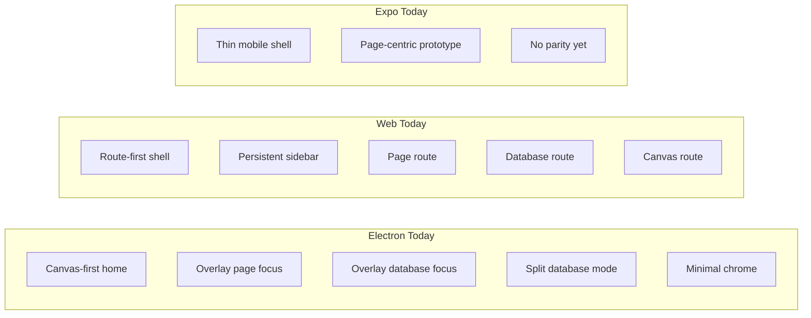

### 2. Pages, databases, and canvas are already separate canonical objects

The current architecture is already more promising than a monolithic document model:

- `PageSchema` in [`../../packages/data/src/schema/schemas/page.ts`](../../packages/data/src/schema/schemas/page.ts)
- `DatabaseSchema` in [`../../packages/data/src/schema/schemas/database.ts`](../../packages/data/src/schema/schemas/database.ts)
- `CanvasSchema` in [`../../packages/data/src/schema/schemas/canvas.ts`](../../packages/data/src/schema/schemas/canvas.ts)

And the canvas exploration already recommends treating canvas as a **scene graph of references and primitives** rather than stuffing all content into the canvas doc itself:

- [`./0108_[_]_CANVAS_V1_PAGES_DATABASES_AND_INFINITE_CANVAS_DEEP_DIVE.md`](./0108_[_]_CANVAS_V1_PAGES_DATABASES_AND_INFINITE_CANVAS_DEEP_DIVE.md)

That is a strong foundation for a unified workbench because it already separates:

- canonical content objects
- surface-specific spatial views

### 3. The plugin system is broader than the current shell

The plugin model already supports contributions for:

- views
- commands
- slash commands
- editor extensions
- sidebar items
- property handlers
- blocks
- settings
- schemas

Evidence:

- [`../../packages/plugins/src/contributions.ts`](../../packages/plugins/src/contributions.ts)
- [`../../packages/plugins/src/registry.ts`](../../packages/plugins/src/registry.ts)
- [`../../packages/plugins/src/context.ts`](../../packages/plugins/src/context.ts)
- [`./0006_[x]_PLUGIN_ARCHITECTURE.md`](./0006_[x]_PLUGIN_ARCHITECTURE.md)

This means xNet already has the shape of a workbench platform, but the host shell has not yet fully exposed those contribution regions.

### 4. Local API and MCP already exist, but are not first-class shell concepts yet

There is already real agent/tool infrastructure:

- Local API server:
  - [`../../apps/electron/src/main/local-api.ts`](../../apps/electron/src/main/local-api.ts)
  - [`../../packages/plugins/src/services/local-api.ts`](../../packages/plugins/src/services/local-api.ts)
- MCP server implementation:
  - [`../../packages/plugins/src/services/mcp-server.ts`](../../packages/plugins/src/services/mcp-server.ts)

The MCP server already defines tools/resources for querying, creating, updating, deleting, searching nodes, and listing schemas.

That is an unusually strong starting point for Codex/Claude-style integration.

### 5. Mobile parity is explicitly possible, but not by cloning Electron

The mobile parity exploration is clear:

- target **web-plus parity**, not Electron parity
- reuse shared substrate and selectively reuse DOM-heavy surfaces
- use Expo Router for universal navigation semantics
- use native shell + DOM components for some surfaces + native canvas later

Evidence:

- [`./0108_[_]_EXPO_APP_PARITY_WITH_ELECTRON_AND_WEB.md`](./0108_[_]_EXPO_APP_PARITY_WITH_ELECTRON_AND_WEB.md)
- Expo DOM components official docs: [Using React DOM in Expo native apps](https://docs.expo.dev/guides/dom-components/)
- Expo Router official docs: [Introduction to Expo Router](https://docs.expo.dev/router/introduction/)

So the right design target is:

- shared workbench model
- platform-specific renderers
- workflow parity, not identical chrome

### 6. Future plans are already too broad for a narrow app shell

Across the repo, xNet is already aiming at:

- decentralized/global search in [`./0023_[_]_DECENTRALIZED_SEARCH.md`](./0023_[_]_DECENTRALIZED_SEARCH.md)
- global namespace and federation in [`../VISION.md`](../VISION.md) and [`./0093_[_]_NODE_NATIVE_GLOBAL_SCHEMA_FEDERATION_MODEL.md`](./0093_[_]_NODE_NATIVE_GLOBAL_SCHEMA_FEDERATION_MODEL.md)
- ERP-style vertical apps in [`./0020_[_]_REGENERATIVE_FARMING_ERP.md`](./0020_[_]_REGENERATIVE_FARMING_ERP.md)
- chat and video in [`./0028_[_]_CHAT_AND_VIDEO.md`](./0028_[_]_CHAT_AND_VIDEO.md) and [`./0108_[_]_TIMING_FOR_INTEGRATING_CHAT_AND_VIDEO_INTO_XNET_NOW_VS_LATER.md`](./0108_[_]_TIMING_FOR_INTEGRATING_CHAT_AND_VIDEO_INTO_XNET_NOW_VS_LATER.md)
- AI agent friendliness in [`./0061_[_]_AI_AGENT_INTEGRATION.md`](./0061_[_]_AI_AGENT_INTEGRATION.md)
- public knowledge and Wikipedia-like publishing in [`./0110_[_]_XNET_AS_A_VIABLE_WIKIPEDIA_ALTERNATIVE.md`](./0110_[_]_XNET_AS_A_VIABLE_WIKIPEDIA_ALTERNATIVE.md)

These are not feature flags on a note app.

They imply a platform shell.

## Design Goals

The unified design should satisfy all of the following.

### Product goals

- feel like one app, not multiple disconnected products
- make pages, databases, and canvas feel like peer surfaces
- allow users to customize layout, navigation, and installed capabilities
- allow user-generated apps without requiring custom runtimes for each one
- let collaboration grow from comments -> chat -> meetings without shell fragmentation

### Platform goals

- preserve local-first primary editing
- keep canonical state in nodes and signed changes
- support plugin contributions cleanly
- support background services where appropriate
- support deep links and shareable routes/intents
- allow federation and public/published surfaces later

### Mobile goals

- maximize shared logic and shared semantics
- avoid pretending mobile can or should reproduce every Electron-only behavior
- keep route/deep-link semantics aligned with web

### Agent goals

- expose clean machine-readable context
- support MCP and Local API as first-class integration layers
- make every important action reachable through commands/tools, not DOM scraping

## Key Insight

The best mental model is:

**xNet is a graph-native workbench where apps are compositions and surfaces are projections.**

That means you must separate four things that are currently blended together in places.

### 1. Canonical Objects

Examples:

- page
- database
- database row
- canvas
- task
- comment
- message
- meeting
- source
- citation
- published revision
- plugin
- script
- schema definition
- sync policy

These should live as canonical nodes or system nodes.

### 2. Surfaces

Examples:

- rich text editor
- table view
- board view
- timeline view
- canvas workbench
- inbox/activity feed
- channel chat surface
- call/meeting surface
- public article renderer
- plugin manager
- settings surface
- agent workspace

Surfaces open canonical objects or collections of objects.

### 3. Shell / Workbench Layout

Examples:

- left nav rail
- primary sidebar
- center editor stack
- right inspector/activity sidebar
- bottom panel for chat/jobs/agents/output
- command palette and global search

This is where VS Code is a stronger reference than Notion.

### 4. Apps

Examples:

- project management pack
- ERP pack
- CRM pack
- personal wiki pack
- public knowledge/wiki pack
- coding assistant pack
- community/social pack

An app is not a separate silo. It is a bundle of:

- schemas
- views
- commands
- panels
- services
- prompts
- policies
- layout presets

## Canonical Model

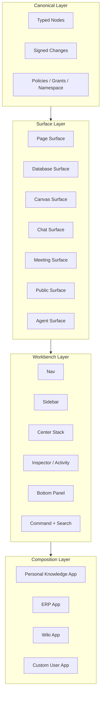

### Objects vs Surfaces vs Apps

| Layer   | What it is                                 | Examples                                                       |
| ------- | ------------------------------------------ | -------------------------------------------------------------- |
| Object  | canonical data/state                       | `Page`, `Database`, `Canvas`, `Channel`, `Meeting`, `Task`     |
| Surface | an openable UI over objects                | page editor, board view, canvas, chat, meeting, article viewer |
| App     | a composition of many objects and surfaces | ERP pack, wiki pack, CRM pack, dev assistant pack              |

This is the central architectural decision that lets all future plans fit into one host.

## Proposed Unified Workbench

### 1. Shared Workbench Primitives

Introduce a shared workbench model with first-class concepts like:

- `SurfaceDescriptor`
- `SurfaceInstance`
- `SurfaceIntent`
- `PanelDescriptor`
- `WorkbenchLayout`
- `WorkbenchPreset`
- `AppManifest`
- `SearchProvider`
- `ActivityProvider`
- `CommandProvider`

### Example model

```typescript
type SurfaceKind =
  | 'page'
  | 'database'
  | 'canvas'
  | 'chat'
  | 'meeting'
  | 'search'
  | 'settings'
  | 'plugin-manager'
  | 'public-article'
  | 'custom-view'
  | 'agent'

type SurfaceIntent = {
  kind: SurfaceKind
  targetId?: string
  viewType?: string
  mode?: 'focus' | 'split' | 'peek' | 'panel' | 'fullscreen'
  context?: Record<string, string>
}

type WorkbenchLayout = {
  nav: 'rail' | 'hidden' | 'drawer'
  leftSidebar: PanelDescriptor[]
  center: SurfaceIntent[]
  rightSidebar: PanelDescriptor[]
  bottomPanel: PanelDescriptor[]
}
```

The point is not the exact type names. The point is to make shell behavior explicit and shared.

### 2. Shell Zones

The unified xNet workbench should have a small, stable set of shell zones.

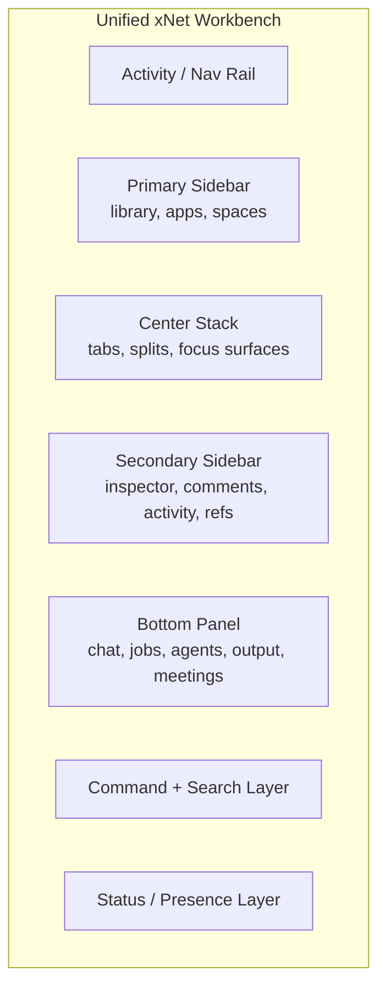

These zones should exist conceptually on every platform, even if rendered differently.

### Why this works

- pages/databases/canvas can open in the same center stack
- chat/agents/jobs can live in the bottom panel
- comments/backlinks/inspector can live in the right sidebar
- plugins/apps can contribute views and panels into known places
- mobile can collapse some zones into drawers, tabs, and sheets

### 3. Layout Presets Instead of One Fixed UI

One visual shell will not fit all xNet use cases.

The right answer is **preset layouts** over one shared workbench model.

### Recommended presets

| Preset         | Default emphasis                             | Good for                             |
| -------------- | -------------------------------------------- | ------------------------------------ |
| Canvas-first   | minimal chrome, spatial home                 | Electron default, creative planning  |
| Library-first  | persistent sidebar, routed documents         | Web default, everyday knowledge work |
| Operations     | dashboards, tables, bottom jobs panel        | ERP / CRM / project workflows        |
| Publishing     | editor + citations + review/activity panel   | wiki / docs / public knowledge       |
| Agent-assisted | page/database/canvas plus bottom agent panel | coding, research, automation         |

### Preset model

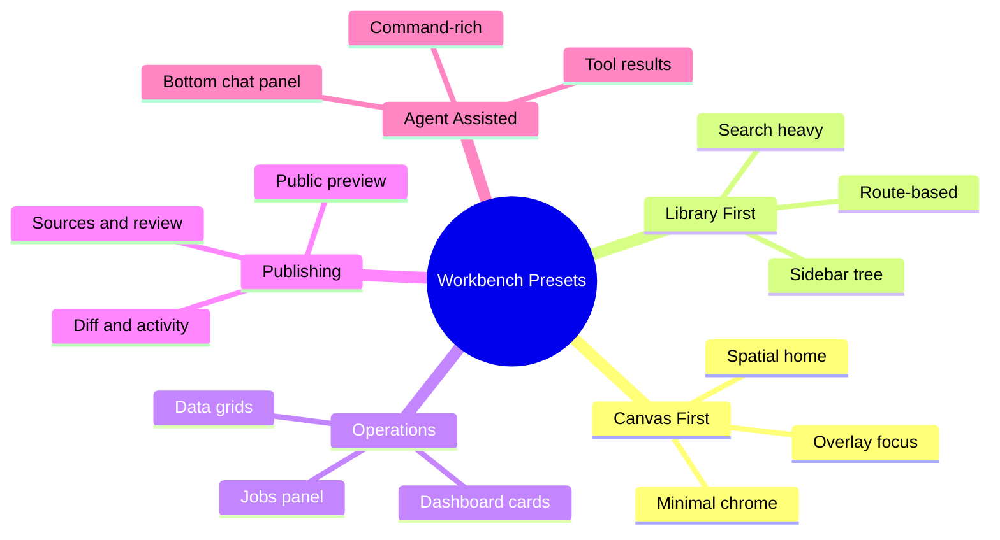

This preserves current strengths instead of forcing one product metaphor.

## How Existing Surfaces Fit

### 1. Pages

Pages remain the best general-purpose narrative surface.

In the unified design:

- `Page` stays the canonical object
- the page editor is one `SurfaceKind`
- a page can also be rendered as:
  - canvas card
  - linked preview
  - search result
  - public article
  - agent context resource

Pages should stop being treated as the "main app" and instead become one of the primary surface types.

### 2. Databases

Databases are not a separate app either.

They are:

- schema-aware collections
- composed of rows that are canonical nodes
- rendered through many views

The unified workbench should expose database views as first-class surface variants:

- table
- board
- list
- gallery
- timeline
- calendar
- custom plugin view

The current product under-exposes the full view registry. The workbench should promote that registry into the shell.

### 3. Canvas

Canvas should remain the strongest "home/workbench" candidate, but not as a silo.

The canvas exploration already proposes the right model:

- canvas as a scene graph of references and primitives
- page and database docs remain canonical owners of their own content
- canvas provides spatial placement and zoom-based projection

This is exactly the right workbench-home model because it allows:

- spatial organization of work
- launching and previewing objects
- cross-surface drag and drop
- live mixed-media views of the workspace

### Pages, databases, and canvas as peer surfaces

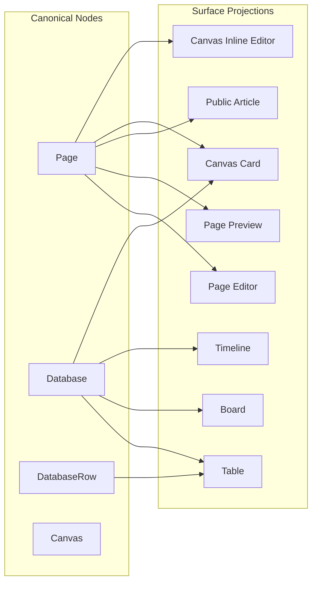

That is the core pattern xNet should reuse everywhere.

## User-Generated Apps

### The Right Model

User-generated apps should not require inventing separate app runtimes.

Instead, a user-generated app should be a **runtime composition** of:

- schema pack
- saved views
- shell contributions
- commands
- scripts/automations
- optional services
- optional prompts/agent tools
- optional policy/default permissions

This is the missing abstraction between today's plugin system and tomorrow's app platform.

### Proposed `AppManifest`

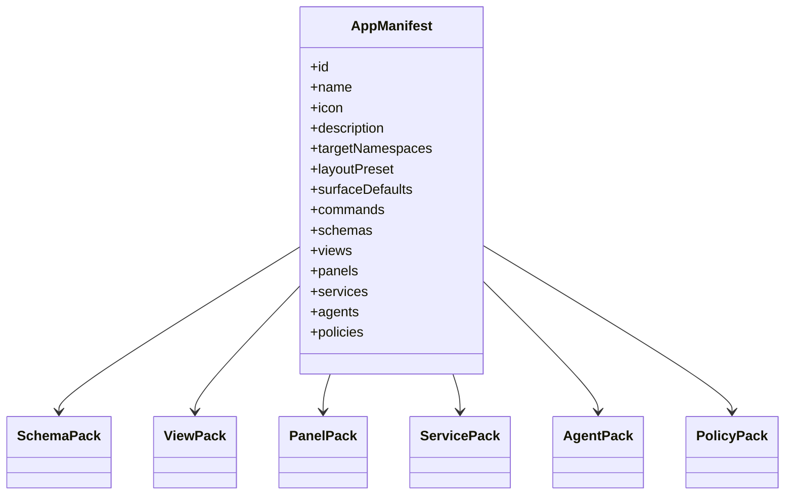

### What this enables

An "ERP app" becomes:

- schemas for customers, orders, inventory, invoices, work orders
- data views for operations
- dashboards and alerts
- bottom jobs panel for imports/sync
- agent tools for planning and reporting
- permissions and audit defaults

A "Wikipedia app" becomes:

- pages, sources, citations, published revisions, review nodes
- public article surface
- review and moderation panels
- publishing/search/index policies

A "Personal research app" becomes:

- page + database + canvas surfaces
- local search presets
- backlinks/activity panel
- agent research assistant panel

## Extensibility Model

The existing layered plugin architecture is already the right starting point:

- scripts
- extensions
- services
- integrations

The workbench should extend this with a fifth runtime-visible layer:

- **apps**

### Recommended stack

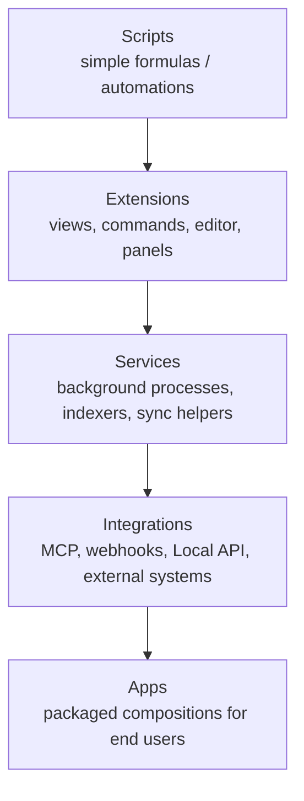

### Distribution vs runtime

One important refinement:

- **Plugin package** is the install artifact
- **App manifest** is the runtime composition visible to the workbench

That separation matters because a user may:

- install a plugin that contributes a new surface
- then assemble multiple plugins and schemas into one custom app

## Collaboration Fabric

The workbench should treat collaboration as a universal layer, not a per-surface feature.

Current strong substrate:

- comments and anchors
- presence
- awareness
- sharing/authz
- history/audit

These should feed a shared shell fabric:

- comments panel
- activity feed
- mentions/inbox
- presence roster
- notification center
- review queue

### Collaboration stack

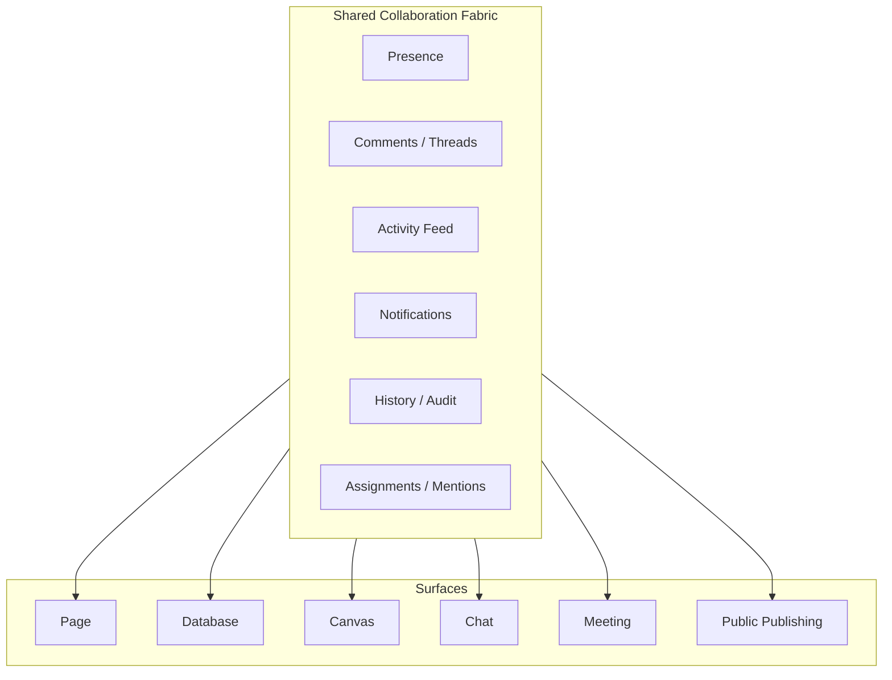

This pattern is already foreshadowed by the task exploration's recommendation that canonical objects have surface-specific projections.

## Chat and Video in the Unified Workbench

The chat/video explorations suggest the correct sequencing:

- chat should come before full video productization
- comments are the conceptual bridge
- meeting/video is a later media runtime problem, not just another Yjs provider

### Chat model

Chat should be another primary surface type, not a detached product.

Recommended model:

- `Channel` and `Message` as canonical nodes
- DMs, groups, channels, and comment threads share message primitives where possible
- chat opens in:
  - bottom panel
  - split surface
  - dedicated center surface when needed

### Meeting model

Video should be a `Meeting` surface associated with:

- a channel
- a page
- a canvas session
- a workspace room

Video runtime remains separate enough to justify service boundaries, likely hub/SFU-backed later as already explored.

### Chat/video shell placement

| Capability       | Best shell placement                 | Why                                    |
| ---------------- | ------------------------------------ | -------------------------------------- |
| Channel chat     | bottom panel or split                | conversation complements work surfaces |
| DM quick replies | right sidebar or bottom panel        | lightweight collaboration              |
| Meeting roster   | right sidebar                        | contextual participant state           |
| Full call view   | center surface or picture-in-picture | needs focus                            |
| Call controls    | status/bottom strip                  | persistent but compact                 |

The key point is: do not create a separate chat app unless the user chooses that layout.

## Search, Namespace, and Federation

These should be modeled as **shell services**, not isolated features.

### 1. Search as a workbench service

The search exploration already frames search as a multi-tier system:

- local
- workspace
- global

The workbench should expose search through a common interface with multiple providers:

- object search
- command search
- app/plugin search
- people/channel search
- public/federated result search
- agent tool search

### Unified search providers

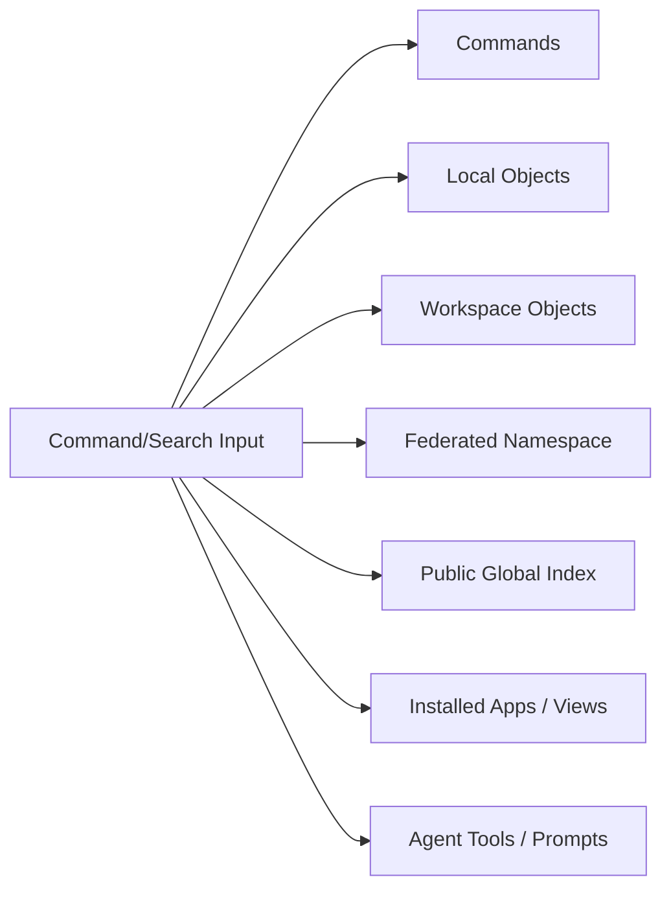

This lets search become the main entry point into the workbench, similar to command palettes and quick open in VS Code.

### 2. Namespace as the outer boundary of the workbench

The vision and federation explorations imply a future where workspaces are not just local folders or opaque cloud workspaces, but named namespaces with policy.

That suggests the workbench should always know:

- which namespace you are in
- what trust/policy applies
- which hubs and peers are relevant
- whether the surface is local, team, shared, or public

So future shell chrome should likely surface:

- active namespace
- sync state / trust state
- public/private scope
- hub/federation connectivity

### 3. Public knowledge and Wikipedia-style use cases

The Wikipedia exploration concluded that a publish lane must be distinct from live draft state.

In the unified workbench, that becomes easy to place:

- page editor in center surface
- sources/references/review in right sidebar
- activity/recent changes in bottom or side panel
- public preview as adjacent surface
- published search as a provider in command/search layer

This is another argument for a workbench shell: it can host both editing and publication views without splitting into separate products.

## ERP and Other Vertical Products

ERP is exactly the kind of future use case that breaks a narrow note-app shell.

ERP needs:

- schema-heavy collections
- dashboards
- jobs/imports/sync panels
- role-aware navigation
- agent assistance
- audit and compliance surfaces

That fits perfectly if xNet becomes a workbench platform.

### Future continuum

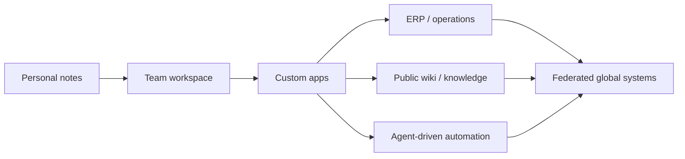

The shell should be designed to scale along that continuum.

## AI Agents and Codex-Style Integration

This is one of the strongest reasons to adopt a proper workbench architecture.

Agents work best when:

- the system has stable objects
- actions are exposed as commands/tools
- the context model is explicit
- the shell can show agent output, approvals, and results naturally

xNet already has promising pieces:

- Local API
- MCP server implementation
- plugin-based services
- strong AGENTS.md guidance
- prior exploration recommending llms.txt, MCP, and AI-specific docs

### The right agent model

xNet should play **three roles** at once.

1. **MCP server** for external agents like Codex, Claude, ChatGPT
2. **MCP host/client** inside the app for connecting to external tools and services
3. **Agent workbench** for in-app assistants, workflows, and reviews

### Recommended agent architecture

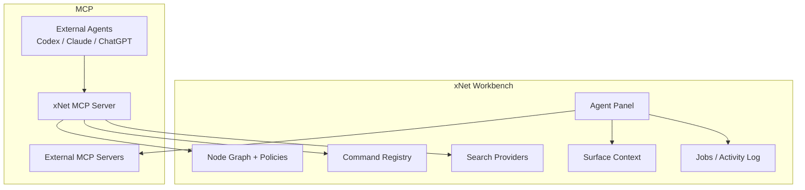

### What makes xNet especially agent-friendly

- typed schemas
- canonical IDs
- structured commands
- searchable nodes
- local-first access
- stable surface intents
- possibility of permissions and approval workflows

### What needs to improve

- bootstrap MCP in the real app shell, not just as a package capability
- unify commands/search/resources under a stable workbench contract
- add prompt and instruction bundles per app or workspace
- add explicit approval gates for agent actions
- add per-namespace policy around what agents can see or modify

### Specific Codex-friendly recommendations

For agents like Codex, xNet should make the following easy:

- discover schemas and views
- query nodes and search content
- execute commands by stable IDs
- open surfaces by stable intents
- inspect current selection/context
- read app manifests and policy defaults
- stream activity/events for long-running jobs
- create or update nodes without UI automation

In other words: Codex should talk to xNet as a platform, not as a web page.

## Platform-Specific Rendering Strategy

The workbench model should be shared, but rendered differently per platform.

### Electron

Keep Electron's advantages:

- canvas-first home possible
- services and processes
- Local API
- full plugin surface
- desktop-heavy workflows

But back it with the shared workbench model so it is not a special-case shell forever.

### Web

Keep web's advantages:

- route/deep-link structure
- SEO for public routes
- straightforward sidebar shell
- installability/PWA

But let web render the same surfaces, panels, and app manifests as Electron where feasible.

### Mobile

Do not chase desktop visual parity.

Chase:

- object parity
- workflow parity
- deep-link parity
- command/search parity
- collaboration parity where practical

### Shared vs platform-specific strategy

| Area                        | Share heavily      | Platform-specific adaptation |
| --------------------------- | ------------------ | ---------------------------- |
| data model                  | yes                | no                           |
| sync/authz/search providers | yes                | minimal                      |
| workbench layout model      | yes                | rendered differently         |
| commands and app manifests  | yes                | minimal                      |
| page/database surface logic | mostly yes         | DOM/native adapters          |
| canvas renderer             | headless logic yes | renderer yes                 |
| plugin capabilities         | partial            | mobile-safe subset           |
| services/processes          | no                 | Electron-first               |

### Mobile rendering model

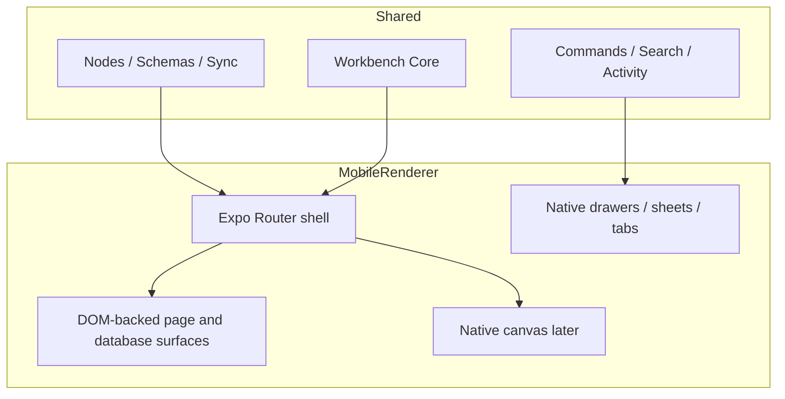

This aligns with the existing Expo parity exploration and official Expo guidance.

## Recommended Package / Boundary Evolution

The smallest clean evolution is something like:

- `@xnetjs/workbench-core`
  - surface descriptors
  - layout model
  - commands/search/activity contracts
  - app manifest types
  - navigation intents
- `@xnetjs/workbench-react`
  - React hooks/components for the shared workbench
- `@xnetjs/surfaces-page`
- `@xnetjs/surfaces-database`
- `@xnetjs/surfaces-canvas`
- `@xnetjs/surfaces-chat`
- `@xnetjs/surfaces-meeting`
- `@xnetjs/agents` or a workbench-agent module

Existing packages stay important:

- `@xnetjs/react`
- `@xnetjs/data`
- `@xnetjs/plugins`
- `@xnetjs/views`
- `@xnetjs/query`
- `@xnetjs/network`
- `@xnetjs/hub`

The point is not to explode package count. The point is to introduce one clear layer where the host shell lives.

## Risks and Failure Modes

### 1. Trying to invent the perfect shell before migrating existing surfaces

Avoid building a theoretical shell framework with no immediate adoption.

### 2. Treating every future feature as a new top-level product area

That will fragment navigation and extension points.

### 3. Making the workbench too desktop-specific

That would hurt web/mobile reuse and route semantics.

### 4. Making plugins too weak to express real apps

Then "user-generated apps" will remain aspirational.

### 5. Making agent integration a bolt-on chat box

Agents need first-class commands, resources, policies, and activity surfaces.

### 6. Forcing one shell metaphor across every platform

The shared thing should be the model, not the exact chrome.

## Recommended Phased Plan

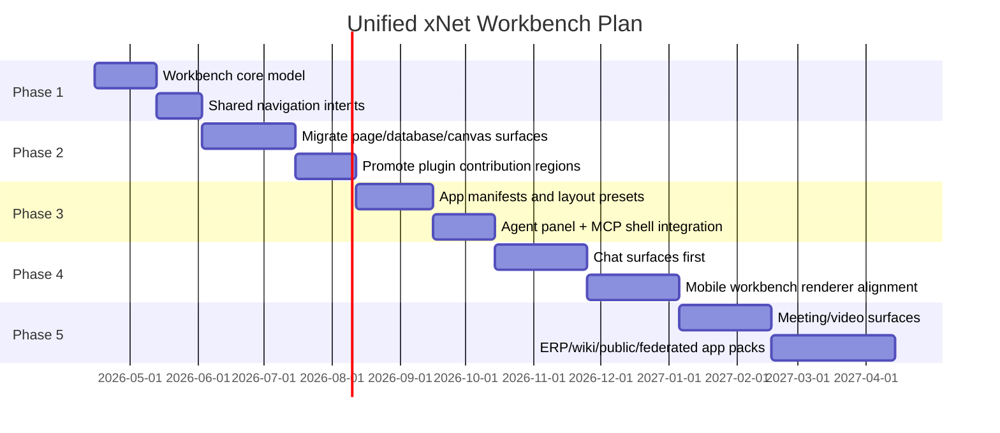

### Phase 1: Workbench Core

Goal:

- define shared surface and layout abstractions
- define navigation intents independent of routes/state
- define shell regions and panel contracts

### Phase 2: Migrate Existing Surfaces

Goal:

- make page/database/canvas first-class registered surfaces
- route Electron and web through the same surface-opening logic
- expose underused plugin/view contributions in the shell

### Phase 3: App and Agent Layer

Goal:

- introduce app manifests
- add customizable presets and workbench composition
- make Local API and MCP first-class shell services

### Phase 4: Collaboration and Mobile

Goal:

- add chat as a workbench surface
- move Expo toward the shared model with web-plus parity

### Phase 5: Media and Future Verticals

Goal:

- add meeting/video surfaces
- prove ERP pack, public wiki pack, and federated/public search integration

## Implementation Checklists

### Workbench Core Checklist

- [ ] Define `SurfaceKind`, `SurfaceIntent`, and `SurfaceDescriptor`
- [ ] Define `WorkbenchLayout` and layout persistence model
- [ ] Define shell zones and panel contracts
- [ ] Define `openSurface()` and `openPanel()` shared APIs
- [ ] Define route/state adapters for web, Electron, and mobile
- [ ] Add saved layout presets and per-workspace defaults

### Existing Surface Migration Checklist

- [ ] Register page surface in the shared surface registry
- [ ] Register database surface and view variants in the shared surface registry
- [ ] Register canvas as a primary home/workbench surface
- [ ] Move current search/backlinks into shared shell/provider contracts
- [ ] Move comments/activity/inspector affordances into shared panel contracts
- [ ] Remove shell-specific duplicated open/focus logic where possible

### Plugin and App Platform Checklist

- [ ] Introduce `AppManifest` runtime model
- [ ] Define how plugin packages contribute app manifests or app fragments
- [ ] Expose nav, panel, and center-surface contribution points explicitly
- [ ] Expose dynamic view registry in the product shell, not just packages
- [ ] Support user-created app compositions in the UI
- [ ] Define trust/capability model for installed apps and services

### Collaboration Checklist

- [ ] Define unified activity/inbox model across comments, mentions, tasks, chat, and reviews
- [ ] Add shell-level presence roster and collaboration indicators
- [ ] Define `Channel` and `Message` surfaces over canonical nodes
- [ ] Define workbench placement rules for chat and meeting surfaces
- [ ] Reuse existing comment/message primitives where appropriate

### Agent Integration Checklist

- [ ] Promote Local API into a documented, stable shell service
- [ ] Bootstrap MCP server in real app flows, not just as a package capability
- [ ] Expose nodes, schemas, commands, views, and search as MCP tools/resources/prompts
- [ ] Add agent panel / bottom workbench surface
- [ ] Add approval/audit flow for agent actions
- [ ] Add per-namespace or per-app agent permissions
- [ ] Add prompt/instruction bundles for apps and workspaces

### Mobile Checklist

- [ ] Move Expo toward shared route and workbench intent semantics
- [ ] Adopt Expo Router for route/deep-link parity
- [ ] Share workbench-core and provider configuration on mobile
- [ ] Use DOM-backed page/database surfaces where practical
- [ ] Keep native shell/navigation and sheets for platform fit
- [ ] Extract headless canvas logic for a later native canvas renderer
- [ ] Define mobile-safe plugin capability matrix explicitly

### Future Vertical Checklist

- [ ] Define how ERP packs declare schemas, jobs, dashboards, and audit requirements
- [ ] Define how wiki/public knowledge packs declare publish/review/search surfaces
- [ ] Define search providers for local/workspace/federated/global tiers
- [ ] Define namespace/trust indicators in shell chrome
- [ ] Define public-facing surfaces as peers to private editing surfaces

## Validation Checklists

### Shell Validation Checklist

- [ ] A page, database, canvas, chat channel, and settings screen can all open through the same `openSurface()` path
- [ ] Web and Electron can represent the same surface intent without divergent business logic
- [ ] Users can switch between at least two layout presets without breaking state
- [ ] Comments/activity/inspector panels are reusable across multiple surface types

### Plugin/App Validation Checklist

- [ ] A plugin can contribute a command, a panel, and a custom view without app-specific hacks
- [ ] A user can install a plugin and see its contribution regions appear in the workbench naturally
- [ ] A user-generated app can be assembled from existing schemas/views/commands/layouts
- [ ] Plugin capabilities degrade cleanly across web, Electron, and mobile

### Collaboration Validation Checklist

- [ ] Presence and comments remain consistent across page, database, and canvas surfaces
- [ ] Chat can open as a panel or full surface without data model duplication
- [ ] Meeting state can be attached to a channel, page, canvas, or workspace room
- [ ] Notifications and inbox/activity are unified rather than feature-specific

### Agent Validation Checklist

- [ ] Codex/Claude-style external agents can query nodes and execute commands through MCP or Local API
- [ ] Agent actions are logged and attributable
- [ ] Important workbench state can be read through APIs instead of brittle UI automation
- [ ] Workspaces/apps can add prompt bundles or tools without forked integration paths

### Mobile Validation Checklist

- [ ] Shared objects and surface intents work on web and mobile with the same semantics
- [ ] Deep links map to the same object/surface across web and mobile
- [ ] Mobile supports high-value workflows for pages, databases, search, sharing, and activity
- [ ] Mobile avoids desktop-only shell assumptions while preserving workflow parity

### Future-Scale Validation Checklist

- [ ] An ERP-style app pack can coexist with notes/pages/canvas in one workspace
- [ ] A public knowledge/wiki pack can coexist with editing/review/public preview surfaces in one workbench
- [ ] Search can merge local/workspace/federated/global providers without shell redesign
- [ ] Namespace and policy signals remain understandable as federation becomes more real

## Recommended Immediate Actions

1. **Create a workbench architecture brief and type skeleton now.**
   Do this before chat/video or app-pack work starts, so future surfaces land on a shared host model.

2. **Promote pages, databases, and canvas into a shared surface registry.**
   This is the smallest real migration that proves the model.

3. **Unify navigation around intents, not implementation details.**
   Web routes, Electron shell state, and mobile routes should all be adapters over the same conceptual API.

4. **Introduce app manifests as the bridge between plugins and end-user app building.**
   This unlocks ERP packs, wiki packs, and custom verticals without inventing separate products.

5. **Make MCP and Local API first-class product surfaces.**
   xNet is already unusually well-positioned for Codex/Claude integration; the shell should lean into that.

6. **Keep mobile on a shared semantic path, not a pixel-perfect parity path.**
   Object parity and workflow parity matter more than desktop chrome parity.

## Final Recommendation

If xNet wants to support:

- pages
- databases
- canvas
- chat
- video
- plugins
- user-generated apps
- ERP-style verticals
- federated search and namespace
- Wikipedia-style publishing
- Codex-style agents

then the right answer is not to keep adding top-level product modes.

The right answer is:

**build xNet as a unified customizable workbench where all of those are peer surfaces and app compositions over one node-native platform.**

That architecture fits the repo better than a monolithic doc model, better than a pile of route silos, and better than a separate app for every future use case.

It also makes xNet's biggest strengths compound together:

- local-first state
- schemas and typed nodes
- canvas as workbench home
- plugin contributions
- agent APIs
- eventual namespace/federation/public publishing

If this is done well, xNet will stop feeling like "notes + databases + canvas" and start feeling like a **programmable local-first operating environment for personal, team, and public knowledge work**.

## Key Sources

### xNet Repo

- [`../ROADMAP.md`](../ROADMAP.md)
- [`../VISION.md`](../VISION.md)
- [`../../apps/electron/src/renderer/App.tsx`](../../apps/electron/src/renderer/App.tsx)
- [`../../apps/web/src/routes/__root.tsx`](../../apps/web/src/routes/__root.tsx)
- [`../../packages/plugins/src/contributions.ts`](../../packages/plugins/src/contributions.ts)
- [`../../packages/plugins/src/types.ts`](../../packages/plugins/src/types.ts)
- [`../../packages/plugins/src/services/mcp-server.ts`](../../packages/plugins/src/services/mcp-server.ts)
- [`../../packages/plugins/src/services/local-api.ts`](../../packages/plugins/src/services/local-api.ts)
- [`./0006_[x]_PLUGIN_ARCHITECTURE.md`](./0006_[x]_PLUGIN_ARCHITECTURE.md)
- [`./0047_[_]_PLUGIN_MARKETPLACE.md`](./0047_[_]_PLUGIN_MARKETPLACE.md)
- [`./0028_[_]_CHAT_AND_VIDEO.md`](./0028_[_]_CHAT_AND_VIDEO.md)
- [`./0108_[_]_TIMING_FOR_INTEGRATING_CHAT_AND_VIDEO_INTO_XNET_NOW_VS_LATER.md`](./0108_[_]_TIMING_FOR_INTEGRATING_CHAT_AND_VIDEO_INTO_XNET_NOW_VS_LATER.md)
- [`./0108_[_]_EXPO_APP_PARITY_WITH_ELECTRON_AND_WEB.md`](./0108_[_]_EXPO_APP_PARITY_WITH_ELECTRON_AND_WEB.md)
- [`./0108_[_]_CANVAS_V1_PAGES_DATABASES_AND_INFINITE_CANVAS_DEEP_DIVE.md`](./0108_[_]_CANVAS_V1_PAGES_DATABASES_AND_INFINITE_CANVAS_DEEP_DIVE.md)
- [`./0103_[-]_TASKS_EMBEDDED_IN_PAGES_BACKED_BY_NODES_MENTIONS_DUE_DATES_NESTED_SUBTASKS_DATABASES_CANVASES_AND_CROSS_SURFACE_TASK_MODEL.md`](./0103_[-]_TASKS_EMBEDDED_IN_PAGES_BACKED_BY_NODES_MENTIONS_DUE_DATES_NESTED_SUBTASKS_DATABASES_CANVASES_AND_CROSS_SURFACE_TASK_MODEL.md)
- [`./0061_[_]_AI_AGENT_INTEGRATION.md`](./0061_[_]_AI_AGENT_INTEGRATION.md)
- [`./0020_[_]_REGENERATIVE_FARMING_ERP.md`](./0020_[_]_REGENERATIVE_FARMING_ERP.md)
- [`./0023_[_]_DECENTRALIZED_SEARCH.md`](./0023_[_]_DECENTRALIZED_SEARCH.md)
- [`./0093_[_]_NODE_NATIVE_GLOBAL_SCHEMA_FEDERATION_MODEL.md`](./0093_[_]_NODE_NATIVE_GLOBAL_SCHEMA_FEDERATION_MODEL.md)
- [`./0110_[_]_XNET_AS_A_VIABLE_WIKIPEDIA_ALTERNATIVE.md`](./0110_[_]_XNET_AS_A_VIABLE_WIKIPEDIA_ALTERNATIVE.md)

### External Research

- [VS Code: Extension Host](https://code.visualstudio.com/api/advanced-topics/extension-host)
- [VS Code: Extending Workbench](https://code.visualstudio.com/api/extension-capabilities/extending-workbench)
- [VS Code: UX Guidelines](https://code.visualstudio.com/api/ux-guidelines/overview)
- [VS Code: Contribution Points](https://code.visualstudio.com/api/references/contribution-points)
- [Model Context Protocol: Introduction](https://modelcontextprotocol.io/introduction)
- [Model Context Protocol: Architecture Overview](https://modelcontextprotocol.io/docs/learn/architecture)
- [Expo: Using React DOM in Expo native apps](https://docs.expo.dev/guides/dom-components/)
- [Expo Router: Introduction](https://docs.expo.dev/router/introduction/)
- [AFFiNE homepage](https://affine.pro/)
