# 0112 - Universal Clipper and AI Knowledge Graph Ingestion

> **Status:** Exploration  
> **Date:** 2026-04-05  
> **Author:** OpenCode  
> **Tags:** clipper, ingestion, knowledge-graph, RAG, agents, browser-extension, search, vectors, federation

## Problem Statement

The goal is not just to build a browser extension that saves links.

The goal is to build a **universal clipper** that can take:

- any URL
- any image or screenshot
- any file or document
- selections, snippets, and media

and turn them into a **usable knowledge graph in xNet**.

That graph should be useful in two different but connected ways:

1. **For humans**
   - intuitive lookup
   - sane organization
   - trustworthy provenance
   - useful collections, views, and navigation

2. **For AI systems**
   - structured retrieval
   - chunking and embeddings
   - explicit relations and provenance
   - hybrid graph + vector + keyword querying
   - useful RAG-style context packs

It should ideally integrate with the user's existing AI agent environment, especially tools like **Claude Code** or **Codex-style agents**, rather than forcing xNet to invent a closed assistant stack from scratch.

And it should scale through clear stages:

- local and personal
- synced personal workspace
- team or company knowledge graph
- community or inter-org graph
- public or globally interconnected opt-in graph

The central design challenge is this:

> How do you build one ingestion and indexing model that is understandable to both humans and machines, while staying local-first and allowing future federation?

## Exploration Status

- [x] Confirm next exploration number and related prior docs
- [x] Review xNet codebase for blob, source, ingestion, search, vector, plugin, Local API, and MCP primitives
- [x] Review prior xNet explorations for canvas ingestion, AI agents, workbench, search, federation, and public knowledge
- [x] Review external references for clipping UX, browser integration, share targets, and agent-facing MCP models
- [x] Propose a universal clipper architecture grounded in current xNet capabilities
- [x] Include recommendations, implementation steps, and validation checklists

## Executive Summary

The right move is:

**build the clipper as a general ingestion platform over xNet's node graph, not as a feature bolt-on to pages or canvas.**

The best architecture is a **dual-spine graph**:

- a **human spine** optimized for organization, navigation, provenance, collections, and surfaces
- a **machine spine** optimized for chunks, embeddings, entities, claims, and retrieval

Both spines should point back to the same canonical captured source objects.

### Main recommendation

Use existing xNet primitives as the substrate:

- `ExternalReferenceSchema` for normalized URLs
- `MediaAssetSchema` for files and images
- `BlobService` for content-addressed binary storage
- Local API and MCP for agent/tool access
- vector and hybrid search packages for machine retrieval

Then add a dedicated clipper layer with:

- `Capture` nodes
- `SourceDocument` or `ContentSnapshot` nodes
- extraction jobs
- chunk/entity/claim derivation
- hybrid retrieval and answer-pack generation
- browser/share/OS integration surfaces

### Most important product recommendation

Do **not** let AI agents write directly into the canonical graph from arbitrary web content without controls.

Instead, use a staged pipeline:

1. capture raw source
2. normalize and fingerprint it
3. run deterministic parsing first
4. run agent enrichment into a **staging area**
5. validate or auto-accept low-risk fields
6. promote into canonical graph and indexes

This is especially important because clipped content is prompt-injection prone, noisy, duplicated, and often semantically ambiguous.

### Near-term best fit for existing agents

The clearest near-term fit is:

- **browser extension or share target** sends capture payload to local xNet
- **xNet Local API / MCP server** exposes pending captures and graph write tools
- **Claude Code or another MCP-capable agent** performs enrichment using a constrained tool set
- xNet stores raw source, staged outputs, and promoted graph objects

Claude Code is the cleanest explicit fit today because Anthropic documents first-class MCP support for local, project-scoped, and remote servers. The same architectural boundary should be designed so other agents, including Codex-style tools, can integrate through MCP or a local HTTP tool surface rather than bespoke UI automation.

## What the Product Actually Is

This should not be thought of as "web clipper."

It is better thought of as:

**a memory acquisition and indexing system for xNet.**

That system should support:

- capture
- normalization
- enrichment
- graph linking
- indexing
- retrieval
- review
- publication/sharing/federation later

## Prior Art and External Signals

Several external tools point to the right parts of the problem.

### What others get right

| Product / Source           | Relevant lesson                                                                                           |
| -------------------------- | --------------------------------------------------------------------------------------------------------- |
| Notion Web Clipper         | destination selection matters; mobile share sheet matters; URL metadata should land directly in databases |
| Zotero Connector           | metadata-rich clipping and canonical source identity matter more than raw saving                          |
| Readwise Reader            | users want many source types in one place, plus highlighting, search, and export/API flows                |
| Chrome extension APIs      | right-click on page/link/image/selection is a practical capture surface                                   |
| web.dev PWA OS integration | share targets, URL handling, and file handling are important for universal capture                        |
| Claude Code MCP docs       | existing agents can connect to local or project-scoped tools if you expose the right MCP/HTTP boundaries  |

### Notion: clipping as destination-aware capture

According to Notion's Web Clipper help page:

- desktop clipper is a browser extension
- mobile clipping uses the native share sheet
- clipped items can go directly into a workspace, page, or database
- clipping to a database automatically records the source URL property
- local files/images on phone can also be clipped through the share flow

This is a strong reminder that clipping is not only about capture fidelity. It is also about **where the object lands in the user's mental model**.

### Zotero: rich metadata and local library model

Zotero's connector emphasizes:

- one-click saving
- metadata-rich source capture
- bibliographic file importing
- local library first, optional online sync

That is highly relevant because xNet should not reduce all source capture to generic link cards. It should preserve strong provenance and structured metadata where available.

### Readwise Reader: multimodal reading and unified retrieval

Readwise Reader's product framing is useful because it treats:

- web articles
- PDFs
- YouTube
- RSS
- threads
- newsletters
- ebooks

as one unified input stream, then layers highlighting, search, and API export on top.

This is close to the right xNet ambition, except xNet can go further by making the captured material part of a **general graph**, not only a reading app.

### Browser and OS integration

External browser/PWA docs strongly suggest a multi-entrypoint strategy:

- Chrome `contextMenus` can target page, selection, link, image, video, and audio contexts
- Web Share can send text, URLs, and files
- Web Share Target can let an installed PWA receive shared data on Android/ChromeOS
- PWA OS integration can support file handling and URL handling patterns on some platforms

This means a universal clipper should not have only one browser-toolbar button. It should support several capture paths.

### Existing agents and MCP

Anthropic's Claude Code docs show:

- local stdio MCP servers
- remote HTTP/SSE MCP servers
- project-scoped `.mcp.json` configuration
- dynamic tool/resource discovery
- MCP resource references and prompt commands
- using Claude Code itself as an MCP server

That is a very strong fit for xNet because xNet already has Local API and MCP work underway.

## What xNet Already Has

### 1. Blob and file substrate

xNet already has a strong binary storage substrate:

- `BlobService` supports upload, programmatic `uploadData`, retrieval, blob URLs, and missing-chunk checks in [`../../packages/data/src/blob/blob-service.ts`](../../packages/data/src/blob/blob-service.ts)
- `file` property type stores content-addressed file references with `cid`, `name`, `mimeType`, and `size` in [`../../packages/data/src/schema/properties/file.ts`](../../packages/data/src/schema/properties/file.ts)
- `MediaAssetSchema` already models reusable assets with `title`, `file`, `kind`, `alt`, `width`, and `height` in [`../../packages/data/src/schema/schemas/media-asset.ts`](../../packages/data/src/schema/schemas/media-asset.ts)

That means xNet does **not** need a new blob system to build the clipper.

### 2. Canonical URL normalization substrate

xNet also already has a strong seed of a canonical source model:

- `ExternalReferenceSchema` stores normalized URL metadata in [`../../packages/data/src/schema/schemas/external-reference.ts`](../../packages/data/src/schema/schemas/external-reference.ts)
- shared external reference parsing and canonicalization lives in [`../../packages/data/src/external-references.ts`](../../packages/data/src/external-references.ts)

Current provider coverage already includes:

- GitHub
- Figma
- YouTube
- Loom
- Vimeo
- CodeSandbox
- Spotify
- Twitter/X
- Instagram
- TikTok
- generic links

This is useful because the clipper can build on a real canonicalization layer instead of raw pasted URLs.

### 3. An ingestion precedent already exists in canvas

This is one of the strongest signals in the repo.

The canvas layer already contains a proper ingestion path for:

- internal node drags
- URLs
- files
- text

Evidence:

- [`../../packages/canvas/src/hooks/useCanvasObjectIngestion.ts`](../../packages/canvas/src/hooks/useCanvasObjectIngestion.ts)
- related exploration recommendation for a single ingestion pipeline in [`./0108_[_]_CANVAS_V1_PAGES_DATABASES_AND_INFINITE_CANVAS_DEEP_DIVE.md`](./0108_[_]_CANVAS_V1_PAGES_DATABASES_AND_INFINITE_CANVAS_DEEP_DIVE.md)

This matters because xNet already knows the right architectural lesson:

**ingestion should be a core layer, not scattered event handling.**

### 4. Search and vector substrate exists

xNet has the pieces for machine retrieval, though not yet a fully integrated product path:

- page text/backlink extraction in [`../../packages/query/src/search/document.ts`](../../packages/query/src/search/document.ts)
- web page search/backlinks in [`../../apps/web/src/hooks/usePageSearchSurface.ts`](../../apps/web/src/hooks/usePageSearchSurface.ts)
- `SemanticSearch` for chunking, embedding, and vector indexing in [`../../packages/vectors/src/search.ts`](../../packages/vectors/src/search.ts)
- `HybridSearch` for vector + keyword fusion in [`../../packages/vectors/src/hybrid.ts`](../../packages/vectors/src/hybrid.ts)
- package overview in [`../../packages/vectors/README.md`](../../packages/vectors/README.md)

So xNet already has promising RAG-style building blocks.

### 5. Agent and tool substrate exists

xNet already has:

- Local HTTP API server in [`../../packages/plugins/src/services/local-api.ts`](../../packages/plugins/src/services/local-api.ts)
- MCP server implementation in [`../../packages/plugins/src/services/mcp-server.ts`](../../packages/plugins/src/services/mcp-server.ts)
- related strategic framing in [`./0061_[_]_AI_AGENT_INTEGRATION.md`](./0061_[_]_AI_AGENT_INTEGRATION.md)

That makes the "use your existing agent" goal much more realistic than it would be in a typical note app.

### 6. Namespace and federation direction already exists

xNet's broader vision already includes:

- global namespace
- local-first data ownership
- federation
- distributed search

Evidence:

- [`../VISION.md`](../VISION.md)
- [`./0023_[_]_DECENTRALIZED_SEARCH.md`](./0023_[_]_DECENTRALIZED_SEARCH.md)
- [`./0093_[_]_NODE_NATIVE_GLOBAL_SCHEMA_FEDERATION_MODEL.md`](./0093_[_]_NODE_NATIVE_GLOBAL_SCHEMA_FEDERATION_MODEL.md)

That means the clipper can be designed from day one with a realistic local -> org -> global progression.

## What xNet Does Not Yet Have

| Dimension                            | Current state | Why it is not enough yet                                                                           |
| ------------------------------------ | ------------- | -------------------------------------------------------------------------------------------------- |
| Canonical clipper object model       | partial       | URLs and assets exist, but no unified capture/source/snapshot/chunk graph                          |
| Browser entrypoint                   | missing       | no browser extension or share-target implementation is present                                     |
| General import orchestration         | partial       | ingestion is strongest in canvas, not yet a product-wide service                                   |
| Metadata fetch/extraction pipeline   | missing       | no generalized article/PDF/transcript/OCR/preview resolution pipeline                              |
| Graph-wide indexing                  | missing       | current search is page-centric and partly app-local                                                |
| Production-integrated vectors        | partial       | vectors package exists, but is not wired into Local API/MCP or product retrieval                   |
| Agent-safe ingestion workflow        | missing       | no staged review flow for prompt-injection-prone capture content                                   |
| Scale-tier policy model for clipping | partial       | namespace/federation direction exists, but clipper-specific publication/visibility policy does not |

## Main Design Insight

The universal clipper should be designed around a **dual-spine graph**.

### The human spine

This is how people want to navigate and manage captured material.

It should optimize for:

- source cards
- collections and projects
- dates and timelines
- people and ownership
- readable pages and notes
- backlinks and references
- inbox and triage
- confidence and provenance

### The machine spine

This is how AI systems want to retrieve and reason over captured material.

It should optimize for:

- normalized source identity
- text snapshots
- chunks
- embeddings
- entities
- claims
- relations
- permissions and scope filters
- provenance chains

### Dual-spine model

```mermaid
flowchart LR
    subgraph HumanSpine[Human Spine]
        H1[Capture Inbox]
        H2[Collections / Projects]
        H3[Pages / Notes]
        H4[Timeline / Recent]
        H5[Backlinks / Sources]
    end

    subgraph Canonical[Canonical Source Layer]
        C1[Capture]
        C2[ExternalReference]
        C3[MediaAsset]
        C4[ContentSnapshot]
    end

    subgraph MachineSpine[Machine Spine]
        M1[Chunks]
        M2[Embeddings]
        M3[Entities]
        M4[Claims]
        M5[Relations]
    end

    HumanSpine --> Canonical --> MachineSpine
```

The key point is:

**there is one canonical source layer, and both humans and AI build on top of it differently.**

This avoids the two bad extremes:

- a human-only archive with no machine retrieval structure
- a machine-only vector store that feels opaque and unusable to people

## Recommended Canonical Model

The pragmatic approach is to **reuse existing `ExternalReference` and `MediaAsset`** as the lowest-level identity objects, then add clipper-specific graph nodes around them.

### Recommended new canonical node types

| Node              | Purpose                                                                                  |
| ----------------- | ---------------------------------------------------------------------------------------- |
| `Capture`         | the user action of clipping/importing something                                          |
| `ContentSnapshot` | fetched or extracted content version: HTML, cleaned text, OCR text, transcript, PDF text |
| `DocumentChunk`   | retrievable chunk linked to a snapshot                                                   |
| `Entity`          | normalized people/org/topic/product/document concepts                                    |
| `Claim`           | extracted proposition with provenance and confidence                                     |
| `Collection`      | human-facing grouping construct: project, topic, reading list, case file                 |
| `IngestionJob`    | pipeline state and retry/error tracking                                                  |
| `ExtractionRun`   | a particular deterministic or AI extraction attempt                                      |

### Recommended reuse of current schemas

- keep `ExternalReference` for URL-backed identity
- keep `MediaAsset` for file/image/blob-backed identity
- keep pages/databases/canvas as destination surfaces and organization contexts

### Why not store embeddings directly on nodes?

Embeddings should probably **not** be the primary node payload, because:

- they are large
- they are model-dependent
- they change with re-indexing
- they are more like an index than a canonical source fact

The better pattern is:

- canonical chunk IDs in nodes
- vector index stored in a specialized local/hub index keyed by chunk ID

## Proposed Data Model

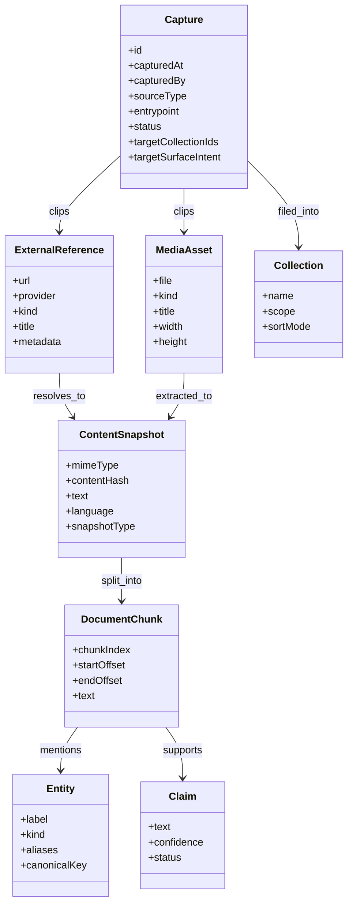

## Ingestion Pipeline

The ingestion pipeline should have **three layers**.

### 1. Deterministic normalization

Always run first.

Examples:

- URL canonicalization
- MIME detection
- file fingerprinting
- known provider parsing
- image dimension reading
- transcript extraction if provider has one
- duplicate detection by normalized URL or content hash

### 2. Deterministic extraction

Still non-AI where possible.

Examples:

- article text extraction
- PDF text extraction
- EXIF / file metadata extraction
- HTML title/author/date extraction
- selection anchoring
- OCR if local OCR is configured

### 3. AI enrichment

Only after raw content and provenance are safely stored.

Examples:

- summary generation
- collection suggestions
- entity extraction
- claim extraction
- topic labeling
- schema mapping into org-specific databases
- question-answer pack generation

### Pipeline model

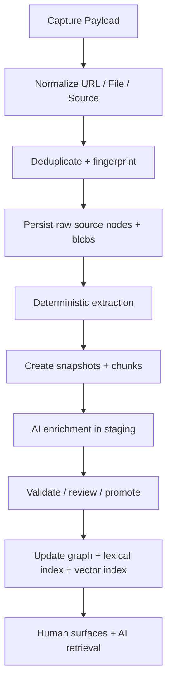

### Important rule

**Raw source capture must succeed even if AI enrichment fails.**

That way the clipper is always useful and AI becomes an accelerator, not a hard dependency.

## Capture Entry Points

The clipper should have multiple entry points, all feeding the same canonical pipeline.

### 1. Browser extension

Best for desktop-heavy use.

Should support:

- toolbar button
- right-click on page
- right-click on selected text
- right-click on link
- right-click on image
- right-click on video/audio source
- optional side panel for AI and destination selection

Chrome's extension APIs explicitly support many of these contexts.

### 2. Native/mobile share sheet

This is necessary for parity and generality.

Notion's mobile clipper uses the share sheet; xNet should do the same on mobile and, where possible, in its web/PWA paths via share-target patterns.

### 3. Drag and drop / paste into xNet

xNet already has strong precedent here via canvas ingestion.

This should be promoted into a product-wide ingestion API, not left as a canvas-only capability.

### 4. File open/import integrations

Lower priority but valuable later:

- OS "Open With xNet"
- folder import
- watched import folder
- email attachment or document dropbox patterns

### Entry points

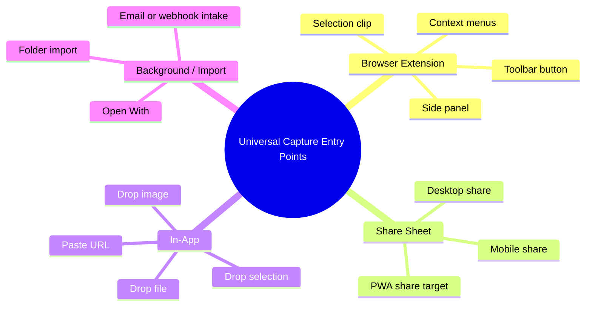

## Recommended Browser UX

The best browser UX is probably a **two-stage model**.

### Stage 1: fast clip

Very fast, low-friction actions:

- `Clip to xNet`
- `Clip selection to xNet`
- `Clip image to xNet`
- `Clip link target to xNet`

This should create a `Capture` quickly, even if enrichment happens later.

### Stage 2: enrich and file

Optional richer side panel or popup:

- destination collection/project
- clip recipe
- tags/topics
- AI extraction mode
- notes/comment
- save as page / row / asset / reference

### Recommended clip recipes

| Recipe                   | Output                                                 |
| ------------------------ | ------------------------------------------------------ |
| Save source only         | `ExternalReference` or `MediaAsset` + `Capture`        |
| Save and summarize       | source + `ContentSnapshot` + summary page              |
| Save to research graph   | source + chunks + entities + claims + collection links |
| Save to project DB       | source + row in a target database + attached summary   |
| Save to canvas           | source-backed canvas object + linked detail page       |
| Save and ask agent later | pending capture in inbox for later MCP workflow        |

### Browser flow

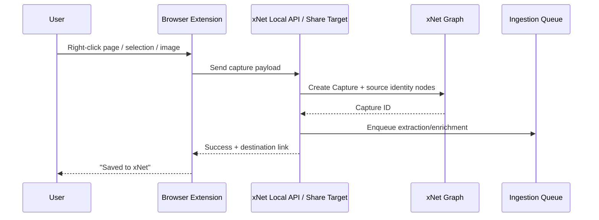

## How Existing Agents Fit

### 1. Best near-term fit: xNet as MCP server

xNet should expose:

- pending captures as MCP resources or queryable nodes
- graph mutation tools
- schema discovery tools
- search and retrieval tools
- ingestion job tools

Then the user's existing agent can do the enrichment.

### Claude Code path

Claude Code explicitly supports:

- local stdio MCP servers
- project-scoped MCP configuration
- dynamic tool/resource discovery

This makes it a very strong early fit.

### Codex-style path

The right target for Codex-style agents is the **same boundary**:

- MCP when available
- otherwise local HTTP tool surface through Local API

The important architectural decision is to expose xNet as a tool/data platform, not to special-case a single assistant.

### 2. Three agent modes

### Mode A: Manual assistant mode

User clips content, then asks:

> Process my capture inbox for project Apollo.

Agent queries pending captures, extracts structured results, and proposes changes.

### Mode B: Semi-automatic background mode

User clips content and a local or trusted org worker automatically enriches it using a scoped agent runtime.

### Mode C: Organization workflow mode

Team-scoped captures route through org-approved extraction rules and agent workers.

This is where policy, queues, and audit matter more.

### Agent integration modes

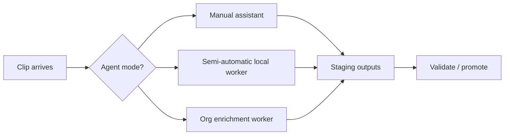

### 3. Trust and prompt injection

This is one of the most important design issues.

Arbitrary web content is untrusted. If an agent reads arbitrary HTML or PDFs and also has broad write permissions, it becomes vulnerable to prompt injection and contaminated graph writes.

### Recommended defense model

- raw content stored first
- agent runs with narrow tool scopes
- agent writes into `ExtractionRun` / staging nodes, not directly into canonical collections
- promotion is policy-gated or confidence-thresholded
- provenance retained for every derived fact/claim

### Safety flow

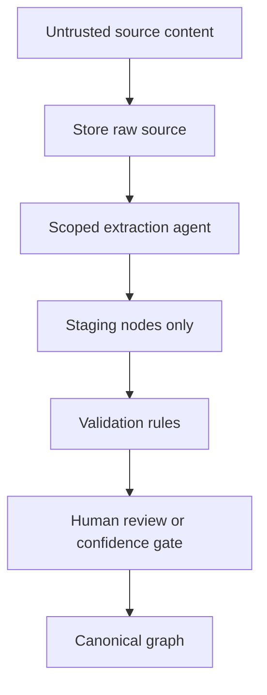

## Human-Friendly and Machine-Friendly Indexing

This is the key UX and architecture requirement from the prompt.

### Human-friendly lookup should optimize for:

- "Where did this come from?"
- "Why did I save this?"
- "Which project/topic does this belong to?"
- "What should I read next?"
- "What does this connect to?"

### Human-facing structures

- inbox
- saved collections
- topical pages
- source cards
- tags and projects
- timeline/recent captures
- graph/backlink views
- destination-specific outputs: page, DB row, canvas object

### Machine-friendly lookup should optimize for:

- canonical source identity
- text snapshot selection
- chunk retrieval
- embeddings
- entity and claim traversal
- scope and permission filters
- answer-pack generation with provenance

### Machine-facing structures

- lexical index
- vector index
- graph adjacency over entities/claims/collections
- snapshot/chunk lineage
- namespace visibility policies

### The right answer: one canonical object, two projections

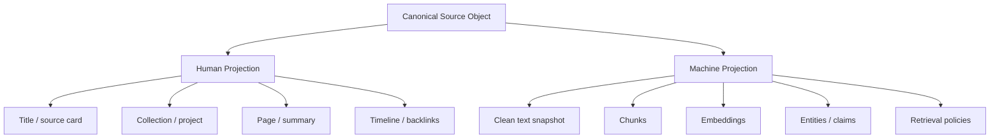

## RAG and Query Architecture

The user should be able to ask things like:

- What do we know about supplier risk for project Mercury?
- Show me the documents and screenshots related to last quarter pricing decisions.
- Which clipped sources mention the new compliance rule and what do they say?

The answer path should not be pure vector search.

It should be **hybrid retrieval**:

1. lexical search
2. vector similarity
3. graph expansion over linked entities/claims/collections
4. policy filtering by scope and permissions
5. answer-pack assembly with citations

### Retrieval flow

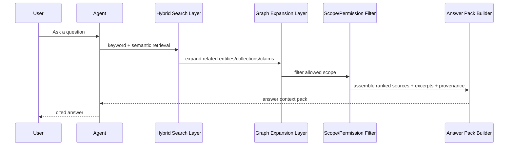

### Answer pack contents

An answer pack should ideally contain:

- canonical source IDs
- source URLs or file refs
- top chunks
- linked entities/topics
- collection/project context
- confidence notes
- citations/provenance trail

This is much better than handing the model one arbitrary blob of text.

## Scaling Model

The clipper should scale in four stages.

### 1. Purely local and personal

Characteristics:

- everything stored locally
- blobs and indexes local
- agent runs locally or with user-selected cloud model
- no sharing by default

This is the safest and easiest first milestone.

### 2. Personal but synced

Characteristics:

- same graph across devices
- optional hub for backup/search relay
- private retrieval and sync only

This is a natural xNet path because local-first is already core.

### 3. Team / organization graph

Characteristics:

- trusted shared namespace
- role-scoped visibility
- organization retrieval
- approved enrichment workers or recipes
- shared collections and vertical apps

This is where company-wide knowledge graph value becomes real.

### 4. Community / public / global opt-in graph

Characteristics:

- not all raw content shared
- some metadata, entities, claims, or published notes shared by policy
- federated discovery across namespaces or hubs
- public knowledge packs or community ontologies possible

This should be **opt-in and policy-driven**, not default.

### Scale tiers

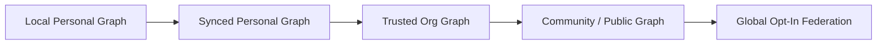

### What should replicate at each tier

| Tier                     | Raw blobs             | Snapshots/chunks | Entities/claims | Collections/views | Public searchability |
| ------------------------ | --------------------- | ---------------- | --------------- | ----------------- | -------------------- |
| Local personal           | yes                   | yes              | yes             | yes               | no                   |
| Synced personal          | yes                   | yes              | yes             | yes               | no                   |
| Org graph                | policy-driven         | yes              | yes             | yes               | internal only        |
| Community/public         | selective             | selective        | yes             | yes               | yes                  |
| Global opt-in federation | usually no by default | selective        | yes             | selective         | yes                  |

The recommended global rule is:

**share structured derivations and published summaries more freely than raw private source material.**

## Federation Model for the Clipper

The broader xNet federation docs suggest a node-native policy model. That fits the clipper well.

Recommended approach:

- captures and raw blobs remain local/private unless explicitly shared
- published or shared knowledge objects can be federated as signed nodes
- global search indexes should index:
  - canonical IDs
  - titles
  - summaries
  - entity names
  - published claims
  - metadata and scope

They should **not** indiscriminately ingest raw private payloads.

This mirrors the Wikipedia exploration's insight that publication lanes and private draft lanes must be separated.

## Recommended Product UX

### 1. The capture inbox

Every clip should first feel like it lands in a reliable inbox.

The inbox should show:

- source type
- captured from where
- AI status
- duplicate/conflict hints
- suggested collection/project
- quick actions

### Inbox statuses

- captured
- normalized
- extracted
- awaiting review
- promoted
- failed
- duplicate

### 2. Destination-aware clipping

The user should be able to say where a clip conceptually belongs.

Examples:

- save to research collection
- attach to project
- add to CRM/ERP object
- save as source only
- drop on canvas
- summarize into page

### 3. AI-assisted filing, not AI-only filing

The AI should suggest:

- related topics
- likely collection
- entities
- duplicate candidates
- whether to make a page, row, or asset

But the user should be able to override quickly.

### 4. Query UX should serve both humans and agents

For humans:

- search box
- saved views
- filters by type, project, person, source, date
- graph explorer / backlinks / timeline

For agents:

- MCP resources
- structured search tools
- answer-pack builders
- app-specific prompt bundles

### UX surfaces

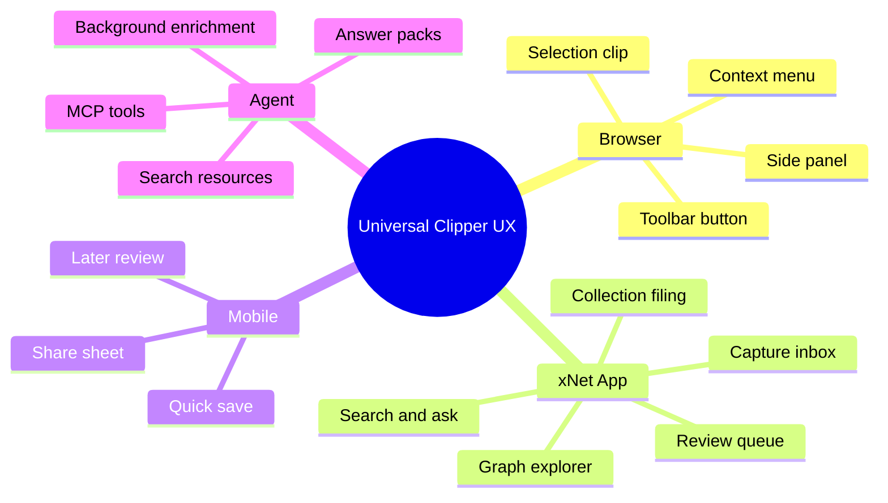

## Recommended System Architecture

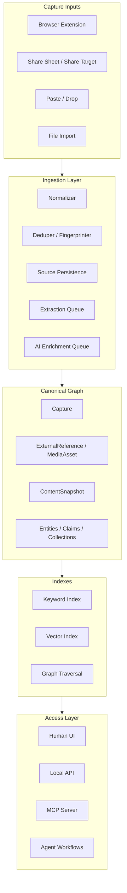

## Recommended Near-Term Build Order

### Phase 1: local-first universal capture MVP

Scope:

- URLs
- images/screenshots
- PDFs and common files
- capture inbox
- canonical `Capture` + `ExternalReference` / `MediaAsset`
- deterministic metadata extraction

No deep AI dependency yet.

### Phase 2: AI enrichment and retrieval MVP

Scope:

- content snapshots
- chunking
- vector + keyword hybrid search
- basic entity extraction
- MCP / Local API retrieval tools
- answer-pack builder

### Phase 3: browser and share integration polish

Scope:

- browser extension
- share target/share sheet
- clip recipes
- duplicate detection and review
- collection suggestions

### Phase 4: organization and vertical app integration

Scope:

- org policies
- app-specific ingestion recipes
- CRM/ERP/wiki pack outputs
- org-level search and shared graph views

### Phase 5: opt-in federation and public discovery

Scope:

- published/shared graph objects
- namespace-aware federation
- global search provider for opt-in public nodes

## Implementation Checklists

### Core Data Model Checklist

- [ ] Define `Capture` schema
- [ ] Define `ContentSnapshot` schema
- [ ] Define `DocumentChunk` schema
- [ ] Define `Entity` schema
- [ ] Define `Claim` schema
- [ ] Define `Collection` schema or collection pack strategy
- [ ] Define `IngestionJob` / `ExtractionRun` schemas
- [ ] Define canonical links between captures, sources, snapshots, and derived objects

### Ingestion Pipeline Checklist

- [ ] Build shared ingestion service above current canvas ingestion primitives
- [ ] Add URL normalization + content fingerprinting
- [ ] Add duplicate detection by canonical URL and content hash
- [ ] Add deterministic metadata extraction pipeline
- [ ] Add snapshot generation for common source types
- [ ] Add chunk generation pipeline
- [ ] Add failure/retry/job status tracking

### Binary and Source Handling Checklist

- [ ] Reuse `BlobService` for file/image storage
- [ ] Reuse `ExternalReferenceSchema` for URL-backed sources
- [ ] Reuse `MediaAssetSchema` for file/image-backed sources
- [ ] Add OCR/transcript hooks where useful
- [ ] Add thumbnail/preview generation strategy
- [ ] Add source refresh/re-ingest strategy for changed URLs

### Search and RAG Checklist

- [ ] Wire lexical search over all relevant captured object types
- [ ] Wire `SemanticSearch` into a real ingestion lifecycle
- [ ] Wire `HybridSearch` into retrieval flows
- [ ] Add graph expansion over entities/claims/collections
- [ ] Add answer-pack builder with citations/provenance
- [ ] Expose retrieval through Local API and MCP

### Browser / Share UX Checklist

- [ ] Build browser extension MVP with toolbar clip
- [ ] Add context menu actions for page/link/image/selection
- [ ] Add destination and recipe selection UI
- [ ] Add mobile share-sheet flow
- [ ] Add PWA share-target support where viable
- [ ] Add success/failure feedback and offline queue behavior

### Agent Integration Checklist

- [ ] Expose pending captures via MCP/Local API
- [ ] Expose schema discovery and safe mutation tools
- [ ] Support staged enrichment rather than direct graph writes
- [ ] Add approval gates and audit trail for agent actions
- [ ] Support project-scoped/shared agent workflows for teams
- [ ] Add prompt/instruction bundles for clipping recipes

### Scale and Federation Checklist

- [ ] Define visibility policy per capture/source/derived object
- [ ] Define what can replicate at personal, org, and public scopes
- [ ] Define namespace-aware retrieval and search filtering
- [ ] Define public/shared metadata model separate from private raw blobs
- [ ] Define opt-in federation flow for published/shared graph objects

## Validation Checklists

### Capture Validation Checklist

- [ ] A user can clip a URL, image, and PDF successfully into the same inbox
- [ ] A clip always produces a durable canonical source object even if AI steps fail
- [ ] Duplicate URLs and duplicate files are detected reasonably well
- [ ] Capture works even when the destination app is offline or not currently focused

### Human UX Validation Checklist

- [ ] Users can file a capture into an intuitive destination quickly
- [ ] Users can understand where a clipped item came from and why it was saved
- [ ] Users can browse by project/topic/source/date without AI
- [ ] Reviewing and correcting AI suggestions is fast and low-friction

### AI / Retrieval Validation Checklist

- [ ] Agents can query pending captures and canonical graph objects through MCP or Local API
- [ ] Hybrid retrieval returns more useful results than keyword-only search on a realistic corpus
- [ ] Answer packs include enough provenance to support trustworthy responses
- [ ] The retrieval layer can answer questions over many source types, not only pages

### Safety Validation Checklist

- [ ] Untrusted source content cannot directly trigger arbitrary graph mutations through the agent pipeline
- [ ] Agent outputs remain staged and attributable until promoted
- [ ] Provenance is preserved from source to chunk/entity/claim
- [ ] Sensitive/private captures are not accidentally exposed through broader indexes

### Scale Validation Checklist

- [ ] Personal graph works fully locally
- [ ] Synced personal graph preserves capture and index behavior across devices
- [ ] Org-scoped graph supports role-based retrieval and shared collections
- [ ] Public/shared objects can be indexed without requiring all raw private content to be published
- [ ] Search behavior remains comprehensible as the graph grows large

## Suggested Success Metrics

For an early successful MVP:

- 90%+ of URL/image/PDF clips create a durable canonical capture record
- duplicate detection prevents obvious re-import churn
- users can retrieve clipped knowledge through both search and graph navigation
- at least one MCP-connected agent can process pending captures end-to-end
- hybrid retrieval produces meaningfully better answer context than plain keyword search

For a stronger organizational milestone:

- multiple users can clip into a shared namespace safely
- org-specific recipes can map captures into structured workflows
- shared search and answer packs respect permissions
- clipper adoption produces measurable reduction in lost links/files/knowledge silos

## Recommended Immediate Actions

1. **Design the canonical graph model first.**
   Start with `Capture`, `ContentSnapshot`, `DocumentChunk`, `Entity`, `Claim`, and `IngestionJob`, while reusing `ExternalReference` and `MediaAsset`.

2. **Promote ingestion into a shared platform service.**
   Reuse the current canvas ingestion work as the seed, but make the pipeline app-wide.

3. **Prototype the browser-extension -> localhost -> capture inbox path.**
   This is the fastest credible end-to-end proof of value.

4. **Integrate vectors and hybrid retrieval only after canonical source capture exists.**
   Do not build a RAG layer on top of unstable or duplicate-prone source identity.

5. **Use existing agents through MCP/Local API, but keep them staged and scoped.**
   Claude Code is the clearest near-term fit; design the boundary so other agents can use it too.

6. **Plan scale tiers from day one, but ship local-first first.**
   Raw source capture should remain useful even without team or federation features.

## Final Recommendation

If xNet wants a universal clipper that truly matters, it should not build:

- a simple bookmark saver
- a page-only import command
- or a vector store with a browser button attached

It should build:

**a local-first source acquisition, enrichment, and retrieval platform that uses one canonical source graph to serve both human memory and machine reasoning.**

That means:

- humans get intuitive lookup, provenance, collections, and views
- agents get chunks, embeddings, entities, claims, and toolable retrieval
- organizations get policy-aware shared knowledge graphs
- communities and the wider world get opt-in federation over published/shared graph objects

Done well, this becomes much more than a clipper.

It becomes the front door to xNet as:

- personal memory system
- team knowledge graph
- AI-native research substrate
- and eventually a federated network of interoperable knowledge spaces

## Key Sources

### xNet Repo

- [`../../packages/data/src/blob/blob-service.ts`](../../packages/data/src/blob/blob-service.ts)
- [`../../packages/data/src/schema/properties/file.ts`](../../packages/data/src/schema/properties/file.ts)
- [`../../packages/data/src/schema/schemas/media-asset.ts`](../../packages/data/src/schema/schemas/media-asset.ts)
- [`../../packages/data/src/schema/schemas/external-reference.ts`](../../packages/data/src/schema/schemas/external-reference.ts)
- [`../../packages/data/src/external-references.ts`](../../packages/data/src/external-references.ts)
- [`../../packages/canvas/src/hooks/useCanvasObjectIngestion.ts`](../../packages/canvas/src/hooks/useCanvasObjectIngestion.ts)
- [`../../packages/vectors/src/search.ts`](../../packages/vectors/src/search.ts)
- [`../../packages/vectors/src/hybrid.ts`](../../packages/vectors/src/hybrid.ts)
- [`../../packages/vectors/README.md`](../../packages/vectors/README.md)
- [`../../packages/plugins/src/services/local-api.ts`](../../packages/plugins/src/services/local-api.ts)
- [`../../packages/plugins/src/services/mcp-server.ts`](../../packages/plugins/src/services/mcp-server.ts)
- [`../../apps/web/public/manifest.json`](../../apps/web/public/manifest.json)
- [`./0061_[_]_AI_AGENT_INTEGRATION.md`](./0061_[_]_AI_AGENT_INTEGRATION.md)
- [`./0108_[_]_CANVAS_V1_PAGES_DATABASES_AND_INFINITE_CANVAS_DEEP_DIVE.md`](./0108_[_]_CANVAS_V1_PAGES_DATABASES_AND_INFINITE_CANVAS_DEEP_DIVE.md)
- [`./0111_[_]_UNIFIED_WORKBENCH_ARCHITECTURE_FOR_XNET.md`](./0111_[_]_UNIFIED_WORKBENCH_ARCHITECTURE_FOR_XNET.md)
- [`./0023_[_]_DECENTRALIZED_SEARCH.md`](./0023_[_]_DECENTRALIZED_SEARCH.md)
- [`./0093_[_]_NODE_NATIVE_GLOBAL_SCHEMA_FEDERATION_MODEL.md`](./0093_[_]_NODE_NATIVE_GLOBAL_SCHEMA_FEDERATION_MODEL.md)

### External Research

- [Notion Web Clipper Help](https://www.notion.com/help/web-clipper)
- [Zotero Connector Docs](https://www.zotero.org/support/connector)
- [Readwise Reader](https://readwise.io/read)
- [Chrome Extensions `contextMenus` API](https://developer.chrome.com/docs/extensions/reference/api/contextMenus)
- [web.dev: PWA OS Integration](https://web.dev/learn/pwa/os-integration)
- [Claude Code MCP Docs](https://docs.anthropic.com/en/docs/claude-code/mcp)
- [Model Context Protocol Introduction](https://modelcontextprotocol.io/introduction)
- [Model Context Protocol Architecture Overview](https://modelcontextprotocol.io/docs/learn/architecture)
