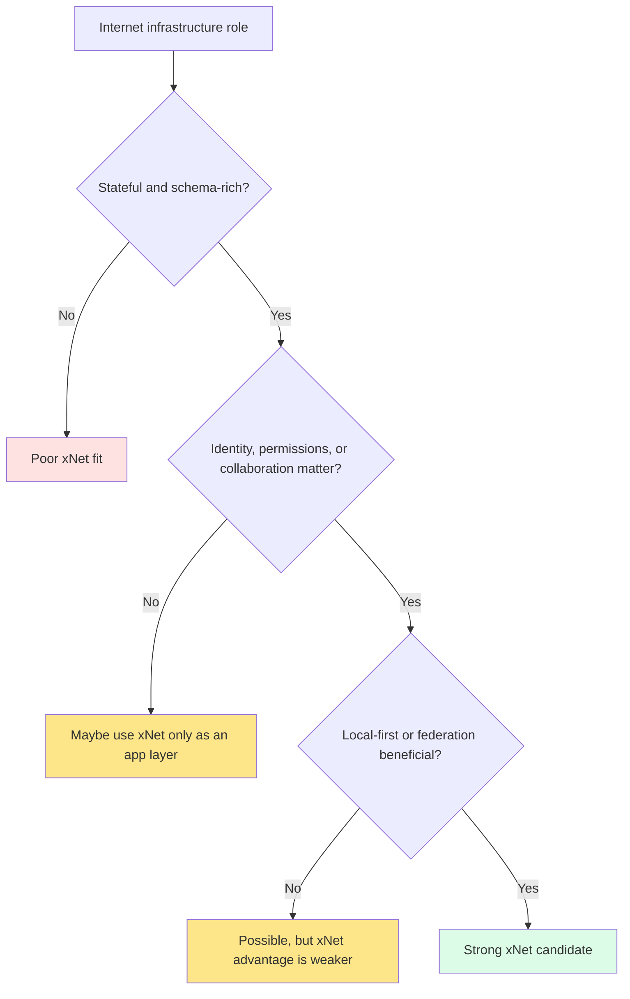
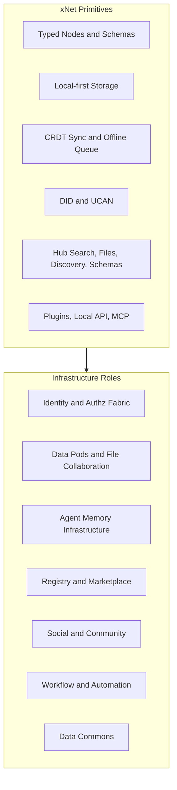
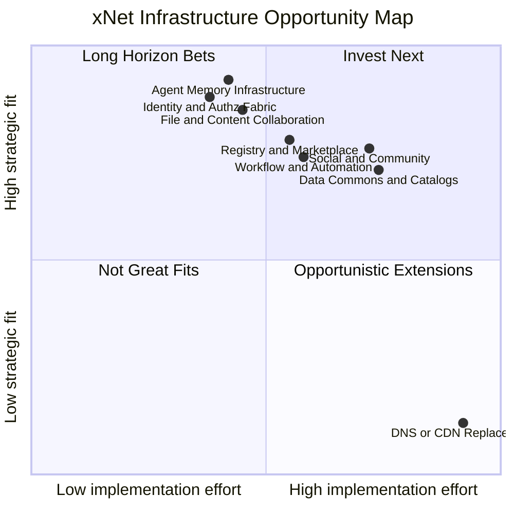
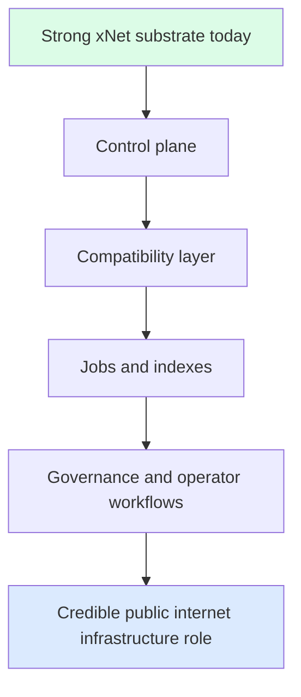

# 0113 - Other Internet Infrastructure Roles for xNet

> **Status:** Exploration  
> **Date:** 2026-04-05  
> **Author:** OpenCode  
> **Tags:** infrastructure, federation, identity, social, registry, data-commons, automation, agents

## Problem Statement

xNet has already been explored as:

- an ERP substrate
- a decentralized/global search engine substrate
- a Wikipedia or public knowledge platform substrate

The natural next question is broader:

> What other kinds of internet infrastructure could xNet plausibly stand in for, and what would be required to make those roles technically viable?

This question matters because xNet is not just a note app or workspace UI. The repo vision explicitly frames it as a **decentralized data layer of the internet**, spanning from personal notes to planetary-scale infrastructure.

That means the right answer is not a list of random apps.

The right answer is a map of which **infrastructure layers** align with xNet's actual strengths:

- typed nodes
- local-first storage
- signed sync
- DID identity
- UCAN delegation
- schema registries
- hubs, discovery, and federation
- plugin and agent tooling

And which kinds of infrastructure do **not** align well, because they are dominated by other concerns such as:

- extreme bandwidth and caching
- DNS-style global resolution latency
- payment/compliance rails
- email deliverability and anti-spam economics
- stateless commodity serving rather than rich stateful collaboration

## Exploration Status

- [x] Determine next exploration number and gather related prior docs
- [x] Review prior explorations on ERP, search, wiki, social, community, marketplace, authz, and federation
- [x] Review key implementation surfaces in data, auth, hub, network, plugins, and Local API/MCP
- [x] Review external references for social federation, identity, registries, data portals, user-owned data, and file collaboration
- [x] Define the most plausible infrastructure roles beyond ERP/search/wiki
- [x] Propose what is technically needed to make each role viable
- [x] Include recommendations plus implementation and validation checklists

## Executive Summary

The central conclusion is:

**xNet is best suited to replace or underpin internet infrastructure that is stateful, permissioned, collaborative, schema-rich, and federation-friendly.**

It is much less suited to replace infrastructure that is primarily:

- stateless
- anonymous
- bandwidth-dominated
- ultra-low-latency routing oriented
- or heavily dependent on legacy global interoperability and compliance networks

### Strongest additional infrastructure roles for xNet

1. **Identity, directory, and authorization fabric**
2. **User-owned data pod and file/content collaboration layer**
3. **Agent context, memory, and tool-access infrastructure**
4. **App, plugin, schema, and package registry infrastructure**
5. **Federated discussion, social, and community infrastructure**
6. **Workflow, automation, and event backplane infrastructure**
7. **Open data commons and dataset registry infrastructure**

### Core thesis

xNet is already unusually strong at the **data plane**:

- typed nodes
- CRDT docs
- sync
- authz
- blobs
- local ownership

But most of the above infrastructure roles also need a strong **control plane**:

- operator tooling
- moderation
- policy management
- distribution
- indexing
- lifecycle and audit
- public compatibility contracts

That control plane is where most of the missing work still is.

### Most important strategic recommendation

Do not treat all infrastructure targets as equal.

The best near- to medium-term strategy is:

1. **Lean into identity/authz, agent memory, and file/content collaboration first**
2. **Then layer registries and automation backplanes**
3. **Treat social/community and data commons as medium- to long-horizon infrastructure roles**
4. **Avoid trying to replace DNS, CDNs, email, payment rails, or generic compute platforms**

## The Decision Lens

When is xNet a good fit for an infrastructure role?

### Fit questions

| Question                                           | If yes, xNet fit improves because...                      |
| -------------------------------------------------- | --------------------------------------------------------- |
| Is the core resource a mutable, structured object? | xNet's node/schema model maps directly                    |
| Does local-first ownership matter?                 | xNet already assumes local control first                  |
| Do permissions, delegation, and audit matter?      | DID + UCAN + grants are core strengths                    |
| Does collaboration or replication matter?          | xNet already has sync and offline recovery                |
| Would federation or app interoperability help?     | global schema and namespace direction are already present |

### Anti-fit questions

| Question                                                         | If yes, xNet fit worsens because...                           |
| ---------------------------------------------------------------- | ------------------------------------------------------------- |
| Is the main problem raw bandwidth or edge caching?               | xNet is not a CDN                                             |
| Is the main value stateless request serving?                     | xNet is optimized for rich state, not commodity statelessness |
| Is it dominated by global legacy interoperability requirements?  | bridging may be harder than native xNet modeling              |
| Is it mostly routing, packet delivery, or transport-level infra? | xNet sits above that layer                                    |
| Is compliance/payment/risk the dominant challenge?               | xNet has some primitives but not the institutional machinery  |

### Fit heuristic

## What xNet Already Brings

Before listing targets, it is useful to identify the platform primitives that keep recurring.

### 1. Data plane strengths

xNet already has:

- typed schemas and node storage in [`../../packages/data/README.md`](../../packages/data/README.md)
- Yjs-backed CRDT documents in the same package
- blob/file support and media assets
- offline persistence and replay, including a persisted offline queue in [`../../packages/react/src/sync/offline-queue.ts`](../../packages/react/src/sync/offline-queue.ts)

### 2. Identity and authorization strengths

xNet already has:

- DID:key identity in the identity layer
- UCAN delegation
- per-resource grants and authorization traces in [`../../packages/data/src/auth/store-auth.ts`](../../packages/data/src/auth/store-auth.ts)
- hub-side key registry and discovery surfaces via the hub architecture

### 3. Networking and sync strengths

xNet already has:

- P2P/libp2p/WebRTC networking and security scaffolding in [`../../packages/network/README.md`](../../packages/network/README.md)
- hub relay, file, schema, discovery, crawl, shard, and federation surfaces in [`../../packages/hub/src/server.ts`](../../packages/hub/src/server.ts)

### 4. Extension and agent strengths

xNet already has:

- a plugin system with views, commands, sidebar panels, schemas, scripts, and services in [`../../packages/plugins/README.md`](../../packages/plugins/README.md)
- Local API in [`../../packages/plugins/src/services/local-api.ts`](../../packages/plugins/src/services/local-api.ts)
- MCP server support in [`../../packages/plugins/src/services/mcp-server.ts`](../../packages/plugins/src/services/mcp-server.ts)

### 5. Strategic direction already pointing upward

The broader repo direction already includes:

- global namespace and federation in [`../VISION.md`](../VISION.md)
- marketplace/registry thinking in [`./0047_[_]_PLUGIN_MARKETPLACE.md`](./0047_[_]_PLUGIN_MARKETPLACE.md)
- social/community thinking in [`./0029_[_]_MASTODON_SOCIAL_NETWORKING.md`](./0029_[_]_MASTODON_SOCIAL_NETWORKING.md) and [`./0031_[_]_NOSTR_INTEGRATION.md`](./0031_[_]_NOSTR_INTEGRATION.md)
- agent-centric toolability in [`./0061_[_]_AI_AGENT_INTEGRATION.md`](./0061_[_]_AI_AGENT_INTEGRATION.md)
- workbench-as-platform design in [`./0111_[_]_UNIFIED_WORKBENCH_ARCHITECTURE_FOR_XNET.md`](./0111_[_]_UNIFIED_WORKBENCH_ARCHITECTURE_FOR_XNET.md)

## The Common Shape

The same xNet primitives can support many infrastructure roles if they are composed correctly.

## Candidate Infrastructure Roles

### 1. Identity, Directory, and Authorization Fabric

### What xNet could stand in for

This is the most plausible non-search, non-wiki infrastructure role.

xNet could evolve toward a decentralized or hybrid alternative to pieces of:

- LDAP or directory services
- organization/group membership systems
- shared authorization policy engines
- parts of OIDC- or SCIM-like identity plumbing
- app-grant and delegation layers

### Why xNet fits

The fit is strong because xNet already treats:

- identity as DID-based
- access as capability- and grant-based
- resources as globally addressable nodes
- policy as data rather than only hidden server config

Relevant repo evidence:

- auth store and grants in [`../../packages/data/src/auth/store-auth.ts`](../../packages/data/src/auth/store-auth.ts)
- namespace and trust-boundary reframing in [`./0082_[_]_GLOBAL_NAMESPACE_AUTHORIZATION.md`](./0082_[_]_GLOBAL_NAMESPACE_AUTHORIZATION.md)
- multi-hub schema and placement thinking in [`./0091_[_]_GLOBAL_SCHEMA_FEDERATION_MODEL.md`](./0091_[_]_GLOBAL_SCHEMA_FEDERATION_MODEL.md)

### What it would need to be technically viable

Needed layers:

- multi-device identity recovery and rotation
- group and organization lifecycle UX
- SCIM/LDAP/OIDC bridges for real-world interoperability
- signed membership and role propagation across hubs
- policy authoring UX and admin audit tools
- revocation, token introspection, and emergency lockout workflows
- availability guarantees good enough for login-critical systems

### External analogs and lessons

- OpenID Connect shows how much of modern identity infra is really about interoperable claims, tokens, and relying-party flows
- AT Protocol shows a strong separation between stable identity and mutable hosting provider
- Solid shows the appeal of user-controlled identity plus data portability, but also how much adoption depends on ergonomics

### Viability horizon

**Near-term to medium-term**, especially for:

- xNet-native apps
- internal tools
- org-scoped shared workspaces
- agent permissioning and selective delegation

### 2. User-Owned Data Pod and File/Content Collaboration Layer

### What xNet could stand in for

xNet could plausibly stand in for parts of:

- Solid-style personal or organizational data pods
- Nextcloud-like content collaboration and sovereign file/workspace infrastructure
- shared knowledge drive and structured content repository layers

### Why xNet fits

This is one of xNet's strongest natural extensions because it already has:

- local-first ownership
- blob/file support
- structured nodes and documents
- sync and offline repair
- permissioned sharing

Relevant repo evidence:

- data package architecture in [`../../packages/data/README.md`](../../packages/data/README.md)
- offline queue in [`../../packages/react/src/sync/offline-queue.ts`](../../packages/react/src/sync/offline-queue.ts)
- remote share exploration in [`./0090_[_]_ELECTRON_P2P_REMOTE_SHARE_OPTIONS.md`](./0090_[_]_ELECTRON_P2P_REMOTE_SHARE_OPTIONS.md)
- universal clipper and ingestion direction in [`./0112_[_]_UNIVERSAL_CLIPPER_AND_AI_KNOWLEDGE_GRAPH_INGESTION.md`](./0112_[_]_UNIVERSAL_CLIPPER_AND_AI_KNOWLEDGE_GRAPH_INGESTION.md)

### What it would need to be technically viable

Needed layers:

- selective sync and placement rules
- durable public/private share links and guest access
- reliable preview and conversion pipelines
- file versioning, conflict mediation, and locking semantics
- external storage connectors and import/export contracts
- searchable metadata and content indexing across files and docs
- admin controls, retention, quotas, and backup/restore at organization scale

### External analogs and lessons

- Solid emphasizes user-owned data and app portability
- Nextcloud shows that file collaboration becomes real infrastructure only when it includes search, permissions, versioning, clients, and compliance

### Viability horizon

**Near-term to medium-term**, especially as:

- sovereign file and workspace substrate
- structured content collaboration layer
- cross-device local-first alternative to centralized workspace clouds

### 3. Agent Context, Memory, and Tool-Access Infrastructure

### What xNet could stand in for

This is probably the most strategically novel role.

xNet could become infrastructure for:

- persistent agent memory
- shared human/agent context graphs
- local or org-scoped RAG backends
- MCP-exposed context and tool surfaces
- long-lived workflows where agents reason over structured state, not just files

### Why xNet fits

This role aligns extremely well with existing xNet primitives:

- Local API
- MCP server
- structured nodes
- schemas
- plugin/runtime contributions
- growing vector and ingestion directions

Relevant repo evidence:

- MCP server in [`../../packages/plugins/src/services/mcp-server.ts`](../../packages/plugins/src/services/mcp-server.ts)
- Local API in [`../../packages/plugins/src/services/local-api.ts`](../../packages/plugins/src/services/local-api.ts)
- agent integration exploration in [`./0061_[_]_AI_AGENT_INTEGRATION.md`](./0061_[_]_AI_AGENT_INTEGRATION.md)
- unified workbench agent direction in [`./0111_[_]_UNIFIED_WORKBENCH_ARCHITECTURE_FOR_XNET.md`](./0111_[_]_UNIFIED_WORKBENCH_ARCHITECTURE_FOR_XNET.md)
- universal clipper exploration in [`./0112_[_]_UNIVERSAL_CLIPPER_AND_AI_KNOWLEDGE_GRAPH_INGESTION.md`](./0112_[_]_UNIVERSAL_CLIPPER_AND_AI_KNOWLEDGE_GRAPH_INGESTION.md)

### What it would need to be technically viable

Needed layers:

- canonical memory schemas such as `Capture`, `ContentSnapshot`, `Entity`, `Claim`, `IngestionJob`, and `ExtractionRun`
- hybrid lexical/vector/graph retrieval integrated into actual product surfaces
- staged ingestion and promotion to protect against prompt injection and bad writes
- namespace-aware permissions for agent reads and writes
- answer-pack and provenance surfaces
- job queues, audit logs, and approval gates for autonomous actions

### Why this is strategically important

This is infrastructure that the broader internet increasingly lacks: a **portable, user-controlled, structured memory layer for AI systems**.

It is a stronger fit for xNet than trying to be "another chatbot." It lets xNet sit underneath many agents instead of competing with them head-on.

### Viability horizon

**Near-term to medium-term**, and arguably one of xNet's most differentiated long-term positions.

### 4. App, Plugin, Schema, and Package Registry Infrastructure

### What xNet could stand in for

xNet could plausibly become infrastructure for:

- plugin registries
- app manifests and marketplace layers
- schema registries and discovery indexes
- specialized package/distribution systems for xNet-native apps and schema packs

This is not necessarily a direct npm replacement. It is more likely a registry layer for **xNet-native app ecosystems**.

### Why xNet fits

It already has:

- extensibility
- schema publication
- plugin nodes
- Local API and MCP tooling
- a marketplace exploration path

Relevant repo evidence:

- plugin system overview in [`../../packages/plugins/README.md`](../../packages/plugins/README.md)
- marketplace exploration in [`./0047_[_]_PLUGIN_MARKETPLACE.md`](./0047_[_]_PLUGIN_MARKETPLACE.md)
- global schema federation model in [`./0091_[_]_GLOBAL_SCHEMA_FEDERATION_MODEL.md`](./0091_[_]_GLOBAL_SCHEMA_FEDERATION_MODEL.md)
- workbench app-manifest direction in [`./0111_[_]_UNIFIED_WORKBENCH_ARCHITECTURE_FOR_XNET.md`](./0111_[_]_UNIFIED_WORKBENCH_ARCHITECTURE_FOR_XNET.md)

### What it would need to be technically viable

Needed layers:

- signed package artifacts and publisher identity verification
- compatibility metadata and version policies
- malware scanning or restricted runtime policies
- trust, reputation, and verification signals
- discovery, ranking, update, and revocation flows
- mirroring and offline cache strategies
- stronger boundary between install artifact and runtime app composition

### External analogs and lessons

- npm separates website, CLI, and registry as distinct components
- AT Protocol's Lexicon system shows the power of global schemas for interoperable clients and services

### Viability horizon

**Medium-term**, especially for xNet-native ecosystems rather than general software distribution.

### 5. Federated Discussion, Social, and Community Infrastructure

### What xNet could stand in for

xNet could plausibly underpin:

- discussion systems
- forum/community infrastructure
- federated social graphs and feeds
- comments/reactions/bookmarks/boosts across many node types
- messaging/community backplanes that sit between Discourse, Mastodon, and Matrix-style systems

### Why xNet fits

This role is attractive because xNet already has:

- universal node identity
- comments and social primitive thinking
- hub relay and discovery
- DID identity and authz
- structured rather than flat data primitives

Relevant repo evidence:

- Mastodon exploration in [`./0029_[_]_MASTODON_SOCIAL_NETWORKING.md`](./0029_[_]_MASTODON_SOCIAL_NETWORKING.md)
- Nostr exploration in [`./0031_[_]_NOSTR_INTEGRATION.md`](./0031_[_]_NOSTR_INTEGRATION.md)
- universal social primitives in [`./0030_[_]_UNIVERSAL_SOCIAL_PRIMITIVES.md`](./0030_[_]_UNIVERSAL_SOCIAL_PRIMITIVES.md)
- chat/video exploration in [`./0028_[_]_CHAT_AND_VIDEO.md`](./0028_[_]_CHAT_AND_VIDEO.md)
- community tools exploration in [`./0063_[_]_COMMUNITY_TOOLS.md`](./0063_[_]_COMMUNITY_TOOLS.md)

### What it would need to be technically viable

Needed layers:

- channels, communities, threads, inbox, unread, mentions, and notification UX
- spam controls, abuse prevention, and moderation tooling
- feed assembly and ranking
- media and attachment pipelines
- federation compatibility choices: native xNet, ActivityPub bridge, AT bridge, Nostr bridge, or some mix
- operator workflows for blocklists, reporting, and trust controls

### External analogs and lessons

- ActivityPub shows the operational complexity of inbox/outbox federation and moderation
- AT Protocol shows the benefits of separating identity, repositories, relays, and app views for scale
- Matrix shows that real communication infrastructure becomes operationally complex very quickly once reliability, abuse, and hosting are real concerns

### Viability horizon

**Medium-term to long-term**.

The data model fit is real. The operator and moderation burden is the hard part.

### 6. Workflow, Automation, and Event Backplane Infrastructure

### What xNet could stand in for

xNet could plausibly underpin pieces of:

- workflow engines
- approval and job systems
- internal automation buses
- event-driven app integrations
- organization-specific business process platforms

This is broader than ERP. It is the execution fabric around many vertical apps.

### Why xNet fits

It already has:

- plugin services
- scripts
- webhook emitters
- process management
- Local API and MCP
- structured state that workflows can act on

Relevant repo evidence:

- plugin services in [`../../packages/plugins/README.md`](../../packages/plugins/README.md)
- Local API and MCP surfaces in the same package
- workbench direction toward jobs/agents/output panels in [`./0111_[_]_UNIFIED_WORKBENCH_ARCHITECTURE_FOR_XNET.md`](./0111_[_]_UNIFIED_WORKBENCH_ARCHITECTURE_FOR_XNET.md)
- clipper exploration's explicit need for ingestion jobs and staged runs in [`./0112_[_]_UNIVERSAL_CLIPPER_AND_AI_KNOWLEDGE_GRAPH_INGESTION.md`](./0112_[_]_UNIVERSAL_CLIPPER_AND_AI_KNOWLEDGE_GRAPH_INGESTION.md)

### What it would need to be technically viable

Needed layers:

- durable job queue and retry semantics
- scheduling and delayed execution
- idempotency guarantees
- secrets and credential management
- approval gates for high-risk actions
- execution logs, observability, and metrics
- worker isolation and failure containment

### Why this matters

Many higher-level infrastructure roles depend on this layer. Without jobs, queues, and reliable workflow execution, xNet remains powerful but manually driven.

### Viability horizon

**Medium-term**, and a force multiplier for many other targets.

### 7. Open Data Commons and Dataset Registry Infrastructure

### What xNet could stand in for

xNet could plausibly support:

- CKAN-like data hubs and portals
- open data catalogs
- organization-wide internal data registries
- public or semi-public dataset indexes
- community-maintained data commons with schemas and provenance

### Why xNet fits

This role fits the platform's:

- schema system
- search and federation direction
- identity and permissions
- clipper and knowledge-graph ingestion direction
- future public namespace ambitions

Relevant repo evidence:

- VISION already names public datasets and data commons explicitly in [`../VISION.md`](../VISION.md)
- decentralized search exploration in [`./0023_[_]_DECENTRALIZED_SEARCH.md`](./0023_[_]_DECENTRALIZED_SEARCH.md)
- clipper exploration in [`./0112_[_]_UNIVERSAL_CLIPPER_AND_AI_KNOWLEDGE_GRAPH_INGESTION.md`](./0112_[_]_UNIVERSAL_CLIPPER_AND_AI_KNOWLEDGE_GRAPH_INGESTION.md)

### What it would need to be technically viable

Needed layers:

- dataset/package metadata models
- provenance and lineage capture
- licensing and publication policy primitives
- bulk ingest/export and snapshotting
- public APIs and catalog UX
- stewardship, moderation, and governance structures
- usage quotas, mirrors, and archival strategies

### External analogs and lessons

- CKAN shows that data portals become real infrastructure only when publication, metadata, stewardship, and public discoverability are handled well
- Wikipedia-style lessons also apply here: public trust, moderation, and operator workflows matter as much as data models

### Viability horizon

**Medium-term to long-term**, especially for curated or organization-scoped registries first.

## Infrastructure Roles Ranked by Fit

## What xNet Should Probably Not Try to Replace

This is just as important as the opportunity list.

### 1. DNS

Why not:

- DNS is routing/address resolution infrastructure with extreme compatibility expectations
- xNet namespaces can complement identity and resource addressing, but they do not replace DNS's role in the broader internet stack

### 2. CDN / edge caching networks

Why not:

- CDNs are fundamentally about content distribution, cache invalidation, latency geography, and bandwidth economics
- xNet can publish content that CDNs serve, but should not try to become the CDN itself

### 3. Payment rails

Why not:

- payment infrastructure is dominated by compliance, settlement, fraud, chargebacks, regulation, and institution-level trust

### 4. SMTP/email infrastructure

Why not:

- email depends on a massive legacy ecosystem, abuse resistance, deliverability, and global backward compatibility
- xNet can integrate with or ingest email, but replacing email transport is not a good fit

### 5. General-purpose compute platform

Why not:

- xNet is a powerful data and sync substrate, not a general replacement for Kubernetes, serverless platforms, or cloud runtimes

### 6. Large-scale media streaming backbone

Why not:

- high-throughput media delivery and transcoding are specialized problems
- xNet can coordinate calls, store metadata, or attach recordings, but it should not try to become YouTube's or Zoom's global media backbone

## The Missing Cross-Cutting Layers

The same missing layers recur across almost every plausible infrastructure role.

### 1. Control plane and operator tooling

Needed for:

- moderation
- lifecycle management
- org administration
- trust and policy
- incident response
- observability

### 2. Public compatibility surfaces

Needed for:

- OIDC/SCIM/LDAP bridges
- ActivityPub, AT, Matrix, Nostr, or email connectors where appropriate
- public APIs and schema discovery

### 3. Durable jobs and indexing

Needed for:

- background sync
- ingestion
- re-indexing
- moderation queues
- agent workflows
- export/import and mirroring

### 4. Governance and trust systems

Needed for:

- public or shared registries
- open data commons
- social/community products
- public package ecosystems

### 5. Distribution and operational maturity

Needed for:

- marketplaces
- file collaboration at scale
- production-grade identity or workflow systems
- multi-hub deployments

### Missing-layer stack

## Recommended Strategic Sequence

### Phase 1: Lean into the strongest substrate fits

Prioritize:

- identity/authz fabric
- agent memory/context infrastructure
- file/content collaboration and sovereign data pods

Why:

- these align most tightly with current code
- they produce reusable primitives for later roles
- they strengthen the platform even if broader internet ambitions take longer

### Phase 2: Build ecosystem and execution layers

Prioritize:

- registries and marketplace/discovery
- durable jobs/automation/event backplane

Why:

- these are force multipliers
- they make xNet-native app ecosystems and operator workflows possible

### Phase 3: Attempt public-scale community and commons roles

Prioritize:

- federated discussion/social systems
- open data commons and registries

Why:

- these are high-leverage but operator-heavy
- they depend on moderation, trust, governance, and public publish lanes

## Implementation Checklists

### Cross-Cutting Platform Checklist

- [ ] Strengthen multi-hub sync and placement policy model
- [ ] Productize namespace-aware permissions and grants
- [ ] Build durable jobs/queues/retries with observability
- [ ] Add admin/operator control-plane surfaces
- [ ] Add stronger public API, schema discovery, and compatibility contracts
- [ ] Add packaging, distribution, and trust metadata surfaces

### Identity and Authz Fabric Checklist

- [ ] Add group and membership schemas with full lifecycle UX
- [ ] Add OIDC bridge or compatible relying-party/provider surface where appropriate
- [ ] Add SCIM/LDAP/enterprise bridge strategy
- [ ] Add key rotation, recovery, and device migration UX
- [ ] Add revocation and token introspection surfaces
- [ ] Add audit and policy-management UIs

### Data Pod / File Collaboration Checklist

- [ ] Expand share links, guest access, and placement controls
- [ ] Add file versioning and conflict/lock semantics
- [ ] Add previews, conversions, and metadata extraction pipelines
- [ ] Add quota, retention, restore, and compliance controls
- [ ] Add richer search across files, pages, and media
- [ ] Add import/export and external storage connector strategy

### Agent Memory Infrastructure Checklist

- [ ] Add canonical memory schemas (`Capture`, `Entity`, `Claim`, `Collection`, `Job`)
- [ ] Integrate hybrid lexical/vector/graph retrieval into product surfaces
- [ ] Add staged enrichment and promotion workflow
- [ ] Add policy-aware agent read/write scopes
- [ ] Add answer-pack, provenance, and approval surfaces
- [ ] Expose memory/query tools cleanly through MCP and Local API

### Registry / Marketplace Checklist

- [ ] Add signed package/artifact verification
- [ ] Add schema/app/plugin compatibility metadata
- [ ] Add discovery ranking and trust signals
- [ ] Add update, revocation, and deprecation workflows
- [ ] Add sandbox/runtime policy enforcement strategy
- [ ] Add mirrors or offline index distribution strategy

### Social / Community Checklist

- [ ] Add community, channel, message, and notification models
- [ ] Add moderation/reporting/blocklist tooling
- [ ] Add feed assembly and ranking strategy
- [ ] Decide interop strategy: native, bridge, or hybrid
- [ ] Add public safety, anti-spam, and rate-limit systems
- [ ] Add operator visibility into federation health and abuse events

### Workflow / Automation Checklist

- [ ] Add durable job queue and scheduler
- [ ] Add secret storage and connector auth model
- [ ] Add idempotent workflow execution model
- [ ] Add audit log and approval gates
- [ ] Add worker/runtime isolation strategy
- [ ] Add event contract registry and observability

### Data Commons Checklist

- [ ] Add dataset/package metadata schemas
- [ ] Add licensing, provenance, and publication policy primitives
- [ ] Add bulk import/export and archival snapshots
- [ ] Add catalog search and public portal surfaces
- [ ] Add stewardship and moderation workflows
- [ ] Add public API and mirroring/indexing strategy

## Validation Checklists

### Platform Validation Checklist

- [ ] The same identity, schema, sync, and permission primitives support more than one infrastructure role cleanly
- [ ] Multi-hub placement and policy decisions remain understandable to operators
- [ ] Background jobs, indexing, and audit behave reliably under disconnects and restarts
- [ ] Public and private namespace boundaries remain explicit and enforceable

### Identity Validation Checklist

- [ ] Users can recover, rotate, and migrate identity without losing access
- [ ] Delegation and revocation behave predictably across devices and hubs
- [ ] External apps can rely on clear auth contracts without xNet-specific guesswork
- [ ] Audit trails explain why access was granted or denied

### File/Pod Validation Checklist

- [ ] Files and documents remain available and consistent across devices and hubs
- [ ] Shared links and guest access are easy to reason about and revoke
- [ ] Search over files, pages, and media stays usable at realistic scale
- [ ] Restore/version workflows protect users from accidental data loss

### Agent Infrastructure Validation Checklist

- [ ] MCP and Local API expose enough structure for real agent workflows without UI scraping
- [ ] Agent writes can be staged, reviewed, and audited
- [ ] Retrieval combines structured graph data and search meaningfully
- [ ] Sensitive namespaces cannot be leaked by poorly scoped agent actions

### Registry Validation Checklist

- [ ] Publishers can ship artifacts predictably with compatibility metadata
- [ ] Users can discover, install, update, and revoke safely
- [ ] Registry trust signals and moderation actions are legible
- [ ] Offline or mirrored indexes still work for discovery

### Social/Community Validation Checklist

- [ ] Communities can moderate abuse without raw database access
- [ ] Notification and inbox semantics stay comprehensible
- [ ] Federation failures do not silently corrupt timelines or trust boundaries
- [ ] Public participation can scale without immediate spam collapse

### Workflow Validation Checklist

- [ ] Jobs survive restarts and retries safely
- [ ] Automation actions are idempotent or clearly bounded
- [ ] Secrets and credentials are protected properly
- [ ] Operators can inspect failed runs, approvals, and side effects

### Data Commons Validation Checklist

- [ ] Dataset lineage and licensing remain visible and queryable
- [ ] Publication and takedown workflows are explicit
- [ ] Catalog search works over metadata and content where allowed
- [ ] Public mirrors and indexes can verify what they are ingesting

## Recommended Immediate Actions

1. **Treat identity/authz as first-class internet infrastructure, not just app auth.**
   This is one of xNet's clearest strategic advantages and should be productized more explicitly.

2. **Build the job/control plane that many future infrastructure roles depend on.**
   Without queues, retries, audit, and admin surfaces, many of the broader ambitions remain fragile.

3. **Turn agent tooling into a durable platform layer.**
   xNet is already close to being compelling agent infrastructure; formalize that before chasing too many other public roles.

4. **Use registries and marketplaces as a forcing function for trust and distribution design.**
   This will improve the app ecosystem and sharpen how federation, identity, and policy should feel.

5. **Approach social/community and public data commons as operator-heavy systems.**
   The technical core may fit, but the moderation and governance layers must be designed deliberately.

6. **Be explicit about anti-goals.**
   Avoid trying to become DNS, a CDN, a payment rail, or a generic compute platform.

## Final Recommendation

If xNet wants to stand in for more of the internet's infrastructure, it should not ask:

> Which giant centralized app can we imitate next?

It should ask:

> Which kinds of internet infrastructure are fundamentally about user-owned, typed, permissioned, collaborative state?

That is where xNet has a real architectural advantage.

The best additional roles are therefore not random products. They are layers such as:

- identity and authorization fabric
- data pod and file/content collaboration fabric
- agent memory and tool-access fabric
- registry and marketplace fabric
- workflow/event backplanes
- community and data-commons layers later

In short:

**xNet is most credible as infrastructure for shared state, trust, and interoperability, not as infrastructure for anonymous routing, bandwidth distribution, or financial settlement.**

That is the boundary that should guide future ambition.

## Key Sources

### xNet Repo

- [`../VISION.md`](../VISION.md)
- [`../../packages/data/README.md`](../../packages/data/README.md)
- [`../../packages/network/README.md`](../../packages/network/README.md)
- [`../../packages/hub/src/server.ts`](../../packages/hub/src/server.ts)
- [`../../packages/data/src/auth/store-auth.ts`](../../packages/data/src/auth/store-auth.ts)
- [`../../packages/plugins/README.md`](../../packages/plugins/README.md)
- [`../../packages/plugins/src/services/local-api.ts`](../../packages/plugins/src/services/local-api.ts)
- [`../../packages/plugins/src/services/mcp-server.ts`](../../packages/plugins/src/services/mcp-server.ts)
- [`../../packages/react/src/sync/offline-queue.ts`](../../packages/react/src/sync/offline-queue.ts)
- [`./0020_[_]_REGENERATIVE_FARMING_ERP.md`](./0020_[_]_REGENERATIVE_FARMING_ERP.md)
- [`./0023_[_]_DECENTRALIZED_SEARCH.md`](./0023_[_]_DECENTRALIZED_SEARCH.md)
- [`./0028_[_]_CHAT_AND_VIDEO.md`](./0028_[_]_CHAT_AND_VIDEO.md)
- [`./0029_[_]_MASTODON_SOCIAL_NETWORKING.md`](./0029_[_]_MASTODON_SOCIAL_NETWORKING.md)
- [`./0030_[_]_UNIVERSAL_SOCIAL_PRIMITIVES.md`](./0030_[_]_UNIVERSAL_SOCIAL_PRIMITIVES.md)
- [`./0031_[_]_NOSTR_INTEGRATION.md`](./0031_[_]_NOSTR_INTEGRATION.md)
- [`./0047_[_]_PLUGIN_MARKETPLACE.md`](./0047_[_]_PLUGIN_MARKETPLACE.md)
- [`./0061_[_]_AI_AGENT_INTEGRATION.md`](./0061_[_]_AI_AGENT_INTEGRATION.md)
- [`./0063_[_]_COMMUNITY_TOOLS.md`](./0063_[_]_COMMUNITY_TOOLS.md)
- [`./0082_[_]_GLOBAL_NAMESPACE_AUTHORIZATION.md`](./0082_[_]_GLOBAL_NAMESPACE_AUTHORIZATION.md)
- [`./0090_[_]_ELECTRON_P2P_REMOTE_SHARE_OPTIONS.md`](./0090_[_]_ELECTRON_P2P_REMOTE_SHARE_OPTIONS.md)
- [`./0091_[_]_GLOBAL_SCHEMA_FEDERATION_MODEL.md`](./0091_[_]_GLOBAL_SCHEMA_FEDERATION_MODEL.md)
- [`./0110_[_]_XNET_AS_A_VIABLE_WIKIPEDIA_ALTERNATIVE.md`](./0110_[_]_XNET_AS_A_VIABLE_WIKIPEDIA_ALTERNATIVE.md)
- [`./0111_[_]_UNIFIED_WORKBENCH_ARCHITECTURE_FOR_XNET.md`](./0111_[_]_UNIFIED_WORKBENCH_ARCHITECTURE_FOR_XNET.md)
- [`./0112_[_]_UNIVERSAL_CLIPPER_AND_AI_KNOWLEDGE_GRAPH_INGESTION.md`](./0112_[_]_UNIVERSAL_CLIPPER_AND_AI_KNOWLEDGE_GRAPH_INGESTION.md)

### External Research

- [ActivityPub Recommendation](https://www.w3.org/TR/activitypub/)
- [AT Protocol Overview](https://atproto.com/guides/overview)
- [Matrix Synapse Hosting Overview](https://matrix.org/docs/older/understanding-synapse-hosting/)
- [How OpenID Connect Works](https://openid.net/developers/how-connect-works/)
- [Solid Project](https://solidproject.org/)
- [CKAN](https://ckan.org/)
- [About npm](https://docs.npmjs.com/about-npm)
- [Nextcloud Files](https://nextcloud.com/files/)
