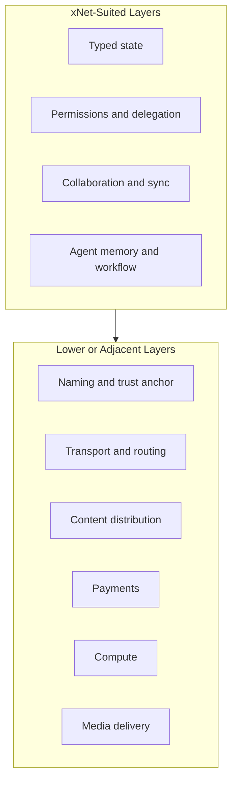
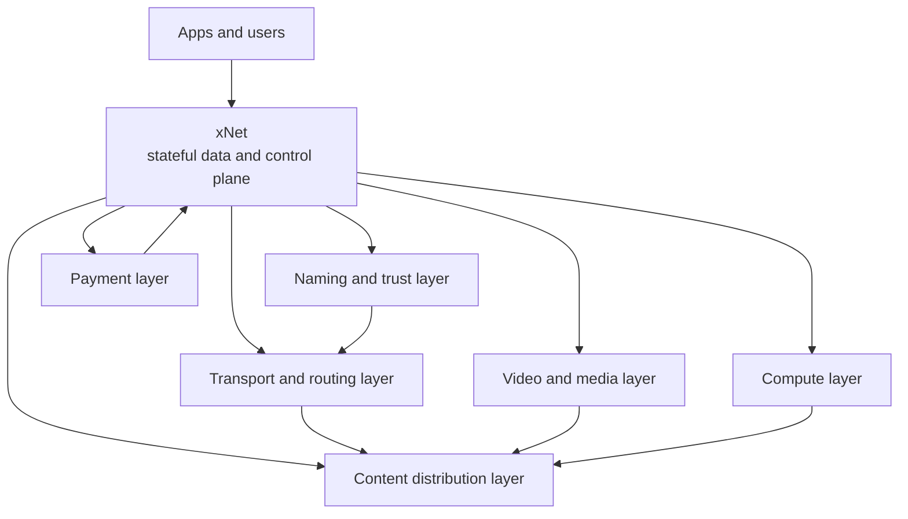
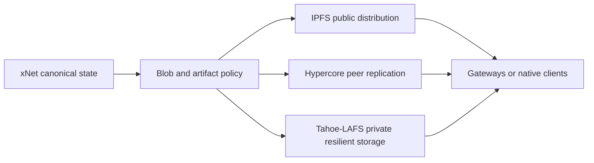
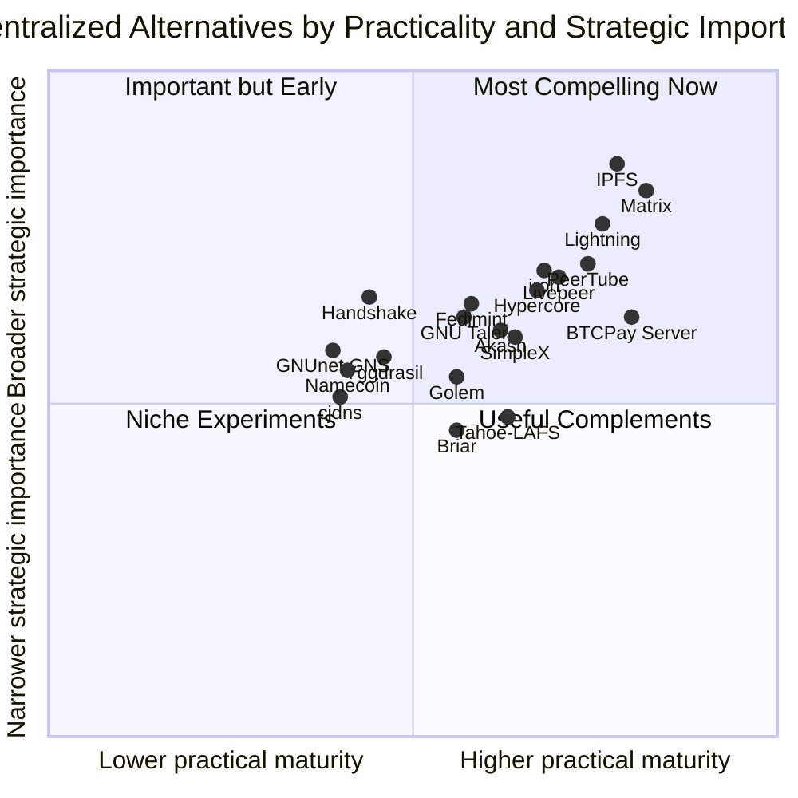
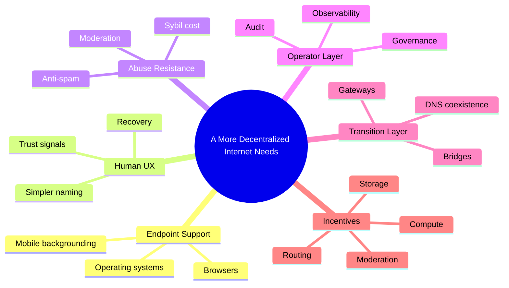
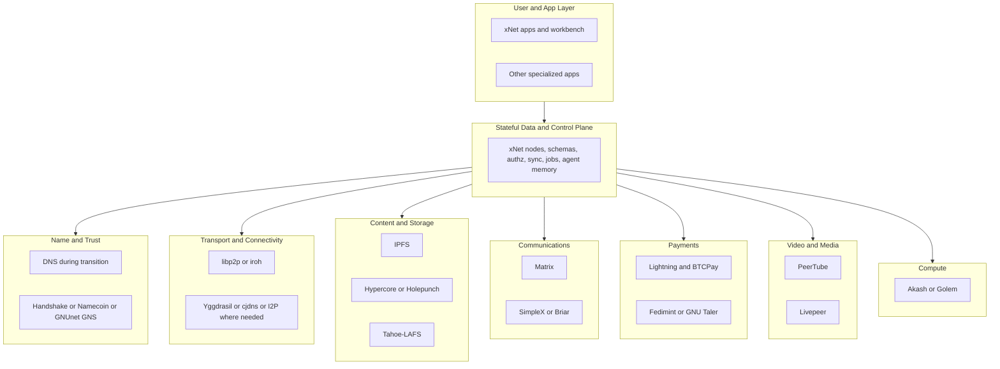

# 0114 - Decentralized Alternatives for Non-xNet Internet Layers

> **Status:** Exploration  
> **Date:** 2026-04-05  
> **Author:** OpenCode  
> **Tags:** decentralization, dns, cdn, p2p, payments, compute, media, complementary-stack

## Problem Statement

Exploration [`0113_[_]_OTHER_INTERNET_INFRASTRUCTURE_ROLES_FOR_XNET.md`](./0113_[_]_OTHER_INTERNET_INFRASTRUCTURE_ROLES_FOR_XNET.md) argued that xNet is **not** well suited to replace several important internet layers, especially:

- DNS and global naming
- CDNs and edge caching networks
- SMTP/email transport
- payment rails
- general-purpose compute platforms
- large-scale media streaming backbones

That raises a natural follow-up question:

> If xNet should not replace those layers, are there compelling open-source decentralized alternatives that should?

And behind that is a larger systems question:

> If the internet becomes significantly more decentralized, what stack would actually make that possible?

This exploration treats xNet as one piece of a broader future stack, not the whole stack.

## Exploration Status

- [x] Review `0113` and related xNet explorations about anti-goals, networking, federation, and future internet roles
- [x] Review repo-side networking and federation substrate relevant to xNet's boundary with lower layers
- [x] Research OSS decentralized alternatives for naming, routing, content distribution, messaging, payments, compute, and media delivery
- [x] Map where xNet fits versus where other systems fit better
- [x] Propose what a more decentralized internet would still require beyond those protocols
- [x] Include recommendations plus implementation and validation checklists

## Executive Summary

The short answer is:

**Yes, there are compelling OSS decentralized alternatives for several of the layers xNet should not replace, but almost none of them are complete one-for-one replacements for the centralized internet on their own.**

The most important conclusion is:

**A more decentralized internet is likely to be a layered stack of specialized systems, not a single universal protocol.**

In that stack:

- xNet fits best as the **stateful data and control plane**
- other systems fit better as the **naming, transport, content distribution, payment, and media layers**

### Strongest decentralized complements to xNet

1. **Naming / alternative trust anchors:** Handshake, Namecoin, GNUnet GNS
2. **P2P routing / transport overlays:** libp2p, iroh, Yggdrasil, cjdns, I2P
3. **Content-addressed distribution / storage:** IPFS, Hypercore/Holepunch, Tahoe-LAFS
4. **Messaging instead of SMTP-style email:** Matrix, SimpleX, Briar
5. **Payment and settlement layers:** Lightning, BTCPay Server, Fedimint, GNU Taler
6. **Decentralized compute:** Akash, Golem
7. **Open video/media infrastructure:** PeerTube, Livepeer

### Main strategic point

If xNet wants to help build a more decentralized internet, it should not try to own the whole lower stack.

It should instead:

- stay opinionated about the **data/control plane**
- stay flexible about the **transport and distribution plane**
- integrate with the strongest complementary protocols at each layer

## Starting Point From 0113

`0113`'s anti-goals were directionally correct:

- xNet is not a DNS replacement
- xNet is not a CDN
- xNet is not a payment rail
- xNet is not SMTP
- xNet is not a general-purpose decentralized cloud
- xNet is not a hyperscale video backbone

That does **not** mean those layers must stay centralized forever.

It means they need systems with different properties than xNet's core strengths.

### The split

## The Core Pattern

The deeper pattern is:

- xNet is strongest where the internet needs **rich shared state**
- the alternatives below are strongest where the internet needs **location, transport, replication, settlement, or broadcast at scale**

### Future stack model

The rest of this document asks, for each non-xNet layer:

- what problem it actually solves
- which OSS decentralized systems are strongest today
- whether they are compelling in practice or still mostly experimental
- what would still be missing in a truly more decentralized internet

## 1. Naming and Trust Anchors

### Why xNet is not the right layer

As `0113` argued, naming is fundamentally about:

- universal resolution
- global compatibility
- low-latency lookups
- trust anchors
- browser and OS integration

That is a different problem from xNet's typed state and sync model.

### Strong OSS candidates

| Project      | What it actually does                                    | Why it matters                                     | Current reality                          |
| ------------ | -------------------------------------------------------- | -------------------------------------------------- | ---------------------------------------- |
| `Handshake`  | peer-to-peer root naming and alternative CA/trust anchor | attacks centralized control of DNS root and naming | serious experiment, still niche          |
| `Namecoin`   | blockchain-backed naming and identity records            | early decentralized DNS and trust-anchor design    | important pioneer, limited adoption      |
| `GNUnet GNS` | privacy-preserving decentralized naming system           | strongest privacy-focused naming design of the set | technically interesting, less mainstream |

### External signals

- Handshake explicitly positions itself as a decentralized, permissionless naming protocol and experimental peer-to-peer root naming system
- Namecoin frames itself as a trust anchor for DNS, identities, and decentralized TLS
- GNUnet GNS is explicit that band-aid improvements to DNS are insufficient and that query privacy and censorship resistance require a different architecture

### Assessment

`Handshake` is the strongest answer if the question is:

> What replaces or competes with the DNS root?

`GNUnet GNS` is the strongest answer if the question is:

> What naming system is most serious about privacy and censorship resistance?

`Namecoin` remains historically important and still technically interesting, but its real-world adoption remains limited.

### Why none of them fully "wins" yet

- browsers and operating systems do not treat them as first-class internet naming
- certificate and resolver ecosystems remain niche
- human support flows such as recovery, squatting disputes, and phishing resistance are still immature relative to mainstream DNS
- the migration path from legacy DNS is weak

### Best role in a future stack

The best likely future is not instant DNS replacement.

It is:

- legacy DNS for mainstream reach during transition
- optional sovereign or community namespaces on systems like Handshake, Namecoin, or GNS
- xNet namespaces sitting **above** these, not replacing them

## 2. Transport, Routing, and Private Network Overlays

### Why xNet is not the right layer

`0113` correctly says xNet sits above the transport layer.

Transport/routing systems solve things like:

- peer discovery
- NAT traversal
- overlay routing
- anonymity or censorship resistance
- path selection
- resilience against network partitions

### Strong OSS candidates

| Project     | What it actually does                                                             | Why it matters                                               | Current reality                        |
| ----------- | --------------------------------------------------------------------------------- | ------------------------------------------------------------ | -------------------------------------- |
| `libp2p`    | modular P2P networking stack with discovery, DHT, relays, transports              | strongest general-purpose application-layer P2P toolkit      | very relevant and practical            |
| `iroh`      | key-addressed P2P networking toolkit over QUIC with relays and multiple protocols | strong ergonomics for direct device connectivity             | promising and practical for developers |
| `Yggdrasil` | end-to-end encrypted IPv6 overlay with compact routing                            | serious alternative routing substrate for mesh-like networks | experimental but compelling            |
| `cjdns`     | encrypted IPv6 mesh/overlay networking                                            | long-running attempt at fully P2P encrypted networking       | niche but real                         |
| `I2P`       | decentralized privacy network for anonymous communication and hosting             | strong censorship resistance and privacy properties          | mature in its niche                    |

### External signals

- Yggdrasil explicitly describes itself as an experimental compact routing scheme and decentralized alternative to common structured routing protocols
- cjdns positions itself as powering Hyperboria, an encrypted peer network distinct from clearnet
- I2P presents itself as a decentralized privacy-focused network with 40k+ active routers and a long-lived ecosystem
- iroh emphasizes key-based addressing, NAT traversal, relays, and support for files, structured data, video, RPC, and custom protocols

### xNet-specific relevance

This is the category where xNet already has scaffolding that points outward rather than inward:

- dormant libp2p and WebRTC work in [`./0052_[_]_LIBP2P_REINTEGRATION.md`](./0052_[_]_LIBP2P_REINTEGRATION.md)
- broader discovery/routing exploration in [`./0078_[_]_TRULY_P2P_DISCOVERY_AND_ROUTING.md`](./0078_[_]_TRULY_P2P_DISCOVERY_AND_ROUTING.md)
- active network package scaffolding in [`../../packages/network/README.md`](../../packages/network/README.md)

### Assessment

If xNet needs a transport substrate, the best near-term fit is likely:

- `libp2p` or `iroh` for app-level direct connectivity and discovery
- `Yggdrasil`, `cjdns`, or `I2P` only where the actual goal is mesh routing, private overlays, or anti-censorship networking

### Best role in a future stack

- `libp2p` or `iroh` for xNet peer connectivity and direct sync
- `Yggdrasil` or `cjdns` for communities that want alternative network overlays
- `I2P` for private or censorship-resistant services and hidden-network publishing

## 3. Content Distribution, Storage, and CDN-Like Layers

### Why xNet is not the right layer

CDNs and storage/distribution layers are dominated by:

- bandwidth
- locality
- caching
- replication economics
- mutable versus immutable content tradeoffs
- origin shielding and hot-path performance

xNet can describe and govern content, but it is not the right primitive for globally serving bytes at scale.

### Strong OSS candidates

| Project                              | What it actually does                                           | Why it matters                                                         | Current reality                                             |
| ------------------------------------ | --------------------------------------------------------------- | ---------------------------------------------------------------------- | ----------------------------------------------------------- |
| `IPFS`                               | content-addressed peer-to-peer retrieval and distribution       | strongest general-purpose decentralized content distribution substrate | compelling today, but not a full CDN replacement            |
| `Hypercore / Hyperdrive / Holepunch` | signed append-only logs and P2P filesystems over peer discovery | strong mutable or replicated peer data model                           | compelling for P2P apps and distribution                    |
| `Tahoe-LAFS`                         | decentralized encrypted cloud storage across multiple servers   | strong for secure distributed storage and resilience                   | compelling for private storage, not public web CDN behavior |

### External signals

- IPFS explicitly describes itself as open protocols to store, verify, and share data across distributed networks, and as a peer-to-peer content delivery network built around content addressing
- Hypercore describes itself as a peer-to-peer data network with append-only logs, Hyperswarm connectivity, and peer-to-peer filesystems via Hyperdrive
- Tahoe-LAFS describes itself as a free and open decentralized cloud storage system that preserves privacy and availability even when some servers fail or are compromised

### Assessment

This is one of the most compelling alternative categories.

But the key nuance is:

- `IPFS` is compelling for verifiable public content distribution and content-addressed publishing
- `Hypercore/Holepunch` is compelling for peer-replicated app data and direct sharing
- `Tahoe-LAFS` is compelling for private, resilient storage

None of them is "Cloudflare, but decentralized" in the full commercial sense.

### Why not a full CDN replacement yet

- cache invalidation and low-latency hot-path delivery are still weaker than major CDNs
- public availability often still depends on gateways, pinning, or explicit replication
- moderation, malware filtering, and takedown workflows are underdeveloped relative to mainstream infrastructure
- mutable web app deployment remains harder than immutable asset publishing

### Best role in a future stack

- xNet stores the canonical state and permissions
- IPFS publishes public immutable artifacts, snapshots, and shared blobs
- Hypercore/Holepunch handles P2P replication and app-level distribution where direct peer sync matters
- Tahoe-LAFS handles high-value encrypted distributed storage where privacy and resilience matter more than edge performance

### Distribution stack

## 4. Messaging and the "Replace Email" Question

### Why xNet is not the right layer

SMTP/email is a massive legacy network with:

- entrenched interoperability expectations
- anti-spam and deliverability machinery
- legal retention and compliance realities
- mailbox and identity recovery expectations

`0113` was right to call that a poor fit.

### Strong OSS candidates

| Project   | What it actually does                                                   | Why it matters                                              | Current reality                       |
| --------- | ----------------------------------------------------------------------- | ----------------------------------------------------------- | ------------------------------------- |
| `Matrix`  | federated communication network for chat, rooms, bridges, and rich apps | strongest practical open messaging fabric                   | compelling today                      |
| `SimpleX` | privacy-first messenger without global user IDs                         | strongest privacy-forward messaging alternative in this set | promising and increasingly compelling |
| `Briar`   | peer-to-peer messaging over Bluetooth, Wi-Fi, and Tor                   | strongest offline and anti-censorship messaging story       | compelling in narrower use cases      |

### Important nuance

There is not really a compelling decentralized **SMTP replacement** in the same way there are decentralized **messaging alternatives**.

That is an important distinction.

The more realistic future is not:

- "SMTP but decentralized"

It is:

- move many use cases away from email entirely
- use Matrix, SimpleX, or Briar-style systems instead
- bridge to email where necessary during transition

### External signals

- Matrix explicitly presents itself as an open network for secure decentralized communication
- SimpleX explicitly positions itself as private and secure messaging without user IDs, with communities and directories as first-class ideas
- Briar explicitly emphasizes censorship-resistant peer-to-peer messaging over Bluetooth, Wi-Fi, and Tor, with local storage and offline use

### Assessment

`Matrix` is the strongest answer for:

- federated org/community messaging
- rich interoperable communications
- broad app-building surface

`SimpleX` is the strongest answer for:

- privacy-centric messaging and communities

`Briar` is the strongest answer for:

- high-risk, offline-capable, anti-censorship communication

### Best role in a future stack

- xNet manages durable structured state, workflows, shared objects, and agent memory
- Matrix or SimpleX handle communication surfaces and transport
- email remains a bridge and notification compatibility layer, not the center of the future stack

## 5. Payments and Settlement

### Why xNet is not the right layer

Payments are dominated by:

- fraud and chargeback models
- compliance and regulation
- settlement guarantees
- wallet custody and recovery
- fiat rails and tax/accounting realities

xNet may participate in payment-adjacent logic, but should not try to become the payment rail.

### Strong OSS candidates

| Project         | What it actually does                                                      | Why it matters                                                      | Current reality                                    |
| --------------- | -------------------------------------------------------------------------- | ------------------------------------------------------------------- | -------------------------------------------------- |
| `Lightning`     | instant low-fee Bitcoin transactions over payment channels                 | strongest decentralized micropayment and crypto-native payment rail | compelling today in crypto-native contexts         |
| `BTCPay Server` | self-hosted Bitcoin payment processor and merchant tooling                 | strongest open merchant stack around Bitcoin and Lightning          | compelling today for Bitcoin-based merchants       |
| `Fedimint`      | community-custodied private e-cash federations built on Bitcoin            | compelling community-scale privacy and custody model                | promising and differentiated                       |
| `GNU Taler`     | privacy-friendly digital payment system, community-run, not a new currency | serious civic/merchant payment design                               | compelling technically, limited ecosystem adoption |

### External signals

- Lightning explicitly frames itself as scalable, instant blockchain transactions using payment channels
- BTCPay Server explicitly frames itself as self-hosted, private, censorship-resistant, and free for Bitcoin payments
- Fedimint explicitly frames itself as community custody, private by design, and federated e-cash for Bitcoin
- GNU Taler explicitly frames itself as privacy-friendly online transactions without registration and as infrastructure communities can run themselves

### Assessment

This category has compelling OSS systems, but the caveat is enormous:

They are compelling mostly for:

- crypto-native use cases
- community finance
- privacy-forward digital cash
- self-hosted merchant infrastructure

They are **not** yet universal replacements for the card and bank-based consumer payment system.

### Best role in a future stack

- xNet tracks rights, subscriptions, contributions, invoices, entitlements, or marketplace state
- Lightning and BTCPay handle crypto-native payment collection
- Fedimint handles community-custodied local or community economies
- GNU Taler fits civic, regional, or privacy-forward merchant/payment ecosystems where its regulatory and deployment model works

## 6. Decentralized Compute and Cloud-Like Layers

### Why xNet is not the right layer

Compute infrastructure is dominated by:

- scheduling
- isolation
- secrets and networking
- hardware markets
- observability and operations
- predictable runtime semantics

That is not xNet's core job.

### Strong OSS candidates

| Project | What it actually does                                                                | Why it matters                                                  | Current reality                                    |
| ------- | ------------------------------------------------------------------------------------ | --------------------------------------------------------------- | -------------------------------------------------- |
| `Akash` | decentralized compute marketplace focused heavily on GPU and containerized workloads | strongest real-world decentralized cloud story in the set       | compelling for bursty or price-sensitive workloads |
| `Golem` | decentralized marketplace for using and sharing compute power                        | longest-running recognizable decentralized compute project here | real, but still niche relative to mainstream cloud |

### External signals

- Akash positions itself as a decentralized cloud and compute marketplace, especially for GPU demand
- Golem explicitly positions itself as an open-source decentralized platform for sharing and buying compute power without centralized cloud providers

### Assessment

These systems are compelling when the question is:

- how do I buy or contribute spare compute on open infrastructure?

They are much less compelling when the question is:

- how do I replace AWS, GCP, or Kubernetes for all normal production operations tomorrow?

### Best role in a future stack

- xNet describes jobs, workloads, policies, and results
- Akash or Golem run bursty compute or AI/video jobs that benefit from open marketplaces
- critical control-plane services likely stay hybrid for a long time

## 7. Large-Scale Media and Video Delivery

### Why xNet is not the right layer

Video and media backbones are dominated by:

- transcoding
- adaptive bitrate delivery
- massive bandwidth
- creator economics
- takedown and moderation workflows
- recommendation and discovery layers

`0113` was right: xNet can coordinate media workflows, but should not try to become the global media backbone.

### Strong OSS candidates

| Project    | What it actually does                                                                             | Why it matters                                            | Current reality                                      |
| ---------- | ------------------------------------------------------------------------------------------------- | --------------------------------------------------------- | ---------------------------------------------------- |
| `PeerTube` | federated video hosting with peer-to-peer broadcasting                                            | strongest open alternative to centralized video platforms | compelling for community and sovereign video hosting |
| `Livepeer` | decentralized video infrastructure for transcoding, livestreaming, and real-time video processing | strongest open video infrastructure layer in the set      | compelling as infra, not a whole social product      |

### External signals

- PeerTube explicitly says its goal is not to replace YouTube directly, but to be a decentralized alternative with many small interconnected hosting providers and peer-to-peer broadcasting
- Livepeer explicitly frames itself as open video infrastructure for transcoding, livestreaming, and real-time video and AI video workloads

### Assessment

This is another category where the best answer is **layering**:

- `PeerTube` is strongest as a federated community video platform
- `Livepeer` is strongest as specialized video compute infrastructure

### Best role in a future stack

- xNet holds structured publishing state, permissions, metadata, workflow, and agent context
- PeerTube handles federated hosting, discovery, and community ownership
- Livepeer handles transcoding and heavy video processing
- peer-assisted broadcast mechanisms reduce hot-content bandwidth pressure

## Which Alternatives Feel Most Compelling Today?

### Strongest practical systems now

### Short answer by category

| Layer                          | Best current answer                                                              |
| ------------------------------ | -------------------------------------------------------------------------------- |
| Naming                         | no clear winner; Handshake and GNUnet GNS are the most interesting structurally  |
| P2P transport                  | libp2p and iroh are the most practical developer-facing answers                  |
| Content distribution           | IPFS is the strongest general answer; Hypercore is the strongest app-data answer |
| Secure distributed storage     | Tahoe-LAFS remains unusually compelling                                          |
| Messaging                      | Matrix is the strongest practical open network                                   |
| High-privacy messaging         | SimpleX and Briar are the strongest specialized answers                          |
| Crypto-native payments         | Lightning + BTCPay are the strongest practical pair                              |
| Community digital cash         | Fedimint is one of the most compelling ideas                                     |
| Civic/privacy-forward payments | GNU Taler is the strongest conceptual answer                                     |
| Video hosting                  | PeerTube                                                                         |
| Video infrastructure           | Livepeer                                                                         |
| Compute marketplace            | Akash currently feels strongest in practice                                      |

## What a More Decentralized Internet Would Still Require

This is the most important part of the exploration.

Protocols are not enough.

### 1. Mainstream endpoint support

Needed:

- browsers that understand alternative naming and content addressing
- OS-level resolver and transport support
- mobile platforms that do not fight peer-to-peer distribution and background connectivity

Without this, decentralized systems remain niche overlays.

### 2. Better human identity, recovery, and trust UX

Needed:

- device migration
- key rotation
- social or institutional recovery
- phishing-resistant naming and verification
- understandable trust surfaces

Without this, decentralization stays too brittle for normal people.

### 3. Anti-spam and anti-sybil economics

Needed:

- rate limits
- identity cost or reputation systems where appropriate
- moderation and filtering layers
- clear operator rights and responsibilities

Many earlier decentralized systems failed because they solved distribution but not abuse.

### 4. Better operator and governance tooling

Needed:

- moderation
- auditing
- observability
- incident response
- dispute resolution
- upgrade coordination

Decentralized infrastructure still needs stewards, even if it does not have one owner.

### 5. Legacy interoperability during transition

Needed:

- DNS coexistence
- email bridging
- HTTPS compatibility
- gateway layers
- hybrid cloud and hybrid media distribution

The transition matters as much as the end state.

### 6. Sustainable incentives

Needed:

- reasons for users to seed, relay, route, store, moderate, and operate
- business or community models that do not collapse into recentralization by convenience

### Missing conditions

## Recommended Future Stack Around xNet

If xNet succeeds at the stateful layers from `0113`, a coherent broader stack could look like this:

### The key division of labor

- xNet should own the **shared mutable truth**
- specialized lower layers should own **location, movement, settlement, and broadcast**

That is the cleanest architecture.

## What This Means for xNet Specifically

### 1. xNet should stay lower-layer agnostic where possible

The app/data/control plane should not hardcode one future internet substrate if it can avoid it.

Examples:

- content can be published to local blobs, IPFS, or Hyperdrive-like stores
- peer connectivity can use hub relay, libp2p, iroh, or hybrid modes
- payments can attach to Lightning, Fedimint, or Taler depending on context

### 2. xNet should become the orchestration and policy layer

That means xNet should be good at:

- object identity
- schema and metadata
- permissions
- workflows and jobs
- provenance
- agent memory
- app-specific views and automation

### 3. xNet should not be embarrassed to be hybrid

A more decentralized internet will almost certainly be hybrid for a long time.

Examples:

- DNS plus optional sovereign naming
- IPFS plus HTTPS gateways
- Matrix plus email bridges
- Lightning plus fiat or merchant tooling
- Akash plus traditional clouds for critical control planes

## Recommendations for Next Steps

1. **Keep xNet explicitly out of the DNS/CDN/payment-rail business.**
   The better move is integration, not imitation.

2. **Invest more seriously in transport modularity.**
   `libp2p` and `iroh` are stronger fits for xNet's peer connectivity evolution than inventing a brand new routing stack.

3. **Experiment with content-addressed blob publication.**
   IPFS and Hypercore-style publishing are the clearest complementary distribution layers for xNet-managed artifacts.

4. **Treat communication as bridgeable infrastructure.**
   Matrix, SimpleX, or Briar can fill roles that SMTP or custom xNet messaging should not try to own alone.

5. **Treat payments as pluggable capability, not core substrate.**
   Lightning/BTCPay, Fedimint, and GNU Taler are the right kinds of things to integrate where use cases demand them.

6. **Model xNet as the state and policy brain of a broader decentralized stack.**
   That is more realistic and more strategically differentiated than trying to absorb every layer.

## Implementation Checklists

### Stack Strategy Checklist

- [ ] Define a clear xNet boundary between state/control plane and lower internet layers
- [ ] Document which layers xNet will integrate with rather than replace
- [ ] Define adapter contracts for naming, transport, content distribution, and payments
- [ ] Keep xNet URI, blob, and sharing models transport-agnostic where possible

### Naming and Resolution Checklist

- [ ] Define whether xNet namespaces can map onto DNS, Handshake, Namecoin, or GNS-style systems
- [ ] Define optional resolver abstraction for alternative naming systems
- [ ] Define browser-friendly and gateway-friendly namespace fallback behavior
- [ ] Define trust and verification UX for alternative names

### Transport and Routing Checklist

- [ ] Reassess libp2p reactivation versus iroh-style transport integration
- [ ] Define direct peer, relay, and offline discovery fallback order
- [ ] Add diagnostics for NAT traversal and relay usage
- [ ] Define optional support for private overlay networks where appropriate

### Content Distribution Checklist

- [ ] Define IPFS publication flow for public blobs or snapshots
- [ ] Define Hypercore-style peer replication candidates for app or workspace artifacts
- [ ] Define private distributed storage strategy where Tahoe-LAFS-like properties matter
- [ ] Define cache, pinning, retention, and availability policy surfaces

### Messaging and Notification Checklist

- [ ] Define whether xNet will bridge to Matrix or other messaging fabrics for notifications and conversation surfaces
- [ ] Define how email remains a compatibility layer rather than a canonical transport
- [ ] Define identity mapping between xNet actors and external messaging identities
- [ ] Define moderation and trust implications of external communication bridges

### Payments Checklist

- [ ] Define payment abstraction boundaries for xNet-native apps and marketplaces
- [ ] Evaluate Lightning/BTCPay for crypto-native flows
- [ ] Evaluate Fedimint for community-scale local payment models
- [ ] Evaluate GNU Taler for privacy-forward civic or merchant models
- [ ] Keep compliance-sensitive logic outside core xNet primitives

### Media and Compute Checklist

- [ ] Define if video-heavy xNet apps should delegate delivery or transcoding to systems like PeerTube or Livepeer
- [ ] Define if batch or AI workloads should target Akash or Golem-like networks
- [ ] Define how xNet tracks job state, metadata, policies, and outputs without becoming the execution substrate itself

## Validation Checklists

### Architectural Validation Checklist

- [ ] xNet remains focused on stateful data and control rather than collapsing into lower-layer infrastructure creep
- [ ] The chosen integrations are replaceable by adapters rather than hardcoded assumptions
- [ ] Hybrid deployments remain possible during long transition periods

### Naming Validation Checklist

- [ ] Alternative naming systems can be used without breaking default DNS-based reachability
- [ ] Users can still resolve and verify canonical resources in understandable ways
- [ ] Resolver failures degrade gracefully to mainstream internet paths where appropriate

### Transport Validation Checklist

- [ ] Peers can connect directly when possible and relay when necessary
- [ ] Network diagnostics make failures understandable
- [ ] Overlay or privacy networks do not silently degrade app behavior beyond usability

### Distribution Validation Checklist

- [ ] Public artifacts can be fetched via native decentralized mechanisms and conventional gateways
- [ ] Blob integrity and provenance are verifiable
- [ ] Availability rules are explicit instead of accidental

### Messaging Validation Checklist

- [ ] External messaging bridges preserve identity and permission intent reasonably well
- [ ] Notifications and conversation surfaces do not become siloed or ambiguous
- [ ] High-risk/private contexts can choose privacy-forward communication layers intentionally

### Payment Validation Checklist

- [ ] Payment integrations do not leak compliance assumptions into the core data model
- [ ] Entitlements and workflow state remain correct even when payment providers differ
- [ ] Failure, refund, and delayed settlement cases are modeled clearly

### Media and Compute Validation Checklist

- [ ] Heavy video or compute tasks can be offloaded without changing xNet's core abstractions
- [ ] Result objects, provenance, and permissions remain first-class in xNet
- [ ] Infrastructure volatility in external networks does not corrupt xNet state

## Final Recommendation

There **are** compelling OSS decentralized alternatives for many of the layers xNet should not replace.

But the important answer is not:

> Which one protocol replaces DNS, CDNs, email, payments, cloud, and media?

The important answer is:

> Which combination of protocols and systems can decentralize different layers without forcing one system to do the wrong job?

That future likely looks like:

- xNet for state, permissions, schemas, sync, workflows, and agent memory
- Handshake/Namecoin/GNS-like systems for sovereign naming experiments
- libp2p/iroh/Yggdrasil/I2P-like systems for connectivity and private overlays
- IPFS/Hypercore/Tahoe-LAFS-like systems for distribution and storage
- Matrix/SimpleX/Briar-like systems for communication
- Lightning/BTCPay/Fedimint/Taler-like systems for value transfer
- PeerTube/Livepeer/Akash/Golem-like systems for media and compute specialization

In other words:

**A significantly more decentralized internet is plausible, but it will be assembled from multiple complementary open systems. If xNet succeeds, it should be the brain and memory of that stack, not the router, the CDN, the bank, or the video backbone.**

## Key Sources

### xNet Repo

- [`./0113_[_]_OTHER_INTERNET_INFRASTRUCTURE_ROLES_FOR_XNET.md`](./0113_[_]_OTHER_INTERNET_INFRASTRUCTURE_ROLES_FOR_XNET.md)
- [`../VISION.md`](../VISION.md)
- [`../../packages/network/README.md`](../../packages/network/README.md)
- [`../../packages/hub/src/server.ts`](../../packages/hub/src/server.ts)
- [`./0052_[_]_LIBP2P_REINTEGRATION.md`](./0052_[_]_LIBP2P_REINTEGRATION.md)
- [`./0078_[_]_TRULY_P2P_DISCOVERY_AND_ROUTING.md`](./0078_[_]_TRULY_P2P_DISCOVERY_AND_ROUTING.md)
- [`./0028_[_]_CHAT_AND_VIDEO.md`](./0028_[_]_CHAT_AND_VIDEO.md)
- [`./0090_[_]_ELECTRON_P2P_REMOTE_SHARE_OPTIONS.md`](./0090_[_]_ELECTRON_P2P_REMOTE_SHARE_OPTIONS.md)
- [`./0111_[_]_UNIFIED_WORKBENCH_ARCHITECTURE_FOR_XNET.md`](./0111_[_]_UNIFIED_WORKBENCH_ARCHITECTURE_FOR_XNET.md)

### External Research

- [IPFS](https://ipfs.tech/)
- [GNUnet GNS](https://www.gnunet.org/en/gns.html)
- [Namecoin](https://www.namecoin.org/)
- [Handshake](https://handshake.org/)
- [Pear / Holepunch Docs](https://docs.holepunch.to/)
- [Hypercore Protocol](https://hypercore-protocol.github.io/new-website/)
- [Tahoe-LAFS](https://tahoe-lafs.org/)
- [Yggdrasil Network](https://yggdrasil-network.github.io/)
- [cjdns](https://cjdns.ca/)
- [I2P](https://geti2p.net/en/)
- [iroh](https://iroh.computer/)
- [Matrix](https://matrix.org/)
- [SimpleX](https://simplex.chat/)
- [Briar](https://briarproject.org/)
- [GNU Taler](https://taler.net/)
- [BTCPay Server](https://btcpayserver.org/)
- [Fedimint](https://www.fedimint.org/)
- [Lightning Network](https://lightning.network/)
- [Golem Network](https://golem.network/)
- [Akash Network](https://akash.network/)
- [PeerTube](https://joinpeertube.org/)
- [Livepeer](https://livepeer.org/)
