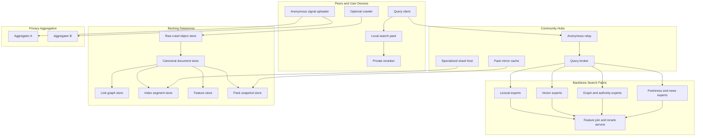
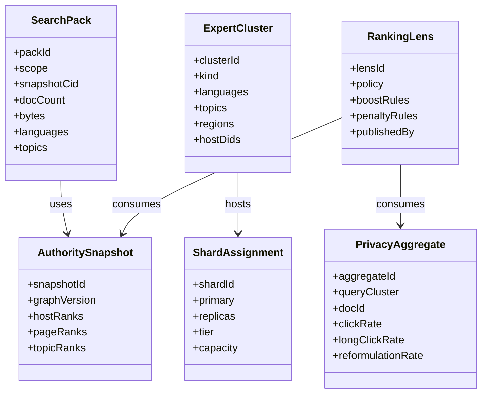
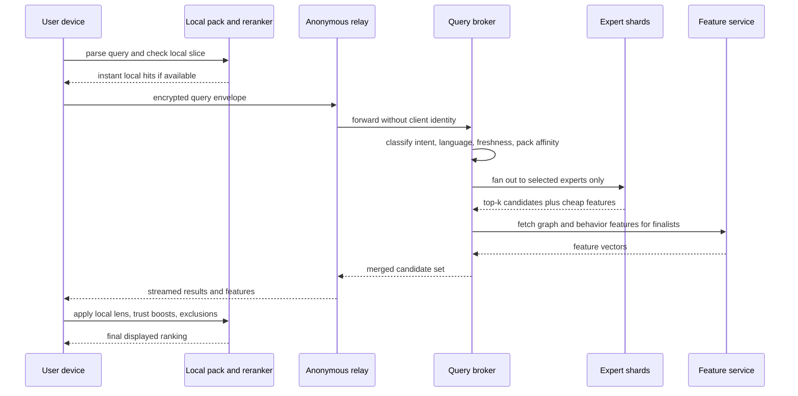
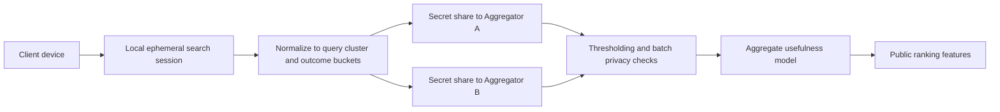
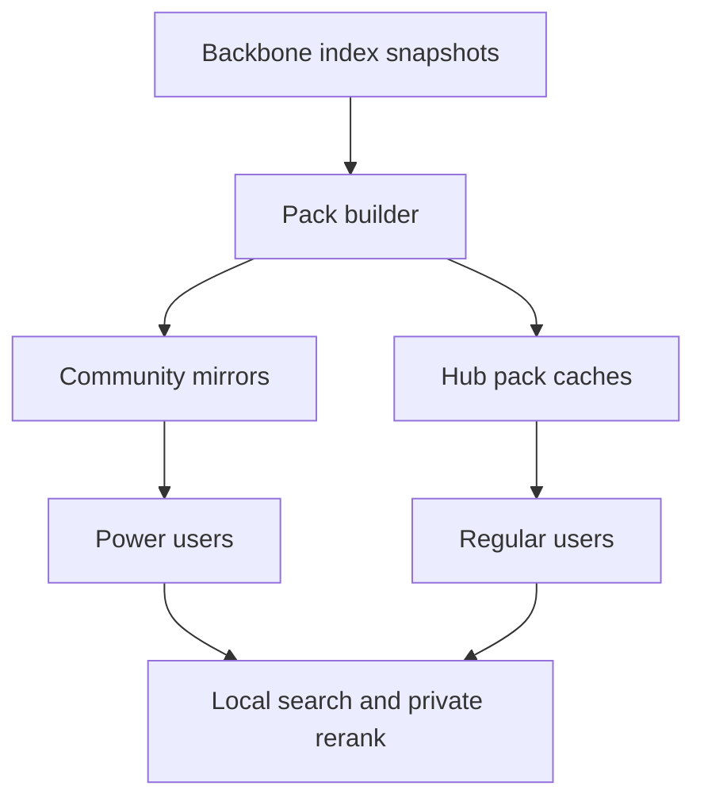

# 0115 - Architecting Fully Decentralized Global Web Search

> **Status:** Exploration  
> **Date:** 2026-04-07  
> **Author:** OpenCode  
> **Tags:** search, federation, hubs, peers, ranking, privacy, indexing, query-serving, caching

## Problem Statement

xNet already explored decentralized search in [`./0023_[_]_DECENTRALIZED_SEARCH.md`](./0023_[_]_DECENTRALIZED_SEARCH.md), but the repo is now materially more capable.

The question is no longer only:

> Can xNet distribute crawling and indexing?

The harder question is now:

> How would xNet actually run a global web search query at useful latency, with no single operator, while preserving privacy, allowing user-custom ranking, and supporting everything from small local slices to a very large shared public index?

This exploration focuses on that harder query-serving problem, while still accounting for crawl, ingest, index maintenance, storage, caching, and privacy-preserving usefulness signals.

## Exploration Status

- [x] Determine next exploration number and existing style
- [x] Review prior search and federation explorations
- [x] Inspect current xNet hub, crawl, shard, query, federation, and vector surfaces
- [x] Review external references on decentralized search, metasearch, privacy-preserving analytics, and distributed retrieval
- [x] Propose a realistic query-serving architecture for a decentralized web index
- [x] Cover peers, hubs, backing datastores, caches, ranking, privacy, and local index slices
- [x] Include mermaid diagrams, recommendations, and implementation/validation checklists

## Executive Summary

The main conclusion is:

**A fully decentralized global search engine is only plausible if decentralization is layered.**

Not all roles should be pushed to end-user peers.

The credible shape is:

1. **Peers** own local search, private reranking, local slices, and optional contribution of crawl and anonymous usefulness signals.
2. **Community hubs** provide always-on relay, cache, query brokering, slice mirroring, and specialized shard hosting.
3. **Backbone serving hubs** host the heavy lexical, graph, freshness, and vector experts required for fast candidate generation.
4. **Shared datastores** hold crawl snapshots, canonical documents, graph features, index segments, and pack snapshots.
5. **Privacy aggregation hubs** collect usefulness signals without building a user-tracking surveillance layer.

The most important architectural insight is:

**Do not route each query to the whole network. Route it to a small set of relevant experts.**

This is effectively a **mixture-of-experts architecture for a web index**:

- lexical experts
- language experts
- topic experts
- host/community graph experts
- freshness/news experts
- trust/community experts

That keeps fanout bounded, lets different operators specialize, and makes local slices practical.

The second key insight is:

**User-custom query algorithms are realistic mostly as reranking and routing policies, not as every user fully re-owning the whole live web index.**

Anyone can cheaply customize:

- reranking
- filters
- trust lenses
- source preferences
- freshness bias
- community/domain boosts

Far fewer people can practically host enough index to customize full candidate retrieval across the entire web.

So the architecture should separate:

- **shared candidate generation**
- **local or community-controlled reranking**

That is the real path to a decentralized Google alternative with useful latency.

## What xNet Has Now

xNet now already contains a surprising amount of the right substrate.

### Current codebase surfaces that materially change feasibility

| Surface                    | Current repo evidence                                                                                                                                                                                                                                                                                                    | Why it matters for this problem                                                                                        |
| -------------------------- | ------------------------------------------------------------------------------------------------------------------------------------------------------------------------------------------------------------------------------------------------------------------------------------------------------------------------ | ---------------------------------------------------------------------------------------------------------------------- |
| Hub control plane          | [`../../packages/hub/src/server.ts`](../../packages/hub/src/server.ts)                                                                                                                                                                                                                                                   | The hub already wires discovery, federation, shards, crawl, query, files, and relay in one service boundary.           |
| Crawl coordination         | [`../../packages/hub/src/services/crawl.ts`](../../packages/hub/src/services/crawl.ts)                                                                                                                                                                                                                                   | xNet already has a crawl task model, crawler registration, queueing, cooldowns, and ingest hooks.                      |
| Lexical shard routing      | [`../../packages/hub/src/services/shard-router.ts`](../../packages/hub/src/services/shard-router.ts)                                                                                                                                                                                                                     | There is already a BM25 shard query router and local/remote shard execution pattern.                                   |
| Shard ingest and placement | [`../../packages/hub/src/services/shard-ingest.ts`](../../packages/hub/src/services/shard-ingest.ts), [`../../packages/hub/src/services/index-shards.ts`](../../packages/hub/src/services/index-shards.ts), [`../../packages/hub/src/services/shard-rebalancer.ts`](../../packages/hub/src/services/shard-rebalancer.ts) | xNet already models shard assignment, host registration, posting ingest, and replica placement.                        |
| Federation                 | [`../../packages/hub/src/services/federation.ts`](../../packages/hub/src/services/federation.ts)                                                                                                                                                                                                                         | Signed multi-hub query/response and reciprocal-rank fusion already exist in scaffold form.                             |
| Discovery                  | [`../../packages/hub/src/services/discovery.ts`](../../packages/hub/src/services/discovery.ts)                                                                                                                                                                                                                           | DID-based discovery can become the directory for search roles and specialized nodes.                                   |
| Hub storage contract       | [`../../packages/hub/src/storage/interface.ts`](../../packages/hub/src/storage/interface.ts)                                                                                                                                                                                                                             | The storage interface already models peers, shard postings, crawler state, federation logs, and search results.        |
| Local document extraction  | [`../../packages/query/src/search/document.ts`](../../packages/query/src/search/document.ts)                                                                                                                                                                                                                             | xNet already extracts text and links from Yjs-backed documents, which is useful for content parsing and graph signals. |
| Hybrid retrieval           | [`../../packages/vectors/src/hybrid.ts`](../../packages/vectors/src/hybrid.ts)                                                                                                                                                                                                                                           | There is already a simple RRF-based hybrid lexical/vector combiner.                                                    |
| Generic federation types   | [`../../packages/core/src/federation.ts`](../../packages/core/src/federation.ts)                                                                                                                                                                                                                                         | The core repo already has a data-source and query-plan abstraction.                                                    |
| Prior exploration          | [`./0023_[_]_DECENTRALIZED_SEARCH.md`](./0023_[_]_DECENTRALIZED_SEARCH.md), [`./0093_[_]_NODE_NATIVE_GLOBAL_SCHEMA_FEDERATION_MODEL.md`](./0093_[_]_NODE_NATIVE_GLOBAL_SCHEMA_FEDERATION_MODEL.md)                                                                                                                       | The repo already has both search direction and node-native control-plane direction.                                    |

### Important current limitation

The current shard defaults in [`../../packages/hub/src/server.ts`](../../packages/hub/src/server.ts) are still prototype-scale:

- `totalShards: 64`
- `maxDocsPerShard: 1_000_000`
- `replicationFactor: 2`

That is useful scaffolding, but it is many orders of magnitude smaller than a serious public web index. The control-plane shape is present; the serving architecture is not done.

## Core Thesis

The original decentralized search exploration was directionally correct, but the new, more concrete answer is:

### 1. Crawling is not the hardest part

Distributed crawling is comparatively easy to imagine:

- volunteer crawlers
- community-operated crawlers
- hub-assigned crawl ranges
- open corpora like Common Crawl as bootstrap material

The hard part is **query execution under latency and quality constraints**.

### 2. Pure peer-to-peer search will not win on the open web

YaCy remains the clearest evidence here: it proves decentralized search works, but it also demonstrates why peer-only search struggles with:

- availability
- freshness
- relevance quality
- spam resistance
- latency predictability

For global public search, always-on infrastructure is required.

### 3. Decentralization should happen by protocol and operator plurality, not by forcing every laptop to be a search datacenter

The realistic goal is:

- open index formats
- open query protocols
- many independent hub operators
- shareable ranking lenses
- verifiable snapshots and packs
- optional local execution for slices

Not:

- every user downloads the whole live web
- every query floods the peer graph

### 4. The winning split is shared retrieval plus local reranking

The network should do the expensive part once:

- crawl
- canonicalize
- build lexical/vector/graph candidates
- expose ranked candidate sets with features

Then users should be able to cheaply customize:

- reranking
- exclusions
- trust boosts
- domain/community preferences
- semantic vs lexical weighting

That is how xNet can support pluralism without making search unusably slow.

## Recommended Architecture



### Recommended role split

| Role                 | What it should do                                                                                                        | What it should not do by default               |
| -------------------- | ------------------------------------------------------------------------------------------------------------------------ | ---------------------------------------------- |
| Peer                 | local cache, private rerank, local slice execution, optional crawl contribution, optional anonymous metrics contribution | host a full live global shard set              |
| Community hub        | anonymous relay, query broker, pack mirror, vertical/community experts, regional caches                                  | own all ranking or all corpus authority        |
| Backbone serving hub | host large lexical/vector/graph/freshness experts and publish public snapshots                                           | collect user-identifying telemetry             |
| Aggregation hub pair | receive secret-shared usefulness events and emit thresholded aggregates                                                  | see both client identity and raw event content |

## Control Plane as xNet Nodes

The most xNet-native way to do this is to treat the search control plane as first-class nodes, not ad hoc side tables forever.

This follows the direction in [`./0093_[_]_NODE_NATIVE_GLOBAL_SCHEMA_FEDERATION_MODEL.md`](./0093_[_]_NODE_NATIVE_GLOBAL_SCHEMA_FEDERATION_MODEL.md): important control-plane state should be represented as signed, queryable data.



Recommended first-party schemas:

- `SearchPack`
- `ExpertCluster`
- `ShardAssignment`
- `RankingLens`
- `AuthoritySnapshot`
- `PrivacyAggregate`
- `CrawlerCapability`
- `QueryBrokerPolicy`

That makes ranking and routing inspectable, forkable, and shareable in a way that fits xNet.

## Data Plane and Index Layers

The system needs several distinct storage layers. Trying to collapse them into one generic database will create pain.

### Required storage layers

| Layer                    | Purpose                                                                | Likely implementation shape                                |
| ------------------------ | ---------------------------------------------------------------------- | ---------------------------------------------------------- |
| Raw crawl store          | retain fetch snapshots, headers, provenance, and legal evidence        | object storage, WARC-like blobs, content-addressed bundles |
| Canonical document store | deduped page/version metadata, clean text, snippets, structured fields | columnar/object store plus KV lookup                       |
| Lexical segment store    | inverted index segments and postings blocks                            | search-native segment format on NVMe plus snapshot export  |
| Link graph store         | page-host-domain graph, anchor text, cluster assignments, rank vectors | graph pipeline plus compressed edge store                  |
| Feature store            | precomputed per-doc and per-host ranking features                      | columnar/KV store                                          |
| Vector store             | selective embedding and ANN indices for portions of corpus             | ANN segment store, not necessarily universal coverage      |
| Pack snapshot store      | downloadable local slices and frozen snapshots                         | content-addressed pack manifests and chunk store           |

### Key design principle

**Only a subset of the corpus should be fully vectorized and hot in the fast path.**

Vectorizing every chunk of the live web is expensive enough that it should be treated as a tiered capability:

- universal lexical coverage
- selective high-value vector coverage
- broader vector coverage for packs and premium/community experts over time

## How a Query Should Run

The query path matters more than the crawl path.



### Detailed query stages

#### 1. Client-side preflight

The client should do lightweight work first:

- query normalization
- language/script detection
- optional local spell correction
- lookup in local pack index
- application of user-local hard filters

This gives two benefits:

- very fast local results when possible
- less leakage of user preference, because private reranking stays local

#### 2. Anonymous relay hop

The default public mode should separate:

- who knows the client IP
- who knows the plaintext query

The relay sees the user network identity but not the decrypted query. The broker sees the query but not the user IP. This is directly inspired by the split-trust idea in ODoH and Oblivious HTTP style systems.

#### 3. Query broker planning

The broker should not blast the query to every shard.

It should decide:

- which lexical experts matter
- which freshness/news experts matter
- whether any vector experts are worth invoking
- which graph communities are relevant
- whether the user's selected packs or community lenses imply extra experts

#### 4. Expert fanout

Each selected expert returns a small top-k set with cheap features.

This is where modern top-k optimizations matter:

- compressed postings
- block-level upper bounds
- WAND or block-max WAND style pruning
- aggressive early termination on noncompetitive candidates
- hot postings and filter caches

#### 5. Merge and feature join

The broker then merges candidates and joins richer features:

- host authority
- link/community features
- freshness deltas
- aggregated anonymous usefulness features
- spam risk and trust penalties

#### 6. Optional second-stage rerank

This is where a larger model or richer policy may run, but only on a small finalist set such as top 100 or top 300 candidates.

#### 7. Final private rerank on device

The final ordering shown to the user should be allowed to differ from the broker order based on:

- user-authored lenses
- community goggles
- local follow/trust graph
- source/domain suppression
- local history or saved packs

This is the cheapest place to support algorithmic pluralism.

### Latency target by stage

| Stage                     | Hot-path target |
| ------------------------- | --------------- |
| Local pack lookup         | 1-10 ms         |
| Relay plus broker ingress | 10-30 ms        |
| Expert fanout in parallel | 20-80 ms        |
| Feature join              | 10-40 ms        |
| Broker rerank             | 10-30 ms        |
| Device rerank and render  | 5-20 ms         |

That implies:

- **hot query:** ~60-200 ms
- **warm query:** ~150-500 ms
- **global tail query:** ~300-900 ms

Those are reasonable public-search targets. A peer-flooding architecture will not consistently hit them.

## Affinity Clusters and Mixture-of-Experts Routing

The user intuition about affinity clusters is directionally right.

### What affinity clusters should mean here

They should not be one single partitioning of the web.

They should be multiple overlapping expert families:

| Expert family           | What defines it                                 | Why it helps                              |
| ----------------------- | ----------------------------------------------- | ----------------------------------------- |
| Language experts        | script, language, locale                        | avoids global fanout for most queries     |
| Topic experts           | embedding/topic cluster, vertical label         | reduces candidate set size                |
| Host/community experts  | dense host/domain/link communities              | captures authority neighborhoods          |
| Freshness experts       | high-change, news, social, recent crawl windows | avoids dragging freshness into all shards |
| Trust/community experts | community-curated or lens-specific corpora      | enables alternative ranking ecosystems    |

### Important nuance

These should be **routing hints, not hard truth partitions**.

The web is too cross-linked and too multilingual for a single static partition to stay correct.

So the broker should do something more like:

1. always hit a few universal lexical experts
2. add a few language/topic/graph experts based on query classification
3. optionally add pack-specific or lens-specific experts
4. stop there

For most queries, a useful upper bound is something like:

- 5-20 lexical experts
- 1-5 freshness experts
- 0-5 vector experts
- 1-5 community/lens experts

**Not hundreds, and definitely not the whole network.**

## Ranking and Scoring

### The right scoring model is layered

The ranking model should combine:

1. **Lexical relevance**
2. **Semantic relevance**
3. **Graph authority**
4. **Freshness**
5. **Anonymous usefulness signals**
6. **Spam and manipulation penalties**
7. **Local user or community reranking**

### Recommended score decomposition

```text
final_score =
  w_lex * lexical_score
  + w_sem * semantic_score
  + w_graph * authority_score
  + w_fresh * freshness_score
  + w_beh * usefulness_score
  - w_spam * spam_risk
  + local_user_adjustment
```

### What each layer should contribute

| Signal               | Scope            | Privacy profile   | Notes                              |
| -------------------- | ---------------- | ----------------- | ---------------------------------- |
| BM25 or BM25F        | global/shared    | public-safe       | universal baseline                 |
| phrase and proximity | global/shared    | public-safe       | needed for precision               |
| embeddings and ANN   | selective/shared | public-safe       | expensive, tiered                  |
| host/page/topic rank | global/shared    | public-safe       | graph-based authority              |
| freshness            | global/shared    | public-safe       | crawl and recrawl recency          |
| click usefulness     | aggregate/shared | privacy-sensitive | must be thresholded and anonymized |
| personal taste       | local            | private           | should stay on device              |
| community lenses     | shareable/local  | mostly safe       | transparent, forkable, auditable   |

### User-custom algorithms

This should be a first-class product and protocol feature.

Recommended layers of customization:

1. **Display and filter lens**
2. **Rerank lens**
3. **Source routing policy**
4. **Pack preference policy**
5. **Advanced self-hosted retrieval plan**

The first four are realistic for almost everyone.

The fifth is realistic only for users or organizations willing to host significant local packs or their own hub.

This is the correct decentralization boundary.

## Anonymous Intention and Usefulness Signals

The hardest non-content ranking problem is the one the user called out: Google-like usefulness signals without surveillance.

### First principle

You will not get exact Google-style session analytics without acting like Google.

That is acceptable.

The system does not need perfect user tracking. It needs enough aggregate signal to distinguish:

- good results from bad results
- sticky results from pogo-stick results
- useful domains from spammy domains
- good query reformulations from poor ones

### Recommended privacy architecture



### What to collect

On device, record ephemeral events like:

- query cluster ID, not always raw query text
- result document ID or host ID
- clicked rank bucket
- dwell bucket such as short, medium, long
- reformulation bucket
- abandonment bucket
- locale/language bucket

### What not to collect

- durable user IDs
- durable session IDs on the server
- raw cross-query histories tied to a person
- rare queries that fail anonymity thresholds

### Recommended mechanism

For high-value aggregate signals, prefer:

- **multi-party private aggregation** in the spirit of Prio or DAP-style systems

For lower-trust or simpler telemetry, fallback to:

- **local differential privacy** style noisy client-side reports

### Why this split is important

Local differential privacy alone usually hurts utility too much for fine-grained ranking.

Multi-party aggregation gives a better balance:

- the network still learns aggregate click and dwell usefulness
- no single hub sees the whole raw event
- public ranking models can still be updated

### Extra anti-abuse requirements

Private aggregation does not solve Sybil abuse by itself.

The system also needs:

- rate limits
- anonymous but scarce query tokens
- per-hub abuse budgets
- crawler and operator reputation
- minimum batch sizes
- optional proof-of-personhood or stake for high-impact contributors

## Downloadable Local Slices

### Can users download the index or a slice locally?

**Yes for slices, no for the whole live web for normal users.**

The right abstraction is a **search pack**.

### Search pack types

| Pack type            | What it contains                                             | Typical size    |
| -------------------- | ------------------------------------------------------------ | --------------- |
| Personal pack        | bookmarks, notes, saved pages, trusted domains, recent cache | 1-20 GB         |
| Community pack       | a language, topic, wiki, forum ecosystem, or domain cluster  | 10-200 GB       |
| Vertical expert pack | law, research, software docs, medicine, etc.                 | 50-500 GB       |
| Regional mirror pack | a hub's hot public subset                                    | 100 GB-2 TB     |
| Frozen snapshot pack | monthly or versioned historical slice                        | highly variable |

### What should be inside a pack

- compact lexicon and postings
- forward snippets
- minimal feature table
- optional graph neighborhood
- optional embeddings for high-value docs
- snapshot manifest with content hashes
- compatibility metadata for query/runtime versions

### How packs fit the architecture



### Practical implication

Downloading the whole live web index is not the everyday-user path.

But downloading:

- your trusted web slice
- a programming/docs slice
- a regional news slice
- a community-curated lens pack

is very realistic and very powerful.

That is also the right way to let users increasingly escape shared ranking when they want to.

## Requirements from Peers, Hubs, Backing Datastores, and Caches

### Peer requirements

| Peer capability                           | Why needed                                                          |
| ----------------------------------------- | ------------------------------------------------------------------- |
| local query client and UI                 | user-facing search must remain responsive even when network is slow |
| local pack storage                        | makes slices and private reranking possible                         |
| local reranking engine                    | enables user-controlled algorithms without central leakage          |
| optional crawler worker                   | lets users contribute ingest capacity                               |
| anonymous signal uploader                 | lets the network learn usefulness privately                         |
| pack verification and snapshot management | protects users from corrupted or manipulated packs                  |

Typical serious peer hardware:

- 8-32 GB RAM
- 100 GB-2 TB SSD available for packs
- optional GPU not required

### Community hub requirements

| Hub capability         | Why needed                                        |
| ---------------------- | ------------------------------------------------- |
| anonymous relay        | separates identity from query plaintext           |
| query broker           | plans and routes queries to experts               |
| regional cache         | reduces repeated fanout and long-tail latency     |
| pack mirror            | distributes local slices efficiently              |
| specialized shard host | gives communities a way to run real search infra  |
| abuse control          | rate limiting, scoring, admission, and moderation |

Typical community hub hardware:

- 8-32 vCPU
- 64-256 GB RAM
- 4-40 TB NVMe
- strong egress and uptime

### Backbone serving hub requirements

| Hub capability              | Why needed                                                    |
| --------------------------- | ------------------------------------------------------------- |
| lexical experts             | universal candidate generation                                |
| graph and authority service | quality ranking depends on link/community signals             |
| feature service             | second-stage reranking needs joined features                  |
| freshness tier              | recent and fast-changing content should not poison all shards |
| pack publishing             | allows decentralized local replication                        |
| public snapshot publishing  | makes the system auditable and forkable                       |

Typical backbone serving hardware:

- 32-128 vCPU per serving node
- 256 GB-1 TB RAM
- 20-200 TB NVMe per shard family, often spread across nodes
- object storage access for snapshots and raw corpus

### Backing datastore requirements

| Datastore                | Main load                                        | Why it cannot be skipped                                                          |
| ------------------------ | ------------------------------------------------ | --------------------------------------------------------------------------------- |
| object store             | crawl snapshots and pack blobs                   | you need durable, cheap, large storage                                            |
| index segment store      | postings and ANN segments                        | query-serving depends on search-native layout                                     |
| feature store            | doc/host/query features                          | ranking otherwise becomes too expensive at request time                           |
| graph store              | edges, communities, authority vectors            | graph authority is one of the few open alternatives to opaque centralized ranking |
| canonical metadata store | URLs, titles, snippets, content hashes, policies | needed for dedupe, trust, revocation, and pack export                             |

### Cache requirements

| Cache              | Where it lives            | What it caches                             | Invalidated by                    |
| ------------------ | ------------------------- | ------------------------------------------ | --------------------------------- |
| local result cache | peer                      | recent query results and snippets          | local pack change, TTL            |
| broker query cache | community hub             | hot query result sets                      | freshness TTL, rank model changes |
| postings cache     | shard hosts               | hot term blocks, skip data, lexicon pages  | segment merge or eviction         |
| feature cache      | broker or feature service | doc and host features for recent finalists | feature recompute                 |
| pack cache         | hubs and peers            | snapshot chunks                            | snapshot version change           |
| model cache        | broker and client         | rerank and lens models                     | model rollout                     |

The key lesson from practical search systems is simple:

**caches are not optional.**

Without them, the tail latency and cost profile will be brutal.

## Scale Realities and Hardware Orders of Magnitude

### Important framing

The system does not need to jump from zero to 40 billion pages immediately.

The right path is staged.

### Plausible deployment levels

| Level                    | Corpus size   | Infra shape                                              | What it proves                                 |
| ------------------------ | ------------- | -------------------------------------------------------- | ---------------------------------------------- |
| Personal/local-first     | 100K-10M docs | one device or one hub                                    | local pack execution and private rerank        |
| Community vertical       | 10M-500M docs | a few hubs and mirrors                                   | specialist search can be decentralized         |
| Regional public search   | 500M-5B docs  | tens to low hundreds of serving nodes                    | useful general public search becomes plausible |
| Global public federation | 10B-40B docs  | hundreds to low thousands of nodes across many operators | true decentralized search fabric               |

### Serving-node intuition

For reasonable latency, a query should touch a bounded number of experts, each of which should be able to answer top-k quickly from local NVMe and RAM-heavy caches.

Roughly:

- a lexical expert shard can cover on the order of tens to low hundreds of millions of docs
- a vector expert should usually cover a smaller, higher-value subset
- graph and feature services should be separate from hot postings execution

### Full-web local download reality

For normal users:

- full live web index: unrealistic
- meaningful slices: realistic
- frozen snapshots of narrower corpora: realistic

That is not a failure. It is the correct decentralization shape.

## Recommended Direction for xNet

### Recommendation 1

**Do not pursue pure peer-flooded global search as the primary design.**

Keep peer-only search as:

- local-first search
- pack execution
- hubless fallback
- community experiments

But the main public architecture should be hub-and-expert based.

### Recommendation 2

**Treat search routing, ranking lenses, packs, and aggregates as node-native control-plane data.**

That aligns with xNet's strongest architectural direction and avoids an explosion of bespoke search-only control APIs.

### Recommendation 3

**Build user customization around reranking first, full retrieval customization second.**

That gives real user agency cheaply and early.

### Recommendation 4

**Make search packs a product and protocol primitive.**

Search packs are the bridge between:

- fully remote search
- partially local search
- fully self-hosted specialist search

### Recommendation 5

**Use privacy-preserving aggregate usefulness signals, not raw session tracking.**

That means:

- two-hub aggregation path
- thresholded releases
- no durable user/session identifiers
- local/private personalization on the device

### Recommendation 6

**Start with constrained public scope before trying to index the whole web.**

The best bootstrap path is probably:

1. xNet-public pages and schemas
2. curated public domains
3. a few vertical packs
4. larger general web slices
5. broader public crawl and federation

## Concrete Next Actions

1. Define first-party system schemas for `SearchPack`, `ExpertCluster`, `ShardAssignment`, `RankingLens`, `AuthoritySnapshot`, and `PrivacyAggregate`.
2. Split the current hub search work into explicit roles: relay, broker, shard host, feature service, and pack mirror.
3. Extend the existing shard router so query planning targets expert families, not only term-hashed shards.
4. Design a pack format with manifest, content hashes, versioning, and selective replication rules.
5. Design an anonymous relay protocol for search requests, separate from the broker.
6. Design a private aggregation pipeline for click and dwell usefulness features.
7. Build one constrained end-to-end public corpus first, not the whole web.

## Implementation Checklist

### Phase 1: Control plane and packaging

- [ ] Define node-native schemas for search control-plane objects
- [ ] Publish `SearchPack` manifest format and compatibility rules
- [ ] Add signed snapshot publication and verification flow
- [ ] Define broker, relay, expert, and pack-mirror capability scopes

### Phase 2: Query-serving MVP

- [ ] Refactor current hub search into broker and shard-host roles
- [ ] Extend shard routing from simple term hashing to expert family routing
- [ ] Add broker-side candidate merge plus feature join
- [ ] Add client-side local rerank and lens application
- [ ] Add progressive result streaming local then remote

### Phase 3: Public ranking substrate

- [ ] Add host/page/topic authority snapshots
- [ ] Add freshness experts and recrawl prioritization
- [ ] Add spam and trust penalties in ranking features
- [ ] Publish shareable `RankingLens` nodes

### Phase 4: Privacy-preserving usefulness signals

- [ ] Define local search outcome event schema
- [ ] Implement two-aggregator secret-sharing pipeline
- [ ] Enforce minimum anonymity thresholds before aggregate publication
- [ ] Integrate aggregate usefulness scores back into reranking

### Phase 5: Search packs and self-hosting

- [ ] Build pack builder from public snapshots
- [ ] Add hub pack mirrors and peer pack downloads
- [ ] Support local pack execution in the client
- [ ] Support self-hosted specialist hubs using packs as bootstrap

## Validation Checklist

### Relevance and quality

- [ ] Shared candidate generation returns meaningfully better results than local BM25 alone
- [ ] Graph authority improves result quality without collapsing to incumbent biases
- [ ] User lenses can measurably change ranking without breaking relevance entirely
- [ ] Anonymous usefulness features improve ranking on common queries

### Latency and scale

- [ ] Hot queries stay within target p95 latency under realistic fanout
- [ ] Query planner typically touches a small bounded set of experts
- [ ] Broker caches materially reduce repeat-query cost
- [ ] Pack-based local execution improves cold-start and offline behavior

### Privacy

- [ ] Relay cannot see plaintext query content
- [ ] Broker cannot see client IP identity in default anonymous mode
- [ ] Aggregate usefulness pipeline stores no durable user IDs
- [ ] Rare queries and rare URLs are suppressed or generalized before release

### Resilience and decentralization

- [ ] More than one operator can host the same expert family
- [ ] Search packs remain verifiable and usable if one hub disappears
- [ ] Query routing continues under partial hub or shard failure
- [ ] Community hubs can run specialist search without asking a central operator for permission

### Abuse resistance

- [ ] Crawler abuse can be rate-limited and reputationally penalized
- [ ] Ranking manipulation via fake clicks is limited by private aggregation and admission control
- [ ] Search packs and snapshots can be verified before use
- [ ] No single hub can silently dominate ranking without the user being able to switch lenses or packs

## Open Questions

1. **How open should public hub federation be?** Fully open federation increases spam and legal risk; curated federation increases centralization risk.
2. **How much vector coverage is actually worth the cost?** Full-web vectorization is likely too expensive; selective vectorization is likely the right answer.
3. **What is the right anonymity default?** Anonymous relay should likely be default for public search, but may add some latency.
4. **What economics sustain public experts and mirrors?** Some combination of paid API, sponsorship, premium packs, and operator-owned services is likely needed.
5. **How should takedown and right-to-be-forgotten flows work in a multi-operator snapshot ecosystem?**
6. **How much of ranking should be published as raw open features versus packaged lenses?**

## Final Take

The real path to a decentralized Google is not:

- one giant DHT
- one monolithic global ranker
- one index every user downloads

It is:

- **plural operators**
- **shared open index protocols**
- **specialized expert clusters**
- **downloadable local slices**
- **private on-device reranking**
- **privacy-preserving aggregate usefulness signals**

In other words:

**a decentralized search fabric, not a single decentralized search box.**

That model fits xNet far better than the older pure-P2P dream because xNet now already has real hub, federation, shard, crawl, discovery, and hybrid-retrieval primitives. The remaining work is to evolve those primitives into a proper public search fabric with clear role boundaries, packable slices, anonymous query flow, and ranking pluralism.

If xNet does that, it does not need to literally copy Google.

It can instead build something arguably better:

- shared public retrieval infrastructure
- user-owned private ranking
- open community-defined search lenses
- no durable surveillance identity layer

That is the credible architecture for a decentralized Google alternative.

## References

### Codebase

- [`./0023_[_]_DECENTRALIZED_SEARCH.md`](./0023_[_]_DECENTRALIZED_SEARCH.md)
- [`./0093_[_]_NODE_NATIVE_GLOBAL_SCHEMA_FEDERATION_MODEL.md`](./0093_[_]_NODE_NATIVE_GLOBAL_SCHEMA_FEDERATION_MODEL.md)
- [`../../packages/hub/src/server.ts`](../../packages/hub/src/server.ts)
- [`../../packages/hub/src/services/crawl.ts`](../../packages/hub/src/services/crawl.ts)
- [`../../packages/hub/src/services/shard-router.ts`](../../packages/hub/src/services/shard-router.ts)
- [`../../packages/hub/src/services/federation.ts`](../../packages/hub/src/services/federation.ts)
- [`../../packages/hub/src/storage/interface.ts`](../../packages/hub/src/storage/interface.ts)
- [`../../packages/query/src/search/document.ts`](../../packages/query/src/search/document.ts)
- [`../../packages/vectors/src/hybrid.ts`](../../packages/vectors/src/hybrid.ts)
- [`../../packages/core/src/federation.ts`](../../packages/core/src/federation.ts)

### External references

- [Brave Search independence announcement](https://brave.com/search-independence/)
- [Brave Web Discovery Project](https://support.brave.app/hc/en-us/articles/4409406835469-What-is-the-Web-Discovery-Project-)
- [Brave Goggles](https://search.brave.com/help/goggles)
- [YaCy](https://yacy.net/en/index.html)
- [SearXNG documentation](https://docs.searxng.org/)
- [Common Crawl](https://commoncrawl.org/get-started/)
- [Common Crawl latest crawl](https://commoncrawl.org/latest-crawl/)
- [The Graph indexing overview](https://thegraph.com/docs/en/indexing/overview/)
- [Apple: Learning with Privacy at Scale](https://machinelearning.apple.com/research/learning-with-privacy-at-scale)
- [Prio](https://crypto.stanford.edu/prio/)
- [RFC 9230: Oblivious DNS over HTTPS](https://www.rfc-editor.org/rfc/rfc9230)
- [Elastic query cache documentation](https://www.elastic.co/docs/reference/elasticsearch/configuration-reference/node-query-cache-settings)
- [Elastic block-max WAND overview](https://www.elastic.co/blog/faster-retrieval-of-top-hits-in-elasticsearch-with-block-max-wand/)
