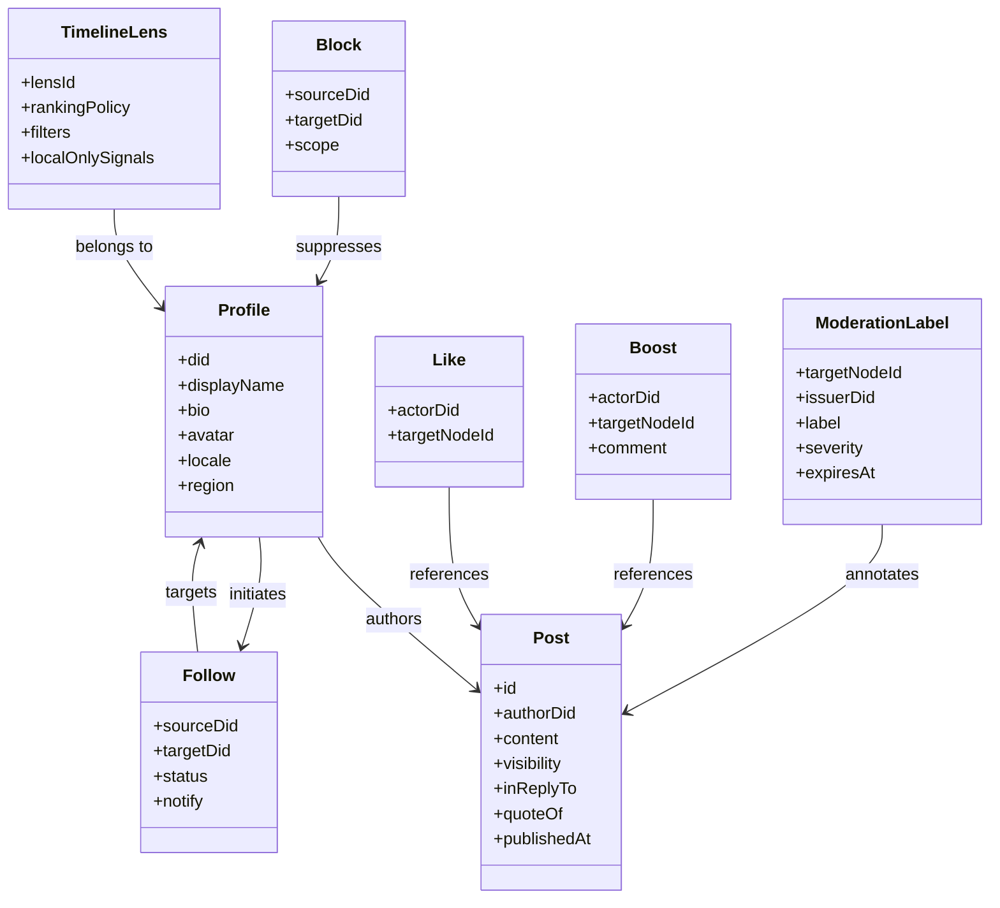
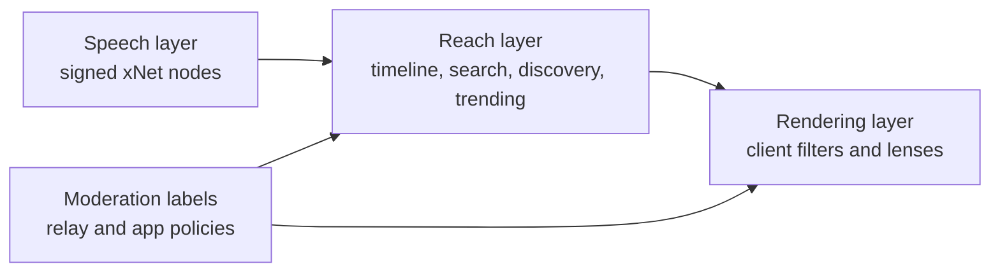
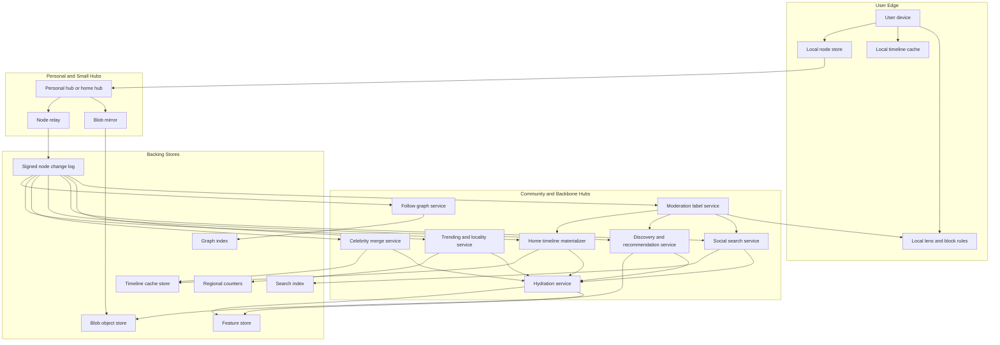
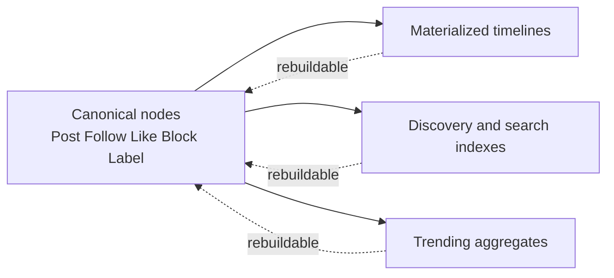
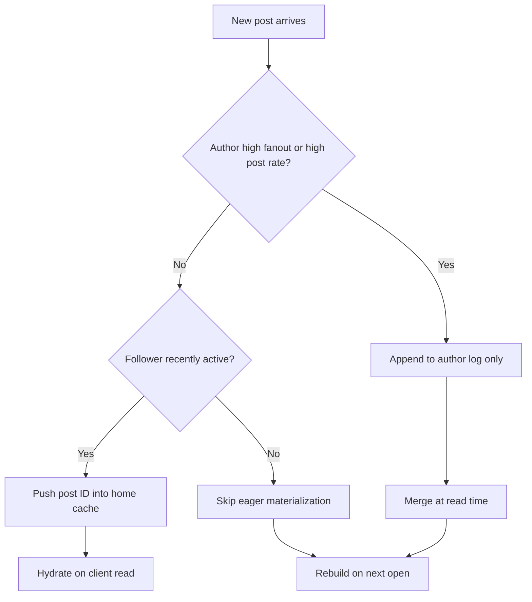
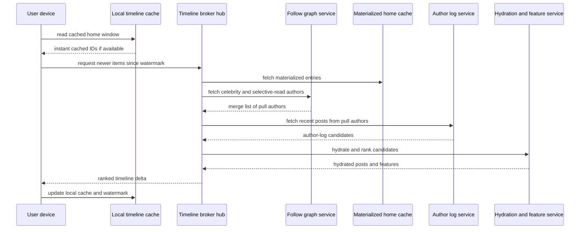
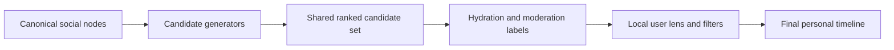
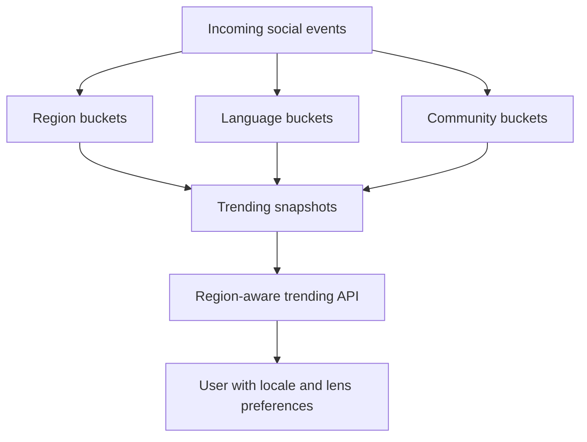
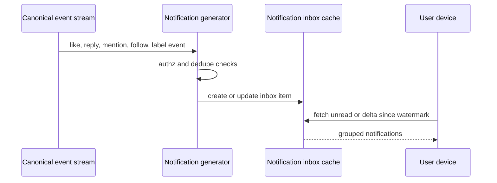
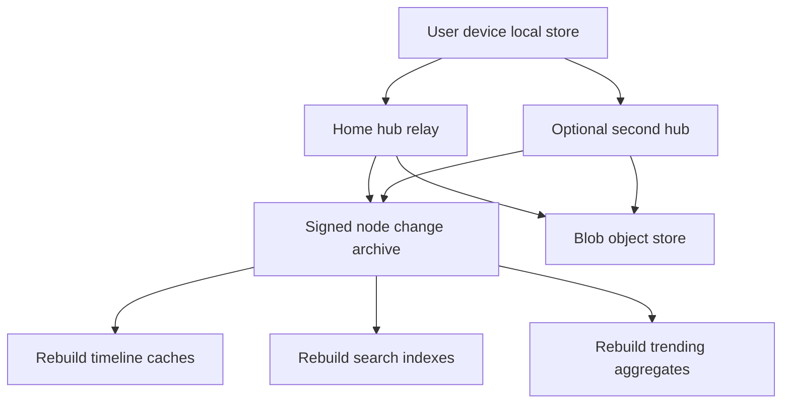

# 0116 - Architecting Decentralized Twitter/X on xNet

> **Status:** Exploration  
> **Date:** 2026-04-07  
> **Author:** OpenCode  
> **Tags:** social, timeline, federation, feeds, discovery, trending, search, hubs, caching, authorization

## Problem Statement

xNet already has prior explorations on Mastodon-style federation, Nostr integration, and universal social primitives.

The harder and more useful question now is:

> What would it actually take to build a decentralized Twitter/X-scale social network on xNet primitives, especially the part that is hardest at scale: serving personalized timelines, discovery, search, and trending with good latency, high availability, and user-controlled algorithms?

This exploration focuses on:

- home timeline construction
- discovery and ranking
- localized trending and search
- fanout on write vs fanout on read
- celebrity and high-fanout handling
- client timeline caching
- incentives for large hubs
- backups, robustness, and high availability
- clean composition with xNet nodes as the source of truth and xNet authorization as the policy layer

## Exploration Status

- [x] Determine next exploration number and existing style
- [x] Review prior social, search, federation, and universal-social-primitives explorations
- [x] Inspect current xNet code surfaces relevant to social graphs, authz, discovery, query, sync, and activity
- [x] Review external references on ActivityPub, Bluesky/AT Protocol, Nostr, Twitter timeline architecture, and feed materialization
- [x] Propose a realistic decentralized Twitter/X architecture on xNet
- [x] Cover peers, hubs, backing datastores, caches, incentives, robustness, and hardware
- [x] Include mermaid diagrams, recommendations, and implementation/validation checklists

## Executive Summary

The main conclusion is:

**A decentralized Twitter/X on xNet is plausible, but only if timelines are treated as derived, operator-heavy views rather than as the canonical user data itself.**

That means:

1. **Posts, follows, likes, blocks, lists, communities, and permissions are canonical xNet nodes.**
2. **Timelines, recommendations, trending, and discovery are materialized or query-time views derived from those nodes.**
3. **User devices and personal hubs own the source of truth. Large community and backbone hubs own the expensive reach layer.**
4. **Users should mostly customize ranking and feed selection, not each run their own full global aggregation stack.**

The most important architectural insight is:

**Separate speech from reach, and separate canonical state from timeline caches.**

That gives xNet the benefits of:

- local-first ownership
- portable identity and graph
- user-controlled algorithms
- rebuildable timeline caches
- independent discovery/search/trending operators

without forcing every device to act like a Twitter datacenter.

The second key insight is:

**A serious system must use a hybrid fanout model.**

Not:

- fanout-on-write for everything
- fanout-on-read for everything

But:

- fanout-on-write for ordinary authors and active followers
- fanout-on-read or selective materialization for celebrities and high-volume accounts
- cache recent personalized timeline windows on clients and hubs
- rebuild cold timelines on demand from author logs, graph indexes, and ranking services

The third key insight is:

**Discovery, trending, and social search should not be the same pipeline as the home timeline.**

They should be separate but composable services:

- home timeline service
- discover/for-you service
- social search service
- trending service
- moderation and label services

This matches how real systems scale.

## What xNet Has Now

The repo is materially stronger than it was when the earlier social explorations were written.

### Current relevant code surfaces

| Surface                                  | Current repo evidence                                                                                                                                                                                                                                  | Why it matters                                                                                             |
| ---------------------------------------- | ------------------------------------------------------------------------------------------------------------------------------------------------------------------------------------------------------------------------------------------------------ | ---------------------------------------------------------------------------------------------------------- |
| Universal comment primitive              | [`../../packages/data/src/schema/schemas/comment.ts`](../../packages/data/src/schema/schemas/comment.ts)                                                                                                                                               | xNet already has a schema-agnostic comment system targeting any node.                                      |
| Schema-agnostic relations                | [`../../packages/data/src/schema/properties/relation.ts`](../../packages/data/src/schema/properties/relation.ts)                                                                                                                                       | Follows, likes, blocks, boosts, list membership, and notifications all want graph edges.                   |
| NodeStore as canonical truth             | [`../../packages/data/src/store/store.ts`](../../packages/data/src/store/store.ts)                                                                                                                                                                     | Signed node changes and Lamport/LWW ordering fit posts, follows, labels, and moderation state.             |
| Node-native grants and policy evaluation | [`../../packages/data/src/auth/store-auth.ts`](../../packages/data/src/auth/store-auth.ts)                                                                                                                                                             | Followers-only, private groups, delegated moderators, and scoped timeline access all need this.            |
| Discovery service                        | [`../../packages/hub/src/services/discovery.ts`](../../packages/hub/src/services/discovery.ts)                                                                                                                                                         | Needed for DID resolution, peer/hub lookup, and eventually social operator directory data.                 |
| Hub relay for signed node changes        | [`../../packages/hub/src/services/node-relay.ts`](../../packages/hub/src/services/node-relay.ts)                                                                                                                                                       | Durable signed change propagation is the foundation for distributed social updates.                        |
| Offline queue and sync manager           | [`../../packages/react/src/sync/offline-queue.ts`](../../packages/react/src/sync/offline-queue.ts), [`../../packages/react/src/sync/sync-manager.ts`](../../packages/react/src/sync/sync-manager.ts)                                                   | Offline posting and delayed delivery are table stakes for social apps.                                     |
| Hub query and federation                 | [`../../packages/hub/src/services/query.ts`](../../packages/hub/src/services/query.ts), [`../../packages/hub/src/services/federation.ts`](../../packages/hub/src/services/federation.ts)                                                               | Discovery, search, and cross-hub aggregation already have a starting point.                                |
| Hub storage contract                     | [`../../packages/hub/src/storage/interface.ts`](../../packages/hub/src/storage/interface.ts)                                                                                                                                                           | The hub already models peers, awareness, federation, shard state, and persisted signed changes.            |
| History/audit activity model             | [`../../packages/history/src/types.ts`](../../packages/history/src/types.ts), [`../../packages/history/src/audit-index.ts`](../../packages/history/src/audit-index.ts)                                                                                 | There is already an activity summary and timeline substrate that can be adapted for social activity views. |
| Prior social explorations                | [`./0029_[_]_MASTODON_SOCIAL_NETWORKING.md`](./0029_[_]_MASTODON_SOCIAL_NETWORKING.md), [`./0030_[_]_UNIVERSAL_SOCIAL_PRIMITIVES.md`](./0030_[_]_UNIVERSAL_SOCIAL_PRIMITIVES.md), [`./0031_[_]_NOSTR_INTEGRATION.md`](./0031_[_]_NOSTR_INTEGRATION.md) | The conceptual direction is already there.                                                                 |

### Important current gap

The repo still does **not** have a production-grade:

- follow graph implementation
- global relation index
- timeline assembler
- notification generator
- trending service
- user discovery ranker
- celebrity read-path merge service

So the right reading is:

**xNet has the right primitives, but not yet the social serving layer.**

## Core Thesis

The best architecture for xNet social is not “Mastodon but with different storage,” and it is not “Nostr but richer.”

It is closer to:

- **xNet nodes as canonical source of truth**
- **AT-style separation between data hosting and expensive aggregation**
- **Twitter-style hybrid timeline materialization**
- **xNet-native portable, shareable timeline lenses and feed policies**

### 1. Canonical state should stay node-native

The following should be real nodes, signed and durable:

- `Profile`
- `Post`
- `Follow`
- `Like`
- `Boost`
- `Mute`
- `Block`
- `List`
- `Community`
- `Membership`
- `Notification`
- `ModerationLabel`
- `TimelineLens`
- `FeedSubscription`

### 2. Feeds should be derived and rebuildable

The following should **not** be canonical truth:

- home timeline cache entries
- discover feed entries
- trending buckets
- popularity counters
- celebrity merge buffers
- recommendation candidates

Those should all be derived views that can be recomputed from:

- node change logs
- graph indexes
- aggregated counters
- search/discovery feature stores

That is critical for:

- high availability
- portability
- moderation reversibility
- cache invalidation
- rebuilding after failures

### 3. Reach should be operator-heavy, but replaceable

Large-scale ranking, recommendation, search, and trending are expensive. Pretending otherwise leads to poor latency and weak discovery.

The system should therefore embrace:

- community hubs
- regional hubs
- backbone aggregation hubs
- independent feed generators
- independent moderation labelers

while making them:

- optional
- interchangeable
- auditable
- easy to switch away from

## xNet-Native Social Data Model

The old explorations were already close to the right shape.

### Recommended canonical schemas

| Schema             | Purpose                                | Notes                               |
| ------------------ | -------------------------------------- | ----------------------------------- |
| `Profile`          | human-readable actor state             | portable DID identity profile       |
| `Post`             | text/media post or reply               | public, followers-only, or direct   |
| `Follow`           | directed graph edge                    | status and notification preference  |
| `Like`             | universal endorsement edge             | schema-agnostic target              |
| `Boost`            | universal reshare edge                 | quote-boost optional                |
| `Mute`             | private suppression edge               | usually local/private               |
| `Block`            | stronger suppression and safety edge   | may affect relay and view policy    |
| `List`             | curated follow subset                  | enables list timelines              |
| `Community`        | operator or social grouping            | policy and discovery anchor         |
| `Membership`       | relation to community                  | can carry role                      |
| `Notification`     | durable inbox item                     | generated or partially materialized |
| `ModerationLabel`  | reach/moderation annotation            | speech/reach split                  |
| `TimelineLens`     | feed algorithm preferences and filters | key to user control                 |
| `FeedSubscription` | opt-in external or community feed      | points at generator or broker       |

### Recommended node relationships

### Important design rule

**Timelines are not nodes. Timeline policies and subscriptions are nodes. Timeline slices are caches.**

That avoids turning per-user high-churn feeds into canonical data that must be fully replicated and conflict-resolved forever.

## Speech, Reach, and Moderation

The best social systems today are converging on some version of the same lesson:

**posting and distribution should be distinct layers.**

This is especially aligned with xNet.

### What belongs to each layer

| Layer      | Responsibilities                                                            |
| ---------- | --------------------------------------------------------------------------- |
| Speech     | signed post/follow/like/block nodes, blob references, authz state           |
| Reach      | home timeline materialization, discovery, search, recommendations, trending |
| Moderation | labels, blocklists, relay acceptance, reach suppression, appeals            |
| Rendering  | local muting, filtering, ranking lens application, hide/show decisions      |

This lets xNet do something stronger than classic centralized X/Twitter:

- users keep their graph and content
- hubs compete on timeline quality and discovery
- moderation is layered, not all-or-nothing
- clients can override many reach decisions locally

## Recommended Architecture

### Role split

| Role                     | What it does                                                                  | What it should not do                                     |
| ------------------------ | ----------------------------------------------------------------------------- | --------------------------------------------------------- |
| User device              | canonical local state, local filters, local rerank, draft and offline posting | host a complete global social aggregation stack           |
| Personal/home hub        | relay node changes, sync blobs, keep user durable when offline                | own user identity or be the only copy of truth            |
| Community hub            | host graph/timeline/search/trending services for a community or region        | become mandatory global authority                         |
| Backbone aggregation hub | run large-scale discovery/search/trending/home-cache infra                    | own canonical user data                                   |
| Feed generator           | return ranked candidate post IDs for a lens                                   | become the only way to read your own graph                |
| Label service            | produce moderation or quality labels                                          | directly mutate user-owned posts without proper authority |

## Timelines as Derived Views

This is the centerpiece of the whole design.

### Timeline classes

| Timeline           | Main purpose                                             | Serving mode                              |
| ------------------ | -------------------------------------------------------- | ----------------------------------------- |
| Home / Following   | posts from followed accounts and selected boosts/replies | hybrid fanout + merge                     |
| Discover / For You | recommendations and relevance-ranked content             | read-time ranking                         |
| Notifications      | actions targeting you                                    | generated inbox + partial materialization |
| Profile            | author’s own post stream                                 | author log lookup                         |
| List               | curated subset of follows or communities                 | hybrid                                    |
| Local / Community  | posts from a hub/community/region                        | read-time query                           |
| Global / Federated | wide public feed                                         | read-time query, sampled and filtered     |

### The source of truth rule

This means timeline corruption or cache loss is survivable.

## How the Home Timeline Should Work

### High-level rule

Use a **hybrid fanout model**.

Twitter-scale history already showed why:

- pure write fanout collapses for celebrities
- pure read fanout is too expensive for normal users
- selective materialization wins

### Recommended strategy

#### Fanout-on-write for ordinary authors

For authors with:

- modest follower counts
- modest posting rates
- followers who are currently active

materialize post IDs into follower home timeline caches.

#### Fanout-on-read for celebrities and high-churn authors

For authors with:

- very high follower counts
- very high posting rates
- highly bursty traffic

do not push every post into every follower timeline. Instead:

- append to author log
- index in graph/search/discovery layers
- merge into user home timeline at read time

#### Selective materialization for inactive consumers

Do not materialize a deep recent cache for users who are not active.

Instead:

- keep author logs and recent global indexes
- rebuild their hot timeline window on open
- cache it once they become active again

### Decision policy

### Practical policy bands

| Author class                     | Suggested treatment                                       |
| -------------------------------- | --------------------------------------------------------- |
| ordinary account                 | push to active followers                                  |
| active but medium fanout account | push to active followers, maybe delayed to inactive users |
| celebrity account                | author-log only, merge on read                            |
| breaking-news or bot account     | often merge on read or into opt-in feeds only             |
| muted/suppressed account         | do not push to users who muted or filtered them           |

### Why xNet is well-suited here

Because the canonical content is already signed nodes, and because the relay layer already persists changes, materialized timelines can be treated as secondary artifacts.

That gives a cleaner architecture than systems where the cache layer effectively becomes the database.

## Home Timeline Query Flow

### Recommended timeline cache shape

Store in caches:

- post ID
- author ID
- event type such as original post or boost
- rank score or cursor metadata
- seen/unseen state
- local invalidation watermark

Do **not** store full post payloads as the primary timeline cache format.

Hydrate separately from:

- local store
- home hub blob/object cache
- hydration service

This mirrors the logic of serious social systems: cache IDs and metadata, hydrate late.

## Custom Timeline Algorithms

The user request is absolutely right here: the product should support deep user control over timeline algorithms.

### The right customization boundary

Most users should customize:

- feed selection
- ranking lenses
- source/domain/community boosts and suppressions
- reply/repost/media preferences
- language and region weighting
- moderation label subscriptions

Far fewer users will self-host the full discover pipeline.

So the system should distinguish:

- **feed generators**: shared candidate services
- **timeline lenses**: local or shareable reranking policies

### Recommended lens model

`TimelineLens` nodes should express:

- source preferences
- graph distance boosts
- boost/reply/media weighting
- recency weighting
- engagement weighting
- blocked and muted patterns
- locale and regional preferences
- moderation label policies

These can be:

- private
- shared with friends or communities
- published as public lenses

### Feed generator pattern

The Bluesky feed-generator shape is especially useful:

- generator returns candidate IDs plus minimal metadata
- hydration and rendering happen elsewhere

That composes well with xNet because xNet already has:

- canonical nodes
- hub query/search
- planned or future federated query routing

### Recommended algorithm layering

### Why this matters

This approach gives user choice without requiring every user to self-host massive aggregation services.

## Discovery, Search, and Trending

These should be separate services and separate caches.

### 1. Discovery / For You

Discovery should be read-time and feature-heavy.

Inputs:

- follow graph proximity
- engagement aggregates
- content embeddings or topic clusters
- local and community lens preferences
- moderation labels
- freshness
- region and language

This is operator-heavy and will tend to run on community or backbone hubs.

### 2. Social search

Public posts, profiles, communities, and tags should be searchable using the same broad architecture as the decentralized global web search exploration, but on a narrower social corpus.

Recommended social search layers:

- profile and community search
- post text and hashtag search
- author and quote/reply graph filters
- region/language-aware ranking
- moderation-safe filtering

This composes naturally with [`./0115_[_]_ARCHITECTING_FULLY_DECENTRALIZED_GLOBAL_WEB_SEARCH.md`](./0115_[_]_ARCHITECTING_FULLY_DECENTRALIZED_GLOBAL_WEB_SEARCH.md): social search can be a vertical over the broader search substrate.

### 3. Trending

Trending should be localized and multi-scope by default.

Recommended scopes:

- global
- region
- language
- community
- custom list or lens

And recommended objects:

- trending tags
- trending posts
- trending links
- emerging communities
- breaking local events

### Localized trending model

### Trend computation guidance

Trending should not be simple raw volume.

It should blend:

- unique authors
- unique engaged accounts
- acceleration over baseline
- locality relevance
- spam and repetition penalties
- moderation/quality labels

### Why local and regional scopes matter

Global trends alone recreate one of the worst parts of centralized social products: a single giant attention market.

xNet should instead make region, language, and community scopes first-class.

## Localization and Regionalization

The user explicitly asked for content properly localized for a given region and user. That should be designed in from the start.

### Recommended localization signals

- explicit profile locale
- preferred content languages
- time zone
- explicit region setting
- device and hub region hints
- communities and lists followed
- locally muted topics

### Where localization should apply

| Surface                        | Localization needed? |
| ------------------------------ | -------------------- |
| home timeline                  | yes, but lightly     |
| discover feed                  | strongly             |
| search ranking                 | strongly             |
| trending                       | strongly             |
| moderation labels and policies | often                |
| notification ranking           | sometimes            |

### Important nuance

Localization should guide ranking, not hard-censor visibility by default.

Users should be able to widen or narrow their effective world.

## How This Composes with Decentralized Search

The social system and the search system should not be separate empires.

They should share:

- canonical nodes
- signatures and change logs
- discovery directories
- federation layers
- caches and pack concepts where useful
- moderation labels
- ranking-lens publication model

### Shared substrate

| Shared primitive       | Search use                     | Social use                                         |
| ---------------------- | ------------------------------ | -------------------------------------------------- |
| `NodeStore`            | canonical docs and metadata    | canonical posts, follows, labels                   |
| hub federation         | cross-hub query                | cross-hub discovery and social search              |
| discovery service      | find search operators          | find social hubs, feed services, labelers          |
| query/search services  | public content search          | social post/profile/community search               |
| pack/snapshot thinking | downloadable search slices     | community social archives and cached topical feeds |
| ranking lenses         | user-defined web search rerank | user-defined timeline rerank                       |

### Recommended composition rule

**Public social posts are just another searchable public corpus, but timeline assembly is a separate service.**

That avoids overloading the search layer with home-feed semantics while still reusing the same indexing and discovery substrate.

## Authorization and Privacy Model

This is where xNet is stronger than most decentralized-social designs.

### Canonical policy model

Use xNet node-native authz and grants for:

- followers-only posts
- direct or mentioned posts
- community roles
- moderator delegation
- label publication rights
- operator capabilities

### Suggested visibility mapping

| Visibility | Canonical policy                              |
| ---------- | --------------------------------------------- |
| public     | public read                                   |
| followers  | relation-based role or derived followers view |
| mentioned  | grant or mention-based allowed-reader set     |
| direct     | explicit grant and encrypted payload          |
| community  | community membership role                     |

### Privacy rule

Private content should still be canonical xNet state, but:

- encrypted when needed
- relayed only to allowed hubs/peers
- excluded from public search/discovery/trending services

### Local private controls

The user should always be able to keep some controls local only:

- mutes
- hidden words/topics
- personal suppressions
- ranking taste
- feed follow order

This lets customization get quite deep without leaking personal preference to the network.

## Requirements from Peers, Hubs, Backing Datastores, and Caches

### Peer requirements

| Peer capability                 | Why needed                                                                    |
| ------------------------------- | ----------------------------------------------------------------------------- |
| local node store                | canonical user truth and offline use                                          |
| local timeline cache            | personalized feeds are too expensive to rebuild constantly                    |
| offline queue                   | queued posts, likes, follows, and moderation actions must survive disconnects |
| local lens and filtering engine | private customization should stay on device when possible                     |
| local media cache               | hydration and scrolling must remain fast                                      |
| multi-hub failover support      | users should not disappear when one hub fails                                 |

Typical serious peer hardware:

- 8-32 GB RAM
- 50-500 GB SSD
- stable local persistence

### Personal and small hub requirements

| Hub capability            | Why needed                            |
| ------------------------- | ------------------------------------- |
| node relay                | durable change propagation            |
| blob mirror               | media and attachment continuity       |
| peer/hub discovery        | find followers, communities, services |
| notification buffering    | user can reconnect and catch up       |
| export and backup surface | account portability and survivability |

Typical small hub hardware:

- 2-8 vCPU
- 8-32 GB RAM
- 100 GB-2 TB SSD or object-backed blobs

### Community hub requirements

| Hub capability            | Why needed                                        |
| ------------------------- | ------------------------------------------------- |
| follow graph index        | timeline assembly depends on graph speed          |
| timeline materializer     | precompute hot home windows                       |
| discovery/search service  | community UX depends on findability               |
| trending/locality service | localized discovery and moderation                |
| moderation label service  | community safety and quality control              |
| hydration/object cache    | faster client rendering and lower origin pressure |

Typical community hub hardware:

- 8-32 vCPU
- 64-256 GB RAM
- 2-20 TB NVMe or attached SSD
- object storage for media

### Backbone aggregation hub requirements

| Hub capability                        | Why needed                                 |
| ------------------------------------- | ------------------------------------------ |
| high-throughput event ingest          | wide public network aggregation            |
| celebrity merge service               | avoids collapse under high-fanout accounts |
| large search and discovery indexes    | public social network usability            |
| regional trend computation            | localized trending and recommendations     |
| feed-generator hosting                | plural algorithm ecosystem                 |
| labeler and reputation infrastructure | abuse and spam resistance                  |

Typical backbone hardware:

- 32-128 vCPU per service pool
- 256 GB-1 TB RAM
- large NVMe tiers and object storage
- high ingress/egress bandwidth is often the first pain point

### Required datastores

| Datastore                     | Purpose                                          |
| ----------------------------- | ------------------------------------------------ |
| signed node change log        | canonical social events                          |
| relation / follow graph index | follow, block, mute, list, community edges       |
| timeline cache store          | recent personalized feed slices                  |
| author log store              | pull-path for celebrities and cold users         |
| hydration store               | post objects, profiles, media references         |
| search index                  | social post, profile, community discovery        |
| feature store                 | ranking inputs for discovery and feed generation |
| regional counters             | trending and locality-aware aggregates           |
| blob/object store             | media                                            |

### Required cache layers

| Cache                   | What it holds                                 | Why it matters                          |
| ----------------------- | --------------------------------------------- | --------------------------------------- |
| client home cache       | personal recent feed IDs and cursors          | fastest personalized path               |
| client hydration cache  | rendered post/profile/media metadata          | smooth scrolling                        |
| hub home cache          | hot active-user timeline windows              | cheap reads                             |
| celebrity merge cache   | recent outputs for widely shared pull authors | controls tail latency                   |
| graph cache             | adjacency and relationship summaries          | every feed query needs it               |
| hydration cache         | post/profile/object lookup                    | separates ranking from full object load |
| search/discovery cache  | hot result sets and candidate lists           | lower repeated compute                  |
| trending snapshot cache | recent region/language/community trends       | fast localized UX                       |

## Timeline Caching Strategy

The user specifically called out client caching, which matters a lot because home timelines are deeply personal.

### Recommended client cache model

For each active lens, cache:

- recent item IDs
- cursor or sequence watermark
- local per-item state such as seen, dismissed, hidden
- a small amount of score metadata

Recommended lens classes to cache locally:

- following/home
- one or two discover lenses
- notifications
- one or two list/community timelines

### Recommended cache behavior

| Situation         | Client behavior                           |
| ----------------- | ----------------------------------------- |
| app open          | show cached timeline immediately          |
| network healthy   | request delta from broker since watermark |
| partial outage    | keep local cache and degraded hydration   |
| lens change       | fork new cache namespace                  |
| mute/block change | re-filter locally before network refresh  |
| cold user         | rebuild a hot window from hub then cache  |

### Important rule

Client timeline caches should be **lens-specific**. A “chronological following” feed and a “for you” feed should not share the same cached rank order.

### Memory intuition

If a hot timeline window stores around 800 recent entries as IDs plus small metadata, the raw compact cost is only tens of kilobytes per active user per lens. The real cost explosion comes from:

- multiple lenses
- cache object overhead
- replication
- inactive-user waste

That is why only active users and hot windows should be materialized aggressively.

## Fanout on Write vs Fanout on Read

This deserves its own section because it is the key infrastructure decision.

### Fanout on write

**Pros**

- very fast home timeline reads
- easy recency ordering
- works great for ordinary users

**Cons**

- expensive for high-fanout authors
- queue spikes during major events
- lots of writes for followers who never open the app

### Fanout on read

**Pros**

- much cheaper for celebrity authors
- better for inactive users and cold-start rebuilds
- easier to personalize late

**Cons**

- more expensive reads
- harder latency guarantees
- more ranking and merge complexity

### Recommended xNet policy

Use three buckets:

1. **push bucket** for ordinary authors and active followers
2. **pull bucket** for celebrity authors and special feeds
3. **selective bucket** for users who are not active enough to deserve continuous materialization

### Why this composes well with xNet

Because xNet canonical data is signed nodes and not the feed cache itself, the system can make per-author or per-edge materialization decisions without changing the underlying truth model.

## Notifications and Inbox

Notifications should be treated like a semi-materialized inbox.

### Canonical vs derived split

Canonical events:

- follows
- likes
- boosts
- mentions
- replies
- moderation actions

Derived inbox entries:

- grouped “X and Y liked your post” views
- unread counts
- batched mention alerts
- priority ranking

### Recommended notification model

This avoids turning every low-level action into a UI object that must be preserved forever in exactly the same presentation form.

## Search and Discovery as Social App Views

The AT stack is right about one important thing:

**large-scale search and app views are separate from cheap user data hosting.**

That is the right lesson for xNet too.

### Recommended xNet service families

| Service family        | Function                                 |
| --------------------- | ---------------------------------------- |
| personal hubs         | sync, identity, durable relay, blobs     |
| timeline brokers      | build home/list/discover feeds           |
| discovery/search hubs | profiles, posts, communities, tags       |
| trend hubs            | regional and community trend aggregation |
| feed generators       | user-selectable ranking candidates       |
| labelers              | moderation and trust annotations         |

This lets large-scale operators do expensive work without owning user identity or canonical data.

## Moderation and Governance

Decentralized social systems become operationally hard not because posting is hard, but because abuse, spam, and moderation are hard.

### Recommended layered moderation model

| Layer              | Examples                                                 |
| ------------------ | -------------------------------------------------------- |
| write acceptance   | hub refuses spam or known-abusive uploads                |
| relay distribution | hub declines to propagate or boosts rate limits          |
| search/discovery   | do not rank or trend certain content                     |
| client rendering   | hide, blur, de-rank, or annotate via subscribed labelers |

### Recommended moderation artifacts

Treat moderation labels and policies as data too:

- `ModerationLabel`
- `BlockRule`
- `Appeal`
- `LabelSubscription`
- `CommunityPolicy`

This makes moderation more transparent and composable.

### Important governance insight

No decentralized system escapes operator concentration entirely. The goal is not zero concentration; the goal is:

- portability
- switchability
- layered control
- transparent policies

## Incentive Models for Large Hubs

This is one of the biggest practical questions.

The system needs some people to run expensive services:

- discovery/search/trending
- feed generators
- large home-cache clusters
- moderation tooling
- media mirrors

### Recommended incentive models

#### 1. Subscription hosting

Users pay for:

- personal hub hosting
- community hub membership
- premium media/storage tiers

This is the simplest and most honest model.

#### 2. App-view and API revenue

Apps or third-party developers pay backbone hubs for:

- discovery/search APIs
- trend APIs
- feed-generation APIs
- hydration and firehose APIs

This is especially plausible for operator-heavy hubs.

#### 3. Community and co-op funding

Regional or topical hubs are funded by:

- donations
- memberships
- sponsorships
- institutional support

This is a strong fit for communities rather than global profit-maximizers.

#### 4. Nostr-like relay fees for write-heavy or high-cost services

Optional fees can exist for:

- high-rate posting
- large media uploads
- expensive search/discovery usage
- premium indexing or moderation support

This is useful as an anti-abuse and sustainability lever.

#### 5. Protocol-level revenue sharing or usage-based payouts

If xNet later wants a more explicit operator economy, then usage-based payouts could reward:

- high-quality feed generators
- search/trending operators
- archival mirrors
- moderation service providers

This is higher complexity and should be later, not day one.

### Recommended near-term economics

Start with:

1. paid hosting
2. optional API/service tiers
3. community funding

Avoid starting with token economics.

## Backups, Robustness, and High Availability

The system should assume:

- user devices go offline
- hubs fail
- feed caches corrupt
- search/discovery operators vanish

### High availability rule

**No rebuildable derived view should be treated as irreplaceable.**

That means:

- timeline caches are disposable
- author logs are durable
- node change logs are durable
- blobs are mirrored or object-backed
- users can connect to more than one hub

### Recommended resilience model

### Backup layers

| Layer                | Backup strategy                                                                                              |
| -------------------- | ------------------------------------------------------------------------------------------------------------ |
| user canonical nodes | local export plus hub mirrors                                                                                |
| node change logs     | append-only archive and snapshotting                                                                         |
| blobs                | object storage replication                                                                                   |
| hub databases        | WAL shipping or Litestream-like continuous replication for small setups; managed replication for larger ones |
| derived indexes      | rebuildable from canonical logs plus snapshots                                                               |

### Small/medium/large deployment guidance

| Tier          | Suggested persistence approach                                                                                          |
| ------------- | ----------------------------------------------------------------------------------------------------------------------- |
| personal hub  | SQLite + object storage + regular signed exports                                                                        |
| community hub | SQLite with continuous replication or Postgres + object storage + standby                                               |
| backbone hub  | Postgres/read replicas + Redis or equivalent cache + object storage + event pipeline + multi-node search/index services |

### Multi-hub recommendation

For social, multi-hub support is more important than in many other domains because outages are visible to users immediately.

At minimum, users should be able to:

- publish through one primary hub
- replicate to one backup hub
- read through alternate discovery or feed providers

## Hardware and Capacity Planning

### Important framing

The architecture should support several scales, not only “planet-scale now.”

### Plausible deployment levels

| Level                    | Rough scale                        | Infra shape                                                         |
| ------------------------ | ---------------------------------- | ------------------------------------------------------------------- |
| personal/social circle   | 1-1000 users                       | local-first devices plus one small hub                              |
| community hub            | 1K-100K users                      | one or a few hubs with graph/timeline/search services               |
| regional social operator | 100K-5M users                      | dedicated graph, timeline, discovery, trending, and object services |
| global backbone operator | 5M+ users or broad federation role | service clusters with large caches, indexes, and feed generators    |

### Small community deployment

Good for:

- local scene
- topic community
- small network app

Typical hardware:

- 4-8 vCPU
- 16-64 GB RAM
- 500 GB-4 TB SSD
- object storage for media

### Serious community or regional hub

Good for:

- large public community
- localized social network
- high activity niche app

Typical hardware:

- 16-32 vCPU
- 128-256 GB RAM
- 4-20 TB NVMe
- separate cache tier and object store

### Backbone timeline/search operator

Typical hardware profile:

- 32-128 vCPU pools
- 256 GB-1 TB RAM across timeline and search clusters
- large NVMe footprint for indexes and hot working set
- high sustained network bandwidth

### What actually becomes expensive first

Usually in this order:

1. network egress and concurrent connections
2. media storage and delivery
3. timeline cache memory
4. discovery/search index growth
5. moderation staffing and tooling

### Home timeline cache memory intuition

If you keep a hot window of about `800` timeline entries for active users, then raw compact storage is manageable. The real cost comes from:

- object overhead in cache systems
- replication
- many concurrent active users
- multiple lenses per user

This is exactly why:

- only active users should have hot materialized windows
- celebrity authors should mostly stay on the pull path
- local client caches should absorb some personalization load

## Recommended Timeline Serving Policy

### Simple rule set for v1

1. Materialize home timelines for active users only.
2. Materialize only post IDs plus small metadata.
3. Push ordinary-author posts into active-user home caches.
4. Pull celebrity-author posts from author logs at read time.
5. Keep notifications separate from home timeline caches.
6. Keep discover/search/trending separate from home timeline service.
7. Let users choose or publish `TimelineLens` policies.

### Why this is the right compromise

It gives:

- strong local-first truth model
- predictable read latency for most users
- controlled celebrity cost
- support for algorithmic choice
- easy rebuild of caches after failure

## Recommended Direction for xNet

### Recommendation 1

**Use xNet nodes as the canonical speech and graph layer.**

Do not move posts, follows, or permissions into opaque external timeline infrastructure as the source of truth.

### Recommendation 2

**Treat timelines, trends, and discovery as app-view style derived services.**

This is the cleanest way to scale while preserving user ownership.

### Recommendation 3

**Implement a global relation index before serious social work.**

Without a scalable reverse relation/follow graph index, home timelines, blocks, lists, and notifications will not scale.

### Recommendation 4

**Build hybrid fanout from day one.**

Do not start with one global policy and rewrite it later.

### Recommendation 5

**Make `TimelineLens` and `FeedSubscription` first-class schemas.**

User-controlled algorithms should be part of the architecture, not an afterthought.

### Recommendation 6

**Localize trending and discovery by default.**

Region, language, and community should be first-class aggregation scopes.

### Recommendation 7

**Keep the local client cache rich enough to hide network jitter.**

Social products feel broken if they only work in a perfect always-online mode.

## Concrete Next Actions

1. Define first-party schemas for `Post`, `Follow`, `Like`, `Boost`, `Mute`, `Block`, `Community`, `Membership`, `Notification`, `ModerationLabel`, `TimelineLens`, and `FeedSubscription`.
2. Build a real global relation index over node changes, not only ad hoc scans.
3. Add a follow graph service and author log service to hub architecture.
4. Build a home timeline materializer with hybrid fanout policy.
5. Add a celebrity merge service for read-time author-log merging.
6. Build a notification generator and grouped-inbox cache.
7. Add a social search service over public post/profile/community nodes.
8. Add localized trending snapshots by region, language, and community.
9. Add feed-generator endpoints and lens-aware client selection.
10. Add moderation labels and label subscription model.

## Implementation Checklist

### Phase 1: Canonical social graph and schemas

- [ ] Define and publish core social schemas
- [ ] Add relation indexing for follow/block/list/community graphs
- [ ] Add dedupe rules for likes, boosts, follows, and blocks
- [ ] Add authorization defaults for public, followers-only, direct, and community visibility

### Phase 2: Timeline serving foundation

- [ ] Add author log service for posts and boosts
- [ ] Add active-user home timeline materialization cache
- [ ] Add hybrid push/pull policy for authors and followers
- [ ] Add local client timeline cache with watermarks and delta fetch

### Phase 3: Notifications and social UX

- [ ] Add notification generator and grouped inbox
- [ ] Add list/community timelines
- [ ] Add basic local and community feeds
- [ ] Add client hooks for timeline, notifications, and social actions

### Phase 4: Discovery, search, and trending

- [ ] Add profile and post search on hubs
- [ ] Add discovery/recommendation feature store
- [ ] Add localized trending buckets and snapshots
- [ ] Add discovery APIs and ranking policies

### Phase 5: Algorithmic choice and moderation

- [ ] Add `TimelineLens` and `FeedSubscription` nodes
- [ ] Add feed-generator protocol and lens-aware ranking
- [ ] Add moderation labels, subscriptions, and appeals model
- [ ] Add relay, search, and timeline policy hooks for labels and trust controls

### Phase 6: Robustness and operator scaling

- [ ] Add multi-hub replication and failover support
- [ ] Add signed export/import for account and graph portability
- [ ] Add object-store backed media and archival policy
- [ ] Add rebuild tooling for timeline, search, and trending caches

## Validation Checklist

### Timeline correctness

- [ ] Home timeline ordering is stable under mixed push and pull sources
- [ ] Celebrity replies do not commonly appear before the original post in follower timelines
- [ ] Cold-user timeline reconstruction is correct and acceptably fast
- [ ] Lens-specific caches remain isolated and do not leak ranking state across feeds

### Performance

- [ ] Active-user home timeline reads stay low-latency under realistic load
- [ ] Celebrity accounts do not trigger catastrophic write amplification
- [ ] Client timeline cache materially improves perceived latency on reopen and reconnect
- [ ] Search/discovery/trending services scale independently of home-timeline cache pressure

### Privacy and authorization

- [ ] Followers-only and direct posts never leak into public indexes or unauthorized feeds
- [ ] Local mute/block/filter preferences can operate without uploading all private preference data
- [ ] Community and moderator delegation flows are enforced through xNet authorization primitives
- [ ] Multi-hub routing does not bypass content visibility rules

### Decentralization and portability

- [ ] Users can switch hubs without losing canonical graph or post history
- [ ] Derived caches can be rebuilt without canonical data loss
- [ ] More than one operator can host search, trending, and feed-generation services
- [ ] Users can swap feeds, labelers, and hubs without abandoning identity or graph

### Moderation and safety

- [ ] Relay-level abuse controls protect operators from obvious spam floods
- [ ] Search/discovery/trending services respect labels and block rules
- [ ] Appeals and review processes remain comprehensible to operators and users
- [ ] No single moderation provider is required for the entire network to function

## Open Questions

1. **How granular should hybrid materialization be?** Per-author, per-follower, or per-edge decisioning all have different complexity costs.
2. **How much discovery personalization should stay local vs hub-side?**
3. **Should community hubs be allowed to expose paid premium discovery or timeline APIs, and if so how standardized should that be?**
4. **How should block/mute semantics propagate across hubs while respecting user privacy?**
5. **What is the right default lens set for new users without recreating opaque centralized recommendations?**
6. **How much global discovery should be allowed before the system simply recentralizes socially around a few giant operators?**

## Final Take

The right way to build decentralized Twitter/X on xNet is:

- **canonical nodes for speech and graph**
- **derived services for reach**
- **hybrid fanout for home timeline**
- **separate pipelines for discovery, search, and trending**
- **shareable feed generators and local timeline lenses**
- **multi-hub resilience with rebuildable caches**

Not:

- one giant Mastodon-style inbox/outbox push network for everything
- one flat relay fabric with no graph-aware aggregation
- one canonical timeline object replicated everywhere

This gives xNet a credible path to something stronger than a clone of X/Twitter:

- user-owned graph and content
- customizable algorithms
- regional and community-first discovery
- operator plurality in the reach layer
- portable identity and authorization built on the same primitives as the rest of the xNet ecosystem

That is the key design principle:

**xNet should make the social graph and posts durable, portable, and user-owned, while making timelines competitive, replaceable, and personalized.**

## References

### Codebase

- [`./0029_[_]_MASTODON_SOCIAL_NETWORKING.md`](./0029_[_]_MASTODON_SOCIAL_NETWORKING.md)
- [`./0030_[_]_UNIVERSAL_SOCIAL_PRIMITIVES.md`](./0030_[_]_UNIVERSAL_SOCIAL_PRIMITIVES.md)
- [`./0031_[_]_NOSTR_INTEGRATION.md`](./0031_[_]_NOSTR_INTEGRATION.md)
- [`./0115_[_]_ARCHITECTING_FULLY_DECENTRALIZED_GLOBAL_WEB_SEARCH.md`](./0115_[_]_ARCHITECTING_FULLY_DECENTRALIZED_GLOBAL_WEB_SEARCH.md)
- [`../../packages/data/src/schema/schemas/comment.ts`](../../packages/data/src/schema/schemas/comment.ts)
- [`../../packages/data/src/schema/properties/relation.ts`](../../packages/data/src/schema/properties/relation.ts)
- [`../../packages/data/src/auth/store-auth.ts`](../../packages/data/src/auth/store-auth.ts)
- [`../../packages/hub/src/services/discovery.ts`](../../packages/hub/src/services/discovery.ts)
- [`../../packages/hub/src/services/node-relay.ts`](../../packages/hub/src/services/node-relay.ts)
- [`../../packages/hub/src/storage/interface.ts`](../../packages/hub/src/storage/interface.ts)
- [`../../packages/react/src/sync/offline-queue.ts`](../../packages/react/src/sync/offline-queue.ts)
- [`../../packages/history/src/types.ts`](../../packages/history/src/types.ts)
- [`../../packages/history/src/audit-index.ts`](../../packages/history/src/audit-index.ts)
- [`../VISION.md`](../VISION.md)

### External references

- [ActivityPub Recommendation](https://www.w3.org/TR/activitypub/)
- [Mastodon scaling documentation](https://docs.joinmastodon.org/admin/scaling/)
- [Mastodon trends API](https://docs.joinmastodon.org/methods/trends/)
- [AT Protocol overview](https://atproto.com/guides/overview)
- [The AT Stack](https://atproto.com/guides/the-at-stack)
- [AT Protocol going to production](https://atproto.com/guides/going-to-production)
- [AT Protocol moderation](https://atproto.com/guides/moderation)
- [Bluesky custom feeds](https://docs.bsky.app/docs/starter-templates/custom-feeds)
- [Bluesky firehose guide](https://docs.bsky.app/docs/advanced-guides/firehose)
- [Twitter timeline architecture summary](https://highscalability.com/the-architecture-twitter-uses-to-deal-with-150m-active-users/)
- [Feeding Frenzy summary](https://highscalability.com/paper-feeding-frenzy-selectively-materializing-users-event-f/)
- [Nostr NIP-11 relay information document](https://raw.githubusercontent.com/nostr-protocol/nips/master/11.md)
