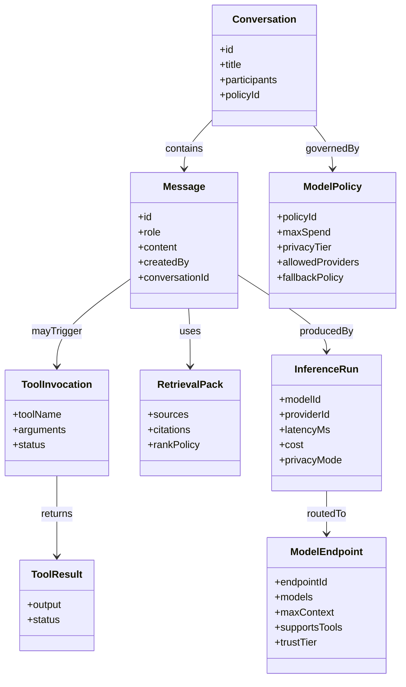
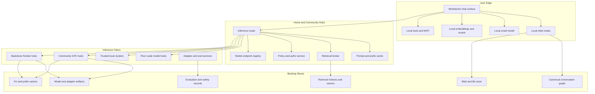
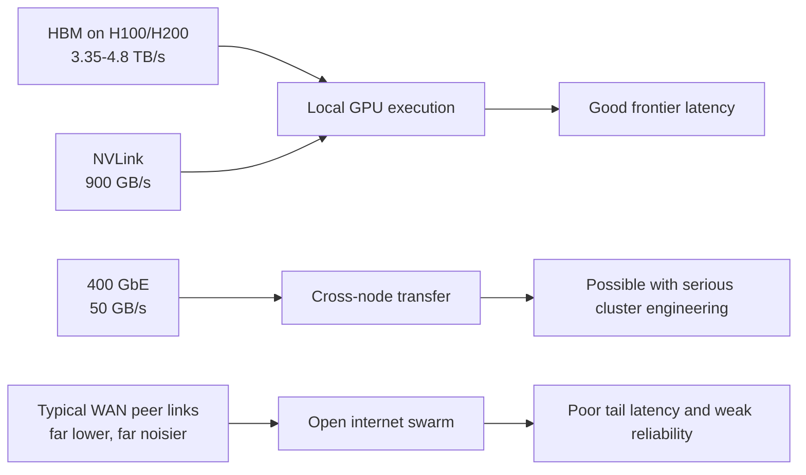
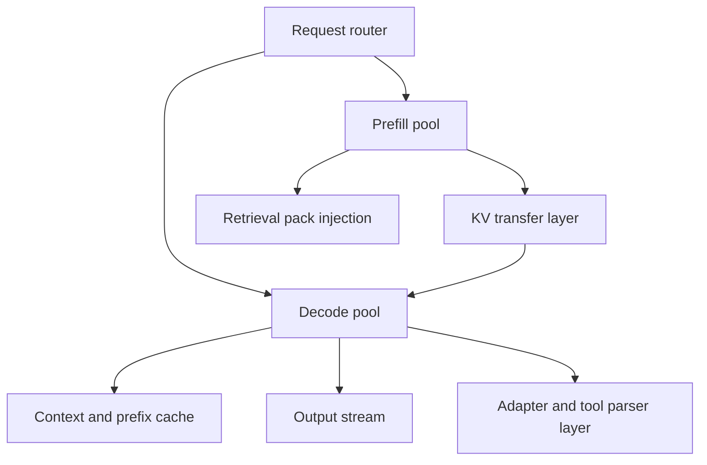
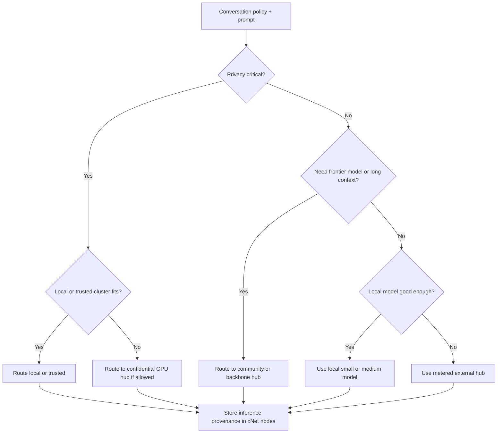
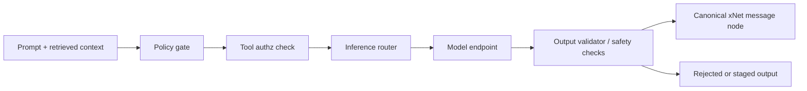
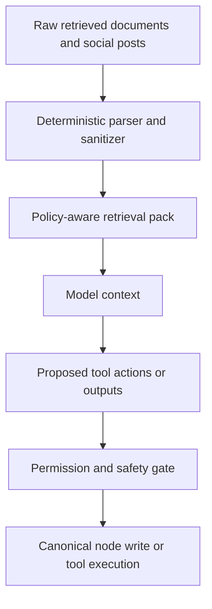
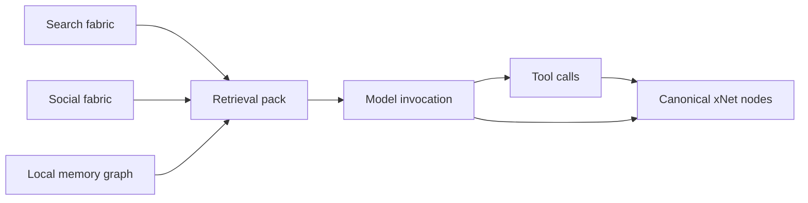

# 0117 - Architecting Decentralized AI on xNet

> **Status:** Exploration  
> **Date:** 2026-04-07  
> **Author:** OpenCode  
> **Tags:** AI, agents, inference, models, GPUs, federation, hubs, security, incentives, chat

## Problem Statement

The previous two explorations covered:

- decentralized global search
- decentralized social timelines and discovery

The next obvious question is:

> What might decentralized AI look like on top of xNet, especially if the goal is to serve frontier open-weight models at scale while keeping interface state canonical, portable, and secure?

This exploration focuses on:

- the infrastructure needed to run very large open-weight models at scale
- whether frontier open models like Kimi K2-class or DeepSeek-V3-class systems can run on peers or only on massive hubs
- how xNet should separate canonical chat and agent state from pluggable model backends
- the security, trust, and incentive structure needed for shared inference
- how this composes with the earlier search and social explorations

There is one extra design requirement from the user that should drive the whole architecture:

> **The chat interface should use canonical xNet nodes, but the model can be anything.**

That is the right requirement.

## Exploration Status

- [x] Determine next exploration number and existing style
- [x] Review prior xNet explorations for AI, workbench, clipper, search, social, and infrastructure
- [x] Inspect current xNet code surfaces relevant to local inference, tools, retrieval, authz, and federation
- [x] Review external references for frontier open-weight models, distributed serving, disaggregated inference, and trusted execution
- [x] Propose a realistic decentralized AI architecture on xNet
- [x] Cover peers, hubs, datastores, caches, incentives, and security
- [x] Include mermaid diagrams, recommendations, and implementation/validation checklists

## Executive Summary

The main conclusion is:

**Decentralized AI is realistic only if xNet separates canonical AI interaction state from the actual inference fabric.**

That means:

1. **Conversations, messages, tool calls, tool results, retrieval packs, memory items, and policies are canonical xNet nodes.**
2. **Inference is a routed service that may run locally, on trusted peer clusters, on community hubs, or on backbone GPU hubs.**
3. **Frontier open-weight models are mostly a hub problem, not a normal peer problem.**
4. **Peers are still extremely useful for small models, embeddings, ranking, personal memory, tool execution, and privacy-preserving local fallback.**

The most important architectural insight is:

**Treat AI like search and social reach: user-owned canonical state, operator-heavy derived serving.**

The canonical xNet layer should own:

- chat history
- memory
- tools and permissions
- retrieval context
- provenance
- policies

The serving layer should own:

- model weight hosting
- GPU scheduling
- batching
- KV caches
- prefill/decode separation
- endpoint routing

The second key insight is:

**A frontier open-weight model is not made peer-friendly just because it is open-weight.**

For MoE models like Kimi K2 or DeepSeek-V3:

- activated parameters per token are lower than total parameters
- but the full weights still need to live somewhere across the cluster
- the serving bottlenecks are memory footprint, memory bandwidth, KV cache growth, and interconnect speed

That means:

- small and medium models can live on peers
- 70B-class dense models can live on large peers or workstations
- 200B+ and 600B+ open models mostly belong on trusted clusters and datacenter-class hubs

The third key insight is:

**Open internet volunteer swarms are interesting for research, hobbyist use, and low-SLA tasks, but not yet a credible default for sensitive or premium frontier inference.**

The near-term realistic shape is:

- local models on edge devices
- trusted local clusters for enthusiasts and teams
- federated large hubs for frontier inference
- optional markets and routing layers over those hubs

Not:

- BitTorrent for trillion-parameter agentic models

## What xNet Has Now

xNet is already much closer to useful decentralized AI infrastructure than it looks at first glance.

### Current relevant code surfaces

| Surface                               | Current repo evidence                                                                                                                                                                                                                                              | Why it matters                                                                             |
| ------------------------------------- | ------------------------------------------------------------------------------------------------------------------------------------------------------------------------------------------------------------------------------------------------------------------ | ------------------------------------------------------------------------------------------ |
| Local API                             | [`../../packages/plugins/src/services/local-api.ts`](../../packages/plugins/src/services/local-api.ts)                                                                                                                                                             | xNet already has a localhost integration boundary for agents and external runtimes.        |
| MCP server                            | [`../../packages/plugins/src/services/mcp-server.ts`](../../packages/plugins/src/services/mcp-server.ts)                                                                                                                                                           | xNet already has a first-class agent tooling surface.                                      |
| AI provider abstraction               | [`../../packages/plugins/src/ai/providers.ts`](../../packages/plugins/src/ai/providers.ts)                                                                                                                                                                         | The repo already models cloud and local providers behind one interface.                    |
| Plugin service runtime                | [`../../packages/plugins/src/services/process-manager.ts`](../../packages/plugins/src/services/process-manager.ts)                                                                                                                                                 | Useful for local inference daemons, sidecars, and model-serving processes.                 |
| Plugin tool/context model             | [`../../packages/plugins/src/context.ts`](../../packages/plugins/src/context.ts), [`../../packages/plugins/src/contributions.ts`](../../packages/plugins/src/contributions.ts)                                                                                     | Useful for model-agnostic tool and UI composition.                                         |
| Workbench direction                   | [`./0111_[_]_UNIFIED_WORKBENCH_ARCHITECTURE_FOR_XNET.md`](./0111_[_]_UNIFIED_WORKBENCH_ARCHITECTURE_FOR_XNET.md)                                                                                                                                                   | xNet already wants agent tools and chat/jobs/agents surfaces inside a unified shell.       |
| AI integration direction              | [`./0061_[_]_AI_AGENT_INTEGRATION.md`](./0061_[_]_AI_AGENT_INTEGRATION.md)                                                                                                                                                                                         | xNet already identified Local API and MCP as the right integration path.                   |
| Knowledge ingestion and RAG direction | [`./0112_[_]_UNIVERSAL_CLIPPER_AND_AI_KNOWLEDGE_GRAPH_INGESTION.md`](./0112_[_]_UNIVERSAL_CLIPPER_AND_AI_KNOWLEDGE_GRAPH_INGESTION.md)                                                                                                                             | Strong foundation for retrieval and agent memory.                                          |
| Vectors and hybrid search             | [`../../packages/vectors/src/search.ts`](../../packages/vectors/src/search.ts), [`../../packages/vectors/src/hybrid.ts`](../../packages/vectors/src/hybrid.ts)                                                                                                     | Strong local retrieval substrate already exists.                                           |
| Hub query and federation              | [`../../packages/hub/src/services/query.ts`](../../packages/hub/src/services/query.ts), [`../../packages/hub/src/services/federation.ts`](../../packages/hub/src/services/federation.ts)                                                                           | Retrieval and multi-hub routing patterns already exist.                                    |
| Discovery service                     | [`../../packages/hub/src/services/discovery.ts`](../../packages/hub/src/services/discovery.ts)                                                                                                                                                                     | Future model endpoints, feed generators, labelers, and inference operators need discovery. |
| UCAN and grants                       | [`../../packages/data/src/auth/store-auth.ts`](../../packages/data/src/auth/store-auth.ts), [`../../packages/identity/src/ucan.ts`](../../packages/identity/src/ucan.ts)                                                                                           | Scoped tool permissions and delegated agent execution are already aligned with xNet.       |
| Chat/message direction                | [`./0028_[_]_CHAT_AND_VIDEO.md`](./0028_[_]_CHAT_AND_VIDEO.md)                                                                                                                                                                                                     | The repo already has a node-native chat model direction.                                   |
| Search and social reach explorations  | [`./0115_[_]_ARCHITECTING_FULLY_DECENTRALIZED_GLOBAL_WEB_SEARCH.md`](./0115_[_]_ARCHITECTING_FULLY_DECENTRALIZED_GLOBAL_WEB_SEARCH.md), [`./0116_[_]_ARCHITECTING_DECENTRALIZED_TWITTER_X_ON_XNET.md`](./0116_[_]_ARCHITECTING_DECENTRALIZED_TWITTER_X_ON_XNET.md) | AI can reuse the same federation, discovery, and derived-view logic.                       |

### Important current gap

xNet still does **not** have a production-grade:

- inference router
- model registry
- GPU hub runtime
- canonical AI memory schemas
- evaluation and safety policy layer
- model attestation and signed weights pipeline
- prompt-cache and KV-cache service layer

So the right reading is:

**xNet already has strong AI interface and retrieval primitives, but not yet the actual decentralized inference fabric.**

## User Requirement: Canonical Chat, Pluggable Models

This should be an explicit system rule.

### Core rule

**The chat interface is canonical xNet data. The model backend is not.**

That means the following should be nodes:

- conversation or channel
- message
- tool call
- tool result
- retrieval pack
- citation set
- memory item
- inference run metadata
- evaluation record
- policy and budget settings

The following should not be canonical nodes by default:

- streaming token fragments
- GPU batch membership
- scheduler internals
- KV-transfer packets
- ephemeral decode buffers

Those are runtime concerns.

### Why this matters

This lets users:

- keep their conversation history even if they switch models
- replay or regenerate against a different model later
- audit tool use and retrieval provenance
- move between local, community, and premium model providers without losing interface state

## Core Thesis

The right decentralized AI architecture for xNet is:

- **node-native interface and memory**
- **model-agnostic routing**
- **tiered inference fabric**
- **retrieval and tools as first-class support systems**
- **security centered on trust boundaries, not vague decentralization slogans**

This is closer to:

- search-style query brokering
- social-style speech vs reach separation
- workbench-style surfaces and tools

than to a single monolithic chatbot product.

## Forms of Decentralized AI

Not all “decentralized AI” is the same thing.

### Practical forms

| Form                            | What it means                                               | Realistic now?                     |
| ------------------------------- | ----------------------------------------------------------- | ---------------------------------- |
| Local personal AI               | small or medium models on your device                       | yes                                |
| Trusted local cluster           | multiple devices or workstations pooling memory and compute | yes                                |
| Federated hub inference         | many operators serving APIs over open protocols             | yes                                |
| Volunteer public swarm          | arbitrary peers host model slices or inference blocks       | sometimes, but weak SLA            |
| Frontier decentralized training | peer/distributed pretraining of top-tier models             | mostly no for public open internet |
| Federated fine-tuning           | adapters or local updates aggregated under constraints      | maybe, in constrained forms        |

### Main claim

For frontier inference, the most realistic decentralized AI shape is:

**federated infrastructure markets and trusted clusters, not permissionless peer swarms.**

## xNet-Native AI Data Model

The model layer should be swappable, but the AI interaction layer should be canonical.

### Recommended canonical schemas

| Schema                      | Purpose                                                      |
| --------------------------- | ------------------------------------------------------------ |
| `Conversation` or `Channel` | conversation container                                       |
| `Message`                   | user, assistant, system, or tool message                     |
| `ToolInvocation`            | request to call a tool                                       |
| `ToolResult`                | structured output from a tool                                |
| `InferenceRun`              | metadata for one model invocation                            |
| `RetrievalPack`             | retrieved docs, posts, nodes, and citations                  |
| `MemoryItem`                | durable agent memory, facts, tasks, or preferences           |
| `ModelEndpoint`             | a discovered model service and its capabilities              |
| `ModelPolicy`               | budget, privacy, and routing constraints                     |
| `EvalRun`                   | benchmarking, safety, or regression record                   |
| `AdapterArtifact`           | LoRA or other lightweight adaptation asset                   |
| `SafetyLabel`               | moderation or policy annotation on model behavior or content |

### Recommended relationship model

### Important design rule

**Store the finalized assistant output and its provenance, not every internal inference artifact.**

That keeps the canonical graph useful and portable.

## Recommended Architecture

### Role split

| Role                  | What it should do                                                                        | What it should not do                                                        |
| --------------------- | ---------------------------------------------------------------------------------------- | ---------------------------------------------------------------------------- |
| User device           | canonical chat state, local memory, local tools, local small-model fallback              | host trillion-parameter frontier inference by default                        |
| Large peer            | run medium or large quantized models, embeddings, or rerankers for self or trusted group | pretend to be a reliable public frontier provider without the right hardware |
| Trusted cluster       | pool multiple devices or workstations under one admin boundary                           | act like an untrusted volunteer swarm                                        |
| Community GPU hub     | provide serious shared inference, adapters, caching, and evaluation                      | own the user’s canonical conversation history                                |
| Backbone frontier hub | serve massive open-weight models with high-bandwidth fabrics                             | become the only logical model endpoint in the ecosystem                      |

## Inference Tiers

The cleanest architecture is tiered.

### Tier 1: Local personal inference

Good for:

- private chat
- quick drafting
- embedding generation
- local reranking
- safety checks before remote send
- offline mode

Typical model classes:

- 1B to 14B
- sometimes 32B on stronger machines

### Tier 2: Large peer or workstation inference

Good for:

- 32B class models
- some 70B class quantized models
- local team or personal cluster use
- specialized coding or domain models

Typical hardware:

- high-memory Mac Studio class machines
- multi-GPU workstations
- high-RAM CPU plus accelerators

### Tier 3: Trusted local cluster inference

Good for:

- multi-device pooling
- 70B to 235B class models in constrained trusted environments
- lab, enterprise, or enthusiast cluster use

This is what projects like `exo` are starting to prove: large trusted clusters can run models bigger than one device can hold, but they are really mini-datacenters.

### Tier 4: Community and backbone GPU hubs

Good for:

- Kimi K2 class
- DeepSeek-V3 class
- multi-tenant inference
- long context
- tool-heavy agentic workloads
- premium latency and throughput

This is the natural home of frontier open-weight inference.

## Can Frontier Open-Weight Models Run on Peers?

### Short answer

**Yes on large, trusted, expensive peers. No on normal internet peers.**

### Why

The main issues are:

- total weight footprint
- memory bandwidth
- KV cache growth
- interconnect speed
- reliability and trust

### Frontier model reality

| Model class               | Public examples      | Rough practical hosting reality                      |
| ------------------------- | -------------------- | ---------------------------------------------------- |
| small dense               | 1B to 14B            | easy on peers                                        |
| medium dense              | 32B                  | strong peers and workstations                        |
| large dense               | 70B                  | high-end peers, workstations, small trusted clusters |
| very large dense / sparse | 200B to 235B         | large-memory clusters or serious hubs                |
| frontier open MoE         | DeepSeek-V3, Kimi K2 | mostly datacenter or trusted-cluster hubs            |

### Concrete numbers that matter

From public model cards and vendor docs:

- **Kimi K2**: `1T` total parameters, `32B` activated per token, `128K` context
- **DeepSeek-V3**: `671B` total parameters, `37B` activated per token, `128K` context
- **H100 SXM**: `80GB` HBM, about `3.35TB/s` memory bandwidth, `900GB/s` NVLink
- **H200 SXM**: `141GB` HBM3e, about `4.8TB/s` memory bandwidth, `900GB/s` NVLink

Rough raw weight intuition:

- `1T` params at 8-bit is about `1TB`
- `1T` params at 4-bit is about `500GB`
- `671B` params at 8-bit is about `671GB`

That is before:

- runtime overhead
- activations
- KV cache
- fragmentation
- replication

### Main serving truth

MoE reduces per-token active compute, but it does **not** make the whole model footprint disappear.

That is why a Kimi K2-class deployment still looks like a cluster problem.

## Why Open Internet P2P Breaks Down for Frontier Inference

Even before trust and security, the physical mismatch is severe.

A datacenter interconnect is not the internet, and HBM is not Ethernet.

### Implication

The internet is fine for:

- routing requests
- shipping final outputs
- low-rate asynchronous jobs
- distributing adapters or artifacts

It is not fine for:

- hot-path token-by-token expert routing for trillion-parameter inference under real latency targets

## Serving Patterns That Matter for Frontier Hubs

The serving layer is where the real systems work lives.

### Required serving techniques

| Technique                              | Why it matters                                |
| -------------------------------------- | --------------------------------------------- |
| continuous batching                    | keeps GPU utilization high                    |
| paged attention / smart KV management  | makes high concurrency possible               |
| prefix or prompt caching               | avoids repeated prefill work                  |
| speculative decoding                   | improves latency on large targets             |
| disaggregated prefill/decode           | separates compute-heavy and KV-heavy phases   |
| expert parallelism                     | required for serious MoE deployments          |
| KV transfer or hierarchical KV caching | essential for split serving paths             |
| adapter multiplexing                   | critical for many custom models over one base |

### Why prefill/decode separation matters

Public `vLLM` and `SGLang` docs now treat this as a first-class serving pattern:

- prefill is compute-intensive
- decode is memory- and KV-intensive
- splitting them lets operators tune TTFT and inter-token latency independently

`vLLM` explicitly notes that disaggregated prefilling helps with `TTFT` and tail `ITL`, but **does not improve throughput by itself**.

### Frontier hub serving layout

### KV cache reality

Long context is often a KV budget problem before it is a pure weight budget problem.

SGLang documents that quantized KV caches can support materially more tokens per memory budget, with FP4 able to support about `3.56x` more tokens than BF16, with quality tradeoffs.

This means long-context public hubs need explicit:

- KV quantization policy
- admission control
- context reuse
- hot vs cold request routing
- hierarchical cache strategy

## Recommended xNet AI Routing Model

The inference layer should behave like a model router over heterogeneous providers.

### Recommended routing inputs

- privacy requirement
- budget requirement
- latency target
- context size
- tool-use requirement
- model family compatibility
- provider trust tier
- local availability
- adapter availability

### Recommended trust tiers

| Trust tier      | Example                                              |
| --------------- | ---------------------------------------------------- |
| private local   | on-device Ollama or local runtime                    |
| trusted cluster | self-hosted lab cluster, team cluster                |
| known hub       | reputable GPU operator or enterprise hub             |
| market hub      | metered external provider with policy and reputation |
| volunteer swarm | public Petals-like or experimental network           |

### Model routing policy diagram

## Security and Trust

This is where most naive decentralized AI proposals break.

### Main threats

| Threat                                   | Why it matters                                      |
| ---------------------------------------- | --------------------------------------------------- |
| prompt and data exposure                 | remote operators can see inputs unless protected    |
| output integrity failure                 | a remote node can lie about inference results       |
| model supply-chain compromise            | model repos, adapters, or kernels can be malicious  |
| tool abuse                               | model can overreach into tools without strict authz |
| prompt injection from retrieval          | web and social inputs are adversarial by default    |
| data exfiltration via generated content  | model outputs can leak secrets or hidden context    |
| availability and churn                   | volunteer or weak operators fail unpredictably      |
| policy bypass through provider switching | user intent can be lost if routing ignores policy   |

### Security boundary model

### Recommended defenses

1. **Policy-aware routing**
   Requests should not be routed only by cost and latency.

2. **Scoped tool authorization with UCAN/grants**
   Model access to tools must be explicitly bounded.

3. **Staged writes for risky outputs**
   Especially when AI writes back into canonical graphs.

4. **Signed model manifests and adapter manifests**
   Weight and adapter provenance should be explicit.

5. **Confidential GPU / TEE support where available**
   Azure and Google both document confidential GPU or confidential VM paths for NVIDIA H100-class workloads.

6. **Avoid `trust_remote_code` unless explicitly approved**
   Many frontier model cards still require or recommend special runtime support.

7. **Evaluation and redundancy for high-stakes workloads**
   Important requests may need spot-checking or dual execution.

### Important truth

There is still no cheap universal proof that an untrusted remote peer executed a frontier model correctly in the general case.

So the best practical security answer today is still:

**trust boundaries, attestation, reputation, and policy-aware routing.**

## Prompt Injection and Retrieval Security

Because xNet is meant to compose with search and social, this deserves a dedicated section.

### Why xNet AI is especially exposed

An xNet agent may pull context from:

- the user’s local knowledge graph
- public search indexes
- social feeds and public posts
- plugins and tools
- attached files or clips

Those are all injection surfaces.

### Recommended pipeline

The earlier clipper exploration is correct here too:

**AI should enrich into staging first, then promote.**

## Incentive Models

The system needs incentives because serious AI serving is expensive.

### What must be paid for

- GPU capital and depreciation
- bandwidth and interconnect
- power and cooling
- storage for weights, adapters, and caches
- engineering and operations
- evaluation and moderation/safety infrastructure

### Recommended incentive models

#### 1. Subscription and hosted workspace model

Users or teams pay for:

- personal AI hub hosting
- higher-tier model access
- long-context quotas
- memory and retrieval storage

This is the cleanest near-term path.

#### 2. Metered inference marketplace

Operators expose model endpoints and get paid per:

- token
- request
- second of GPU occupancy
- adapter session
- storage/cache usage

This is useful for federated provider ecosystems.

#### 3. Community or institutional hubs

Universities, teams, and communities run shared inference hubs for:

- local values and policies
- shared memory and corpora
- specialized domain models

This is a strong fit for xNet.

#### 4. Reputation and SLA markets

Operators accumulate reputation on:

- uptime
- latency
- output quality
- safety adherence
- attestation support

This matters more than raw decentralization theater.

#### 5. Token-subnet or validator-style systems

These may help coordinate incentives, but they do **not** remove:

- physics constraints
- confidentiality problems
- correctness-verification problems

So they should be treated as optional market coordination, not core architecture.

### Recommended near-term economics

Start with:

1. subscriptions
2. metered provider APIs
3. institutional/community hubs
4. reputation and SLA scoring

Avoid overcomplicating the first version with token economics.

## Backing Datastores and Caches

The AI fabric needs multiple storage layers.

### Required stores

| Store                        | Purpose                                       |
| ---------------------------- | --------------------------------------------- |
| canonical conversation graph | durable chat, memory, provenance              |
| retrieval index              | hybrid lexical/vector lookup                  |
| model artifact store         | weights, adapters, manifests                  |
| prompt/prefix cache          | repeated long-prefix savings                  |
| KV cache tier                | active long-context serving                   |
| evaluation store             | benchmark and regression records              |
| safety policy store          | labels, allowlists, budgets, routing policies |
| blob store                   | attachments, clips, artifacts                 |

### Required caches

| Cache                     | Where it lives | What it does                           |
| ------------------------- | -------------- | -------------------------------------- |
| local response cache      | peer           | avoids redoing trivial requests        |
| embedding cache           | peer and hub   | avoids repeated vectorization          |
| prefix cache              | serious hubs   | saves repeated prefill work            |
| KV cache                  | serious hubs   | supports long context and concurrency  |
| retrieval candidate cache | peer and hub   | speeds RAG                             |
| adapter cache             | serious hubs   | reduces repeated adapter load          |
| model routing cache       | router         | remembers best current endpoint choice |

## Hardware and Deployment Reality

### Small peer devices

Good for:

- 1B to 14B
- embeddings
- reranking
- local safety models
- private summarization

Typical hardware:

- laptop GPU
- unified-memory MacBook or Mac mini
- workstation with one strong GPU

### Large peers and workstations

Good for:

- 32B
- 70B with quantization or multi-device setup
- coding models and local assistants

Typical hardware:

- multi-GPU workstation
- high-memory Mac Studio class device
- lots of RAM and local SSD

### Trusted clusters

Good for:

- 70B to 235B class
- local enterprise or enthusiast clusters
- shared family or team inference

Typical hardware:

- multiple large-memory devices
- fast local interconnect such as NVLink, InfiniBand, or RDMA-capable local fabrics

### Frontier hubs

Good for:

- 671B and 1T open MoE models
- high concurrency and long context
- public multi-tenant inference
- agentic tool-heavy workloads

Typical hardware:

- 8-GPU or larger H100/H200-class nodes
- multi-node clusters with fast interconnect
- dedicated cache and router layers
- serious operations and observability

## Frontier Deployment Matrix

| Deployment class      | Feasible models                                |
| --------------------- | ---------------------------------------------- |
| ordinary peer         | 1B-14B, sometimes 32B                          |
| large peer            | 32B, some 70B                                  |
| trusted local cluster | 70B-235B, some frontier quantized experiments  |
| backbone hub          | frontier open MoE like DeepSeek-V3 and Kimi K2 |

### Important nuance

A “peer” that can run Kimi K2 at all is often effectively:

- a cluster of giant unified-memory machines
- a multi-GPU server
- or a small private datacenter

That still counts as decentralized ownership, but not as egalitarian peer-to-peer compute.

## Decentralized AI Should Compose with Search and Social

This is where xNet can be unusually strong.

### Shared substrate

| Shared primitive          | Search use            | Social use                  | AI use                                  |
| ------------------------- | --------------------- | --------------------------- | --------------------------------------- |
| xNet nodes                | canonical docs        | canonical posts and graph   | canonical conversations and memory      |
| federation                | search across hubs    | feed and search across hubs | model routing and retrieval across hubs |
| discovery                 | find search operators | find social hubs            | find model providers and tool services  |
| vectors and hybrid search | public retrieval      | social retrieval            | RAG and memory lookup                   |
| authz and grants          | content access        | visibility and moderation   | tool permissions and memory scopes      |
| labels and policies       | trust lenses          | moderation labels           | safety and routing labels               |

### Composition diagram

### Design benefit

Instead of building a sealed chatbot silo, xNet can build:

- an AI layer over its search fabric
- an AI layer over its social fabric
- an AI layer over canonical personal and team memory

while still keeping the chat interface canonical and model-agnostic.

## Training and Fine-Tuning

The user asked broadly what decentralized AI might look like, not only inference.

### Inference first, training later

The realistic order is:

1. local and federated inference
2. adapter hosting and hot-swapping
3. managed or local fine-tuning
4. constrained federated or distributed fine-tuning
5. only then think about serious decentralized pretraining

### What is realistic now

| Task                                               | Realistic? |
| -------------------------------------------------- | ---------- |
| local inference                                    | yes        |
| shared hub inference                               | yes        |
| adapter training                                   | yes        |
| federated adapter aggregation                      | maybe      |
| full frontier pretraining over open internet peers | not really |

### Why frontier pretraining is harder than inference

- communication volume is far higher
- synchrony demands are much higher
- optimizer and gradient states are enormous
- trust and poisoning risks are much worse
- economic coordination is much harder

So xNet should treat training as a later layer and inference as the first serious decentralized AI opportunity.

## Recommendations for xNet

### Recommendation 1

**Make canonical AI interaction state node-native and model-agnostic.**

This is the central design rule.

### Recommendation 2

**Build an inference router before trying to build a frontier model network.**

Routing policy is more important than pretending all endpoints are equal.

### Recommendation 3

**Start with a three-tier model stack.**

1. local small models
2. trusted cluster or community hub models
3. backbone frontier hubs

### Recommendation 4

**Use earlier search and social work as support layers, not separate products.**

Retrieval, personalization, and provenance should come from those systems.

### Recommendation 5

**Treat confidential GPU support and attestation as first-class for premium or sensitive workloads.**

This is the practical path to safer remote inference today.

### Recommendation 6

**Do not optimize for public volunteer swarm inference as the primary path.**

Keep that as a research or hobbyist mode.

### Recommendation 7

**Build model endpoints as discoverable, policy-scoped services.**

They should look more like federated operators than magical global peers.

## Concrete Next Actions

1. Define first-party schemas for `Conversation`, `Message`, `ToolInvocation`, `ToolResult`, `InferenceRun`, `RetrievalPack`, `MemoryItem`, `ModelEndpoint`, `ModelPolicy`, and `EvalRun`.
2. Build a model registry and endpoint discovery protocol on top of hub discovery.
3. Add an inference router service with privacy, budget, and latency-aware routing.
4. Add retrieval-pack generation that composes local memory, search, and social corpora.
5. Add provider capability descriptors for context size, tool support, structured output, and trust tier.
6. Add signed model and adapter manifests plus approval flow.
7. Add policy-aware staged writes for AI-generated mutations.
8. Add evaluation harnesses for latency, quality, and safety across providers.
9. Add local model fallback into the workbench and Local API/MCP flow.
10. Prototype one trusted-cluster deployment and one serious hub deployment before touching public swarm experiments.

## Implementation Checklist

### Phase 1: Canonical AI graph

- [ ] Define canonical schemas for conversation, message, tool, memory, inference, and policy objects
- [ ] Reuse or align with chat/message node directions from the chat exploration
- [ ] Add provenance links from messages to retrieval packs and inference runs
- [ ] Add policy objects for budget, privacy, and allowed providers

### Phase 2: Routing and local model support

- [ ] Extend AI provider abstraction from simple text generation to capabilities and telemetry
- [ ] Build an inference router that chooses local vs remote providers
- [ ] Expose provider capabilities through Local API and MCP
- [ ] Add local embeddings and rerank as default support services

### Phase 3: Hub inference and federation

- [ ] Add `ModelEndpoint` discovery on hubs
- [ ] Add model endpoint authz, quotas, and metering
- [ ] Add prompt/prefix caching and retrieval-pack caching
- [ ] Add remote inference execution with policy-aware routing

### Phase 4: Frontier hub path

- [ ] Add serious hub runtime assumptions for batching, prefix cache, KV cache, and adapter multiplexing
- [ ] Add capability to register prefill/decode separated serving pools
- [ ] Add evaluation and observability for TTFT, ITL, concurrency, and cost
- [ ] Add signed manifests for model weights and adapters

### Phase 5: Security and trust

- [ ] Add staged write flow for AI-generated updates to canonical nodes
- [ ] Add policy-aware tool authorization with grants/UCAN
- [ ] Add safety labels and routing labels for providers and outputs
- [ ] Add confidential-compute aware routing where available

### Phase 6: Research modes

- [ ] Prototype trusted-cluster pooling for large open models
- [ ] Prototype volunteer or Petals-like swarm mode for non-sensitive low-SLA tasks
- [ ] Measure whether any public-swarm mode is worth keeping beyond experimentation

## Validation Checklist

### Architecture correctness

- [ ] Conversation history remains valid and usable even when switching model providers
- [ ] Retrieval, tools, and messages preserve clear provenance
- [ ] Canonical nodes do not depend on one serving engine or vendor API format
- [ ] Chat and agent UX remains coherent whether inference is local or remote

### Performance

- [ ] Small-model local fallback feels good enough for degraded/offline mode
- [ ] Router picks sensible providers under cost, privacy, and latency constraints
- [ ] Frontier hub deployments meet acceptable TTFT and inter-token latency under load
- [ ] Long-context workloads do not collapse due to unmanaged KV cache growth

### Security

- [ ] Tool calls are bounded by explicit xNet authorization rules
- [ ] Prompt injection from search and social retrieval does not directly mutate canonical state
- [ ] Untrusted providers cannot silently bypass privacy policies
- [ ] Model and adapter supply chain is signed and reviewable

### Decentralization and portability

- [ ] Users can swap providers without losing conversation state or memory
- [ ] Multiple hub operators can expose compatible model endpoints
- [ ] Trusted local clusters and large hubs can coexist under one routing model
- [ ] Public-swarm modes degrade safely rather than pretending to be production-grade

### Economics

- [ ] Providers can meter and recover costs without breaking interoperability
- [ ] Community or institutional hubs can run viable shared AI services
- [ ] The architecture works without requiring token economics
- [ ] Routing and policy can prefer cheaper or greener providers when desired

## Open Questions

1. **How much inference provenance should be stored by default?** Enough for audit is useful; too much becomes noisy and expensive.
2. **How much of the router should be local vs hub-side?**
3. **What is the right canonical schema for tool-use conversations if chat, workflows, and agent tasks converge?**
4. **How should xNet represent confidential-compute attestations and provider trust evidence?**
5. **How much public swarm support is worth keeping if it remains low-SLA?**
6. **When should xNet support adapter exchange and fine-tuning as first-class artifacts?**

## Final Take

The right decentralized AI architecture on xNet is not:

- one giant public swarm of untrusted peers pretending to be a frontier model cloud
- one canonical chatbot product that owns all user state
- one vendor-specific model API embedded into the app

It is:

- **canonical xNet conversations, tools, memory, and provenance**
- **model-agnostic routing and provider discovery**
- **local models on peers**
- **large models on trusted clusters**
- **frontier open models on serious GPU hubs**
- **search and social fabrics reused as retrieval and personalization layers**

That is the key principle:

**the interface and memory should be decentralized and user-owned; the inference fabric should be federated, policy-aware, and honest about physics.**

Kimi K2-class and DeepSeek-V3-class open models can absolutely be part of that world, but mostly through heavyweight hubs and trusted clusters, not through ordinary consumer peers on the open internet.

So the best near-term xNet AI vision is not “everyone runs the frontier model locally.”

It is:

- local private fallback
- portable canonical AI state
- interoperable model routing
- serious federation of inference operators

That is the credible path to decentralized AI on xNet.

## References

### Codebase

- [`./0061_[_]_AI_AGENT_INTEGRATION.md`](./0061_[_]_AI_AGENT_INTEGRATION.md)
- [`./0111_[_]_UNIFIED_WORKBENCH_ARCHITECTURE_FOR_XNET.md`](./0111_[_]_UNIFIED_WORKBENCH_ARCHITECTURE_FOR_XNET.md)
- [`./0112_[_]_UNIVERSAL_CLIPPER_AND_AI_KNOWLEDGE_GRAPH_INGESTION.md`](./0112_[_]_UNIVERSAL_CLIPPER_AND_AI_KNOWLEDGE_GRAPH_INGESTION.md)
- [`./0115_[_]_ARCHITECTING_FULLY_DECENTRALIZED_GLOBAL_WEB_SEARCH.md`](./0115_[_]_ARCHITECTING_FULLY_DECENTRALIZED_GLOBAL_WEB_SEARCH.md)
- [`./0116_[_]_ARCHITECTING_DECENTRALIZED_TWITTER_X_ON_XNET.md`](./0116_[_]_ARCHITECTING_DECENTRALIZED_TWITTER_X_ON_XNET.md)
- [`./0028_[_]_CHAT_AND_VIDEO.md`](./0028_[_]_CHAT_AND_VIDEO.md)
- [`../../packages/plugins/src/services/local-api.ts`](../../packages/plugins/src/services/local-api.ts)
- [`../../packages/plugins/src/services/mcp-server.ts`](../../packages/plugins/src/services/mcp-server.ts)
- [`../../packages/plugins/src/ai/providers.ts`](../../packages/plugins/src/ai/providers.ts)
- [`../../packages/vectors/src/search.ts`](../../packages/vectors/src/search.ts)
- [`../../packages/vectors/src/hybrid.ts`](../../packages/vectors/src/hybrid.ts)
- [`../../packages/data/src/auth/store-auth.ts`](../../packages/data/src/auth/store-auth.ts)
- [`../../packages/identity/src/ucan.ts`](../../packages/identity/src/ucan.ts)

### External references

- [Moonshot AI Kimi K2 model card](https://huggingface.co/moonshotai/Kimi-K2-Instruct)
- [DeepSeek V3 model card](https://huggingface.co/deepseek-ai/DeepSeek-V3)
- [vLLM disaggregated prefilling docs](https://docs.vllm.ai/en/latest/features/disagg_prefill.html)
- [vLLM parallelism and scaling docs](https://docs.vllm.ai/en/latest/serving/parallelism_scaling.html)
- [SGLang PD disaggregation docs](https://docs.sglang.ai/advanced_features/pd_disaggregation.html)
- [SGLang quantized KV cache docs](https://docs.sglang.ai/advanced_features/quantized_kv_cache.html)
- [Petals README](https://github.com/bigscience-workshop/petals)
- [exo README](https://github.com/exo-explore/exo)
- [NVIDIA H100 page](https://www.nvidia.com/en-us/data-center/h100/)
- [NVIDIA H200 page](https://www.nvidia.com/en-us/data-center/h200/)
- [Azure confidential GPU options](https://learn.microsoft.com/en-us/azure/confidential-computing/gpu-options)
- [Google Cloud Confidential VM overview](https://cloud.google.com/confidential-computing/confidential-vm/docs/confidential-vm-overview)
