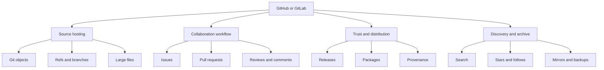
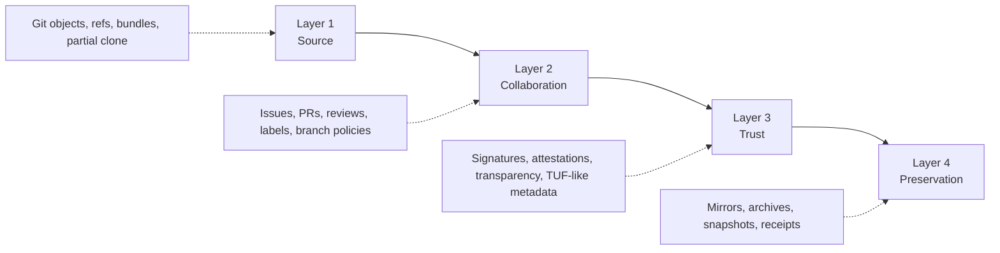
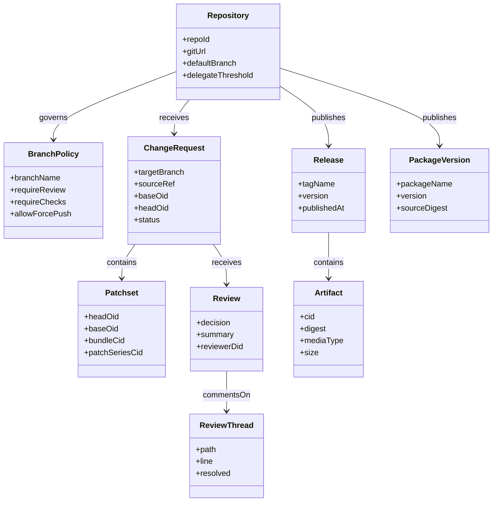
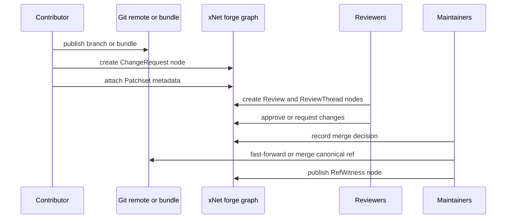
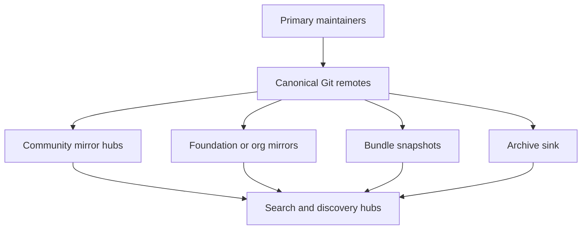
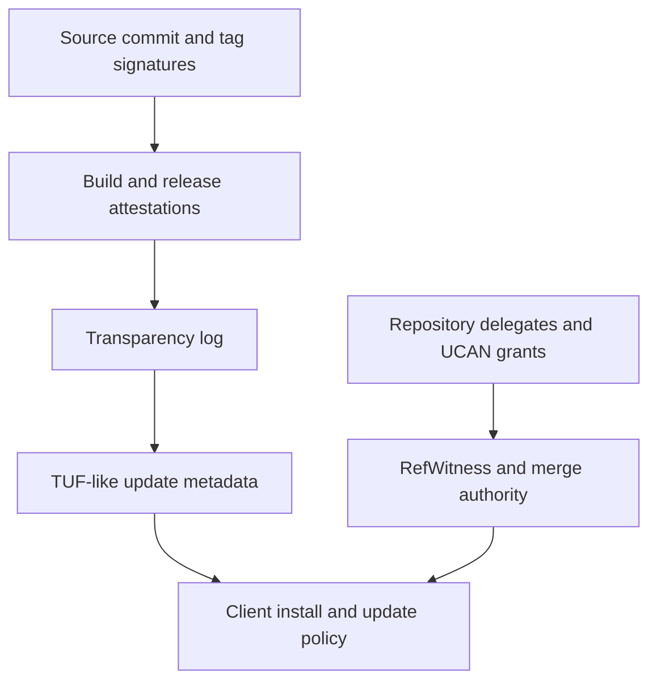
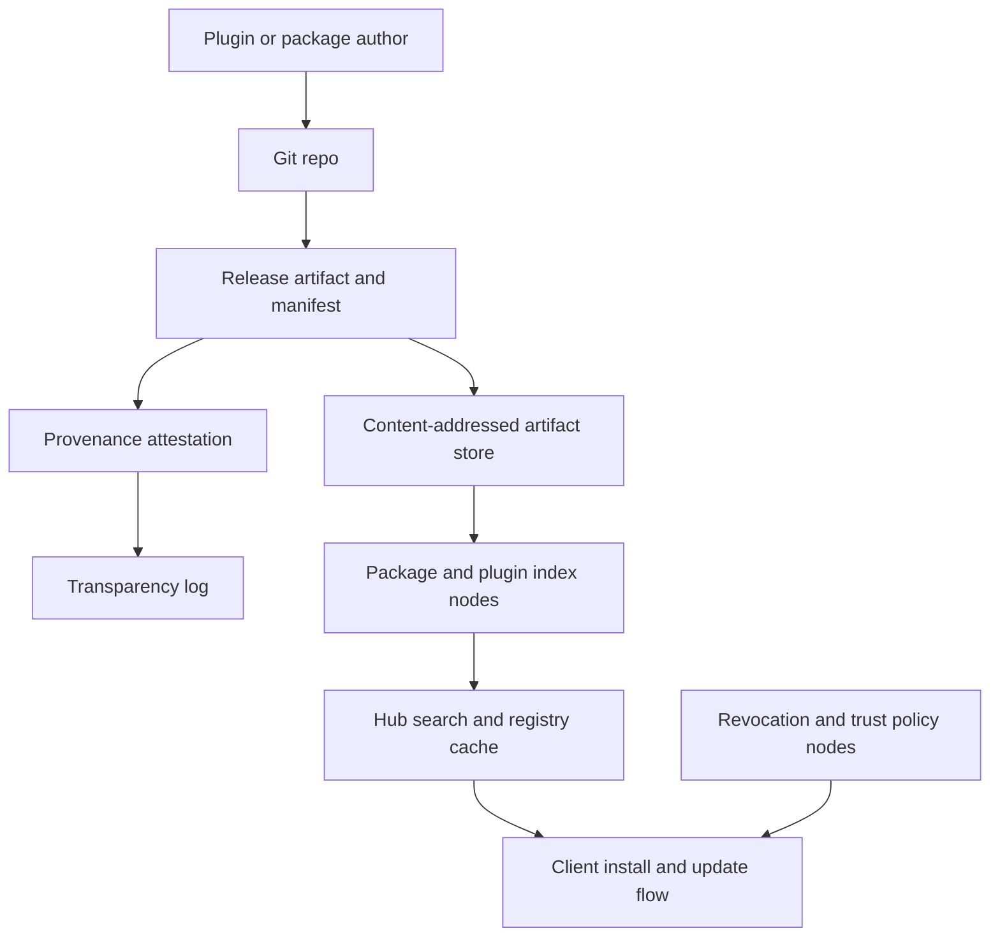

# 0118 - Architecting a Decentralized OSS Forge on xNet

> **Status:** Exploration  
> **Date:** 2026-04-07  
> **Author:** OpenCode  
> **Tags:** forge, git, github, gitlab, repositories, packages, plugins, federation, provenance, security

## Problem Statement

The last three explorations covered:

- decentralized global search
- decentralized social timelines and discovery
- decentralized AI over canonical xNet state

The next obvious question is:

> What would it take to decentralize GitHub or GitLab onto xNet, especially the parts that matter most for open source: source control, reliability, security, issues, pull requests, releases, packages, and future extensibility?

This exploration focuses primarily on:

- source control architecture
- reliability and backup
- security and supply chain trust
- issues and pull requests as first-class collaboration objects
- plugin/package distribution as the first practical proof of concept

This does **not** focus primarily on:

- CI runners
- project boards
- chat extras
- broad enterprise workflow layers

Those matter later, but they are not the first requirement for building a decentralized OSS haven.

## Exploration Status

- [x] Determine next exploration number and existing style
- [x] Review prior xNet explorations relevant to plugin marketplaces, publishing, federation, authz, search, social, and AI
- [x] Inspect current xNet code surfaces relevant to plugins, blobs, schema registry, authz, relay, history, and comments
- [x] Review external references on Git internals, Radicle, ForgeFed, SourceHut, Sigstore, TUF, and package trust models
- [x] Propose a realistic decentralized forge architecture on xNet
- [x] Include recommendations, implementation steps, and validation checklists

## Executive Summary

The main conclusion is:

**Do not try to replace Git first. Decentralize the forge layer around Git.**

Git is already decentralized for source history. GitHub is centralized mainly because the higher-level forge layer is centralized:

- repository identity
- issues
- pull requests
- reviews
- package and release distribution
- permissions
- discovery
- trust signals
- moderation and abuse response

The best xNet architecture is therefore:

1. **Keep source code and commit history in ordinary Git objects and refs.**
2. **Make the forge control plane node-native in xNet.**
3. **Use hubs as mirrors, indexers, package/plugin registries, and archive coordinators, not as the only place truth can exist.**
4. **Use plugin/package publishing as the first proof of concept for a decentralized forge.**

The most important architectural insight is:

**A decentralized GitHub replacement is not one system. It is four layers.**

1. **Source layer**: Git objects, refs, bundles, packfiles, partial clone.
2. **Collaboration layer**: issues, pull requests, reviews, release notes, comments, labels, branch policies.
3. **Trust layer**: identities, signatures, attestations, transparency logs, update metadata, revocations.
4. **Preservation layer**: mirrors, bundles, archives, snapshot receipts.

Git already solves much of layer 1. xNet is a strong fit for layers 2 through 4.

The second key insight is:

**The hard part is not moving commits. The hard part is protecting refs, merge rights, review state, package trust, and long-term availability.**

The third key insight is:

**The xNet plugin marketplace can be the first real forge product.**

It is smaller than a full GitHub replacement, but it already exercises the core problems:

- identity
- publishing
- discovery
- versioning
- trust
- revocation
- local install
- mirrors and caches

If xNet can decentralize plugin and package publication well, it will have solved a large part of decentralized forge infrastructure.

## What GitHub Actually Is

People often talk about "decentralizing GitHub" as if GitHub were one thing.

It is not.

If xNet tries to replace all of that with one primitive immediately, it will fail.

If xNet treats it as a layered system, it can work.

## What xNet Has Now

xNet already has a surprising amount of the right generic substrate.

### Current relevant code surfaces

| Surface                             | Current repo evidence                                                                                                                                                                                                              | Why it matters                                                                              |
| ----------------------------------- | ---------------------------------------------------------------------------------------------------------------------------------------------------------------------------------------------------------------------------------- | ------------------------------------------------------------------------------------------- |
| Signed event-sourced node store     | [`../../packages/data/src/store/store.ts`](../../packages/data/src/store/store.ts)                                                                                                                                                 | Good substrate for forge metadata, issues, reviews, releases, and package records.          |
| Node-native authz and grants        | [`../../packages/data/src/auth/store-auth.ts`](../../packages/data/src/auth/store-auth.ts)                                                                                                                                         | Good substrate for maintainer roles, repo permissions, merge rights, and scoped automation. |
| Signed node relay                   | [`../../packages/hub/src/services/node-relay.ts`](../../packages/hub/src/services/node-relay.ts)                                                                                                                                   | Good substrate for forge control-plane replication.                                         |
| Hub federation                      | [`../../packages/hub/src/services/federation.ts`](../../packages/hub/src/services/federation.ts)                                                                                                                                   | Good substrate for cross-hub search and future forge discovery.                             |
| Discovery service                   | [`../../packages/hub/src/services/discovery.ts`](../../packages/hub/src/services/discovery.ts)                                                                                                                                     | Future repo, mirror, package, and plugin operators need discovery.                          |
| Schema registry                     | [`../../packages/data/src/schema/registry.ts`](../../packages/data/src/schema/registry.ts), [`../../packages/hub/src/services/schemas.ts`](../../packages/hub/src/services/schemas.ts)                                             | Forge schemas can be first-class and publishable.                                           |
| Audit and history                   | [`../../packages/history/src/audit-index.ts`](../../packages/history/src/audit-index.ts)                                                                                                                                           | Useful for provenance, blame, review history, and change audit.                             |
| Blob and file storage               | [`../../packages/data/src/blob/blob-service.ts`](../../packages/data/src/blob/blob-service.ts), [`../../packages/hub/src/services/files.ts`](../../packages/hub/src/services/files.ts)                                             | Useful for release artifacts, tarballs, plugin bundles, screenshots, and attachments.       |
| Universal comment primitive         | [`../../packages/data/src/schema/schemas/comment.ts`](../../packages/data/src/schema/schemas/comment.ts)                                                                                                                           | Strong fit for review threads and issue comments.                                           |
| Task and external reference schemas | [`../../packages/data/src/schema/schemas/task.ts`](../../packages/data/src/schema/schemas/task.ts), [`../../packages/data/src/schema/schemas/external-reference.ts`](../../packages/data/src/schema/schemas/external-reference.ts) | Good proof that issue-like and linkable workflow objects already fit the model.             |
| Plugin runtime                      | [`../../packages/plugins/src/registry.ts`](../../packages/plugins/src/registry.ts), [`../../packages/plugins/src/manifest.ts`](../../packages/plugins/src/manifest.ts)                                                             | Critical for future forge extensibility and automation.                                     |
| Local API and MCP                   | [`../../packages/plugins/src/services/local-api.ts`](../../packages/plugins/src/services/local-api.ts), [`../../packages/plugins/src/services/mcp-server.ts`](../../packages/plugins/src/services/mcp-server.ts)                   | Critical for bots, automation, local tooling, and later agentic workflows.                  |
| Plugin marketplace exploration      | [`./0047_[_]_PLUGIN_MARKETPLACE.md`](./0047_[_]_PLUGIN_MARKETPLACE.md)                                                                                                                                                             | Excellent first proof-of-concept direction.                                                 |
| npm publishing explorations         | [`./0100_[_]_NPM_PUBLISH_WORKFLOW_FOR_XNETJS.md`](./0100_[_]_NPM_PUBLISH_WORKFLOW_FOR_XNETJS.md), [`./0101_[_]_END_TO_END_NPM_TRUSTED_PUBLISHING_PLAYBOOK.md`](./0101_[_]_END_TO_END_NPM_TRUSTED_PUBLISHING_PLAYBOOK.md)           | Supply chain and trusted publishing lessons already exist in the repo.                      |
| Node-native federation direction    | [`./0093_[_]_NODE_NATIVE_GLOBAL_SCHEMA_FEDERATION_MODEL.md`](./0093_[_]_NODE_NATIVE_GLOBAL_SCHEMA_FEDERATION_MODEL.md)                                                                                                             | Supports the idea that forge control state should be represented as nodes.                  |

### Important current gap

xNet does **not** yet have a first-class forge model for:

- repositories
- branches and refs
- pull requests or patchsets
- review state
- releases and packages
- provenance attestations
- git object transport
- mirror placement and retention policy

So the right reading is:

**xNet has most of the generic control-plane substrate, but not yet the forge-specific domain model.**

## Main Thesis

The best decentralized forge architecture on xNet is:

- **Git as canonical content DAG**
- **xNet nodes as canonical forge coordination DAG**
- **hubs as mirrors, discovery operators, search operators, and package/plugin registries**
- **trust and preservation as explicit layers, not hidden implementation details**

This is much better than either extreme:

- not "GitHub again, but with a different database"
- not "throw away Git and store every file change as generic nodes"

## The Four-Layer Model

### Layer 1: Source

This is the actual code and history.

Recommended canonical primitive:

- standard Git repositories

Why:

- Git is already decentralized
- clone/fetch/push tooling already exists everywhere
- packfiles and delta compression already solve hard transport problems
- bundles and partial clone already solve backup and scaling problems
- developers already understand the toolchain

### Layer 2: Collaboration

This is what centralized forges actually own today.

Recommended canonical primitive:

- xNet nodes

This is where xNet should shine.

### Layer 3: Trust

This is where source control becomes safe to consume at scale.

Recommended primitives:

- signatures
- attestations
- transparency logs
- update metadata and revocation signals

### Layer 4: Preservation

This is what stops an OSS forge from disappearing when one host, one org, or one company disappears.

Recommended primitives:

- seed mirrors
- git bundles
- archival sinks
- content-addressed release and package storage

## Why Git Should Stay Canonical For Code

This point matters enough to be explicit.

### Recommendation

**Do not store repository contents primarily as generic xNet nodes.**

Use:

- Git for code content and history
- xNet for collaboration, policy, identity, packages, and discovery

### Why

| Concern                            | Git already solves it well | xNet should not re-solve it first |
| ---------------------------------- | -------------------------- | --------------------------------- |
| content-addressed object model     | yes                        | unnecessary risk                  |
| pack transport and compression     | yes                        | difficult to outperform           |
| clone/fetch/push interoperability  | yes                        | critical for adoption             |
| local working copy ergonomics      | yes                        | impossible to ignore              |
| offline transfer via bundles       | yes                        | already available                 |
| partial clone and promisor remotes | yes                        | useful at scale                   |

### What xNet should do instead

xNet should track:

- repo identity
- delegates and permissions
- canonical branch policy
- review and merge workflow
- releases and package metadata
- mirrors and archive receipts
- search and discovery metadata

## Recommended Canonical xNet Schemas

These should become first-class forge schemas.

| Schema                  | Purpose                                   |
| ----------------------- | ----------------------------------------- |
| `Repository`            | forge identity for a Git repository       |
| `RepositoryMirror`      | a mirror or seed endpoint                 |
| `BranchPolicy`          | branch protection and merge rules         |
| `RefWitness`            | signed statement of ref state             |
| `Issue`                 | issue or task-like collaboration object   |
| `ChangeRequest`         | pull request or merge request object      |
| `Patchset`              | one revision set of a change request      |
| `Review`                | high-level review decision                |
| `ReviewThread`          | inline or file-level discussion           |
| `ReviewComment`         | comment in a review thread                |
| `CheckRun`              | result of future automation or human gate |
| `Release`               | versioned release metadata                |
| `Artifact`              | release asset or binary bundle            |
| `PackageVersion`        | package publication metadata              |
| `PluginPackage`         | plugin manifest and package identity      |
| `ProvenanceAttestation` | build and release provenance              |
| `ArchiveReceipt`        | archival and mirror preservation evidence |

### Relationship model

## Repository Identity And Ref Authority

Source objects are immutable. Refs are not.

That makes refs the actual attack surface.

### Core rule

**Git objects carry integrity. Forge policy must protect refs.**

### Recommended repository model

`Repository` should define:

- canonical Git URL set
- default branch
- delegates or maintainers
- signature threshold for canonical ref decisions
- mirror and archive policy
- package and release policy

### Recommended ref protection model

`RefWitness` nodes should record:

- repository identity
- branch or tag name
- target object ID
- who attested it
- what policy version was in force
- when it became canonical

This lets xNet separate:

- what Git content exists
- what ref state the community or maintainer set considers canonical

### Why this is valuable

If a mirror is compromised or a host lies about branch state, clients can compare:

- Git content
- signed canonical ref witness nodes

That is much stronger than trusting a forge database row.

## Pull Requests As Canonical xNet Objects

Issues are easy. Pull requests are the hard part.

### Why pull requests are hard

They combine:

- Git DAG state
- review discussion
- merge policy
- branch and ref mutation rights
- automation and checks

### Recommended model

Use a change-centric model more like Gerrit or Radicle patches than a purely UI-centric GitHub pull request row.

`ChangeRequest` should reference:

- target repository
- target branch
- source repository or fork
- base OID
- head OID
- current patchset
- mergeability snapshot
- review requirements

`Patchset` should allow more than one transport form:

- source branch ref
- Git bundle CID
- patch series blob CID

That gives multiple decentralized ways to participate.

### Pull request flow

### Why this is better than a pure PR row

It makes the change request:

- portable
- signed
- replayable
- mirrorable across hubs

## Issues, Discussions, And Review Threads

xNet is already close here.

### What can be reused now

- universal comment primitive
- task schema
- external reference schema

### Recommended issue model

An `Issue` should be a dedicated schema, but can reuse:

- task-like status fields
- comment threads
- labels and assignees
- external references

### Recommended review thread model

Review threads should remain separate from repository content and point at:

- repo
- patchset
- file path
- line or range
- optional code quote
- resolved state

That keeps review as durable collaboration state without pretending it is code history itself.

## Reliability And Availability

This is where a decentralized forge either becomes an OSS haven or a toy.

### Minimum reliability rule

**No important repository or release should depend on one hub.**

### Required reliability layers

| Layer                    | Reliability mechanism                               |
| ------------------------ | --------------------------------------------------- |
| local contributor access | every serious contributor has a local clone         |
| repo transport           | multiple mirrors or seed hubs                       |
| ref state                | signed `RefWitness` nodes replicated through xNet   |
| releases                 | mirrored artifacts in content-addressed blob stores |
| packages and plugins     | replicated index plus artifact mirrors              |
| long-term preservation   | bundles and archival sinks                          |

### Recommended mirror model

### What bundle support gives us

Git bundles are underrated and should be a first-class backup and migration primitive.

They give:

- offline transfer
- full or incremental backups
- escrow snapshots
- mirror bootstrap
- resilience against API failure

### What partial clone gives us

Partial clone and promisor remotes matter for large repos because they let clients avoid pulling everything at once, at the cost of depending on available remotes for missing objects.

That means a decentralized forge should not only mirror full repos. It should also support:

- object caches
- promisor-capable mirrors
- fallback full bundles

## Security Model

Security is the real heart of the forge problem.

### The main threat classes

| Threat                            | Why it matters                                                    |
| --------------------------------- | ----------------------------------------------------------------- |
| ref spoofing                      | code integrity is useless if canonical branches can be lied about |
| maintainer key compromise         | merge authority and releases become suspect                       |
| malicious mirror                  | can censor, delay, or serve stale refs and packages               |
| package or plugin compromise      | end users install attacker-controlled updates                     |
| artifact tampering                | binaries differ from reviewed source                              |
| rollback and freeze attacks       | users get old but valid-looking releases                          |
| namespace squatting               | users install the wrong package or plugin                         |
| fake popularity and trust signals | stars/downloads can be gamed                                      |

### Recommended security architecture

### Recommended security stack

#### 1. Source authenticity

Use one or more of:

- Git commit signatures
- signed tags
- Sigstore or Gitsign style identity-bound signatures

#### 2. Merge and ref authority

Use xNet nodes for:

- delegate roles
- branch protection
- merge policy
- signed ref witnesses

#### 3. Release and package provenance

Use:

- provenance attestations
- public transparency logs
- short-lived identity-based release signing where practical

#### 4. Client update safety

Use TUF-like signed metadata for:

- current targets
- freshness
- delegated package namespaces
- rollback resistance

### Important nuance

Git object hashes do **not** solve the whole supply chain problem.

They help with integrity of source objects, but they do not answer:

- who is allowed to publish releases
- whether a maintainer key was compromised
- whether a package index was rolled back
- whether an extension store should trust a plugin update

That is why the trust layer must be separate.

## Package And Plugin Distribution

This is where the forge becomes a product instead of only a protocol.

### Why start here

The plugin marketplace is the perfect proof of concept because it already exercises:

- package identity
- publishing
- discovery
- update distribution
- revocation
- trust signals
- compatibility metadata

### Plugin marketplace proof-of-concept path

The earlier marketplace exploration starts with a GitHub-backed index repo. That is still a good bootstrap.

But the xNet-native end state should be:

- `PluginPackage` nodes
- `PackageVersion` nodes
- signed plugin manifests
- artifact blobs in mirrored object stores
- revocation and blocklist nodes
- searchable local cached index on hubs and clients

### Marketplace architecture

### Why this matters beyond plugins

Once xNet can do plugin publication well, it has built most of the primitives for:

- package registries
- release distribution
- extension trust
- downstream binary verification

## Discovery And Search

The earlier search exploration matters directly here.

### What needs to be searchable

- repositories
- issues
- change requests
- releases
- package versions
- plugin packages
- maintainers and orgs
- mirrors and archive status

### Recommended rule

**Use the decentralized search fabric for discovery, but keep canonical forge state separate.**

This mirrors the earlier search and social conclusions:

- canonical objects stay canonical
- search indexes are derived views

## Federation Model

The forge should not assume every instance trusts every other instance equally.

### Recommended federation model

1. **Git content replication is pull-based and mirror-friendly.**
2. **Forge metadata replication is signed node-change replication.**
3. **Cross-hub search and discovery are federated query services.**
4. **Writes to critical state require signature- and policy-based authorization.**

### Important implication

Read federation and write federation are not the same problem.

- read federation can be broad
- write federation must be much more carefully scoped

### What not to do

Do not assume that a social-style ActivityPub federation model alone is enough for a source forge.

ForgeFed is useful because it shows the scope of the problem, but the hardest bits remain:

- permissions
- patch and ref semantics
- review consistency
- mirror correctness

## Why xNet Is A Good Fit For The Forge Layer

Git gives us the content DAG. xNet gives us a strong fit for the control DAG.

### xNet strengths here

- node-native structured state
- signed change history
- fine-grained authz and grants
- hub-assisted relay and federation
- local-first usage
- comments and tasks as reusable primitives
- plugin runtime and Local API for future automation

### The fit is especially strong for:

- issue tracking
- pull request metadata
- review threads
- package and plugin registries
- maintainer and org policy
- audit and provenance

## Suggested First Product Slice

The first real decentralized forge slice should **not** be "GitHub in one shot".

It should be:

### Slice 1: xNet plugin marketplace with provenance

Includes:

- plugin package schema
- versioned release artifacts
- signatures and provenance
- searchable registry index
- revocation list
- local install and update UX

### Slice 2: repo metadata and issues around external Git repos

Includes:

- `Repository` nodes pointing at existing Git remotes
- issue schemas
- comment threads
- release schemas
- maintainer and mirror metadata

### Slice 3: change requests and review

Includes:

- change request schema
- patchsets
- inline review threads
- merge policy and branch protection nodes

### Slice 4: native multi-hub forge hosting

Includes:

- repo mirrors and seeds
- signed ref witnesses
- package and release mirrors
- archive receipts

## Recommended Direction

### Recommendation 1

**Do not replace Git. Build a decentralized forge around Git.**

This is the single most important recommendation.

### Recommendation 2

**Make forge coordination node-native.**

Repositories, issues, change requests, reviews, releases, package versions, policies, and archive receipts should be canonical xNet objects.

### Recommendation 3

**Treat refs as policy-protected state, not just transport details.**

Signed ref witnesses and branch policy are essential.

### Recommendation 4

**Use the plugin marketplace as the first proof of concept.**

That is the fastest path to proving decentralized publishing, discovery, trust, and revocation.

### Recommendation 5

**Add trust and update-security layers early.**

If xNet ships package or plugin distribution without provenance and rollback resistance, it will create the wrong foundation.

### Recommendation 6

**Make preservation first-class.**

Bundles, mirrors, and archive sinks are not optional extras for an OSS haven.

## Concrete Next Actions

1. Define forge schemas for `Repository`, `RepositoryMirror`, `BranchPolicy`, `RefWitness`, `Issue`, `ChangeRequest`, `Patchset`, `Review`, `ReviewThread`, `Release`, `Artifact`, `PackageVersion`, `PluginPackage`, `ProvenanceAttestation`, and `ArchiveReceipt`.
2. Build a plugin/package registry over xNet nodes as the first forge product slice.
3. Add signed release and artifact manifests plus revocation records.
4. Add `Repository` nodes pointing to existing Git remotes as an integration bridge, not a full replacement.
5. Build issue and review-thread workflows on top of comments and task-like primitives.
6. Add `ChangeRequest` and `Patchset` models that can reference refs, bundles, or patch series.
7. Add branch protection and merge authority nodes using existing authz/grant primitives.
8. Add mirror policy and archive receipt models.
9. Add forge search indices over repos, issues, change requests, releases, and packages.
10. Only after that, add deeper native forge hosting and automation.

## Implementation Checklist

### Phase 1: Forge control-plane schemas

- [ ] Define first-party forge schemas
- [ ] Add schema registry support and docs for forge schema packs
- [ ] Add repository identity and delegate threshold model
- [ ] Add branch policy and ref witness model

### Phase 2: Plugin and package proof of concept

- [ ] Implement `PluginPackage` and `PackageVersion` nodes
- [ ] Implement signed artifact and manifest storage
- [ ] Implement searchable package/plugin index on hubs
- [ ] Implement revocation and blocklist nodes
- [ ] Implement client install/update flow against xNet-native index

### Phase 3: Issues and review

- [ ] Implement `Issue` nodes with labels, assignees, and milestones
- [ ] Reuse or extend comments for issue discussion
- [ ] Implement `ReviewThread` and `ReviewComment`
- [ ] Implement `ChangeRequest` and `Patchset` nodes

### Phase 4: Repository reliability and preservation

- [ ] Implement `RepositoryMirror` and `ArchiveReceipt`
- [ ] Add mirror health and retention metadata
- [ ] Support Git bundle snapshot publication and verification
- [ ] Add discovery of mirror and archive endpoints

### Phase 5: Trust and supply chain

- [ ] Add provenance attestations for releases and packages
- [ ] Add transparency-log integration or witness recording
- [ ] Add TUF-like update metadata for package/plugin clients
- [ ] Add policy enforcement for trusted publishers and delegated namespaces

### Phase 6: Native decentralized forge hosting

- [ ] Add first-class repo hosting integration with mirrored bare Git storage
- [ ] Add partial-clone-aware mirror and cache policies
- [ ] Add ref witness verification in clients and hubs
- [ ] Add federation of forge metadata between hubs

## Validation Checklist

### Source control

- [ ] A repository remains cloneable with stock Git tooling
- [ ] Mirrors can serve the same repository without changing canonical repo identity
- [ ] Bundle export and import work for full and incremental snapshots
- [ ] Canonical ref state can be independently verified from forge UI state

### Reliability

- [ ] A repo remains usable when one hub disappears
- [ ] Packages and plugin artifacts remain installable when one registry goes away
- [ ] Search and discovery degrade gracefully under partial federation failure
- [ ] Archive receipts and bundle snapshots can reconstruct project state

### Security

- [ ] Maintainer or delegate rights are represented explicitly and auditable
- [ ] Merge and branch policy enforcement is separate from mere transport access
- [ ] Release artifacts can be verified back to reviewed source and declared publisher identity
- [ ] Plugin and package updates resist rollback and freeze attacks
- [ ] Revoked packages or plugins are surfaced clearly to clients

### Collaboration

- [ ] Issues are portable and not trapped in one forge database
- [ ] Change requests and review threads survive mirror or host migration
- [ ] Review decisions and merge decisions are independently auditable
- [ ] Cross-hub issue and repository discovery works without central search monopoly

### Extensibility

- [ ] Plugin runtime can later power forge automation without redefining core model
- [ ] Local API and MCP can interact with forge objects without UI scraping
- [ ] Future automation can be scoped via grants rather than implicit global access
- [ ] Package/plugin marketplace and code forge share trust primitives instead of duplicating them

## Open Questions

1. **Should `RefWitness` be purely xNet-native or also embedded into Git refs/notes for easier outside verification?**
2. **How much of the review model should look like GitHub pull requests versus Gerrit/Radicle patchsets?**
3. **How strong should default maintainer threshold rules be for public OSS projects?**
4. **Should the first plugin/package registry be GitHub-backed, xNet-backed, or hybrid?**
5. **What is the right archival sink strategy: first-party, community mirrors, or Software Heritage-style external sinks?**
6. **How should stars, follows, downloads, and reputation be modeled without making them easy to game?**

## Final Take

The right way to decentralize GitHub onto xNet is not:

- replacing Git with a new source storage engine
- pushing every forge feature into one monolith
- pretending code hosting and package trust are the same problem

It is:

- **Git for canonical source history**
- **xNet nodes for canonical forge coordination**
- **hubs for mirrors, search, discovery, registries, and archives**
- **explicit trust layers for provenance, transparency, revocation, and update safety**
- **plugin and package publishing as the first proof of concept**

That is the key principle:

**the code graph should stay Git-native, but the forge graph should become xNet-native.**

If xNet does that, it does not need to out-Git GitHub.

It can instead build something more durable:

- portable repos
- portable issues and reviews
- decentralized mirrors
- better package and plugin provenance
- archive-friendly open source infrastructure

That is what a real decentralized OSS haven looks like.

## References

### Codebase

- [`./0047_[_]_PLUGIN_MARKETPLACE.md`](./0047_[_]_PLUGIN_MARKETPLACE.md)
- [`./0093_[_]_NODE_NATIVE_GLOBAL_SCHEMA_FEDERATION_MODEL.md`](./0093_[_]_NODE_NATIVE_GLOBAL_SCHEMA_FEDERATION_MODEL.md)
- [`./0100_[_]_NPM_PUBLISH_WORKFLOW_FOR_XNETJS.md`](./0100_[_]_NPM_PUBLISH_WORKFLOW_FOR_XNETJS.md)
- [`./0101_[_]_END_TO_END_NPM_TRUSTED_PUBLISHING_PLAYBOOK.md`](./0101_[_]_END_TO_END_NPM_TRUSTED_PUBLISHING_PLAYBOOK.md)
- [`./0115_[_]_ARCHITECTING_FULLY_DECENTRALIZED_GLOBAL_WEB_SEARCH.md`](./0115_[_]_ARCHITECTING_FULLY_DECENTRALIZED_GLOBAL_WEB_SEARCH.md)
- [`./0116_[_]_ARCHITECTING_DECENTRALIZED_TWITTER_X_ON_XNET.md`](./0116_[_]_ARCHITECTING_DECENTRALIZED_TWITTER_X_ON_XNET.md)
- [`./0117_[_]_ARCHITECTING_DECENTRALIZED_AI_ON_XNET.md`](./0117_[_]_ARCHITECTING_DECENTRALIZED_AI_ON_XNET.md)
- [`../../packages/data/src/auth/store-auth.ts`](../../packages/data/src/auth/store-auth.ts)
- [`../../packages/data/src/blob/blob-service.ts`](../../packages/data/src/blob/blob-service.ts)
- [`../../packages/data/src/schema/schemas/comment.ts`](../../packages/data/src/schema/schemas/comment.ts)
- [`../../packages/data/src/schema/schemas/task.ts`](../../packages/data/src/schema/schemas/task.ts)
- [`../../packages/data/src/schema/schemas/external-reference.ts`](../../packages/data/src/schema/schemas/external-reference.ts)
- [`../../packages/data/src/external-references.ts`](../../packages/data/src/external-references.ts)
- [`../../packages/history/src/audit-index.ts`](../../packages/history/src/audit-index.ts)
- [`../../packages/hub/src/services/node-relay.ts`](../../packages/hub/src/services/node-relay.ts)
- [`../../packages/hub/src/services/federation.ts`](../../packages/hub/src/services/federation.ts)
- [`../../packages/plugins/src/registry.ts`](../../packages/plugins/src/registry.ts)
- [`../../packages/plugins/src/manifest.ts`](../../packages/plugins/src/manifest.ts)
- [`../../packages/plugins/src/services/local-api.ts`](../../packages/plugins/src/services/local-api.ts)
- [`../../packages/plugins/src/services/mcp-server.ts`](../../packages/plugins/src/services/mcp-server.ts)

### External references

- [Git bundle documentation](https://git-scm.com/docs/git-bundle)
- [Git partial clone documentation](https://git-scm.com/docs/partial-clone)
- [Radicle protocol guide](https://radicle.xyz/guides/protocol)
- [ForgeFed specification](https://forgefed.org/spec/)
- [SourceHut](https://sourcehut.org/)
- [Sigstore overview](https://docs.sigstore.dev/about/overview/)
- [Sigstore security model](https://docs.sigstore.dev/about/security/)
- [TUF overview](https://theupdateframework.io/docs/overview/)
- [Go modules checksum database reference](https://go.dev/ref/mod#checksum-database)
