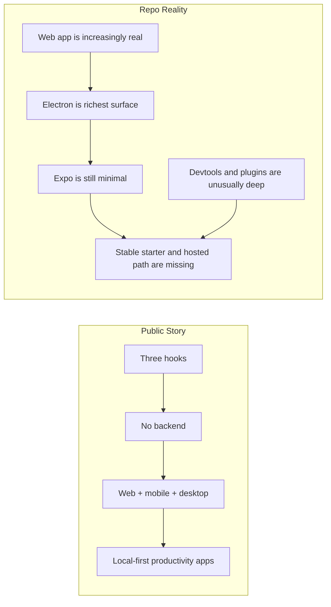
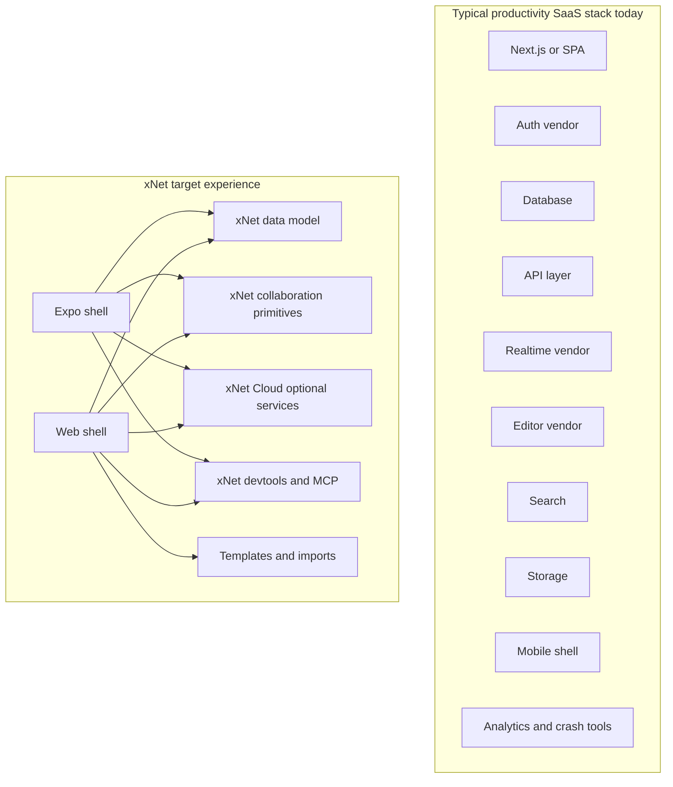
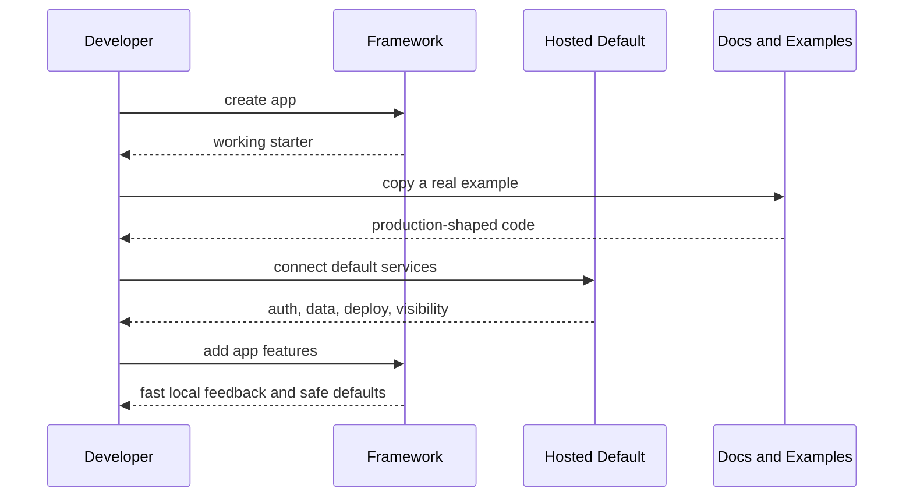
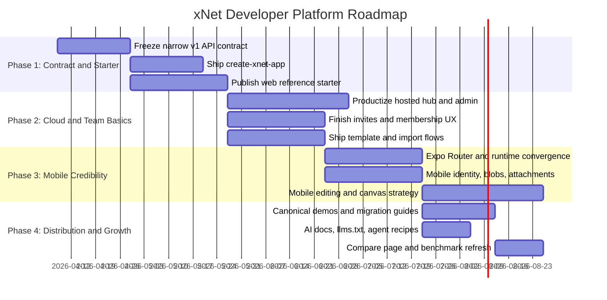

# 0119 - xNet as a Compelling Web and Mobile Developer Tool

> **Status:** Exploration
> **Date:** 2026-04-07
> **Author:** OpenCode
> **Tags:** developer-tools, web, mobile, expo, productivity, saas, adoption, local-first, strategy

## Problem Statement

xNet already has a public comparison page, a strong local-first narrative, real web and desktop product surfaces, and an unusually deep technical substrate.

The harder question is not:

> Is xNet interesting?

It is:

> What would it take for xNet to become a **default choice** for developers building modern productivity software across **web and mobile**?

That means thinking less like a protocol designer and more like a framework company competing for mindshare against:

- Supabase and Firebase for app-backend convenience
- Convex, Zero, Electric, and Jazz for reactive/local-first developer experience
- Liveblocks for collaboration primitives
- Expo for universal mobile/web workflows
- Notion, Linear, Airtable, Anytype, AFFiNE, and AppFlowy as product benchmarks for what builders want to create

The goal is not merely to ship a technically impressive local-first stack.

The goal is to make xNet feel like:

- the fastest way to build a serious collaborative productivity app
- the most credible path from prototype to production
- the most compelling stack for teams that want web, desktop, and mobile continuity without assembling six vendors

## Exploration Status

- [x] Determine the next exploration number and inspect existing exploration style
- [x] Review the public comparison and docs positioning already shipped on the site
- [x] Inspect current web, Electron, and Expo app status in the repo
- [x] Review current developer-tooling surfaces: devtools, CLI, plugins, Local API, MCP
- [x] Review internal roadmap and lifecycle docs for current constraints and gaps
- [x] Review external framework docs and product docs for fast-growing comparables
- [x] Synthesize what is required, what is missing, and what should happen next
- [x] Include recommendations, mermaid diagrams, implementation checklists, and validation checklists

## Executive Summary

The main conclusion is:

**xNet can become compelling if it stops trying to look like a generalized future-internet substrate first and instead becomes the best way for React and Expo teams to build local-first collaborative productivity SaaS.**

That requires seven moves.

1. **Choose a sharp wedge.**
   Target knowledge-work and operational productivity software first: notes, docs, tasks, databases, whiteboards, team workspaces, internal tools, field-work apps, and AI-assisted workbenches.

2. **Own one happy path.**
   xNet needs a first-party scaffold and deployment story: `create-xnet-app`, web starter, Expo starter, xNet Cloud, templates, docs, and validation recipes.

3. **Treat web and mobile as one product story.**
   Electron can remain the proving ground, but external adoption will grow faster if the primary story is **web + Expo**, not Electron-first internals.

4. **Package hosted defaults, not just libraries.**
   Fast-growing developer tools win because they reduce decisions. xNet needs a credible optional cloud story for sync, backup, search, invites, notifications, admin, and operator visibility.

5. **Productize the collaboration primitives.**
   xNet already has pages, databases, canvas, comments, plugins, Local API, and MCP surfaces. Those need to be packaged as composable app primitives, not just repo capabilities.

6. **Finish the boring but decisive SaaS layers.**
   Invites, membership UX, role lifecycle, recovery, import/export, templates, stable APIs, dashboards, docs consistency, and release gates matter more for adoption than another ambitious exploration.

7. **Lean into AI-native developer experience.**
   xNet is unusually well-positioned for agentic coding because of its typed schemas, Local API direction, and MCP surface. That should become part of the primary story, not an advanced sidebar.

### Short version

If xNet wants a large share of the productivity SaaS market, it should aim to become:

**The local-first application platform for building Notion/Airtable/Linear/Anytype-style products on React and Expo.**

Not the replacement for every backend.

Not the replacement for every cloud platform.

Not the replacement for the entire internet.

That narrower positioning is exactly what makes larger adoption plausible.

## What xNet Already Says Publicly

The current public story is already more developer-tool oriented than many local-first projects.

Relevant repo evidence:

- the docs homepage and intro describe xNet as a **local-first React framework** where "three hooks replace your entire backend" in [`../../site/src/content/docs/docs/index.mdx`](../../site/src/content/docs/docs/index.mdx) and [`../../site/src/content/docs/docs/introduction.mdx`](../../site/src/content/docs/docs/introduction.mdx)
- the quickstart shows a plain Vite React flow with schema definition plus `useQuery` and `useMutate` in [`../../site/src/content/docs/docs/quickstart.mdx`](../../site/src/content/docs/docs/quickstart.mdx)
- the public comparison page already compares developer frameworks, decentralized protocols, and productivity apps in [`../../site/src/pages/compare.astro`](../../site/src/pages/compare.astro)
- the landing page already points visitors to a broader comparison flow through [`../../site/src/components/sections/Landscape.astro`](../../site/src/components/sections/Landscape.astro)

This is good news.

xNet is not starting from zero narrative clarity.

But the current public story is still stronger than the current adoption path.

## Current State in the Repo

### High-level read

| Area                      | Current state                     | Strategic read                                           |
| ------------------------- | --------------------------------- | -------------------------------------------------------- |
| Web                       | Credible and expanding            | Good base for developer adoption                         |
| Electron                  | Most complete product surface     | Strong proving ground, weak default external wedge       |
| Expo                      | Real prototype, not parity-ready  | Biggest blocker to the web+mobile story                  |
| Devtools                  | Exceptionally strong              | Major differentiator                                     |
| Plugins / MCP / Local API | Strong but mostly desktop-biased  | Great AI/devtool upside, incomplete cross-platform story |
| Public API stability      | Mixed, with experimental surfaces | Trust and onboarding risk                                |
| Starter / template story  | Weak                              | Time-to-first-value problem                              |

### Current platform reality



### Web is already credible

The repo and roadmap show meaningful web substance already shipped:

- pages, databases, and canvas routes in [`../../apps/web/src/routes/`](../../apps/web/src/routes/)
- onboarding, SQLite bootstrapping, blob stack, and runtime policy in [`../../apps/web/src/App.tsx`](../../apps/web/src/App.tsx)
- search, PWA infrastructure, and share/settings flows called out in [`../../docs/ROADMAP.md`](../../docs/ROADMAP.md)

This matters because web is the fastest path to external developer belief.

### Electron is the richest surface

Electron is still the deepest product surface and likely the most complete proving ground for xNet's architecture.

That is useful internally.

But it is not the fastest route to broad developer adoption.

Developers evaluating frameworks usually ask:

- how quickly can I ship a web product?
- how quickly can I reuse that model on mobile?
- what hosted defaults exist?
- can my team understand and operate this?

Electron answers a different question: how complete is the workbench today?

### Mobile is the clearest adoption gap

The current mobile story is not yet compelling enough for a serious platform pitch.

Evidence:

- the Expo app is described as minimal in [`../../apps/expo/README.md`](../../apps/expo/README.md)
- the app bootstrap currently passes only a narrow config into `XNetProvider` in [`../../apps/expo/App.tsx`](../../apps/expo/App.tsx)
- the mobile editor is currently a WebView-based TipTap wrapper in [`../../apps/expo/src/components/WebViewEditor.tsx`](../../apps/expo/src/components/WebViewEditor.tsx)
- `NativeBridge.acquireDoc()` explicitly throws for Y.Doc editing in [`../../packages/data-bridge/src/native-bridge.ts`](../../packages/data-bridge/src/native-bridge.ts)
- the roadmap explicitly defers a full mobile push in [`../../docs/ROADMAP.md`](../../docs/ROADMAP.md)

This is not a criticism.

It is simply the most important truth if xNet wants to claim a strong web-and-mobile developer story.

### Devtools are already a major differentiator

`@xnetjs/devtools` is stronger than what many young frameworks ship at all.

The package README shows:

- 15 debug panels
- instrumentation hooks
- sync, Yjs, queries, telemetry, security, runtime, migration, and history visibility

Source: [`../../packages/devtools/README.md`](../../packages/devtools/README.md)

This is one of the clearest reasons xNet can feel like a serious developer tool rather than only a sync library.

### Plugins, Local API, and MCP are real strengths

`@xnetjs/plugins` already includes:

- typed contributions
- sandboxed scripts
- AI script generation
- Local API server
- MCP server

Sources:

- [`../../packages/plugins/README.md`](../../packages/plugins/README.md)
- [`../../packages/plugins/src/services/local-api.ts`](../../packages/plugins/src/services/local-api.ts)
- [`../../packages/plugins/src/services/mcp-server.ts`](../../packages/plugins/src/services/mcp-server.ts)

That is unusually good substrate for an AI-native developer platform.

The caveat is that these surfaces are still heavily Node/Electron-shaped.

### API and lifecycle clarity still need work

The lifecycle matrix explicitly says important public packages still have mixed or experimental contracts:

- `@xnetjs/react`
- `@xnetjs/data`
- `@xnetjs/identity`
- `@xnetjs/data-bridge`

Source: [`../../docs/reference/api-lifecycle-matrix.md`](../../docs/reference/api-lifecycle-matrix.md)

That matters because fast-growing frameworks do not merely have strong internals.

They have a clear default contract.

### The CLI is useful, but not yet an adoption engine

`@xnetjs/cli` already covers schema migration, schema diffing, and integrity checks in [`../../packages/cli/README.md`](../../packages/cli/README.md).

That is good and worth keeping.

But it does not yet solve the external builder's first question:

> How do I start a real app with this?

That is why the missing piece is not "a CLI" in the abstract.

It is a **first-party scaffolding and starter workflow**.

## The Market xNet Should Actually Attack

Trying to "capture a large part of SaaS" is too broad to be useful.

The better framing is:

**Become the best stack for building collaborative productivity software where offline, sync, structure, rich text, and mobile matter.**

### Strong target categories

- docs and knowledge workspaces
- task and project tools
- local-first CRM and internal ops tools
- field-work and offline-capable team apps
- database-centric team software
- whiteboard / canvas / planning tools
- AI-assisted team workbenches

### Weak target categories for now

- server-authoritative commerce
- heavily centralized marketplace platforms
- large shared public feeds
- SSR-first consumer content products
- apps whose core value is backend business logic rather than collaborative client state

### What developers are trying to avoid today



The core product-market promise is not "replace all software."

It is:

**Replace the glue stack for collaborative productivity apps.**

## What Fast-Growing Frameworks Got Right

The strongest pattern across fast-growing frameworks is not technical purity.

It is **time-to-first-value compression**.

The winning frameworks reduce the number of hard decisions a developer must make before the first meaningful screen works.

### Cross-framework pattern



### Framework lessons

| Framework      | Why it grew fast                                                                                                                                                                                      | What xNet should learn                                                                                     |
| -------------- | ----------------------------------------------------------------------------------------------------------------------------------------------------------------------------------------------------- | ---------------------------------------------------------------------------------------------------------- |
| **Supabase**   | It packages database, auth, storage, realtime, edge functions, dashboard, and local dev into one recognizable stack. The React quickstart still has setup steps, but the product surface is cohesive. | xNet needs a cohesive optional cloud product, not just OSS packages.                                       |
| **Firebase**   | It grew because it gave developers a complete app platform: auth, databases, functions, hosting, analytics, crash reporting, remote config, testing, and emulator workflows.                          | Operator tooling and lifecycle services matter as much as the data API.                                    |
| **Convex**     | It wins with a narrow reactive story, a `create` flow, generated backend structure, and a strong live cloud default.                                                                                  | xNet needs one default happy path and less surface ambiguity.                                              |
| **Liveblocks** | It solves one painful collaboration wedge extremely well. Builders buy it because it removes bespoke realtime presence/cursor/comment work.                                                           | xNet must either own the full productivity stack or be obviously best-in-class at the collaboration layer. |
| **Zero**       | Its messaging is crisp: instant apps by syncing query-defined subsets locally. The mental model is easy to repeat.                                                                                    | xNet should market "instant local-first productivity apps" more than protocol details.                     |
| **Electric**   | It pairs sync with a deployable starter, route/auth assumptions, and AI-friendly docs.                                                                                                                | xNet needs opinionated starters and deploy flows, not just references.                                     |
| **Jazz**       | It tells an end-to-end builder story: auth, orgs, permissions, history, offline, starter app, AI docs, and MCP.                                                                                       | xNet should package team/workspace primitives as a first-class product story.                              |
| **Expo**       | It compresses cross-platform development through file-based routing, deep links, offline-capable app caching, typed routes, and first-party workflows around Expo and EAS.                            | xNet should integrate tightly with Expo instead of treating mobile as a later translation problem.         |
| **Flutter**    | It continues to attract teams because it ships a first-party UI stack, strong DevTools, and broad platform coverage under one opinionated umbrella.                                                   | xNet should keep making the tooling and workbench story feel first-party and integrated.                   |

### Source notes from external research

The external patterns above are grounded in official docs and product docs reviewed during this exploration:

- Supabase React quickstart: project creation, RLS, env vars, client queries
- Firebase web setup and product navigation: auth, database, hosting, functions, analytics, perf, crash, emulator suite
- Convex React quickstart: `npm create convex`, cloud dev deployment, generated backend folder, reactive `useQuery`
- Liveblocks React quickstart: narrow collaboration room model and prototype-friendly auth default
- Zero docs introduction: instant web apps through query-directed sync to a local datastore
- Electric quickstart: starter app, routing/auth assumptions, deploy path, AI/editor-friendly docs
- Jazz docs: `create-jazz-app`, auth, permissions, history, offline, AI docs, MCP
- Expo Router introduction: universal routing, deep links, offline-first caching, typed routes, lazy routes, web/native parity
- React Native introduction: interactive examples and Expo Snack-style learning path
- Flutter docs: multiplatform setup and first-party DevTools ecosystem

Full links are listed in the references section.

## The Main Strategic Choice

There are three plausible positioning options.

| Option                                       | Description                                                                                | Upside                                                            | Risk                                                       | Verdict                |
| -------------------------------------------- | ------------------------------------------------------------------------------------------ | ----------------------------------------------------------------- | ---------------------------------------------------------- | ---------------------- |
| **Infrastructure-first**                     | Market xNet mostly as sync, identity, and local-first substrate                            | Technically honest                                                | Too abstract; slower adoption; easier to admire than adopt | Not enough on its own  |
| **Workbench-app-first**                      | Market the xNet app itself as the main product and treat the framework as secondary        | Builds product proof quickly                                      | External developers may see the framework as incidental    | Useful, but incomplete |
| **Developer platform for productivity apps** | Make xNet the default stack for building collaborative work software across web and mobile | Strong wedge, clear buyer, reusable primitives, cloud upsell path | Requires packaging discipline and mobile investment        | **Recommended**        |

## Recommended Positioning

### What xNet should be

- a **local-first application platform** for collaborative productivity software
- a **React + Expo friendly** developer tool
- a stack with **optional hosted defaults** and a clean self-hosted escape hatch
- a platform with **built-in productivity primitives**: rich text, databases, canvas, comments, presence, sharing, permissions, plugins, AI hooks
- an **AI-native** typed platform with first-party MCP and local automation surfaces

### What xNet should not try to be first

- a universal backend replacement for every web app
- a perfect parity layer for all Electron-only behaviors on mobile
- a protocol maximalist product story whose best features are all future-facing
- a framework that asks developers to compose their own auth, sync, storage, search, notifications, and admin story from scratch

## What Is Required

The following table is the practical answer to "what would it take?"

| Capability                           | Why developers care                                                              | Current xNet state                                                            | What is required next                                                                        | Priority |
| ------------------------------------ | -------------------------------------------------------------------------------- | ----------------------------------------------------------------------------- | -------------------------------------------------------------------------------------------- | -------- |
| **One-command scaffold**             | Winning tools reduce startup friction immediately                                | Quickstart is manual Vite setup; no `create-xnet-app` flow                    | Ship `create-xnet-app` with web-only and web+Expo variants                                   | P0       |
| **Stable public contract**           | Developers need to know what is safe to build on                                 | Lifecycle matrix still marks important areas mixed/experimental               | Freeze a narrow v1 contract and update all docs/examples to match                            | P0       |
| **Opinionated web starter**          | Teams want a production-shaped default, not a concept demo                       | Web app is real, but not packaged as a reusable starter                       | Publish starter with auth, templates, invite flow, deploy recipe, tests                      | P0       |
| **Opinionated Expo starter**         | Mobile is now table stakes for serious SaaS                                      | Expo exists but is prototype-level                                            | Ship shared web+Expo starter using Expo Router and explicit mobile runtime config            | P0       |
| **Hosted default services**          | Developers choose fast paths with lower ops burden                               | Hub/search/files exist as substrate, but not as polished cloud product        | Productize xNet Cloud: hosted hub, backup, search, share, invites, notifications, admin      | P0       |
| **Team/workspace primitives**        | Productivity SaaS becomes real at invites, roles, revocation, presence, recovery | Core authz exists; product UX still incomplete per roadmap                    | Finish membership, invite acceptance, explanation UX, revoke/reconnect proving               | P0       |
| **Reusable productivity surfaces**   | Builders want rich app primitives, not just storage hooks                        | Pages, databases, canvas, editor, comments exist                              | Package these as starter-ready modules and examples with clean public APIs                   | P1       |
| **Templates and importers**          | Adoption accelerates when users can start from something real                    | Some onboarding templates exist; marketplace/template thinking exists in docs | Ship team templates plus Notion/CSV/Markdown import/export paths                             | P1       |
| **Mobile-safe identity and storage** | Cross-device continuity breaks if mobile auth/recovery is weak                   | Expo bootstraps a local DID but not a full parity-ready identity stack        | Add native recovery/unlock, blob stack, deep links, attachments, background-safe behaviors   | P1       |
| **Mobile editing strategy**          | Productivity apps live or die on edit UX                                         | Current WebView editor and missing Y.Doc bridge are not enough                | Choose and commit to hybrid DOM reuse vs native-first per surface; do not leave it ambiguous | P1       |
| **Admin and operator visibility**    | Teams need logs, metrics, quotas, and workspace management                       | Devtools are great for builders, weak for hosted operators                    | Add cloud dashboard for workspace health, peers, storage, backups, shares, notifications     | P1       |
| **AI-native docs and automation**    | AI-assisted coding increasingly influences framework choice                      | MCP and Local API exist, but mostly desktop-shaped                            | Publish `llms.txt`, agent recipes, example prompts, and cross-platform automation story      | P1       |
| **Growth and distribution loops**    | Winning frameworks are easy to discover, compare, and copy                       | Compare page exists, but starter/demo/story depth is still limited            | Add canonical demos, templates, benchmark scenarios, migration guides, public success cases  | P2       |

## What Is Missing Right Now

The most important missing pieces are not mysterious.

They are mostly visible in the repo already.

### 1. A first-party adoption path

xNet has docs and packages.

It does not yet have a strong, obvious, first-party builder workflow comparable to:

- `npm create convex@latest`
- `npx @electric-sql/start`
- `npx create-jazz-app@latest`
- `create-expo-app`

This is the single clearest missing piece.

### 2. A credible web-plus-mobile story

The current truth is:

- web is increasingly real
- Electron is strongest
- Expo is not yet parity-ready

That means xNet can currently claim **desktop-plus-web ambition** more strongly than **web-plus-mobile developer default**.

If the goal is capturing a large portion of modern productivity SaaS builders, that must change.

### 3. A productized cloud layer

Fast-growing frameworks do not win only because the SDK is nice.

They win because the total system is adoptable:

- cloud console
- auth defaults
- logs and diagnostics
- deploy path
- role and environment management
- invitation flows
- notifications and integrations

xNet has much of the substrate, but not yet enough of the product.

### 4. Team-level UX completion

The roadmap already says this clearly:

- invites and membership lifecycle are not fully productized
- collaboration acceptance and revocation need proving

Source: [`../../docs/ROADMAP.md`](../../docs/ROADMAP.md)

This matters because teams do not buy architecture. They buy dependable collaboration.

### 5. A stronger templates and migration story

Productivity SaaS adoption often starts with imitation:

- "I want Notion-like docs + databases"
- "I want a Linear-like tracker"
- "I want an Airtable-like internal tool"
- "I want a mobile field app that syncs later"

That means xNet needs:

- first-party templates
- example data models
- importers
- reference architectures
- opinionated UI starter surfaces

### 6. Cross-platform AI and automation coherence

MCP and Local API are real strengths, but they are still mostly desktop-biased.

For xNet to feel like a web-and-mobile developer platform, agent and automation flows must degrade cleanly across:

- web
- Expo mobile
- Electron

## A Better Product Shape for xNet

The right product packaging is a layered system.

```mermaid
flowchart TD
    subgraph Apps[App Surfaces]
        A[Web app]
        B[Expo app]
        C[Electron app]
    end

    subgraph Platform[Platform Layer]
        D[@xnetjs/react]
        E[@xnetjs/data]
        F[@xnetjs/editor]
        G[@xnetjs/canvas]
        H[@xnetjs/devtools]
        I[@xnetjs/plugins]
    end

    subgraph Cloud[Optional xNet Cloud]
        J[Hosted hub]
        K[Backup and file services]
        L[Search and indexing]
        M[Invites and workspace admin]
        N[Notifications and operator dashboard]
    end

    subgraph Experience[Builder Experience]
        O[create-xnet-app]
        P[Templates and importers]
        Q[Reference apps]
        R[AI docs and MCP recipes]
        S[Deploy and validation guides]
    end

    A --> D
    B --> D
    C --> D
    D --> J
    E --> J
    F --> P
    G --> P
    H --> S
    I --> R
    O --> A
    O --> B
```

This is the crucial framing:

**xNet should be sold as a platform with batteries, not as packages with aspirations.**

## Persona View

Different buyers will adopt xNet for different reasons.

| Persona                  | They say yes when...                                                                | What blocks them today                                 |
| ------------------------ | ----------------------------------------------------------------------------------- | ------------------------------------------------------ |
| **Indie builder**        | they can start in 15 minutes and ship a useful app in a weekend                     | no first-party scaffold, weak template story           |
| **Startup product team** | they can share a data model across web and mobile with hosted defaults              | mobile parity gap, cloud/operator gap                  |
| **Internal tools team**  | they get tables, docs, roles, comments, offline, and easy deployment                | team/workspace UX not fully productized                |
| **AI-heavy builder**     | the framework is typed, searchable, MCP-friendly, and easy for agents to manipulate | desktop-biased automation story                        |
| **Enterprise evaluator** | they see clear contracts, admin controls, auditability, and self-host options       | lifecycle ambiguity and incomplete operator/product UX |

## Recommended Strategy

### Main recommendation

**Make xNet the best stack for building collaborative productivity software on React and Expo, with optional hosted infrastructure and a self-hosted escape hatch.**

### Sub-recommendations

1. **Adopt a paired-shell model.**
   Let developers use xNet inside familiar shells:
   - Next.js or TanStack Start for web app shells and marketing-facing routes
   - Expo Router for mobile shell, deep links, and app lifecycle
   - Electron as the advanced desktop/power-user shell

2. **Turn the xNet app into the reference implementation.**
   The existing app surfaces should feed:
   - starter kits
   - reusable modules
   - demo videos
   - benchmark scenarios
   - migration guides

3. **Package cloud and self-host stories together.**
   Developers should feel the hosted path is the fastest, while the self-host path remains credible and documented.

4. **Put productivity primitives before abstract extensibility.**
   Rich text, databases, canvas, comments, tasks, sharing, presence, and imports should feel obvious and ready.

5. **Treat AI-native DX as first-class.**
   xNet has real structural advantages here. Package them.

## Suggested Roadmap

This is the highest-leverage sequencing if the goal is developer adoption rather than pure capability growth.



### Why this sequence

- **Phase 1** fixes the biggest adoption tax: ambiguity and setup friction.
- **Phase 2** makes xNet feel like a real team product, not just a local-first engine.
- **Phase 3** makes the web-and-mobile claim credible.
- **Phase 4** turns the technical platform into a discoverable category story.

## Implementation Checklists

### 1. Core platform packaging checklist

- [ ] Freeze the narrow recommended v1 contract for `@xnetjs/react`, `@xnetjs/data`, `@xnetjs/identity`, and `@xnetjs/data-bridge`
- [ ] Update all docs, READMEs, quickstarts, and examples to use only the recommended entrypoints
- [ ] Add `create-xnet-app` with at least:
- [ ] `web`
- [ ] `web-expo`
- [ ] `web-electron-expo` if and only if maintenance cost is acceptable
- [ ] Ship one reference schema pack for productivity apps
- [ ] Ship one reference UI module pack for docs, tasks, database, and canvas surfaces
- [ ] Add starter test and build validation to CI for every first-party starter

### 2. Web experience checklist

- [ ] Publish a production-shaped web starter using the same substrate as the main app
- [ ] Include onboarding, quick search, sharing, invites, and template selection in the starter
- [ ] Add nested navigation, pinned/recent surfaces, and breadcrumbs where still missing
- [ ] Package import/export flows for Markdown, CSV, and JSON backup/restore
- [ ] Provide deployment recipes for at least one default host and one self-host path
- [ ] Add a "build a Notion-like app" and "build an Airtable-like app" guide

### 3. Mobile checklist

- [ ] Move Expo to Expo Router and shared route intent semantics
- [ ] Pass explicit `platform: 'mobile'` and explicit mobile runtime policy through the provider path
- [ ] Add the full mobile blob/attachment stack
- [ ] Replace or harden the current WebView editor strategy for production credibility
- [ ] Decide the canvas path clearly:
- [ ] hybrid DOM reuse for v1
- [ ] native renderer over extracted headless logic
- [ ] add native identity recovery and unlock flow
- [ ] add deep links and share-open behavior
- [ ] add background-safe sync expectations and user-facing messaging
- [ ] document what mobile parity means and what it intentionally does not mean

### 4. Cloud and operator checklist

- [ ] Productize xNet Cloud around hosted hub, backups, files, and search
- [ ] Add workspace admin surfaces: members, roles, invites, revocation, recovery
- [ ] Add operator diagnostics: storage usage, peer health, sync failures, backup status
- [ ] Add notification and webhook surfaces
- [ ] Add basic dashboard controls for environments, keys, and quotas
- [ ] Define a simple hosted pricing model that maps to developer mental models

### 5. Productivity feature checklist

- [ ] Ship first-party templates for:
- [ ] notes/wiki
- [ ] project tracker
- [ ] CRM pipeline
- [ ] team knowledge base
- [ ] field work log
- [ ] ship importers for common source data where feasible
- [ ] package comments, mentions, tasks, and presence as starter-ready modules
- [ ] expose search, share, and plugin hooks as documented integration points

### 6. AI-native DX checklist

- [ ] Publish `llms.txt` and agent-oriented docs for the main platform and starters
- [ ] Add canonical MCP workflows for querying, creating, updating, and templating xNet data
- [ ] Make Local API and MCP capability differences explicit by platform
- [ ] Ship example prompts and agent recipes for common productivity app generation tasks
- [ ] Ensure all public docs and starters are easy to search and easy for agents to consume

### 7. Marketing and growth checklist

- [ ] Refresh `/compare` to include:
- [ ] production maturity
- [ ] mobile parity
- [ ] team primitives
- [ ] operator tooling
- [ ] AI/MCP support
- [ ] publish canonical demo apps with public code and video walkthroughs
- [ ] publish migration guides from Supabase, Firebase, Liveblocks, and Expo-only stacks
- [ ] publish a strong "when not to use xNet" page to build trust
- [ ] create benchmark content around offline, sync, and local-first UX quality

## Validation Checklists

### 1. Developer activation validation

- [ ] A new developer can scaffold a web app with `create-xnet-app` in under 5 minutes
- [ ] A new developer can scaffold a web+Expo app in under 10 minutes
- [ ] The starter can create, query, sync, and persist data without any manual infrastructure assembly
- [ ] At least one template can be opened and understood without reading framework internals
- [ ] The docs path from introduction to first working collaborative screen fits within 30 minutes

### 2. Product readiness validation

- [ ] Invite flow from workspace creation to second-user edit works in under 5 minutes
- [ ] Revocation behavior is immediate and understandable
- [ ] Export/import round-trips preserve user-critical data
- [ ] Search surfaces body content and structured content reliably
- [ ] Comments, presence, and history work across at least web and desktop before broad claims

### 3. Mobile credibility validation

- [ ] Expo starter boots reliably on iOS and Android simulators
- [ ] Mobile app can open shared links into the correct surface
- [ ] Attachments work end-to-end on mobile
- [ ] Offline create/edit flows survive app restarts
- [ ] Mobile editor experience is usable enough for everyday document edits
- [ ] Mobile parity claims are backed by a written release gate, not aspiration

### 4. Cloud and operator validation

- [ ] Hosted xNet Cloud can provision a working project with minimal setup
- [ ] Backup, search, and share flows are observable in an operator dashboard
- [ ] Workspace admins can inspect members, roles, and invite state
- [ ] Sync and storage issues have visible diagnostics suitable for support workflows
- [ ] Self-host documentation can reproduce the same core behaviors without guesswork

### 5. Ecosystem and messaging validation

- [ ] Developers can clearly explain what xNet replaces and what it complements
- [ ] Comparison tables stay accurate with shipped behavior
- [ ] The top three demos map cleanly to common productivity-app jobs-to-be-done
- [ ] At least one public example shows the same domain model running on web and Expo
- [ ] AI assistants can generate a useful xNet starter feature from docs and MCP alone

## Success Metrics

The right metrics are adoption-quality metrics, not just package downloads.

| Metric                                      | Why it matters                                      | Suggested target                  |
| ------------------------------------------- | --------------------------------------------------- | --------------------------------- |
| Time to first working collaborative app     | Measures startup friction                           | under 15 minutes                  |
| Time to first web+mobile shared model       | Measures cross-platform credibility                 | under 60 minutes                  |
| Invite-to-first-shared-edit                 | Measures team activation                            | under 5 minutes                   |
| Docs-to-starter completion rate             | Measures onboarding clarity                         | above 70% in guided studies       |
| Mobile parity defect rate                   | Measures whether the cross-platform story is honest | trending down across each release |
| Starter-to-production conversion interviews | Measures whether xNet solves real buyer pain        | monthly ongoing                   |
| Import/template activation                  | Measures practical adoption wedge                   | rising quarter over quarter       |

## Practical Next Actions

If only a few things happen next, they should be these.

1. **Ship `create-xnet-app`.**
   This is the single highest-leverage external adoption move.

2. **Freeze and simplify the public contract.**
   Adoption dies when docs, examples, and package stability feel blurry.

3. **Productize hosted xNet Cloud enough to remove operator fear.**
   Sync, backup, invites, search, and admin visibility should feel like a product, not a pile of services.

4. **Turn Expo from prototype into a believable product surface.**
   It does not need full Electron parity. It does need a strong web-plus story.

5. **Publish reference app templates that map to real buyer desires.**
   Notes/wiki, project tracker, CRM/internal tool, field-work app.

6. **Make AI-native DX part of the default narrative.**
   xNet has rare advantages here. Use them.

## Final Recommendation

The best way for xNet to capture a meaningful share of the SaaS market is not to become a generic everything-platform.

It is to become:

**the best way to build collaborative, local-first, AI-friendly productivity software across web and mobile.**

The repo already contains much of the technical substrate needed for that claim:

- local-first typed data
- realtime collaboration
- rich productivity surfaces
- strong devtools
- plugin and AI integration substrate
- a public comparison story

What is missing is mostly packaging, productization, mobile credibility, and a sharper adoption path.

That is good news.

Those are solvable problems.

And they are much more tractable than inventing new core primitives.

## References

### Internal xNet references

- [`../../site/src/pages/compare.astro`](../../site/src/pages/compare.astro)
- [`../../site/src/content/docs/docs/index.mdx`](../../site/src/content/docs/docs/index.mdx)
- [`../../site/src/content/docs/docs/introduction.mdx`](../../site/src/content/docs/docs/introduction.mdx)
- [`../../site/src/content/docs/docs/quickstart.mdx`](../../site/src/content/docs/docs/quickstart.mdx)
- [`../../site/src/components/sections/Landscape.astro`](../../site/src/components/sections/Landscape.astro)
- [`../../apps/web/src/App.tsx`](../../apps/web/src/App.tsx)
- [`../../apps/web/src/routes/`](../../apps/web/src/routes/)
- [`../../apps/expo/App.tsx`](../../apps/expo/App.tsx)
- [`../../apps/expo/README.md`](../../apps/expo/README.md)
- [`../../apps/expo/src/components/WebViewEditor.tsx`](../../apps/expo/src/components/WebViewEditor.tsx)
- [`../../packages/data-bridge/src/native-bridge.ts`](../../packages/data-bridge/src/native-bridge.ts)
- [`../../packages/cli/README.md`](../../packages/cli/README.md)
- [`../../packages/devtools/README.md`](../../packages/devtools/README.md)
- [`../../packages/plugins/README.md`](../../packages/plugins/README.md)
- [`../../packages/plugins/src/services/local-api.ts`](../../packages/plugins/src/services/local-api.ts)
- [`../../packages/plugins/src/services/mcp-server.ts`](../../packages/plugins/src/services/mcp-server.ts)
- [`../../packages/react/src/onboarding/templates.ts`](../../packages/react/src/onboarding/templates.ts)
- [`../../docs/ROADMAP.md`](../../docs/ROADMAP.md)
- [`../../docs/reference/api-lifecycle-matrix.md`](../../docs/reference/api-lifecycle-matrix.md)
- [`./0108_[_]_EXPO_APP_PARITY_WITH_ELECTRON_AND_WEB.md`](./0108_[_]_EXPO_APP_PARITY_WITH_ELECTRON_AND_WEB.md)
- [`./0111_[_]_UNIFIED_WORKBENCH_ARCHITECTURE_FOR_XNET.md`](./0111_[_]_UNIFIED_WORKBENCH_ARCHITECTURE_FOR_XNET.md)
- [`./0045_[x]_LANDING_PAGE_REDESIGN.md`](./0045_[x]_LANDING_PAGE_REDESIGN.md)

### External references reviewed

- Supabase React quickstart: <https://supabase.com/docs/guides/getting-started/quickstarts/reactjs>
- Convex React quickstart: <https://docs.convex.dev/quickstart/react>
- Firebase web setup: <https://firebase.google.com/docs/web/setup>
- Liveblocks React quickstart: <https://liveblocks.io/docs/get-started/react>
- Zero docs introduction: <https://zero.rocicorp.dev/docs/introduction>
- Electric quickstart: <https://electric-sql.com/docs/quickstart>
- Jazz docs: <https://jazz.tools/docs>
- Expo Router introduction: <https://docs.expo.dev/router/introduction/>
- React Native introduction: <https://reactnative.dev/docs/getting-started>
- Flutter docs install and platform/devtools docs entrypoint: <https://docs.flutter.dev/get-started/install>
