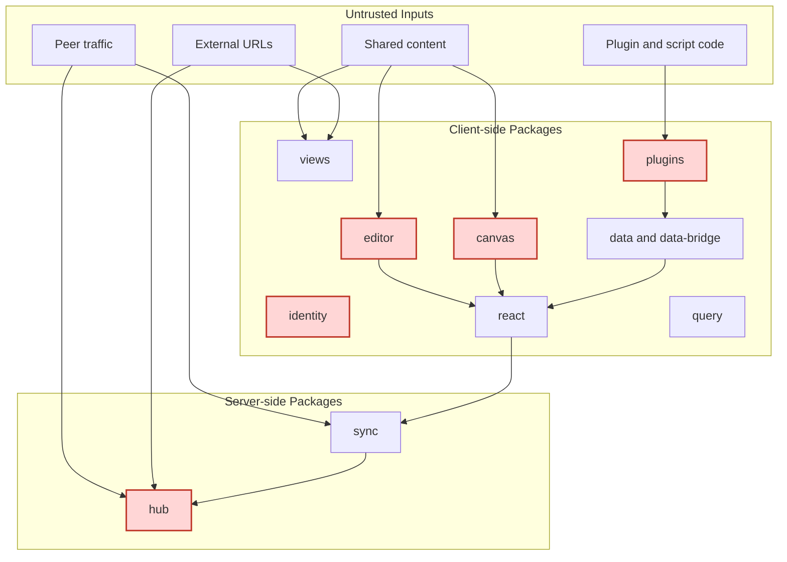
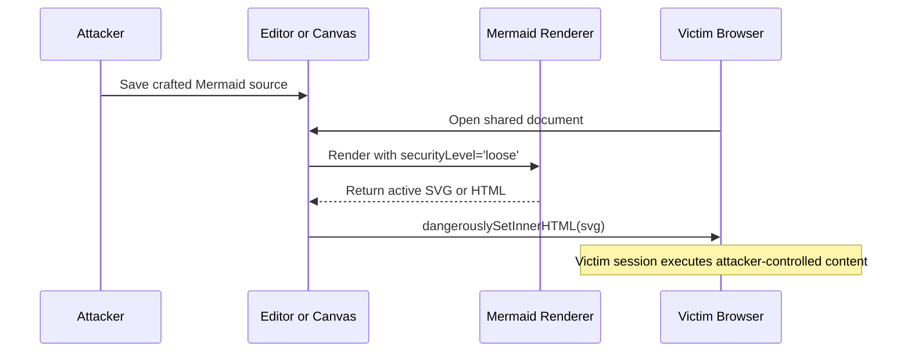
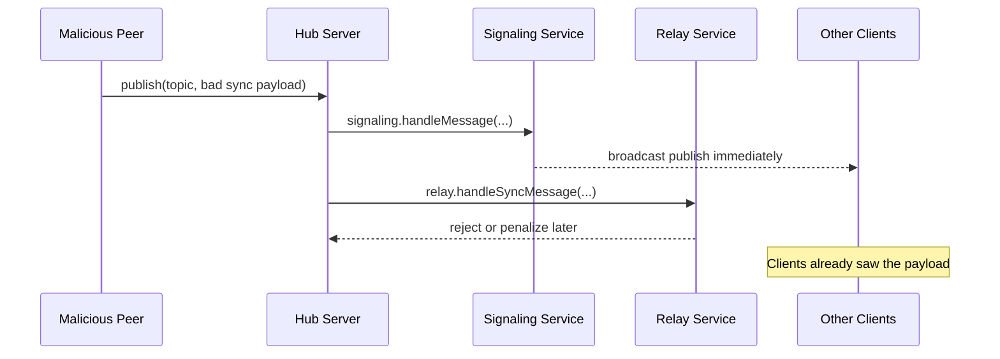
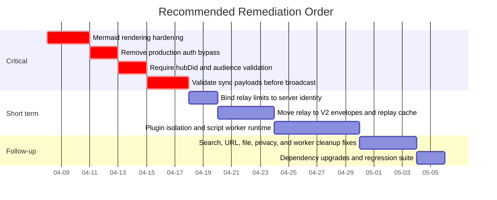

# xNet Package Security And Reliability Exploration

**Date:** 2026-04-07  
**Scope:** `packages/*` in the xNet monorepo, with the deepest review on `hub`, `identity`, `sync`, `plugins`, `editor`, `canvas`, `react`, `query`, `views`, `data`, and `data-bridge`  
**Goal:** identify concrete exploit paths, abuse cases, and reliability failures that would matter if xNet were widely deployed

## Executive Summary

This was a best-effort static security and reliability review of the package workspace, not a formal audit and not a proof of completeness.

The package set has a solid foundation in several places:

- `@xnetjs/crypto` uses reasonable primitives: BLAKE3, Ed25519, XChaCha20-Poly1305, and hybrid signature support.
- `@xnetjs/sync` defaults to requiring signed replication unless compatibility mode is explicitly enabled.
- `@xnetjs/network` has a real connection-gating and rate-limiting layer.
- `@xnetjs/ui`'s markdown renderer avoids raw HTML.

The highest-risk findings are not in the primitive packages. They are at trust boundaries:

1. Shared Mermaid content is rendered with `securityLevel: 'loose'` and injected with `dangerouslySetInnerHTML`, creating a likely stored XSS path in both `editor` and `canvas`.
2. Production code can switch passkey auth into a deterministic test identity via `localStorage`, which turns any XSS or extension write into an auth bypass.
3. The hub can accept UCANs for the wrong audience when `hubDid` is unset.
4. The hub broadcasts sync publishes before relay verification, so malformed or malicious sync payloads can still hit subscribers.
5. The plugin system declares permissions but does not enforce them, and its script sandbox cannot actually stop CPU-bound loops.

If xNet is going to be used broadly, the shortest path to a meaningfully safer system is:

1. Fix the Mermaid renderers.
2. Remove test-bypass code from production bundles.
3. Make hub audience validation mandatory.
4. Move sync validation ahead of signaling fanout.
5. Treat third-party plugins as untrusted until they run in an isolated worker/process boundary.

## Review Method

- Read and traced security-sensitive package code paths directly.
- Searched the package workspace for dangerous rendering, code execution, auth bypass, SSRF, and rate-limiting patterns.
- Ran `pnpm audit --prod` and filtered the results down to package-relevant findings.
- Cross-checked key design assumptions against primary references:
  - Mermaid security-level docs
  - UCAN specification
  - OWASP SSRF prevention guidance
  - Node `worker_threads` guidance
  - GitHub advisories for Hono-related dependency findings

## Attack Surface Map

## Findings At A Glance

| ID    | Severity    | Package(s)         | Summary                                                                                    |
| ----- | ----------- | ------------------ | ------------------------------------------------------------------------------------------ |
| XR-01 | Critical    | `editor`, `canvas` | Mermaid content is rendered in loose mode and injected as raw SVG/HTML                     |
| XR-02 | Critical    | `identity`         | Production auth can be bypassed with `localStorage` test mode                              |
| XR-03 | High        | `hub`              | UCAN audience check is optional when `hubDid` is unset                                     |
| XR-04 | High        | `hub`              | Sync publishes are broadcast before relay verification                                     |
| XR-05 | High        | `hub`              | Relay rate limiting and peer scoring key off attacker-controlled `from`                    |
| XR-06 | High        | `sync`, `hub`      | Hub relay still relies on V1 Yjs envelopes with no doc binding or replay defense           |
| XR-07 | High        | `plugins`          | Plugin permissions are declarative only; plugins get raw host access                       |
| XR-08 | High        | `plugins`          | Script timeout is ineffective for CPU loops; `onChange` scripts can self-trigger storms    |
| XR-09 | Medium-High | `hub`              | Federation exposure defaults to unauthenticated mode and caller-controlled rate-limit keys |
| XR-10 | Medium      | `hub`              | External URL validation is hostname-only and does not resolve DNS before fetches           |
| XR-11 | Medium      | `query`            | Search filters are accepted but ignored                                                    |
| XR-12 | Medium      | `views`            | URL rendering does not restrict dangerous schemes                                          |
| XR-13 | Medium      | `data`             | File schema constraints are stored but not enforced                                        |
| XR-14 | Medium-Low  | `react`            | Optional hub indexing sends full node properties off-device                                |
| XR-15 | Low         | `data-bridge`      | Worker Y.Doc handler cleanup leaks listeners and can duplicate updates                     |

## Detailed Findings

### XR-01. Mermaid Rendering Is A Likely Stored XSS Path

**Severity:** Critical

**Evidence**

- `packages/editor/src/extensions/mermaid/MermaidNodeView.tsx:26-30,80-83,263-265`
- `packages/canvas/src/nodes/mermaid-node.tsx:73-77,252-255,319-322`

Both packages do two risky things at once:

- configure Mermaid with `securityLevel: 'loose'`
- inject Mermaid's returned SVG using `dangerouslySetInnerHTML`

Mermaid's own docs say `strict` is the default, while `loose` allows HTML tags and click functionality. That is exactly the wrong direction for shared untrusted content.

**Why this matters**

- It is likely a stored XSS path in any shared document or shared canvas.
- Once XSS exists, it can chain into XR-02 by setting `localStorage['xnet:test:bypass'] = 'true'`.
- In Electron or any host with privileged bridges, the blast radius gets larger.

**Recommended fix**

- Switch Mermaid to `securityLevel: 'strict'` unless there is a very narrow, justified exception.
- If Electron blocks Mermaid sandbox iframes, sanitize the generated SVG before injection and remove all active content.
- Treat Mermaid source as untrusted shared input in tests.
- Add a regression test with malicious diagram payloads.

### XR-02. Passkey Test Bypass Is Reachable In Production Code Paths

**Severity:** Critical

**Evidence**

- `packages/identity/src/passkey/test-bypass.ts:17-39,52-71,85-105`
- `packages/identity/src/passkey/index.ts:16,41,91-95`

`isTestBypassEnabled()` returns true if:

- `import.meta.env.XNET_TEST_BYPASS === 'true'`
- `process.env.XNET_TEST_BYPASS === 'true'`
- `localStorage.getItem('xnet:test:bypass') === 'true'`

Then `createIdentityManager()` silently swaps to `createTestIdentityManager()`, which creates a deterministic test identity.

**Why this matters**

- Any XSS, extension, or devtools write can turn real auth into a predictable test identity flow.
- This is not just a test helper sitting on the side. It is in the main production entry path.
- The code comments already say it must only be enabled in test environments, but the implementation does not enforce that.

**Recommended fix**

- Remove the `localStorage` bypass from production bundles entirely.
- Gate test bypass behind compile-time test-only flags and dead-code elimination.
- Make the production identity manager fail closed if test bypass symbols are present.
- Split test-only identity helpers into a separate entrypoint that production apps do not import.

### XR-03. Hub Audience Validation Fails Open When `hubDid` Is Missing

**Severity:** High

**Evidence**

- `packages/hub/src/auth/ucan.ts:76-111,128-149`
- `packages/hub/src/types.ts:35-36,74-91`

The hub only enforces `payload.aud === config.hubDid` if `config.hubDid` exists. `hubDid` is optional in `HubConfig`, and the default config does not set it.

The UCAN spec explicitly models `aud` as the audience and says validators must validate at execution time. If xNet wants hub-bound tokens, the hub has to require them.

**Exploit scenario**

- A valid UCAN minted for some other service or hub still matches capability shape.
- This hub accepts it because audience validation is effectively disabled.

**Recommended fix**

- Make `hubDid` mandatory whenever `auth === true`.
- Refuse hub startup if auth is enabled without a hub DID.
- Keep audience checking unconditional once auth is on.

### XR-04. Hub Broadcasts Sync Traffic Before Verifying It

**Severity:** High

**Evidence**

- `packages/hub/src/server.ts:1235,1298`
- `packages/hub/src/services/signaling.ts:124-147`
- `packages/hub/src/services/relay.ts:95-165,203-250`

The current order on a publish is:

1. `signaling.handleMessage(ws, payload)`
2. `relay.handleSyncMessage(payload.topic, payload.data, signaling.publishFromHub)`

That means subscribers can receive the publish before relay verification, size checks, and penalties run.

**Why this matters**

- Relay validation currently protects hub state better than subscriber safety.
- A malicious peer can still create a bandwidth and CPU fanout event.

**Recommended fix**

- Validate sync publishes before they enter signaling fanout.
- For sync rooms, route publishes through a verifier-first path.
- Only broadcast accepted sync payloads.

### XR-05. Relay Throttling Uses An Attacker-Controlled Peer Identifier

**Severity:** High

**Evidence**

- `packages/hub/src/services/relay.ts:20-27,203-209`
- `packages/hub/src/server.ts:1286-1298`

Relay rate limiting and peer scoring use `data.from` as the peer key. That field is supplied inside the client payload. One socket can rotate fake `from` values and side-step per-peer penalties.

**Why this matters**

- It weakens the main abuse controls that are supposed to protect the relay path.
- It makes DoS cheaper for a single attacker connection.

**Recommended fix**

- Bind relay accounting to a server-assigned socket/session identity, not `data.from`.
- Keep `from` only as user-visible metadata if needed.
- Penalize and disconnect sockets that lie about peer identity.

### XR-06. Hub Relay Still Uses Legacy V1 Yjs Envelopes Without Doc Binding Or Replay Defense

**Severity:** High

**Evidence**

- `packages/sync/src/yjs-envelope.ts:197-215,223-241,323-401`
- `packages/hub/src/services/relay.ts:113-131,253-269`

The sync package already has a V2 envelope that adds:

- document ID binding
- timestamp checks
- minimum security level policy hooks

But the hub relay still signs and verifies with V1 semantics:

- V1 signs only the hash of the update bytes.
- V1 verification does not bind the update to a document ID.
- V1 verification does not enforce freshness.
- The hub does not maintain a replay cache.

**Why this matters**

- Captured signed updates can be replayed for churn or nuisance traffic.
- The relay is leaving stronger V2 integrity semantics unused.

**Recommended fix**

- Move the hub relay to V2 envelopes on the wire.
- Require `expectedDocId` and a bounded `maxAge` at verification time.
- Add a replay cache keyed by envelope hash or `(authorDID, clientId, timestamp, hash)`.

### XR-07. Plugin Permissions Exist On Paper Only

**Severity:** High

**Evidence**

- `packages/plugins/src/types.ts:22-39`
- `packages/plugins/src/manifest.ts:39-40,82-145`
- `packages/plugins/src/registry.ts:112-127`
- `packages/plugins/src/context.ts:55-90,118-244`

The plugin model advertises permissions for schemas, storage, clipboard, processes, and network. But the activation path does not enforce them.

Plugins receive:

- raw `NodeStore` access
- query and subscribe access
- command, sidebar, editor, slash command, block, and middleware registration

**Why this matters**

- A malicious plugin can read and mutate host data regardless of its declared permissions.
- The current permission model may create false confidence for maintainers and users.

**Recommended fix**

- Treat third-party plugins as fully trusted until a real isolation layer exists.
- Replace raw `store` exposure with capability-scoped APIs.
- Enforce permission checks at context construction time.
- Move untrusted plugins into a worker or separate process with a narrow RPC surface.

### XR-08. Script Sandbox Cannot Stop CPU-Bound Loops And `onChange` Scripts Can Self-Amplify

**Severity:** High

**Evidence**

- `packages/plugins/src/sandbox/sandbox.ts:106-123,141-175,226-232,261-280`
- `packages/plugins/src/sandbox/runner.ts:229-249,257-287`

Problems:

- `executeWithTimeout()` uses `setTimeout`, but the untrusted function runs synchronously on the same thread. A `while(true){}` loop blocks the timer.
- `executeSync()` has no timeout at all.
- `registerOnChangeTrigger()` can run a script that calls `store.update()` on the same node, which can trigger the same subscription path again with no reentrancy guard.

**Why this matters**

- A buggy or malicious script can freeze the host.
- A self-mutating script can create endless write storms and sync churn.

**Recommended fix**

- Run untrusted scripts in a killable worker or subprocess.
- Use worker termination plus memory and CPU limits, not same-thread timers.
- Add reentrancy and origin guards to `onChange` execution.
- Refuse to persist no-op or identical mutations.

### XR-09. Federation Exposure Defaults To Weak Auth And Weak Rate-Limit Identity

**Severity:** Medium-High

**Evidence**

- `packages/hub/src/server.ts:396-404`
- `packages/hub/src/services/federation.ts:201-219,392-407`

When federation is enabled, default exposure is:

- `requireAuth: false`
- rate limiting keyed by `request.fromHub`

`fromHub` is caller-controlled.

**Why this matters**

- Anonymous callers can scrape federated search if operators enable federation and keep defaults.
- Attackers can rotate `fromHub` values to avoid simple per-key throttling.

**Recommended fix**

- Default `requireAuth` to `true`.
- Rate limit by source IP and authenticated peer identity, not caller-supplied hub IDs.
- Consider signed federation requests or mTLS between hubs.

### XR-10. SSRF Protection Is Hostname-Only And Does Not Defend Against DNS Rebinding

**Severity:** Medium

**Evidence**

- `packages/hub/src/utils/url.ts:31-48`
- `packages/hub/src/services/federation.ts:123-127,321-326`

`validateExternalUrl()` blocks literal private hosts, but it does not:

- resolve DNS before making the request
- inspect resolved IPs for private or link-local ranges
- pin or re-check addresses per request
- disable redirects at the fetch layer

OWASP explicitly warns that allow/block logic based only on raw hostnames is bypass-prone and calls out DNS pinning and DNS rebinding style failures.

**Recommended fix**

- Resolve hostnames server-side and reject any non-public resolved IP.
- Re-check after redirects, or disable redirects where possible.
- Prefer explicit allowlists for federation and crawler peers.

### XR-11. Query Search Filters Are Accepted But Ignored

**Severity:** Medium

**Evidence**

- `packages/query/src/search/index.ts:71-77`

The search API accepts `query.filters`, but the callback always returns `true`.

**Why this matters**

- Callers can believe search is scoped by workspace, owner, or type when it is not.
- In a multi-tenant or hub-backed search environment, this becomes a data leakage path.

**Recommended fix**

- Implement the filters.
- If filters are not yet supported, fail closed instead of silently ignoring them.
- Add tests for workspace and auth-boundary search behavior.

### XR-12. URL Values Render As Clickable Links Without Scheme Allowlisting

**Severity:** Medium

**Evidence**

- `packages/views/src/properties/url.tsx:41-55`

The URL property handler renders `<a href={value}>` directly. That leaves dangerous schemes such as `javascript:` or `data:` to browser or host behavior.

**Why this matters**

- In browsers or Electron shells that permit it, clicking a malicious stored URL can execute code or navigate to unsafe content.

**Recommended fix**

- Parse and normalize URLs before rendering.
- Only allow `http:` and `https:` by default.
- Render everything else as inert text.

### XR-13. File Schema Constraints Are Recorded But Not Enforced

**Severity:** Medium

**Evidence**

- `packages/data/src/schema/properties/file.ts:21-29,64-68,71-97`

The file property model stores `accept` and `maxSize` in config, but validation only checks structural shape.

**Why this matters**

- Integrators can believe schema rules are enforcing file type and size when they are not.
- This opens the door to oversized blobs, unexpected MIME types, or unsafe downstream handling.

**Recommended fix**

- Enforce `accept` and `maxSize` in `validate()`.
- Reject invalid file refs instead of silently preserving them.
- Add schema validation tests for exact boundary behavior.

### XR-14. Optional Hub Search Indexing Sends Full Node Properties Off-Device

**Severity:** Medium-Low

**Evidence**

- `packages/react/src/context.ts:808-878`

When `enableSearchIndex` is on, the React context sends `meta.properties = node.properties` to the hub.

**Why this matters**

- This is a privacy footgun, not a cryptographic exploit.
- Sensitive fields can become searchable, logged, or retained on infrastructure that only needed search-safe metadata.

**Recommended fix**

- Ship only a redacted search document.
- Make indexing opt-in per schema or per property.
- Document that the current flag is unsafe for unreviewed data models.

### XR-15. Worker Y.Doc Release Leaks Update Handlers

**Severity:** Low

**Evidence**

- `packages/data-bridge/src/worker/data-worker.ts:268-271,289-298`

`acquireDoc()` adds a proxied update handler into `entry.updateHandlers`, but `releaseDoc()` only decrements `refCount`. It never removes the handler.

**Why this matters**

- Repeated acquire and release cycles can grow memory and duplicate update delivery.
- This is primarily a reliability bug, but reliability failures become security problems under load.

**Recommended fix**

- Track handlers per acquisition and remove them on release.
- Add a regression test for repeated mount and unmount cycles.

## Package Coverage Notes

I did not find a concrete exploit path in the current review for:

- `core`
- `crypto`
- `storage`
- `network`
- `telemetry`
- `ui`
- `sdk`
- `vectors`
- `history`
- `formula`
- `cli`
- `devtools`
- `sqlite`

That is not the same as “proved secure.” It means no clearly exploitable issue stood out in the time spent relative to the much sharper trust-boundary issues above.

## Dependency Hygiene Findings

`pnpm audit --prod` did not show a direct vulnerability in the core published xNet package set. The package-workspace findings that matter most are:

| Package          | Dependency issue                                    | Current relevance                                                                                                                                                                 | Recommended action                                                     |
| ---------------- | --------------------------------------------------- | --------------------------------------------------------------------------------------------------------------------------------------------------------------------------------- | ---------------------------------------------------------------------- |
| `@xnetjs/hub`    | `hono < 4.12.4`, `@hono/node-server < 1.19.10`      | The advisories target static-file middleware decoding mismatches. I did not find `serveStatic` use in current hub source, so treat this as latent but real supply-chain exposure. | Upgrade `hono` to `>= 4.12.7` and `@hono/node-server` to `>= 1.19.10`. |
| `@xnetjs/editor` | `markdown-it < 14.1.1` via Tiptap/ProseMirror chain | Relevant if untrusted markdown is parsed on hot paths; mostly a ReDoS hygiene issue.                                                                                              | Update the Tiptap chain or pin an override to `markdown-it >= 14.1.1`. |

Most remaining audit findings were in `apps/*` or `site/*` and were omitted from this package-focused review.

## Recommended Remediation Order

## Implementation Checklist

- [ ] Change both Mermaid renderers to a safe mode and sanitize all rendered SVG before injection.
- [ ] Remove `localStorage` test bypass from production code paths.
- [ ] Make `hubDid` required when hub auth is enabled.
- [ ] Reject hub startup if auth is on and `hubDid` is missing.
- [ ] Route sync publishes through verification before signaling fanout.
- [ ] Key relay rate limits and peer scoring to socket or session identity.
- [ ] Move hub relay traffic to V2 Yjs envelopes.
- [ ] Add freshness checks and replay cache for Yjs envelopes.
- [ ] Default federation exposure to authenticated mode.
- [ ] Resolve and verify external URLs against public IP ranges before fetch.
- [ ] Enforce plugin permissions in the plugin context API.
- [ ] Move untrusted scripts into a killable worker or process boundary.
- [ ] Add reentrancy guards for `onChange` scripts.
- [ ] Implement query filters or fail closed.
- [ ] Restrict URL rendering to `http` and `https`.
- [ ] Enforce `accept` and `maxSize` in file schema validation.
- [ ] Redact search-index payloads before sending them to the hub.
- [ ] Remove worker doc update handlers on release.
- [ ] Upgrade `hono`, `@hono/node-server`, and the `markdown-it` dependency chain.

## Validation Checklist

- [ ] Add malicious Mermaid payload tests for `editor` and `canvas`.
- [ ] Verify stored diagrams cannot execute HTML, scriptable SVG, or active links.
- [ ] Verify test bypass code is absent or inert in production builds.
- [ ] Add hub tests proving cross-audience UCANs are rejected.
- [ ] Add a startup test for `auth=true && hubDid missing`.
- [ ] Add a hub test proving invalid sync publishes are never fanned out to subscribers.
- [ ] Add tests proving rotating `data.from` does not bypass relay limits.
- [ ] Add replay tests for captured Yjs envelopes.
- [ ] Add federation tests for authenticated-by-default exposure and IP-based throttling.
- [ ] Add DNS-resolution tests covering rebinding and private-address targets.
- [ ] Add plugin tests proving undeclared permissions are denied.
- [ ] Add script runtime tests proving infinite loops can be terminated.
- [ ] Add tests proving self-mutating `onChange` scripts do not recurse forever.
- [ ] Add search tests for workspace and owner filters.
- [ ] Add rendering tests proving `javascript:` and `data:` URLs are inert.
- [ ] Add file schema tests for MIME and size boundaries.
- [ ] Add redaction tests for hub indexing payloads.
- [ ] Add acquire and release stress tests for the data worker.
- [ ] Re-run `pnpm audit --prod` after dependency upgrades.

## References

- Mermaid config docs on `securityLevel`: <https://mermaid.js.org/config/schema-docs/config-properties-securitylevel.html>
- UCAN specification: <https://github.com/ucan-wg/spec>
- OWASP SSRF Prevention Cheat Sheet: <https://cheatsheetseries.owasp.org/cheatsheets/Server_Side_Request_Forgery_Prevention_Cheat_Sheet.html>
- Node `worker_threads` docs: <https://nodejs.org/api/worker_threads.html>
- GitHub advisory `GHSA-q5qw-h33p-qvwr` for `hono`: <https://github.com/advisories/GHSA-q5qw-h33p-qvwr>
- GitHub advisory `GHSA-wc8c-qw6v-h7f6` for `@hono/node-server`: <https://github.com/advisories/GHSA-wc8c-qw6v-h7f6>

## Bottom Line

xNet's core primitives are in better shape than its edges.

The biggest risks are where untrusted content, untrusted peers, or untrusted extension code cross into trusted execution:

- shared diagrams
- auth shortcuts
- hub signaling
- plugin activation
- external URL fetches

Those are fixable. But if xNet wants to be widely deployed and defensible, these edge protections need to become first-class product work rather than follow-up hardening.
