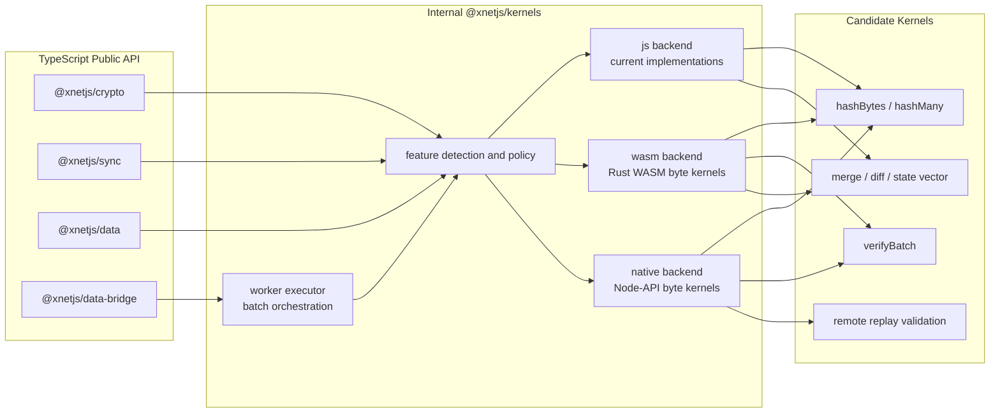
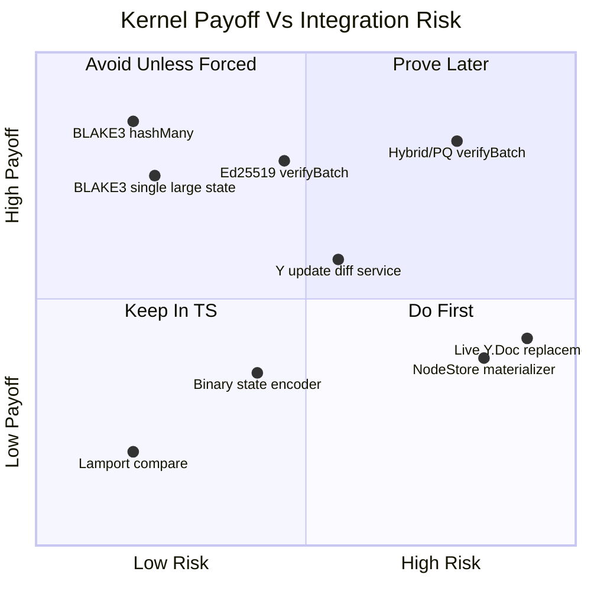
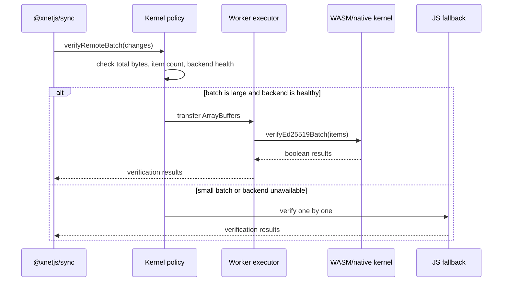
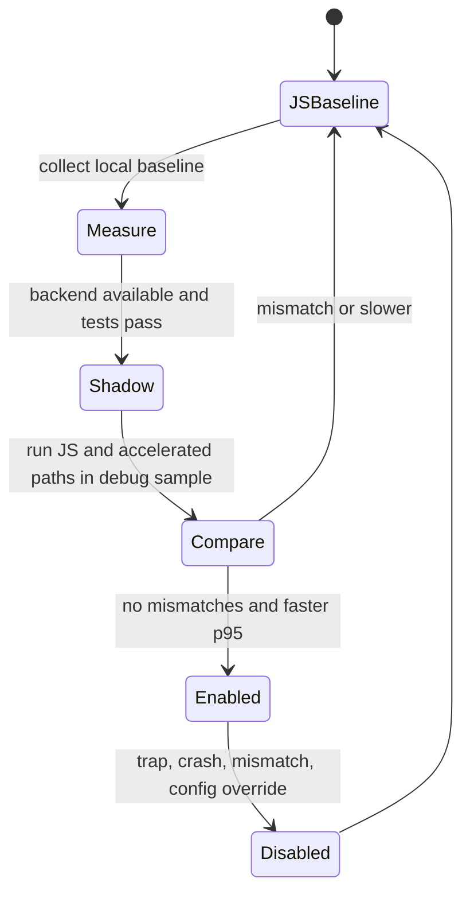
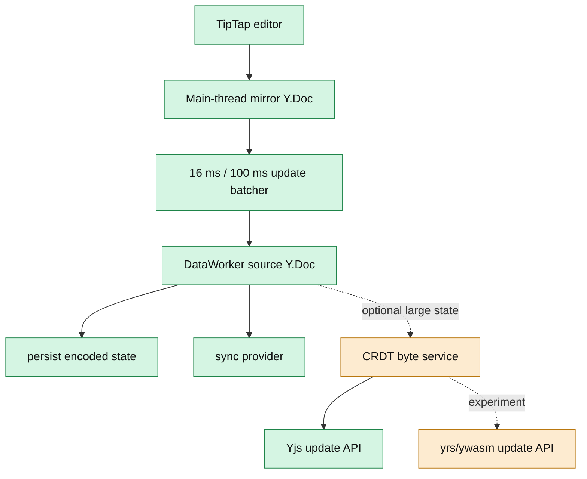
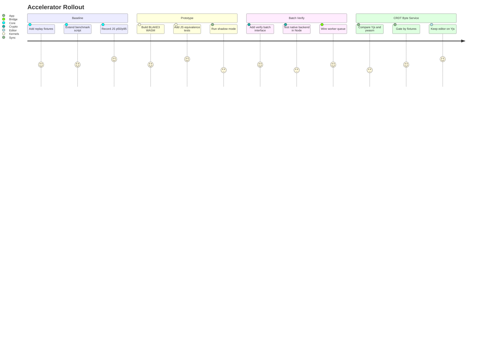

# Exploration: WASM And Native Kernels For Crypto, Sync, And CRDT Optimization

> Should xNet add AssemblyScript, WebAssembly, or native kernels for the hot crypto, sync, and CRDT codepaths? This exploration evaluates what to accelerate, what to leave in TypeScript, and how to introduce native execution without turning the codebase into a portability and supply-chain problem.

**Status**: Design Exploration  
**Last Updated**: May 2026  
**Related**: `0086_[_]_NATIVE_REWRITE_ZIG_RUST.md`, `0070_[_]_COMPACT_WIRE_FORMAT.md`, `0069_[x]_MULTI_LEVEL_CRYPTO.md`, `0043_[x]_OFF_MAIN_THREAD_ARCHITECTURE.md`, `0120_[_]_XNET_PACKAGE_SECURITY_AND_RELIABILITY_EXPLORATION.md`

---

## Executive Summary

xNet should not rewrite its crypto, sync, or CRDT stack wholesale in native code. It should add a small, explicitly optional accelerator layer for a few high-confidence kernels where the input and output are already bytes, where JS crossing costs are amortized, and where deterministic test vectors can prove equivalence against the current TypeScript implementation.

The strongest near-term candidates are:

1. `BLAKE3` hashing and multi-buffer hashing for content IDs, Yjs integrity checks, verification-cache keys, and batch sync validation.
2. Batch signature verification, especially for initial sync, inbox replay, remote-change catch-up, and future Level 1/2 hybrid-signature adoption.
3. Binary update compaction, diffing, and state-vector operations at the Yjs update boundary, not a live-editor CRDT replacement.
4. Optional Electron and hub native kernels using Node-API where browser WASM limits are a bad fit and CPU-heavy validation can run off the UI thread.

The weakest candidates are:

1. Per-keystroke signing and hashing, because the current path is already fast enough and call overhead can erase gains.
2. Replacing `Y.Doc` in the editor path with `yrs` or `ywasm`, because TipTap and existing Yjs bindings assume the JavaScript Yjs object model.
3. Moving `NodeStore` wholesale into native code, because the store is coupled to schema, auth, storage, telemetry, and arbitrary JSON-like property values.
4. Shared-memory threaded WASM as a default browser strategy, because it requires cross-origin isolation and creates deployment constraints that are not guaranteed in app embeds.

The recommended architecture is a tiny `@xnetjs/kernels` internal package with feature-detected backends:

1. `js` baseline: current TypeScript and noble implementations.
2. `wasm` browser and worker accelerator: Rust-generated WASM for byte-oriented kernels.
3. `native` Electron, Node, and hub accelerator: Node-API module with prebuilds and JS fallback.
4. `worker` orchestration: runs CPU-heavy batches off the UI thread, whether the actual primitive is JS, WASM, or native.

This keeps xNet's public API stable, preserves inspectability, and makes acceleration a measured implementation detail rather than a new platform requirement.

---

## Current Evidence In The Repo

The existing codebase already has the right shape for selective kernels. It is not missing a new language; it is missing a disciplined boundary.

| Area | Current state | Evidence | Optimization implication |
| --- | --- | --- | --- |
| Hashing | `@xnetjs/crypto` hashes `Uint8Array` with BLAKE3 or SHA-256 | `packages/crypto/src/hashing.ts:14-20` | Clean byte-in/byte-out boundary, high WASM suitability |
| Ed25519 | Signing and verification use `@noble/curves` | `packages/crypto/src/signing.ts:27-39` | Keep JS for single ops, add batch path only if measured |
| Hybrid crypto | Level 0/1/2 signatures use Ed25519 plus ML-DSA-65 | `packages/crypto/src/hybrid-signing.ts:69-197` | PQ operations are likely CPU hotspots, but native substitution increases security review scope |
| Verification cache | Cache keys are built from message hash, signature, level, and key hash | `packages/crypto/src/cache/verification-cache.ts:75-178` | Reduce redundant verify cost before adding native code; hash-key generation can be accelerated |
| Crypto metrics | Sign, verify, cache, and worker operations are already tracked | `packages/crypto/src/metrics/crypto-metrics.ts:95-181` | Use metrics to decide when kernels are enabled |
| Crypto benchmarks | Benchmark tests cover keygen, sign, verify, cache, and batch operations | `packages/crypto/src/benchmark.test.ts:1-258` | Good start, but thresholds are intentionally lenient for CI and need a separate perf gate |
| Signed Yjs updates | V1 and V2 envelopes hash update bytes plus metadata before signing | `packages/sync/src/yjs-envelope.ts:197-300`, `packages/sync/src/yjs-envelope.ts:372-385` | Byte-heavy path, good batch verify candidate |
| Yjs batching | `YjsBatcher` merges updates and reduces signature ops | `packages/sync/src/yjs-batcher.ts:1-12`, `packages/sync/src/yjs-batcher.ts:173-182` | Batching may beat native acceleration for interactive edits |
| Yjs integrity | Persisted Yjs state is hashed and verified with BLAKE3 | `packages/sync/src/yjs-integrity.ts:16-29`, `packages/sync/src/yjs-integrity.ts:68-89` | Good BLAKE3 kernel candidate for large states |
| Compact serializer | V3 wire format already packs field names and unified signatures | `packages/sync/src/serializers/v3.ts:1-29`, `packages/sync/src/serializers/v3.ts:138-248` | Optimize binary payloads before rewriting object logic |
| Remote changes | `NodeStore` verifies hash and signature before applying remote changes | `packages/data/src/store/store.ts:676-763` | Batch remote verification before materialization |
| LWW merge | Materialization is property-loop and Lamport compare heavy | `packages/data/src/store/store.ts:941-1065` | Candidate only after crypto/sync batches are proven insufficient |
| Worker bridge | Worker mode offloads storage, query, crypto, and Y.Doc work | `packages/data-bridge/src/worker-bridge.ts:66-72`, `packages/data-bridge/src/worker/data-worker.ts:1-22` | Use workers as the first CPU isolation boundary |
| Transfer-aware binary state | `NodeStateEncoder` writes compact binary `NodeState[]` payloads | `packages/data-bridge/src/utils/binary-state.ts:1-15`, `packages/data-bridge/src/utils/binary-state.ts:42-60` | Existing transfer model is compatible with WASM/native buffers |
| Native placeholder | `NativeBridge` already names Turbo Module and JSI future paths | `packages/data-bridge/src/native-bridge.ts:1-15`, `packages/data-bridge/src/native-bridge.ts:245-260` | Mobile can be a later backend, not an initial constraint |
| Baseline script | Core platform baselines cover queries, search, database rows, and bridge updates | `scripts/collect-core-platform-baselines.ts:130-303` | Extend this script with sync and crypto replay benchmarks |

The key read is that xNet has already invested in the higher-leverage work: batching, caching, worker boundaries, binary transfer, and metrics. Native code should sit behind those mechanisms, not bypass them.

---

## External Runtime Facts

This exploration used primary documentation for WebAssembly, browser memory transfer, Yjs update behavior, Rust WASM tooling, Rust CRDT crates, and Node native addons.

| Topic | Relevant fact | Design effect |
| --- | --- | --- |
| WebAssembly JS API | WASM modules can be loaded with `WebAssembly.instantiateStreaming`, and JS/WASM communicate through exports, imports, and linear memory | Keep initialization async and cache one module instance per backend |
| WASM memory | `WebAssembly.Memory` exposes an `ArrayBuffer` or `SharedArrayBuffer`, grows in 64 KiB pages, and growth detaches old buffers | Do not expose WASM memory views across package boundaries |
| WASM SIMD | SIMD instructions exist as first-class WASM operations | Useful for BLAKE3 and vector-like kernels, but feature detection and fallback are mandatory |
| `SharedArrayBuffer` | Browser shared memory requires secure context and cross-origin isolation | Shared-memory threaded WASM cannot be required for normal web deployments |
| Transferable objects | `ArrayBuffer` can move between threads without copying, and the sender loses ownership after transfer | Prefer worker batching and transfer lists for large Yjs updates and node snapshots |
| Yjs updates | Updates are commutative, associative, idempotent, binary, and can be merged, diffed, and state-vectored without always loading a `Y.Doc` | Treat CRDT acceleration as binary update services before replacing live `Y.Doc` |
| Rust `blake3` | Official Rust implementation supports incremental hashing, multithreaded `rayon`, mmap helpers, and `wasm32_simd` | Strong candidate for both Node native and browser WASM backends |
| `wasm-bindgen` | Provides high-level Rust/JS interop and TypeScript binding generation | Good for prototypes, but high-frequency calls must avoid object-heavy bindings |
| `wasm-pack` | Packages Rust-generated WASM for npm/browser/Node workflows | Good packaging path for a browser `@xnetjs/kernels-wasm` artifact |
| `yrs` | Rust-compatible port of Yjs with update encoding, transactions, shared types, awareness, and sync protocol | Useful for headless CRDT services; risky as editor replacement |
| `ywasm` | WASM bindings for `yrs`, with update application, state vectors, snapshots, and sticky indexes | Useful for experiments, but package version lag and API mismatch must be measured |
| Node-API | Stable ABI layer for native addons across Node.js versions if only Node-API is used | Prefer Node-API over V8-specific addons for Electron, hub, and server kernels |
| Node worker threads | Good for CPU-intensive JS and can transfer or share buffers; worker creation overhead needs pools | Use worker pools for batch verification and compaction, not one worker per call |

---

## The Decision Shape



The architecture should answer these questions at runtime:

1. Is this operation large enough or batched enough to amortize crossing overhead?
2. Is a worker already available so the main thread stays responsive?
3. Is a trustworthy WASM/native backend present for this runtime?
4. Do test vectors prove identical output to the JS backend?
5. Has telemetry shown that this machine benefits from this backend?

If any answer is no, the code should stay on the JS path.

---

## Kernel Selection Matrix

| Candidate | Boundary | Expected payoff | Risk | Recommendation |
| --- | --- | ---: | --- | --- |
| `hashBlake3(data)` | `Uint8Array -> Uint8Array` | High for large states, medium for tiny messages | Low | Implement first behind feature flag |
| `hashManyBlake3(buffers)` | `Uint8Array[] -> Uint8Array[]` | High for initial sync and cache-key generation | Low-medium due allocation | Implement first, minimum batch threshold |
| `verifyEd25519Batch(items)` | byte triples to booleans | High for remote replay, low for single ops | Medium due crypto correctness | Prototype after hash kernel |
| `verifyHybridBatch(items)` | byte triples plus level metadata | High if Level 1/2 is enabled broadly | High due PQ implementation review | Research and gate separately |
| `deriveKeys(seed, contexts)` | bytes to key bundles | Medium, mostly startup/import | High due key-handling risk | Defer unless measured slow |
| `mergeYjsUpdates(updates)` | `Uint8Array[] -> Uint8Array` | Medium when many small updates accumulate | Medium due semantic compatibility | Prefer JS `Y.mergeUpdates` first; compare `ywasm` only for headless use |
| `diffYjsUpdate(state, vector)` | bytes to bytes | Medium for sync catch-up | Medium | Prototype in worker, not editor path |
| `encodeStateVectorFromUpdate(update)` | bytes to bytes | Medium for compact sync | Medium | Prototype only if state-vector work is hot |
| `materializeNode(changes)` | JSON-like changes to JSON-like state | Low-medium | High due schema/auth/object coupling | Defer |
| `compareLamportBatch(changes)` | structured metadata sort | Low | Low | Keep in TypeScript unless sorting dominates |
| `NodeStateEncoder` native rewrite | `NodeState[] -> Uint8Array` | Low-medium | Medium due arbitrary values | Defer; current custom encoder is adequate |



---

## What Not To Optimize First

Native code is not a substitute for architecture. These paths should stay TypeScript until profiling says otherwise.

| Path | Why not first |
| --- | --- |
| Single `sign()` and `verify()` calls in interactive edits | JS crossing overhead and worker scheduling can exceed primitive cost |
| `NodeStore.create()` and `NodeStore.update()` | Auth, telemetry, schema lookup, encryption hooks, storage, and arbitrary property values dominate more than raw CPU |
| `Y.Doc` bound to TipTap | Existing editor integrations assume the JS Yjs API and object identity semantics |
| Query filtering and sorting | It may be better solved by storage indexes or query planning than native loops |
| Electron-only native path before browser fallback | xNet still needs deterministic behavior across Electron, web, tests, and future mobile |
| Threaded WASM by default | Cross-origin isolation requirements make this an opt-in deployment mode |

---

## Runtime Matrix

| Runtime | Recommended backend | Notes |
| --- | --- | --- |
| Browser, main thread | JS only for single ops; async WASM init for large explicit batches | Do not block first render on WASM loading |
| Browser, dedicated worker | JS or WASM byte kernels | Best browser target for sync replay, compaction, and large hashing |
| Browser with cross-origin isolation | Optional shared-memory WASM | Only if headers are guaranteed and telemetry proves benefit |
| Electron renderer | Worker plus WASM, or IPC to native in main/utility process | Avoid native addon loading directly in renderer unless needed |
| Electron main/utility process | Node-API native backend | Must account for Electron ABI and prebuild/rebuild flow |
| Node hub/server | Node-API native backend plus worker pool | Best target for CPU-heavy verification at relay boundaries |
| React Native/Expo | JS first, future Turbo Module/JSI | `NativeBridge` already models this as future work |
| Tests/CI | JS baseline plus optional WASM smoke tests | Native backend must not be required for package tests |

The practical order is worker first, WASM second, native third. A worker that runs current JS code often gets most of the responsiveness win without adding a new trust boundary.

---

## Proposed Internal API

The public `@xnetjs/crypto`, `@xnetjs/sync`, and `@xnetjs/data` APIs should not expose WASM or native details. The internal package can expose a small backend-neutral interface.

```typescript
export type KernelBackendName = 'js' | 'wasm' | 'native'

export type KernelBackend = {
  readonly name: KernelBackendName
  readonly capabilities: KernelCapability[]
  hashBlake3(data: Uint8Array): Uint8Array
  hashBlake3Batch?(items: readonly Uint8Array[]): Uint8Array[]
  verifyEd25519Batch?(items: readonly Ed25519VerifyItem[]): boolean[]
  mergeYjsUpdates?(updates: readonly Uint8Array[]): Uint8Array
  diffYjsUpdate?(update: Uint8Array, stateVector: Uint8Array): Uint8Array
}

export type KernelPolicy = {
  minBatchSize: number
  minTotalBytes: number
  allowedBackends: readonly KernelBackendName[]
  requireWorkerForBatch: boolean
}
```

The key constraints:

1. Every method takes and returns owned `Uint8Array` values.
2. No method returns a view into WASM memory.
3. No method accepts mutable JS objects or callbacks.
4. Every method has a JS reference implementation.
5. Every accelerated method has test vectors that assert byte-for-byte equivalence.
6. Every backend can be disabled by config, environment, or runtime policy.

---

## Crossing The Boundary

The biggest way to lose native/WASM wins is to cross the boundary too often or copy too much data.



Boundary rules:

| Rule | Reason |
| --- | --- |
| Batch before crossing | WASM/native calls have fixed overhead |
| Transfer buffers for large payloads | Avoid structured-clone copies when ownership can move |
| Copy for retained caller-owned buffers | Do not detach buffers that React, Yjs, or storage still needs |
| Use canonical bytes as signed input | Avoid signing semantic objects with backend-specific JSON order |
| Treat WASM memory as private | `Memory.grow()` can detach old views and create stale references |
| Keep errors typed and boring | Native panics and WASM traps must become normal JS error results |
| Add health checks | A backend that traps, crashes, or mismatches test vectors should be disabled for the session |

---

## Crypto Strategy

### Current Crypto Shape

`@xnetjs/crypto` currently uses `@noble/hashes`, `@noble/curves`, `@noble/ciphers`, and `@noble/post-quantum`. That is a strong baseline because the code is portable, auditable, and deterministic in tests. The repo also has a verification cache and crypto metrics.

Native crypto should be introduced only as an accelerator, not as a semantic authority. The JS implementation remains the reference oracle.

### Recommended Crypto Kernels

| Kernel | Backend | Initial threshold | Notes |
| --- | --- | ---: | --- |
| `hashBlake3(data)` | WASM and native | `data.byteLength >= 64 KiB` | Good for Yjs state snapshots and content import |
| `hashBlake3Batch(items)` | WASM and native | `items.length >= 32` or total bytes >= 256 KiB | Good for verification-cache keys and sync replay |
| `verifyEd25519Batch(items)` | Native first, WASM second | `items.length >= 64` | Most useful for initial sync and remote catch-up |
| `verifyHybridBatch(items)` | Native research path | `items.length >= 16` | Must be audited because ML-DSA substitution affects security posture |
| `generateHybridKeyPair()` | Native research path | explicit user action only | Startup win possible, but key handling raises review cost |

### Crypto Substitution Risks

| Risk | Mitigation |
| --- | --- |
| Algorithm mismatch between JS and native | Shared Wycheproof-style fixtures and xNet-specific signed-envelope fixtures |
| Non-constant-time implementation | Prefer audited crates/libraries and do not write custom scalar arithmetic |
| Memory retention of secrets | Zeroize native private-key buffers and never expose WASM memory aliases |
| Native crashes | Keep native operations in worker/utility process where possible |
| Supply-chain compromise | Pin crates, generate SBOM, audit native dependencies, publish checksums |
| Feature-detection spoofing | Run self-tests before enabling backend |
| Timing side channels in browser shared memory | Do not require threaded WASM for secret-bearing operations |

### Important Call

Do not accelerate signing before verification. xNet signs local actions at human speed and already batches Yjs updates. Verification is the untrusted peer boundary and scales with received data volume.

---

## Sync Strategy

### Current Sync Shape

The sync package already does several high-value things:

1. It signs Yjs updates with envelopes.
2. It hashes Yjs state at rest.
3. It batches Yjs updates to reduce signature frequency.
4. It supports V3 compact change serialization with multi-level signatures.
5. `NodeStore` verifies remote hashes and signatures before applying changes.

This means the main sync acceleration target is not per-message code. It is bulk ingress.

### Recommended Sync Kernels

| Scenario | Kernel | Expected result |
| --- | --- | --- |
| Initial peer sync with many changes | `hashManyBlake3` plus `verifyEd25519Batch` | Lower wall-clock replay time |
| Reconnecting after offline edits | worker-hosted verification queue | UI remains responsive |
| Yjs snapshot persist/load | `hashBlake3` for large state | Faster integrity verification |
| Yjs update burst | existing `Y.mergeUpdates`, then optional WASM compare | Fewer signatures and less wire traffic |
| Hub relay validation | Node worker pool plus native verify batch | Higher peer traffic ceiling |



### Sync Implementation Detail

Bulk remote validation should separate validation from application:

1. Deserialize and size-check changes.
2. Compute or validate hashes in batch.
3. Resolve author public keys.
4. Verify signatures in batch.
5. Sort by Lamport timestamp.
6. Apply changes through the existing `NodeStore.applyRemoteChange` or a new already-verified internal path.

The current `applyRemoteChanges()` sorts and then calls `applyRemoteChange()` one by one. A batch verifier should avoid duplicating verification work, but it should not skip authorization, clock update, storage append, or LWW merge semantics.

---

## CRDT Strategy

### Current CRDT Shape

xNet uses Yjs for rich text and signed Yjs envelopes for security. `data-bridge` already has a split-doc worker architecture: the worker holds source-of-truth Y.Doc instances, the main thread holds mirror docs for TipTap, and update batches flow across the boundary.

This is the correct architecture to extend. Do not replace live editor Yjs first.

### Why Live `Y.Doc` Replacement Is Risky

| Issue | Impact |
| --- | --- |
| TipTap and ProseMirror bindings expect JS Yjs objects | Replacing `Y.Doc` breaks editor integration |
| Awareness and provider ecosystem is JS-first | Presence and provider behavior may diverge |
| Object identity matters | Shared types and transactions are not just byte buffers |
| Cross-language CRDT equivalence is subtle | Rare ordering or GC differences can corrupt documents |
| Debuggability drops | Current Yjs tools and logs are easier to inspect in JS |

### Where `yrs` Or `ywasm` Could Help

| Use case | Fit | Why |
| --- | --- | --- |
| Headless update diff service | Good | Works on binary updates and state vectors |
| Snapshot compaction worker | Medium-good | Can operate away from editor object identity |
| Server-side import/export | Good | No TipTap binding constraint |
| Repair tool for corrupted docs | Medium | Could compare JS and Rust interpretations |
| Live editor document | Poor initially | Binding mismatch and high correctness risk |



The CRDT path should begin with a benchmark that compares these four cases:

1. Current JS `Y.mergeUpdates` in worker.
2. Current JS `Y.diffUpdate` and `Y.encodeStateVectorFromUpdate` in worker.
3. `ywasm` equivalents for binary update operations.
4. Native `yrs` in Node for server-side replay and compaction.

Only if `ywasm` is materially faster and byte-equivalent should it graduate into optional production use.

---

## Data And NodeStore Strategy

`NodeStore` is tempting because it loops through changes and properties, but it is not a clean early native target.

Reasons:

1. It calls auth evaluators and telemetry hooks.
2. It uses schema and property lookup functions.
3. It handles encryption snapshots and content key caches.
4. It stores arbitrary JSON-like property values.
5. It writes to storage between merge steps.
6. Its correctness depends on precise LWW and conflict tracking semantics.

The better data strategy is:

1. Accelerate remote validation before data application.
2. Keep `applyChange()` in TypeScript.
3. Add benchmark instrumentation around materialization.
4. If materialization is proven hot, extract a pure replay function first in TypeScript.
5. Only consider native replay after the pure function has byte-stable fixtures.

Potential extracted pure function:

```typescript
export function materializeNodeFromChanges(
  initial: NodeState | null,
  changes: readonly NodeChange[],
  options: MaterializeOptions
): MaterializeResult
```

That function would still likely remain in TypeScript for a while. The extraction alone makes profiling and correctness easier.

---

## AssemblyScript, Rust, Zig, And Native Options

### AssemblyScript

AssemblyScript is attractive because it feels close to TypeScript and emits WASM. It is not the best fit for xNet's first kernels.

| Strength | Weakness |
| --- | --- |
| Familiar syntax for TS contributors | Smaller crypto ecosystem than Rust |
| Good for numeric kernels | Less mature for audited crypto and CRDT libraries |
| Lower conceptual jump than Rust | Runtime and GC model can surprise when optimizing memory |

Use AssemblyScript only for non-security numeric experiments where the implementation is simple and fully covered by fixtures. Do not use it for Ed25519, ML-DSA, or CRDT internals.

### Rust WASM

Rust is the best first WASM path.

| Strength | Weakness |
| --- | --- |
| Official `blake3` crate | Toolchain and package complexity |
| Mature `wasm-bindgen` and `wasm-pack` | Crossing overhead still matters |
| `yrs` and `ywasm` exist | Rust dependency audit becomes part of release work |
| Good native path with Node-API wrappers | Larger binaries than tiny hand-written C/Zig in some cases |

Use Rust for BLAKE3 and CRDT byte-service prototypes.

### Zig

Zig remains interesting for tiny kernels and C ABI ergonomics, but it lacks the ecosystem advantage Rust has for xNet's current needs. It may be useful later for tightly scoped encoding kernels or memory-safe-ish C interop, not first-wave crypto or CRDT work.

### Node-API Native

Node-API is the best native path for Electron, Node hub, and server tooling because it provides ABI stability when used correctly. The warning is practical packaging: Electron native modules still create ABI and rebuild work. xNet already has Electron ABI rebuild gotchas with packages like `better-sqlite3`, `usearch`, and `sharp`, so any native kernel must ship prebuilds and a JS fallback.

---

## Benchmark Plan

The benchmark plan must answer two questions:

1. Is the accelerated backend faster in the scenarios xNet actually runs?
2. Does the accelerated backend produce exactly the same bytes and decisions as the JS backend?

### Microbenchmarks

| Benchmark | Inputs | Compare |
| --- | --- | --- |
| BLAKE3 single | 1 KiB, 64 KiB, 1 MiB, 16 MiB | avg, p95, allocation |
| BLAKE3 batch | 16, 64, 256, 1024 buffers | throughput, crossing overhead |
| Ed25519 verify batch | 16, 64, 256, 1024 signatures | ops/sec, mismatches |
| Hybrid verify batch | 4, 16, 64 signatures | ops/sec, backend risk |
| Yjs merge updates | keystroke bursts and snapshots | output equivalence and size |
| Yjs state vector/diff | offline sync fixtures | output equivalence and speed |

### Macrobenchmarks

| Benchmark | Scenario | Success metric |
| --- | --- | --- |
| Initial sync replay | 1k, 10k, 100k signed changes | lower p95 wall time, no UI stall |
| Offline catch-up | 1k local and 1k remote edits | lower time to usable document |
| Yjs snapshot load | 1 MiB, 10 MiB, 50 MiB states | faster integrity check and compaction |
| Hub relay validation | many peers publishing signed updates | higher verified messages/sec |
| Electron import | large workspace import | lower total import time without crashes |

### Gates

| Gate | Required threshold |
| --- | --- |
| Correctness | zero mismatches across deterministic fixtures and fuzz cases |
| Speed | at least 1.5x faster p95 for batch workloads or disabled by default |
| Startup | WASM/native init must not block app bootstrap |
| Size | browser WASM payload must have explicit bundle budget |
| Fallback | tests pass with all accelerators disabled |
| Observability | metrics include backend, bytes, batch size, duration, and fallback reason |
| Security | dependency audit, SBOM, and native release checklist complete |

---

## Rollout Plan



### Phase 0: Baseline And Fixtures

Deliverables:

1. Add `scripts/collect-sync-crypto-baselines.ts` or extend `collect-core-platform-baselines.ts`.
2. Create signed-change replay fixtures at 1k, 10k, and 100k changes.
3. Create Yjs update fixtures from realistic editor sessions.
4. Add test vectors for BLAKE3, Ed25519, signed Yjs envelopes, V3 serialized changes, and NodeStore remote replay.
5. Add telemetry fields for backend name and fallback reason.

Exit criteria:

1. We know which workloads are actually slow.
2. Baselines run locally and in a non-flaky CI/perf lane.
3. No accelerator code has been merged into production paths yet.

### Phase 1: BLAKE3 Byte Kernel

Deliverables:

1. Create internal `@xnetjs/kernels` package with JS backend only.
2. Add Rust WASM BLAKE3 backend with async initialization.
3. Add optional Node-API BLAKE3 backend for Electron/Node if packaging is straightforward.
4. Wire `hashBlake3` behind policy for large buffers only.
5. Add shadow-mode comparison in debug builds.

Exit criteria:

1. Hash outputs are byte-identical.
2. Large-buffer hashing is at least 1.5x faster p95.
3. Small-buffer hashing stays on JS path unless measured otherwise.

### Phase 2: Batch Verification

Deliverables:

1. Add `verifyEd25519Batch` reference JS implementation.
2. Add worker queue for remote verification batches.
3. Prototype native or WASM backend.
4. Add `applyRemoteChangesVerified` only if it avoids duplicate verification while preserving auth and LWW semantics.
5. Measure initial sync and catch-up replay.

Exit criteria:

1. Initial sync replay improves materially.
2. UI responsiveness improves under remote-update bursts.
3. Any native crash disables the backend and falls back to JS.

### Phase 3: CRDT Byte Service

Deliverables:

1. Benchmark current Yjs binary update APIs in `DataWorker`.
2. Compare `ywasm` and, for Node, native `yrs` on the same fixtures.
3. Keep live TipTap docs on JS Yjs.
4. Consider `ywasm` only for headless diff, merge, state-vector, snapshot, or repair tools.

Exit criteria:

1. Byte outputs are compatible or intentionally normalized.
2. Real editor fixtures prove no data loss.
3. No live-editor API migration is required.

### Phase 4: Native Packaging

Deliverables:

1. Add prebuild matrix for macOS arm64/x64, Linux x64/arm64, Windows x64.
2. Add Electron ABI compatibility test.
3. Add fallback path for missing native package.
4. Add release checklist and checksums.
5. Document rebuild instructions for local development.

Exit criteria:

1. A fresh clone works without native toolchain when fallback is acceptable.
2. Electron dev and packaged app both load or gracefully skip native backend.
3. CI verifies native package smoke tests on supported platforms.

---

## Security Review Checklist

Before enabling any non-JS backend by default:

1. Confirm all accelerated outputs match JS reference fixtures.
2. Confirm self-tests run before backend activation.
3. Confirm malformed inputs return errors, not traps or process crashes.
4. Confirm private keys and seeds are zeroized or not passed to backend at all.
5. Confirm native code uses Node-API only, not V8 or unstable Node internals.
6. Confirm WASM memory is not exposed through returned `Uint8Array` views.
7. Confirm dependency licenses are compatible with xNet distribution.
8. Confirm dependency sources are pinned and covered by SBOM output.
9. Confirm Electron sandbox and renderer process boundaries are respected.
10. Confirm backend can be disabled with config and environment override.
11. Confirm debug shadow mode samples a small percentage without double-applying changes.
12. Confirm metrics do not leak content bytes, keys, signatures beyond aggregate timings.

---

## Implementation Checklist

### Package Structure

1. Add `packages/kernels` as internal package, not public API promise.
2. Export only backend-neutral functions and types.
3. Keep `@xnetjs/crypto` imports one-way into kernels or invert via dependency injection to avoid cycles.
4. Make backend initialization lazy and explicit.
5. Make JS backend always available.

### Testing

1. Add fixtures for every accelerated function.
2. Add cross-backend equivalence tests.
3. Add fuzz tests for malformed byte input.
4. Add tests with accelerators disabled.
5. Add tests with backend initialization failure.
6. Add tests that ensure transferred buffers are not reused accidentally.

### Performance

1. Add local benchmark command for crypto and sync replay.
2. Track p50, p95, max, bytes/sec, ops/sec, and allocation where possible.
3. Include cold-start and warm-start WASM timings.
4. Include worker queue latency separately from kernel execution time.
5. Store baseline results in docs or artifacts for comparison.

### Runtime Policy

1. Disable accelerators in tests by default unless a backend-specific test opts in.
2. Disable native backend when package version or ABI self-test fails.
3. Disable threaded WASM unless `crossOriginIsolated` is true.
4. Disable batch backend when input is below threshold.
5. Record fallback reason in telemetry.

### Documentation

1. Document backend selection and fallback behavior.
2. Document Electron rebuild/prebuild flow.
3. Document how to reproduce benchmark results.
4. Document security review expectations for new kernels.
5. Document that public xNet semantics remain TypeScript-defined.

---

## Open Questions

1. Should `@xnetjs/kernels` be a normal workspace package or split into `@xnetjs/kernels`, `@xnetjs/kernels-wasm`, and `@xnetjs/kernels-native` to keep optional dependencies cleaner?
2. Should Electron load native kernels in the renderer, main process, or a utility process?
3. How much browser bundle budget is acceptable for the first WASM module?
4. Should hub/server verification optimize Ed25519 first, ML-DSA first, or both behind one batch interface?
5. What percentage of debug sessions should run JS and accelerated paths in shadow mode?
6. Should workspace imports compute BLAKE3 in a streaming worker API instead of requiring whole buffers?

---

## Recommendation

Adopt selective kernels, not a native rewrite.

Immediate next work:

1. Extend the baseline script with crypto and sync replay benchmarks.
2. Define `@xnetjs/kernels` with a JS backend and policy layer only.
3. Prototype a Rust WASM BLAKE3 backend for large-buffer and batch hashing.
4. Add debug-only shadow comparison and telemetry for backend decisions.
5. Use the results to decide whether batch verification deserves a native or WASM implementation.

Explicit non-goals for the first milestone:

1. Do not replace `Y.Doc` in the editor path.
2. Do not move `NodeStore` into native code.
3. Do not make native modules required for local development.
4. Do not enable threaded WASM by default.
5. Do not substitute cryptographic implementations without equivalence tests and security review.

The highest-quality version of this effort is almost invisible to consumers: same TypeScript API, same signed bytes, same conflict semantics, better throughput when the workload is large enough, and boring fallback behavior everywhere else.

---

## References

- `packages/crypto/src/hashing.ts`
- `packages/crypto/src/signing.ts`
- `packages/crypto/src/hybrid-signing.ts`
- `packages/crypto/src/cache/verification-cache.ts`
- `packages/crypto/src/metrics/crypto-metrics.ts`
- `packages/crypto/src/benchmark.test.ts`
- `packages/sync/src/yjs-envelope.ts`
- `packages/sync/src/yjs-batcher.ts`
- `packages/sync/src/yjs-integrity.ts`
- `packages/sync/src/serializers/v3.ts`
- `packages/data/src/store/store.ts`
- `packages/data-bridge/src/worker-bridge.ts`
- `packages/data-bridge/src/worker/data-worker.ts`
- `packages/data-bridge/src/utils/binary-state.ts`
- `packages/data-bridge/src/native-bridge.ts`
- `scripts/collect-core-platform-baselines.ts`
- MDN, WebAssembly JavaScript API: `https://developer.mozilla.org/en-US/docs/WebAssembly/Guides/Using_the_JavaScript_API`
- MDN, WebAssembly.Memory: `https://developer.mozilla.org/en-US/docs/WebAssembly/Reference/JavaScript_interface/Memory`
- MDN, SharedArrayBuffer: `https://developer.mozilla.org/en-US/docs/Web/JavaScript/Reference/Global_Objects/SharedArrayBuffer`
- MDN, Transferable objects: `https://developer.mozilla.org/en-US/docs/Web/API/Web_Workers_API/Transferable_objects`
- Yjs document updates: `https://docs.yjs.dev/api/document-updates`
- Rust `blake3` crate: `https://docs.rs/blake3/latest/blake3/`
- `wasm-bindgen` guide: `https://wasm-bindgen.github.io/wasm-bindgen/`
- `wasm-pack` docs: `https://drager.github.io/wasm-pack/`
- Rust `yrs` crate: `https://docs.rs/yrs/latest/yrs/`
- Rust `ywasm` crate: `https://docs.rs/ywasm/latest/ywasm/`
- Node-API docs: `https://nodejs.org/api/n-api.html`
- Node worker threads docs: `https://nodejs.org/api/worker_threads.html`
