# Exploration: Adding Immer And Zod To xNet Data

> Should `@xnetjs/data` add `immer` and `zod`? This exploration evaluates where they improve correctness, schema federation, developer experience, and immutable update ergonomics, and where they would fight xNet's event-sourced, signed, local-first data model.

**Status**: Design Exploration  
**Last Updated**: May 2026  
**Related**: `0071_[x]_DATABASE_DEFINED_SCHEMAS.md`, `0089_[_]_REST_GRAPHQL_INTEROPERABILITY_BOUNDARY.md`, `0091_[_]_GLOBAL_SCHEMA_FEDERATION_MODEL.md`, `0093_[_]_NODE_NATIVE_GLOBAL_SCHEMA_FEDERATION_MODEL.md`, `0095_[_]_PACKAGE_PORTFOLIO_CLEANUP_AND_API_SIMPLIFICATION.md`, `0099_[_]_DATABASE_EDITING_UX_AND_UNDO_REDO_REMEDIATION_PLAN.md`, `0120_[_]_XNET_PACKAGE_SECURITY_AND_RELIABILITY_EXPLORATION.md`

---

## Executive Summary

`@xnetjs/data` should add Zod first, cautiously, and mostly as an internal validation and schema-boundary substrate. It should not rewrite the public schema DSL around Zod in one step.

`@xnetjs/data` should not add Immer as a blanket dependency for `NodeStore` materialization yet. Immer is valuable for authoring immutable update helpers, query-cache deltas, migration/lens experiments, and developer-mode mutation detection, but the current `NodeStore.applyChange()` loop is small, explicit, and part of a hot signed-change replay path. Replacing it wholesale with Immer risks extra proxy/freezing cost and subtle semantic drift around sparse updates, `undefined` deletion, `_unknown` preservation, and `Uint8Array` document snapshots.

Recommended near-term stance:

1. Add `zod` to `@xnetjs/data` as a normal dependency only if it is used in shipped runtime boundaries, not just tests.
2. Build Zod adapters behind the existing `PropertyBuilder<T>` interface so the public code-first DSL remains stable.
3. Use Zod immediately for remote schema payloads, decrypted snapshot envelopes, and optional local mutation validation before signing changes.
4. Add JSON Schema export/import experiments through Zod 4 only where xNet can preserve its JSON-LD schema IRIs and authorization metadata.
5. Keep Immer out of the initial dependency set unless a concrete ergonomic API is added, such as `store.updateDraft(id, recipe)` or a query-cache patch helper.
6. If Immer is added, disable or isolate auto-freezing in hot storage/sync paths, do not depend on Immer patches for network sync, and benchmark remote replay before and after.

The strongest result is a layered adoption: Zod hardens trust boundaries; Immer stays opt-in for authoring local immutable transformations.

---

## Current Repo Evidence

The existing `@xnetjs/data` package already has a coherent shape: code-first schemas, hand-written property validators/coercers, event-sourced sparse node changes, Lamport LWW materialization, optional schema migration lenses, and storage adapters.

| Area                      | Current state                                                            | Evidence                                                                                                     | Implication                                                                       |
| ------------------------- | ------------------------------------------------------------------------ | ------------------------------------------------------------------------------------------------------------ | --------------------------------------------------------------------------------- |
| Package deps              | `@xnetjs/data` has no Zod or Immer dependency today                      | `packages/data/package.json:62-72`                                                                           | Any adoption is a new runtime supply-chain and bundle decision                    |
| Schema builders           | `PropertyBuilder<T>` owns `validate()` and `coerce()`                    | `packages/data/src/schema/types.ts:51-60`                                                                    | Zod can be hidden behind existing builders                                        |
| Schema validation         | `defineSchema().validate()` manually checks base fields and properties   | `packages/data/src/schema/define.ts:155-198`                                                                 | Zod can replace duplicated validation logic if error shape is preserved           |
| Node creation             | `defineSchema().create()` manually coerces each property                 | `packages/data/src/schema/define.ts:200-224`                                                                 | Existing permissive coercion semantics must be preserved or changed intentionally |
| Property helpers          | Built-ins implement type-specific validation/coercion                    | `packages/data/src/schema/properties/text.ts:41-55`, `number.ts:39-55`, `relation.ts:73-99`, `file.ts:31-97` | Zod wrappers are feasible, but one-to-one behavior is not automatic               |
| Remote schema registry    | Remote schemas are normalized with ad hoc guards                         | `packages/data/src/schema/registry.ts:114-135`, `registry.ts:327-355`, `registry.ts:531-555`                 | Strong first Zod target                                                           |
| React remote schemas      | Hub response JSON is cast directly                                       | `packages/react/src/hooks/useRemoteSchema.ts:59-73`                                                          | Strong cross-package validation target                                            |
| NodeStore create/update   | Raw `Record<string, unknown>` properties are signed into sparse changes  | `packages/data/src/store/store.ts:155-184`, `store.ts:303-331`                                               | Local validation can happen before signing; remote validation must be cautious    |
| NodeStore materialization | `applyChange()` mutates a materialized `NodeState` in place              | `packages/data/src/store/store.ts:941-1058`                                                                  | Immer could rewrite this, but current code is concise and deterministic           |
| Sparse deletes            | `undefined` deletes a property                                           | `packages/data/src/store/types.ts:35-54`, `store.ts:1003-1006`                                               | Zod must not normalize away `undefined` in update patches                         |
| Unknown future fields     | Unknown properties are preserved in `_unknown`                           | `packages/data/src/store/types.ts:105-125`, `store.ts:975-1000`                                              | Validation must not reject future-schema fields by default                        |
| Transactions              | Transactions resolve temp IDs, then apply each operation under one batch | `packages/data/src/store/store.ts:528-649`                                                                   | Zod can validate operations pre-batch; true rollback semantics are separate       |
| Snapshot parsing          | Decrypted node snapshots are parsed with manual structural guards        | `packages/data/src/store/store.ts:1219-1245`                                                                 | Strong Zod target because this is a trust boundary                                |
| Memory adapter            | In-memory adapter stores and returns node objects by reference           | `packages/data/src/store/memory-adapter.ts:82-87`                                                            | Dev-mode freezing or clone-on-read/write could catch aliasing bugs                |
| SQLite adapter            | SQLite reconstructs fresh `NodeState` objects from rows                  | `packages/data/src/store/sqlite-adapter.ts:212-255`                                                          | Less need for Immer at this layer                                                 |
| Query cache               | Cache stores arrays by reference and mutates entry metadata              | `packages/data-bridge/src/query-cache.ts:142-203`                                                            | Immer could make cache updates clearer, but it is outside `@xnetjs/data`          |
| Worker deltas             | Query deltas are already immutable array operations                      | `packages/data-bridge/src/worker-bridge.ts:199-224`                                                          | Immer likely adds little here unless deltas grow more complex                     |

The main architectural observation is that `@xnetjs/data` is not missing a schema concept. It is missing a single, reusable validation substrate at untrusted boundaries.

---

## External Research Snapshot

This exploration used official documentation and package metadata sources for current Zod and Immer behavior.

| Topic                  | Current external fact                                                                                                                                                                                  | Design implication                                                                                                                                            |
| ---------------------- | ------------------------------------------------------------------------------------------------------------------------------------------------------------------------------------------------------ | ------------------------------------------------------------------------------------------------------------------------------------------------------------- |
| Zod purpose            | Zod is a TypeScript-first schema validation library with static inference, zero external dependencies, strict-mode expectation, immutable schema API, JSON Schema conversion, and browser/Node support | Good match for xNet's strict TypeScript package and schema boundary needs                                                                                     |
| Zod 4 status           | Zod 4 is stable and has performance/compiler improvements over Zod 3, including much faster parsing and lower `tsc` instantiation counts                                                               | Prefer Zod 4 rather than introducing Zod 3-era tradeoffs                                                                                                      |
| Zod package metadata   | `npm view zod` reported latest `4.4.3` and unpacked size about `4.56 MB`                                                                                                                               | Runtime bundle size should be measured in built apps, not inferred from package tarball size                                                                  |
| Zod Mini               | Zod Mini offers a tree-shakable functional API but the docs recommend regular Zod for most use cases unless bundle constraints are unusually strict                                                    | `@xnetjs/data` should use regular Zod internally unless app bundle budgets prove otherwise                                                                    |
| Zod Core               | `zod/v4/core` is intended for library authors and shared by Zod Classic and Zod Mini                                                                                                                   | If xNet accepts user-supplied Zod schemas later, use `zod/v4/core` types at boundaries                                                                        |
| Zod JSON Schema        | Zod 4 has first-party `z.toJSONSchema()` and experimental `z.fromJSONSchema()`                                                                                                                         | Useful for schema federation/export, but `fromJSONSchema()` should not be a stable foundation yet                                                             |
| Zod codecs             | Zod 4 codecs support bidirectional encode/decode with typed inputs                                                                                                                                     | Potentially useful for persisted/network-friendly forms such as date, bytes, or file metadata, but avoid black-box transforms in federated schema definitions |
| Immer purpose          | Immer uses Proxy drafts to produce immutable next state with structural sharing, freezing, and plain JS mutation syntax                                                                                | Useful for ergonomic authoring of local immutable updates                                                                                                     |
| Immer package metadata | `npm view immer` reported latest `11.1.8` and unpacked size about `914 KB`                                                                                                                             | Smaller package than Zod, but runtime proxy/freezing cost matters more than tarball size                                                                      |
| Immer patches          | Patches require `enablePatches()`, are correct but not guaranteed optimal, and are similar but not identical to RFC 6902 JSON Patch                                                                    | Do not treat Immer patches as xNet's sync protocol without an explicit translation/compression layer                                                          |
| Immer auto-freezing    | Auto-freezing is enabled by default and recursively freezes produced trees; it can be disabled with `setAutoFreeze()`                                                                                  | Dangerous in hot or binary-heavy paths unless configured deliberately                                                                                         |
| Immer performance      | Docs describe proxy Immer as roughly 2-3x slower than handwritten reducers in a worst-case benchmark, often negligible in practice, and opt-out is recommended for critical reducers                   | Keep hand-written materialization until benchmarks show ergonomic value outweighs cost                                                                        |

Sources:

1. Zod intro: `https://zod.dev/`
2. Zod 4 release notes: `https://zod.dev/v4`
3. Zod JSON Schema docs: `https://zod.dev/json-schema`
4. Zod codecs docs: `https://zod.dev/codecs`
5. Zod Mini docs: `https://zod.dev/packages/mini`
6. Zod Core and library author docs: `https://zod.dev/packages/core`, `https://zod.dev/library-authors`
7. Immer intro and `produce`: `https://immerjs.github.io/immer/`, `https://immerjs.github.io/immer/produce/`
8. Immer patches, freezing, API, performance, and pitfalls: `https://immerjs.github.io/immer/patches/`, `https://immerjs.github.io/immer/freezing/`, `https://immerjs.github.io/immer/api/`, `https://immerjs.github.io/immer/performance/`, `https://immerjs.github.io/immer/pitfalls/`

---

## Current Architecture Map

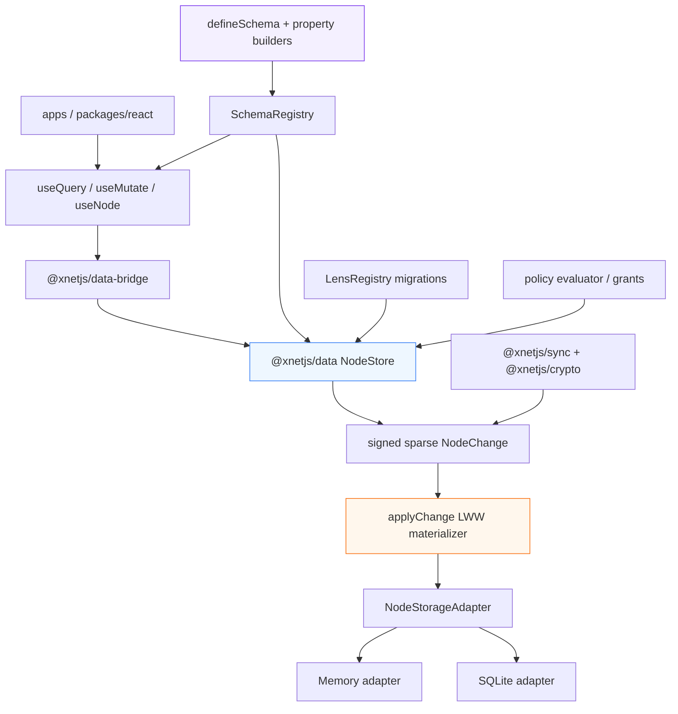

Zod fits best on schema and boundary arrows. Immer fits best around local immutable transforms. Neither should sit between signed remote changes and deterministic replay until proven safe.

---

## Decision Frame

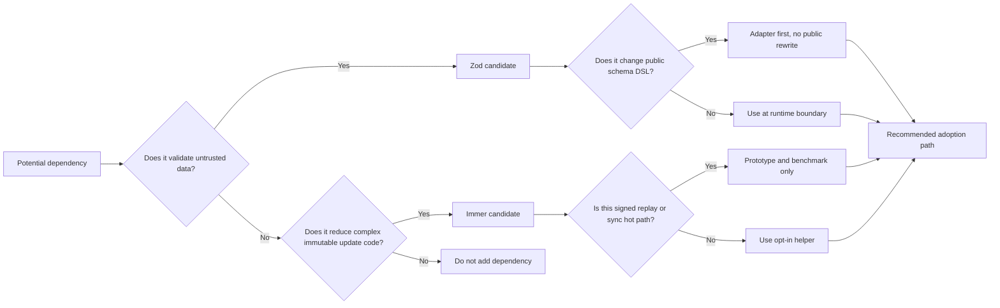

The decision should be made per boundary, not per package.

---

## Zod: Where It Helps

### 1. Remote Schema Payload Validation

Remote schemas are exactly the kind of input Zod is built for: unknown JSON from a hub or peer that must become typed runtime state.

Current risks:

1. `SchemaRegistry.setRemoteResolver()` accepts a `Schema | null` and `parseSchemaDefinition()` only checks a subset of shape constraints.
2. `useRemoteSchema()` casts `response.json()` directly to `RemoteSchemaDefinition`.
3. `PropertyDefinition.config` is open-ended and property-specific config validation is duplicated in `buildPropertyBuilder()`.
4. The schema federation plan wants schema/presence/policy as data; that raises the value of rigorous validation.

Recommended Zod layer:

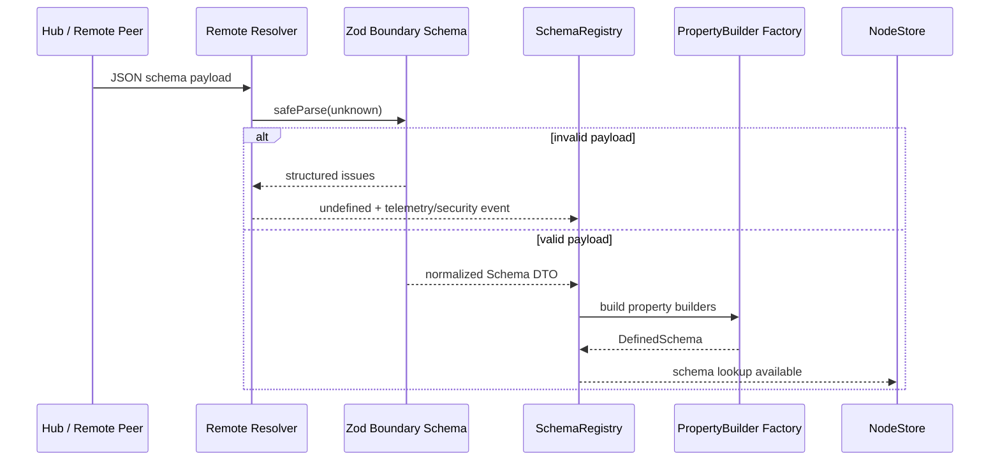

Implementation idea:

```typescript
import * as z from 'zod'

const propertyTypeSchema = z.enum([
  'text',
  'number',
  'checkbox',
  'date',
  'dateRange',
  'select',
  'multiSelect',
  'person',
  'relation',
  'rollup',
  'formula',
  'url',
  'email',
  'phone',
  'file',
  'created',
  'updated',
  'createdBy'
])

const schemaIRISchema = z.custom<`xnet://${string}/${string}`>(
  (value) => typeof value === 'string' && value.startsWith('xnet://') && value.includes('/'),
  { message: 'Expected xNet schema IRI' }
)

const propertyDefinitionSchema = z.object({
  '@id': z.string().optional(),
  name: z.string().min(1),
  type: propertyTypeSchema,
  required: z.boolean().default(false),
  config: z.record(z.string(), z.unknown()).optional()
})

const serializedSchemaSchema = z.object({
  '@id': schemaIRISchema,
  '@type': z.literal('xnet://xnet.fyi/Schema'),
  name: z.string().min(1),
  namespace: z.custom<`xnet://${string}/`>(
    (value) => typeof value === 'string' && value.startsWith('xnet://') && value.endsWith('/'),
    { message: 'Expected xNet namespace IRI' }
  ),
  version: z.string().min(1),
  migrateFrom: schemaIRISchema.optional(),
  properties: z.array(propertyDefinitionSchema).min(1),
  extends: schemaIRISchema.optional(),
  document: z.enum(['yjs', 'automerge']).optional(),
  authorization: z.unknown().optional()
})
```

This should produce xNet's existing `ValidationResult` error shape rather than leaking Zod-specific errors through public APIs.

### 2. Decrypted Snapshot Validation

`NodeStore.deserializeNodeSnapshot()` parses JSON and checks that `properties` is an object. This is a trust boundary after decryption, and corruption/malformed payloads should produce good diagnostics.

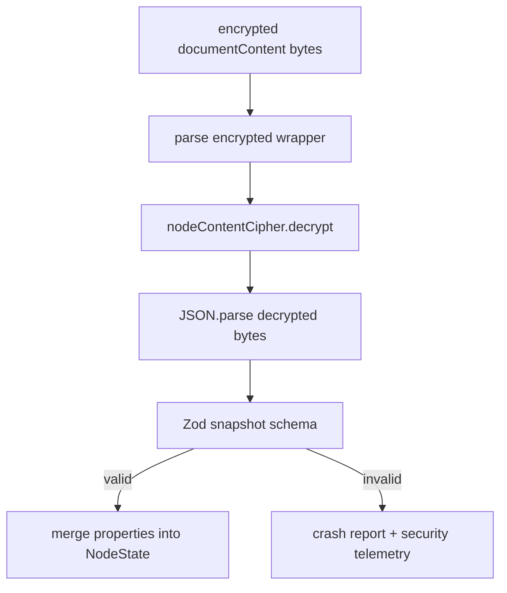

Recommended schema:

```typescript
const nodeSnapshotSchema = z.object({
  properties: z.record(z.string(), z.unknown()),
  unknown: z.record(z.string(), z.unknown()).optional()
})
```

This is low risk because it validates only the envelope shape, not every schema-defined property.

### 3. Local Mutation Validation Before Signing

`NodeStore.create()` and `NodeStore.update()` currently sign raw `Record<string, unknown>` payloads. The type-safe React API reduces mistakes at compile time, but any direct `NodeStore` caller can write invalid values.

The safest insertion point is before `createChange()` on local changes. Remote changes should still be verified cryptographically and applied according to compatibility rules; they should not be rejected just because the local runtime lacks a future schema.

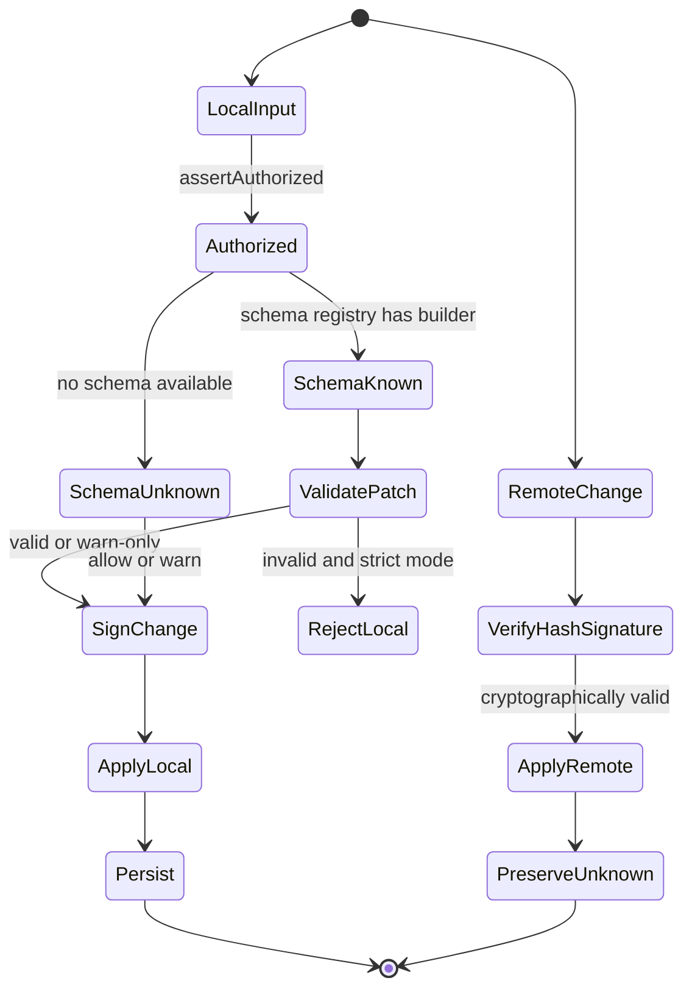

Recommended modes:

| Mode           | Local create/update                           | Remote apply               | Use case                                |
| -------------- | --------------------------------------------- | -------------------------- | --------------------------------------- |
| `off`          | Current behavior                              | Current behavior           | Compatibility baseline                  |
| `warn`         | Validate and emit telemetry, still sign/apply | Current behavior           | First rollout                           |
| `strict-local` | Reject invalid local writes before signing    | Current behavior           | Default after migration                 |
| `strict-all`   | Reject invalid local and remote writes        | Not recommended by default | Controlled tests or private deployments |

### 4. Property Builder Implementation Substrate

The current `PropertyBuilder<T>` interface should stay. Zod can implement some built-ins internally.

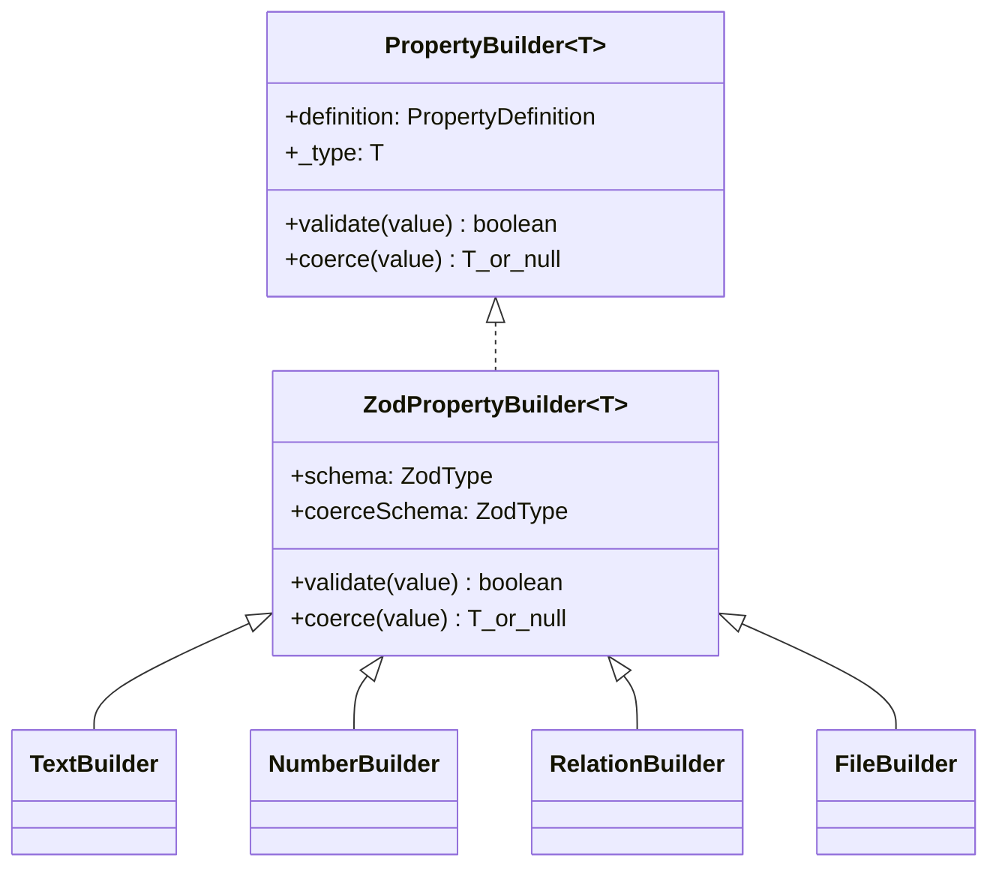

The adapter must preserve differences between validation and coercion. For example, `number.validate('5')` should remain false while `number.coerce('5')` currently returns `5`. Zod's `.parse()` alone is not enough; xNet needs distinct strict and coercing schemas.

### 5. JSON Schema Export For Interoperability

Zod 4's first-party `z.toJSONSchema()` is attractive for xNet's REST/GraphQL/OpenAPI boundary. However, xNet schemas are JSON-LD-like documents with IRIs, property IDs, authorization metadata, CRDT document markers, and migration metadata.

Use Zod JSON Schema export as a projection, not as canonical storage.

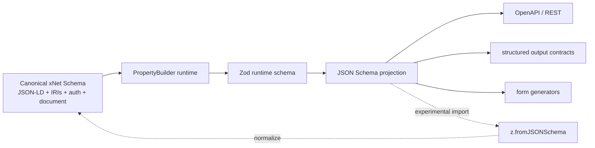

Recommended rule: xNet schema definitions remain canonical. Zod and JSON Schema are generated artifacts unless and until a migration explicitly changes that model.

---

## Zod: Where It Hurts

### 1. Silent Semantic Changes

Current builders have permissive behavior:

| Property                                   | Current behavior | Zod risk                                                        |
| ------------------------------------------ | ---------------- | --------------------------------------------------------------- |
| `text().coerce(123)`                       | returns `'123'`  | `z.string()` rejects numbers unless `z.coerce.string()` is used |
| `number().coerce('5')`                     | returns `5`      | `z.number()` rejects strings unless `z.coerce.number()` is used |
| `number({ integer: true }).coerce(5.8)`    | returns `6`      | `z.int()` rejects non-integers unless custom transform rounds   |
| `relation({ multiple: true }).coerce('a')` | returns `['a']`  | `z.array(z.string())` rejects strings unless preprocessed       |
| `file({ multiple: true }).coerce(file)`    | returns `[file]` | array schema rejects single object unless preprocessed          |

The migration must include golden tests for every property helper.

### 2. Unknown Future Fields

Zod object schemas often strip or reject unknown keys depending on object mode. xNet deliberately preserves unknown future schema properties in `_unknown`. Any Zod validation layer that uses strict objects in the wrong place could break version compatibility.

Rule: schema-defined property validation can be strict for known properties, but node and patch envelopes must remain forward-compatible.

### 3. `undefined` As Delete

Zod defaults, optional handling, JSON Schema export, and encode/decode helpers can accidentally blur the difference between absent, `undefined`, `null`, and delete.

In `NodePayload.properties`, `undefined` means delete. In JSON, `undefined` is not representable. In Zod optional schemas, `undefined` can mean omitted input. That is a semantic minefield.

Rule: never serialize update patches through generic JSON/Zod transformations that erase `undefined` unless they explicitly convert deletes to a stable tombstone representation.

### 4. Public API Coupling

If `DefinedSchema` exposes Zod schemas directly, xNet inherits Zod's API evolution and users start depending on implementation details.

Rule: expose optional adapters such as `toZodSchema(TaskSchema)` or `fromZodSchema(...)` only after the internal adoption proves stable.

---

## Immer: Where It Helps

### 1. Authoring Safe Immutable Local Helpers

Immer's best fit is not the core event log. It is authoring local transformations where callers want mutation syntax but xNet needs immutable results.

Possible API:

```typescript
await store.updateDraft(taskId, (draft) => {
  draft.title = draft.title.trim()
  draft.status = 'done'
})
```

This can compile to a sparse `properties` patch by diffing known top-level properties before and after the recipe.

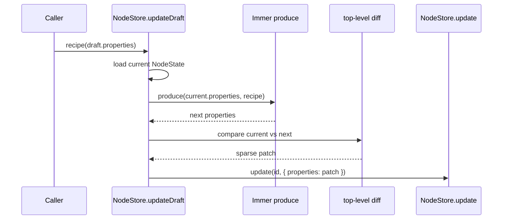

This is useful if update recipes become more nested, especially for database view configs, property configs, or future complex node properties.

### 2. Migration Lens Ergonomics

Schema lenses currently transform `Record<string, unknown>` with object spreads. For more complex migrations, Immer could make transformation code easier to write while preserving immutable outputs.

```typescript
const taskV1toV2: SchemaLens = {
  source: 'xnet://xnet.fyi/Task@1.0.0',
  target: 'xnet://xnet.fyi/Task@2.0.0',
  forward: (data) =>
    produce(data, (draft) => {
      draft.status = draft.completed ? 'done' : 'todo'
      delete draft.completed
    }),
  backward: (data) =>
    produce(data, (draft) => {
      draft.completed = draft.status === 'done'
      delete draft.status
    }),
  lossless: false
}
```

This is not a core runtime requirement, but it is a good optional ergonomics layer.

### 3. Developer-Mode Mutation Detection

The memory adapter returns stored node objects by reference. This is convenient for tests but can hide mutation bugs. Immer's freezing utilities or `produce` outputs can help catch accidental mutation in development/test configurations.

Potential use:

1. Freeze `NodeState` returned from `MemoryNodeStorageAdapter` in tests.
2. Freeze query-cache snapshots in dev builds.
3. Use Immer only in helper utilities, not storage adapters, unless benchmarked.

### 4. Query Cache Deltas Outside `@xnetjs/data`

The worker bridge already uses immutable array operations for deltas. If the cache logic grows to include pagination windows, sorted insertion, grouped views, optimistic updates, undo, or inverse deltas, Immer could simplify the implementation.

This belongs in `@xnetjs/data-bridge`, not necessarily `@xnetjs/data`.

---

## Immer: Where It Hurts

### 1. Hot Signed Replay Path

`NodeStore.applyChange()` is the deterministic materializer for signed sparse changes. It is only about 120 lines, and every branch carries sync semantics.

Replacing it with Immer would make code nicer in places, but introduce:

1. Proxy creation on every applied change.
2. Potential recursive freeze cost if auto-freezing remains enabled.
3. Less direct control over mutation order and conflict tracking.
4. More subtle interactions with `Uint8Array` and non-plain values.
5. Another dependency in the replay path for remote data.

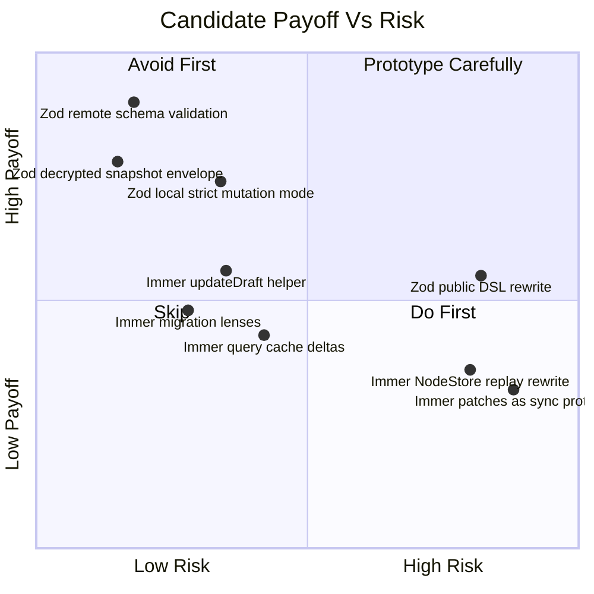

### 2. Patch Format Mismatch

Immer patches are useful for undo/debugging, but xNet's sync model is already sparse signed properties plus CRDT document updates. Immer patch paths are arrays, not RFC 6902 strings, and the docs explicitly say patches are correct but not guaranteed optimal.

Rule: do not use Immer patches as network protocol without a separate exploration.

### 3. Tree Constraints

Immer assumes a unidirectional tree without cycles or repeated object references. xNet node graphs are not stored as object graphs inside a `NodeState`; relation properties are node IDs, which is good. But future richer objects, shared config objects, and binary/document content need care.

### 4. Auto-Freezing Side Effects

Auto-freezing is valuable in development, but it can freeze objects that enter produced state from outside. That can surprise callers that reuse config objects.

Rule: if Immer enters `@xnetjs/data`, create a scoped Immer instance and configure freezing explicitly per environment/path.

---

## Dependency Policy Options

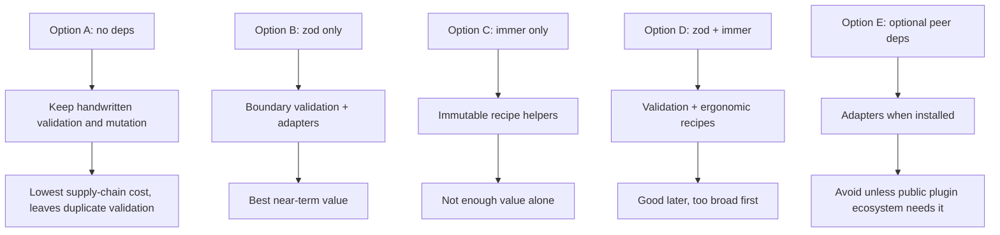

| Option             | Pros                                                                                              | Cons                                                              | Recommendation                     |
| ------------------ | ------------------------------------------------------------------------------------------------- | ----------------------------------------------------------------- | ---------------------------------- |
| No dependencies    | Maximum control, no bundle/supply-chain change                                                    | Repeated manual validators and weak remote payload parsing remain | Not enough for schema federation   |
| Zod only           | Hardens remote/snapshot/mutation boundaries, improves diagnostics, enables JSON Schema projection | Must preserve existing coercion and forward compatibility         | Recommended phase 1                |
| Immer only         | Better immutable update ergonomics                                                                | Does not solve schema trust boundary; risky in hot path           | Not recommended alone              |
| Zod plus Immer     | Full validation plus recipe ergonomics                                                            | Two dependencies and two migrations at once                       | Consider after Zod rollout         |
| Optional peer deps | No forced dependency for downstream consumers                                                     | Complexity, weaker guarantee, awkward package exports             | Avoid initially for `@xnetjs/data` |

Recommended package policy:

1. Add `zod` to `dependencies` of `@xnetjs/data` once boundary schemas are implemented.
2. Do not add `zod` as a peer dependency unless public APIs accept user-supplied Zod schemas.
3. Do not add `immer` until an exported helper or internal complex transform justifies it.
4. If `immer` is added only for dev/test freeze helpers, keep it in `devDependencies` and avoid runtime imports.

---

## Proposed Architecture

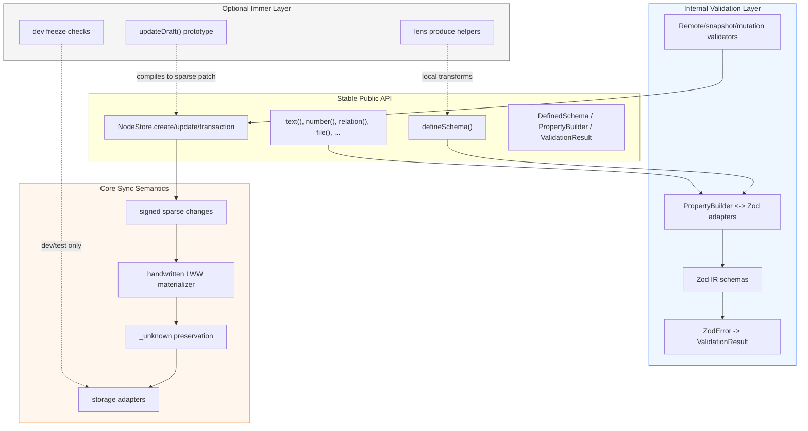

Key design constraints:

1. Public types remain stable.
2. Zod errors are translated to xNet's `ValidationResult` shape.
3. Zod object schemas are not allowed to drop unknown future fields in node/change envelopes.
4. Local validation happens before signing.
5. Remote changes remain cryptographically verified and compatibility-preserving.
6. Immer is opt-in and does not own the canonical change format.

---

## Concrete Zod Design

### Internal Files

Suggested file layout:

```text
packages/data/src/schema/zod/
  index.ts
  primitives.ts
  property-builders.ts
  schema-definition.ts
  validation-result.ts
packages/data/src/store/validation.ts
```

Suggested responsibilities:

| File                              | Responsibility                                                         |
| --------------------------------- | ---------------------------------------------------------------------- |
| `schema/zod/primitives.ts`        | `schemaIRISchema`, `didSchema`, `propertyTypeSchema`, reusable records |
| `schema/zod/property-builders.ts` | Helpers to create `PropertyBuilder<T>` from strict/coerce Zod schemas  |
| `schema/zod/schema-definition.ts` | Serialized `Schema` and `PropertyDefinition` boundary validation       |
| `schema/zod/validation-result.ts` | Convert Zod issues to `{ valid, errors }`                              |
| `store/validation.ts`             | Optional `NodeStore` mutation validation policy                        |

### Adapter Shape

```typescript
type ZodBackedPropertyBuilderOptions<T> = {
  definition: PropertyBuilder<T>['definition']
  validateSchema: z.ZodType<T>
  coerceSchema: z.ZodType<T>
}

function createZodPropertyBuilder<T>(
  options: ZodBackedPropertyBuilderOptions<T>
): PropertyBuilder<T> {
  return {
    definition: options.definition,
    validate(value: unknown): value is T {
      return options.validateSchema.safeParse(value).success
    },
    coerce(value: unknown): T | null {
      const result = options.coerceSchema.safeParse(value)
      return result.success ? result.data : null
    },
    _type: undefined as T
  }
}
```

This should be an implementation detail. Existing property helpers keep their names and overloads.

### Error Translation

Zod's error model is richer than xNet's `ValidationError`. Do not expose the full `ZodError` unless adding a new advanced API.

```typescript
function zodIssuesToValidationResult(issues: z.ZodIssue[]): ValidationResult {
  return {
    valid: issues.length === 0,
    errors: issues.map((issue) => ({
      path: issue.path.join('.'),
      message: issue.message,
      value: 'input' in issue ? issue.input : undefined
    }))
  }
}
```

Potential enhancement: add optional `code?: string` to `ValidationError` later, but do not require it for the first pass.

### Validation Policy Type

```typescript
export type SchemaValidationMode = 'off' | 'warn' | 'strict-local' | 'strict-all'

export type NodeStoreValidationOptions = {
  mode: SchemaValidationMode
  registry?: SchemaRegistry
  onInvalidMutation?: (event: {
    nodeId: string
    schemaId: SchemaIRI
    result: ValidationResult
    remote: boolean
  }) => void
}
```

The default should initially be `off` or `warn` for compatibility. Once tests and app flows are stable, `strict-local` can become the default for local calls that have a known schema.

---

## Concrete Immer Design

### Do Not Start Here

Do not begin by replacing this:

```typescript
for (const [key, value] of Object.entries(properties)) {
  // LWW, unknown handling, delete semantics, conflict tracking
}
```

with a broad `produce(node, draft => ...)` rewrite. It is too easy to make the materializer prettier but less obvious.

### Start With Optional Helpers

Possible first helper:

```typescript
export type DraftUpdateOptions<P extends Record<string, PropertyBuilder>> = {
  schema: DefinedSchema<P>
  recipe: (draft: InferCreateProps<P>) => void
}
```

Possible behavior:

1. Load current node.
2. Copy `node.properties` only.
3. Run recipe through scoped Immer `produce`.
4. Build a top-level sparse patch.
5. Call `NodeStore.update()`.

Do not include nested JSON patches in signed changes. If a nested property changes, the top-level property value is replaced according to current LWW semantics.

### Scoped Immer Instance

If used in runtime code, avoid global configuration surprises.

```typescript
import { Immer } from 'immer'

const dataImmer = new Immer({
  autoFreeze: process.env.NODE_ENV !== 'production'
})
```

Benchmark both `autoFreeze: true` and `false` before enabling it in package code.

---

## Alternative Futures

### A. Zod Becomes The Canonical Schema DSL

This is tempting:

```typescript
const TaskSchema = defineZodSchema({
  name: 'Task',
  namespace: 'xnet://xnet.fyi/',
  properties: z.object({
    title: z.string().min(1).max(500),
    completed: z.boolean().default(false)
  })
})
```

Benefits:

1. Less custom property-builder code.
2. Strong ecosystem interop.
3. Easy JSON Schema projection.
4. Familiar validation syntax.

Costs:

1. Harder to preserve xNet property metadata, IRIs, authorization, and CRDT markers.
2. Harder to serialize all schemas as stable JSON-LD nodes.
3. More public coupling to Zod.
4. Possible mismatch with database UI property types.

Recommendation: keep as a future adapter, not the first migration.

### B. Immer Powers Undo/Redo

Immer inverse patches can power local undo, but xNet already has event-sourced changes and Yjs history. A better approach is probably:

1. Use xNet `NodeChange` history for structured node undo.
2. Use Yjs undo managers for rich document content.
3. Use Immer inverse patches only inside UI-local optimistic state, if needed.

Do not conflate Immer patch history with durable xNet history.

### C. Standard Schema Instead Of Direct Zod

Zod's library-author docs point to Standard Schema for black-box validation libraries. If xNet later wants plugin authors to bring any validation library, it can accept Standard Schema-compatible validators.

This is a good plugin-facing future, but not needed for internal schema validation. For now, direct Zod is simpler.

### D. Valibot / ArkType / TypeBox Instead

Zod is not the only runtime schema option. Alternatives may be faster, smaller, or JSON Schema-first. Zod's advantage here is ecosystem familiarity, stable Zod 4 APIs, JSON Schema projection, codecs, and strong TypeScript inference.

If package size or validation speed becomes a blocker, run a separate benchmark exploration with Valibot, ArkType, TypeBox, and Effect Schema against xNet property builders and remote schema payloads.

---

## Implementation Plan

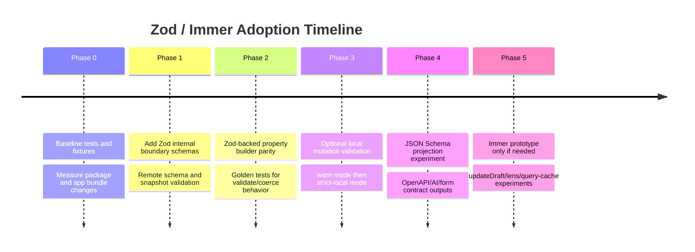

### Phase 0: Baseline Before Dependencies

- [ ] Record `pnpm --filter @xnetjs/data test` runtime before changes.
- [ ] Record `pnpm --filter @xnetjs/data typecheck` runtime before changes.
- [ ] Record app bundle sizes for Electron/web if existing build tooling exposes them.
- [ ] Add fixtures for serialized `Schema`, malformed schema payloads, encrypted snapshot envelopes, and local mutation patches.
- [ ] Add golden behavior tests for every property helper's `validate()` and `coerce()` methods.
- [ ] Add tests specifically covering absent vs `undefined` vs `null` property values.
- [ ] Add tests covering `_unknown` preservation for future properties.
- [ ] Add tests covering remote schema definitions with unsupported property types.

### Phase 1: Zod Boundary Schemas

- [ ] Add `zod` to `packages/data/package.json` dependencies.
- [ ] Run `pnpm install` and commit lockfile changes with the implementation.
- [ ] Add `schema/zod/primitives.ts` with `SchemaIRI`, DID, property type, and record schemas.
- [ ] Add serialized schema validation for `Schema` and `PropertyDefinition`.
- [ ] Replace or wrap `parseSchemaDefinition()` shape checks with `safeParse()`.
- [ ] Preserve existing normalization behavior for missing `@id` and missing `required` where intentional.
- [ ] Convert Zod errors into `ValidationResult` or internal error messages.
- [ ] Add Zod validation to decrypted snapshot envelopes.
- [ ] Add telemetry/security event hooks for invalid remote schema payloads where available.
- [ ] Keep `@xnetjs/data` public exports unchanged unless a new internal export is required by tests.

### Phase 2: Property Builder Parity

- [ ] Implement an internal `createZodPropertyBuilder()` helper.
- [ ] Migrate one low-risk builder, likely `url` or `email`, as a spike.
- [ ] Verify `validate()` behavior is byte-for-byte equivalent in tests.
- [ ] Verify `coerce()` behavior is equivalent, including defaults and invalid values.
- [ ] Migrate `text`, `number`, `checkbox`, and date-like builders only after spike success.
- [ ] Keep overload behavior for `relation({ multiple: true })`, `person({ multiple: true })`, and `file({ multiple: true })`.
- [ ] Do not migrate formula/rollup semantics until those have clear runtime validation requirements.
- [ ] Ensure generated `PropertyDefinition.config` remains unchanged.

### Phase 3: Local Mutation Validation

- [ ] Add a validation option to `NodeStoreOptions` without changing default behavior.
- [ ] Validate local `create()` properties before `createChange()` when schema is known.
- [ ] Validate local `update()` patches against known properties only; preserve unknown/future property behavior as configured.
- [ ] Validate `transaction()` operations before any change is signed.
- [ ] Add `warn` mode with telemetry before strict rejection.
- [ ] Add `strict-local` mode after compatibility tests pass.
- [ ] Never reject remote changes by default based solely on local schema validation.
- [ ] Ensure auth checks still receive the original patch shape.

### Phase 4: JSON Schema Projection

- [ ] Add `toJSONSchema(definedSchema)` as an experimental helper, not a canonical rewrite.
- [ ] Preserve xNet schema IRI in `$id` or metadata.
- [ ] Preserve property IRIs in metadata where JSON Schema permits extension fields.
- [ ] Decide how to represent relation properties: string node IDs plus xNet metadata, not nested objects.
- [ ] Decide how to represent `document: 'yjs'` and authorization metadata.
- [ ] Test generated JSON Schema against a representative Task/Page/Database schema.
- [ ] Document unsupported property types and projections.
- [ ] Treat `z.fromJSONSchema()` as experimental and avoid making it canonical.

### Phase 5: Immer Prototype

- [ ] Do not add Immer until a concrete helper or internal complex transform is selected.
- [ ] Prototype `updateDraft()` behind an experimental export or local branch.
- [ ] Diff top-level properties only; do not generate nested sync patches.
- [ ] Preserve `undefined` delete semantics deliberately.
- [ ] Use a scoped `Immer` instance with explicit auto-freeze configuration.
- [ ] Benchmark `NodeStore.applyRemoteChanges()` with and without any Immer use.
- [ ] Prototype lens helpers separately from NodeStore hot paths.
- [ ] If query-cache deltas are the target, implement in `@xnetjs/data-bridge`, not `@xnetjs/data`.

---

## Validation Checklist

### Unit Tests

- [ ] All existing `packages/data/src/schema/*.test.ts` tests pass.
- [ ] All property helper parity tests pass for `validate()`.
- [ ] All property helper parity tests pass for `coerce()`.
- [ ] `defineSchema().validate()` returns the same `ValidationResult` shape as before.
- [ ] `defineSchema().create()` emits the same node shape as before.
- [ ] Remote schema parser rejects non-object payloads.
- [ ] Remote schema parser rejects empty `properties` arrays if existing behavior requires it.
- [ ] Remote schema parser normalizes missing property `@id` exactly as before.
- [ ] Remote schema parser rejects unsupported property types without throwing uncaught errors.
- [ ] Decrypted snapshot validation rejects malformed JSON.
- [ ] Decrypted snapshot validation rejects missing `properties`.
- [ ] Decrypted snapshot validation accepts optional `unknown` object.
- [ ] Local mutation validation accepts all current app-created valid patches.
- [ ] Local mutation validation reports invalid patches in `warn` mode without blocking writes.
- [ ] Local mutation validation rejects invalid patches in `strict-local` mode before signing.
- [ ] Remote changes with unknown future properties are still preserved in `_unknown`.
- [ ] Remote changes with valid signatures are not rejected by default due to missing local schema.

### Sync And Storage Tests

- [ ] `NodeStore.applyRemoteChange()` hash verification behavior is unchanged.
- [ ] `NodeStore.applyRemoteChange()` signature verification behavior is unchanged.
- [ ] LWW conflict resolution is unchanged for same-property concurrent updates.
- [ ] `undefined` still deletes properties in sparse updates.
- [ ] `null` remains a value where property builders allow it or reject it according to existing behavior.
- [ ] SQLite adapter serialization/deserialization remains compatible with existing data.
- [ ] Memory adapter tests catch any accidental object aliasing changes.
- [ ] Encrypted node snapshot round trips remain compatible.
- [ ] Batch transaction temp ID resolution remains unchanged.

### Performance Tests

- [ ] `pnpm --filter @xnetjs/data test` runtime does not regress materially.
- [ ] `pnpm --filter @xnetjs/data typecheck` runtime does not regress materially.
- [ ] Creating 10,000 simple nodes with validation `off`, `warn`, and `strict-local` is benchmarked.
- [ ] Applying 10,000 remote changes with validation default settings is benchmarked.
- [ ] Remote schema parsing performance is measured with large property arrays.
- [ ] App startup impact is measured when importing `@xnetjs/data` in Electron and web builds.
- [ ] Bundle size impact is measured for `@xnetjs/data`, `@xnetjs/react`, Electron renderer, and web app.
- [ ] If Immer is prototyped, benchmark `updateDraft()` against hand-written patches.
- [ ] If Immer is used in cache deltas, benchmark large query result updates.

### Security And Compatibility Tests

- [ ] Malformed remote schema payloads produce safe errors and no partial registry writes.
- [ ] Oversized remote schema payloads are rejected or bounded before expensive validation.
- [ ] Authorization metadata remains validated by existing auth validators.
- [ ] Zod schemas do not strip unknown authorization fields before auth validation sees them.
- [ ] Zod validation does not leak sensitive property values in telemetry or crash reports.
- [ ] Schema federation tests cover old clients reading new schema properties.
- [ ] Stored nodes created before the migration can still be read.
- [ ] Changes signed before the migration can still be replayed.
- [ ] New strict-local failures are actionable and include property paths.
- [ ] Package license and provenance checks include new dependencies.

### Documentation Checks

- [ ] `@xnetjs/data` README documents validation modes if exposed.
- [ ] Public API docs clarify that xNet schemas remain canonical, not Zod schemas.
- [ ] Migration notes explain any changed coercion semantics, if any are intentional.
- [ ] JSON Schema projection docs mark unsupported fields and non-canonical status.
- [ ] Developer docs explain when remote validation rejects vs preserves unknown fields.
- [ ] If Immer helper APIs ship, docs clarify top-level sparse patch semantics.

---

## Risk Register

| Risk                                                      | Severity | Likelihood | Mitigation                                                                |
| --------------------------------------------------------- | -------- | ---------- | ------------------------------------------------------------------------- |
| Zod migration changes property coercion behavior          | High     | Medium     | Golden parity tests before migrating each builder                         |
| Zod strict object parsing drops unknown future fields     | High     | Medium     | Use passthrough/record schemas for node/change envelopes; test `_unknown` |
| Local validation rejects legitimate app writes            | Medium   | Medium     | Roll out in `warn` mode first                                             |
| Remote validation forks clients by schema version         | High     | Low-medium | Do not enable strict remote validation by default                         |
| Bundle size surprises web app                             | Medium   | Low-medium | Measure app bundles; consider lazy paths or Zod Mini only if needed       |
| Immer slows remote replay                                 | Medium   | Medium     | Keep out of replay path until benchmarked                                 |
| Immer auto-freezes shared caller objects                  | Medium   | Medium     | Scoped instance and explicit auto-freeze policy                           |
| Immer patches are mistaken for sync patches               | High     | Low        | Document patch boundary; do not export as sync protocol                   |
| Public API becomes coupled to Zod                         | Medium   | Low-medium | Keep adapters internal initially                                          |
| Additional dependencies increase supply-chain review load | Medium   | Medium     | Pin through lockfile, run security/reliability checks, document licenses  |

---

## Recommendation

Proceed with Zod in a narrow, staged way. Defer Immer until there is a concrete helper API or a proven complex immutable update hotspot.

Recommended first PR:

1. Add Zod boundary schemas for serialized `Schema`, `PropertyDefinition`, remote schema fetch responses, and encrypted node snapshots.
2. Keep the public schema DSL unchanged.
3. Translate Zod errors into xNet's existing `ValidationResult`/error patterns.
4. Add tests for malformed remote schemas, snapshot parsing, and property helper parity fixtures.
5. Do not add Immer in the same PR.

Recommended second PR:

1. Add optional local mutation validation in `warn` mode.
2. Validate create/update/transaction before signing local changes when schemas are known.
3. Measure performance and app compatibility.
4. Decide whether `strict-local` should become default.

Recommended later exploration/prototype:

1. Prototype `updateDraft()` with Immer if UI code or database operations need mutation-syntax ergonomics.
2. Prototype Zod JSON Schema projection for REST/OpenAPI/AI structured output boundaries.
3. Revisit canonical Zod-based schema definitions only after schema federation and database UI needs are clearer.

The guiding principle: add Zod where xNet crosses trust boundaries; add Immer only where humans author complex local transformations. Keep the event log, signed change format, and LWW replay semantics explicit.
