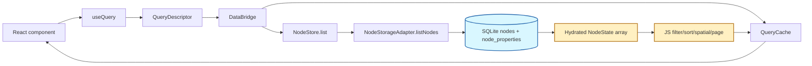
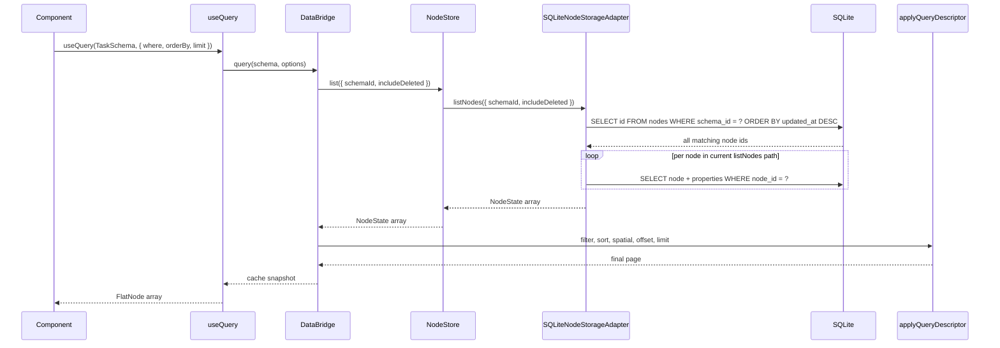
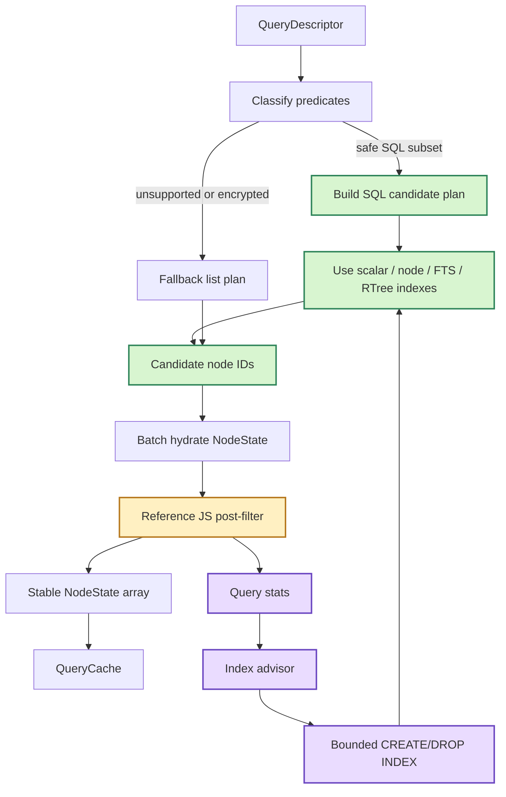
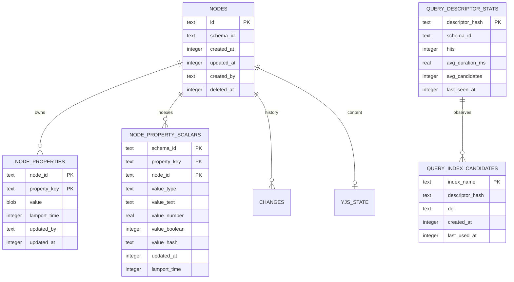
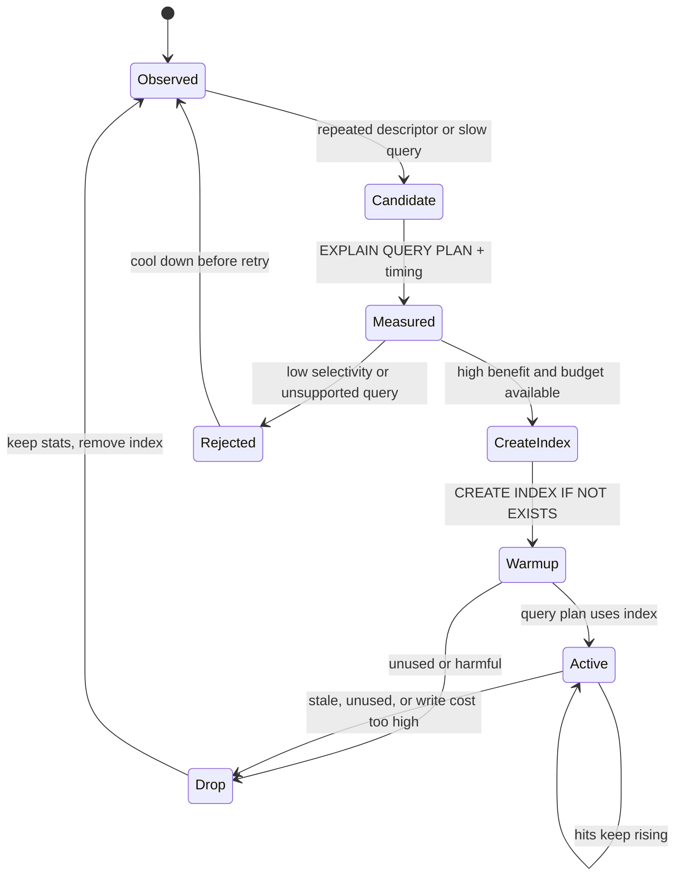
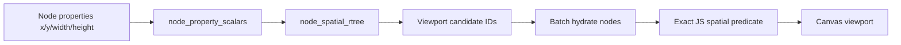
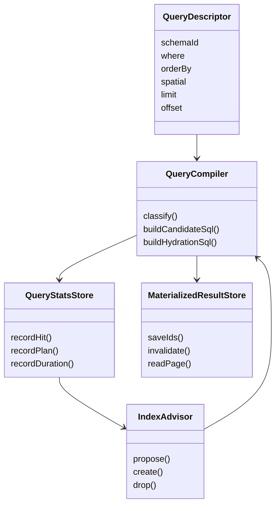

# SQLite Node Store Read Scaling And Automatic Indexing

**Date:** 2026-05-13  
**Scope:** `@xnetjs/react`, `@xnetjs/data-bridge`, `@xnetjs/data`, `@xnetjs/sqlite`, Electron IPC storage, database view query pipeline, and related hub SQLite query patterns  
**Goal:** determine how xNet can make `useQuery` automatically scale reads by pushing safe work into SQLite, adding adaptive indexes, and preserving NodeStore correctness

## Executive Summary

xNet already persists nodes in SQLite in Electron, but most `useQuery` work still behaves like an in-memory query engine over a SQLite-backed node list. The current hot path loads all nodes for a schema, hydrates their properties, applies `where`, `orderBy`, spatial predicates, `limit`, and `offset` in JavaScript, then stores the result in an in-memory `QueryCache`.

This is correct and simple, but it leaves the database underused:

| Query shape                           | Current behavior                                                  | Scaling issue                                   |
| ------------------------------------- | ----------------------------------------------------------------- | ----------------------------------------------- |
| `useQuery(TaskSchema)`                | SQLite filters `schema_id` and deleted state, then hydrates nodes | acceptable until schema cardinality grows       |
| `useQuery(TaskSchema, { limit: 50 })` | bridge still loads all schema nodes, then slices in JS            | simple pagination pays full scan/hydration cost |
| `where: { status: 'open' }`           | SQLite loads all schema nodes, JS filters properties              | O(schema row count) for selective filters       |
| `orderBy: { priority: 'desc' }`       | SQLite default-orders by `updated_at`, JS resorts                 | unnecessary sort and full materialization       |
| `spatial: viewport`                   | SQLite loads all schema nodes, JS checks geometry                 | canvas-sized datasets will degrade quickly      |
| database view filters/sorts           | rows are filtered/sorted/grouped in memory                        | large tables need SQL-compatible view planning  |

The best path is not a rewrite. The shortest useful path is a layered read planner:

1. Add safe pushdown for the existing list path: composite live-node indexes, `listNodesOptimized`, and bridge-side limit/offset pushdown when semantics are already SQLite-compatible.
2. Add a rebuildable scalar property index table maintained by `SQLiteNodeStorageAdapter`, because `node_properties.value` is JSON text encoded into a BLOB and is awkward to query directly.
3. Add an optional `queryNodes` capability on SQLite storage, compile `QueryDescriptor` into SQL when possible, and always keep JS post-filtering as a correctness guard at first.
4. Add an adaptive index advisor that observes query descriptors and creates bounded, partial, per-schema/per-property indexes for hot patterns.
5. Add specialized accelerators for spatial queries and hot database views after the scalar path is proven.

The intended end state: `useQuery` stays simple for React callers, `NodeStore` stays the source of truth, SQLite becomes the first-stage candidate selector, and the JavaScript query descriptor remains the semantic fallback.

## Current Architecture



The important implementation facts:

| Area               | Evidence                                                                                                                                                                   | Implication                                                                                              |
| ------------------ | -------------------------------------------------------------------------------------------------------------------------------------------------------------------------- | -------------------------------------------------------------------------------------------------------- |
| Hook descriptor    | `packages/react/src/hooks/useQuery.ts:160-210` creates a canonical descriptor and calls `bridge.query`                                                                     | the hook already has a stable query shape that can drive planning                                        |
| React snapshot     | `packages/react/src/hooks/useQuery.ts:218-269` receives `NodeState[]` and flattens results                                                                                 | storage can change underneath without changing hook ergonomics                                           |
| Main-thread bridge | `packages/data-bridge/src/main-thread-bridge.ts:117-133` loads single nodes by ID, otherwise calls `store.list({ schemaId, includeDeleted })`, then `applyQueryDescriptor` | `limit`, `offset`, property filters, property sorts, and spatial filters are not pushed down             |
| Worker bridge      | `packages/data-bridge/src/worker/data-worker.ts:354-371` follows the same list-then-apply pattern, currently over memory storage                                           | the planner should be a bridge/storage capability, not Electron-only behavior                            |
| Query semantics    | `packages/data-bridge/src/query-descriptor.ts:185-254` defines matching, sorting, spatial filtering, and pagination                                                        | this can be the reference implementation for SQL parity tests                                            |
| Bounded reloads    | `packages/data-bridge/src/query-descriptor.ts:256-272` reloads bounded result sets when a relevant node changes                                                            | reload cost must be reduced for paginated views                                                          |
| NodeStore list     | `packages/data/src/store/store.ts:478-494` delegates to storage, decrypts, reports telemetry                                                                               | encrypted nodes cannot always be SQL-filtered safely                                                     |
| SQLite list        | `packages/data/src/store/sqlite-adapter.ts:331-365` selects IDs by schema/deleted state and `updated_at`, then calls `getNode` per ID                                      | default path has an N+1 hydration shape                                                                  |
| Optimized list     | `packages/data/src/store/sqlite-adapter.ts:372-473` can hydrate list results with one join query                                                                           | a near-term performance win already exists but is not exposed by the interface                           |
| Core schema        | `packages/sqlite/src/schema.ts:145-152` has separate node and property indexes, not composite query-covering indexes                                                       | SQLite can do more with composite and partial indexes                                                    |
| Property storage   | `packages/data/src/store/sqlite-adapter.ts:655-661` stores property values as `JSON.stringify(value)` encoded into `Uint8Array`                                            | direct JSON1 expression indexes over `value` need casting or a sidecar table                             |
| Diagnostics        | `packages/sqlite/src/diagnostics.ts` already supports query plans, index info, table stats, `ANALYZE`, integrity checks, and query timing                                  | read scaling can be built with real feedback loops                                                       |
| Hub pattern        | `packages/hub/src/storage/sqlite.ts:1781-1891` compiles database row filters, JSON extraction, FTS, sort, cursor pagination, and count into SQL                            | useful model for client-side query pushdown, though client storage has different correctness constraints |

## What SQLite Gives Us

The relevant SQLite features are mature and map well to xNet's needs:

| Feature               | SQLite behavior                                                                                                                  | xNet use                                                                      |
| --------------------- | -------------------------------------------------------------------------------------------------------------------------------- | ----------------------------------------------------------------------------- |
| Query planner         | needs usable indexes and benefits from `ANALYZE` or `PRAGMA optimize`                                                            | let SQLite select candidate nodes cheaply                                     |
| Multi-column indexes  | can satisfy search and sort together when left-most constraints line up                                                          | `(schema_id, property_key, value, node_id)` and `(schema_id, updated_at, id)` |
| Covering indexes      | avoid table lookups when all selected data is in the index                                                                       | select node IDs first, hydrate only the winning page                          |
| Partial indexes       | index only rows where predicates are true                                                                                        | live-node indexes and hot property indexes                                    |
| Expression indexes    | index deterministic expressions, but the query expression must match exactly                                                     | possible for JSON text columns, brittle for current BLOB property values      |
| Generated columns     | can make frequently queried JSON fields look like columns                                                                        | better for table-shaped database rows than generic NodeStore properties       |
| JSON1 and JSONB       | JSON functions are built in by default in modern SQLite; JSONB avoids parse overhead but remains O(N) lookup for most operations | useful for row JSON, less ideal for `node_properties.value` BLOBs             |
| FTS5                  | full-text virtual tables for text search                                                                                         | already partly used; can be brought into query planning                       |
| R-Tree                | fast candidate filtering for bounding-box spatial queries                                                                        | canvas viewport and radius queries                                            |
| WAL and cache pragmas | improve concurrent reads/writes and page-cache behavior                                                                          | important for Electron data-process storage                                   |
| `EXPLAIN QUERY PLAN`  | exposes index usage and full scans                                                                                               | validation gate for adaptive indexes                                          |

References used:

| Topic                                                 | Source                               |
| ----------------------------------------------------- | ------------------------------------ |
| Query planner, multi-column indexes, covering indexes | https://sqlite.org/queryplanner.html |
| Expression indexes                                    | https://sqlite.org/expridx.html      |
| Partial indexes                                       | https://sqlite.org/partialindex.html |
| JSON functions and JSONB                              | https://sqlite.org/json1.html        |
| R-Tree                                                | https://sqlite.org/rtree.html        |
| `PRAGMA optimize`, `ANALYZE`, cache, WAL              | https://sqlite.org/pragma.html       |

## The Core Problem

SQLite is currently acting mostly as durable storage, not as the read engine. That is reasonable for early correctness, but it means xNet pays three avoidable costs as data grows:

1. Candidate cost: load too many nodes before knowing which ones match.
2. Hydration cost: deserialize too many `node_properties.value` BLOBs into JS objects.
3. Reload cost: bounded live queries often reload a broad schema when one relevant node changes.



The easy trap is to add indexes to the existing tables and expect this to fix everything. It will help the default list, but not property filtering or property sorting, because the storage interface never asks SQLite to filter properties.

The second trap is to put all properties into a generic JSON object and rely on expression indexes. That is tempting, but it conflicts with the current EAV layout and the current BLOB-encoded JSON values. It also makes adaptive indexes fragile because SQLite expression indexes require the query expression to match the index expression exactly.

The pragmatic answer is a rebuildable scalar index sidecar.

## Recommended Architecture



The planner should split every query into two layers:

| Layer                | Responsibility                                  | Initial rule                                                    |
| -------------------- | ----------------------------------------------- | --------------------------------------------------------------- |
| SQL candidate plan   | make the candidate set small and ordered enough | only push down semantics proven equivalent to the JS descriptor |
| JS verification plan | preserve exact current behavior                 | always run at first, then remove only for proven exact plans    |

This is how xNet can move fast without risking subtle query regressions.

## Proposed Storage Shape

Keep the current source-of-truth tables:

| Table                                       | Role                                                   |
| ------------------------------------------- | ------------------------------------------------------ |
| `nodes`                                     | materialized node metadata                             |
| `node_properties`                           | materialized LWW property values as encoded JSON BLOBs |
| `changes`                                   | event log                                              |
| `yjs_state`, `yjs_updates`, `yjs_snapshots` | collaborative document state                           |

Add rebuildable read indexes:

```sql
CREATE INDEX IF NOT EXISTS idx_nodes_live_schema_updated
ON nodes(schema_id, updated_at DESC, id)
WHERE deleted_at IS NULL;

CREATE INDEX IF NOT EXISTS idx_nodes_all_schema_updated
ON nodes(schema_id, updated_at DESC, id);

CREATE TABLE IF NOT EXISTS node_property_scalars (
  node_id TEXT NOT NULL,
  schema_id TEXT NOT NULL,
  property_key TEXT NOT NULL,
  value_type TEXT NOT NULL,
  value_text TEXT,
  value_number REAL,
  value_boolean INTEGER,
  value_hash TEXT,
  updated_at INTEGER NOT NULL,
  lamport_time INTEGER NOT NULL,
  PRIMARY KEY (schema_id, property_key, node_id),
  FOREIGN KEY (node_id) REFERENCES nodes(id) ON DELETE CASCADE
);

CREATE INDEX IF NOT EXISTS idx_prop_scalars_text
ON node_property_scalars(schema_id, property_key, value_text, node_id)
WHERE value_type = 'text';

CREATE INDEX IF NOT EXISTS idx_prop_scalars_number
ON node_property_scalars(schema_id, property_key, value_number, node_id)
WHERE value_type = 'number';

CREATE INDEX IF NOT EXISTS idx_prop_scalars_boolean
ON node_property_scalars(schema_id, property_key, value_boolean, node_id)
WHERE value_type = 'boolean';
```

Design notes:

| Choice                             | Reason                                                                                                                          |
| ---------------------------------- | ------------------------------------------------------------------------------------------------------------------------------- |
| Sidecar table, not source of truth | it can be rebuilt from `nodes` and `node_properties` after migration or corruption                                              |
| Typed scalar columns               | equality, range, and sort indexes stay simple and deterministic                                                                 |
| `value_hash`                       | supports cheap equality checks for longer strings or canonical JSON if needed                                                   |
| `schema_id` copied onto rows       | avoids joining `nodes` before applying property filters                                                                         |
| no array/object pushdown at first  | current JS `where` equality is strict and not useful for deep object matching                                                   |
| JS-owned maintenance               | existing property values are encoded JSON BLOBs, so SQLite triggers cannot reliably decode all values without extra assumptions |

The relationship becomes:



## Query Compiler

The query compiler can start with a conservative subset:

| Descriptor part          | Pushdown phase                                                        | SQL shape                                 | Post-filter needed?                               |
| ------------------------ | --------------------------------------------------------------------- | ----------------------------------------- | ------------------------------------------------- |
| `nodeId`                 | existing                                                              | `nodes.id = ?`                            | no, except decrypt/read auth                      |
| `schemaId`               | existing                                                              | `nodes.schema_id = ?`                     | no                                                |
| `includeDeleted: false`  | existing                                                              | `nodes.deleted_at IS NULL`                | no                                                |
| no filter, default order | phase 0                                                               | `ORDER BY n.updated_at DESC LIMIT/OFFSET` | no for default list                               |
| `orderBy: { updatedAt }` | phase 0                                                               | `ORDER BY n.updated_at ASC/DESC`          | no                                                |
| `orderBy: { createdAt }` | phase 0                                                               | `ORDER BY n.created_at ASC/DESC`          | no                                                |
| scalar equality `where`  | phase 1                                                               | join `node_property_scalars`              | yes initially                                     |
| scalar number range      | future descriptor extension                                           | join numeric scalar index                 | yes until semantics are formalized                |
| property sort            | phase 1                                                               | left join scalar sort property            | yes initially for null ordering parity            |
| `limit` and `offset`     | phase 0 when order is SQL-compatible, phase 1 after property pushdown | SQL page first                            | yes for partial plans                             |
| spatial window/radius    | phase 2                                                               | R-Tree candidate IDs                      | yes, because R-Tree is a bounding-box accelerator |
| text search              | phase 2                                                               | FTS5 candidate IDs                        | yes for ranking/snippet semantics                 |
| encrypted properties     | later                                                                 | blind indexes or no pushdown              | yes                                               |

Example SQL for a hot query:

```typescript
useQuery(TaskSchema, {
  where: { status: 'open' },
  orderBy: { priority: 'desc' },
  limit: 50
})
```

Candidate SQL:

```sql
SELECT n.id
FROM nodes n
JOIN node_property_scalars p_status
  ON p_status.node_id = n.id
 AND p_status.schema_id = n.schema_id
 AND p_status.property_key = 'status'
 AND p_status.value_type = 'text'
LEFT JOIN node_property_scalars p_priority
  ON p_priority.node_id = n.id
 AND p_priority.schema_id = n.schema_id
 AND p_priority.property_key = 'priority'
 AND p_priority.value_type = 'number'
WHERE n.schema_id = ?
  AND n.deleted_at IS NULL
  AND p_status.value_text = ?
ORDER BY p_priority.value_number DESC, n.updated_at DESC, n.id ASC
LIMIT ?;
```

Batch hydration SQL:

```sql
WITH wanted(id, ordinal) AS (
  VALUES (?, 0), (?, 1), (?, 2)
)
SELECT
  n.id,
  n.schema_id,
  n.created_at,
  n.updated_at,
  n.created_by,
  n.deleted_at,
  p.property_key,
  p.value,
  p.lamport_time,
  p.updated_by,
  p.updated_at AS prop_updated_at,
  wanted.ordinal
FROM wanted
JOIN nodes n ON n.id = wanted.id
LEFT JOIN node_properties p ON p.node_id = n.id
ORDER BY wanted.ordinal ASC, p.property_key ASC;
```

The key shift is from hydrating a whole schema to hydrating winning candidate IDs.

## Automatic Indexing

SQLite has automatic indexes for some transient join cases, but xNet should build its own higher-level advisor because `QueryDescriptor` knows user intent and schema context.



Index advisor inputs:

| Signal             | Source                               | Use                                              |
| ------------------ | ------------------------------------ | ------------------------------------------------ |
| descriptor hash    | `serializeQueryDescriptor`           | group repeated live queries                      |
| schema cardinality | `countNodes` and table stats         | avoid indexes on tiny schemas                    |
| candidate count    | query planner telemetry              | detect overbroad plans                           |
| duration           | bridge/storage telemetry             | detect user-visible queries                      |
| subscriber count   | `QueryCache`                         | prioritize queries shown in UI                   |
| mutation rate      | NodeStore events                     | avoid write amplification on volatile properties |
| index usage        | `EXPLAIN QUERY PLAN` and diagnostics | drop unused indexes                              |
| table/index size   | SQLite diagnostics                   | enforce disk budget                              |

Initial policy:

| Rule                                                                     | Suggested default               |
| ------------------------------------------------------------------------ | ------------------------------- |
| Do not create adaptive indexes for schemas under 500 nodes               | avoids optimizing small data    |
| Require at least 20 hits or 3 slow hits in 10 minutes                    | avoids one-off UI states        |
| Require p95 query time over 16 ms or hydrated rows over 2,000            | targets frame-budget problems   |
| Cap adaptive indexes per schema                                          | start with 8                    |
| Cap total adaptive indexes                                               | start with 64                   |
| Never index properties with high write churn unless query cost is severe | protects mutation latency       |
| Prefer partial per-schema indexes over global generic indexes            | smaller, faster, easier to drop |
| Run `PRAGMA optimize` after index creation batches                       | updates planner stats cheaply   |
| Drop indexes unused for 7 days or causing measurable write regression    | keeps the database clean        |

Adaptive DDL examples:

```sql
CREATE INDEX IF NOT EXISTS idx_auto_task_status_text_ab12cd34
ON node_property_scalars(value_text, node_id)
WHERE schema_id = 'xnet://xnet.fyi/Task'
  AND property_key = 'status'
  AND value_type = 'text';

CREATE INDEX IF NOT EXISTS idx_auto_task_priority_number_ef56ab78
ON node_property_scalars(value_number DESC, node_id)
WHERE schema_id = 'xnet://xnet.fyi/Task'
  AND property_key = 'priority'
  AND value_type = 'number';
```

## Spatial Queries

`useQuery` already has a spatial descriptor shape. The current implementation evaluates it in JavaScript after all candidate nodes are loaded.

For canvas-scale usage, add optional R-Tree indexes for hot schema/field mappings:



Suggested tables:

```sql
CREATE TABLE IF NOT EXISTS node_spatial_ids (
  spatial_id INTEGER PRIMARY KEY,
  node_id TEXT NOT NULL UNIQUE,
  schema_id TEXT NOT NULL
);

CREATE VIRTUAL TABLE IF NOT EXISTS node_spatial_rtree USING rtree(
  spatial_id,
  min_x,
  max_x,
  min_y,
  max_y
);

CREATE INDEX IF NOT EXISTS idx_node_spatial_ids_schema
ON node_spatial_ids(schema_id, node_id);
```

The R-Tree should be treated as a candidate accelerator, not the exact answer. SQLite's own guidance is that R-Tree usually reduces the search space before exact application logic finishes the check. That matches xNet's existing JS spatial semantics.

## Database Views And Materialized Result Sets

SQLite views are not materialized. A SQL view is useful for readability, but it will not make hot xNet database views fast by itself.

For database rows, xNet already has two models:

| Client database view path                     | Hub database row path                                             |
| --------------------------------------------- | ----------------------------------------------------------------- |
| `executeQuery` filters/sorts/groups in memory | `queryDatabaseRows` compiles filters/search/sorts/cursor into SQL |
| Y.Doc stores view config                      | SQLite stores `database_rows` JSON plus FTS                       |
| good for small local views                    | better for large row counts                                       |

The client should converge toward a shared compiler for table-shaped rows, while NodeStore `useQuery` should use the scalar sidecar compiler.

For very hot views, use JIT materialized result sets instead of SQLite views:



Materialized result sets are only worthwhile when:

| Condition                         | Reason                            |
| --------------------------------- | --------------------------------- |
| view has many subscribers         | amortizes maintenance cost        |
| result ordering is expensive      | saves repeated sorts              |
| mutation rate is low or localized | avoids constant invalidation      |
| view is stable across sessions    | persistent cache pays off         |
| fallback can rebuild quickly      | cache corruption must be harmless |

## Correctness Constraints

This work touches read semantics, so the safety model matters more than raw speed.

| Constraint                        | Required behavior                                                                                                                    |
| --------------------------------- | ------------------------------------------------------------------------------------------------------------------------------------ |
| NodeStore remains source of truth | sidecar tables and adaptive indexes are rebuildable accelerators                                                                     |
| LWW semantics stay intact         | scalar index rows must use the same materialized `NodeState` state that `node_properties` stores                                     |
| Encrypted node properties         | do not push down plaintext filters unless there is an explicit query-safe index design                                               |
| Read authorization                | storage candidate selection cannot leak unauthorized results through timing or counts if per-node auth is active                     |
| Schema migration lenses           | SQL pushdown runs against stored values; JS verification remains responsible for migrated output until migration-aware indexes exist |
| Null ordering                     | SQL and JS sort behavior must match or JS post-sort must remain active                                                               |
| Floating point and dates          | normalize types before indexing; avoid accidental string/number sort mismatches                                                      |
| Cross-platform SQLite             | better-sqlite3, sql.js/OPFS, and Expo SQLite may have different FTS/R-Tree/JSON capabilities                                         |
| Live query reloads                | partial SQL plans must not miss nodes that enter or leave a bounded result set                                                       |

The most important practical rule: SQL candidate selection may be approximate early, but final results must remain identical to `applyQueryDescriptor`.

## Recommended Implementation Plan

### Phase 0: Immediate Low-Risk Wins

- [x] Add `idx_nodes_live_schema_updated` and `idx_nodes_all_schema_updated` to SQLite schema migrations.
- [x] Use the existing `listNodesOptimized` join path for SQLite list hydration or promote it into the `NodeStorageAdapter` interface.
- [x] Push `limit` and `offset` from `DataBridge` into `store.list` only when the descriptor has no property filters, no spatial filter, and default or system-field ordering compatible with SQLite.
- [x] Add query timing and hydrated-row-count telemetry around bridge `loadQuery`.
- [x] Add `EXPLAIN QUERY PLAN` assertions for default list queries in SQLite adapter tests.

Expected impact: simple lists and paginated lists stop hydrating full schemas.

### Phase 1: Scalar Property Index

- [x] Add `node_property_scalars` schema and migration.
- [x] Maintain scalar rows in `SQLiteNodeStorageAdapter._setNodeInternal` after node upsert.
- [x] Delete scalar rows for node properties that are removed from `NodeState.properties`.
- [x] Add a rebuild utility that scans `node_properties`, decodes values in JS, and repopulates the sidecar table.
- [x] Add tests for text, number, boolean, null, deleted nodes, property deletion, and import paths.
- [x] Keep all existing query results verified by `applyQueryDescriptor`.

Expected impact: SQL can find candidate IDs for common equality filters and property sorts.

### Phase 2: Query Compiler Capability

- [x] Add an optional storage capability such as `queryNodes(descriptor)` without breaking memory storage.
- [x] Let `NodeStore` or `DataBridge` detect the capability and fall back to `list` when absent.
- [x] Compile supported descriptors into candidate SQL plus batch hydration SQL.
- [x] Return plan metadata: rows scanned, IDs returned, SQL used, indexes detected, post-filter reason.
- [ ] Keep JS verification on by default and log parity failures as high-severity diagnostics.

Expected impact: `useQuery` remains API-compatible while SQLite becomes the first-stage read engine.

### Phase 3: Adaptive Index Advisor

- Add a small persistent stats table for descriptor hashes and observed cost.
- Use `getIndexInfo`, `analyzeQuery`, `timeQuery`, and `runAnalyze` from `@xnetjs/sqlite` diagnostics.
- Generate safe per-schema/per-property partial indexes for hot descriptors.
- Enforce index count, disk, and write-amplification budgets.
- Add a devtools panel or debug log for query plans and adaptive indexes.

Expected impact: users get automatic read scaling as their actual workspace grows.

### Phase 4: Spatial And Text Search Pushdown

- Add optional R-Tree support behind capability detection.
- Map text node IDs to integer R-Tree IDs with `node_spatial_ids`.
- Maintain bounding boxes from configured spatial fields.
- Use R-Tree as candidate selection only; keep JS exact spatial verification.
- Integrate FTS candidate IDs for text search descriptors when the query API formalizes search semantics.

Expected impact: large canvases and search-heavy views become practical without caller changes.

### Phase 5: Hot View Materialization

- Add JIT materialized result sets for stable, high-fanout views.
- Use change events to invalidate or incrementally repair result sets.
- Start with database views, not arbitrary `useQuery`, because view identity is stable and user-visible.
- Store only node IDs and ordinals; hydrate current NodeState on read.
- Treat materialized results as disposable cache.

Expected impact: large databases can open common views quickly and update incrementally.

## Implementation Status

Updated on 2026-06-01:

- Phases 0 and 1 are implemented.
- Phase 2 is implemented for conservative SQLite candidate plans: node/schema/deleted predicates, scalar equality filters, system-field ordering, SQL pagination where safe, batch hydration by candidate IDs, and JS descriptor verification over hydrated candidates.
- The generic `NodeStore.query` API now returns plan metadata and falls back to safe list-based evaluation when storage does not support `queryNodes`.
- Electron IPC storage now carries safe system-order `limit`/`offset` pushdown through `listNodes` and maintains the scalar sidecar in the data process.
- Backwards compatibility was intentionally not preserved where it conflicted with the cleaner read-scaling API: `setNode` is treated as a full materialized state replacement for property rows, `ListNodesOptions` now accepts system-field ordering, and NodeStore query semantics are centralized in `@xnetjs/data`.
- Adaptive indexes, R-Tree/FTS query pushdown, and hot view materialization remain future work.

## Validation Checklist

- [x] `useQuery` results match `applyQueryDescriptor` exactly for all supported descriptors.
- [x] SQL plans never omit JS post-filtering unless parity tests prove exact behavior.
- [x] Deleted node semantics match `includeDeleted` behavior.
- [x] `limit` and `offset` produce identical results for default list, `createdAt`, and `updatedAt` ordering.
- [x] Property equality handles string, number, boolean, null, and missing values correctly.
- [x] Property sorting matches JS null/undefined behavior or remains post-sorted in JS.
- [x] Scalar sidecar rebuild produces byte-for-byte equivalent query results before and after rebuild.
- [x] Import, remote sync, restore, and transaction paths update sidecar rows.
- [x] Encrypted node properties are not indexed in plaintext by accident.
- [ ] Auth-sensitive reads do not expose unauthorized counts or IDs.
- [x] `EXPLAIN QUERY PLAN` shows expected indexes for default list and hot property filters.
- [ ] `PRAGMA optimize` or diagnostics flow runs after adaptive index changes.
- [ ] Adaptive indexes are dropped when unused or over budget.
- [ ] SQLite capability detection disables FTS/R-Tree paths where unavailable.
- [ ] Performance tests cover 1k, 10k, 100k, and 1M node synthetic datasets where feasible.
- [ ] Mutation benchmarks measure write amplification from scalar and adaptive indexes.
- [x] Electron IPC path avoids serializing full schema results for paginated reads.
- [x] Query diagnostics are visible enough to debug slow user workspaces.

## Benchmark Plan

| Benchmark           | Dataset                                            | Success criteria                                                                    |
| ------------------- | -------------------------------------------------- | ----------------------------------------------------------------------------------- |
| Default list        | 100k nodes in one schema                           | first 50 nodes under 16 ms in data process after warm cache                         |
| Selective equality  | 100k tasks, 5 statuses                             | `status='open' LIMIT 50` hydrates under 1,000 candidates                            |
| Property sort       | 100k tasks, numeric priority                       | top 50 avoids full JS sort                                                          |
| Bounded live reload | active paginated query plus 1,000 unrelated writes | reload work stays proportional to page or indexed candidate set                     |
| Sidecar rebuild     | 100k nodes, 10 scalar properties                   | completes predictably and reports progress                                          |
| Adaptive index      | repeated slow query                                | index created, plan changes, p95 improves, write regression below budget            |
| Spatial viewport    | 100k canvas nodes                                  | viewport query returns candidates via R-Tree and exact JS filter under frame budget |
| Encrypted nodes     | mixed encrypted/plain nodes                        | no plaintext sidecar rows for encrypted properties without explicit opt-in          |

## Open Questions

| Question                                                         | Suggested answer                                                                                            |
| ---------------------------------------------------------------- | ----------------------------------------------------------------------------------------------------------- |
| Should `queryNodes` live in `NodeStore` or `NodeStorageAdapter`? | add an optional storage capability first, then wrap with `NodeStore.query` once semantics stabilize         |
| Should SQL pushdown return full nodes or IDs?                    | return IDs plus metadata first, then batch hydrate; this avoids over-fetching                               |
| Should adaptive indexes be enabled by default?                   | collect stats by default, create adaptive indexes only behind a config flag until tested                    |
| Should the scalar sidecar index every property?                  | index scalar rows for all properties, but create expensive secondary indexes adaptively                     |
| How should arrays and relations be indexed?                      | add relation-specific and array membership sidecars later; do not overload scalar equality                  |
| How does schema migration interact with indexes?                 | index stored values initially; add migration-aware projected indexes only for stable schema versions        |
| Can SQLite triggers maintain sidecars?                           | not reliably with current BLOB-encoded JSON property values; JS maintenance is safer                        |
| Can the hub query compiler be reused?                            | reuse concepts and operator mapping, not code directly until client query semantics match hub row semantics |

## Risks

| Risk                              | Mitigation                                                                             |
| --------------------------------- | -------------------------------------------------------------------------------------- |
| Write amplification               | start with one scalar sidecar and bounded adaptive indexes; measure mutation p95       |
| Query semantic drift              | always verify with JS until exact parity is proven                                     |
| Disk growth                       | hard caps, index aging, diagnostics, and user-visible maintenance tools                |
| Cross-platform SQLite differences | capability detection and fallback to JS list path                                      |
| Encrypted data leaks              | default deny plaintext indexing for encrypted nodes; consider blind indexes separately |
| Stale sidecar rows                | foreign keys, rebuild command, integrity check, mutation-path tests                    |
| Planner choosing bad indexes      | `PRAGMA optimize`, `ANALYZE`, plan diagnostics, and index drop policy                  |
| Overfitting to current `useQuery` | keep compiler descriptor-based and add operator support incrementally                  |

## Final Recommendation

Prioritize this sequence:

1. Ship Phase 0 immediately: composite live-node indexes, `listNodesOptimized`, and safe limit/offset pushdown for simple list queries.
2. Build Phase 1 scalar sidecar next: it is the foundation for property filters, sorts, adaptive indexes, and future relation indexes.
3. Add Phase 2 SQL candidate planning with JS verification always on. This gives speed while protecting semantics.
4. Add adaptive index creation only after diagnostics show stable query costs and parity tests are strong.
5. Treat spatial and materialized views as specialized accelerators after the scalar read path works.

This approach keeps xNet local-first and schema-flexible while letting SQLite do what it is good at: narrowing candidate sets, ordering indexed ranges, and avoiding full materialization for common reads.
