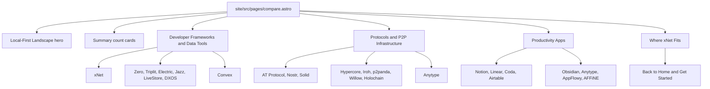
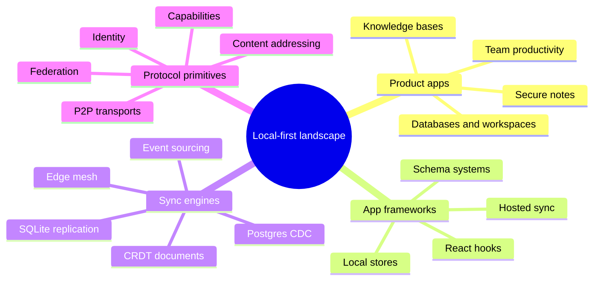
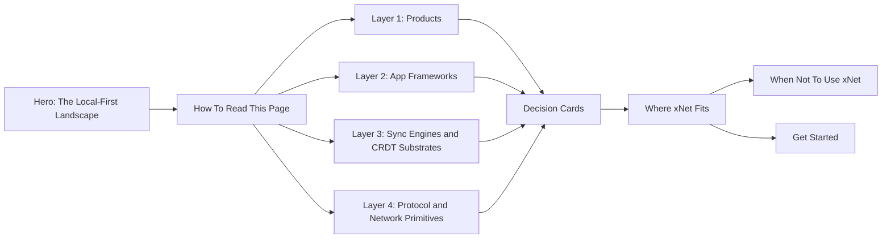
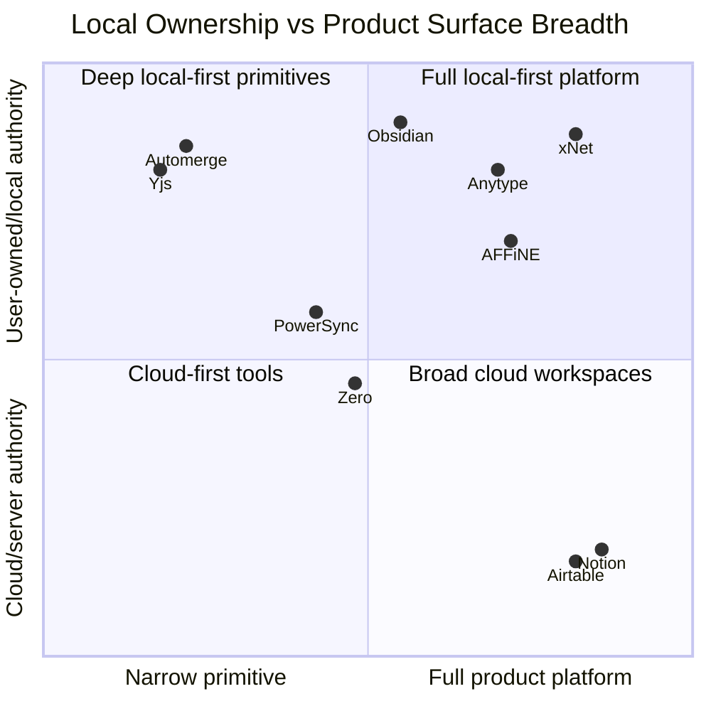
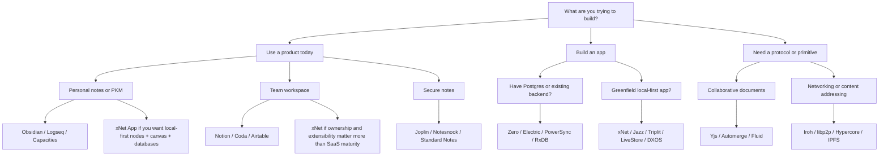
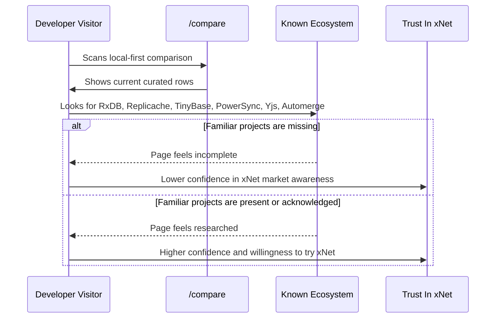
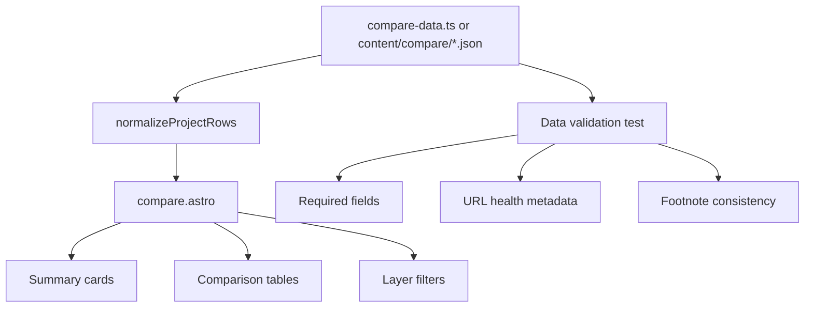
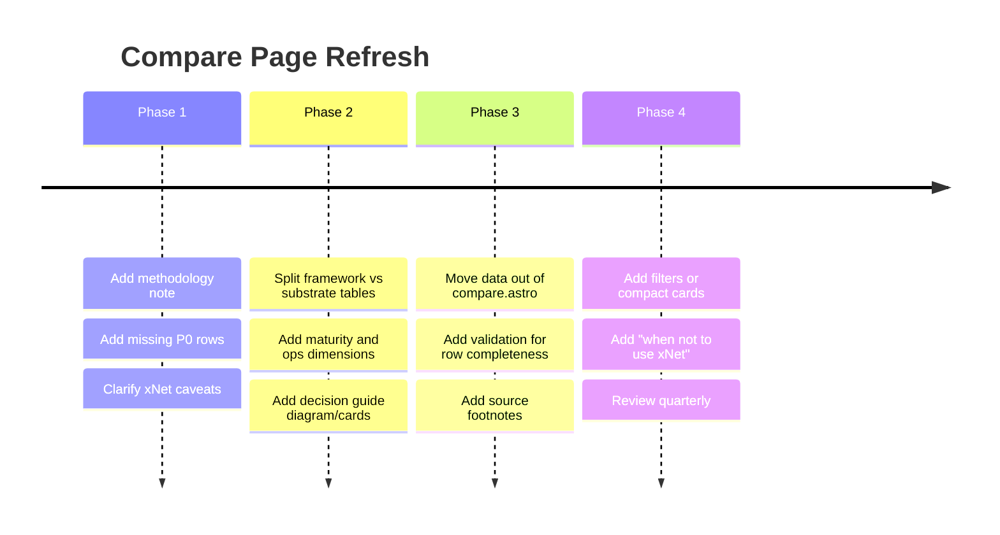

# Compare Page Completeness And Local-First Landscape Expansion

**Date:** 2026-05-13  
**Scope:** `site/src/pages/compare.astro`  
**Status:** Exploration  
**Outcome:** The current comparison page is directionally strong, but it should add a fourth substrate layer, a better set of decision dimensions, and a curated expansion of missing projects across local-first data tools, protocol primitives, and productivity apps.

## Executive Summary

`site/src/pages/compare.astro` already frames xNet in a useful and generous way. It compares:

- developer frameworks and data tools
- protocols and P2P infrastructure
- productivity apps

The page should stay curated rather than becoming an encyclopedia. However, the landscape has enough important omissions that the current list risks looking incomplete to developers who already know local-first tooling. The most important missing categories are:

- embedded/offline databases such as RxDB, TinyBase, Evolu, PouchDB, WatermelonDB, Fireproof, and PowerSync
- sync frameworks and application backends such as Replicache, InstantDB, Ditto, Fluid Framework, Yjs, Automerge, and CR-SQLite/Vulcan
- protocol primitives such as IPFS, libp2p, ActivityPub, Matrix, OrbitDB, Earthstar, Secure Scuttlebutt, and GunDB
- productivity and PKM apps such as Logseq, Joplin, Notesnook, Standard Notes, Outline, Capacities, Heptabase, Tana, Craft, and Evernote/OneNote as user-recognition baselines
- comparison dimensions that matter to adoption: maturity, mobile parity, auth, permissions, hosted/self-hosted options, ops tooling, import/export, AI/MCP support, encrypted sync, and third-party plugin safety

The recommendation is not to dump all projects into the existing three wide tables. Instead, restructure `/compare` around a layered taxonomy and add a compact "More projects worth knowing" section.

## Research Notes

I reviewed the current page, adjacent internal planning, and public project material. Google Search was unavailable in this environment because the tool was not authenticated, so the web research used direct official project pages and documentation where possible.

### Internal Inputs

The page currently defines three arrays in `site/src/pages/compare.astro`:

| Section | Current count | Current role |
| --- | ---: | --- |
| `infraProjects` | 8 | Developer frameworks and data tools |
| `protocolProjects` | 10 | Protocols and P2P infrastructure |
| `productivityApps` | 9 | End-user productivity tools |

Internal exploration `0119_[_]_XNET_AS_A_COMPELLING_WEB_AND_MOBILE_DEVELOPER_TOOL.md` already recommends refreshing `/compare` with:

- production maturity
- mobile parity
- team primitives
- operator tooling
- AI/MCP support

That recommendation is correct and should be incorporated.

## Current Page Map



The current organization is readable, but it mixes layers. For example, DXOS is both framework and app ecosystem, Anytype appears in protocols and apps, LiveStore is a data layer more than a full app framework, and Convex is a cloud-first backend baseline rather than a local-first tool.

## Landscape Taxonomy

The comparison page would be easier to defend if it introduced a taxonomy before the tables.



This helps avoid implying that all rows compete directly. xNet competes with some projects and complements others.

## Major Missing Projects

### Developer Frameworks And Data Tools

The first table should not attempt to include every database. It should include the projects that a developer is likely to name when evaluating local-first, realtime, offline-first, or sync-first app development.

| Project | Why it matters | Suggested placement | Suggested priority |
| --- | --- | --- | --- |
| Replicache | Mature zero-latency sync framework; now maintenance mode after Rocicorp shifted focus to Zero | Developer frameworks | P0 |
| RxDB | Widely used local-first JavaScript database with many replication targets, offline mode, schema validation, encryption, CRDT support, and broad runtime support | Developer frameworks | P0 |
| TinyBase | Tiny reactive local-first store with native CRDT mergeable store, persistence, React/Solid/Svelte bindings, and excellent docs | Developer frameworks | P0 |
| PowerSync | Sync engine that keeps in-app SQLite synced with Postgres/MongoDB/MySQL/SQL Server, cross-platform SDKs, cloud and self-host options | Developer frameworks | P0 |
| InstantDB | Realtime relational-ish backend with auth, permissions, storage, presence, streams, offline support, and strong AI-coded-app positioning | Developer frameworks | P1 |
| Fireproof | Lightweight local-first embedded document database with React hooks, encrypted live sync, and LLM-oriented docs | Developer frameworks | P1 |
| Evolu | MIT, self-hostable, encrypted local-first TypeScript platform using SQLite, CRDTs, typed SQL, and React Suspense | Developer frameworks | P1 |
| Ditto | Commercial offline-first edge database with built-in P2P mesh across BLE, P2P WiFi, LAN, cloud/server optional, and CRDT conflict resolution | Developer frameworks or edge sync | P1 |
| PouchDB | Classic browser database syncing with CouchDB-compatible servers; important historical and practical baseline | Developer frameworks | P1 |
| WatermelonDB | React/React Native offline-first database often used for mobile apps with explicit sync backend patterns | Developer frameworks | P2 |
| Fluid Framework | Microsoft-backed realtime collaboration framework and shared data structure ecosystem, MIT, used by Microsoft Loop and others | Collaboration substrates | P2 |
| Yjs | The dominant network-agnostic CRDT library for collaborative editors; xNet already uses it | New substrate section | P0 |
| Automerge | Local-first sync engine with offline, versioned, conflict-free data and strong research pedigree | New substrate section | P0 |
| CR-SQLite/Vulcan | SQLite extension enabling mergeable databases for offline and peer/server sync | New substrate section | P1 |

### Protocols And P2P Infrastructure

The current protocol table includes strong choices, but it omits several highly recognizable primitives. Some should not be in the main table if the section is meant to be app-data-specific, but they should be acknowledged.

| Project | Why it matters | Suggested placement | Suggested priority |
| --- | --- | --- | --- |
| IPFS | Major content-addressed distributed storage/data integrity layer; Anytype uses IPFS-style content addressing | Protocol primitives | P0 |
| libp2p | Modular P2P networking stack with TCP, QUIC, WebSocket, WebRTC, WebTransport, NAT traversal, encryption, multiple implementations | Protocol primitives | P0 |
| ActivityPub | W3C Recommendation for decentralized social networking; major fediverse baseline | Protocols | P0 |
| Matrix | Open network for secure decentralized communication; important for chat/collaboration protocol comparisons | Protocols | P1 |
| OrbitDB | Serverless P2P database over IPFS with CRDT conflict-free merges | Protocols | P1 |
| Earthstar | Private distributed offline-first database/spec with Ed25519 verification, self-hosting, optional servers, and Willow direction | Protocols | P1 |
| Secure Scuttlebutt | Historic decentralized social protocol/community; useful lineage context | Protocols | P2 |
| GunDB | Decentralized graph database and realtime sync project; older but recognizable | Protocols or legacy | P2 |
| Ceramic | Decentralized data network in Web3 identity/data ownership space | Protocols | P2 |
| Farcaster | Production social protocol with crypto-native identity/social graph; not local-first but useful social baseline | Protocols | P2 |

### Productivity Apps

The current productivity table focuses on Notion/Airtable-like products plus local-first alternatives. It should also cover notes/PKM and secure-notes products because xNet includes pages, rich text, canvas, databases, and local ownership.

| Project | Why it matters | Suggested placement | Suggested priority |
| --- | --- | --- | --- |
| Logseq | Privacy-first open-source knowledge base and outliner; direct Obsidian/AFFiNE/Anytype peer | Productivity apps | P0 |
| Joplin | Open-source cross-platform notes app with E2EE, plugins, multiple sync targets, web clipper | Productivity apps | P0 |
| Notesnook | Open-source zero-knowledge notes workspace with self-hostable sync server and E2EE | Productivity apps | P1 |
| Standard Notes | E2EE notes app with audited/open applications, offline copy, cross-device sync, Proton association | Productivity apps | P1 |
| Outline | Open-source team knowledge base; good team-wiki baseline despite not being local-first | Productivity apps | P1 |
| Capacities | Object-based personal knowledge management; strong conceptual overlap with typed objects/nodes | Productivity apps | P1 |
| Heptabase | Visual knowledge base with whiteboards/cards, offline access, realtime collaboration, AI tutor, CLI/agent positioning | Productivity apps | P1 |
| Tana | Outliner/knowledge graph evolving into agentic meeting platform; strong object/agent narrative | Productivity apps | P2 |
| Craft | Polished document workspace; useful mainstream docs competitor | Productivity apps | P2 |
| Evernote / OneNote | Not local-first leadership examples, but users expect them in notes comparisons | Optional baselines | P2 |

## Recommended Page Structure

The page should move from three flat tables to a layered comparison that remains concise.



Recommended sections:

| Section | Purpose | Rows |
| --- | --- | ---: |
| Product apps | Compare xNet App to end-user alternatives | 10-14 |
| App frameworks | Compare xNet as a developer tool | 10-14 |
| Sync engines and substrates | Acknowledge Yjs, Automerge, CR-SQLite, Fluid, Replicache, Ditto, PowerSync | 8-12 |
| Protocol/network primitives | Put ATProto, Nostr, ActivityPub, IPFS, libp2p, Iroh, Hypercore, Willow, p2panda, Matrix, Solid in context | 10-14 |
| More projects worth knowing | Prevent table bloat while avoiding omissions | 20-40 compact chips |

## Recommended Additions To Existing Tables

### Minimal P0 Patch

If we keep the current three-table structure, the smallest credible update is:

Developer frameworks:

- Replicache
- RxDB
- TinyBase
- PowerSync
- InstantDB
- Fireproof
- Evolu

Protocols:

- IPFS
- libp2p
- ActivityPub
- Matrix
- OrbitDB
- Earthstar

Productivity apps:

- Logseq
- Joplin
- Notesnook
- Standard Notes
- Outline
- Capacities
- Heptabase

### Better P1 Patch

The better implementation is to split "Developer Frameworks & Data Tools" into:

- App frameworks and backends
- Embedded/offline databases
- CRDT and sync substrates

This avoids comparing Convex, Yjs, RxDB, PowerSync, and xNet as if they were the same kind of tool.

## Missing Comparison Dimensions

The current columns are useful but not enough for a developer choosing a production stack.

### Developer Framework Dimensions

| Dimension | Why it matters | Suggested display |
| --- | --- | --- |
| Maturity | Prevents pre-release vs production confusion | `Pre-release`, `Beta`, `Production`, `Maintenance` |
| Hosted option | Users want to know if they can avoid ops | `Cloud`, `BYOC`, `Self-host`, `None` |
| Self-host detail | "Server required" is too broad | `No server`, `Optional relay`, `Required sync service`, `Client-only` |
| Auth/permissions | Core adoption blocker | `Built-in`, `External`, `RLS`, `UCAN`, `JWT` |
| E2EE | Important for user-owned data claims | `Yes`, `Partial`, `No`, `App-defined` |
| Conflict semantics | Current `crdt` column hides nuance | `CRDT`, `server rebase`, `event log`, `LWW`, `custom` |
| Sync granularity | Rows, docs, events, queries, blobs | `row`, `doc`, `event`, `query`, `blob` |
| Platform maturity | Web-only vs mobile/desktop reality | `Web`, `RN/Expo`, `Electron`, `Native` |
| Production ops | Monitoring, dashboard, backups, support | `strong`, `partial`, `DIY`, `none` |
| AI/MCP support | New market narrative and xNet advantage | `CLI`, `llms.txt`, `MCP`, `agent APIs`, `none` |

### Productivity App Dimensions

| Dimension | Why it matters | Suggested display |
| --- | --- | --- |
| Export fidelity | Trust and migration | `Markdown`, `JSON`, `HTML`, `Full app format`, `Limited` |
| Import paths | Adoption from Notion/Obsidian/Evernote | `Notion`, `Markdown`, `CSV`, `OPML`, `None` |
| Team primitives | Comments, mentions, roles, sharing | `Full`, `Partial`, `Personal-first` |
| AI features | Users increasingly compare AI-native tools | `Built-in`, `Agent`, `External`, `None` |
| Data model | Blocks, files, objects, graph, rows | Short text |
| Local storage form | Files, SQLite, IndexedDB, proprietary local DB | Short text |
| Encryption model | Local, transport, cloud, E2EE | Short text |
| Plugin ecosystem | Lock-in vs extensibility | `Marketplace`, `API`, `Community`, `None` |

## Strategic Positioning

xNet should not claim to beat every row at its own job. The strongest message is that xNet combines several layers that are usually separate.



The key comparison claim should be:

> xNet is not only a sync engine, not only a CRDT library, and not only a notes app. It is an integrated local-first app platform with typed data, rich text, canvas, identity, authorization, plugins, devtools, and React/Expo/Electron surfaces.

That claim needs accuracy qualifiers:

- xNet is pre-release and should not imply production maturity equal to Notion, Airtable, PowerSync, RxDB, or Ditto.
- Expo/mobile parity should be marked as in-progress unless the app flow is production-grade.
- Plugin claims should distinguish first-party trusted plugins from untrusted third-party plugin isolation.
- "No server needed" should be clarified as "P2P with optional hub/relay for discovery, backup, and availability" if that is how the product works.

## Decision Journey



This diagram could be adapted directly into `/compare` as a helpful buying-guide section above the tables.

## Risk Analysis



## Recommended Content Blocks

### 1. Add A Methodology Note

Add a short sentence near the hero:

> This page compares projects by layer. Some are direct alternatives to xNet, while others are lower-level building blocks or mature products xNet can learn from.

This prevents bad-faith interpretations.

### 2. Add Layer Pills Or Filters

Use pills above tables:

- Products
- App frameworks
- Embedded databases
- CRDT/sync substrates
- Protocol primitives
- Cloud-first baselines

This enables a broad list without overwhelming the reader.

### 3. Add "Worth Knowing" Cards

Instead of adding 50 table rows, create cards like:

| Card | Contents |
| --- | --- |
| Classic offline-first | PouchDB, CouchDB, WatermelonDB |
| CRDT engines | Yjs, Automerge, Fluid, CR-SQLite |
| P2P primitives | libp2p, IPFS, Iroh, Hypercore, OrbitDB |
| Secure notes | Joplin, Notesnook, Standard Notes |
| PKM/productivity | Logseq, Capacities, Heptabase, Tana, Craft |
| Cloud baselines | Firebase, Supabase, Liveblocks, Convex, InstantDB |

### 4. Add Caveats For xNet Claims

Current xNet rows make strong claims. Add a footnote for:

- pre-release maturity
- Electron-first product maturity vs web/mobile parity
- optional hub/relay role
- plugin trust/isolation status
- whether encryption is local-at-rest, transport, or E2EE across sync

### 5. Add "When Not To Use xNet"

This makes the page more credible:

| Need | Better fit today |
| --- | --- |
| Mature cloud SaaS workspace today | Notion, Airtable, Coda, Linear |
| Existing Postgres app needing incremental sync | Zero, Electric, PowerSync |
| Mobile/edge mesh with BLE and LAN in production | Ditto |
| Rich text CRDT only | Yjs, Automerge, Fluid |
| Secure standalone notes today | Joplin, Notesnook, Standard Notes |
| Federated social protocol | ActivityPub, AT Protocol, Nostr |

## Proposed Data Model Refactor

The current `.astro` file stores table data inline. That is manageable now, but a larger landscape will make the page hard to maintain. Move comparison data into structured constants or content files.



Suggested shape:

```typescript
type CompareLayer =
  | 'product'
  | 'app-framework'
  | 'embedded-database'
  | 'sync-substrate'
  | 'protocol'
  | 'cloud-baseline'

type CompareProject = {
  name: string
  url: string
  layer: CompareLayer
  maturity: 'pre-release' | 'alpha' | 'beta' | 'production' | 'maintenance'
  localFirst: boolean | 'partial'
  offline: 'full' | 'partial' | 'none' | 'app-defined'
  sync: string
  conflictResolution: string
  schema: string
  auth: string
  hosted: string
  selfHosted: string
  platforms: string
  bestFor: string
  notes?: string
}
```

## Implementation Plan



## Prioritized Recommendations

### P0: Make The Page Credible To Local-First Developers

Add these rows or explicit mentions:

- Replicache
- RxDB
- TinyBase
- PowerSync
- Yjs
- Automerge
- IPFS
- libp2p
- ActivityPub
- Logseq
- Joplin

Add these columns:

- maturity
- hosted/self-hosted detail
- auth/permissions
- E2EE/encryption model
- platform maturity

### P1: Improve Decision Quality

Add:

- a decision guide
- a "when not to use xNet" section
- a "substrates xNet uses or complements" section
- caveats for pre-release and mobile parity
- AI/MCP support as a differentiating dimension

### P2: Reduce Maintenance Burden

Move data out of inline Astro and add lightweight validation:

- no missing URL
- no duplicate names in a section unless intentional
- no unfootnoted `**` markers
- all highlighted xNet rows use the same field names
- all rows include maturity and best-for notes

## Implementation Checklist

- [ ] Decide whether to keep three tables or split into four layers.
- [ ] Add a methodology note explaining direct competitors vs complementary primitives.
- [ ] Add P0 missing developer rows: Replicache, RxDB, TinyBase, PowerSync.
- [ ] Add P0 missing substrate rows or section: Yjs, Automerge, CR-SQLite/Vulcan.
- [ ] Add P0 missing protocol rows: IPFS, libp2p, ActivityPub.
- [ ] Add P0 missing product rows: Logseq and Joplin.
- [ ] Add P1 product rows: Notesnook, Standard Notes, Outline, Capacities, Heptabase.
- [ ] Add maturity, hosted option, auth/permissions, encryption, ops, and AI/MCP columns.
- [ ] Clarify xNet pre-release status and Expo/mobile parity.
- [ ] Clarify xNet hub/relay wording so "No server needed" is not misleading.
- [ ] Clarify plugin wording to distinguish first-party/trusted plugins from untrusted third-party isolation.
- [ ] Add a "when not to use xNet" card group.
- [ ] Move comparison data to a separate module if the page exceeds 1,000 lines.
- [ ] Add a small validation test if data moves to TypeScript.

## Validation Checklist

- [ ] A developer familiar with local-first tooling sees Replicache, RxDB, TinyBase, PowerSync, Yjs, and Automerge represented or acknowledged.
- [ ] A protocol-focused reader sees IPFS, libp2p, ActivityPub, Matrix, and OrbitDB/Earthstar represented or acknowledged.
- [ ] A productivity-app reader sees Logseq, Joplin, Notesnook, Standard Notes, Capacities, and Heptabase represented or acknowledged.
- [ ] xNet claims are accurate to shipped behavior, not roadmap intent.
- [ ] Every row has a source URL and a clear "best for" description.
- [ ] Every row has a maturity label.
- [ ] The page does not imply that low-level CRDT libraries are direct product competitors.
- [ ] The page remains readable on mobile with horizontal scroll or card collapse.
- [ ] Dark mode table contrast still passes visual inspection.
- [ ] All external links use `target="_blank"` and `rel="noopener noreferrer"`.
- [ ] `pnpm --filter site build` succeeds after changes.
- [ ] The page is manually reviewed for fairness and non-dismissive language.

## Source Notes

Official project pages and docs reviewed directly:

- xNet compare page: `site/src/pages/compare.astro`
- xNet developer-tool positioning: `docs/explorations/0119_[_]_XNET_AS_A_COMPELLING_WEB_AND_MOBILE_DEVELOPER_TOOL.md`
- Replicache: <https://replicache.dev/>
- Zero: <https://zero.rocicorp.dev/>
- RxDB: <https://rxdb.info/>
- TinyBase: <https://tinybase.org/>
- Fireproof: <https://fireproof.storage/>
- PowerSync: <https://www.powersync.com/> and <https://docs.powersync.com/self-hosting/getting-started>
- InstantDB: <https://www.instantdb.com/>
- Evolu: <https://evolu.dev/>
- Ditto: <https://ditto.live/> and <https://docs.ditto.live/home/introduction>
- ElectricSQL: <https://electric-sql.com/>
- Jazz: <https://jazz.tools/>
- LiveStore: <https://livestore.dev/>
- DXOS: <https://dxos.org/>
- Convex: <https://www.convex.dev/>
- PouchDB: <https://pouchdb.com/>
- Fluid Framework: <https://fluidframework.com/>
- Yjs: <https://yjs.dev/>
- Automerge: <https://automerge.org/>
- CR-SQLite/Vulcan: <https://vlcn.io/>
- IPFS: <https://ipfs.tech/>
- libp2p: <https://libp2p.io/>
- OrbitDB: <https://orbitdb.org/>
- Earthstar: <https://earthstar-project.org/>
- Secure Scuttlebutt: <https://scuttlebutt.nz/>
- ActivityPub: <https://www.w3.org/TR/activitypub/>
- Matrix: <https://matrix.org/>
- Joplin: <https://joplinapp.org/>
- Notesnook: <https://notesnook.com/>
- Standard Notes: <https://standardnotes.com/>
- Capacities: <https://capacities.io/>
- Tana: <https://tana.inc/>
- Heptabase: <https://heptabase.com/>

Some sites were inaccessible or returned minimal content via the fetch tool, notably Triplit and Logseq. They remain recommended because they are widely relevant to this comparison and already appear in the ecosystem being compared.

## Final Recommendation

Refresh `/compare` in two passes.

First, add P0 missing projects and new columns for maturity, hosted/self-hosted options, auth/permissions, encryption, ops, and AI/MCP. This will make the page credible to informed local-first readers with minimal design work.

Second, restructure the page into layers so xNet can be positioned accurately: product app, app framework, sync substrate, and protocol primitive. That gives xNet room to make its strongest claim without flattening the ecosystem into misleading one-row comparisons.
