# 0125 - AFFiNE as the xNet UI Layer

> **Status:** Exploration  
> **Tags:** affine, blocksuite, ui, frontend, local-first, proof-of-concept, editor, canvas, database  
> **Created:** 2026-05-14  
> **Related:** `0102_[_]_AFFINE_BLOCKSUITE_INTEGRATION_FEASIBILITY.md`, `0108_[_]_CANVAS_V1_PAGES_DATABASES_AND_INFINITE_CANVAS_DEEP_DIVE.md`, `0123_[_]_SQLITE_NODE_STORE_READ_SCALING_AND_AUTOMATIC_INDEXING.md`

## Executive Summary

AFFiNE is the closest open-source product to the desired initial xNet app: local-first Notion plus Miro, with docs, edgeless canvas, linked pages, rich blocks, databases/tables, templates, self-hosting, desktop/web clients, and a polished UX. The fastest viable prototype path is **not** to fork the full AFFiNE app and swap its backend wholesale. It is to use **BlockSuite**, the editor/canvas framework behind AFFiNE, inside the existing xNet Electron shell and wire it to xNet's `useNode`, `useQuery`, `useMutate`, database hooks, sync manager, blob store, identity, and authorization.

The practical recommendation is:

1. **Prototype with BlockSuite surfaces inside xNet first.** Use `PageEditor` and `EdgelessEditor` as drop-in experimental surfaces backed by xNet-owned `Y.Doc` instances from `useNode(PageSchema | CanvasSchema, id)`.
2. **Keep xNet as the source of truth for identity, node metadata, schema, sync, sharing, auth, audit, and storage.** Let BlockSuite own only the embedded document/canvas editing state during the prototype.
3. **Mirror BlockSuite document snapshots into xNet nodes for indexing, navigation, export, and recovery.** Do not try to translate every keystroke into NodeStore property changes.
4. **Treat AFFiNE's full app as a reference and possible shell-fork later, not the first integration target.** AFFiNE's product app is large, uses its own infra and local-first engine stack, and is not designed to have its storage/auth layer trivially replaced.
5. **Use xNet-native database hooks for databases at first.** AFFiNE/BlockSuite database UI should be evaluated separately because tables/databases are more semantically tied to xNet's schema, row, relation, and authorization model.

In short: **use AFFiNE's UX DNA through BlockSuite now, not the full AFFiNE product architecture.** This can create a credible proof-of-concept quickly while avoiding a rewrite of xNet's core into AFFiNE's data model.

## Research Notes

Direct web fetching was used because Google Search returned a `403` in this environment.

Primary observations from public sources:

- AFFiNE describes itself as a privacy-focused, local-first, open-source alternative to Notion and Miro, with docs, canvas, tables, real-time collaboration, desktop/web, and self-hosting.
- AFFiNE's README says docs, canvas, and tables are merged; canvas supports rich text, sticky notes, embedded web pages, multi-view databases, linked pages, shapes, and slides.
- AFFiNE CE is listed as MIT in the root `package.json`, with separate license files in the repository; commercial/enterprise features have separate considerations.
- AFFiNE upstreams include BlockSuite, Yjs, y-octo, OctoBase, Electron, React, Jotai, Vite, and Rust/NAPI infrastructure.
- BlockSuite is explicitly the reusable editor framework behind AFFiNE, positioned like Monaco is to VS Code.
- BlockSuite is web-component based and framework-agnostic, while AFFiNE itself is React.
- BlockSuite packages include `@blocksuite/store`, `@blocksuite/inline`, `@blocksuite/block-std`, `@blocksuite/blocks`, and `@blocksuite/presets`.
- BlockSuite ships `PageEditor` and `EdgelessEditor`, both native web components, with CRDT-native Yjs state.
- BlockSuite is MPL-2.0, so using it as a dependency is feasible, but modifying and vendoring its source files carries file-level copyleft obligations.
- xNet already has the relevant app-level hooks and schemas: `useNode`, `useQuery`, `useMutate`, `useDatabase`, `useDatabaseDoc`, `useComments`, `useUndo`, `PageSchema`, `DatabaseSchema`, `CanvasSchema`, and a Yjs-backed rich text/canvas model.

## What xNet Already Has

xNet is not missing the core data architecture. It is missing the highest-polish version of the front-end interaction layer.

Current local code observations:

- `@xnetjs/react` exports `useQuery`, `useMutate`, and `useNode` as the core app data API.
- `XNetProvider` can run through main-thread, worker, or IPC data bridges and can receive an external sync manager, blob store, identity, security settings, and telemetry.
- `PageSchema` is a Yjs-backed document node with title/icon/cover metadata.
- `DatabaseSchema` is a Yjs-backed database node whose rows are separate nodes for per-cell LWW.
- `CanvasSchema` is a Yjs-backed canvas node for scene objects and connectors.
- `RichTextEditor` is Tiptap/Yjs based and already supports collaboration, slash commands, drag handles, task mentions, comments, media upload, embedded database views, plugin extensions, and custom toolbar items.
- `CanvasView` already has page/database/media/shape/group objects, durable source references, comments, source reference panels, undo domains, and inline page/database preview surfaces.
- `@xnetjs/ui` already exists and uses Base UI, Tailwind-related helpers, command palette, motion/accessibility CSS, and common components.

That means the integration question is not "can AFFiNE provide missing storage/sync/auth?" It is "can AFFiNE/BlockSuite provide a better interaction surface fast enough to justify adapter complexity?"

## Decision Frame

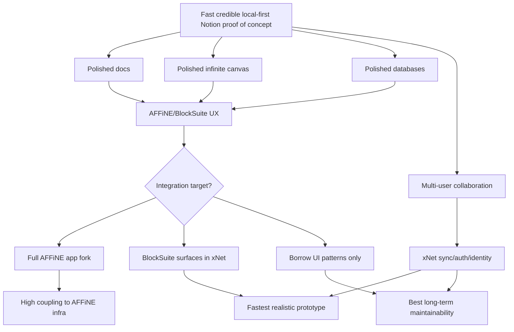

## AFFiNE Versus BlockSuite

The most important distinction: **AFFiNE is the product; BlockSuite is the reusable editing framework.**

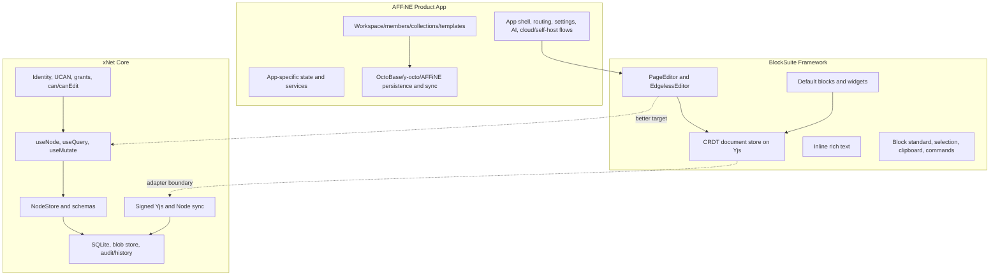

AFFiNE gives the desired complete experience, but its app shell is likely too intertwined with its own workspace and service architecture for a quick clean swap. BlockSuite gives the reusable core of that experience and is intended to be embedded in other apps.

## Integration Strategy Options

### Option A: Full AFFiNE App Fork, Replace Data Layer

Fork AFFiNE, remove or bypass its storage/sync/backend services, and reimplement its app services against xNet APIs.

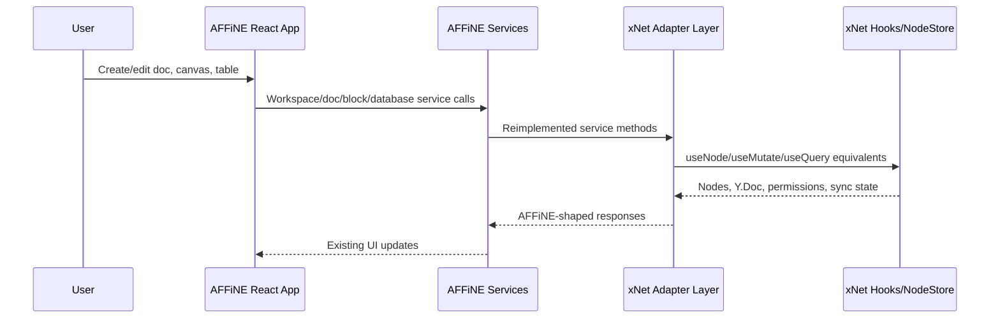

Benefits:

- Maximum apparent speed if the fork runs unchanged.
- Gets the entire AFFiNE product UX, not just the editor.
- Gives access to workspace, sidebar, settings, templates, and mature product flows.

Costs and risks:

- Likely the largest adapter surface.
- AFFiNE services expect AFFiNE concepts, not xNet nodes/schemas/grants.
- High risk of spending weeks understanding app internals before a single xNet-backed edit works.
- Hard to preserve xNet audit/history/security semantics without deep invasive work.
- Upgrade path is fragile because upstream AFFiNE can change app service boundaries.
- Branding/trademark and license review would be required before distribution.

Verdict: **High reward, high drag. Not the first prototype path.** Revisit only after a BlockSuite proof-of-concept proves the editing model is acceptable.

### Option B: BlockSuite Editor and Edgeless Surfaces Inside xNet

Embed BlockSuite's `PageEditor` and `EdgelessEditor` web components inside xNet Electron, backed by `Y.Doc` instances acquired via `useNode`.

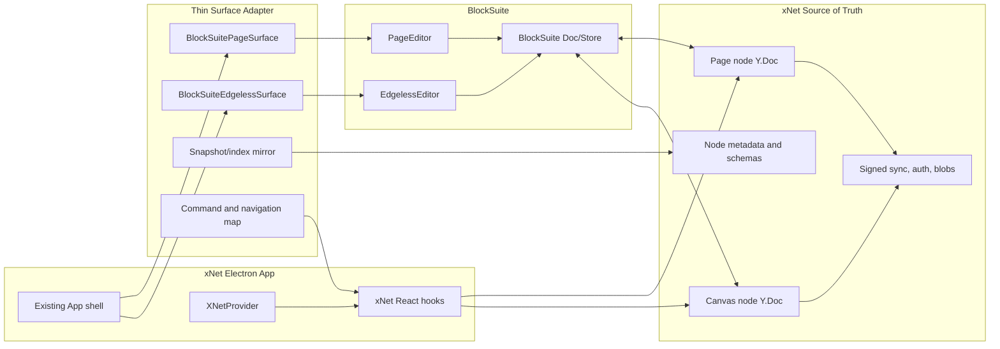

Benefits:

- Best speed-to-polish ratio.
- Uses the framework AFFiNE intentionally separated for reuse.
- Can preserve xNet app shell, onboarding, identity, sync manager, comments, blob storage, and devtools.
- Lets xNet compare current Tiptap/canvas surfaces against BlockSuite without deleting existing code.
- The adapter can be feature-flagged per document.

Costs and risks:

- BlockSuite has its own block model; xNet must either accept it inside Yjs payloads or build lossy import/export mapping.
- xNet's current editor uses Tiptap XML fragments; BlockSuite uses its own CRDT document structure.
- Existing xNet page content may not open in BlockSuite without migration.
- Database integration may be weaker initially than docs/canvas.
- BlockSuite is web-component based, which is fine in React but requires lifecycle care.

Verdict: **Recommended first path.** Keep the first milestone narrow: new experimental docs/canvases only, not migration of all existing content.

### Option C: Snapshot Mirror Prototype

Let BlockSuite persist its native Yjs document inside an xNet page/canvas node, then periodically extract BlockSuite snapshots into xNet node properties or sidecar nodes for search, navigation, references, and export.

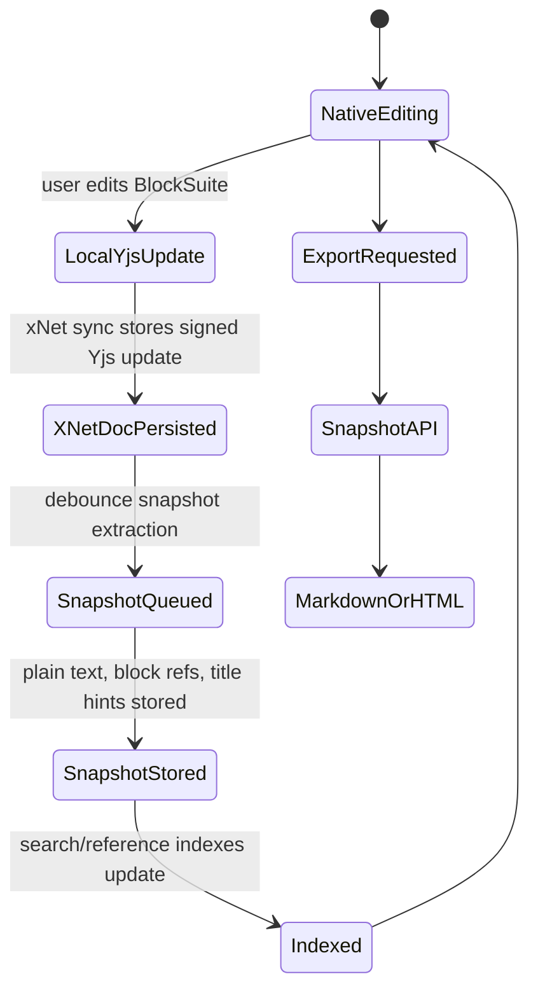

Benefits:

- Avoids translating every operation.
- Keeps editing performance close to BlockSuite's native behavior.
- Gives xNet enough projection data for search and app navigation.
- Similar to how databases can maintain optimized sidecar indexes while preserving canonical state.

Costs and risks:

- xNet cannot reason deeply about every block as a node.
- Fine-grained node-level auth inside a page is deferred.
- Audit history sees Yjs updates and snapshot revisions, not semantic block operations.
- Queries over block content require projection correctness.

Verdict: **Good POC compromise.** This is probably the fastest way to answer "does the AFFiNE UX make xNet feel good?"

### Option D: xNet-Native AFFiNE-Inspired UI

Use AFFiNE and BlockSuite as reference products, but continue building xNet-native React surfaces.

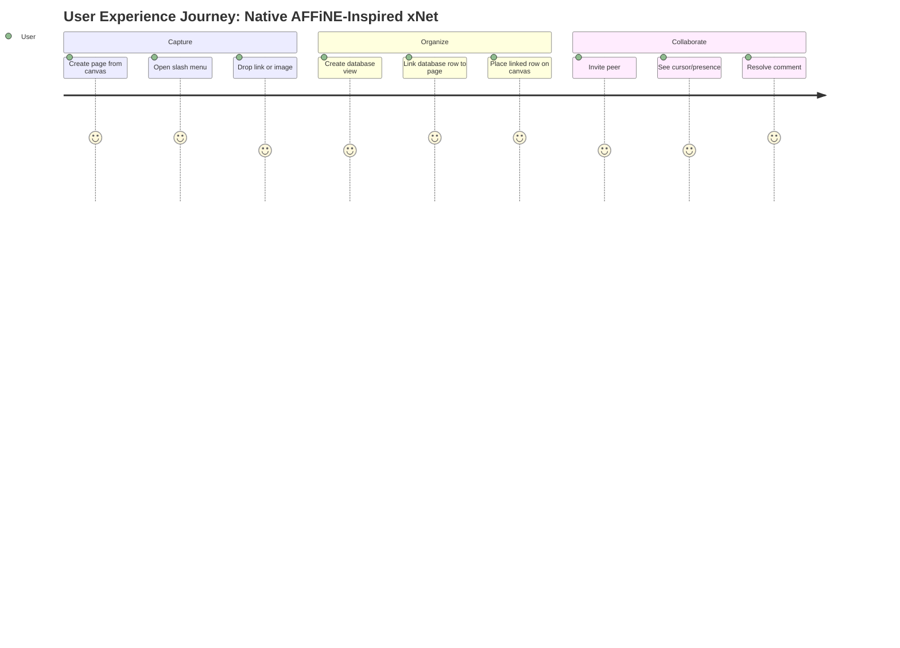

Benefits:

- Cleanest architecture.
- No dependency on BlockSuite model or release cadence.
- xNet semantics remain first-class everywhere.
- Best long-term product differentiation.

Costs and risks:

- Slower to a convincing proof of concept.
- Requires recreating subtle polish: block drag, selection, canvas tools, database interactions, keyboard affordances.
- User feedback may arrive later because the POC remains visually immature.

Verdict: **Best long-term path, not the fastest POC path.** Should run in parallel as learning from the prototype informs native surfaces.

### Option E: AFFiNE as a Sidecar or Imported Workspace

Run AFFiNE as-is, either embedded as a webview/iframe or as a separate desktop app, then sync/import/export selected data to xNet.

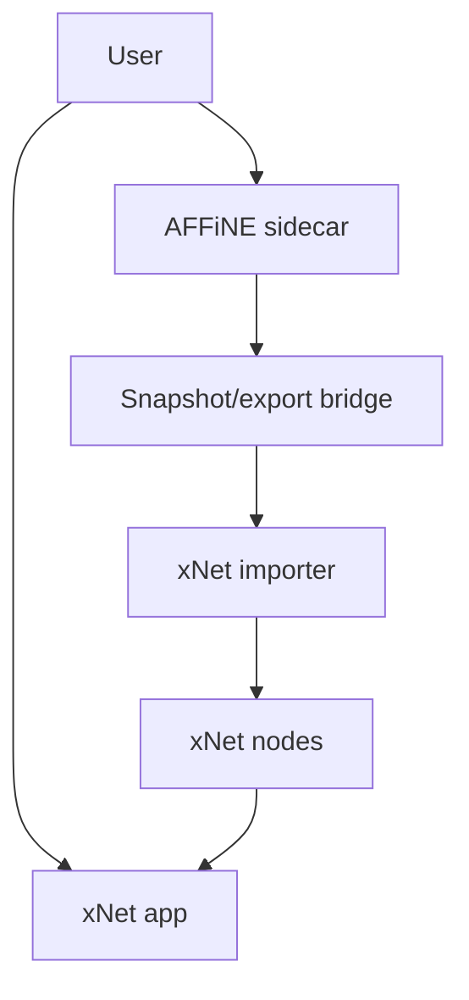

Benefits:

- Fastest demo if the goal is "show something beautiful next to xNet."
- Minimal initial code integration.
- Useful for UX research and migration tooling.

Costs and risks:

- Not a true xNet app.
- Multi-user behavior is AFFiNE's, not xNet's.
- Data ownership/auth/sync story is split.
- Can create a false sense of progress.

Verdict: **Useful only as research or migration spike.** Avoid presenting it as an xNet-backed POC.

## Recommended Prototype Architecture

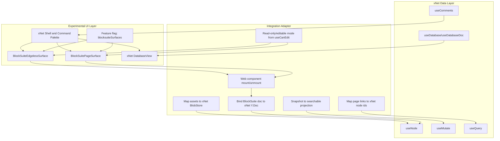

### Prototype Scope

Build one experimental route/surface, not a full product replacement:

- `PageView` can toggle between current `RichTextEditor` and `BlockSuitePageSurface`.
- `CanvasView` can toggle between current xNet canvas and `BlockSuiteEdgelessSurface` for new canvases.
- `DatabaseView` remains xNet-native for the first spike.
- New BlockSuite-backed documents are marked with a content format flag or metadata sidecar, for example `contentEngine: 'blocksuite'`.
- Existing xNet Tiptap content is not migrated during the first spike.
- BlockSuite assets go through xNet's blob store if possible; otherwise, asset upload is disabled during the first spike.
- Sharing and collaboration use existing xNet sync rooms and identity.

### Data Ownership Boundary

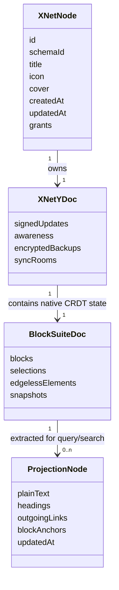

The important rule: **xNet owns the document and permission envelope; BlockSuite owns the nested editing state.**

## How Swapping to xNet Hooks Might Look

### Page Surface Pseudocode

```tsx
function BlockSuitePageSurface({ docId }: { docId: string }) {
  const { did } = useIdentity()
  const { data: page, doc, awareness, loading } = useNode(PageSchema, docId, {
    createIfMissing: { title: 'Untitled Page' },
    did: did ?? undefined
  })
  const { canEdit } = useCanEdit(docId)
  const { update } = useMutate()

  useBlockSuiteMount({
    elementName: 'blocksuite-page-editor',
    ydoc: doc,
    awareness,
    readonly: !canEdit,
    onTitleChange: (title) => update(PageSchema, docId, { title }),
    onSnapshot: (snapshot) => update(PageProjectionSchema, docId, snapshot)
  })

  if (loading || !doc || !page) return <Skeleton />
  return <div data-xnet-blocksuite-page />
}
```

This intentionally does not expose BlockSuite as the app's data API. It hides BlockSuite behind xNet's current React semantics.

### Canvas Surface Pseudocode

```tsx
function BlockSuiteEdgelessSurface({ canvasId }: { canvasId: string }) {
  const { did } = useIdentity()
  const { doc, awareness } = useNode(CanvasSchema, canvasId, {
    createIfMissing: { title: 'Untitled Canvas' },
    did: did ?? undefined
  })
  const { create } = useMutate()

  useBlockSuiteMount({
    elementName: 'blocksuite-edgeless-editor',
    ydoc: doc,
    awareness,
    onCreateLinkedPage: async () => {
      const page = await create(PageSchema, { title: 'Untitled Page' })
      return page?.id ?? null
    }
  })

  return <div data-xnet-blocksuite-edgeless />
}
```

### Adapter Responsibilities

| Area | xNet responsibility | BlockSuite responsibility | Adapter responsibility |
| --- | --- | --- | --- |
| Document identity | Node IDs, schemas, titles | Internal block IDs | Map page links/embeds to node IDs |
| Rich editing | Y.Doc envelope, sync, backup | Blocks, inline text, selection | Bind or import state into editor |
| Canvas | Canvas node, sharing, metadata | Edgeless elements, tools | Map linked pages/databases/assets |
| Databases | Database schemas, rows, views | Optional database block rendering | Decide native view versus embedded view |
| Collaboration | DID, signed updates, awareness room | Local selections/cursors | Bridge awareness shape if needed |
| Authorization | `useCan`, `useCanEdit`, grants | Read-only UI flags | Disable editing and commands |
| Files | BlobStore, CIDs, encryption | Image/file block UI | Upload/download bridge |
| Search | xNet indexes | Snapshot/transformer output | Extract text/headings/links |

## Database Integration

Databases are the riskiest area to hand to AFFiNE/BlockSuite because xNet's database model is already semantically rich.

Current xNet model:

- `DatabaseSchema` owns database metadata and Yjs document state for columns/views.
- Rows are separate nodes for per-cell LWW and independent permissions/history.
- Hooks include `useDatabaseDoc`, `useDatabase`, `useDatabaseRow`, `useCell`, `useRelatedRows`, `useReverseRelations`, and `useDatabaseSchema`.
- Query scaling explorations already point toward SQLite indexes, query planning, adaptive indexes, and materialized hot views.

AFFiNE/BlockSuite database UI may be valuable, but the data model mapping is harder than docs/canvas.

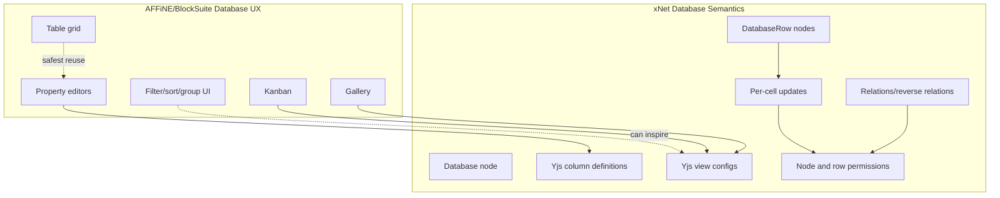

Recommendation for databases:

1. Keep xNet's current `DatabaseView` during the first BlockSuite docs/canvas spike.
2. Audit AFFiNE database UX for filter builders, property editors, view tabs, row open transitions, and empty states.
3. Rebuild those components natively over xNet hooks unless BlockSuite exposes clearly separable UI-only fragments.
4. Only consider a BlockSuite database block if it can render from an external row/column provider without taking ownership of row state.

## Migration and Compatibility

There are three content formats to consider:

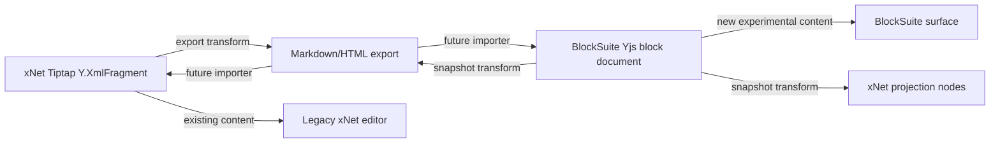

For the POC, avoid hard migrations.

- Existing pages continue using `RichTextEditor`.
- New experimental pages can use `contentEngine: 'blocksuite'`.
- Export/import through Markdown or HTML is acceptable for early interoperability.
- Later, build true Tiptap-to-BlockSuite and BlockSuite-to-Tiptap transforms only if the BlockSuite surface becomes the product direction.

## Collaboration and Auth

The strongest reason to keep xNet as the source of truth is that xNet's differentiators are not UI polish. They are offline-capable identity, signed changes, sync, grants, auditability, and local storage.

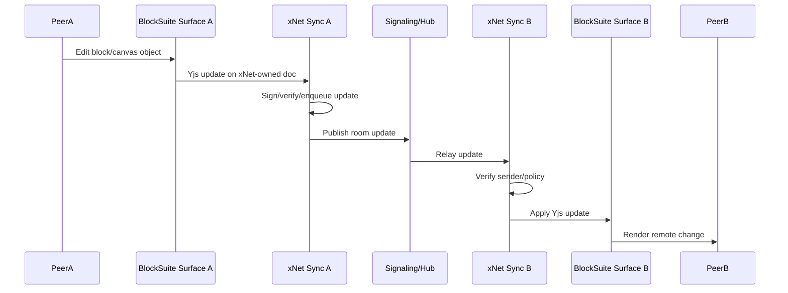

Auth adapter requirements:

- `useCanEdit(docId)` controls read-only mode.
- Block insert, delete, paste, upload, and drag commands must be disabled when read-only.
- Sharing UI remains xNet's `ShareButton`/grant flow.
- Awareness identity uses xNet DID-derived profile labels and colors.
- Rejected remote updates surface through existing verification-failure telemetry/devtools.

## License and Product Risk

| Project | License signal from research | Integration implication |
| --- | --- | --- |
| AFFiNE CE | MIT in root package; repository also has separate license files | App fork may be permissible, but perform license/trademark review before distribution |
| BlockSuite | MPL-2.0 | Safe as dependency; modifications to MPL files must be shared under MPL |
| AppFlowy | AGPL-3.0 | Risky for embedding/forking in a differently licensed app; better as UX reference |
| Logseq | AGPL-3.0 | Better as reference or plugin ecosystem idea, not embedded UI |
| Anytype | Any Source Available License | Not suitable as OSS UI dependency for xNet |
| Outline | BSL 1.1 | Not suitable as a drop-in OSS UI layer for local-first xNet |
| tldraw | Source available/commercial production license for SDK | Technically excellent canvas option; licensing must be evaluated for production |
| Excalidraw | MIT | Strong canvas embed option, but not docs/databases |
| BlockNote | MPL-2.0 core, GPL/commercial XL packages | Good editor option; avoid GPL XL unless license is acceptable |
| Plate | MIT | Good editor UI toolkit; not a full Notion/canvas/database app |
| Milkdown | MIT | Good Markdown editor; less Notion-like and less all-in-one |

Legal review should happen before shipping any AFFiNE/BlockSuite-derived code or distributing a branded fork. For an internal POC, dependency-based BlockSuite usage is the lowest-friction path.

## Alternative OSS UI Options

| Option | Best fit | Integration model with xNet | Strengths | Tradeoffs | Recommendation |
| --- | --- | --- | --- | --- | --- |
| **AFFiNE/BlockSuite** | All-in-one docs plus canvas UX | Embed BlockSuite editors; xNet owns node envelope, sync, auth, storage | Closest to desired product; AFFiNE UX; docs/canvas merged | Block model mismatch; database mapping risk; MPL | **Best POC target** |
| **Excalidraw** | Whiteboard/canvas only | Use `@excalidraw/excalidraw`; store scene JSON/Yjs in `CanvasSchema`; map links to xNet nodes | MIT, mature, embeddable, beautiful sketch UX | Not Notion-like docs/databases; different visual style | Strong fallback for canvas |
| **tldraw** | Infinite canvas SDK | Replace or augment `@xnetjs/canvas`; custom shapes for pages/databases; xNet sync adapter | Best-in-class canvas SDK, custom shapes/tools, multiplayer primitives | Production licensing; docs/databases not included | Evaluate if canvas becomes bottleneck |
| **BlockNote** | Notion-style rich editor | Replace or augment `RichTextEditor`; bind Yjs to `useNode`; database/canvas remain xNet-native | React/Tiptap-based, polished, easy embed | Editor only; MPL/GPL package split | Good fallback for docs |
| **Plate** | Rich editor building blocks | Rebuild editor UI over Slate/Plate and xNet hooks | MIT, shadcn/ui-friendly, AI templates | More assembly work; not canvas/database | Good if custom UI remains path |
| **Milkdown** | Markdown-first docs | Store Markdown/prosemirror state in page docs | MIT, clean Markdown semantics | Not Notion-like enough; no canvas/databases | Lower priority |
| **AppFlowy** | Notion-like app reference | UX reference only; avoid embedding due AGPL/Flutter/Rust split | Popular, databases/projects/wiki, cross-platform | Flutter not React; AGPL; hard data swap | Reference only |
| **Logseq** | Outliner/graph workflows | Plugin/import inspiration; possible graph model ideas | Privacy-first, local-first, plugins, RTC alpha | ClojureScript/DataScript; outliner UX not AFFiNE-like | Reference only |
| **Anytype** | Object-centric local-first knowledge OS | Architecture inspiration only | Local-first P2P/E2EE object model | Source-available license, middleware stack | Do not integrate code |
| **Outline** | Team wiki docs | UI reference for team docs | Polished React app, markdown compatible | Server-centric, BSL, no local-first canvas/database | Reference only |
| **Obsidian plugins** | Personal PKM ecosystem | Plugin/API inspiration, import/export via Markdown | Huge ecosystem and UX patterns | Closed source app; no native multi-user; plugin code varies | Reference/import only |

## Option Ranking

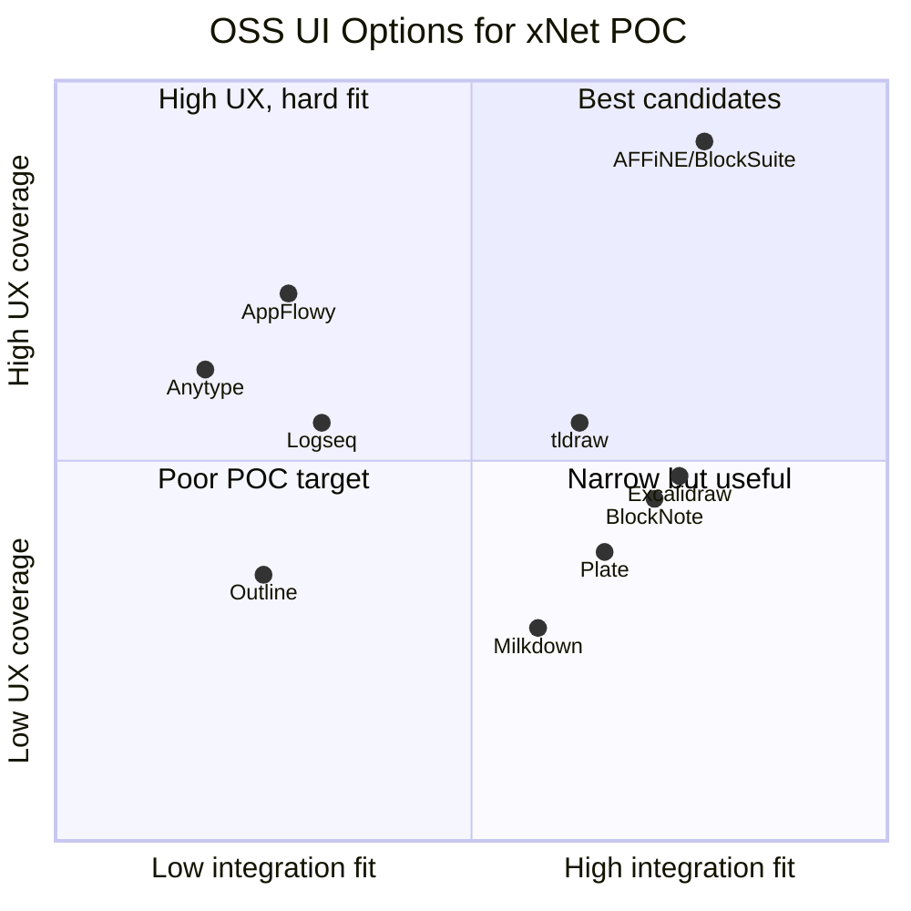

## Implementation Plan

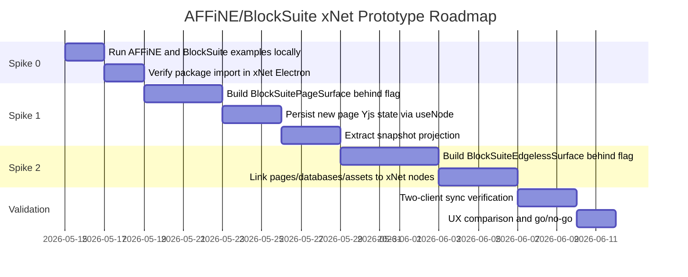

### Phase 0: Research Spike

- [ ] Clone and run AFFiNE desktop/web locally.
- [ ] Run BlockSuite examples or playground locally.
- [ ] Identify exact package versions compatible with xNet's current React/Vite/Electron setup.
- [ ] Confirm whether BlockSuite can bind to an externally supplied `Y.Doc` or whether it requires its own store/document abstraction.
- [ ] Confirm how BlockSuite snapshots expose text, block IDs, links, and edgeless elements.
- [ ] Confirm CSS/theme isolation requirements in Electron.
- [ ] Record screenshots and short videos of the AFFiNE UX flows to emulate.
- [ ] Document license obligations for dependency use versus source modification.

### Phase 1: Page Surface Spike

- [ ] Add BlockSuite dependencies only to the app/package that needs them, not monorepo-wide.
- [ ] Create `BlockSuitePageSurface` as an experimental component.
- [ ] Gate it behind a local feature flag, for example `localStorage.setItem('xnet:experimental:blocksuite', 'true')`.
- [ ] Use `useNode(PageSchema, docId)` for the xNet-owned document envelope.
- [ ] Create only new BlockSuite-backed pages at first.
- [ ] Add metadata/projection marker to distinguish content engines.
- [ ] Wire title updates to `useMutate().update(PageSchema, docId, { title })`.
- [ ] Wire read-only state from `useCanEdit`.
- [ ] Wire file/image upload to xNet blob store or disable upload explicitly.
- [ ] Extract plain text/headings/links after debounce for search and navigation.
- [ ] Verify reload restores the BlockSuite document.

### Phase 2: Edgeless Canvas Spike

- [ ] Create `BlockSuiteEdgelessSurface` behind the same feature flag.
- [ ] Use `useNode(CanvasSchema, canvasId)` for the xNet-owned canvas envelope.
- [ ] Support creating linked xNet pages from the edgeless surface.
- [ ] Support placing existing xNet pages/databases as linked cards if BlockSuite API allows it.
- [ ] Decide whether AFFiNE-like database cards render xNet's native `DatabaseView` or a simple preview.
- [ ] Map dropped images/files to xNet blob store.
- [ ] Preserve xNet share/invite UI around the surface.
- [ ] Verify two clients can see canvas edits and presence.

### Phase 3: Database UX Decision

- [ ] Audit AFFiNE database/table UX in detail.
- [ ] Compare against current `DatabaseView`, `CanvasDatabasePreviewSurface`, and xNet database hooks.
- [ ] Identify separable UI components: property editor, filter builder, sort/group menus, row popover, field type picker.
- [ ] Build a native xNet filter/property editor prototype inspired by AFFiNE.
- [ ] Avoid moving canonical row state into BlockSuite unless an external provider API exists.
- [ ] Validate per-cell LWW, undo, permissions, and relation hooks still work.

### Phase 4: Product Decision

- [ ] Compare current xNet native surfaces versus BlockSuite surfaces with the same sample workspace.
- [ ] Measure bundle size and startup impact.
- [ ] Measure editing latency on large docs/canvases.
- [ ] Test offline editing and reconnection.
- [ ] Test two-user simultaneous editing.
- [ ] Decide one of: adopt BlockSuite for POC, use as temporary demo only, or continue xNet-native UI.

## Validation Checklist

### Technical Validation

- [ ] Electron app boots with BlockSuite packages and no Vite import-analysis failures.
- [ ] No duplicate incompatible Yjs versions are bundled.
- [ ] BlockSuite surface can mount, unmount, and remount without leaking listeners.
- [ ] A new BlockSuite page persists after app restart.
- [ ] A new BlockSuite canvas persists after app restart.
- [ ] xNet sync manager sees and replicates document updates.
- [ ] Two app instances can edit the same page without data loss.
- [ ] Two app instances can edit the same canvas without data loss.
- [ ] Offline edits queue and reconcile after reconnect.
- [ ] Read-only users cannot mutate content through keyboard shortcuts, paste, drag/drop, or toolbar buttons.
- [ ] Blob uploads either use xNet CIDs or are disabled with clear UX.
- [ ] Export to Markdown or HTML works for BlockSuite-backed pages.
- [ ] Snapshot projection updates search text, links, headings, and modified timestamps.
- [ ] Existing Tiptap pages continue to open in current `RichTextEditor`.
- [ ] Existing xNet canvases continue to open in current `CanvasView`.

### Product Validation

- [ ] Creating a page feels as polished as AFFiNE for the common case.
- [ ] Creating and editing an edgeless canvas feels materially better than current xNet canvas for brainstorming.
- [ ] Linked pages/databases are understandable to a new user.
- [ ] User can move from canvas to page focus and back without getting lost.
- [ ] Database UX remains acceptable even if databases stay xNet-native.
- [ ] Sharing flow remains visibly xNet, not AFFiNE account/cloud flow.
- [ ] The POC can be demoed fully offline on one machine.
- [ ] The POC can be demoed with two local app instances.

### Security and Architecture Validation

- [ ] xNet remains the authority for identity and author DID.
- [ ] xNet remains the authority for grants and edit checks.
- [ ] xNet remains the authority for sync rooms and transport.
- [ ] xNet remains the authority for blob storage.
- [ ] BlockSuite cannot bypass xNet write permissions.
- [ ] Projection extraction cannot leak private content into unauthorized nodes.
- [ ] Audit/history behavior is documented for BlockSuite-backed docs.
- [ ] License obligations are documented in `NOTICE` or equivalent before distribution.

### Regression Validation

- [ ] `pnpm --filter @xnetjs/react test` passes if hooks are touched.
- [ ] `pnpm --filter @xnetjs/editor test` passes if editor package is touched.
- [ ] `pnpm --filter @xnetjs/canvas test` passes if canvas package is touched.
- [ ] `pnpm --filter xnet-electron test` or relevant app tests pass if Electron components are touched.
- [ ] `pnpm typecheck` passes.
- [ ] Manual Electron verification completes.
- [ ] Dev servers are killed after manual testing.

## Key Risks and Mitigations

| Risk | Severity | Mitigation |
| --- | --- | --- |
| BlockSuite cannot cleanly use xNet-provided `Y.Doc` | High | Start with a proof that a supplied doc/store can be mounted; if not, store BlockSuite updates in an xNet-managed binary field or use snapshot persistence only for POC |
| Duplicate sync systems conflict | High | Disable BlockSuite network providers; route all collaboration through xNet SyncManager |
| Existing xNet content cannot migrate | Medium | Do not migrate in first spike; use content engine markers |
| Database model mismatch | High | Keep databases xNet-native until a UI-only extraction path is proven |
| Bundle size/startup regression | Medium | Lazy-load experimental BlockSuite surfaces only when enabled |
| License/trademark ambiguity | Medium | Use dependencies rather than vendored source; legal review before distribution |
| Web component styling conflicts | Medium | Mount in isolated wrapper, import scoped CSS, test dark mode and mobile sizes |
| App becomes an AFFiNE clone | Medium | Preserve xNet identity, sharing, graph, schema, and security differentiators in shell |

## Go/No-Go Criteria

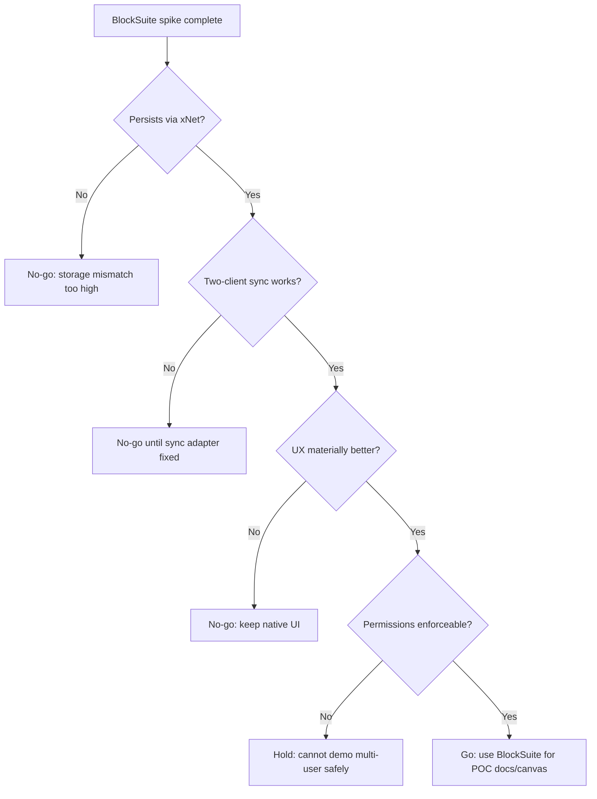

Adopt BlockSuite for the POC only if:

- It can persist and restore through xNet-owned storage.
- It can sync between two xNet clients without enabling a second sync backend.
- It can be put into a reliable read-only mode.
- The UX improvement is obvious in a five-minute demo.
- The integration does not require replacing xNet's NodeStore, identity, auth, or database hooks.

## Recommendations

### Immediate Next Actions

1. Create a short-lived branch for a BlockSuite spike.
2. Add a single experimental `BlockSuitePageSurface` in the Electron renderer.
3. Use only new pages with a `contentEngine: 'blocksuite'` marker or equivalent sidecar metadata.
4. Lazy-load BlockSuite to avoid impacting the default app.
5. Verify persistence, reload, and two-client sync before touching canvas or databases.

### One-Week Target

- [ ] A new xNet page opens in a BlockSuite-like editor.
- [ ] The page title is stored in xNet metadata.
- [ ] The page body persists in xNet-owned document state.
- [ ] The page reloads correctly after app restart.
- [ ] A second local client sees edits.
- [ ] The current xNet page editor still works for existing pages.

### Two-Week Target

- [ ] A new xNet canvas opens in a BlockSuite edgeless surface.
- [ ] Users can create a page from the canvas and open it.
- [ ] Basic images/files either work through xNet blob store or are clearly disabled.
- [ ] Search projection extracts page text.
- [ ] Read-only mode blocks edits.
- [ ] A demo workspace can be created fully offline.

### Longer-Term Direction

If BlockSuite works well:

- Keep it as the POC UI layer for docs and canvas.
- Rebuild database UX natively but copy AFFiNE interaction patterns.
- Gradually decide whether to keep BlockSuite permanently or use it as a design oracle for xNet-native UI.
- Avoid a full AFFiNE app fork unless there is a specific AFFiNE shell capability that cannot be reproduced in xNet.

If BlockSuite does not work well:

- Evaluate BlockNote for docs and Excalidraw/tldraw for canvas separately.
- Continue xNet-native UI but prioritize AFFiNE-level polish in command menus, selection, block drag, embeds, and canvas transitions.

## Bottom Line

Using AFFiNE's full frontend while swapping in xNet data is probably possible in theory, but not the fastest reliable path. The faster, lower-risk path is to **embed BlockSuite, the reusable AFFiNE editor/canvas engine, inside xNet and keep xNet's APIs as the hard boundary**.

This gives the proof-of-concept what it needs most: a polished local-first Notion/Miro feel quickly, without sacrificing xNet's long-term differentiators.
