# 0126 - OctoBase Integration for xNet Storage and Collaboration

> **Status:** Exploration  
> **Tags:** octobase, affine, sqlite, yjs, y-octo, storage, sync, crdt, local-first, blocksuite  
> **Created:** 2026-05-14  
> **Related:** `0125_[_]_AFFINE_AS_XNET_UI_LAYER.md`, `0123_[_]_SQLITE_NODE_STORE_READ_SCALING_AND_AUTOMATIC_INDEXING.md`, `0121_[_]_WASM_AND_NATIVE_KERNELS_FOR_CRYPTO_SYNC_AND_CRDT_OPTIMIZATION.md`, `0072_[x]_INDEXEDDB_TO_SQLITE_MIGRATION.md`, `0026_[x]_NODE_CHANGE_ARCHITECTURE.md`

## Executive Summary

OctoBase is interesting because it targets almost exactly the app class xNet is building: offline-available collaborative knowledge applications with block documents, tables, canvases, rich media, full-text search, native clients, and optional server operation. It is also not just a random database. Its public README says it was originally designed for AFFiNE, and AFFiNE publicly lists OctoBase and `y-octo` as upstreams for its local-first collaborative stack.

The practical recommendation is **do not replace xNet's SQLite-backed NodeStore with OctoBase now**. Instead, run a staged evaluation:

1. **Use OctoBase as an isolated sidecar for BlockSuite/AFFiNE-style document experiments.** Keep xNet's `NodeStore`, identity, authorization, sync policy, audit trail, schema system, database rows, and app metadata as the source of truth.
2. **Evaluate `y-octo` separately as a possible Yjs-compatible native CRDT kernel.** This may be more valuable than the full OctoBase database because xNet already has storage, auth, blobs, and query plans.
3. **Borrow OctoBase's architectural split: CRDT data storage, blob storage, sync connectors, and indexing as separable capabilities.** That maps cleanly onto xNet's package boundaries.
4. **Only consider deeper OctoBase adoption after license, distribution, bindings, and semantic parity are proven.** OctoBase is currently AGPL-3.0, pre-1.0/heavy-development per its README, and no obvious `@toeverything/octobase` npm package was available from the public npm registry during this exploration.

The best near-term shape is **OctoBase on top of or beside SQLite, not instead of SQLite**. More specifically: an OctoBase data directory or SQLite file can hold experimental block document state while xNet's existing SQLite database holds canonical nodes, properties, signed changes, permissions, indexes, and projections.

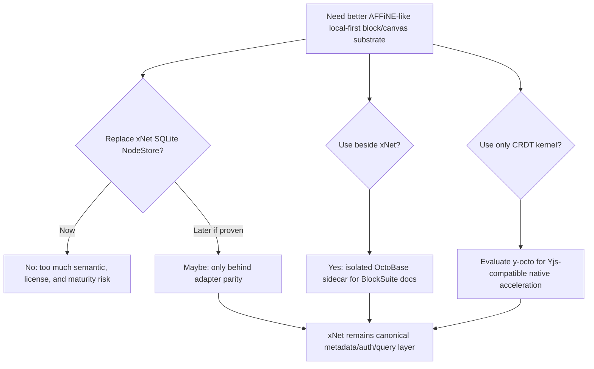

## Research Method

Google Search returned a `403` in this environment, so direct source fetching was used instead.

Primary sources checked:

| Source | What was used |
| --- | --- |
| `https://github.com/toeverything/OctoBase` | README, project status, feature list, license, repo structure, stars/releases summary |
| `https://raw.githubusercontent.com/toeverything/OctoBase/master/README.md` | canonical README content without GitHub page chrome |
| `https://raw.githubusercontent.com/toeverything/OctoBase/master/apps/homepage/pages/docs/overview/whats_new.md` | release notes and historical capabilities |
| `https://raw.githubusercontent.com/toeverything/OctoBase/master/apps/homepage/pages/docs/building_guide.md` | server/runtime setup and SQLite/Postgres backend notes |
| `https://raw.githubusercontent.com/toeverything/OctoBase/master/Cargo.toml` | Rust workspace members and `jwst-wasm` presence |
| `https://github.com/toeverything/AFFiNE` | AFFiNE README, upstream list, product capabilities, license summary |
| `https://github.com/toeverything/BlockSuite` | BlockSuite README, editor/data architecture, package names, license notes |
| `https://github.com/y-crdt/y-octo` | `y-octo` README, Yjs compatibility, production usage claim |
| npm metadata via `npm view` | `@blocksuite/store` and `@blocksuite/presets` package availability; `@toeverything/octobase` absence |
| xNet source | `NodeStore`, `NodeStorageAdapter`, `SQLiteNodeStorageAdapter`, SQLite schema, Yjs/sync package references |

## What OctoBase Appears to Be

OctoBase describes itself as an offline-available, scalable, self-contained collaborative database originally designed for AFFiNE. Its README says it supports:

| Capability | Public claim | xNet relevance |
| --- | --- | --- |
| Multi-platform offline collaboration | schemaless structured, unstructured, and rich text data storage | overlaps xNet's Electron/Web/Expo aspirations |
| Binary/blob storage | data deduplication and rich media editing | overlaps xNet blobs and media-backed canvas/pages |
| Real-time full-text indexing | high-performance multilingual word segmentation | potentially better than current simple FTS5 extraction |
| CRDT-driven P2P sync | native multi-platform support | overlaps signed Yjs sync and future P2P work |
| Fine-grained permission control | advanced permission management | overlaps UCAN/grants/offline auth, but semantics are unknown |
| Embedded or server database | can run inside app or as standalone server | maps to Electron local storage and possible hub/self-host mode |
| Storage-agnostic CRDT/blob storage | README lists SQLite and Postgres adapters, with S3 work | maps to xNet's adapter strategy |

The internal project naming in the public repo centers around `jwst` packages:

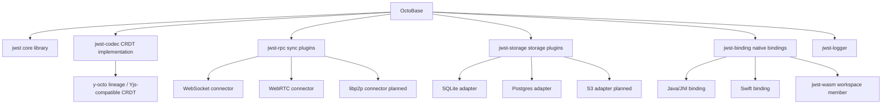

## What AFFiNE Uses Around It

AFFiNE is the useful proof point. Its README describes a local-first Notion/Miro-like app with docs, canvas, tables, real-time collaboration, desktop/web, self-hosting, and BlockSuite editors. The upstream list includes:

| Upstream | AFFiNE role from public README | xNet implication |
| --- | --- | --- |
| BlockSuite | collaborative editor framework behind AFFiNE | most relevant UI-level dependency for xNet prototypes |
| `y-octo` | native high-performance thread-safe Yjs CRDT implementation | potential native CRDT accelerator |
| OctoBase | database behind AFFiNE | possible document/collab sidecar, not necessarily app database replacement |
| Yjs | fundamental CRDT support for state management and data sync on web | aligns with xNet's existing Yjs document model |
| Electron, React, Vite, NAPI-RS | app/runtime infrastructure | aligns with xNet Electron/TypeScript stack |

The important nuance: **AFFiNE validates the overall stack, but not necessarily OctoBase as a clean third-party dependency for xNet today**. AFFiNE can rely on internal service boundaries, private operational knowledge, and changing APIs in ways xNet cannot.

## What xNet Already Has

xNet already has most of the pieces OctoBase advertises, but split differently:

| xNet area | Current implementation facts | OctoBase overlap |
| --- | --- | --- |
| Canonical structured data | `NodeStore` manages event-sourced nodes with per-property LWW timestamps | OctoBase is schemaless/collaborative, but semantics differ |
| Durable local storage | `SQLiteNodeStorageAdapter` persists nodes, `node_properties`, signed changes, Yjs state, snapshots, blobs, FTS | OctoBase has SQLite/Postgres storage adapters internally |
| Sync history | `changes` table stores signed node changes with Lamport time, author, parent hash, batch ID, signature | OctoBase has CRDT operation storage, but not xNet signed-change semantics |
| Rich document content | SQLite schema includes `yjs_state`, `yjs_updates`, `yjs_snapshots`; sync package signs/verifies Yjs envelopes | OctoBase/y-octo could replace or accelerate parts of this |
| Auth and sharing | `StoreAuthAPI`, offline policy, UCAN/grants, mutation gating | OctoBase claims fine-grained permissions, but mapping is unknown |
| Query/indexing | SQLite FTS and planned scalar/spatial query pushdown | OctoBase claims full-text indexing; query API fit is unknown |
| Blobs | SQLite `blobs` table and sync abstractions | OctoBase blob storage could inspire dedup/sync design |
| React app API | `useNode`, `useQuery`, `useMutate`, sync manager, data bridges | should remain xNet's public developer contract |

Current xNet storage shape:

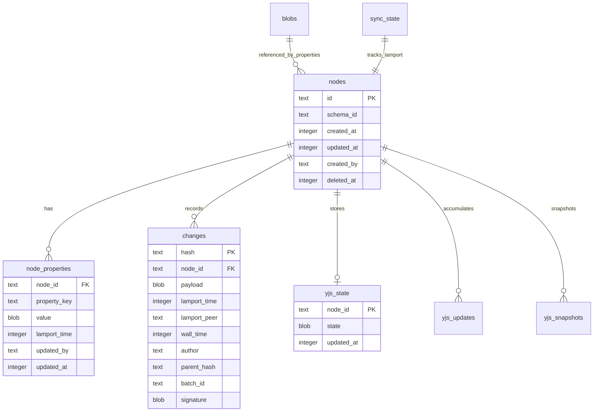

## The Fit Question

There are two very different integration questions:

1. **Can OctoBase replace SQLite?** Probably not directly. OctoBase itself uses SQLite/Postgres adapters, so it is not just a SQLite alternative; it is a higher-level collaborative database runtime. Replacing xNet's SQLite adapter with OctoBase would also replace or duplicate xNet's materialized node store, signed changes, Yjs persistence, sync, and permissions.
2. **Can OctoBase sit on top of or beside SQLite?** Yes, this is the more plausible path. OctoBase can use SQLite internally while xNet continues to use its own SQLite schema. The integration boundary can be document/canvas CRDT state rather than every xNet node/property.

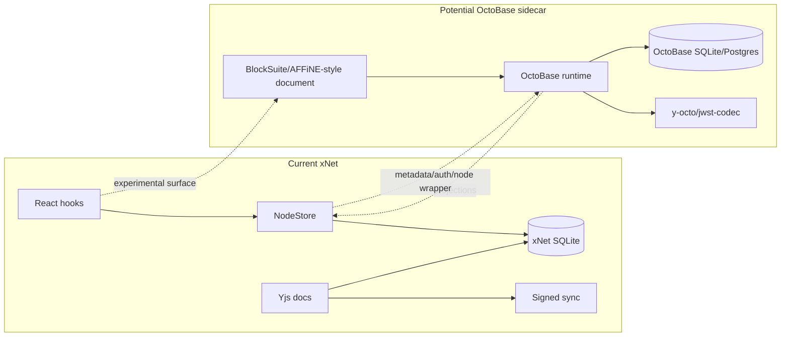

## Integration Options

### Option A: Replace xNet SQLite NodeStorageAdapter with OctoBase

Build an `OctoBaseNodeStorageAdapter` that implements xNet's `NodeStorageAdapter` interface.

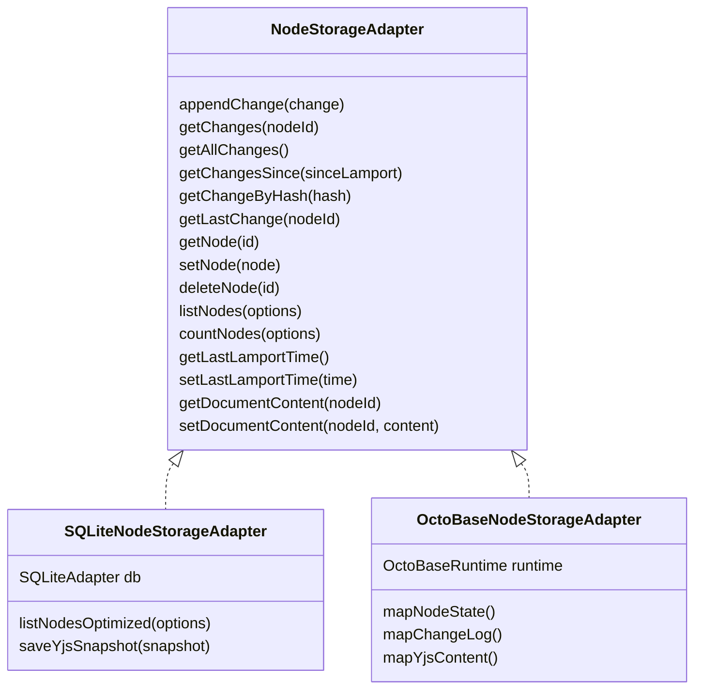

Benefits:

- Would make OctoBase a true database abstraction candidate.
- Tests xNet's storage interface portability.
- Could unlock OctoBase indexing/blob/sync if APIs expose the right pieces.

Costs:

- High semantic mismatch: xNet changes are signed, hash-addressed, Lamport-ordered, and property-LWW; OctoBase operations are CRDT-oriented.
- Need to preserve `getChangesSince`, parent hashes, batch IDs, signatures, and offline auth behavior exactly.
- Unknown JavaScript/Electron binding availability. Public npm did not expose `@toeverything/octobase` during this exploration.
- AGPL-3.0 license risk if distributed inside xNet before OctoBase relicenses.
- High risk of ending up with OctoBase as a slower compatibility layer under xNet rather than a source of leverage.

Verdict: **Do not start here.** This is a later conformance experiment, not the first integration.

### Option B: OctoBase Sidecar for BlockSuite Documents

Use OctoBase only for experimental documents/canvases whose internal state is BlockSuite/AFFiNE-shaped. Store an xNet wrapper node with metadata, permissions, title, index projection, and a pointer to the OctoBase document/workspace.

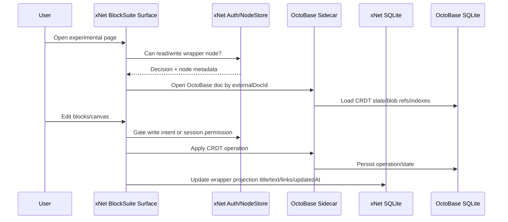

Benefits:

- Minimizes blast radius.
- Lets xNet evaluate OctoBase where it is strongest: AFFiNE-like block/canvas CRDT documents.
- Keeps xNet's app-level contract intact.
- Avoids forcing OctoBase to emulate xNet's NodeStore.
- Can be hidden behind `contentEngine: 'octobase-blocksuite'` or equivalent metadata.

Costs:

- Two storage systems to back up, compact, migrate, encrypt, and repair.
- Need projection correctness for search, navigation, links, recent pages, and export.
- Need explicit auth boundaries because CRDT docs can accept unauthorized operations unless gated.
- Need lifecycle tooling: delete, restore, duplicate, export, import, migration, and corruption recovery.

Verdict: **Best first integration if license/distribution allows it.** Keep it experimental and isolated.

### Option C: Use OctoBase as a Local Collaboration Server

Run OctoBase server components, such as Keck/AFFiNE Cloud-style services, as a local or self-hosted sync backend while xNet keeps its local SQLite database.

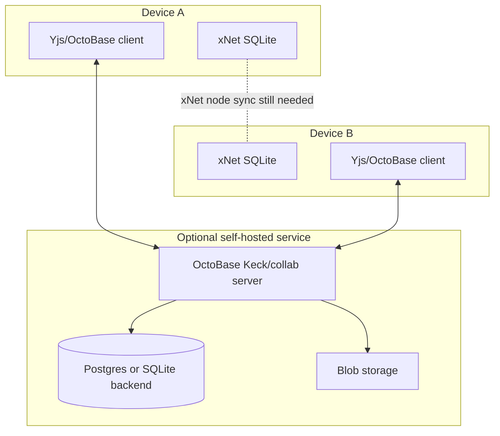

Benefits:

- Could accelerate multi-device/block collaboration experiments.
- Maps to OctoBase's server capability.
- Useful as a reference for xNet hub design.

Costs:

- xNet already has signed sync, signaling, offline queue, peer scoring, and future P2P direction.
- Running OctoBase server does not solve xNet NodeStore sync unless translated.
- Server auth, encryption, tenancy, and policy semantics likely diverge from xNet's UCAN model.

Verdict: **Reference or lab tool only.** Do not make it core until the document sidecar proves value.

### Option D: Adopt `y-octo` Without Full OctoBase

Evaluate `y-octo` as a Yjs-compatible native CRDT implementation for Electron/server/hub hot paths.

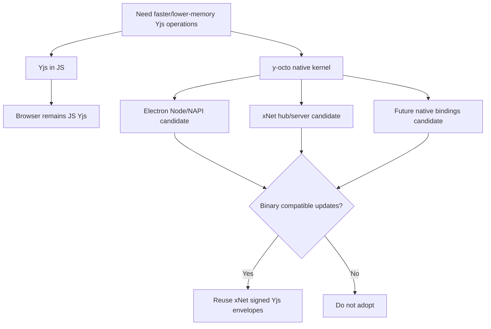

Benefits:

- Smaller scope than OctoBase.
- Directly targets performance and native reliability.
- `y-octo` README claims Yjs binary compatibility, state diff/apply compatibility, awareness encoding, sync protocol encoding, and production usage in AFFiNE Electron/server.
- Could fit exploration `0121`'s selective native kernel strategy.

Costs:

- Need exhaustive binary compatibility and fuzz testing against Yjs.
- Browser support may still require JS Yjs or WASM packaging.
- Need packaging for Electron ABI and CI across macOS/Linux/Windows.

Verdict: **High-value separate spike.** This may be the most useful part of the OctoBase ecosystem for xNet core.

### Option E: Borrow Architecture Only

Treat OctoBase as validation for xNet's own direction and keep building on SQLite.

Benefits:

- Zero license/distribution risk.
- Reinforces current plans: SQLite query pushdown, blob sync, native kernels, BlockSuite integration, and better document projections.
- Lets xNet keep its differentiators: signed changes, UCAN auth, schema federation, node-native databases, and app-level APIs.

Costs:

- No immediate leverage from OctoBase's implementation.
- xNet must build/index/optimize more itself.

Verdict: **Default fallback and still useful.** Even if OctoBase is not adopted, it confirms that xNet's architecture should keep CRDT, storage, blobs, sync, and indexing as separable layers.

## Decision Matrix

| Path | Prototype speed | Core risk | License risk | Storage simplicity | xNet semantic fit | Recommendation |
| --- | ---: | ---: | ---: | ---: | ---: | --- |
| Replace SQLite with OctoBase | Low | Very high | High | Medium | Low/unknown | Reject for now |
| OctoBase sidecar for BlockSuite docs | Medium | Medium | High until resolved | Low | Medium | Best first OctoBase spike if license allows |
| OctoBase local/server sync | Medium | High | High | Low | Low/medium | Lab/reference only |
| `y-octo` kernel spike | Medium | Medium | Low/medium | High | High if binary-compatible | Strong separate spike |
| Borrow architecture only | High | Low | None | High | High | Do regardless |

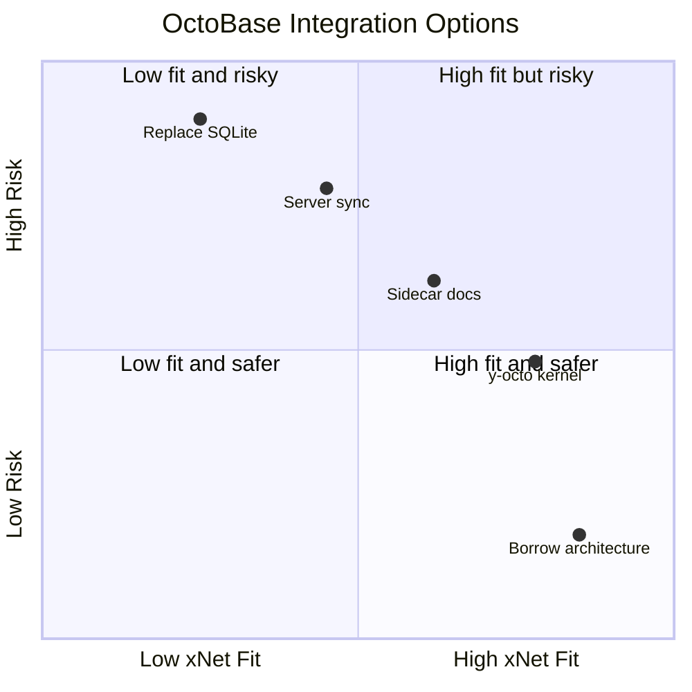

## Why Replacement Is Hard

Replacing SQLite sounds simpler than it is because SQLite is not the whole xNet database. The current system combines:

- SQLite as persistence engine.
- `NodeStore` as event-sourced domain model.
- `Change<T>` as signed/auditable sync unit.
- Per-property LWW conflict resolution for structured nodes.
- Yjs for character/block/document-level CRDT state.
- UCAN/grants/offline policy as mutation authorization.
- React hooks and data bridges as public app API.
- Query descriptors, cache invalidation, and planned SQL pushdown as read model.

OctoBase might cover some lower layers, but it does not obviously cover xNet's full semantic contract.

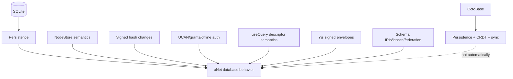

## Why Sidecar Is Plausible

Document/canvas internals are the strongest match:

- AFFiNE and BlockSuite are block-based.
- OctoBase was designed for AFFiNE.
- OctoBase README explicitly mentions rich text editor, multidimensional tables, and drawing boards.
- xNet already separates node metadata/properties from `documentContent`/Yjs state.
- xNet exploration `0125` already recommends trying BlockSuite surfaces without replacing xNet core.

This suggests an xNet node can wrap an OctoBase document:

| xNet wrapper field | Meaning |
| --- | --- |
| `schemaId` | `xnet://xnet.fyi/Page` or experimental `xnet://xnet.fyi/BlockSuitePage` |
| `contentEngine` | `octobase-blocksuite` |
| `externalDocId` | OctoBase workspace/doc ID |
| `title` | projected title for navigation/search |
| `textPreview` | projected plain text for FTS/export |
| `links` | projected page/blob/node references |
| `updatedAt` | xNet-level last meaningful projection update |
| grants/policies | xNet canonical permission state |

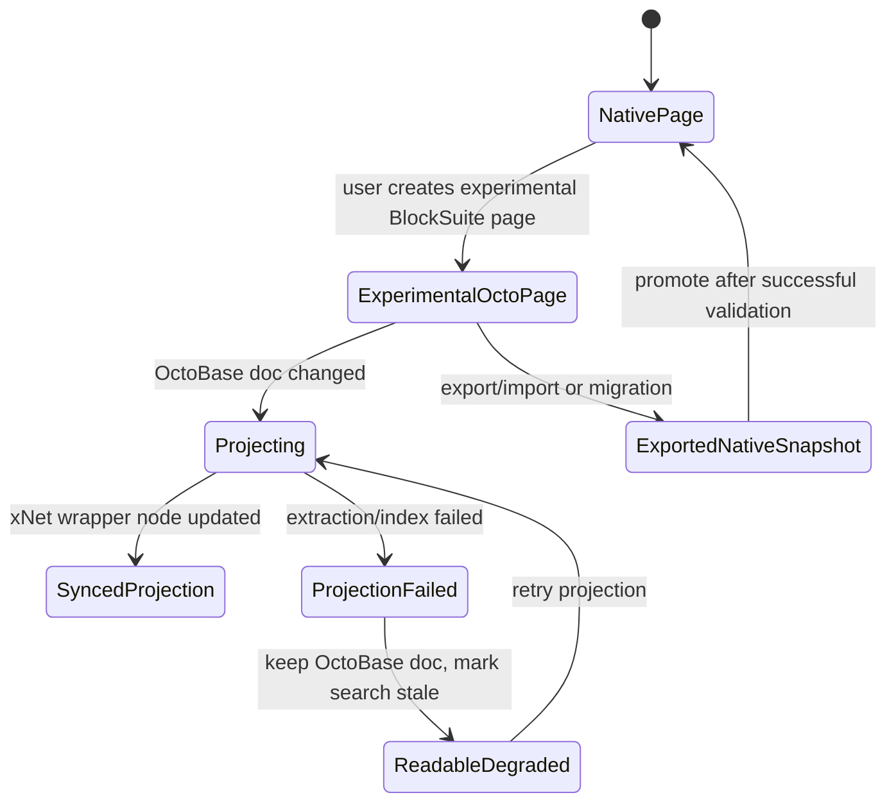

## Proposed Architecture: Sidecar First

The sidecar design has three layers:

1. **xNet canonical layer:** nodes, schemas, permissions, signed changes, query/search projections, app navigation, history/audit metadata.
2. **OctoBase document layer:** experimental BlockSuite document/canvas CRDT state, block-level operations, optional OctoBase blobs/indexes.
3. **Projection bridge:** extracts title, text, links, embeds, blob references, outline, and coarse statistics into xNet nodes.

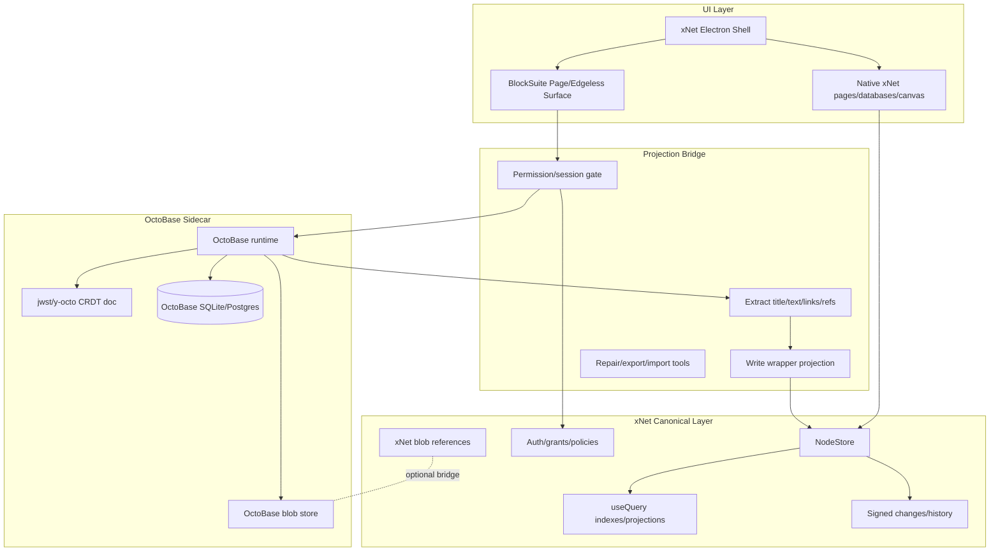

## Storage Layout Choices

### Choice 1: Separate SQLite Files

Use one xNet SQLite file and one OctoBase SQLite file per workspace/profile.

Benefits:

- Lowest migration and schema-collision risk.
- Each engine owns its own migrations.
- Easy to delete/disable experimental OctoBase state.
- Safer if OctoBase schema changes rapidly.

Costs:

- Backup/export must include both files.
- Transactions cannot atomically span xNet and OctoBase.
- Repair tools must reconcile dangling wrapper nodes and dangling OctoBase docs.

Verdict: **Best first prototype.**

### Choice 2: Same SQLite Database, Separate Tables

Let OctoBase use the same SQLite file with its own tables.

Benefits:

- Single file backup.
- Potential future cross-table diagnostics.
- Fewer data directory artifacts.

Costs:

- Migration ownership risk.
- PRAGMA/WAL/locking expectations may conflict.
- Harder to remove if the experiment fails.

Verdict: **Avoid until OctoBase schema/migration behavior is understood.**

### Choice 3: OctoBase Owns Storage, xNet Uses Adapter

All xNet nodes and documents go through OctoBase.

Benefits:

- Theoretically unified local-first database.

Costs:

- Highest semantic risk.
- Requires full adapter parity and data migration.
- Risks losing xNet's current strengths.

Verdict: **Long-term research only.**

## Sync and Authorization Boundaries

The biggest correctness issue is authorization. CRDT engines are excellent at merging accepted operations; they do not automatically decide whether a remote operation should have been accepted under xNet's policy.

xNet should preserve these invariants:

- All user-visible writes are gated by xNet auth before local application.
- All remote document updates are signed, verified, rate-limited, and scored before application.
- xNet wrapper nodes remain the source of truth for grants, membership, share state, deletion/restoration, and external references.
- Projection updates are deterministic and replayable from OctoBase state.
- Unauthorized CRDT changes can be quarantined or blocked before affecting canonical xNet projections.

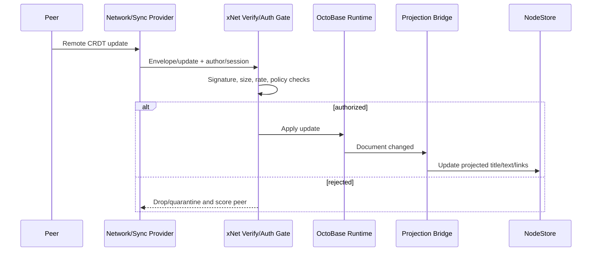

## Licensing and Distribution Risk

This is a hard gate, not an implementation detail.

Observed license facts:

| Project | Observed license note | Implication |
| --- | --- | --- |
| OctoBase | README says current repository code is AGPL-3.0 while under active development, with intent to switch to MPL 2.0 or a looser license after components are ready | embedding/distributing inside xNet may impose AGPL obligations; must get legal/product decision first |
| `y-octo` | README says MIT | easier to evaluate as a kernel dependency |
| BlockSuite repo | GitHub page lists MPL-2.0 | file-level copyleft obligations if modifying/vendoring; dependency usage likely manageable |
| `@blocksuite/store` npm metadata | `MIT`, version `0.22.4` during check | package-level licensing may differ by package; verify lockfile package licenses before adoption |
| `@blocksuite/presets` npm metadata | `MPL-2.0`, version `0.19.5` during check | must treat preset/editor package license carefully |
| AFFiNE | README describes CE as free for self-host under MIT, with separate license files | product fork still needs detailed license/trademark review |

Recommendation: **do not add OctoBase as a runtime dependency until a licensing decision is explicit**. If the goal is internal-only research, keep it outside release builds and document the boundary.

## Packaging Risk

OctoBase is Rust-heavy and appears to prioritize native/server/mobile bindings. The public Rust workspace includes `jwst-wasm`, but the README's binding status calls out Java and Swift as in progress, and public npm checks did not find an `@toeverything/octobase` package.

Likely integration routes:

| Route | Feasibility | Notes |
| --- | --- | --- |
| NPM package | Unknown/low for OctoBase itself | `@toeverything/octobase` returned npm 404 during exploration |
| Git dependency | Possible but brittle | pulls large Rust repo; build and API stability risk |
| NAPI module | Plausible for Electron/server | must handle Electron ABI rebuilds like `better-sqlite3`, `sharp`, `usearch` |
| WASM module | Plausible for web/Electron | must validate performance, persistence, OPFS/worker story |
| Standalone sidecar server | Plausible for lab | easier isolation, worse app integration and startup complexity |
| Adopt `y-octo` package/crate only | More plausible | smaller scope; still needs package availability and compatibility tests |

## Implementation Plan

### Phase 0: Gate Checks

Do this before writing integration code.

- [ ] Confirm OctoBase's current license for the exact revision/package that would be used.
- [ ] Decide whether AGPL code may be used in internal experiments, release builds, or not at all.
- [ ] Confirm whether OctoBase has a supported JavaScript, NAPI, or WASM distribution path.
- [ ] Confirm whether the public APIs can open/create documents without AFFiNE app services.
- [ ] Confirm whether BlockSuite can use OctoBase-backed documents directly or only AFFiNE-internal adapters.
- [ ] Confirm binary compatibility between OctoBase/y-octo updates and xNet's existing Yjs signed-envelope pipeline.
- [ ] Confirm whether OctoBase can run with a separate SQLite file inside Electron without server processes.
- [ ] Confirm startup/shutdown behavior, compaction, migration, and corruption handling.

### Phase 1: Black-Box Lab Prototype

Keep this outside xNet app flows at first.

- [ ] Create a throwaway `tmp/octobase-lab/` workspace or external research branch.
- [ ] Build or run OctoBase locally using the documented Rust server path.
- [ ] Create a document/workspace and persist it with SQLite.
- [ ] Apply concurrent edits from two clients or processes.
- [ ] Verify offline edits merge after reconnect.
- [ ] Inspect generated SQLite files/tables and storage growth patterns.
- [ ] Export raw update/state bytes and test whether Yjs can read/apply them if APIs allow.
- [ ] Record exact build steps, binary sizes, startup time, and failure modes.

### Phase 2: xNet Sidecar Prototype

Feature flag everything.

- [ ] Add an experimental `contentEngine: 'octobase-blocksuite'` marker to wrapper page nodes.
- [ ] Store `externalDocId` or equivalent sidecar pointer in the xNet wrapper node.
- [ ] Keep the OctoBase data file separate from the xNet SQLite file.
- [ ] Add a minimal `OctoBaseDocumentProvider` interface that hides all OctoBase-specific APIs.
- [ ] Open a single experimental document in Electron.
- [ ] Gate local edits through xNet `can('write')` or equivalent session permission.
- [ ] Project title and plain text into xNet properties after edits.
- [ ] Project links/blob refs into xNet properties if extraction APIs allow it.
- [ ] Mark projection status as fresh/stale/failed.
- [ ] Add deletion cleanup for experimental docs, but never hard-delete OctoBase data without backup in early prototypes.

### Phase 3: Sync Boundary Prototype

- [ ] Decide whether OctoBase sync is disabled, local-only, or bridged to xNet sync in the prototype.
- [ ] If bridged, wrap remote CRDT updates in xNet signed envelopes before transport.
- [ ] Reuse xNet size limits, rate limits, peer scoring, and replay protection before applying updates.
- [ ] Verify remote updates cannot mutate xNet wrapper metadata directly.
- [ ] Verify unauthorized updates are rejected or quarantined before projection.
- [ ] Add deterministic replay tests from an update log into the same projected wrapper state.
- [ ] Add conflict/reconnect tests with two Electron instances if the prototype reaches UI level.

### Phase 4: Query, Search, and Export

- [ ] Define projection fields: title, text preview, outline, links, embeds, blob refs, block count, updated timestamp.
- [ ] Make xNet `useQuery` operate only on projected fields, not OctoBase internals.
- [ ] Add FTS coverage for projected text.
- [ ] Add stale-index UI behavior for projection failures.
- [ ] Build export to markdown/HTML/snapshot if BlockSuite/OctoBase APIs expose it.
- [ ] Build import/migration path back into xNet-native page content if the experiment is abandoned.
- [ ] Validate backups include both xNet and OctoBase files.

### Phase 5: Evaluation and Kill Switch

- [ ] Measure cold open, warm open, edit latency, memory, storage growth, and compaction behavior.
- [ ] Compare against current xNet Yjs/Tiptap/SQLite path on the same documents.
- [ ] Test 10, 100, 1,000, and 10,000 block documents if feasible.
- [ ] Test media-heavy documents and canvas-heavy documents.
- [ ] Test app upgrade/downgrade and corrupted sidecar recovery.
- [ ] Keep a one-click feature flag kill switch that hides OctoBase surfaces while preserving xNet wrapper nodes.
- [ ] Decide whether to continue, adopt only `y-octo`, or discard OctoBase integration.

## Validation Checklist

### Functional Validation

- [ ] Create experimental OctoBase-backed page.
- [ ] Reopen after app restart.
- [ ] Edit title, paragraph, list, nested blocks, and embedded media.
- [ ] Edit edgeless/canvas content if supported.
- [ ] Duplicate page.
- [ ] Delete and restore page.
- [ ] Export page.
- [ ] Import or migrate page to xNet-native content.
- [ ] Search finds projected page text.
- [ ] Links to other xNet nodes resolve.
- [ ] Missing sidecar document shows recoverable error UI.

### Sync Validation

- [ ] Two clients edit different blocks offline and merge.
- [ ] Two clients edit the same block offline and merge predictably.
- [ ] Remote update with invalid signature is rejected.
- [ ] Remote update from user without write permission is rejected or quarantined.
- [ ] Oversized update is rejected.
- [ ] High-frequency update stream is rate-limited.
- [ ] Replay update does not duplicate state.
- [ ] Projection after sync is deterministic.

### Storage Validation

- [ ] xNet SQLite and OctoBase SQLite are backed up together.
- [ ] OctoBase file can be missing without crashing the whole app.
- [ ] xNet wrapper node can detect dangling `externalDocId`.
- [ ] OctoBase orphan docs can be listed and repaired.
- [ ] Storage size remains bounded after repeated edits or compaction is available.
- [ ] WAL/checkpoint behavior does not block xNet SQLite.
- [ ] Migrations are idempotent and versioned.

### Security Validation

- [ ] OctoBase document state cannot change xNet wrapper permissions.
- [ ] OctoBase projection cannot inject privileged schema IDs or grants.
- [ ] Blob references are validated before rendering.
- [ ] Export/import strips or normalizes unsafe embedded content.
- [ ] Local files are stored under the correct profile/workspace directory.
- [ ] Encrypted-workspace behavior is defined before release use.
- [ ] Logs do not expose document content, tokens, private keys, or sensitive blob paths.

### Performance Validation

- [ ] Cold startup overhead is measured.
- [ ] Opening first OctoBase-backed doc is measured.
- [ ] Typing latency is measured under normal and large docs.
- [ ] Memory overhead is measured with 1, 10, and 50 open docs.
- [ ] Projection cost is measured and debounced.
- [ ] SQLite lock contention is measured if same process uses both databases.
- [ ] Native module rebuild requirements are documented for Electron.

### Product Validation

- [ ] Users can tell experimental pages from stable pages.
- [ ] Feature flag is off by default until validation passes.
- [ ] Failure mode preserves access to page metadata and recovery/export options.
- [ ] Migration path exists before users create important data.
- [ ] Documentation clearly states experimental status.

## Migration Strategy If It Works

If the sidecar proves valuable, do not immediately migrate all pages. Add format coexistence.

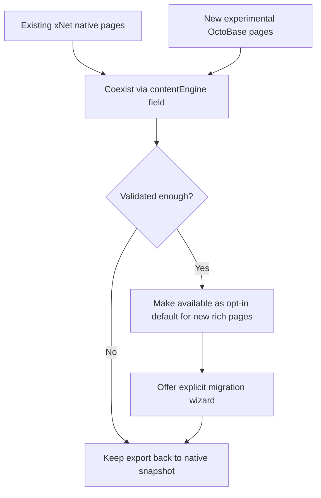

Migration rules:

- [ ] Never silently convert existing xNet-native pages.
- [ ] Always preserve original `documentContent` until migration is explicitly accepted.
- [ ] Add a reversible export or snapshot before conversion.
- [ ] Preserve node IDs for app links where possible.
- [ ] Preserve xNet grants and wrapper metadata exactly.
- [ ] Treat embedded databases as xNet-native views unless OctoBase table semantics are proven compatible.
- [ ] Treat page/canvas links as xNet node references, not OctoBase-only IDs.

## Open Questions

| Question | Why it matters | Owner/next action |
| --- | --- | --- |
| Can OctoBase be embedded in Electron as a supported JS/NAPI/WASM dependency? | Determines whether sidecar is feasible without a server | build spike |
| Does current OctoBase licensing permit xNet distribution? | Hard gate for shipping | legal/product decision |
| Can BlockSuite use OctoBase directly outside AFFiNE? | Determines UI integration complexity | source/API spike |
| Can OctoBase/y-octo produce/consume normal Yjs updates? | Determines compatibility with xNet signed sync | CRDT compatibility tests |
| Can xNet auth gate every OctoBase write/update? | Required for security | adapter design spike |
| How does OctoBase handle encryption at rest? | xNet security requirements may differ | security spike |
| What are OctoBase's compaction/GC semantics? | Long-lived local-first apps need bounded storage | storage spike |
| How stable are OctoBase schemas/APIs? | Pre-1.0 status increases migration risk | version pin + upgrade test |
| Can OctoBase full-text indexing be accessed as a library? | Could improve multilingual search | indexing spike |
| Is `y-octo` enough without OctoBase? | Lower-risk core acceleration path | native kernel spike |

## Recommended Next Actions

1. **Run a license/distribution gate before code integration.** If AGPL is unacceptable for runtime dependencies, limit OctoBase to external research and focus on `y-octo` plus BlockSuite.
2. **Create a small OctoBase lab outside xNet app code.** Prove build, embedded runtime, document create/open/edit/persist, and two-client merge.
3. **In parallel, run a `y-octo` compatibility spike.** Test Yjs binary update compatibility, signed envelope compatibility, performance, and Electron packaging.
4. **Do not alter `NodeStorageAdapter` for OctoBase yet.** Replacement should wait until sidecar and kernel spikes produce concrete evidence.
5. **Continue SQLite read-scaling work from exploration `0123`.** It remains valuable regardless of OctoBase outcome.
6. **If BlockSuite remains the primary AFFiNE integration path, design `contentEngine` coexistence now.** That future-proofs xNet for `native-yjs`, `blocksuite-yjs`, and possibly `octobase-blocksuite` documents.

## Bottom Line

OctoBase is a strong architectural signal and a credible AFFiNE-proven technology family, but it is not currently a safe drop-in SQLite replacement for xNet. xNet's database is not merely SQLite; it is SQLite plus signed event sourcing, NodeStore semantics, schema federation, Yjs security, React query contracts, and authorization.

The best path is:

- [x] Treat OctoBase as worth exploring.
- [x] Do not replace SQLite/NodeStore now.
- [x] Prototype OctoBase only as an isolated document sidecar if licensing allows.
- [x] Evaluate `y-octo` independently as a native CRDT kernel candidate.
- [x] Keep xNet canonical for identity, auth, query, metadata, audit, and app-level data.
- [x] Borrow OctoBase's modular architecture regardless of adoption.

This gives xNet the upside of learning from AFFiNE's stack without surrendering the xNet architecture that already exists and is better aligned with the project's trust, authorization, and node-native goals.
