# 0127 - xNet Filesystem Integration and Global File Namespace

> **Status:** Exploration  
> **Tags:** filesystem, electron, local-first, indexing, blobs, sync, global-namespace, search, files, storage  
> **Created:** 2026-05-15  
> **Related:** `0126_[_]_OCTOBASE_INTEGRATION_FOR_XNET_STORAGE_AND_COLLABORATION.md`, `0125_[_]_AFFINE_AS_XNET_UI_LAYER.md`, `0123_[_]_SQLITE_NODE_STORE_READ_SCALING_AND_AUTOMATIC_INDEXING.md`, `0112_[_]_UNIVERSAL_CLIPPER_AND_AI_KNOWLEDGE_GRAPH_INGESTION.md`, `0074_[x]_ELECTRON_IPC_NODE_STORAGE.md`, `0072_[x]_INDEXEDDB_TO_SQLITE_MIGRATION.md`, `0026_[x]_NODE_CHANGE_ARCHITECTURE.md`

## Executive Summary

xNet should treat the user's filesystem as a first-class local data source, not as an afterthought attached to upload buttons. The Electron app is installed on a personal computer, already runs a privileged main process and data utility process, already persists xNet data in SQLite, and already has content-addressed blob primitives. That makes filesystem integration one of the highest-leverage ways to make xNet feel like a unified personal operating layer rather than another silo.

The core recommendation is **start with indexed folders, not filesystem mutation**.

1. **Phase 1: Read-only folder indexing.** Let users grant a folder, scan metadata and selected text, store an `IndexedFile` node for each file, keep path/device metadata local by default, and link files into pages, canvases, tasks, and search results.
2. **Phase 2: Optional blob capture.** For important files, import bytes into xNet's content-addressed blob store while retaining the original filesystem path as a local source reference.
3. **Phase 3: xNet managed folders.** Add explicit folders where xNet owns writes, exports pages/databases/canvases to human-readable files, and stores sidecar manifests to preserve node IDs, schemas, signatures, and CIDs.
4. **Phase 4: Global file identity.** Use content hashes, stable local file IDs where available, device IDs, folder roots, and user-confirmed aliases to unify the same file across devices even when paths differ.
5. **Phase 5: Bidirectional sync and virtual filesystem.** Only after conflict semantics are proven, allow selected xNet nodes to materialize into user-visible files and expose safe `xnet://` or `xnet-file://` protocol URLs for previews and deep links.

The ideal UX is not "upload file to app". It is:

- "My local files appear in xNet search when I opt in."
- "Dropping a PDF onto a canvas creates a durable object with a local path, a content hash, and optional synced bytes."
- "A page can reference `~/Documents/Contracts/lease.pdf` without copying it, then promote it to a synced blob when I share the page."
- "A file edited outside xNet updates its xNet preview automatically."
- "A file captured on one computer can be found on another by content identity, even if the path is different."
- "xNet pages and databases can also be exported into a normal folder that works with Finder, VS Code, Git, backup tools, and long-term archival workflows."

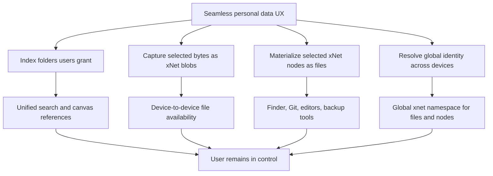

## Research Method

Google Search returned `403` in this environment, so direct primary-source fetches and codebase inspection were used.

Primary external sources checked:

| Source | Relevant facts |
| --- | --- |
| Electron `dialog` docs | Native open/save dialogs support files, directories, multiple selections, macOS security scoped bookmarks for MAS builds, and platform caveats. |
| Electron `shell` docs | `shell.showItemInFolder`, `shell.openPath`, and `shell.trashItem` provide native file manager integration, but sandboxed renderers cannot use `shell` directly. |
| Electron security tutorial | Filesystem access increases risk; keep `nodeIntegration` disabled, keep `contextIsolation` and sandboxing, validate IPC senders, avoid `file://`, prefer custom protocols, and do not expose raw Electron APIs. |
| Electron `protocol` docs | `protocol.handle` can serve safe custom schemes; standard and secure custom schemes must be registered before app ready; path traversal checks are required. |
| Electron `utilityProcess` docs | Utility processes provide Node.js child processes with MessagePort messaging, matching xNet's existing data-process shape. |
| Node.js `fs.watch` docs | Native watching is platform-dependent and has caveats around recursive watching, inode behavior, filename availability, and network filesystems. |
| Chokidar README | Cross-platform watcher normalizes events, supports recursive watching, atomic write handling, chunked write stabilization, depth limits, filtering, and polling fallback, but recursive watchers can consume many resources. |
| Linux `inotify(7)` man page | Inotify is not recursive, has queue overflow, watch limits, rename races, no user/process attribution, and requires cache rebuild paths. |
| Microsoft `ReadDirectoryChangesW` docs | Windows can watch subtrees and notify on file names, directory names, attributes, size, write time, access time, creation time, and security changes; buffer overflow requires re-enumeration. |
| MDN File System API | Web File System Access uses user-granted handles, supports directory handles and OPFS, and handle access is permission gated. |
| Chrome File System Access article | Handles can be serialized to IndexedDB, permissions may need re-verification, writes require user permission, directory enumeration is available, and OPFS differs from user-visible files. |
| web.dev OPFS article | OPFS is private to the origin, quota-bound, not user-visible, fast for app-local storage, and available across major browsers for origin-private use. |
| IPFS site | Content addressing retrieves and verifies data based on content fingerprints rather than name or location. |
| Hyperdrive README | Hyperdrive models a secure real-time distributed filesystem with versioned entries, blobs, symlinks, snapshots, watchers, diffs, and mirroring. |
| Tahoe-LAFS site | Least-authority decentralized storage distributes encrypted data across servers and preserves privacy/security despite server compromise. |
| SQLite FTS5 docs | FTS5 supports full-text indexing, relevance ranking, prefix indexes, custom tokenizers, contentless/external-content tables, and rebuild workflows. |

xNet source areas checked:

| Area | Evidence | Filesystem relevance |
| --- | --- | --- |
| Electron data path | `apps/electron/src/main/index.ts` sets `dataPath` and `dbPath` under `app.getPath('userData')`. | Existing place for local index DBs, manifests, and profile-isolated roots. |
| Electron sandbox boundary | `apps/electron/src/main/index.ts` creates a sandboxed, context-isolated renderer with `nodeIntegration: false`. | Filesystem APIs must stay in main/data process behind narrow IPC. |
| Data utility process | `apps/electron/src/data-process/data-service.ts` already manages SQLite, Yjs, WebSocket sync, blobs, and node operations off the renderer. | Natural home for scanning, hashing, extraction, and watcher state. |
| IPC preload | `apps/electron/src/preload/index.ts` exposes narrow APIs via `contextBridge`. | Filesystem capabilities should follow this style rather than exposing `fs` or raw paths broadly. |
| NodeStore adapter | `packages/data/src/store/types.ts` defines `NodeStorageAdapter`; `SQLiteNodeStorageAdapter` persists changes, nodes, document content. | Filesystem artifacts can be nodes with signed changes and materialized properties. |
| SQLite schema | `packages/sqlite/src/schema.ts` has `nodes`, `node_properties`, `changes`, `yjs_state`, `blobs`, `nodes_fts`. | Index metadata and full-text content can fit current storage, with extra tables later. |
| Blob store | `packages/storage/src/blob-store.ts`, `packages/storage/src/chunk-manager.ts`, `packages/data/src/blob/blob-service.ts`. | Existing content addressing and chunk manifests can store imported file bytes. |
| File property | `packages/data/src/schema/properties/file.ts` defines `FileRef` with `cid`, `name`, `mimeType`, `size`. | Useful for captured files, but not enough for path-backed local files. |
| Media asset schema | `packages/data/src/schema/schemas/media-asset.ts` stores a primary file and media metadata. | Can represent promoted/captured files, thumbnails, and canvas media objects. |
| External reference schema | `packages/data/src/schema/schemas/external-reference.ts` normalizes external URLs. | Path-backed files need a sibling concept: local external artifacts with permissions and device scope. |
| Canvas external refs | `packages/canvas/src/types.ts` includes `external-reference` and `media` node kinds plus source IDs. | Files can become drag/drop canvas objects without inventing a new surface. |
| Local API | `apps/electron/src/main/local-api.ts` exposes local xNet data to external integrations with token auth. | Future filesystem index APIs can feed MCP, AI agents, and OS automation. |

## Current xNet Shape

xNet already has enough infrastructure to integrate the filesystem without a rewrite.

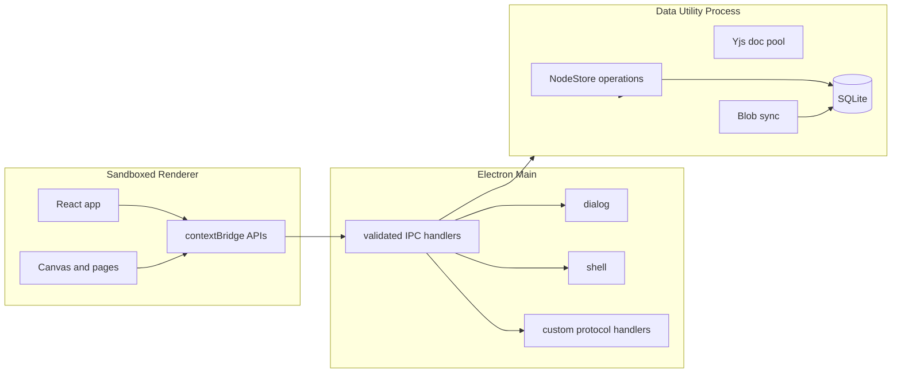

Important current constraints:

| Constraint | Impact |
| --- | --- |
| Renderer is sandboxed and has no Node integration. | Good. Do not weaken this for filesystem features. |
| Main/data process can use Node `fs`. | File scanning and watching should live there. |
| SQLite database lives under app user data. | Index state is profile-local and backupable. |
| Blob bytes are currently in SQLite blobs table. | Useful for initial capture, but large file storage may later need filesystem-backed CAS. |
| `FileRef` assumes a `cid`. | Need a separate local-file reference type for files not copied into xNet. |
| `ExternalReferenceSchema` is URL-centric. | Need `IndexedFile`/`LocalFileReference` rather than overloading web URLs. |
| `nodes_fts` exists. | Filesystem text previews can join unified search after extraction. |
| Canvas supports `external-reference` and `media`. | Files can be visible, spatial objects with source IDs. |

## Product Vision

xNet should become the user's personal data fabric across app data, documents, files, URLs, canvases, databases, tasks, and AI context.

The filesystem integration should make these workflows feel native:

| Workflow | User experience | System behavior |
| --- | --- | --- |
| Folder indexing | User grants `Documents/Research`; xNet search includes PDFs, Markdown, images, and project files. | xNet stores path, stats, hashes, extracted text, thumbnails, and local permission state. |
| Canvas drop | User drags a local PDF/image/folder onto canvas. | xNet creates an `IndexedFile` or `MediaAsset`, draws a card, watches for changes. |
| Page mention | User types `@lease.pdf`. | Resolver searches xNet nodes, indexed local files, captured blobs, and external references. |
| Promote to synced | User chooses "Make available on my devices". | xNet chunks file, stores blob CIDs, syncs manifest and policy. |
| Share page | User shares a page referencing local files. | Recipient sees which files are included, missing, local-only, or requestable. |
| Managed folder | User creates an "xNet folder" on disk. | Pages, canvases, database exports, and sidecar manifests are materialized safely. |
| Global namespace | User searches "budget.xlsx" on a second device. | xNet resolves by content hash, known aliases, device path history, and sync availability. |
| AI context | User asks "summarize the design docs in this folder". | AI agent gets consent-scoped file index snippets and can request full content selectively. |

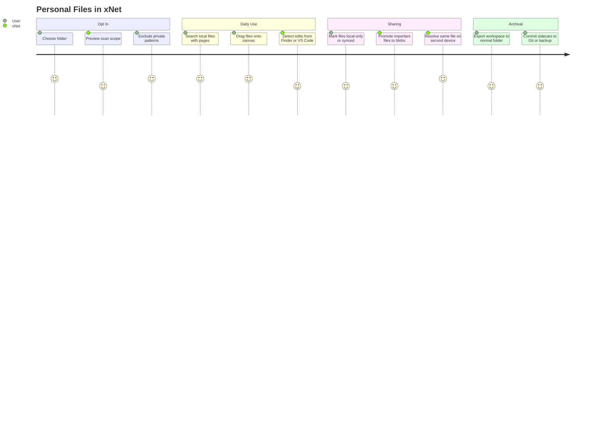

## Design Principles

1. **Consent first.** xNet indexes only user-granted folders or explicit drag/drop files.
2. **Read-only by default.** First implementation never modifies user files.
3. **Local paths are sensitive.** Paths can reveal names, clients, projects, and personal information. Sync path metadata only when the user opts in.
4. **Metadata before bytes.** Indexing a file is not the same as copying it into xNet.
5. **Content identity is stronger than path identity.** Paths move; hashes and stable file IDs help reconnect objects.
6. **Keep renderer unprivileged.** Filesystem operations must stay in main/data processes behind typed IPC.
7. **Support deletion and revocation.** Users must be able to stop indexing a folder and remove local index data.
8. **Keep the filesystem understandable.** Managed xNet folders should be human-readable where possible, with sidecars for exact xNet semantics.
9. **Avoid pretending all files are CRDTs.** Binary files need versioning, snapshots, and explicit conflict UX, not magic merge claims.
10. **Make failure visible.** Missing permissions, moved files, failed extraction, hash mismatch, and un-synced bytes should be explicit states.

## Integration Modes

There are five distinct modes. Mixing them too early would create semantic confusion.

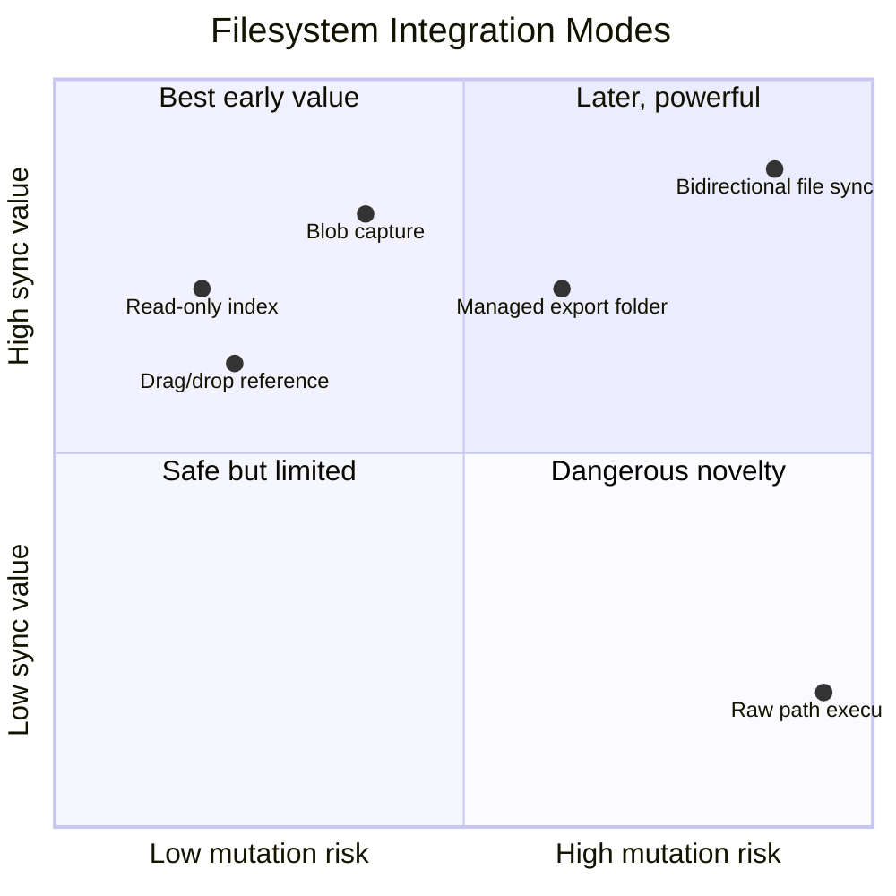

### Mode A: Read-Only Folder Index

User grants a folder. xNet scans metadata, hashes samples or full files based on policy, extracts text for supported types, generates thumbnails, and builds searchable `IndexedFile` nodes.

This is the best first product because it improves search, AI context, canvases, and references without modifying user data.

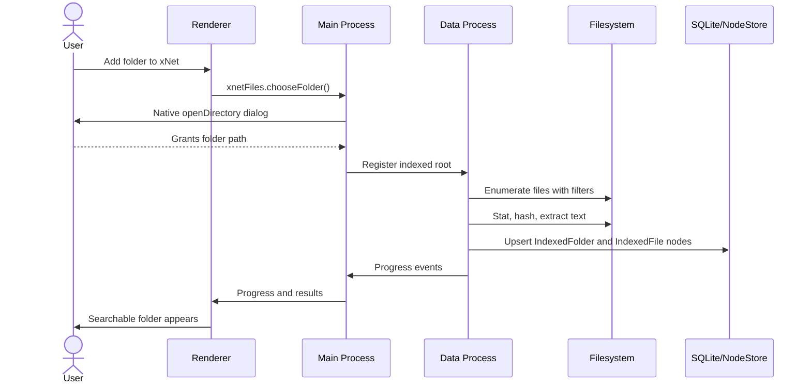

### Mode B: Local File Reference

A page, task, database row, or canvas object references a local file path without copying bytes. This should be an explicit local-only object. It can display "Available on this device" and expose "Reveal in Finder" or "Open with default app".

This is different from `FileRef`, which currently assumes a content-addressed `cid`.

### Mode C: Content Capture to xNet Blob

For important files, xNet copies bytes into its content-addressed blob store using `BlobStore` and `ChunkManager`. The file becomes available for sync and sharing based on policy.

This should be a user-visible action:

- "Keep as local reference"
- "Copy into xNet"
- "Copy into xNet and sync to my devices"
- "Copy into shared workspace"

### Mode D: Managed xNet Folder

xNet creates or adopts a folder where it is allowed to write. Examples:

- `~/Documents/xNet/Pages/*.md`
- `~/Documents/xNet/Databases/*.csv` or `*.jsonl`
- `~/Documents/xNet/Canvases/*.xnet-canvas.json`
- `~/Documents/xNet/.xnet/manifest.jsonl`
- `~/Documents/xNet/.xnet/blobs/cid/...`

This makes xNet interoperable with Finder, VS Code, Git, rsync, Syncthing, Time Machine, and normal backups.

### Mode E: Bidirectional Sync With External Files

xNet watches user-visible files and writes back changes from xNet. This is powerful but risky. It should only happen inside managed roots or after explicit per-file opt in.

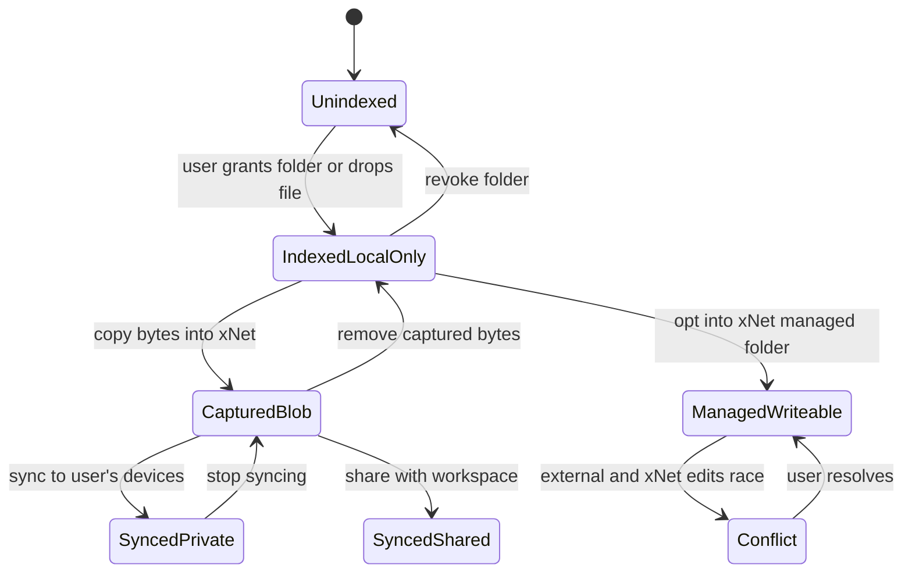

## Proposed Data Model

Add filesystem-specific schemas rather than overloading current `MediaAssetSchema` or `ExternalReferenceSchema`.

### Core Schemas

| Schema | Purpose | Sync default |
| --- | --- | --- |
| `xnet://xnet.fyi/IndexedFolder@1.0.0` | A user-granted root folder on one device. | Private metadata only, path local by default. |
| `xnet://xnet.fyi/IndexedFile@1.0.0` | A known local filesystem item with metadata, optional content hash, optional extracted text. | Metadata policy-controlled; local path not synced by default. |
| `xnet://xnet.fyi/FileIdentity@1.0.0` | Cross-device identity cluster for paths/hashes that appear to be the same file. | Syncable, no raw local path by default. |
| `xnet://xnet.fyi/FileSnapshot@1.0.0` | Captured immutable file version backed by CIDs/chunk manifest. | Syncable based on blob policy. |
| `xnet://xnet.fyi/ManagedFolder@1.0.0` | A folder where xNet is allowed to materialize and read sidecars. | Private unless shared. |
| `xnet://xnet.fyi/ExtractionJob@1.0.0` | Background extraction/hash/thumbnail state and errors. | Local by default. |

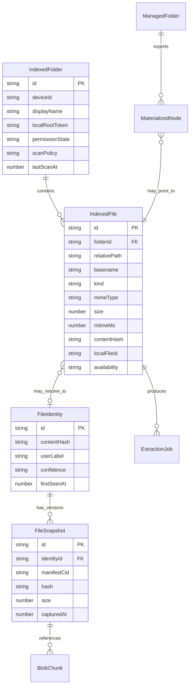

### IndexedFile Properties

An initial `IndexedFile` can be stored as a node property set:

| Property | Type | Notes |
| --- | --- | --- |
| `name` | text | Basename only. Safer to sync than full path. |
| `relativePath` | text | Relative to granted root; path policy controls sync. |
| `rootId` | relation | Points to `IndexedFolder`. |
| `deviceId` | text | Stable local device identity. Syncable if user allows device graph. |
| `kind` | select | `file`, `directory`, `symlink`, `package`, `unknown`. |
| `mimeType` | text | Detected by extension and/or sniffing. |
| `extension` | text | Useful for filters. |
| `size` | number | File bytes. |
| `mtimeMs` | number | Last modified time. |
| `birthtimeMs` | number | Optional, platform-dependent. |
| `localFileId` | text | Platform-specific stable ID if implemented. Local-only by default. |
| `quickFingerprint` | text | Size + mtime + partial hash. Local-only or private sync. |
| `contentHash` | text | Full BLAKE3 when hashed. Can resolve across devices. |
| `snapshotCid` | file/blob ref | Present only if captured. |
| `extractedText` | text | Bounded text or summary for FTS; may be local-only. |
| `thumbnailCid` | file/blob ref | Optional generated preview. |
| `availability` | select | `local`, `missing`, `captured`, `synced-private`, `synced-shared`. |
| `lastIndexedAt` | number | Scan state. |
| `lastSeenAt` | number | Missing detection. |
| `error` | text | Last extraction/hash/open error. |

### Local Secrets and Path Tokens

Do not store raw absolute paths in syncable node properties by default. Use a local-only table or encrypted device-local property for sensitive path material.

Possible local SQLite side tables:

| Table | Purpose |
| --- | --- |
| `filesystem_roots` | Maps `root_id` to absolute path, bookmark data, permission state, scan settings, local-only flags. |
| `filesystem_entries` | Fast lookup by root + relative path + local file ID + content hash. |
| `filesystem_text_index` | Optional external-content FTS index for extracted text if `nodes_fts` becomes too generic. |
| `filesystem_jobs` | Queue for hashing, thumbnails, OCR, PDF parsing, retry state. |
| `filesystem_events` | Watcher event log for debugging and missed-event rebuilds. |

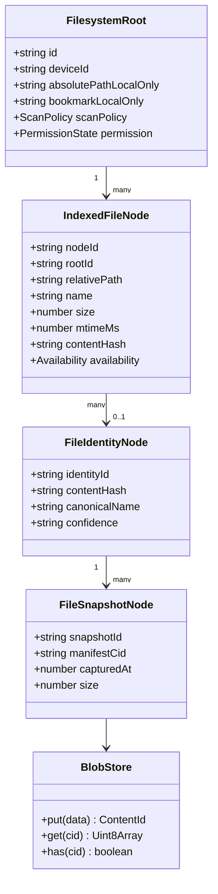

## Global Namespace Model

xNet can provide a unified namespace without pretending every device has identical paths.

### Namespace Layers

| Namespace | Example | Meaning |
| --- | --- | --- |
| Node identity | `xnet://node/<node-id>` | Stable xNet node, independent of filesystem. |
| Content identity | `xnet://cid/blake3/<hash>` | Immutable bytes. Great for dedup and verification. |
| File identity cluster | `xnet://file/<identity-id>` | User-level concept that can have many paths and versions. |
| Device-local path | `xnet://device/<device-id>/root/<root-id>/path/<relative-path>` | A local place where a file was observed. Sensitive. |
| Managed workspace path | `xnet://workspace/<workspace-id>/files/<path>` | xNet-owned or shared materialized path. |
| Human alias | `xnet://me/files/contracts/lease` | User-friendly alias that resolves to node/content/device paths. |

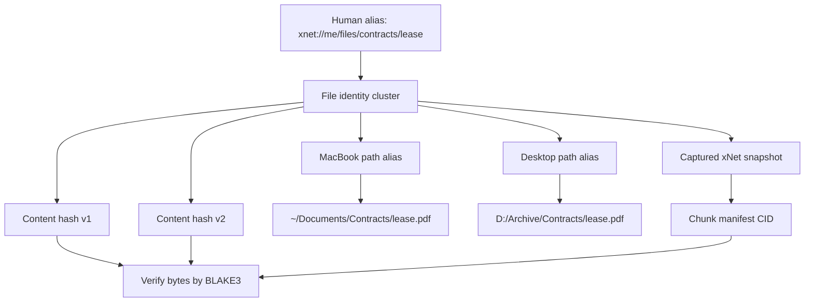

### Identity Resolution Heuristics

No single signal is enough. Use layered confidence.

| Signal | Strength | Problem |
| --- | --- | --- |
| Full content hash | Very high | Expensive for huge files; changes after edit. |
| Chunk manifest root | Very high | Requires capture or full hash. |
| Platform file ID/inode + volume | High local only | Not portable across devices or some filesystems. |
| Relative path under synced folder | Medium | Paths diverge and folders may be renamed. |
| Size + mtime + partial hash | Medium | Collisions possible and mtime granularity differs. |
| Filename + extracted title | Low | Human useful, not unique. |
| User confirmation | Very high | Requires UX. |

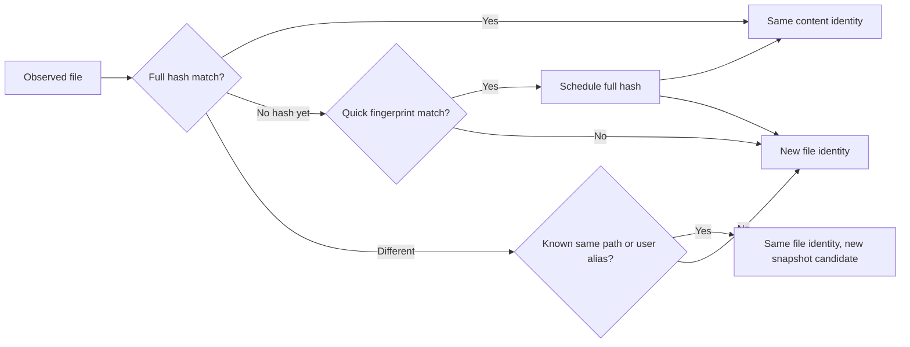

## Folder Indexing Architecture

### Scanner Pipeline

The scanner should be incremental, cancellable, and conservative.

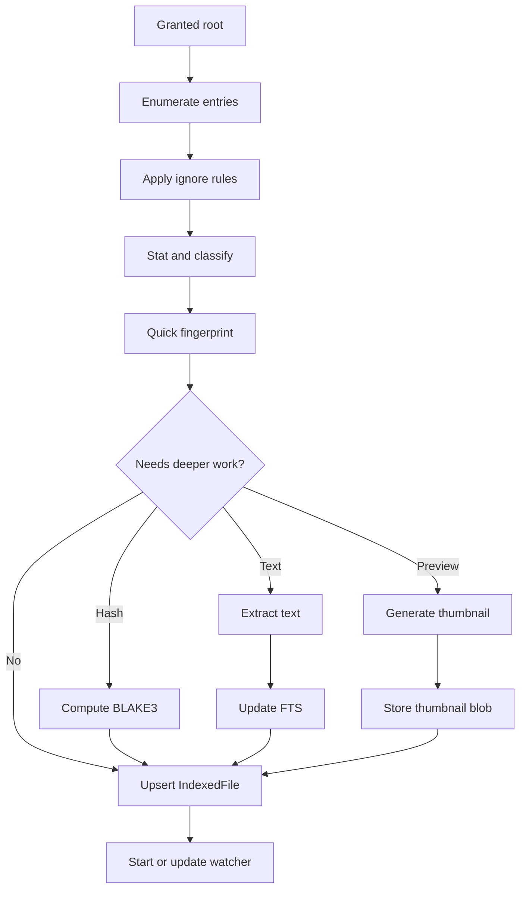

### Watcher Pipeline

Use watcher events to reduce latency, but never trust them as the only source of truth. Every watcher backend can miss, coalesce, or reorder events. xNet should periodically reconcile roots and rebuild affected subtrees after overflow.

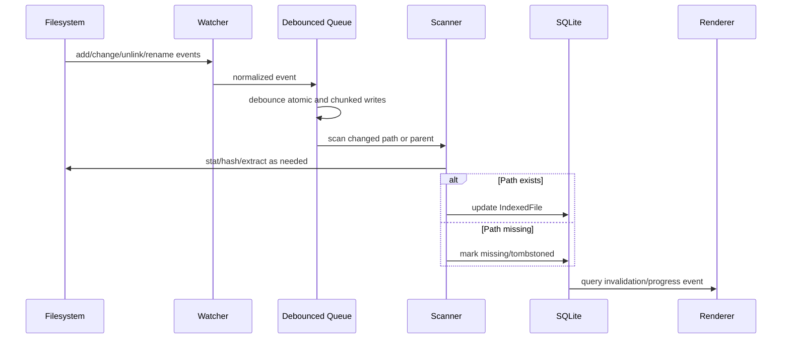

### Watcher Strategy

| Platform | Strategy | Caveats |
| --- | --- | --- |
| macOS | Use Chokidar initially, possibly native FSEvents later if needed. | TCC permissions, packages, aliases, iCloud placeholders, security-scoped bookmarks for MAS. |
| Windows | Chokidar over `ReadDirectoryChangesW`; consider USN Journal later for large roots. | Buffer overflow requires re-enumeration; path casing; OneDrive placeholders; long paths. |
| Linux | Chokidar over inotify; consider fanotify only for specialized cases. | Inotify is not recursive; watch limits; queue overflow; network filesystems need polling. |
| Network filesystems | Polling fallback and conservative scan intervals. | Events can be missing or delayed; cost must be user-visible. |
| Web | File System Access API handles for user-selected folders where available; OPFS for app-private storage only. | No broad background indexing; permissions can lapse; browser support varies. |

## Storage Strategy

xNet should use two storage layers:

1. **SQLite for metadata, indexes, permissions, and audit.** This fits the current `NodeStore` and query plan.
2. **Content-addressed blob storage for bytes.** Current SQLite blobs work for initial implementation; large libraries may need filesystem-backed CAS later.

### Why Not Store All File Bytes in SQLite Forever?

SQLite blobs are simple and already implemented, but large personal file libraries create pressure:

| Issue | SQLite blob impact | Filesystem CAS impact |
| --- | --- | --- |
| Multi-GB videos | Poor fit for single DB backup and WAL behavior. | Better as chunk files with DB metadata. |
| Incremental backup | DB file changes can cause coarse backup churn. | Chunk files dedupe well across backup tools. |
| Streaming media | Requires DB read and blob materialization. | Can stream chunks or files directly. |
| Vacuum/compaction | Large deletes can be painful. | GC can delete unreferenced chunk files. |
| Simplicity | Very simple now. | More moving parts later. |

Recommended staged storage path:

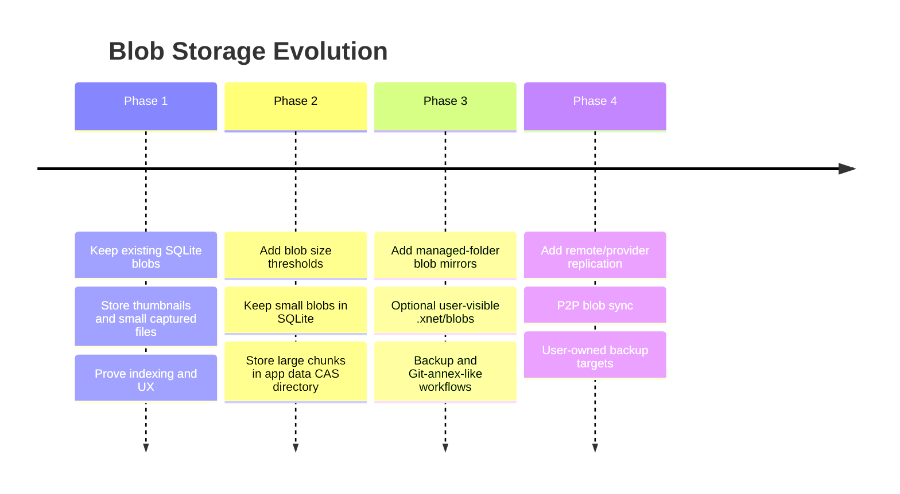

### App-Private CAS Layout

If a filesystem-backed CAS becomes necessary:

```text
~/Library/Application Support/xnet-desktop/xnet-data/
  data.db
  blobs/
    blake3/
      ab/
        cd/
          abcdef...chunk
    manifests/
      12/
        34/
          123456...json
  fs-index/
    thumbnails/
    extracts/
```

Keep the database authoritative for references, policies, and GC roots. Keep bytes content-addressed so corruption and path mistakes are detectable.

## Managed xNet Folder Design

Managed folders are the bridge from xNet into ordinary files. They should be optional and explicit.

### Goals

- Human-readable exports.
- Stable sidecar mapping between files and xNet nodes.
- Compatibility with Git, backup tools, editors, and local automation.
- No hidden mutation of arbitrary user folders.
- Recoverability if SQLite is lost but files remain.

### Candidate Layout

```text
xNet Workspace/
  Pages/
    Roadmap.md
    Meeting Notes.md
  Databases/
    Tasks.jsonl
    Contacts.csv
  Canvases/
    Product Map.xnet-canvas.json
  Files/
    lease.pdf
    screenshots/
      onboarding.png
  .xnet/
    manifest.jsonl
    nodes/
      <node-id>.json
    blobs/
      blake3/<hash-prefix>/<hash>
    tombstones.jsonl
    conflicts/
      2026-05-15T12-00-00Z/
```

### Sidecar Manifest

Sidecars preserve xNet semantics that ordinary Markdown/CSV cannot represent.

```json
{
  "version": 1,
  "path": "Pages/Roadmap.md",
  "nodeId": "node_abc",
  "schemaId": "xnet://xnet.fyi/Page@1.0.0",
  "contentHash": "cid:blake3:...",
  "lastMaterializedChange": "cid:blake3:...",
  "updatedAt": 1778840000000,
  "policy": {
    "direction": "bidirectional",
    "conflicts": "preserve-both"
  }
}
```

### Materialization Flow

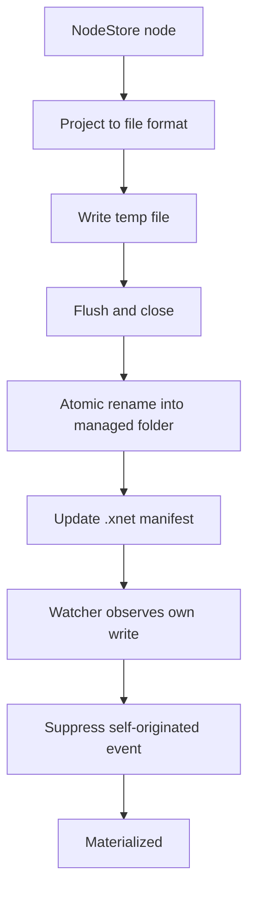

### External Edit Flow

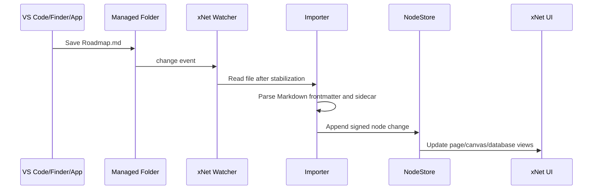

## Search and Discovery

Filesystem search should become a unified query surface:

- xNet pages and rich text.
- Database rows.
- Tasks.
- Canvas objects.
- External URL references.
- Indexed local files.
- Captured file snapshots.
- Managed folder exports.

### Index Layers

| Layer | Stores | Query role |
| --- | --- | --- |
| `nodes_fts` | Existing searchable node content. | Current xNet content search. |
| `filesystem_text_fts` | Extracted text snippets, titles, metadata, OCR. | File search without bloating node properties. |
| `filesystem_metadata_index` | MIME, extension, size, dates, folder, hash. | Filters, facets, recency, duplicate detection. |
| `embedding_index` later | Summaries and chunk embeddings. | Semantic file search and AI context. |

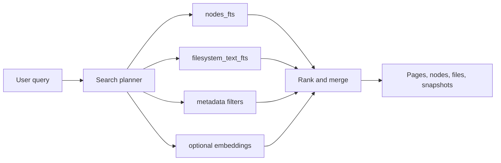

### File Extraction Policy

Start conservative.

| Type | Phase 1 extraction | Later extraction |
| --- | --- | --- |
| Plain text, Markdown, JSON, CSV | Text with size cap. | Structure-aware chunks. |
| PDF | Metadata only unless extractor is added. | Text extraction, thumbnails, OCR. |
| Images | Dimensions, EXIF subset, thumbnail. | OCR, object labels, embeddings. |
| Audio/video | Metadata only. | Transcripts, scene thumbnails. |
| Archives | Metadata only. | Optional nested index with safety caps. |
| Source code | Text with ignore rules. | Symbol index and repo-aware summaries. |
| Unknown/binary | Name, size, hash. | Plugin-defined extractors. |

Security gates:

- Never execute indexed files.
- Parse in a restricted worker/utility process.
- Cap file size, extraction time, output length, and recursion depth.
- Maintain denylist defaults: `.git`, `node_modules`, caches, app data, secrets, keychains, browser profiles, system folders.
- Let users preview and edit ignore rules before indexing.

## Sharing and Sync Semantics

Filesystem data has three different sync dimensions:

1. **Metadata sync.** Names, sizes, content hashes, summaries, and references.
2. **Path sync.** Absolute or relative local paths, root names, and device aliases.
3. **Byte sync.** Actual file contents as captured blobs or chunk manifests.

These must be independent toggles.

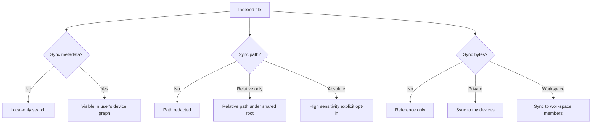

### Availability States

| State | Meaning | UI action |
| --- | --- | --- |
| `local` | File exists on this device at a known path. | Open, reveal, capture. |
| `missing` | Known path no longer resolves. | Relink, remove, search by hash. |
| `indexed-remote` | Metadata exists from another device, bytes not local. | Request, locate local copy, ignore. |
| `captured` | Bytes captured locally in blob store. | Verify, sync, delete captured copy. |
| `synced-private` | Bytes available across user's devices. | Open, pin, evict local chunks. |
| `synced-shared` | Bytes available to authorized workspace peers. | Open, manage permissions. |
| `conflict` | Filesystem and xNet versions diverged. | Compare, keep both, choose winner. |

## Security and Privacy Model

Filesystem indexing is sensitive. A safe architecture matters more than fast feature delivery.

### Threat Model

| Threat | Example | Mitigation |
| --- | --- | --- |
| Path disclosure | `/Users/alice/Clients/Acme-Lawsuit/settlement.pdf` syncs to a collaborator. | Local-only absolute paths by default; redaction previews before sharing. |
| Secret indexing | `.env`, SSH keys, browser profiles, password exports. | Default denylist, content sniffing, secret scanners, user-visible exclusions. |
| Malicious file parsing | Crafted PDF/image exploits extractor. | Utility process isolation, size/time caps, no renderer parsing, dependency review. |
| IPC abuse | Renderer asks main to open arbitrary path. | Capability tokens scoped to granted roots and file IDs; validate sender and arguments. |
| Path traversal | Custom protocol serves `../../secret`. | Resolve and enforce root containment before every read. |
| Unexpected writes | xNet overwrites user file. | Read-only default; managed roots only; atomic write and conflict preservation. |
| Watcher storm | Huge folder overwhelms CPU/IO. | Scan budgets, depth/file caps, pause controls, telemetry, backoff. |
| Stale permissions | macOS/Windows/cloud provider changes access. | Revalidate before read; clear errors; ask user to relink. |
| Remote request abuse | Peer requests all indexed files. | Bytes are unavailable unless captured and authorized. |
| Prompt fatigue | Too many permission dialogs. | Batch folder grants and explain scope clearly. |

### Capability Token Model

Renderer APIs should not pass arbitrary filesystem paths after initial selection. Use opaque capabilities.

```mermaid
flowchart LR
    Renderer[Renderer] -->|chooseFolder| Main[Main]
    Main -->|native dialog| User[User]
    User -->|path grant| Main
    Main -->|rootCapabilityId| Renderer
    Renderer -->|scan(rootCapabilityId)| Main
    Main --> Cap[Capability registry]
    Cap -->|root path local-only| Data[Data process]
    Renderer -->|openFile(fileNodeId)| Main
    Main -->|resolve node to authorized path| Cap
    Cap --> Shell[shell.openPath or showItemInFolder]
```

Rules:

- `chooseFolder` returns an opaque `rootId`, not a raw path, to the renderer if possible.
- `IndexedFile` nodes expose display names and relative paths only according to policy.
- `openFile`, `revealFile`, `captureFile`, and `rescanFile` accept node IDs or capability IDs.
- Main/data process verifies the file is still under a granted root before every operation.
- Custom protocol URLs use node IDs or snapshot CIDs, not raw absolute paths.

## UX Concepts

### Settings: Files

Add a Files section in settings:

| Control | Purpose |
| --- | --- |
| Add folder | Native directory picker. |
| Folder list | Shows root name, status, item count, last scan, local-only/sync policy. |
| Ignore rules | Defaults plus editable patterns. |
| Scan depth and file cap | Prevent accidental full disk scans. |
| Content extraction toggles | Metadata only, text, thumbnails, OCR later. |
| Privacy preview | Shows examples of metadata that will sync. |
| Revoke and delete index | Stops watcher and removes local index entries. |

### File Card

For pages, canvas, and search:

| UI element | Meaning |
| --- | --- |
| File icon/thumbnail | Type and preview. |
| Availability badge | Local, missing, captured, synced, shared. |
| Path crumb | Relative path or redacted path. |
| Actions | Open, reveal, capture, sync, relink, remove from index. |
| Warnings | Local-only, permissions missing, hash changed, conflict. |

### Sharing Dialog

When sharing content that references local files:

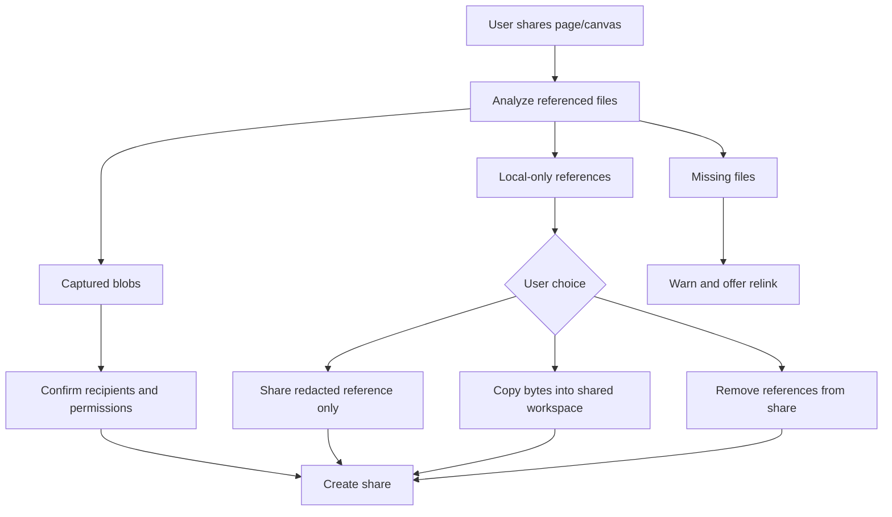

## AI and Agent Integration

Filesystem indexing is also the bridge between xNet and personal AI workflows.

Potential features:

- Ask questions over a granted folder without uploading it to a cloud service.
- Let an agent gather context from pages, files, and databases with one permission model.
- Build task lists from local documents.
- Detect duplicate files and stale exports.
- Summarize folder changes since last week.
- Create canvases from project folders.
- Link source files, design docs, screenshots, and meeting notes into one knowledge graph.

Safety requirements:

- Agents receive search snippets first, full file bytes only after additional policy checks.
- Secret patterns are excluded from AI context by default.
- Local-only folders never leave the device unless the user explicitly promotes bytes or metadata.
- Agent actions that write files are limited to managed folders in early phases.

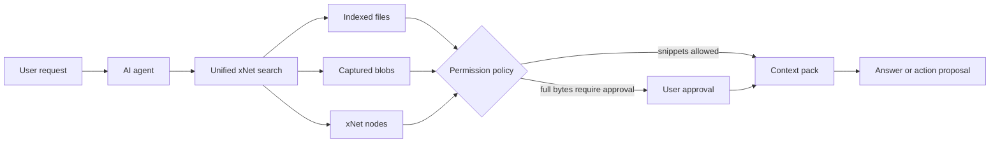

## OS Integration Opportunities

### Native File Manager

Electron `shell` can support:

- Reveal in Finder/Explorer.
- Open with default app.
- Move to trash for managed files only.
- Open containing folder.

Do not use `shell.openExternal` or `shell.openPath` with untrusted renderer-provided strings.

### Custom Protocols

Possible schemes:

| Scheme | Purpose | Notes |
| --- | --- | --- |
| `xnet://node/<id>` | App deep link to a node. | Already aligned with app identity. |
| `xnet://file/<identity-id>` | Resolve a file identity in app. | Does not expose local path. |
| `xnet-file://snapshot/<cid>` | Stream captured bytes. | Needs safe protocol handler and auth. |
| `xnet-preview://file/<node-id>` | Render thumbnail/preview. | Avoid `file://` and root traversal. |

### OS Search

Later, xNet might integrate with Spotlight, Windows Search, or platform indexing by materializing search-friendly summaries or managed workspace files. This should be optional. The safer first path is internal xNet search over indexed folders.

### Drag and Drop

Drag/drop can become the primary entry point:

- Drop file on canvas: create local file card.
- Drop folder on sidebar: ask to index folder.
- Drop file into page: embed file reference or capture as blob.
- Drag xNet node out to Finder: export to managed folder or temp file.

## Conflict Model

Read-only indexing has no write conflicts. Managed folders and bidirectional sync do.

### Conflict Types

| Conflict | Example | Resolution |
| --- | --- | --- |
| External edit while xNet has unsaved change | Markdown page edited in VS Code and xNet editor. | Preserve both, show diff, user chooses merge. |
| File changed after capture | Local PDF has newer hash than captured snapshot. | Show "new local version available". |
| File moved or renamed | Path missing but content hash found elsewhere. | Relink automatically with confirmation. |
| File deleted externally | User deletes managed export. | Ask delete node, recreate file, or ignore. |
| xNet delete vs external edit | Node deleted while file changed. | Tombstone conflict folder. |
| Same filename on two devices | Different content at same relative path. | Keep both identities until user merges. |

```mermaid
stateDiagram-v2
    [*] --> Clean
    Clean --> ExternalChanged: watcher detects file hash change
    Clean --> XNetChanged: NodeStore change needs export
    ExternalChanged --> Imported: no competing xNet change
    XNetChanged --> Materialized: no competing external change
    ExternalChanged --> Conflict: xNet changed since last materialization
    XNetChanged --> Conflict: file changed since last import
    Conflict --> KeepBoth
    Conflict --> UseExternal
    Conflict --> UseXNet
    Conflict --> ManualMerge
    KeepBoth --> Clean
    UseExternal --> Clean
    UseXNet --> Clean
    ManualMerge --> Clean
```

## Relationship to Existing xNet Schemas

### `FileRef`

Keep `FileRef` for content-addressed bytes:

```typescript
type FileRef = {
  cid: string
  name: string
  mimeType: string
  size: number
}
```

Add a separate reference for local files:

```typescript
type LocalFileRef = {
  fileNodeId: string
  rootId: string
  relativePath: string
  deviceId: string
  contentHash?: string
  availability: 'local' | 'missing' | 'captured' | 'synced-private' | 'synced-shared'
}
```

Do not add absolute paths to schema-level syncable data unless policy explicitly says so.

### `MediaAssetSchema`

Use `MediaAsset` for captured or renderable assets. It can point to a `FileRef` when bytes are in xNet. For path-backed media, create an `IndexedFile` and optionally a canvas media object whose source is the `IndexedFile`.

### `ExternalReferenceSchema`

Keep for URLs and external systems. A local filesystem path is not a URL in the same trust domain. It needs separate permission and availability semantics.

### Canvas

Canvas already has `external-reference` and `media` object kinds. Add file cards as either:

- `external-reference` source pointing to `IndexedFile` for documents and arbitrary files.
- `media` source pointing to `IndexedFile` or `MediaAsset` for images/audio/video.

## Package and Process Boundaries

Recommended new package:

| Package | Role |
| --- | --- |
| `@xnetjs/filesystem` | Shared schema definitions, scanner types, fingerprint logic, ignore rules, extraction interfaces. |
| Electron main/data integration | Native dialogs, path capabilities, watcher lifecycle, platform-specific permission storage. |
| `@xnetjs/data` additions | Core schemas and typed helpers if files become core domain objects. |
| `@xnetjs/storage` additions | Optional filesystem-backed CAS adapter after SQLite blob limits are proven. |
| `@xnetjs/react` additions | Hooks such as `useIndexedFiles`, `useFileAvailability`, `useFilesystemRoots`. |

Start minimal. If only Electron uses it at first, filesystem runtime code can begin inside `apps/electron/src/data-process/filesystem-*` and move to a package after patterns stabilize.

```mermaid
flowchart TB
    subgraph Core[Core Packages]
        Data[@xnetjs/data schemas]
        Storage[@xnetjs/storage blobs]
        FS[@xnetjs/filesystem types]
    end

    subgraph Electron[Electron App]
        Main[main process dialogs/protocol/shell]
        DataProc[data process scanner/watcher]
        Renderer[renderer UI]
    end

    subgraph Future[Future Platforms]
        Web[web File System Access]
        Expo[mobile document picker]
    end

    FS --> Data
    FS --> Storage
    Main --> FS
    DataProc --> FS
    Renderer --> Data
    Web --> FS
    Expo --> FS
```

## Implementation Plan

### Phase 0: Design Spike

- [ ] Define `IndexedFolder`, `IndexedFile`, `FileIdentity`, `FileSnapshot`, and `ManagedFolder` schema drafts.
- [ ] Decide local-only storage location for absolute paths and security-scoped bookmarks.
- [ ] Draft ignore rules and default excluded paths.
- [ ] Define metadata sync policy flags.
- [ ] Define filesystem capability token shape for renderer to main/data IPC.
- [ ] Decide whether initial indexing writes `NodeStore` nodes only or also local side tables.
- [ ] Decide maximum initial scan limits: files, bytes, depth, extract time, text bytes.
- [ ] Decide initial file types: metadata-only for all, text extraction for plain text/Markdown/JSON/CSV.

### Phase 1: Read-Only Indexing in Electron

- [ ] Add `xnetFiles.chooseFolder` preload API backed by Electron `dialog.showOpenDialog({ properties: ['openDirectory'] })`.
- [ ] Store granted root in local-only `filesystem_roots` table with display name and absolute path.
- [ ] Add scanner in data process using Node `fs/promises` and safe concurrency limits.
- [ ] Add ignore filtering for system folders, dependency folders, VCS folders, caches, secrets, and user patterns.
- [ ] Create `IndexedFolder` and `IndexedFile` nodes through NodeStore or local side table plus projection nodes.
- [ ] Populate metadata: basename, relative path, size, mtime, extension, MIME guess, kind, last indexed time.
- [ ] Add bounded text extraction for text-like files.
- [ ] Add FTS updates for file names and extracted snippets.
- [ ] Add progress events over existing main/data IPC channel style.
- [ ] Add Settings UI for indexed folders, status, rescans, revoke, delete local index.
- [ ] Add search results that include indexed files.
- [ ] Add open/reveal actions through main process `shell` with root containment validation.

### Phase 2: Watch and Incremental Update

- [ ] Add Chokidar or native watcher abstraction behind data process.
- [ ] Normalize events into add/change/unlink/addDir/unlinkDir.
- [ ] Debounce atomic writes and chunked writes.
- [ ] Re-scan parent directory after rename/unlink uncertainty.
- [ ] Add watcher overflow/rebuild handling.
- [ ] Add periodic reconciliation scans.
- [ ] Add root pause/resume controls.
- [ ] Add telemetry for files scanned, bytes read, queue depth, extraction errors, watcher rebuilds.
- [ ] Add tests for event normalization using temporary directories.

### Phase 3: Canvas and Page UX

- [ ] Support drag/drop of files onto canvas as local file cards.
- [ ] Support drag/drop of folders onto sidebar/settings as index prompts.
- [ ] Add file mention resolver to pages and tasks.
- [ ] Add file card component with availability state, path crumb, actions, and warnings.
- [ ] Add thumbnail generation for images with size caps.
- [ ] Add "capture into xNet" action for a local file.
- [ ] Add "copy path", "reveal", "open", "remove reference", and "relink" actions.

### Phase 4: Content Capture and Private Device Sync

- [ ] Use existing `BlobStore` and `ChunkManager` to capture selected file bytes.
- [ ] Store `FileSnapshot` node with manifest CID/hash/size/capturedAt.
- [ ] Add hash verification before opening captured bytes.
- [ ] Add private device sync policy for captured blobs.
- [ ] Add missing blob request UI using existing blob sync primitives.
- [ ] Add dedup by content hash.
- [ ] Add storage usage UI and captured-byte deletion.
- [ ] Add large-file thresholds and warnings.

### Phase 5: Managed Folder Export

- [ ] Add `ManagedFolder` schema and local root registration.
- [ ] Add one-way export of selected pages to Markdown.
- [ ] Add sidecar manifest writer.
- [ ] Add atomic write strategy with temp files and rename.
- [ ] Add self-write suppression in watcher.
- [ ] Add import of external Markdown edits into NodeStore changes.
- [ ] Add conflict detection based on last materialized change hash.
- [ ] Add conflict folder preservation.
- [ ] Add export/import tests with temp directories.

### Phase 6: Global Namespace and Cross-Device Resolution

- [ ] Add device identity metadata and root aliases.
- [ ] Add full BLAKE3 file hashing jobs with pause/resume.
- [ ] Add `FileIdentity` clustering by content hash.
- [ ] Add UI for "same file on another device" suggestions.
- [ ] Add redacted path sync policy and user preview.
- [ ] Add `xnet://file/<identity-id>` deep links.
- [ ] Add resolver that maps identity to local path, captured blob, or remote request.

### Phase 7: Bidirectional Managed Sync

- [ ] Allow writes only inside managed folders.
- [ ] Implement importers/exporters per file format with round-trip tests.
- [ ] Add conflict UI and manual merge hooks.
- [ ] Add tombstone semantics for deleted files.
- [ ] Add backup/recovery docs.
- [ ] Add dangerous-operation confirmations.

## Validation Checklists

### Security Validation

- [ ] Renderer never receives raw absolute paths unless explicitly needed for display and allowed by policy.
- [ ] Renderer cannot call arbitrary `fs`, `shell`, or protocol APIs.
- [ ] Every open/reveal/capture request resolves node ID to an authorized root in main/data process.
- [ ] Root containment uses resolved real paths and rejects `..`, symlink escape where policy disallows it, and absolute-path injection.
- [ ] Custom protocol handlers reject traversal and unknown node IDs.
- [ ] IPC handlers validate sender frame and argument schemas.
- [ ] Default ignore rules exclude secrets and high-risk folders.
- [ ] Extraction runs outside renderer and has size/time/output caps.
- [ ] Captured blobs are verified against CIDs before use.
- [ ] Shared files require explicit metadata and byte policy confirmation.
- [ ] Revoking a folder removes watcher state and local index data.

### Privacy Validation

- [ ] Absolute local paths are local-only by default.
- [ ] Sharing preview lists file references and whether names, paths, metadata, snippets, or bytes will be shared.
- [ ] User can choose metadata-only, content snippets, and byte sync independently.
- [ ] Local-only indexed files do not appear on other devices unless opted in.
- [ ] Extracted text does not sync by default for local-only folders.
- [ ] Folder names and relative paths can be redacted or generalized.
- [ ] Delete/revoke flow explains whether captured blobs remain.

### Correctness Validation

- [ ] Initial scan handles empty folders, deep folders, large folders, symlinks, packages, hidden files, permission errors, and deleted-during-scan files.
- [ ] Re-scan produces idempotent node/index state.
- [ ] Rename detection preserves identity when hash or platform ID confirms sameness.
- [ ] Missing files are marked missing, not silently deleted.
- [ ] Hash changes create new version candidates, not silent mutation of old snapshots.
- [ ] Watcher overflow triggers subtree or root reconciliation.
- [ ] App restart resumes roots and pending jobs safely.
- [ ] Multiple profiles keep independent indexes.
- [ ] Multi-window Electron sessions do not duplicate watcher work.

### Performance Validation

- [ ] Scanner uses bounded concurrency and does not block renderer.
- [ ] Large files are not fully read unless hashing/capture is requested.
- [ ] Text extraction has file-size and output-size caps.
- [ ] Watcher queue has backpressure and visible paused state.
- [ ] Initial scan progress is incremental and cancellable.
- [ ] FTS updates are batched.
- [ ] SQLite write batches do not starve Yjs or NodeStore operations.
- [ ] CPU, memory, file descriptors, and DB growth are measured on folders with 1k, 10k, and 100k files.

### UX Validation

- [ ] User can add a folder from settings.
- [ ] User sees exactly what will be indexed before scan starts.
- [ ] User can pause, resume, rescan, revoke, and delete local index.
- [ ] Search results clearly distinguish xNet nodes, local files, captured files, and missing files.
- [ ] File cards show availability and privacy state.
- [ ] Opening/revealing a file fails with a useful relink flow if missing.
- [ ] Sharing UI prevents accidental upload of local-only files.
- [ ] Drag/drop creates predictable file cards and does not copy bytes unless requested.

### Cross-Platform Validation

- [ ] macOS Finder files, packages, aliases, iCloud placeholders, and permission prompts are handled.
- [ ] Windows drive letters, UNC paths, OneDrive placeholders, path casing, and long paths are handled.
- [ ] Linux inotify limits, symlinks, hidden files, and network mounts are handled.
- [ ] Web fallback uses File System Access API only where available and OPFS only for app-private storage.
- [ ] Non-Electron platforms degrade gracefully to upload/capture/import without global indexing.

### Data Recovery Validation

- [ ] Losing SQLite but keeping managed folder can recover exported pages and sidecars.
- [ ] Losing local files but keeping xNet blob snapshots can restore captured files.
- [ ] Losing app blob cache but keeping local file path can re-capture after verification.
- [ ] Sidecar manifests can rebuild node/file relationships.
- [ ] Conflicts preserve both versions and never overwrite without recoverability.

## Open Questions

| Question | Why it matters | Suggested answer |
| --- | --- | --- |
| Should indexed files be full NodeStore nodes or local side-table rows projected into search? | Full nodes are syncable and reusable; side tables are faster and more private. | Start with side tables plus minimal nodes for user-referenced files; promote to nodes on reference/capture. |
| Should absolute paths ever sync? | Paths leak sensitive context but help second-device resolution. | No by default. Add explicit private device graph mode later. |
| Should xNet hash every file during initial scan? | Full hashes enable identity but are expensive. | Use quick fingerprints initially; full hash only on demand, idle, or small files. |
| Should xNet parse PDFs/images immediately? | Useful search, but dependency and security risk. | Start metadata-only plus text files; add extractors behind review and sandboxing. |
| Should xNet store large blobs in SQLite? | Simpler now, poor long-term for huge libraries. | Keep current store for small files; add filesystem CAS after real usage data. |
| Should managed folders use Markdown frontmatter or sidecars only? | Frontmatter is portable; sidecars avoid polluting files. | Use minimal frontmatter for human context and sidecars for exact semantics. |
| Should this integrate with OS search? | Could make xNet discoverable outside the app. | Later. Internal search first. |
| Should agents be able to write files? | Powerful but risky. | Only managed folders, explicit approval, and conflict preservation. |

## Recommendations

1. **Build Phase 1 as an Electron-only vertical slice.** Add folder grant, read-only scanner, local index, search results, and open/reveal actions.
2. **Do not weaken renderer sandboxing.** Keep all filesystem access in main/data processes behind typed IPC and capability IDs.
3. **Create a dedicated filesystem data model.** Do not overload `FileRef` or `ExternalReferenceSchema` for local files.
4. **Make privacy policy visible in the UI.** Users should see whether names, paths, snippets, hashes, and bytes are local-only or synced.
5. **Use metadata and quick fingerprints first.** Full hashing and extraction should be incremental background jobs.
6. **Use existing blob/chunk primitives for capture.** Avoid new storage tech until the UX and semantics are proven.
7. **Add managed folders only after read-only indexing works.** Writing to user-visible files requires a stronger conflict model.
8. **Treat global file identity as a resolver, not a path mirror.** The same file can have different paths, names, and availability on each device.
9. **Design for AI context early.** File snippets, summaries, and permissions should be structured so agents can use them safely later.
10. **Measure before optimizing storage.** SQLite blobs may be enough for thumbnails and small captured files; large file CAS should be added when usage demands it.

## Near-Term Action Plan

The smallest valuable implementation is:

1. Add local-only `filesystem_roots` and `filesystem_entries` SQLite tables in Electron data process.
2. Add `chooseFolder`, `scanFolder`, `listIndexedFolders`, `removeIndexedFolder`, `openIndexedFile`, and `revealIndexedFile` IPC APIs.
3. Add scanner with metadata plus text extraction for safe text files.
4. Add FTS rows for indexed file names and snippets.
5. Add Settings UI to manage indexed folders.
6. Add global search result rendering for indexed files.
7. Add file card support on canvas via drag/drop.
8. Add capture action that uses existing `BlobStore` and `ChunkManager`.

Success criteria:

- A user can index `~/Documents/xnet-test` with 1k files without blocking UI.
- Search finds file names and safe text contents.
- Opening and revealing files works only for granted roots.
- Revoking a root removes its search results and stops watching.
- Sharing a page with a local-only file shows a warning and does not upload bytes.

## Final Take

Filesystem integration is a natural extension of xNet's local-first architecture. The key is to avoid jumping straight to bidirectional sync. Read-only indexing gives immediate value, respects user trust, and creates the metadata foundation for later managed folders, content-addressed snapshots, and global file identity.

If done well, xNet becomes the place where personal files, app-native nodes, collaborative pages, canvases, URLs, tasks, databases, and AI agents meet in one namespace without forcing users to abandon the ordinary filesystem they already rely on.
