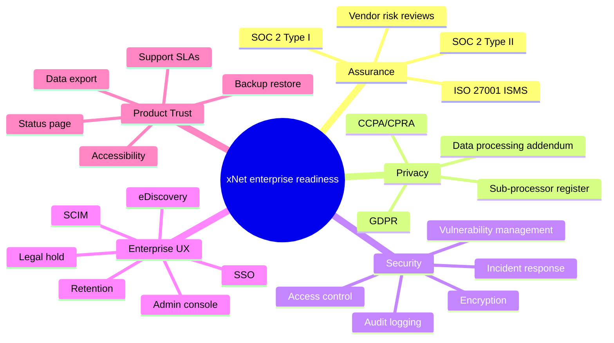
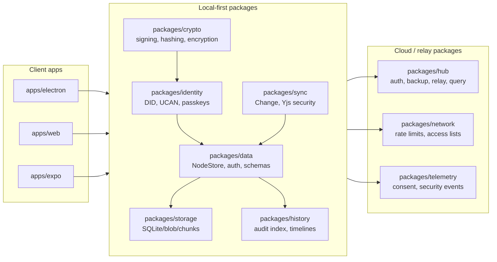
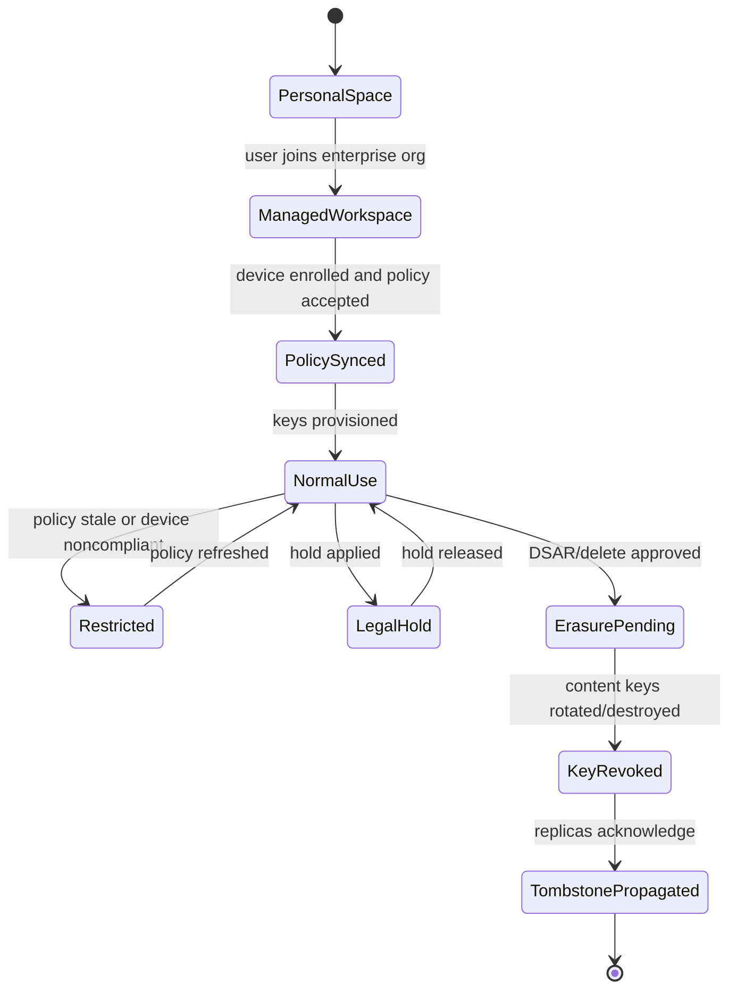
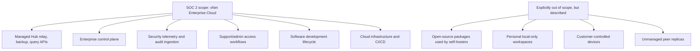
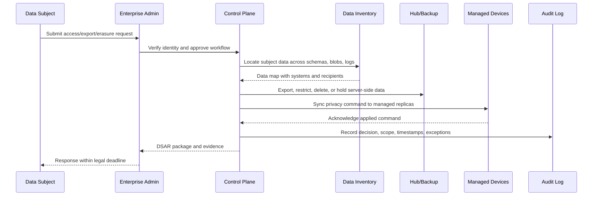
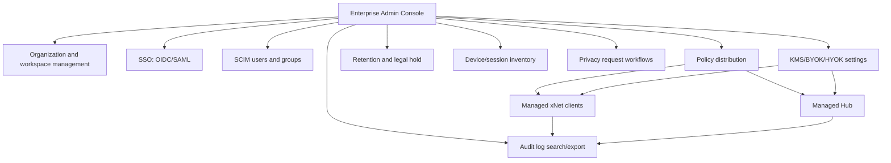
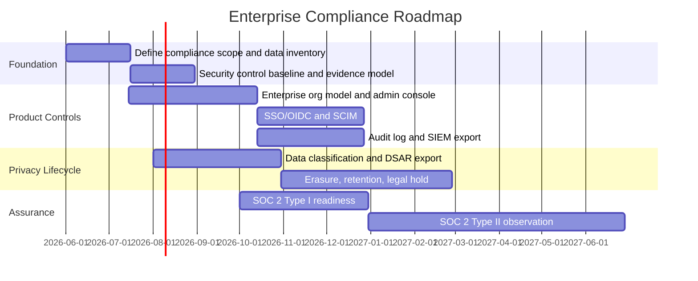
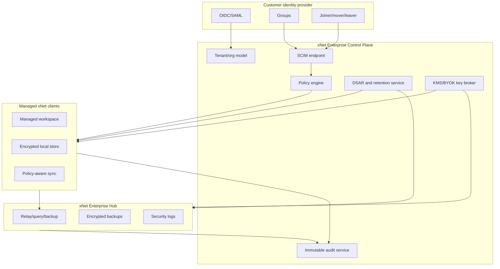

# Could xNet Ever Be Made SOC 2, GDPR, Or Otherwise Enterprise Friendly?

Status: [_] Exploration  
Research date: 2026-05-19  
Scope: xNet monorepo, local-first architecture, Electron/Web apps, Hub services, sync/data/identity/storage packages

## Problem Statement

xNet is designed as a local-first, decentralized knowledge and collaboration system. That is strategically attractive for privacy, resilience, and user-owned data, but it creates a hard compliance question:

> Can xNet ever become credible for SOC 2, GDPR, CCPA, ISO 27001, HIPAA-adjacent, accessibility, procurement, and enterprise security review expectations without abandoning the local-first model?

Short answer: yes, but not as a single "compliant product" claim. xNet would need a deliberately scoped enterprise mode, a control plane, documented operating procedures, evidence generation, and a privacy lifecycle that treats local replicas, peer sync, Hub backups, telemetry, audit logs, and deletion as first-class governed systems.

The most important distinction:

- SOC 2 and ISO 27001 are primarily organization and service control programs. xNet Inc, or whoever operates xNet Cloud/Hub, would be audited.
- GDPR, CCPA, and HIPAA-like obligations are product, operational, and contractual obligations that affect architecture directly.
- Enterprise-friendly means more than compliance: SSO, SCIM, admin controls, DLP hooks, legal holds, retention policies, customer data boundaries, support processes, incident response, audit exports, and predictable procurement answers.

## Executive Summary

xNet has unusually strong primitives for a future compliance story:

- DID-based identity and UCAN-style delegation in `packages/identity`.
- Signed `Change<T>` records, Lamport clocks, hash chains, and signed Yjs envelopes in `packages/sync`.
- Schema-level authorization, field restrictions, grants, revocation, offline policy, and authorization traces in `packages/data/src/auth`.
- Soft-delete and event-sourced NodeStore history in `packages/data/src/store`.
- Content-addressed blob storage and encrypted Hub backup flows in `packages/storage`, `packages/hub`, and `packages/react/src/hub`.
- Security telemetry, consent storage, network rate limiting, access lists, and fail2ban-compatible event formatting in `packages/telemetry` and `packages/network`.
- Export support for JSON, NDJSON, and CSV in `packages/data/src/database/export`.

But xNet is not close to enterprise compliant yet. The gap is not cryptography alone. The gap is control completeness, evidence, policy enforcement, and centralized governability. A SOC 2 auditor or enterprise security reviewer will ask: who can access customer data, how is access approved, how is it logged, how are vulnerabilities remediated, how are backups tested, how are incidents handled, how are employees offboarded, how are sub-processors managed, and how can a customer prove deletion or retention?

The local-first architecture helps with data minimization and confidentiality, but makes deletion, legal hold, audit completeness, eDiscovery, retention, and data subject rights more complex because personal data may exist across local devices, peer replicas, Hub caches, backups, telemetry, logs, and exported files.

The viable path is:

1. Define "xNet Enterprise Cloud" as the auditable system boundary.
2. Add an Enterprise Control Plane with organization tenancy, SSO/OIDC/SAML, SCIM, policy distribution, audit ingestion, retention jobs, device inventory, and DSAR tooling.
3. Introduce a Compliance Data Lifecycle layer: classify, minimize, export, restrict, redact, delete, retain, legal-hold, and prove.
4. Make local-first sync compliance-aware: every replica must receive policy, deletion, retention, hold, and key-rotation events.
5. Treat SOC 2 Type I as the first external compliance target, then Type II, then GDPR maturity, then ISO 27001 if the business needs international procurement depth.

## Compliance Target Map



## Current State In The Repository

### Architecture Relevant To Compliance



### Positive Compliance-Relevant Primitives

| Area | Observed repo evidence | Why it matters |
| --- | --- | --- |
| Identity | `packages/identity/README.md` describes DID:key, UCAN tokens, key bundles, passkey storage, and serialization. | Supports decentralized identity, delegated authorization, and portable user-owned credentials. |
| Cryptography | `packages/crypto/README.md` covers BLAKE3, Ed25519, X25519, XChaCha20-Poly1305, and secure randomness. | Provides confidentiality, integrity, and signing primitives needed for GDPR Article 32-style security controls. |
| Sync integrity | `packages/sync/README.md` documents signed envelopes, rate/size limits, hash-at-rest integrity, peer scoring, and client ID attestation. | Useful for tamper evidence, peer abuse handling, and auditability of replicated data. |
| Authorization | `packages/data/src/auth/evaluator.ts` implements role resolution, field rules, grant checks, deny reasons, traces, offline policy, and auth decision events. | This is a credible base for enterprise RBAC/ABAC and support/debug evidence. |
| Store enforcement | `packages/data/src/store/store.ts` gates create/update/delete through authorization, verifies remote change hashes/signatures, and rejects unauthorized remote changes. | Prevents policy from being just UI decoration. |
| Delegated sharing | `packages/data/src/auth/store-auth.ts` supports grants, UCAN creation, proof depth, delegation attenuation, revocation, key manager hooks, and rate limiting. | Maps to controlled sharing and revocable access. |
| Soft delete | `NodeStore.delete()` writes a `deleted: true` change rather than physically purging data. | Good for undo/audit, but insufficient for GDPR erasure without purge/redaction/key destruction. |
| Export | `packages/data/src/database/export/json-export.ts` and `csv-export.ts` support JSON, NDJSON, and CSV export. | Good start for portability, eDiscovery, and data subject access requests. |
| Hub backup | `packages/hub/src/routes/backup.ts` verifies ownership proof for DID key backups and requires backup capabilities for document backup read/write/delete. | Good base for encrypted backup and account recovery. |
| Client backup encryption | `packages/react/src/hub/backup.ts` encrypts plaintext before upload and decrypts downloaded backups locally. | Reduces Hub exposure if keys remain customer-controlled. |
| Telemetry consent | `packages/telemetry/src/consent/storage.ts` stores consent with local and in-memory adapters. | Necessary but not sufficient for GDPR/CCPA telemetry governance. |
| Security logging | `packages/network/src/security/logging.ts` formats security events with severity, peer hash, IP, action, and details. | Useful for detection, incident response, and SOC 2 evidence. |
| Network controls | `packages/network/src/security/rate-limiter.ts` and `access-list.ts` provide rate limiting, peer allow/deny lists, IP deny lists, and persistence export/import. | Useful for abuse prevention and enterprise network policy. |
| Electron hardening | Current `apps/electron/src/main/index.ts` sets `sandbox: true`, `contextIsolation: true`, and `nodeIntegration: false`; `apps/electron/src/preload/index.ts` includes an allowlisted `xnetServices` bridge. | Indicates earlier review findings have been partially addressed. |
| Local API hardening | Current `apps/electron/src/main/local-api.ts` uses structured IPC instead of `executeJavaScript` and requires an API token by default. | Reduces a major local attack surface, but token handling and admin controls still need productization. |

### Current Gaps And Risks

| Gap | Why it blocks compliance or enterprise readiness | Likely owner |
| --- | --- | --- |
| No declared audit boundary | SOC 2/ISO require a defined system, processes, people, and control scope. The repo has packages, not an auditable service boundary. | Company/product leadership |
| No tenant/org model | Enterprise buyers expect orgs, workspaces, admins, members, groups, policies, billing, and data boundaries. | Product/platform |
| No SSO/SCIM | DID/passkey is strong but enterprises need IdP-driven lifecycle management. | Identity |
| No centralized audit event schema | `AuditIndex` is useful, but enterprise audit logs need immutable event streams covering auth, admin, sharing, sync, export, deletion, backup, and support access. | Data/platform |
| Soft delete is not erasure | `deleted: true` preserves history and potentially personal data in changes, snapshots, backups, and peer replicas. | Data/storage/sync |
| No DSAR workflow | GDPR/CCPA require access, correction, deletion, portability, restriction/opt-out, identity verification, and response tracking. | Privacy/product |
| No retention/legal hold model | Local-first systems need explicit retention policies that propagate to replicas without destroying legal-hold evidence. | Data/sync |
| No data classification | Fields and schemas do not yet appear to carry PII/sensitive/business-critical classification metadata. | Schema/data |
| Passkey fallback risk remains | `packages/identity/src/passkey/fallback.ts` stores encryption key material alongside ciphertext and states security comes from passkey gating, not key secrecy. That may be acceptable as a compatibility fallback only if clearly disabled or disclaimed for enterprise. | Identity/security |
| Telemetry consent is local but not governance-complete | Consent storage exists, but enterprise telemetry needs purpose, retention, minimization, regional routing, revocation propagation, and event inventory. | Telemetry/privacy |
| No evidence automation | SOC 2 Type II needs continuous evidence: access reviews, change management, incident drills, backup restore tests, vulnerability SLAs, and control owners. | Security/GRC |
| No DPA/sub-processor apparatus | Enterprise sales and GDPR processing require contractual materials and sub-processor tracking. | Legal/ops |
| No customer managed keys/KMS integration | Local encryption exists, but enterprise often asks for KMS, key rotation, key escrow policy, BYOK, HYOK, and tenant separation. | Crypto/platform |
| No admin retention override | Local-first users can export or keep replicas. Enterprise needs policy-enforced managed devices or clear limitations. | Product/security |

## External Research

### SOC 2

The AICPA describes SOC 2 reports as assurance over controls at a service organization relevant to security, availability, processing integrity, confidentiality, and privacy for systems used to process user data. The important implication is that SOC 2 is not a TypeScript feature checklist. It is an audited operating model around a defined service.

For xNet, this means:

- Open-source packages alone cannot be "SOC 2 compliant."
- A hosted Hub, backup, relay, telemetry, billing, and admin service could be in scope.
- Desktop-only local use could be "designed to help customers meet controls" but not audited as xNet's service unless xNet operates part of the processing.
- SOC 2 Type I can validate design at a point in time; Type II requires operating effectiveness over a review period.

Source: [AICPA SOC 2 Trust Services Criteria overview](https://www.aicpa-cima.com/topic/audit-assurance/audit-and-assurance-greater-than-soc-2)

### GDPR

GDPR maps very directly to product behavior:

- Article 5 includes lawfulness, fairness, transparency, purpose limitation, data minimization, accuracy, storage limitation, integrity/confidentiality, and accountability.
- Article 17 creates a right to erasure under specific grounds, with exceptions.
- Article 20 creates a right to receive personal data in a structured, commonly used, machine-readable format and transmit it elsewhere.
- Article 32 calls for technical and organizational security measures appropriate to risk, including pseudonymization/encryption, resilience, restore capability, and regular testing.
- Article 19 creates notification obligations to recipients after erasure/rectification/restriction unless impossible or disproportionate.

For xNet, GDPR is possible, but the hard parts are:

- Identifying all personal data across local replicas, Yjs content, Node properties, blobs, backups, telemetry, logs, and exports.
- Determining controller/processor roles in decentralized sharing.
- Propagating erasure to peers and backups without pretending that offline or hostile peers can be forced.
- Proving deletion or cryptographic erasure.
- Providing a useful "recipient notification" story when data was shared peer-to-peer.

Sources:

- [GDPR Article 5](https://gdpr-info.eu/art-5-gdpr/)
- [GDPR Article 17](https://gdpr-info.eu/art-17-gdpr/)
- [GDPR Article 19](https://gdpr-info.eu/art-19-gdpr/)
- [GDPR Article 20](https://gdpr-info.eu/art-20-gdpr/)
- [GDPR Article 32](https://gdpr-info.eu/art-32-gdpr/)
- [European Data Protection Board SME guide to individual rights](https://www.edpb.europa.eu/sme-data-protection-guide/respect-individuals-rights_en)

### ISO 27001

ISO/IEC 27001 is an information security management system standard. ISO summarizes it as a way to establish an ISMS and apply risk management adapted to the organization's size and needs.

For xNet, ISO 27001 becomes attractive after SOC 2 if international enterprise procurement is important. The hard part is not more crypto; it is building the ISMS: risk register, statement of applicability, control ownership, internal audit, management review, supplier management, security policies, and continuous improvement.

Source: [ISO/IEC 27001 overview](https://www.iso.org/standard/27001)

### NIST Cybersecurity Framework 2.0

NIST CSF 2.0 added a Govern function to Identify, Protect, Detect, Respond, and Recover. That is relevant because xNet's current security work is strongest in Protect and Detect primitives, while compliance readiness requires governance, risk ownership, repeatable recovery, and measurable response.

Sources:

- [NIST Cybersecurity Framework](https://www.nist.gov/cyberframework)
- [NIST CSF 2.0 release note](https://www.nist.gov/node/1840561)

### HIPAA

HIPAA Security Rule applicability depends on whether xNet handles electronic protected health information for a covered entity or business associate. HHS describes the rule as requiring administrative, physical, and technical safeguards to ensure confidentiality, integrity, and availability of ePHI.

For xNet, HIPAA should not be a first compliance target unless healthcare customers are strategic. The architecture would need BAAs, strict access audit, backup/restore evidence, emergency access, workstation/device controls, breach notification processes, and ePHI-specific data handling.

Source: [HHS HIPAA Security Rule](https://www.hhs.gov/hipaa/for-professionals/security/index.html)

### CCPA/CPRA

California's CCPA gives consumers more control over personal information and imposes responsibilities around notices and responding to consumer requests. For xNet, the CCPA story overlaps with GDPR DSAR work but has its own definitions, opt-out expectations, notices, and consumer request workflows.

Source: [California DOJ CCPA overview](https://oag.ca.gov/privacy/ccpa)

### Accessibility

Enterprise procurement often includes accessibility requirements. W3C describes WCAG as a shared standard for web content accessibility, including web applications. xNet already has accessibility-related packages and tests in editor/canvas, but enterprise readiness needs a VPAT/ACR path and regular accessibility validation.

Source: [W3C WCAG overview](https://www.w3.org/WAI/standards-guidelines/wcag/)

### SSO And Provisioning

Enterprises expect SSO and lifecycle management. OIDC provides an authentication layer on OAuth 2.0, SAML is an OASIS XML-based framework for exchanging authentication/security assertions, and SCIM is an HTTP-based identity provisioning protocol.

Sources:

- [OpenID Connect Core 1.0](https://openid.net/specs/openid-connect-core-1_0-18.html)
- [OASIS SAML 2.0 technical overview](https://docs.oasis-open.org/security/saml/Post2.0/sstc-saml-tech-overview-2.0.html)
- [IETF RFC 7644 SCIM protocol](https://datatracker.ietf.org/doc/rfc7644)

## Key Finding 1: xNet's Local-First Model Helps Privacy But Complicates Accountability

Local-first means xNet can credibly minimize server-side data exposure. If customer content is encrypted locally and Hub stores ciphertext, xNet as a service provider may have less direct access to customer content. That is valuable for SOC 2 confidentiality and GDPR security.

But local-first also makes compliance harder:

- Data exists on many devices.
- Offline replicas can miss policy changes.
- Peers may copy, export, or fork data.
- Deletion has to propagate through sync rather than happen in one database transaction.
- Central admins cannot always guarantee that every endpoint obeyed retention or deletion.

The enterprise answer is not to hide this complexity. It is to make it explicit with managed workspaces:

- Personal/local spaces keep the current user-owned model.
- Managed enterprise workspaces have enrollment, device trust, tenant policies, admin-managed keys, required sync checkpoints, legal hold, audit export, and deletion propagation.
- Sharing from managed to unmanaged contexts is either blocked, watermarked, or recorded as a disclosure event.



## Key Finding 2: SOC 2 Is Feasible If The Scoped Service Is Narrow

The most realistic SOC 2 scope:



SOC 2 Type I could be pursued when:

- The scoped cloud system is defined.
- Production access requires SSO/MFA and least privilege.
- Change management has PR review, CI, release approvals, and rollback.
- Infrastructure-as-code and logging exist.
- Incident response policy and backup restore tests exist.
- Customer data access is either impossible by design or tightly approved/logged.
- Vendor/sub-processor inventory exists.
- Risk assessment and control matrix exist.

SOC 2 Type II should wait until controls are operating for at least a review period with evidence automation. Trying Type II too early would convert engineering ambiguity into audit findings.

## Key Finding 3: GDPR Is Possible Only With A Compliance Data Lifecycle

Current NodeStore soft delete is not enough. GDPR erasure and storage limitation need a lifecycle that reaches change logs, materialized state, document CRDTs, blobs, backups, telemetry, logs, and replicas.



The lifecycle needs these building blocks:

- Schema-level data classification metadata.
- Subject identifiers and mapping from DID/person/email/user account to content references.
- Machine-readable processing purposes and retention classes.
- Export bundle format that includes content, metadata, and recipient disclosures.
- Erasure strategies: physical delete where possible, redaction where history must remain, and cryptographic erasure where content keys can be destroyed.
- Peer notification and acknowledgment tracking.
- Exceptions: legal hold, security logs, fraud prevention, contractual records, and backups with delayed purge windows.
- Evidence: who approved, what was found, what was deleted, what could not be deleted, why, and when.

## Key Finding 4: Enterprise Friendly Requires A Control Plane, Not Just Better Packages

The codebase has strong library primitives. Enterprise buyers need an operational surface.



The enterprise control plane should not replace local-first. It should constrain managed workspaces. Personal spaces can remain decentralized and user-owned; enterprise spaces can be policy-bound.

## Key Finding 5: xNet Should Avoid Overclaiming "Compliance"

Compliance language should be precise:

- Good: "xNet Enterprise Cloud is SOC 2 Type II audited for Security, Availability, and Confidentiality."
- Good: "xNet provides tools to support GDPR data access, export, deletion, and retention workflows."
- Good: "Customer content is end-to-end encrypted in supported managed workspace modes."
- Risky: "xNet is GDPR compliant" without controller/processor context.
- Risky: "Fully decentralized GDPR erasure" because hostile or offline peers cannot be forced to delete.
- Risky: "HIPAA compliant" without BAAs, ePHI controls, workforce policies, and scoped deployment architecture.

## Compliance Readiness Matrix

| Control family | Current readiness | What exists | Missing enterprise/compliance work |
| --- | --- | --- | --- |
| Encryption | Medium | Crypto primitives, encrypted backups, optional node content cipher hooks. | KMS/BYOK/HYOK, key rotation evidence, tenant key hierarchy, enterprise fallback policy, cryptographic erasure. |
| Identity | Medium | DID, UCAN, passkeys. | OIDC/SAML, SCIM, domain verification, admin recovery, enterprise account linking, IdP lifecycle events. |
| Authorization | Medium-high | Schema auth, grants, revocation, deny reasons, store enforcement. | Org roles, group sync, policy UI, centralized policy distribution, access reviews, break-glass flows. |
| Audit logs | Medium | Change history, AuditIndex, auth decision events, security logs. | Immutable tenant audit log, admin actions, support access, export/delete events, retention, SIEM export. |
| Data export | Medium | JSON/NDJSON/CSV exports. | Full DSAR export across schemas/blobs/Yjs/logs, account-level export, signed export manifests. |
| Erasure | Low | Soft delete and backup delete routes. | Hard purge, redaction, cryptographic erasure, replica commands, backup lifecycle, exception tracking. |
| Telemetry privacy | Low-medium | Consent storage and security event schema. | Event inventory, purpose limitation, retention, regional routing, consent withdrawal propagation. |
| Backup/DR | Medium | Hub backup service, encrypted client upload, quota checks. | Restore drills, RPO/RTO, backup retention classes, legal hold integration, disaster recovery runbooks. |
| Vulnerability management | Low-medium | Security tests and hardening exist in packages. | SLA policy, dependency scanning, SAST/DAST, triage workflow, external disclosure, pen test cadence. |
| Change management | Unknown from repo | Git hooks, tests, CI-like structure. | Formal approvals, release evidence, segregation of duties, incident rollback procedure. |
| Enterprise procurement | Low | Strong architecture story. | Security whitepaper, DPA, sub-processors, SOC report, VPAT, support SLA, status page, questionnaires. |

## Options And Tradeoffs

### Option A: Local-Only Privacy Tool

Position xNet as a local-first app with minimal cloud processing. Avoid enterprise compliance claims beyond open-source security posture.

Pros:

- Lowest operational burden.
- Strong privacy story.
- Avoids SOC 2 overhead.
- Preserves decentralized philosophy.

Cons:

- Weak enterprise procurement fit.
- No centralized SSO/SCIM/admin/audit.
- GDPR support is mostly customer-managed.
- Hard to monetize larger enterprise deployments.

Best if xNet remains developer/individual/community focused.

### Option B: SOC 2 Scoped Cloud Relay And Backup

Keep product local-first but audit only the managed Hub, backup, telemetry, and support systems.

Pros:

- Feasible first compliance milestone.
- Leverages existing Hub/auth/backup/security logging packages.
- Allows enterprise customers to use xNet with a familiar trust report.
- Does not require full centralized content access.

Cons:

- Still needs real company controls.
- Buyers may expect app-level admin features beyond SOC scope.
- Local replicas remain customer responsibility unless managed workspace mode exists.

Best near-term target.

### Option C: Full Enterprise Managed Workspace

Add organization tenancy, SSO/SCIM, policy-bound clients, centralized audit ingestion, DSAR workflows, retention, legal hold, KMS/BYOK, and admin console.

Pros:

- Best enterprise fit.
- Most credible GDPR/CCPA support.
- Creates a differentiated "secure local-first enterprise workspace."
- Enables regulated customer pilots.

Cons:

- Large product surface.
- Some decentralization constraints become policy-managed.
- Requires operations, legal, support, and GRC work, not just engineering.

Best long-term direction if enterprise is strategic.

### Option D: Compliance Toolkit For Self-Hosters

Provide deployable Hub, policy templates, audit schemas, Terraform, runbooks, and admin docs so customers can operate xNet under their own compliance programs.

Pros:

- Aligns with decentralization.
- Useful for governments, research, NGOs, and privacy-sensitive orgs.
- Reduces xNet's processor burden for self-hosted deployments.

Cons:

- Harder to monetize and support.
- Customer success burden increases.
- xNet still needs clear shared-responsibility documentation.

Best as complement to Option B/C.

## Recommended Strategy

Pursue a phased path:



Priority order:

1. SOC 2 Type I readiness for scoped xNet Enterprise Cloud.
2. GDPR/CCPA product controls for managed workspaces.
3. SOC 2 Type II after evidence automation is stable.
4. ISO 27001 if international enterprise procurement demands it.
5. HIPAA only after healthcare-specific demand and BAAs are viable.

## Reference Architecture For Enterprise Mode



## Design Principles

### 1. Separate Personal And Managed Workspaces

Personal xNet can remain open, user-owned, and decentralized. Managed xNet must be policy-bound.

The app should make this boundary obvious:

- Personal space: user controls identity, keys, sharing, exports.
- Managed workspace: organization controls membership, retention, device requirements, export policy, sharing boundaries, and admin audit.

### 2. Make Cryptographic Erasure A First-Class Strategy

For event-sourced and CRDT systems, deleting every historical byte may be expensive or impossible once replicated. Enterprise mode should support:

- Key-per-workspace and key-per-object/content group.
- Key rotation on revocation.
- Key destruction for erasure when physical purge is delayed or impossible.
- Redacted tombstones for audit without content.
- Signed erasure receipts.

### 3. Treat Peer Sharing As Disclosure

Any sharing to another DID, peer, org, or public endpoint should emit a disclosure event:

- Who shared.
- What resource.
- Which recipient DID/org.
- Which permissions.
- Expiration.
- Whether content was exported, replicated, or merely granted.
- Whether recipient is managed or unmanaged.

This is necessary for GDPR recipient notifications, enterprise audit, and incident analysis.

### 4. Make Offline Policy Explicit

The existing offline policy work in `DefaultPolicyEvaluator` is important. Enterprise should extend it:

- Offline access window.
- Policy max age.
- Required re-authentication.
- Remote wipe on next sync.
- Deny export while policy is stale.
- Local audit buffering with tamper evidence.

### 5. Prefer Evidence-Producing Controls

Every security feature should produce evidence:

- Policy changed -> audit event.
- Grant issued/revoked -> audit event.
- Backup restored -> audit event and test artifact.
- User offboarded -> SCIM event, grant revocation, key rotation, device wipe acknowledgments.
- DSAR completed -> signed manifest.

## Example Code: Schema Data Classification And Privacy Commands

This example sketches a functional, declarative extension to the schema/auth model. It is not a drop-in implementation; it shows the kind of metadata xNet needs for GDPR/enterprise workflows.

```typescript
import type { DID } from '@xnetjs/core'

type DataClass = 'public' | 'internal' | 'confidential' | 'personal' | 'sensitive'
type RetentionClass = 'user-controlled' | 'workspace-default' | 'legal-record' | 'security-log'
type PrivacyAction = 'export' | 'rectify' | 'restrict' | 'erase' | 'hold'

type FieldPrivacyPolicy = {
  dataClass: DataClass
  subjectRef?: 'self' | 'createdBy' | { property: string }
  purposes: string[]
  retention: RetentionClass
  dsar: Partial<Record<PrivacyAction, boolean>>
}

type PrivacyCommand = {
  id: string
  subject: DID
  action: PrivacyAction
  scope: {
    workspaceId: string
    schemaIds?: string[]
    nodeIds?: string[]
  }
  approvedBy: DID
  issuedAt: number
  reason: string
}

const pagePrivacyPolicy = {
  title: {
    dataClass: 'personal',
    subjectRef: 'createdBy',
    purposes: ['collaboration', 'search'],
    retention: 'workspace-default',
    dsar: { export: true, rectify: true, erase: true }
  },
  auditAuthor: {
    dataClass: 'personal',
    subjectRef: { property: 'createdBy' },
    purposes: ['security', 'accountability'],
    retention: 'security-log',
    dsar: { export: true, erase: false, restrict: true }
  }
} satisfies Record<string, FieldPrivacyPolicy>

export function canApplyPrivacyCommand(input: {
  command: PrivacyCommand
  fieldPolicy: FieldPrivacyPolicy
  legalHoldActive: boolean
}): boolean {
  if (input.command.action === 'erase' && input.legalHoldActive) {
    return false
  }

  return input.fieldPolicy.dsar[input.command.action] === true
}
```

## Implementation Checklist

### Phase 0 - Scope And Governance

- [ ] Define the auditable service boundary for "xNet Enterprise Cloud."
- [ ] Decide which Trust Services Criteria to target first: Security only, or Security plus Availability and Confidentiality.
- [ ] Create a shared responsibility matrix for local-only, self-hosted, and managed cloud deployments.
- [ ] Create a data processing role matrix: xNet as controller, processor, sub-processor, or no-access software provider.
- [ ] Create a control owner map for security, privacy, infrastructure, support, and engineering.
- [ ] Create an initial risk register using NIST CSF 2.0 Govern/Identify/Protect/Detect/Respond/Recover.
- [ ] Pick an evidence system and define evidence naming, owners, collection cadence, and review cadence.
- [ ] Draft security policies: access control, change management, incident response, vulnerability management, vendor management, backup/DR, acceptable use, secure SDLC.

### Phase 1 - Enterprise Product Boundary

- [ ] Add organization and workspace tenancy models.
- [ ] Add managed workspace mode distinct from personal spaces.
- [ ] Add domain verification for enterprise tenants.
- [ ] Add admin roles: owner, security admin, compliance admin, workspace admin, support delegate.
- [ ] Add OIDC login for enterprise tenants.
- [ ] Add SAML support if procurement requires legacy IdPs.
- [ ] Add SCIM 2.0 users and groups for provisioning/deprovisioning.
- [ ] Map IdP groups to xNet roles and schema-level authorization roles.
- [ ] Add break-glass admin workflow with time-bound access and mandatory reason.
- [ ] Add device/session inventory for managed workspaces.

### Phase 2 - Audit And Evidence

- [ ] Define a canonical audit event schema for auth, admin, grant, share, sync, backup, export, delete, retention, legal hold, support access, and security events.
- [ ] Make audit events append-only and tamper-evident.
- [ ] Attach request IDs, actor DID, actor org role, source device, source IP when available, resource IDs, and policy version to events.
- [ ] Add SIEM export using JSONL and webhook/S3-compatible sinks.
- [ ] Add audit retention policies per tenant.
- [ ] Add admin audit search and export UI.
- [ ] Add access review reports for admins, grants, groups, and support access.
- [ ] Add automatic evidence collection for CI, dependency scanning, release approvals, backup restore tests, and incident drills.

### Phase 3 - Privacy And Data Lifecycle

- [ ] Add schema and field-level data classification metadata.
- [ ] Add subject reference metadata so xNet can find personal data by DID, email, account, or profile reference.
- [ ] Add processing purpose metadata for telemetry and content processing.
- [ ] Add retention classes and workspace-level retention policy.
- [ ] Add legal hold objects that prevent erasure while preserving audit evidence.
- [ ] Add DSAR request tracking: intake, identity verification, approval, execution, response, exceptions.
- [ ] Extend JSON/NDJSON/CSV export into full account/workspace DSAR bundles.
- [ ] Add signed export manifests with hashes and timestamps.
- [ ] Add rectification workflow for incorrect personal data.
- [ ] Add restriction workflow that prevents processing while preserving storage.
- [ ] Add hard purge APIs for data not under hold.
- [ ] Add cryptographic erasure by destroying per-object or per-subject keys where physical purge is delayed.
- [ ] Add backup purge windows and backup deletion evidence.
- [ ] Add recipient notification events for shared data erasure/rectification.

### Phase 4 - Sync And Local-First Enforcement

- [ ] Add policy-version tracking to managed clients.
- [ ] Deny managed workspace writes when policy is too stale.
- [ ] Deny export/share when policy is stale or device is noncompliant.
- [ ] Add privacy command sync channel for erase/restrict/hold/export inventory commands.
- [ ] Add replica acknowledgment tracking for deletion, key rotation, and legal hold commands.
- [ ] Add unmanaged-recipient warning and disclosure records.
- [ ] Add remote wipe or local lockout for deprovisioned enterprise users.
- [ ] Add managed-device attestation hooks where platform support allows it.
- [ ] Add offline audit buffering with tamper-evident upload on reconnect.

### Phase 5 - Cryptography And Key Management

- [ ] Define tenant/workspace/object key hierarchy.
- [ ] Integrate platform KMS for xNet-managed keys.
- [ ] Add customer-managed key support for enterprise tenants.
- [ ] Add key rotation workflow and evidence.
- [ ] Add key destruction workflow for cryptographic erasure.
- [ ] Disable or clearly mark passkey fallback mode as non-enterprise unless the encryption key is no longer stored alongside ciphertext.
- [ ] Add key recovery policy and admin recovery controls.
- [ ] Add recipient key rotation after grant revocation.
- [ ] Add tests proving revoked recipients cannot decrypt newly rotated content.

### Phase 6 - Operations And Procurement

- [ ] Publish security architecture whitepaper.
- [ ] Publish privacy whitepaper and data flow diagrams.
- [ ] Publish sub-processor list and update notification policy.
- [ ] Create a DPA template.
- [ ] Create incident notification commitments.
- [ ] Create vulnerability disclosure policy.
- [ ] Create support access policy and customer approval workflow.
- [ ] Create status page and uptime/SLA definitions.
- [ ] Complete a third-party penetration test before SOC 2 Type I.
- [ ] Start SOC 2 Type I readiness assessment.
- [ ] Run SOC 2 Type II observation only after controls are stable.
- [ ] Prepare VPAT/ACR for WCAG 2.2 AA alignment.

## Validation Checklist

### Security Validation

- [ ] `pnpm typecheck` passes.
- [ ] `pnpm test` passes.
- [ ] Targeted auth tests pass for grant, revoke, offline policy, field restriction, and unauthorized remote changes.
- [ ] Targeted sync tests pass for signed Yjs envelopes, peer rate limits, client ID attestation, and hash-at-rest integrity.
- [ ] Electron security tests verify sandbox, context isolation, IPC allowlists, local API token auth, and no `executeJavaScript` interpolation.
- [ ] Dependency scanning runs on every PR and produces evidence.
- [ ] SAST/secret scanning runs on every PR and produces evidence.
- [ ] Pen test findings have severity, owner, SLA, and closure evidence.

### Privacy Validation

- [ ] Data inventory covers schemas, properties, Yjs documents, blobs, backups, telemetry, logs, and exports.
- [ ] DSAR access export returns all subject-linked content in a machine-readable bundle.
- [ ] DSAR erasure removes or redacts subject data where permitted.
- [ ] Legal hold blocks erasure and records the exception.
- [ ] Backup purge policy is documented, tested, and reflected in DSAR responses.
- [ ] Recipient notification records are emitted for shared data erasure/rectification.
- [ ] Consent withdrawal stops optional telemetry and deletes eligible telemetry identifiers.
- [ ] Regional routing and retention rules are tested for telemetry and Hub data.

### Enterprise Admin Validation

- [ ] OIDC login works with at least Okta, Microsoft Entra ID, and Google Workspace.
- [ ] SCIM create/update/deactivate user flows work.
- [ ] SCIM group membership changes update xNet role mappings.
- [ ] Deprovisioning revokes sessions, grants, and future key access.
- [ ] Admin audit logs capture every admin action.
- [ ] SIEM export includes deterministic IDs and replay-safe cursors.
- [ ] Access reviews produce CSV/JSON evidence.
- [ ] Break-glass access requires reason, expiry, and post-access review.

### SOC 2 Evidence Validation

- [ ] Control matrix maps controls to evidence, owners, cadence, and systems.
- [ ] Production access review evidence exists for each review period.
- [ ] Change management evidence exists for sampled releases.
- [ ] Incident response tabletop evidence exists.
- [ ] Backup restore test evidence exists.
- [ ] Vulnerability remediation evidence exists for SLA samples.
- [ ] Vendor review evidence exists for sub-processors.
- [ ] Security awareness evidence exists for personnel in scope.
- [ ] Termination/offboarding evidence exists for sampled personnel.

## Open Questions

- What is the business target: individual privacy tool, open-source local-first infrastructure, or enterprise SaaS?
- Will xNet operate a first-party cloud service, or only provide software for self-hosters?
- Should managed enterprise workspaces allow peer-to-peer sharing outside the tenant?
- Should xNet support customer-managed keys from the start, or after SOC 2 Type I?
- Are CRDT histories allowed to preserve redacted tombstones, or must selected content be physically purged?
- What is the acceptable statement for deletion when unmanaged/offline peers have copies?
- Is healthcare or public sector procurement important enough to prioritize HIPAA/BAA/FedRAMP-like controls later?
- How much enterprise control is acceptable before the product stops feeling local-first?

## Recommended Next Actions

1. Write a one-page compliance positioning memo that defines xNet's deployment modes: personal local-only, self-hosted, and Enterprise Cloud.
2. Create a first control matrix for SOC 2 Security, Availability, and Confidentiality mapped to existing repo primitives and missing controls.
3. Add a data inventory exploration focused only on personal data locations across NodeStore, Yjs, blobs, backups, telemetry, logs, and exports.
4. Design the managed workspace boundary before building SSO/SCIM so enterprise policy has somewhere to attach.
5. Implement canonical audit events before admin UI, because audit evidence must shape the UI rather than trail behind it.
6. Prototype DSAR export using existing JSON/NDJSON/CSV exporters plus blob manifests.
7. Prototype cryptographic erasure for one node/document/blob class using content-key destruction and redacted tombstones.
8. Decide whether passkey fallback mode is disabled in managed workspaces.
9. Run a formal security review of the current Hub, Electron local API, sync path, backup path, and share-link path.
10. Start SOC 2 readiness only after the scoped service boundary and evidence model are real.

## Final Assessment

xNet can become enterprise friendly and compliance-supporting, but only if it treats compliance as a product architecture and operating system, not a documentation layer.

The architecture is not disqualified by decentralization. In some ways, local-first and encryption-first are advantages. The risks are in governance: deletion across replicas, admin control, evidence, lifecycle management, support access, identity lifecycle, and clear boundaries between personal autonomy and managed enterprise policy.

The strongest path is a dual-mode product:

- Personal xNet remains user-owned, decentralized, and flexible.
- Managed xNet adds enterprise tenancy, SSO/SCIM, policy sync, audit logs, retention, legal hold, DSAR workflows, and KMS-backed key management.

Done carefully, that could become a stronger enterprise privacy story than conventional SaaS: less server-side data exposure, more transparent auditability, and customer-controlled keys. Done casually, it would be easy to overclaim compliance while leaving auditors and privacy teams with unsolved replica, deletion, and evidence problems.

## References

- AICPA & CIMA: [SOC 2 - SOC for Service Organizations: Trust Services Criteria](https://www.aicpa-cima.com/topic/audit-assurance/audit-and-assurance-greater-than-soc-2)
- GDPR Info: [Article 5 - Principles](https://gdpr-info.eu/art-5-gdpr/)
- GDPR Info: [Article 17 - Right to erasure](https://gdpr-info.eu/art-17-gdpr/)
- GDPR Info: [Article 19 - Notification obligation](https://gdpr-info.eu/art-19-gdpr/)
- GDPR Info: [Article 20 - Data portability](https://gdpr-info.eu/art-20-gdpr/)
- GDPR Info: [Article 32 - Security of processing](https://gdpr-info.eu/art-32-gdpr/)
- European Data Protection Board: [Respect individuals' rights](https://www.edpb.europa.eu/sme-data-protection-guide/respect-individuals-rights_en)
- ISO: [ISO/IEC 27001 information security management systems](https://www.iso.org/standard/27001)
- NIST: [Cybersecurity Framework](https://www.nist.gov/cyberframework)
- NIST: [CSF 2.0 release note](https://www.nist.gov/node/1840561)
- HHS: [HIPAA Security Rule](https://www.hhs.gov/hipaa/for-professionals/security/index.html)
- California DOJ: [California Consumer Privacy Act](https://oag.ca.gov/privacy/ccpa)
- W3C WAI: [WCAG 2 overview](https://www.w3.org/WAI/standards-guidelines/wcag/)
- OpenID Foundation: [OpenID Connect Core 1.0](https://openid.net/specs/openid-connect-core-1_0-18.html)
- OASIS: [SAML 2.0 Technical Overview](https://docs.oasis-open.org/security/saml/Post2.0/sstc-saml-tech-overview-2.0.html)
- IETF: [RFC 7644 - SCIM Protocol](https://datatracker.ietf.org/doc/rfc7644)
- Repo: `packages/identity/README.md`
- Repo: `packages/crypto/README.md`
- Repo: `packages/sync/README.md`
- Repo: `packages/storage/README.md`
- Repo: `packages/data/src/auth/evaluator.ts`
- Repo: `packages/data/src/auth/store-auth.ts`
- Repo: `packages/data/src/store/store.ts`
- Repo: `packages/data/src/store/types.ts`
- Repo: `packages/data/src/database/export/json-export.ts`
- Repo: `packages/data/src/database/export/csv-export.ts`
- Repo: `packages/hub/src/auth/ucan.ts`
- Repo: `packages/hub/src/routes/backup.ts`
- Repo: `packages/hub/src/services/backup.ts`
- Repo: `packages/react/src/hub/backup.ts`
- Repo: `packages/telemetry/src/consent/storage.ts`
- Repo: `packages/network/src/security/logging.ts`
- Repo: `packages/network/src/security/rate-limiter.ts`
- Repo: `packages/network/src/security/access-list.ts`
- Repo: `packages/history/src/audit-index.ts`
- Repo: `apps/electron/src/main/index.ts`
- Repo: `apps/electron/src/main/local-api.ts`
- Repo: `apps/electron/src/preload/index.ts`
