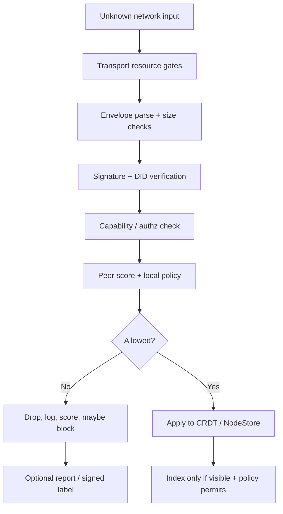
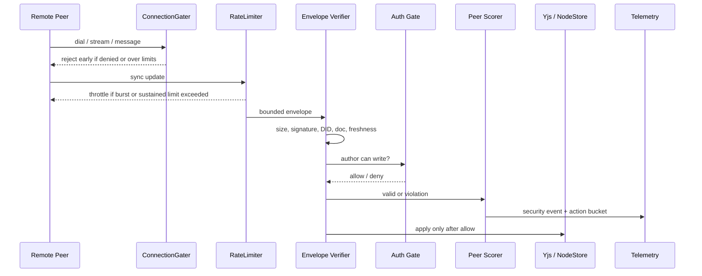
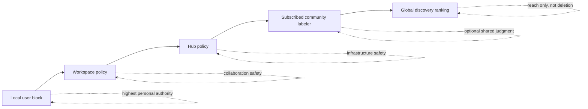
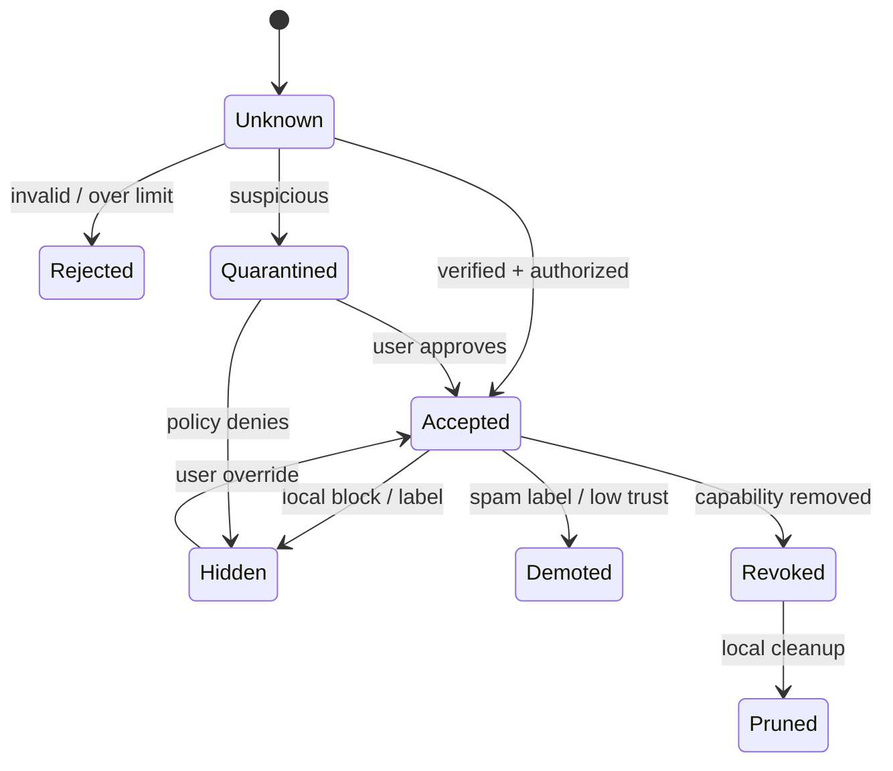
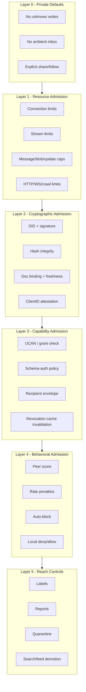
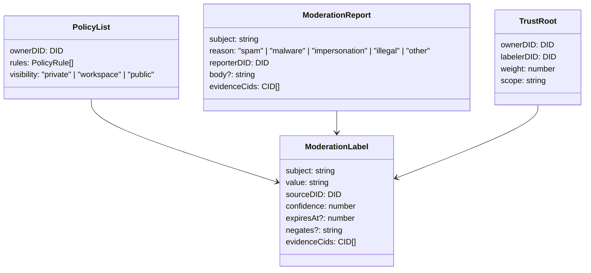
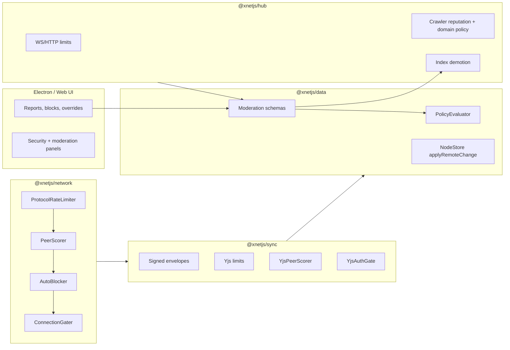
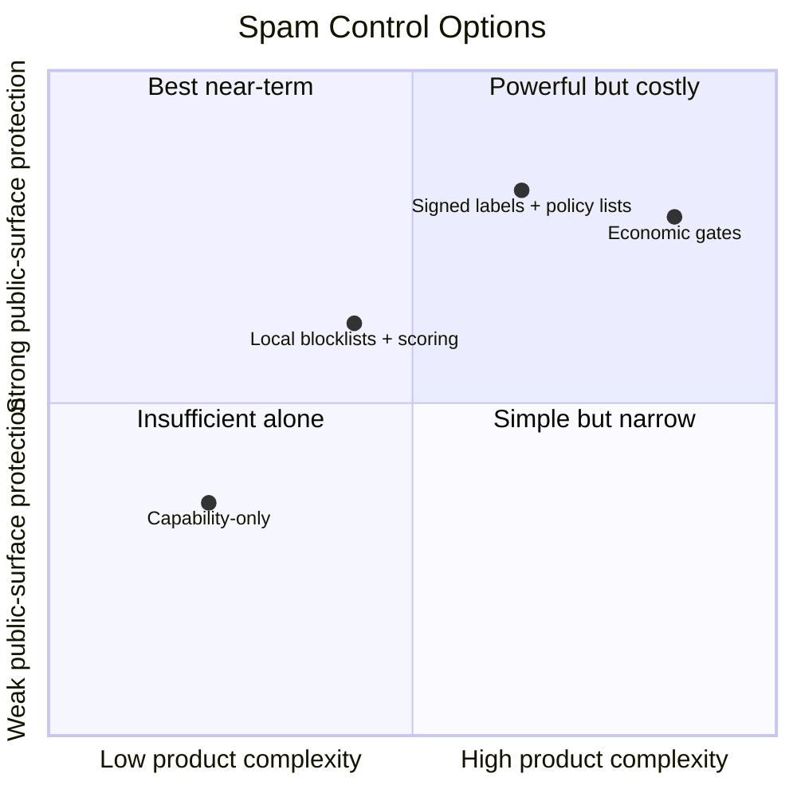
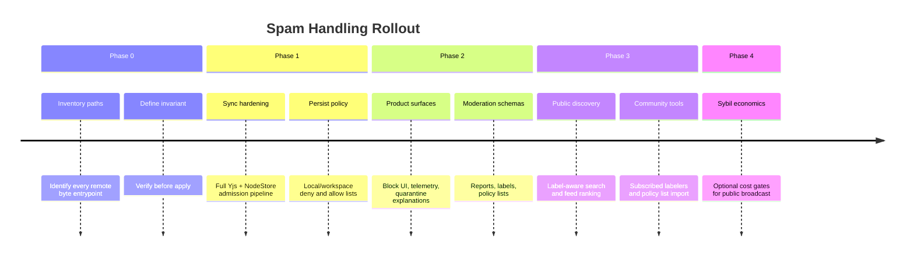

# How Will xNet Handle Spam?

> Status: Exploration  
> Created: 2026-05-20  
> Scope: spam, abuse, sybil resistance, moderation, sync safety, hub operations, decentralized discovery

## 🧭 Problem Statement

xNet is local-first, peer-to-peer, and eventually wants broader discovery, sharing, search, social, and hub-mediated connectivity. Those properties make spam different from a centralized SaaS product:

- There is no universal server that can delete every bad actor.
- DIDs are cheap unless xNet adds a cost, invitation, or reputation gate.
- CRDT sync can faithfully preserve malicious writes if admission checks are weak.
- Public discovery/search layers can amplify spam even when private workspaces are safe.
- Moderation needs to be local and pluralistic without making the app unusable.

The core question is not "which spam detector should xNet use?" The better question is:

> How should xNet make unwanted data expensive to inject, cheap to reject, visible to audit, and removable from a user's reach without pretending there is one global truth?

## 🔎 Executive Summary

xNet should handle spam through a layered "trust firewall" rather than a single moderation engine.

1. **Private by default**: unknown peers should not be able to write into a user's local graph, workspace, inbox, or Yjs documents without an explicit capability or user action.
2. **Verify before apply**: all remote structured changes and rich-text updates need signature, hash, size, freshness, document binding, clientID attestation, and authorization checks before mutating local state.
3. **Resource gates first**: connection, stream, message, blob, sync, grant, crawl, and HTTP request limits should reject cheap floods before expensive validation work.
4. **Local blocklists plus subscribed labels**: users/workspaces/hubs should keep local deny/allow lists and optionally subscribe to signed external spam labels or community policy lists.
5. **Hubs are infrastructure, not truth**: signaling/search/crawl hubs should protect themselves with rate limits, crawler reputation, domain blocklists, admission policy, and transparent logs, but they should not become the only moderation authority.
6. **Spam state is data**: blocks, reports, labels, appeals, and policy subscriptions should be modeled as signed xNet nodes so they can sync, audit, expire, fork, and be overridden.



## 🧱 Current State In The Repository

### Existing Anti-Spam Building Blocks

| Layer                         | Existing code                                                       | What it already does                                                                                                        | Spam relevance                                                               |
| ----------------------------- | ------------------------------------------------------------------- | --------------------------------------------------------------------------------------------------------------------------- | ---------------------------------------------------------------------------- |
| Yjs update limits             | `packages/sync/src/yjs-limits.ts`                                   | 1 MB update cap, 50 MB document cap, per-second and per-minute update windows, chunk helpers                                | Blocks oversized rich-text floods and high-frequency update spam             |
| Yjs peer scoring              | `packages/sync/src/yjs-peer-scoring.ts`                             | Penalizes invalid signatures, oversized updates, rate excess, unsigned updates, unattested client IDs, unauthorized updates | Converts repeated bad sync behavior into warn/throttle/block actions         |
| Signed Yjs envelopes          | `packages/sync/src/yjs-envelope.ts`                                 | V1 and V2 signed update envelopes; V2 binds author DID, client ID, timestamp, doc ID, and multi-level signatures            | Prevents forged authorship and cross-document replay when consistently used  |
| Yjs auth gate                 | `packages/sync/src/yjs-authorization.ts`                            | Checks whether envelope author can write the target node via `PolicyEvaluator`                                              | Rejects unwanted collaborators even if the update is cryptographically valid |
| Network rate limits           | `packages/network/src/security/rate-limiter.ts`                     | Token-bucket sync/protocol rate limiters with per-peer penalties and boosts                                                 | Throttles protocol abuse before it becomes app state                         |
| Network connection gates      | `packages/network/src/security/gater.ts`, `tracker.ts`, `limits.ts` | Connection, pending connection, per-IP, per-peer, stream, and deny/allow controls                                           | Protects nodes from connection floods and stream exhaustion                  |
| Network peer scorer           | `packages/network/src/security/peer-scorer.ts`                      | Reputation-like scoring with invalid signature, invalid data, rate-limit, and latency signals                               | Supports adaptive throttling and auto-blocking                               |
| Auto blocker                  | `packages/network/src/security/auto-blocker.ts`                     | Blocks peers after event thresholds, including invalid signatures and rate-limit violations                                 | Turns repeated abuse into timed denylist entries                             |
| Workspace access lists        | `packages/network/src/security/access-list.ts`                      | Global and workspace denylist, IP denylist, allowlist mode, export/import                                                   | Provides manual and workspace-scoped control                                 |
| NodeStore remote verification | `packages/data/src/store/store.ts`                                  | Verifies hash and signature, then evaluates authz before applying remote changes                                            | Strong foundation for structured data spam rejection                         |
| Grant rate limits             | `packages/data/src/auth/grant-rate-limit.ts`                        | Limits grant attempts per DID per minute                                                                                    | Prevents permission/share spam bursts                                        |
| Hub WS/HTTP limits            | `packages/hub/src/middleware/rate-limit.ts`, `http-rate-limit.ts`   | Per-connection message rate, max message size, max connections, per-IP HTTP windows                                         | Protects centralized relay/search surfaces                                   |
| Hub crawler controls          | `packages/hub/src/services/crawl.ts`                                | Domain cooldowns, blocklist, robots checks, crawler reputation                                                              | Prevents search/crawl spam from dominating public discovery                  |
| Security telemetry schema     | `packages/telemetry/src/schemas/security.ts`                        | Models invalid signatures, rate limits, floods, score drops, blocks, anomalies                                              | Gives product and ops surfaces a common event vocabulary                     |

### Important Gap: The Strong Stack Is Not Yet A Single Pipeline

The repository has the pieces, but spam protection depends on consistently wiring them together.

`docs/reviews/2026-01-30/05-sync-network.md` already called out that the sync layer has a well-designed security stack while network sync historically bypassed large parts of it. The current `packages/network/src/protocols/sync.ts` verifies V1 envelopes for sync responses when present, but it still does not show a complete inbound pipeline for:

- V2 envelopes with doc ID binding and freshness policy.
- `YjsRateLimiter`.
- `YjsPeerScorer`.
- `YjsAuthGate`.
- `ClientID-DID` attestation.
- Yjs update structural validation before `Y.applyUpdate`.
- Auto-blocker feedback.

That means xNet has good primitives, but "how spam is handled" should become an explicit product invariant:

> No untrusted peer bytes mutate local state until the full admission pipeline says yes.



## 🧨 Spam Taxonomy For xNet

xNet needs to define spam broadly enough to cover decentralized failure modes:

| Spam class           | Example                                           | Primary defense                                                        |
| -------------------- | ------------------------------------------------- | ---------------------------------------------------------------------- |
| Sync flood           | Peer sends thousands of Yjs updates               | Rate limiter, update batching, peer score, auto-block                  |
| Oversized payload    | 200 MB update/blob/media                          | Size caps, content-address verification, chunk policy                  |
| Forged authorship    | Change claims another DID                         | Signature and DID verification                                         |
| Unauthorized edit    | Valid DID writes to node without permission       | `PolicyEvaluator`, grant revocation, Yjs auth gate                     |
| Share spam           | Repeated invites/grants/requests                  | Grant rate limits, inbox allowlist, sender reputation                  |
| Mention/comment spam | Public or shared docs receive junk annotations    | Schema permissions, per-surface moderation, local labels               |
| Search spam          | Low-quality nodes/domains dominate public results | Crawl reputation, domain cooldowns, labels, ranking demotion           |
| Sybil swarm          | Many fresh DIDs act as one attacker               | Capability-first admission, invitation graph, cost/rate per trust root |
| Relay abuse          | Hub or signaling room gets flooded                | Hub rate limits, room admission, per-IP limits, blocklists             |
| Abuse reports spam   | False reports used to censor                      | Signed reports, local trust weighting, appeals, multiple labelers      |

## 🌐 External Research

### libp2p: DoS Is A Protocol Design Problem

libp2p's DoS mitigation guidance frames P2P abuse as a resource asymmetry problem: a malicious peer should not be able to make honest peers spend much more CPU, memory, bandwidth, or connection capacity than the attacker spent. It recommends limiting connections/streams, logging misbehavior, monitoring, and using connection gaters, allowlists, denylists, resource managers, and automated blocking.

xNet already mirrors much of this with `DefaultConnectionGater`, `ConnectionTracker`, `SyncRateLimiter`, `PeerScorer`, and `AutoBlocker`. The missing step is making those gates mandatory on every public peer/hub path.

Source: [libp2p DoS Mitigation](https://libp2p.io/docs/dos-mitigation/)

### ActivityPub / Mastodon: Federation Needs Instance-Level Policy

ActivityPub includes actor-level `Block` behavior. Mastodon adds practical server-wide moderation through domain blocks with levels like rejecting media, limiting, and suspending whole servers. The key lesson for xNet is that user-level blocking is not enough when abuse is organized by an upstream domain/server/community.

xNet's equivalent should be workspace/hub/community-level policy lists, not only one-off peer blocks.

Sources: [W3C ActivityPub Block Activity](https://www.w3.org/TR/activitypub/), [Mastodon Moderating Entire Websites](https://docs.joinmastodon.org/admin/moderation/)

### AT Protocol: Separate Speech From Reach With Signed Labels

AT Protocol's moderation model separates the ability to publish from the ability to be amplified. Its label specification models labels as self-authenticating metadata with a source DID, subject URI, value, optional negation/expiration, and signatures when transferred between services.

This is a strong fit for xNet because xNet can let data exist locally while deciding whether a feed, search view, inbox, or public discovery layer should show or rank it.

Sources: [AT Protocol Moderation](https://atproto.com/guides/moderation), [AT Protocol Labels](https://atproto.com/specs/label)

### Nostr: Reports As Portable Events

NIP-56 defines report events with reason categories including `spam`, `malware`, `impersonation`, and `illegal`. It is intentionally lightweight: clients and relays can choose how to interpret reports.

xNet can adopt the shape, not necessarily the exact protocol: signed report nodes should be portable evidence, and consumers decide whose reports to trust.

Source: [NIP-56 Reporting](https://nips.nostr.com/56)

### Matrix: Shared Policy Lists Are Ordinary Data

Matrix community moderation commonly uses policy/ban lists that can be public rooms of moderation events, watched by bots and communities. This aligns with xNet's "everything is a node" direction: moderation policies can be replicated data, not hard-coded platform state.

Source: [Matrix Community Moderation](https://matrix.org/docs/communities/moderation/)

### UCAN: Capability Attenuation Is Anti-Spam Infrastructure

UCAN Delegation is explicitly about attenuated authority between principals. Its capabilities, time bounds, and proof validation map directly to spam reduction: peers should receive the minimum capability needed, for the shortest useful duration, scoped to the narrowest resource.

Source: [UCAN Delegation Specification](https://ucan.xyz/delegation/)

## 🧩 Key Findings

### 1. xNet Is Naturally Resistant To Global Inbox Spam

Local-first data does not require accepting writes from strangers. If xNet keeps the default posture as "private owner graph with explicit sharing", most spam becomes blocked at the capability boundary.

The dangerous moment is when xNet adds public surfaces:

- Public profiles.
- Public comments.
- Public search/discovery.
- Follow/social feeds.
- Public plugin marketplaces.
- Hub-mediated group rooms.
- Cross-community indexes.

Those surfaces need separate reach policies even if the underlying write path is cryptographically valid.

### 2. Cheap DIDs Mean Identity Alone Is Not Sybil Resistance

DID signatures answer "who signed this?" They do not answer "is this actor worth listening to?" or "is this the same spammer with a new key?"

xNet should not rely on global identity reputation early. It should rely on:

- Capabilities from known peers.
- Workspace-local trust.
- Admission by invitation or explicit follow.
- Per-trust-root rate limits.
- Optional community labels.
- Optional proof-of-work/stake/payment only for public broadcast surfaces, not private collaboration.

### 3. Spam Decisions Need Different Scopes



No single scope should silently override all others. A hub can refuse relay service. A user can still keep local data. A labeler can demote content in subscribed views. A workspace admin can remove a collaborator from that workspace.

### 4. xNet Should Prefer Reach Reduction Over Data Destruction

For decentralized systems, deletion is hard to guarantee after data has reached peers. xNet should distinguish:

- **Reject**: never accept or apply the data.
- **Hide**: keep local bytes but do not show by default.
- **Demote**: lower rank in feeds/search.
- **Quarantine**: isolate pending review.
- **Revoke**: remove future access.
- **Prune**: delete local cached data when safe and user-approved.



### 5. Public Discovery Needs Its Own Spam Budget

The hub crawler already has domain cooldowns, robots checks, blocklists, and crawler reputation. That is a good seed for public search anti-spam, but a future distributed search layer will also need:

- Per-domain indexing budgets.
- Duplicate and near-duplicate detection.
- Link-farm detection.
- Signed source provenance.
- Label-aware ranking.
- Public/private visibility filters.
- Appeal and override mechanics.

The current search exploration (`0023_[_]_DECENTRALIZED_SEARCH.md`) proposes federated search tiers. Any workspace/global tier should require a spam budget before launch.

## 🛡️ Recommended Architecture

### Layered Spam Firewall



### Spam Policy As Signed Nodes

Create first-class schemas for moderation data:

| Schema                                   | Purpose                                                                                   | Notes                                                |
| ---------------------------------------- | ----------------------------------------------------------------------------------------- | ---------------------------------------------------- |
| `xnet://xnet.fyi/moderation/report`      | User/workspace report of content, peer, domain, hub, or labeler                           | Signed by reporter DID; may include evidence CIDs    |
| `xnet://xnet.fyi/moderation/label`       | Signed annotation like `spam`, `malware`, `scam`, `impersonation`, `!hide`, `!quarantine` | Inspired by AT Protocol labels; can expire or negate |
| `xnet://xnet.fyi/moderation/policy-list` | Collection of deny/allow/label rules                                                      | Matrix-style shared policy list as ordinary data     |
| `xnet://xnet.fyi/moderation/appeal`      | Request to reverse label/block                                                            | Local workflow, not global adjudication              |
| `xnet://xnet.fyi/moderation/trust-root`  | User-chosen labelers/communities and weights                                              | Makes moderation subscriptions explicit              |



### Decision Function

The spam decision should be a pure, inspectable function over facts. This keeps the implementation functional and testable.

```typescript
type SpamAction = 'allow' | 'demote' | 'quarantine' | 'hide' | 'reject' | 'block-peer'

type SpamFacts = {
  peerScore: number
  transportViolations: number
  signatureValid: boolean
  authorized: boolean
  localDenylisted: boolean
  workspaceDenylisted: boolean
  subscribedLabels: ReadonlyArray<{ value: string; weight: number; expiresAt?: number }>
  userOverride?: SpamAction
}

export function decideSpamAction(facts: SpamFacts, now = Date.now()): SpamAction {
  if (facts.userOverride) return facts.userOverride
  if (!facts.signatureValid || !facts.authorized) return 'reject'
  if (facts.localDenylisted || facts.workspaceDenylisted) return 'hide'
  if (facts.transportViolations >= 3 || facts.peerScore <= -50) return 'block-peer'

  const activeLabelScore = facts.subscribedLabels
    .filter((label) => !label.expiresAt || label.expiresAt > now)
    .reduce((score, label) => {
      if (label.value === 'malware' || label.value === 'scam') return score + label.weight * 2
      if (label.value === 'spam' || label.value === 'impersonation') return score + label.weight
      return score
    }, 0)

  if (activeLabelScore >= 2) return 'hide'
  if (activeLabelScore >= 1) return 'quarantine'
  if (activeLabelScore > 0) return 'demote'

  return 'allow'
}
```

### Runtime Placement



## ⚖️ Options And Tradeoffs

### Option A: Capability-Only Spam Control

Unknown peers cannot write unless invited or delegated.

**Pros**

- Simple and robust for private collaboration.
- Strongly aligned with local-first and UCAN.
- Avoids subjective moderation complexity early.

**Cons**

- Does not solve public feeds, search, comments, or marketplaces.
- Does not handle compromised trusted peers well.
- Can feel closed if xNet wants public social/discovery.

### Option B: Local Blocklists + Peer Scoring

Use current scoring and access-list machinery, expose it in product UX, and persist decisions.

**Pros**

- Builds on existing code.
- Works without global governance.
- Good for abuse from known peers and hubs.

**Cons**

- Weak against large Sybil sets.
- Local policy data needs migration/persistence.
- Users need good defaults, otherwise controls become noisy.

### Option C: Signed Label Ecosystem

Introduce AT Protocol-style moderation labels and Matrix-style policy subscriptions.

**Pros**

- Decentralized and composable.
- Lets communities share anti-spam work.
- Separates reach from existence of data.

**Cons**

- Requires trust UI and labeler discovery.
- False reports/labels become an abuse vector.
- Needs schema, signature, expiration, negation, and conflict semantics.

### Option D: Economic / Cost Gates For Public Broadcast

Require proof-of-work, payment, stake, or scarce invitation edges for public submissions.

**Pros**

- Directly raises cost of Sybil spam.
- Useful for public indexes and unsolicited messages.

**Cons**

- Product and accessibility risk.
- Hard to tune across devices and jurisdictions.
- Should not be required for private collaboration.

### Recommended Blend

Use A + B immediately, design C now, reserve D for public broadcast surfaces only.



## ✅ Recommendation

### P0: Make Remote Mutation Admission Explicit

Before broader multiplayer or public sharing, define one shared remote admission pipeline and require it from all sync paths.

- V2 signed envelope required for new rich-text replication.
- Size and rate checks before expensive validation.
- Signature, DID, doc ID, timestamp/freshness, hash, and clientID attestation checks.
- Authz check before `Y.applyUpdate` or `NodeStore.applyRemoteChange`.
- Peer score update on every rejection or valid apply.
- Auto-block and access-list integration.
- Security telemetry for every reject/throttle/block path.

### P1: Persist And Expose Local Policy

Promote access lists and blocks from in-memory helpers into user/workspace data:

- Local peer blocks.
- Workspace deny/allow lists.
- Hub endpoint trust decisions.
- Domain blocks for crawled/discovered content.
- Per-surface defaults: inbox, comments, search, public profile, plugin marketplace.

### P2: Add Signed Moderation Nodes

Implement reports, labels, and policy lists as signed schemas. Start with local-only reports and labels. Then allow opt-in subscription to workspace/community labelers.

### P3: Make Public Discovery Label-Aware

Search, feeds, public profiles, marketplaces, and social timelines should consume labels and local policy before ranking or rendering.

### P4: Add Sybil Cost Only Where Needed

Do not impose costs on private sync. For public write/broadcast surfaces, consider one or more:

- Invite graph trust.
- Account age and successful interaction history.
- Device-local proof-of-work for anonymous submissions.
- Paid hub quotas.
- Human-reviewed community membership.

## 🛠️ Implementation Checklist

### P0 - Remote Admission Pipeline

- [ ] Define a shared `RemoteAdmissionPipeline` interface in `@xnetjs/sync` or `@xnetjs/network`.
- [ ] Require V2 Yjs envelopes for new network sync paths.
- [ ] Reject updates over `MAX_YJS_UPDATE_SIZE` before deserialization.
- [ ] Enforce `YjsRateLimiter` per peer and per document.
- [ ] Verify signature, DID, doc ID, timestamp freshness, and minimum security level.
- [ ] Verify clientID-DID attestation for collaborative Yjs sessions.
- [ ] Run `YjsAuthGate.canApplyUpdate()` before `Y.applyUpdate`.
- [ ] Score every valid update and every violation through `YjsPeerScorer`.
- [ ] Feed repeated violations into `AutoBlocker`.
- [ ] Emit privacy-preserving security telemetry for rejects, throttles, and blocks.
- [ ] Add malformed update tests before applying Yjs bytes.

### P1 - Local And Workspace Policy

- [ ] Persist `PeerAccessControl` configs in workspace storage.
- [ ] Add user-facing block/unblock controls for peers, DIDs, domains, hubs, and workspaces.
- [ ] Add allowlist mode for sensitive workspaces.
- [ ] Add endpoint trust policy for share links and hubs.
- [ ] Add revocation push or periodic re-auth for already-connected peers.
- [ ] Add UI to explain why a peer/content item was hidden or blocked.

### P2 - Signed Moderation Data

- [ ] Add `ModerationReportSchema`.
- [ ] Add `ModerationLabelSchema`.
- [ ] Add `ModerationPolicyListSchema`.
- [ ] Add `ModerationTrustRootSchema`.
- [ ] Support label expiration and negation.
- [ ] Support report evidence by CID and node reference.
- [ ] Add schema-level permissions for who can label/report in a workspace.
- [ ] Add import/export of policy lists.

### P3 - Reach And Discovery Controls

- [ ] Apply labels before search indexing public or shared content.
- [ ] Add demotion/quarantine/hide states to query result ranking.
- [ ] Add crawl-domain reputation and cooldown tuning.
- [ ] Add duplicate/near-duplicate detection for public search.
- [ ] Add public feed/inbox rate budgets.
- [ ] Add plugin marketplace publisher reputation and signature checks.

### P4 - Sybil Resistance For Public Surfaces

- [ ] Define which surfaces allow unsolicited input.
- [ ] Add per-surface trust requirements.
- [ ] Prototype invite-graph scoring.
- [ ] Evaluate proof-of-work only for anonymous public submissions.
- [ ] Evaluate paid hub quotas only for optional hosted/public infrastructure.

## 🧪 Validation Checklist

### Unit Tests

- [ ] Invalid signature rejects and increments score.
- [ ] Missing envelope rejects when signed replication is required.
- [ ] Oversized update rejects before signature verification.
- [ ] Rate-limit excess throttles and records telemetry.
- [ ] Unauthorized but validly signed update does not mutate state.
- [ ] ClientID mismatch rejects.
- [ ] Expired/stale envelope rejects.
- [ ] Policy list label expiration and negation work.
- [ ] User override beats subscribed labeler recommendation.

### Integration Tests

- [ ] Two peers can sync valid rich-text updates through the full admission pipeline.
- [ ] A malicious peer is auto-blocked after repeated invalid signatures.
- [ ] A revoked collaborator is disconnected or denied on next write.
- [ ] Hub WS closes clients after repeated message-rate violations.
- [ ] Search indexing skips or demotes spam-labeled public content.
- [ ] Workspace allowlist mode blocks unknown peers.

### Browser / Electron Checks

- [ ] Devtools security panel shows peer score, rate-limit, and block state.
- [ ] User can block/unblock a peer from a visible moderation surface.
- [ ] Hidden/quarantined content has a clear local explanation.
- [ ] Share flow does not imply trust in unknown endpoints.

### Adversarial / Fuzz Tests

- [ ] Fuzz Yjs envelope deserialization.
- [ ] Fuzz malformed msgpack sync messages.
- [ ] Fuzz UCAN proof chains and malformed capabilities.
- [ ] Simulate Sybil bursts from many fresh DIDs.
- [ ] Simulate connection flood from repeated IPs.
- [ ] Simulate public search spam with duplicate pages and link farms.

### Operational Checks

- [ ] Security telemetry buckets avoid leaking exact peer identifiers.
- [ ] Block thresholds can be tuned without release.
- [ ] Hub blocklists can be updated safely and audited.
- [ ] Policy imports are signed or clearly marked as untrusted.
- [ ] Moderation data has retention and export behavior documented.

## 🚚 Migration Strategy



1. Start by instrumenting all remote input paths.
2. Move existing in-memory security helpers behind one shared admission function.
3. Persist user/workspace policy.
4. Add signed moderation schemas.
5. Make public discovery consume moderation state.
6. Add optional cost gates only if public surfaces prove vulnerable.

## ❓ Open Questions

- Should xNet have a built-in default labeler, or only user/workspace selected labelers?
- Should moderation labels be encrypted in private workspaces, or visible to all members?
- What is the exact relationship between a DID peer ID and network peer ID when blocking?
- How should xNet handle malicious but valid Yjs updates that exploit application semantics rather than syntax?
- Should public search hubs publish transparency logs for domain blocks and demotions?
- How should policy-list conflicts be presented to non-technical users?
- What is the minimum viable anti-spam UX for the first multiplayer release?

## 🎯 Next Actions

- [ ] Write a small design RFC for `RemoteAdmissionPipeline`.
- [ ] Audit every `Y.applyUpdate`, `applyRemoteChange`, hub message handler, and crawler ingest call site.
- [ ] Implement P0 for the narrowest current sync path first.
- [ ] Add adversarial tests for invalid signatures, oversized updates, stale envelopes, and unauthorized writes.
- [ ] Add persisted local/workspace denylist storage.
- [ ] Draft moderation schemas and map them to devtools/security UI.

## 📚 References

### Local Code And Docs

- `packages/sync/src/yjs-limits.ts`
- `packages/sync/src/yjs-peer-scoring.ts`
- `packages/sync/src/yjs-envelope.ts`
- `packages/sync/src/yjs-authorization.ts`
- `packages/network/src/security/rate-limiter.ts`
- `packages/network/src/security/peer-scorer.ts`
- `packages/network/src/security/auto-blocker.ts`
- `packages/network/src/security/gater.ts`
- `packages/network/src/security/access-list.ts`
- `packages/network/src/protocols/sync.ts`
- `packages/data/src/store/store.ts`
- `packages/data/src/auth/grant-rate-limit.ts`
- `packages/hub/src/services/crawl.ts`
- `packages/hub/src/middleware/rate-limit.ts`
- `packages/hub/src/middleware/http-rate-limit.ts`
- `packages/telemetry/src/schemas/security.ts`
- `docs/reviews/2026-01-30/05-sync-network.md`
- `docs/explorations/0023_[_]_DECENTRALIZED_SEARCH.md`
- `docs/explorations/0083_[_]_UNIFIED_AUTHORIZATION_ARCHITECTURE.md`
- `docs/explorations/0094_[x]_CLOUDFLARE_OPTION_B_SECURITY_REVIEW_AND_HARDENING.md`

### External Sources

- [libp2p DoS Mitigation](https://libp2p.io/docs/dos-mitigation/)
- [W3C ActivityPub](https://www.w3.org/TR/activitypub/)
- [Mastodon Moderation Actions](https://docs.joinmastodon.org/admin/moderation/)
- [AT Protocol Moderation](https://atproto.com/guides/moderation)
- [AT Protocol Labels](https://atproto.com/specs/label)
- [NIP-56 Reporting](https://nips.nostr.com/56)
- [Matrix Community Moderation](https://matrix.org/docs/communities/moderation/)
- [UCAN Delegation Specification](https://ucan.xyz/delegation/)
