# Moderation, Public Comments, Likes, And Messaging On xNet

> Status: Exploration  
> Created: 2026-05-20  
> Scope: moderation, public interaction surfaces, comments, likes, reactions, messaging, inboxes, feeds, reports, labels

## 🧭 Problem Statement

xNet already has private collaboration primitives: signed nodes, schema-agnostic relations, universal comments, Yjs collaboration, grants, UCAN-capable hubs, and local-first storage. The next design problem is what happens when xNet stops being only a private workspace and becomes a place where people can publicly react to, discuss, message around, and discover each other's data.

This exploration asks:

> What should moderation and public interaction look like when comments, likes, reactions, and messages are themselves signed xNet nodes, but visibility, delivery, and reach are policy decisions?

The hard part is not adding a `Like` schema. The hard part is making public interaction feel useful without turning every shared node into an unmanaged global comment section.

## 🔎 Executive Summary

xNet should treat public comments, likes, reactions, follows, reports, and messages as **universal social edge nodes**. Each edge targets any node by ID, carries author DID and policy metadata, and is verified like any other remote change.

The recommendation:

1. **Keep canonical interaction data simple**: `Comment`, `Reaction`, `Message`, `Follow`, `Block`, `Mute`, `Report`, `ModerationLabel`, and `PolicyList` are signed nodes.
2. **Separate existence from visibility**: a public comment can exist, but each user, workspace, hub, or community decides whether to show, hide, blur, quarantine, demote, or reject it.
3. **Separate private messaging from public comments**: DMs and group messages need channel membership, delivery receipts, encryption metadata, and invitation/request flows; comments remain target-anchored public or shared discussion.
4. **Use capability-scoped public surfaces**: public does not mean "anyone can mutate my graph." Public commentability, replyability, reactions, quote-boosts, and DMs should be per-node or per-profile policies.
5. **Adopt stackable moderation**: combine local mutes/blocks, workspace roles, hub admission, signed labels, policy-list subscriptions, and optional human moderators.
6. **Derive counters and timelines**: like counts, reaction counts, unread counts, notification feeds, public discussion lists, and moderation queues are indexes over canonical nodes, not canonical truth.

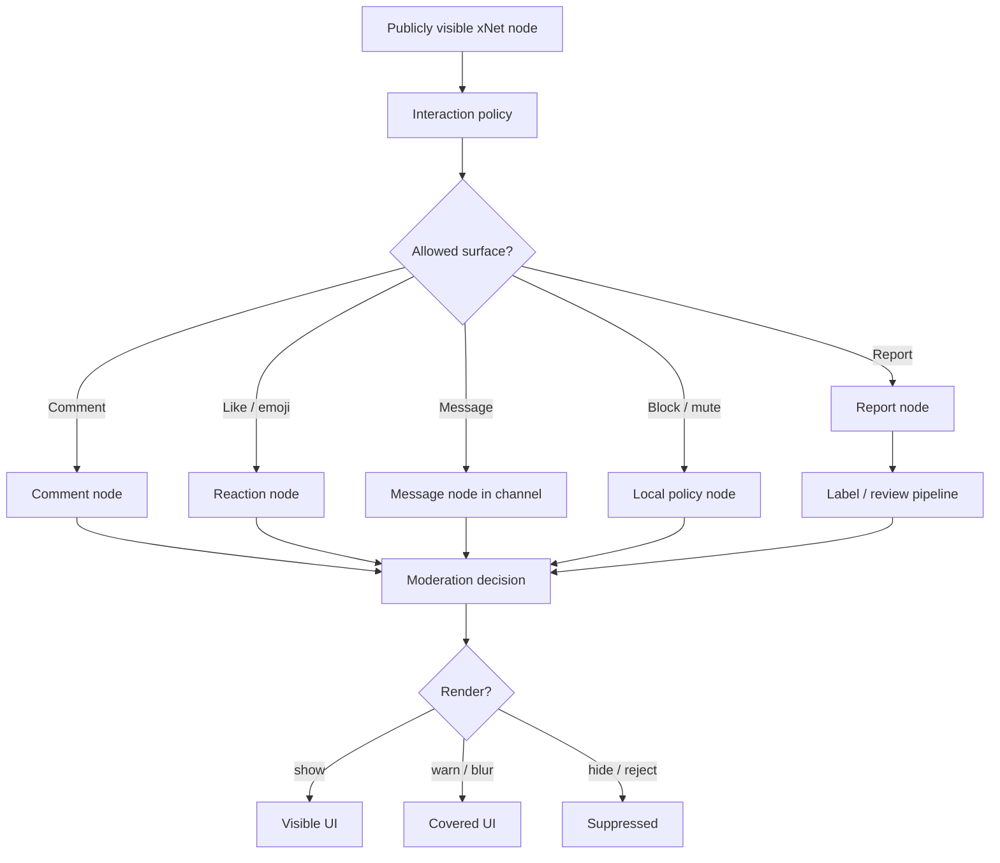

## 🧱 Current State In The Repository

### What Already Exists

| Surface                   | Existing code/docs                                                                                                                                    | Current shape                                                                                                                                               | Implication                                                                   |
| ------------------------- | ----------------------------------------------------------------------------------------------------------------------------------------------------- | ----------------------------------------------------------------------------------------------------------------------------------------------------------- | ----------------------------------------------------------------------------- |
| Universal comments        | `packages/data/src/schema/schemas/comment.ts`                                                                                                         | A single `Comment` schema targets any node, has flat replies, anchor type/data, markdown content, attachments, resolve/edit state, `createdAt`, `createdBy` | This is the best starting primitive for public discussion                     |
| Comment anchors           | `packages/data/src/schema/schemas/commentAnchors.ts`                                                                                                  | Text, database cell/row/column, canvas position/object, whole-node anchors                                                                                  | Public comments can target precise surfaces, not only top-level posts         |
| Comment references        | `packages/data/src/schema/schemas/commentReferences.ts`                                                                                               | Parses mentions, comment refs, and node refs from comment markdown                                                                                          | Mentions and notifications can be derived from content                        |
| Orphan detection          | `packages/data/src/schema/schemas/commentOrphans.ts`                                                                                                  | Detects deleted text/rows/columns/canvas objects                                                                                                            | Public comments need stale-anchor handling and moderation queues              |
| React hook                | `packages/react/src/hooks/useComments.ts`                                                                                                             | Lists all comment nodes, groups into flat threads, creates/replies/resolves/reopens/deletes/edits                                                           | Good local API, but currently list/filter is O(N) and not public-policy aware |
| Comment count hook        | `packages/react/src/hooks/useCommentCount.ts`                                                                                                         | Derives unresolved count through `useComments`                                                                                                              | Useful UX, but should become an indexed aggregate                             |
| UI components             | `packages/ui/src/composed/comments/*`                                                                                                                 | Sidebar, popover, bubble, thread picker, orphaned threads                                                                                                   | Good collaboration UI foundation                                              |
| Editor integration        | `packages/editor/src/extensions/comment/*`                                                                                                            | TipTap mark + ProseMirror plugin for text comments                                                                                                          | Public web annotations can reuse this                                         |
| Canvas integration        | `packages/canvas/src/comments/*`, `packages/canvas/src/hooks/useCanvasComments.ts`                                                                    | Pins comments to canvas positions or objects, orphan tray                                                                                                   | Public annotations on visual artifacts are already feasible                   |
| Database integration      | `apps/electron/src/renderer/components/DatabaseView.tsx`                                                                                              | Cell/row comments in Electron database UI                                                                                                                   | Good precedent for surface-specific policies                                  |
| Schema-agnostic relations | `packages/data/src/schema/properties/relation.ts`                                                                                                     | `target` is optional, so relations can point to any node                                                                                                    | Likes/reactions/bookmarks/reports can be universal                            |
| Auth presets              | `packages/data/src/auth/presets.ts`                                                                                                                   | private, public-read, collaborative, open, team policies                                                                                                    | Public read is present; public write/comment semantics need more nuance       |
| Hub auth                  | `packages/hub/src/auth/ucan.ts`, `capabilities.ts`                                                                                                    | UCAN via bearer/subprotocol, hub actions mapped to read/write/admin                                                                                         | Hubs can gate public interaction submission and relay                         |
| Spam exploration          | `docs/explorations/0129_[_]_HOW_WILL_XNET_HANDLE_SPAM.md`                                                                                             | Layered trust firewall, signed labels, policy lists                                                                                                         | This exploration builds on that model                                         |
| Prior social plans        | `docs/explorations/0030_[_]_UNIVERSAL_SOCIAL_PRIMITIVES.md`, `0028_[_]_CHAT_AND_VIDEO.md`, `0116_[_]_ARCHITECTING_DECENTRALIZED_TWITTER_X_ON_XNET.md` | Proposed universal Like/React/Boost/Flag, channels/messages, social timelines                                                                               | Conceptual groundwork exists; implementation still mostly absent              |

### Current Comment Model

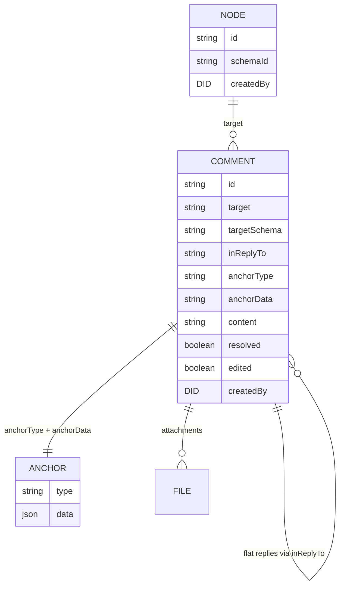

### Important Gaps

The current implementation is excellent for private/collaborative comments, but not yet sufficient for public interaction:

- No first-class `Reaction`, `Like`, `Boost`, `Follow`, `Mute`, `Block`, `Report`, or `ModerationLabel` schemas.
- No public interaction policy on nodes or profiles.
- No distinction between "can read node" and "can reply/comment/react/message author."
- No moderation decision function used by comments/reactions/messages before rendering.
- No indexed relation store for counts or "all comments targeting this node."
- No public inbox/request queue for unsolicited comments, mentions, follows, or DMs.
- No labeler subscription UX.
- No message/channel schemas in code yet.
- No aggregate counters with anti-spam semantics.
- No signed moderation queue or appeals model.

## 🌐 External Research

### ActivityPub / Mastodon

ActivityPub defines social delivery around actor inboxes and outboxes. Activities such as `Create`, `Follow`, `Like`, `Block`, `Undo`, and `Delete` are sent between actors and servers. Mastodon turns those into concrete product semantics: public/unlisted/private/direct statuses, favourites, boosts, replies, reports, and local/server-wide moderation. Mastodon explicitly notes that moderation is local to a server, including domain-level federation controls.

Lessons for xNet:

- Model social actions as signed activities/edge nodes.
- Use inbox/outbox concepts for delivery and replay.
- Treat server/hub moderation as local policy, not global truth.
- Keep direct messages separate from truly private E2E messaging expectations.

Sources: [W3C ActivityPub](https://www.w3.org/TR/activitypub/), [Mastodon Status API](https://docs.joinmastodon.org/methods/statuses/), [Mastodon Moderation](https://docs.joinmastodon.org/admin/moderation/)

### AT Protocol / Bluesky

Bluesky's moderation docs are directly relevant. Moderation is described as stackable: network takedowns, labels from moderation services, and user mutes/blocks. Labels can target accounts or records, include values like `spam`, support hide/warn/ignore preferences, and are interpreted differently by UI context such as content list, direct view, avatar, profile list, and media. Users can subscribe to labelers; reports are sent to selected labelers.

Lessons for xNet:

- Build a context-aware `ModerationDecision`, not a single boolean.
- Let users/workspaces subscribe to moderation labelers.
- Separate content existence from content rendering.
- Use label definitions with default behavior and user overrides.

Source: [Bluesky Labels and Moderation](https://docs.bsky.app/docs/advanced-guides/moderation)

### Matrix

Matrix models messages as room events. Reactions and replies are relationships to existing events. Matrix community moderation commonly uses policy/ban lists: a list is a regular Matrix room containing moderation events, and tools like Mjolnir watch those lists and apply bans across protected rooms.

Lessons for xNet:

- Treat moderation lists as ordinary replicated data.
- Apply community policy to many rooms/surfaces.
- Keep moderation tooling separate from core protocol so communities can choose tools.

Sources: [Matrix Community Moderation](https://matrix.org/docs/communities/moderation/), [Matrix Client-Server API](https://spec.matrix.org/latest/client-server-api/)

### Webmention / IndieWeb

Webmention is a W3C Recommendation for notifying a URL that another URL links to it. The spec explicitly supports replies, likes, bookmarks, RSVPs, and similar social responses. The receiving site decides how to verify, display, or ignore incoming mentions.

Lessons for xNet:

- A "public comment" can be a remote object that references a target, not necessarily a mutation inside the target owner's database.
- Public interactions need receiver-side validation and display policy.
- URL interoperability matters if xNet publishes public pages.

Source: [W3C Webmention](https://www.w3.org/TR/webmention/)

### Nostr

Nostr uses signed events relayed by servers. NIP-25 models reactions as events pointing at target events; NIP-56 models reports as subjective events consumed by clients/relays at their discretion; NIP-17 private DMs use sealed/gift-wrapped encrypted events for each receiver and sender copy.

Lessons for xNet:

- Reactions and reports can be independent signed events targeting content.
- Reports are subjective and should not be blindly trusted.
- Private messaging needs envelope-level metadata protection, not just encrypted message body text.

Sources: [NIP-25 Reactions](https://nips.nostr.com/25), [NIP-56 Reporting](https://nips.nostr.com/56), [NIP-17 Private Direct Messages](https://nips.nostr.com/17), [NIP-59 Gift Wrap](https://nips.nostr.com/59)

## 🧩 Key Findings

### 1. Public Comments Should Not Be Stored As Edits To The Target

The existing `Comment` schema gets this right. A comment is an independent node with `target`, `anchorType`, and `anchorData`. That means:

- The target author does not need to merge untrusted text into their document CRDT.
- Comments can be hidden, deleted, rejected, or accepted independently.
- Comment visibility can vary by viewer.
- Public comments can target pages, files, tasks, database cells, canvas objects, messages, posts, or any future node.

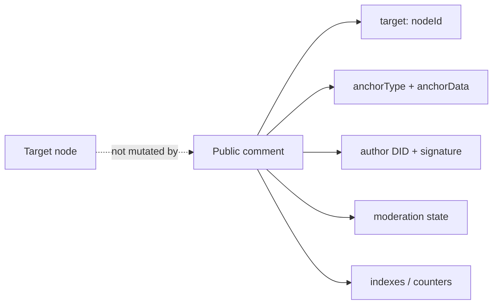

### 2. Likes And Reactions Are Universal Relation Edges

A like is just a signed claim from actor DID to target node. Emoji reactions are the same shape plus a reaction value. The important product decision is whether counts include:

- all known reactions,
- only reactions from accepted/trusted actors,
- only reactions visible to the current viewer,
- only reactions accepted by the target owner/community/hub,
- or a labeled subset like "verified followers."

Counts therefore need to be derived views, not raw truth.

### 3. Messaging Is Not Just Commenting Without An Anchor

Chat messages are structurally similar to comments, but they need different policy:

- Channel membership and join rules.
- Message delivery and unread state.
- DM request inbox.
- Blocking semantics.
- Encryption and key rotation.
- Attachment and media controls.
- Per-recipient delivery receipts.
- Retention/disappearing-message policy.
- Moderator actions in group channels.

So xNet should share rendering and social-edge patterns, but not collapse `Comment` and `Message` into one overloaded schema.

### 4. Public Accessibility Has Multiple Meanings

"Publicly accessible" should be decomposed:

| Dimension              | Meaning                                                                | Example                         |
| ---------------------- | ---------------------------------------------------------------------- | ------------------------------- |
| Public read            | Anyone can fetch/view the target                                       | Published page or post          |
| Public comment         | Anyone, authenticated users, followers, or members can attach comments | Blog comments, issue discussion |
| Public reaction        | Anyone/followers/members can like/react                                | Post likes                      |
| Public mention         | Others can mention this node/user                                      | Social replies                  |
| Public message request | Strangers can request a DM                                             | Profile contact setting         |
| Public indexing        | Search/discovery can index the content                                 | Public docs/search              |
| Public counters        | Aggregated counts are visible                                          | Like/comment counts             |
| Public moderation      | Reports/labels may be shared                                           | Community moderation            |

`presets.publicRead()` only covers one of these.

### 5. Moderation Must Be Contextual

A label that hides a post in a feed may only warn on direct view. A blocked user may be completely hidden in the blocker’s UI but still visible to someone else. A public comment may be visible under the commenter’s profile but quarantined on the target owner's page.

The system needs a context-aware decision:

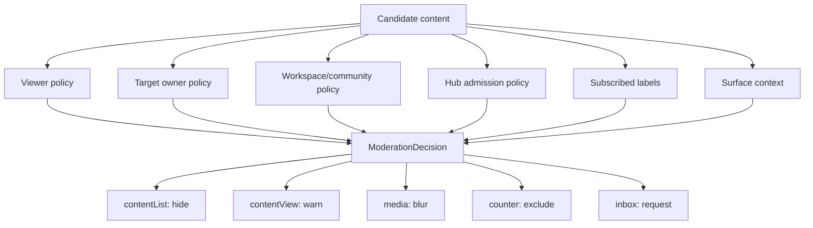

### 6. "Delete" In Public Systems Is Mostly A Local Tombstone

For comments/messages/reactions:

- The author can delete their own node by publishing a deletion/tombstone.
- The target owner can hide or reject it from their surface.
- A hub can stop relaying it.
- A community can label or ban it.
- Other peers may still have copies if they saw it before.

This argues for explicit tombstones, visibility policy, and moderation explanations instead of pretending deletion is global.

## 🏗️ Proposed Data Model

### Canonical Interaction Schemas

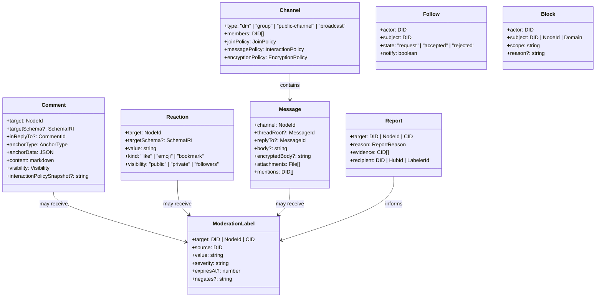

### Interaction Policy

Every public/profile/community/workspace surface should be able to declare interaction policy:

```typescript
type PublicScope = 'none' | 'followers' | 'members' | 'authenticated' | 'public'

type InteractionPolicy = {
  read: PublicScope
  comment: PublicScope
  react: PublicScope
  quote: PublicScope
  mention: PublicScope
  messageRequest: PublicScope
  requireApprovalForFirstContact: boolean
  allowAnonymousRead: boolean
  maxCommentLength: number
  maxAttachmentBytes: number
  defaultModeration: 'show' | 'warn' | 'quarantine'
}

type ModerationDecision = {
  acceptWrite: boolean
  render: 'show' | 'warn' | 'blur' | 'hide' | 'quarantine'
  includeInCounters: boolean
  includeInSearch: boolean
  notifyTarget: boolean
  reasons: string[]
}
```

### Public Comment Flow

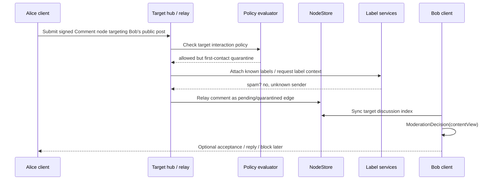

### Messaging Flow

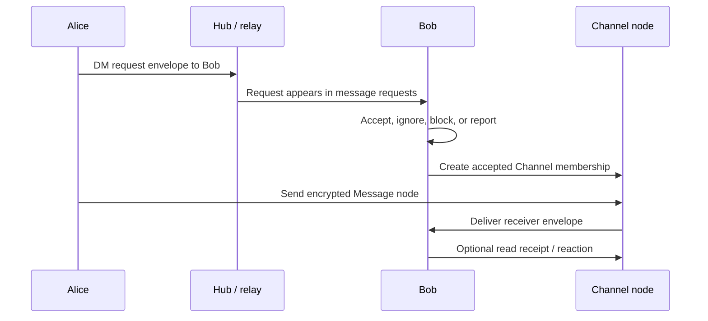

### Moderation Lifecycle

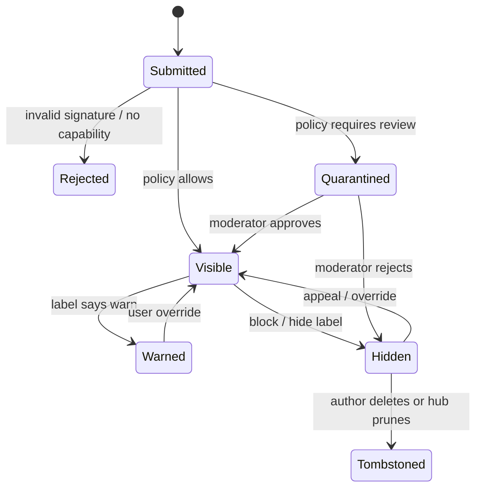

## 🧠 Product Model By Surface

### Public Comments

Recommended semantics:

- A comment is an independent node targeting another node.
- The target owner controls whether comments appear on their canonical public view.
- The commenter controls whether the comment appears on their own activity profile.
- Hubs can decline to relay or index comments that violate hub policy.
- Viewers can hide, mute, or subscribe to labels that change rendering.
- First-contact comments default to request/quarantine unless the target policy is intentionally open.

### Likes And Reactions

Recommended semantics:

- `Like` is a shorthand `Reaction` with `kind = "like"` and `value = "+"`.
- Emoji reactions are public by default only if the target allows public reactions.
- Bookmarks are private by default and should not affect public counters.
- Counts are derived and policy-filtered.
- A user can only have one active like per target; emoji reactions can be one per `(actor, target, emoji)`.
- Unlike/unreact should create a tombstone/undo edge, not mutate another user's node.

### Messaging

Recommended semantics:

- DMs and group chat are `Message` nodes inside `Channel` nodes.
- Public comments are not DMs, even if they look like message bubbles.
- Unknown senders go to message requests.
- Blocks stop future delivery and hide existing messages locally.
- DMs should use encrypted bodies and per-recipient delivery envelopes before being marketed as private.
- Moderation reports for DMs must handle consent: reported messages can include surrounding context, but this should be explicit and bounded.

### Mentions And Notifications

Recommended semantics:

- Mentions are parsed from comments/messages/posts, but notification delivery is a policy decision.
- Users can restrict who can mention them.
- Mention spam goes to requests/quarantine, not the main inbox.
- Notification nodes should be derived, dismissible, and rebuildable.

### Public Counters

Recommended semantics:

- Counters are materialized views over visible edges.
- Include count definitions in API responses: `rawKnown`, `visible`, `trusted`, `viewerVisible`.
- Do not let hidden/spam-labeled reactions inflate public ranking.

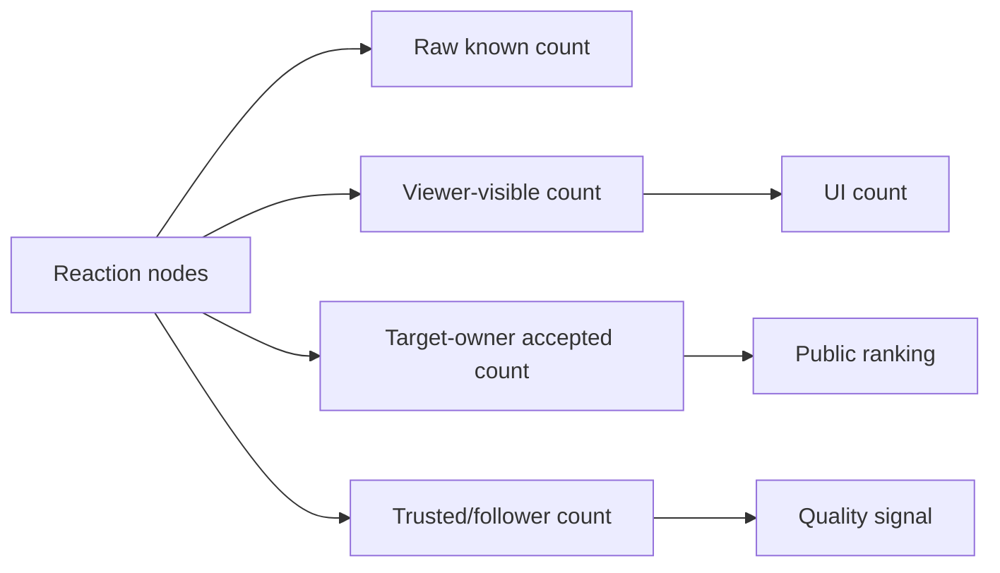

## ⚖️ Options And Tradeoffs

### Option A: Target-Owner Controlled Public Discussion

The target owner decides which comments/reactions appear on the canonical public page.

**Pros**

- Clean UX for published pages/posts.
- Low abuse exposure.
- Matches website/blog owner expectations.

**Cons**

- Can look censorial in public debate surfaces.
- Commenters may expect their replies to be visible somewhere.

Best fit: published pages, docs, portfolios, products, project pages.

### Option B: Community/Workspace Moderated Discussion

A workspace, community, or channel defines moderators and policy. Target owner is not the only authority.

**Pros**

- Better for forums, group chat, issue trackers, open source communities.
- Distributes moderation work.
- Supports shared norms.

**Cons**

- Requires roles, queues, audit logs, and appeals.
- Moderators become operational dependency.

Best fit: public projects, communities, support forums, shared channels.

### Option C: Fully Decentralized Replies

Anyone can publish a reply/comment edge; each viewer decides what to show.

**Pros**

- Maximum speech portability.
- Strong fit for decentralized social.
- Avoids target-owner monopoly over all replies.

**Cons**

- Harder UX.
- Public pages can become fragmented by viewer policy.
- Strong spam/label/indexing requirements.

Best fit: social timelines, cross-hub discussion, public annotations.

### Option D: Hub-Curated Public Surfaces

Hubs index and serve comment/reaction/message surfaces with their own policy.

**Pros**

- Practical performance.
- Easier abuse response.
- Good for hosted communities.

**Cons**

- Hub policy can become de facto platform policy.
- Requires portability and transparency to remain aligned with xNet.

Best fit: public search, trending, high-volume feeds, large communities.

### Recommended Blend

Use all four by surface:

| Surface                             | Recommended authority                            |
| ----------------------------------- | ------------------------------------------------ |
| Personal published page             | Target owner + viewer policy                     |
| Workspace doc                       | Workspace roles                                  |
| Public open source issue/discussion | Community moderators + viewer policy             |
| Social post reply graph             | Decentralized replies + label-aware views        |
| DM inbox                            | Recipient policy                                 |
| Public search/trending              | Hub policy + subscribed labels + viewer controls |

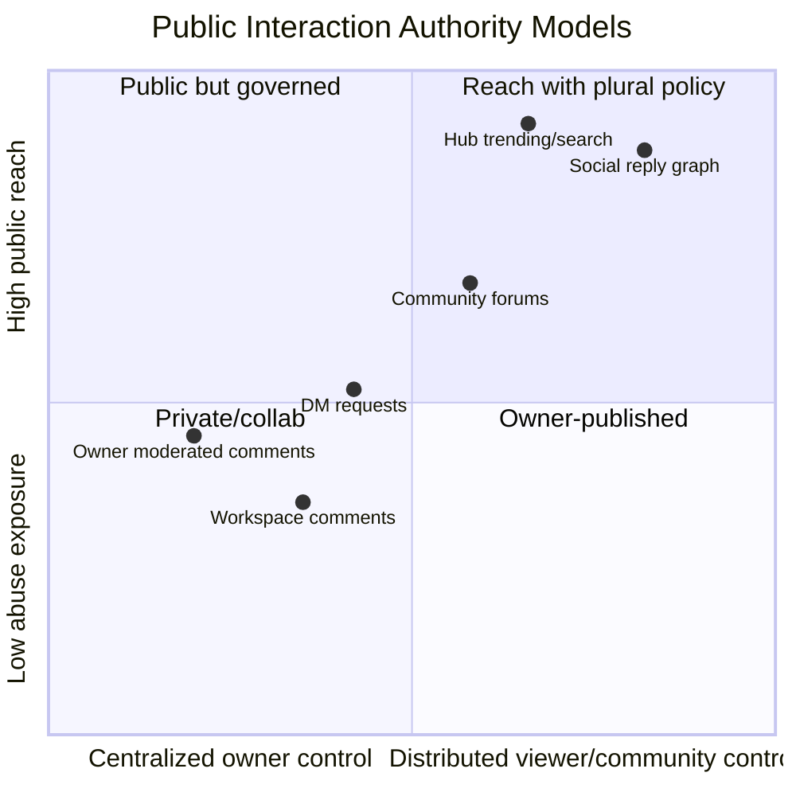

## ✅ Recommendation

### P0: Extend The Existing Comment Model With Policy

Keep `Comment` as the universal discussion primitive, but add surface policy and moderation-aware querying before making comments public.

- Add `visibility`, `status`, and optional moderation metadata to comment nodes or an adjacent `ModerationState` node.
- Add target interaction policies for commentability/reactionability/mentionability.
- Create policy-filtered hooks: `useVisibleComments`, `useModeratedThread`, `usePublicCommentSurface`.
- Add indexed queries for comments by target and thread.

### P1: Add Universal Reaction And Report Schemas

Implement `Reaction` and `Report` before messaging.

Reaction is lower-risk and validates the universal-edge model. Report validates moderation flow and signed evidence.

### P2: Build ModerationDecision As A Shared Function

Use a pure function that can be used by React hooks, hub services, search indexers, notification generators, and devtools.

### P3: Add Message / Channel Schemas Separately

Do not overload comments as chat. Add `Channel`, `Message`, `ChannelMembership`, `MessageReceipt`, and `MessageRequest` schemas with encryption hooks and membership policy.

### P4: Build Public Surface Indexes

Add materialized indexes for:

- comments by target,
- reactions by target/value,
- reports by target/status,
- unread message counts,
- notification feed,
- moderation queue,
- label lookup by target.

### P5: Add Labelers And Policy Lists

Once public surfaces exist, allow subscribed labelers and Matrix-style policy lists as signed xNet nodes.

## 🧪 Example Code

### Universal Reaction Schema

```typescript
import { defineSchema, relation, text, select, created, createdBy } from '@xnetjs/data'

export const ReactionSchema = defineSchema({
  name: 'Reaction',
  namespace: 'xnet://xnet.fyi/social/',
  properties: {
    target: relation({ required: true }),
    targetSchema: text({}),
    kind: select({
      options: [
        { id: 'like', name: 'Like' },
        { id: 'emoji', name: 'Emoji' },
        { id: 'bookmark', name: 'Bookmark' }
      ] as const,
      required: true,
      default: 'like'
    }),
    value: text({ required: true, maxLength: 64 }),
    visibility: select({
      options: [
        { id: 'public', name: 'Public' },
        { id: 'followers', name: 'Followers' },
        { id: 'private', name: 'Private' }
      ] as const,
      required: true,
      default: 'public'
    }),
    createdAt: created(),
    createdBy: createdBy()
  },
  document: undefined
})
```

### Context-Aware Moderation Decision

```typescript
type ModerationContext =
  | 'contentList'
  | 'contentView'
  | 'commentThread'
  | 'messageInbox'
  | 'counter'
  | 'searchIndex'

type ModerationInput = {
  context: ModerationContext
  viewerDid: string
  authorDid: string
  targetOwnerDid?: string
  localBlocked: boolean
  workspaceBlocked: boolean
  firstContact: boolean
  labels: ReadonlyArray<{ value: string; setting: 'hide' | 'warn' | 'ignore'; source: string }>
}

type ModerationDecision = {
  render: 'show' | 'warn' | 'hide' | 'quarantine'
  includeInCounters: boolean
  notify: boolean
  reasons: string[]
}

export function decideModeration(input: ModerationInput): ModerationDecision {
  const reasons: string[] = []

  if (input.localBlocked || input.workspaceBlocked) {
    return { render: 'hide', includeInCounters: false, notify: false, reasons: ['blocked'] }
  }

  const hideLabel = input.labels.find((label) => label.setting === 'hide')
  if (hideLabel) {
    return {
      render: input.context === 'contentView' ? 'warn' : 'hide',
      includeInCounters: false,
      notify: false,
      reasons: [`label:${hideLabel.source}:${hideLabel.value}`]
    }
  }

  if (input.firstContact && input.context === 'messageInbox') {
    return {
      render: 'quarantine',
      includeInCounters: false,
      notify: false,
      reasons: ['first-contact-request']
    }
  }

  const warnLabel = input.labels.find((label) => label.setting === 'warn')
  if (warnLabel) {
    reasons.push(`label:${warnLabel.source}:${warnLabel.value}`)
    return { render: 'warn', includeInCounters: true, notify: true, reasons }
  }

  return { render: 'show', includeInCounters: true, notify: true, reasons }
}
```

## 🛠️ Implementation Checklist

### P0 - Public Interaction Policy

- [ ] Add `InteractionPolicy` type to `@xnetjs/core` or `@xnetjs/data`.
- [ ] Add policy fields or linked policy node for public profiles/pages/posts.
- [ ] Distinguish `read`, `comment`, `react`, `quote`, `mention`, and `messageRequest`.
- [ ] Add policy evaluation tests for public, authenticated, followers, members, and none.
- [ ] Add first-contact handling for comments, mentions, and message requests.
- [ ] Add user settings for who can comment, react, mention, and DM.

### P1 - Comment Moderation

- [ ] Add `visibility` and `status` fields or adjacent moderation-state node for comments.
- [ ] Add moderation-aware comment query hook.
- [ ] Add indexed comments-by-target query instead of full schema scan.
- [ ] Add target-owner hide/reject controls.
- [ ] Add report/block controls on comment bubbles.
- [ ] Add UI states for hidden, warned, quarantined, deleted, and orphaned comments.
- [ ] Preserve tombstoned root comments when replies exist.

### P2 - Reactions / Likes

- [ ] Add `ReactionSchema`.
- [ ] Add dedupe semantics for `(actor DID, target, kind, value)`.
- [ ] Add unlike/unreact tombstone operation.
- [ ] Add aggregate reaction indexes by target/value.
- [ ] Add policy-filtered counts.
- [ ] Add private bookmark mode that never contributes to public counters.

### P3 - Reports, Labels, And Policy Lists

- [ ] Add `ReportSchema`.
- [ ] Add `ModerationLabelSchema`.
- [ ] Add `PolicyListSchema`.
- [ ] Add report evidence references by node ID and CID.
- [ ] Add label expiration and negation.
- [ ] Add subscribed-labeler settings.
- [ ] Add moderation queue UI for target owners/workspace moderators.
- [ ] Add appeal/override workflow.

### P4 - Messaging

- [ ] Add `ChannelSchema`.
- [ ] Add `ChannelMembershipSchema`.
- [ ] Add `MessageSchema`.
- [ ] Add `MessageRequestSchema`.
- [ ] Add `MessageReceiptSchema`.
- [ ] Add encrypted body and per-recipient envelope fields.
- [ ] Add DM request inbox.
- [ ] Add block behavior for channel invites and DMs.
- [ ] Add group moderator roles and message deletion/tombstone policy.

### P5 - Hub And Index Support

- [ ] Add hub endpoints for public interaction submission with UCAN auth.
- [ ] Add rate limits per DID, target node, channel, and hub room.
- [ ] Add materialized indexes for comments/reactions/messages/reports.
- [ ] Add label-aware search and notification filtering.
- [ ] Add moderation transparency/audit logs for hub-level actions.
- [ ] Add import/export of community policy lists.

## ✅ Validation Checklist

### Unit Tests

- [ ] Comment policy denies comment writes when target policy is `none`.
- [ ] Public read does not imply public comment.
- [ ] Like dedupe prevents duplicate likes from the same DID.
- [ ] Unlike tombstone removes viewer-visible like count.
- [ ] Hidden/spam-labeled reactions do not inflate public counts.
- [ ] Blocked user comments are hidden for the blocker.
- [ ] First-contact DM goes to request inbox.
- [ ] Report reason validation rejects unsupported values.
- [ ] Label expiration and negation work.

### Integration Tests

- [ ] Public page accepts comments from allowed actor and displays them.
- [ ] Public page quarantines first-contact comments when policy requires review.
- [ ] Workspace moderator can hide a public comment without deleting the underlying node.
- [ ] Viewer override can show a warning-labeled comment in direct view.
- [ ] Hub rejects over-limit comment/reaction submission bursts.
- [ ] DM channel membership prevents non-members from reading messages.
- [ ] Blocking a sender stops new message request delivery.
- [ ] Search index excludes hidden/quarantined comments.

### UI Validation

- [ ] Comment bubble exposes report, block/mute, hide, and copy link controls.
- [ ] Public comment thread clearly distinguishes visible, hidden, warned, quarantined, and deleted states.
- [ ] Like/reaction counters explain their scope when needed.
- [ ] DM request inbox has accept, ignore, block, and report actions.
- [ ] Moderation queue is usable with keyboard navigation.
- [ ] Label explanations are visible without overwhelming normal reading.

### Security / Abuse Validation

- [ ] Fuzz comment markdown rendering and reference parsing.
- [ ] Fuzz reaction values and custom emoji shortcodes.
- [ ] Verify all remote interaction nodes are signed and hash-checked before indexing.
- [ ] Verify reports cannot force automatic takedowns without trusted policy.
- [ ] Verify hub rate limits apply per DID and per target node.
- [ ] Verify private bookmarks are not leaked through sync or counters.
- [ ] Verify encrypted DMs are not rendered from plaintext fields.

## 🚚 Migration Strategy

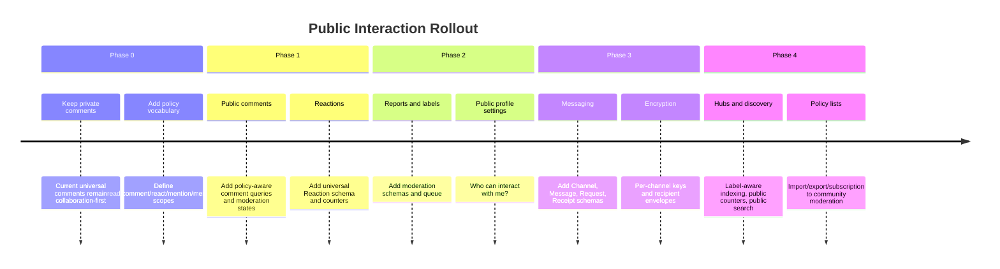

## ❓ Open Questions

- Should `Comment` gain public moderation fields directly, or should moderation state be a separate edge node?
- Should likes and emoji reactions be one `Reaction` schema or separate `Like` plus `Reaction` schemas?
- Should target owners be able to prevent all decentralized replies, or only prevent display on their canonical surface?
- How should xNet define "followers" before a full follow graph exists?
- Should DMs be available before encrypted message envelopes are complete?
- Should public counters show raw known totals or policy-filtered totals by default?
- Who can moderate comments on a shared document: owner, editors, workspace admins, or explicit moderators?
- How should moderation decisions sync across a user's devices without leaking private mutes/blocks?
- Should Webmention interoperability be a first-class public web feature?

## 🎯 Next Actions

- [ ] Write an RFC for `InteractionPolicy` and context-aware `ModerationDecision`.
- [ ] Add `ReactionSchema` and tests as the smallest universal social primitive after comments.
- [ ] Add indexed comments-by-target support to avoid full comment scans.
- [ ] Add report/block/hide controls to comment UI.
- [ ] Draft `ReportSchema`, `ModerationLabelSchema`, and `PolicyListSchema`.
- [ ] Draft messaging schemas separately from comments.
- [ ] Define public profile settings for comments, reactions, mentions, and DMs.

## 📚 References

### Local Code And Docs

- `packages/data/src/schema/schemas/comment.ts`
- `packages/data/src/schema/schemas/commentAnchors.ts`
- `packages/data/src/schema/schemas/commentReferences.ts`
- `packages/data/src/schema/schemas/commentOrphans.ts`
- `packages/react/src/hooks/useComments.ts`
- `packages/react/src/hooks/useCommentCount.ts`
- `packages/ui/src/composed/comments/`
- `packages/editor/src/extensions/comment/`
- `packages/canvas/src/comments/`
- `packages/canvas/src/hooks/useCanvasComments.ts`
- `packages/data/src/schema/properties/relation.ts`
- `packages/data/src/auth/presets.ts`
- `packages/hub/src/auth/ucan.ts`
- `packages/hub/src/auth/capabilities.ts`
- `docs/explorations/0014_[x]_COMMENTING_SYSTEM.md`
- `docs/explorations/0028_[_]_CHAT_AND_VIDEO.md`
- `docs/explorations/0030_[_]_UNIVERSAL_SOCIAL_PRIMITIVES.md`
- `docs/explorations/0116_[_]_ARCHITECTING_DECENTRALIZED_TWITTER_X_ON_XNET.md`
- `docs/explorations/0129_[_]_HOW_WILL_XNET_HANDLE_SPAM.md`

### External Sources

- [W3C ActivityPub](https://www.w3.org/TR/activitypub/)
- [Mastodon Status API](https://docs.joinmastodon.org/methods/statuses/)
- [Mastodon Moderation](https://docs.joinmastodon.org/admin/moderation/)
- [Bluesky Labels and Moderation](https://docs.bsky.app/docs/advanced-guides/moderation)
- [Matrix Community Moderation](https://matrix.org/docs/communities/moderation/)
- [Matrix Client-Server API](https://spec.matrix.org/latest/client-server-api/)
- [W3C Webmention](https://www.w3.org/TR/webmention/)
- [NIP-25 Reactions](https://nips.nostr.com/25)
- [NIP-56 Reporting](https://nips.nostr.com/56)
- [NIP-17 Private Direct Messages](https://nips.nostr.com/17)
- [NIP-59 Gift Wrap](https://nips.nostr.com/59)
