# Federated Decentralized Video Platform Like YouTube Or Instagram

## Problem Statement

xNet already has the core shape of a decentralized application platform: signed user-owned
nodes, schema-driven data, content-addressed blobs, hub storage, hub-to-hub federated search,
public recipients, grants, and early social/moderation explorations. The question is what it
would take to turn that into a federated decentralized video platform with the creator,
viewer, social, recommendation, moderation, and distribution surface area of YouTube,
Instagram, TikTok, or PeerTube.

The short answer: xNet can plausibly become a decentralized video platform, but not by
treating video as just another `MediaAsset`. Video needs a dedicated media pipeline, playback
manifest model, transcoding worker network, public social graph, abuse-resistant indexing, and
operator-grade cost controls.

## Executive Summary

Current xNet can store media files, sync blobs, expose files through hubs, index public metadata,
and federate search. That is enough for a prototype where creators upload a short video file and
followers discover it through public metadata. It is not enough for a YouTube/Instagram-class
platform because video is dominated by bandwidth, transcoding, range reads, adaptive bitrate,
moderation, copyright, ranking, and cache placement.

The recommended path is incremental:

1. Treat `Video` as a first-class public node type, not a generic file.
2. Store every source, rendition, poster, caption, and segment as content-addressed blobs.
3. Add resumable upload sessions and range/segment retrieval before large video launch.
4. Add HLS-style playback manifests referencing segment CIDs.
5. Let hubs run media workers for probe, thumbnail, transcode, caption extraction, moderation
   scan, and cache warming.
6. Reuse xNet's universal comments/reactions/reports model for engagement, but add video-specific
   aggregate indexes and label-aware ranking.
7. Federate metadata and social activities broadly; federate media opportunistically through
   origin hubs, caches, and eventually peer-assisted delivery.

The hardest part is not schema design. The hard parts are operating costs, content moderation,
recommendations without central lock-in, and video delivery at user-perceived internet scale.

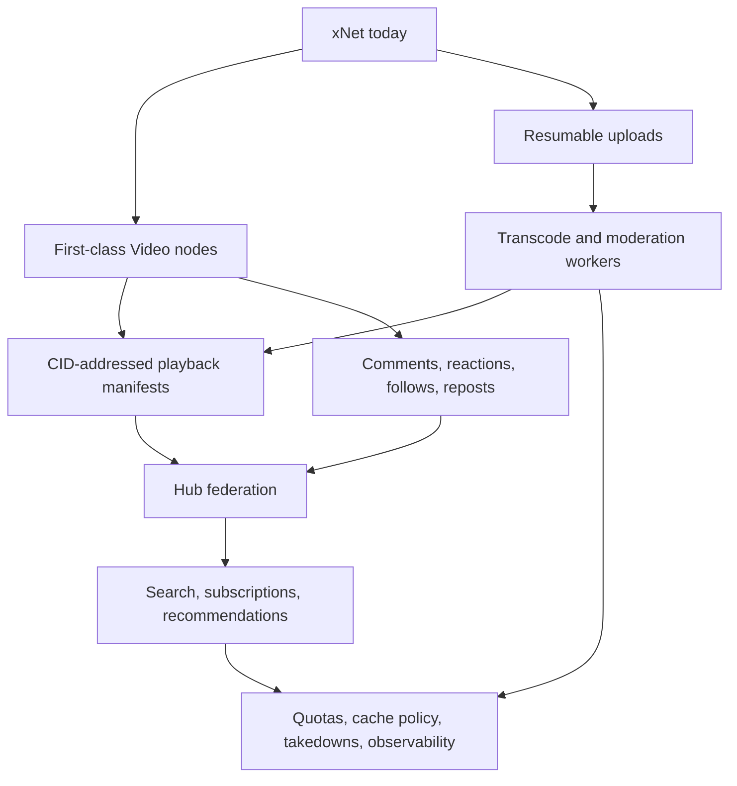
```mermaid
flowchart TD
    XNET["xNet today"]
    VIDEO["First-class Video nodes"]
    UPLOAD["Resumable uploads"]
    MANIFEST["CID-addressed playback manifests"]
    WORKERS["Transcode and moderation workers"]
    SOCIAL["Comments, reactions, follows, reposts"]
    FED["Hub federation"]
    FEED["Search, subscriptions, recommendations"]
    OPS["Quotas, cache policy, takedowns, observability"]

    XNET --> VIDEO
    XNET --> UPLOAD
    VIDEO --> MANIFEST
    UPLOAD --> WORKERS
    WORKERS --> MANIFEST
    VIDEO --> SOCIAL
    SOCIAL --> FED
    MANIFEST --> FED
    FED --> FEED
    WORKERS --> OPS
    FEED --> OPS
```

## Current State In The Codebase

### What xNet Already Has

The current repository has several pieces that map well to decentralized video:

| Capability               | Current implementation                                                                                  | Video implication                                                                          |
| ------------------------ | ------------------------------------------------------------------------------------------------------- | ------------------------------------------------------------------------------------------ |
| Media node               | `MediaAssetSchema` with title, file, kind, alt, width, height                                           | Supports `video` as a kind, but lacks duration, poster, captions, renditions, and status.  |
| File references          | `FileRef` stores `cid`, `name`, `mimeType`, `size`                                                      | Good identity boundary for immutable media.                                                |
| Content-addressed blobs  | `BlobStore` hashes content and dedupes by CID                                                           | Strong fit for segment-level integrity and cache verification.                             |
| Client blob service      | `BlobService` uploads `File`/`Uint8Array`, chunks large data, creates blob URLs                         | Works for small media; video needs streaming rather than whole-file retrieval.             |
| Chunk manager            | Splits large files into 256 KB chunks above 1 MB and stores a manifest                                  | Good start; playback needs addressable segment/range reads and parallel chunk operations.  |
| Hub file service         | `PUT /files/:cid`, `GET /files/:cid`, quota checks, MIME allow list, BLAKE3 CID validation              | Needs resumable uploads, byte ranges, partial responses, object storage, and cache policy. |
| Blob sync provider       | Announces, wants, and transfers blobs over the sync connection                                          | Useful for thumbnails and small attachments; not viable for large video transfer as-is.    |
| Search and federation    | Hub query service, FTS, public recipient filtering, hub federation, peer rate limits, RRF dedup ranking | Strong base for public video metadata discovery.                                           |
| Public access vocabulary | `PUBLIC` recipient and grant indexes                                                                    | Needed for public video pages and follower-only/private videos.                            |
| Prior social exploration | Universal comments, reactions, reports, moderation labels, public comment policy                        | Directly reusable for comments, likes, reports, mutes, and viewer policy.                  |

### Current Media Shape

`packages/data/src/schema/schemas/media-asset.ts` defines a generic media asset. It is useful for
documents, images, and small local videos:

```typescript
export const MediaAssetSchema = defineSchema({
  title: 'Media Asset',
  properties: {
    title: text({ required: true }),
    file: file({ required: true }),
    kind: select({
      options: [
        { id: 'image', label: 'Image' },
        { id: 'video', label: 'Video' },
        { id: 'audio', label: 'Audio' },
        { id: 'document', label: 'Document' },
        { id: 'file', label: 'File' }
      ],
      default: 'image'
    }),
    alt: text({ multiline: true }),
    width: number(),
    height: number()
  }
})
```

That is intentionally generic. A decentralized video product needs richer lifecycle state:

- Upload is incomplete, processing, playable, partially failed, blocked, removed, or tombstoned.
- A source file is separate from viewer-ready renditions.
- A poster image, animated preview, captions, chapters, transcript, and moderation labels are
  separate derived artifacts.
- Playback should reference an immutable manifest with segment CIDs, not require downloading the
  source blob.
- Public discovery metadata should be searchable without fetching the full media object.

### Current Blob And File Pipeline

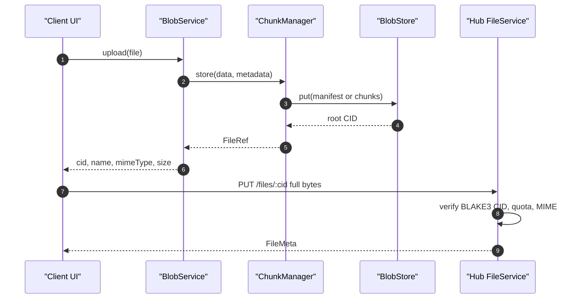
```mermaid
sequenceDiagram
    autonumber
    participant UI as "Client UI"
    participant BlobService as "BlobService"
    participant ChunkManager as "ChunkManager"
    participant BlobStore as "BlobStore"
    participant Hub as "Hub FileService"

    UI->>BlobService: upload(file)
    BlobService->>ChunkManager: store(data, metadata)
    ChunkManager->>BlobStore: put(manifest or chunks)
    BlobStore-->>ChunkManager: root CID
    ChunkManager-->>BlobService: FileRef
    BlobService-->>UI: cid, name, mimeType, size
    UI->>Hub: PUT /files/:cid full bytes
    Hub->>Hub: verify BLAKE3 CID, quota, MIME
    Hub-->>UI: FileMeta
```

This is good for integrity, but a video player needs a different read path:

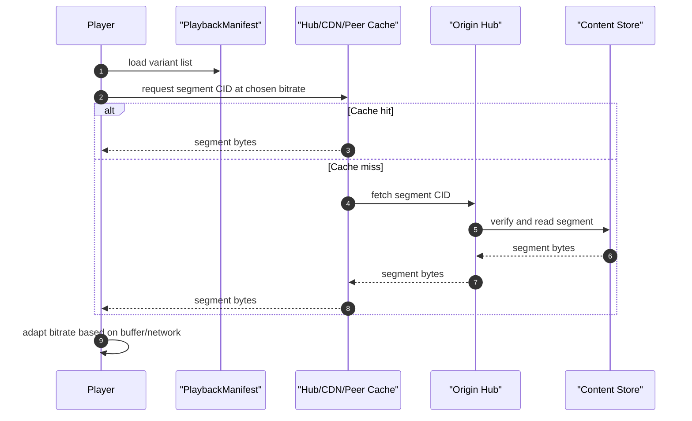
```mermaid
sequenceDiagram
    autonumber
    participant Player
    participant Manifest as "PlaybackManifest"
    participant Cache as "Hub/CDN/Peer Cache"
    participant Origin as "Origin Hub"
    participant Store as "Content Store"

    Player->>Manifest: load variant list
    Player->>Cache: request segment CID at chosen bitrate
    alt Cache hit
        Cache-->>Player: segment bytes
    else Cache miss
        Cache->>Origin: fetch segment CID
        Origin->>Store: verify and read segment
        Store-->>Origin: segment bytes
        Origin-->>Cache: segment bytes
        Cache-->>Player: segment bytes
    end
    Player->>Player: adapt bitrate based on buffer/network
```

### Current Federation Shape

`packages/hub/src/services/federation.ts` implements hub-to-hub federated search. It has peers,
schema exposure controls, UCAN authorization, request signatures, per-peer health, rate limits,
timeouts, deduplication by CID, and reciprocal rank fusion.

That is valuable for video discovery. It is not yet ActivityPub-style social delivery. For video,
xNet needs both:

- query federation for search and recommendations;
- activity federation for follows, publishes, likes, comments, announces/reposts, deletes,
  reports, and moderation labels.

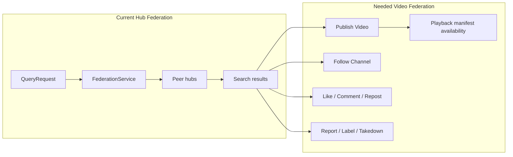
```mermaid
flowchart LR
    subgraph "Current Hub Federation"
        Q["QueryRequest"]
        FS["FederationService"]
        P["Peer hubs"]
        R["Search results"]
        Q --> FS --> P --> R
    end

    subgraph "Needed Video Federation"
        PUB["Publish Video"]
        FOL["Follow Channel"]
        REA["Like / Comment / Repost"]
        MOD["Report / Label / Takedown"]
        PLAY["Playback manifest availability"]
    end

    R --> PUB
    R --> FOL
    R --> REA
    R --> MOD
    PUB --> PLAY
```

## External Research

### PeerTube Is The Closest Prior Art

[PeerTube](https://docs.joinpeertube.org/) is the most relevant production reference: it is a
federated video platform that uses ActivityPub for metadata and social federation. Its ActivityPub
documentation describes video metadata as activities shared between servers and user interactions
such as comments as federated activities. PeerTube also models video channels separately from user
accounts, with a channel announcing videos created by an account.

Key lessons for xNet:

- Federation should prioritize metadata, social graph, and activity delivery; media bytes can be
  served by origin hubs, caches, object storage, or peers.
- Channels are first-class actors distinct from people.
- Comments and likes are federation events, not fields embedded in a video record.
- A decentralized video product still has operators and policy; federation does not remove
  moderation or takedown work.
- Transcoding and storage are operationally significant enough to deserve explicit worker pools.

### ActivityPub And ActivityStreams Provide The Social Vocabulary

[W3C ActivityPub](https://www.w3.org/TR/activitypub/) defines a decentralized social protocol with
client-to-server and server-to-server layers. The spec includes actors with inboxes/outboxes,
followers/following collections, likes/shares collections, `Create`, `Update`, `Delete`, `Follow`,
`Like`, `Announce`, `Block`, and `Undo` activities. It also includes security considerations for
spam, federation denial-of-service, rate limiting, and content sanitization.

[ActivityStreams Vocabulary](https://www.w3.org/TR/activitystreams-vocabulary/) includes `Video`
as an object type and common activity verbs. xNet does not have to implement ActivityPub exactly
to learn from it, but compatibility would make interop with the Fediverse much easier.

Recommended stance:

- Keep xNet's signed Node/Change model as the canonical internal representation.
- Add an ActivityPub-compatible projection layer for public actors, videos, comments, follows,
  likes, announces, deletes, and blocks.
- Use DIDs and UCANs internally, but expose stable web actor URLs at hubs for Fediverse clients.

### HLS, MSE, And WebCodecs Are The Browser Playback Backbone

[RFC 8216 HTTP Live Streaming](https://www.rfc-editor.org/rfc/rfc8216) defines HLS playlists and
media segments for adaptive streaming. HLS is widely deployed and can be delivered over ordinary
HTTP.

[Media Source Extensions](https://www.w3.org/TR/media-source-2/) lets JavaScript feed media byte
streams into browser playback, enabling adaptive streaming and buffering behavior. Existing HLS
players rely on native HLS where available and MSE where needed.

[WebCodecs](https://www.w3.org/TR/webcodecs/) exposes lower-level browser encode/decode APIs. It
can help with local previews, thumbnails, lightweight transforms, and eventually client-side
transcoding where browser support and device resources allow it. Server or worker-side FFmpeg is
still the pragmatic v1 for reliable multi-rendition transcode.

Recommended stance:

- Use HLS-style manifests and segments for v1 playback.
- Keep the manifest CID-addressed and xNet-native.
- Let the web app use mature HLS playback libraries rather than hand-rolling adaptive streaming.
- Use WebCodecs for previews and optional local processing, not as the only transcode path.

### Resumable Upload Is Not Optional

[tus](https://tus.io/protocols/resumable-upload) is a mature open resumable upload protocol over
HTTP. It uses upload resources, `HEAD` to discover current offset, and `PATCH` with byte offsets
to continue interrupted uploads.

Video uploads need resumability because mobile networks fail, creators upload multi-gigabyte
files, and backgrounding a browser or desktop app can interrupt transfer. xNet can either adopt
tus directly or implement a smaller compatible subset for hub upload sessions.

### Content Addressing Maps Well To xNet

[IPFS content addressing docs](https://docs.ipfs.tech/concepts/content-addressing/) describe CIDs
as identifiers derived from cryptographic hashes of content rather than locations. xNet already
does this with BLAKE3-style CIDs in `BlobStore` and hub `FileService`.

The core adaptation for video is granularity:

- source file CID for creator archive;
- rendition manifest CID for playback identity;
- segment CIDs for cacheable playback units;
- poster, preview, caption, transcript, waveform, and storyboard CIDs for derived assets.

## Product Surfaces

### YouTube-Like Long Form

Long-form video needs:

- channels and subscriptions;
- public video pages;
- playlists and series;
- comments, threaded replies, likes, dislikes or private negative feedback, saves, shares;
- chapters, captions, transcripts, thumbnails, cards, end screens;
- search, category browsing, recommendations, watch history;
- creator dashboards, upload management, analytics, processing errors;
- rights management, takedowns, appeals, age gating, content warnings.

### Instagram/TikTok-Like Short Form

Short-form video needs:

- vertical video capture and trimming;
- reels/stories/feed modes;
- remix/duet/stitch attribution;
- music/sound attachment rights;
- low-latency feed prefetch;
- creator profile grids;
- comment controls, DM/share controls, follower-only publishing;
- ranking that optimizes session flow without turning moderation into an afterthought.

### Shared xNet Primitive Set

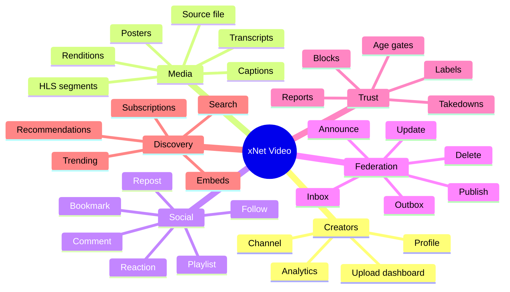
```mermaid
mindmap
  root((xNet Video))
    Creators
      Channel
      Profile
      Upload dashboard
      Analytics
    Media
      Source file
      Renditions
      HLS segments
      Posters
      Captions
      Transcripts
    Social
      Follow
      Comment
      Reaction
      Repost
      Playlist
      Bookmark
    Federation
      Publish
      Update
      Delete
      Announce
      Inbox
      Outbox
    Trust
      Reports
      Labels
      Blocks
      Takedowns
      Age gates
    Discovery
      Search
      Subscriptions
      Trending
      Recommendations
      Embeds
```

## Proposed Data Model

Video should be modeled as a collection of signed nodes and immutable blobs. Do not pack
everything into one mutable video record.

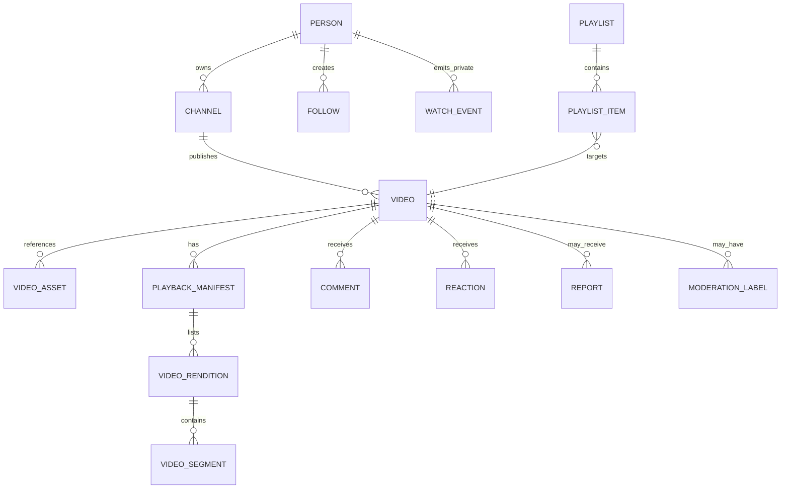
```mermaid
erDiagram
    PERSON ||--o{ CHANNEL : owns
    CHANNEL ||--o{ VIDEO : publishes
    VIDEO ||--o{ VIDEO_ASSET : references
    VIDEO ||--o{ PLAYBACK_MANIFEST : has
    PLAYBACK_MANIFEST ||--o{ VIDEO_RENDITION : lists
    VIDEO_RENDITION ||--o{ VIDEO_SEGMENT : contains
    VIDEO ||--o{ COMMENT : receives
    VIDEO ||--o{ REACTION : receives
    VIDEO ||--o{ REPORT : may_receive
    VIDEO ||--o{ MODERATION_LABEL : may_have
    PERSON ||--o{ FOLLOW : creates
    PERSON ||--o{ WATCH_EVENT : emits_private
    PLAYLIST ||--o{ PLAYLIST_ITEM : contains
    PLAYLIST_ITEM }o--|| VIDEO : targets
```

### Core Schemas

| Schema               | Purpose                                                                        |
| -------------------- | ------------------------------------------------------------------------------ |
| `Channel`            | Creator identity, display name, avatar, owner DID, policy, ActivityPub actor.  |
| `Video`              | Public canonical metadata: title, summary, channel, visibility, status, tags.  |
| `VideoAsset`         | Source file and derived asset references.                                      |
| `PlaybackManifest`   | Immutable playback manifest with variants, segment lists, codec metadata.      |
| `VideoRendition`     | One bitrate/resolution/codec ladder entry.                                     |
| `VideoSegment`       | One cacheable playback segment CID plus byte size, duration, hash, order.      |
| `CaptionTrack`       | Language, kind, format, CID.                                                   |
| `ThumbnailSet`       | Poster, storyboard, preview animation.                                         |
| `VideoProcessingJob` | Probe/transcode/moderation/caption states and errors.                          |
| `VideoPolicy`        | Comment, reaction, embed, remix, download, age, region, and visibility policy. |
| `WatchEvent`         | Private local history and aggregate signal; never globally public by default.  |
| `VideoAggregate`     | Materialized counts by scope and policy: views, likes, comments, reposts.      |
| `TakedownNotice`     | Operator/legal workflow node with bounded evidence and audit status.           |

### Example Type Shapes

```typescript
type VideoVisibility = 'public' | 'unlisted' | 'followers' | 'private'
type VideoStatus = 'draft' | 'uploading' | 'processing' | 'playable' | 'blocked' | 'removed'

type VideoProperties = {
  title: string
  summary?: string
  channelId: string
  visibility: VideoVisibility
  status: VideoStatus
  tags: string[]
  durationMs?: number
  posterCid?: string
  playbackManifestCid?: string
  publishedAt?: number
  recipients: string[]
}

type PlaybackManifest = {
  version: 1
  videoId: string
  sourceCid: string
  durationMs: number
  variants: VideoVariant[]
  captions: CaptionTrack[]
  thumbnails: ThumbnailSet
}

type VideoVariant = {
  id: string
  codec: 'h264' | 'h265' | 'vp9' | 'av1'
  container: 'mp4' | 'ts' | 'webm'
  width: number
  height: number
  bitrate: number
  frameRate: number
  segments: VideoSegment[]
}

type VideoSegment = {
  index: number
  cid: string
  durationMs: number
  sizeBytes: number
}
```

### Playback Manifest Selection

Keep client decisions functional and testable:

```typescript
type NetworkEstimate = {
  downlinkMbps: number
  viewportWidth: number
  viewportHeight: number
  prefersDataSaver: boolean
}

export function selectInitialVariant(
  variants: readonly VideoVariant[],
  estimate: NetworkEstimate
): VideoVariant | null {
  const maxBitrate = estimate.prefersDataSaver
    ? estimate.downlinkMbps * 350_000
    : estimate.downlinkMbps * 700_000

  const fitsViewport = (variant: VideoVariant): boolean =>
    variant.width <= estimate.viewportWidth * 1.5 && variant.height <= estimate.viewportHeight * 1.5

  return (
    variants
      .filter((variant) => variant.bitrate <= maxBitrate)
      .filter(fitsViewport)
      .sort((a, b) => b.bitrate - a.bitrate)[0] ??
    variants.slice().sort((a, b) => a.bitrate - b.bitrate)[0] ??
    null
  )
}
```

## Upload And Processing Pipeline

### Target Pipeline

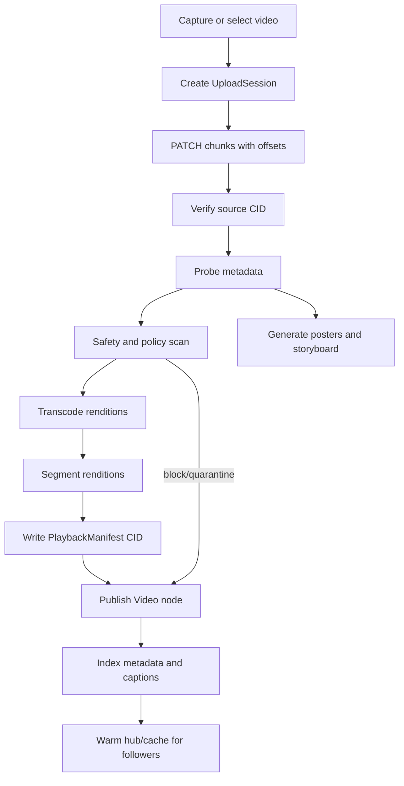
```mermaid
flowchart TD
    CAP["Capture or select video"]
    SESSION["Create UploadSession"]
    PATCH["PATCH chunks with offsets"]
    VERIFY["Verify source CID"]
    PROBE["Probe metadata"]
    SCAN["Safety and policy scan"]
    THUMB["Generate posters and storyboard"]
    TRANS["Transcode renditions"]
    SEG["Segment renditions"]
    MAN["Write PlaybackManifest CID"]
    PUB["Publish Video node"]
    INDEX["Index metadata and captions"]
    WARM["Warm hub/cache for followers"]

    CAP --> SESSION --> PATCH --> VERIFY --> PROBE
    PROBE --> SCAN
    PROBE --> THUMB
    SCAN --> TRANS
    TRANS --> SEG --> MAN --> PUB --> INDEX --> WARM
    SCAN -->|"block/quarantine"| PUB
```

### Processing State Machine

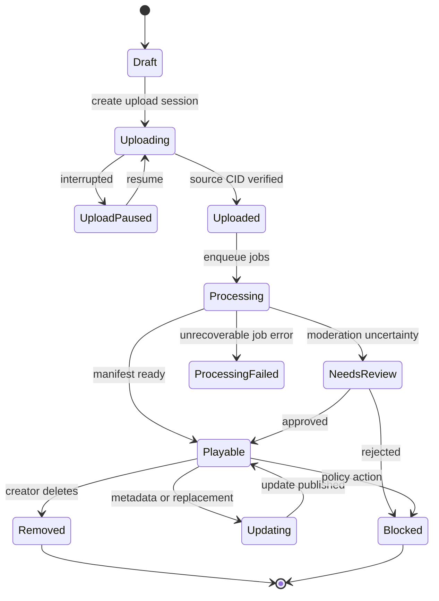
```mermaid
stateDiagram-v2
    [*] --> Draft
    Draft --> Uploading: create upload session
    Uploading --> UploadPaused: interrupted
    UploadPaused --> Uploading: resume
    Uploading --> Uploaded: source CID verified
    Uploaded --> Processing: enqueue jobs
    Processing --> Playable: manifest ready
    Processing --> NeedsReview: moderation uncertainty
    Processing --> ProcessingFailed: unrecoverable job error
    NeedsReview --> Playable: approved
    NeedsReview --> Blocked: rejected
    Playable --> Updating: metadata or replacement
    Updating --> Playable: update published
    Playable --> Removed: creator deletes
    Playable --> Blocked: policy action
    Removed --> [*]
    Blocked --> [*]
```

### Upload Sessions

Current hub file upload accepts one full body. Video needs upload sessions:

| Endpoint                    | Purpose                                      |
| --------------------------- | -------------------------------------------- |
| `POST /uploads`             | Create upload session with expected metadata |
| `HEAD /uploads/:id`         | Return offset, length, expiration            |
| `PATCH /uploads/:id`        | Append bytes at offset                       |
| `POST /uploads/:id/commit`  | Finalize, hash, verify, create source CID    |
| `DELETE /uploads/:id`       | Terminate abandoned upload                   |
| `GET /uploads/:id/progress` | UI progress and processing status            |

This can follow tus semantics without exposing every tus extension on day one.

## Storage And Delivery Architecture

### Content Granularity

Video should be stored at multiple granularities:

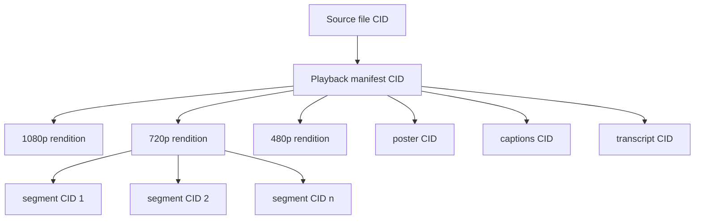
```mermaid
graph TD
    SRC["Source file CID"]
    MAN["Playback manifest CID"]
    V1080["1080p rendition"]
    V720["720p rendition"]
    V480["480p rendition"]
    S1["segment CID 1"]
    S2["segment CID 2"]
    S3["segment CID n"]
    POSTER["poster CID"]
    CAP["captions CID"]
    TRANSCRIPT["transcript CID"]

    SRC --> MAN
    MAN --> V1080
    MAN --> V720
    MAN --> V480
    V720 --> S1
    V720 --> S2
    V720 --> S3
    MAN --> POSTER
    MAN --> CAP
    MAN --> TRANSCRIPT
```

### Origin, Cache, And Peer Assisted Delivery

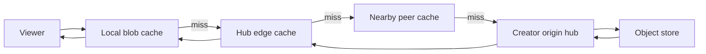
```mermaid
flowchart LR
    Viewer["Viewer"]
    Local["Local blob cache"]
    Edge["Hub edge cache"]
    Origin["Creator origin hub"]
    Object["Object store"]
    Peer["Nearby peer cache"]

    Viewer --> Local
    Local -->|"miss"| Edge
    Edge -->|"miss"| Peer
    Peer -->|"miss"| Origin
    Origin --> Object
    Object --> Origin
    Origin --> Edge
    Edge --> Local
    Local --> Viewer
```

Recommended delivery tiers:

1. Hub HTTP origin for simple v1 playback.
2. Segment-level immutable cache with `Cache-Control: immutable`.
3. CDN/object storage integration for high-traffic public segments.
4. Peer-assisted segment exchange after abuse, privacy, and bandwidth controls exist.
5. Local persistent cache for replay, offline saves, and creator editing.

### Why Whole-File Blob URLs Are Not Enough

`BlobService.getUrl()` retrieves the entire blob and creates a browser `blob:` URL. That is good
for images and short clips, but video platforms need:

- start playback before full download;
- seek without reading the entire source file;
- adapt bitrate as network conditions change;
- cache hot segments independently;
- retry failed segments independently;
- enforce range or segment auth per visibility policy;
- avoid loading multi-gigabyte files into renderer memory.

## Federation Model

### xNet-Native Federation

xNet can model video federation as signed nodes and signed activities:

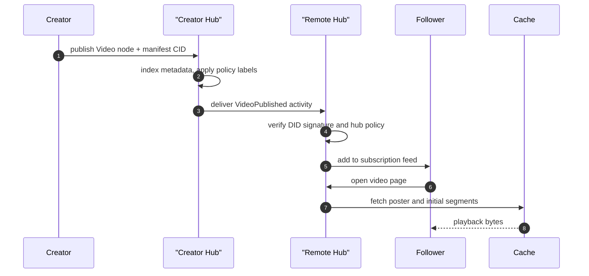
```mermaid
sequenceDiagram
    autonumber
    participant Creator
    participant HomeHub as "Creator Hub"
    participant RemoteHub as "Remote Hub"
    participant Follower
    participant Cache

    Creator->>HomeHub: publish Video node + manifest CID
    HomeHub->>HomeHub: index metadata, apply policy labels
    HomeHub->>RemoteHub: deliver VideoPublished activity
    RemoteHub->>RemoteHub: verify DID signature and hub policy
    RemoteHub->>Follower: add to subscription feed
    Follower->>RemoteHub: open video page
    RemoteHub->>Cache: fetch poster and initial segments
    Cache-->>Follower: playback bytes
```

### ActivityPub-Compatible Projection

If xNet wants Fediverse interoperability:

| xNet concept      | ActivityPub / ActivityStreams projection              |
| ----------------- | ----------------------------------------------------- |
| DID person        | `Person` actor                                        |
| `Channel`         | `Group` or service-owned channel actor                |
| `Video`           | `Video` object                                        |
| publish           | `Create` activity                                     |
| metadata edit     | `Update` activity                                     |
| creator delete    | `Delete` activity                                     |
| like              | `Like` activity                                       |
| unlike            | `Undo` of `Like`                                      |
| repost/share      | `Announce` activity                                   |
| comment           | `Create` `Note` with `inReplyTo` the video            |
| follow channel    | `Follow` activity targeting the channel actor         |
| block/mute        | `Block` locally, optional federation depending policy |
| public visibility | addressed to public collection                        |
| followers-only    | addressed to followers collection                     |

The internal xNet record should remain signed and content-addressed. The ActivityPub projection is
an interop adapter, not the source of truth.

### Federation Trust Levels

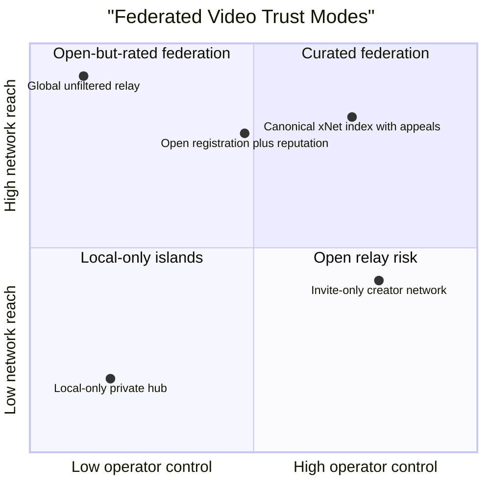
```mermaid
quadrantChart
    title "Federated Video Trust Modes"
    x-axis "Low operator control" --> "High operator control"
    y-axis "Low network reach" --> "High network reach"
    quadrant-1 "Curated federation"
    quadrant-2 "Open-but-rated federation"
    quadrant-3 "Local-only islands"
    quadrant-4 "Open relay risk"
    "Local-only private hub": [0.18, 0.18]
    "Invite-only creator network": [0.78, 0.42]
    "Open registration plus reputation": [0.48, 0.78]
    "Global unfiltered relay": [0.12, 0.92]
    "Canonical xNet index with appeals": [0.72, 0.82]
```

Recommendation: start with curated federation between known hubs, then move to open-but-rated
federation with clear demotion, rate limits, and label subscriptions.

## Social Features

The previous universal social primitives exploration already maps well to video. A video platform
needs the following as universal edges:

| Surface       | Node/edge shape                               | Notes                                                        |
| ------------- | --------------------------------------------- | ------------------------------------------------------------ |
| Like          | `Reaction(kind = "like", target = videoId)`   | Dedup by `(actor, target, kind)`.                            |
| Emoji react   | `Reaction(kind = "emoji", value, target)`     | Keep out of primary ranking unless policy allows.            |
| Comment       | `Comment(target = videoId, inReplyTo?)`       | Owner policy decides canonical page display.                 |
| Repost/share  | `Announce`/`Boost` edge                       | Can include quote text; impacts feed distribution.           |
| Save/bookmark | Private `Bookmark` edge                       | Should not federate by default.                              |
| Watch history | Private `WatchEvent`                          | Never globally public by default.                            |
| Playlist      | `Playlist` plus `PlaylistItem`                | Public, unlisted, collaborative, or private.                 |
| Follow        | `Follow(target = channelId)`                  | Powers subscription feeds and delivery.                      |
| Report        | `Report(target = video/comment/reaction)`     | Bounded evidence, reporter privacy, operator queue.          |
| Label         | `ModerationLabel(target, value, source)`      | Hub, community labeler, creator, or viewer-scoped.           |
| Block/mute    | Private or policy-list edge                   | Affects comments, DMs, search, feed, notification rendering. |
| Remix         | `DerivedFrom(sourceVideoId, timeRange, kind)` | Requires rights and attribution model before public launch.  |

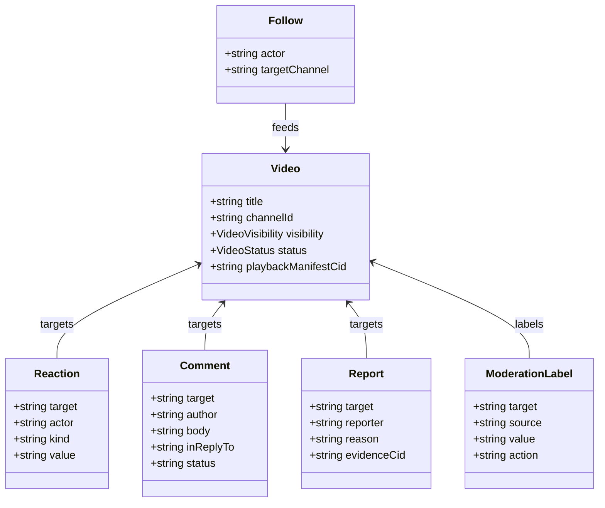
```mermaid
classDiagram
    class Video {
      +string title
      +string channelId
      +VideoVisibility visibility
      +VideoStatus status
      +string playbackManifestCid
    }
    class Reaction {
      +string target
      +string actor
      +string kind
      +string value
    }
    class Comment {
      +string target
      +string author
      +string body
      +string inReplyTo
      +string status
    }
    class Follow {
      +string actor
      +string targetChannel
    }
    class Report {
      +string target
      +string reporter
      +string reason
      +string evidenceCid
    }
    class ModerationLabel {
      +string target
      +string source
      +string value
      +string action
    }
    Video <-- Reaction : targets
    Video <-- Comment : targets
    Video <-- Report : targets
    Video <-- ModerationLabel : labels
    Follow --> Video : feeds
```

## Discovery, Search, And Recommendations

### Discovery Tiers

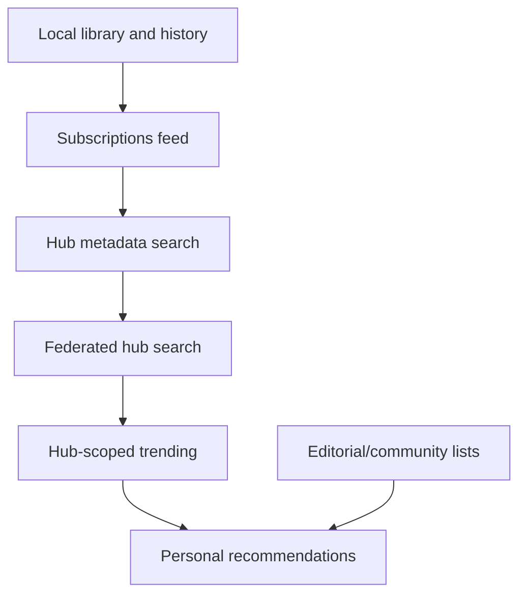
```mermaid
flowchart TD
    Local["Local library and history"]
    Following["Subscriptions feed"]
    HubSearch["Hub metadata search"]
    Federated["Federated hub search"]
    Trending["Hub-scoped trending"]
    Recommend["Personal recommendations"]
    Human["Editorial/community lists"]

    Local --> Following
    Following --> HubSearch
    HubSearch --> Federated
    Federated --> Trending
    Trending --> Recommend
    Human --> Recommend
```

Recommended order:

1. **Subscriptions feed**: deterministic, explainable, lower moderation risk.
2. **Search**: title, summary, tags, channel, transcript, captions.
3. **Creator pages and playlists**: strong navigation without opaque ranking.
4. **Hub-scoped trending**: policy-aware and bounded by hub trust.
5. **Personal recommendations**: private on-device first; hub-assisted only with explicit
   privacy model.

### Ranking Inputs

Use composable, policy-aware signals:

- follow graph distance;
- watch completion, rewatch, skip, and not-interested feedback;
- creator reputation and hub reputation;
- freshness and upload cadence;
- text relevance from title, summary, tags, captions, and transcript;
- comment quality, not raw comment volume;
- like/repost aggregates after spam-label filtering;
- viewer mutes, blocks, language settings, age settings, and label subscriptions;
- cache locality and media availability.

Do not let hidden, quarantined, spam-labeled, or takedown-pending interactions inflate ranking.

## Moderation, Safety, And Legal Operations

A video platform has a much larger trust-and-safety burden than a notes or docs product. xNet
needs explicit workflows before open public video hosting.

### Moderation Layers

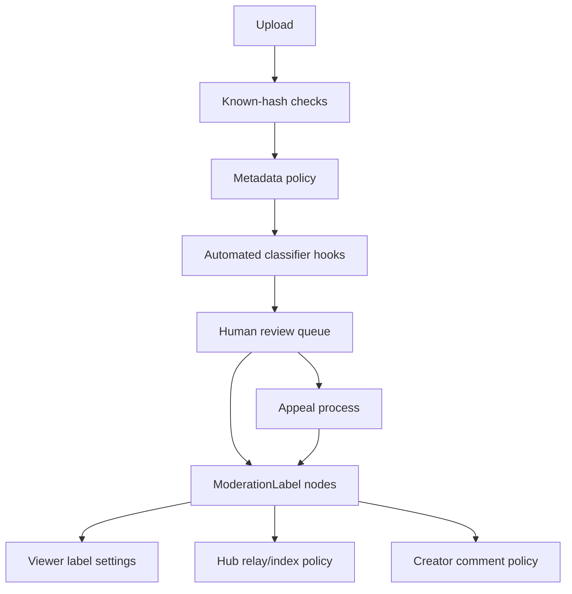
```mermaid
flowchart TD
    Upload["Upload"]
    Hash["Known-hash checks"]
    Metadata["Metadata policy"]
    ML["Automated classifier hooks"]
    Human["Human review queue"]
    Label["ModerationLabel nodes"]
    Viewer["Viewer label settings"]
    Hub["Hub relay/index policy"]
    Creator["Creator comment policy"]
    Appeal["Appeal process"]

    Upload --> Hash --> Metadata --> ML --> Human --> Label
    Label --> Viewer
    Label --> Hub
    Label --> Creator
    Human --> Appeal
    Appeal --> Label
```

Required policy scopes:

- hub refuses to store;
- hub stores but refuses to index;
- hub indexes with warning label;
- hub caches only for authorized viewers;
- creator hides comments on their canonical page;
- viewer hides or warns locally;
- community labeler publishes labels;
- legal takedown removes public serving but preserves audit metadata where lawful.

### Abuse Classes To Design For

| Abuse class           | Controls                                                                                     |
| --------------------- | -------------------------------------------------------------------------------------------- |
| Spam uploads          | Upload quotas, proof-of-work or payment, rate limits, hub reputation, queue backpressure.    |
| Malicious video files | MIME sniffing, container probing, transcoder sandboxing, antivirus hooks, strict player CSP. |
| Comment/reaction spam | Existing public moderation primitives plus target policy and aggregate filtering.            |
| Copyright complaints  | Takedown notice workflow, counter-notice workflow, content matching integrations.            |
| Illegal material      | Hash matching with specialist providers, immediate quarantine, operator/legal escalation.    |
| Harassment            | Blocks, mutes, comment approval, follower-only comments, report queues, label subscriptions. |
| Misinformation        | Labels, context panels, downranking, trusted lists, viewer controls.                         |
| Federation abuse      | Peer rate limits, schema exposure, trust levels, hub reputation, signed query/activity logs. |
| Recommendation gaming | Reputation-weighted signals, deduped engagement, anomaly detection, demotion labels.         |
| Bandwidth abuse       | Signed segment URLs, per-DID quotas, cache limits, hotlink protection, origin shielding.     |

## Privacy Model

Video products pressure privacy because viewing behavior is intensely revealing.

Recommended privacy defaults:

- Public videos expose metadata, poster, playback manifest, and public engagement aggregates.
- Watch history remains local/private by default.
- Saves/bookmarks remain private by default.
- Viewer-specific recommendations run on-device first.
- Followers-only videos require signed access checks for manifest and segment reads.
- Unlisted videos should not appear in search or public feeds but are not cryptographic secrets.
- Private videos should encrypt source and derived assets for recipients, not just hide metadata.
- Analytics should be aggregate and thresholded; avoid per-viewer public analytics.

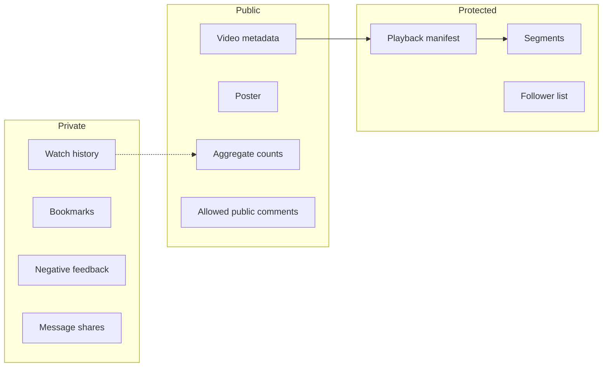
```mermaid
flowchart LR
    subgraph "Public"
        Metadata["Video metadata"]
        Poster["Poster"]
        Counts["Aggregate counts"]
        PublicComments["Allowed public comments"]
    end

    subgraph "Protected"
        Manifest["Playback manifest"]
        Segments["Segments"]
        Followers["Follower list"]
    end

    subgraph "Private"
        History["Watch history"]
        Saves["Bookmarks"]
        NotInterested["Negative feedback"]
        DMs["Message shares"]
    end

    Metadata --> Manifest
    Manifest --> Segments
    History -.-> Counts
```

## Hubs, Workers, And Operations

### Service Responsibilities

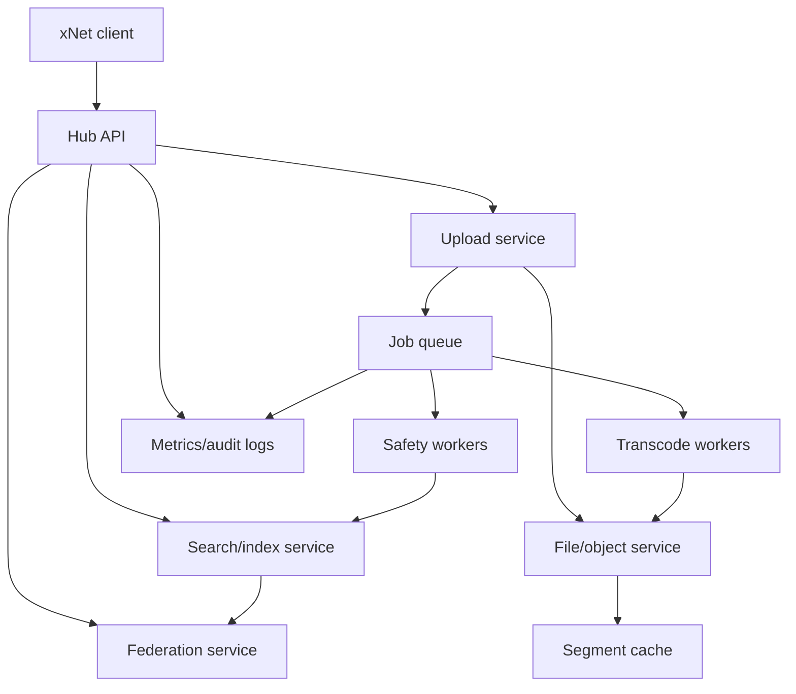
```mermaid
flowchart TB
    Client["xNet client"]
    API["Hub API"]
    Uploads["Upload service"]
    Files["File/object service"]
    Queue["Job queue"]
    Transcode["Transcode workers"]
    Safety["Safety workers"]
    Search["Search/index service"]
    Fed["Federation service"]
    Cache["Segment cache"]
    Metrics["Metrics/audit logs"]

    Client --> API
    API --> Uploads
    API --> Search
    API --> Fed
    Uploads --> Files
    Uploads --> Queue
    Queue --> Transcode
    Queue --> Safety
    Transcode --> Files
    Safety --> Search
    Files --> Cache
    Search --> Fed
    API --> Metrics
    Queue --> Metrics
```

### Operational Controls

Video requires controls that are not optional:

- max source file size by account tier;
- max duration by account tier;
- max daily upload bytes;
- max processing minutes;
- max stored source bytes and rendition bytes;
- cache eviction policy;
- hot video origin shielding;
- worker sandbox resource limits;
- failed job retry with poison queue;
- per-video storage/bandwidth accounting;
- per-hub public federation budget;
- takedown and appeal audit log;
- abuse emergency stop switches per hub, creator, video, and peer.

### Cost Model

The cost drivers are:

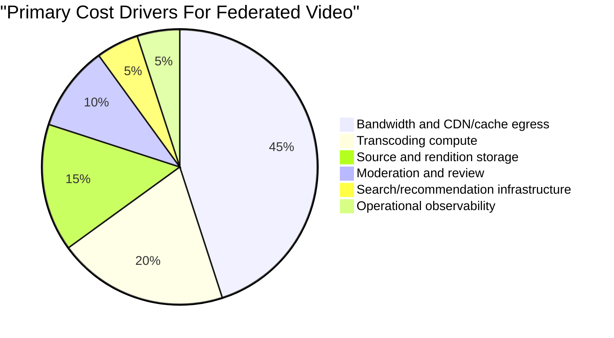
```mermaid
pie title "Primary Cost Drivers For Federated Video"
    "Bandwidth and CDN/cache egress" : 45
    "Transcoding compute" : 20
    "Source and rendition storage" : 15
    "Moderation and review" : 10
    "Search/recommendation infrastructure" : 5
    "Operational observability" : 5
```

This argues for product constraints in v1:

- cap uploads to short clips first;
- transcode to a small ladder;
- publish only public/unlisted videos first;
- make subscriptions/search primary discovery, not global recommendations;
- add creator quotas before launch;
- require hub operators to opt into public video hosting.

## Architecture Options

### Option A: xNet-Native Video First

Build a video product entirely around xNet nodes, hubs, blob stores, and query federation.

Pros:

- fastest path using current architecture;
- preserves xNet ownership and signed-node model;
- avoids ActivityPub compatibility complexity during core media work;
- can support private/followers-only video more naturally.

Cons:

- no Fediverse interop at launch;
- requires xNet clients for full social participation;
- external discoverability starts weaker.

### Option B: PeerTube-Compatible Federation First

Implement ActivityPub projection early and make channels/videos/comments interoperable.

Pros:

- proven social federation model;
- immediate conceptual fit with Fediverse users;
- easier external validation with existing tools and expectations.

Cons:

- ActivityPub compatibility is a large surface area;
- xNet DIDs/UCANs do not map one-to-one to web actors;
- moderation expectations arrive immediately;
- media storage and playback still need xNet-native work.

### Option C: Hybrid Layered Approach

Use xNet-native media and signed nodes as the source of truth, then add ActivityPub projection for
public channels and videos after the playback and moderation pipeline stabilizes.

Pros:

- keeps the core coherent;
- still leaves a clear route to interop;
- lets private/followers-only xNet semantics mature before public federation pressure;
- allows staged launch by hub/operator readiness.

Cons:

- more adapters;
- duplicate mental models for developers;
- public interop comes later.

Recommended: **Option C**.

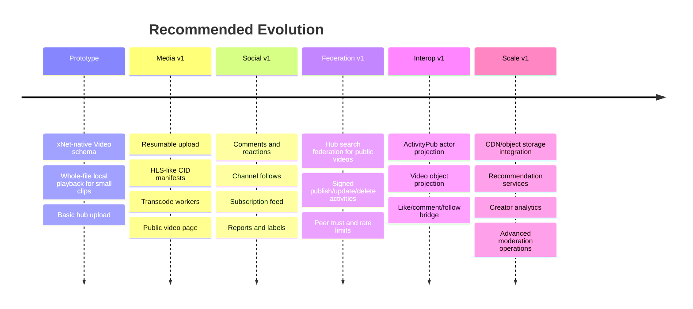
```mermaid
timeline
    title Recommended Evolution
    Prototype : xNet-native Video schema
              : Whole-file local playback for small clips
              : Basic hub upload
    Media v1 : Resumable upload
             : HLS-like CID manifests
             : Transcode workers
             : Public video page
    Social v1 : Comments and reactions
              : Channel follows
              : Subscription feed
              : Reports and labels
    Federation v1 : Hub search federation for public videos
                  : Signed publish/update/delete activities
                  : Peer trust and rate limits
    Interop v1 : ActivityPub actor projection
               : Video object projection
               : Like/comment/follow bridge
    Scale v1 : CDN/object storage integration
             : Recommendation services
             : Creator analytics
             : Advanced moderation operations
```

## Recommendations

### P0: Define The Video Contract

Create a short media architecture RFC before writing UI-heavy code.

- Define `Video`, `Channel`, `PlaybackManifest`, `VideoRendition`, `CaptionTrack`, and
  `VideoProcessingJob`.
- Define which fields are mutable metadata and which are immutable content references.
- Decide if `MediaAssetSchema` remains generic or becomes a base class/pattern for richer media.
- Define public/followers/private/unlisted visibility semantics for manifests and segments.
- Define the minimum status machine for upload and processing.

### P1: Make Storage Streamable

Upgrade blob and hub file paths for video:

- upload sessions;
- offset queries;
- chunk commit;
- BLAKE3 source verification;
- segment storage;
- byte range reads or segment CID reads;
- immutable caching headers;
- object storage abstraction;
- quota accounting for source, rendition, and cache bytes.

### P2: Add A Small Playback MVP

Start with short public clips:

- upload MP4;
- probe duration/width/height;
- generate poster;
- generate one 720p rendition;
- segment it;
- publish a playback manifest;
- render a video page with comments disabled by default until policy is ready.

### P3: Reuse Social Primitives For Video Engagement

Implement channel follows, likes, comments, reports, and labels as universal edges. Do not embed
engagement arrays inside `Video`.

### P4: Federate Metadata Before Media

Federate:

- video metadata;
- channel metadata;
- poster/thumbnail CIDs;
- manifest availability;
- comments/reactions/reposts;
- reports/labels where policy allows.

Let actual segment delivery use origin hubs and caches first.

### P5: Add ActivityPub Projection After xNet Semantics Are Stable

Bridge public video/channel/comment/follow activities to ActivityPub after the internal event model
is solid. This keeps xNet from being distorted by interop before the product works.

## Implementation Checklist

### Foundation

- [ ] Create a media architecture RFC under `docs/`.
- [ ] Add `VideoSchema` with title, summary, channel, visibility, status, tags, duration, poster,
      playback manifest, and recipients.
- [ ] Add `ChannelSchema` with owner DID, display metadata, policy, and public actor handle.
- [ ] Add `PlaybackManifest` type and validation helpers.
- [ ] Add `VideoProcessingJobSchema` with state, job kind, worker DID, input CIDs, output CIDs,
      attempts, and error summary.
- [ ] Add `CaptionTrackSchema` and `ThumbnailSet` metadata.
- [ ] Add tests for status transitions and schema validation.

### Upload And Storage

- [ ] Add upload session storage to hub storage interface.
- [ ] Add `POST /uploads`, `HEAD /uploads/:id`, `PATCH /uploads/:id`, `POST /uploads/:id/commit`,
      and `DELETE /uploads/:id`.
- [ ] Verify committed source bytes against declared CID.
- [ ] Add upload expiration and cleanup.
- [ ] Add per-DID upload byte rate limits.
- [ ] Add source/rendition/cache quota accounting.
- [ ] Add range or segment read APIs.
- [ ] Add object storage adapter for source and segment blobs.
- [ ] Add immutable cache headers for segment CIDs.
- [ ] Add tests for interrupted and resumed uploads.

### Processing

- [ ] Add media probe worker that extracts duration, dimensions, codec, audio tracks, and container.
- [ ] Add thumbnail/poster generation worker.
- [ ] Add initial transcode worker with one 720p rendition.
- [ ] Add HLS-style segmentation and manifest generation.
- [ ] Add worker sandboxing and resource limits.
- [ ] Add retry and poison queue behavior.
- [ ] Add processing progress events for UI.
- [ ] Add failed-processing recovery UI.
- [ ] Add test fixtures for small video files.

### Playback

- [ ] Add video page route and player component.
- [ ] Load manifest by CID.
- [ ] Select an initial variant with a pure helper.
- [ ] Support poster, duration, captions, and error states.
- [ ] Support seek and segment retry.
- [ ] Add local segment cache hooks.
- [ ] Add data-saver playback preference.
- [ ] Add private/followers-only manifest access checks.
- [ ] Add browser checks for HLS/MSE support.

### Social And Public Surfaces

- [ ] Add `ReactionSchema` if not already implemented.
- [ ] Add `CommentSchema` target indexes for video pages.
- [ ] Add `FollowSchema` for channels.
- [ ] Add `PlaylistSchema` and `PlaylistItemSchema`.
- [ ] Add public video page policy for comments, reactions, embeds, remixes, and downloads.
- [ ] Add public aggregate indexes for visible comments/reactions only.
- [ ] Add report/block controls on videos and comments.
- [ ] Add creator dashboard for hiding comments and reviewing reports.

### Discovery

- [ ] Index video title, summary, tags, channel name, captions, and transcript.
- [ ] Add public video search filter by schema.
- [ ] Add subscription feed query.
- [ ] Add creator/channel page query.
- [ ] Add playlist page query.
- [ ] Add hub-scoped trending with label-aware filtering.
- [ ] Add private watch history and local recommendations.
- [ ] Add negative feedback controls: not interested, mute channel, hide topic.

### Federation

- [ ] Define signed xNet video activities: publish, update, delete, follow, like, comment, repost.
- [ ] Extend hub federation config with video schema exposure controls.
- [ ] Add peer health metrics specific to media metadata federation.
- [ ] Add federation rate limits by activity kind.
- [ ] Add dedupe rules for videos, comments, reactions, and reposts.
- [ ] Add tombstone propagation for delete/unpublish.
- [ ] Add moderation label federation policy.
- [ ] Add ActivityPub projection spike for `Channel` as actor and `Video` as object.

### Moderation And Legal

- [ ] Add `ReportSchema`, `ModerationLabelSchema`, and `PolicyListSchema` if not already present.
- [ ] Add upload quarantine state before public publication.
- [ ] Add known-hash matching integration point.
- [ ] Add malware/container scan integration point.
- [ ] Add reviewer queue with bounded evidence display.
- [ ] Add takedown notice and appeal workflow.
- [ ] Add label-aware search, feed, and recommendation filtering.
- [ ] Add audit logs for hub-level moderation actions.
- [ ] Add emergency controls for hub operators.

### Operations

- [ ] Add metrics for upload bytes, stored bytes, transcode minutes, segment egress, cache hit rate,
      and failed jobs.
- [ ] Add per-video cost accounting.
- [ ] Add cache eviction policy.
- [ ] Add origin shielding strategy for hot public videos.
- [ ] Add backup/restore story for manifests and source blobs.
- [ ] Add load tests for upload, transcode queue, and segment serving.
- [ ] Add hub configuration defaults for video-disabled, video-private, and video-public modes.

## Validation Checklist

### Unit Tests

- [ ] `VideoSchema` validates required fields and rejects invalid visibility/status.
- [ ] `PlaybackManifest` rejects missing segments, duplicate variant IDs, and invalid durations.
- [ ] Variant selection chooses a reasonable fallback when bandwidth is low.
- [ ] Upload session offset validation rejects skipped or overlapping patches.
- [ ] CID verification rejects altered bytes.
- [ ] Quota accounting includes source and derived assets.
- [ ] Status transitions reject illegal moves such as `blocked -> playable` without review.
- [ ] Reaction dedupe prevents duplicate likes by the same DID.
- [ ] Label-aware aggregate counts exclude hidden and spam-labeled interactions.

### Integration Tests

- [ ] A small MP4 upload can be interrupted and resumed.
- [ ] Commit creates a verified source CID.
- [ ] Probe job writes duration and dimensions.
- [ ] Transcode job writes a rendition and segment manifest.
- [ ] Video page can play through the generated manifest.
- [ ] Seek requests fetch only needed segments.
- [ ] Public video appears in hub search.
- [ ] Followers-only video does not appear to unauthorized users.
- [ ] Delete/unpublish tombstones metadata and blocks playback.
- [ ] Federation dedupes the same video from multiple hubs.

### Browser And UX Checks

- [ ] Upload progress survives reload or app restart.
- [ ] Processing state is understandable without exposing worker internals.
- [ ] Player handles slow segment loads, missing segments, and unsupported codecs.
- [ ] Captions can be toggled.
- [ ] Mobile vertical video fits without layout overlap.
- [ ] Public page distinguishes hidden, warned, quarantined, and deleted comments.
- [ ] Creator dashboard explains quota and failed processing reasons.
- [ ] Accessibility labels exist for player controls and moderation actions.

### Security And Abuse Tests

- [ ] Upload rejects MIME/type mismatches.
- [ ] Upload rejects files above tier limits.
- [ ] Transcode workers run with constrained filesystem/network permissions.
- [ ] Segment URLs cannot bypass visibility policy.
- [ ] Private/followers-only manifest CIDs are not leaked through search.
- [ ] Hub rate limits upload, comment, reaction, search, and federation bursts.
- [ ] Malformed manifests do not crash the player.
- [ ] HTML in titles/descriptions/comments is sanitized.
- [ ] Report evidence access is scoped to authorized moderators.
- [ ] Federation ignores unsigned or invalidly signed activities.

### Performance And Operations Tests

- [ ] 100 concurrent uploads preserve offset correctness.
- [ ] Transcode queue backpressure prevents hub overload.
- [ ] Hot segment cache hit rate is observable.
- [ ] Public video page starts playback within target latency on broadband.
- [ ] Low-bandwidth clients select lower variants.
- [ ] Cache eviction preserves manifests and popular segments.
- [ ] Rebuilding search from video metadata and captions is deterministic.
- [ ] Backup restore preserves source, manifest, segments, and indexes.

## Open Questions

- Should xNet implement HLS playlists directly, or define a native JSON manifest and generate HLS
  playlists at the edge?
- Should source files remain encrypted for public videos, or only private/followers-only videos?
- What is the first target: YouTube-like long-form, Instagram-like reels, or a constrained
  "public clips on xNet pages" MVP?
- Should hub operators opt into video hosting separately from generic file hosting?
- How should creator monetization work without forcing a centralized payment/ranking authority?
- Should ActivityPub compatibility be a launch requirement or a phase-two bridge?
- What is the minimum acceptable moderation system before public video upload is enabled?
- How much recommendation logic should run on-device versus hub-side?
- Should peer-assisted delivery be delayed until hub/CDN delivery is proven?
- What legal operating model is expected for default public hubs?

## Concrete Next Actions

1. Write a short `VideoSchema` and `PlaybackManifest` RFC with field-level definitions.
2. Build a local-only prototype that uploads a short MP4 and renders it through a `Video` node.
3. Add upload sessions to the hub file service before supporting large files.
4. Add one transcode/probe worker behind a feature flag.
5. Generate poster, duration, and one 720p rendition for short clips.
6. Add a public video page without recommendations.
7. Reuse public comments/reactions only after target policy and moderation states are in place.
8. Extend hub search indexing for public video metadata.
9. Define hub video-hosting modes: disabled, private-only, public-curated, public-open.
10. Spike ActivityPub projection after xNet-native publish/update/delete works.

## References

### Local Code

- `packages/data/src/schema/schemas/media-asset.ts`
- `packages/data/src/schema/properties/file.ts`
- `packages/data/src/blob/blob-service.ts`
- `packages/storage/src/blob-store.ts`
- `packages/storage/src/chunk-manager.ts`
- `packages/hub/src/services/files.ts`
- `packages/hub/src/routes/files.ts`
- `packages/hub/src/services/query.ts`
- `packages/hub/src/services/federation.ts`
- `packages/hub/src/services/search-indexer.ts`
- `packages/react/src/sync/blob-sync.ts`
- `apps/electron/src/renderer/lib/ipc-blob-store.ts`
- `docs/explorations/0023_[_]_DECENTRALIZED_SEARCH.md`
- `docs/explorations/0028_[_]_CHAT_AND_VIDEO.md`
- `docs/explorations/0030_[_]_UNIVERSAL_SOCIAL_PRIMITIVES.md`
- `docs/explorations/0129_[_]_HOW_WILL_XNET_HANDLE_SPAM.md`
- `docs/explorations/0130_[_]_MODERATION_PUBLICLY_ACCESSIBLE_COMMENTS_LIKES_MESSAGING.md`

### External Sources

- [PeerTube documentation](https://docs.joinpeertube.org/)
- [PeerTube ActivityPub documentation](https://docs.joinpeertube.org/api/activitypub)
- [W3C ActivityPub Recommendation](https://www.w3.org/TR/activitypub/)
- [W3C ActivityStreams Vocabulary](https://www.w3.org/TR/activitystreams-vocabulary/)
- [RFC 8216 HTTP Live Streaming](https://www.rfc-editor.org/rfc/rfc8216)
- [W3C Media Source Extensions](https://www.w3.org/TR/media-source-2/)
- [W3C WebCodecs](https://www.w3.org/TR/webcodecs/)
- [tus resumable upload protocol](https://tus.io/protocols/resumable-upload)
- [IPFS content addressing docs](https://docs.ipfs.tech/concepts/content-addressing/)
