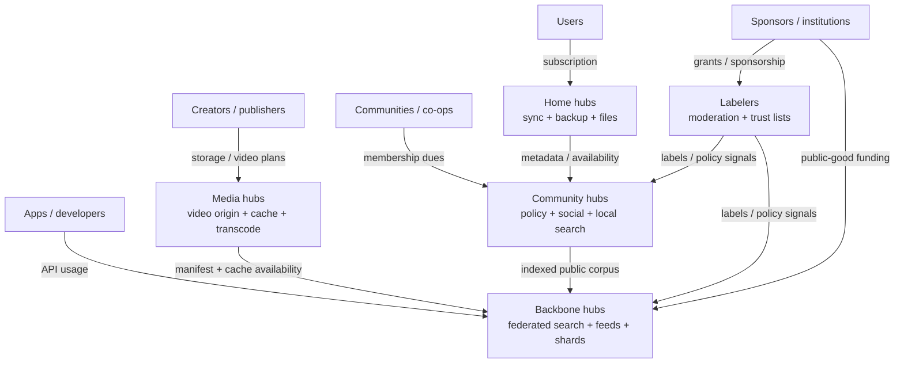
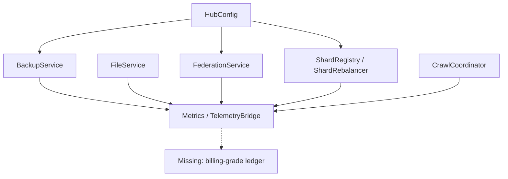
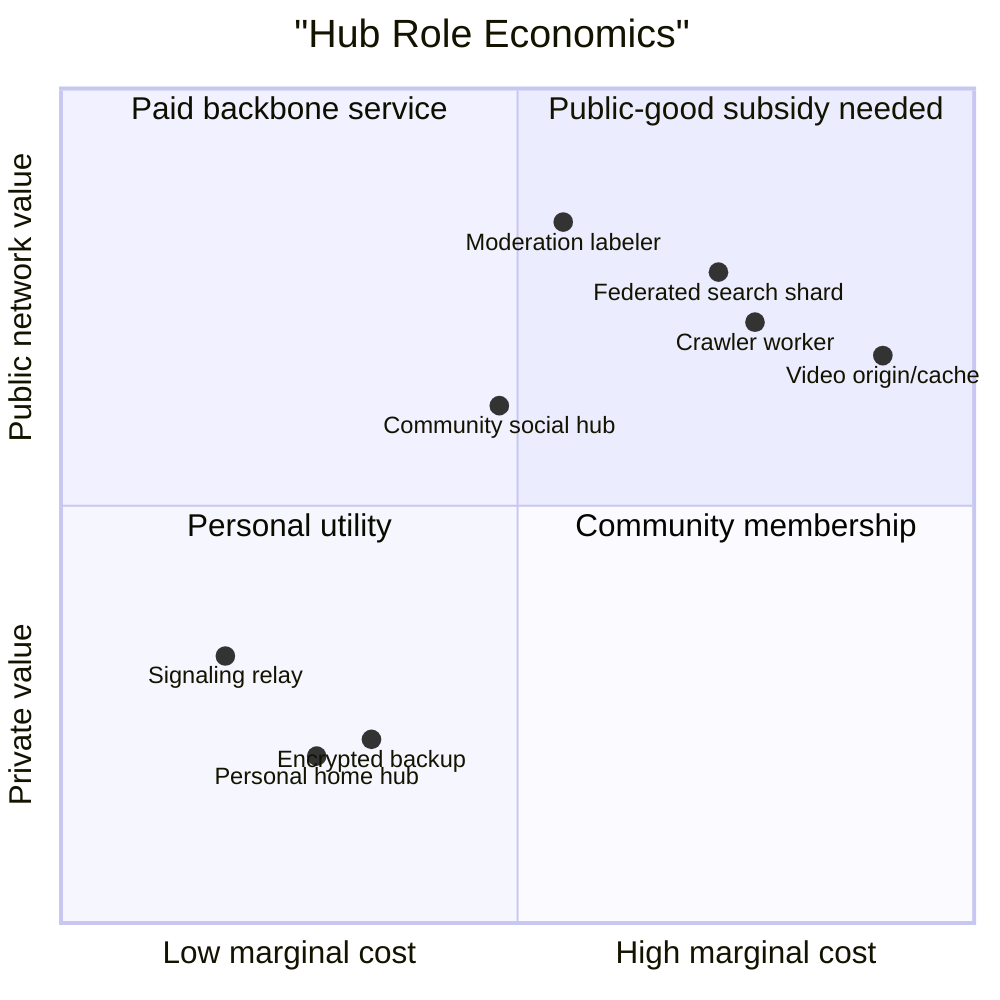
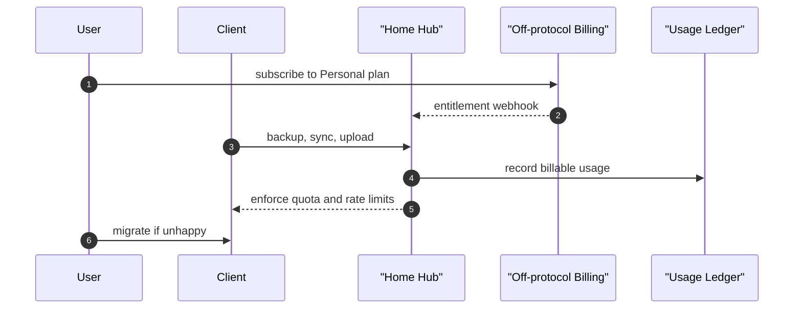
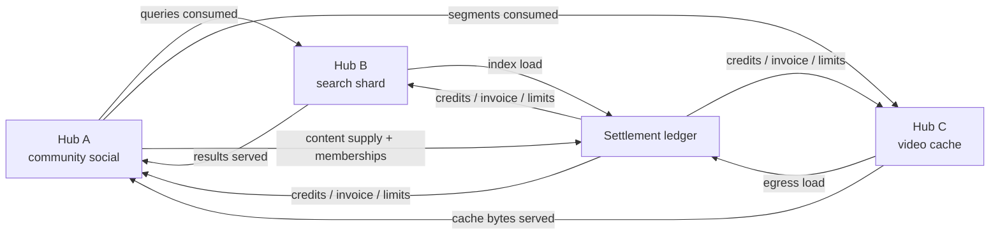
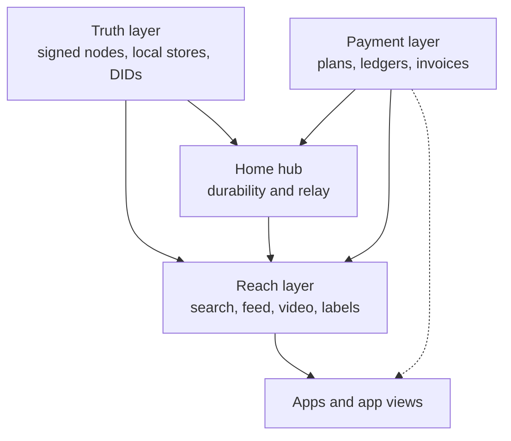
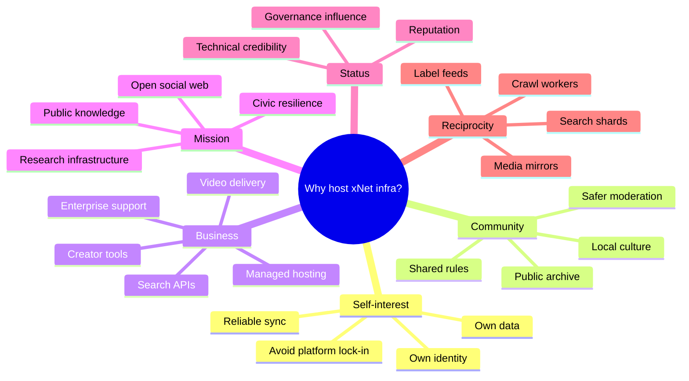
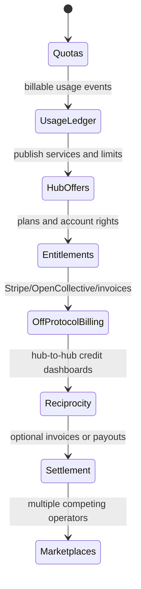

# Economic Models For Hosting Federated Hubs

## Problem Statement

xNet hubs can become more than sync relays. The current hub already points toward backup,
file storage, full-text search, federation, sharding, crawling, discovery, and future social/video
infrastructure. That raises the uncomfortable but essential question: **why would anyone pay to run
or contribute to this infrastructure?**

Federation does not remove infrastructure cost. It changes who pays, who controls policy, who gets
reach, and how easy it is to leave. A good xNet economy should reward useful hosting without
turning the protocol into a single platform, a speculative token scheme, or a charity that quietly
burns out operators.

## Executive Summary

xNet should treat hub hosting as a layered service economy:

1. **Home hubs** provide durable sync, backup, identity availability, and small-file hosting.
2. **Community hubs** provide moderation, public social surfaces, local discovery, and shared
   identity/community value.
3. **Backbone hubs** provide expensive reach services: federated search, crawlers, sharded indexes,
   feed generation, media caches, video transcode, and public APIs.
4. **Specialist services** provide label feeds, search verticals, video mirrors, archive pinning,
   analytics, compliance, and creator tools.

The economic answer is not one model. It is a menu:

- user subscriptions for home hubs;
- community memberships and co-ops for shared hubs;
- managed hosting for organizations;
- API/search/feed/video usage fees for apps and developers;
- creator or publisher plans for video storage and egress;
- reciprocal federation credits for operators who contribute comparable capacity;
- grants, sponsorships, and public-good funding for baseline infrastructure;
- optional advertising or sponsorship only in app-view layers, never as a protocol dependency.

The immediate recommendation is pragmatic: **ship metering, quotas, plan metadata, and operator
transparency before inventing protocol-level payments**. xNet should make it easy to pay a hub,
compare hubs, move hubs, and audit what a hub contributed. Settlement can start off-protocol
with Stripe, Open Collective, invoices, grants, or creator memberships.



## Current State In The Repository

### What The Hub Already Does

`packages/hub/README.md` describes the hub as a signaling server, sync relay, backup service,
query server, file storage service, schema registry, peer discovery service, and federation
gateway. The code already has enough service boundaries to support different economic products:

| Hub capability        | Code location                                | Economic interpretation                                                |
| --------------------- | -------------------------------------------- | ---------------------------------------------------------------------- |
| WebSocket signaling   | `server.ts`, signaling services              | Low-cost utility; often bundled free with paid storage or community.   |
| Sync relay            | `RelayService`, `NodeRelayService`           | Reliability value; paid by users who want devices to work offline.     |
| Encrypted backup      | `BackupService`                              | Direct subscription value; quota already exists.                       |
| File storage          | `FileService`, `/files` routes               | Direct cost center; needs plans, egress accounting, and abuse control. |
| Full-text search      | `QueryService`, FTS storage                  | Premium reach/discovery service; useful for teams and public apps.     |
| Federation            | `FederationService`, federation routes       | Network value; can be reciprocal, paid, sponsored, or curated.         |
| Sharded search        | `ShardRegistry`, `ShardQueryRouter`          | Backbone operator role; capacity can be advertised and compensated.    |
| Crawling              | `CrawlCoordinator`                           | Expensive shared work; needs task budgets and operator incentives.     |
| Metrics               | `Metrics`, `TelemetryBridge`                 | Operational observability; not yet billing-grade metering.             |
| Quotas and limits     | `HubConfig`, `BackupService`, `FileService`  | Strong base for plans; not yet account/plan aware.                     |
| Public access control | `PUBLIC` recipients, grants, UCAN auth paths | Enables public services without making all data public.                |

### Existing Cost Controls

xNet already has operator protection primitives:

- `HubConfig.defaultQuota` defaults to 1 GB per DID for backup-style storage.
- `HubConfig.maxBlobSize` defaults to 50 MB.
- `HubConfig.maxConnections` and `rateLimit` control WebSocket and message load.
- `BackupService` enforces per-owner quota and blob-size limits.
- `FileService` enforces a default 100 MB max file size and 5 GB max file storage per user.
- `FederationService` has peer rate limits, max results, timeouts, peer health, and schema exposure.
- `ShardRebalancer.registerHost()` accepts a host `capacity`, but that capacity is not yet priced,
  audited, or settled.
- `Metrics` exposes Prometheus-style counters for WebSocket, sync, backup, query, and rate-limit
  events.
- `TelemetryBridge` can report usage events, but it is opt-in and intentionally privacy-preserving;
  it is not an accounting ledger.



### What Is Missing Economically

xNet does **not** yet have:

- account plans;
- operator-published pricing;
- per-DID billing identities;
- metered usage records with idempotent event IDs;
- cost attribution for files, search queries, shard hosting, video segments, crawl tasks, or
  federation queries;
- a public hub registry with capabilities, limitations, terms, jurisdiction, moderation policy,
  uptime, contact, and payment links;
- reciprocal accounting between hubs;
- service-level commitments;
- revenue split mechanics between home hubs, search hubs, media caches, labelers, and app views;
- migration flows that make "pay a different host" practical.

That gap matters because users and operators will not reason about "federated infrastructure" in
the abstract. They will reason about concrete costs: storage, bandwidth, moderation time, search
CPU, video egress, abuse handling, uptime, and support.

## External Research

### Mastodon: Control, Community, And Moderation Labor

[Mastodon’s server guide](https://docs.joinmastodon.org/user/run-your-own/) gives the clearest
non-financial motivation for running a server: control over rules, identity, community, and
continuity. The same page also warns that running a public service involves moderation and community
management, and lists recurring costs like VPS hosting, email, and object storage. The
[Mastodon server directory](https://joinmastodon.org/servers) frames servers as independent
providers with different policies, regions, topics, and safety commitments.

Implication for xNet: people host hubs for sovereignty and community identity, but public hubs need
economic support for moderation and operations. "Volunteer forever" is not a durable default.

### Matrix: Public Entry Hubs Need Freemium Or Institutional Funding

The Matrix.org Foundation announced premium accounts for the public matrix.org homeserver because
hosting and trust-and-safety costs became a large share of the Foundation's budget. Their pricing
page describes user choice of homeserver and free/premium usage limits around attachment sizes,
attachment volume, and invite speed. Their funding post also describes memberships as a way for
individuals and organizations to financially support core protocol work and influence governance.

Sources:

- [Matrix premium accounts announcement](https://matrix.org/blog/2025/06/funding-homeserver-premium/)
- [Matrix.org homeserver pricing](https://matrix.org/homeserver/pricing/)
- [Funding Matrix via the Matrix.org Foundation](https://matrix.org/blog/2022/12/01/funding-matrix-via-the-matrix-org-foundation/)

Implication for xNet: a default public hub can seed adoption, but if it becomes the place everyone
uses for free, the cost center recentralizes. Freemium limits and memberships are boring but proven.

### PeerTube: Video Needs Caches, Workers, And Instance Redundancy

[PeerTube architecture docs](https://docs.joinpeertube.org/contribute/architecture) show that a
federated video server still needs a reverse proxy, API server, database, cache/job queue,
transcoding workers, static video serving, ActivityPub federation, and redundancy between
instances. PeerTube can mirror videos from other instances to improve bandwidth use and uses cache
strategies with max size and minimum duplication lifetime. Its production docs warn against running
production video hosting behind low-bandwidth connections.

Implication for xNet: federated video cannot be funded like a lightweight social relay. It needs
creator plans, media quotas, cache budgets, and explicit operator choice about what to mirror.

### AT Protocol: Data Hosting And App Views Are Different Businesses

[AT Protocol self-hosting docs](https://atproto.com/guides/self-hosting) distinguish data-level
infrastructure such as a PDS from application-level infrastructure such as Relays and AppViews.
Relays are bandwidth-intensive, while AppViews are resource-intensive because they replicate and
serve application-level data. The docs also recommend that app operators often host a PDS alongside
the app for onboarding.

Implication for xNet: separate cheap canonical data hosting from expensive reach layers. A home hub,
search hub, video cache, and social app view can be different businesses.

### IPFS And Filecoin: Persistence Requires Someone Paying

[IPFS pinning docs](https://docs.ipfs.tech/quickstart/pin/) describe pinning services as hosting
services that run IPFS nodes and keep data available. IPFS persistence docs explicitly note that if
one sponsor stops paying for pinning, content can be lost. The same docs describe Filecoin-style
deals where storage providers and clients agree on data amount, duration, and cost.

Implication for xNet: content addressing does not pay the storage bill. xNet should borrow the
"pinning service" mental model for durable blobs and video segments, without assuming blockchain
settlement is needed in v1.

### Nostr: Relays Publish Limits And Fees

[NIP-11](https://nostr.co.uk/nips/nip-11/) lets relays publish a machine-readable information
document with features, limitations, operator contact, and optional payment details such as
admission, subscription, and publication fees.

Implication for xNet: every hub should publish a signed `HubOffer` document: capabilities, limits,
accepted schemas, public policy, payment links, and cost hints. Discovery needs economic metadata,
not just URLs.

### Cloud Object Storage: Egress Is Only One Cost

[Cloudflare R2 pricing](https://developers.cloudflare.com/r2/pricing/) is useful because it breaks
object hosting into storage and operation classes, and shows that read-heavy asset hosting can cost
money even with no egress bandwidth fee. This maps directly to xNet video segments, thumbnails,
public attachments, and search index snapshots.

Implication for xNet: "bandwidth is cheap" is not a plan. Reads, writes, cache misses, hot objects,
worker CPU, and moderation still need accounting.

## Key Findings

### 1. Different Hub Roles Have Different Economies



The economic model should not pretend a signaling-only hub and a video cache are the same product.
The former can be bundled, donated, or run by hobbyists. The latter needs usage-based controls.

### 2. The Real Unit Is Not "A Hub"; It Is A Service Offer

One operator might run a small hub with only:

- signaling;
- sync relay;
- 5 GB backup;
- no public search;
- no video hosting;
- no open registration.

Another might run:

- public social app view;
- public search index;
- video segment cache;
- label subscription service;
- paid API.

Both are hubs, but economically they are different service offers. xNet should model and advertise
capabilities explicitly.

### 3. Federation Creates Positive Externalities

A hub that indexes public content or mirrors video segments benefits users on other hubs. Without
some combination of status, reciprocal traffic, payments, sponsorship, or governance, those
externalities produce under-supply. The network will depend on a few generous operators until they
burn out.

### 4. Paid Hosting Is The Most Boring And Most Important Model

Most users do not want to operate infrastructure. They want durable sync, backup, profile
availability, and a public URL. The cleanest model is managed home/community hosting:

- free tier for trial and public-good onboarding;
- paid personal plan;
- paid creator plan;
- paid team/community plan;
- paid enterprise/sovereign plan.

This is compatible with decentralization if users can migrate and if reach services are separable.

### 5. Public Search And Video Are App-View Businesses

Federated search and video infrastructure are expensive because they do work on behalf of readers,
not just owners:

- crawl and ingest public material;
- store and query indexes;
- normalize and rank cross-hub results;
- cache hot result sets;
- serve thumbnails, posters, previews, and video segments;
- moderate what appears in public discovery.

That makes them closer to app views, search APIs, and CDN/media services than simple storage.

### 6. xNet Needs Accounting Before Payments

Do not start with a token, payment rail, or revenue split. Start with an auditable usage ledger:

- who consumed;
- who produced;
- what service class;
- which resource;
- how much;
- when;
- under which plan or federation agreement;
- whether it was billable, free, reciprocal, sponsored, or abuse-blocked.

Without this, all pricing is vibes.

## Infrastructure Roles And Incentives

| Role                  | What they contribute                          | Why they contribute                                        | Likely compensation                               |
| --------------------- | --------------------------------------------- | ---------------------------------------------------------- | ------------------------------------------------- |
| Personal hub operator | Always-on sync, backup, identity, small files | Control, privacy, hobby, reliability                       | Self-funded or small subscription                 |
| Managed home host     | Same as personal, but for many users          | SaaS business                                              | Monthly plans                                     |
| Community hub         | Shared policy, moderation, local discovery    | Community identity, governance, safety                     | Membership dues, donations, grants                |
| Publisher/creator hub | Public content, media storage, audience tools | Own audience and distribution                              | Creator subscriptions, fan support, sponsorships  |
| Search hub            | Indexes, query APIs, ranking, shards          | API business, public-good mission, app differentiation     | API fees, sponsorships, reciprocal credits        |
| Video media hub       | Origin hosting, segment cache, transcode      | Creator platform, CDN-like business, community media       | Storage/egress/transcode plans                    |
| Labeler/moderator     | Moderation labels, policy lists, review labor | Safety mission, community trust, institution mandate       | Grants, subscriptions, institutional contracts    |
| Crawler worker        | Crawl tasks, extraction, index refresh        | Search network contribution, paid work                     | Task bounty, API revenue share, reciprocal credit |
| App-view operator     | UX, recommendations, feeds, analytics         | Product business                                           | Subscriptions, ads, API fees, sponsorships        |
| Archive/pinning host  | Long-term blob availability                   | Preservation mission, creator backups, institution mandate | Pinning/storage contracts                         |
| Enterprise operator   | Private hubs, compliance, audit, SSO, support | Data sovereignty and control                               | Contracts and support subscriptions               |
| Sponsor/foundation    | Funds ecosystem gaps                          | Public-good, brand, mission, governance influence          | Recognition, governance rights, ecosystem health  |

## Economic Model Menu

### 1. User Subscription Hosting

Best for home hubs, backup, sync relay, small files, personal public profiles.



Pros:

- simple mental model;
- maps directly to existing quotas;
- encourages support and reliability;
- avoids protocol financial complexity.

Cons:

- can recentralize around a few good managed hosts;
- low-income users need free/community plans;
- home hosting alone does not fund search/video reach.

### 2. Community Membership Or Co-op Hub

Best for clubs, regions, schools, research groups, creators, open-source communities, local media.

Users contribute because the hub provides:

- shared moderation;
- shared identity;
- curated discovery;
- domain reputation;
- local archive;
- continuity if commercial platforms decay.

Pros:

- aligns policy and funding;
- transparent governance can build trust;
- natural fit for public social and knowledge communities.

Cons:

- volunteer moderation burns out;
- dues collection and governance are work;
- free-riding is hard to avoid without quotas.

### 3. Managed Organizational Hosting

Best for companies, schools, nonprofits, governments, research networks.

The buyer pays for:

- private or semi-public hub;
- SSO and domain management;
- compliance controls;
- support and uptime;
- migration/export;
- audit logs;
- custom moderation/policy.

This is likely the earliest serious revenue source because organizations already understand paying
for hosted collaboration, storage, and compliance.

### 4. API And App-View Revenue

Best for federated search, feed generation, analytics, and public social app views.

Apps pay for:

- search queries;
- trend APIs;
- feed candidate generation;
- label-aware rankings;
- public profile/video/post hydration;
- high-rate developer access.

This preserves decentralization if the API is optional and users can switch app views.

### 5. Creator And Publisher Plans

Best for video and public media.

Creators pay for:

- source storage;
- derived renditions;
- transcode minutes;
- thumbnail/storyboard generation;
- segment egress/cache;
- public analytics;
- custom domains;
- monetized fan/community tools.

This should be explicit. Video is not "just a bigger file upload."

### 6. Reciprocal Federation Credits

Best for hub-to-hub search, cache mirroring, shard replication, and crawler work.

Each hub records what it contributes and consumes:

- federation queries served;
- public docs indexed;
- shard postings hosted;
- video segments mirrored;
- crawl tasks completed;
- label decisions served;
- uptime and freshness.

Operators with balanced contributions federate for free. Operators that mostly consume can pay,
accept stricter limits, or contribute capacity.



Pros:

- rewards operators who actually contribute;
- supports non-cash federation between communities;
- discourages extractive free riders.

Cons:

- accounting complexity;
- requires anti-fraud and attribution;
- settlement disputes are inevitable.

### 7. Public-Good Funding

Best for protocol development, default hubs, safety tooling, emergency moderation, public indexes,
and research.

Sources:

- foundation memberships;
- grants;
- public-interest institutions;
- sponsorships;
- donations;
- ecosystem tax from managed hosts;
- creator solidarity funds.

This should fund gaps, not substitute for product economics. Matrix's experience is a warning:
public default infrastructure can become materially expensive.

### 8. Paid Relay Or Publication Fees

Best for write-heavy, spam-prone, or high-cost services.

Examples:

- pay to publish public video;
- pay to submit high-volume app events;
- pay for high-rate search API;
- pay admission to a high-reputation hub;
- pay a tiny fee for public write paths that are often abused.

This should be optional per hub. It should not be required for local-first private use.

### 9. Advertising Or Sponsorship In App Views

Ads can fund public app views, video pages, and search frontends, but they should not be embedded
into the protocol. A hub may choose to run sponsored discovery, but xNet should require:

- clear labeling;
- user choice of app view;
- no hidden ranking obligation in the protocol;
- no cross-hub tracking requirement;
- local/private modes that do not participate.

### 10. Tokenized Markets

Tokenized storage/retrieval markets can incentivize infrastructure, but they introduce regulatory,
speculative, security, UX, and governance complexity. xNet should not start here.

Useful idea to borrow: measurable service deals.

Risky thing to avoid: making basic federation depend on a volatile asset.

## Proposed xNet Economic Architecture

### Core Principle: Separate Truth, Reach, And Payment



Payments should buy service quality and resource contribution, not ownership of the user's
canonical identity or graph.

### Required Economic Primitives

| Primitive            | Purpose                                                                     |
| -------------------- | --------------------------------------------------------------------------- |
| `HubOffer`           | Signed public description of services, limits, policy, contact, pricing.    |
| `Plan`               | Named entitlement bundle: storage, queries, bandwidth, API rates, support.  |
| `Entitlement`        | Current rights for a DID/account/community under a plan or federation pact. |
| `UsageEvent`         | Idempotent metering record for billable or reciprocal resource usage.       |
| `UsageRollup`        | Hourly/daily rollup used for quota, invoices, and dashboards.               |
| `FederationPact`     | Agreement between hubs: limits, schemas, reciprocity, settlement.           |
| `ServiceCredit`      | Non-cash accounting unit for reciprocal contributions.                      |
| `InvoiceLink`        | Off-protocol pointer to Stripe/Open Collective/invoice/payment page.        |
| `OperatorReputation` | Uptime, abuse response, successful service, dispute history.                |
| `ShutdownNotice`     | Signed continuity notice and migration window for users.                    |

### `HubOffer` Discovery

Every hub should expose a signed machine-readable document similar in spirit to Nostr NIP-11:

```typescript
export type HubServiceKind =
  | 'signal'
  | 'sync-relay'
  | 'backup'
  | 'file-storage'
  | 'federated-search'
  | 'search-shard'
  | 'social-app-view'
  | 'video-origin'
  | 'video-cache'
  | 'video-transcode'
  | 'crawler'
  | 'labeler'

export type HubOffer = {
  version: 1
  hubDid: string
  url: string
  operator: {
    name: string
    contact: string
    jurisdiction?: string
  }
  services: ReadonlyArray<{
    kind: HubServiceKind
    enabled: boolean
    schemas: readonly string[] | '*'
    limits: Record<string, number | string | boolean>
    freeTier?: Record<string, number | string | boolean>
    paidPlansUrl?: string
  }>
  policy: {
    moderationUrl?: string
    termsUrl?: string
    shutdownNoticeDays: number
    dataExport: boolean
    migrationSupport: boolean
  }
  payment: {
    methods: readonly ('stripe' | 'opencollective' | 'invoice' | 'crypto' | 'none')[]
    donationUrl?: string
  }
  signedAt: number
  signature: string
}
```

### Billing-Grade Usage Events

xNet should keep this functional and append-only:

```typescript
export type UsageService =
  | 'backup.storage'
  | 'file.storage'
  | 'file.egress'
  | 'query.local'
  | 'query.federated'
  | 'search.shard.hosted'
  | 'crawl.task'
  | 'video.transcode.minute'
  | 'video.segment.egress'
  | 'moderation.review'

export type UsageEvent = {
  id: string
  hubDid: string
  subjectDid: string
  service: UsageService
  resource: string
  quantity: number
  unit: 'byte' | 'request' | 'minute' | 'doc' | 'segment' | 'review'
  billable: boolean
  settlement: 'free-tier' | 'paid-plan' | 'reciprocal-credit' | 'sponsored' | 'blocked'
  occurredAt: number
}

export type PlanMeter = {
  service: UsageService
  included: number
  overagePriceCents: number
}

export function calculateOverageCents(
  usage: readonly UsageEvent[],
  meters: readonly PlanMeter[]
): number {
  const usageByService = usage.reduce<Map<UsageService, number>>((acc, event) => {
    if (!event.billable) return acc
    acc.set(event.service, (acc.get(event.service) ?? 0) + event.quantity)
    return acc
  }, new Map())

  return meters.reduce((total, meter) => {
    const used = usageByService.get(meter.service) ?? 0
    const overage = Math.max(0, used - meter.included)
    return total + overage * meter.overagePriceCents
  }, 0)
}
```

## Service-Specific Economics

### Federated Search

Cost drivers:

- crawling;
- parsing/extraction;
- index storage;
- ranking CPU;
- query serving;
- federation fan-out;
- abuse/spam filtering;
- cache invalidation.

Who pays:

- app developers needing search APIs;
- communities that want their corpus discoverable;
- institutions funding public knowledge indexes;
- reciprocal search hubs that host shards for each other;
- users with premium discovery features.

Recommended model:

- free low-rate public search for humans;
- paid high-rate API keys for apps;
- reciprocal credits for shard hosts;
- sponsored vertical indexes for public-good domains;
- strict rate limits for anonymous federation queries.

### Federated Video

Cost drivers:

- source storage;
- rendition storage;
- transcode CPU/GPU;
- thumbnails and captions;
- hot segment reads;
- origin shielding;
- moderation and legal review;
- creator support.

Who pays:

- creators/publishers;
- communities running media archives;
- viewers through membership-supported communities;
- sponsors;
- app views that monetize video frontends;
- reciprocal cache operators.

Recommended model:

- creator plans with explicit storage/transcode/egress limits;
- cache credits for hubs that mirror popular public videos;
- no open-ended free public video hosting;
- allow creator-provided object storage for source/renditions;
- publish per-video cost dashboards.

### Federated Social

Cost drivers:

- storage and relay for posts/comments/reactions;
- home timeline materialization;
- notification fan-out;
- moderation labor;
- media attachments;
- search/trending;
- support and abuse response.

Who pays:

- users for personal hosting;
- communities for shared moderation and identity;
- organizations for private/public presence;
- app views for premium feeds or analytics;
- sponsors for public-good spaces.

Recommended model:

- personal/community subscriptions;
- paid team/org hubs;
- optional paid app-view feeds;
- moderation and labeler funding as first-class, not volunteer residue.

## Example Plan Matrix

These are illustrative product shapes, not prices:

| Plan                  | Target user             | Includes                                           | Excludes or meters separately                          |
| --------------------- | ----------------------- | -------------------------------------------------- | ------------------------------------------------------ |
| Free Trial            | New user                | signaling, small sync, tiny backup, limited search | public video, heavy files, API use                     |
| Personal              | Individual              | sync, backup, files, profile availability          | video transcode, high egress, high-rate API            |
| Creator               | Publisher               | media storage, video transcode, public pages       | viral egress beyond included cache budget              |
| Community             | Group                   | members, moderation tools, local search            | global search shard hosting, large public video        |
| Search Operator       | Developer/operator      | shard hosting, API keys, query dashboards          | creator media hosting                                  |
| Institution           | School/org/government   | domain, SSO, compliance, audit, private federation | public app-view monetization                           |
| Public-Good Sponsored | Foundation/grant funded | free accounts or public indexes                    | guaranteed forever-free unlimited resource consumption |

## Operator Motivation Map



## Recommended Model

### Start With Hybrid Off-Protocol Economics

For the next phase, xNet should support:

1. **Managed paid home hubs** for durable private utility.
2. **Community hubs** with memberships/donations and transparent policies.
3. **Paid API/app-view services** for search and feed generation.
4. **Creator/media plans** for video and heavy public files.
5. **Reciprocal credits** between operators, initially as accounting and dashboards, not money.
6. **Foundation/grant sponsorship** for default public-good services.

Do not start with:

- mandatory protocol token;
- global revenue sharing;
- unmetered free public video;
- a single canonical search operator;
- hidden ad-funded ranking as the default economic engine.

### Add Economics In Layers



## Implementation Checklist

### P0 - Metering And Quotas

- [ ] Define `UsageEvent`, `UsageRollup`, `Plan`, `Entitlement`, and `HubOffer` types.
- [ ] Add append-only usage event storage to `HubStorage`.
- [ ] Add idempotency keys for usage events.
- [ ] Record backup bytes stored and deleted per DID.
- [ ] Record file bytes stored and downloaded per DID/resource.
- [ ] Record local query count, federated query count, and query latency.
- [ ] Record WebSocket connection minutes and message counts per authenticated DID when available.
- [ ] Record rate-limit rejections with service/action scope.
- [ ] Add hourly and daily usage rollups.
- [ ] Keep sensitive usage records private to the operator and subject unless explicitly exported.

### P1 - Hub Offers And Operator Discovery

- [ ] Add `GET /.well-known/xnet-hub` or `GET /hub/offer`.
- [ ] Sign hub offers with the hub DID.
- [ ] Include services, limits, schemas, contact, terms, moderation policy, and payment links.
- [ ] Add client UI for comparing hubs.
- [ ] Add registry support for discovering hubs by service kind, region, policy, and plan.
- [ ] Add shutdown notice metadata and migration support flags.
- [ ] Add tests for signature verification and stale offer handling.

### P2 - Plan Enforcement

- [ ] Add plan lookup by DID/account/community.
- [ ] Add entitlement middleware for backup, files, query, federation, and future video routes.
- [ ] Make existing `defaultQuota`, `maxBlobSize`, and file limits plan-aware.
- [ ] Add soft-limit warnings before hard rejection.
- [ ] Add quota dashboards in the app.
- [ ] Add migration/export path when a user outgrows or leaves a hub.
- [ ] Add admin tools for comping, sponsorship, and abuse freezes.

### P3 - Federation Reciprocity

- [ ] Define `FederationPact` between hubs.
- [ ] Track queries served to and consumed from each peer hub.
- [ ] Track shard capacity contributed and consumed.
- [ ] Track crawl tasks accepted and completed.
- [ ] Track media cache bytes served to remote hubs.
- [ ] Add peer-level balance dashboards.
- [ ] Add configurable rules for balanced, sponsored, paid, and blocked peers.
- [ ] Add dispute/audit export for federation usage.

### P4 - Productized Revenue Paths

- [ ] Add managed home hub billing integration behind an interface.
- [ ] Add Open Collective/donation links for community hubs.
- [ ] Add API key management for search/app-view customers.
- [ ] Add creator/video plan hooks for storage, transcode, and egress.
- [ ] Add organization plan hooks for SSO/compliance/support.
- [ ] Add invoice export for self-hosted enterprise deployments.
- [ ] Add public-good sponsorship attribution for sponsored indexes or hubs.

### P5 - Operator Sustainability

- [ ] Add cost dashboards: storage, operations, query CPU, egress, transcode, moderation queue.
- [ ] Add per-service gross margin estimates.
- [ ] Add abuse cost dashboards.
- [ ] Add hub health and uptime publication.
- [ ] Add migration documentation for users and operators.
- [ ] Add hub shutdown playbook with signed notices and export windows.
- [ ] Add foundation guidance for ethical pricing and interoperability expectations.

## Validation Checklist

### Unit Tests

- [ ] Usage event IDs dedupe repeated submissions.
- [ ] Rollups are deterministic across replay.
- [ ] Plan overage calculation is pure and covered by boundary tests.
- [ ] Entitlement checks reject over-quota writes.
- [ ] Soft-limit warnings trigger before hard limits.
- [ ] Hub offer signature verification rejects tampering.
- [ ] Federation pact validation rejects unsupported service kinds.
- [ ] Free-tier usage is excluded from invoices but included in operator dashboards.

### Integration Tests

- [ ] Backup upload records usage and updates quota.
- [ ] File upload records storage usage and rejects over-plan writes.
- [ ] File download records egress/read usage.
- [ ] Local search records query usage.
- [ ] Federated search records consumed and served usage for each peer.
- [ ] Shard registration records host capacity.
- [ ] Crawl task completion records work done by crawler DID.
- [ ] Plan change updates entitlements without losing data.
- [ ] Hub offer endpoint returns a signed, cacheable, machine-readable document.

### Product And Operator Validation

- [ ] A user can understand why they hit a quota.
- [ ] A hub operator can see which services cost money.
- [ ] A community can publish donation or membership links.
- [ ] A developer can request an API key and see query usage.
- [ ] A creator can see video storage/transcode/egress usage.
- [ ] A peer hub can see reciprocity balance.
- [ ] A user can compare two hubs by services, limits, policy, and migration support.
- [ ] A user can export/migrate when a hub changes pricing.

### Abuse And Fairness Validation

- [ ] Anonymous or untrusted peers cannot create unbounded federation cost.
- [ ] Search API abuse is rate-limited and metered.
- [ ] Public file hotlinking cannot silently bankrupt a hub.
- [ ] Video cache overuse can be capped by plan, peer, or resource.
- [ ] Sponsored/free plans cannot bypass moderation policy.
- [ ] Usage dashboards do not leak private document titles or content.
- [ ] Billing events do not require collecting unnecessary personal data.

## Risks And Tradeoffs

| Risk                    | Description                                        | Mitigation                                                  |
| ----------------------- | -------------------------------------------------- | ----------------------------------------------------------- |
| Recentralization        | Best-funded hubs become default reach layer        | Migration, open offers, multiple app views, shard plurality |
| Volunteer burnout       | Communities rely on unpaid moderation and ops      | Dues, grants, paid moderator tooling                        |
| Privacy leakage         | Billing records reveal sensitive behavior          | Minimize fields, aggregate rollups, private ledger          |
| Payment exclusion       | Paid infrastructure excludes users                 | Free tiers, sponsorships, community plans, self-hosting     |
| Perverse incentives     | Operators optimize for billable engagement         | User-choice app views, label-aware ranking, transparency    |
| Fraudulent usage claims | Hubs exaggerate service contribution               | Signed events, peer receipts, sampling audits               |
| Token distraction       | Speculation overwhelms product utility             | Off-protocol payments first                                 |
| Legal/tax complexity    | Paying global operators creates compliance issues  | Start with external billing providers and invoices          |
| Hidden cross-subsidy    | Video/search drains money from backup/social users | Service-specific metering and plan separation               |

## Concrete Next Actions

1. Add a small `UsageEvent` design document before implementing any billing integration.
2. Extend hub metrics into an append-only, privacy-conscious usage ledger.
3. Add signed `HubOffer` endpoint with services, limits, contact, terms, and payment links.
4. Make current backup/file quotas plan-aware without changing payment rails yet.
5. Add operator dashboards for storage, file reads, search queries, federation queries, and rate
   limits.
6. Define `FederationPact` for reciprocal search and shard hosting.
7. Create a simple managed-hosting product matrix: personal, community, creator, search operator,
   institution.
8. Keep payments off-protocol initially: Stripe, Open Collective, invoices, grants, or donations.
9. Revisit protocol-level settlement only after usage records, migration, and operator plurality
   are working.

## References

### Local Code And Prior Explorations

- `packages/hub/README.md`
- `packages/hub/src/types.ts`
- `packages/hub/src/server.ts`
- `packages/hub/src/services/backup.ts`
- `packages/hub/src/services/files.ts`
- `packages/hub/src/services/federation.ts`
- `packages/hub/src/services/index-shards.ts`
- `packages/hub/src/services/shard-rebalancer.ts`
- `packages/hub/src/services/shard-router.ts`
- `packages/hub/src/services/crawl.ts`
- `packages/hub/src/middleware/metrics.ts`
- `packages/hub/src/middleware/telemetry-bridge.ts`
- `docs/explorations/0023_[_]_DECENTRALIZED_SEARCH.md`
- `docs/explorations/0035_[x]_MINIMAL_SIGNALING_ONLY_HUB.md`
- `docs/explorations/0115_[_]_ARCHITECTING_FULLY_DECENTRALIZED_GLOBAL_WEB_SEARCH.md`
- `docs/explorations/0116_[_]_ARCHITECTING_DECENTRALIZED_TWITTER_X_ON_XNET.md`
- `docs/explorations/0129_[_]_HOW_WILL_XNET_HANDLE_SPAM.md`
- `docs/explorations/0130_[_]_MODERATION_PUBLICLY_ACCESSIBLE_COMMENTS_LIKES_MESSAGING.md`
- `docs/explorations/0131_[_]_FEDERATED_DECENTRALIZED_VIDEO_PLATFORM_LIKE_YOUTUBE_OR_INSTAGRAM.md`

### External Sources

- [Mastodon: running your own server](https://docs.joinmastodon.org/user/run-your-own/)
- [Mastodon server directory](https://joinmastodon.org/servers)
- [Matrix.org premium accounts announcement](https://matrix.org/blog/2025/06/funding-homeserver-premium/)
- [Matrix.org homeserver pricing](https://matrix.org/homeserver/pricing/)
- [Funding Matrix via the Matrix.org Foundation](https://matrix.org/blog/2022/12/01/funding-matrix-via-the-matrix-org-foundation/)
- [PeerTube architecture documentation](https://docs.joinpeertube.org/contribute/architecture)
- [PeerTube production install guide](https://docs.joinpeertube.org/install/any-os)
- [AT Protocol self-hosting guide](https://atproto.com/guides/self-hosting)
- [IPFS pinning services guide](https://docs.ipfs.tech/quickstart/pin/)
- [IPFS persistence concepts](https://docs.ipfs.tech/concepts/persistence/)
- [Nostr NIP-11 relay information document](https://nostr.co.uk/nips/nip-11/)
- [Cloudflare R2 pricing](https://developers.cloudflare.com/r2/pricing/)
