# Graceful Network Updates And Interoperability

## Purpose

xNet updates are not just normal software updates. They include npm package releases,
wire protocol changes, schemas in a global namespace, hub federation behavior, app
distribution, plugin permissions, indexer behavior, and old peers that may stay online
for years. A graceful rollout strategy has to let new software ship without forcing the
whole network to update in lockstep.

The practical goal should be:

> Any xNet participant can safely read, preserve, route, and graph data it does not fully
> understand, while new participants can negotiate richer behavior with peers that support
> it.

## Executive Recommendation

Adopt a formal xNet compatibility contract with five pillars:

1. **Version every public surface separately.** Package API, wire protocol, schema,
   federation API, plugin manifest, app bundle, and hub service versions should not be
   collapsed into one number.
2. **Negotiate capabilities before using them.** Peers and hubs should advertise protocols,
   schemas, features, deprecations, and minimum supported versions during connection setup.
3. **Make schemas append-first and migration-on-read.** Use optional additive fields for
   minor evolution, lenses for breaking evolution, and preservation of unknown data as a
   network invariant.
4. **Roll out in rings.** Release packages, canary hubs, app builds, and schema changes in
   staged cohorts with telemetry and rollback points.
5. **Secure app and plugin updates with signed manifests.** Electron auto-update is a
   useful base, but xNet apps and plugins also need compatibility preflight checks and
   TUF-style metadata for rollback, freeze, and compromised-key resistance.

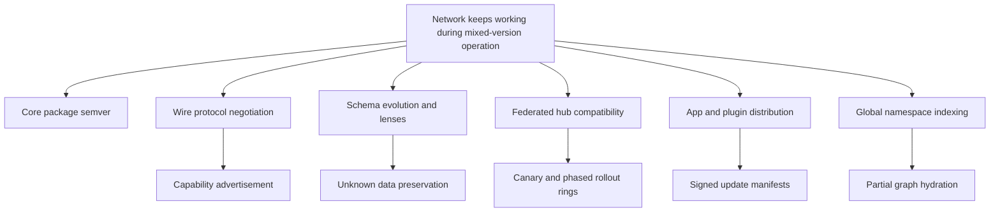

## Research Inputs

### Codebase Findings

- The root workspace already uses Changesets for package versioning and has scripts for
  `changeset`, `version-packages`, and `release`, so core package publishing has a normal
  release foundation.
- Public packages such as `@xnetjs/core`, `@xnetjs/sync`, `@xnetjs/data`, and
  `@xnetjs/plugins` are configured for npm publishing with provenance, while
  `@xnetjs/hub` and apps are private service/application packages.
- The Electron app has an updater in `apps/electron/src/main/updater.ts` using
  `electron-updater`, `autoDownload = false`, periodic checks every four hours, and user
  prompts for download/restart. It does not appear to gate updates on network compatibility.
- `packages/sync/src/change.ts` defines `CURRENT_PROTOCOL_VERSION = 3`. The change verifier
  already handles legacy and future protocol versions leniently: future versions warn but
  are not rejected solely because the version is newer.
- `packages/sync/src/handlers/index.ts` has a version-aware `ChangeHandlerRegistry` that can
  register handlers by change type and protocol version range, storing unknown changes for
  later processing.
- `packages/network/src/protocols/sync.ts` uses a fixed libp2p protocol ID:
  `/xnet/sync/1.0.0`. There is not yet an obvious multi-version negotiation list or
  capability exchange around the sync protocol.
- `packages/data/src/schema/node.ts` defines versioned schema IRIs like
  `xnet://xnet.fyi/Task@1.0.0`, plus helpers for parsing, normalizing, base IRI extraction,
  and default schema version `1.0.0`.
- `packages/data/src/schema/registry.ts` supports version-aware schema lookup, remote
  resolution, and listing versions.
- `packages/data/src/schema/lens.ts` implements bidirectional schema lenses with BFS
  pathfinding, lossless/lossy metadata, and detailed migration warnings.
- `packages/data/src/store/types.ts` and `packages/data/src/store/store.ts` preserve unknown
  properties under `_unknown` when a property lookup is configured, and `getWithMigration`
  can migrate reads through a lens registry.
- `packages/hub/src/services/schemas.ts` enforces namespace authority for schema publishing,
  but its schema version input is a positive integer and requires monotonic integer
  increments. That does not match the semver schema IRIs used by the data package.
- `packages/hub/src/services/federation.ts` tracks peers, schemas, trust, health, latency,
  and rate limits, but the request/response types do not yet advertise protocol versions or
  peer capabilities.
- `packages/plugins/src/schemas/plugin.ts` models plugins as nodes with `pluginId`,
  `version`, `manifest`, `source`, permissions, and enabled state. `packages/plugins/src/types.ts`
  has platform capabilities, but there is not yet a full signed update-channel model visible.
- Existing docs under `docs/sync/` already describe version compatibility, deprecation
  policy, migration guides, recovery procedures, and CI migration validation. The next
  step is to connect those documented ideas to the actual hub/network/app release path.

### External Findings

- [Semantic Versioning](https://semver.org/spec/v2.0.0.html) is a good package/API baseline:
  major for incompatible API changes, minor for backward-compatible functionality, patch for
  backward-compatible bug fixes.
- [Kubernetes version skew policy](https://kubernetes.io/releases/version-skew-policy/) is a
  useful model because it documents which components may be newer or older and prescribes
  an upgrade order. xNet needs the same kind of explicit skew matrix for clients, hubs,
  indexers, and plugins.
- [libp2p protocol docs](https://libp2p.io/docs/protocols/) recommend path-like protocol IDs
  with versions, describe fallback negotiation, and allow dialing with a list of protocol
  IDs so the first supported version wins.
- [Matrix specification versioning](https://spec.matrix.org/latest/) shows how a federated
  network can mix namespaced custom events, endpoint-specific versioning, and a deprecation
  process where older functionality remains implemented while advertised.
- [AT Protocol Lexicons](https://atproto.com/guides/lexicon) are a close comparison for
  globally named schemas. Once published, lexicon constraints are not mutated in place; if
  constraints must change, the protocol recommends a new lexicon name.
- [Protocol Buffers schema evolution](https://protobuf.dev/programming-guides/proto3/#updating)
  reinforces two important lessons: avoid unsafe wire changes unless every reader and writer
  is upgraded, and preserve unknown fields to avoid destroying future data.
- [Electron autoUpdater](https://www.electronjs.org/docs/latest/api/auto-updater) covers
  platform app update mechanics, while [The Update Framework](https://theupdateframework.io/)
  adds the stronger software-update security model xNet should consider for plugins, apps,
  and hub packages.

## The Version Surfaces

xNet should treat versions as a graph, not a single scalar.

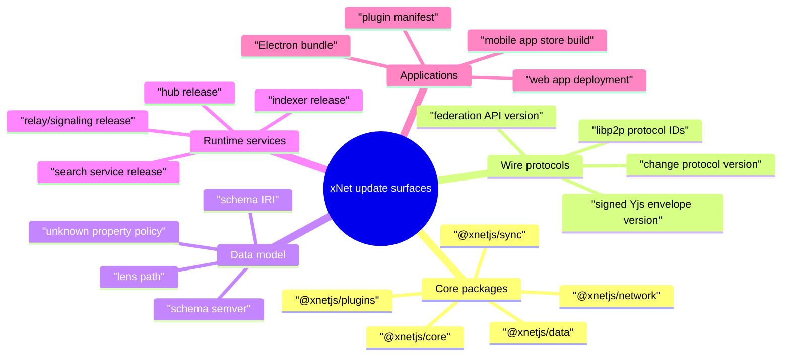

### Proposed Version Vocabulary

| Surface          | Example                      | Compatibility rule                                                        |
| ---------------- | ---------------------------- | ------------------------------------------------------------------------- |
| Package API      | `@xnetjs/data@1.4.2`         | SemVer; public TypeScript API determines breaking changes                 |
| Change format    | `protocolVersion: 3`         | Current plus at least one previous major; unknown change types stored     |
| libp2p protocol  | `/xnet/sync/1.1.0`           | Dial newest supported first, fallback to older supported IDs              |
| Hub API          | `/xnet/federation/v1`        | Endpoint-specific compatibility and deprecation policy                    |
| Schema IRI       | `xnet://xnet.fyi/Task@1.2.0` | Minor additive, major requires lens or new schema name                    |
| Plugin manifest  | `manifestVersion: 1`         | Runtime validates engine and permission constraints before install/update |
| App build        | `xnet-electron@0.3.5`        | Signed app update plus network compatibility preflight                    |
| Namespace policy | `xnet://xnet.fyi/*`          | Authority and schema evolution rules enforced by registry/hubs            |

## Current Architecture Compatibility Map

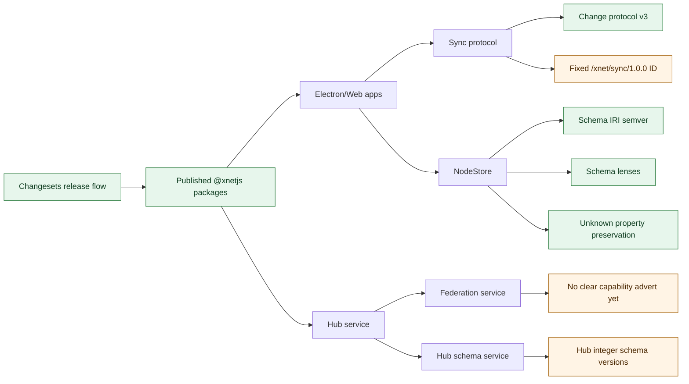

The strong parts are already in place at the data layer: semver schema IRIs, lens-based
migration, and unknown preservation. The risky parts are at network boundaries: protocol
selection, hub-to-hub federation, public graph indexing, and app/plugin update manifests.

## Compatibility Principles

### 1. Old Readers Must Not Destroy New Data

This is the most important invariant. An older client may not understand a future schema
field, change type, or plugin-defined view, but it should preserve it when reading,
syncing, and writing adjacent changes.

xNet already has the start of this with `_unknown` fields and unknown change storage. The
compatibility contract should elevate this from an implementation detail to a network rule.

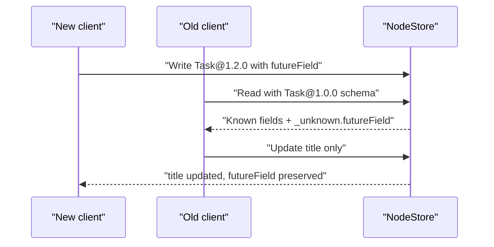

### 2. Capabilities Beat Version Numbers

Versions are useful for humans and release notes, but peers should make behavior decisions
from explicit capabilities.

Examples:

- `xnet.sync.change.v3`
- `xnet.sync.yjs.signed-envelope.v2`
- `xnet.schema.lens.transform.v1`
- `xnet.schema.unknown-preserve.v1`
- `xnet.hub.federation.query.v1`
- `xnet.hub.federation.cursor.v2`
- `xnet.plugin.manifest.v1`
- `xnet.app.update.compat-preflight.v1`

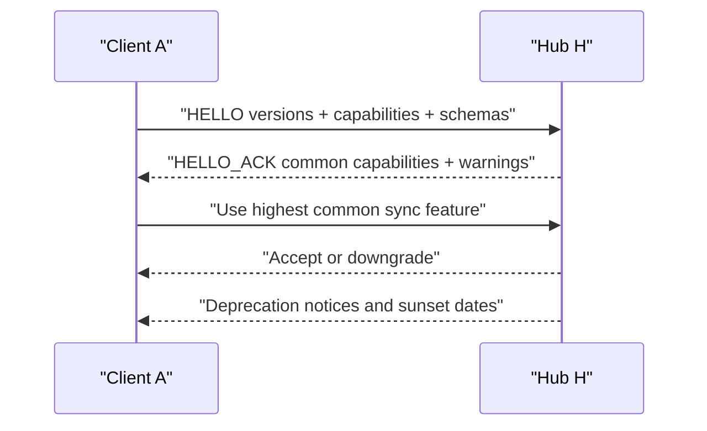

### 3. Schema Versioning Must Match Data Reality

The data package treats schema versions as semver inside schema IRIs. The hub schema service
currently appears to use integer versions. That mismatch will cause problems as soon as
schemas need patch/minor/major semantics, pre-release channels, or lens discovery.

Recommended model:

- `@id` remains the full versioned schema IRI.
- `baseIri` is the IRI without version.
- `version` is a semver string.
- `compatibility` records additive/breaking/lossy metadata.
- `migrateFrom` points to the previous version or a set of accepted source versions.
- Hub registry rejects in-place mutation of already published schema versions.

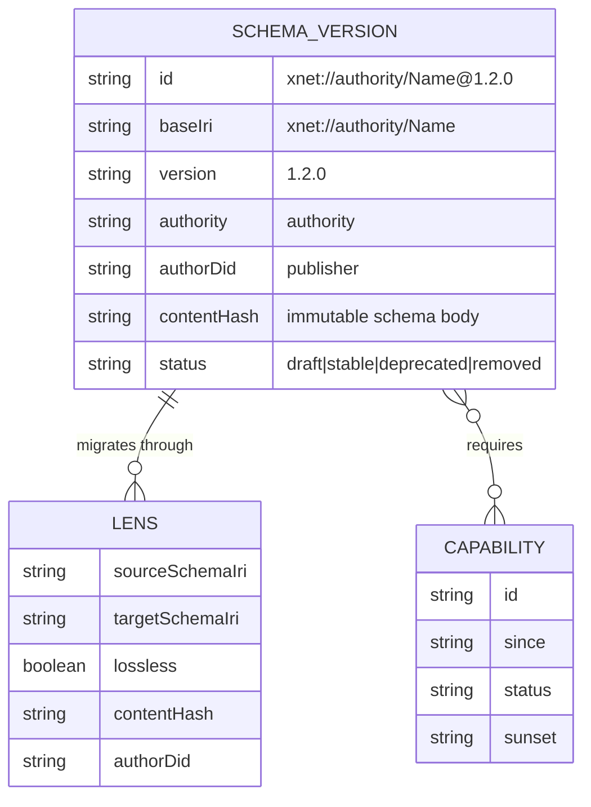

### 4. Breaking Changes Need Bridge Releases

A breaking change should not ship as:

> release new writer, old readers fail.

It should ship as:

1. Release old readers that can tolerate the new shape.
2. Wait for adoption across hubs/apps.
3. Enable new writers in canary.
4. Expand write capability gradually.
5. Deprecate the old path after telemetry shows enough compatibility.

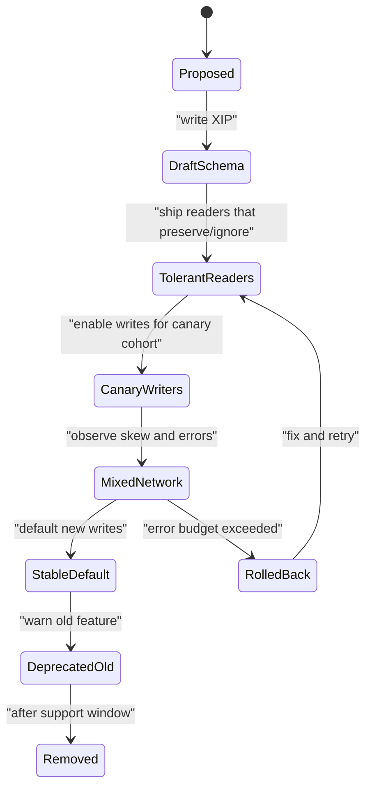

## Proposed Compatibility Contract

### Package Contract

- Core packages follow semver once public APIs are declared stable.
- During `0.x`, every release still includes a machine-readable compatibility manifest
  because the network cannot rely on semver alone.
- Package releases include:
  - public API changes,
  - wire protocol changes,
  - schema changes,
  - migration/lens requirements,
  - app/hub minimum versions,
  - deprecation warnings.
- Hubs and apps pin compatible workspace ranges instead of floating blindly to latest.

### Protocol Contract

- Every wire protocol has a stable identifier and version.
- Peers advertise all supported protocol IDs, not just the newest one.
- Dialers try newest first and fall back to older supported IDs.
- New messages are append-only where possible.
- Unknown message/change types are stored, gossiped if safe, and surfaced in telemetry.
- The network supports at least `current` and `previous` protocol major for a documented
  period.

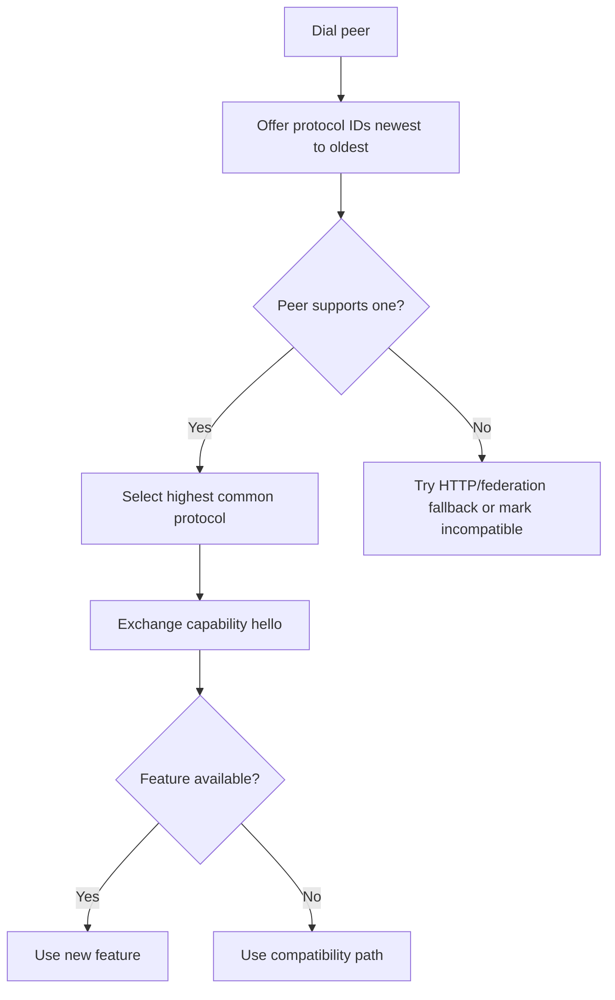

### Schema Contract

- Additive optional fields are minor changes.
- Required fields, renamed fields, removed fields, narrowed enums, and type changes require
  a major version or a new schema name.
- Published schema versions are immutable.
- Hubs enforce semver and schema evolution rules.
- Every breaking schema change includes at least one lens path.
- Lossy lenses are allowed only when the caller opts into lossy projection.
- Clients that do not understand a schema can still display generic metadata, links,
  provenance, and raw JSON.

### Hub Contract

- Hubs advertise a `/.well-known/xnet-capabilities` document or equivalent authenticated
  endpoint.
- Federation requests include a version/capability envelope.
- Hubs support at least one prior client/federation version during the support window.
- Hubs reject writes that require unsupported capabilities, but can still index and route
  unknown data.
- Hubs report peer skew, deprecated feature usage, failed migrations, unknown schema
  frequency, and rejected writes.

### Application Contract

Apps built on xNet are normal software at the packaging layer, but they are network clients
at the compatibility layer.

- Web apps can deploy normally, but must treat service worker caches, local IndexedDB
  migrations, schema write versions, and hub capabilities as compatibility boundaries.
- Electron apps can use auto-update, but updates should run a preflight:
  - current local store schema versions,
  - configured hubs and their capabilities,
  - plugin compatibility,
  - pending writes that could become unreadable by older peers,
  - rollback availability.
- Mobile apps must account for slow app-store rollout, so they should have longer protocol
  support windows and server-controlled feature flags.
- Plugins need signed manifests, engine constraints, permission diffs, and rollback metadata.

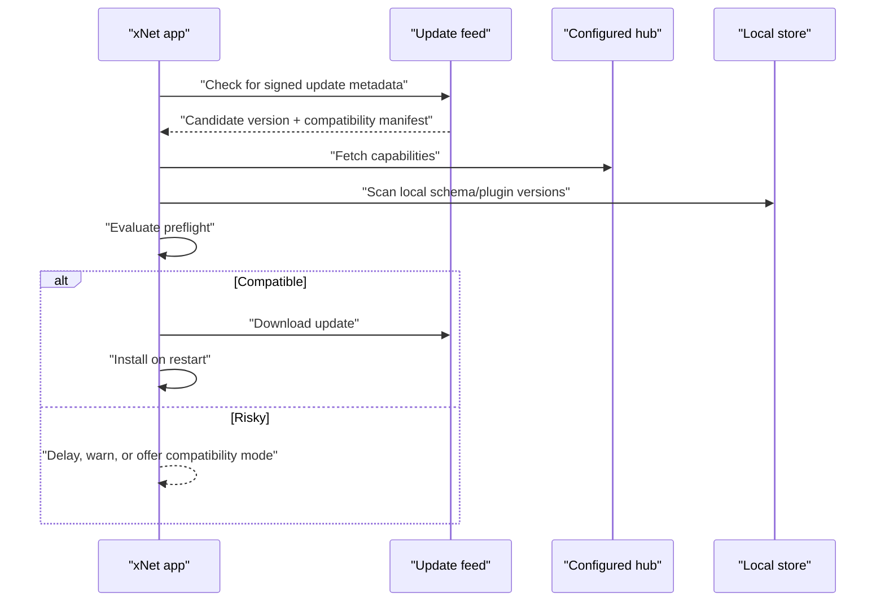

## The Global Namespace Problem

xNet’s goal of a global namespace that can graph data across the whole network makes update
behavior more subtle than ordinary app compatibility.

In a local-only app, a breaking schema migration can rewrite a database and move on. In a
global graph:

- old nodes may be referenced forever,
- old clients may continue to write old schema versions,
- hubs may index data from authorities they do not fully trust,
- a search/index hub may need to show partial results for unknown schemas,
- a new schema version can affect graph traversal, ranking, moderation, permissions, and UI
  rendering,
- namespace authority disputes and schema squatting can become interoperability problems.

### Partial Graph Hydration

Indexers and clients should distinguish between "I can identify this node" and "I can fully
interpret this node."

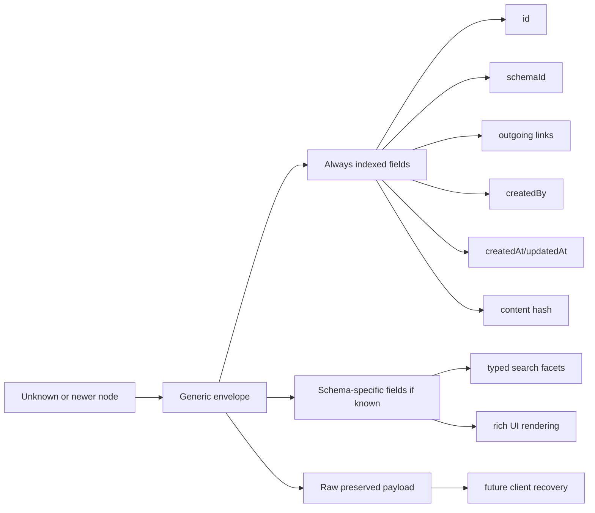

### Namespace Stability Rules

For global graph interoperability, namespace rules should be stricter than package rules:

- A schema IRI version is immutable after publication.
- Authority controls are explicit and auditable.
- Experimental schemas live under experimental names, not under stable names with unstable
  semantics.
- Widely indexed schemas need review and conformance fixtures before being marked stable.
- Deprecated schemas remain resolvable even after new writes are discouraged.

This is close to AT Protocol’s lexicon stance: distributed schemas are easier to evolve when
published constraints are not rewritten in place.

## Suggested Capability Envelope

A single shape can be reused for peer handshakes, hub capabilities, app update preflights,
and plugin compatibility checks.

```typescript
export type XNetCapabilityAdvert = {
  product: 'xnet-client' | 'xnet-hub' | 'xnet-indexer' | 'xnet-plugin'
  productVersion: string
  packages: Record<`@xnetjs/${string}`, string>
  protocols: Array<{
    id: string
    version: string
    status: 'stable' | 'deprecated' | 'experimental'
  }>
  capabilities: Record<
    string,
    {
      since: string
      status: 'stable' | 'deprecated' | 'experimental'
      sunset?: string
      requires?: string[]
    }
  >
  schemas: Array<{
    baseIri: string
    versions: string[]
    canRead: string[]
    canWrite: string[]
    canMigrateTo?: string[]
  }>
  deprecations: Array<{
    id: string
    replacement?: string
    sunset: string
    docs: string
  }>
}
```

Negotiation should be a pure function so it can be tested against fixture matrices:

```typescript
export type NegotiatedCompatibility = {
  protocols: string[]
  capabilities: string[]
  warnings: string[]
  blockedReasons: string[]
}

export function negotiateCompatibility(
  local: XNetCapabilityAdvert,
  remote: XNetCapabilityAdvert
): NegotiatedCompatibility {
  const remoteProtocols = new Set(remote.protocols.map((protocol) => protocol.id))
  const protocols = local.protocols
    .map((protocol) => protocol.id)
    .filter((protocolId) => remoteProtocols.has(protocolId))

  const remoteCapabilities = new Set(Object.keys(remote.capabilities))
  const capabilities = Object.keys(local.capabilities).filter((capability) =>
    remoteCapabilities.has(capability)
  )

  return {
    protocols,
    capabilities,
    warnings: protocols.length === 0 ? ['No shared wire protocol'] : [],
    blockedReasons: protocols.length === 0 ? ['protocol_mismatch'] : []
  }
}
```

## Rollout Strategy By Change Type

| Change type                    | Risk       | Rollout strategy                                                                       |
| ------------------------------ | ---------- | -------------------------------------------------------------------------------------- |
| Patch bug fix inside package   | Low        | Normal Changesets release, update apps/hubs opportunistically                          |
| Add optional schema field      | Low-medium | Publish schema minor, update readers first, enable writers after hub telemetry         |
| Add new change type            | Medium     | Ship handler registry support first, store unknown fallback, gate writes by capability |
| Change sync wire encoding      | High       | New libp2p protocol ID, dual-stack support, canary peers, deprecate old later          |
| Rename schema field            | High       | Publish major schema or new schema, lens path, read compatibility before write default |
| Hub federation query semantics | High       | New endpoint or capability flag, old endpoint retained through support window          |
| Plugin permission model change | High       | New manifest version, permission diff UX, signed update manifest, rollback             |
| Security emergency             | Critical   | Fast patch release, forced minimum version capability, temporary write restrictions    |

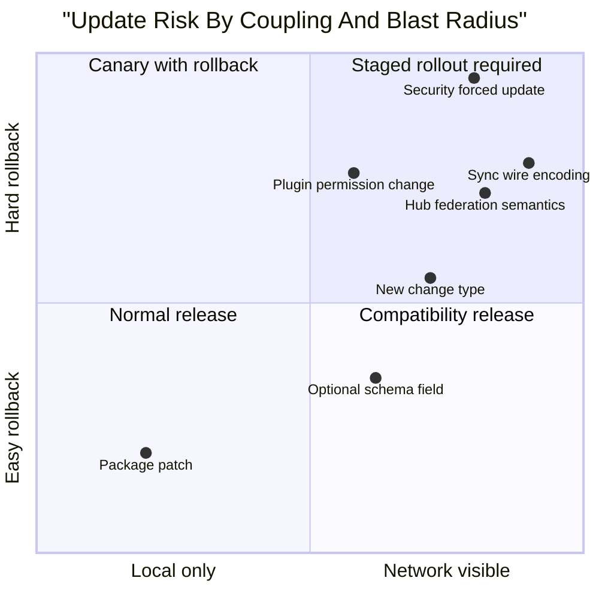

## App And Plugin Distribution

### Electron

The existing updater is a reasonable baseline:

- check on startup,
- repeat checks,
- user prompt,
- manual download/install IPC,
- install on quit.

The xNet-specific addition is a compatibility preflight before presenting the update as a
normal restart.

Preflight inputs:

- local app version,
- target app version,
- local package compatibility manifest,
- target package compatibility manifest,
- configured hub capability adverts,
- local schema versions and lens availability,
- plugin manifests and engine constraints,
- pending local writes,
- last successful backup/snapshot.

Possible outcomes:

- **Install now:** compatible and rollback available.
- **Install after sync:** pending local writes should sync first.
- **Install in compatibility mode:** new UI can run but new writes stay disabled.
- **Delay:** configured hub or plugin is below minimum supported version.
- **Force security update:** only for critical vulnerabilities, ideally with read-only
  compatibility mode if full operation cannot be guaranteed.

### Web Apps

Web deployments are easier to ship but harder to keep coherent because browsers cache assets
and service workers. Web clients should:

- include compatibility manifests in build artifacts,
- use cache-busting and service worker activation rules,
- avoid writing new schema/protocol features until the connected hub advertises support,
- support read-only or compatibility mode when the page is newer than the hub,
- emit telemetry when fallback paths are used.

### Mobile Apps

Mobile updates lag because app-store rollout is outside xNet’s control. Mobile support
windows should be longer than desktop/web. Any protocol that mobile clients must use should
support `current` plus at least two older minor generations unless telemetry proves otherwise.

### Plugins And Apps Built On xNet

Plugins need a stricter update model than ordinary npm packages because they may have
permissions, access user data, and define new schemas.

Proposed manifest fields:

```json
{
  "manifestVersion": 1,
  "pluginId": "com.example.timeline",
  "version": "1.4.0",
  "engines": {
    "xnet": ">=0.3 <0.5",
    "@xnetjs/data": ">=0.4 <0.6"
  },
  "capabilities": ["xnet.schema.read", "xnet.node.write"],
  "schemas": {
    "reads": ["xnet://example.com/Post@1.x"],
    "writes": ["xnet://example.com/Post@1.2.0"]
  },
  "update": {
    "channel": "stable",
    "signature": "ed25519:...",
    "rollbackTo": "1.3.2"
  }
}
```

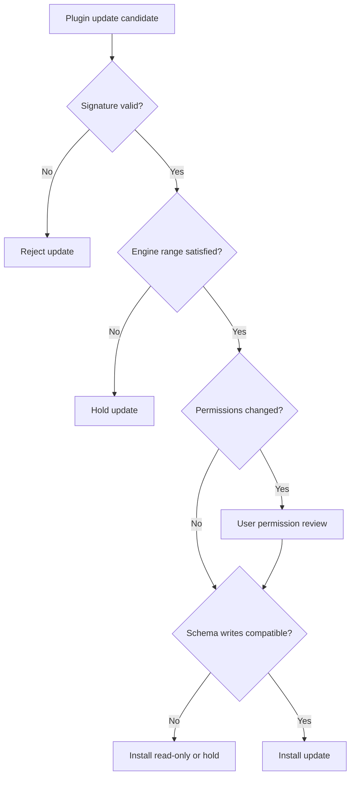

## Hub Rollouts

Hubs are closer to Kubernetes components than desktop apps: they coordinate network traffic,
indexes, schemas, and federation. They need explicit skew support and upgrade order.

Recommended order for non-emergency changes:

1. Publish compatibility docs and test fixtures.
2. Release package support for tolerant reads.
3. Upgrade canary hubs in read-compatible mode.
4. Upgrade indexers/search in partial-hydration mode.
5. Upgrade apps to understand new capabilities.
6. Enable new writes for canary accounts/namespaces.
7. Expand write capability to more hubs.
8. Mark old capability deprecated.
9. Remove only after the support window.

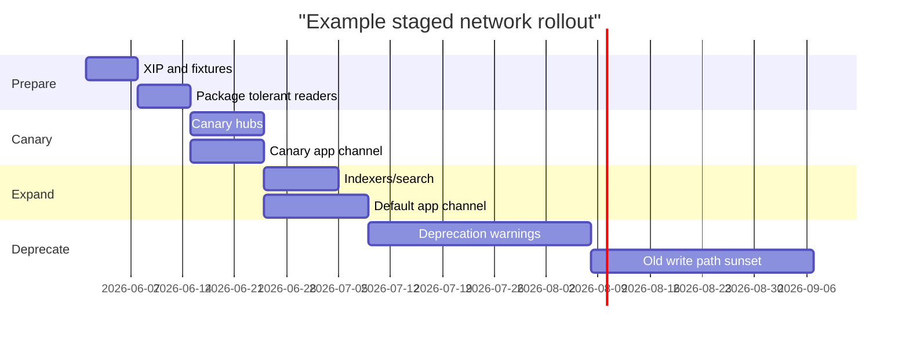

## Recommended Next Steps

1. **Create a formal xNet Compatibility Contract.**
   - Define supported skew windows for client-hub, hub-hub, package-package, schema-client,
     and plugin-app combinations.
   - Move `docs/sync/02-version-compatibility.md` from an isolated sync document into a
     repo-wide compatibility policy.
2. **Implement capability advertisement.**
   - Add `XNetCapabilityAdvert` types in a low-level package.
   - Add hub endpoint support, federation request envelope support, and libp2p hello support.
3. **Dual-stack the sync protocol.**
   - Keep `/xnet/sync/1.0.0`.
   - Add a negotiation path that can advertise and select future protocol IDs.
   - Add tests where a vNext peer talks to a v1-only peer.
4. **Normalize schema versioning in the hub.**
   - Replace integer schema versions with semver strings or explicitly map integers to
     semver-compatible schema IRIs.
   - Enforce immutability of published schema versions.
   - Require evolution checks before publishing a new stable schema version.
5. **Turn existing lens docs into CI gates.**
   - Require migration fixtures for breaking schema changes.
   - Validate round-trip losslessness where claimed.
   - Fail CI when a stable schema breaks evolution rules without a lens or new schema name.
6. **Add app update compatibility preflight.**
   - Extend Electron updater metadata with minimum hub/client/schema/plugin constraints.
   - Show compatibility-mode behavior instead of just "download and restart."
7. **Design signed plugin/app manifests.**
   - Use TUF-style roles or at least signed metadata with expiry, rollback protection, and
     threshold signing for official distribution channels.
8. **Add network version telemetry.**
   - DevTools panel: peer versions, hub versions, negotiated capabilities, deprecations.
   - Hub metrics: rejected features, old protocol usage, unknown schemas, failed lenses.

## Implementation Checklist

### Phase 1: Inventory And Contract

- [ ] Inventory every public version surface in packages, apps, hubs, plugins, and docs.
- [ ] Define canonical capability IDs and naming rules.
- [ ] Define support windows for client-hub, hub-hub, app-plugin, and schema-client skew.
- [ ] Decide when `0.x` packages become stable enough for strict semver guarantees.
- [ ] Update release templates to include compatibility notes.
- [ ] Add a repo-wide `docs/compatibility/` or equivalent policy page.

### Phase 2: Capability Advertisement

- [ ] Add shared `XNetCapabilityAdvert` and negotiation result types.
- [ ] Add pure negotiation helpers with table-driven tests.
- [ ] Add hub `/.well-known/xnet-capabilities` or authenticated equivalent.
- [ ] Add capability envelopes to federation requests/responses.
- [ ] Add libp2p hello/capability exchange before using optional sync features.
- [ ] Add DevTools display for negotiated features and deprecation warnings.

### Phase 3: Protocol Rollout Support

- [ ] Register multiple libp2p sync protocol IDs.
- [ ] Dial protocol IDs newest-to-oldest and accept fallback.
- [ ] Add compatibility tests for old-client/new-hub, new-client/old-hub, old-peer/new-peer.
- [ ] Ensure unknown changes are stored and re-synced only when safe.
- [ ] Emit metrics for protocol downgrade and unsupported feature attempts.
- [ ] Document protocol deprecation and removal dates.

### Phase 4: Schema Evolution

- [ ] Normalize hub schema versions with semver schema IRIs.
- [ ] Enforce immutable schema version records.
- [ ] Add schema diff classification: additive, compatible, breaking, lossy.
- [ ] Require lenses for breaking changes before publishing stable schemas.
- [ ] Add fixtures for old data read by new clients and new data read by old clients.
- [ ] Add generic unknown-schema UI and index behavior.

### Phase 5: App And Plugin Updates

- [ ] Add compatibility metadata to app release artifacts.
- [ ] Add Electron update preflight before download/install prompts.
- [ ] Add plugin engine ranges and capability constraints to manifests.
- [ ] Add signed plugin update metadata with expiry and rollback protection.
- [ ] Add permission diff review for plugin updates.
- [ ] Add compatibility mode for newer apps connected to older hubs.

### Phase 6: Hub And Indexer Operations

- [ ] Add canary hub release channel.
- [ ] Add hub migration dry-run for schema/service changes.
- [ ] Add hub rollback playbook.
- [ ] Add partial graph hydration for unknown schemas.
- [ ] Add index coverage metrics by schema/version.
- [ ] Add federation health metrics by peer version/capability.

## Validation Checklist

### Unit Validation

- [ ] Negotiation helper returns highest common protocol and feature set.
- [ ] Negotiation helper reports blocked reasons for incompatible peers.
- [ ] Schema diff checker classifies additive and breaking changes correctly.
- [ ] Lens registry finds multi-step paths and reports lossy transforms.
- [ ] Unknown fields survive read-modify-write.
- [ ] Unknown change types are persisted without being applied.

### Integration Validation

- [ ] New client can sync with old hub using downgraded capabilities.
- [ ] Old client can read and preserve data written by a new client.
- [ ] New hub can federate with old hub through a compatibility endpoint.
- [ ] Old hub rejects unsupported writes but still indexes generic node metadata.
- [ ] App update preflight blocks an update that would strand configured hubs.
- [ ] Plugin update refuses incompatible engine ranges.

### Rollout Validation

- [ ] Canary release metrics include protocol downgrade rate.
- [ ] Deprecation warnings appear in logs and DevTools.
- [ ] Rollback from canary does not corrupt local stores.
- [ ] Hub blue/green rollout preserves federation health.
- [ ] Search/index results retain unknown-schema nodes as generic graph entries.
- [ ] Security update path can raise minimum supported version without silent data loss.

### Security Validation

- [ ] App update metadata is signed and expiry-checked.
- [ ] Plugin update metadata prevents rollback to vulnerable versions.
- [ ] Hubs reject forged capability adverts.
- [ ] Capability adverts are bound to peer identity or hub DID where relevant.
- [ ] Emergency deprecation path has documented operator and user messaging.

## Open Questions

- Should xNet prefer schema major versions in the IRI (`Task@2.0.0`) or new schema names
  (`TaskV2`) for breaking changes? AT Protocol leans toward new names for stable lexicon
  constraints; xNet lenses make semver-major viable, but global indexing may still prefer
  visibly distinct names for highly incompatible concepts.
- How long should mobile clients be supported behind desktop/web clients? The answer should
  be based on observed app-store lag and active-user version distribution.
- Should hubs be allowed to transform data through lenses on behalf of clients, or should
  they only advertise available lens paths and leave projection to clients?
- Which capabilities are safety-critical enough to require authenticated adverts rather than
  opportunistic peer claims?
- Should official xNet schemas require governance review before being marked stable under
  `xnet://xnet.fyi/*`?

## Bottom Line

xNet can roll updates gracefully if it treats compatibility as a first-class network
protocol. The codebase already has important pieces: semver schema IRIs, schema lenses,
unknown preservation, protocol-versioned changes, and a handler registry. The next leap is
to make capabilities explicit at every boundary, enforce schema immutability and evolution
rules in hubs, dual-stack network protocols, and make app/plugin updates aware of the
network they are about to join.
