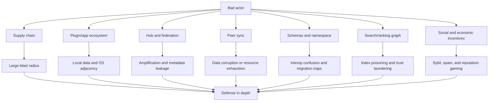
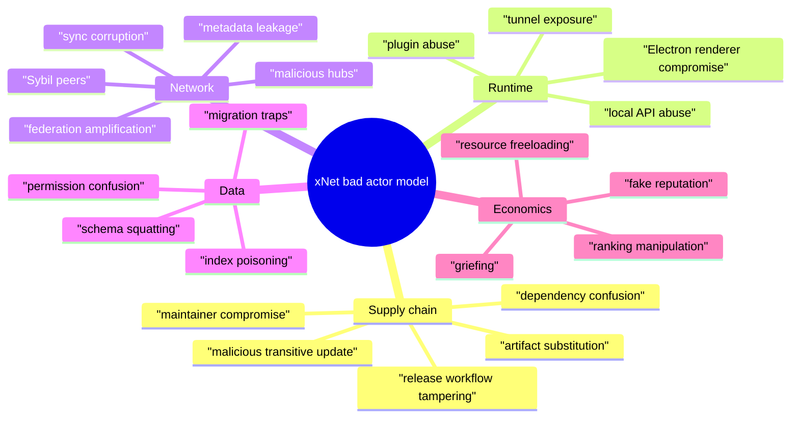
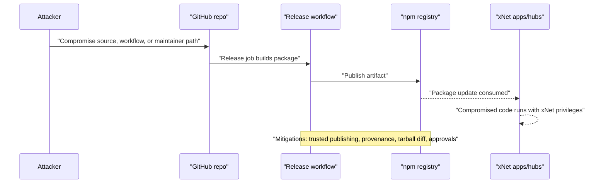
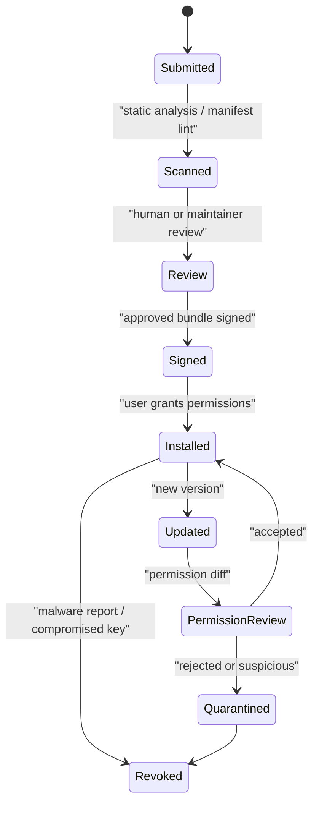
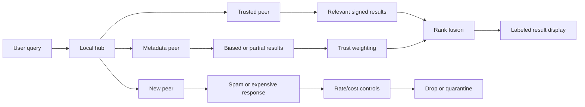
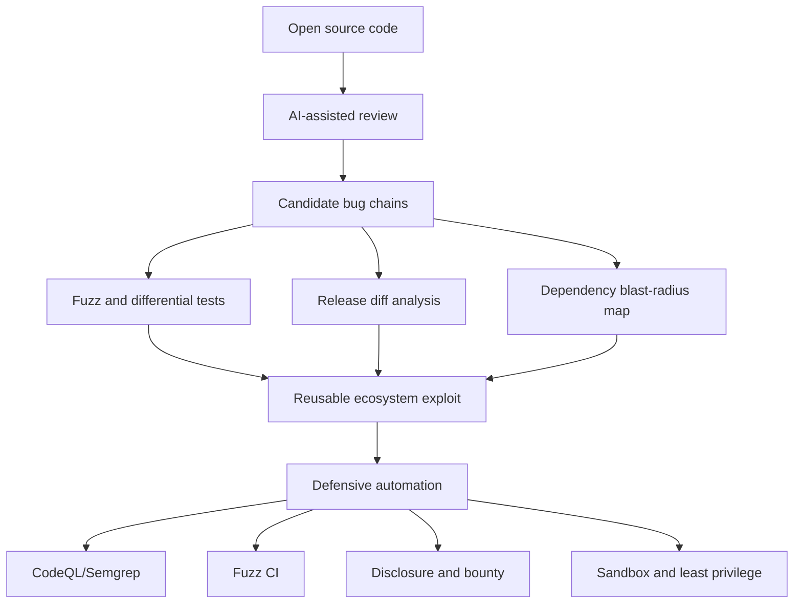
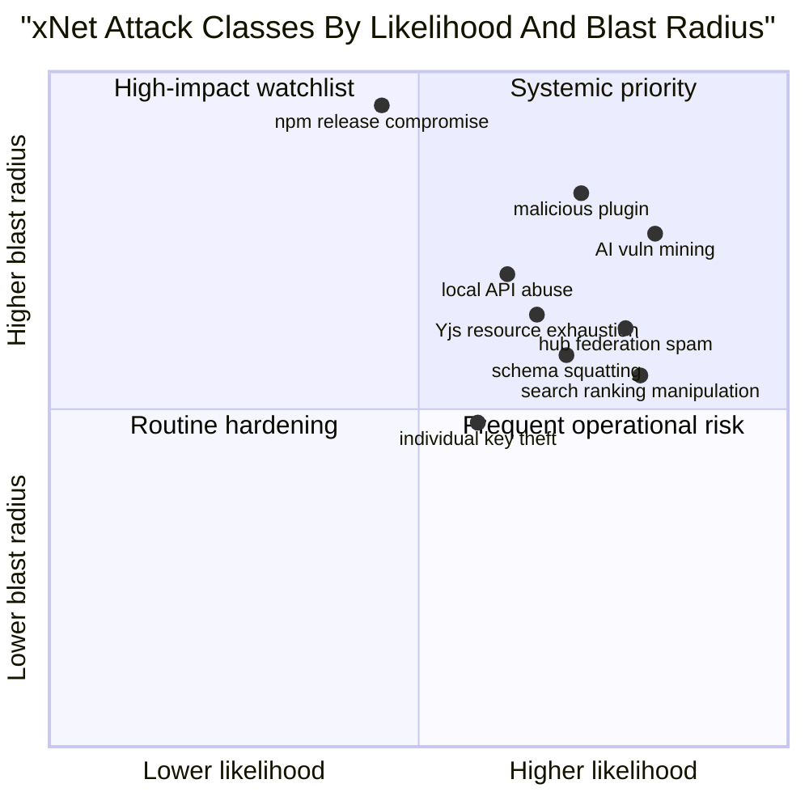
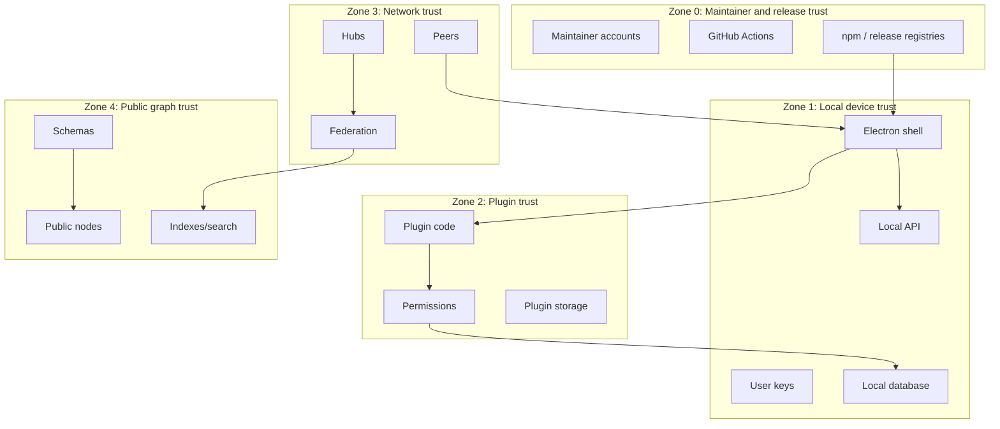

# Bad Actor Attacks And Security Threat Model

## Problem Statement

xNet is aiming for a broad open ecosystem: published npm packages, open source code,
Electron/Web apps, plugins, hubs, federation, schemas, public graph data, and eventually
third-party infrastructure. That is powerful, but it also creates high-leverage attack
surfaces. A single compromised package, malicious plugin, poisoned schema, or hub-level
federation abuse path could affect many applications built on xNet.

This exploration asks:

- How might xNet be gamed by bad actors as it grows?
- Which attacks are xNet-specific rather than generic web/app attacks?
- Where does the current repo already have security controls?
- Which gaps should be closed before xNet becomes infrastructure other people depend on?

This is defensive threat modeling. It names abuse paths and mitigations without providing
operational exploitation steps.

## Executive Summary

The highest-risk xNet attack classes are:

1. **Supply chain compromise.** `@xnetjs/*` packages are a root of trust for apps, hubs,
   plugins, and downstream infrastructure. A poisoned package release could spread quickly.
2. **Plugin and local API abuse.** Plugins are intentionally powerful, and Electron exposes a
   localhost API for integrations. These need strict capability, consent, sandbox, and audit
   boundaries.
3. **Federation and hub abuse.** Hubs can amplify spam, leak metadata, poison search, exhaust
   resources, and launder low-quality data through trusted peers.
4. **Sync-layer data corruption.** Signed Yjs envelopes, rate limits, and peer scoring exist,
   but every network path must consistently use them and reject unsafe fallbacks.
5. **Global namespace/schema gaming.** Bad actors can publish confusing schemas, squat
   namespaces, create migration traps, or make graph data difficult to interpret safely.
6. **AI-assisted vulnerability discovery.** Open source plus high reuse means attackers can
   invest in automated code review, fuzzing, dependency analysis, and exploit chaining once
   xNet has enough adoption.
7. **Economic and reputation attacks.** Search ranking, hub contribution incentives,
   federation reputation, and public graph visibility can be manipulated unless abuse
   resistance is designed up front.

The recommended posture is defense in depth:

- Treat package publishing as a critical production system.
- Make all update, package, plugin, schema, and hub artifacts verifiable.
- Default to least privilege for plugins and local integrations.
- Make federation explicitly trust-scored, rate-limited, and observable.
- Add adversarial testing as a normal CI/release requirement, not as a later audit event.
- Build an incident response path that can revoke packages/plugins/hubs/schemas quickly
  without silently corrupting user data.



## Current State In The Repository

### Supply Chain And Releases

Observed:

- Root `package.json` uses Changesets scripts: `changeset`, `version-packages`, and
  `release`.
- `.changeset/config.json` fixes core public packages together:
  `@xnetjs/react`, `@xnetjs/history`, `@xnetjs/plugins`, `@xnetjs/data-bridge`,
  `@xnetjs/data`, `@xnetjs/storage`, `@xnetjs/sqlite`, `@xnetjs/sync`,
  `@xnetjs/identity`, `@xnetjs/crypto`, and `@xnetjs/core`.
- Many public package manifests include:
  - `publishConfig.access = "public"`
  - `publishConfig.provenance = true`
- `.github/workflows/npm-release.yml` grants `id-token: write`, which is required for npm
  provenance/trusted publishing flows.
- The release workflow runs on pushes to `main`, uses `changesets/action@v1`, and publishes
  via `pnpm release`.
- The setup action uses `pnpm install --frozen-lockfile`, which is good for dependency
  integrity in CI.
- The release workflow has broader write permissions (`contents: write`,
  `pull-requests: write`, `id-token: write`) because it creates release PRs and publishes.

Inference:

- The repo is prepared for provenance-aware npm publishing, but whether npm Trusted
  Publishing is configured in npm package settings cannot be verified from the repository
  alone.
- The fixed Changesets group is helpful for compatibility, but it also means a compromised
  release process can affect many foundational packages at once.

### CI And Security Gates

Observed:

- `.github/workflows/ci.yml` runs format, build/typecheck, lint, tests, coverage upload, and
  focused editor UX tests.
- CI ignores docs/markdown-only changes.
- `.github/workflows/schema-check.yml` is intended to detect schema compatibility breaks.
  Today it creates placeholder empty schema exports and falls back to empty diffs when the
  CLI diff does not run.
- Existing review docs under `docs/reviews/2026-01-30/` identify security issues and test
  coverage gaps. Some issues appear fixed in current code, such as Electron sandboxing,
  IPC allowlisting, local API token auth, and UCAN signing over JWT-style signing input.

Inference:

- General CI quality is healthy, but supply-chain-specific gates are incomplete: no visible
  SBOM generation, Scorecard workflow, CodeQL, secret scanning policy, package tarball diff
  review, dependency review, or release artifact verification workflow.
- The schema check workflow is conceptually important but currently not a reliable control.

### Electron And Local API

Observed:

- `apps/electron/src/main/index.ts` creates the BrowserWindow with:
  - `sandbox: true`
  - `contextIsolation: true`
  - `nodeIntegration: false`
- `apps/electron/src/preload/index.ts` exposes service IPC through an allowlist containing
  plugin service channels.
- `apps/electron/src/main/local-api.ts` starts a localhost API on `127.0.0.1`, generates a
  random token per session unless `XNET_API_TOKEN` is provided, and passes structured IPC
  requests instead of interpolating JavaScript.
- `packages/plugins/src/services/local-api.ts` supports a localhost REST API with optional
  bearer token auth and CORS allowlists. It warns that wildcard CORS is not recommended.
- `apps/electron/src/main/local-api.ts` logs the generated API token.

Inference:

- Major previous local API risks have been reduced, but the local API remains a sensitive
  boundary because any local process, browser extension, or compromised plugin may attempt
  to reach localhost services.
- Logging a live local API token is convenient for development but risky in production if
  logs are collected, shared, or exposed in diagnostics.

### Sync And Peer Safety

Observed:

- `packages/sync/src/yjs-envelope.ts` supports signed Yjs envelopes. V2 binds updates to
  metadata including author DID, client ID, timestamp, and document ID.
- `packages/sync/src/yjs-limits.ts` enforces update size and rate limits and cleans stale
  limiter entries.
- `packages/sync/src/yjs-peer-scoring.ts` tracks invalid signatures, oversized updates,
  rate violations, unsigned updates, unattested client IDs, and unauthorized updates.
- `packages/sync/src/yjs-authorized-sync.ts` verifies V2 envelopes, checks authorization,
  validates the expected document ID, applies updates only after checks, and records peer
  scoring.
- `apps/electron/src/data-process/data-service.ts` signs outgoing updates when keys are
  available, rejects unsigned outgoing updates when policy requires signed replication, and
  verifies incoming envelopes before applying Yjs updates.
- `packages/network/src/protocols/sync.ts` now verifies signed V1 envelopes before applying
  sync responses and rejects unsigned updates when policy requires signed replication.
- `packages/sync/src/integrity.ts` verifies hashes, chain integrity, duplicates, Lamport
  timestamps, and future timestamps. Its signature verification is limited unless key lookup
  is available.
- `packages/sync/src/negotiation.ts` implements feature/version negotiation, but the prior
  update-rollout exploration found the actual libp2p network protocol still uses a fixed
  `/xnet/sync/1.0.0` protocol ID.

Inference:

- The sync package has strong primitives. The remaining risk is consistency: every peer,
  relay, hub, and legacy path must use the same security policy and fail closed for high-risk
  rooms.

### Hub, Federation, And Schemas

Observed:

- `packages/hub/src/services/federation.ts` uses UCAN verification for incoming federation
  queries when `requireAuth` is enabled, checks capabilities, rate-limits per requester, and
  signs federation responses.
- Hub peer registration validates external URLs through `validateExternalUrl`, rejecting
  private/internal hosts and non-HTTP(S) schemes.
- Federation peers include `trustLevel`, schema scope, health, max latency, and per-peer
  rate limits.
- `packages/hub/src/services/schemas.ts` enforces namespace ownership:
  - built-in authorities `xnet.fyi` and `xnet.dev` require admin rights,
  - DID authorities can publish under their own DID unless admin.
- Schema search sanitizes some query syntax.
- File service has MIME type and size-oriented controls.

Inference:

- Hub controls are directionally good, but high-value risks remain: DNS rebinding or
  time-of-check/time-of-use SSRF around hostnames, query amplification, reputation gaming,
  response signature canonicalization, spam indexing, and insufficient schema evolution
  enforcement.

### Plugins

Observed:

- `packages/plugins/src/schemas/plugin.ts` stores plugin metadata as xNet nodes:
  `pluginId`, `version`, `manifest`, `source`, `permissions`, and `enabled`.
- `packages/plugins/src/types.ts` defines permissions for schema read/write/create and
  capabilities such as network, storage, clipboard, notifications, and Electron processes.
- Platform capabilities distinguish web, electron, and mobile. Electron plugins can have
  services, local API, filesystem, clipboard, notifications, and process capability.

Inference:

- The plugin permission vocabulary exists, but the repo did not show a complete trust chain
  for plugin bundles: signed manifests, permission-diff approval, revocation lists, sandbox
  enforcement, deterministic builds, or marketplace trust policy.

## External Research

### npm Provenance And Trusted Publishing

npm docs say provenance provides a verifiable link to source and build instructions, and
trusted publishing uses OIDC so CI workflows can publish without long-lived npm tokens.
Trusted publishing also automatically generates provenance for public packages published
from supported public CI environments.

Relevant sources:

- [npm provenance statements](https://docs.npmjs.com/generating-provenance-statements/)
- [npm trusted publishing](https://docs.npmjs.com/trusted-publishers/)

Key point for xNet:

> Provenance is not proof of harmless code. It is evidence about where and how an artifact
> was built. xNet still needs review, tests, tarball inspection, policy checks, and incident
> response.

### SLSA

SLSA defines levels and tracks for increasing supply-chain security guarantees, including
provenance and verified properties. It is useful for xNet because it frames source control,
build, artifact, and verification requirements as an incremental maturity model.

Source: [SLSA specification](https://slsa.dev/spec/latest/)

### TUF

The Update Framework focuses on securing software update systems. It adds metadata about
trusted keys, hashes, signatures, version numbers, and expiry dates, and is designed around
realistic compromise scenarios such as repository or signing-key compromise.

Source: [TUF overview](https://theupdateframework.io/docs/overview/)

### OpenSSF Scorecard

OpenSSF Scorecard auto-generates security posture signals for open source projects and
checks evidence of practices such as active maintenance, review, vulnerability handling,
and security policy.

Source: [OpenSSF Scorecard](https://openssf.org/scorecard/)

### NIST SSDF

NIST SP 800-218 recommends a secure software development framework that helps reduce the
number of vulnerabilities in released software, mitigate impact, and address root causes.

Source: [NIST SP 800-218](https://csrc.nist.gov/pubs/sp/800/218/final)

### OWASP SCVS

OWASP’s Software Component Verification Standard provides activities and controls for
reducing software supply chain risk and improving supply chain visibility.

Source: [OWASP SCVS](https://owasp.org/www-project-software-component-verification-standard/)

## Threat Model

### Assets

| Asset                                  | Why it matters                                                               |
| -------------------------------------- | ---------------------------------------------------------------------------- |
| `@xnetjs/*` npm packages               | Root dependency for xNet apps, hubs, plugins, and third-party builds         |
| Release credentials and GitHub Actions | Can publish or modify official artifacts                                     |
| User identity keys                     | Allow signing, authorization, sync authorship, and key wrapping              |
| Local xNet database                    | Contains user graph, documents, files, plugin state, and potentially secrets |
| Hub indexes                            | Shape discovery, search ranking, federation, and graph visibility            |
| Schema namespace                       | Defines meaning of public graph data                                         |
| Plugin marketplace/artifacts           | Runs code close to user data and, on Electron, close to OS capabilities      |
| Federation trust graph                 | Determines which hubs amplify and rank remote content                        |
| Update channels                        | Deliver app, plugin, and package updates                                     |

### Actors

| Actor                           | Capabilities                                                               |
| ------------------------------- | -------------------------------------------------------------------------- |
| Opportunistic spammer           | Creates accounts/nodes/hubs, floods public graph, manipulates search       |
| Malicious plugin author         | Publishes attractive plugin requesting excessive permissions               |
| Compromised maintainer account  | Can merge, release, or change package metadata depending on controls       |
| Malicious dependency maintainer | Can ship transitive package compromise                                     |
| Malicious hub operator          | Can index selectively, return biased results, leak metadata, or spam peers |
| Sybil operator                  | Runs many identities/hubs to game trust and federation                     |
| AI-assisted exploit miner       | Uses automated analysis and fuzzing to find reusable bugs in open code     |
| Local malware/browser extension | Attempts to reach localhost API or steal tokens/files                      |
| Malicious schema publisher      | Publishes confusing, incompatible, or abusive schemas                      |



## Attack Classes And Mitigations

### 1. npm Package Supply Chain Compromise

How xNet could be gamed:

- A maintainer token or GitHub account is compromised.
- A malicious PR subtly changes a low-level package.
- A transitive dependency update adds install-time or runtime compromise.
- A release workflow is modified to publish a different artifact than reviewers inspected.
- A package is published with correct version metadata but unexpected bundled contents.
- Downstream apps using broad semver ranges update quickly and inherit the compromise.

Why it is severe:

- Core packages sit under identity, crypto, data, sync, plugins, apps, and hubs.
- xNet’s package graph means a low-level compromise can affect most of the ecosystem.
- Open source code lets defenders audit, but also lets attackers target stable surfaces.

Current controls:

- pnpm frozen lockfile in CI.
- Changesets release flow.
- `publishConfig.provenance = true` in many public packages.
- GitHub workflow has `id-token: write`, which enables provenance/trusted publishing flows.

Gaps to close:

- Confirm npm Trusted Publishing is actually configured for each public package.
- Add package tarball diff review before publish.
- Add SBOM generation and artifact attestation.
- Add Scorecard, CodeQL, dependency review, and secret scanning gates.
- Add release branch protection and two-person approval for release-affecting files.
- Add emergency package deprecation/revocation playbook.



### 2. Malicious Plugin Or Marketplace Package

How xNet could be gamed:

- A plugin advertises useful features while requesting broad schema write, network,
  filesystem, process, or local API permissions.
- A plugin update adds new permissions after gaining trust.
- A plugin uses public graph access to scrape, correlate, or exfiltrate metadata.
- A plugin publishes schemas that look official or interoperable but are designed to trap
  data or confuse clients.
- A plugin source URL changes after install if the bundle is not content-addressed.

Current controls:

- Plugin permissions and platform capabilities are modeled.
- Plugin metadata is represented as syncable xNet nodes.

Gaps to close:

- Signed plugin manifests and content-addressed bundles.
- Permission-diff prompts on update.
- Runtime enforcement for every declared permission.
- Separate process/worker isolation for untrusted plugin code.
- Plugin revocation and quarantine list.
- Marketplace review policy and automated static analysis.



### 3. Local API And Electron Boundary Abuse

How xNet could be gamed:

- A local process attempts to read/write user data through the localhost API.
- A browser tab or extension tries localhost CSRF or token theft.
- A compromised renderer uses exposed preload APIs outside their intended scope.
- Logs or diagnostics reveal the local API token.
- Cloudflare tunnel or service process features unintentionally expose local interfaces.

Current controls:

- Electron sandbox, context isolation, and disabled node integration are enabled.
- Service IPC is allowlisted.
- Local API binds to `127.0.0.1` and uses bearer token auth by default.
- Structured IPC replaced earlier `executeJavaScript` patterns.

Gaps to close:

- Avoid logging the live API token in production.
- Add CSRF protection and origin checks even with bearer tokens.
- Add request rate limits and audit logs for the local API.
- Make local API opt-in or scoped by integration.
- Bind tokens to integration identity and scope, not one all-powerful session token.

### 4. Federation Abuse And Malicious Hubs

How xNet could be gamed:

- A malicious hub returns low-quality or manipulated search results.
- A hub selectively omits content, biases rankings, or impersonates authority through titles
  and snippets.
- A hub uses federation queries to infer private interests or graph structure.
- Sybil hubs cross-link to make each other appear trusted.
- Federation becomes an amplification layer for expensive queries.
- SSRF protections are bypassed through DNS or redirect behavior if URL validation is not
  resolved and enforced at request time.

Current controls:

- Federation peers have trust levels, schema scopes, health, latency, and rate limits.
- Incoming federation queries can require UCAN auth.
- Federation responses are signed.
- Peer URLs are checked against private/internal hosts and non-HTTP(S) schemes.

Gaps to close:

- Resolve and pin IPs during outbound requests to reduce DNS rebinding/TOCTOU SSRF risk.
- Enforce redirect policy on federation fetches.
- Bind response signatures to canonical serialized payloads and request context.
- Track hub reputation, disagreement, and anomaly metrics.
- Separate "metadata trust" from "content trust" and "ranking trust."
- Add query cost budgets and per-schema federation quotas.



### 5. Sync Corruption, Resource Exhaustion, And Unauthorized Writes

How xNet could be gamed:

- Peers send oversized updates or high-frequency updates.
- Peers replay old updates or malformed data to consume CPU.
- Peers exploit a legacy unsigned fallback in rooms that should require signatures.
- Attackers try to mutate documents they can read but not write.
- Attackers abuse Yjs awareness traffic or state-vector sync to trigger expensive diffs.

Current controls:

- Signed envelopes, update size limits, rate limits, and peer scoring exist.
- Authorized sync checks signatures, authorization, and document ID binding.
- Electron data-process sync verifies incoming updates before applying them.
- Network sync verifies signed envelopes and supports rejecting unsigned updates by policy.

Gaps to close:

- Make "signed replication required" the default for non-local collaboration.
- Add replay/freshness checks using envelope timestamp and per-peer nonce/sequence windows.
- Apply size/rate/cost limits to awareness and state-vector messages, not only updates.
- Add fuzz tests for Yjs update decoding and envelope deserialization.
- Add per-room abuse telemetry and automatic quarantine.

### 6. Schema And Namespace Gaming

How xNet could be gamed:

- Bad actors publish schemas with names that imitate official schemas.
- A schema version changes meaning without clear migration rules.
- Required fields or enum narrowing cause old clients to reject or mishandle data.
- Malicious schemas encourage clients to render unsafe content.
- Schema search is spammed with high-volume, low-quality definitions.
- A lens claims lossless migration while silently dropping important fields.

Current controls:

- Hub schema publishing enforces authority for built-in namespaces and DID-owned namespaces.
- Data package supports semver schema IRIs, lens-based migrations, and unknown preservation.

Gaps to close:

- Align hub schema versioning with semver schema IRIs.
- Enforce immutable schema versions.
- Add signed schema records and content hashes.
- Add stable/experimental/deprecated status.
- Add schema diff CI that uses real extracted schemas, not placeholders.
- Add official namespace governance for `xnet://xnet.fyi/*` and `xnet://xnet.dev/*`.

### 7. Search, Ranking, And Public Graph Manipulation

How xNet could be gamed:

- Spam nodes flood public indexes.
- Sybil identities like/share/link to boost graph authority.
- Hubs return fabricated `score` values in federated results.
- Attackers create dense link farms to manipulate graph traversal.
- Public comments/likes/follows become reputation primitives before abuse controls exist.
- Bad actors exploit moderation lag across federated hubs.

Mitigations:

- Compute local trust/rank independently instead of accepting remote scores.
- Label source hub and trust tier in UI/API responses.
- Rate-limit public graph actions by identity, hub, namespace, and cost.
- Use stake, web-of-trust, or proof-of-work only if the economic tradeoffs are explicit.
- Keep moderation labels separate from deletion so clients can choose policies.
- Add spam-resistant indexing queues and quarantine zones.

### 8. AI-Assisted Vulnerability Mining

How xNet could be gamed:

- Attackers run automated static analysis across the open codebase.
- Attackers fuzz parsers, envelopes, schema definitions, UCAN tokens, and Yjs update paths.
- Attackers ask models to identify high-leverage exploit chains across package, plugin,
  Electron, and hub boundaries.
- Attackers diff releases to identify newly patched vulnerabilities before users update.
- Attackers search for "one bug affects every xNet app" primitives in shared packages.

Defensive response:

- Assume the code is continuously audited by adversarial automation.
- Run the same class of tools internally: CodeQL, Semgrep, fuzzing, dependency review,
  secret scanning, and malicious package heuristics.
- Add security-focused property tests for parsers, authorizers, and capability checks.
- Run periodic independent audits before stable releases.
- Use a security policy, embargo process, and bug bounty once adoption justifies it.



### 9. Cryptographic And Key-Management Failures

How xNet could be gamed:

- User signing keys are stolen from local storage or logs.
- A compromised app/plugin signs malicious changes as the user.
- UCAN proof chains are too broad or too long-lived.
- Hub signing keys are reused across environments.
- Missing key rotation makes compromise long-lived.
- Weak canonicalization causes signatures to verify different data than intended.

Current controls:

- Ed25519 signatures exist across changes, UCANs, envelopes, and federation responses.
- UCAN implementation signs the encoded header/body input and validates proof attenuation.
- Authorized sync can rotate content keys on grant revocation.
- Federation responses are signed.

Gaps to close:

- Define key lifecycle: generation, storage, rotation, revocation, backup, recovery.
- Add hardware-backed key options where possible.
- Shorten high-risk UCAN expirations.
- Add canonical serialization utilities and require them for signatures.
- Add negative tests for malformed, oversized, cyclic, and ambiguous token inputs.

## Cross-Cutting Risk Matrix



## Recommended Security Architecture

### 1. Define xNet Trust Zones



Security rule:

> No edge between trust zones should exist without an explicit authentication,
> authorization, validation, rate-limit, logging, and revocation story.

### 2. Make Supply Chain Controls Release-Blocking

Minimum release gates for public packages:

- Trusted Publishing configured in npm settings for every public package.
- No long-lived npm publish tokens.
- Branch protection for release-affecting files:
  - package manifests,
  - lockfile,
  - release workflows,
  - build config,
  - Changesets config,
  - crypto/identity/sync packages.
- Package tarball diff against expected build outputs.
- SBOM and provenance generated for every package.
- Verification job installs from the tarball and runs smoke tests.
- CodeQL/Semgrep/dependency review required before release.
- Publish only from GitHub-hosted runners or hardened, attested builders.

### 3. Make Plugin Trust Explicit

Plugins should have:

- signed manifest,
- content-addressed source,
- permission schema,
- runtime sandbox,
- per-permission enforcement,
- network egress policy,
- update permission diff,
- revocation list,
- marketplace trust tier,
- audit log.

### 4. Make Federation Defensive By Default

Hubs should:

- default to authenticated federation,
- use per-peer query cost budgets,
- maintain trust scores,
- verify response signatures over canonical payloads,
- independently compute ranking,
- quarantine new or anomalous peers,
- expose abuse telemetry,
- keep schema and content trust separate.

### 5. Add An Adversarial Security CI Lane

Security CI should include:

- parser fuzzing,
- UCAN malformed input tests,
- Yjs envelope fuzzing,
- schema diff and migration tests,
- dependency review,
- secret scanning,
- CodeQL/Semgrep,
- npm package provenance verification,
- package tarball inspection,
- Electron hardening checks.

## Example Code: Defensive Release Policy Model

This example is intentionally policy-oriented. It shows the kind of pure, testable release
gate xNet should add before publishing packages or accepting plugin updates.

```typescript
type ReleaseArtifact = {
  name: `@xnetjs/${string}` | string
  version: string
  provenanceVerified: boolean
  sbomPresent: boolean
  tarballDiffReviewed: boolean
  codeScanPassed: boolean
  dependencyReviewPassed: boolean
  signaturesVerified: boolean
  changedTrustZone: 'none' | 'ui' | 'data' | 'network' | 'crypto' | 'release'
  approvals: string[]
}

type ReleaseDecision =
  | { allowed: true; warnings: string[] }
  | { allowed: false; blockers: string[]; warnings: string[] }

export function evaluateReleaseArtifact(artifact: ReleaseArtifact): ReleaseDecision {
  const blockers = [
    !artifact.provenanceVerified && 'missing verified provenance',
    !artifact.sbomPresent && 'missing SBOM',
    !artifact.tarballDiffReviewed && 'tarball diff not reviewed',
    !artifact.codeScanPassed && 'code scan failed',
    !artifact.dependencyReviewPassed && 'dependency review failed',
    !artifact.signaturesVerified && 'artifact signatures not verified',
    artifact.changedTrustZone !== 'none' &&
      artifact.changedTrustZone !== 'ui' &&
      artifact.approvals.length < 2 &&
      `trust-zone change '${artifact.changedTrustZone}' requires two approvals`
  ].filter((entry): entry is string => Boolean(entry))

  const warnings = [
    artifact.changedTrustZone === 'network' && 'network changes need skew testing',
    artifact.changedTrustZone === 'crypto' && 'crypto changes need external review',
    artifact.changedTrustZone === 'release' && 'release workflow changes need maintainer review'
  ].filter((entry): entry is string => Boolean(entry))

  return blockers.length > 0 ? { allowed: false, blockers, warnings } : { allowed: true, warnings }
}
```

## Priority Recommendations

### P0: Before Wider Adoption

1. Confirm npm Trusted Publishing is configured for every public `@xnetjs/*` package.
2. Add a release verification workflow that installs built tarballs and verifies provenance.
3. Add CodeQL, dependency review, secret scanning, and OpenSSF Scorecard.
4. Stop logging the local API token in production builds.
5. Make signed replication required by default outside explicit legacy/dev modes.
6. Replace placeholder schema-check exports with real schema extraction and diffing.
7. Add `SECURITY.md` with vulnerability disclosure, supported versions, and embargo process.

### P1: Before Plugin Marketplace Or Public Hubs

1. Implement signed plugin manifests and content-addressed plugin bundles.
2. Add permission-diff review for plugin updates.
3. Add runtime plugin isolation and network egress enforcement.
4. Add hub trust scoring and federation anomaly telemetry.
5. Add schema reputation/status: experimental, stable, deprecated, quarantined.
6. Add anti-spam controls for public comments, likes, follows, schema publication, and search.

### P2: Before Large Federated Network

1. Add security fuzzing for UCANs, schema definitions, envelopes, and Yjs updates.
2. Add independent external audit of crypto/identity/sync/plugin/hub boundaries.
3. Add incident response automation for package/plugin/schema/hub revocation.
4. Add public transparency log for official xNet releases, plugin approvals, and schema status.
5. Add bug bounty or coordinated disclosure incentives.

## Implementation Checklist

### Supply Chain

- [ ] Verify npm Trusted Publishing is enabled for each public package.
- [ ] Remove or revoke long-lived npm publish tokens.
- [ ] Add release branch protections for package, workflow, lockfile, and build config changes.
- [ ] Add package tarball diff review before publish.
- [ ] Generate SBOMs for packages, Electron builds, and hub containers.
- [ ] Generate and verify provenance attestations for release artifacts.
- [ ] Add a post-publish verifier that installs from npm and runs smoke tests.
- [ ] Add emergency deprecation and advisory scripts for compromised package versions.

### CI And Secure Development

- [ ] Add CodeQL for TypeScript/JavaScript.
- [ ] Add Semgrep or equivalent custom security rules.
- [ ] Add GitHub dependency review.
- [ ] Add OpenSSF Scorecard workflow.
- [ ] Add secret scanning and push protection policy.
- [ ] Add fuzzing harnesses for UCANs, envelopes, schema definitions, and Yjs message parsing.
- [ ] Add malicious fixture tests for oversized, malformed, cyclic, and ambiguous inputs.
- [ ] Add security labels and required reviews for trust-zone-changing PRs.

### Electron And Local API

- [ ] Disable local API token logging in production.
- [ ] Add scoped integration tokens instead of one session-wide all-powerful token.
- [ ] Add local API rate limiting.
- [ ] Add origin and CSRF checks for browser-originated requests.
- [ ] Add audit events for local API reads/writes/deletes.
- [ ] Add a settings UI to enable/disable local integrations and rotate tokens.
- [ ] Add automated hardening checks for sandbox, context isolation, and IPC allowlists.

### Plugins

- [ ] Define signed plugin manifest format.
- [ ] Content-address plugin bundles.
- [ ] Verify manifest signatures before install/update.
- [ ] Enforce declared permissions at runtime.
- [ ] Show permission diffs on plugin update.
- [ ] Run plugin services in isolated workers/processes with hard timeouts.
- [ ] Add network egress policy for plugin requests.
- [ ] Add plugin revocation/quarantine list and marketplace trust tiers.

### Hub And Federation

- [ ] Require authenticated federation by default.
- [ ] Add per-peer query cost budgets.
- [ ] Enforce redirect policy and DNS/IP pinning for outbound federation fetches.
- [ ] Canonicalize federation response signing.
- [ ] Independently compute local ranking rather than trusting remote scores.
- [ ] Add peer reputation metrics and Sybil-resistance policy.
- [ ] Add federation abuse dashboards and alerting.
- [ ] Add quarantine mode for unknown or anomalous hubs.

### Schemas And Namespace

- [ ] Align hub schema versions with semver schema IRIs.
- [ ] Make published schema versions immutable.
- [ ] Sign schema records and store content hashes.
- [ ] Implement real schema extraction in `schema-check.yml`.
- [ ] Enforce migration lens requirements for breaking changes.
- [ ] Add official namespace review for `xnet://xnet.fyi/*` and `xnet://xnet.dev/*`.
- [ ] Add schema spam limits and namespace reputation.
- [ ] Add stable/experimental/deprecated/quarantined schema status.

## Validation Checklist

### Supply Chain Validation

- [ ] A release without provenance fails.
- [ ] A release from an unexpected workflow fails.
- [ ] A package tarball containing unexpected files fails.
- [ ] A release PR changing workflows or lockfiles requires additional review.
- [ ] Post-publish verification installs the exact npm artifact and passes smoke tests.
- [ ] Emergency deprecation flow is tested on a dry-run package/version.

### Runtime Security Validation

- [ ] Electron production build has sandbox enabled, context isolation enabled, and node
      integration disabled.
- [ ] Renderer cannot invoke IPC channels outside the allowlist.
- [ ] Local API rejects missing, wrong, and stale tokens.
- [ ] Local API rate limit rejects burst abuse.
- [ ] Local API token does not appear in production logs.
- [ ] Plugin without permission cannot read/write protected schemas.
- [ ] Plugin update with new permissions blocks until approval.

### Network Security Validation

- [ ] Unsigned sync updates are rejected when signed replication is required.
- [ ] Oversized Yjs updates are rejected and peer scoring changes.
- [ ] Rate-exceeded peers are throttled or blocked.
- [ ] Updates for the wrong document ID are rejected.
- [ ] Unauthorized write attempts trigger auth rejection and telemetry.
- [ ] Malformed federation responses fail signature/shape validation.
- [ ] Federation fetches cannot reach private/internal addresses after DNS resolution.

### Schema And Public Graph Validation

- [ ] Breaking schema change without lens fails CI.
- [ ] Schema version mutation is rejected.
- [ ] Official namespace publish without admin rights is rejected.
- [ ] Unknown schemas are indexed only as generic graph metadata.
- [ ] Remote hub-provided scores cannot directly dominate local ranking.
- [ ] Spammy schemas/nodes are rate-limited or quarantined.

### AI-Assisted Attack Readiness

- [ ] Fuzzers run continuously or on a scheduled cadence.
- [ ] Security tests include minimized regression fixtures for every reported vuln class.
- [ ] Release diffs include security-impact notes.
- [ ] Security advisories can be drafted and published quickly.
- [ ] Maintainers have a private channel for coordinated disclosure.

## Open Questions

- What is the minimum security bar for declaring xNet packages stable enough for broad
  third-party infrastructure?
- Should official xNet hubs refuse unsigned replication entirely, even if local/dev clients
  can still opt into legacy compatibility?
- Should plugins be allowed to spawn processes at all, or should Electron process access be
  limited to first-party signed plugins?
- How should xNet distinguish "bad hub," "low-quality hub," and "hub with different
  moderation policy" without centralizing control?
- Should public schema publication require stake, reputation, review, proof-of-work, or only
  namespace authority?
- What transparency log should users and downstream builders consult for official releases,
  plugin approvals, schema statuses, and emergency revocations?

## References

- [npm: Generating provenance statements](https://docs.npmjs.com/generating-provenance-statements/)
- [npm: Trusted publishing with OIDC](https://docs.npmjs.com/trusted-publishers/)
- [SLSA specification](https://slsa.dev/spec/latest/)
- [The Update Framework overview](https://theupdateframework.io/docs/overview/)
- [OpenSSF Scorecard](https://openssf.org/scorecard/)
- [NIST SP 800-218 Secure Software Development Framework](https://csrc.nist.gov/pubs/sp/800/218/final)
- [OWASP Software Component Verification Standard](https://owasp.org/www-project-software-component-verification-standard/)

## Bottom Line

xNet’s biggest future security risk is not a single missing validation check. It is becoming
important enough that one compromise can propagate through packages, plugins, hubs, schemas,
and public graph infrastructure. The repo already has meaningful security primitives, but
they need to be turned into release-blocking policies, runtime trust boundaries, adversarial
tests, and incident response workflows before xNet becomes a foundation for other people’s
apps and infrastructure.
