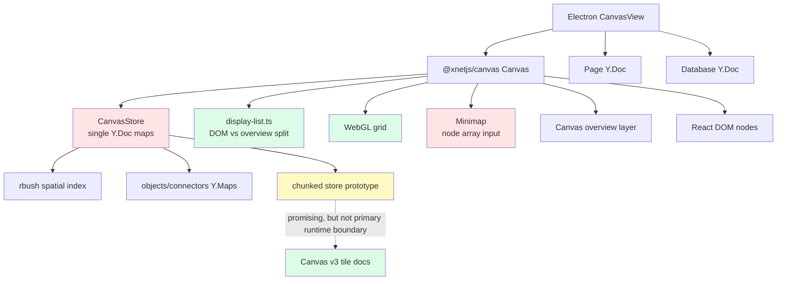
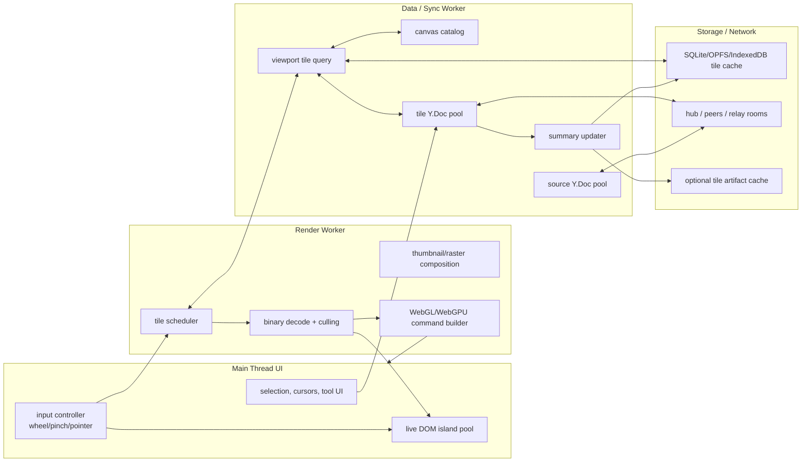
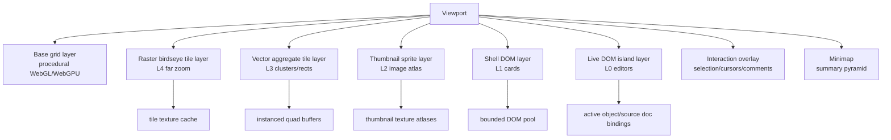
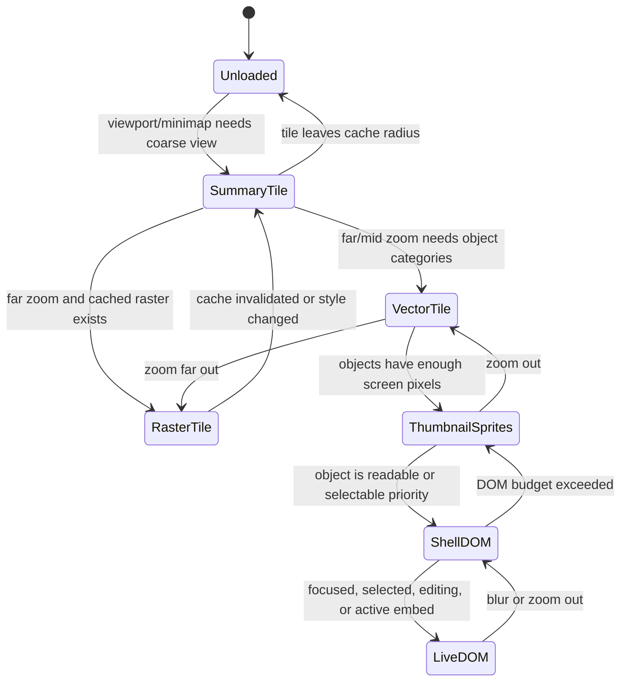
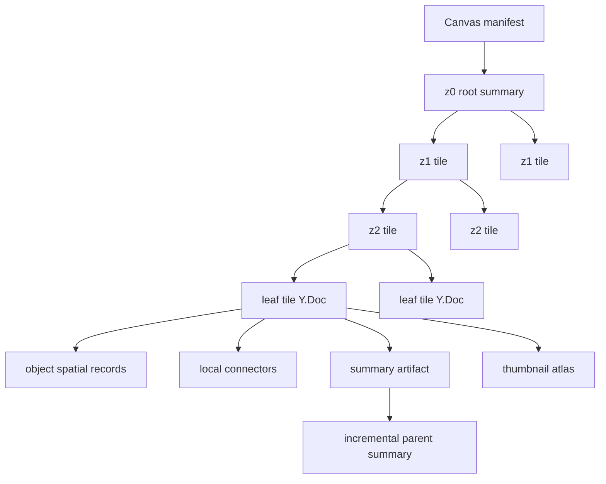
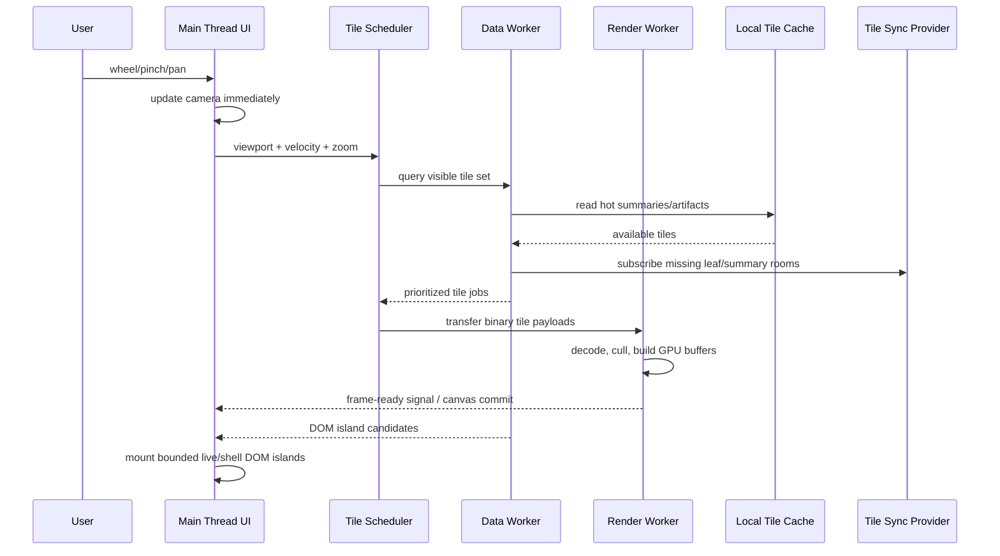
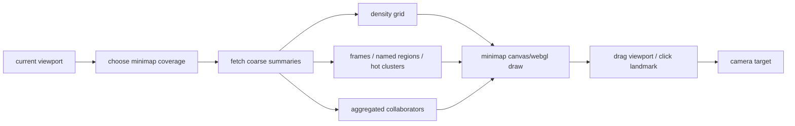
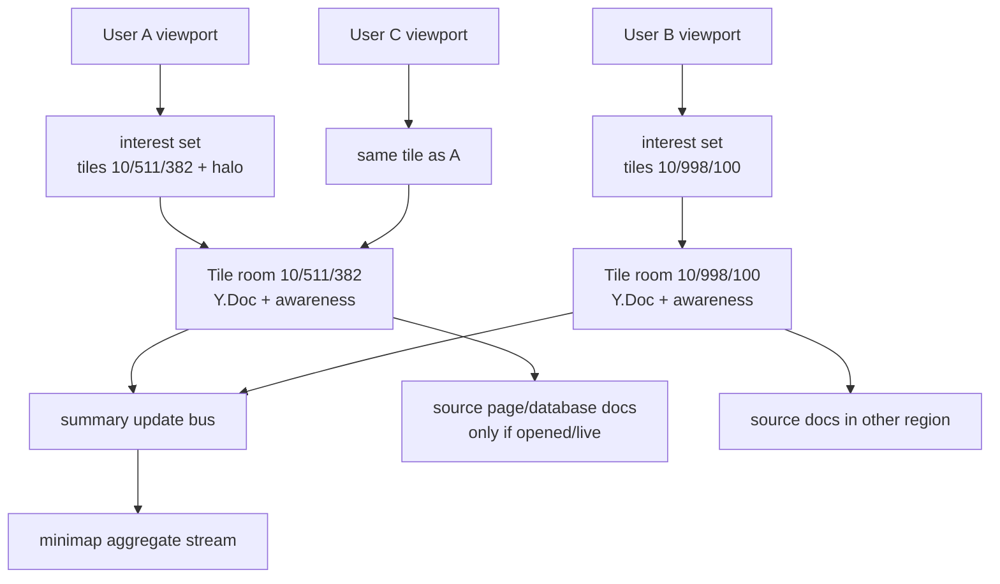
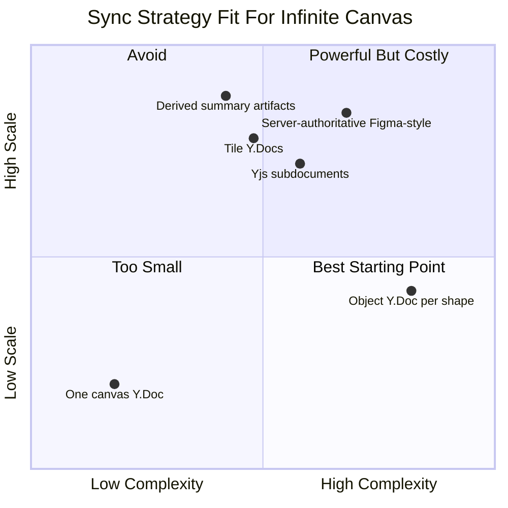
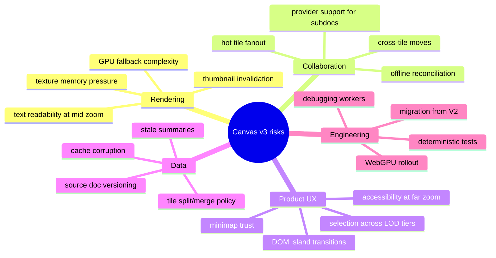

# 0135 - Rewriting The Infinite Canvas From Scratch With LOD Tiles, Minimap, WebGL, And Collaborative Scale

> **Status:** Exploration  
> **Date:** 2026-05-24  
> **Author:** Codex  
> **Tags:** canvas, infinite-canvas, lod, webgl, webgpu, minimap, yjs, crdt, virtualization, tiles, workers, wasm

## Problem Statement 🌐

xNet's canvas should become a genuinely infinite collaborative workspace that can contain pages, databases, images, embeds, shapes, connectors, and arbitrary future elements without assuming that the browser can mount every object, sync every object, or draw every object at full fidelity.

The target system needs to support:

- an infinite grid that pans and scales cleanly
- scroll-to-pan, wheel zoom, pinch zoom, keyboard navigation, and direct minimap navigation
- live DOM islands only near the current editing focus
- progressively lower fidelity render tiers as zoom decreases
- shell DOM previews, thumbnails, vector aggregate tiles, and cached raster/birdseye tiles
- a minimap that stays useful when the total scene has millions, billions, or conceptually unbounded objects
- 120fps pan/zoom when data is hot and a graceful 60fps floor on lower-end devices
- tile-scoped collaboration where far-apart users do not need to synchronize unrelated live state
- lazy data loading, memory-bounded caches, off-main-thread computation, and optional GPU/WASM/native kernels

The central design constraint is simple: **DOM and Yjs rooms are local-interest tools, not global-scene tools.** The canvas can be infinite only if the renderer, storage, sync, minimap, and cache model all share the same spatial hierarchy.

## Exploration Checklist ✅

- [x] Inspect existing `@xnetjs/canvas` implementation and canvas-related explorations.
- [x] Inspect current Electron canvas shell and source-backed page/database flow.
- [x] Search external primary sources for Yjs subdocuments, document updates, WebGPU, OffscreenCanvas, WebGL instancing, vector tiles, and large-scene renderer precedents.
- [x] Synthesize a from-scratch Canvas v3 architecture.
- [x] Include multiple Mermaid diagram styles.
- [x] Include implementation and validation checklists.
- [x] Include concrete example code.
- [x] Include references and recommended next actions.

## Executive Summary 🎯

The recommended rewrite is **Canvas v3: a tile-addressed, multi-renderer, interest-managed scene runtime**.

The current canvas package already contains useful prototypes: a WebGL grid, R-tree culling, chunk managers, a canvas minimap, an overview canvas layer, worker layout, edge canvas rendering, and zoom LOD. Those pieces are valuable evidence, but the current architecture still treats the loaded scene as an array of nodes and edges. That model will not reach millions or billions of objects because it couples rendering, memory, sync, and minimap data to "all known nodes."

Canvas v3 should instead use five major planes:

1. **Scene catalog plane:** a small root manifest plus a sparse, persistent spatial tile tree.
2. **Collaborative edit plane:** independent tile Y.Docs for editable leaf regions, plus separate source Y.Docs for rich pages/databases.
3. **Derived visual plane:** thumbnail, vector summary, density, and raster tile pyramids derived from edit data.
4. **Runtime render plane:** WebGL/WebGPU/Canvas tile layers plus a capped number of live DOM islands.
5. **Interest plane:** viewport, minimap, presence, subscriptions, and cache prefetch are all driven by the same tile coverage query.

The renderer should have strict LOD tiers:

| Tier                       | Approximate trigger                                                    | Representation                                                    | Interactivity            | Renderer                    |
| -------------------------- | ---------------------------------------------------------------------- | ----------------------------------------------------------------- | ------------------------ | --------------------------- |
| L0 Live DOM                | object is selected, focused, editing, or large enough in screen pixels | real React/TipTap/database/embed component                        | full                     | DOM over canvas             |
| L1 Shell DOM               | near viewport, readable card scale, not actively editing               | static shell with title, icon, status, preview snippets           | select/drag/open only    | DOM pool                    |
| L2 Thumbnail sprites       | object too small for DOM but visually meaningful                       | cached image or compact vector thumbnail                          | hit-test metadata only   | WebGL/WebGPU textured quads |
| L3 Vector aggregate tiles  | many objects per tile, no individual object readability                | packed rects, density, category colors, labels for major clusters | tile/cluster selection   | WebGL/WebGPU instancing     |
| L4 Raster birdseye pyramid | far zoom, huge extents                                                 | precomposited image tiles at arbitrary resolution                 | viewport navigation only | GPU tile layer              |

The minimap should **not** render objects directly except for tiny scenes. It should consume the same derived tile summaries used by the far-field renderer, with a fixed pixel budget, density aggregation, collaborator aggregation, and a selected/focused "detail bubble" for the current viewport.

For collaboration, use **tile-scoped Yjs documents** rather than one global canvas Y.Doc. The root canvas document should be a manifest and directory, not the whole scene. Users subscribe to the current viewport's tile rooms plus a predictive halo. Far-away users only exchange summary and presence aggregates unless they enter the same tile or object room. This matches the user's requirement: a hundred users in one region and a hundred users elsewhere can work concurrently without forcing a global live sync storm.

## Current State In The Repository 🔎

### Observed fact: the existing package is a strong prototype, not an infinite-scale foundation

The current canvas package already includes:

- [`packages/canvas/src/layers/webgl-grid.ts`](../../packages/canvas/src/layers/webgl-grid.ts) - procedural WebGL infinite grid.
- [`packages/canvas/src/spatial/index.ts`](../../packages/canvas/src/spatial/index.ts) - `rbush` R-tree spatial index with viewport, point, and range queries.
- [`packages/canvas/src/chunks/chunk-manager.ts`](../../packages/canvas/src/chunks/chunk-manager.ts) - viewport-based chunk loading, LRU eviction, and cross-chunk edge handling.
- [`packages/canvas/src/chunks/chunked-canvas-store.ts`](../../packages/canvas/src/chunks/chunked-canvas-store.ts) - Yjs-backed chunked storage.
- [`packages/canvas/src/components/Minimap.tsx`](../../packages/canvas/src/components/Minimap.tsx) - canvas-rendered minimap with direct rendering up to 1,200 nodes, then simple screen-space bucketing.
- [`packages/canvas/src/renderer/display-list.ts`](../../packages/canvas/src/renderer/display-list.ts) - shared display list that separates DOM nodes from overview nodes.
- [`packages/canvas/src/renderer/OverviewCanvasLayer.tsx`](../../packages/canvas/src/renderer/OverviewCanvasLayer.tsx) - Canvas 2D far-field object placeholders.
- [`packages/canvas/src/nodes/CanvasNodeComponent.tsx`](../../packages/canvas/src/nodes/CanvasNodeComponent.tsx) - four current LOD levels: `placeholder`, `minimal`, `compact`, `full`.
- [`packages/canvas/src/workers/layout-manager.ts`](../../packages/canvas/src/workers/layout-manager.ts) - ELK layout offloaded to a worker when available.

This is enough to prove the direction, but not enough for the requested target:

- `CanvasStore.getNodes()` and `getEdges()` still imply all loaded objects can be enumerated.
- `CanvasDisplayList` receives `nodes` and `edges` arrays even though it culls via `store.getVisibleNodes`.
- the minimap still takes `nodes: CanvasNode[]` and `edges: CanvasEdge[]`, then aggregates in the component.
- the chunk store still lives inside one canvas `Y.Doc`, with a root map of chunk maps, rather than independently loadable/syncable tile documents.
- the existing LOD levels simplify individual DOM nodes but do not define a true tile pyramid.

### Observed fact: the active product path already moved toward source-backed canvas objects

[`packages/canvas/src/types.ts`](../../packages/canvas/src/types.ts) now models Canvas V2 object kinds:

- `page`
- `database`
- `external-reference`
- `media`
- `shape`
- `note`
- `group`

[`apps/electron/src/renderer/components/CanvasView.tsx`](../../apps/electron/src/renderer/components/CanvasView.tsx) renders source-backed page/database/note surfaces, supports peek/focus/split flows, and uses linked document metadata. [`apps/electron/src/renderer/lib/canvas-shell.ts`](../../apps/electron/src/renderer/lib/canvas-shell.ts) defines shell sizing for pages, databases, and notes.

That is the right product direction: canvas objects should be **spatial references over source records**, not copies of page/database content.

### Observed fact: xNet already has off-main-thread architecture to build on

[`docs/explorations/0043_[x]_OFF_MAIN_THREAD_ARCHITECTURE.md`](./0043_[x]_OFF_MAIN_THREAD_ARCHITECTURE.md) documents the data-thread direction: storage, query, sync, crypto, Yjs merging, and layout should move away from the UI thread. [`docs/explorations/0121_[_]_WASM_AND_NATIVE_KERNELS_FOR_CRYPTO_SYNC_AND_CRDT_OPTIMIZATION.md`](./0121_[_]_WASM_AND_NATIVE_KERNELS_FOR_CRYPTO_SYNC_AND_CRDT_OPTIMIZATION.md) recommends optional byte-oriented kernels rather than a wholesale native rewrite.

Canvas v3 should align with that: the main thread should handle input, DOM islands, and composition, while tile selection, decoding, summaries, cache management, thumbnail composition, and renderer command preparation happen in workers.

### Current architecture map



## External Research 🌍

### Yjs gives us useful primitives, but not a global-billion-object runtime for free

Yjs document updates are binary, commutative, associative, and idempotent, and Yjs can compute state vectors and diffs directly over binary updates without always loading a `Y.Doc` into memory. That matters for tile summary sync, compaction, and cold storage. Source: [Yjs Document Updates](https://docs.yjs.dev/api/document-updates).

Yjs subdocuments are directly relevant: they let a root document embed many documents that are lazily loaded into memory, and subdocs can be destroyed to free memory. The official docs also note provider responsibility and that not all providers support subdocuments. Source: [Yjs Subdocuments](https://beta.yjs.dev/docs/api/subdocuments/).

Yjs awareness is explicitly not persisted in the document and is intended for ephemeral presence/cursor state. That fits tile-scoped presence and minimap collaborator aggregates. Source: [Yjs Awareness & Presence](https://docs.yjs.dev/getting-started/adding-awareness).

**Inference:** Canvas v3 should use Yjs as an edit-room primitive, not as one giant global scene object. Tile docs, object docs, and source docs can all be Yjs where collaboration matters, while derived visual tiles should be cacheable artifacts.

### Browser rendering precedent points to tiling, batching, and GPU-owned data

Figma's public engineering writing is useful because it validates the broad shape: a browser infinite canvas can work when rendering is treated closer to a game engine than a web page. Figma originally bet on WebGL for a smooth infinite canvas and later moved toward WebGPU optimization, including batching draw work and reducing per-call CPU overhead. Sources: [Figma WebGPU renderer](https://www.figma.com/blog/figma-rendering-powered-by-webgpu/) and [Building a professional design tool on the web](https://www.figma.com/blog/building-a-professional-design-tool-on-the-web/).

Figma's multiplayer article is also a warning: Figma is centralized and does not use "true CRDTs" globally because simpler, leaner structures are available when a server authority exists. xNet is more local-first/decentralized, so we cannot copy Figma's central-authority assumptions, but we can copy the idea that the scene model should combine multiple specialized data structures rather than one universal CRDT. Source: [How Figma's multiplayer technology works](https://www.figma.com/blog/how-figmas-multiplayer-technology-works/).

tldraw's public docs show the conventional ceiling for DOM-first whiteboards: culling means a 10,000-shape document might render only around 50 visible shapes. It also uses batching, debounced zoom, geometry caching, and LOD. Source: [tldraw Performance](https://tldraw.dev/sdk-features/performance).

**Inference:** xNet should treat tldraw-style culling as the near-field renderer pattern, and Figma/map-style tiling as the far-field renderer pattern.

### Map systems are the closest precedent for "infinite enough"

Vector tiles are explicitly optimized for caching, scaling, and serving huge maps quickly, and Mapbox notes that vector tiles are lightweight and optimized for large datasets. Source: [Mapbox Vector Tiles introduction](https://docs.mapbox.com/data/tilesets/guides/vector-tiles-introduction/).

Mapbox GL JS performance guidance is also directly transferable:

- render time scales with sources, layers, and vertices
- source update time scales with layers using the source and vertices in that source
- rapid small updates should be split from large mostly-static datasets

Source: [Mapbox GL JS performance guide](https://docs.mapbox.com/help/troubleshooting/mapbox-gl-js-performance/).

OGC 3D Tiles formalizes a related idea for massive spatial content: a tileset contains tile formats organized into a hierarchical spatial data structure. Source: [OGC 3D Tiles](https://www.ogc.org/standards/3dtiles/).

**Inference:** Canvas v3 should use a map-like tile pyramid, but with canvas-object-specific payloads: object summaries, edge summaries, preview thumbnails, source-doc hashes, presence samples, and raster tile snapshots.

### Web platform capabilities support the architecture

OffscreenCanvas 2D is available in Web Workers, and OffscreenCanvas can also be used for worker-based WebGL rendering where supported. Source: [MDN OffscreenCanvasRenderingContext2D](https://developer.mozilla.org/en-US/docs/Web/API/OffscreenCanvasRenderingContext2D).

WebGPU is available through `Navigator.gpu` and `WorkerNavigator.gpu`, and requires secure contexts. Source: [MDN WebGPU API](https://developer.mozilla.org/en-US/docs/Web/API/WebGPU_API).

WebGL instancing lets the same geometry be drawn many times when objects share vertex data, which is exactly what far-field rectangles and thumbnail sprites need. Source: [MDN ANGLE_instanced_arrays](https://developer.mozilla.org/en-US/docs/Web/API/ANGLE_instanced_arrays).

Transferable `ArrayBuffer`s can move data between threads as a zero-copy ownership transfer. Source: [MDN Transferable objects](https://developer.mozilla.org/en-US/docs/Web/API/Web_Workers_API/Transferable_objects).

deck.gl's performance guide gives useful empirical boundaries: basic layers can handle large item counts on GPUs, but browser memory allocation limits and fragment shader overdraw become hard constraints. It explicitly recommends chunking data to move past large allocation limits. Source: [deck.gl Performance Optimization](https://deck.gl/docs/developer-guide/performance).

**Inference:** Canvas v3 should use binary packed tile payloads, transfer them to workers/GPU paths, and never require one contiguous allocation for all visible or loaded objects.

## Key Findings 🧭

1. **"Infinite" is a data access contract, not a coordinate trick.** The user can pan forever, but the runtime should only know a bounded region plus coarse global summaries.
2. **The minimap is a renderer over summaries, not over objects.** It should never depend on `CanvasNode[]`.
3. **DOM is only for live editing.** A billion objects cannot be a billion divs, and even thousands of React nodes will miss the 120fps target.
4. **The far-field renderer should think like a map renderer.** It should request Z/X/Y visual tiles, not scene objects.
5. **The collaboration system should be interest-managed.** Users sync tile rooms and object/source docs they are near or editing, not the whole canvas.
6. **Derived views are allowed to be stale.** Thumbnails, aggregate tiles, minimap summaries, and raster pyramids can update asynchronously as long as local edits are reflected immediately in an overlay.
7. **GPU and WASM help only after the data model is right.** WebGL/WebGPU instancing and WASM binning are valuable, but they cannot compensate for shipping a billion object records to the browser.

## Proposed Canvas V3 Architecture 🏗️

### Big-picture module boundary



Recommended packages:

| Package                   | Responsibility                                                                             |
| ------------------------- | ------------------------------------------------------------------------------------------ |
| `@xnetjs/canvas-core`     | coordinate model, camera math, tile IDs, geometry, hit testing contracts                   |
| `@xnetjs/canvas-scene`    | scene object schema, tile document schema, source bindings, edge bindings                  |
| `@xnetjs/canvas-renderer` | React shell, DOM island pool, WebGL/WebGPU renderer, Canvas fallback                       |
| `@xnetjs/canvas-tiles`    | tile pyramid generation, thumbnail cache, aggregate/raster tile artifacts                  |
| `@xnetjs/canvas-sync`     | tile-scoped Yjs provider orchestration, awareness scoping, cross-tile moves                |
| `@xnetjs/canvas-kernels`  | optional WASM/native kernels for binning, packing, raster composition, spatial index build |

### Layer model



The layer order should be:

1. **Grid:** always procedural; never stores world extents.
2. **Far raster tiles:** visible when zoomed out enough that object identity is irrelevant.
3. **Vector aggregate tiles:** visible when density or color/category meaning matters.
4. **Thumbnail sprites:** visible when object shapes/images can be recognized but not edited.
5. **Shell DOM:** visible for a bounded number of readable, nearby objects.
6. **Live DOM:** mounted only for focused/selected/editing objects and a small near-field budget.
7. **Overlay:** selection handles, presence, comments, drag previews, create tools.
8. **Minimap:** fixed-size summary renderer outside world transform.

### Coordinate model

Avoid representing "infinite world position" as one JS number forever. IEEE-754 doubles lose integer precision as coordinates grow. Canvas v3 should use **tile-addressed coordinates**:

```ts
type TileCoord = {
  tx: number
  ty: number
}

type LocalPoint = {
  x: number
  y: number
}

type WorldPoint = {
  tile: TileCoord
  local: LocalPoint
}
```

The camera can keep a large tile anchor plus local offsets:

- `camera.anchorTile`: signed tile coordinate
- `camera.localCenter`: local tile coordinate around the viewport center
- GPU uniforms receive high/low split origin or tile-relative coordinates
- all visible tiles are rendered relative to the camera anchor

This makes the world unbounded in practice while keeping math stable near the viewport.

### LOD lifecycle



LOD decisions should be driven by:

- screen-space object size
- current interaction state
- selected/focused object IDs
- object type and preview availability
- tile density
- DOM budget
- GPU texture budget
- network/cache availability
- user preference for accessibility/reduced motion/high contrast

Do not use zoom thresholds alone. A very large object can deserve shell DOM at a lower zoom than a tiny shape.

## Data Model And Storage 🧱

### Root canvas manifest

The root canvas Y.Doc should stay small:

```ts
type CanvasManifest = {
  canvasId: string
  version: 3
  tileSize: number
  maxLeafObjectCount: number
  schemaVersion: string
  rootTileSetId: string
  permissionsRootId: string
  styleEpoch: number
}
```

It can contain:

- canvas metadata
- tile tree root references
- schema/style epochs
- permissions and sharing metadata
- global object locator index for selected pinned IDs or recently moved objects
- bookmarks, named views, and high-level frames

It should not contain every object.

### Leaf tile documents

Each editable spatial tile should have an independent document:

```ts
type CanvasTileDoc = {
  tileId: TileId
  bounds: TileBounds
  objects: Y.Map<CanvasObjectRecord>
  connectors: Y.Map<CanvasConnectorRecord>
  tombstones: Y.Map<TombstoneRecord>
  localIndexEpoch: number
}
```

Objects should store only spatial and presentation metadata:

```ts
type CanvasObjectRecord = {
  id: string
  kind: 'page' | 'database' | 'external-reference' | 'media' | 'shape' | 'note' | 'group'
  sourceNodeId?: string
  sourceSchemaId?: string
  position: {
    x: number
    y: number
    width: number
    height: number
    rotation?: number
    zIndex?: number
  }
  display: {
    collapsed?: boolean
    styleVariant?: string
    thumbnailPolicy?: 'auto' | 'manual' | 'never'
  }
  preview: {
    title?: string
    subtitle?: string
    sourceVersion?: string
    thumbnailHash?: string
  }
}
```

Pages, databases, and rich notes keep their actual content in source Y.Docs. The tile only knows where and how that content is placed.

### Tile pyramid artifacts

Derived artifacts should be content-addressed and cacheable:

```ts
type CanvasVisualTile = {
  tileId: string
  zoomLevel: number
  sourceEpoch: string
  kind: 'summary' | 'vector' | 'thumbnail-atlas' | 'raster'
  byteLength: number
  createdAt: number
  payloadHash: string
}
```

Summary payloads can contain:

- object count
- object type counts
- bounding boxes of major clusters
- density grid
- color histogram
- edge count and edge direction samples
- contributor count and active-presence count
- dirty/stale flags
- sample object IDs for hover/detail reveal

Vector payloads can contain:

- packed rectangles
- style/category IDs
- quantized local coordinates
- optional simplified edge polylines
- optional label anchor candidates

Raster payloads can contain:

- PNG/WebP/AVIF tile images
- optional mip chains
- invalidation metadata

### Spatial hierarchy



Use a quadtree-like hierarchy for tile addressing and summary generation, but do not force all edit tiles to be the same density:

- sparse areas can use large leaf tiles
- dense areas can split into smaller child tiles
- hot collaborative areas can split earlier
- mostly static rasterized areas can stay coarse

This is closer to adaptive map tiling than a fixed `CHUNK_SIZE = 2048` grid.

## Rendering Pipeline ⚡

### Frame budget

At 120fps the frame budget is 8.33ms. A realistic hot-cache budget:

| Budget area                 |  Target |
| --------------------------- | ------: |
| input/camera update         | < 0.7ms |
| main-thread DOM updates     | < 1.5ms |
| renderer command submission | < 1.5ms |
| GPU draw/composite          | < 3.0ms |
| hit-test/update overlay     | < 0.8ms |
| GC/other                    | < 0.8ms |

The rule: **camera transforms are immediate; data detail catches up asynchronously.**

When the user pans or pinches:

1. update camera transform synchronously
2. keep drawing currently available tiles
3. predict next tile set from velocity
4. request missing summaries/tiles in priority order
5. mount/unmount DOM islands only after the camera settles or crosses clear thresholds

### Viewport tile request flow



### DOM island budget

Use hard caps rather than hopes:

- live DOM editors: default 8-16
- shell DOM cards: default 64-128
- selected/focused objects: always reserve budget
- same-tile collaborators editing source docs: prioritize if visible
- embedded iframes/video: at most 1-4 live instances, otherwise thumbnail shell

The current `DEFAULT_DOM_NODE_LIMIT = 48` in [`display-list.ts`](../../packages/canvas/src/renderer/display-list.ts) is directionally right. Canvas v3 should make DOM budgets explicit and dynamic by device class.

### WebGL/WebGPU far-field renderer

The far-field renderer should have three main draw paths:

1. **Instanced rectangles:** one quad geometry, per-instance position/size/color/style.
2. **Thumbnail sprites:** texture atlas plus per-instance UVs and transforms.
3. **Raster tile quads:** one quad per tile image with opacity crossfade when replacing stale tiles.

WebGL2 should be the baseline because it is broadly available. WebGPU should be an optional backend once the buffer model is stable. The abstraction should look like:

```ts
type CanvasGpuBackend = {
  readonly kind: 'webgl2' | 'webgpu'
  createBuffer(input: GpuBufferInput): GpuBufferHandle
  updateBuffer(handle: GpuBufferHandle, input: GpuBufferInput): void
  createTextureAtlas(input: AtlasInput): TextureHandle
  renderFrame(frame: CanvasRenderFrame): CanvasFrameStats
  dispose(handles: readonly GpuResourceHandle[]): void
}
```

Do not let React components talk directly to GPU resources. The renderer owns resource lifetimes.

### Thumbnail generation

Thumbnails are not screenshots of arbitrary live DOM by default. That path is fragile for cross-origin embeds, video, fonts, and browser security.

Use deterministic preview renderers:

| Object kind        | Thumbnail source                                                                       |
| ------------------ | -------------------------------------------------------------------------------------- |
| page/note          | server/worker text layout renderer, title/snippet/blocks, optional cached rich preview |
| database           | compact table/chart preview from row/column summary                                    |
| media              | decoded image/video poster thumbnail                                                   |
| external-reference | Open Graph/oEmbed/provider thumbnail with fallback card                                |
| shape              | vector-to-raster renderer                                                              |
| group/frame        | composition of child summaries                                                         |
| embed/iframe       | provider thumbnail or explicit placeholder unless same-origin snapshot is safe         |

Thumbnail invalidation key:

```ts
type ThumbnailKey = {
  objectId: string
  sourceNodeId?: string
  sourceVersion: string
  displayVersion: string
  rendererVersion: string
  theme: 'light' | 'dark'
  sizeClass: 'small' | 'medium' | 'large'
}
```

### Minimap renderer

The minimap should be a small, fixed-budget renderer over summary tiles.



Minimap modes:

- **Small scene mode:** direct node drawing, similar to current `Minimap.tsx`.
- **Large scene mode:** density grid + major frames + active viewport + collaborator clusters.
- **Huge scene mode:** top-level tile heatmap + named landmarks only.
- **Debug mode:** tile boundaries, stale/dirty flags, loaded tile counts, memory usage.

The minimap should preserve user orientation without pretending to show every object.

## Collaboration And Sync 🤝

### Tile-scoped collaboration model



Principles:

- users only live-sync tile docs intersecting their viewport and edit halo
- selected or edited objects can subscribe to their source docs even if partly outside the viewport
- far-away tile changes flow as summary invalidations, not as live object changes
- awareness is tile-scoped and ephemeral
- minimap collaborator display is aggregated and sampled

### Root, tile, and source document split

| Document type              | Sync scope                           | Contents                                                     | Persistence           |
| -------------------------- | ------------------------------------ | ------------------------------------------------------------ | --------------------- |
| root canvas manifest Y.Doc | all users who open canvas            | tile tree refs, bookmarks, style epochs, high-level metadata | durable               |
| tile Y.Doc                 | users near that tile                 | spatial object records, local connectors, tombstones         | durable               |
| source Y.Doc               | users editing/opening source content | page text, database state, rich notes                        | durable               |
| awareness CRDT             | users in same tile/source room       | cursor, viewport, selection, activity                        | ephemeral             |
| visual tile artifacts      | loaded by viewport/minimap           | summaries, thumbnails, raster tiles                          | cacheable/rebuildable |

### Cross-tile operations

Moving an object from tile A to tile B should be a single user action but may touch two tile docs. Options:

| Option                         | How it works                                             | Pros                                    | Cons                                     |
| ------------------------------ | -------------------------------------------------------- | --------------------------------------- | ---------------------------------------- |
| two-phase move record          | write tombstone in A and insert in B with shared move ID | simple, decentralized                   | temporary duplicates need reconciliation |
| global object locator register | root or shard records object ID -> current tile          | fast lookups, prevents duplicate owners | root/shard can become hot                |
| object home doc                | object has its own Y.Doc, tiles only reference it        | clean ownership                         | too many docs for tiny shapes            |
| edge/common-ancestor storage   | cross-tile edge stored at lowest common tile ancestor    | scalable edge rendering                 | more complex route updates               |

Recommendation:

- use two-phase tile moves for normal objects
- add a sparse object locator shard for selected/recent/pinned objects
- keep source-backed pages/databases as separate source docs
- store cross-tile connectors in route/edge shards keyed by lowest common ancestor tile or by source tile pair

### Conflict model

Use CRDTs only where they earn their keep:

- tile object maps: Y.Map records with field-level merge conventions
- z-order: fractional ranks or ordered Y.Array per tile only when needed
- rich text/database content: existing source Y.Docs
- thumbnails/summaries: content-addressed derived artifacts, last-valid cache wins until recomputed
- minimap presence: sampled/aggregated awareness state, no durable conflict resolution

### Very large concurrent user counts

For "arbitrarily large" concurrent users:

- no global broadcast channels except low-rate summary invalidations
- shard awareness by tile and source doc
- cap local awareness render count; aggregate the rest
- presence update rate limits by distance/zoom/focus
- use server/relay-side fanout where available, peer mesh only for small rooms
- split hot tiles if sustained object count, update rate, or connected user count crosses thresholds

## Performance Strategy 🚀

### Virtualization rules

- never call `getNodes()` to render the scene
- never give the minimap raw node arrays for large scenes
- never mount DOM for objects below readable screen size unless selected/focused
- never recompute thumbnails synchronously during camera motion
- never decode all objects in a tile if the current LOD only needs summary data
- never use JSON object arrays for hot renderer payloads when packed binary columns will do

### Memory budgets

Suggested defaults for desktop:

| Cache                       |                 Budget |
| --------------------------- | ---------------------: |
| live tile Y.Docs            |           32-128 tiles |
| summary tiles               |              64-256 MB |
| raster tile textures        |             256-512 MB |
| thumbnail atlases           |             128-256 MB |
| shell/live DOM pool         | 64-144 mounted objects |
| decoded vector tile buffers |              64-128 MB |

Use byte-aware LRU with explicit disposal, not object-count-only eviction. GPU resources must have deterministic lifetimes.

### Work distribution

| Work                              | Thread/process                                                |
| --------------------------------- | ------------------------------------------------------------- |
| pointer/wheel/pinch event capture | main thread                                                   |
| camera transform                  | main thread                                                   |
| DOM island mount/unmount          | main thread                                                   |
| spatial tile coverage query       | data worker                                                   |
| tile Y.Doc merge/apply            | data worker or sync process                                   |
| summary/tile artifact generation  | data worker or dedicated summarizer worker                    |
| thumbnail composition             | render worker with OffscreenCanvas                            |
| vector tile decode/binning        | render worker, optional WASM                                  |
| GPU draw command prep             | render worker where supported, otherwise main renderer module |
| persistence/network               | data worker / Electron data process / hub                     |

### Optional WASM/native kernels

Do not start by writing C for the renderer. Start with a clean binary boundary and measure.

Good kernel candidates:

- quantize object rectangles into tile-local packed arrays
- build density grids and mip summaries
- merge summary tiles upward
- build local R-tree/BVH from tile-local rectangles
- decode vector tile payloads
- route or simplify huge edge batches
- composite raster tiles from vector summaries and thumbnail atlases

Bad first candidates:

- live TipTap/page rendering
- React reconciliation
- arbitrary embed rendering
- all Yjs document logic
- all storage/query code

## Options And Tradeoffs ⚖️

### Renderer strategy options

| Option                       | Description                              | Strength              | Weakness                                            | Recommendation                             |
| ---------------------------- | ---------------------------------------- | --------------------- | --------------------------------------------------- | ------------------------------------------ |
| DOM-first with culling       | Extend current display list and LOD      | fastest migration     | not enough for million+ visible/far objects         | keep only as near-field tier               |
| Canvas 2D overview           | Expand `OverviewCanvasLayer`             | simple, debuggable    | CPU-bound for high density and thumbnails           | useful fallback/prototype                  |
| WebGL2 tile renderer         | instanced rects, sprites, raster quads   | mature, broad support | awkward compute/modern resource model               | primary baseline                           |
| WebGPU renderer              | modern buffers, compute, better batching | best long-term path   | support and rollout complexity                      | optional backend after WebGL2 model        |
| deck.gl integration          | use existing layer engine                | saves renderer effort | hard to integrate arbitrary DOM islands/source docs | prototype only if it reduces risk          |
| MapLibre-style custom source | reuse map tiling concepts                | proven tile patterns  | projection/style model mismatch                     | borrow architecture, not library wholesale |

### Sync strategy options



Recommendation:

- use tile Y.Docs as the primary editable spatial sync unit
- optionally represent them as Yjs subdocuments inside a manifest if provider support is under xNet's control
- keep source docs independent
- avoid per-object Y.Docs except for heavyweight embeds/pages/databases that already have source docs
- make summary artifacts non-authoritative and rebuildable

### Tile size tradeoffs

| Smaller leaf tiles                 | Larger leaf tiles                       |
| ---------------------------------- | --------------------------------------- |
| lower sync fanout per room         | fewer documents and subscriptions       |
| better memory eviction granularity | less cross-tile connector complexity    |
| better hot-region split behavior   | easier drag/drop between nearby objects |
| more summary merge overhead        | worse dense-tile worst cases            |

Start with adaptive tiles:

- default leaf size around 2,048-4,096 canvas units
- split if object count, byte size, or room user count crosses thresholds
- merge cold sparse siblings if summary overhead dominates

## Rewrite Constraint 🧨

Canvas v3 does **not** need to preserve Canvas v2 renderer or component API compatibility. The rewrite can break the current raw `CanvasNode[]`/`CanvasEdge[]` rendering contracts when they conflict with the tile-summary/provider model, as long as the active web and Electron app entry points are moved forward and keep compiling during the migration.

That means implementation should favor the new source-of-truth contracts:

- `@xnetjs/canvas-core` owns tile coordinates, camera math, LOD decisions, summary tiles, and provider interfaces.
- Minimap and far-field renderers consume `MinimapSummary`/tile summary data, not global node and edge arrays.
- Existing Canvas v2 adapters are temporary migration bridges, not compatibility promises.
- Code can be deleted or reshaped once the app uses the v3 path and validation gates pass.

## Recommendation 🧩

Build a new Canvas v3 runtime directly around tile-first contracts rather than incrementally contorting the current Canvas V2 renderer. Reuse ideas and small utilities from the current package, but do not preserve old APIs when they force global scene arrays or DOM-first rendering assumptions.

Recommended sequence:

1. Define tile-addressed world coordinates and camera math in `@xnetjs/canvas-core`.
2. Define a `CanvasSceneProvider` interface that returns tile summaries, vector tiles, leaf objects, and source bindings without exposing global arrays.
3. Build a standalone Storybook/workbench renderer with synthetic tile data before integrating app data.
4. Implement WebGL2 instanced far-field renderer plus Canvas 2D fallback.
5. Implement DOM island pool for L0/L1 only.
6. Replace minimap inputs with a summary tile source.
7. Add tile Y.Doc sync and viewport-interest subscriptions.
8. Add thumbnail and raster tile artifact generation.
9. Replace the Electron and web canvas shells with Canvas v3 entry points.
10. Delete or archive Canvas V2 code paths once the apps compile and validation gates pass.

## Proposed API Shape

```typescript
export type CanvasLodTier = 'live-dom' | 'shell-dom' | 'thumbnail' | 'vector-tile' | 'raster-tile'

export type ViewportInterest = {
  viewport: {
    center: WorldPoint
    widthPx: number
    heightPx: number
    zoom: number
    velocityPxPerMs: { x: number; y: number }
  }
  interaction: {
    selectedObjectIds: readonly string[]
    focusedObjectId?: string
    editingSourceNodeId?: string
  }
  budgets: {
    maxLiveDom: number
    maxShellDom: number
    maxTextureBytes: number
    maxDecodedTileBytes: number
  }
}

export type CanvasSceneSnapshot = {
  cameraEpoch: number
  rasterTiles: readonly RasterTileRef[]
  vectorTiles: readonly VectorTilePayload[]
  thumbnailSprites: readonly ThumbnailSpritePayload[]
  shellObjects: readonly CanvasObjectRecord[]
  liveObjects: readonly CanvasObjectRecord[]
  overlays: readonly CanvasOverlayRecord[]
}

export type CanvasSceneProvider = {
  subscribeViewport(
    interest: ViewportInterest,
    onSnapshot: (snapshot: CanvasSceneSnapshot) => void
  ): () => void
  mutateTile(input: CanvasTileMutation): Promise<CanvasMutationReceipt>
  openSourceDoc(sourceNodeId: string): Promise<CanvasSourceDocHandle>
  getMinimapSummary(input: MinimapSummaryRequest): Promise<MinimapSummary>
}
```

LOD selection should be a pure function over object summary, viewport, and budgets:

```typescript
export function chooseObjectLod(input: {
  object: CanvasObjectSummary
  screenRect: Rect
  selected: boolean
  focused: boolean
  sourceOpen: boolean
  budgets: LodBudgets
}): CanvasLodTier {
  if (input.focused || input.sourceOpen) {
    return 'live-dom'
  }

  if (input.selected && input.budgets.shellDomRemaining > 0) {
    return input.screenRect.width > 48 && input.screenRect.height > 32 ? 'shell-dom' : 'thumbnail'
  }

  const screenArea = input.screenRect.width * input.screenRect.height

  if (screenArea >= 96_000 && input.budgets.liveDomRemaining > 0) {
    return 'live-dom'
  }

  if (screenArea >= 12_000 && input.budgets.shellDomRemaining > 0) {
    return 'shell-dom'
  }

  if (screenArea >= 256 && input.object.hasThumbnail) {
    return 'thumbnail'
  }

  return input.object.tileHasRaster ? 'raster-tile' : 'vector-tile'
}
```

## Implementation Checklist 🛠️

- [x] Create `@xnetjs/canvas-core` with tile-addressed coordinates, camera transforms, and world/screen conversion tests.
- [x] Create `CanvasSceneProvider` contracts for viewport snapshots, tile mutation receipts, source docs, and minimap summaries.
- [x] Remove renderer dependence on `CanvasNode[]`/`CanvasEdge[]` global arrays outside temporary migration adapters.
- [x] Build a synthetic tile generator that can simulate 10K, 1M, 100M, and 1B objects without materializing all objects in JS memory.
- [x] Implement WebGL2 instanced rect renderer for vector aggregate tiles.
- [x] Implement raster tile quad renderer with stale-tile crossfade and texture LRU.
- [x] Implement thumbnail sprite renderer with atlas packing and invalidation keys.
- [x] Implement DOM island pool with explicit L0/L1 budgets and priority scoring.
- [x] Replace current minimap props with summary tile input and large-scene modes.
- [x] Define tile Y.Doc schema and write adapters from existing flat canvas docs for migration.
- [x] Implement viewport-interest tile subscription manager with halo and velocity-based prefetch.
- [x] Implement tile summary generation for object counts, type histograms, density grids, and cluster bounds.
- [x] Implement summary pyramid rollups and cache invalidation.
- [x] Implement cross-tile moves with move IDs, tombstones, and duplicate reconciliation.
- [x] Implement cross-tile connector storage and far-field edge summaries.
- [x] Add off-main-thread tile decode and summary workers using transferable binary payloads.
- [ ] Add optional WASM prototype for density-grid/binning only after TypeScript worker baseline exists.
- [x] Replace the active Electron and web canvas entry points with Canvas v3; do not preserve V2 renderer/component APIs.
- [x] Migrate page/database/note source-backed rendering into the DOM island pool.
- [x] Add debug overlays for tile boundaries, LOD tier, cache status, and sync room membership.
- [x] Write one-way data conversion from existing flat Y.Doc maps to Canvas V3 tile docs where persisted data requires it.
- [x] Remove or archive Canvas V2 code paths after the active apps compile and validation gates pass.

## Validation Checklist 🧪

- [x] Unit-test camera math at extreme tile coordinates and fractional zooms.
- [x] Unit-test tile coverage queries for negative coordinates, huge coordinates, and viewport boundary cases.
- [x] Unit-test LOD selection with fixed budgets, selected objects, focused objects, and dense viewports.
- [x] Unit-test viewport-interest subscription planning with halo, velocity prefetch, clipping, and tile deltas.
- [x] Unit-test tile summary generation for counts, type histograms, density grids, clusters, and edge participation.
- [x] Unit-test summary rollups for correctness after create, move, resize, delete, and style changes.
- [x] Unit-test cross-tile object moves under concurrent edits.
- [x] Unit-test minimap summary rendering without raw object arrays.
- [x] Verify the active Canvas v3 renderer path calls neither `getNodes()` nor `getEdges()`; temporary flat-doc materialization remains isolated in the migration adapter.
- [ ] Benchmark hot-cache pan/zoom at 120fps targets on modern desktop.
- [ ] Benchmark low-end 60fps fallback with WebGL2 and Canvas 2D fallback.
- [x] Benchmark synthetic 1M, 100M, and 1B-object worlds using generated summary tiles.
- [x] Measure memory budgets with texture cache pressure and forced eviction.
- [x] Measure worker transfer overhead with packed binary tiles vs JSON payloads.
- [ ] Test live DOM editing while far-field summaries update asynchronously.
- [ ] Test 100 users in one tile and 100 users in another tile without cross-room sync fanout.
- [ ] Test minimap collaborator aggregation with high user counts.
- [ ] Test offline edits in multiple tiles and reconnect reconciliation.
- [ ] Test thumbnail invalidation for pages, databases, media, and external references.
- [x] Test web app flow with browser automation after Canvas v3 summary integration.
- [x] Test Electron app flow with Playwright Electron over CDP after integration.
- [x] Save Playwright screenshots to `tmp/playwright/` for UI validation.
- [x] Kill all dev servers after UI verification.

### Canvas V3 benchmark notes

Local benchmark helper run on May 25, 2026:

```bash
pnpm exec tsx --eval "import { benchmarkSyntheticCanvasWorlds, measureCanvasWorkerTransferOverhead } from './packages/canvas-core/src/benchmarks.ts'; void (async () => { const transfer = measureCanvasWorkerTransferOverhead({ objectCount: 10000, iterations: 5, warmupIterations: 1, seed: 23 }); const worlds = await benchmarkSyntheticCanvasWorlds({ objectCounts: [1000000, 100000000, 1000000000], maxTileSummaries: 128, seed: 23 }); console.log(JSON.stringify({ transfer, worlds }, null, 2)); })();"
```

| Measurement                      |                                                       Result |
| -------------------------------- | -----------------------------------------------------------: |
| 10K object packed binary payload |                                                598,907 bytes |
| 10K object JSON payload          |                                                998,077 bytes |
| JSON-to-binary byte ratio        |                                                        1.67x |
| Binary encode/decode average     |                                              0.94ms / 1.28ms |
| JSON encode/decode average       |                                              1.98ms / 4.27ms |
| 1M-object synthetic summary      |                                          121 tiles in 5.76ms |
| 100M-object synthetic summary    |                                          121 tiles in 5.38ms |
| 1B-object synthetic summary      |                                          121 tiles in 3.81ms |
| Raster texture cache pressure    | 24 MiB budget, 30 MiB projected peak, 12 MiB normal eviction |
| Raster texture forced eviction   |              12 MiB forced budget, 2 retained 6 MiB textures |

## Migration Plan 🧭

### Phase 0: Baselines and fixtures

- Create performance fixtures for current Canvas V2:
  - 1K objects
  - 10K objects
  - 100K synthetic objects
  - dense connectors
  - source-backed page/database cards
- Capture current frame time, memory, and input latency.
- Define Canvas v3 acceptance budgets before implementation starts.

### Phase 1: Renderer workbench

Build a standalone Canvas v3 renderer that takes generated tile snapshots and has no Yjs dependency. The goal is to solve camera, LOD, GPU buffers, DOM pools, and minimap without collaboration complexity.

### Phase 2: Tile scene provider

Implement the provider interface over local generated data, then over local persisted tile docs. Keep source docs mocked initially.

### Phase 3: Collaboration

Add tile Y.Doc rooms, awareness scoping, tile subscriptions, and cross-tile operations. Then add source doc integration.

### Phase 4: Artifact pipeline

Add thumbnails, vector summaries, raster tiles, invalidation, and background rebuilds. Use TypeScript workers first.

### Phase 5: App integration

Replace the active web and Electron canvas entry points with the Canvas v3 provider and renderer directly. Port product affordances forward: create page/database/note, peek/focus/split, comments, selection, connectors, and minimap.

### Phase 6: Optional kernels

Only after measuring bottlenecks, add WASM/native kernels for packed tile binning, summary rollup, and raster composition.

## Risks And Unknowns ⚠️



Major unknowns to answer with prototypes:

- Can WebGL2 instanced rectangles and thumbnail sprites cover the needed visual quality without WebGPU?
- How many DOM islands can Electron sustain while maintaining 120fps pan/zoom?
- What tile size and split policy produces the best sync/memory tradeoff for real xNet canvases?
- Are Yjs subdocuments worth adopting, or should xNet manage separate Y.Docs explicitly?
- What is the minimum useful minimap representation when a scene spans billions of objects?
- How stale can raster/summary tiles be before users lose trust?
- Can thumbnails for source-backed pages/databases be generated deterministically and cheaply enough?

## Next Actions ▶️

1. Build a Canvas v3 design spike in Storybook with generated tile pyramids and no persistence.
2. Add a synthetic dataset generator that can represent 1B objects through deterministic tile generation.
3. Implement WebGL2 instanced rect/vector tile renderer and measure pan/zoom frame budget.
4. Replace the current minimap data contract in a prototype with summary tiles.
5. Define tile Y.Doc schema and simulate two far-apart collaboration rooms.
6. Specify one-way persisted-data conversion from Canvas V2 flat docs into Canvas v3 tile docs.

## References 📚

### Local code and docs

- [`packages/canvas/src/renderer/Canvas.tsx`](../../packages/canvas/src/renderer/Canvas.tsx)
- [`packages/canvas/src/renderer/display-list.ts`](../../packages/canvas/src/renderer/display-list.ts)
- [`packages/canvas/src/renderer/OverviewCanvasLayer.tsx`](../../packages/canvas/src/renderer/OverviewCanvasLayer.tsx)
- [`packages/canvas/src/components/Minimap.tsx`](../../packages/canvas/src/components/Minimap.tsx)
- [`packages/canvas/src/layers/webgl-grid.ts`](../../packages/canvas/src/layers/webgl-grid.ts)
- [`packages/canvas/src/chunks/chunk-manager.ts`](../../packages/canvas/src/chunks/chunk-manager.ts)
- [`packages/canvas/src/chunks/chunked-canvas-store.ts`](../../packages/canvas/src/chunks/chunked-canvas-store.ts)
- [`packages/canvas/src/spatial/index.ts`](../../packages/canvas/src/spatial/index.ts)
- [`packages/canvas/src/types.ts`](../../packages/canvas/src/types.ts)
- [`packages/data/src/schema/schemas/canvas.ts`](../../packages/data/src/schema/schemas/canvas.ts)
- [`apps/electron/src/renderer/components/CanvasView.tsx`](../../apps/electron/src/renderer/components/CanvasView.tsx)
- [`apps/electron/src/renderer/lib/canvas-shell.ts`](../../apps/electron/src/renderer/lib/canvas-shell.ts)
- [`docs/explorations/0068_[-]_CANVAS_OPTIMIZATION.md`](./0068_[-]_CANVAS_OPTIMIZATION.md)
- [`docs/explorations/0108_[_]_CANVAS_V1_PAGES_DATABASES_AND_INFINITE_CANVAS_DEEP_DIVE.md`](./0108_[_]_CANVAS_V1_PAGES_DATABASES_AND_INFINITE_CANVAS_DEEP_DIVE.md)
- [`docs/explorations/0043_[x]_OFF_MAIN_THREAD_ARCHITECTURE.md`](./0043_[x]_OFF_MAIN_THREAD_ARCHITECTURE.md)
- [`docs/explorations/0121_[_]_WASM_AND_NATIVE_KERNELS_FOR_CRYPTO_SYNC_AND_CRDT_OPTIMIZATION.md`](./0121_[_]_WASM_AND_NATIVE_KERNELS_FOR_CRYPTO_SYNC_AND_CRDT_OPTIMIZATION.md)

### External sources

- [Yjs Document Updates](https://docs.yjs.dev/api/document-updates)
- [Yjs Subdocuments](https://beta.yjs.dev/docs/api/subdocuments/)
- [Yjs Awareness & Presence](https://docs.yjs.dev/getting-started/adding-awareness)
- [MDN OffscreenCanvasRenderingContext2D](https://developer.mozilla.org/en-US/docs/Web/API/OffscreenCanvasRenderingContext2D)
- [MDN WebGPU API](https://developer.mozilla.org/en-US/docs/Web/API/WebGPU_API)
- [MDN ANGLE_instanced_arrays](https://developer.mozilla.org/en-US/docs/Web/API/ANGLE_instanced_arrays)
- [MDN Transferable objects](https://developer.mozilla.org/en-US/docs/Web/API/Web_Workers_API/Transferable_objects)
- [deck.gl Performance Optimization](https://deck.gl/docs/developer-guide/performance)
- [Mapbox GL JS performance guide](https://docs.mapbox.com/help/troubleshooting/mapbox-gl-js-performance/)
- [Mapbox Vector Tiles introduction](https://docs.mapbox.com/data/tilesets/guides/vector-tiles-introduction/)
- [OGC 3D Tiles standard](https://www.ogc.org/standards/3dtiles/)
- [Figma Rendering: Powered by WebGPU](https://www.figma.com/blog/figma-rendering-powered-by-webgpu/)
- [Figma: How multiplayer technology works](https://www.figma.com/blog/how-figmas-multiplayer-technology-works/)
- [Figma: Building a professional design tool on the web](https://www.figma.com/blog/building-a-professional-design-tool-on-the-web/)
- [tldraw Performance](https://tldraw.dev/sdk-features/performance)
