# 0136 - Expanding The Infinite Canvas Into A Universal Media And Planning Surface

**Status:** Exploration  
**Date:** 2026-05-25  
**Author:** Codex  
**Related:** [0135 - Rewriting The Infinite Canvas From Scratch With LOD Tiles, Minimap, WebGL, Collaborative Scale](./0135_%5B_%5D_REWRITING_THE_INFINITE_CANVAS_FROM_SCRATCH_WITH_LOD_TILES_MINIMAP_WEBGL_COLLABORATIVE_SCALE.md)

## Exploration Checklist

- [x] Read the new Canvas v3 exploration and its tile/LOD/minimap recommendations.
- [x] Inspect current canvas object, ingestion, renderer, connector, media, embed, editor, and Electron app code paths.
- [x] Inspect the plugin system to identify current extension points and missing canvas-specific contributions.
- [x] Research current Miro, tldraw, JSON Canvas, oEmbed, Open Graph, iframe, PDF.js, YouTube, Spotify, and browser file-system references.
- [x] Synthesize UX, architecture, plugin, implementation, and validation recommendations.

## Problem Statement

xNet's new infinite canvas can already aim beyond a conventional whiteboard. The long-term opportunity is to make it the best place to plan, organize, and operate online: a spatial surface where documents, databases, images, files, PDFs, media embeds, workflow diagrams, mind maps, relationships, and plugin-defined domain objects all live together without losing the local-first, collaborative, infinite-scale properties that make xNet distinct.

The product question is not simply "which node types should be added?" The higher-leverage question is:

> How should xNet make every meaningful unit of work placeable, previewable, connectable, queryable, and extensible on an infinite canvas?

That implies a canvas that works at three levels at once:

- **Personal planning surface:** brainstorms, references, notes, PDFs, video links, screenshots, and tasks.
- **Team operating surface:** project maps, dependencies, timelines, docs, databases, decisions, and reviews.
- **Domain grid:** plugin-defined entities for ERPs, CRMs, issue trackers, logistics, inventory, finance, care plans, learning maps, research corpora, and any other organizational graph.

## Executive Summary

xNet should evolve the new canvas into a **universal source-backed planning grid** rather than a large list of bespoke whiteboard primitives.

The current codebase is already close to the right shape:

- Canvas objects can be source-backed (`page`, `database`, `external-reference`, `media`, `note`) or canvas-native (`shape`, `group`).
- Ingestion already normalizes dropped/pasted URLs, files, text, and internal xNet nodes.
- External references already parse common providers such as YouTube, Spotify, Figma, GitHub, Vimeo, Loom, Twitter/X, Instagram, TikTok, and CodeSandbox.
- Media assets already distinguish image, video, audio, document, and file.
- Canvas v3 already has tile summaries, DOM island budgets, WebGL vector rendering, minimap summaries, and connector storage concepts.
- The plugin system already supports views, commands, slash commands, editor extensions, toolbar items, sidebars, property handlers, blocks, settings, and schemas.

The main gap is not raw storage. The gap is **productized capability routing**:

- Which objects can be created from a paste/drop/import/search action?
- Which object states are shown while metadata, previews, thumbnails, uploads, and embeds resolve?
- Which renderer is used at far, mid, near, shell, and live interaction levels?
- Which relationships are semantic edges versus merely decorative connectors?
- Which providers and domain objects can plugins contribute safely?
- Which canvas workflows make the surface feel like a planning environment, not a pile of cards?

**Recommendation:** add a first-party `canvas capability registry` that maps source-backed entities, media providers, plugin objects, shapes, tools, layouts, and edge types into a common preview and interaction pipeline. Then ship Miro-comparable features in phases: parity wiring, universal ingestion, rich media/PDF support, mind maps/connectors/shapes, plugin contributions, and finally query-driven ERP grids.

Opportunity lenses:

- 🧲 **Gather:** the canvas should accept the messy inputs people already have: links, files, PDFs, screenshots, pages, database rows, and embeds.
- 🧠 **Think:** users should be able to mind map, cluster, annotate, compare, and connect objects before they know the final structure.
- 🧭 **Plan:** frames, lanes, timelines, dependency edges, and query-backed views should turn loose ideas into operational plans.
- 🧩 **Extend:** plugins should add domain-specific cards and tools without bypassing xNet's preview, sync, permission, and LOD systems.

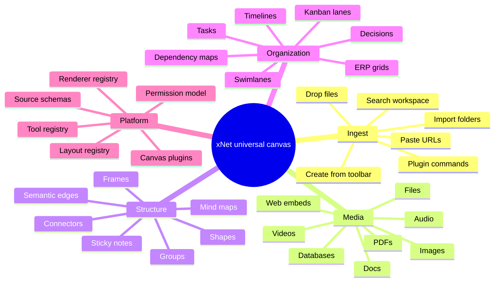

## Current Repo State

### Canvas V3 Foundation

The recent Canvas v3 exploration recommends a tile-addressed, multi-renderer, interest-managed scene runtime. It separates the root canvas manifest, tile documents, source documents, thumbnail summaries, vector/raster tiles, DOM island budgets, minimap input, and viewport-interest subscriptions.

Important local files:

- [`packages/canvas-core/src/types.ts`](../../packages/canvas-core/src/types.ts) defines tile addresses, object summaries, cluster summaries, raster tile metadata, vector tile metadata, and minimap summaries.
- [`packages/canvas-core/src/provider.ts`](../../packages/canvas-core/src/provider.ts) defines `CanvasSceneProvider`, `CanvasObjectRecord`, `CanvasSceneSnapshot`, and preview metadata.
- [`packages/canvas-core/src/lod.ts`](../../packages/canvas-core/src/lod.ts) chooses object LOD tiers: `live-dom`, `shell-dom`, `thumbnail`, `vector-tile`, and `raster-tile`.
- [`packages/canvas-core/src/interest.ts`](../../packages/canvas-core/src/interest.ts) plans viewport tile subscriptions with halo and velocity-aware prefetch.
- [`packages/canvas-core/src/collaboration.ts`](../../packages/canvas-core/src/collaboration.ts) scopes awareness fanout by visible and prefetched tile rooms.
- [`packages/canvas-core/src/connectors.ts`](../../packages/canvas-core/src/connectors.ts) models local, ancestor, and tile-pair connector storage for cross-tile edges.
- [`packages/canvas/src/scene/tile-doc-schema.ts`](../../packages/canvas/src/scene/tile-doc-schema.ts) converts the current flat canvas document into v3 tile documents with objects, connectors, tombstones, and metadata.
- [`packages/canvas/src/renderer/CanvasV3.tsx`](../../packages/canvas/src/renderer/CanvasV3.tsx) renders the current v3 path with WebGL vector tiles, DOM islands, minimap, comments, cursors, and a temporary flat-doc migration adapter.

Canvas v3 is designed for scale. This exploration assumes that architecture remains the base and focuses on richer content and UX.

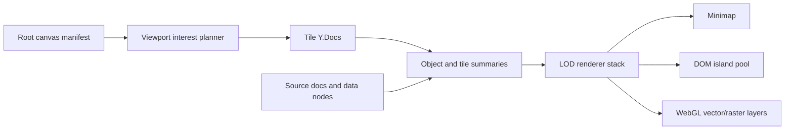

### Existing Object Model

[`packages/canvas/src/types.ts`](../../packages/canvas/src/types.ts) already expresses the key split:

- `CanvasObjectKind` includes `page`, `database`, `external-reference`, `media`, `shape`, `note`, and `group`.
- `CanvasSourceBackedNodeKind` includes `page`, `database`, `external-reference`, `media`, and `note`.
- `CanvasNodeBase` includes `sourceNodeId`, `sourceSchemaId`, `alias`, `display`, `position`, and `properties`.
- `CanvasEdgeEndpoint` supports stable object binding, anchors, side placement, ratio placement, offsets, and future block-level anchors.
- `ShapeType` already includes rectangles, rounded rectangles, ellipses, diamonds, triangles, hexagons, stars, arrows, cylinders, and clouds.

This is a strong base because a PDF, an image, a page, a database, a GitHub issue, a Spotify playlist, and a plugin-defined ERP object can all be handled as **source-backed canvas objects** with different renderer capabilities.

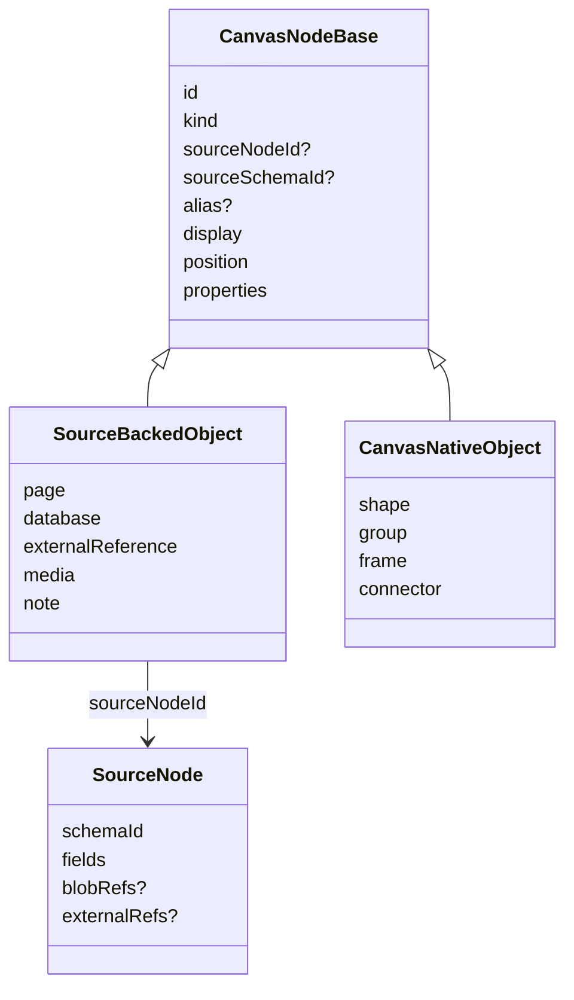

### Ingestion And Media

The current ingestion layer is already more useful than a basic whiteboard paste handler.

Relevant files:

- [`packages/canvas/src/ingestion.ts`](../../packages/canvas/src/ingestion.ts) normalizes drag/drop/paste into `internal-node`, `url`, `file`, and `text` payloads.
- [`packages/canvas/src/hooks/useCanvasObjectIngestion.ts`](../../packages/canvas/src/hooks/useCanvasObjectIngestion.ts) creates source-backed canvas nodes from internal nodes, URLs, files, text, and primitive object requests.
- [`packages/data/src/external-references.ts`](../../packages/data/src/external-references.ts) parses providers and normalized external references.
- [`packages/data/src/schema/schemas/external-reference.ts`](../../packages/data/src/schema/schemas/external-reference.ts) defines structured external reference metadata.
- [`packages/data/src/schema/schemas/media-asset.ts`](../../packages/data/src/schema/schemas/media-asset.ts) defines media assets with title, file, kind, alt, width, and height.
- [`packages/editor/src/extensions/embed/EmbedExtension.ts`](../../packages/editor/src/extensions/embed/EmbedExtension.ts), [`packages/editor/src/extensions/image/ImageExtension.ts`](../../packages/editor/src/extensions/image/ImageExtension.ts), and [`packages/editor/src/extensions/file/FileExtension.ts`](../../packages/editor/src/extensions/file/FileExtension.ts) already solve adjacent editor-level embed, image, and file attachment concerns.

Current ingestion already supports:

- Internal xNet nodes.
- URL payloads through external reference creation.
- File payloads through `BlobService` upload and media asset creation.
- Text payloads as notes.
- URL provider sizing for social, Spotify/audio, and aspect-ratio media.

The next step is to unify this into a visible user journey with explicit states, provider-specific previews, and plugin extensibility.

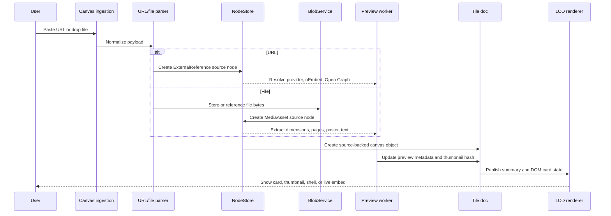

### Current Electron UX

[`apps/electron/src/renderer/components/CanvasView.tsx`](../../apps/electron/src/renderer/components/CanvasView.tsx) maps canvas objects into rich cards and inline surfaces:

- Pages and notes can render inline through [`CanvasInlinePageSurface.tsx`](../../apps/electron/src/renderer/components/CanvasInlinePageSurface.tsx).
- Databases can render preview rows and columns through [`CanvasDatabasePreviewSurface.tsx`](../../apps/electron/src/renderer/components/CanvasDatabasePreviewSurface.tsx).
- External references can render provider-aware cards through [`CanvasExternalReferenceCard.tsx`](../../packages/editor/src/components/CanvasExternalReferenceCard.tsx).
- Media assets can render as media cards.
- Selection actions include peek, focus, split, align, distribute, tidy, connect, create shape, create frame, wrap selection, alias editing, and comments.

However, the active v3 renderer still has some product parity gaps:

- Several imperative handles in `CanvasV3.tsx` currently return `false` for operations that the surrounding Electron app expects, including align/distribute/tidy/connect/wrap flows.
- Page/database/note surfaces are present, but the creation and toolbar story should become clearer in v3.
- File/PDF handling is present as generic media metadata, but not yet a rich PDF preview, page strip, annotation, OCR/text extraction, or page-level anchor workflow.
- Embed support exists through external references and editor embeds, but not yet as a unified canvas provider/plugin registry with clear activation, sandbox, fallback, and thumbnail behavior.

### Existing Plugin Base

The plugin system is a good foundation but not yet canvas-aware enough.

Relevant files:

- [`packages/plugins/README.md`](../../packages/plugins/README.md)
- [`packages/plugins/src/types.ts`](../../packages/plugins/src/types.ts)
- [`packages/plugins/src/contributions.ts`](../../packages/plugins/src/contributions.ts)

Current contribution types cover:

- Views.
- Commands.
- Slash commands.
- Editor extensions.
- Toolbar items.
- Sidebar panels.
- Property handlers.
- Blocks.
- Settings.
- Schemas.

Missing contribution types for the canvas:

- `canvasCards` for plugin-owned card renderers.
- `canvasIngestors` for plugin-owned URL/file/data-transfer handlers.
- `canvasTools` for plugin-owned interaction tools.
- `canvasLayouts` for plugin-owned graph/tree/grid/kanban/timeline layouts.
- `canvasEdges` for semantic relationship types.
- `canvasInspectors` for side panels and object detail panels.
- `canvasTemplates` for prebuilt planning surfaces.

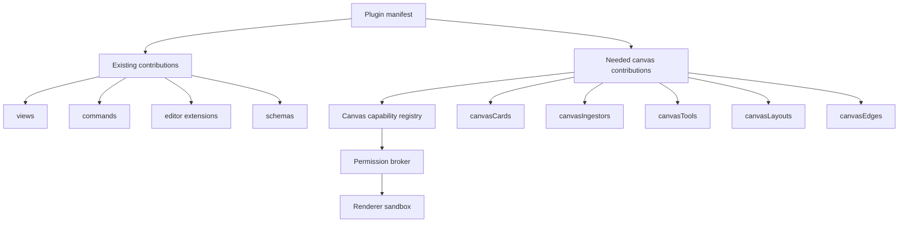

## External Research

### Miro As Product Benchmark

Miro's public developer documentation frames "board items" as visual representations of information on a board and lists supported item types including app cards, cards, connectors, embeds, frames, images, mind maps, previews, shapes, sticky notes, and text. Their board item page also describes previews as rich media from Open Graph data and embeds as external content through an embed provider ecosystem. It separately calls out unsupported or partially supported items like documents, PDFs, presentations, Google Docs, kanban, mind maps, strokes, tables, and user story maps in API contexts.

For xNet, the lesson is not to clone every surface detail. The lesson is that a credible Miro-like canvas requires:

- A broad set of everyday board items.
- A structured card concept that can sync with external/domain systems.
- Embeds with rich fallback previews.
- Frames as both organization and presentation/export primitives.
- Connectors as first-class diagram objects.
- Mind maps and sticky notes as fast ideation modes.
- API/plugin affordances that let domain tools project their own objects onto the board.

Miro's app card concept is especially relevant: it treats cards as structured information that can exchange data with external tools. xNet should generalize this idea locally: plugin/domain cards should be first-class source-backed nodes that can be displayed on canvas, in databases, in docs, and in side panels.

### tldraw As Embed And Tooling Reference

tldraw's embed shape documentation is a useful reference for canvas-native embeds:

- Pasting supported URLs can create embed shapes with appropriate dimensions.
- User-facing URLs are transformed into provider embed URLs.
- Unknown iframe HTML can still become an embed with stricter sandboxing.
- Embeds need interaction modes because the iframe wants pointer events while the canvas also wants selection, dragging, and resizing.
- Non-embeddable URLs should fall back to bookmark/link cards.
- Custom embed definitions can extend supported providers.

xNet should copy the product principle, not the implementation: every external URL should become the best safe object available, with fallback behavior that never leaves a dead rectangle.

### JSON Canvas As Import/Export Interop

The JSON Canvas 1.0 spec defines a small format with top-level `nodes` and `edges`. Nodes can be text, files, links, or groups, and edges connect nodes. This maps well to the minimum common denominator of xNet's canvas object model.

xNet should eventually support JSON Canvas import/export as a bridge to Obsidian and other local knowledge tools. The export does not need to preserve every plugin behavior; it should preserve position, dimensions, text, files, links, groups, and edges.

### oEmbed, Open Graph, YouTube, Spotify, And Arbitrary Embeds

The web already has several useful layers for link enrichment:

- **Open Graph** gives a common metadata vocabulary for link cards.
- **oEmbed** gives a provider-neutral way to request embeddable metadata for a URL.
- **YouTube IFrame Player API** defines the controlled iframe playback surface for YouTube videos.
- **Spotify Embeds** provide official iframe embeds for albums, artists, episodes, playlists, podcasts, shows, and tracks.
- **HTML iframe sandboxing** defines the permission boundary for arbitrary embeds.

xNet should use these as progressive layers:

1. Parse known provider URLs locally.
2. Fetch Open Graph/oEmbed metadata when network access is available and allowed.
3. Store normalized metadata in an `ExternalReference` source node.
4. Render a safe shell/card by default.
5. Activate iframe playback only on explicit user action and only under an embed budget.
6. Preserve the original URL and provider metadata even if the iframe is blocked or offline.

### PDF.js And File System APIs

PDF.js is the practical web rendering base for PDFs. xNet can use it to generate page thumbnails, render focused pages, extract text for search where feasible, and support page-level canvas anchors.

The browser File System API and origin-private file system concepts are relevant for the web app, while Electron can access richer local file primitives. The prior filesystem exploration recommended starting with read-only folder indexing, drag/drop references, optional blob capture, and managed folders later. That same policy should apply on the canvas: dropped files should produce durable objects even when the bytes are local-only, synced later, or blocked by policy.

## What "Best Place To Plan And Organize Online" Means

The canvas should feel less like a drawing app and more like a living planning surface. The user should be able to throw anything at it, arrange meaning visually, connect related objects, turn parts of the map into structured databases, and invite plugins to add domain-specific operations.

### Core UX Promises

1. **Everything important can land on the canvas.** Paste a URL, drop a PDF, drag a database row, clip a YouTube video, create a mind map branch, or add a domain object from a plugin.
2. **Every object is useful at every zoom level.** Far away it contributes shape, color, density, labels, and relationship summaries. Up close it becomes readable. Focused it becomes editable or interactive.
3. **The surface creates structure without demanding structure first.** Users can start messy, then add frames, groups, tags, edges, lanes, templates, and generated databases.
4. **Relationships are visible and queryable.** An edge can be a visual connector, but it can also mean "depends on", "blocks", "owns", "references", "approves", "ships with", or "belongs to".
5. **Plugins add domain power without breaking the canvas.** A plugin can define ERP entities, risk cards, CAD previews, CRM accounts, clinical records, lesson plans, or incident maps while still participating in the same LOD, sync, and permission model.
6. **Editing should feel physical and immediate.** Selecting, moving, resizing, layering, aligning, connecting, styling, and opening objects should be as direct as a modern design tool, with contextual controls appearing exactly where the user's attention already is.

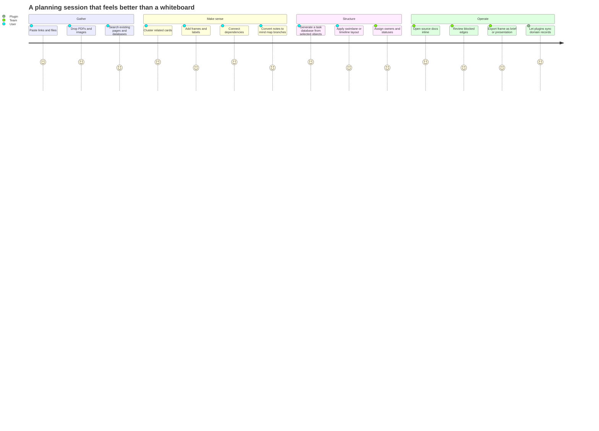

### Canvas Object Lifecycle

Every rich object should have a visible, recoverable lifecycle. A dropped PDF should not appear as a dead card while pages are parsed. A YouTube URL should not become a broken iframe when blocked. A local file should not pretend it is synced.

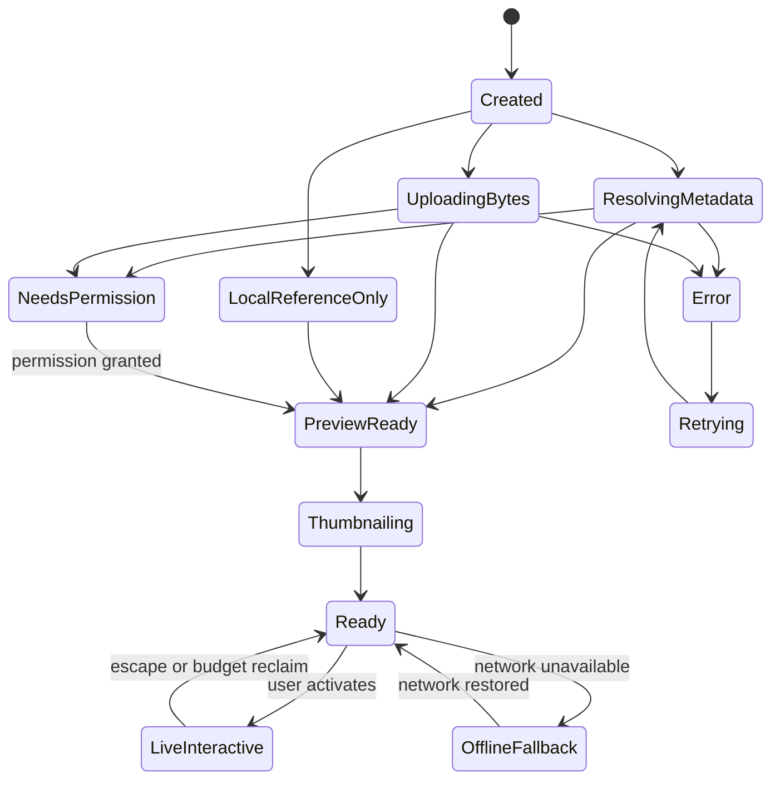

Recommended user-visible states:

| State           | User Meaning                                  | Example UI                                    |
| --------------- | --------------------------------------------- | --------------------------------------------- |
| `resolving`     | xNet is identifying the thing                 | Skeleton card with provider/file hint         |
| `uploading`     | Bytes are being copied into xNet storage      | Progress ring and file size                   |
| `local-only`    | The file is referenced but not synced         | Local badge and sync action                   |
| `blocked`       | Provider/embed/file is unsafe or unauthorized | Fallback card plus reason                     |
| `preview-ready` | Metadata is available                         | Title, provider, icon, dimensions, first page |
| `thumbnailing`  | A deterministic thumbnail is being produced   | Low-res card with queued badge                |
| `ready`         | Object is stable and viewable                 | Normal canvas card                            |
| `live`          | Object has active DOM or iframe interaction   | Focus outline, escape affordance              |
| `offline`       | Remote content cannot load now                | Cached metadata and retry action              |
| `error`         | Work failed but object still exists           | Recoverable error card                        |

### Editing And Direct Manipulation UX

The canvas cannot become the best place to plan online if objects feel static once they land. Miro-comparable media support depends on Miro-comparable editing ergonomics: users should be able to select an object without precision hunting, drag it around confidently, resize it from obvious handles, align and distribute groups, and get the right contextual toolbar without leaving the canvas.

The current codebase already has useful starting points:

- [`packages/canvas/src/types.ts`](../../packages/canvas/src/types.ts) models interaction state with `pan`, `select`, `move`, `resize`, and `connect` drag modes, eight resize handles, and grid snapping configuration.
- [`packages/canvas/src/selection/scene-operations.ts`](../../packages/canvas/src/selection/scene-operations.ts) provides pure helpers for bounds, locking, alignment, distribution, z-order, resizing, and frame wrapping.
- [`packages/canvas/src/__tests__/canvas-node-component.test.tsx`](../../packages/canvas/src/__tests__/canvas-node-component.test.tsx) verifies that interactive child regions can be selected without accidentally dragging, and that resize/connector handles route through dedicated callbacks.
- [`apps/electron/src/renderer/components/CanvasView.tsx`](../../apps/electron/src/renderer/components/CanvasView.tsx) already renders a selection HUD with peek/open/alias/references/comment/lock/connect/align/distribute/tidy/layer/clear actions.

The next step is to make these affordances feel like one coherent editing system.

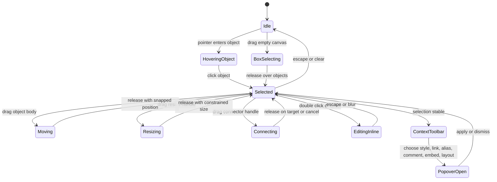

Recommended baseline editing behaviors:

| Interaction      | Expected UX                                                     | Notes                                                           |
| ---------------- | --------------------------------------------------------------- | --------------------------------------------------------------- |
| Single select    | Click any visible object body or thumbnail                      | Respect interactive child regions inside live cards             |
| Multi-select     | Shift-click, marquee selection, command palette select commands | Show aggregate bounds and count                                 |
| Move             | Drag selected object or group                                   | Preserve relative positions, announce snap/guides visually      |
| Resize           | Eight handles on selected object, proportional resize modifier  | Respect min size and object-specific aspect rules               |
| Crop/fit         | Media-specific contextual controls                              | Images/video/PDF cards need fit/fill/crop/page controls         |
| Rotate           | Optional for shapes/images, not required for all source cards   | Keep off by default for docs/databases to avoid awkward reading |
| Connect          | Connector handles on selected object                            | Drag to object, anchor, block, PDF page, or database row        |
| Align/distribute | Contextual toolbar for multi-select                             | Use existing pure helpers and make failures visible             |
| Layer/order      | Bring forward/back/send to front/back                           | Respect frames/groups and locked objects                        |
| Lock             | Prevent accidental move/resize/edit                             | Still allow select and inspect                                  |
| Group/frame      | Wrap selected objects or add to frame                           | Frame auto-resize should be explicit or predictable             |
| Style            | Popover for fill, stroke, text, shape, edge style               | Contextual to object capabilities                               |
| Inspect          | Side panel or anchored popover for metadata and source refs     | Avoid modal interruption for common edits                       |

The key design choice is that **direct manipulation is the primary editor**, while sidebars and inspectors are secondary. Users should not need to open a property panel to do the common work of planning: move this card, make it bigger, connect it to that decision, change its color, lock it, group it, or put it in a frame.

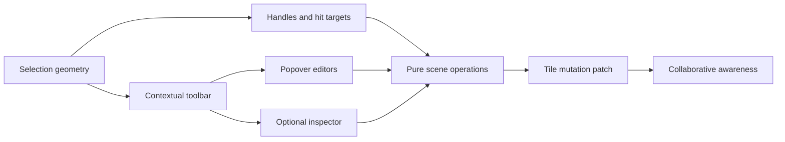

Detailed UX requirements:

- **Selection hit targets:** every object needs a forgiving selection surface even when its visual content is sparse, transparent, or an iframe shell. Selected objects should show a visible outline, resize handles, connector handles, and lock state.
- **Drag behavior:** moving should start only after a small movement threshold, so clicks, text selection, and embedded controls do not accidentally move objects. Drag previews should stay smooth even when source cards are heavy by moving transform shells while committing final positions to tile docs.
- **Resize behavior:** resizing should use eight handles, enforce minimum dimensions, support aspect-ratio lock for media, support crop/fit for images/videos/PDFs, and expose numeric dimensions in a contextual popover for precision edits.
- **Contextual toolbar:** a stable floating toolbar should follow the selection bounds and expose high-frequency actions: open/peek, comment, connect, style, lock, align, distribute, tidy, layer, group/frame, duplicate, delete, and more.
- **Contextual popovers:** object-specific controls should be popovers anchored to toolbar buttons or handles: media crop, PDF page, embed settings, edge type, shape style, source aliases, source references, and object metadata.
- **Snap and guides:** grid snapping should be visible and optional. Smart guides should appear for alignment with nearby objects, frame edges, lanes, and equal spacing. Holding a modifier should temporarily disable snapping.
- **Keyboard parity:** arrow keys nudge, Shift+arrow moves larger steps, Mod+D duplicates, Delete removes, Enter opens, Esc exits modes, and shortcuts should work on multi-selection.
- **Remote collaboration:** dragging/resizing should publish transient awareness without committing excessive sync churn. Final commits should be coalesced into undoable transactions.
- **Accessibility:** handles and toolbar controls need accessible labels and keyboard reachability. Resize and move operations should have keyboard alternatives.

## Media And Object Type Expansion

### 1. Embedded Docs And Databases

Docs and databases should remain the flagship xNet-native objects on the canvas.

Current strengths:

- Inline page and note surfaces already use the rich text editor.
- Inline database preview already supports visible rows/columns and open/split actions.
- Source-backed canvas nodes avoid duplicating content.

Recommended expansions:

- **Doc cards:** compact doc summary, outline preview, last edited, backlinks, comments, and open modes.
- **Live doc islands:** editable focused page sections with DOM island budget enforcement.
- **Block anchors:** edges can connect to a heading, paragraph, checklist item, table row, or embed block, not only the whole page.
- **Transclusion snippets:** selected blocks can appear as read-only or editable snippets on the canvas.
- **Database cards:** compact schema/record counts, filtered view chips, row samples, and inline view switching.
- **Database rows as objects:** drag a row from a database view onto the canvas as a source-backed record card.
- **Query frames:** frames whose contents are generated from a database query or saved search.

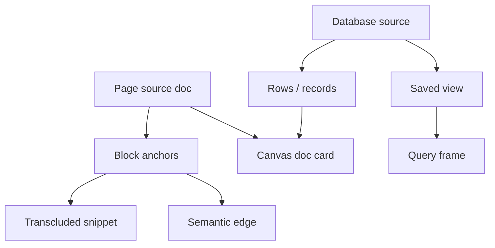

### 2. Images

Images should be a first-class planning primitive, not just attachments.

Recommended features:

- Drag/drop and paste image creation through the existing media asset flow.
- Fast image thumbnails generated from content-addressed blobs.
- Resize, crop, fit, fill, and focal-point controls.
- Alt text and captions.
- Lightweight annotation overlays with arrows, callouts, and highlights.
- Image-to-note or OCR extraction later, explicitly as an enhancement.
- Image comparison mode for design review, before/after planning, and asset QA.

LOD behavior:

- Far: colored image bounding box and optional dominant color.
- Mid: deterministic thumbnail.
- Near: crisp preview with caption.
- Live/focused: full resolution, crop, annotation, and metadata tools.

### 3. Files And PDFs

Files are where xNet can exceed Miro because xNet can be local-first and source-backed.

Recommended file policies:

- **Reference only:** local path/bookmark plus hash metadata; useful for large or sensitive files.
- **Copy to blob storage:** content-addressed copy in xNet storage; sync according to workspace policy.
- **Managed folder:** future folder-level import/index mode from the filesystem exploration.
- **Remote only:** external URL with cached metadata.
- **Blocked:** executable or disallowed file type with visible reason.

PDF-specific features:

- PDF.js page thumbnail strip.
- Single-page cards and multi-page cards.
- Page-level anchors for edges and comments.
- Text extraction for search and selection where feasible.
- Highlight and annotation overlays stored separately from the PDF bytes.
- "Explode pages to canvas" action for workshops and research.
- "Collect selected pages into doc" action for synthesis.

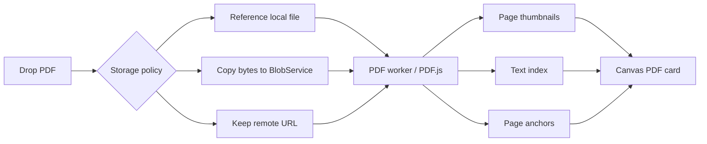

### 4. YouTube, Spotify, And Other Web Embeds

External media should resolve into cards first, iframes second.

Why this matters:

- Iframes are expensive at scale.
- Iframes can steal pointer events.
- Iframes can be blocked by provider policy, network state, cookie settings, or sandbox limitations.
- The canvas must remain usable offline and at low zoom.

Recommended embed model:

- Store original URL, provider, provider item id, normalized embed URL, title, subtitle, poster/thumbnail, and metadata in `ExternalReference`.
- Render a provider card at shell/thumbnail tiers.
- Activate the iframe only on double-click, explicit play, or locked-interaction mode.
- Keep pointer-event modes explicit: select/move mode versus interact mode.
- Use stricter sandboxing for arbitrary iframe HTML than for known providers.
- Keep a hard live iframe budget, likely lower than the live DOM document budget.
- Always keep a fallback link card.

Provider examples:

| Provider    | Source Type               | Default Canvas Behavior                                               |
| ----------- | ------------------------- | --------------------------------------------------------------------- |
| YouTube     | Video                     | Poster card, transcript/notes later, live iframe on play              |
| Spotify     | Playlist/album/track/show | Compact playlist card, live iframe on activate                        |
| Figma       | Design                    | Preview card, live embed if permitted, design metadata                |
| GitHub      | Issue/PR/repo             | Structured app card with status, assignee, labels                     |
| Loom/Vimeo  | Video                     | Poster card, iframe activation                                        |
| Generic URL | Link                      | Open Graph card, fallback title/url/icon                              |
| Raw iframe  | Arbitrary embed           | Strict sandbox, warning, disabled by default for untrusted workspaces |

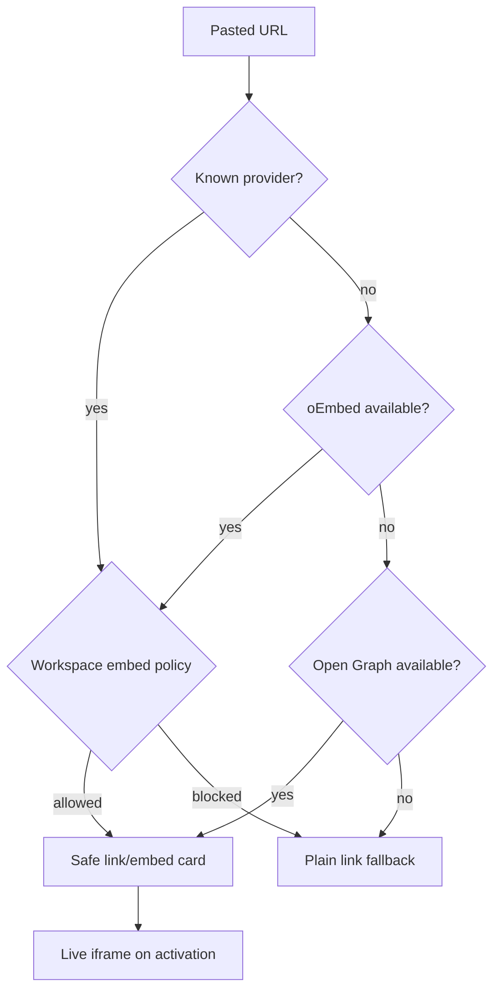

### 5. Arbitrary Embeds And Plugin Cards

Arbitrary embeds should be supported, but the safe default should be a non-live card. This is where xNet's plugin model matters.

Plugin-owned canvas cards should be able to:

- Match a URL pattern, file type, MIME type, node schema, or command.
- Create or update a source node.
- Provide far/mid/near/live render capabilities.
- Provide thumbnail generation logic where safe.
- Provide actions for toolbar, context menu, command palette, and inspector.
- Declare permissions for network, storage, clipboard, local process, and filesystem access.
- Declare whether live rendering requires an iframe, WebView, worker, local process, or pure React shell.

Examples:

- A CRM plugin contributes `Account`, `Contact`, and `Opportunity` cards.
- A finance plugin contributes invoice, payment, cashflow, and ledger cards.
- A logistics plugin contributes shipment, warehouse, vehicle, and route cards.
- A product plugin contributes issue, milestone, dependency, and launch checklist cards.
- A scientific plugin contributes paper, dataset, protocol, figure, and lab notebook cards.

### 6. Mind Mapping

Mind mapping should be a fast mode, not just a shape layout.

Recommended behaviors:

- Press a shortcut to create a child branch from the selected node.
- Enter creates siblings; Tab creates children; Shift+Tab promotes; arrow keys navigate branches.
- Branch colors and edge styles inherit from parent unless overridden.
- Branches can be collapsed and expanded.
- Branches can be converted into pages, tasks, database rows, or frames.
- Existing notes/cards can be selected and converted into a mind map.
- Mind maps can be auto-laid out by ELK or a lightweight tree layout worker.
- Mind map edges should be semantic `parent-child` relationships, not just decorative connectors.

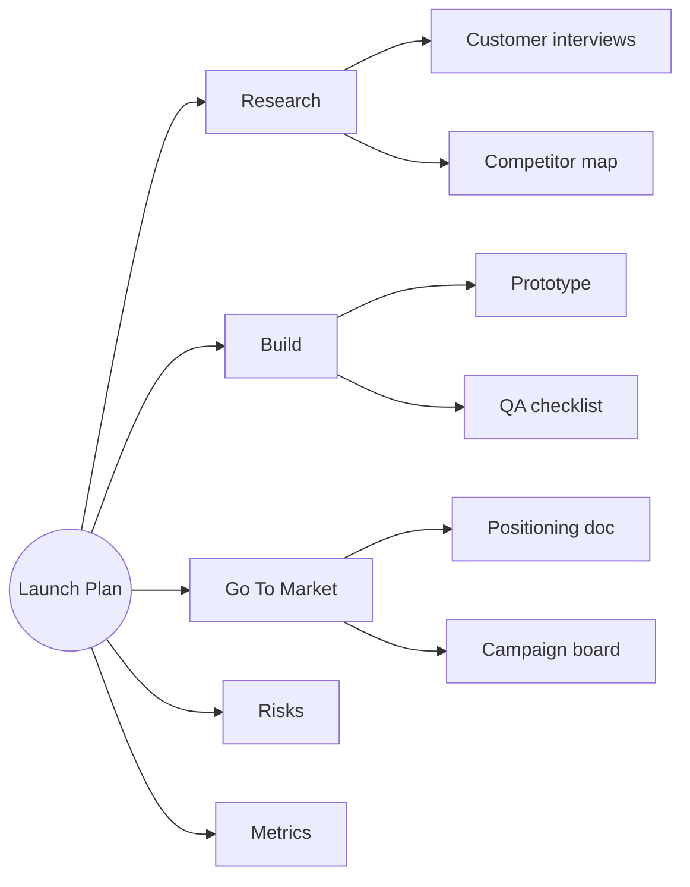

### 7. Connecting Nodes Via Edges

Edges need two layers:

- **Visual connector:** a line that helps humans understand a board.
- **Semantic relationship:** a typed relationship that the system can query, filter, validate, sync, and render differently.

Recommended built-in edge types:

| Edge Type      | Meaning                              | Example                            |
| -------------- | ------------------------------------ | ---------------------------------- |
| `reference`    | A points to B as context             | Design doc references research PDF |
| `depends-on`   | A cannot complete before B           | Launch depends on legal approval   |
| `blocks`       | A blocks B                           | Incident blocks release            |
| `parent-child` | Hierarchy                            | Mind map branch or task tree       |
| `contains`     | Spatial or logical containment       | Frame contains sprint plan         |
| `derived-from` | Generated or synthesized from source | Summary note from selected PDFs    |
| `assigned-to`  | Ownership                            | Task assigned to person card       |
| `syncs-with`   | External/system sync relationship    | GitHub issue syncs with xNet task  |
| `data-flow`    | Operational/data relation            | ERP order flows to invoice         |

Canvas edge endpoints already anticipate anchors and future block anchors. That should be productized into:

- Connection handles on object edges.
- Anchor points inside docs, PDFs, images, and database rows.
- Edge labels and badges.
- Edge filtering by type/status.
- Edge routing that can cross tiles without keeping all endpoints live.
- Edge summaries at far zoom.
- "Show dependencies" and "show backlinks" commands.

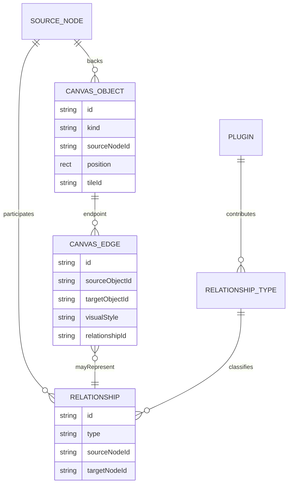

### 8. Shapes, Sticky Notes, Frames, Tables, And Drawing

Shapes should make xNet feel fast for ideation while staying source-aware where it matters.

Recommended primitives:

- Shapes: rectangle, rounded rectangle, ellipse, diamond, triangle, hexagon, star, arrow, cylinder, cloud.
- Sticky notes: color-coded quick notes that can convert to pages, tasks, or database rows.
- Frames: named spatial groups, presentation slides, export boundaries, and query/view containers.
- Swimlanes: frame variants with horizontal/vertical lanes.
- Tables: lightweight canvas-native tables for workshops, plus database-backed table views for durable data.
- Freehand drawing: current drawing tool can become first-class ink/stroke primitives.
- Stamps and stickers: useful, but lower priority than planning and organization tools.

The key UX decision: primitive shapes should stay lightweight, but any primitive should be promotable into a durable source-backed object.

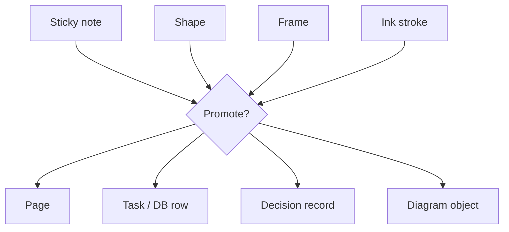

### 9. Making The Canvas A Meaningful ERP Grid

The long-term ERP vision should not be "put ERP screens on a whiteboard." It should be "let teams spatially model the operating system of their organization."

Potential domain grids:

- **CRM grid:** accounts, contacts, opportunities, touchpoints, renewals, risks.
- **Manufacturing grid:** parts, suppliers, orders, work centers, incidents, inventory.
- **Finance grid:** invoices, vendors, approvals, cashflow, budgets, reconciliations.
- **People grid:** teams, roles, hiring plans, onboarding, performance cycles.
- **Healthcare grid:** patients, care plans, medications, labs, referrals, consent artifacts.
- **Education grid:** courses, lessons, resources, assignments, learner progress.
- **Research grid:** papers, notes, hypotheses, datasets, figures, experiments.

These grids need:

- Plugin-defined schemas.
- Query-backed frames.
- Semantic edges.
- Saved layouts.
- Permission-aware cards.
- Bulk operations.
- Audit trails.
- Sync connectors to external systems where appropriate.

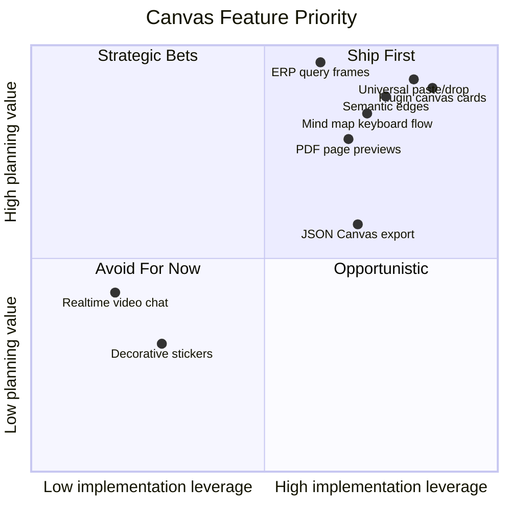

## Design Principles

### 1. Source-Backed By Default

If an object has durable meaning outside the canvas, it should be backed by a source node. The canvas record should store placement, display preferences, aliases, and lightweight preview hashes, not duplicate the source data.

This preserves:

- Local-first sync semantics.
- Database integration.
- Doc embedding.
- Plugin schema ownership.
- Search and query.
- Multiple placements of the same source.

### 2. Every Object Has A Preview Contract

Each object kind/provider should expose:

- `summary`: tiny metadata for minimap and search.
- `thumbnail`: deterministic visual preview for mid/far zoom.
- `shell`: non-interactive readable card.
- `live`: editable or interactive focused surface.
- `actions`: context, toolbar, and command palette actions.
- `anchors`: connection targets inside the object.

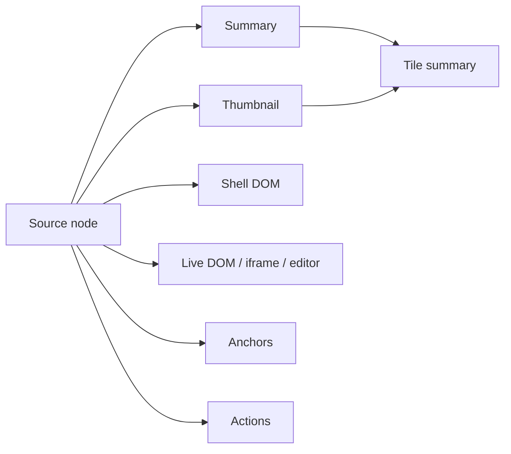

### 3. Iframes Are A Focus Mode, Not A Board Item Default

Live embeds should be opt-in interactions. The normal board should show cached, safe, cheap cards.

Recommended iframe rules:

- No automatic live iframe creation for paste/drop.
- Known providers get provider-specific sandbox and allow policies.
- Arbitrary iframes get strict sandbox and a workspace/admin policy gate.
- Iframe activation consumes a live embed budget.
- Exports and thumbnails use fallback card visuals, not iframe pixels.
- Pointer events are disabled unless the object is activated, locked for interaction, or in edit mode.

### 4. Canvas UX Should Prefer Fast Creation Over Modal Configuration

The high-frequency actions need keyboard and gesture flows:

- Paste creates the best object automatically.
- Drag files to create media cards.
- Type `n` for note, `r` for shape, `f` for frame, `m` for mind map branch.
- Drag a connector handle to create a relationship.
- Drop onto a frame to add containment.
- Select objects and press a command to convert to database, mind map, task list, or frame.

### 5. Direct Manipulation Should Be The Main Editing API

The common path should be "select it and change it where it sits."

That means:

- Object outlines, handles, and connector targets are visible and predictable.
- Moving, resizing, grouping, framing, layering, aligning, distributing, locking, and duplicating happen directly on the canvas.
- Contextual toolbars expose the next likely actions without requiring a mode switch.
- Popovers handle focused parameters: shape color, stroke, edge type, media crop, PDF page, embed policy, alias, source references, and dimensions.
- Side panels remain available for deeper metadata, plugin-specific fields, and bulk editing, but they should not be required for ordinary layout work.

This matters for source-backed objects as much as shapes. A database preview, PDF card, YouTube embed, and ERP object should all be movable, resizable, alignable, connectable, duplicable, lockable, and inspectable through the same interaction grammar.

### 6. Plugins Should Extend Capabilities, Not Replace The Canvas Runtime

Plugins should not own camera, selection, sync, tile documents, or core rendering budgets. They should contribute controlled capabilities that the canvas runtime schedules.

This protects:

- Performance at infinite scale.
- Local-first replication.
- Security boundaries.
- Consistent interaction model.
- Accessibility and export behavior.

## Recommended Architecture

### Add A Canvas Capability Registry

Introduce a registry that routes source nodes, canvas primitives, files, URLs, and plugin contributions through common handlers.

```typescript
/**
 * Sketch only: exact module boundaries should follow packages/canvas and packages/plugins.
 */

export type CanvasPreviewTier = 'summary' | 'thumbnail' | 'shell' | 'live'

export type CanvasCapabilityContext = {
  readonly workspaceId: string
  readonly permissions: CanvasPermissionBroker
  readonly openSourceNode: (nodeId: string) => void
}

export type CanvasIngestMatch = {
  readonly priority: number
  readonly reason: string
}

export type CanvasIngestor<TPayload = unknown> = {
  readonly id: string
  readonly match: (payload: TPayload) => CanvasIngestMatch | null
  readonly ingest: (
    payload: TPayload,
    context: CanvasCapabilityContext
  ) => Promise<CanvasSourceBackedCreation>
}

export type CanvasRendererContribution = {
  readonly id: string
  readonly sourceSchemaId?: string
  readonly provider?: string
  readonly previewTiers: readonly CanvasPreviewTier[]
  readonly createSummary: (source: CanvasSourceSnapshot) => CanvasObjectSummary
  readonly createThumbnail?: (source: CanvasSourceSnapshot) => Promise<CanvasThumbnail>
  readonly renderShell: CanvasShellRenderer
  readonly renderLive?: CanvasLiveRenderer
  readonly getAnchors?: (source: CanvasSourceSnapshot) => readonly CanvasAnchor[]
}

export type CanvasToolContribution = {
  readonly id: string
  readonly label: string
  readonly icon: string
  readonly activate: (context: CanvasToolContext) => CanvasToolController
}

export type CanvasLayoutContribution = {
  readonly id: string
  readonly label: string
  readonly apply: (
    selection: readonly CanvasObjectRecord[],
    context: CanvasLayoutContext
  ) => Promise<readonly CanvasObjectPatch[]>
}
```

The registry should compose first-party and plugin contributions with deterministic priority rules:

1. First-party internal xNet source objects.
2. First-party known providers and file types.
3. Installed trusted plugins.
4. Generic Open Graph/oEmbed.
5. Plain fallback cards.

### Add Canvas Plugin Contributions

Extend plugin contribution types with canvas-specific entries:

```typescript
export type CanvasContribution =
  | CanvasCardContribution
  | CanvasIngestorContribution
  | CanvasToolContribution
  | CanvasLayoutContribution
  | CanvasEdgeContribution
  | CanvasTemplateContribution

export type CanvasCardContribution = {
  readonly type: 'canvas.card'
  readonly id: string
  readonly schemaId?: string
  readonly provider?: string
  readonly rendererEntrypoint: string
  readonly previewEntrypoint?: string
  readonly permissions?: readonly CanvasPermission[]
}

export type CanvasEdgeContribution = {
  readonly type: 'canvas.edge'
  readonly id: string
  readonly label: string
  readonly directed: boolean
  readonly allowedSourceSchemas?: readonly string[]
  readonly allowedTargetSchemas?: readonly string[]
}
```

### Add A Preview Pipeline

Preview generation should be a pipeline, not embedded in card components.

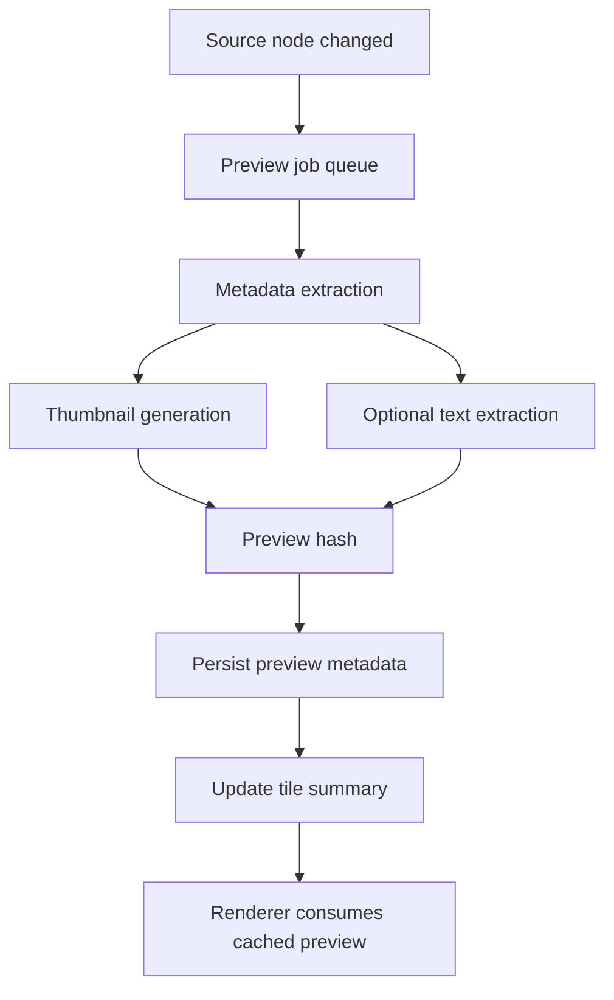

Properties of the preview pipeline:

- Deterministic where possible.
- Worker-based for PDFs/images/video posters.
- Permission-aware for local and remote resources.
- Cacheable by source version and content hash.
- Compatible with offline rendering.
- Able to produce minimap and far-zoom summaries without mounting live DOM.

### Add A Relationship Layer Above Visual Connectors

Connectors should optionally point at a `Relationship` source record. That record can be queried, synced, permissioned, and rendered in docs/databases.

```typescript
export type CanvasRelationshipKind =
  | 'reference'
  | 'depends-on'
  | 'blocks'
  | 'parent-child'
  | 'contains'
  | 'derived-from'
  | 'assigned-to'
  | 'syncs-with'
  | 'data-flow'

export type CanvasRelationship = {
  readonly id: string
  readonly kind: CanvasRelationshipKind
  readonly sourceNodeId: string
  readonly targetNodeId: string
  readonly sourceAnchorId?: string
  readonly targetAnchorId?: string
  readonly createdAt: number
  readonly createdBy: string
  readonly properties: Readonly<Record<string, unknown>>
}
```

Visual edges can then render:

- Pure visual connector, no relationship.
- Semantic relationship, visible connector.
- Semantic relationship, hidden unless filtered.
- Generated relationship from plugin/domain data.

### Add A First-Class Interaction Model

The direct manipulation UI should be modeled as a first-class canvas subsystem, not scattered across object components. Object components can declare capabilities, but the canvas runtime should own hit testing, selection geometry, drag state, resize handles, snapping, awareness, undo grouping, and contextual UI placement.

```typescript
export type CanvasSelectionAction =
  | 'open'
  | 'peek'
  | 'move'
  | 'resize'
  | 'connect'
  | 'style'
  | 'align'
  | 'distribute'
  | 'tidy'
  | 'lock'
  | 'duplicate'
  | 'delete'
  | 'group'
  | 'frame'
  | 'inspect'

export type CanvasObjectInteractionCapabilities = {
  readonly movable: boolean
  readonly resizable: boolean
  readonly lockable: boolean
  readonly connectable: boolean
  readonly styleable: boolean
  readonly editableInline: boolean
  readonly maintainAspectRatio?: boolean
  readonly minSize: { readonly width: number; readonly height: number }
  readonly preferredToolbarActions: readonly CanvasSelectionAction[]
}

export type CanvasContextPopover =
  | { readonly type: 'style'; readonly objectIds: readonly string[] }
  | { readonly type: 'dimensions'; readonly objectIds: readonly string[] }
  | { readonly type: 'media-crop'; readonly objectId: string }
  | { readonly type: 'pdf-page'; readonly objectId: string }
  | { readonly type: 'edge-type'; readonly edgeId: string }
  | { readonly type: 'source-references'; readonly sourceNodeId: string }
```

Recommended boundaries:

- `CanvasInteractionController` owns pointer capture, drag thresholds, box selection, movement, resize, connect, keyboard nudge, snapping, and undo grouping.
- `CanvasSelectionOverlay` renders outlines, handles, connector affordances, remote selections, and multi-select bounds.
- `CanvasContextToolbar` renders high-frequency actions based on selection capabilities.
- `CanvasContextPopover` renders focused editors for style, dimensions, crop, PDF page, edge type, aliases, source references, and plugin fields.
- Object renderers expose capabilities and anchors but do not implement their own global interaction rules.

## Product Roadmap

### Phase 0 - Tighten Canvas V3 Parity

Goal: make the current v3 canvas feel complete before adding many new object types.

- Wire v3 imperative handles for align, distribute, tidy, connect, frame wrap, and shape/frame creation where v2 already has product affordances.
- Confirm page, note, database, media, external reference, shape, and group flows work through the v3 renderer.
- Make current ingestion state visible: resolving URL, uploading file, ready, error.
- Make selection, drag, resize, connector handles, keyboard nudging, snapping, and contextual toolbar behavior feel complete in v3.
- Add object create menus that match actual available kinds.
- Ensure minimap and WebGL summaries represent media/reference objects clearly.

### Phase 1 - Universal Ingestion And Preview States

Goal: paste/drop/search/import anything and always get a useful object.

- Define `CanvasIngestor` registry.
- Move first-party URL/file/text/internal-node handling behind registry entries.
- Add visible lifecycle states and retry actions.
- Add storage policy prompts for local-only versus copied/synced files.
- Add Open Graph/oEmbed metadata fetch pipeline.
- Add fallback link/file cards for every unsupported source.

### Phase 2 - Rich Media, PDF, And Embed Cards

Goal: make images, PDFs, files, videos, audio, YouTube, Spotify, and arbitrary embeds feel native.

- Add image object controls: fit/fill/crop/focal point/alt/caption.
- Add PDF.js page thumbnails, focused page viewer, page anchors, and page comments.
- Add file cards with local-only/synced/blocked badges.
- Add provider-specific cards for YouTube, Spotify, Figma, GitHub, Loom/Vimeo, and generic URLs.
- Add iframe activation mode and live embed budget.
- Add deterministic thumbnails and export fallbacks.

### Phase 3 - Mind Maps, Connectors, Shapes, And Planning Workflows

Goal: match the speed of a whiteboard while producing structured xNet objects.

- Add mind map keyboard flow and tree layout worker.
- Add semantic edge creation from connector handles.
- Add edge labels, types, filters, and endpoint anchors.
- Add sticky note promotion to page/task/database row.
- Add frame variants: presentation frame, query frame, swimlane, kanban, timeline.
- Add contextual popovers for style, dimensions, media crop, PDF page, edge type, aliases, source references, and plugin object fields.
- Add selection transforms: cluster, stack, tidy, wrap, convert to database, convert to mind map.

### Phase 4 - Canvas Plugin Platform

Goal: let plugins add domain objects without compromising performance, sync, or security.

- Add plugin manifest schema for canvas cards, ingestors, tools, layouts, edge types, and templates.
- Add plugin renderer sandbox and preview job sandbox.
- Add permission prompts for network/file/system access.
- Add plugin card fallback if plugin is missing, disabled, or unauthorized.
- Add plugin card tests with fake CRM/ERP/sample plugins.

### Phase 5 - ERP And Organizational Grids

Goal: make the canvas a domain operating surface.

- Add query-backed frames that materialize database/plugin records onto the canvas.
- Add saved layout rules for grids, swimlanes, org charts, dependency maps, and timelines.
- Add semantic relationship queries and filters.
- Add audit/permission-aware cards.
- Add bulk operations and domain-specific inspectors.
- Add plugin sync hooks for external systems.

### Phase 6 - Interop, Templates, And Marketplace

Goal: make canvas artifacts portable and reusable.

- Add JSON Canvas import/export for simple nodes, files, links, groups, and edges.
- Add frame export to PDF/image/presentation.
- Add reusable templates for planning, retros, roadmaps, research synthesis, incident review, and ERP workflows.
- Add plugin template gallery.
- Add migration tooling for older flat canvas docs.

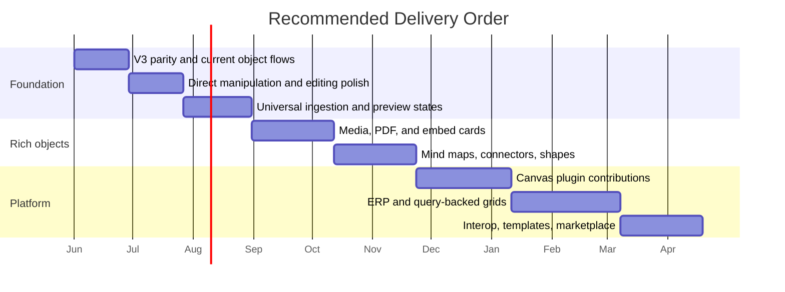

## Implementation Checklist

### Canvas V3 Parity

- [ ] Audit all `CanvasViewHandle` methods expected by Electron and confirm whether `CanvasV3` implements them.
- [x] Wire v3 imperative handles for lock, align, distribute, tidy, layer, connect, and frame wrap to existing scene operation helpers.
- [x] Wire v3 shape and frame creation through renderer-level imperative handles if the existing Electron callbacks are not sufficient.
- [x] Add focused tests for v3 selection operations.
- [x] Ensure v3 create menus expose page, database, note, media/reference, shape, and frame creation consistently.
- [x] Add first-pass Shape and Frame entries to the Electron action dock and web canvas quick actions.
- [x] Add first-pass Link and File entries to the Electron action dock and web canvas quick actions.
- [x] Validate minimap summaries for all current object kinds.
- [x] Validate DOM island budget behavior for mixed page/database/media/reference boards.

### Direct Manipulation And Editing UI

- [ ] Define a first-class `CanvasInteractionController` boundary for selection, move, resize, connect, snapping, keyboard nudging, and undo grouping.
- [x] Render selection outlines, eight resize handles, connector handles, lock indicators, and multi-select bounds consistently across object kinds.
- [ ] Add forgiving hit targets for sparse shapes, transparent media, iframe shells, and source-backed cards.
- [x] Add first-pass Canvas v3 DOM-island dragging that repositions unlocked selected objects through Yjs.
- [x] Add first-pass Canvas v3 resize handles that update object dimensions through Yjs.
- [x] Move selected objects with smooth transform previews and commit coalesced position patches at drag end.
- [x] Add first-pass Canvas v3 lock indicators for locked DOM islands and hide resize handles for locked selections.
- [ ] Resize objects with minimum dimensions, aspect-ratio constraints for media, and object-specific resize policies for docs, databases, PDFs, frames, and embeds.
- [x] Add first-pass Canvas v3 media corner-resize aspect-ratio preservation through centralized resize policies.
- [ ] Add grid snapping, smart guides, equal-spacing guides, frame-edge snapping, and a temporary modifier to disable snapping.
- [x] Add first-pass Canvas v3 grid snapping for drag previews and drag commits with Alt to temporarily disable snapping.
- [x] Add keyboard nudge, large-step nudge, duplicate, delete, lock, group, frame, layer, open, and clear shortcuts.
- [x] Add first-pass Canvas v3 keyboard shortcuts for nudge, large-step nudge, lock, connect, frame wrap, and layer movement.
- [x] Add first-pass Canvas v3 keyboard duplicate and delete shortcuts for unlocked selections.
- [x] Add first-pass Canvas v3 group command through pure helpers, imperative handle, toolbar, and keyboard shortcut.
- [x] Add first-pass Canvas v3 contextual toolbar actions for open, comment, lock, connect, align, distribute, tidy, layer, frame, duplicate, delete, and clear.
- [x] Add contextual toolbar actions derived from selection capabilities.
- [x] Add first-pass Canvas v3 contextual toolbar action availability derived from selection count, lock state, and app callbacks.
- [ ] Add contextual popovers for style, dimensions, crop/fit, PDF page, edge type, alias, references, comments, and plugin fields.
- [x] Add first-pass Canvas v3 dimensions popover for a single unlocked selection.
- [x] Add remote drag/resize awareness without flooding tile sync with intermediate updates.
- [x] Add first-pass Canvas v3 drag/resize interaction awareness with remote outlines.

### Universal Ingestion

- [x] Define `CanvasIngestor` and `CanvasIngestResult` types.
- [x] Convert current internal-node, URL, file, and text ingestion into first-party ingestors.
- [x] Add payload matching priority and conflict resolution.
- [x] Add visible object lifecycle states to canvas cards.
- [ ] Add retry, replace source, open source, and copy link actions for failed cards.
- [ ] Add local-only versus copied/synced file policy prompts.
- [ ] Add tests for file kinds, provider parsing, deduplication, errors, and cancellation.

### Preview Pipeline

- [x] Define `CanvasPreviewModel` with summary, thumbnail, shell, live, anchors, and actions.
- [ ] Add preview worker queue keyed by source node version and content hash.
- [ ] Add deterministic thumbnail outputs for image, PDF, generic file, URL card, video poster, and audio card.
- [ ] Add preview cache invalidation when source node fields or blob hashes change.
- [ ] Add tile summary update path from preview metadata.
- [ ] Add offline fallback behavior.
- [ ] Add benchmark coverage for preview generation under large boards.

### Files And PDFs

- [x] Add storage policy model: reference-only, copied blob, synced blob, remote-only, blocked.
- [ ] Add PDF.js-backed page thumbnail generation.
- [ ] Add focused PDF page viewer with page strip.
- [ ] Add page-level anchors for comments and edges.
- [ ] Add annotation overlay model separate from source PDF bytes.
- [ ] Add text extraction where feasible and permissioned.
- [ ] Add "explode pages to canvas" and "collect selected pages into doc" commands.

### Embeds

- [ ] Add provider-specific card renderers for known external reference providers.
- [ ] Add Open Graph/oEmbed metadata resolution pipeline.
- [ ] Add iframe activation mode with pointer-event state handling.
- [ ] Add workspace embed policy and arbitrary iframe restrictions.
- [ ] Add live iframe budget separate from live DOM document budget.
- [ ] Add fallback rendering for blocked/offline/provider-denied embeds.
- [ ] Add export/thumbnail placeholder behavior for iframes.

### Mind Maps And Edges

- [ ] Add mind map creation tool and keyboard workflow.
- [ ] Add tree layout worker using existing layout infrastructure where possible.
- [ ] Add collapsible branches and inherited branch styling.
- [ ] Add conversion commands between notes, tasks, pages, database rows, and mind map branches.
- [ ] Add semantic relationship records for edges.
- [ ] Add edge labels, filters, styles, and endpoint anchor picking.
- [ ] Add far-zoom edge summaries and minimap relationship hints.

### Shapes, Frames, And Planning Tools

- [ ] Finish shape toolbar with style swatches, stroke/fill, text, and shape variants.
- [ ] Add sticky notes with promotion to page/task/database row.
- [ ] Add frame variants: presentation, query, swimlane, kanban, timeline.
- [ ] Add selection commands: cluster, stack, tidy, distribute, align, wrap, convert.
- [ ] Add templates for research synthesis, product roadmap, incident review, and planning board.
- [ ] Add freehand stroke persistence and export behavior if not already complete.

### Canvas Plugin Platform

- [ ] Extend plugin manifest schema with canvas contributions.
- [ ] Add runtime registry for plugin card, ingestor, tool, layout, edge, inspector, and template contributions.
- [ ] Add plugin renderer sandbox and preview sandbox.
- [ ] Add permission prompts and workspace policy gates.
- [ ] Add missing-plugin fallback card rendering.
- [ ] Add fake plugin fixtures for CRM, ERP, and media provider cards.
- [ ] Add docs for plugin authors with examples.

### ERP And Query Grids

- [ ] Add query-backed canvas frames.
- [ ] Add saved layouts: grid, swimlane, kanban, timeline, dependency map, org chart.
- [ ] Add semantic edge queries and filters.
- [ ] Add bulk operations on selected source-backed cards.
- [ ] Add permission-aware card rendering for restricted fields.
- [ ] Add audit trail surfaces for plugin/domain cards.
- [ ] Add sample ERP plugin exploration or prototype.

## Validation Checklist

### Unit And Integration Tests

- [x] Test `CanvasIngestor` matching priority and fallback behavior.
- [x] Test file/media kind inference for images, videos, audio, PDFs, documents, and generic files.
- [x] Test provider parsing for YouTube, Spotify, Figma, GitHub, Loom, Vimeo, and generic URLs.
- [ ] Test preview cache invalidation by source version and content hash.
- [ ] Test semantic edge creation, endpoint anchors, and cross-tile storage plans.
- [ ] Test plugin contribution validation and permission enforcement.
- [ ] Test JSON Canvas import/export once implemented.
- [ ] Test selection hit targets, marquee selection, multi-select bounds, drag thresholds, and locked-object behavior.
- [ ] Test resize handles, minimum dimensions, aspect-ratio constraints, and object-specific resize policies.
- [ ] Test contextual toolbar action availability for single-select, multi-select, locked selection, media, PDF, embed, shape, frame, and plugin cards.
- [x] Test v3 imperative handle behavior for lock, align, layer, connect, and frame-wrap operations.
- [x] Test v3 DOM-island dragging updates canvas object positions.
- [x] Test v3 DOM island budget planning for mixed page, database, media, reference, and note objects.
- [x] Test v3 drag previews leave Yjs positions unchanged until pointer release.
- [x] Test v3 drag preview and commit snapping with temporary Alt-disable behavior.
- [x] Test v3 resize handles update canvas object dimensions.
- [x] Test v3 media corner-resize aspect-ratio policy from pure helpers and renderer behavior.
- [x] Test v3 contextual toolbar action routing for single and multi-selection.
- [x] Test v3 contextual toolbar action availability for single-select, multi-select, and locked selections.
- [x] Test v3 locked-object indicators and resize-handle suppression.
- [x] Test v3 dimensions popover updates selected object geometry.
- [x] Test v3 drag interaction awareness publication and remote outline rendering.
- [x] Test v3 minimap summary type counts for all current object kinds.
- [x] Test v3 keyboard editing shortcuts for nudge, lock, group, connect, frame wrap, open, clear, and layer movement.
- [x] Test v3 duplicate and delete behavior from keyboard shortcuts and contextual toolbar actions.
- [x] Test v3 connector handles, handle endpoint bindings, and multi-select bounds rendering.
- [x] Test v3 renderer-level shape and frame creation through imperative handles.

### Performance

- [ ] Benchmark 10K mixed media/reference/doc/database objects.
- [ ] Benchmark boards with many thumbnails but limited live DOM/iframe objects.
- [ ] Benchmark PDF preview generation queue under bursty drag/drop.
- [ ] Benchmark minimap updates for dense media boards.
- [ ] Confirm far-zoom object summaries do not mount React card components.
- [ ] Confirm iframe activation respects budget and reclamation.
- [ ] Confirm dragging and resizing large multi-selections stay smooth by using transform previews and coalesced commits.
- [ ] Confirm smart-guide calculations cap nearby-object scans and do not require global board traversal.

### Electron Manual Checks

- [ ] Select single objects, nested frame members, transparent shapes, media cards, iframe shells, and live document/database surfaces.
- [ ] Drag single objects and multi-selections across tile boundaries and confirm positions persist after reload.
- [ ] Resize images, PDFs, embeds, pages, databases, notes, frames, and shapes from all handles.
- [ ] Verify contextual toolbars stay anchored to selection bounds and do not cover active resize/drag handles.
- [ ] Open style, dimensions, crop, PDF page, edge type, alias, source reference, and comment popovers from the selection toolbar.
- [ ] Verify grid snapping, smart guides, frame-edge snapping, equal spacing, and snap-disable modifier behavior.
- [ ] Paste a YouTube URL and confirm poster card, activation, fallback, and console cleanliness.
- [ ] Paste a Spotify playlist and confirm sizing, provider metadata, and live activation.
- [ ] Drop an image and confirm thumbnail, resize, crop/fill behavior, and alt/caption.
- [ ] Drop a PDF and confirm page strip, page anchors, and focused page view.
- [ ] Drop a local file and confirm local-only/synced policy state.
- [ ] Create a mind map with keyboard only.
- [ ] Connect page, PDF page, database row, and external reference with semantic edges.
- [ ] Use frames to present/export a board section.
- [ ] Install a sample plugin and confirm its cards degrade gracefully when disabled.

### Security And Privacy

- [ ] Confirm arbitrary iframes use strict sandbox defaults.
- [ ] Confirm provider allow policies are explicit and reviewed.
- [ ] Confirm blocked file types cannot execute through preview or plugin paths.
- [ ] Confirm local-only file cards do not sync bytes without consent.
- [ ] Confirm preview workers cannot exfiltrate restricted blobs.
- [ ] Confirm plugin permissions are visible before canvas ingestion/rendering.
- [ ] Confirm external metadata fetching can be disabled per workspace.

### Accessibility

- [ ] Keyboard-create, select, move, connect, and edit common objects.
- [ ] Keyboard-resize objects and expose current dimensions to assistive technology.
- [ ] Navigate contextual toolbar and popovers without trapping focus.
- [ ] Provide accessible names for media cards, embeds, shapes, and connector labels.
- [ ] Ensure live iframe mode has clear escape/focus behavior.
- [ ] Ensure zoomed cards have readable text without overlap.
- [ ] Ensure color-coded statuses also have non-color indicators.

## Options And Tradeoffs

### Option A - Add One Canvas Node Type Per Media Type

This is the most obvious path: `pdf`, `youtube`, `spotify`, `image`, `file`, `figma`, `github`, `mind-map-node`, and so on.

Benefits:

- Simple mental model at first.
- Easy to ship one feature at a time.
- Provider-specific UI can move quickly.

Costs:

- Schema sprawl.
- Renderer sprawl.
- Plugin extensibility becomes awkward.
- Import/export and minimap summaries become inconsistent.
- Every new provider requires core canvas changes.

Verdict: useful for prototypes, poor as the long-term architecture.

### Option B - Generic Source-Backed Objects Plus Capability Registry

This path keeps the durable object model small and lets first-party code/plugins contribute capabilities.

Benefits:

- Aligns with existing `sourceNodeId` and `sourceSchemaId`.
- Works for xNet-native docs/databases and external/plugin entities.
- Makes preview, LOD, minimap, and tile summaries consistent.
- Allows safe fallbacks when plugins/providers are missing.
- Supports ERP/domain grids without core schema churn.

Costs:

- Requires clear registry design.
- Requires good tooling for plugin authors.
- Requires careful capability priority and permission resolution.

Verdict: recommended.

### Option C - Embed A Third-Party Whiteboard Runtime

Use tldraw or another canvas SDK for primitives and embeds, and integrate xNet data around it.

Benefits:

- Faster access to mature whiteboard interactions.
- Good reference implementations for embeds, shapes, tools, and UI details.

Costs:

- Hard to reconcile with xNet's tile-scale architecture, local-first source docs, minimap summaries, plugin model, and DOM island budgets.
- Risk of replacing the core architecture from exploration 0135.
- Harder to make docs/databases first-class.

Verdict: useful as inspiration, not as the main runtime.

### Option D - Plugin-First Everything

Make even basic media, embeds, shapes, and mind maps plugin-provided.

Benefits:

- Extensible from day one.
- Small first-party surface.

Costs:

- Core UX feels incomplete.
- Harder to ensure performance, safety, accessibility, and consistency.
- Users need first-party defaults for everyday planning.

Verdict: plugins should extend a strong first-party baseline, not replace it.

## Recommended Next Actions

1. **Ship Canvas v3 parity first.** Before adding many new media features, wire the operations that already exist in the Electron handle and scene helpers.
2. **Polish direct manipulation.** Make selection, drag, resize, snapping, contextual toolbars, popovers, keyboard nudging, grouping, framing, and layering feel complete before expanding object complexity.
3. **Define the preview contract.** Add an internal `CanvasPreviewModel` for summary, thumbnail, shell, live, anchors, and actions.
4. **Move ingestion behind a registry.** Convert current URL/file/text/internal-node handling into first-party ingestors with explicit priority and fallback.
5. **Build rich PDF and provider cards.** PDFs, YouTube, Spotify, GitHub, Figma, and generic Open Graph cards will prove the architecture quickly.
6. **Add semantic edges.** Treat connectors as optional visualizations of real relationships, starting with `reference`, `depends-on`, `blocks`, and `parent-child`.
7. **Prototype mind map mode.** This is a high-value planning workflow and a good test of keyboard creation, auto layout, and semantic edge storage.
8. **Design canvas plugin contributions.** Extend the plugin manifest only after first-party media/card/tool patterns are validated.
9. **Create one ERP-style sample plugin.** A fake CRM or inventory plugin will test whether the canvas truly works as an organizational grid.

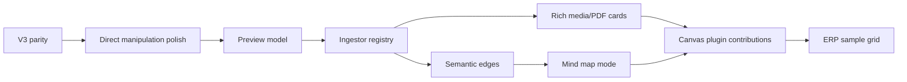

## References

### Local Code And Docs

- [0135 - Rewriting The Infinite Canvas From Scratch With LOD Tiles, Minimap, WebGL, Collaborative Scale](./0135_%5B_%5D_REWRITING_THE_INFINITE_CANVAS_FROM_SCRATCH_WITH_LOD_TILES_MINIMAP_WEBGL_COLLABORATIVE_SCALE.md)
- [0127 - xNet Filesystem Integration And Global File Namespace](./0127_%5B_%5D_XNET_FILESYSTEM_INTEGRATION_AND_GLOBAL_FILE_NAMESPACE.md)
- [0125 - AFFiNE As xNet UI Layer](./0125_%5B_%5D_AFFINE_AS_XNET_UI_LAYER.md)
- [`packages/canvas/src/types.ts`](../../packages/canvas/src/types.ts)
- [`packages/canvas/src/ingestion.ts`](../../packages/canvas/src/ingestion.ts)
- [`packages/canvas/src/hooks/useCanvasObjectIngestion.ts`](../../packages/canvas/src/hooks/useCanvasObjectIngestion.ts)
- [`packages/canvas/src/selection/scene-operations.ts`](../../packages/canvas/src/selection/scene-operations.ts)
- [`packages/canvas/src/renderer/CanvasV3.tsx`](../../packages/canvas/src/renderer/CanvasV3.tsx)
- [`packages/canvas/src/renderer/dom-island-pool.ts`](../../packages/canvas/src/renderer/dom-island-pool.ts)
- [`packages/canvas/src/scene/tile-doc-schema.ts`](../../packages/canvas/src/scene/tile-doc-schema.ts)
- [`packages/canvas/src/__tests__/canvas-node-component.test.tsx`](../../packages/canvas/src/__tests__/canvas-node-component.test.tsx)
- [`packages/canvas-core/src/provider.ts`](../../packages/canvas-core/src/provider.ts)
- [`packages/canvas-core/src/lod.ts`](../../packages/canvas-core/src/lod.ts)
- [`packages/canvas-core/src/connectors.ts`](../../packages/canvas-core/src/connectors.ts)
- [`packages/data/src/external-references.ts`](../../packages/data/src/external-references.ts)
- [`packages/data/src/schema/schemas/external-reference.ts`](../../packages/data/src/schema/schemas/external-reference.ts)
- [`packages/data/src/schema/schemas/media-asset.ts`](../../packages/data/src/schema/schemas/media-asset.ts)
- [`packages/editor/src/extensions/embed/EmbedExtension.ts`](../../packages/editor/src/extensions/embed/EmbedExtension.ts)
- [`packages/editor/src/extensions/file/FileExtension.ts`](../../packages/editor/src/extensions/file/FileExtension.ts)
- [`packages/editor/src/extensions/image/ImageExtension.ts`](../../packages/editor/src/extensions/image/ImageExtension.ts)
- [`packages/editor/src/components/CanvasExternalReferenceCard.tsx`](../../packages/editor/src/components/CanvasExternalReferenceCard.tsx)
- [`apps/electron/src/renderer/components/CanvasView.tsx`](../../apps/electron/src/renderer/components/CanvasView.tsx)
- [`apps/electron/src/renderer/components/CanvasInlinePageSurface.tsx`](../../apps/electron/src/renderer/components/CanvasInlinePageSurface.tsx)
- [`apps/electron/src/renderer/components/CanvasDatabasePreviewSurface.tsx`](../../apps/electron/src/renderer/components/CanvasDatabasePreviewSurface.tsx)
- [`packages/plugins/README.md`](../../packages/plugins/README.md)
- [`packages/plugins/src/types.ts`](../../packages/plugins/src/types.ts)
- [`packages/plugins/src/contributions.ts`](../../packages/plugins/src/contributions.ts)

### Web Research

- [Miro Developer Platform - Board items](https://developers.miro.com/docs/board-items)
- [Miro Developer Platform - App card](https://developers.miro.com/docs/app-card)
- [tldraw Docs - Embed shape](https://tldraw.dev/sdk-features/embed-shape)
- [JSON Canvas Spec 1.0](https://jsoncanvas.org/spec/1.0/)
- [oEmbed](https://oembed.com/)
- [Open Graph protocol](https://ogp.me/)
- [YouTube IFrame Player API](https://developers.google.com/youtube/iframe_api_reference)
- [Spotify for Developers - Embeds](https://developer.spotify.com/documentation/embeds)
- [MDN - iframe element](https://developer.mozilla.org/en-US/docs/Web/HTML/Reference/Elements/iframe)
- [MDN - File System API](https://developer.mozilla.org/en-US/docs/Web/API/File_System_API)
- [MDN - Origin private file system](https://developer.mozilla.org/en-US/docs/Web/API/File_System_API/Origin_private_file_system)
- [Mozilla PDF.js](https://github.com/mozilla/pdf.js/)
