# 0137 [_] Significantly Improve Pages User Interface

Created: 2026-05-28

## Problem Statement

Pages should feel like a fast, modern Markdown workspace: type Markdown, see formatted output immediately, keep syntax editable when it matters, embed databases and rich references inline, and use the same document comfortably inside the full page view and canvas cards.

The current implementation gets part of the way there, but its live preview model is too shallow. Structural Markdown tokens are converted into ProseMirror nodes and then re-created as non-editable visual chrome. That makes the UI look a little like Obsidian or Typora, but it breaks the interaction contract users expect from Markdown. A concrete example is heading syntax: typing `### ` creates an H3, but the `###` prefix is no longer text. When the cursor is at the start of the heading, Backspace cannot move through the three characters; the editor can only transform the heading node.

This exploration treats backwards compatibility with the current editor implementation as optional. It does not treat the broader xNet product model as optional: pages still need local-first collaboration, page embeds on canvas, database embeds, external media embeds, smart references, comments, task extraction, upload flows, and good performance at larger document sizes.

## Executive Summary

The current page editor problem is not just a missing Backspace handler. It is an architectural mismatch between a Markdown-source editing expectation and a rich-text-node rendering implementation.

The best path is a deliberate editor rewrite on top of the existing Tiptap/Yjs foundation, with a timeboxed Milkdown spike as the main alternative. Tiptap remains the most compatible choice for xNet because the repository already has Tiptap v3, Yjs collaboration, custom NodeViews, comments, uploads, database embeds, smart references, and canvas integration. But the current ad hoc live preview extensions should be replaced with a first-class Markdown editing contract and a block/embed registry.

Recommended direction:

1. Build `EditorSurface` and `RichTextEditorV2` behind a feature flag.
2. Keep Tiptap/Yjs as the collaboration and document runtime unless a short Milkdown spike proves a materially better Markdown-editing foundation.
3. Replace non-editable structural Markdown overlays with a `MarkdownStructuralEditing` layer that owns source-token reveal, caret semantics, Backspace/Delete behavior, paste normalization, import/export, and tests.
4. Add the official Tiptap Markdown extension for Markdown import/export and custom syntax specs, not as a complete live-preview solution.
5. Rework the page surface so the full page is easy to focus, the writing column is obvious, and blank areas focus the nearest logical insertion point.
6. Treat toolbars, slash commands, embeds, and canvas modes as product surfaces with explicit policies and tests rather than incidental editor children.
7. Validate with unit command tests, React interaction tests, Playwright desktop/mobile/canvas checks, two-client Yjs tests, and performance budgets.

## Current Codebase State

### Editor Stack

xNet currently uses Tiptap v3 and Yjs in `@xnetjs/editor`.

Relevant files:

- `packages/editor/src/components/RichTextEditor.tsx`
- `packages/editor/src/extensions.ts`
- `packages/editor/src/extensions/live-preview/index.ts`
- `packages/editor/src/extensions/live-preview/inline-marks.ts`
- `packages/editor/src/extensions/live-preview/link-preview.ts`
- `packages/editor/src/nodeviews/HeadingView.tsx`
- `packages/editor/src/nodeviews/CodeBlockView.tsx`
- `packages/editor/src/nodeviews/BlockquoteView.tsx`
- `packages/editor/src/components/FloatingToolbar.tsx`
- `apps/electron/src/renderer/components/PageView.tsx`
- `apps/electron/src/renderer/components/CanvasInlinePageSurface.tsx`

`RichTextEditor` is a collaborative Tiptap component backed by `ydoc.getXmlFragment(field)`. It configures `StarterKit` with default heading, code block, and blockquote disabled, then installs custom NodeViews for those structures.

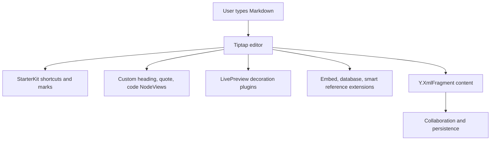

### Heading Syntax Is Not Text

The heading extension converts typed prefixes into a heading node:

- `packages/editor/src/extensions.ts` defines `HeadingWithSyntax`.
- Its input rule matches `^(#{level})\s$`.
- It sets heading `attrs.level`.
- It renders through `HeadingView`.

`HeadingView` then shows the prefix in a separate `span`:

```tsx
<span className="heading-syntax ..." contentEditable={false} aria-hidden="true">
  {prefix}
</span>
```

The visual token is also `select-none` and `pointer-events-none`. That explains the observed bug: `#` characters are not characters in the document. They are a non-editable visual representation of a heading attribute.

Current Backspace behavior only fires in a narrow case:

- The editor must be inside a heading.
- The cursor must be at offset `0`.
- The heading must be empty.
- H2-H6 demote by one level.
- H1 becomes a paragraph.

That means a non-empty `### Heading` cannot be edited as `## Heading` by backspacing through one prefix character, and the caret cannot meaningfully live inside the Markdown prefix.

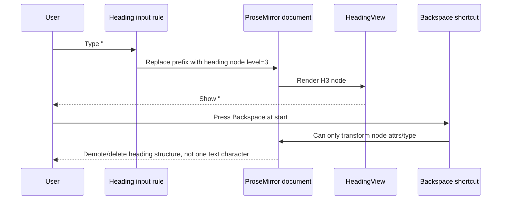

### Inline Markdown Syntax Uses Widget Decorations

Inline live preview is implemented in `packages/editor/src/extensions/live-preview/inline-marks.ts`.

The extension computes decorations on selection/doc changes and inserts widget decorations for opening and closing mark syntax. This is reasonable for visual hints, but widget decorations are not part of the document either. ProseMirror explicitly frames decorations as a way to affect drawing without changing the document. This is useful, but it is not a substitute for an editable source model.

Current behavior:

- Bold, italic, strike, and code syntax can be shown around marked ranges.
- Syntax only appears for collapsed selections.
- Decorations are recomputed on selection or document changes.
- The syntax characters are synthetic DOM.

This is less visibly broken than heading prefixes, but it has the same underlying limitation: if a user expects `**` or backticks to behave like adjacent source characters, the current model cannot fully satisfy that.

### Page Surface Is Too Passive

`PageView` renders the document header, then a scrolling editor area:

```tsx
<div className="flex-1 overflow-auto px-6 py-4">
  <RichTextEditor placeholder="Start typing..." showToolbar={true} ... />
</div>
```

The editor itself has a first-empty-paragraph placeholder:

```css
.xnet-editor .ProseMirror.is-editor-empty > p.is-empty:first-child::before {
  content: attr(data-placeholder);
}
```

This makes the insertion point easy to miss when the editor is empty or short. The whole page is not treated as a document surface with click-to-focus behavior. The writing area exists, but it does not feel like a page.

### Toolbar Is Present But Fragile

The toolbar uses `BubbleMenu` from `@tiptap/react/menus` in `FloatingToolbar.tsx`. Desktop visibility is driven by derived selection shape, code block state, and task item state.

Current tests mostly verify that the toolbar is hidden when no selection exists and visible in a single Playwright selection scenario. They do not cover:

- Toolbar button commands actually mutating selected text.
- Toolbar visibility after editor focus changes.
- Toolbar behavior inside canvas page cards.
- Mobile toolbar command behavior.
- Link/comment/database/embed actions from toolbar.

`CanvasInlinePageSurface` explicitly passes `showToolbar={false}`, so pages embedded on canvas lose the main formatting affordance.

### Embeds Are A Good Foundation

The editor already has useful extension points:

- `EmbedExtension` auto-embeds pasted URLs and delegates provider parsing to `@xnetjs/data`.
- `DatabaseEmbedExtension` renders database views as draggable atom block nodes.
- `SmartReferenceExtension` creates compact inline structured references.
- `TaskViewEmbedExtension`, image/file uploads, callouts, toggles, Mermaid, comments, and task metadata already exist.

The data layer also includes an external reference embed policy:

- `packages/data/src/external-reference-embed-policy.ts`
- Known iframe origins for YouTube, Vimeo, Spotify, Twitter/X, Instagram, TikTok, Figma, CodeSandbox, and Loom.
- Sandbox and allow policies.

That means the rewrite should reuse provider policy and metadata work rather than invent a separate embed system.

### Canvas Constraints Are Real

Page and note surfaces are embedded into canvas via `CanvasInlinePageSurface`. Canvas interaction plumbing already distinguishes editor interactions from canvas drag/resize:

```ts
target.closest('[data-canvas-interactive="true"]')
target instanceof HTMLInputElement
target instanceof HTMLTextAreaElement
target.isContentEditable
```

The new editor cannot assume it always owns the viewport. It needs explicit surface modes:

- Full-page document editing.
- Canvas inline editing.
- Canvas compact/read preview.
- Popover or focused "open page" editing.

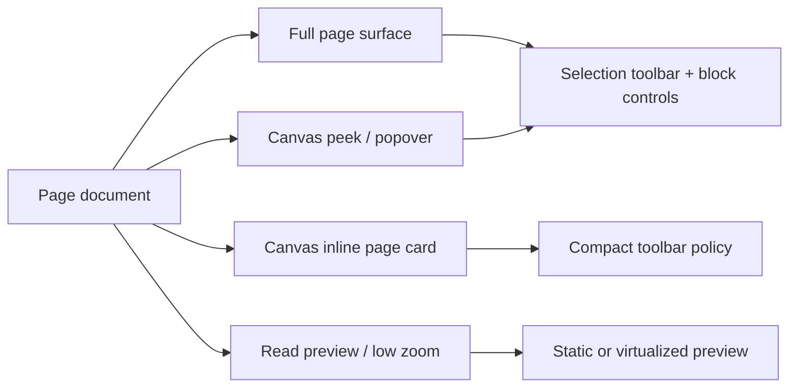

## External Research

### Obsidian

Obsidian exposes an important product distinction: editing mode and reading view are separate, and editing mode can be either Live Preview or Source mode. Its Live Preview mode shows formatted text inline while hiding most Markdown syntax, but when the cursor enters formatted content, underlying syntax becomes visible for editing. Its Source mode displays all Markdown syntax exactly as written.

Why it matters for xNet:

- Users understand the Obsidian contract as "Markdown is still my source."
- Hiding syntax is acceptable only when syntax returns at the cursor and remains editable.
- A Source mode fallback is valuable for edge cases, even if Live Preview is the default.
- Obsidian's own model suggests that perfect live preview is hard enough to justify a mode switch.

Useful references:

- [Obsidian views and editing mode](https://help.obsidian.md/edit-and-read)
- [Obsidian basic formatting syntax](https://help.obsidian.md/syntax)
- [Obsidian flavored Markdown](https://help.obsidian.md/obsidian-flavored-markdown)

### Typora

Typora's core promise is a single-pane Live Preview model. It renders inline styles after typing syntax and block styles while typing or after pressing Enter to move focus. It is not open source, but it is one of the clearest UX references for Markdown live preview.

Why it matters for xNet:

- The page should not feel like a two-pane Markdown previewer.
- Inline and block syntax can have different reveal timing.
- The writing surface should stay calm, with formatting behavior reinforcing the text rather than becoming a separate UI.

Useful references:

- [Typora Quick Start](https://support.typora.io/Quick-Start/)
- [Typora Markdown Reference](https://support.typora.io/Markdown-Reference/)

### Tiptap Markdown Extension

Tiptap now has an official Markdown extension in beta. It provides Markdown parsing, serialization, custom tokenizers, custom Markdown specs, and `editor.getMarkdown()` / `setContent(..., { contentType: 'markdown' })` support. The docs describe it as a bridge between Markdown text and Tiptap JSON, using MarkedJS underneath.

This is important, but it does not solve xNet's live editing issue by itself. It helps import/export and paste/serialization. It does not automatically make rendered heading prefixes editable source characters after an input rule has converted them into node attrs.

Why it matters for xNet:

- Use it for Markdown round trips and custom embed/database serialization.
- Use it as the source of truth for Markdown parsing behavior.
- Do not expect it to replace a source-token editing layer.

Useful references:

- [Tiptap Markdown introduction](https://tiptap.dev/docs/editor/markdown)
- [Tiptap Markdown basic usage](https://tiptap.dev/docs/editor/markdown/getting-started/basic-usage)
- [Tiptap custom Markdown serializing](https://tiptap.dev/docs/editor/markdown/advanced-usage/custom-serializing)
- [Tiptap input rules](https://tiptap.dev/docs/editor/api/input-rules)
- [Tiptap BubbleMenu](https://tiptap.dev/docs/editor/extensions/functionality/bubble-menu)
- [Tiptap React NodeViews](https://tiptap.dev/docs/editor/extensions/custom-extensions/node-views/react)

### Community Tiptap Markdown Packages

The community `tiptap-markdown` package predates the official extension and offers Markdown input/output, paste/copy transforms, and configurable options such as tight lists, linkify, and breaks.

Why it matters for xNet:

- It is worth reading for patterns and edge cases.
- The official Tiptap extension should probably be preferred now because xNet is already on Tiptap v3 and needs custom specs for embeds.
- Community code can still inform copy/paste behavior, list handling, and custom extension serialization.

Useful reference:

- [aguingand/tiptap-markdown](https://github.com/aguingand/tiptap-markdown)

### Milkdown

Milkdown is a plugin-driven WYSIWYG Markdown editor framework built on ProseMirror and remark. It is directly aimed at the class of problem xNet has: Markdown-first editing with rich visual behavior.

Why it matters for xNet:

- It may already solve more of the Markdown-source behavior than xNet's current Tiptap extension stack.
- It uses ProseMirror, so some mental model and Yjs integration ideas transfer.
- It is worth a spike because it is both open source and Markdown-first.

Risks:

- xNet has many custom Tiptap NodeViews and extension APIs.
- Page content already lives in a Yjs/ProseMirror-shaped world.
- Database embeds, smart references, comments, and canvas interaction would need either ports or adapter layers.
- It may reduce short-term control over the editor internals.

Useful references:

- [Milkdown GitHub](https://github.com/Milkdown/milkdown)
- [Milkdown core docs](https://milkdown.dev/core)

### BlockNote

BlockNote is a React block-based rich-text editor built on ProseMirror and Tiptap. It targets Notion/Google Docs/Coda-style UX and provides customizable blocks, menus, collaboration support, and ready-made UI.

Why it matters for xNet:

- Strong block UX ideas: block handles, slash menu, block schema, customizable menus.
- It may be a source of UI patterns even if xNet does not adopt it.
- Its block model aligns with page/canvas/database embedding better than pure Markdown text.

Risks:

- It is block-first, not Markdown-source-first.
- Adopting it wholesale could fight xNet's existing Tiptap extension and Yjs setup.
- It may make `#`-as-editable-source behavior less central than the user request requires.

Useful reference:

- [BlockNote introduction](https://www.blocknotejs.org/docs)

### BlockSuite / AFFiNE

BlockSuite organizes documents as block trees with block schemas, services, commands, and selection primitives. Its model is especially relevant because AFFiNE combines page and edgeless/canvas editing.

Why it matters for xNet:

- xNet also needs the same page to work in a document and canvas context.
- Block-level selection and service boundaries are worth borrowing conceptually.
- It validates the idea that editor surface modes should be explicit.

Risks:

- Prior xNet exploration already identified substantial data model mismatch.
- BlockSuite's default editable blocks and document hierarchy are a different system.
- A full adoption would likely compete with existing data, canvas, and sync architecture.

Useful reference:

- [BlockSuite working with block tree](https://blocksuite.io/guide/working-with-block-tree)

### Novel

Novel is a Notion-style Tiptap editor project. It is useful as a UI reference for menus, slash commands, and publishing-friendly editor chrome, but not a strong core dependency candidate. The project is not the best fit for a durable editor rewrite because xNet needs an actively owned, deeply integrated editor surface.

Useful reference:

- [Novel GitHub](https://github.com/steven-tey/novel)

### MarkText

MarkText is an MIT-licensed open-source Markdown editor with realtime preview, CommonMark/GFM support, and a clean single-pane experience.

Why it matters for xNet:

- It is a useful open-source competitor for live Markdown interactions.
- It reinforces the value of clean single-pane editing and command palette flows.
- It is less directly portable because it is a desktop Markdown editor rather than a React/Tiptap document surface.

Useful reference:

- [MarkText GitHub](https://github.com/marktext/marktext)

### Lexical Markdown

Lexical has `@lexical/markdown`, which supports import, export, shortcuts, and explicit transformer configuration for elements, text formats, and links.

Why it matters for xNet:

- The transformer model is a good design reference.
- It keeps Markdown behavior declarative and application-specific.
- Moving xNet to Lexical would be a major rewrite with uncertain gains over Tiptap/Yjs.

Useful reference:

- [Lexical Markdown package](https://github.com/facebook/lexical/tree/main/packages/lexical-markdown)

### Plate

Plate provides a Slate-based rich text framework with Markdown import/export, plugin input rules, autoformat, toolbars, block menus, drag/drop, Yjs collaboration, and many UI plugins.

Why it matters for xNet:

- Its plugin input rules are a useful comparison for typed Markdown shortcuts.
- It has a broad plugin catalog for command surfaces.
- The Slate foundation makes adoption a bigger departure than Milkdown or Tiptap.

Useful references:

- [Plate Markdown](https://platejs.org/docs/markdown)
- [Plate plugin input rules](https://platejs.org/docs/plugin-input-rules)

## Key Findings

### 1. The `#` Bug Comes From The Current Source Model

The current editor stores the semantic heading, not the heading source. That is normal for rich-text editors, but xNet's UX promise is closer to Markdown live preview. A non-editable overlay can only approximate that promise visually.

The fix should define a source-token interaction model:

- What does the user see when the caret is inside a formatted block?
- Can the caret move into the syntax?
- What does Backspace do at each source-token position?
- Does deleting one `#` transform H3 to H2?
- Does typing another `#` transform H2 to H3?
- What happens for lists, task items, blockquotes, code fences, callouts, wikilinks, and embeds?

Without that contract, each extension will keep inventing its own partial behavior.

### 2. Markdown Live Preview Needs A Mode Boundary

Obsidian keeps both Live Preview and Source mode because edge cases are real. xNet should do the same. Source mode can be a later milestone, but the architecture should leave space for it.

Recommended model:

- `live`: default, formatted, syntax revealed around the active block/selection.
- `source`: full Markdown source view for exact editing, debugging, and power users.
- `read`: non-editing rendering for canvas low-zoom, embeds, sharing, and previews.

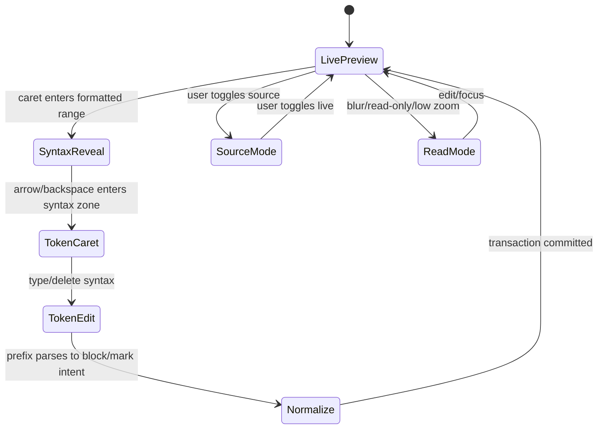

### 3. Tiptap Is Still The Lowest-Risk Core

The repository already has:

- Tiptap v3 dependencies.
- Yjs collaboration through `@tiptap/extension-collaboration`.
- Existing editor extension tests.
- React NodeViews for xNet-specific content.
- Page task extraction from ProseMirror docs.
- Comment anchoring against ProseMirror positions.
- Canvas interactive target handling for contenteditable surfaces.

Switching to Milkdown or BlockNote may improve some editor UX, but it would also require porting a lot of local product behavior. The pragmatic path is to rewrite the xNet editor architecture while staying on Tiptap, then use Milkdown as a benchmark and escape hatch.

### 4. The Toolbar Needs A Product Contract

The toolbar should be treated as a command surface, not just a BubbleMenu child.

It needs:

- Desktop selection toolbar.
- Mobile fixed toolbar.
- Canvas compact toolbar.
- Block toolbar/handle for block transforms and drag.
- Slash menu for insertion.
- Link/edit popover for links and references.
- Embed controls for database/media cards.

Each command surface should be controlled by a policy object based on surface mode, selection shape, block type, device, and read-only state.

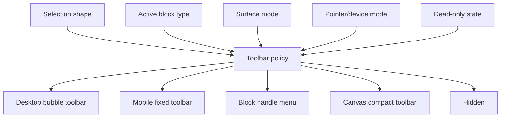

### 5. Page Layout Should Separate Focus Surface From Text Measure

The whole document area should be a friendly hit target, but text should still use a readable measure.

That means:

- The full scrolling page surface handles clicks.
- The inner writing column has a max width.
- Clicking below the final block focuses the editor at the end.
- Clicking left/right whitespace on a line focuses the nearest block.
- Empty pages show a visible first-line placeholder and optional first-block affordance.
- The title and body feel like one document, not two disconnected controls.

### 6. Embeds Need One Registry Across Pages And Canvas

xNet already has provider parsing and iframe policy in `@xnetjs/data`. The new editor should elevate that into an `EmbedRegistry` used by:

- Rich link previews.
- YouTube/Vimeo/Loom media embeds.
- Figma/CodeSandbox embeds.
- Database embeds.
- Page embeds.
- Canvas embeds.
- File/image embeds.
- Smart references.

This should also define how an embed behaves in each surface mode.

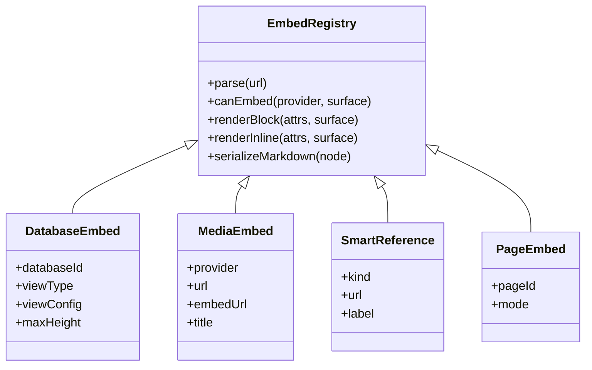

### 7. Performance Risks Are Mostly Predictable

The current editor already has benchmark helpers for generating large ProseMirror docs. A rewrite should add budgets before adding richer visuals.

Likely hot spots:

- Decoration recomputation on every selection/doc change.
- React NodeView count in long documents.
- Embedded database/card renders inside full page and canvas.
- Remote cursor decorations.
- Canvas cards rendering full editors at low zoom.
- Markdown import/export of large documents.

The solution is not one trick; it is a set of budgets and surface modes:

- Static preview at canvas low zoom.
- Lazy render heavy embeds.
- Memoize Markdown token decoration ranges.
- Avoid React NodeViews for plain structural blocks where CSS/decorations are enough.
- Profile typing latency in large docs.

## Options

### Option A: Patch The Current Editor

Patch `HeadingWithSyntax`, `HeadingView`, and Backspace behavior directly.

What it could include:

- On Backspace at the beginning of a non-empty heading, demote by one level.
- Add tests for H3 -> H2 -> H1 -> paragraph.
- Improve page hit target.
- Fix toolbar tests and BubbleMenu behavior.

Pros:

- Fastest path to address the most visible complaint.
- Minimal dependency change.
- Low migration risk.

Cons:

- Still not true editable Markdown syntax.
- Code block fences, blockquotes, lists, and inline marks keep their own partial behavior.
- The next edge case will need another one-off handler.
- Does not establish a strong foundation for source mode, paste/import/export, or embeds.

Verdict: Useful as a short emergency fix, not as the main strategy.

### Option B: Tiptap Rewrite With Markdown Editing Contract

Keep Tiptap/Yjs, but rebuild editor internals around explicit surface, block, command, and Markdown-token contracts.

What it includes:

- `EditorSurface` wrapper for page/canvas/read modes.
- `MarkdownStructuralEditing` extension.
- Tiptap Markdown extension for parse/serialize.
- Declarative block registry.
- Declarative embed registry.
- Toolbar policy engine.
- Comprehensive command and Playwright tests.

Pros:

- Reuses the local stack and product-specific code.
- Preserves Yjs, comments, task extraction, existing extension knowledge.
- Gives xNet full control over Markdown semantics.
- Easier to migrate incrementally behind a feature flag.

Cons:

- Requires serious editor engineering.
- Virtual source-token behavior is subtle.
- Some Markdown live preview edge cases may still be hard.

Verdict: Recommended default path.

### Option C: Adopt Milkdown For Pages

Prototype Milkdown as the page editor core, porting or wrapping xNet-specific embeds.

Pros:

- Markdown-first and open source.
- Built on ProseMirror and remark.
- May already encode many desired live-preview behaviors.
- Could reduce reinvention.

Cons:

- Requires migration of custom embeds, comments, uploads, task extraction, and canvas behavior.
- Unknown fit with xNet's existing Yjs document format.
- Might make database/canvas integration slower to regain.

Verdict: Worth a timeboxed spike before committing fully to the Tiptap rewrite.

### Option D: Adopt BlockNote

Use BlockNote as a block-first editor.

Pros:

- Strong out-of-the-box editor UI.
- Good block extensibility.
- Tiptap/ProseMirror lineage.
- Good inspiration for slash menus, block handles, and schemas.

Cons:

- Less aligned with "Markdown source that remains editable."
- Another block model to reconcile with xNet data/canvas.
- Could constrain custom UX.

Verdict: Better as a UX reference than as the main implementation.

### Option E: Adopt BlockSuite / AFFiNE-Like Model

Move to a document/canvas unified block tree.

Pros:

- Very aligned with page plus canvas ambitions.
- Explicit block selection, services, and command model.
- Strong precedent for switching between page and edgeless surfaces.

Cons:

- Large architectural replacement.
- Prior exploration already found data model mismatch.
- Markdown live preview is not the primary strength.

Verdict: Borrow concepts, do not adopt wholesale for this editor rewrite.

### Option F: CodeMirror Markdown-Source Editor

Use CodeMirror 6 as the primary Markdown source editor and add rich previews/embeds.

Pros:

- Best fit for "Markdown remains text."
- Obsidian uses a CodeMirror lineage.
- Source mode and syntax editing become natural.

Cons:

- Rich embeds, database views, comments, Yjs rich collaboration, and canvas interaction become harder.
- ProseMirror-based existing code becomes less reusable.
- WYSIWYG-like block interactions require decoration-heavy custom work.

Verdict: Consider only if Tiptap and Milkdown fail the source-token contract.

## Recommendation

Choose Option B as the main path: a Tiptap/Yjs editor rewrite with a real Markdown editing contract, plus a timeboxed Milkdown spike.

The strategic mistake would be to keep adding visual syntax widgets without defining how syntax is edited. The rewrite should treat Markdown tokens as a first-class interaction layer even if the canonical document remains ProseMirror/Yjs.

### Target Architecture

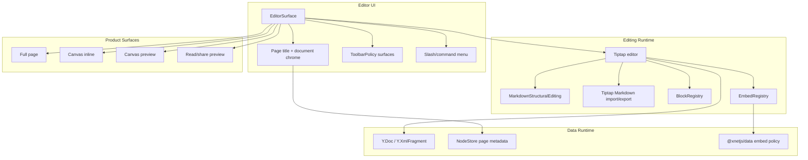

### Markdown Editing Contract

Define the contract as tests first.

For headings:

- Typing `# ` at the start of a paragraph creates H1.
- Typing `### ` creates H3.
- When the caret is at the start of an H3, the visible prefix is `### `.
- Pressing Backspace once changes H3 to H2 and the visible prefix to `## `.
- Pressing Backspace again changes H2 to H1.
- Pressing Backspace again changes H1 to a paragraph.
- Text content remains unchanged.
- Undo restores each prior state step.
- Remote peers receive semantic transactions, not transient DOM state.

For blockquotes:

- Typing `> ` creates a quote.
- At quote start, Backspace removes one quote level or exits quote.
- Nested quote behavior is explicit.

For lists and task lists:

- `- `, `1. `, and `- [ ] ` convert to list/task nodes.
- Backspace at item start first exposes/edits marker behavior, then lifts item, then exits list.
- Tab/Shift-Tab indent/outdent.

For code blocks:

- Triple backticks create a code block.
- The active code block can reveal editable fence/language syntax or a focused code-block header with source-mode fallback.
- Backspace/Enter behavior is predictable and tested.

For inline marks:

- `**bold**`, `_italic_`, `~~strike~~`, and backtick code parse consistently.
- Syntax reveal at boundaries should not trap the caret.
- Source mode can always edit exact delimiters.

For links and references:

- Markdown links and wikilinks have a stable edit popover.
- `[[page]]`, `@mention`, issue links, and external URLs route through a single reference registry.

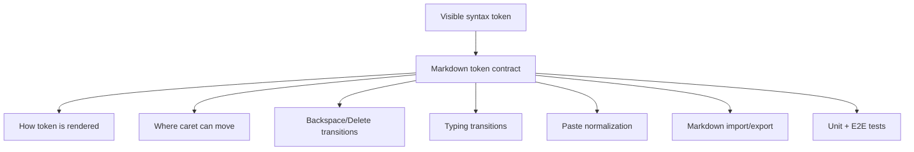

### Example Code: Markdown Structural Editing

Use pure, declarative syntax specs where possible. The extension should interpret selection and node state, then emit normal Tiptap commands.

```ts
import { Extension, type Editor } from '@tiptap/core'

type StructuralTokenIntent = { kind: 'handled' } | { kind: 'pass' }

type BlockSyntaxSpec = {
  nodeName: string
  renderPrefix: (attrs: Record<string, unknown>) => string
  canHandleBackspace: (input: {
    editor: Editor
    parentOffset: number
    textContent: string
    attrs: Record<string, unknown>
  }) => boolean
  backspace: (editor: Editor, attrs: Record<string, unknown>) => StructuralTokenIntent
}

const headingSyntaxSpec: BlockSyntaxSpec = {
  nodeName: 'heading',
  renderPrefix: (attrs) => '#'.repeat(Number(attrs.level ?? 1)) + ' ',
  canHandleBackspace: ({ parentOffset }) => parentOffset === 0,
  backspace: (editor, attrs) => {
    const level = Number(attrs.level ?? 1)

    if (level > 1) {
      editor.commands.setHeading({ level: (level - 1) as 1 | 2 | 3 | 4 | 5 | 6 })
      return { kind: 'handled' }
    }

    editor.commands.setParagraph()
    return { kind: 'handled' }
  }
}

const structuralSpecs = [headingSyntaxSpec] satisfies BlockSyntaxSpec[]

function runStructuralBackspace(editor: Editor): boolean {
  const { $from } = editor.state.selection
  const activeSpec = structuralSpecs.find((spec) => editor.isActive(spec.nodeName))

  if (!activeSpec) {
    return false
  }

  const handled = activeSpec.backspace(editor, $from.parent.attrs)
  return handled.kind === 'handled'
}

export const MarkdownStructuralEditing = Extension.create({
  name: 'markdownStructuralEditing',

  addKeyboardShortcuts() {
    return {
      Backspace: () => runStructuralBackspace(this.editor)
    }
  }
})
```

This example is intentionally small. The production version should track virtual token position, collapsed vs range selections, composition events, undo grouping, remote cursor rendering, and per-surface source reveal policy.

### Page Surface UX

The full page should feel more like a document than a component inside a scroll panel.

Recommended behavior:

- Large click target: the full white/neutral document band focuses the editor.
- Readable measure: text uses a comfortable max width, but the focus surface spans the available space.
- Visible document start: empty pages show a first-line placeholder and soft insertion rail.
- Title-body continuity: pressing Enter from title moves into body; Backspace from empty first body block can return to title.
- Last-block affordance: clicking below content focuses the end of the document.
- Block hover controls: subtle block handle for drag, transform, duplicate, delete.
- Better selection toolbar: show on selection, stay usable when clicking toolbar, hide predictably on blur.

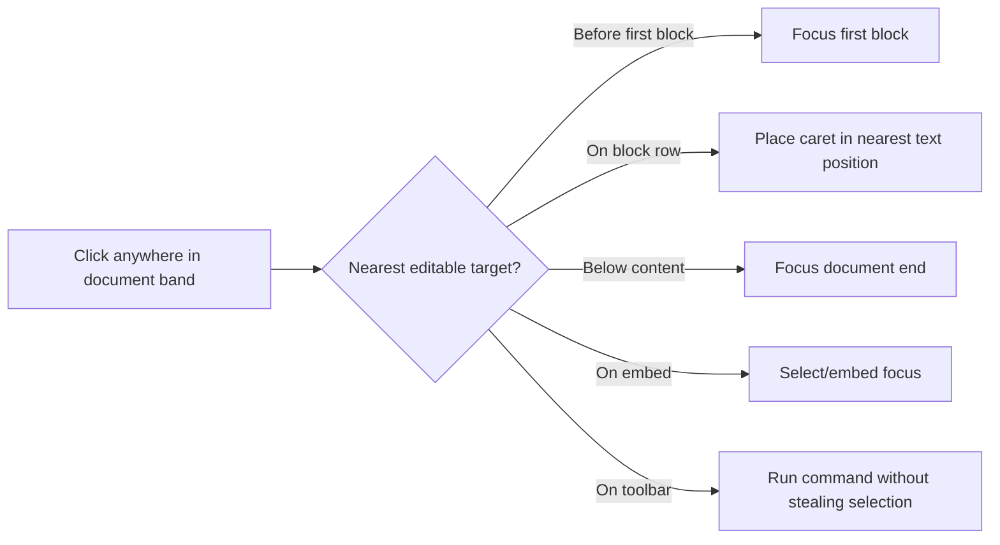

### Canvas Surface UX

Canvas page cards should not simply disable editing tools. They need a compact mode.

Recommended behavior:

- At low zoom: render a static preview or skeleton, not a full editor.
- At medium zoom: show title, excerpt, key embeds collapsed, and an "open" affordance.
- At high zoom/focus: allow inline editing with compact toolbar.
- Double-click opens focused page editor or expands into a peek panel.
- Database/media embeds in canvas cards default to compact previews.
- Canvas drag/resize handles remain isolated from text selection.

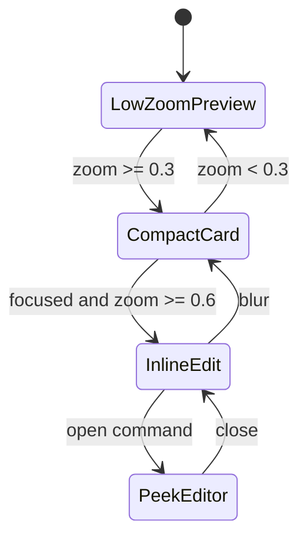

### Minimal Discoverability Requirements

The target experience should feel clean and quiet by default, but it cannot hide power so deeply that users need documentation. The page should read like a document until the user selects text, hovers an embed, opens `/`, or focuses a canvas page card. At those moments, the UI should teach itself with short labels, shortcut hints, popovers, and keyboard affordances.

Core requirements:

- Keep the editor surface visually minimal: generous page whitespace, no permanent formatting chrome, no nested card framing around the writing area.
- Prefer icon-only command buttons in toolbars, but every icon must have a stable accessible name, hover tooltip, and shortcut hint when a shortcut exists.
- Keep the aesthetic quiet and functional: restrained borders, neutral surfaces, compact controls, and contextual UI instead of persistent panels or instructional chrome.
- Show contextual hints only near the relevant action: selection toolbar for selected text, slash menu for insertion, embed popovers for embed options, canvas compact controls only during inline editing.
- Use compact popovers for multi-step actions such as link editing, database view selection, embed provider settings, and page/database references.
- Make hover and focus behavior symmetrical. Keyboard users should discover the same labels by tabbing through controls, pressing `/`, using Arrow keys, and dismissing with Escape.
- Keep command copy instructional but terse: verb first, one-line description, shortcut label, and no long explanatory panels inside the editor.
- Preserve text selection and caret position when users move from document text into toolbar or popover controls.
- In canvas mode, prioritize predictable editing boundaries: page card hover can reveal open/edit controls, but text selection and toolbar usage must never start a canvas drag.
- Treat keyboard shortcuts as first-class UI. The shortcut registry should drive toolbar tooltip labels, help popovers, and e2e expectations so hints do not drift from actual commands.
- Test the common learning loop: type Markdown, see live formatting, backspace through Markdown tokens, hover/inspect toolbar controls, open slash menu, read descriptions, choose a command, and recover with Escape.

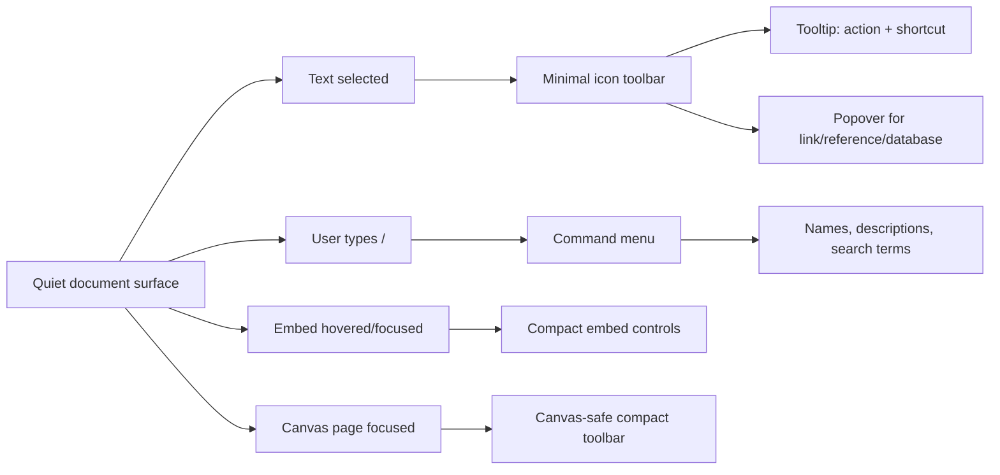

Validation criteria:

- Tooltip and popover labels fit in narrow editor/canvas contexts without occluding selected text.
- Tooltip content is available through hover and keyboard focus.
- Slash commands remain searchable by title, description, and common terms.
- Escape closes the current popover/menu without changing document content.
- The toolbar has no layout shift when labels or shortcut strings change.
- Browser screenshots cover the clean idle surface, selection toolbar, slash menu, and at least one embed/reference popover.
- Most-used learning flows have e2e coverage: Markdown heading editing, slash command insertion, link/reference popovers, and database embed insertion.

### Embed And Database Model

Embeds should be block registry entries with consistent lifecycle:

1. Parse user input or pasted URL.
2. Decide inline chip, rich link, or block embed.
3. Validate provider and iframe policy.
4. Insert a semantic node.
5. Render by surface mode.
6. Serialize to Markdown or xNet-flavored Markdown.
7. Provide edit/refresh/remove controls.

Database embeds should probably stay semantic nodes, but the product should decide whether they remain ProseMirror `atom` nodes. Atom nodes are simpler to select/drag, but they limit nested editing. A useful compromise:

- Keep database embed as an atom from the editor text-flow perspective.
- Make its internal view an isolated interactive island.
- Add explicit keyboard navigation into/out of the island.
- Add surface-specific renderers: full, compact, read-only, canvas preview.

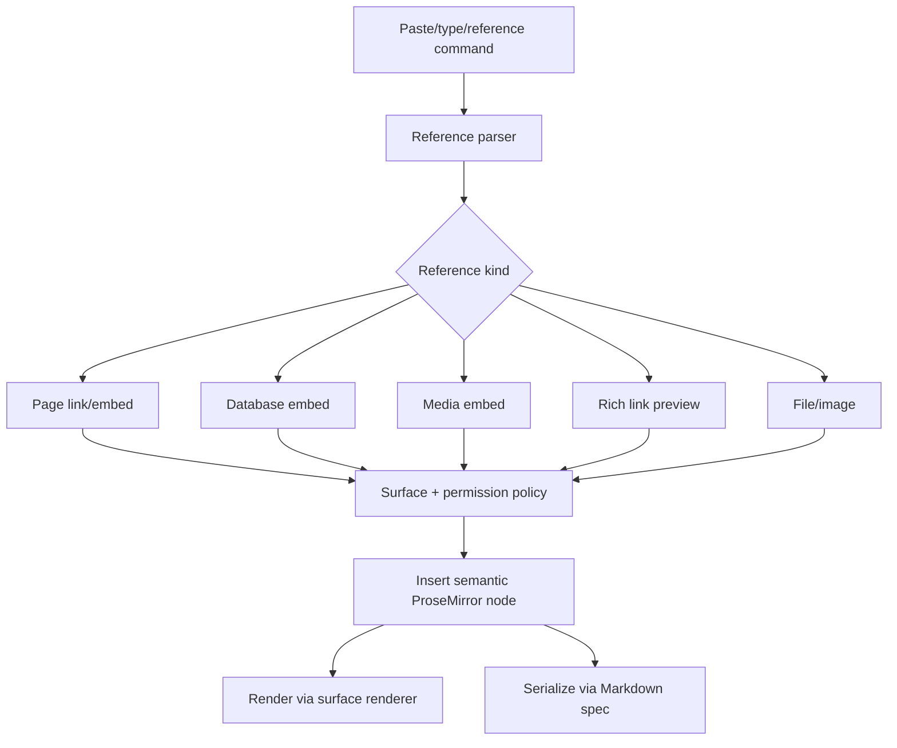

## Implementation Checklist

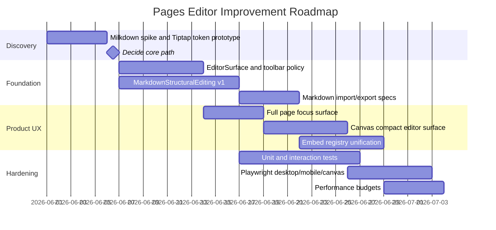

### Phase 0: Decision Spike

- [x] Create a prototype branch for `RichTextEditorV2`.
- [x] Add official `@tiptap/markdown` in a spike workspace or package branch.
- [x] Prototype heading token Backspace behavior in Tiptap with tests.
- [ ] Prototype equivalent heading/list/code behavior in Milkdown.
- [ ] Port one simple xNet embed into Milkdown or prove why it is too expensive.
- [x] Compare collaboration integration with existing Yjs content.
- [x] Decide whether to continue Tiptap rewrite or switch to Milkdown.

Decision gate:

- [x] Tiptap path wins if heading/list/source-token behavior is testable without DOM hacks that will break IME, selection, or collaboration.
- [ ] Milkdown path wins if it gives materially better Markdown editing with acceptable embed/Yjs integration cost.
- [ ] CodeMirror path is revisited only if both fail.

### Phase 1: EditorSurface And Command Surfaces

- [x] Introduce `EditorSurface` with `surfaceMode: 'page' | 'canvas-inline' | 'canvas-preview' | 'read'`.
- [x] Move page body layout responsibility out of raw `PageView` padding.
- [x] Add full-surface click-to-focus behavior.
- [x] Add readable writing column with responsive max width.
- [x] Add explicit first-block and end-of-document focus targets.
- [x] Create `ToolbarPolicy` as a pure function.
- [x] Restore desktop selection toolbar with command tests.
- [x] Add compact canvas toolbar instead of disabling toolbar entirely.
- [x] Use icon buttons and accessible labels for toolbar controls.
- [x] Add shortcut-aware tooltip/title hints to primary toolbar controls.
- [x] Add custom hover/focus tooltip popovers to primary toolbar controls.
- [ ] Add keyboard-discoverable popovers for link, reference, database, and embed controls.
  - [x] Add keyboard-discoverable toolbar popover for link editing.
  - [x] Add keyboard-discoverable toolbar popover for page references.
  - [ ] Add keyboard-discoverable toolbar popover for database references.
  - [x] Add keyboard-discoverable toolbar popover for database embeds.
  - [x] Add keyboard-discoverable toolbar popover for rich media embeds.

### Phase 2: Markdown Structural Editing

- [x] Define `MarkdownTokenContract` docs and test matrix.
- [x] Implement heading source-token behavior.
- [x] Implement blockquote source-token behavior.
- [x] Implement list and task-list marker behavior.
- [x] Implement code fence active-block behavior.
- [x] Define inline mark reveal and boundary behavior.
- [x] Add undo/redo grouping tests.
- [x] Add IME/composition tests for no forced normalization mid-composition.
- [x] Add copy/paste Markdown normalization tests.
- [x] Add source mode placeholder route or internal abstraction.

### Phase 3: Markdown Import/Export

- [x] Add official Tiptap Markdown extension.
- [x] Configure GFM behavior.
- [x] Add custom Markdown specs for database embeds.
- [x] Add custom Markdown specs for rich media embeds.
- [x] Add custom Markdown specs for smart references and page links.
- [x] Add round-trip tests from Markdown -> ProseMirror -> Markdown.
- [x] Add fallback xNet-flavored blocks for data that cannot be represented in plain CommonMark.
- [x] Preserve user-authored Markdown where possible when serializing.

### Phase 4: Embeds And References

- [x] Create shared `EmbedRegistry` facade over `@xnetjs/data` providers and policies.
- [x] Unify editor and canvas embed policy usage.
- [x] Define inline, block, compact, and read-only renderers per provider.
- [x] Add rich link preview card for generic URLs.
- [x] Add page embed block.
- [x] Improve database embed keyboard and selection behavior.
- [x] Add YouTube/Vimeo/Loom/Figma/CodeSandbox Playwright smoke checks.
- [x] Add blocked-origin and blocked-provider tests.

### Phase 5: Canvas Integration

- [x] Add low-zoom static preview for page nodes.
- [x] Add high-zoom inline editing with compact toolbar.
- [x] Add open-in-page and open-in-peek flows.
- [x] Verify canvas drag/resize does not steal editor selection.
- [x] Verify editor selection does not move canvas nodes.
- [x] Add performance budget for many page cards on one canvas.
- [x] Add screenshot checks at multiple zoom levels.

### Phase 6: Hardening And Rollout

- [x] Keep the old editor behind a kill switch during rollout.
- [ ] Add one-way migration or compatibility loader if document schema changes.
- [x] Add crash-safe fallback rendering for unknown nodes.
- [x] Run full `pnpm --filter @xnetjs/editor test`.
- [ ] Run relevant Electron Playwright checks with auth bypass.
- [x] Run performance benchmarks before enabling by default.
- [ ] Enable for new pages first.
- [ ] Enable for all pages after validation.
- [ ] Remove old live-preview overlays after confidence window.

### Implementation Validation Notes

2026-05-31 canvas/editor checkpoint:

- Focused tests passed:
  - `pnpm --filter @xnetjs/editor exec vitest run src/components/FloatingToolbar.test.tsx src/components/editor-ux-state.test.ts`
  - `pnpm --filter @xnetjs/canvas exec vitest run src/__tests__/canvas-v3.test.tsx`
- Storybook browser smoke screenshots were captured for the editor and canvas zoom states:
  - `tmp/playwright/pages-editor-storybook-smoke.png`
  - `tmp/playwright/canvas-zoom-default.png`
  - `tmp/playwright/canvas-zoom-fit.png`
  - `tmp/playwright/canvas-zoom-in.png`
- Canvas-inline toolbar containers now opt into `data-canvas-interactive="true"`, so toolbar pointer gestures are explicitly ignored by canvas drag handlers.
- Canvas V3 tests now preserve a text selection inside a `data-canvas-editing-surface="true"` embedded editor area while canvas pointer movement is ignored.

2026-05-31 `EditorSurface` checkpoint:

- Added `EditorSurface` as the shared wrapper for page, canvas-inline, canvas-preview, and read editor surfaces.
- Routed Electron `PageView` and `CanvasInlinePageSurface` through the shared wrapper so layout and surface policy are not duplicated in host components.
- Focused tests passed:
  - `pnpm --filter @xnetjs/editor exec vitest run src/components/EditorSurface.test.tsx src/components/RichTextEditor.test.tsx src/components/FloatingToolbar.test.tsx`
  - `pnpm --filter @xnetjs/editor typecheck`
  - `pnpm --filter xnet-desktop exec tsc --noEmit`

2026-05-31 toolbar regression checkpoint:

- Added desktop toolbar tests for mark command routing and focus-preserving button mouse down.
- Focused test passed:
  - `pnpm --filter @xnetjs/editor exec vitest run src/components/FloatingToolbar.test.tsx`

2026-05-31 browser smoke checkpoint:

- Re-ran the Storybook editor feature workbench in the in-app browser after introducing `EditorSurface`.
- Verified the story rendered three ProseMirror editor roots and three rich-link/card surfaces with no browser console errors.
- Captured a fallback Playwright CLI screenshot after the in-app screenshot command timed out:
  - `tmp/playwright/editor-surface-smoke-after-wrapper.png`

2026-05-31 page title handoff checkpoint:

- Pressing plain Enter in `DocumentHeader` now calls `onTitleSubmit`; `PageView` uses that to focus the first editor block.
- Title inputs now expose an explicit `${docType} title` accessible label.
- Focused tests passed:
  - `pnpm --filter xnet-desktop exec vitest run src/renderer/components/DocumentHeader.test.tsx src/renderer/components/page-editor-focus.test.ts`
  - `pnpm --filter xnet-desktop exec tsc --noEmit`

2026-05-31 editor accessibility checkpoint:

- `RichTextEditor` now exposes a named rich-text body and named Markdown source textarea.
- `EditorSurface` supplies surface-specific default labels such as `Page body` and `Canvas page body`.
- Floating toolbars now render as named `toolbar` regions for page and canvas-inline contexts.
- Focused tests passed:
  - `pnpm --filter @xnetjs/editor exec vitest run src/components/RichTextEditor.test.tsx src/components/FloatingToolbar.test.tsx src/components/EditorSurface.test.tsx`
  - `pnpm --filter @xnetjs/editor typecheck`

2026-05-31 editor fallback checkpoint:

- `EditorSurface` now wraps the rich editor in a crash-safe boundary and renders a controlled alert fallback when content rendering fails because part of the document is unsupported.
- Focused tests passed:
  - `pnpm --filter @xnetjs/editor exec vitest run src/components/EditorSurface.test.tsx`
  - `pnpm --filter @xnetjs/editor typecheck`

2026-05-31 toolbar command checkpoint:

- The floating toolbar now includes an explicit Link command and reuses focused editor command chains for mark, link, and comment actions.
- Desktop and canvas-inline toolbar policy now hides command surfaces after a valid editor blur instead of keeping the old range selection visible.
- Focused tests passed:
  - `pnpm --filter @xnetjs/editor exec vitest run src/components/FloatingToolbar.test.tsx src/components/editor-ux-state.test.ts`
  - `pnpm --filter @xnetjs/editor typecheck`

2026-05-31 link popover checkpoint:

- Replaced the toolbar Link `window.prompt` flow with a compact contextual popover that keeps the BubbleMenu visible while the URL input owns focus.
- The link popover supports URL apply, link removal, and Escape dismissal without mutating selected content.
- Focused tests passed:
  - `pnpm --filter @xnetjs/editor exec vitest run src/components/FloatingToolbar.test.tsx`
  - `pnpm --filter @xnetjs/editor typecheck`
  - `PLAYWRIGHT_TEST_BASE_URL=http://localhost:5173 pnpm --filter @xnetjs/e2e-tests exec playwright test src/editor-markdown.spec.ts src/editor-ux.spec.ts --project=chromium`
- In-app browser Storybook smoke loaded `core-editor-richtexteditor--playground`, found three ProseMirror editor roots, and reported no browser warnings or errors.

2026-05-31 reference popover checkpoint:

- Added a toolbar Reference popover that pre-fills from the current selection and inserts a real wikilink mark through the editor schema.
- The reference popover closes on Escape without mutating content and keeps the desktop toolbar visible while its input owns focus.
- Focused tests passed:
  - `pnpm --filter @xnetjs/editor exec vitest run src/components/FloatingToolbar.test.tsx`
  - `pnpm --filter @xnetjs/editor typecheck`
  - `PLAYWRIGHT_TEST_BASE_URL=http://localhost:5173 pnpm --filter @xnetjs/e2e-tests exec playwright test src/editor-markdown.spec.ts src/editor-ux.spec.ts --project=chromium`
- In-app browser Storybook smoke loaded `core-editor-richtexteditor--playground`, found three ProseMirror editor roots, and reported no browser warnings or errors.

2026-05-31 database toolbar popover checkpoint:

- Added a toolbar Database popover for inserting database embed blocks with an explicit view mode.
- The database popover validates empty IDs, closes on Escape without mutating content, keeps the selection toolbar visible while focused, and can use the configured `databaseEmbed.onSelectDatabase` picker when available.
- Focused tests passed:
  - `pnpm --filter @xnetjs/editor exec vitest run src/components/FloatingToolbar.test.tsx`
  - `pnpm --filter @xnetjs/editor typecheck`
  - `PLAYWRIGHT_TEST_BASE_URL=http://localhost:5173 pnpm --filter @xnetjs/e2e-tests exec playwright test src/editor-markdown.spec.ts --project=chromium`
- In-app browser Storybook smoke loaded `core-editor-richtexteditor--playground`, found three ProseMirror editor roots, and reported no browser warnings or errors.

2026-05-31 media toolbar popover checkpoint:

- Added a toolbar Media popover for inserting supported rich media embeds from URL without relying on paste-only behavior.
- The media popover validates empty and unsupported URLs, closes on Escape without mutating content, and keeps the selection toolbar visible while focused.
- Focused tests passed:
  - `pnpm --filter @xnetjs/editor exec vitest run src/components/FloatingToolbar.test.tsx`
  - `pnpm --filter @xnetjs/editor typecheck`
  - `PLAYWRIGHT_TEST_BASE_URL=http://localhost:5173 pnpm --filter @xnetjs/e2e-tests exec playwright test src/editor-markdown.spec.ts --project=chromium`
- In-app browser Storybook smoke loaded `core-editor-richtexteditor--playground`, found three ProseMirror editor roots, three mounted media iframes, and reported no browser warnings or errors.

2026-05-31 slash Escape checkpoint:

- Added e2e coverage for closing the slash command menu with Escape without selecting or running a block command.
- Focused test passed:
  - `PLAYWRIGHT_TEST_BASE_URL=http://localhost:5173 pnpm --filter @xnetjs/e2e-tests exec playwright test src/editor-markdown.spec.ts --project=chromium`

2026-05-31 link shortcut popover checkpoint:

- Replaced the `Mod-K` shortcut prompt path with a scoped toolbar-popover event so keyboard users get the same compact Link popover as pointer users.
- The shortcut event targets the matching editor instance, so canvas/page editors do not open each other's toolbar popovers.
- Focused tests passed:
  - `pnpm --filter @xnetjs/editor exec vitest run src/extensions/keyboard-shortcuts/shortcuts.test.ts src/components/FloatingToolbar.test.tsx`
  - `pnpm --filter @xnetjs/editor typecheck`
  - `PLAYWRIGHT_TEST_BASE_URL=http://localhost:5173 pnpm --filter @xnetjs/e2e-tests exec playwright test src/editor-markdown.spec.ts --project=chromium`

2026-05-31 page body/title Backspace checkpoint:

- `RichTextEditor` now exposes an `onBackspaceAtStart` host callback and only invokes it for plain Backspace at an empty first text block.
- Electron `PageView` uses that callback to move focus from an empty first body block back to the page title, with the title caret placed at the end.
- Focused tests passed:
  - `pnpm --filter @xnetjs/editor exec vitest run src/components/RichTextEditor.test.tsx`
  - `pnpm --filter @xnetjs/editor typecheck`
  - `pnpm --filter xnet-desktop exec vitest run src/renderer/components/DocumentHeader.test.tsx src/renderer/components/page-editor-focus.test.ts`
  - `pnpm --filter xnet-desktop exec tsc --noEmit`

2026-05-31 browser smoke checkpoint:

- Re-ran the Storybook editor feature workbench in the in-app browser after the toolbar and Backspace changes.
- Verified the story rendered three ProseMirror editor roots and three rich-link/card surfaces with no browser console errors.
- Captured a Playwright CLI fallback screenshot after the in-app screenshot command timed out:
  - `tmp/playwright/editor-smoke-after-backspace-toolbar.png`

2026-05-31 slash command checkpoint:

- Slash command handler tests now execute the code block, media embed, callout, toggle, task view, and database commands instead of only asserting that labels exist.
- The database command is covered through the async `onSelectDatabase` path and verifies that the selected database ID becomes a `setDatabaseEmbed` command.
- Focused tests passed:
  - `pnpm --filter @xnetjs/editor exec vitest run src/extensions/slash-command/items.test.ts`
  - `pnpm --filter @xnetjs/editor typecheck`

2026-05-31 media paste checkpoint:

- `EmbedExtension` now has explicit regression coverage for pasting a YouTube URL through the auto-embed paste plugin.
- The test verifies paste prevention and inserted embed attributes including provider, embed ID, and embed URL.
- Focused tests passed:
  - `pnpm --filter @xnetjs/editor exec vitest run src/extensions/embed/EmbedExtension.test.ts`
  - `pnpm --filter @xnetjs/editor typecheck`

2026-05-31 embed policy checkpoint:

- Document media embeds now use the shared embed registry policy before rendering a live iframe.
- Figma, CodeSandbox, and Loom node-view tests assert sandbox, allow, referrer policy, and lazy-loading attributes.
- Spoofed provider hosts now render a non-live `Embed unavailable` placeholder instead of an iframe.
- Empty embed controls now expose named URL and action controls for assistive tech.
- Focused tests passed:
  - `pnpm --filter @xnetjs/editor exec vitest run src/extensions/embed/EmbedNodeView.test.tsx`
  - `pnpm --filter @xnetjs/editor typecheck`

2026-05-31 database embed mode checkpoint:

- Database embed node-view tests now verify table, board, list, calendar, gallery, and timeline picker options.
- Picker icon glyphs are hidden from accessible names so mode controls are announced by label.
- The host `renderView` callback is covered with selected `viewType` and `viewConfig` forwarding.
- Focused tests passed:
  - `pnpm --filter @xnetjs/editor exec vitest run src/extensions/database-embed/DatabaseEmbedNodeView.test.tsx`
  - `pnpm --filter @xnetjs/editor typecheck`

2026-05-31 embed policy browser smoke checkpoint:

- Re-ran the Storybook editor feature workbench in the in-app browser after the embed policy and database mode changes.
- Verified three editor roots, eighteen live media iframes, eighteen database mode controls, and zero browser console errors.
- The live iframe sample included YouTube, Vimeo, Spotify, Figma, CodeSandbox, and Loom with provider-specific sandbox, allow, referrer policy, and lazy loading attributes.
- Captured a Playwright CLI fallback screenshot after the in-app screenshot command timed out:
  - `tmp/playwright/editor-embed-policy-smoke.png`

2026-05-31 page reference checkpoint:

- Wikilink clicks now route through the editor `onNavigate` callback before the generic link click handler can open a browser URL.
- Page embeds are covered through slash command insertion, `![[Page]]` input-rule insertion, open button navigation, and double-click navigation.
- Focused tests passed:
  - `pnpm --filter @xnetjs/editor exec vitest run src/extensions.test.ts src/extensions/page-embed/PageEmbedExtension.test.ts src/extensions/page-embed/PageEmbedNodeView.test.tsx src/extensions/slash-command/items.test.ts`
  - `pnpm --filter @xnetjs/editor typecheck`

2026-05-31 smart reference checkpoint:

- Smart references now expose an `updateSmartReference` command for selected-chip display metadata edits.
- HTML rendering is covered as a single compact inline chip with provider/kind/ref ID data attributes and no iframe output.
- Focused tests passed:
  - `pnpm --filter @xnetjs/editor exec vitest run src/extensions/smart-reference/SmartReferenceExtension.test.ts`
  - `pnpm --filter @xnetjs/editor typecheck`

2026-05-31 structured task extraction checkpoint:

- `RichTextEditor` now has component-level regression coverage for publishing normalized page task snapshots from structured ProseMirror task-list docs.
- The coverage exercises nested task parentage, stable generated task/block IDs, assignees, due dates, smart references, and sort keys through the public `onPageTasksChange` callback.
- Focused tests passed:
  - `pnpm --filter @xnetjs/editor exec vitest run src/components/RichTextEditor.test.tsx`
  - `pnpm --filter @xnetjs/editor typecheck`

2026-05-31 lazy media embed checkpoint:

- Media embed node views now defer iframe creation with `IntersectionObserver` and a 600px preload margin instead of mounting every live provider iframe at document render time.
- Embeds still fall back to immediate iframe mounting where `IntersectionObserver` is unavailable, and selected embeds mount immediately for direct interaction.
- Focused tests passed:
  - `pnpm --filter @xnetjs/editor exec vitest run src/extensions/embed/EmbedNodeView.test.tsx`
  - `pnpm --filter @xnetjs/editor typecheck`
- In-app browser Storybook smoke verified 18 lazy media embed nodes, 3 mounted visible iframes after scroll, and 15 still-deferred placeholders.

2026-05-31 large Markdown performance checkpoint:

- Added a deterministic `generateLargeMarkdownDocument` helper for import/export performance coverage.
- Added a 1,000-block Markdown integration budget test covering Tiptap Markdown import and export with xNet-flavored embed fallback blocks.
- Focused tests passed:
  - `pnpm --filter @xnetjs/editor exec vitest run src/testing/benchmarks.test.ts src/extensions/markdown-io.test.ts`
  - `pnpm --filter @xnetjs/editor typecheck`

2026-05-31 typing latency checkpoint:

- Added a 1,000-block document typing budget regression around the Markdown structural editing path.
- The test inserts one character at the end of a mixed large document and enforces a 250ms command budget outside fixture construction.
- Focused tests passed:
  - `pnpm --filter @xnetjs/editor exec vitest run src/extensions/markdown-structural-editing.test.ts`
  - `pnpm --filter @xnetjs/editor typecheck`

2026-05-31 selection decoration checkpoint:

- Added a 1,000-block live-preview regression proving collapsed selection moves inside inline marks do not call `doc.descendants()`.
- The inline syntax widgets remain deterministic while decoration recomputation stays scoped to the current marked block.
- Focused tests passed:
  - `pnpm --filter @xnetjs/editor exec vitest run src/extensions/live-preview/inline-marks.integration.test.ts`
  - `pnpm --filter @xnetjs/editor typecheck`

2026-05-31 initial mount checkpoint:

- Added a `RichTextEditor` mount-to-ready budget test for a persisted 120-block Yjs page.
- The test seeds a Yjs document, reloads it through a fresh editor instance, and enforces a 3s ready budget for typical page content.
- Focused tests passed:
  - `pnpm --filter @xnetjs/editor exec vitest run src/components/RichTextEditor.test.tsx`
  - `pnpm --filter @xnetjs/editor typecheck`

2026-05-31 collaboration checkpoint:

- Added multi-client Yjs regressions for concurrent heading edits, local collaboration undo/redo, remote cursor rendering around revealed heading syntax, and comment anchors through Markdown structural transforms.
- The remote cursor coverage publishes a real awareness update with Yjs relative positions and verifies Tiptap cursor decorations inside a focused heading node view.
- Focused tests passed:
  - `pnpm --filter @xnetjs/editor exec vitest run src/components/RichTextEditor.test.tsx`

2026-05-31 rollout validation checkpoint:

- The Tiptap path is now the implementation path: official `@tiptap/markdown` is integrated, xNet embed Markdown specs round-trip, and Yjs collaboration/undo/cursor behavior has focused coverage.
- Performance validation passed across benchmark helper, Markdown import/export, Markdown structural typing, live-preview decoration scoping, and component mount/collaboration coverage:
  - `pnpm --filter @xnetjs/editor exec vitest run src/testing/benchmarks.test.ts src/extensions/markdown-io.test.ts src/extensions/markdown-structural-editing.test.ts src/extensions/live-preview/inline-marks.integration.test.ts src/components/RichTextEditor.test.tsx`
- In-app browser Storybook smoke passed against `core-editor-richtexteditor--playground`: 3 editors rendered, first editor was editable, heading syntax was visible, 18 lazy media embeds were present, 3 iframes were mounted, and 15 below-fold placeholders remained deferred.

2026-05-31 rollout kill-switch checkpoint:

- `EditorSurface` now has a shared rollout fallback switch via `localStorage.setItem('xnet:pages:editor:rollout-mode', 'source')` or `'read'`.
- The switch applies only to editable page and canvas-inline surfaces; read and canvas-preview surfaces remain read-only regardless of the stored value.
- Focused tests passed:
  - `pnpm --filter @xnetjs/editor exec vitest run src/components/EditorSurface.test.tsx src/components/editor-ux-state.test.ts`
  - `pnpm --filter @xnetjs/editor typecheck`

2026-05-31 minimalist discoverability checkpoint:

- Primary floating toolbar buttons now keep short accessible names while exposing shortcut-aware `title` and `data-shortcut` hints from the shared keyboard shortcut registry.
- Toolbar buttons now use the shared `@xnetjs/ui` Tooltip primitive so shortcut hints are visible on hover/focus rather than relying only on browser-native title chrome.
- The desktop BubbleMenu now stays registered on editable desktop/page surfaces and lets its `shouldShow` policy hide or reveal the toolbar, which fixes selection paths where the toolbar plugin previously missed browser selection changes.
- Added Playwright e2e coverage for the common learning loop: type `###`, backspace through heading markers one level at a time, search `/task`, read the slash command description, insert a task list, and verify toolbar shortcut hints.
- In-app browser Storybook smoke against `core-editor-richtexteditor--playground` loaded successfully with zero console errors after these changes.
- Focused tests passed:
  - `pnpm --filter @xnetjs/editor exec vitest run src/components/FloatingToolbar.test.tsx`
  - `PLAYWRIGHT_TEST_BASE_URL=http://localhost:5173 pnpm --filter @xnetjs/e2e-tests exec playwright test src/editor-markdown.spec.ts src/editor-ux.spec.ts --project=chromium`

## Validation Checklist

### Markdown Behavior

- [x] `# ` creates H1.
- [x] `## ` creates H2.
- [x] `### ` creates H3.
- [x] Backspace at H3 prefix changes to H2 without deleting content.
- [x] Backspace at H2 prefix changes to H1 without deleting content.
- [x] Backspace at H1 prefix changes to paragraph without deleting content.
- [x] Undo restores each heading level step.
- [x] `> ` creates blockquote and Backspace exits predictably.
- [x] `- ` creates bullet list and Backspace/lift behavior is predictable.
- [x] `1. ` creates ordered list and numbering survives edits.
- [x] `- [ ] ` creates task item and checkbox remains keyboard accessible.
- [x] Triple backticks create code block.
- [x] Code fences and language syntax have a tested edit path.
- [x] Inline bold/italic/strike/code syntax reveals without trapping caret.
- [x] Pasted Markdown becomes expected structured content.
- [x] Copied structured content can be copied as Markdown.

### Toolbar And Commands

- [x] Desktop toolbar appears on range selection.
- [x] Toolbar remains usable when clicking buttons.
- [x] Bold, italic, strike, code, link, comment commands mutate content correctly.
- [x] Toolbar hides on valid blur.
- [x] Mobile toolbar appears when editor is focused.
- [x] Canvas compact toolbar appears only in focused inline edit mode.
- [x] Toolbar icon buttons expose shortcut-aware title hints without lengthening accessible names.
- [x] Toolbar shortcut hints render as visible hover/focus tooltips through the design-system tooltip primitive.
- [x] Desktop BubbleMenu remains registered so selection-driven toolbar display works in the app shell.
- [x] Link toolbar popover applies, removes, and dismisses links without `window.prompt`.
- [x] Link toolbar popover keeps the selection toolbar visible while URL input owns focus.
- [x] Link keyboard shortcut opens the same toolbar popover without `window.prompt`.
- [x] Reference toolbar popover inserts page wikilinks from selected text.
- [x] Reference toolbar popover keeps the selection toolbar visible while input owns focus.
- [x] Database toolbar popover inserts database embeds with a selected view.
- [x] Database toolbar popover keeps the selection toolbar visible while input owns focus.
- [x] Database toolbar popover can use the configured database picker when available.
- [x] Media toolbar popover inserts supported rich media embeds from URL.
- [x] Media toolbar popover keeps the selection toolbar visible while input owns focus.
- [x] Slash menu opens at `/` and filters command list.
- [x] Slash menu descriptions are covered by e2e for common task-list insertion.
- [x] Slash menu can insert database embeds, media embeds, callouts, toggles, and code blocks.
- [x] Extend custom tooltip/popover coverage to embed, reference, and database controls.
  - [x] Link controls use custom tooltip/popover coverage.
  - [x] Reference controls use custom toolbar popover coverage.
  - [x] Database embed controls use custom toolbar popover coverage.
  - [x] Rich media embed controls use custom toolbar popover coverage.
- [x] Escape closes open toolbar popovers and slash menus without mutating content.
  - [x] Escape closes the link toolbar popover without mutating content.
  - [x] Escape closes the reference toolbar popover without mutating content.
  - [x] Escape closes the database toolbar popover without mutating content.
  - [x] Escape closes the rich media toolbar popover without mutating content.
  - [x] Escape closes slash command popovers without mutating content.

### Page Surface

- [x] Empty page shows clear first-line placeholder.
- [x] Clicking blank body focuses first block.
- [x] Clicking below content focuses document end.
- [x] Title Enter moves into first body block.
- [x] Body Backspace at empty first block can return focus to title or no-op by explicit design.
- [x] Long documents keep a stable writing measure.
- [x] Selection and caret remain visible in light/dark themes.
- [x] Screen reader labels identify editor, title, toolbar, and embed controls.

### Embeds And References

- [x] YouTube paste creates a media embed.
- [x] Generic URL paste creates a rich link or link by policy.
- [x] Figma/CodeSandbox/Loom embeds respect iframe policy.
- [x] Blocked providers render a safe placeholder.
- [x] Database embed inserts from slash command.
- [x] Database embed supports table/board/calendar/gallery/list modes as applicable.
- [x] Page links and page embeds can be inserted and navigated.
- [x] Smart references remain compact and editable.
- [x] Embed Markdown serialization round-trips.

### Canvas

- [x] Page cards render static previews at low zoom.
- [x] Page cards allow inline text selection at edit zoom.
- [x] Canvas drag/resize handles do not conflict with editor selection.
- [x] Editor toolbars do not trigger canvas drags.
- [x] Database and media embeds use compact renderers in canvas cards.
- [x] Opening a page from canvas preserves selection/context where practical.
- [x] Multiple page cards do not create unacceptable typing or pan/zoom latency.

### Collaboration And Persistence

- [x] Two clients can edit the same heading while token behavior remains deterministic.
- [x] Remote cursors render correctly around revealed Markdown syntax.
- [x] Undo/redo is local and predictable with Yjs collaboration.
- [x] Comments remain anchored after Markdown structural transforms.
- [x] Task extraction continues to work from structured ProseMirror docs.
- [x] Documents reload without losing custom embeds.

### Performance

- [x] Typing latency stays under the chosen budget in a 1,000-block document.
- [x] Selection changes do not recompute full-document decorations unnecessarily.
- [x] Initial editor mount remains within budget for typical pages.
- [x] Canvas with many page cards uses preview mode instead of full editor mode.
- [x] Heavy embeds lazy-render below the fold.
- [x] Markdown import/export of large pages is measured and bounded.

## Test Strategy

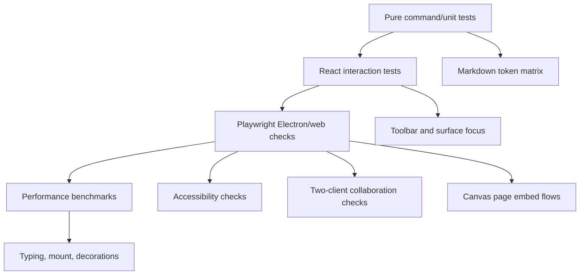

Recommended test files:

- `packages/editor/src/extensions/markdown-structural-editing.test.ts`
- `packages/editor/src/components/EditorSurface.test.tsx`
- `packages/editor/src/components/FloatingToolbar.commands.test.tsx`
- `packages/editor/src/extensions/embed/EmbedRegistry.test.ts`
- `tests/e2e/src/editor-markdown.spec.ts`
- `tests/e2e/src/editor-markdown-live-preview.spec.ts`
- `tests/e2e/src/editor-canvas-page-surface.spec.ts`
- `tests/e2e/src/editor-embeds.spec.ts`

Use existing Playwright auth bypass requirements:

- `setupTestAuth(page)` in Playwright tests.
- Manual runs set `localStorage.setItem('xnet:test:bypass', 'true')` before app initialization.
- Screenshots go to `tmp/playwright/`.
- Kill dev servers after manual testing.

## Open Questions

- Should canonical page storage remain ProseMirror/Yjs only, or should xNet also store Markdown snapshots for source mode/diff/export?
- Does source mode need to be editable in V1, or can it be a read/write debug mode after live preview stabilizes?
- Should database embeds remain atom nodes, or should they become editable block containers with isolated nested focus?
- Should page title become part of the ProseMirror document or remain NodeStore metadata?
- How much Obsidian-flavored syntax does xNet want: wikilinks, block refs, callouts, embeds, comments, Mermaid, tables, Dataview-like database refs?
- What is the minimum acceptable behavior for IME users when syntax normalization triggers?
- Should Markdown import/export be CommonMark/GFM-first with xNet extensions, or should xNet define its own Markdown dialect from day one?

## Immediate Next Actions

1. Write the failing heading Backspace tests first.
2. Build the Tiptap `MarkdownStructuralEditing` spike against the current editor.
3. Add a Milkdown spike with heading/list/code behavior and one xNet embed.
4. Decide the core path using the decision gate above.
5. Start `EditorSurface` so page hit targets and canvas modes improve independently of the syntax work.
6. Restore toolbar command reliability with tests before adding new toolbar features.
7. Introduce the embed registry abstraction and route existing embed/database/smart-reference extensions through it incrementally.

## References

- [Obsidian views and editing mode](https://help.obsidian.md/edit-and-read)
- [Obsidian basic formatting syntax](https://help.obsidian.md/syntax)
- [Obsidian flavored Markdown](https://help.obsidian.md/obsidian-flavored-markdown)
- [Typora Quick Start](https://support.typora.io/Quick-Start/)
- [Typora Markdown Reference](https://support.typora.io/Markdown-Reference/)
- [Tiptap Markdown introduction](https://tiptap.dev/docs/editor/markdown)
- [Tiptap Markdown basic usage](https://tiptap.dev/docs/editor/markdown/getting-started/basic-usage)
- [Tiptap custom Markdown serializing](https://tiptap.dev/docs/editor/markdown/advanced-usage/custom-serializing)
- [Tiptap input rules](https://tiptap.dev/docs/editor/api/input-rules)
- [Tiptap BubbleMenu](https://tiptap.dev/docs/editor/extensions/functionality/bubble-menu)
- [Tiptap React NodeViews](https://tiptap.dev/docs/editor/extensions/custom-extensions/node-views/react)
- [ProseMirror decorations reference](https://prosemirror.net/docs/ref/#view.Decoration)
- [ProseMirror NodeView reference](https://prosemirror.net/docs/ref/#view.NodeView)
- [aguingand/tiptap-markdown](https://github.com/aguingand/tiptap-markdown)
- [Milkdown GitHub](https://github.com/Milkdown/milkdown)
- [Milkdown core docs](https://milkdown.dev/core)
- [BlockNote introduction](https://www.blocknotejs.org/docs)
- [BlockSuite working with block tree](https://blocksuite.io/guide/working-with-block-tree)
- [Novel GitHub](https://github.com/steven-tey/novel)
- [MarkText GitHub](https://github.com/marktext/marktext)
- [Lexical Markdown package](https://github.com/facebook/lexical/tree/main/packages/lexical-markdown)
- [Plate Markdown](https://platejs.org/docs/markdown)
- [Plate plugin input rules](https://platejs.org/docs/plugin-input-rules)
