# AI Deep Integration With Pages, Databases, and Canvases

Date: 2026-06-02

Status: Exploration

## Exploration Checklist

- [x] Inspect existing xNet architecture and recent explorations.
- [x] Review current pages, database, canvas, plugin, Local API, and MCP code paths.
- [x] Research Codex, Claude Code, MCP, OpenRouter, Ollama, Obsidian, JSON Canvas, and Tiptap Markdown integration patterns.
- [x] Compare integration options across performance, quality, safety, and ease of use.
- [x] Recommend an implementation direction with validation criteria.

## Problem Statement

xNet already has the ingredients for a strong local-first knowledge workspace: pages, databases, canvases, CRDT-backed editing, structured NodeStore data, plugins, local APIs, and a baseline MCP server. The missing piece is an AI integration that feels as natural as pointing Codex or Claude Code at an Obsidian vault, while still preserving xNet's richer data model and avoiding brittle raw database edits.

The desired experience is:

- An AI can deeply read and write pages, databases, and canvases.
- Local agents such as Codex and Claude Code can work with xNet data without bespoke one-off exports.
- In-app AI can still feel polished, contextual, streaming, and interactive.
- Low-level database access exists where useful, but writes flow through xNet's canonical mutation and CRDT paths.
- Performance remains good on large workspaces, large canvases, and large databases.
- The integration is easy for users to understand: "give the AI this workspace, review what it wants to change, apply it."

## Executive Summary

The best direction is a layered AI integration, not a single provider-specific chatbot.

1. **Make xNet expose an AI-native resource and action contract.** Upgrade the existing MCP and Local API from basic node CRUD into a full workspace protocol for pages, databases, canvases, search, backlinks, schemas, transactions, diffs, and audit logs.
2. **Add a managed "AI workspace projection" on disk.** Generate a folder that looks like a high-quality Markdown vault: pages as `.md`, databases as `.schema.json` plus `.rows.jsonl`, canvases as `.canvas` / JSON Canvas plus source object manifests, and `AGENTS.md` / `.mcp.json` / Codex config files. Local agents can edit this folder directly.
3. **Treat file edits as proposals, not blind writes.** A watcher parses file changes into typed mutation plans, validates them against schemas/CRDT contracts, shows a diff, and applies them via NodeStore, database Y.Doc, and CanvasStore operations.
4. **Keep raw database access mostly read-only.** AI should be able to inspect query plans, schema state, materialized views, FTS/vector index status, and storage diagnostics. It should write through a transaction/mutation API unless the user explicitly enters an admin recovery mode.
5. **Use MCP as the shared local-agent bridge.** Codex and Claude Code both support MCP. MCP should expose tools for actions and resources for readable context. The current `packages/plugins/src/services/mcp-server.ts` is the right starting point, but it needs a major capability expansion.
6. **Use Codex app-server style orchestration for embedded xNet AI.** If xNet wants a first-class in-app agent UI with threads, turns, approvals, event streaming, background work, and steering, embedding a Codex-like app-server/sidecar is a better fit than trying to make raw chat completions behave like an agent runtime.
7. **Use OpenRouter and local LLMs as model backends, not the product architecture.** They are valuable for choice, cost, privacy, and fallback routing. They should sit behind xNet's own tool/resource/action protocol.

The central thesis: **xNet should become both an AI-readable vault and an AI-controllable application.** The vault projection gives local coding agents their strongest interface. The native tool layer gives xNet fidelity, safety, and performance.

## Current xNet State

### Relevant Architecture Already Exists

xNet's current codebase already points toward this integration:

- `@xnetjs/data` has `NodeStore`, signed changes, Lamport timestamps, sparse property updates, document content storage, query descriptors, FTS, RTree, materialized views, adaptive index support, and a database query router.
- `@xnetjs/editor` has TipTap/Yjs rich text editing plus a Markdown extension contract and xNet-specific directives for pages, databases, embeds, and smart references.
- `@xnetjs/canvas` has source-backed canvas objects, Yjs-backed canvas stores, spatial indexes, JSON Canvas import/export, ingestion pipelines, pure scene operations, tile documents, and source bulk-operation planners.
- `@xnetjs/plugins` has a plugin registry, sandbox policies, AI provider abstractions, an existing Local API, and an existing MCP server.
- `@xnetjs/react` exposes `useQuery`, `useMutate`, `useNode`, `useDatabase`, and `useDatabaseDoc`, which are useful references for stable UI-facing read/write semantics.
- `apps/electron` already starts a localhost Local API through the main process and proxies store operations to the renderer.

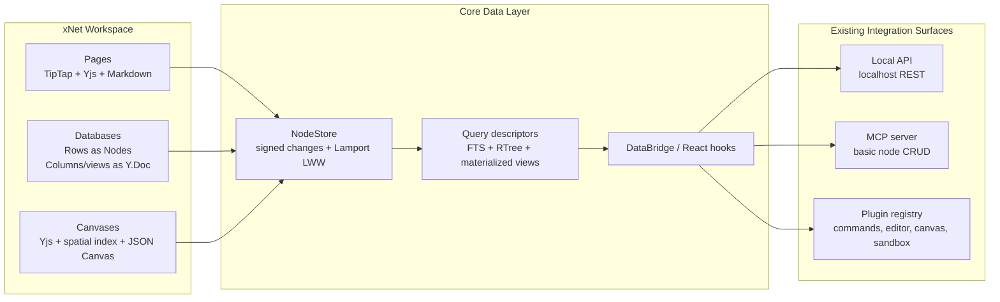

### Pages Are Already Close to AI-Friendly

The page editor has a strong foundation for agentic editing:

- `packages/editor/src/components/RichTextEditor.tsx` wires TipTap, Collaboration, Yjs, Markdown, slash commands, smart references, database embeds, page embeds, rich links, task views, media, and plugin extensions.
- `packages/editor/src/extensions/markdown-xnet.ts` defines helpers for block and inline JSON Markdown specs.
- `packages/editor/src/extensions/markdown-io.test.ts` validates round-trips for custom xNet Markdown directives including database embeds, page embeds, smart refs, and rich media.
- `packages/editor/src/extensions/page-embed/PageEmbedExtension.ts`, `database-embed/DatabaseEmbedExtension.ts`, `smart-reference/SmartReferenceExtension.ts`, and `embed/EmbedExtension.ts` already provide a serializable bridge between rich UI blocks and Markdown.

This matters because local agents are good at editing Markdown. xNet should lean into that strength rather than exposing pages only as opaque CRDT blobs.

### Databases Need a Split-Brain AI Contract

xNet databases have two different mutation surfaces:

- **Rows** are canonical NodeStore nodes and should be edited through `NodeStore.create`, `NodeStore.update`, `NodeStore.delete`, `NodeStore.transaction`, or the equivalent DataBridge methods.
- **Columns and views** live in a database Y.Doc managed by `packages/data/src/database/database-doc.ts` and `packages/react/src/hooks/useDatabaseDoc.ts`.

That split is good architecture, but AI tools must make it explicit. An agent that says "add a Status column and set all overdue rows to Blocked" needs one schema/view mutation plan and one row mutation plan.

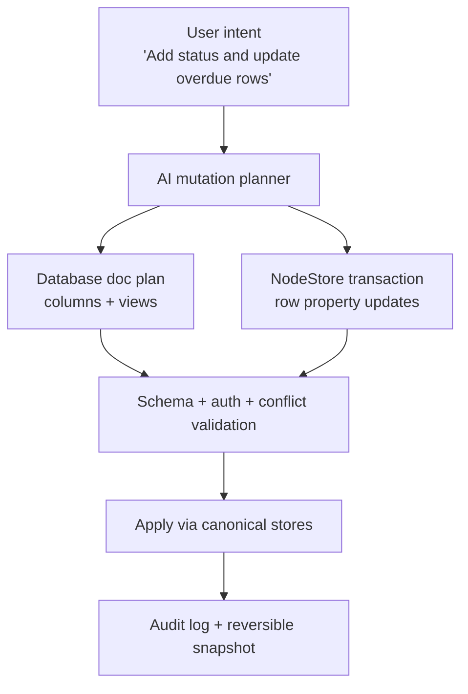

### Canvases Are Richer Than JSON Canvas

Canvas data is not just a flat visual board:

- `packages/canvas/src/types.ts` supports source-backed objects such as `page`, `database`, `external-reference`, `media`, plus native `shape`, `note`, and `group`.
- `packages/canvas/src/store.ts` provides Yjs-backed collaborative updates and a spatial index.
- `packages/canvas/src/scene/tile-doc-schema.ts` introduces tile-level documents for large canvases.
- `packages/canvas/src/interop/json-canvas.ts` imports/exports JSON Canvas with xNet metadata.
- `packages/canvas/src/selection/scene-operations.ts` and `source-bulk-operations.ts` provide pure planning helpers for layout and source-backed bulk operations.

For AI, this suggests two representations:

- A **human/local-agent format** that looks like JSON Canvas and Markdown.
- A **native operation format** that preserves source IDs, schema IDs, previews, tile boundaries, object locks, and CRDT semantics.

### Existing MCP Is Useful but Too Thin

`packages/plugins/src/services/mcp-server.ts` exposes:

- `xnet_query`
- `xnet_get`
- `xnet_create`
- `xnet_update`
- `xnet_delete`
- `xnet_schemas`
- `xnet://nodes`
- `xnet://schemas`

That is enough for a proof of concept. It is not enough for "really good" AI integration because it lacks:

- Page Markdown resources.
- Page patch tools.
- Database schema/view resources.
- Database query descriptors and paginated result resources.
- Canvas viewport/tile/object resources.
- Transaction planning and dry-run validation.
- Diff/preview/apply workflows.
- Search, backlinks, references, embeddings, and context packs.
- Permission scopes and risk levels per tool.
- Streaming events and long-running job status.

### Local API Also Needs More Shape

`packages/plugins/src/services/local-api.ts` and `apps/electron/src/main/local-api.ts` already provide a localhost API with bearer-token support and Electron-safe proxying through IPC. This is an important foundation for external tools, but the current query endpoint is intentionally narrow. It needs the same richer operation model as MCP.

For the best developer and agent experience, MCP and Local API should share one internal service layer:

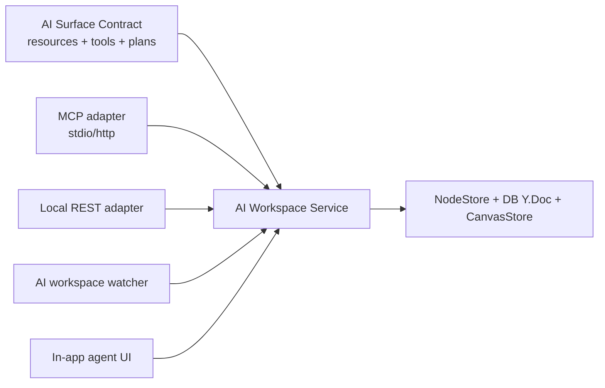

## External Research Highlights

### MCP Is the Right Shared Protocol

The Model Context Protocol follows a client-host-server architecture where AI applications connect to one or more MCP servers, with each server exposing specialized resources, tools, and prompts. The MCP specification describes hosts as the coordinators that enforce permissions and authorization decisions, clients as isolated stateful sessions, and servers as providers of resources, tools, and prompts. MCP's architecture is built around JSON-RPC and context exchange.

Why this matters for xNet:

- MCP tools map well to xNet actions such as `page_patch`, `database_query`, or `canvas_layout_selection`.
- MCP resources map well to xNet context such as `xnet://page/{id}.md`, `xnet://database/{id}/schema`, or `xnet://canvas/{id}/viewport?...`.
- MCP notifications and `list_changed` support can keep agents aware when tools/resources change.
- MCP lets xNet work with Codex, Claude Code, Claude Desktop, and other local agent hosts without provider-specific code.

Sources:

- [MCP architecture overview](https://modelcontextprotocol.io/docs/learn/architecture)
- [MCP 2025-06-18 architecture specification](https://modelcontextprotocol.io/specification/2025-06-18/architecture)

### Claude Code Already Fits Project-Local MCP

Claude Code supports MCP servers over remote HTTP, local stdio, deprecated SSE, and WebSocket. Project-scoped MCP configuration can live in `.mcp.json`, and Claude Code exposes commands such as `claude mcp add`, `claude mcp list`, and `/mcp`. Claude Code can also itself run as an MCP server via `claude mcp serve`, exposing its file-oriented tools to another MCP client.

This suggests two possible xNet integrations:

- xNet as an MCP server consumed by Claude Code.
- Claude Code as a subordinate agent that xNet can call through MCP for file editing workflows.

Source: [Claude Code MCP documentation](https://code.claude.com/docs/en/mcp)

### Codex Supports MCP, Project Instructions, Skills, Plugins, Permissions, and App Server

The Codex manual is especially relevant for xNet:

- Codex supports stdio and streamable HTTP MCP servers, configured through `~/.codex/config.toml` or project `.codex/config.toml`.
- Codex supports tool allow/deny lists, timeouts, approval modes, and per-tool approvals.
- Codex reads project instructions from `AGENTS.md`, which fits a generated xNet AI workspace.
- Codex plugins can bundle skills, apps, and MCP servers.
- Codex app-server is designed for deep product integration with threads, turns, approvals, streamed agent events, and background lifecycle control.
- Codex permission profiles can constrain filesystem and network access to specific workspace roots and domains.

This makes Codex useful in two ways:

- **As an external local agent** editing a generated xNet workspace folder.
- **As an embedded/sidecar agent runtime** if xNet wants a native "AI command center" with lifecycle and approval semantics.

Source: [OpenAI Codex manual](https://developers.openai.com/codex/codex-manual.md)

### Obsidian's Killer Feature Is the Plain File Contract

Obsidian stores notes as Markdown-formatted plain text files inside a vault folder and automatically refreshes when external tools edit those files. That is the core reason coding agents work well with Obsidian vaults: the data is visible, patchable, searchable, and explainable using normal file tools.

xNet is richer than Obsidian, but it should copy the file-contract lesson. A generated AI workspace folder is likely the fastest way to make local agents productive.

Source: [Obsidian data storage documentation](https://obsidian.md/help/data-storage)

### JSON Canvas Is a Useful Outer Format

The JSON Canvas spec defines a canvas document with `nodes` and `edges`. Nodes can be text, files, links, or groups, and each node has an id, type, position, width, and height. Edges connect node ids.

xNet already has JSON Canvas import/export. It should use JSON Canvas as the external canvas file format while keeping xNet-specific metadata for source-backed objects.

Source: [JSON Canvas 1.0 specification](https://jsoncanvas.org/spec/1.0/)

### Tiptap Markdown Supports the Right Bridge

Tiptap's Markdown extension parses Markdown into Tiptap JSON and serializes editor content back to Markdown. It supports custom tokenizers and custom rendering logic, which is exactly how xNet can preserve custom page/database/canvas directives in AI-editable Markdown.

Source: [Tiptap Markdown documentation](https://tiptap.dev/docs/editor/markdown)

### OpenRouter Is Best as a Model Router

OpenRouter exposes an API that is very similar to the OpenAI Chat API, supports streaming, tool calling, structured outputs, plugin features, model/provider routing, fallback behavior, usage accounting, and app attribution headers. That makes it useful for a bespoke in-app AI layer where xNet chooses models dynamically.

It should not define xNet's integration architecture. It should be one model backend behind xNet's tools.

Source: [OpenRouter API reference](https://openrouter.ai/docs/api/reference/overview)

### Ollama Is Best for Local Privacy and Offline Work

Ollama provides partial OpenAI API compatibility on `http://localhost:11434/v1/`, including chat completions and newer Responses API support for streaming and tools in supported versions. It also lets users configure context size through a `Modelfile`.

Ollama should be supported for local/offline workflows, summarization, classification, and maybe lower-risk edit proposals. For high-quality multi-step edits, xNet should still let users choose stronger cloud models.

Source: [Ollama OpenAI compatibility documentation](https://docs.ollama.com/api/openai-compatibility)

## Design Principles

### 1. Give Agents Both Files and Tools

Files are unbeatable for local coding agents:

- They are easy to search.
- They support normal diffs.
- Agents can patch them with mature editing tools.
- Users understand them.
- `AGENTS.md` can explain workspace conventions.

Tools are unbeatable for application fidelity:

- They can enforce schemas.
- They can write through CRDT-aware paths.
- They can apply transactions.
- They can manage auth, sync, locks, and conflict handling.
- They can return small focused context instead of huge exports.

The right design is both: **files for agent ergonomics, tools for canonical application writes.**

### 2. Make Every AI Write a Plan First

AI writes should go through a plan/apply lifecycle:

1. Read context.
2. Produce a typed mutation plan.
3. Validate plan against schemas, permissions, locks, CRDT state, and workspace policy.
4. Show a diff or preview.
5. Apply through canonical stores.
6. Record an audit event and reversible snapshot.

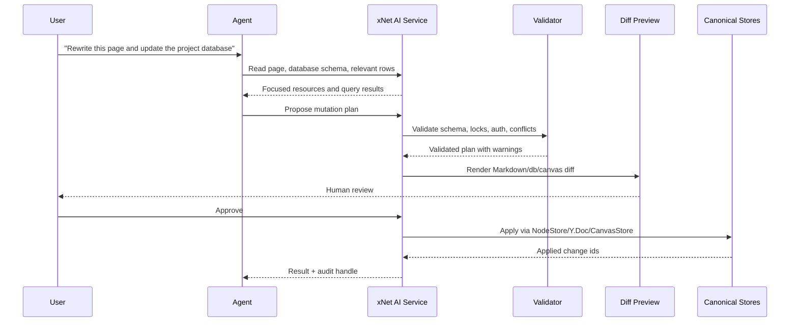

### 3. Separate "Can Read" From "Can Mutate"

Agents often need broad read access to be useful. They rarely need broad write access all at once. Scope should be explicit:

- Read-only workspace summary.
- Read selected pages.
- Read database schema and sample rows.
- Query database with limits.
- Read current canvas viewport.
- Propose changes.
- Apply page patches.
- Apply row updates.
- Apply schema/view changes.
- Apply canvas object changes.
- Run low-level diagnostics.
- Run admin recovery writes.

### 4. Preserve Source Identity Everywhere

AI-readable files must not lose xNet identity. Every exported file should carry stable ids:

- Page node id.
- Schema id.
- Database id.
- Row ids.
- Canvas id.
- Canvas object ids.
- Source node ids for source-backed cards.
- Content hashes/revision ids.
- Last exported Lamport/version metadata.

This is the difference between "an AI rewrote some Markdown" and "xNet can apply a safe patch to the right live object."

### 5. Optimize for Context Retrieval, Not Workspace Dumping

High-quality AI integration needs good context, but performance dies if every prompt exports the whole workspace. xNet should provide:

- Summaries and outlines.
- Full-text search.
- Vector/hybrid search.
- Backlinks and linked context.
- Database query descriptors and materialized views.
- Canvas viewport/tile reads.
- Pagination and row sampling.
- Result size limits and "expand this" tools.

### 6. Keep Model Choice Below the Product Layer

Model provider code should not leak into the page/database/canvas integration design. The product layer should expose actions and resources. Model adapters should decide how to call Codex, Claude, OpenRouter, OpenAI, Anthropic, Ollama, LM Studio, or other local OpenAI-compatible servers.

## Integration Options

### Option A: MCP-First Native xNet Server

Build a full MCP server that exposes xNet resources and tools.

What it enables:

- Codex can connect to xNet through MCP.
- Claude Code can connect to xNet through MCP.
- Claude Desktop and other MCP hosts can read/write xNet.
- The integration is standard and future-proof.

Best resources:

- `xnet://workspace/summary`
- `xnet://workspace/recent`
- `xnet://workspace/search?q=...`
- `xnet://page/{pageId}.md`
- `xnet://page/{pageId}/outline`
- `xnet://page/{pageId}/backlinks`
- `xnet://database/{databaseId}/schema`
- `xnet://database/{databaseId}/views`
- `xnet://database/{databaseId}/query/{queryId}`
- `xnet://canvas/{canvasId}/viewport?x=...&y=...&w=...&h=...`
- `xnet://canvas/{canvasId}/object/{objectId}`

Best tools:

- `xnet_search`
- `xnet_read_page_markdown`
- `xnet_plan_page_patch`
- `xnet_apply_page_patch`
- `xnet_database_query`
- `xnet_plan_database_mutation`
- `xnet_apply_database_mutation`
- `xnet_canvas_read_viewport`
- `xnet_plan_canvas_mutation`
- `xnet_apply_canvas_mutation`
- `xnet_create_context_pack`
- `xnet_validate_mutation_plan`
- `xnet_get_audit_event`

Pros:

- Best shared protocol for agents.
- Directly builds on existing MCP server.
- Supports strong permissioning and limited context results.
- Easier to maintain than many provider-specific integrations.

Cons:

- Agents still do not get a normal file tree unless xNet also provides a file projection.
- MCP tool UX varies by host.
- Rich diffs may need companion resources/files.

Verdict: **Required foundation.**

### Option B: Generated AI Workspace Folder

Generate a folder that local agents can read and edit like an Obsidian vault.

Possible shape:

```text
xnet-agent-workspace/
  AGENTS.md
  README.md
  .mcp.json
  .codex/
    config.toml
  .xnet/
    manifest.jsonl
    export-state.json
    pending/
    applied/
    conflicts/
  Pages/
    Product Roadmap--page_abc.md
    Research Notes--page_def.md
  Databases/
    Projects--db_projects.schema.json
    Projects--db_projects.views.json
    Projects--db_projects.rows.jsonl
    Projects--db_projects.saved-queries.json
  Canvases/
    Roadmap Planning--canvas_123.canvas
    Roadmap Planning--canvas_123.objects.jsonl
  Assets/
    file_manifest.jsonl
```

Key mechanics:

- xNet exports selected workspace scope to disk.
- Local agents edit the files.
- A watcher detects changed files.
- xNet parses changes into mutation plans.
- The user reviews and applies.
- Applied changes update the manifest and clear pending diffs.

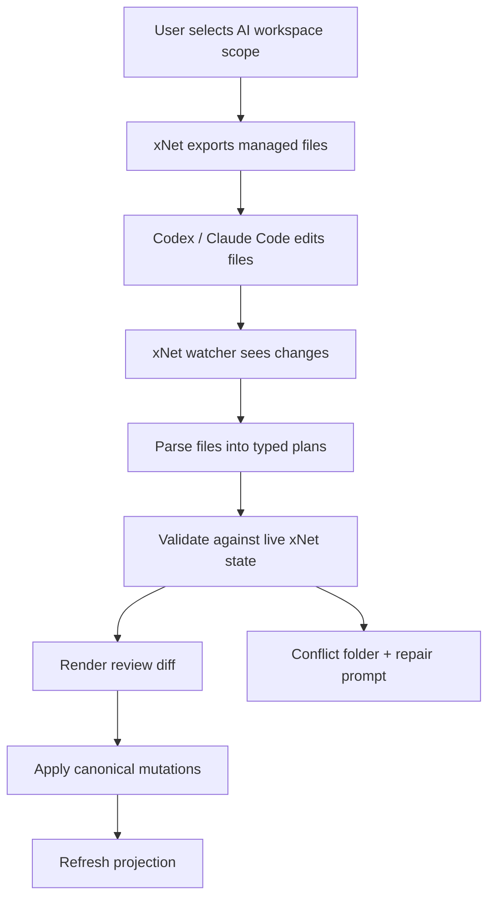

Pros:

- Best ergonomics for local coding agents.
- Feels like Obsidian vault editing.
- Provides durable diffs and Git compatibility.
- Works even if an agent has no MCP support.
- Lets users open/edit files manually.

Cons:

- Requires careful round-trip conversion.
- Watcher conflicts must be handled well.
- Databases and canvases need non-Markdown sidecar files.
- Large workspaces need scoped export and lazy hydration.

Verdict: **High leverage and should be built after MCP resource contracts are defined.**

### Option C: Embedded Agent Runtime in xNet

Add an in-app AI command center with threads, streaming, tool calls, approvals, diffs, and background work. This can be powered by:

- Codex app-server as a local sidecar.
- A custom xNet agent orchestrator using OpenAI/Anthropic/OpenRouter/Ollama APIs.
- A hybrid: xNet orchestrates domain tools, Codex handles file editing in the generated workspace.

Pros:

- Best native user experience.
- Can show page/database/canvas diffs inside xNet.
- Can integrate with selection, current viewport, current database view, active page range, and presence.
- Can schedule background work or long tasks.

Cons:

- More engineering work.
- Requires careful lifecycle, auth, logs, and cancellation.
- If implemented only as bespoke chat completions, it risks being weaker than mature agent runtimes.

Verdict: **Build after the native tool/resource contract exists. Prefer an app-server/sidecar pattern over a raw chatbot.**

### Option D: OpenRouter/OpenAI-Compatible Provider Layer

Upgrade `packages/plugins/src/ai/providers.ts` from simple prompt completion into a model backend abstraction that supports:

- Streaming.
- Tool calling.
- Structured outputs.
- JSON schema enforcement.
- Reasoning/summary capture where available.
- Provider routing and fallback.
- Token/cost accounting.
- Local OpenAI-compatible servers.

Pros:

- Model flexibility.
- Easy support for OpenRouter, Ollama, LM Studio, vLLM, LiteLLM, and cloud APIs.
- Useful for in-app AI features and deterministic structured plans.

Cons:

- Does not itself solve xNet data access.
- Tool-calling quality varies widely by provider/model.
- Local models may struggle with large multi-step edits unless tasks are tightly scoped.

Verdict: **Important, but secondary to the xNet AI surface contract.**

### Option E: Low-Level Database Agent Access

Expose low-level database tools for diagnostics:

- `db_explain_query`
- `db_list_tables`
- `db_index_status`
- `db_materialized_view_status`
- `db_change_history`
- `db_verify_node`
- `db_export_snapshot`
- `db_restore_preview`

Writes should remain high-level:

- `node_transaction`
- `database_schema_mutation`
- `database_row_mutation`
- `canvas_mutation`
- `page_patch`

Admin-only recovery writes could exist behind explicit mode gates:

- Require local-only token.
- Require user confirmation.
- Require backup snapshot.
- Require dry-run diff.
- Disable in normal agent sessions.

Pros:

- Lets AI reason about performance, migrations, and corrupted state.
- Useful for development and support.

Cons:

- Arbitrary SQL writes would bypass signing, validation, CRDT, auth, sync, and audit semantics.
- Prompt injection plus raw writes is a bad failure mode.

Verdict: **Read low-level, write canonical.**

## Recommended Architecture

The recommended system has five layers.

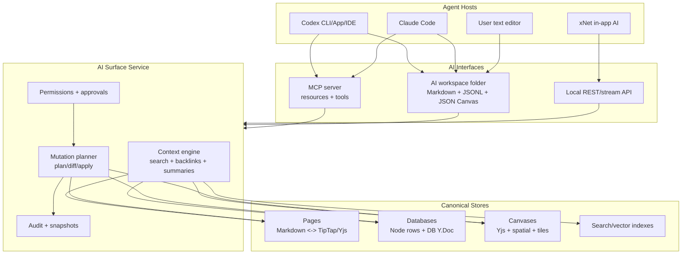

### Layer 1: AI Resource Model

Resources are read-oriented. They should be small, focused, cacheable, and stable.

Recommended resource families:

| Family          | Example URI                               | Purpose                                                               |
| --------------- | ----------------------------------------- | --------------------------------------------------------------------- |
| Workspace       | `xnet://workspace/summary`                | High-level map of schemas, recent pages, open canvases, saved queries |
| Search          | `xnet://workspace/search?q=pricing`       | Focused retrieval                                                     |
| Page            | `xnet://page/page_123.md`                 | Full Markdown page with xNet directives                               |
| Page outline    | `xnet://page/page_123/outline`            | Headings, block anchors, refs, tasks                                  |
| Page context    | `xnet://page/page_123/context-pack`       | Backlinks, embeds, adjacent docs, unresolved refs                     |
| Database schema | `xnet://database/db_123/schema`           | Columns, property types, constraints                                  |
| Database view   | `xnet://database/db_123/views`            | Table/board/list/calendar/gallery/timeline views                      |
| Database rows   | `xnet://database/db_123/query/{queryId}`  | Paginated query result with row ids and revision markers              |
| Canvas viewport | `xnet://canvas/canvas_123/viewport?...`   | Visible objects and edges                                             |
| Canvas object   | `xnet://canvas/canvas_123/object/obj_456` | One object plus source node preview                                   |
| Audit           | `xnet://audit/{eventId}`                  | Applied plan, actor, changes, rollback handles                        |

Design rule: every resource should include enough identity and revision information for a later patch to target the correct live object.

### Layer 2: AI Tool Model

Tools are action-oriented. They should be typed, narrow, and validated.

Tool families:

| Tool                      | Risk       | Notes                                                |
| ------------------------- | ---------- | ---------------------------------------------------- |
| `workspace_search`        | Low        | Uses FTS/vector/backlink retrieval with limits       |
| `context_pack_create`     | Low        | Builds focused prompt context from selected surfaces |
| `page_patch_plan`         | Medium     | Converts Markdown patch into typed plan              |
| `page_patch_apply`        | High       | Applies via TipTap/Yjs/NodeStore document content    |
| `database_query`          | Low/Medium | Limited, paginated, no arbitrary SQL by default      |
| `database_mutation_plan`  | Medium     | Adds/updates rows, columns, views                    |
| `database_mutation_apply` | High       | Applies row transactions and DB Y.Doc updates        |
| `canvas_viewport_read`    | Low        | Reads tile/viewport scoped context                   |
| `canvas_mutation_plan`    | Medium     | Adds/moves/connects/layouts objects                  |
| `canvas_mutation_apply`   | High       | Applies through CanvasStore                          |
| `low_level_diagnostics`   | Medium     | Read-only storage/query/index diagnostics            |
| `admin_recovery_apply`    | Critical   | Off by default, explicit user mode only              |

### Layer 3: Mutation Plans

Mutation plans are the common currency between MCP tools, Local API, file watcher, and in-app AI.

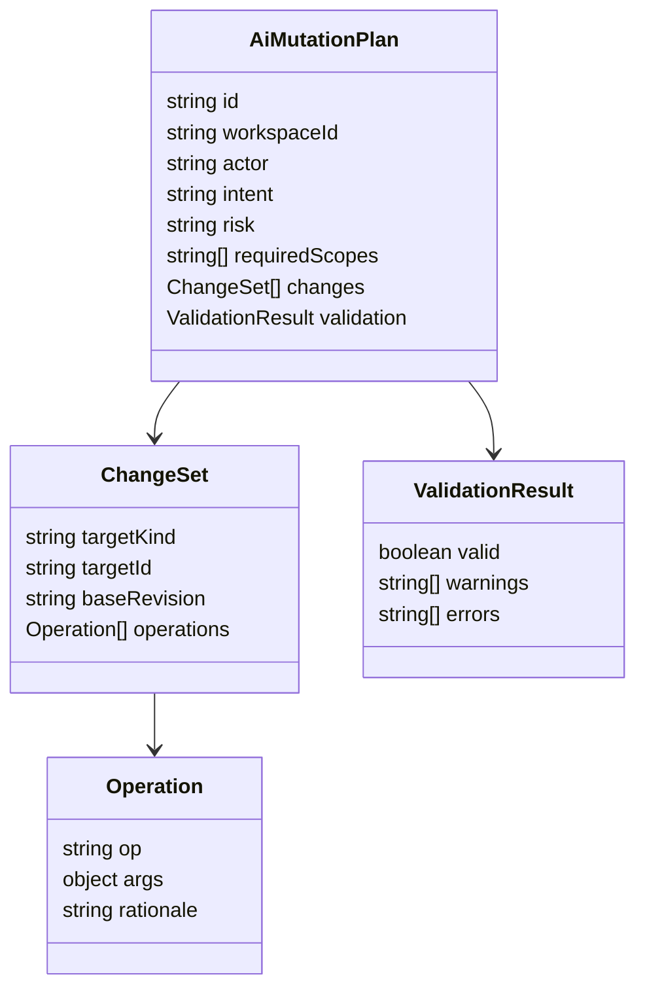

Plans should be serializable as JSON so they can appear in:

- MCP tool results.
- REST responses.
- `.xnet/pending/*.plan.json`.
- Audit logs.
- Tests and eval fixtures.

### Layer 4: File Projection

The AI workspace folder should be generated from the same resource and mutation plan model.

#### Page Files

Example page:

```markdown
---
xnet:
  id: page_123
  schemaId: xnet.page
  revision: 'lamport:42:did:key:z...'
  exportedAt: '2026-06-02T12:00:00Z'
---

# Product Roadmap

This is normal Markdown.

:::xnet-database
{"databaseId":"db_projects","viewId":"view_board","viewType":"board"}
:::

{{xnet-ref {"nodeId":"task_456","label":"Launch beta"}}}
```

Apply strategy:

- Parse frontmatter for identity and revision.
- Parse Markdown through the existing xNet Markdown extension.
- Compare against the live document revision.
- Produce a `page_patch` plan.
- Apply through TipTap/Yjs conversion, not raw blob replacement when possible.

#### Database Files

Example:

```text
Databases/
  Projects--db_projects.schema.json
  Projects--db_projects.views.json
  Projects--db_projects.rows.jsonl
```

Rows JSONL:

```jsonl
{"xnet":{"id":"row_1","revision":"lamport:10"},"Title":"MCP v2","Status":"In progress","Priority":"High"}
{"xnet":{"id":"row_2","revision":"lamport:11"},"Title":"Agent workspace","Status":"Planned","Priority":"High"}
```

Apply strategy:

- Schema file changes become database Y.Doc column mutations.
- View file changes become database Y.Doc view mutations.
- Row JSONL changes become NodeStore row transactions.
- Deletions require explicit tombstone markers or a deletion section to avoid accidental row loss from partial exports.

#### Canvas Files

Use JSON Canvas for the main file and a sidecar for xNet-specific data:

```text
Canvases/
  Roadmap Planning--canvas_123.canvas
  Roadmap Planning--canvas_123.objects.jsonl
```

Main `.canvas` file:

```json
{
  "nodes": [
    {
      "id": "obj_page_1",
      "type": "file",
      "file": "../Pages/Product Roadmap--page_123.md",
      "x": 100,
      "y": 100,
      "width": 480,
      "height": 320
    }
  ],
  "edges": []
}
```

Sidecar object metadata:

```jsonl
{
  "objectId": "obj_page_1",
  "kind": "page",
  "sourceNodeId": "page_123",
  "sourceSchemaId": "xnet.page",
  "revision": "tile:7"
}
```

Apply strategy:

- Layout-only edits become CanvasStore object position/display updates.
- Added file nodes become source-backed canvas objects if the file maps to a known xNet node.
- Added text nodes can become canvas notes or new pages, depending on user preference.
- Edge edits become connector mutations.
- Object metadata is required for high-fidelity writes.

### Layer 5: Agent Runtime and Model Routing

The agent runtime should orchestrate:

- Thread/session state.
- Tool discovery.
- Context pack construction.
- Model calls.
- Streaming output.
- Interrupts/cancel.
- Human approval.
- Applying plans.
- Audit logs.

Model routing should be a separate concern:

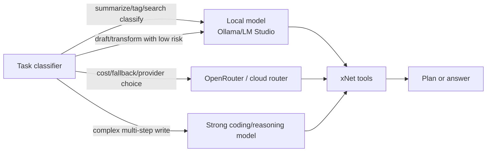

## Deep Integration by Surface

### Pages

A really good page integration should support:

- Read selected page as Markdown.
- Read page outline, block anchors, embeds, tasks, references, backlinks, and unresolved links.
- Patch whole page or selected block range.
- Insert sections at headings.
- Rewrite only current selection.
- Convert notes into tasks/databases/canvas cards.
- Preserve xNet directives.
- Preserve comments or explicitly warn when Markdown cannot represent them.
- Use Yjs/TipTap transactions so concurrent editing works.

Recommended MCP tools:

```text
page_search(query, filters, limit)
page_read_markdown(pageId, includeFrontmatter)
page_read_context(pageId, mode: "outline" | "backlinks" | "embeds" | "full")
page_plan_patch(pageId, baseRevision, patch)
page_apply_patch(planId)
page_create(title, markdown, parentId?)
page_extract_tasks(pageId, selection?)
```

Recommended UI affordances:

- "Ask AI about this page."
- "Rewrite selection."
- "Turn this section into a database."
- "Add linked canvas."
- "Show AI diff."
- "Apply as tracked/proposed change."

Critical implementation detail: page patches should not be naive string replacements. They should parse Markdown into the editor schema, map block anchors when possible, validate xNet directives, and then apply via the existing document persistence path.

### Databases

A really good database integration should support:

- Explain the database schema.
- Query rows with filters, sorting, pagination, grouping, and saved views.
- Sample representative rows.
- Add/update/delete rows.
- Add/update/delete columns.
- Create views.
- Transform columns.
- Bulk edit rows with previews.
- Detect destructive changes.
- Generate formulas or computed fields, but respect the project rule that computed values should be computed at read, not stored.
- Use materialized views and query router hints for large datasets.

Recommended MCP tools:

```text
database_list()
database_describe(databaseId)
database_query(databaseId, descriptor, pageSize, cursor)
database_sample(databaseId, strategy)
database_plan_rows(databaseId, operations)
database_plan_schema(databaseId, operations)
database_validate_plan(planId)
database_apply_plan(planId)
database_explain_query(databaseId, descriptor)
```

Recommended mutation plan shape:

```json
{
  "kind": "database_mutation_plan",
  "databaseId": "db_projects",
  "baseRevision": "dbdoc:21",
  "rowBaseRevision": "store:lamport:120",
  "operations": [
    {
      "op": "addColumn",
      "column": {
        "name": "AI Risk",
        "type": "select",
        "options": ["Low", "Medium", "High"]
      }
    },
    {
      "op": "updateRows",
      "where": {
        "property": "Status",
        "operator": "equals",
        "value": "Blocked"
      },
      "set": {
        "AI Risk": "High"
      }
    }
  ]
}
```

Performance rule: database tools should return row ids, schema metadata, and focused cells first. Full row bodies should be fetched on demand.

### Canvases

A really good canvas integration should support:

- Understand the current viewport.
- Understand selected objects.
- Read source previews for cards.
- Add pages/databases/media/search results to the canvas.
- Create clusters, swimlanes, timelines, dependency graphs, and planning boards.
- Tidy, align, distribute, group, and frame objects.
- Connect related objects.
- Convert a messy canvas into a plan.
- Convert a plan into a canvas.
- Work on tiles for huge canvases.

Recommended MCP tools:

```text
canvas_list()
canvas_read_viewport(canvasId, bounds, includeSourcePreviews)
canvas_read_selection(canvasId, objectIds)
canvas_search_objects(canvasId, query)
canvas_plan_mutation(canvasId, operations)
canvas_apply_mutation(planId)
canvas_export_json_canvas(canvasId, scope)
canvas_import_json_canvas(canvasId, document, mode)
canvas_layout_selection(canvasId, objectIds, layout)
```

Canvas mutation example:

```json
{
  "kind": "canvas_mutation_plan",
  "canvasId": "canvas_roadmap",
  "baseRevision": "tile:main:34",
  "operations": [
    {
      "op": "addSourceCard",
      "sourceNodeId": "page_ai_integration",
      "position": { "x": 800, "y": 200 },
      "display": { "density": "summary" }
    },
    {
      "op": "connect",
      "fromObjectId": "obj_research",
      "toObjectId": "obj_page_ai_integration",
      "label": "feeds"
    },
    {
      "op": "layout",
      "objectIds": ["obj_research", "obj_page_ai_integration"],
      "algorithm": "tidyGrid"
    }
  ]
}
```

Performance rule: canvas tools should default to viewport or selection scope. Full-canvas export should be explicit and backgrounded.

## Context Retrieval Strategy

The context engine should decide what to include based on task shape.

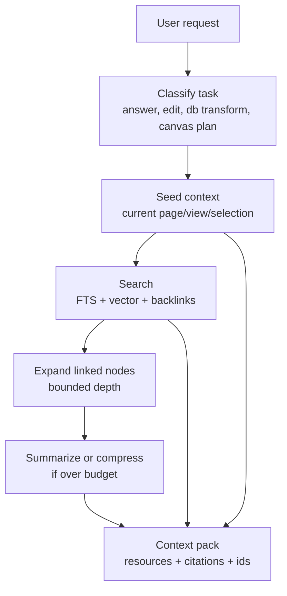

Recommended context tiers:

| Tier | Target            | Example                                                        |
| ---- | ----------------- | -------------------------------------------------------------- |
| T0   | Metadata only     | Workspace summary, schema names, page titles                   |
| T1   | Focused object    | Current page outline, selected canvas objects, current DB view |
| T2   | Linked context    | Backlinks, embeds, source cards, related rows                  |
| T3   | Search context    | FTS/vector/hybrid search results                               |
| T4   | Full content      | Full pages or large query pages on explicit expansion          |
| T5   | Background export | Whole workspace projection or full canvas export               |

Quality rule: always give the agent ids and revisions, not just prose summaries.

## Permission and Safety Model

The existing canvas permission model is a good pattern. AI actions should use capability scopes and risk levels.

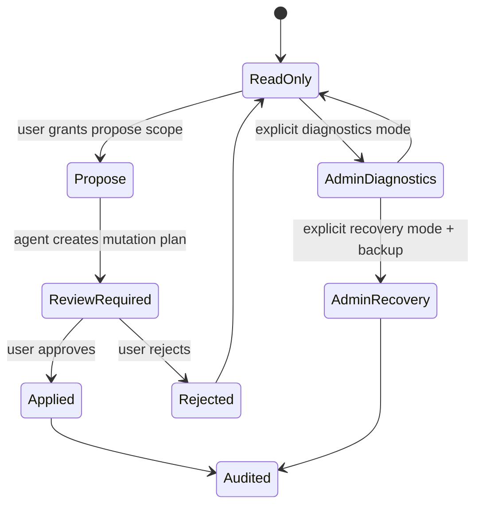

Recommended scopes:

```text
workspace.read
workspace.search
page.read
page.propose
page.write
database.read
database.query
database.propose
database.write.rows
database.write.schema
canvas.read
canvas.propose
canvas.write
storage.diagnostics
storage.recovery
network.fetch
agent.workspace.export
agent.workspace.import
```

Risk controls:

- Localhost-only default for local APIs.
- Per-session bearer tokens.
- Tool allow/deny lists.
- Max output sizes.
- Read result pagination.
- Workspace scopes.
- Approval gates for writes.
- Backup snapshots before bulk writes.
- Prompt injection warnings for externally fetched content.
- Sandboxed preview/render tools with no mutation rights.
- Audit log for every applied plan.

Threats to design for:

- Prompt injection inside pages or external web clips.
- Agent confusion between exported stale files and live data.
- Accidental bulk deletion from partial JSONL exports.
- Arbitrary SQL bypassing CRDT/signature/auth semantics.
- Oversized MCP tool output destroying context quality.
- Untrusted plugins adding lookalike AI tools.
- Local agent access to private files outside the intended workspace.

## Performance Strategy

### Do Not Export Everything by Default

Default AI sessions should begin with a scoped context pack, not a full workspace dump. The full AI workspace folder is useful for local agent workflows, but it should be opt-in and scopeable.

Recommended export scopes:

- Current page only.
- Current page plus backlinks.
- Current database view.
- Current canvas viewport.
- Selected canvas objects plus source nodes.
- Project folder/tag/schema.
- Whole workspace.

### Use Existing Accelerators

xNet already has relevant primitives:

- `NodeQueryDescriptor` supports filters, ordering, pagination, spatial filters, search filters, and materialized views.
- `SQLiteNodeStorageAdapter` supports FTS, RTree, materialized query views, and adaptive index diagnostics.
- `database/query-router.ts` routes database queries local/hub/hybrid based on size and complexity.
- `canvas/spatial/index.ts` supports viewport and range queries.
- `canvas/scene/tile-doc-schema.ts` supports tile-level canvas operations.
- `@xnetjs/vectors` can support semantic retrieval and hybrid search.

AI tools should be built on these instead of `list all nodes and filter in memory`.

### Latency Budget

Suggested budgets:

| Operation               | Target                   | Notes                                     |
| ----------------------- | ------------------------ | ----------------------------------------- |
| Workspace summary       | < 100 ms cached          | Schema/page/canvas counts, recent objects |
| Current page outline    | < 100 ms                 | Cached from Markdown/editor state         |
| Page full Markdown read | < 250 ms typical         | Larger docs can stream                    |
| Search context pack     | < 500 ms local           | FTS first, vector optional                |
| Database query page     | < 500 ms typical         | Use materialized views for big views      |
| Canvas viewport read    | < 150 ms                 | Spatial index/tile scoped                 |
| Mutation validation     | < 500 ms for small plans | Bulk plans can background                 |
| Full workspace export   | Background job           | Incremental and resumable                 |

### Incremental File Projection

The AI workspace projection should be incremental:

- Export changed nodes only.
- Keep a manifest of source id, path, hash, revision, and last applied plan.
- Use stable filenames with ids to avoid ambiguity when titles change.
- Avoid writing large binary assets unless explicitly requested.
- Use sidecar manifests for attachments.
- Support lazy hydration: placeholder files can instruct the agent to call MCP to expand large content.

## User Experience

### Local Agent Workflow

The best local-agent workflow should feel like:

1. User clicks "Create AI workspace" for a page, project, database, or canvas.
2. xNet creates a folder with Markdown/JSON files and local agent config.
3. User opens Codex or Claude Code in that folder.
4. Agent edits files or calls xNet MCP tools.
5. xNet shows pending changes in an "AI Changes" review panel.
6. User applies, rejects, or asks the agent to revise.

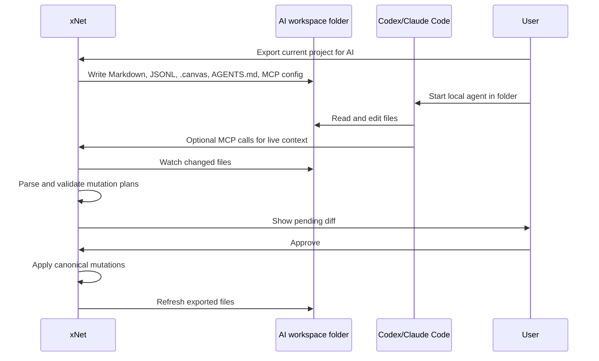

### In-App AI Workflow

The best in-app workflow should feel like:

- A sidebar command center with persistent threads.
- A small inline action menu on selected text, rows, cards, or canvas objects.
- Streaming responses with live tool progress.
- Diffs rendered in native surfaces:
  - Markdown diffs for pages.
  - Table diffs for databases.
  - Overlay previews for canvas moves/cards/edges.
- Approval controls next to the diff.
- Audit trail visible from the changed object.

### Recommended AI Entry Points

Pages:

- "Rewrite selection."
- "Summarize linked context."
- "Turn this into tasks."
- "Create a database from this section."
- "Find contradictions across backlinks."

Databases:

- "Clean up these rows."
- "Create a view for overdue work."
- "Suggest columns."
- "Group these records."
- "Explain why this query is slow."

Canvases:

- "Cluster these cards."
- "Turn this canvas into an execution plan."
- "Add relevant pages to this planning area."
- "Connect dependencies."
- "Create a storyboard/timeline/swimlane."

Workspace:

- "What changed this week?"
- "Find stale plans."
- "Prepare a project brief."
- "Generate a test matrix from requirements."

## Recommended Implementation Roadmap

### Phase 0: Define the AI Surface Contract

- [x] Create `packages/ai` or `packages/plugins/src/ai-surface` for shared resource/tool/plan types.
- [x] Define `AiResource`, `AiTool`, `AiMutationPlan`, `AiChangeSet`, `AiOperation`, `AiValidationResult`, and `AiAuditEvent`.
- [x] Add risk levels and required scopes to every tool.
- [x] Add a shared validator interface with `{ valid, errors, warnings }`.
- [x] Add tests for serialization and plan validation.
- [x] Document the contract in `docs/`.

### Phase 1: Upgrade MCP and Local API to Use the Contract

- [x] Refactor `packages/plugins/src/services/mcp-server.ts` around the shared AI surface service.
- [x] Add resource reads for workspace summary, page Markdown, database schema/views, and canvas viewport.
- [x] Add search and context-pack tools.
- [x] Add plan-only mutation tools before apply tools.
- [x] Add token/output limits and pagination.
- [x] Add Local API endpoints that mirror the MCP service.
- [x] Add integration tests for MCP resources/tools.

### Phase 2: Page Markdown Patch Pipeline

- [x] Add `page_read_markdown` with frontmatter identity and revision.
- [x] Add `page_plan_patch` that accepts full Markdown replacement or structured patch.
- [x] Parse Markdown through existing xNet Markdown specs.
- [x] Validate xNet directives and unsupported constructs.
- [x] Apply through TipTap/Yjs document paths.
- [x] Render Markdown diffs in the UI.
- [x] Add round-trip tests for AI-edited pages with database/page/embed directives.

### Phase 3: AI Workspace Folder Projection

- [x] Add export job for scoped AI workspace folders.
- [x] Generate `AGENTS.md` with xNet editing rules.
- [x] Generate `.mcp.json` for Claude Code and `.codex/config.toml` guidance for Codex.
- [x] Export pages as Markdown.
- [x] Export databases as schema/views/rows JSON files.
- [x] Export canvases as JSON Canvas plus xNet sidecars.
- [x] Write `.xnet/manifest.jsonl` with ids, paths, hashes, and revisions.
- [x] Add watcher that converts changed files into mutation plans.
- [x] Add conflict handling folder and UI review.
- [x] Add tests for export/import id stability and title rename behavior.

### Phase 4: Database AI Tools

- [x] Add database describe/query/sample tools using `NodeQueryDescriptor`.
- [x] Add row mutation plans using NodeStore transactions.
- [x] Add schema/view mutation plans using database Y.Doc helpers.
- [x] Add destructive-change detection.
- [x] Add explain/diagnostic tools for query plans and indexes.
- [x] Add large database pagination and materialized view support.
- [x] Add tests for mixed schema plus row mutations.

### Phase 5: Canvas AI Tools

- [x] Add canvas list/read viewport/read selection tools.
- [x] Add source preview hydration for page/database/media cards.
- [x] Add canvas mutation planner for add/move/connect/group/frame/layout.
- [x] Reuse pure scene operations for deterministic layout tools.
- [x] Add JSON Canvas import/export through the AI surface.
- [x] Add tile/viewport scoping for large canvases.
- [x] Add visual diff overlays for pending canvas changes.
- [x] Add tests for source-backed object identity preservation.

### Phase 6: In-App Agent Runtime

- [x] Decide whether to embed Codex app-server, build a custom orchestrator, or support both.
- [x] Add persistent agent threads and turns.
- [x] Stream tool events and model output into the UI.
- [x] Add approval controls tied to mutation plan ids.
- [x] Add cancellation and steering.
- [x] Add background job support for exports and long-running analysis.
- [x] Add telemetry for latency, accepted changes, rejected changes, and tool failures.

### Phase 7: Provider Router

- [x] Replace simple provider `generate(prompt)` flows with a tool-capable model adapter.
- [x] Support OpenAI-compatible endpoints for OpenRouter, Ollama, LM Studio, vLLM, and LiteLLM.
- [x] Support streaming and structured JSON schema outputs.
- [x] Add model capability metadata: tools, structured outputs, context window, local/cloud, cost, privacy.
- [x] Route low-risk local tasks to local models when available.
- [x] Route high-complexity write plans to stronger configured models.
- [x] Add per-provider usage/cost tracking.

### Phase 8: Hardening and Evals

- [x] Add prompt-injection tests with malicious page content.
- [x] Add stale-export conflict tests.
- [x] Add bulk-delete prevention tests.
- [x] Add large database and large canvas performance tests.
- [x] Add end-to-end local agent workflow test with MCP or file projection.
- [x] Add audit log and rollback tests.
- [x] Add user-facing permission and token rotation flows.

## Validation Checklist

### Functional Validation

- [x] Codex can connect to xNet MCP and read workspace summary.
- [x] Claude Code can connect to xNet MCP through project `.mcp.json`.
- [x] A page can be exported as Markdown, edited by an external agent, parsed, reviewed, and applied.
- [x] A database schema/view change can be proposed and applied without corrupting rows.
- [x] A database row bulk update can be previewed and applied transactionally.
- [x] A canvas viewport can be read by an agent without exporting the whole canvas.
- [x] A canvas layout/change plan can be previewed and applied.
- [x] JSON Canvas export/import preserves xNet source metadata.
- [x] Rejected changes leave the live workspace untouched.
- [x] Applied changes are visible in audit history.

### Performance Validation

- [ ] Workspace summary stays under the target latency budget.
- [ ] Page Markdown export/import handles large docs within existing Markdown IO budgets.
- [ ] Database queries use query descriptors and avoid in-memory full-list scans.
- [x] Large database tools paginate and sample correctly.
- [x] Canvas reads use viewport/tile/spatial scoping.
- [ ] Full workspace export runs as a background incremental job.
- [ ] MCP tool outputs stay below configured token/character limits.

### Safety Validation

- [x] Prompt injection in a page cannot silently escalate permissions.
- [x] Externally fetched web content is marked untrusted in context packs.
- [x] AI cannot apply writes without the required write scope.
- [x] Bulk deletes require explicit deletion markers and approval.
- [x] Raw SQL/admin recovery tools are unavailable in normal sessions.
- [x] Tokens are local-only, scoped, and rotatable.
- [x] Stale exported files produce conflicts instead of overwriting live changes.
- [x] Audit logs include actor, scopes, plan, validation result, and applied change ids.

### UX Validation

- [x] Users can create an AI workspace folder from a page/project/database/canvas.
- [x] Generated `AGENTS.md` explains file conventions clearly.
- [x] Pending file edits show as native diffs in xNet.
- [x] Users can approve, reject, or request revision.
- [ ] In-app AI can operate on the current selection without extra setup.
- [ ] The UI clearly distinguishes read-only answers, proposed changes, and applied changes.

## Example Contracts

### Shared Types

```typescript
export type AiRiskLevel = 'low' | 'medium' | 'high' | 'critical'

export type AiScope =
  | 'workspace.read'
  | 'workspace.search'
  | 'page.read'
  | 'page.propose'
  | 'page.write'
  | 'database.read'
  | 'database.query'
  | 'database.propose'
  | 'database.write.rows'
  | 'database.write.schema'
  | 'canvas.read'
  | 'canvas.propose'
  | 'canvas.write'
  | 'storage.diagnostics'
  | 'storage.recovery'

export type AiValidationResult = {
  valid: boolean
  warnings: string[]
  errors: string[]
}

export type AiOperation<TArgs extends Record<string, unknown> = Record<string, unknown>> = {
  op: string
  args: TArgs
  rationale?: string
}

export type AiChangeSet = {
  targetKind: 'page' | 'database' | 'databaseRows' | 'canvas' | 'storage'
  targetId: string
  baseRevision: string
  operations: AiOperation[]
}

export type AiMutationPlan = {
  id: string
  actor: string
  intent: string
  risk: AiRiskLevel
  requiredScopes: AiScope[]
  changes: AiChangeSet[]
  validation: AiValidationResult
}
```

### MCP Tool Definition Shape

```typescript
export type AiToolDefinition<TInput extends Record<string, unknown>> = {
  name: string
  title: string
  description: string
  risk: AiRiskLevel
  requiredScopes: AiScope[]
  inputSchema: {
    type: 'object'
    properties: Record<keyof TInput, unknown>
    required?: Array<keyof TInput>
  }
}

export const pagePlanPatchTool: AiToolDefinition<{
  pageId: string
  baseRevision: string
  markdown: string
}> = {
  name: 'xnet_page_plan_patch',
  title: 'Plan page Markdown patch',
  description: 'Validate an edited Markdown page and return a mutation plan without applying it.',
  risk: 'medium',
  requiredScopes: ['page.read', 'page.propose'],
  inputSchema: {
    type: 'object',
    properties: {
      pageId: { type: 'string' },
      baseRevision: { type: 'string' },
      markdown: { type: 'string' }
    },
    required: ['pageId', 'baseRevision', 'markdown']
  }
}
```

### Manifest Entry

```json
{
  "path": "Pages/Product Roadmap--page_123.md",
  "kind": "page",
  "id": "page_123",
  "schemaId": "xnet.page",
  "revision": "lamport:42:did:key:z...",
  "sha256": "9e61...",
  "exportedAt": "2026-06-02T12:00:00Z"
}
```

### Claude Code Project MCP Config

```json
{
  "mcpServers": {
    "xnet": {
      "type": "stdio",
      "command": "pnpm",
      "args": ["--filter", "@xnetjs/plugins", "mcp:xnet"],
      "env": {
        "XNET_API_TOKEN": "${XNET_API_TOKEN}"
      }
    }
  }
}
```

### Codex Project Guidance

```toml
# .codex/config.toml
[mcp_servers.xnet]
command = "pnpm"
args = ["--filter", "@xnetjs/plugins", "mcp:xnet"]

[mcp_servers.xnet.env]
XNET_API_TOKEN = "${XNET_API_TOKEN}"
```

The exact command should match the eventual xNet MCP server executable. The important part is that the generated AI workspace can include clear setup files for both Codex and Claude Code.

## Key Tradeoffs

| Approach                 | Performance               | Quality                | Ease of Use                     | Safety                          | Recommendation                    |
| ------------------------ | ------------------------- | ---------------------- | ------------------------------- | ------------------------------- | --------------------------------- |
| MCP-only                 | High for focused reads    | High if tools are rich | Good for agent users            | Good with scopes                | Necessary but insufficient        |
| File projection only     | Good if scoped            | Very high for docs     | Excellent for Codex-style edits | Medium unless plan/apply exists | Build with watcher and validation |
| In-app chatbot only      | Depends on implementation | Medium/high            | Excellent for casual users      | Good if approvals exist         | Do not make this the only path    |
| Raw DB access            | High for diagnostics      | Risky for writes       | Poor for normal users           | Low for writes                  | Read-only diagnostics by default  |
| OpenRouter-first         | Good model flexibility    | Depends on model       | Easy to configure               | Provider dependent              | Use as backend only               |
| Ollama-first             | Good privacy              | Model dependent        | Good if installed               | Strong local privacy            | Support as local backend          |
| Codex app-server sidecar | High for agent lifecycle  | High                   | Strong in-app potential         | Strong if approvals are wired   | Explore for embedded runtime      |

## Open Questions

- Should the AI workspace folder be a real bidirectional sync folder, or should it start as an export/import staging area?
- Should xNet generate one workspace per project/scope, or one global workspace with scoped subfolders?
- How should comments and other non-Markdown-rich page annotations be represented in exported Markdown?
- Should database row deletions be represented through tombstone JSONL records, a separate `deletions.json`, or explicit mutation plans only?
- Should local agents be allowed to run xNet MCP tools directly, or should they primarily edit files and let xNet import changes?
- How much of Codex app-server should xNet embed versus using Codex externally in the generated folder?
- Should low-level storage diagnostics be exposed to all trusted local agents or only development/admin sessions?
- What is the right visual diff for a canvas plan: overlay, side-by-side, temporary branch canvas, or all three?

## Recommended Next Actions

1. **Define the shared AI surface contract.** This unlocks MCP, Local API, file projection, and in-app AI without duplicating logic.
2. **Upgrade MCP to expose page Markdown and workspace search first.** This is the fastest path to useful local-agent integration.
3. **Build a small AI workspace export/import prototype for pages only.** Validate the Obsidian-like workflow before adding databases and canvases.
4. **Add mutation plan review UI.** Do not wait until all surfaces are supported; plan/diff/apply is the core safety primitive.
5. **Extend the prototype to database rows and schema.** Use separate schema/view/rows files and prove conflict handling.
6. **Extend to canvas JSON Canvas export/import with sidecar metadata.** Focus first on layout and source-backed card identity.
7. **Evaluate Codex app-server as an embedded sidecar.** If it fits, use it for threads, approvals, and event streaming rather than reimplementing an agent runtime from scratch.
8. **Add OpenAI-compatible model routing.** Support OpenRouter and Ollama after the tool/resource contract is stable.

## References

### xNet Code and Prior Explorations

- [README.md](../../README.md)
- [NodeStore](../../packages/data/src/store/store.ts)
- [NodeStore types](../../packages/data/src/store/types.ts)
- [Node query descriptors](../../packages/data/src/store/query.ts)
- [SQLite adapter](../../packages/data/src/store/sqlite-adapter.ts)
- [Database doc helpers](../../packages/data/src/database/database-doc.ts)
- [Database query router](../../packages/data/src/database/query-router.ts)
- [React `useNode`](../../packages/react/src/hooks/useNode.ts)
- [React `useDatabase`](../../packages/react/src/hooks/useDatabase.ts)
- [React `useDatabaseDoc`](../../packages/react/src/hooks/useDatabaseDoc.ts)
- [RichTextEditor](../../packages/editor/src/components/RichTextEditor.tsx)
- [xNet Markdown helpers](../../packages/editor/src/extensions/markdown-xnet.ts)
- [Markdown IO tests](../../packages/editor/src/extensions/markdown-io.test.ts)
- [Canvas types](../../packages/canvas/src/types.ts)
- [Canvas store](../../packages/canvas/src/store.ts)
- [Canvas tile schema](../../packages/canvas/src/scene/tile-doc-schema.ts)
- [JSON Canvas interop](../../packages/canvas/src/interop/json-canvas.ts)
- [Canvas scene operations](../../packages/canvas/src/selection/scene-operations.ts)
- [Canvas source bulk operations](../../packages/canvas/src/selection/source-bulk-operations.ts)
- [Local API](../../packages/plugins/src/services/local-api.ts)
- [Electron Local API](../../apps/electron/src/main/local-api.ts)
- [MCP server](../../packages/plugins/src/services/mcp-server.ts)
- [AI providers](../../packages/plugins/src/ai/providers.ts)
- [Plugin contributions](../../packages/plugins/src/contributions.ts)
- [Canvas permissions](../../packages/plugins/src/canvas-permissions.ts)
- [0127 filesystem integration exploration](./0127_[_]_XNET_FILESYSTEM_INTEGRATION_AND_GLOBAL_FILE_NAMESPACE.md)
- [0136 universal canvas exploration](./0136_[x]_EXPANDING_THE_INFINITE_CANVAS_INTO_A_UNIVERSAL_MEDIA_AND_PLANNING_SURFACE.md)
- [0137 pages UI exploration](./0137_[x]_SIGNIFICANTLY_IMPROVE_PAGES_USER_INTERFACE.md)

### External Research

- [Model Context Protocol architecture overview](https://modelcontextprotocol.io/docs/learn/architecture)
- [Model Context Protocol 2025-06-18 architecture specification](https://modelcontextprotocol.io/specification/2025-06-18/architecture)
- [Claude Code MCP documentation](https://code.claude.com/docs/en/mcp)
- [OpenAI Codex manual](https://developers.openai.com/codex/codex-manual.md)
- [Obsidian data storage documentation](https://obsidian.md/help/data-storage)
- [JSON Canvas 1.0 specification](https://jsoncanvas.org/spec/1.0/)
- [Tiptap Markdown documentation](https://tiptap.dev/docs/editor/markdown)
- [OpenRouter API reference](https://openrouter.ai/docs/api/reference/overview)
- [Ollama OpenAI compatibility documentation](https://docs.ollama.com/api/openai-compatibility)
